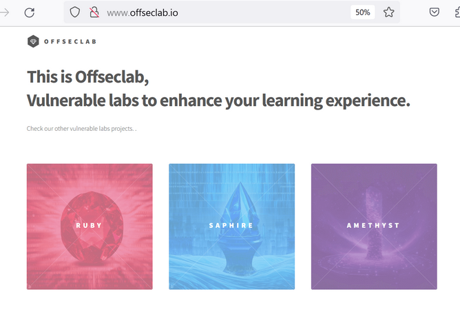
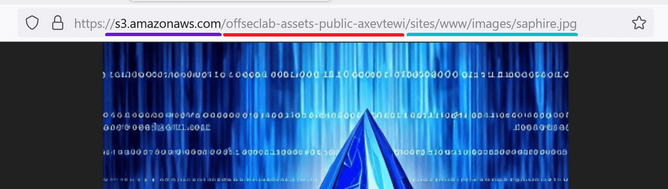
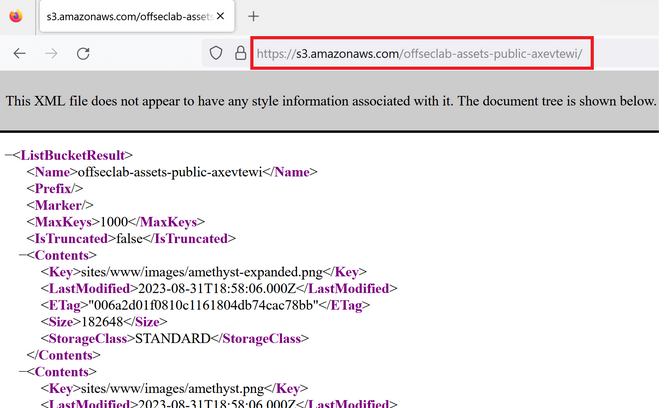
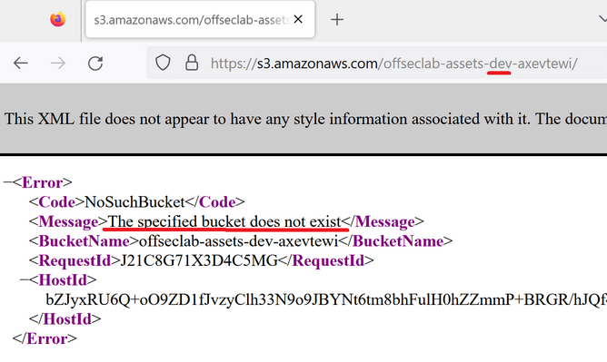
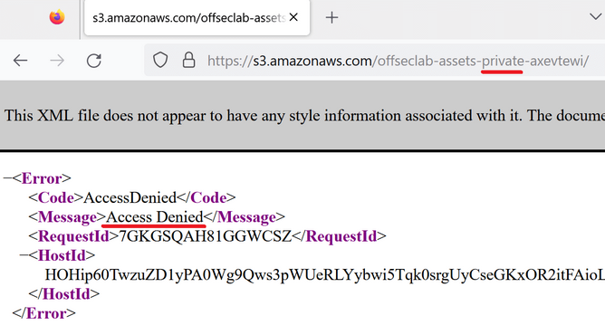

# Enumerating AWS Cloud Infrastructure

## Reconnaissance of Cloud Resources on the Internet

### Domain and Subdomain Reconnaissance

Begin analyzing the target from the attacker's perspective. Currently, all you know about your target is its domain name: `offsec.io`.

There are several things you can learn by analyzing the domain and the public IP address.

Begin by getting the authoritative DNS servers, i.e. the name servers that contain all records for this domain. You'll use the `host` command with the `-t ns` argument to query the nameserver records of the `offsec.io` domain:

```bash
kali@kali:~$ host -t ns offseclab.io
offseclab.io name server ns-1536.awsdns-00.co.uk.
offseclab.io name server ns-512.awsdns-00.net.
offseclab.io name server ns-0.awsdns-00.com.
offseclab.io name server ns-1024.awsdns-00.org.
```

The names are very descriptive, and you can deduce the domain is managed by AWS. You can validate this by running the `whois` command to check the DNS registrar information of those domains. You'll pipe the output to the `grep` command to filter only the line that contains the organization name.

```bash
kali@kali:~$ whois awsdns-00.com | grep "Registrant Organization"
Registrant Organization: Amazon Technologies, Inc.
```

Now, you are sure that the `offsec.io` domain is managed by AWS, very likely using the [Route53](https://aws.amazon.com/route53/) service. This doesn't mean the rest of the infrastructure is also hosted in AWS, so you need to keep digging.

Continue by using the `host` command again to get the public IP address of the website `www.offsec.io`.

```bash
kali@kali:~$ host www.offseclab.io
www.offseclab.io has address 52.70.117.69
```

In the same way as before, you can learn some things by querying the DNS and doing a reverse DNS lookup. You'll use the `host` command again, but this time you'll query the public IP. You'll also use `whois` to learn more details about the public IP address, paying special attention to the OrgName value.

```bash
kali@kali:~$ host 52.70.117.69
69.117.70.52.in-addr.arpa domain name pointer ec2-52-70-117-69.compute-1.amazonaws.com

kali@kali:~$ whois 52.70.117.69 | grep "OrgName"
OrgName:        Amazon Technologies Inc.
```

With the whois lookup, you realize that the public IP belongs to Amazon and with the reverse lookup, you learn two things: it's a resource hosted in AWS and the resource is an Amazon Elastic Compute Cloud (_Amazon EC2_) instance.

> [!NOTE]
> The EC2 instance is a virtual machine in the AWS cloud. EC2 is a common service used to host websites, applications, and other services that require a server.

By doing some recon on the domain, you learned that the resource is hosted in a public CSP. This helps adapt your pentesting methodology and techniques to target the correct cloud environment.

Finally, you can run an automated tool that will retrieve some information you already have but will also perform a dictionary attack to discover more subdomains.

```bash
kali@kali:~$ dnsenum offseclab.io --threads 100
dnsenum VERSION:1.2.6

-----   offseclab.io   -----


Host's addresses:
__________________

offseclab.io.                            60       IN    A        52.70.117.69

Name Servers:
______________

ns-1536.awsdns-00.co.uk.                 0        IN    A        205.251.198.0
ns-0.awsdns-00.com.                      0        IN    A        205.251.192.0
ns-512.awsdns-00.net.                    0        IN    A        205.251.194.0
ns-1024.awsdns-00.org.                   0        IN    A        205.251.196.0


Mail (MX) Servers:
___________________


Trying Zone Transfers and getting Bind Versions:
_________________________________________________

Trying Zone Transfer for offseclab.io on ns-512.awsdns-00.net ...
AXFR record query failed: corrupt packet

Trying Zone Transfer for offseclab.io on ns-1024.awsdns-00.org ...
AXFR record query failed: corrupt packet

Trying Zone Transfer for offseclab.io on ns-0.awsdns-00.com ...
AXFR record query failed: corrupt packet

Trying Zone Transfer for offseclab.io on ns-1536.awsdns-00.co.uk ...
AXFR record query failed: corrupt packet


Brute forcing with /usr/share/dnsenum/dns.txt:
_______________________________________________
mail.offseclab.io.                       60       IN    A        52.70.117.69
www.offseclab.io.                        60       IN    A        52.70.117.69
...
```

The output confirms the name servers and the public IP address you got before. You also discovered some subdomains.

### Service-Specific Domains

Public CSPs often use a specific domain name to address cloud resources. You already found an example of this in the previous section when you did a DNS reverse lookup to the public IP address and, though the response (_ec2-52-70-117-69.compute-1.amazonaws.com_), you discovered the domain `amazonaws.com` and that they are using the EC2 service. That is the custom naming that AWS uses to create the PTR records for their public IPs assigned to EC2 instances.

You can leverage these naming conventions in public cloud resources to enumerate cloud resources.

Opening a web browser and navigating to the target:



By interacting with the site, you can learn that `offseclab.io` is an organization hosting vulnerable lab environments for learning purposes.

By visiting the domain, you're provided with an HTML file. At this point, you're unsure which, or even if, server-side scripting languages are in use. To inspect this further, use the Developer Tools to determine what assets the site loads when you browse it.

Inside the Developer Tools window, you'll navigate to the Network tab. This will show you all the requests that are made when loading the website. Once in the Network tab, you can reload the current page.

You receive a table with several elements that the website loads. This includes stylesheet files, script files, images, etc. The File column identifies the filename of the element, and the Domain column identifies to which domain the browser requests it.

If you scroll through the list, you'll find that the browser requests elements coming from some domains, which include `offseclab.io`, some fonts from external domains, and more interestingly, some images from `s3.amazonaws.com`.

You can click on one of these images to retrieve more details of the request, including the full path of the element.

You can copy the URL or double-click on the row to open the image in another browser tab, then analyze the URL.



By identifying the domain in the URL `s3.amazonaws.com`, you can infer that the images are stored in an AWS S3 bucket.

From the path `offseclab-assets-public-axevtewi/sites/www/images/saphire.jpg`, you can learn that the S3 bucket name is _offsec-assets-public-axevtewi_ and the object keys is `sites/www/images/saphire.jpg`.

The URL format is documented in [Methods for accessing a bucket](https://docs.aws.amazon.com/AmazonS3/latest/userguide/access-bucket-intro.html).

Before diving into enum, quickly check if you can list the content of the bucket. You can test this by browsing the URL of the bucket in the web browser.

You'll remove the object key from the URL, then browse to that URL.



Instead of the _Access Denied_ error, you received an XML response containing all the key objects in the bucket. This is not a good practice in the bucket config. Unfortunately for you, besides the images, there aren't other objects in the bucket that can help you exploit the target further.

Next, analyze the bucket name: _offsec-assets-public-axevtewi_. You can assume there is a naming convention in use that consists of the org name followed by a description of the bucket and a random string. Bucket names must be unique across the region, so the random string might be used to ensure that the name won't be duplicated. It can also help to avoid discovery by enumeration.

Making some assumptions about the naming convention, try browsing for the buckets with the name _offsec-assets-dev_. In the original URL, you'll replace the word "public" with "dev".



The XML response of _offsec-assets-dev_ clearly states that the bucket does not exist.

Try again, this time using the name _offsec-assets-private_.



This time you receive a different message. This code means that the bucket exists, although access is denied because it doesn't have public read permissions. This is a good configuration for the bucket.

This discovery required some creativity and assumptions but shows an example of enumerating cloud resources. The process is also easy to automate by writing a script on your own or searching for an already-built tool like [cloudbrute](https://www.kali.org/tools/cloudbrute/) or [cloud-enum](https://www.kali.org/tools/cloud-enum/).

Just like the S3 service, other cloud services that are designed to be publicly accessible typically use a custom URL or standard convention for displaying resources. This is true for other public CSPs, too.

| AWS              | Azure                 | GCP                    |
| ---------------- | --------------------- | ---------------------- |
| s3.amazonaws.com | web.core.windows.net  | appspot.com            |
| awsapps.com      | file.core.windows.net | storage.googleapis.com |
|                  | blob.core.windows.net |                        |
|                  | azurewebsites.net     |                        |
|                  | cloudapp.net          |                        |

You can leverage these domains to search for resources in multiple clouds based on a keyword related to your target.

```bash
kali@kali:~$ cloud_enum --help
usage: cloud_enum [-h] (-k KEYWORD | -kf KEYFILE) [-m MUTATIONS] [-b BRUTE]
                  [-t THREADS] [-ns NAMESERVER] [-l LOGFILE] [-f FORMAT]
                  [--disable-aws] [--disable-azure] [--disable-gcp] [-qs]

Multi-cloud enumeration utility. All hail OSINT!

options:
  -h, --help            show this help message and exit
  -k KEYWORD, --keyword KEYWORD
                        Keyword. Can use argument multiple times.
  -kf KEYFILE, --keyfile KEYFILE
                        Input file with a single keyword per line.
  -m MUTATIONS, --mutations MUTATIONS
                        Mutations. Default: /usr/lib/cloud-
                        enum/enum_tools/fuzz.txt
  -b BRUTE, --brute BRUTE
                        List to brute-force Azure container names. Default:
                        /usr/lib/cloud-enum/enum_tools/fuzz.txt
  -t THREADS, --threads THREADS
                        Threads for HTTP brute-force. Default = 5
  -ns NAMESERVER, --nameserver NAMESERVER
                        DNS server to use in brute-force.
  -l LOGFILE, --logfile LOGFILE
                        Appends found items to specified file.
  -f FORMAT, --format FORMAT
                        Format for log file (text,json,csv) - default: text
  --disable-aws         Disable Amazon checks.
  --disable-azure       Disable Azure checks.
  --disable-gcp         Disable Google checks.
  -qs, --quickscan      Disable all mutations and second-level scans
```

The cloud-enum tool will search through several public CSPs for resources containing a keyword specified using the `--keyword KEYWORD (-k KEYWORD)` parameter. You can specify multiple keyword arguments, or you can specify a list with the `--keyfile KEYFILE (-kf KEYFILE)` parameter.

You can also use the `--mutations (-m)` option to specify a file to add extra words to the keyword. If you dont specify any file, the `/usr/lib/cloud-enum/enum_tools/fuzz.txt` file is used by default. You can disable this option using the `--quickscan (-qs)` parameter.

First test this using the bucket name you already know. You'll run a quickscan with `cloud_enum -k offseclab-assets-public-axevtewi -qs`. You'll also only perform a check in AWS, disabling other CSPs with the `--disable-azure` and `--disable-gcp` parameters.

```bash
kali@kali:~$ cloud_enum -k offseclab-assets-public-axevtewi --quickscan --disable-azure --disable-gcp

...

Keywords:    offseclab-assets-public-axevtewi
Mutations:   NONE! (Using quickscan)
Brute-list:  /usr/lib/cloud-enum/enum_tools/fuzz.txt

[+] Mutated results: 1 items

++++++++++++++++++++++++++
      amazon checks
++++++++++++++++++++++++++

[+] Checking for S3 buckets
  OPEN S3 BUCKET: http://offseclab-assets-public-axevtewi.s3.amazonaws.com/
      FILES:
      ->http://offseclab-assets-public-axevtewi.s3.amazonaws.com/offseclab-assets-public-axevtewi
      ->http://offseclab-assets-public-axevtewi.s3.amazonaws.com/sites/www/images/amethyst-expanded.png
      ->http://offseclab-assets-public-axevtewi.s3.amazonaws.com/sites/www/images/amethyst.png
      ->http://offseclab-assets-public-axevtewi.s3.amazonaws.com/sites/www/images/logo.svg
      ->http://offseclab-assets-public-axevtewi.s3.amazonaws.com/sites/www/images/pic02.jpg
      ->http://offseclab-assets-public-axevtewi.s3.amazonaws.com/sites/www/images/pic05.jpg
      ->http://offseclab-assets-public-axevtewi.s3.amazonaws.com/sites/www/images/pic13.jpg
      ->http://offseclab-assets-public-axevtewi.s3.amazonaws.com/sites/www/images/ruby-expanded.png
      ->http://offseclab-assets-public-axevtewi.s3.amazonaws.com/sites/www/images/ruby.jpg
      ->http://offseclab-assets-public-axevtewi.s3.amazonaws.com/sites/www/images/saphire-expanded.png
      ->http://offseclab-assets-public-axevtewi.s3.amazonaws.com/sites/www/images/saphire.jpg
                            
                            
 Elapsed time: 00:00:00

[+] Checking for AWS Apps
[*] Brute-forcing a list of 1 possible DNS names
                            
 Elapsed time: 00:00:00


[+] All done, happy hacking!
```

You can confirm the tool works as expected. It found the bucket and also listed the content. Next, you'll try to enumerate with more keywords. Because you are testing a specific naming pattern, you'll benefit from building a custom key file.

There are many ways you could accomplish this. You'll use Bash scripting to run a oneliner for loop that iterates over some keywords and `echo` the keyword, inserting a prefix and a suffix around it. Finally, you'll use the `tee` command to output the result to the console as well as the `/tmp/keyfile.txt` file. As a result, you have the key file with the names of buckets to validate if they exist.

```bash
kali@kali:~$ for key in "public" "private" "dev" "prod" "development" "production"; do echo "offseclab-assets-$key-axevtewi"; done | tee /tmp/keyfile.txt
offseclab-assets-public-axevtewi
offseclab-assets-private-axevtewi
offseclab-assets-dev-axevtewi
offseclab-assets-prod-axevtewi
offseclab-assets-development-axevtewi
offseclab-assets-production-axevtewi
```

Now, you can run cloud_enum again by specifying the key file you generated with the `--keyfile (-kf)` argument.

```bash
kali@kali:~$ cloud_enum -kf /tmp/keyfile.txt -qs --disable-azure --disable-gcp

...

Keywords:    offseclab-assets-public-axevtewi, offseclab-assets-private-axevtewi, offseclab-assets-dev-axevtewi, offseclab-assets-prod-axevtewi, offseclab-assets-development-axevtewi, offseclab-assets-production-axevtewi
Mutations:   NONE! (Using quickscan)
Brute-list:  /usr/lib/cloud-enum/enum_tools/fuzz.txt

[+] Mutated results: 6 items

++++++++++++++++++++++++++
      amazon checks
++++++++++++++++++++++++++

[+] Checking for S3 buckets
  OPEN S3 BUCKET: http://offseclab-assets-public-axevtewi.s3.amazonaws.com/
      FILES:
      ->http://offseclab-assets-public-axevtewi.s3.amazonaws.com/offseclab-assets-public-axevtewi
      ->http://offseclab-assets-public-axevtewi.s3.amazonaws.com/sites/www/images/amethyst-expanded.png
      ->http://offseclab-assets-public-axevtewi.s3.amazonaws.com/sites/www/images/amethyst.png
      ->http://offseclab-assets-public-axevtewi.s3.amazonaws.com/sites/www/images/logo.svg
      ->http://offseclab-assets-public-axevtewi.s3.amazonaws.com/sites/www/images/pic02.jpg
      ->http://offseclab-assets-public-axevtewi.s3.amazonaws.com/sites/www/images/pic05.jpg
      ->http://offseclab-assets-public-axevtewi.s3.amazonaws.com/sites/www/images/pic13.jpg
      ->http://offseclab-assets-public-axevtewi.s3.amazonaws.com/sites/www/images/ruby-expanded.png
      ->http://offseclab-assets-public-axevtewi.s3.amazonaws.com/sites/www/images/ruby.jpg
      ->http://offseclab-assets-public-axevtewi.s3.amazonaws.com/sites/www/images/saphire-expanded.png
      ->http://offseclab-assets-public-axevtewi.s3.amazonaws.com/sites/www/images/saphire.jpg
  Protected S3 Bucket: http://offseclab-assets-private-axevtewi.s3.amazonaws.com/
                            
 Elapsed time: 00:00:06

[+] Checking for AWS Apps
[*] Brute-forcing a list of 6 possible DNS names
                            
 Elapsed time: 00:00:00


[+] All done, happy hacking!
```

From the output, you can confirm there is another bucket, but it's protected, meaning that it's not publicly readable.

You could also attempt to validate if there are other buckets using other information you found during the recon phase. For example, it could be buckets that include the name of the offseclab projects like _offseclab-assets-ruby-axevtewi_ or _offseclab-ruby-axevtewi_.


