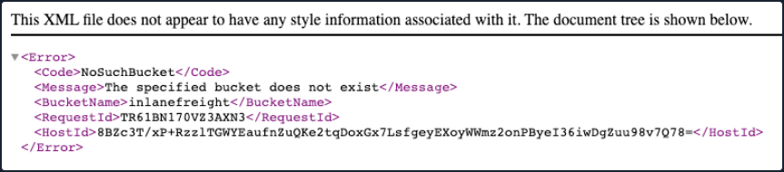
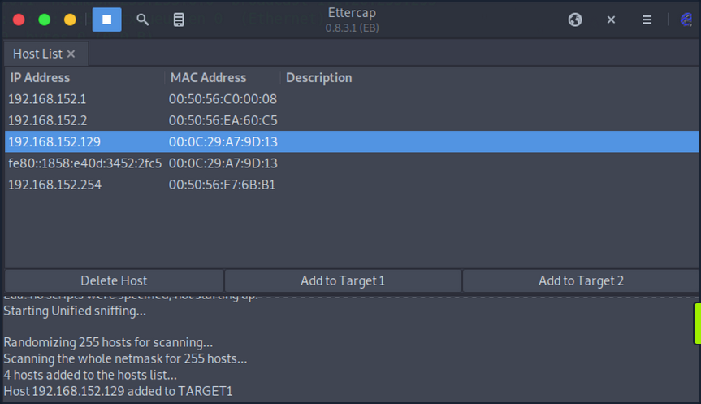
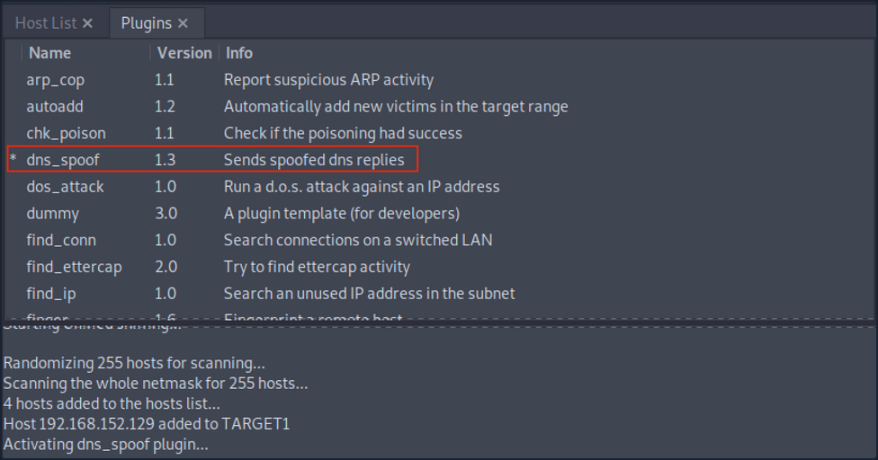
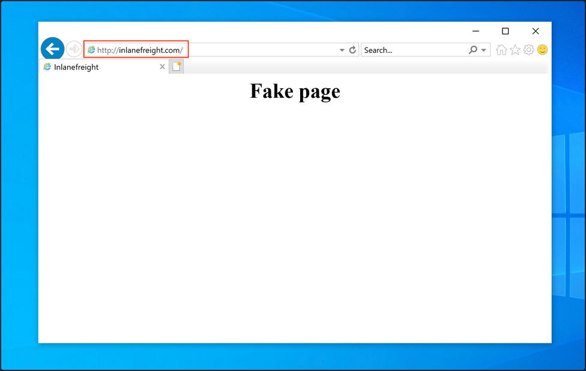

# Attacking DNS

## Enumeration

DNS holds interesting information for an organization.

The Nmap ```-sC``` and ```-sV``` options can be used to perform initial enumeration against the target DNS server.

```bash
d41y@htb[/htb]# nmap -p53 -Pn -sV -sC 10.10.110.213

Starting Nmap 7.80 ( https://nmap.org ) at 2020-10-29 03:47 EDT
Nmap scan report for 10.10.110.213
Host is up (0.017s latency).

PORT    STATE  SERVICE     VERSION
53/tcp  open   domain      ISC BIND 9.11.3-1ubuntu1.2 (Ubuntu Linux)
```

## Protocol Specific Attacks

### Zone Transfer

A DNS zone is a portion of the DNS namespace that a specific organization or administrator manages. Since DNS compromises multiple DNS zones, DNS servers utilize DNS zone transfers to copy a portion of their database to another DNS server. Unless a DNS server is configured correctly, anyone can ask a DNS server for a copy of its zone information since DNS zone transfers do not require any authentication. In addition, the DNS service usually runs on a UDP port; however, when performing DNS zone transfer, it uses a TCP port for reliable data transmission.

An attacker could leverage this DNS zone transfer vulnerability to learn more about the target organization's DNS namespace, increasing the attack surface. For exploitation, you can use the ```dig``` utility with DNS query type ```AXFR``` option do dump the entire DNS namespaces from a vulnerable DNS server.

```bash
d41y@htb[/htb]# dig AXFR @ns1.inlanefreight.htb inlanefreight.htb

; <<>> DiG 9.11.5-P1-1-Debian <<>> axfr inlanefrieght.htb @10.129.110.213
;; global options: +cmd
inlanefrieght.htb.         604800  IN      SOA     localhost. root.localhost. 2 604800 86400 2419200 604800
inlanefrieght.htb.         604800  IN      AAAA    ::1
inlanefrieght.htb.         604800  IN      NS      localhost.
inlanefrieght.htb.         604800  IN      A       10.129.110.22
admin.inlanefrieght.htb.   604800  IN      A       10.129.110.21
hr.inlanefrieght.htb.      604800  IN      A       10.129.110.25
support.inlanefrieght.htb. 604800  IN      A       10.129.110.28
inlanefrieght.htb.         604800  IN      SOA     localhost. root.localhost. 2 604800 86400 2419200 604800
;; Query time: 28 msec
;; SERVER: 10.129.110.213#53(10.129.110.213)
;; WHEN: Mon Oct 11 17:20:13 EDT 2020
;; XFR size: 8 records (messages 1, bytes 289)
```

Tools like [Fierce](https://github.com/mschwager/fierce) can also be used to enumerate all DNS servers of the root domain and scan for a DNS zone transfer.

```bash
d41y@htb[/htb]# fierce --domain zonetransfer.me

NS: nsztm2.digi.ninja. nsztm1.digi.ninja.
SOA: nsztm1.digi.ninja. (81.4.108.41)
Zone: success
{<DNS name @>: '@ 7200 IN SOA nsztm1.digi.ninja. robin.digi.ninja. 2019100801 '
               '172800 900 1209600 3600\n'
               '@ 300 IN HINFO "Casio fx-700G" "Windows XP"\n'
               '@ 301 IN TXT '
               '"google-site-verification=tyP28J7JAUHA9fw2sHXMgcCC0I6XBmmoVi04VlMewxA"\n'
               '@ 7200 IN MX 0 ASPMX.L.GOOGLE.COM.\n'
               '@ 7200 IN MX 10 ALT1.ASPMX.L.GOOGLE.COM.\n'
               '@ 7200 IN MX 10 ALT2.ASPMX.L.GOOGLE.COM.\n'
               '@ 7200 IN MX 20 ASPMX2.GOOGLEMAIL.COM.\n'
               '@ 7200 IN MX 20 ASPMX3.GOOGLEMAIL.COM.\n'
               '@ 7200 IN MX 20 ASPMX4.GOOGLEMAIL.COM.\n'
               '@ 7200 IN MX 20 ASPMX5.GOOGLEMAIL.COM.\n'
               '@ 7200 IN A 5.196.105.14\n'
               '@ 7200 IN NS nsztm1.digi.ninja.\n'
               '@ 7200 IN NS nsztm2.digi.ninja.',
 <DNS name _acme-challenge>: '_acme-challenge 301 IN TXT '
                             '"6Oa05hbUJ9xSsvYy7pApQvwCUSSGgxvrbdizjePEsZI"',
 <DNS name _sip._tcp>: '_sip._tcp 14000 IN SRV 0 0 5060 www',
 <DNS name 14.105.196.5.IN-ADDR.ARPA>: '14.105.196.5.IN-ADDR.ARPA 7200 IN PTR '
                                       'www',
 <DNS name asfdbauthdns>: 'asfdbauthdns 7900 IN AFSDB 1 asfdbbox',
 <DNS name asfdbbox>: 'asfdbbox 7200 IN A 127.0.0.1',
 <DNS name asfdbvolume>: 'asfdbvolume 7800 IN AFSDB 1 asfdbbox',
 <DNS name canberra-office>: 'canberra-office 7200 IN A 202.14.81.230',
 <DNS name cmdexec>: 'cmdexec 300 IN TXT "; ls"',
 <DNS name contact>: 'contact 2592000 IN TXT "Remember to call or email Pippa '
                     'on +44 123 4567890 or pippa@zonetransfer.me when making '
                     'DNS changes"',
 <DNS name dc-office>: 'dc-office 7200 IN A 143.228.181.132',
 <DNS name deadbeef>: 'deadbeef 7201 IN AAAA dead:beaf::',
 <DNS name dr>: 'dr 300 IN LOC 53 20 56.558 N 1 38 33.526 W 0.00m',
 <DNS name DZC>: 'DZC 7200 IN TXT "AbCdEfG"',
 <DNS name email>: 'email 2222 IN NAPTR 1 1 "P" "E2U+email" "" '
                   'email.zonetransfer.me\n'
                   'email 7200 IN A 74.125.206.26',
 <DNS name Hello>: 'Hello 7200 IN TXT "Hi to Josh and all his class"',
 <DNS name home>: 'home 7200 IN A 127.0.0.1',
 <DNS name Info>: 'Info 7200 IN TXT "ZoneTransfer.me service provided by Robin '
                  'Wood - robin@digi.ninja. See '
                  'http://digi.ninja/projects/zonetransferme.php for more '
                  'information."',
 <DNS name internal>: 'internal 300 IN NS intns1\ninternal 300 IN NS intns2',
 <DNS name intns1>: 'intns1 300 IN A 81.4.108.41',
 <DNS name intns2>: 'intns2 300 IN A 167.88.42.94',
 <DNS name office>: 'office 7200 IN A 4.23.39.254',
 <DNS name ipv6actnow.org>: 'ipv6actnow.org 7200 IN AAAA '
                            '2001:67c:2e8:11::c100:1332',
...SNIP...
```

### Takeovers

Domain takeover is registering a non-existent domain name to gain control over another domain. If attackers find an expired domain, they can claim that domain to perform further attacks such as hosting malicious content on a website or sending a phishing email leveraging the claimed domain.

Domain takeover is also possible with subdomains called subdomain takeover. A DNS's canonical name (_CNAME_) record is used to map different domains to a parent domain. Many organizations use third-party services like AWS, GitHub, Akamai, Fastly, and other content delivery networks (_CDNs_) to host their content. In this case, they usually create a subdomain and make it point to those services. For example,

```
sub.target.com.   60   IN   CNAME   anotherdomain.com
```

The domain name (_sub.target.com_) uses a CNAME record to another domain (_anotherdomain.com_). Suppose the anotherdomain.com expires and is available for anyone to claim the domain since the target.com's DNS server has the CNAME record. In that case, anyone who registers anotherdomain.com will have complete control over (_sub.target.com_) until the DNS record is updated.

Take a look at [can-i-take-over-xyz](https://github.com/EdOverflow/can-i-take-over-xyz). It shows whether the target services are vulnerable to a subdomain takeover and provides guidelines on assessing the vulnerability.

### Subdomain Enumeration

Before performing a subdomain takeover, you should enumerate subdomains for a target domain using tools like [Subfinder](https://github.com/projectdiscovery/subfinder). This tool can scrape subdomains from open sources like [DNSdumpster](https://dnsdumpster.com/). Other tools like [Sublist3r](https://github.com/aboul3la/Sublist3r) can also be used to brute-force subdomains by supplying a pre-generated wordlist:

```bash
d41y@htb[/htb]# ./subfinder -d inlanefreight.com -v       
                                                                       
        _     __ _         _                                           
____  _| |__ / _(_)_ _  __| |___ _ _          
(_-< || | '_ \  _| | ' \/ _  / -_) '_|                 
/__/\_,_|_.__/_| |_|_||_\__,_\___|_| v2.4.5                                                                                                                                                                                                                                                 
                projectdiscovery.io                    
                                                                       
[WRN] Use with caution. You are responsible for your actions
[WRN] Developers assume no liability and are not responsible for any misuse or damage.
[WRN] By using subfinder, you also agree to the terms of the APIs used. 
                                   
[INF] Enumerating subdomains for inlanefreight.com
[alienvault] www.inlanefreight.com
[dnsdumpster] ns1.inlanefreight.com
[dnsdumpster] ns2.inlanefreight.com
...snip...
[bufferover] Source took 2.193235338s for enumeration
ns2.inlanefreight.com
www.inlanefreight.com
ns1.inlanefreight.com
support.inlanefreight.com
[INF] Found 4 subdomains for inlanefreight.com in 20 seconds 11 milliseconds
```

An excellent alternative is a tool called [Subbrute](https://github.com/TheRook/subbrute). This tool allows you to use self-defined resolvers and perform pure DNS brute-forcing attacks during internal pentests on hosts that do not have Internet access.

```bash
d41y@htb[/htb]$ git clone https://github.com/TheRook/subbrute.git >> /dev/null 2>&1
d41y@htb[/htb]$ cd subbrute
d41y@htb[/htb]$ echo "ns1.inlanefreight.com" > ./resolvers.txt
d41y@htb[/htb]$ ./subbrute.py inlanefreight.com -s ./names.txt -r ./resolvers.txt

Warning: Fewer than 16 resolvers per process, consider adding more nameservers to resolvers.txt.
inlanefreight.com
ns2.inlanefreight.com
www.inlanefreight.com
ms1.inlanefreight.com
support.inlanefreight.com

<SNIP>
```

Sometimes internal physical configurations are poorly secured, which you can exploit to upload your tools from a USB stick. Another scenario would be that you have reached an internal host through pivoting and want to work from there. Of course, there are other alternatives, but it does not hurt to know alternative ways and possibilities.

The tool has found four subdomains associated with ```inlanefreight.com```. Using the ```nslookup``` or ```host``` command, you can enumerate the CNAME records for those subdomains.

```bash
d41y@htb[/htb]# host support.inlanefreight.com

support.inlanefreight.com is an alias for inlanefreight.s3.amazonaws.com
```

The ```support``` subdomain has an alias record poiting to an AWS S3 bucket. However, the URL ```https://support.inlanefreight.com``` shows a NoSuchBucket error indicating that the subdomain is potentially vulnerable to a subdomain takeover. Now, you can take over the subdomain by creating an AWS S3 bucket with the same subdomain name.



### DNS Spoofing

... is also referred to as DNS Cache Poisoning. This attack involves altering legitimate DNS records with false information so that they can be used to redirect online traffic to a fraudulent website. Example attack paths for the DNS Cache Poisoning are as follows:

- An attacker could intercept the communication between a user and a DNS server to route the user to a fraudulent destination instead of a legitimate one by performing a Man-in-the-Middle attack.
- Exploiting a vulnerability found in a DNS server could yield control over the server by an attacker to modify the DNS records.

#### Local DNS Cache Poisoning

From a local network perspective, an attacker can also perform DNS Cache Poisoning using MITM tools like [Ettercap](https://www.ettercap-project.org/) or [Bettercap](https://www.bettercap.org/).

To exploit the DNS cache poisoning via Ettercap, you should first edit the ```/etc/ettercap/etter.dns``` file to map the target domain name that they want to spoof and the attacker's IP address that they want to redirect a user to:

```bash
d41y@htb[/htb]# cat /etc/ettercap/etter.dns

inlanefreight.com      A   192.168.225.110
*.inlanefreight.com    A   192.168.225.110
```

Next, start the Ettercap tool and scan for live hosts within the network by navigating to ```Hosts > Scan for Hosts```. Once completed, add the target IP address to Target1 and add a default gateway IP to Target2.



Activate ```dns_spoof``` attack by navigating to ```Plugins > Manage Plugins```. This sends the target machine with fake DNS responses that will resolve inlanefreight.com to IP address 192.168.225.110.



After a successful DNS spoof attack, if a victim user coming from the target machine 192.168.152.129 visits the inlanefreight.com domain on a web browser, they will be redirected to a fake page that is hosted on IP address 192.168.225.110:



In addition, a ping coming from the target IP address 192.168.152.129 to inlanefreight.com should be resolved to 192.168.225.110 as well:

```
C:\>ping inlanefreight.com

Pinging inlanefreight.com [192.168.225.110] with 32 bytes of data:
Reply from 192.168.225.110: bytes=32 time<1ms TTL=64
Reply from 192.168.225.110: bytes=32 time<1ms TTL=64
Reply from 192.168.225.110: bytes=32 time<1ms TTL=64
Reply from 192.168.225.110: bytes=32 time<1ms TTL=64

Ping statistics for 192.168.225.110:
    Packets: Sent = 4, Received = 4, Lost = 0 (0% loss),
Approximate round trip times in milli-seconds:
    Minimum = 0ms, Maximum = 0ms, Average = 0ms
```

## Latest Vulnerabilities

### NO CVE

You can find thousands of subdomains and domains on the web. Often they point to no longer active third-party service providers such as AWS, GitHub, and others and, at best, display an error message as confirmation of a deactivated third-party service. Large companies and corporations are also affected time and again. Companies often cancel services from third-party providers but forget to delete the associated DNS records. This is because no additional costs are incurred for a DNS entry. Many well-known bug bounty platforms already explicitly lists Subdomain Takeover as a bounty category.

#### Concept of the Attack

One of the biggest dangers of a subdomain takeover is that a phishing campaign can be launched that is considered part of the official domain of the target company. For example, customers would look at the link and see that the domain ```custom-drive.inlanefreight.com``` is behind the official domain ```inlanefreight.com``` and trust it as a customer. However, the customers do not know that this page has been mirrored or created by an attacker to provoke a login by the company's customers, for example.

Therefore, if an attacker finds a CNAME record in the company's DNS records that points to a subdomain that no longer exists and returns an HTTP 404 error, this subdomain can most likely be taken over by you through the use of the third party provider. A subdomain takeover occurs when a subdomain points to another domain using the CNAME record that does not currently exist. When an attacker registers this nonexistant domain, the subdomain points to the domain registration by you. By making a single DNS change, you make yourself the owner of that particular subdomain, and after that, you can manage the subdomain as you choose.

What happens here is that the existing subdomain no longer points to a third-party provider and is therefore no longer occupied by this provider. Pretty much anyone can register this subdomain as their own. Visiting this subdomain and the presence of the CNAME record in the company's DNS leads, in most cases, to things working es expected. However, the design and function of this subdomain are in the hands of the attacker.