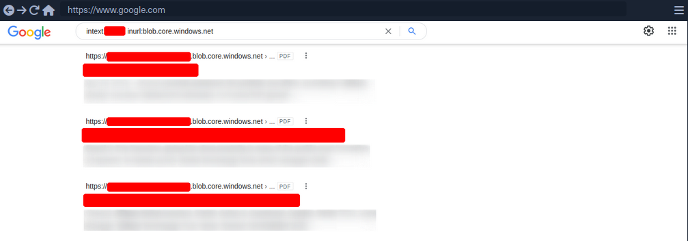
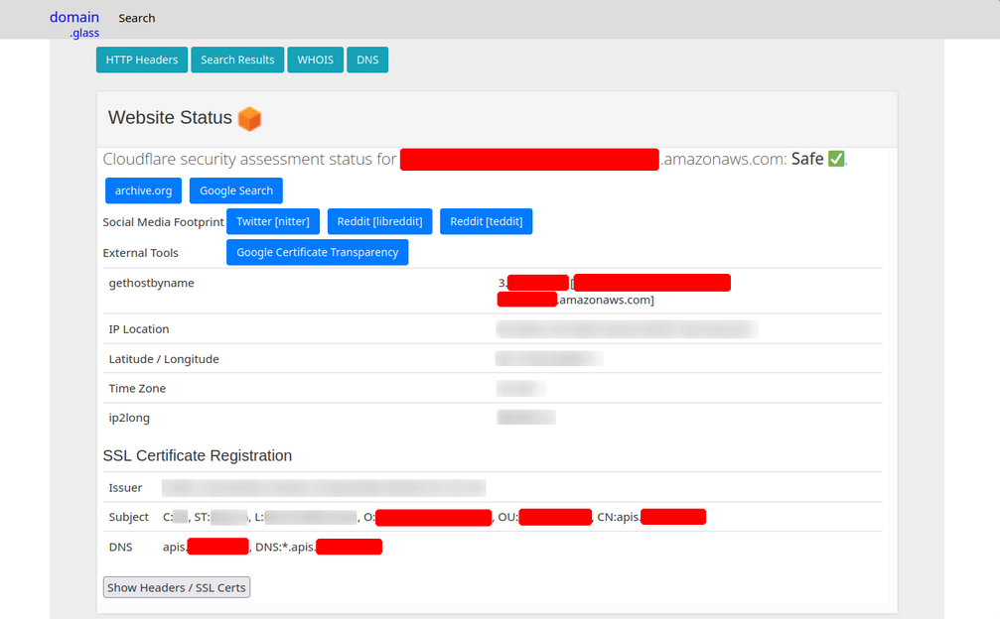
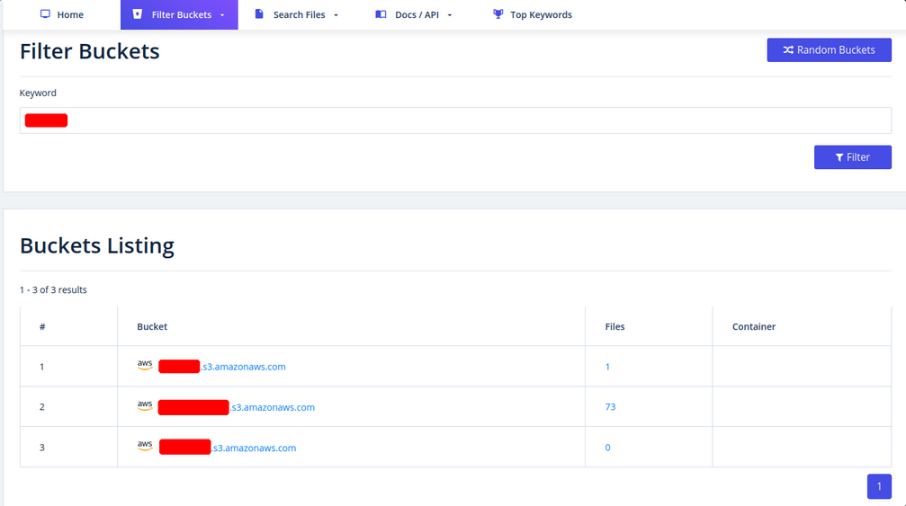
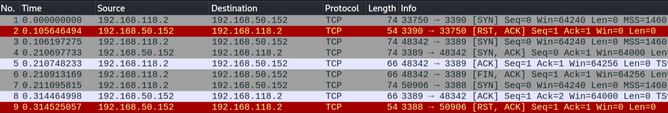
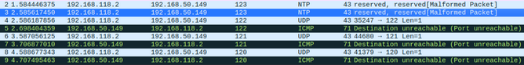

# Footprinting

## Methodology

The whole enumeration process can be divided into three different levels:

- Infrastructure-based enumeration
- Host-based enumeration
- OS-based enumeration

Which can be separated into layers:

| Level | Layer | Description | Information Categories |
| ----- | ----- | ----------- | ---------------------- |
| Infrastructure | Internet Presence | identification of internet presence and externally accessible infrastructure | Domains, Subdomains, vHosts, Netblocks, IP Addresses, Cloud Instances, Security Measures |
| | Gateway | identify the possible measures to protect the company's external and internal infrastructure | Firewall, DMZ, IPS/IDS, Proxies, NAC, Network Segmentation, VPN, Cloudflare |
| Host | Accessible Services | identify accessible interfaces and services that are hosted externally or internally | Service Type, Functionality, Configuration, Port, Version, Interface |
| | Processes | identify the internal processes, sources, and destinations associated with the service | PID, Processed Data, Tasks, Source, Destination |
| OS | Privileges | identification of the internal permissions and privileges to the accessible services | Groups, Users, Permissions, Restrictions, Environment |
| | OS Setup | identification of the internal components and systems setup | OS Type, Patch Level, Network Config, OS Environment, Configuration Files, sensitive private Files |

### Layers

#### 1 - Internet Presence

The first layer you have to pass. Focus is on finding the targets you can investigate. If the scope in the contract allows you to look for additional hosts, this layer is even more critical than for fixed targets only. In this layer, you use different techniques to find domains, subdomains, netblocks, and many other components and information that present the presence of the company and its infrastructure on the internet.

_The goal of this layer is to identify all possible target systems and interfaces that can be tested._

#### 2 - Gateway

Here you try to understand the interface of the reachable target, how it is protected, and where it is located in the network.

_The goal is to understand what you are dealing with and what you have to watch out for._

#### 3 - Accessible Services

In the case of accessible services, you examine each destination for all the services it offers. Each of these services has a specific purpose that has been installed for a particular reason by the administrator. Each service has certain functions, which therefore also lead to specific results.

_This layer aims to understand the reason and functionality of the target sytem and gain the necessary knowledge to communicate with it and exploit it for your purposes effectively._

#### 4 - Processes

Every time a command of function is executed, data is processed, whether entered by the user or generated by the system. This starts a process that has to perform specific tasks, and such tasks have at least one source and one target.

_The goal here is to understand these factors and identify the dependencies between them._

#### 5 - Privileges

Each service runs through a specific user in a particular group with permissions and privileges defined by the administrator or the system. These privileges often provide you with functions that administrators overlook. This often happens in AD infrastructures and many other case-specific administration environments and servers where users are responsible for multiple administration areas.

_It is crucial to identify these and understand what is and is not possible with these privileges._

#### 6 - OS Setup

Here you collect information about the actual OS and its setup using internal access. This gives you a good overview of the internal security of the systems and reflects the skills and capabilities of the company's administrative teams.

_The goal here is to see how the administrators manage the systems and what sensitive internal information you can glean from them._

## Infrastructure-Based Enumeration

### Domain Information

... is a core component of any pentest, and it is not just about the subdomains but about the entire presence on the internet. Therefore, you gather information and try to understand the company's functionality and which technologies and structures are necessary for services to be offered successfully and efficiently.

This type of information is gathered passively without direct and active scans.

However, when passively gathering information, you can use third-party services to understand the company better. The first thing you should do is scrutinize the company's main website. Then, you should read through the texts, keeping in mind what technologies and structures are needed for these services.

Once you have a basic understanding of the company and its services, you can get a first impression of its presence on the internet.

#### Certificate Transparency

The first point of presence on the internet may be the SSL certificate from the company's main website that you can examine. Often, such a certificate includes more than just a subdomain, and this means that the certificate is used for several domains, and these are most likely still active.


Another source to find more subdomains is [crt.sh](https://crt.sh/). This source is Certificate Transparency logs. Certificate Transparency is a process that is intended to enable the verification of issued digital certificates for encrypted internet connections. The standard (_RFC 6962_) provides for the logging of all digital certificates issued by a certificate authority in audit-proof logs. This is intended to enable the detection of false or maliciously issued certificates for a domain. SSL certificate providers like Let's Encrypt share this with the web interface of crt.sh, which stores the new entries in the database to be accessed later.


You can also output the results in JSON format:

```bash
d41y@htb[/htb]$ curl -s https://crt.sh/\?q\=inlanefreight.com\&output\=json | jq .

[
  {
    "issuer_ca_id": 23451835427,
    "issuer_name": "C=US, O=Let's Encrypt, CN=R3",
    "common_name": "matomo.inlanefreight.com",
    "name_value": "matomo.inlanefreight.com",
    "id": 50815783237226155,
    "entry_timestamp": "2021-08-21T06:00:17.173",
    "not_before": "2021-08-21T05:00:16",
    "not_after": "2021-11-19T05:00:15",
    "serial_number": "03abe9017d6de5eda90"
  },
  {
    "issuer_ca_id": 6864563267,
    "issuer_name": "C=US, O=Let's Encrypt, CN=R3",
    "common_name": "matomo.inlanefreight.com",
    "name_value": "matomo.inlanefreight.com",
    "id": 5081529377,
    "entry_timestamp": "2021-08-21T06:00:16.932",
    "not_before": "2021-08-21T05:00:16",
    "not_after": "2021-11-19T05:00:15",
    "serial_number": "03abe90104e271c98a90"
  },
  {
    "issuer_ca_id": 113123452,
    "issuer_name": "C=US, O=Let's Encrypt, CN=R3",
    "common_name": "smartfactory.inlanefreight.com",
    "name_value": "smartfactory.inlanefreight.com",
    "id": 4941235512141012357,
    "entry_timestamp": "2021-07-27T00:32:48.071",
    "not_before": "2021-07-26T23:32:47",
    "not_after": "2021-10-24T23:32:45",
    "serial_number": "044bac5fcc4d59329ecbbe9043dd9d5d0878"
  },
  { ... SNIP ...
```

If needed, you can also have them filtered by the unique subdomains:

```bash
d41y@htb[/htb]$ curl -s https://crt.sh/\?q\=inlanefreight.com\&output\=json | jq . | grep name | cut -d":" -f2 | grep -v "CN=" | cut -d'"' -f2 | awk '{gsub(/\\n/,"\n");}1;' | sort -u

account.ttn.inlanefreight.com
blog.inlanefreight.com
bots.inlanefreight.com
console.ttn.inlanefreight.com
ct.inlanefreight.com
data.ttn.inlanefreight.com
*.inlanefreight.com
inlanefreight.com
integrations.ttn.inlanefreight.com
iot.inlanefreight.com
mails.inlanefreight.com
marina.inlanefreight.com
marina-live.inlanefreight.com
matomo.inlanefreight.com
next.inlanefreight.com
noc.ttn.inlanefreight.com
preview.inlanefreight.com
shop.inlanefreight.com
smartfactory.inlanefreight.com
ttn.inlanefreight.com
vx.inlanefreight.com
www.inlanefreight.com
```

Next, you can identify the hosts directly accessible from the internet and not hosted by third-party providers. This is because you are not allowed to test the hosts without the permission of third-party providers.

#### Company Hosted Servers

```bash
d41y@htb[/htb]$ for i in $(cat subdomainlist);do host $i | grep "has address" | grep inlanefreight.com | cut -d" " -f1,4;done

blog.inlanefreight.com 10.129.24.93
inlanefreight.com 10.129.27.33
matomo.inlanefreight.com 10.129.127.22
www.inlanefreight.com 10.129.127.33
s3-website-us-west-2.amazonaws.com 10.129.95.250
```

Once you see which hosts can be investigated further, you can generate a list of IP addresses and run them through Shodan.

#### Shodan - IP List

```bash
d41y@htb[/htb]$ for i in $(cat subdomainlist);do host $i | grep "has address" | grep inlanefreight.com | cut -d" " -f4 >> ip-addresses.txt;done
d41y@htb[/htb]$ for i in $(cat ip-addresses.txt);do shodan host $i;done

10.129.24.93
City:                    Berlin
Country:                 Germany
Organization:            InlaneFreight
Updated:                 2021-09-01T09:02:11.370085
Number of open ports:    2

Ports:
     80/tcp nginx 
    443/tcp nginx 
	
10.129.27.33
City:                    Berlin
Country:                 Germany
Organization:            InlaneFreight
Updated:                 2021-08-30T22:25:31.572717
Number of open ports:    3

Ports:
     22/tcp OpenSSH (7.6p1 Ubuntu-4ubuntu0.3)
     80/tcp nginx 
    443/tcp nginx 
        |-- SSL Versions: -SSLv2, -SSLv3, -TLSv1, -TLSv1.1, -TLSv1.3, TLSv1.2
        |-- Diffie-Hellman Parameters:
                Bits:          2048
                Generator:     2
				
10.129.27.22
City:                    Berlin
Country:                 Germany
Organization:            InlaneFreight
Updated:                 2021-09-01T15:39:55.446281
Number of open ports:    8

Ports:
     25/tcp  
        |-- SSL Versions: -SSLv2, -SSLv3, -TLSv1, -TLSv1.1, TLSv1.2, TLSv1.3
     53/tcp  
     53/udp  
     80/tcp Apache httpd 
     81/tcp Apache httpd 
    110/tcp  
        |-- SSL Versions: -SSLv2, -SSLv3, -TLSv1, -TLSv1.1, TLSv1.2
    111/tcp  
    443/tcp Apache httpd 
        |-- SSL Versions: -SSLv2, -SSLv3, -TLSv1, -TLSv1.1, TLSv1.2, TLSv1.3
        |-- Diffie-Hellman Parameters:
                Bits:          2048
                Generator:     2
                Fingerprint:   RFC3526/Oakley Group 14
    444/tcp  
		
10.129.27.33
City:                    Berlin
Country:                 Germany
Organization:            InlaneFreight
Updated:                 2021-08-30T22:25:31.572717
Number of open ports:    3

Ports:
     22/tcp OpenSSH (7.6p1 Ubuntu-4ubuntu0.3)
     80/tcp nginx 
    443/tcp nginx 
        |-- SSL Versions: -SSLv2, -SSLv3, -TLSv1, -TLSv1.1, -TLSv1.3, TLSv1.2
        |-- Diffie-Hellman Parameters:
                Bits:          2048
                Generator:     2
```

Now, you can display all the available DNS records where you might find more hosts.

#### DNS Records

```bash
d41y@htb[/htb]$ dig any inlanefreight.com

; <<>> DiG 9.16.1-Ubuntu <<>> any inlanefreight.com
;; global options: +cmd
;; Got answer:
;; ->>HEADER<<- opcode: QUERY, status: NOERROR, id: 52058
;; flags: qr rd ra; QUERY: 1, ANSWER: 17, AUTHORITY: 0, ADDITIONAL: 1

;; OPT PSEUDOSECTION:
; EDNS: version: 0, flags:; udp: 65494
;; QUESTION SECTION:
;inlanefreight.com.             IN      ANY

;; ANSWER SECTION:
inlanefreight.com.      300     IN      A       10.129.27.33
inlanefreight.com.      300     IN      A       10.129.95.250
inlanefreight.com.      3600    IN      MX      1 aspmx.l.google.com.
inlanefreight.com.      3600    IN      MX      10 aspmx2.googlemail.com.
inlanefreight.com.      3600    IN      MX      10 aspmx3.googlemail.com.
inlanefreight.com.      3600    IN      MX      5 alt1.aspmx.l.google.com.
inlanefreight.com.      3600    IN      MX      5 alt2.aspmx.l.google.com.
inlanefreight.com.      21600   IN      NS      ns.inwx.net.
inlanefreight.com.      21600   IN      NS      ns2.inwx.net.
inlanefreight.com.      21600   IN      NS      ns3.inwx.eu.
inlanefreight.com.      3600    IN      TXT     "MS=ms92346782372"
inlanefreight.com.      21600   IN      TXT     "atlassian-domain-verification=IJdXMt1rKCy68JFszSdCKVpwPN"
inlanefreight.com.      3600    IN      TXT     "google-site-verification=O7zV5-xFh_jn7JQ31"
inlanefreight.com.      300     IN      TXT     "google-site-verification=bow47-er9LdgoUeah"
inlanefreight.com.      3600    IN      TXT     "google-site-verification=gZsCG-BINLopf4hr2"
inlanefreight.com.      3600    IN      TXT     "logmein-verification-code=87123gff5a479e-61d4325gddkbvc1-b2bnfghfsed1-3c789427sdjirew63fc"
inlanefreight.com.      300     IN      TXT     "v=spf1 include:mailgun.org include:_spf.google.com include:spf.protection.outlook.com include:_spf.atlassian.net ip4:10.129.24.8 ip4:10.129.27.2 ip4:10.72.82.106 ~all"
inlanefreight.com.      21600   IN      SOA     ns.inwx.net. hostmaster.inwx.net. 2021072600 10800 3600 604800 3600

;; Query time: 332 msec
;; SERVER: 127.0.0.53#53(127.0.0.53)
;; WHEN: Mi Sep 01 18:27:22 CEST 2021
;; MSG SIZE  rcvd: 940
```

> [!TIP]
> Always have a look at the complete result of your ```dig```. For example, They txt records from the above snippet helps further enumerating the company, including services used.

### Cloud Resources

The use of cloud is now one of the essential components for many companies nowadays.

Even though cloud providers secure their infrastructure centrall, this does not mean that companies are free from vulnerabilities. The configurations made by the administrators may nevertheless make the company's cloud resources vulnerable. This often starts with the S3 buckets (_AWS_), blobs (_Azure_), cloud storage (_GCP_), which can be accessed without authentication if configured incorrectly.

#### Company Hosted Servers

```bash
d41y@htb[/htb]$ for i in $(cat subdomainlist);do host $i | grep "has address" | grep inlanefreight.com | cut -d" " -f1,4;done

blog.inlanefreight.com 10.129.24.93
inlanefreight.com 10.129.27.33
matomo.inlanefreight.com 10.129.127.22
www.inlanefreight.com 10.129.127.33
s3-website-us-west-2.amazonaws.com 10.129.95.250
```

Often cloud storage is added to the DNS list when used for administrative purposes by other employees. This step makes it much easier for the employees to reach and manage them. ```s3-website-us-west-2.amazonaws.com``` is on example.

However, there are many different ways to find such cloud storage. One of the easiest and most used is Google search combined with Google Dorks. You can use the Google Dorks ```inurl:``` and ```intext:``` to narrow your search to specific terms.

##### Google Search for AWS


##### Google Search for Azure



#### Domain.Glass

Third-party providers such as [https://domain.glass/](https://domain.glass/) can also tell you a lot about the company's infrastructure. As a positive side effect, you can also see that Cloudflare's security assessment status has been classified as "Safe". This means you have already found a security measure that can be noted for the second layer.



#### GrayHatWarfare

Another very useful provider is [GrayHatWarfare](https://buckets.grayhatwarfare.com/). You can do many different searches, discover AWS, Azure, and GCP cloud storage, and even sort and filter by file format. Therefore, once you have found them through Google, you can also search for them on GrayHatWarfare and passively discover what files are stored on the given cloud storage.



Many companies also use abbreviations of the company's name, which are then used accordingly within the IT infrastructure. Such terms are also part of an excellent approach to discovering new cloud storage from the company. You can also search for files simultaneously to see the files that can be accessed at the same time.


Sometimes when employees are overworked or under high pressure, mistakes can be fatal for the entire company. These errors can even lead to SSH private keys being leaked, which anyone can download and log onto one or even more machines in the company without using a password.


### Staff

Searching for and identifying employees on social media platforms can also reveal a lot about the teams' infrastructure and maekup. This, in turn, can lead to you identifying which technologies, programming languages, and even software applications are being used. To a large extent, you will also be able to assess each person's focus based on their skills. The posts and material shared with others are also a great indicator of what the person is currently engaged in and what that person currently feels is important to share with others.

Employees can be identified on various business networks such as LinkedIn or Xing. Job postings from companies can also tell you a lot about their infrastructure and give you clues about what you should be looking for.

#### Job Post

```
* 3-10+ years of experience on professional software development projects.

« An active US Government TS/SCI Security Clearance (current SSBI) or eligibility to obtain TS/SCI within nine months.
« Bachelor's degree in computer science/computer engineering with an engineering/math focus or another equivalent field of discipline.
« Experience with one or more object-oriented languages (e.g., Java, C#, C++).
« Experience with one or more scripting languages (e.g., Python, Ruby, PHP, Perl).
« Experience using SQL databases (e.g., PostgreSQL, MySQL, SQL Server, Oracle).
« Experience using ORM frameworks (e.g., SQLAIchemy, Hibernate, Entity Framework).
« Experience using Web frameworks (e.g., Flask, Django, Spring, ASP.NET MVC).
« Proficient with unit testing and test frameworks (e.g., pytest, JUnit, NUnit, xUnit).
« Service-Oriented Architecture (SOA)/microservices & RESTful API design/implementation.
« Familiar and comfortable with Agile Development Processes.
« Familiar and comfortable with Continuous Integration environments.
« Experience with version control systems (e.g., Git, SVN, Mercurial, Perforce).

Desired Skills/Knowledge/ Experience:

« CompTIA Security+ certification (or equivalent).
« Experience with Atlassian suite (Confluence, Jira, Bitbucket).
« Algorithm Development (e.g., Image Processing algorithms).
« Software security.
« Containerization and container orchestration (Docker, Kubernetes, etc.)
« Redis.
« NumPy.
```

From a job post like this, you can see which programming languages are preferred. It is also required that the applicant is familiar with different databases. In addition, you know that different frameworks are used for web applications development.


People try to make business contacts on social media sites and prove to visitors what skills they bring to the table, which inevitably leads them to sharing with the public what they know and what they have learned so far.

Furthermore, showing projects can, of course, be of great advantage to make new business contacts and possibly even get a new job, but on the other hand, it can lead to mistakes that will be very difficult to fix.

## Host-Based Enumeration

### Port Scanning

... is the process of inspecting TCP or UDP ports on a remote machine with the intention of detecting what services are running on the target and what potential attack vectors may exist.

#### TCP/UDP Theory

Netcat is not a port scanner, but it can be used as such in a rudimentary way to showcase how a typical port scanner works.

##### TCP

The simplest TCP port scanning method, usually called CONNECT scanning, relies on the [three-way TCP handshake](http://support.microsoft.com/kb/172983) mechanism. This mechanism is designed so that two hosts attempting to communicate can negotiate the parameters of the network TCP socket connection before transmitting any data.

In basic terms, a host sends a TCP SYN packet to a server on a destination port. If the destination port is open, the server responds with a SYN-ACK packet and the client host sends an ACK packet to complete the handshake. If the handshake completes successfully, the port is considered open.

```bash
kali@kali:~$ nc -nvv -w 1 -z 192.168.50.152 3388-3390
(UNKNOWN) [192.168.50.152] 3390 (?) : Connection refused
(UNKNOWN) [192.168.50.152] 3389 (ms-wbt-server) open
(UNKNOWN) [192.168.50.152] 3388 (?) : Connection refused
 sent 0, rcvd 0
```



Netcat sent several TCP SYN packets to port 3390, 3389, and 3388 on packets 1, 3, and 7, respectively. Due to a variety of factors, including timing issues, the packets may appear out of order in Wireshark. You observe that the server sent a TCP SYN-ACK packet from port 3389 on packet 4, indicating that the port is open. The other ports did not reply with a similar SYN-ACK packet, and actively rejected the connection attempt via an RST-ACK packet. Finally, on packet 6, Netcat closed this connection by sending a FIN-ACK packet.

##### UDP

Since UDP is stateless and does not involve a three-way-handshake, the mechanism behind UDP port scanning is different from TCP.

```bash
kali@kali:~$ nc -nv -u -z -w 1 192.168.50.149 120-123
(UNKNOWN) [192.168.50.149] 123 (ntp) open
```



An empty UDP packet is sent to a specific port. If the destination UDP port is open, the packet will be passed to the application layer. The response received will depend on how the application is programmed to respond to empty packets. In this exampl, the application sends no response. However, if the destination port is closed, the target should respond with an ICMP port unreachable (_packets 5, 7, and 9_), sent by the UDP/IP stack of the target machine.

Most UDP scanners tend to use the standard "ICMP port unreachable" message to infer the status of a target port. However, this method can be completely unreliable when the target port is filtered by a firewall. In fact, in these cases, the scanner will report the target port as open because of the absence of the ICMP message.

#### Nmap

Look at [nmap](/src/attack/tools/nmap.md)

### File Transfer Protocol (_FTP_)

#### Intro

FTP is one of the oldest protocols on the internet. It runs within the application layer of the TCP/IP protocol stack. Thus, it is on the same layer as HTTP or POP. These protocols also work with the support of browsers or email clients to perform their services.

In an FTP connection, two channels are opened. First, the client and server establish a control channel through TCP port 21. The client sends commands to the server, and the server returns status codes. Then both communication participants can establish the data channel via TCP port 20. This channel is used exclusively for data transmission, and the protocol watches for errors during this process. If a connection is broken off during transmission, the transport can be resumed after re-established contact.

A distinction is made between active and passive FTP. In the active variant, the client establishes the connection as described via TCP port 21 and thus informs the server via which client-side port the server can transmit its responses. However, if a firewall protects the client, the server cannot reply because all external connections are blocked. For this purpose, the passive mode has been developed. Here, the server announces a port through which the client can establish the data channel. Since the client initiates the conncetion in this method, the firewall does not block the transfer.

FTP knows different [commands](https://web.archive.org/web/20230326204635/https://www.smartfile.com/blog/the-ultimate-ftp-commands-list/) and [status codes](https://en.wikipedia.org/wiki/List_of_FTP_server_return_codes). Not all of these commands are consistently implemented on the server.

Usually, you need credentials to use FTP on a server. You also need to know that FTP is a clear-text protocol that can sometimes be sniffed if conditions on the network are right. However, there is also the possibility that a server offers anonymous FTP. The server operator then allows any user to upload or download file via FTP without using a password. Since there are security risks associated with such a public FTP server, the options for users are usually limited.

#### Trivial File Transfer Protocl (_TFTP_)

... is simpler than FTP and performs file transfers between client and server processes. However, it does not provide user authentication and other valuable features supported by FTP. In addition, while FTP uses TCP, TFTP uses UDP, making it an unreliable protocol and causing it to use UDP-assissted application layer recovery.

It does not support protected login via passwords and sets limits on access based solely on the read and write permissions of a file in the OS. Practically, this lead to TFTP operating exclusively in directories and with files that have been shared with all users and can be read and written globally. Because of the lack of security, TFTP may only be used in local and protected networks.

#### Enum

##### Nmap

As you already know, the FTP server usually runs on the standard TCP port 21, which you can scan using Nmap.

```bash
d41y@htb[/htb]$ sudo nmap -sV -p21 -sC -A 10.129.14.136

Starting Nmap 7.80 ( https://nmap.org ) at 2021-09-16 18:12 CEST
Nmap scan report for 10.129.14.136
Host is up (0.00013s latency).

PORT   STATE SERVICE VERSION
21/tcp open  ftp     vsftpd 2.0.8 or later
| ftp-anon: Anonymous FTP login allowed (FTP code 230)
| -rwxrwxrwx    1 ftp      ftp       8138592 Sep 16 17:24 Calendar.pptx [NSE: writeable]
| drwxrwxrwx    4 ftp      ftp          4096 Sep 16 17:57 Clients [NSE: writeable]
| drwxrwxrwx    2 ftp      ftp          4096 Sep 16 18:05 Documents [NSE: writeable]
| drwxrwxrwx    2 ftp      ftp          4096 Sep 16 17:24 Employees [NSE: writeable]
| -rwxrwxrwx    1 ftp      ftp            41 Sep 16 17:24 Important Notes.txt [NSE: writeable]
|_-rwxrwxrwx    1 ftp      ftp             0 Sep 15 14:57 testupload.txt [NSE: writeable]
| ftp-syst: 
|   STAT: 
| FTP server status:
|      Connected to 10.10.14.4
|      Logged in as ftp
|      TYPE: ASCII
|      No session bandwidth limit
|      Session timeout in seconds is 300
|      Control connection is plain text
|      Data connections will be plain text
|      At session startup, client count was 2
|      vsFTPd 3.0.3 - secure, fast, stable
|_End of status
```

##### Nmap FTP Scripts

```bash
d41y@htb[/htb]$ sudo nmap --script-updatedb

Starting Nmap 7.80 ( https://nmap.org ) at 2021-09-19 13:49 CEST
NSE: Updating rule database.
NSE: Script Database updated successfully.
Nmap done: 0 IP addresses (0 hosts up) scanned in 0.28 seconds
```

To find all Nmap FTP NSE scripts:

```bash
d41y@htb[/htb]$ find / -type f -name ftp* 2>/dev/null | grep scripts

/usr/share/nmap/scripts/ftp-syst.nse
/usr/share/nmap/scripts/ftp-vsftpd-backdoor.nse
/usr/share/nmap/scripts/ftp-vuln-cve2010-4221.nse
/usr/share/nmap/scripts/ftp-proftpd-backdoor.nse
/usr/share/nmap/scripts/ftp-bounce.nse
/usr/share/nmap/scripts/ftp-libopie.nse
/usr/share/nmap/scripts/ftp-anon.nse
/usr/share/nmap/scripts/ftp-brute.nse
```

##### Nmap Script Trace

Nmap provides the ability to trace the progress of NSE scripts at the network level if you use the ```--script-trace``` option in your scans. This lets you see what commands Nmap sends, what ports are used, and what responses you receive from the scanned server.

```bash
d41y@htb[/htb]$ sudo nmap -sV -p21 -sC -A 10.129.14.136 --script-trace

Starting Nmap 7.80 ( https://nmap.org ) at 2021-09-19 13:54 CEST                                                                                                                                                   
NSOCK INFO [11.4640s] nsock_trace_handler_callback(): Callback: CONNECT SUCCESS for EID 8 [10.129.14.136:21]                                   
NSOCK INFO [11.4640s] nsock_trace_handler_callback(): Callback: CONNECT SUCCESS for EID 16 [10.129.14.136:21]             
NSOCK INFO [11.4640s] nsock_trace_handler_callback(): Callback: CONNECT SUCCESS for EID 24 [10.129.14.136:21]
NSOCK INFO [11.4640s] nsock_trace_handler_callback(): Callback: CONNECT SUCCESS for EID 32 [10.129.14.136:21]
NSOCK INFO [11.4640s] nsock_read(): Read request from IOD #1 [10.129.14.136:21] (timeout: 7000ms) EID 42
NSOCK INFO [11.4640s] nsock_read(): Read request from IOD #2 [10.129.14.136:21] (timeout: 9000ms) EID 50
NSOCK INFO [11.4640s] nsock_read(): Read request from IOD #3 [10.129.14.136:21] (timeout: 7000ms) EID 58
NSOCK INFO [11.4640s] nsock_read(): Read request from IOD #4 [10.129.14.136:21] (timeout: 11000ms) EID 66
NSE: TCP 10.10.14.4:54226 > 10.129.14.136:21 | CONNECT
NSE: TCP 10.10.14.4:54228 > 10.129.14.136:21 | CONNECT
NSE: TCP 10.10.14.4:54230 > 10.129.14.136:21 | CONNECT
NSE: TCP 10.10.14.4:54232 > 10.129.14.136:21 | CONNECT
NSOCK INFO [11.4660s] nsock_trace_handler_callback(): Callback: READ SUCCESS for EID 50 [10.129.14.136:21] (41 bytes): 220 Welcome to HTB-Academy FTP service...
NSOCK INFO [11.4660s] nsock_trace_handler_callback(): Callback: READ SUCCESS for EID 58 [10.129.14.136:21] (41 bytes): 220 Welcome to HTB-Academy FTP service...
NSE: TCP 10.10.14.4:54228 < 10.129.14.136:21 | 220 Welcome to HTB-Academy FTP service.
```

The scan history shows that four different parallel scans are running against the service, with various timeouts. For the NSE scripts, you see that your local machine uses other ports and first initiates the connection with the ```CONNECT``` command. From the first response from the server, you can see that you are receiving the banner from the server to you second NSE script from the target FTP server.

##### Service Interaction

```bash
d41y@htb[/htb]$ nc -nv 10.129.14.136 21
```

... or:

```bash
d41y@htb[/htb]$ telnet 10.129.14.136 21
```

It looks slightly different if the FTP server runs with TLS/SSL encryption. Because then you need a client that can handle TLS/SSL. For this you can use the client ```openssl``` and communicate with the FTP server. The good thing about using openssl is that you can see the SSL certificate which can also be helpful.

```bash
d41y@htb[/htb]$ openssl s_client -connect 10.129.14.136:21 -starttls ftp

CONNECTED(00000003)                                                                                      
Can't use SSL_get_servername                        
depth=0 C = US, ST = California, L = Sacramento, O = Inlanefreight, OU = Dev, CN = master.inlanefreight.htb, emailAddress = admin@inlanefreight.htb
verify error:num=18:self signed certificate
verify return:1

depth=0 C = US, ST = California, L = Sacramento, O = Inlanefreight, OU = Dev, CN = master.inlanefreight.htb, emailAddress = admin@inlanefreight.htb
verify return:1
---                                                 
Certificate chain
 0 s:C = US, ST = California, L = Sacramento, O = Inlanefreight, OU = Dev, CN = master.inlanefreight.htb, emailAddress = admin@inlanefreight.htb
 
 i:C = US, ST = California, L = Sacramento, O = Inlanefreight, OU = Dev, CN = master.inlanefreight.htb, emailAddress = admin@inlanefreight.htb
---
 
Server certificate

-----BEGIN CERTIFICATE-----

MIIENTCCAx2gAwIBAgIUD+SlFZAWzX5yLs2q3ZcfdsRQqMYwDQYJKoZIhvcNAQEL
...SNIP...
```

This is because the SSL certificate allows you to recognize the hostname, for example, and in most cases also an email address for the organization or company. In addition, if the company has several locations worldwide, certificates can also be created for specific locations, which can also be identified usnig the SSL certificate.

### Server Message Block (_SMB_)

#### Intro

... is a client-server protocol that regulates access to files and entire directories and other network resources such as printers, routers, or interfaces released for the network. Information exchange between different system processes can also be handled based on the SMB protocol. SMB first became available to a broader public, for example, as part of the OS/2 network OS LAN Manager and LAN Server. Since then, the main application are of the protocol has been the Windows OS series in particular, whose network services support SMB in a downward-compatible manner - which means that devices with newer editions can easily communicate with devices that have an older Microsoft OS installed. With the free software project Samba, there is also a solution that enables the use of SMB in Linux and Unix distros and thus cross-platform communications via SMB.

The SMB protocol enables the client to communicate with other participants in the same network to access files or services shared with it on the network. The other system must also have implemented the network protocol and received and processed the client request using an SMB server application. Before that, however, both parties must establish a connection, which is why they first exchange corresponding messages.

In IP networks, SMB uses TCP protocol for this purpose, which provides for a three-way handshake between client and server before a connection is finally established. The specifications of the TCP protocol also govern the subsequent transport of data.

An SMB server can provide arbitrary parts of its local file systems as shares. Therefore the hierarchy visible to a client is partially independent of the structure on the server. Access rights are defined by ACL. They can be controlled in a fine-grained manner based on attributes such as execute, read, and full access for individual users or user groups. The ACLs are defined based on the shares and therefore do not correspond to the rights assigned locally on the server.

#### Samba

There is an alternative implementation of the SMB server called Samba, which is developed for Unix-based OS. Samba implements the Common Internet File System (_CIFS_) network protocol. CIFS is a dialect of SMB, meaning it is a specific implementation of the SMB protocol originally created by Microsoft. This allows Samba to communicate effectively with newer Windows systems. Therefore, it is often referred to as SMB/CIFS.

However, CIFS is considered a specific version of SMB protocol, primarily aligning with SMB version 1. When SMB commands are transmitted over Samba to an older NetBIOS service, connections typically occur over TCP ports 137, 138, and 139. In contrast, CIFS operates over TCP port 445 exclusively. There are several versions of SMB, including newer versions like SMB 2, and SMB 3, which offer improvements and are preffered in modern infrastructures, while oder versions like SMB 1 are considered outdated but may still be used in specific environments.

With version 3, the Samba server gained the ability to be a full member of an AD. With version 4, Samba even provides an AD DC. It contains several so-called daemons for this purpose - which are Unix background programs. The SMB server daemon (_smbd_) belonging to Samba provides the first two functionalities, while the NetBIOS message block daemon (_nmbd_) implements the last two functionalities. The SMB service controls these two background programs.

You know that Samba is suitable for both Linux and Windows systems. In a network, each host participates in the same workgroup. A workgroup is a group name that identifies an arbitrary collection of computers and their resources on an SMB network. There can be multiple workgroups on the network at any given time. IBM developed an application programming interface (_API_) for networking computers called the Network Basic Input/Ouput System (_NetBIOS_). The NetBIOS API provided a blueprint for an application to connect and share data with other computers. In a NetBIOS environment, when a machine goes online, it needs a name, which is done through the so-called name registration procedure. Either each host reserves its hostname on the network, or the NetBIOS Name Server (_NBNS_) is used for this purpose. It has also been enhanced to Windows Internet Name Service (_WINS_).

> [!TIP]
> ```smbclient``` allows to execute local system commands using an exclamation mark at the beginning (```!<cmd>```) without interrupting the connection.

#### Enum

##### Nmap

```bash
d41y@htb[/htb]$ sudo nmap 10.129.14.128 -sV -sC -p139,445

Starting Nmap 7.80 ( https://nmap.org ) at 2021-09-19 15:15 CEST
Nmap scan report for sharing.inlanefreight.htb (10.129.14.128)
Host is up (0.00024s latency).

PORT    STATE SERVICE     VERSION
139/tcp open  netbios-ssn Samba smbd 4.6.2
445/tcp open  netbios-ssn Samba smbd 4.6.2
MAC Address: 00:00:00:00:00:00 (VMware)

Host script results:
|_nbstat: NetBIOS name: HTB, NetBIOS user: <unknown>, NetBIOS MAC: <unknown> (unknown)
| smb2-security-mode: 
|   2.02: 
|_    Message signing enabled but not required
| smb2-time: 
|   date: 2021-09-19T13:16:04
|_  start_date: N/A

Service detection performed. Please report any incorrect results at https://nmap.org/submit/ .
Nmap done: 1 IP address (1 host up) scanned in 11.35 seconds
```

You can see from the results that it is not very much that Nmap provided you with. Therefore, you should resort to other tools that allow you to interact manually with the SMB and send specific requests for the information.

##### RPC

The Remote Procedure Call (_RPC_) is a concept and, therefore, also a central tool to realize operational and work-sharing structures in networks and client-server architectures. The communication process via RPC includes passing parameters and the return of a function value.

```bash
d41y@htb[/htb]$ rpcclient -U "" 10.129.14.128

Enter WORKGROUP\'s password:
rpcclient $> 
```

All functions can be found [here](https://www.samba.org/samba/docs/current/man-html/rpcclient.1.html). Some are listed below:

| Query | Description |
| ----- | ----------- |
| ```srvinfo``` | server information |
| ```enumdomains``` | enumerate all domains that are deployed in the network |
| ```querydominfo``` | provides domain, server, and user information of deployed domains |
| ```netshareenumall``` | enumerates all available shares |
| ```netsharegetinfo <share>``` | provides information about a specific share |
| ```enumdomusers``` | enumerates all domain users |
| ```queryuser <RID>``` | provides information about a specific user |

```bash
rpcclient $> srvinfo

        DEVSMB         Wk Sv PrQ Unx NT SNT DEVSM
        platform_id     :       500
        os version      :       6.1
        server type     :       0x809a03
		
		
rpcclient $> enumdomains

name:[DEVSMB] idx:[0x0]
name:[Builtin] idx:[0x1]


rpcclient $> querydominfo

Domain:         DEVOPS
Server:         DEVSMB
Comment:        DEVSM
Total Users:    2
Total Groups:   0
Total Aliases:  0
Sequence No:    1632361158
Force Logoff:   -1
Domain Server State:    0x1
Server Role:    ROLE_DOMAIN_PDC
Unknown 3:      0x1


rpcclient $> netshareenumall

netname: print$
        remark: Printer Drivers
        path:   C:\var\lib\samba\printers
        password:
netname: home
        remark: INFREIGHT Samba
        path:   C:\home\
        password:
netname: dev
        remark: DEVenv
        path:   C:\home\sambauser\dev\
        password:
netname: notes
        remark: CheckIT
        path:   C:\mnt\notes\
        password:
netname: IPC$
        remark: IPC Service (DEVSM)
        path:   C:\tmp
        password:
		
		
rpcclient $> netsharegetinfo notes

netname: notes
        remark: CheckIT
        path:   C:\mnt\notes\
        password:
        type:   0x0
        perms:  0
        max_uses:       -1
        num_uses:       1
revision: 1
type: 0x8004: SEC_DESC_DACL_PRESENT SEC_DESC_SELF_RELATIVE 
DACL
        ACL     Num ACEs:       1       revision:       2
        ---
        ACE
                type: ACCESS ALLOWED (0) flags: 0x00 
                Specific bits: 0x1ff
                Permissions: 0x101f01ff: Generic all access SYNCHRONIZE_ACCESS WRITE_OWNER_ACCESS WRITE_DAC_ACCESS READ_CONTROL_ACCESS DELETE_ACCESS 
                SID: S-1-1-0
```

... and:

```bash
rpcclient $> enumdomusers

user:[mrb3n] rid:[0x3e8]
user:[cry0l1t3] rid:[0x3e9]


rpcclient $> queryuser 0x3e9

        User Name   :   cry0l1t3
        Full Name   :   cry0l1t3
        Home Drive  :   \\devsmb\cry0l1t3
        Dir Drive   :
        Profile Path:   \\devsmb\cry0l1t3\profile
        Logon Script:
        Description :
        Workstations:
        Comment     :
        Remote Dial :
        Logon Time               :      Do, 01 Jan 1970 01:00:00 CET
        Logoff Time              :      Mi, 06 Feb 2036 16:06:39 CET
        Kickoff Time             :      Mi, 06 Feb 2036 16:06:39 CET
        Password last set Time   :      Mi, 22 Sep 2021 17:50:56 CEST
        Password can change Time :      Mi, 22 Sep 2021 17:50:56 CEST
        Password must change Time:      Do, 14 Sep 30828 04:48:05 CEST
        unknown_2[0..31]...
        user_rid :      0x3e9
        group_rid:      0x201
        acb_info :      0x00000014
        fields_present: 0x00ffffff
        logon_divs:     168
        bad_password_count:     0x00000000
        logon_count:    0x00000000
        padding1[0..7]...
        logon_hrs[0..21]...


rpcclient $> queryuser 0x3e8

        User Name   :   mrb3n
        Full Name   :
        Home Drive  :   \\devsmb\mrb3n
        Dir Drive   :
        Profile Path:   \\devsmb\mrb3n\profile
        Logon Script:
        Description :
        Workstations:
        Comment     :
        Remote Dial :
        Logon Time               :      Do, 01 Jan 1970 01:00:00 CET
        Logoff Time              :      Mi, 06 Feb 2036 16:06:39 CET
        Kickoff Time             :      Mi, 06 Feb 2036 16:06:39 CET
        Password last set Time   :      Mi, 22 Sep 2021 17:47:59 CEST
        Password can change Time :      Mi, 22 Sep 2021 17:47:59 CEST
        Password must change Time:      Do, 14 Sep 30828 04:48:05 CEST
        unknown_2[0..31]...
        user_rid :      0x3e8
        group_rid:      0x201
        acb_info :      0x00000010
        fields_present: 0x00ffffff
        logon_divs:     168
        bad_password_count:     0x00000000
        logon_count:    0x00000000
        padding1[0..7]...
        logon_hrs[0..21]...
```

You can then use the results to identify the group's RID, which you can then use to retrieve information from the entire group.

```bash
rpcclient $> querygroup 0x201

        Group Name:     None
        Description:    Ordinary Users
        Group Attribute:7
        Num Members:2
```

However, it can also happen that not all commands are available to you, and you have certain restrictions based on the user. However, the query ```queryuser <RID>``` is mostly allowed based on the RID. So you can use the rpcclient to brute force the RIDs to get information. Because you may not know who has been assigned which RID, you know that you will get information about it as soon as you query an assigned RID. There are several ways and tools you can use for this.

```bash
d41y@htb[/htb]$ for i in $(seq 500 1100);do rpcclient -N -U "" 10.129.14.128 -c "queryuser 0x$(printf '%x\n' $i)" | grep "User Name\|user_rid\|group_rid" && echo "";done

        User Name   :   sambauser
        user_rid :      0x1f5
        group_rid:      0x201
		
        User Name   :   mrb3n
        user_rid :      0x3e8
        group_rid:      0x201
		
        User Name   :   cry0l1t3
        user_rid :      0x3e9
        group_rid:      0x201
```

##### Impacket

An alternative would be a Python script from Impacket called samrdump.py.

```bash
d41y@htb[/htb]$ samrdump.py 10.129.14.128

Impacket v0.9.22 - Copyright 2020 SecureAuth Corporation

[*] Retrieving endpoint list from 10.129.14.128
Found domain(s):
 . DEVSMB
 . Builtin
[*] Looking up users in domain DEVSMB
Found user: mrb3n, uid = 1000
Found user: cry0l1t3, uid = 1001
mrb3n (1000)/FullName: 
mrb3n (1000)/UserComment: 
mrb3n (1000)/PrimaryGroupId: 513
mrb3n (1000)/BadPasswordCount: 0
mrb3n (1000)/LogonCount: 0
mrb3n (1000)/PasswordLastSet: 2021-09-22 17:47:59
mrb3n (1000)/PasswordDoesNotExpire: False
mrb3n (1000)/AccountIsDisabled: False
mrb3n (1000)/ScriptPath: 
cry0l1t3 (1001)/FullName: cry0l1t3
cry0l1t3 (1001)/UserComment: 
cry0l1t3 (1001)/PrimaryGroupId: 513
cry0l1t3 (1001)/BadPasswordCount: 0
cry0l1t3 (1001)/LogonCount: 0
cry0l1t3 (1001)/PasswordLastSet: 2021-09-22 17:50:56
cry0l1t3 (1001)/PasswordDoesNotExpire: False
cry0l1t3 (1001)/AccountIsDisabled: False
cry0l1t3 (1001)/ScriptPath: 
[*] Received 2 entries.
```

##### SMBmap

Can get you the information already obtained with rpcclient.

```bash
d41y@htb[/htb]$ smbmap -H 10.129.14.128

[+] Finding open SMB ports....
[+] User SMB session established on 10.129.14.128...
[+] IP: 10.129.14.128:445       Name: 10.129.14.128                                     
        Disk                                                    Permissions     Comment
        ----                                                    -----------     -------
        print$                                                  NO ACCESS       Printer Drivers
        home                                                    NO ACCESS       INFREIGHT Samba
        dev                                                     NO ACCESS       DEVenv
        notes                                                   NO ACCESS       CheckIT
        IPC$                                                    NO ACCESS       IPC Service (DEVSM)
```

##### CrackMapExec

Can get you the information already obtained with rpcclient.

```bash
d41y@htb[/htb]$ crackmapexec smb 10.129.14.128 --shares -u '' -p ''

SMB         10.129.14.128   445    DEVSMB           [*] Windows 6.1 Build 0 (name:DEVSMB) (domain:) (signing:False) (SMBv1:False)
SMB         10.129.14.128   445    DEVSMB           [+] \: 
SMB         10.129.14.128   445    DEVSMB           [+] Enumerated shares
SMB         10.129.14.128   445    DEVSMB           Share           Permissions     Remark
SMB         10.129.14.128   445    DEVSMB           -----           -----------     ------
SMB         10.129.14.128   445    DEVSMB           print$                          Printer Drivers
SMB         10.129.14.128   445    DEVSMB           home                            INFREIGHT Samba
SMB         10.129.14.128   445    DEVSMB           dev                             DEVenv
SMB         10.129.14.128   445    DEVSMB           notes           READ,WRITE      CheckIT
SMB         10.129.14.128   445    DEVSMB           IPC$                            IPC Service (DEVSM)
```

##### Enum4Linux-ng

... is another tool worth mentioning, which is based on an older tool, enum4linux. This tool automates many of the queries, but not all, and can return a large amount of information.

```bash
d41y@htb[/htb]$ git clone https://github.com/cddmp/enum4linux-ng.git
d41y@htb[/htb]$ cd enum4linux-ng
d41y@htb[/htb]$ pip3 install -r requirements.txt

...

d41y@htb[/htb]$ ./enum4linux-ng.py 10.129.14.128 -A

ENUM4LINUX - next generation

 ==========================
|    Target Information    |
 ==========================
[*] Target ........... 10.129.14.128
[*] Username ......... ''
[*] Random Username .. 'juzgtcsu'
[*] Password ......... ''
[*] Timeout .......... 5 second(s)

 =====================================
|    Service Scan on 10.129.14.128    |
 =====================================
[*] Checking LDAP
[-] Could not connect to LDAP on 389/tcp: connection refused
[*] Checking LDAPS
[-] Could not connect to LDAPS on 636/tcp: connection refused
[*] Checking SMB
[+] SMB is accessible on 445/tcp
[*] Checking SMB over NetBIOS
[+] SMB over NetBIOS is accessible on 139/tcp

 =====================================================
|    NetBIOS Names and Workgroup for 10.129.14.128    |
 =====================================================
[+] Got domain/workgroup name: DEVOPS
[+] Full NetBIOS names information:
- DEVSMB          <00> -         H <ACTIVE>  Workstation Service
- DEVSMB          <03> -         H <ACTIVE>  Messenger Service
- DEVSMB          <20> -         H <ACTIVE>  File Server Service
- ..__MSBROWSE__. <01> - <GROUP> H <ACTIVE>  Master Browser
- DEVOPS          <00> - <GROUP> H <ACTIVE>  Domain/Workgroup Name
- DEVOPS          <1d> -         H <ACTIVE>  Master Browser
- DEVOPS          <1e> - <GROUP> H <ACTIVE>  Browser Service Elections
- MAC Address = 00-00-00-00-00-00

 ==========================================
|    SMB Dialect Check on 10.129.14.128    |
 ==========================================
[*] Trying on 445/tcp
[+] Supported dialects and settings:
SMB 1.0: false
SMB 2.02: true
SMB 2.1: true
SMB 3.0: true
SMB1 only: false
Preferred dialect: SMB 3.0
SMB signing required: false

 ==========================================
|    RPC Session Check on 10.129.14.128    |
 ==========================================
[*] Check for null session
[+] Server allows session using username '', password ''
[*] Check for random user session
[+] Server allows session using username 'juzgtcsu', password ''
[H] Rerunning enumeration with user 'juzgtcsu' might give more results

 ====================================================
|    Domain Information via RPC for 10.129.14.128    |
 ====================================================
[+] Domain: DEVOPS
[+] SID: NULL SID
[+] Host is part of a workgroup (not a domain)

 ============================================================
|    Domain Information via SMB session for 10.129.14.128    |
 ============================================================
[*] Enumerating via unauthenticated SMB session on 445/tcp
[+] Found domain information via SMB
NetBIOS computer name: DEVSMB
NetBIOS domain name: ''
DNS domain: ''
FQDN: htb

 ================================================
|    OS Information via RPC for 10.129.14.128    |
 ================================================
[*] Enumerating via unauthenticated SMB session on 445/tcp
[+] Found OS information via SMB
[*] Enumerating via 'srvinfo'
[+] Found OS information via 'srvinfo'
[+] After merging OS information we have the following result:
OS: Windows 7, Windows Server 2008 R2
OS version: '6.1'
OS release: ''
OS build: '0'
Native OS: not supported
Native LAN manager: not supported
Platform id: '500'
Server type: '0x809a03'
Server type string: Wk Sv PrQ Unx NT SNT DEVSM

 ======================================
|    Users via RPC on 10.129.14.128    |
 ======================================
[*] Enumerating users via 'querydispinfo'
[+] Found 2 users via 'querydispinfo'
[*] Enumerating users via 'enumdomusers'
[+] Found 2 users via 'enumdomusers'
[+] After merging user results we have 2 users total:
'1000':
  username: mrb3n
  name: ''
  acb: '0x00000010'
  description: ''
'1001':
  username: cry0l1t3
  name: cry0l1t3
  acb: '0x00000014'
  description: ''

 =======================================
|    Groups via RPC on 10.129.14.128    |
 =======================================
[*] Enumerating local groups
[+] Found 0 group(s) via 'enumalsgroups domain'
[*] Enumerating builtin groups
[+] Found 0 group(s) via 'enumalsgroups builtin'
[*] Enumerating domain groups
[+] Found 0 group(s) via 'enumdomgroups'

 =======================================
|    Shares via RPC on 10.129.14.128    |
 =======================================
[*] Enumerating shares
[+] Found 5 share(s):
IPC$:
  comment: IPC Service (DEVSM)
  type: IPC
dev:
  comment: DEVenv
  type: Disk
home:
  comment: INFREIGHT Samba
  type: Disk
notes:
  comment: CheckIT
  type: Disk
print$:
  comment: Printer Drivers
  type: Disk
[*] Testing share IPC$
[-] Could not check share: STATUS_OBJECT_NAME_NOT_FOUND
[*] Testing share dev
[-] Share doesn't exist
[*] Testing share home
[+] Mapping: OK, Listing: OK
[*] Testing share notes
[+] Mapping: OK, Listing: OK
[*] Testing share print$
[+] Mapping: DENIED, Listing: N/A

 ==========================================
|    Policies via RPC for 10.129.14.128    |
 ==========================================
[*] Trying port 445/tcp
[+] Found policy:
domain_password_information:
  pw_history_length: None
  min_pw_length: 5
  min_pw_age: none
  max_pw_age: 49710 days 6 hours 21 minutes
  pw_properties:
  - DOMAIN_PASSWORD_COMPLEX: false
  - DOMAIN_PASSWORD_NO_ANON_CHANGE: false
  - DOMAIN_PASSWORD_NO_CLEAR_CHANGE: false
  - DOMAIN_PASSWORD_LOCKOUT_ADMINS: false
  - DOMAIN_PASSWORD_PASSWORD_STORE_CLEARTEXT: false
  - DOMAIN_PASSWORD_REFUSE_PASSWORD_CHANGE: false
domain_lockout_information:
  lockout_observation_window: 30 minutes
  lockout_duration: 30 minutes
  lockout_threshold: None
domain_logoff_information:
  force_logoff_time: 49710 days 6 hours 21 minutes

 ==========================================
|    Printers via RPC for 10.129.14.128    |
 ==========================================
[+] No printers returned (this is not an error)

Completed after 0.61 seconds
```

### Network File System (_NFS_)

#### Intro

... is a network file system developed by Sun Mircosystems and has the same purpose as SMB. Its purpose is to access file systems over a network as if they were local. However, it uses an entirely different protocol. NFS is used between Linux and Unix systems. This means that NFS clients cannot communicate directly with SMB servers. NFS is an internet standard that governs the procedures in a distributed file system. While NFS protocol version 3.0 (_NFSv3_), which has been in use for many years, authenticates the client computer, this changes with NFSv4. Here, as with the Windows SMB protocol, the user must authenticate.

NFS version 4.1 aims to provide protocol support to leverage cluster server deployments, including the ability to provide scalable parallel access to files distributed across multiple servers. In addition, NFSv4.1 includes a session trunking mechanism, also known as NFS multipathing. A significant advantage of NFSv4 over its predecessors is that only one UDP or TCP port 2049 is used to run the service, which simplifies the use of the protocol across firewalls.

NFS is based on the Open Network Computing Remote Procedure Call protocol exposed on TCP and UDP ports 111, which uses External Data Reprensentation for the system-independent exchange of data. The NFS protocol has no mechanism for authentication or authorization. Instead, authentication is completely shifted to the RPC protocol's options. The authorization is derived from the available file system information. In this process, the server is responsible for translating the client's user information into the file system's format and converting the corresponding authorization details into the required UNIX syntax as accurately as possible.

The most common authentication is via UNIX UID/GID and group membership, which is why this syntax is most likely to be applied to the NFS protocol. One problem is that the client and server do not necessarily have to have the same mappings of UID/GID to users and groups, and the server does not need to do anything further. No further checks can be made on the part of the server. This is why NFS should only be used with this authentication method in trusted networks.

#### Enum

##### Nmap

```bash
d41y@htb[/htb]$ sudo nmap 10.129.14.128 -p111,2049 -sV -sC

Starting Nmap 7.80 ( https://nmap.org ) at 2021-09-19 17:12 CEST
Nmap scan report for 10.129.14.128
Host is up (0.00018s latency).

PORT    STATE SERVICE VERSION
111/tcp open  rpcbind 2-4 (RPC #100000)
| rpcinfo: 
|   program version    port/proto  service
|   100000  2,3,4        111/tcp   rpcbind
|   100000  2,3,4        111/udp   rpcbind
|   100000  3,4          111/tcp6  rpcbind
|   100000  3,4          111/udp6  rpcbind
|   100003  3           2049/udp   nfs
|   100003  3           2049/udp6  nfs
|   100003  3,4         2049/tcp   nfs
|   100003  3,4         2049/tcp6  nfs
|   100005  1,2,3      41982/udp6  mountd
|   100005  1,2,3      45837/tcp   mountd
|   100005  1,2,3      47217/tcp6  mountd
|   100005  1,2,3      58830/udp   mountd
|   100021  1,3,4      39542/udp   nlockmgr
|   100021  1,3,4      44629/tcp   nlockmgr
|   100021  1,3,4      45273/tcp6  nlockmgr
|   100021  1,3,4      47524/udp6  nlockmgr
|   100227  3           2049/tcp   nfs_acl
|   100227  3           2049/tcp6  nfs_acl
|   100227  3           2049/udp   nfs_acl
|_  100227  3           2049/udp6  nfs_acl
2049/tcp open  nfs_acl 3 (RPC #100227)
MAC Address: 00:00:00:00:00:00 (VMware)

Service detection performed. Please report any incorrect results at https://nmap.org/submit/ .
Nmap done: 1 IP address (1 host up) scanned in 6.58 seconds
```

The ```rpcinfo``` NSE script retrieves a list of all currently running RPC services, their name and descriptions, and the ports they use. This lets you check whether the target share is connected to the network on all required ports. Also, Nmap has some NSE scripts that can be used for the scans.

```bash
d41y@htb[/htb]$ sudo nmap --script nfs* 10.129.14.128 -sV -p111,2049

Starting Nmap 7.80 ( https://nmap.org ) at 2021-09-19 17:37 CEST
Nmap scan report for 10.129.14.128
Host is up (0.00021s latency).

PORT     STATE SERVICE VERSION
111/tcp  open  rpcbind 2-4 (RPC #100000)
| nfs-ls: Volume /mnt/nfs
|   access: Read Lookup NoModify NoExtend NoDelete NoExecute
| PERMISSION  UID    GID    SIZE  TIME                 FILENAME
| rwxrwxrwx   65534  65534  4096  2021-09-19T15:28:17  .
| ??????????  ?      ?      ?     ?                    ..
| rw-r--r--   0      0      1872  2021-09-19T15:27:42  id_rsa
| rw-r--r--   0      0      348   2021-09-19T15:28:17  id_rsa.pub
| rw-r--r--   0      0      0     2021-09-19T15:22:30  nfs.share
|_
| nfs-showmount: 
|_  /mnt/nfs 10.129.14.0/24
| nfs-statfs: 
|   Filesystem  1K-blocks   Used       Available   Use%  Maxfilesize  Maxlink
|_  /mnt/nfs    30313412.0  8074868.0  20675664.0  29%   16.0T        32000
| rpcinfo: 
|   program version    port/proto  service
|   100000  2,3,4        111/tcp   rpcbind
|   100000  2,3,4        111/udp   rpcbind
|   100000  3,4          111/tcp6  rpcbind
|   100000  3,4          111/udp6  rpcbind
|   100003  3           2049/udp   nfs
|   100003  3           2049/udp6  nfs
|   100003  3,4         2049/tcp   nfs
|   100003  3,4         2049/tcp6  nfs
|   100005  1,2,3      41982/udp6  mountd
|   100005  1,2,3      45837/tcp   mountd
|   100005  1,2,3      47217/tcp6  mountd
|   100005  1,2,3      58830/udp   mountd
|   100021  1,3,4      39542/udp   nlockmgr
|   100021  1,3,4      44629/tcp   nlockmgr
|   100021  1,3,4      45273/tcp6  nlockmgr
|   100021  1,3,4      47524/udp6  nlockmgr
|   100227  3           2049/tcp   nfs_acl
|   100227  3           2049/tcp6  nfs_acl
|   100227  3           2049/udp   nfs_acl
|_  100227  3           2049/udp6  nfs_acl
2049/tcp open  nfs_acl 3 (RPC #100227)
MAC Address: 00:00:00:00:00:00 (VMware)

Service detection performed. Please report any incorrect results at https://nmap.org/submit/ .
Nmap done: 1 IP address (1 host up) scanned in 0.45 seconds
```

##### Show Shares, Mounting, List Content, Unmounting

Once you have discovered such an NFS service, you can mount it on your local machine. For this, you can create a new empty folder to which the NFS share will be mounted. Once mounted, you can navigate it and view the contents just like your local system.

Show available shares:

```bash
d41y@htb[/htb]$ showmount -e 10.129.14.128

Export list for 10.129.14.128:
/mnt/nfs 10.129.14.0/24
```

Mounting NFS shares:

```bash
d41y@htb[/htb]$ mkdir target-NFS
d41y@htb[/htb]$ sudo mount -t nfs 10.129.14.128:/ ./target-NFS/ -o nolock
d41y@htb[/htb]$ cd target-NFS
d41y@htb[/htb]$ tree .

.
└── mnt
    └── nfs
        ├── id_rsa
        ├── id_rsa.pub
        └── nfs.share

2 directories, 3 files
```

There you will have the opportunity to access the rights and the usernames and groups to whom the shown and viewable files belong. Because once you have the usernames, group names, UIDs, and GUIDs, you can create them on your system and adapt them to the NFS share to view and modify the files.

```bash
d41y@htb[/htb]$ ls -l mnt/nfs/

total 16
-rw-r--r-- 1 cry0l1t3 cry0l1t3 1872 Sep 25 00:55 cry0l1t3.priv
-rw-r--r-- 1 cry0l1t3 cry0l1t3  348 Sep 25 00:55 cry0l1t3.pub
-rw-r--r-- 1 root     root     1872 Sep 19 17:27 id_rsa
-rw-r--r-- 1 root     root      348 Sep 19 17:28 id_rsa.pub
-rw-r--r-- 1 root     root        0 Sep 19 17:22 nfs.share

...

d41y@htb[/htb]$ ls -n mnt/nfs/

total 16
-rw-r--r-- 1 1000 1000 1872 Sep 25 00:55 cry0l1t3.priv
-rw-r--r-- 1 1000 1000  348 Sep 25 00:55 cry0l1t3.pub
-rw-r--r-- 1    0 1000 1221 Sep 19 18:21 backup.sh
-rw-r--r-- 1    0    0 1872 Sep 19 17:27 id_rsa
-rw-r--r-- 1    0    0  348 Sep 19 17:28 id_rsa.pub
-rw-r--r-- 1    0    0    0 Sep 19 17:22 nfs.share
```

> [!NOTE]
> If the ```root_squash``` option is set, you cannot edit the ```backup.sh``` file even as root.

You can also use NFS for further escalation. For example, if you have access to the system via SSH and want to read files from another folder that a specific user can read, you would need to upload a shell to the NFS share that has the SUID of that user and then run the shell via the SSH user.

Unmounting:

```bash
d41y@htb[/htb]$ cd ..
d41y@htb[/htb]$ sudo umount ./target-NFS
```

### Domain Name System (_DNS_)

#### Intro

... is an integral part of the Internet. For example, through domain names, such as ```academy.hackthebox.com``` or ```www.hackthebox.com```, you can reach the web servers that the hosting provider has assigned oner or more specific IP addresses. DNS is a system for resolving computer names into IP addresses, and it does not have a central database. Simplified, you can imagine it like a library with many different phone books. The information is distributed over many thousands of name servers. Globally distributed DNS servers translate domain names into IP addresses and thus control which server a user can reach via a particular domain. There are several types of DNS servers that are used worldwide:

| Server Type | Description |
| ----------- | ----------- |
| DNS Root Server | the root servers of the DNS are responsible for the top-level domains; as the last instance, they are only requested if the name server does not respond; thus, a root server is a central interface between users and content on the internet, as it links domain and IP addresses; the ICANN coordinates the work of the root name servers; there are 13 such root servers around the globe |
| Authoritative Nameserver | authoritative nameservers hold authority for a particular zone; they only answer queries from their area of responsibility, and their information is binding; if an authoritative name server cannot answer a client's query, the root name server takes over at that point; based on the country, company, etc., authoritative nameservers provide answers to recursive DNS nameservers, assisting in finding the specific web server(s) |
| Non-authoritative Nameserver | non-authoritative nameserver are not responsible for a particular DNS zone; instead, they collect information on specific DNS zones themselves, which is done using recursive or iterative DNS querying |
| Caching DNS Server | caching DNS servers cache information from other name servers for a specified period; the authoritative name server determines the duration of this storage |
| Forwarding Server | forwarding servers perform only one function: they forward DNS queries to another DNS server |
| Resolver | resolvers are not authoritative DNS servers but perform name resolution locally in the computer or router |

DNS is mainly unencrypted. Devices on the local WLAN and internet providers can therefore hack in and spy on DNS queries. Since this poses a privacy risk, there are now some solutions for DNS encryption. By default, IT security professionals apply DNS over TLS or DNS over HTTPS here. In addition, the network protocol DNSCrypt also encrypts the traffic between the computer and the name server.

However, the DNS does not only link computer names and IP addresses. It also stores and outputs additional information about the services associated with a domain. A DNS query can therefore also be used, for example, to determine which computer serves as the e-mail server for the domain in question or what the domain's name servers are called.

#### Enum - dig

The footprinting at DNS servers is done as a result of the requests you send. So, first of all, the DNS server can be queried as to which other name servers are known. You do this using the NS record and the specification of the DNS server you want to query using ```@```. This is because if there are other DNS servers, you can also use them and query the records. However, other DNS servers may be configured differently, in addition, may be permanent for other zones.

##### dig - ns

```bash
d41y@htb[/htb]$ dig ns inlanefreight.htb @10.129.14.128

; <<>> DiG 9.16.1-Ubuntu <<>> ns inlanefreight.htb @10.129.14.128
;; global options: +cmd
;; Got answer:
;; ->>HEADER<<- opcode: QUERY, status: NOERROR, id: 45010
;; flags: qr aa rd ra; QUERY: 1, ANSWER: 1, AUTHORITY: 0, ADDITIONAL: 2

;; OPT PSEUDOSECTION:
; EDNS: version: 0, flags:; udp: 4096
; COOKIE: ce4d8681b32abaea0100000061475f73842c401c391690c7 (good)
;; QUESTION SECTION:
;inlanefreight.htb.             IN      NS

;; ANSWER SECTION:
inlanefreight.htb.      604800  IN      NS      ns.inlanefreight.htb.

;; ADDITIONAL SECTION:
ns.inlanefreight.htb.   604800  IN      A       10.129.34.136

;; Query time: 0 msec
;; SERVER: 10.129.14.128#53(10.129.14.128)
;; WHEN: So Sep 19 18:04:03 CEST 2021
;; MSG SIZE  rcvd: 107
```

##### dig - version

Sometimes it is also possible to query a DNS server's version using a class CHAOS query and type TXT. However, this entry must exist on the DNS server:

```bash
d41y@htb[/htb]$ dig CH TXT version.bind 10.129.120.85

; <<>> DiG 9.10.6 <<>> CH TXT version.bind
;; global options: +cmd
;; Got answer:
;; ->>HEADER<<- opcode: QUERY, status: NOERROR, id: 47786
;; flags: qr aa rd; QUERY: 1, ANSWER: 1, AUTHORITY: 0, ADDITIONAL: 1

;; ANSWER SECTION:
version.bind.       0       CH      TXT     "9.10.6-P1"

;; ADDITIONAL SECTION:
version.bind.       0       CH      TXT     "9.10.6-P1-Debian"

;; Query time: 2 msec
;; SERVER: 10.129.120.85#53(10.129.120.85)
;; WHEN: Wed Jan 05 20:23:14 UTC 2023
;; MSG SIZE  rcvd: 101
```

##### dig - any

You can use the option ```ANY``` to view all available records. This will cause the server to show you all available entries that it is willing to disclose. It is important to note that not all entries from the zones will be shown.

```bash
d41y@htb[/htb]$ dig any inlanefreight.htb @10.129.14.128

; <<>> DiG 9.16.1-Ubuntu <<>> any inlanefreight.htb @10.129.14.128
;; global options: +cmd
;; Got answer:
;; ->>HEADER<<- opcode: QUERY, status: NOERROR, id: 7649
;; flags: qr aa rd ra; QUERY: 1, ANSWER: 5, AUTHORITY: 0, ADDITIONAL: 2

;; OPT PSEUDOSECTION:
; EDNS: version: 0, flags:; udp: 4096
; COOKIE: 064b7e1f091b95120100000061476865a6026d01f87d10ca (good)
;; QUESTION SECTION:
;inlanefreight.htb.             IN      ANY

;; ANSWER SECTION:
inlanefreight.htb.      604800  IN      TXT     "v=spf1 include:mailgun.org include:_spf.google.com include:spf.protection.outlook.com include:_spf.atlassian.net ip4:10.129.124.8 ip4:10.129.127.2 ip4:10.129.42.106 ~all"
inlanefreight.htb.      604800  IN      TXT     "atlassian-domain-verification=t1rKCy68JFszSdCKVpw64A1QksWdXuYFUeSXKU"
inlanefreight.htb.      604800  IN      TXT     "MS=ms97310371"
inlanefreight.htb.      604800  IN      SOA     inlanefreight.htb. root.inlanefreight.htb. 2 604800 86400 2419200 604800
inlanefreight.htb.      604800  IN      NS      ns.inlanefreight.htb.

;; ADDITIONAL SECTION:
ns.inlanefreight.htb.   604800  IN      A       10.129.34.136

;; Query time: 0 msec
;; SERVER: 10.129.14.128#53(10.129.14.128)
;; WHEN: So Sep 19 18:42:13 CEST 2021
;; MSG SIZE  rcvd: 437
```

##### dig - zone transfer

Zone transfers refers to the transfer of zones to another server in DNS, which generally happens over TCP port 53. This procedure is abbreviated Asynchronous Full Transfer Zone. Since a DNS failure usually has severe consequences for a company, the zone file is almost invariably kept identical on several name servers. When changes are made, it must be ensured that all servers have the same data. Synchronization between the servers involved is realized by zone transfers. Using a secret key ```rndc-key``` the servers make sure that they communicate with their own master or slave. Zone transfer involves the mere transfer of files or records and the detection of discrepancies in the data of the servers involved.

The original data of a zone is located on a DNS server, which is called the primary name server for this zone. However, to increase the reliability, realize a simple load distribution, or protect the primary from attacks, one or more additional servers are installed in practice in almost all cases, which are called secondary name servers for this zone. For some TLD, making zone files for the Second Level Domain accessible on at least two servers is mandatory.

The slave fetches the SOA record of the relevant zone from the master at certain intervals, the so-called refresh time, usually one hour, and compares the serial numbers. If the serial number of the SOA record or the master is greater than that of the slave, the data sets no longer match.

```bash
d41y@htb[/htb]$ dig axfr inlanefreight.htb @10.129.14.128

; <<>> DiG 9.16.1-Ubuntu <<>> axfr inlanefreight.htb @10.129.14.128
;; global options: +cmd
inlanefreight.htb.      604800  IN      SOA     inlanefreight.htb. root.inlanefreight.htb. 2 604800 86400 2419200 604800
inlanefreight.htb.      604800  IN      TXT     "MS=ms97310371"
inlanefreight.htb.      604800  IN      TXT     "atlassian-domain-verification=t1rKCy68JFszSdCKVpw64A1QksWdXuYFUeSXKU"
inlanefreight.htb.      604800  IN      TXT     "v=spf1 include:mailgun.org include:_spf.google.com include:spf.protection.outlook.com include:_spf.atlassian.net ip4:10.129.124.8 ip4:10.129.127.2 ip4:10.129.42.106 ~all"
inlanefreight.htb.      604800  IN      NS      ns.inlanefreight.htb.
app.inlanefreight.htb.  604800  IN      A       10.129.18.15
internal.inlanefreight.htb. 604800 IN   A       10.129.1.6
mail1.inlanefreight.htb. 604800 IN      A       10.129.18.201
ns.inlanefreight.htb.   604800  IN      A       10.129.34.136
inlanefreight.htb.      604800  IN      SOA     inlanefreight.htb. root.inlanefreight.htb. 2 604800 86400 2419200 604800
;; Query time: 4 msec
;; SERVER: 10.129.14.128#53(10.129.14.128)
;; WHEN: So Sep 19 18:51:19 CEST 2021
;; XFR size: 9 records (messages 1, bytes 520)
```

If the admin used a subnet for the ```allow-transfer``` option for testing purposes or as a workaround solution or set it to any, everyone would query the entire zone file at the DNS server. In addition, other zones can be queried, which may even show internal IP addresses and hostnames.

```bash
d41y@htb[/htb]$ dig axfr internal.inlanefreight.htb @10.129.14.128

; <<>> DiG 9.16.1-Ubuntu <<>> axfr internal.inlanefreight.htb @10.129.14.128
;; global options: +cmd
internal.inlanefreight.htb. 604800 IN   SOA     inlanefreight.htb. root.inlanefreight.htb. 2 604800 86400 2419200 604800
internal.inlanefreight.htb. 604800 IN   TXT     "MS=ms97310371"
internal.inlanefreight.htb. 604800 IN   TXT     "atlassian-domain-verification=t1rKCy68JFszSdCKVpw64A1QksWdXuYFUeSXKU"
internal.inlanefreight.htb. 604800 IN   TXT     "v=spf1 include:mailgun.org include:_spf.google.com include:spf.protection.outlook.com include:_spf.atlassian.net ip4:10.129.124.8 ip4:10.129.127.2 ip4:10.129.42.106 ~all"
internal.inlanefreight.htb. 604800 IN   NS      ns.inlanefreight.htb.
dc1.internal.inlanefreight.htb. 604800 IN A     10.129.34.16
dc2.internal.inlanefreight.htb. 604800 IN A     10.129.34.11
mail1.internal.inlanefreight.htb. 604800 IN A   10.129.18.200
ns.internal.inlanefreight.htb. 604800 IN A      10.129.34.136
vpn.internal.inlanefreight.htb. 604800 IN A     10.129.1.6
ws1.internal.inlanefreight.htb. 604800 IN A     10.129.1.34
ws2.internal.inlanefreight.htb. 604800 IN A     10.129.1.35
wsus.internal.inlanefreight.htb. 604800 IN A    10.129.18.2
internal.inlanefreight.htb. 604800 IN   SOA     inlanefreight.htb. root.inlanefreight.htb. 2 604800 86400 2419200 604800
;; Query time: 0 msec
;; SERVER: 10.129.14.128#53(10.129.14.128)
;; WHEN: So Sep 19 18:53:11 CEST 2021
;; XFR size: 15 records (messages 1, bytes 664)
```

##### Subdomain Brute Forcing

The individual A records with the hostnames can also be found out with the help of a brute-force attack. To do this, you need a list of possible hostnames, which you use to send requests in order.

An option would be to execute a for-loop in Bash that lists these entries and sends the corresponding query to the desired DNS server.

```bash
d41y@htb[/htb]$ for sub in $(cat /opt/useful/seclists/Discovery/DNS/subdomains-top1million-110000.txt);do dig $sub.inlanefreight.htb @10.129.14.128 | grep -v ';\|SOA' | sed -r '/^\s*$/d' | grep $sub | tee -a subdomains.txt;done

ns.inlanefreight.htb.   604800  IN      A       10.129.34.136
mail1.inlanefreight.htb. 604800 IN      A       10.129.18.201
app.inlanefreight.htb.  604800  IN      A       10.129.18.15
```

#### Enum - host

##### host

Finding an IP address:

```bash
kali@kali:~$ host www.megacorpone.com
www.megacorpone.com has address 149.56.244.87
```

##### host -t \[RECORD TYPE\]

By default, the host command searches for an A record, but you can also query other fields, such as MX or TXT records, by specifying the record type in your query using the `-t` option.

```bash
kali@kali:~$ host -t mx megacorpone.com
megacorpone.com mail is handled by 10 fb.mail.gandi.net.
megacorpone.com mail is handled by 20 spool.mail.gandi.net.
megacorpone.com mail is handled by 50 mail.megacorpone.com.
megacorpone.com mail is handled by 60 mail2.megacorpone.com.
```

In thise case, you first fetched only MX records, which returned four different mail server records. Each server has a different priority (_10, 20, 50, 60_) and the server with the lowest priority number will be used first to forward mail addressed to the `megacorpone.com` domain.

To retrieve TXT records:

```bash
kali@kali:~$ host -t txt megacorpone.com
megacorpone.com descriptive text "Try Harder"
megacorpone.com descriptive text "google-site-verification=U7B_b0HNeBtY4qYGQZNsEYXfCJ32hMNV3GtC0wWq5pA"
```

##### host - Brute-Forcing

To discover more hostnames and IP addresses belonging to the same domain, try to understand the difference in query responses when querying a non-existent hostname.

```bash
kali@kali:~$ host idontexist.megacorpone.com
Host idontexist.megacorpone.com not found: 3(NXDOMAIN)
```

An error `NXDOMAIN` is returned - indicating a public DNS record does not exist for that hostname. Since you now understand how to search for valid hostnames, you can automate your efforts to brute-force DNS hostnames.

```bash
kali@kali:~$ cat list.txt
www
ftp
mail
owa
proxy
router

kali@kali:~$ for ip in $(cat list.txt); do host $ip.megacorpone.com; done
www.megacorpone.com has address 149.56.244.87
Host ftp.megacorpone.com not found: 3(NXDOMAIN)
mail.megacorpone.com has address 167.114.21.68
Host owa.megacorpone.com not found: 3(NXDOMAIN)
Host proxy.megacorpone.com not found: 3(NXDOMAIN)
router.megacorpone.com has address 167.114.21.70
```

Your brute force enum revealed a set of scattered IP addresses in the same approximate range (_167.114.21.X_). If the DNS admin configured PTR records for the domain, you could scan the approximate range with reverse lookups to request the hostname for each IP.

```bash
kali@kali:~$ for ip in $(seq 64 79); do host 167.114.21.$ip; done | grep -Ev "not found|timed out"
64.21.114.167.in-addr.arpa domain name pointer admin.megacorpone.com.
65.21.114.167.in-addr.arpa domain name pointer beta.megacorpone.com.
66.21.114.167.in-addr.arpa domain name pointer fs1.megacorpone.com.
67.21.114.167.in-addr.arpa domain name pointer intranet.megacorpone.com.
68.21.114.167.in-addr.arpa domain name pointer mail.megacorpone.com.
69.21.114.167.in-addr.arpa domain name pointer mail2.megacorpone.com.
70.21.114.167.in-addr.arpa domain name pointer router.megacorpone.com.
71.21.114.167.in-addr.arpa domain name pointer siem.megacorpone.com.
72.21.114.167.in-addr.arpa domain name pointer snmp.megacorpone.com.
73.21.114.167.in-addr.arpa domain name pointer syslog.megacorpone.com.
74.21.114.167.in-addr.arpa domain name pointer support.megacorpone.com.
75.21.114.167.in-addr.arpa domain name pointer test.megacorpone.com.
76.21.114.167.in-addr.arpa domain name pointer vpn.megacorpone.com.
77.21.114.167.in-addr.arpa domain name pointer vpn2.megacorpone.com.
78.21.114.167.in-addr.arpa domain name pointer vpndev.megacorpone.com.
79.21.114.167.in-addr.arpa domain name pointer vpnprod.megacorpone.com.
```

#### Enum - [DNSRecon](https://github.com/darkoperator/dnsrecon)

DNSRecon is an advanced DNS enumeration script written in Python. `-d` specifies the domain, `-t` specifies the type of enumeration (_`std` is a standard scan_).

```bash
kali@kali:~$ dnsrecon -d megacorpone.com -t std
2025-11-05T09:29:45.290363-0800 INFO Starting enumeration for domain: megacorpone.com
2025-11-05T09:29:45.290668-0800 INFO std: Performing General Enumeration against: megacorpone.com...
2025-11-05T09:29:45.519861-0800 ERROR No answer for DNSSEC query for megacorpone.com
2025-11-05T09:29:45.882832-0800 INFO     SOA ns1.megacorpone.com 51.79.37.18
2025-11-05T09:29:46.741122-0800 INFO     NS ns1.megacorpone.com 51.79.37.18
2025-11-05T09:29:46.955101-0800 INFO     Bind Version for 51.79.37.18 "9.18.24-1-Debian"
2025-11-05T09:29:46.955579-0800 INFO     NS ns3.megacorpone.com 66.70.207.180
2025-11-05T09:29:47.159697-0800 INFO     Bind Version for 66.70.207.180 "9.18.24-1-Debian"
2025-11-05T09:29:47.160241-0800 INFO     NS ns2.megacorpone.com 51.222.39.63
2025-11-05T09:29:47.360733-0800 INFO     Bind Version for 51.222.39.63 "9.18.24-1-Debian"
2025-11-05T09:29:48.214191-0800 INFO     MX mail.megacorpone.com 167.114.21.68
2025-11-05T09:29:48.214759-0800 INFO     MX spool.mail.gandi.net 217.70.178.1
2025-11-05T09:29:48.214859-0800 INFO     MX mail2.megacorpone.com 167.114.21.69
2025-11-05T09:29:48.214928-0800 INFO     MX fb.mail.gandi.net 217.70.178.217
2025-11-05T09:29:48.214989-0800 INFO     MX fb.mail.gandi.net 217.70.178.215
2025-11-05T09:29:48.215132-0800 INFO     MX fb.mail.gandi.net 217.70.178.216
2025-11-05T09:29:48.215216-0800 INFO     MX spool.mail.gandi.net 2001:4b98:e00::1
2025-11-05T09:29:48.215285-0800 INFO     MX fb.mail.gandi.net 2001:4b98:dc4:8::216
2025-11-05T09:29:48.215358-0800 INFO     MX fb.mail.gandi.net 2001:4b98:dc4:8::215
2025-11-05T09:29:48.215454-0800 INFO     MX fb.mail.gandi.net 2001:4b98:dc4:8::217
2025-11-05T09:29:48.435467-0800 INFO     A megacorpone.com 149.56.244.87
2025-11-05T09:29:48.790016-0800 INFO     TXT megacorpone.com google-site-verification=U7B_b0HNeBtY4qYGQZNsEYXfCJ32hMNV3GtC0wWq5pA
2025-11-05T09:29:48.790608-0800 INFO     TXT megacorpone.com Try Harder
2025-11-05T09:29:49.037780-0800 INFO Enumerating SRV Records
2025-11-05T09:29:50.050759-0800 ERROR No SRV Records Found for megacorpone.com
2025-11-05T09:29:50.051673-0800 INFO Completed enumeration for domain: megacorpone.com
```

Based on the output above you have managed to perform a successful DNS scan on the main record types against the `megacorpone.com` domain.

To perform a brute force attempt, you will use the `-D` to specify a file name containing potential subdomain strings, and the `brt` type of enumeration to perform.

```bash
kali@kali:~$ dnsrecon -d megacorpone.com -D ~/list.txt -t brt
2025-11-05T09:31:17.105002-0800 INFO Using the dictionary file: /home/kali/list.txt (provided by user)
2025-11-05T09:31:17.105225-0800 INFO Starting enumeration for domain: megacorpone.com
2025-11-05T09:31:17.105415-0800 INFO brt: Performing host and subdomain brute force against megacorpone.com...
2025-11-05T09:31:17.472625-0800 INFO     A router.megacorpone.com 167.114.21.70
2025-11-05T09:31:17.473573-0800 INFO     A www.megacorpone.com 149.56.244.87
2025-11-05T09:31:17.518546-0800 INFO     A mail.megacorpone.com 167.114.21.68
2025-11-05T09:31:17.519863-0800 INFO 3 Records Found
2025-11-05T09:31:17.520273-0800 INFO Completed enumeration for domain: megacorpone.com
```

#### Enum - [DNSEnum](https://www.kali.org/tools/dnsenum/)

DNSEnum is another popular DNS enumeration tool that can be used to further automate DNS enum. Only passing the target domain parameter:

```bash
kali@kali:~$ dnsenum megacorpone.com
dnsenum VERSION:1.3.1

-----   megacorpone.com   -----

Host's addresses:
__________________

megacorpone.com.                         300      IN    A        149.56.244.87                                
...

Trying Zone Transfers and getting Bind Versions:
_________________________________________________

...
megacorpone.com.                         300      IN    NS       ns1.megacorpone.com.
megacorpone.com.                         300      IN    NS       ns2.megacorpone.com.
megacorpone.com.                         300      IN    NS       ns3.megacorpone.com.
admin.megacorpone.com.                   300      IN    A        167.114.21.64
ai.megacorpone.com.                      300      IN    A        149.56.244.87
beta.megacorpone.com.                    300      IN    A        167.114.21.65
fs1.megacorpone.com.                     300      IN    A        167.114.21.66
intranet.megacorpone.com.                300      IN    A        167.114.21.67
mail.megacorpone.com.                    300      IN    A        167.114.21.68
mail2.megacorpone.com.                   300      IN    A        167.114.21.69
ns1.megacorpone.com.                     300      IN    A        51.79.37.18
ns2.megacorpone.com.                     300      IN    A        51.222.39.63
ns3.megacorpone.com.                     300      IN    A        66.70.207.180
router.megacorpone.com.                  300      IN    A        167.114.21.70
siem.megacorpone.com.                    300      IN    A        167.114.21.71
snmp.megacorpone.com.                    300      IN    A        167.114.21.72
support.megacorpone.com.                 300      IN    A        167.114.21.74
syslog.megacorpone.com.                  300      IN    A        167.114.21.73
test.megacorpone.com.                    300      IN    A        167.114.21.75
vpn.megacorpone.com.                     300      IN    A        167.114.21.76
vpn2.megacorpone.com.                    300      IN    A        167.114.21.77
vpndev.megacorpone.com.                  300      IN    A        167.114.21.78
vpnprod.megacorpone.com.                 300      IN    A        167.114.21.79
www.megacorpone.com.                     300      IN    A        149.56.244.87
www2.megacorpone.com.                    300      IN    A        149.56.244.87

          
megacorpone.com class C netranges:
___________________________________

 51.79.37.0/24
 51.222.39.0/24
 66.70.207.0/24
 149.56.244.0/24
 167.114.21.0/24
...
```

You have discovered several previously-unknown hosts as the result of your extensive DNS enumeration. This set of hostnames can now be used for service enumeration, port scanning, or validating exposure.

#### Enum - From Windows Perspective

`nslookup` is a great utility for Windows DNS enumeration and commonly used during LOTL scenarios.

Once connected to a Windows 11 client, you can open a command prompt window and run a simple query to resolve the `A` record for the `mail.megacorpone.com` host.

```
C:\Users\student>nslookup mail.megacorptwo.com
DNS request timed out.
    timeout was 2 seconds.
Server:  UnKnown
Address:  192.168.50.151

Name:    mail.megacorptwo.com
Address:  192.168.50.154
```

This confirms the DNS resolution succeeded and shows the domain's IP.

The output above shows you queried the default DNS server (_192.168.50.151_) to resolve the IP address of `mail.megacorpone.com`, which the DNS server then answered with `192.168.50.154`.

Similarly to the Linux host command, nslookup can perform more granular queries. For instance, you can query a given DNS about a TXT record that belongs to a specific host.

```
C:\Users\student>nslookup -type=TXT info.megacorptwo.com 192.168.50.151
Server:  UnKnown
Address:  192.168.50.151

info.megacorptwo.com    text =

        "greetings from the TXT record body"
```

### Simple Mail Transfer Protocol (_SMTP_)

#### Intro

... is a protocol for sending emails in an IP network. It can be used between an email client and an outgoing mail server or between two SMTP servers. SMTP is often combined with the IMAP or POP3 protocols, which can fetch emails and send emails. In principle, it is a client-server-based protocol, although SMTP can be used between a client and a server and between two SMTP servers. In this case, a server effectively acts as a client.

By default, SMTP servers accept connection requests on port 25. However, newer SMTP servers also use other ports such as TCP port 587. This port is used to receive mail from authenticated users/servers, usually using the STARTTLS command to switch the existing plaintext connection to an encrypted connection. The authentication data is protected and no longer visible in plaintext over the network. At the beginning of the connection, authentication occurs when the client confirms its identity with a user name and password. The emails can then be transmitted. For this purpose, the client sends the server sender and recipient addresses, the email's content, and other information and parameters. After the email has been transmitted, the connection is terminated again. The email server then starts sending the email to another SMTP server.

SMTP works unencrypted without any further measures and transmits all commands, data, or authentication information in plain text. To prevent unauthorized reading of data, the SMTP is used in conjunction with SSL/TLS encryption. Under certain circumstances, a server uses a port other than the standard TCP port 25 for the encrypted connection, for example, TCP port 465.

An essential function of an SMTP server is preventing spam using authentication mechanisms that allow only authorized users to send emails. For this purpose, most modern SMTP servers support the protocol extension ESMTP with SMTP-Auth. After sending his email, the SMTP client, also known as Mail User Agent (_MUA_), converts it into a header and a body and uploads both to the SMTP server. This has a so-called Mail Transfer Agent (_MTA_), the software basis for sending and receiving emails. The MTA checks the email for size and spam and then stores it. To relieve the MTA, it is occasionally preceded by a Mail Submission Agent (_MSA_), which checks the validity, i. e., the origin of the email. This MSA is also called Relay server.

On arrival at the destination SMTP server, the data packets are reassembled to form a complete email. From there, the Mail delivery agent (_MDA_) transfers it to the recipient's mailbox.


But SMTP has two disadvantages inherent to the network protocol:

1. Sending an email using SMTP does not return a usable delivery information. Although the specifications of the protocol provide for this type of notification, its formatting is not specified by default, so that usually only english-language error message, including the header of the undelivered message, is returned.
2. Users are not authenticated when a connection is established, and the sender of an email is therefore unreliable. As a result, open SMTP relays are often misused to send spam en masse. The originators use arbitrary fake sender addresses for this purpose to not be traced. Today, many different security techniques are used to prevent the misuse of SMTP servers. For example, suspicious emails are rejected or moved to quarantine.

For this purpose, an extension for SMTP has been developed called Extended SMTP (_ESMTP_). When people talk about SMTP in general, they usually mean ESMTP. ESMTP uses TLS, which is done after the ```EHLO``` command by sending ```STARTTLS```. This initializes the SSL-protected SMTP connection, and from this moment on, the entire connection is encrypted, and therefore more or less secure.

#### Enum

##### Nmap

The default Nmap scripts include smtp-commands, which uses the ```EHLO``` command to list all possible commands that can be executed on the target SMTP server.

```bash
d41y@htb[/htb]$ sudo nmap 10.129.14.128 -sC -sV -p25

Starting Nmap 7.80 ( https://nmap.org ) at 2021-09-27 17:56 CEST
Nmap scan report for 10.129.14.128
Host is up (0.00025s latency).

PORT   STATE SERVICE VERSION
25/tcp open  smtp    Postfix smtpd
|_smtp-commands: mail1.inlanefreight.htb, PIPELINING, SIZE 10240000, VRFY, ETRN, ENHANCEDSTATUSCODES, 8BITMIME, DSN, SMTPUTF8, CHUNKING, 
MAC Address: 00:00:00:00:00:00 (VMware)

Service detection performed. Please report any incorrect results at https://nmap.org/submit/ .
Nmap done: 1 IP address (1 host up) scanned in 14.09 seconds
```

However, you can also use the smtp-open-relay NSE script to identify the target SMTP server as an open relay using 16 different tests. If you also print out the output of the scan in detail, you will also be able to see which tests the script is running.

```bash
d41y@htb[/htb]$ sudo nmap 10.129.14.128 -p25 --script smtp-open-relay -v

Starting Nmap 7.80 ( https://nmap.org ) at 2021-09-30 02:29 CEST
NSE: Loaded 1 scripts for scanning.
NSE: Script Pre-scanning.
Initiating NSE at 02:29
Completed NSE at 02:29, 0.00s elapsed
Initiating ARP Ping Scan at 02:29
Scanning 10.129.14.128 [1 port]
Completed ARP Ping Scan at 02:29, 0.06s elapsed (1 total hosts)
Initiating Parallel DNS resolution of 1 host. at 02:29
Completed Parallel DNS resolution of 1 host. at 02:29, 0.03s elapsed
Initiating SYN Stealth Scan at 02:29
Scanning 10.129.14.128 [1 port]
Discovered open port 25/tcp on 10.129.14.128
Completed SYN Stealth Scan at 02:29, 0.06s elapsed (1 total ports)
NSE: Script scanning 10.129.14.128.
Initiating NSE at 02:29
Completed NSE at 02:29, 0.07s elapsed
Nmap scan report for 10.129.14.128
Host is up (0.00020s latency).

PORT   STATE SERVICE
25/tcp open  smtp
| smtp-open-relay: Server is an open relay (16/16 tests)
|  MAIL FROM:<> -> RCPT TO:<relaytest@nmap.scanme.org>
|  MAIL FROM:<antispam@nmap.scanme.org> -> RCPT TO:<relaytest@nmap.scanme.org>
|  MAIL FROM:<antispam@ESMTP> -> RCPT TO:<relaytest@nmap.scanme.org>
|  MAIL FROM:<antispam@[10.129.14.128]> -> RCPT TO:<relaytest@nmap.scanme.org>
|  MAIL FROM:<antispam@[10.129.14.128]> -> RCPT TO:<relaytest%nmap.scanme.org@[10.129.14.128]>
|  MAIL FROM:<antispam@[10.129.14.128]> -> RCPT TO:<relaytest%nmap.scanme.org@ESMTP>
|  MAIL FROM:<antispam@[10.129.14.128]> -> RCPT TO:<"relaytest@nmap.scanme.org">
|  MAIL FROM:<antispam@[10.129.14.128]> -> RCPT TO:<"relaytest%nmap.scanme.org">
|  MAIL FROM:<antispam@[10.129.14.128]> -> RCPT TO:<relaytest@nmap.scanme.org@[10.129.14.128]>
|  MAIL FROM:<antispam@[10.129.14.128]> -> RCPT TO:<"relaytest@nmap.scanme.org"@[10.129.14.128]>
|  MAIL FROM:<antispam@[10.129.14.128]> -> RCPT TO:<relaytest@nmap.scanme.org@ESMTP>
|  MAIL FROM:<antispam@[10.129.14.128]> -> RCPT TO:<@[10.129.14.128]:relaytest@nmap.scanme.org>
|  MAIL FROM:<antispam@[10.129.14.128]> -> RCPT TO:<@ESMTP:relaytest@nmap.scanme.org>
|  MAIL FROM:<antispam@[10.129.14.128]> -> RCPT TO:<nmap.scanme.org!relaytest>
|  MAIL FROM:<antispam@[10.129.14.128]> -> RCPT TO:<nmap.scanme.org!relaytest@[10.129.14.128]>
|_ MAIL FROM:<antispam@[10.129.14.128]> -> RCPT TO:<nmap.scanme.org!relaytest@ESMTP>
MAC Address: 00:00:00:00:00:00 (VMware)

NSE: Script Post-scanning.
Initiating NSE at 02:29
Completed NSE at 02:29, 0.00s elapsed
Read data files from: /usr/bin/../share/nmap
Nmap done: 1 IP address (1 host up) scanned in 0.48 seconds
           Raw packets sent: 2 (72B) | Rcvd: 2 (72B)
```

### Internet Message Access Protocol (_IMAP_) / Post Office Protocol (_POP3_)

#### Intro

With the help of IMAP, access to emails from a mail server is possible. Unlike the POP3, IMAP allows online management of emails directly on the server and supports folder structures. Thus, it is a network protocol for the online management of emails on a remote server. The protocol is client-server-based and allows synchronization of a local email client with the mailbox on the server, providing a kind of network file system for emails, allowing problem-free synchronization across several independent clients. POP3, on the other hand, does not have the same functionality as IMAP, and it only provides listing, retrieving, and deleting emails as functions at the email server. Therefore, protocols such as IMAP must be used for additional functionalities such as hierarchical mailboxes directly at the mail server, access to multiple mailboxes during a session, and preselection of emails.

Clients access these structures online and can create local copies. Even across several clients, this results in a uniform database. Emails remain on the server until they are deleted. IMAP is text-based and has extended functions, such as browsing emails directly on the server. It is also possible for several users to access the email server simultaneously. Without an active connection to the server, managing emails is impossible. However, some clients offer an offline mode with a local copy of the mailbox. The client synchronizes all offline local changes when a connection is reestablished.

SMTP is usually used to send emails. By copying sent emails into an IMAP folder, all clients have access to all sent mails, regardless of the computer from which they were sent. Another advantage of the IMAP is creating personal folders and folder structures in the mailbox. This feature makes the mailbox clearer and easier to manage. However, the storage space requirement on the email server increases.

Without further measures, IMAP works unencrypted and transmits commands, emails, or usernames and passwords in plain text. Many email servers require establishing an encrypted IMAP session to ensure greater security in email traffic and prevent unauthorized access to mailboxes. SSL/TLS is usually used for this purpose. Depending on the method and implementation used, the encrypted connection uses the standard port 143 or an alternative port such as 993.

#### Enum

##### Nmap

Using Nmap, you can scan the server for default ports. The scan will return the corresponding information if the server uses an embedded certificate.

```bash
d41y@htb[/htb]$ sudo nmap 10.129.14.128 -sV -p110,143,993,995 -sC

Starting Nmap 7.80 ( https://nmap.org ) at 2021-09-19 22:09 CEST
Nmap scan report for 10.129.14.128
Host is up (0.00026s latency).

PORT    STATE SERVICE  VERSION
110/tcp open  pop3     Dovecot pop3d
|_pop3-capabilities: AUTH-RESP-CODE SASL STLS TOP UIDL RESP-CODES CAPA PIPELINING
| ssl-cert: Subject: commonName=mail1.inlanefreight.htb/organizationName=Inlanefreight/stateOrProvinceName=California/countryName=US
| Not valid before: 2021-09-19T19:44:58
|_Not valid after:  2295-07-04T19:44:58
143/tcp open  imap     Dovecot imapd
|_imap-capabilities: more have post-login STARTTLS Pre-login capabilities LITERAL+ LOGIN-REFERRALS OK LOGINDISABLEDA0001 SASL-IR ENABLE listed IDLE ID IMAP4rev1
| ssl-cert: Subject: commonName=mail1.inlanefreight.htb/organizationName=Inlanefreight/stateOrProvinceName=California/countryName=US
| Not valid before: 2021-09-19T19:44:58
|_Not valid after:  2295-07-04T19:44:58
993/tcp open  ssl/imap Dovecot imapd
|_imap-capabilities: more have post-login OK capabilities LITERAL+ LOGIN-REFERRALS Pre-login AUTH=PLAINA0001 SASL-IR ENABLE listed IDLE ID IMAP4rev1
| ssl-cert: Subject: commonName=mail1.inlanefreight.htb/organizationName=Inlanefreight/stateOrProvinceName=California/countryName=US
| Not valid before: 2021-09-19T19:44:58
|_Not valid after:  2295-07-04T19:44:58
995/tcp open  ssl/pop3 Dovecot pop3d
|_pop3-capabilities: AUTH-RESP-CODE USER SASL(PLAIN) TOP UIDL RESP-CODES CAPA PIPELINING
| ssl-cert: Subject: commonName=mail1.inlanefreight.htb/organizationName=Inlanefreight/stateOrProvinceName=California/countryName=US
| Not valid before: 2021-09-19T19:44:58
|_Not valid after:  2295-07-04T19:44:58
MAC Address: 00:00:00:00:00:00 (VMware)

Service detection performed. Please report any incorrect results at https://nmap.org/submit/ .
Nmap done: 1 IP address (1 host up) scanned in 12.74 seconds
```

##### cURL

If you successfully figure out the access creds for one of the employees, an attacker could log in to the mail server and read or even send the individual messages.

```bash
d41y@htb[/htb]$ curl -k 'imaps://10.129.14.128' --user user:p4ssw0rd

* LIST (\HasNoChildren) "." Important
* LIST (\HasNoChildren) "." INBOX
```

If you also use the ```-v``` option, you will see how the connection is made. From this, you can see the version of TLS used for encryption, further details of the SSL certificate, and even the banner, which will often contain the version of the mail server.

```bash
d41y@htb[/htb]$ curl -k 'imaps://10.129.14.128' --user cry0l1t3:1234 -v

*   Trying 10.129.14.128:993...
* TCP_NODELAY set
* Connected to 10.129.14.128 (10.129.14.128) port 993 (#0)
* successfully set certificate verify locations:
*   CAfile: /etc/ssl/certs/ca-certificates.crt
  CApath: /etc/ssl/certs
* TLSv1.3 (OUT), TLS handshake, Client hello (1):
* TLSv1.3 (IN), TLS handshake, Server hello (2):
* TLSv1.3 (IN), TLS handshake, Encrypted Extensions (8):
* TLSv1.3 (IN), TLS handshake, Certificate (11):
* TLSv1.3 (IN), TLS handshake, CERT verify (15):
* TLSv1.3 (IN), TLS handshake, Finished (20):
* TLSv1.3 (OUT), TLS change cipher, Change cipher spec (1):
* TLSv1.3 (OUT), TLS handshake, Finished (20):
* SSL connection using TLSv1.3 / TLS_AES_256_GCM_SHA384
* Server certificate:
*  subject: C=US; ST=California; L=Sacramento; O=Inlanefreight; OU=Customer Support; CN=mail1.inlanefreight.htb; emailAddress=cry0l1t3@inlanefreight.htb
*  start date: Sep 19 19:44:58 2021 GMT
*  expire date: Jul  4 19:44:58 2295 GMT
*  issuer: C=US; ST=California; L=Sacramento; O=Inlanefreight; OU=Customer Support; CN=mail1.inlanefreight.htb; emailAddress=cry0l1t3@inlanefreight.htb
*  SSL certificate verify result: self signed certificate (18), continuing anyway.
* TLSv1.3 (IN), TLS handshake, Newsession Ticket (4):
* TLSv1.3 (IN), TLS handshake, Newsession Ticket (4):
* old SSL session ID is stale, removing
< * OK [CAPABILITY IMAP4rev1 SASL-IR LOGIN-REFERRALS ID ENABLE IDLE LITERAL+ AUTH=PLAIN] HTB-Academy IMAP4 v.0.21.4
> A001 CAPABILITY
< * CAPABILITY IMAP4rev1 SASL-IR LOGIN-REFERRALS ID ENABLE IDLE LITERAL+ AUTH=PLAIN
< A001 OK Pre-login capabilities listed, post-login capabilities have more.
> A002 AUTHENTICATE PLAIN AGNyeTBsMXQzADEyMzQ=
< * CAPABILITY IMAP4rev1 SASL-IR LOGIN-REFERRALS ID ENABLE IDLE SORT SORT=DISPLAY THREAD=REFERENCES THREAD=REFS THREAD=ORDEREDSUBJECT MULTIAPPEND URL-PARTIAL CATENATE UNSELECT CHILDREN NAMESPACE UIDPLUS LIST-EXTENDED I18NLEVEL=1 CONDSTORE QRESYNC ESEARCH ESORT SEARCHRES WITHIN CONTEXT=SEARCH LIST-STATUS BINARY MOVE SNIPPET=FUZZY PREVIEW=FUZZY LITERAL+ NOTIFY SPECIAL-USE
< A002 OK Logged in
> A003 LIST "" *
< * LIST (\HasNoChildren) "." Important
* LIST (\HasNoChildren) "." Important
< * LIST (\HasNoChildren) "." INBOX
* LIST (\HasNoChildren) "." INBOX
< A003 OK List completed (0.001 + 0.000 secs).
* Connection #0 to host 10.129.14.128 left intact
```

##### OpenSSl - TLS Encrypted Interaction POP3

To interact with the IMAP or POP3 server over SSL, you can use ```openssl```, as well as ```ncat```.

```bash
d41y@htb[/htb]$ openssl s_client -connect 10.129.14.128:pop3s

CONNECTED(00000003)
Can't use SSL_get_servername
depth=0 C = US, ST = California, L = Sacramento, O = Inlanefreight, OU = Customer Support, CN = mail1.inlanefreight.htb, emailAddress = cry0l1t3@inlanefreight.htb
verify error:num=18:self signed certificate
verify return:1
depth=0 C = US, ST = California, L = Sacramento, O = Inlanefreight, OU = Customer Support, CN = mail1.inlanefreight.htb, emailAddress = cry0l1t3@inlanefreight.htb
verify return:1
---
Certificate chain
 0 s:C = US, ST = California, L = Sacramento, O = Inlanefreight, OU = Customer Support, CN = mail1.inlanefreight.htb, emailAddress = cry0l1t3@inlanefreight.htb

...SNIP...

---
read R BLOCK
---
Post-Handshake New Session Ticket arrived:
SSL-Session:
    Protocol  : TLSv1.3
    Cipher    : TLS_AES_256_GCM_SHA384
    Session-ID: 3CC39A7F2928B252EF2FFA5462140B1A0A74B29D4708AA8DE1515BB4033D92C2
    Session-ID-ctx:
    Resumption PSK: 68419D933B5FEBD878FF1BA399A926813BEA3652555E05F0EC75D65819A263AA25FA672F8974C37F6446446BB7EA83F9
    PSK identity: None
    PSK identity hint: None
    SRP username: None
    TLS session ticket lifetime hint: 7200 (seconds)
    TLS session ticket:
    0000 - d7 86 ac 7e f3 f4 95 35-88 40 a5 b5 d6 a6 41 e4   ...~...5.@....A.
    0010 - 96 6c e6 12 4f 50 ce 72-36 25 df e1 72 d9 23 94   .l..OP.r6%..r.#.
    0020 - cc 29 90 08 58 1b 57 ab-db a8 6b f7 8f 31 5b ad   .)..X.W...k..1[.
    0030 - 47 94 f4 67 58 1f 96 d9-ca ca 56 f9 7a 12 f6 6d   G..gX.....V.z..m
    0040 - 43 b9 b6 68 de db b2 47-4f 9f 48 14 40 45 8f 89   C..h...GO.H.@E..
    0050 - fa 19 35 9c 6d 3c a1 46-5c a2 65 ab 87 a4 fd 5e   ..5.m<.F\.e....^
    0060 - a2 95 25 d4 43 b8 71 70-40 6c fe 6f 0e d1 a0 38   ..%.C.qp@l.o...8
    0070 - 6e bd 73 91 ed 05 89 83-f5 3e d9 2a e0 2e 96 f8   n.s......>.*....
    0080 - 99 f0 50 15 e0 1b 66 db-7c 9f 10 80 4a a1 8b 24   ..P...f.|...J..$
    0090 - bb 00 03 d4 93 2b d9 95-64 44 5b c2 6b 2e 01 b5   .....+..dD[.k...
    00a0 - e8 1b f4 a4 98 a7 7a 7d-0a 80 cc 0a ad fe 6e b3   ......z}......n.
    00b0 - 0a d6 50 5d fd 9a b4 5c-28 a4 c9 36 e4 7d 2a 1e   ..P]...\(..6.}*.

    Start Time: 1632081313
    Timeout   : 7200 (sec)
    Verify return code: 18 (self signed certificate)
    Extended master secret: no
    Max Early Data: 0
---
read R BLOCK
+OK HTB-Academy POP3 Server
```

##### OpenSSl - TLS Encrypted Interaction IMAP

```bash
d41y@htb[/htb]$ openssl s_client -connect 10.129.14.128:imaps

CONNECTED(00000003)
Can't use SSL_get_servername
depth=0 C = US, ST = California, L = Sacramento, O = Inlanefreight, OU = Customer Support, CN = mail1.inlanefreight.htb, emailAddress = cry0l1t3@inlanefreight.htb
verify error:num=18:self signed certificate
verify return:1
depth=0 C = US, ST = California, L = Sacramento, O = Inlanefreight, OU = Customer Support, CN = mail1.inlanefreight.htb, emailAddress = cry0l1t3@inlanefreight.htb
verify return:1
---
Certificate chain
 0 s:C = US, ST = California, L = Sacramento, O = Inlanefreight, OU = Customer Support, CN = mail1.inlanefreight.htb, emailAddress = cry0l1t3@inlanefreight.htb

...SNIP...

---
read R BLOCK
---
Post-Handshake New Session Ticket arrived:
SSL-Session:
    Protocol  : TLSv1.3
    Cipher    : TLS_AES_256_GCM_SHA384
    Session-ID: 2B7148CD1B7B92BA123E06E22831FCD3B365A5EA06B2CDEF1A5F397177130699
    Session-ID-ctx:
    Resumption PSK: 4D9F082C6660646C39135F9996DDA2C199C4F7E75D65FA5303F4A0B274D78CC5BD3416C8AF50B31A34EC022B619CC633
    PSK identity: None
    PSK identity hint: None
    SRP username: None
    TLS session ticket lifetime hint: 7200 (seconds)
    TLS session ticket:
    0000 - 68 3b b6 68 ff 85 95 7c-8a 8a 16 b2 97 1c 72 24   h;.h...|......r$
    0010 - 62 a7 84 ff c3 24 ab 99-de 45 60 26 e7 04 4a 7d   b....$...E`&..J}
    0020 - bc 6e 06 a0 ff f7 d7 41-b5 1b 49 9c 9f 36 40 8d   .n.....A..I..6@.
    0030 - 93 35 ed d9 eb 1f 14 d7-a5 f6 3f c8 52 fb 9f 29   .5........?.R..)
    0040 - 89 8d de e6 46 95 b3 32-48 80 19 bc 46 36 cb eb   ....F..2H...F6..
    0050 - 35 79 54 4c 57 f8 ee 55-06 e3 59 7f 5e 64 85 b0   5yTLW..U..Y.^d..
    0060 - f3 a4 8c a6 b6 47 e4 59-ee c9 ab 54 a4 ab 8c 01   .....G.Y...T....
    0070 - 56 bb b9 bb 3b f6 96 74-16 c9 66 e2 6c 28 c6 12   V...;..t..f.l(..
    0080 - 34 c7 63 6b ff 71 16 7f-91 69 dc 38 7a 47 46 ec   4.ck.q...i.8zGF.
    0090 - 67 b7 a2 90 8b 31 58 a0-4f 57 30 6a b6 2e 3a 21   g....1X.OW0j..:!
    00a0 - 54 c7 ba f0 a9 74 13 11-d5 d1 ec cc ea f9 54 7d   T....t........T}
    00b0 - 46 a6 33 ed 5d 24 ed b0-20 63 43 d8 8f 14 4d 62   F.3.]$.. cC...Mb

    Start Time: 1632081604
    Timeout   : 7200 (sec)
    Verify return code: 18 (self signed certificate)
    Extended master secret: no
    Max Early Data: 0
---
read R BLOCK
* OK [CAPABILITY IMAP4rev1 SASL-IR LOGIN-REFERRALS ID ENABLE IDLE LITERAL+ AUTH=PLAIN] HTB-Academy IMAP4 v.0.21.4
```

Once you have successfully initiated a connection and logged in to the target mail server, you can navigate the server.

### Simple Network Management Protocol (_SNMP_)

#### Intro

... was created to monitor network devices. In addition, this protocol can also be used to handle configuration tasks and change settings remotely. SNMP-enabled hardware includes routers, switches, servers, IoT devices, and many other devices that can also be queried and controlled using this standard protocol. Thus, it is a protocol for monitoring and managing network devices. In addition, configuration tasks can be handled, and settings can be made remotely using this standard. The current version is SNMPv3, which increases the security of SNMP in particular, but also the complexity of using this protocol.

In addition to the pure exchange of information, SNMP also transmits control commands using agents over UDP port 161. The client can set specific values in the device and change options and settings with these commands. While in classical communication, it is always the client who actively requests information from the server, SNMP also enables the use of so-called traps over UDP port 162. These are data packets sent from SMTP server to the client without being explicitly requested. If a device is configured accordingly, SNMP trap is sent to the client once a specific event occurs on the server-side.

For the SNMP client and server to exchange the respective values, the available SNMP objects must have unique addresses known on both sides. This addressing mechanism is an absolute prerequisite for successfully transmitting data and network monitoring using SNMP.

To ensure that SNMP access works across manufacturers and with different client-server combinations, the Management Information Base (_MIB_) was created. MIB is an independent format for storing device information. A MIB is a text file in which all queryable SNMP objects are listed in a standardized tree hierarchy. It contains at least one object identifier (_OID_), which, in addition to the necessary unique address and a name, also provides information about the type, access rights, and a description of the respective object. MIB files are written in the Abstract Syntax Notation One (_ASN.1_) based ASCII text format. The MIBs do not contain data, but they explain where to find which information and what it looks like, which returns values for the specific OID, or which data type is used.

An OID represents a node in a hierarchical namespace. A sequence of numbers uniquely identifies each node, allowing the node's position in the tree to be determined. The longer the chain, the more specific the information. Many nodes in the OID tree contain nothing except references to those below them. The OIDs consist of integers and are usually concatenated by dot notation.

SNMPv1 is used for network management and monitoring. SNMPv1 is the first version of the protocol and is still in use in many small networks. It supports the retrieval of information from network devices, allows for the configuration of devices, and provides traps, which are notifications of event.s However, SNMPv1 has no built-in authentication mechanism, meaning anyone accessing the network can read and modify network data. Another main flaw of SNMPv1 is that it does not support encryption, meaning that all data is sent in plain text and can be easily intercepted.

SNMPv2 existed in different versions. The version still exists today is v2c, and the extension ```c``` means community-based SNMP. Regarding security, SNMPv2 is on par with SNMMPv1 and has been extended with additional functions from the party-based SNMP no longer in use. However, a significant problem with the initial execution of the SNMP protocol is that the community string that provides security is only transmitted in plain text, meaning it has no buil-in encryption.

The security has been increased enormously for SNMPv3 by security features such as authentication using username and password and transmission encryption of the data. However, the complexity also increases to the same extent, with significantly more configuration options than v2c.

Community strings can be seen as passwords that are used to determine whether the requested information can be viewed or not. It is important to note that many organizations are still using SNMPv2, as the transition to SNMPv3 can be very complex, but the services still need to remain active. This causes many administrators a great deal of concern and creates some problems they are keen to avoid. The lack of knowledge about how the information can be obtained and how you as attackers use it makes the administrator's approach seem inexplicable. At the same time, the lack of encryption of the data sent is also a problem. Because every time the community strings are sent over the network, they can be intercepted and read.

#### Enum

```snmpwalk``` is used to query the OIDs with their information. ```onesixtyone``` can be used to brute-force the names of the community strings since they can be named arbitrarily by the administrator.

##### SNMPwalk

```bash
d41y@htb[/htb]$ snmpwalk -v2c -c public 10.129.14.128

iso.3.6.1.2.1.1.1.0 = STRING: "Linux htb 5.11.0-34-generic #36~20.04.1-Ubuntu SMP Fri Aug 27 08:06:32 UTC 2021 x86_64"
iso.3.6.1.2.1.1.2.0 = OID: iso.3.6.1.4.1.8072.3.2.10
iso.3.6.1.2.1.1.3.0 = Timeticks: (5134) 0:00:51.34
iso.3.6.1.2.1.1.4.0 = STRING: "mrb3n@inlanefreight.htb"
iso.3.6.1.2.1.1.5.0 = STRING: "htb"
iso.3.6.1.2.1.1.6.0 = STRING: "Sitting on the Dock of the Bay"
iso.3.6.1.2.1.1.7.0 = INTEGER: 72
iso.3.6.1.2.1.1.8.0 = Timeticks: (0) 0:00:00.00
iso.3.6.1.2.1.1.9.1.2.1 = OID: iso.3.6.1.6.3.10.3.1.1
iso.3.6.1.2.1.1.9.1.2.2 = OID: iso.3.6.1.6.3.11.3.1.1
iso.3.6.1.2.1.1.9.1.2.3 = OID: iso.3.6.1.6.3.15.2.1.1
iso.3.6.1.2.1.1.9.1.2.4 = OID: iso.3.6.1.6.3.1
iso.3.6.1.2.1.1.9.1.2.5 = OID: iso.3.6.1.6.3.16.2.2.1
iso.3.6.1.2.1.1.9.1.2.6 = OID: iso.3.6.1.2.1.49
iso.3.6.1.2.1.1.9.1.2.7 = OID: iso.3.6.1.2.1.4
iso.3.6.1.2.1.1.9.1.2.8 = OID: iso.3.6.1.2.1.50
iso.3.6.1.2.1.1.9.1.2.9 = OID: iso.3.6.1.6.3.13.3.1.3
iso.3.6.1.2.1.1.9.1.2.10 = OID: iso.3.6.1.2.1.92
iso.3.6.1.2.1.1.9.1.3.1 = STRING: "The SNMP Management Architecture MIB."
iso.3.6.1.2.1.1.9.1.3.2 = STRING: "The MIB for Message Processing and Dispatching."
iso.3.6.1.2.1.1.9.1.3.3 = STRING: "The management information definitions for the SNMP User-based Security Model."
iso.3.6.1.2.1.1.9.1.3.4 = STRING: "The MIB module for SNMPv2 entities"
iso.3.6.1.2.1.1.9.1.3.5 = STRING: "View-based Access Control Model for SNMP."
iso.3.6.1.2.1.1.9.1.3.6 = STRING: "The MIB module for managing TCP implementations"
iso.3.6.1.2.1.1.9.1.3.7 = STRING: "The MIB module for managing IP and ICMP implementations"
iso.3.6.1.2.1.1.9.1.3.8 = STRING: "The MIB module for managing UDP implementations"
iso.3.6.1.2.1.1.9.1.3.9 = STRING: "The MIB modules for managing SNMP Notification, plus filtering."
iso.3.6.1.2.1.1.9.1.3.10 = STRING: "The MIB module for logging SNMP Notifications."
iso.3.6.1.2.1.1.9.1.4.1 = Timeticks: (0) 0:00:00.00
iso.3.6.1.2.1.1.9.1.4.2 = Timeticks: (0) 0:00:00.00
iso.3.6.1.2.1.1.9.1.4.3 = Timeticks: (0) 0:00:00.00
iso.3.6.1.2.1.1.9.1.4.4 = Timeticks: (0) 0:00:00.00
iso.3.6.1.2.1.1.9.1.4.5 = Timeticks: (0) 0:00:00.00
iso.3.6.1.2.1.1.9.1.4.6 = Timeticks: (0) 0:00:00.00
iso.3.6.1.2.1.1.9.1.4.7 = Timeticks: (0) 0:00:00.00
iso.3.6.1.2.1.1.9.1.4.8 = Timeticks: (0) 0:00:00.00
iso.3.6.1.2.1.1.9.1.4.9 = Timeticks: (0) 0:00:00.00
iso.3.6.1.2.1.1.9.1.4.10 = Timeticks: (0) 0:00:00.00
iso.3.6.1.2.1.25.1.1.0 = Timeticks: (3676678) 10:12:46.78
iso.3.6.1.2.1.25.1.2.0 = Hex-STRING: 07 E5 09 14 0E 2B 2D 00 2B 02 00 
iso.3.6.1.2.1.25.1.3.0 = INTEGER: 393216
iso.3.6.1.2.1.25.1.4.0 = STRING: "BOOT_IMAGE=/boot/vmlinuz-5.11.0-34-generic root=UUID=9a6a5c52-f92a-42ea-8ddf-940d7e0f4223 ro quiet splash"
iso.3.6.1.2.1.25.1.5.0 = Gauge32: 3
iso.3.6.1.2.1.25.1.6.0 = Gauge32: 411
iso.3.6.1.2.1.25.1.7.0 = INTEGER: 0
iso.3.6.1.2.1.25.1.7.0 = No more variables left in this MIB View (It is past the end of the MIB tree)

...SNIP...

iso.3.6.1.2.1.25.6.3.1.2.1232 = STRING: "printer-driver-sag-gdi_0.1-7_all"
iso.3.6.1.2.1.25.6.3.1.2.1233 = STRING: "printer-driver-splix_2.0.0+svn315-7fakesync1build1_amd64"
iso.3.6.1.2.1.25.6.3.1.2.1234 = STRING: "procps_2:3.3.16-1ubuntu2.3_amd64"
iso.3.6.1.2.1.25.6.3.1.2.1235 = STRING: "proftpd-basic_1.3.6c-2_amd64"
iso.3.6.1.2.1.25.6.3.1.2.1236 = STRING: "proftpd-doc_1.3.6c-2_all"
iso.3.6.1.2.1.25.6.3.1.2.1237 = STRING: "psmisc_23.3-1_amd64"
iso.3.6.1.2.1.25.6.3.1.2.1238 = STRING: "publicsuffix_20200303.0012-1_all"
iso.3.6.1.2.1.25.6.3.1.2.1239 = STRING: "pulseaudio_1:13.99.1-1ubuntu3.12_amd64"
iso.3.6.1.2.1.25.6.3.1.2.1240 = STRING: "pulseaudio-module-bluetooth_1:13.99.1-1ubuntu3.12_amd64"
iso.3.6.1.2.1.25.6.3.1.2.1241 = STRING: "pulseaudio-utils_1:13.99.1-1ubuntu3.12_amd64"
iso.3.6.1.2.1.25.6.3.1.2.1242 = STRING: "python-apt-common_2.0.0ubuntu0.20.04.6_all"
iso.3.6.1.2.1.25.6.3.1.2.1243 = STRING: "python3_3.8.2-0ubuntu2_amd64"
iso.3.6.1.2.1.25.6.3.1.2.1244 = STRING: "python3-acme_1.1.0-1_all"
iso.3.6.1.2.1.25.6.3.1.2.1245 = STRING: "python3-apport_2.20.11-0ubuntu27.21_all"
iso.3.6.1.2.1.25.6.3.1.2.1246 = STRING: "python3-apt_2.0.0ubuntu0.20.04.6_amd64" 

...SNIP...
```

Once you know the community string and the SNMP service that does not require authentication, you can query internal system information like in the previous example.

##### OneSixtyOne

```bash
d41y@htb[/htb]$ sudo apt install onesixtyone
d41y@htb[/htb]$ onesixtyone -c /opt/useful/seclists/Discovery/SNMP/snmp.txt 10.129.14.128

Scanning 1 hosts, 3220 communities
10.129.14.128 [public] Linux htb 5.11.0-37-generic #41~20.04.2-Ubuntu SMP Fri Sep 24 09:06:38 UTC 2021 x86_64
```

Often, when certain community strings are bound to specific IP addresses, they are named with the hostname of the host, and sometimes even symbols are added to these names to make them more challenging to identify. However, if you imagine an extensive network with over 100 different servers managed using SNMP, the labels, in that case, will have some pattern to them. Therefore, you can use different rules to guess them. You can use the tool ```crunch``` to create custom wordlists.

##### Braa

Once you know a community string, you can use it with ```braa``` to brute-force the individual OIDs and enumerate the information behind them.

```bash
d41y@htb[/htb]$ sudo apt install braa
d41y@htb[/htb]$ braa <community string>@<IP>:.1.3.6.*   # Syntax
d41y@htb[/htb]$ braa public@10.129.14.128:.1.3.6.*

10.129.14.128:20ms:.1.3.6.1.2.1.1.1.0:Linux htb 5.11.0-34-generic #36~20.04.1-Ubuntu SMP Fri Aug 27 08:06:32 UTC 2021 x86_64
10.129.14.128:20ms:.1.3.6.1.2.1.1.2.0:.1.3.6.1.4.1.8072.3.2.10
10.129.14.128:20ms:.1.3.6.1.2.1.1.3.0:548
10.129.14.128:20ms:.1.3.6.1.2.1.1.4.0:mrb3n@inlanefreight.htb
10.129.14.128:20ms:.1.3.6.1.2.1.1.5.0:htb
10.129.14.128:20ms:.1.3.6.1.2.1.1.6.0:US
10.129.14.128:20ms:.1.3.6.1.2.1.1.7.0:78
...SNIP...
```

### MySQL

#### Intro

... is an open-source SQL relational database management system developed and supported by Oracle. A database is simply a structured collection of data organized for easy use and retrieval. The database system can quickly process large amounts of data with high performance. Within the database, the storage is done in a manner to take up as little space as possible. The database is controlled using the SQL database language. MySQL works according to the client-server principle and consists of a MySQL server and one or more MySQL clients. The MySQL server is the actual database management system. It takes care of data storage and distribution. The data is stored in tables with different columns, rows, and data types. These databases are often stored in a single file with the file extension ```.sql```.

The MySQL cliens can retrieve and edit the data using structured queries to the database engine. Inserting, deleting, modifying, and retrieving data, is done using the SQL database language. Therefore, MySQL is suitable for managing many different databases to which clients can send multiple queries simultaneously. Depending on the use of the database, access is possible via an internal network or the public internet.

MySQL is ideally suited for applications such as dynamic websites, where efficient syntax and high response speed are essential. It is often combined with a Linux, PHP, and an Apache web server and is also known in this combination as LAMP, or when using Nginx, as LEMP.

MariaDB, which is often connected with MySQL, is a fork of the original MySQL code. This is because the chief developer of MySQL left the company MySQL AB after it was acquised by Oracle and developed another open-source SQL database management system based on the source code of MySQL and called it MariaDB.

#### Enum

##### Nmap

Usually, the MySQL server runs on TCP port 3306, and you can scan this port with Nmap to get more detailed information.

```bash
d41y@htb[/htb]$ sudo nmap 10.129.14.128 -sV -sC -p3306 --script mysql*

Starting Nmap 7.80 ( https://nmap.org ) at 2021-09-21 00:53 CEST
Nmap scan report for 10.129.14.128
Host is up (0.00021s latency).

PORT     STATE SERVICE     VERSION
3306/tcp open  nagios-nsca Nagios NSCA
| mysql-brute: 
|   Accounts: 
|     root:<empty> - Valid credentials
|_  Statistics: Performed 45010 guesses in 5 seconds, average tps: 9002.0
|_mysql-databases: ERROR: Script execution failed (use -d to debug)
|_mysql-dump-hashes: ERROR: Script execution failed (use -d to debug)
| mysql-empty-password: 
|_  root account has empty password
| mysql-enum: 
|   Valid usernames: 
|     root:<empty> - Valid credentials
|     netadmin:<empty> - Valid credentials
|     guest:<empty> - Valid credentials
|     user:<empty> - Valid credentials
|     web:<empty> - Valid credentials
|     sysadmin:<empty> - Valid credentials
|     administrator:<empty> - Valid credentials
|     webadmin:<empty> - Valid credentials
|     admin:<empty> - Valid credentials
|     test:<empty> - Valid credentials
|_  Statistics: Performed 10 guesses in 1 seconds, average tps: 10.0
| mysql-info: 
|   Protocol: 10
|   Version: 8.0.26-0ubuntu0.20.04.1
|   Thread ID: 13
|   Capabilities flags: 65535
|   Some Capabilities: SupportsLoadDataLocal, SupportsTransactions, Speaks41ProtocolOld, LongPassword, DontAllowDatabaseTableColumn, Support41Auth, IgnoreSigpipes, SwitchToSSLAfterHandshake, FoundRows, InteractiveClient, Speaks41ProtocolNew, ConnectWithDatabase, IgnoreSpaceBeforeParenthesis, LongColumnFlag, SupportsCompression, ODBCClient, SupportsMultipleStatments, SupportsAuthPlugins, SupportsMultipleResults
|   Status: Autocommit
|   Salt: YTSgMfqvx\x0F\x7F\x16\&\x1EAeK>0
|_  Auth Plugin Name: caching_sha2_password
|_mysql-users: ERROR: Script execution failed (use -d to debug)
|_mysql-variables: ERROR: Script execution failed (use -d to debug)
|_mysql-vuln-cve2012-2122: ERROR: Script execution failed (use -d to debug)
MAC Address: 00:00:00:00:00:00 (VMware)

Service detection performed. Please report any incorrect results at https://nmap.org/submit/ .
Nmap done: 1 IP address (1 host up) scanned in 11.21 seconds
```

##### Interacting with the MySQL Server

```bash
d41y@htb[/htb]$ mysql -u root -h 10.129.14.132

ERROR 1045 (28000): Access denied for user 'root'@'10.129.14.1' (using password: NO)
```

For example, if you use a password that you have guessed or found through your research, you will be able to log in to the MySQL server and execute some commands.

```bash
d41y@htb[/htb]$ mysql -u root -pP4SSw0rd -h 10.129.14.128

Welcome to the MariaDB monitor.  Commands end with ; or \g.
Your MySQL connection id is 150165
Server version: 8.0.27-0ubuntu0.20.04.1 (Ubuntu)                                                         
Copyright (c) 2000, 2018, Oracle, MariaDB Corporation Ab and others.                                     
Type 'help;' or '\h' for help. Type '\c' to clear the current input statement.                           
      
MySQL [(none)]> show databases;                                                                          
+--------------------+
| Database           |
+--------------------+
| information_schema |
| mysql              |
| performance_schema |
| sys                |
+--------------------+
4 rows in set (0.006 sec)


MySQL [(none)]> select version();
+-------------------------+
| version()               |
+-------------------------+
| 8.0.27-0ubuntu0.20.04.1 |
+-------------------------+
1 row in set (0.001 sec)


MySQL [(none)]> use mysql;
MySQL [mysql]> show tables;
+------------------------------------------------------+
| Tables_in_mysql                                      |
+------------------------------------------------------+
| columns_priv                                         |
| component                                            |
| db                                                   |
| default_roles                                        |
| engine_cost                                          |
| func                                                 |
| general_log                                          |
| global_grants                                        |
| gtid_executed                                        |
| help_category                                        |
| help_keyword                                         |
| help_relation                                        |
| help_topic                                           |
| innodb_index_stats                                   |
| innodb_table_stats                                   |
| password_history                                     |
...SNIP...
| user                                                 |
+------------------------------------------------------+
37 rows in set (0.002 sec)
```

If you look at the existing databases, you will see several already exist. The most important databases for the MySQL server are the system schema (_sys_) and information schema (_information\_schema_). The system schema contains tables, information, and metadata necessary for management.

```bash
mysql> use sys;
mysql> show tables;  

+-----------------------------------------------+
| Tables_in_sys                                 |
+-----------------------------------------------+
| host_summary                                  |
| host_summary_by_file_io                       |
| host_summary_by_file_io_type                  |
| host_summary_by_stages                        |
| host_summary_by_statement_latency             |
| host_summary_by_statement_type                |
| innodb_buffer_stats_by_schema                 |
| innodb_buffer_stats_by_table                  |
| innodb_lock_waits                             |
| io_by_thread_by_latency                       |
...SNIP...
| x$waits_global_by_latency                     |
+-----------------------------------------------+


mysql> select host, unique_users from host_summary;

+-------------+--------------+                   
| host        | unique_users |                   
+-------------+--------------+                   
| 10.129.14.1 |            1 |                   
| localhost   |            2 |                   
+-------------+--------------+                   
2 rows in set (0,01 sec)  
```

The information schema is also a database that contains metadata. However, this metadata is mainly retrieved from the system schema database. The reason for the existence of these two is the ANSI/ISO standard that has been established. System schema is a Microsoft system catalog for SQL servers and contains much more information than the information schema.

### MSSQL

#### Intro

... is Microsoft's SQL-based relational database management system. Unlike MySQL, MSSQL is closed source and was initially written to run on Windows OS. It is popular among database administration and developers when building applications that run on Microsoft's .NET framework due to its strong native support for .NET. There are versions of MSSQL that will run on Linux and MacOS, but you will more likely come accross MSSQL instances on targets running Windows.

SQL Server Management Studio (_SSMS_) comes as a feature that can be installed with the MSSQL install package or can be downloaded & installed separately. It is commonly installed on the server for initial configuration and long-term management of databases by admins. Keep in mind that since SSMS is a client-side application, it can be installed and used on any system and admin or developer is planning to manage the database from. It doesn't only exist on the server hosting the database. This means you could come across a vulnerable system with SSMS with saved creds that allow you to connect to the database.

Many other clients can be used to access a database running on MSSQL. Including but not limited to:

- mssql-cli
- SQL Server PowerShell
- HeidiSQL
- SQLPro
- Impacket's mssqlclient.py

MSSQL has default system databases that can help you understand the structure of all the databases that may be hosted on a target server. Some are:

- master
- model
- msdb
- tempdb
- resource

#### Enum

##### Nmap

... has default mssql scripts that can be used to target the default tcp port 1433 that MSSQL listens on.

```bash
d41y@htb[/htb]$ sudo nmap --script ms-sql-info,ms-sql-empty-password,ms-sql-xp-cmdshell,ms-sql-config,ms-sql-ntlm-info,ms-sql-tables,ms-sql-hasdbaccess,ms-sql-dac,ms-sql-dump-hashes --script-args mssql.instance-port=1433,mssql.username=sa,mssql.password=,mssql.instance-name=MSSQLSERVER -sV -p 1433 10.129.201.248

Starting Nmap 7.91 ( https://nmap.org ) at 2021-11-08 09:40 EST
Nmap scan report for 10.129.201.248
Host is up (0.15s latency).

PORT     STATE SERVICE  VERSION
1433/tcp open  ms-sql-s Microsoft SQL Server 2019 15.00.2000.00; RTM
| ms-sql-ntlm-info: 
|   Target_Name: SQL-01
|   NetBIOS_Domain_Name: SQL-01
|   NetBIOS_Computer_Name: SQL-01
|   DNS_Domain_Name: SQL-01
|   DNS_Computer_Name: SQL-01
|_  Product_Version: 10.0.17763

Host script results:
| ms-sql-dac: 
|_  Instance: MSSQLSERVER; DAC port: 1434 (connection failed)
| ms-sql-info: 
|   Windows server name: SQL-01
|   10.129.201.248\MSSQLSERVER: 
|     Instance name: MSSQLSERVER
|     Version: 
|       name: Microsoft SQL Server 2019 RTM
|       number: 15.00.2000.00
|       Product: Microsoft SQL Server 2019
|       Service pack level: RTM
|       Post-SP patches applied: false
|     TCP port: 1433
|     Named pipe: \\10.129.201.248\pipe\sql\query
|_    Clustered: false

Service detection performed. Please report any incorrect results at https://nmap.org/submit/ .
Nmap done: 1 IP address (1 host up) scanned in 8.52 seconds
```

##### Metasploit

You can also use Metasploit to run an auxiliary scanner called ```mssql_ping``` that will scan the MSSQL service and provide helpful information in your footprinting process.

```bash
msf6 auxiliary(scanner/mssql/mssql_ping) > set rhosts 10.129.201.248

rhosts => 10.129.201.248


msf6 auxiliary(scanner/mssql/mssql_ping) > run

[*] 10.129.201.248:       - SQL Server information for 10.129.201.248:
[+] 10.129.201.248:       -    ServerName      = SQL-01
[+] 10.129.201.248:       -    InstanceName    = MSSQLSERVER
[+] 10.129.201.248:       -    IsClustered     = No
[+] 10.129.201.248:       -    Version         = 15.0.2000.5
[+] 10.129.201.248:       -    tcp             = 1433
[+] 10.129.201.248:       -    np              = \\SQL-01\pipe\sql\query
[*] 10.129.201.248:       - Scanned 1 of 1 hosts (100% complete)
[*] Auxiliary module execution completed
```

##### Interacting with mssqlclient.py

If you can guess or gain access to creds, this allows you to remotely connect to the MSSQL server and start interacting with databases using T-SQL. Authenticating with MSSQL will enable you to interact with databases through the SQL Database Engine.

```bash
d41y@htb[/htb]$ python3 mssqlclient.py Administrator@10.129.201.248 -windows-auth

Impacket v0.9.22 - Copyright 2020 SecureAuth Corporation

Password:
[*] Encryption required, switching to TLS
[*] ENVCHANGE(DATABASE): Old Value: master, New Value: master
[*] ENVCHANGE(LANGUAGE): Old Value: , New Value: us_english
[*] ENVCHANGE(PACKETSIZE): Old Value: 4096, New Value: 16192
[*] INFO(SQL-01): Line 1: Changed database context to 'master'.
[*] INFO(SQL-01): Line 1: Changed language setting to us_english.
[*] ACK: Result: 1 - Microsoft SQL Server (150 7208) 
[!] Press help for extra shell commands

SQL> select name from sys.databases

name                                                                                                                               

--------------------------------------------------------------------------------------

master                                                                                                                             

tempdb                                                                                                                             

model                                                                                                                              

msdb                                                                                                                               

Transactions    
```

### Oracle Transparent Network Substrate (_TNS_)

#### Intro

The Oracle TNS server is a communication protocol that facilitates communication between Oracle databases and applications over networks. Initially introduced as part of the Oracle Net Services software suite, TNS supports various networking protocols between Oracle databases and client applications, such as IPX/SPX and TCP/IP protocol stacks. As a result, it has become a preferred solution for managing large, complex databases in the healthcare, finance, and retail industries. In addition, its built-in encryption mechanism ensures the security of data transmitted, making it an ideal solution for enterprise environments where data security is paramount.

Over time, TNS has been updated to support newer technologies, including IPv6 and SSL/TLS encryption which makes it more suitable for the following purposes:

- name resolution
- connection management
- load balancing
- security

Furthermore, it enables encryption between client and server communication through an additional layer of security over the TCP/IP protocol layer. This feature helps secure the database architecture from unauthorized access or attacks that attempt to compromise the data no the network traffic. Besides, it provides advanced tools and capabilities for database administrators and developers since it offers comprehensive performance monitoring and analysis tools, error reporting and logging capabilities, workload management, and fault tolerance through database services.

#### Enum

##### Nmap

```bash
d41y@htb[/htb]$ sudo nmap -p1521 -sV 10.129.204.235 --open

Starting Nmap 7.93 ( https://nmap.org ) at 2023-03-06 10:59 EST
Nmap scan report for 10.129.204.235
Host is up (0.0041s latency).

PORT     STATE SERVICE    VERSION
1521/tcp open  oracle-tns Oracle TNS listener 11.2.0.2.0 (unauthorized)

Service detection performed. Please report any incorrect results at https://nmap.org/submit/ .
Nmap done: 1 IP address (1 host up) scanned in 6.64 seconds
```

You can see that the port is open, and the service is running. In Oracle RDBMS, a System Identifier (_SID_) is a unique name that identifies a particular database instance. It can have multiple instances, each with its own System ID. An instance is a set of process and memory structures that interact to manage the database's data. When a client connects to an Oracle database, it specifies the database's SID along with its connection string. The client uses this SID to identify which database instance it wants to connect to. Suppose the client does not specify a SID. Then, the default value defined in the ```tnsnames.ora``` file is used.

The SIDs are an essential part of the connection process, as it identifies the specific instance of the database the client wants to connect to. If the client specifies an incorrect SID, the connection attempt will fail. Database admins can use the SID to monitor and manage the individual instances of a database. For example, they can start, stop, or restart an instance, adjust its memory allocation or other configuration parameters, and monitor its performance using tools like Oracle Enterprise Manager.

##### Nmap - SID Bruteforcing

```bash
d41y@htb[/htb]$ sudo nmap -p1521 -sV 10.129.204.235 --open --script oracle-sid-brute

Starting Nmap 7.93 ( https://nmap.org ) at 2023-03-06 11:01 EST
Nmap scan report for 10.129.204.235
Host is up (0.0044s latency).

PORT     STATE SERVICE    VERSION
1521/tcp open  oracle-tns Oracle TNS listener 11.2.0.2.0 (unauthorized)
| oracle-sid-brute: 
|_  XE

Service detection performed. Please report any incorrect results at https://nmap.org/submit/ .
Nmap done: 1 IP address (1 host up) scanned in 55.40 seconds
```

##### Oracle Database Attacking Tool (_ODAT_)

ODAT is an open-source penetration testing tool designed to enumerate and exploit vulns in Oracle databases. It can be used to identify and exploit various security flaws in Oracle databases, including SQLi, RCE, and PrivEsc.

ODAT scans can retrieve database names, versions, running processes, user accounts, vulns, misconfigs, etc.

```bash
d41y@htb[/htb]$ ./odat.py all -s 10.129.204.235

[+] Checking if target 10.129.204.235:1521 is well configured for a connection...
[+] According to a test, the TNS listener 10.129.204.235:1521 is well configured. Continue...

...SNIP...

[!] Notice: 'mdsys' account is locked, so skipping this username for password           #####################| ETA:  00:01:16 
[!] Notice: 'oracle_ocm' account is locked, so skipping this username for password       #####################| ETA:  00:01:05 
[!] Notice: 'outln' account is locked, so skipping this username for password           #####################| ETA:  00:00:59
[+] Valid credentials found: scott/tiger. Continue...

...SNIP...
```

##### SQLplus

You can use the tool ```sqlplus``` to connect to the Oracle database and interact with it.

```bash
d41y@htb[/htb]$ sqlplus scott/tiger@10.129.204.235/XE

SQL*Plus: Release 21.0.0.0.0 - Production on Mon Mar 6 11:19:21 2023
Version 21.4.0.0.0

Copyright (c) 1982, 2021, Oracle. All rights reserved.

ERROR:
ORA-28002: the password will expire within 7 days


Connected to:
Oracle Database 11g Express Edition Release 11.2.0.2.0 - 64bit Production

SQL> 
```

> [!TIP]
> If you come across the following error<br>```sqlplus: error while loading shared libraries: libsqlplus.so: cannot open shared object file: No such file or directory```<br>use:<br>```sudo sh -c "echo /usr/lib/oracle/12.2/client64/lib > /etc/ld.so.conf.d/oracle-instantclient.conf";sudo ldconfig```

##### Interacting with Oracle RDBMS

```bash
SQL> select table_name from all_tables;

TABLE_NAME
------------------------------
DUAL
SYSTEM_PRIVILEGE_MAP
TABLE_PRIVILEGE_MAP
STMT_AUDIT_OPTION_MAP
AUDIT_ACTIONS
WRR$_REPLAY_CALL_FILTER
HS_BULKLOAD_VIEW_OBJ
HS$_PARALLEL_METADATA
HS_PARTITION_COL_NAME
HS_PARTITION_COL_TYPE
HELP

...SNIP...


SQL> select * from user_role_privs;

USERNAME                       GRANTED_ROLE                   ADM DEF OS_
------------------------------ ------------------------------ --- --- ---
SCOTT                          CONNECT                        NO  YES NO
SCOTT                          RESOURCE                       NO  YES NO
```

Here, the user scott has no administrative privileges. However, you can try using this account to log in as the System Database Admin (_sysdba_), giving you higher privileges. This is possible when the user scott has the appropriate privileges typically granted by the database admin or used by the admin himself.

```bash
d41y@htb[/htb]$ sqlplus scott/tiger@10.129.204.235/XE as sysdba

SQL*Plus: Release 21.0.0.0.0 - Production on Mon Mar 6 11:32:58 2023
Version 21.4.0.0.0

Copyright (c) 1982, 2021, Oracle. All rights reserved.


Connected to:
Oracle Database 11g Express Edition Release 11.2.0.2.0 - 64bit Production


SQL> select * from user_role_privs;

USERNAME                       GRANTED_ROLE                   ADM DEF OS_
------------------------------ ------------------------------ --- --- ---
SYS                            ADM_PARALLEL_EXECUTE_TASK      YES YES NO
SYS                            APEX_ADMINISTRATOR_ROLE        YES YES NO
SYS                            AQ_ADMINISTRATOR_ROLE          YES YES NO
SYS                            AQ_USER_ROLE                   YES YES NO
SYS                            AUTHENTICATEDUSER              YES YES NO
SYS                            CONNECT                        YES YES NO
SYS                            CTXAPP                         YES YES NO
SYS                            DATAPUMP_EXP_FULL_DATABASE     YES YES NO
SYS                            DATAPUMP_IMP_FULL_DATABASE     YES YES NO
SYS                            DBA                            YES YES NO
SYS                            DBFS_ROLE                      YES YES NO

USERNAME                       GRANTED_ROLE                   ADM DEF OS_
------------------------------ ------------------------------ --- --- ---
SYS                            DELETE_CATALOG_ROLE            YES YES NO
SYS                            EXECUTE_CATALOG_ROLE           YES YES NO
...SNIP...
```

Now, you could retrieve password hashes from the ```sys.user$``` and try to crack them offline.

```bash
SQL> select name, password from sys.user$;

NAME                           PASSWORD
------------------------------ ------------------------------
SYS                            FBA343E7D6C8BC9D
PUBLIC
CONNECT
RESOURCE
DBA
SYSTEM                         B5073FE1DE351687
SELECT_CATALOG_ROLE
EXECUTE_CATALOG_ROLE
DELETE_CATALOG_ROLE
OUTLN                          4A3BA55E08595C81
EXP_FULL_DATABASE

NAME                           PASSWORD
------------------------------ ------------------------------
IMP_FULL_DATABASE
LOGSTDBY_ADMINISTRATOR
...SNIP...
```

Another option is to upload a webshell to the target. However, this requires the server to run a web server, and you need to know the exact location of the root directory for the webserver.

```bash
d41y@htb[/htb]$ echo "Oracle File Upload Test" > testing.txt
d41y@htb[/htb]$ ./odat.py utlfile -s 10.129.204.235 -d XE -U scott -P tiger --sysdba --putFile C:\\inetpub\\wwwroot testing.txt ./testing.txt

[1] (10.129.204.235:1521): Put the ./testing.txt local file in the C:\inetpub\wwwroot folder like testing.txt on the 10.129.204.235 server                                                                                                  
[+] The ./testing.txt file was created on the C:\inetpub\wwwroot directory on the 10.129.204.235 server like the testing.txt file

...

d41y@htb[/htb]$ curl -X GET http://10.129.204.235/testing.txt

Oracle File Upload Test
```

### Intelligent Platform Management Interface (_IPMI_)

#### Intro

... is a set of standardized specifications for hardware-based host management systems used for system management and monitoring. It acts as an autonomous subsystem and works independently of the host's BIOS, CPU, firmware, and underlying OS. IPMI provides sysadmins with the ability to manage and monitor systems even if they are powered off or in an unresponsive state. It operates using a direct network connection to the system's hardware and does not require access to the OS via a login shell. IPMI can also be used for remote upgrades to system without requiring physical access to the target host. IPMI is typically used in three ways:

- before the OS has booted to modify BIOS settings
- when the host is fully powered down
- access to a host after a system failure

When not being used for these tasks, IPMI can monitor a range of different things such as system temperature, voltage, fan status, and power supplies. It can also be used for querying inventory information, reviewing hardware logs, and alerting using SNMP. The host system can be powered off, but the IPMI module requires a power source and a LAN connection to work correctly.

To function, IPMI requires the following components:

- Baseboard Management Controller (_BMC_)
- Intelligent Chassis Management Bus (_ICMB_)
- Intelligent Platform Management Bus (_IPMB_)
- IPMI Memory
- Communications Interfaces

#### Enum

IPMI communicates over port 623 UDP. System that use the IPMI protocol are called Baseboard Management Controllers (_BMCs_). BMCs are typically implemented as embedded ARM systems running Linux, and connected directly to the host's motherboard. BMCs are built into many motherboards but can also be added to a system as a PCI card. Most servers either come with a BMC or support adding a BMC. The most common BMCs you often see during internal pentests are HP iLO, Dell DRAC, and Supermicro IPMI. If you can access a BMC during an assessment, you would gain full access to the host motherboard and be able to monitor, reboot, power off, or even reinstall the host OS. Gaining access to a BMC is nearly equivalent to physical access to a system. Many BMCs expose a web-based management console, some sort of command-line remote access protocol such as Telnet or SSH, and the port 623 UDP, which, again is for the IPMI network protocol.

During internal pentests, you often find BMCs where the admins have not changed the default password. Some unique default passwords to keep are:

| Product | Username | Password |
| ------- | -------- | -------- |
| Dell iDRAC | root | calvin |
| HP iLO | Administrator | randomized 8-character string consisting of numbers and uppercase letters |
| Supermicro IPMI | ADMIN | ADMIN |

##### Nmap 

```bash
d41y@htb[/htb]$ sudo nmap -sU --script ipmi-version -p 623 ilo.inlanfreight.local

Starting Nmap 7.92 ( https://nmap.org ) at 2021-11-04 21:48 GMT
Nmap scan report for ilo.inlanfreight.local (172.16.2.2)
Host is up (0.00064s latency).

PORT    STATE SERVICE
623/udp open  asf-rmcp
| ipmi-version:
|   Version:
|     IPMI-2.0
|   UserAuth:
|   PassAuth: auth_user, non_null_user
|_  Level: 2.0
MAC Address: 14:03:DC:674:18:6A (Hewlett Packard Enterprise)

Nmap done: 1 IP address (1 host up) scanned in 0.46 seconds
```

##### Metasploit

```bash
msf6 > use auxiliary/scanner/ipmi/ipmi_version 
msf6 auxiliary(scanner/ipmi/ipmi_version) > set rhosts 10.129.42.195
msf6 auxiliary(scanner/ipmi/ipmi_version) > show options 

Module options (auxiliary/scanner/ipmi/ipmi_version):

   Name       Current Setting  Required  Description
   ----       ---------------  --------  -----------
   BATCHSIZE  256              yes       The number of hosts to probe in each set
   RHOSTS     10.129.42.195    yes       The target host(s), range CIDR identifier, or hosts file with syntax 'file:<path>'
   RPORT      623              yes       The target port (UDP)
   THREADS    10               yes       The number of concurrent threads


msf6 auxiliary(scanner/ipmi/ipmi_version) > run

[*] Sending IPMI requests to 10.129.42.195->10.129.42.195 (1 hosts)
[+] 10.129.42.195:623 - IPMI - IPMI-2.0 UserAuth(auth_msg, auth_user, non_null_user) PassAuth(password, md5, md2, null) Level(1.5, 2.0) 
[*] Scanned 1 of 1 hosts (100% complete)
[*] Auxiliary module execution completed
```

To retrieve IPMI hashes, you can use the Metasploit "IPMI 2.0 RAKP Remote SHA1 Password Hash Retrieval" module.

```bash
msf6 > use auxiliary/scanner/ipmi/ipmi_dumphashes 
msf6 auxiliary(scanner/ipmi/ipmi_dumphashes) > set rhosts 10.129.42.195
msf6 auxiliary(scanner/ipmi/ipmi_dumphashes) > show options 

Module options (auxiliary/scanner/ipmi/ipmi_dumphashes):

   Name                 Current Setting                                                    Required  Description
   ----                 ---------------                                                    --------  -----------
   CRACK_COMMON         true                                                               yes       Automatically crack common passwords as they are obtained
   OUTPUT_HASHCAT_FILE                                                                     no        Save captured password hashes in hashcat format
   OUTPUT_JOHN_FILE                                                                        no        Save captured password hashes in john the ripper format
   PASS_FILE            /usr/share/metasploit-framework/data/wordlists/ipmi_passwords.txt  yes       File containing common passwords for offline cracking, one per line
   RHOSTS               10.129.42.195                                                      yes       The target host(s), range CIDR identifier, or hosts file with syntax 'file:<path>'
   RPORT                623                                                                yes       The target port
   THREADS              1                                                                  yes       The number of concurrent threads (max one per host)
   USER_FILE            /usr/share/metasploit-framework/data/wordlists/ipmi_users.txt      yes       File containing usernames, one per line


msf6 auxiliary(scanner/ipmi/ipmi_dumphashes) > run

[+] 10.129.42.195:623 - IPMI - Hash found: ADMIN:8e160d4802040000205ee9253b6b8dac3052c837e23faa631260719fce740d45c3139a7dd4317b9ea123456789abcdefa123456789abcdef140541444d494e:a3e82878a09daa8ae3e6c22f9080f8337fe0ed7e
[+] 10.129.42.195:623 - IPMI - Hash for user 'ADMIN' matches password 'ADMIN'
[*] Scanned 1 of 1 hosts (100% complete)
[*] Auxiliary module execution completed
```

### Secure Shell (_SSH_)

#### Intro

... enables two computers to establish an encrypted and direct connection within a possibly insecure network on the standard port 22. This is necessary to prevent third parties from intercepting the data and thus intercepting sensitive data. The SSH server can also be configured to only allow connections from specific clients. An advantage of SSH is that the protocol runs on all common OS. Since it is originally a Unix application, it is also implemented natively on all Linux distros and MacOS. SSH can also be used on Windows, provided you install an appropriate program. The well-known OpenBSD SSH server on Linux distros is an open-source fork of the original and commercial SSH server from SSH Communication Security. Accordingly, there are two competing protocols:

- SSH-1
- SSH-2

SSH-2, also known as SSH version 2, is a more advanced protocol than SSH version 1 in encryption, speed, stability, and security. For example, SSH-1 is vulnerable to MITM attacks, whereas SSH-2 is not.

OpenSSH has six different authentication methods:

1. Password
2. Public-Key
3. Host-based
4. Keyboad
5. Challenge-Response
6. GSSAPI

#### Enum

##### SSH-Audit

One of the tools you can use to fingerprint the SSH server is [ssh-audit](https://github.com/jtesta/ssh-audit). It checks the client-side and server-side configuration and shows some general information and which encryption algorithms are still used by the client and server.

```bash
d41y@htb[/htb]$ git clone https://github.com/jtesta/ssh-audit.git && cd ssh-audit
d41y@htb[/htb]$ ./ssh-audit.py 10.129.14.132

# general
(gen) banner: SSH-2.0-OpenSSH_8.2p1 Ubuntu-4ubuntu0.3
(gen) software: OpenSSH 8.2p1
(gen) compatibility: OpenSSH 7.4+, Dropbear SSH 2018.76+
(gen) compression: enabled (zlib@openssh.com)                                   

# key exchange algorithms
(kex) curve25519-sha256                     -- [info] available since OpenSSH 7.4, Dropbear SSH 2018.76                            
(kex) curve25519-sha256@libssh.org          -- [info] available since OpenSSH 6.5, Dropbear SSH 2013.62
(kex) ecdh-sha2-nistp256                    -- [fail] using weak elliptic curves
                                            `- [info] available since OpenSSH 5.7, Dropbear SSH 2013.62
(kex) ecdh-sha2-nistp384                    -- [fail] using weak elliptic curves
                                            `- [info] available since OpenSSH 5.7, Dropbear SSH 2013.62
(kex) ecdh-sha2-nistp521                    -- [fail] using weak elliptic curves
                                            `- [info] available since OpenSSH 5.7, Dropbear SSH 2013.62
(kex) diffie-hellman-group-exchange-sha256 (2048-bit) -- [info] available since OpenSSH 4.4
(kex) diffie-hellman-group16-sha512         -- [info] available since OpenSSH 7.3, Dropbear SSH 2016.73
(kex) diffie-hellman-group18-sha512         -- [info] available since OpenSSH 7.3
(kex) diffie-hellman-group14-sha256         -- [info] available since OpenSSH 7.3, Dropbear SSH 2016.73

# host-key algorithms
(key) rsa-sha2-512 (3072-bit)               -- [info] available since OpenSSH 7.2
(key) rsa-sha2-256 (3072-bit)               -- [info] available since OpenSSH 7.2
(key) ssh-rsa (3072-bit)                    -- [fail] using weak hashing algorithm
                                            `- [info] available since OpenSSH 2.5.0, Dropbear SSH 0.28
                                            `- [info] a future deprecation notice has been issued in OpenSSH 8.2: https://www.openssh.com/txt/release-8.2
(key) ecdsa-sha2-nistp256                   -- [fail] using weak elliptic curves
                                            `- [warn] using weak random number generator could reveal the key
                                            `- [info] available since OpenSSH 5.7, Dropbear SSH 2013.62
(key) ssh-ed25519                           -- [info] available since OpenSSH 6.5
...SNIP...
```

The first thing you can see in the first few lines of the output is the banner that reveals the version of the OpenSSH server. The previous versions had some vulns, which allowed the attacker the capability to MITM and attack the initial connection attempt.

##### Change Authentication Method

For potential brute-force attacks, you can specify the authentication method with the SSH client option ```PreferredAuthentications```.

```bash
d41y@htb[/htb]$ ssh -v cry0l1t3@10.129.14.132

OpenSSH_8.2p1 Ubuntu-4ubuntu0.3, OpenSSL 1.1.1f  31 Mar 2020
debug1: Reading configuration data /etc/ssh/ssh_config 
...SNIP...
debug1: Authentications that can continue: publickey,password,keyboard-interactive

...

d41y@htb[/htb]$ ssh -v cry0l1t3@10.129.14.132 -o PreferredAuthentications=password

OpenSSH_8.2p1 Ubuntu-4ubuntu0.3, OpenSSL 1.1.1f  31 Mar 2020
debug1: Reading configuration data /etc/ssh/ssh_config
...SNIP...
debug1: Authentications that can continue: publickey,password,keyboard-interactive
debug1: Next authentication method: password

cry0l1t3@10.129.14.132's password:
```

### Rsync

#### Intro

... is a fast and efficient tool for locally and remotely copying files. It can be used to copy files locally on a given machine and to/from remote hosts. It is highly versatile and well-known for its delta-transfer algorithm. This algorithm reduces the amount of data transmitted over the network when a version of the file already exists on the destination host. It does this by sending only the difference between the source files and the older version of the files that reside on the destination server. It is often used for backups and mirroring. It finds files that need to be transferred by looking at files that have changed in size or the last modified time. By default, it uses port 873 and can be configured to use SSH for secure file transfer by piggybacking on top of an established SSH server connection.

#### Enum

```bash
d41y@htb[/htb]$ sudo nmap -sV -p 873 127.0.0.1

Starting Nmap 7.92 ( https://nmap.org ) at 2022-09-19 09:31 EDT
Nmap scan report for localhost (127.0.0.1)
Host is up (0.0058s latency).

PORT    STATE SERVICE VERSION
873/tcp open  rsync   (protocol version 31)

Service detection performed. Please report any incorrect results at https://nmap.org/submit/ .
Nmap done: 1 IP address (1 host up) scanned in 1.13 seconds
```

You can next probe the service a bit to see what you can gain access to.

```bash
d41y@htb[/htb]$ nc -nv 127.0.0.1 873

(UNKNOWN) [127.0.0.1] 873 (rsync) open
@RSYNCD: 31.0
@RSYNCD: 31.0
#list
dev            	Dev Tools
@RSYNCD: EXIT
```

Here you can see a share called ```dev```, and you can enumerate it further.

```bash
d41y@htb[/htb]$ rsync -av --list-only rsync://127.0.0.1/dev

receiving incremental file list
drwxr-xr-x             48 2022/09/19 09:43:10 .
-rw-r--r--              0 2022/09/19 09:34:50 build.sh
-rw-r--r--              0 2022/09/19 09:36:02 secrets.yaml
drwx------             54 2022/09/19 09:43:10 .ssh

sent 25 bytes  received 221 bytes  492.00 bytes/sec
total size is 0  speedup is 0.00
```

### R-Services

#### Intro

... are a suite of services hosted to enable remote access or issue commands between Unix hosts over TCP/IP. Initially developed by the Computer Systems Research Group (_CSRG_) at the University of California, Berkeley, r-services were the de facto standard for remote access between Unix OS until they were replaced by the SSH protocols and commands due to inherent security flaws built into them. Much like telnet, r-services transmit information from client to server over the network in an unencrypted format, making it possible for attackers to intercept network traffic by performing MITM attacks.

R-services span across the ports 512, 513, and 513 and are only accessible through a suite of programs known as r-commands. They are most commonly used by commercial OS such as Solaris, HP-UX, and AIX. While less common nowadays, you do run into them from time to time during your internal pentests so it is worth understanding how to approach them.

The r-commands suite consists of the following programs:

- rcp (_remote copy_)
- rexec (_remote execution_)
- rlogin (_remote login_)
- rsh (_remote shell_)
- rstat
- ruptime
- rwho (_remote who_)

The ```/etc/hosts.quiv``` file contains a list of trusted hosts and is used to grant access to other systems on the network. When users on one of these hosts attempt to access the system, they are automatically granted access without further authentication.

```bash
d41y@htb[/htb]$ cat /etc/hosts.equiv

# <hostname> <local username>
pwnbox cry0l1t3
```

The primary concern for r-services, and one of the primary reasons SSH was introduced to replace it, is the inherent issues regarding access control for these protocols. R-services rely on trusted information sent from the remote client to the host machine they are attempting to authenticate to. By default, these services utilize Pluggable Authentication Modules (_PAM_) for user authentication onto a remote system; however, they also bypass this authentication through the use of the ```/etc/hosts.equiv``` and ```.rhosts``` files on the system. The ```hosts.equiv``` and ```.rhosts``` files contain a list of hosts and users that are trusted by the local host when a connection attempt is made using r-commands. Entries in either file can appear like the following:

```bash
d41y@htb[/htb]$ cat .rhosts

htb-student     10.0.17.5
+               10.0.17.10
+               +
```

#### Enum

##### Nmap

```bash
d41y@htb[/htb]$ sudo nmap -sV -p 512,513,514 10.0.17.2

Starting Nmap 7.80 ( https://nmap.org ) at 2022-12-02 15:02 EST
Nmap scan report for 10.0.17.2
Host is up (0.11s latency).

PORT    STATE SERVICE    VERSION
512/tcp open  exec?
513/tcp open  login?
514/tcp open  tcpwrapped

Service detection performed. Please report any incorrect results at https://nmap.org/submit/ .
Nmap done: 1 IP address (1 host up) scanned in 145.54 seconds
```

##### Interacting with R-Commands

```bash
d41y@htb[/htb]$ rlogin 10.0.17.2 -l htb-student

Last login: Fri Dec  2 16:11:21 from localhost

[htb-student@localhost ~]$
```

After logging, you can also abuse the ```rwho``` command to list all interactive sessions on the local network by sending requests to the UDP port 513.

```bash
d41y@htb[/htb]$ rwho

root     web01:pts/0 Dec  2 21:34
htb-student     workstn01:tty1  Dec  2 19:57  2:25  
```

From this information, you can see that the htb-student user is currently authenticated to the workstn01 host, whereas the root user is authenticated to the web01 host. You can use this to your advantage when scoping out potential usernames to use during further attacks on hosts over the network. However, the rwho daemon periodically broadcasts information about logged-on users, so it might be beneficial to watch the network traffic.

To provide additional information in conjunction with rwho, you can issue the ```rusers``` command. This will give you a more detailed account of all logged-in users over the network, including information such as the username, hostname of the accessed machine, TTY that the user is logged in to, the date and time the user logged in, the amount of time since the user typed on the keyboard, and the remote host they logged in from.

```bash
d41y@htb[/htb]$ rusers -al 10.0.17.5

htb-student     10.0.17.5:console          Dec 2 19:57     2:25
```

### Remote Desktop Protocol (_RDP_)

#### Intro

... is a protocol developed by Microsoft for remote access to a computer running the Windows OS. This protocol allows display and control commands to be transmitted via the GUI encrypted over IP networks. RDP works at the application layer in the TCP/IP reference model, typically utilizing TCP port 3389 as the transport protocol. However, the connectionless UDP protocol can use port 3389 also for remote administration.

For an RDP session to be established, both the network firewall and the firewall on the server must allow connections from the outside. If Network Address Translation (_NAT_) is used on the route between client and server, as is often the case with internet connections, the remote computer needs the public IP address to reach the server. In addition, port forwarding must be set up on the NAT router in the direction of the server.

RDP has handled Transport Layer Security (_TLS/SSL_) since Windows Vista, which means that all data, and especially the login process, is protected in the network by its good encryption. However, many Windows systems do not insist on this but still accept inadequate encryption via RDP Security. Nevertheless, even with this, an attacker is still far from being locked out because the identity-providing certificates are merely self-signed by default. This means that the client cannot distinguish a genuine certificate from a forged one and generates a certificate warning for the user.

The Remote Desktop service is installed by default on Windows servers and does not require additional external applications. This service can be activated using the Server Manager and comes with the default setting to allow connections to the service only to hosts with Network Level Authentication (_NLA_).

#### Enum

##### Nmap

```bash
d41y@htb[/htb]$ nmap -sV -sC 10.129.201.248 -p3389 --script rdp*

Starting Nmap 7.92 ( https://nmap.org ) at 2021-11-06 15:45 CET
Nmap scan report for 10.129.201.248
Host is up (0.036s latency).

PORT     STATE SERVICE       VERSION
3389/tcp open  ms-wbt-server Microsoft Terminal Services
| rdp-enum-encryption: 
|   Security layer
|     CredSSP (NLA): SUCCESS
|     CredSSP with Early User Auth: SUCCESS
|_    RDSTLS: SUCCESS
| rdp-ntlm-info: 
|   Target_Name: ILF-SQL-01
|   NetBIOS_Domain_Name: ILF-SQL-01
|   NetBIOS_Computer_Name: ILF-SQL-01
|   DNS_Domain_Name: ILF-SQL-01
|   DNS_Computer_Name: ILF-SQL-01
|   Product_Version: 10.0.17763
|_  System_Time: 2021-11-06T13:46:00+00:00
Service Info: OS: Windows; CPE: cpe:/o:microsoft:windows

Service detection performed. Please report any incorrect results at https://nmap.org/submit/ .
Nmap done: 1 IP address (1 host up) scanned in 8.26 seconds
```

In addition, you can use ```--packet-trace``` to track the individual packages and inspect their contents manually. You can see that the RDP cookies used by Nmap to interact with RDP server can be identified by threat hunters and various security services such as Endpoint Detection and Response, and can lock you out as pentesters on hardened networks.

```bash
d41y@htb[/htb]$ nmap -sV -sC 10.129.201.248 -p3389 --packet-trace --disable-arp-ping -n

Starting Nmap 7.92 ( https://nmap.org ) at 2021-11-06 16:23 CET
SENT (0.2506s) ICMP [10.10.14.20 > 10.129.201.248 Echo request (type=8/code=0) id=8338 seq=0] IP [ttl=53 id=5122 iplen=28 ]
SENT (0.2507s) TCP 10.10.14.20:55516 > 10.129.201.248:443 S ttl=42 id=24195 iplen=44  seq=1926233369 win=1024 <mss 1460>
SENT (0.2507s) TCP 10.10.14.20:55516 > 10.129.201.248:80 A ttl=55 id=50395 iplen=40  seq=0 win=1024
SENT (0.2517s) ICMP [10.10.14.20 > 10.129.201.248 Timestamp request (type=13/code=0) id=8247 seq=0 orig=0 recv=0 trans=0] IP [ttl=38 id=62695 iplen=40 ]
RCVD (0.2814s) ICMP [10.129.201.248 > 10.10.14.20 Echo reply (type=0/code=0) id=8338 seq=0] IP [ttl=127 id=38158 iplen=28 ]
SENT (0.3264s) TCP 10.10.14.20:55772 > 10.129.201.248:3389 S ttl=56 id=274 iplen=44  seq=2635590698 win=1024 <mss 1460>
RCVD (0.3565s) TCP 10.129.201.248:3389 > 10.10.14.20:55772 SA ttl=127 id=38162 iplen=44  seq=3526777417 win=64000 <mss 1357>
NSOCK INFO [0.4500s] nsock_iod_new2(): nsock_iod_new (IOD #1)
NSOCK INFO [0.4500s] nsock_connect_tcp(): TCP connection requested to 10.129.201.248:3389 (IOD #1) EID 8
NSOCK INFO [0.4820s] nsock_trace_handler_callback(): Callback: CONNECT SUCCESS for EID 8 [10.129.201.248:3389]
Service scan sending probe NULL to 10.129.201.248:3389 (tcp)
NSOCK INFO [0.4830s] nsock_read(): Read request from IOD #1 [10.129.201.248:3389] (timeout: 6000ms) EID 18
NSOCK INFO [6.4880s] nsock_trace_handler_callback(): Callback: READ TIMEOUT for EID 18 [10.129.201.248:3389]
Service scan sending probe TerminalServerCookie to 10.129.201.248:3389 (tcp)
NSOCK INFO [6.4880s] nsock_write(): Write request for 42 bytes to IOD #1 EID 27 [10.129.201.248:3389]
NSOCK INFO [6.4880s] nsock_read(): Read request from IOD #1 [10.129.201.248:3389] (timeout: 5000ms) EID 34
NSOCK INFO [6.4880s] nsock_trace_handler_callback(): Callback: WRITE SUCCESS for EID 27 [10.129.201.248:3389]
NSOCK INFO [6.5240s] nsock_trace_handler_callback(): Callback: READ SUCCESS for EID 34 [10.129.201.248:3389] (19 bytes): .........4.........
Service scan match (Probe TerminalServerCookie matched with TerminalServerCookie line 13640): 10.129.201.248:3389 is ms-wbt-server.  Version: |Microsoft Terminal Services|||

...SNIP...

NSOCK INFO [6.5610s] nsock_write(): Write request for 54 bytes to IOD #1 EID 27 [10.129.201.248:3389]
NSE: TCP 10.10.14.20:36630 > 10.129.201.248:3389 | 00000000: 03 00 00 2a 25 e0 00 00 00 00 00 43 6f 6f 6b 69    *%      Cooki
00000010: 65 3a 20 6d 73 74 73 68 61 73 68 3d 6e 6d 61 70 e: mstshash=nmap
00000020: 0d 0a 01 00 08 00 0b 00 00 00  

...SNIP...

NSOCK INFO [6.6820s] nsock_write(): Write request for 57 bytes to IOD #2 EID 67 [10.129.201.248:3389]
NSOCK INFO [6.6820s] nsock_trace_handler_callback(): Callback: WRITE SUCCESS for EID 67 [10.129.201.248:3389]
NSE: TCP 10.10.14.20:36630 > 10.129.201.248:3389 | SEND
NSOCK INFO [6.6820s] nsock_read(): Read request from IOD #2 [10.129.201.248:3389] (timeout: 5000ms) EID 74
NSOCK INFO [6.7180s] nsock_trace_handler_callback(): Callback: READ SUCCESS for EID 74 [10.129.201.248:3389] (211 bytes)
NSE: TCP 10.10.14.20:36630 < 10.129.201.248:3389 | 
00000000: 30 81 d0 a0 03 02 01 06 a1 81 c8 30 81 c5 30 81 0          0  0
00000010: c2 a0 81 bf 04 81 bc 4e 54 4c 4d 53 53 50 00 02        NTLMSSP
00000020: 00 00 00 14 00 14 00 38 00 00 00 35 82 8a e2 b9        8   5
00000030: 73 b0 b3 91 9f 1b 0d 00 00 00 00 00 00 00 00 70 s              p
00000040: 00 70 00 4c 00 00 00 0a 00 63 45 00 00 00 0f 49  p L     cE    I
00000050: 00 4c 00 46 00 2d 00 53 00 51 00 4c 00 2d 00 30  L F - S Q L - 0
00000060: 00 31 00 02 00 14 00 49 00 4c 00 46 00 2d 00 53  1     I L F - S
00000070: 00 51 00 4c 00 2d 00 30 00 31 00 01 00 14 00 49  Q L - 0 1     I
00000080: 00 4c 00 46 00 2d 00 53 00 51 00 4c 00 2d 00 30  L F - S Q L - 0
00000090: 00 31 00 04 00 14 00 49 00 4c 00 46 00 2d 00 53  1     I L F - S
000000a0: 00 51 00 4c 00 2d 00 30 00 31 00 03 00 14 00 49  Q L - 0 1     I
000000b0: 00 4c 00 46 00 2d 00 53 00 51 00 4c 00 2d 00 30  L F - S Q L - 0
000000c0: 00 31 00 07 00 08 00 1d b3 e8 f2 19 d3 d7 01 00  1
000000d0: 00 00 00

...SNIP...
```

A Perl script named rdp-sec-check.pl has also been developed by Cisco CX Security Labs that can unauthentically identify the security settings of RDP servers based on the handshakes.

```bash
d41y@htb[/htb]$ sudo cpan

Loading internal logger. Log::Log4perl recommended for better logging

CPAN.pm requires configuration, but most of it can be done automatically.
If you answer 'no' below, you will enter an interactive dialog for each
configuration option instead.

Would you like to configure as much as possible automatically? [yes] yes


Autoconfiguration complete.

commit: wrote '/root/.cpan/CPAN/MyConfig.pm'

You can re-run configuration any time with 'o conf init' in the CPAN shell

cpan shell -- CPAN exploration and modules installation (v2.27)
Enter 'h' for help.


cpan[1]> install Encoding::BER

Fetching with LWP:
http://www.cpan.org/authors/01mailrc.txt.gz
Reading '/root/.cpan/sources/authors/01mailrc.txt.gz'
............................................................................DONE
...SNIP...
```

... and:

```bash
d41y@htb[/htb]$ git clone https://github.com/CiscoCXSecurity/rdp-sec-check.git && cd rdp-sec-check
d41y@htb[/htb]$ ./rdp-sec-check.pl 10.129.201.248

Starting rdp-sec-check v0.9-beta ( http://labs.portcullis.co.uk/application/rdp-sec-check/ ) at Sun Nov  7 16:50:32 2021

[+] Scanning 1 hosts

Target:    10.129.201.248
IP:        10.129.201.248
Port:      3389

[+] Checking supported protocols

[-] Checking if RDP Security (PROTOCOL_RDP) is supported...Not supported - HYBRID_REQUIRED_BY_SERVER
[-] Checking if TLS Security (PROTOCOL_SSL) is supported...Not supported - HYBRID_REQUIRED_BY_SERVER
[-] Checking if CredSSP Security (PROTOCOL_HYBRID) is supported [uses NLA]...Supported

[+] Checking RDP Security Layer

[-] Checking RDP Security Layer with encryption ENCRYPTION_METHOD_NONE...Not supported
[-] Checking RDP Security Layer with encryption ENCRYPTION_METHOD_40BIT...Not supported
[-] Checking RDP Security Layer with encryption ENCRYPTION_METHOD_128BIT...Not supported
[-] Checking RDP Security Layer with encryption ENCRYPTION_METHOD_56BIT...Not supported
[-] Checking RDP Security Layer with encryption ENCRYPTION_METHOD_FIPS...Not supported

[+] Summary of protocol support

[-] 10.129.201.248:3389 supports PROTOCOL_SSL   : FALSE
[-] 10.129.201.248:3389 supports PROTOCOL_HYBRID: TRUE
[-] 10.129.201.248:3389 supports PROTOCOL_RDP   : FALSE

[+] Summary of RDP encryption support

[-] 10.129.201.248:3389 supports ENCRYPTION_METHOD_NONE   : FALSE
[-] 10.129.201.248:3389 supports ENCRYPTION_METHOD_40BIT  : FALSE
[-] 10.129.201.248:3389 supports ENCRYPTION_METHOD_128BIT : FALSE
[-] 10.129.201.248:3389 supports ENCRYPTION_METHOD_56BIT  : FALSE
[-] 10.129.201.248:3389 supports ENCRYPTION_METHOD_FIPS   : FALSE

[+] Summary of security issues


rdp-sec-check v0.9-beta completed at Sun Nov  7 16:50:33 2021
```

Authentication and connection to such RDP servers can be made in several ways. For example, you can connect to RDP servers on Linux using xfreerdp, rdesktop, or Remmina and interact with the GUI of the server accordingly.

```bash
d41y@htb[/htb]$ xfreerdp /u:cry0l1t3 /p:"P455w0rd!" /v:10.129.201.248

[16:37:47:135] [95319:95320] [INFO][com.freerdp.core] - freerdp_connect:freerdp_set_last_error_ex resetting error state
[16:37:47:135] [95319:95320] [INFO][com.freerdp.client.common.cmdline] - loading channelEx rdpdr
[16:37:47:135] [95319:95320] [INFO][com.freerdp.client.common.cmdline] - loading channelEx rdpsnd
[16:37:47:135] [95319:95320] [INFO][com.freerdp.client.common.cmdline] - loading channelEx cliprdr
[16:37:47:447] [95319:95320] [INFO][com.freerdp.primitives] - primitives autodetect, using optimized
[16:37:47:453] [95319:95320] [INFO][com.freerdp.core] - freerdp_tcp_is_hostname_resolvable:freerdp_set_last_error_ex resetting error state
[16:37:47:453] [95319:95320] [INFO][com.freerdp.core] - freerdp_tcp_connect:freerdp_set_last_error_ex resetting error state
[16:37:47:523] [95319:95320] [INFO][com.freerdp.crypto] - creating directory /home/cry0l1t3/.config/freerdp
[16:37:47:523] [95319:95320] [INFO][com.freerdp.crypto] - creating directory [/home/cry0l1t3/.config/freerdp/certs]
[16:37:47:523] [95319:95320] [INFO][com.freerdp.crypto] - created directory [/home/cry0l1t3/.config/freerdp/server]
[16:37:47:599] [95319:95320] [WARN][com.freerdp.crypto] - Certificate verification failure 'self signed certificate (18)' at stack position 0
[16:37:47:599] [95319:95320] [WARN][com.freerdp.crypto] - CN = ILF-SQL-01
[16:37:47:600] [95319:95320] [ERROR][com.freerdp.crypto] - @@@@@@@@@@@@@@@@@@@@@@@@@@@@@@@@@@@@@@@@@@@@@@@@@@@@@@@@@@@
[16:37:47:600] [95319:95320] [ERROR][com.freerdp.crypto] - @           WARNING: CERTIFICATE NAME MISMATCH!           @
[16:37:47:600] [95319:95320] [ERROR][com.freerdp.crypto] - @@@@@@@@@@@@@@@@@@@@@@@@@@@@@@@@@@@@@@@@@@@@@@@@@@@@@@@@@@@
[16:37:47:600] [95319:95320] [ERROR][com.freerdp.crypto] - The hostname used for this connection (10.129.201.248:3389) 
[16:37:47:600] [95319:95320] [ERROR][com.freerdp.crypto] - does not match the name given in the certificate:
[16:37:47:600] [95319:95320] [ERROR][com.freerdp.crypto] - Common Name (CN):
[16:37:47:600] [95319:95320] [ERROR][com.freerdp.crypto] -      ILF-SQL-01
[16:37:47:600] [95319:95320] [ERROR][com.freerdp.crypto] - A valid certificate for the wrong name should NOT be trusted!
Certificate details for 10.129.201.248:3389 (RDP-Server):
        Common Name: ILF-SQL-01
        Subject:     CN = ILF-SQL-01
        Issuer:      CN = ILF-SQL-01
        Thumbprint:  b7:5f:00:ca:91:00:0a:29:0c:b5:14:21:f3:b0:ca:9e:af:8c:62:d6:dc:f9:50:ec:ac:06:38:1f:c5:d6:a9:39
The above X.509 certificate could not be verified, possibly because you do not have
the CA certificate in your certificate store, or the certificate has expired.
Please look at the OpenSSL documentation on how to add a private CA to the store.


Do you trust the above certificate? (Y/T/N) y

[16:37:48:801] [95319:95320] [INFO][com.winpr.sspi.NTLM] - VERSION ={
[16:37:48:801] [95319:95320] [INFO][com.winpr.sspi.NTLM] -      ProductMajorVersion: 6
[16:37:48:801] [95319:95320] [INFO][com.winpr.sspi.NTLM] -      ProductMinorVersion: 1
[16:37:48:801] [95319:95320] [INFO][com.winpr.sspi.NTLM] -      ProductBuild: 7601
[16:37:48:801] [95319:95320] [INFO][com.winpr.sspi.NTLM] -      Reserved: 0x000000
```

### Windows Remote Management (_WinRM_)

#### Intro

... is a simple Windows integrated remote management protocol based on the command line. WinRM uses the Simple Object Access Protocol (_SOAP_) to establish connections to remote hosts and their applications. Therefore, WinRM must be explicitly enabled and configured starting with Windows 10. WinRM relies on TCP ports 5985 and 5986 for communication, with the last port 5986 using HTTPS, as ports 80 and 443 were previously used for this task. However, since port 80 was mainly blocked for security reasons, the newer ports 5985 and 5986 are used today.

Another component that fits WinRM for administration is Windows Remote Shell (_WinRS_), which lets you execute arbitrary commands on the remote system. The program is even included on Windows 7 by default. Thus, with WinRM, it is possible to execute a remote command on another server.

Services like remote sessions using PowerShell and event log merging require WinRM. It is enabled by default starting with the Windows Server 2012 version, but it must be configured for older server versions and clients, and the necessary firewall exceptions created.

#### Enum

```bash
d41y@htb[/htb]$ nmap -sV -sC 10.129.201.248 -p5985,5986 --disable-arp-ping -n

Starting Nmap 7.92 ( https://nmap.org ) at 2021-11-06 16:31 CET
Nmap scan report for 10.129.201.248
Host is up (0.030s latency).

PORT     STATE SERVICE VERSION
5985/tcp open  http    Microsoft HTTPAPI httpd 2.0 (SSDP/UPnP)
|_http-title: Not Found
|_http-server-header: Microsoft-HTTPAPI/2.0
Service Info: OS: Windows; CPE: cpe:/o:microsoft:windows

Service detection performed. Please report any incorrect results at https://nmap.org/submit/ .
Nmap done: 1 IP address (1 host up) scanned in 7.34 seconds
```

If you want to find out whether one or more remote servers can be reached via WinRM, you can easily do this with the help of PowerShell. The Test-WsMan cmdlet is responsible for this, and the host's name in question is passed to it. In Linux-based environments, you can use the tool called evil-winrm, another pentesting tool designed to interact with WinRM.

```bash
d41y@htb[/htb]$ evil-winrm -i 10.129.201.248 -u Cry0l1t3 -p P455w0rD!

Evil-WinRM shell v3.3

Warning: Remote path completions is disabled due to ruby limitation: quoting_detection_proc() function is unimplemented on this machine

Data: For more information, check Evil-WinRM Github: https://github.com/Hackplayers/evil-winrm#Remote-path-completion

Info: Establishing connection to remote endpoint

*Evil-WinRM* PS C:\Users\Cry0l1t3\Documents>
```

### Windows Management Instrumentation (_WMI_)

#### Intro

... is Microsoft's implementation and also an extension of the Common Information Model (_CIM_), core functionality of the standardized Web-Based Enterprise Management (_WBEM_) for the Windows platform. WMI allows read and write access to almost all settings on Windows systems. Understandably, this makes it the most critical interface in the Windows environment for the administration and remote maintenance of Windows computers, regardless of whether they are PCs or servers. WMI is typically accessed via PowerShell, VBScript, or the Windows Management Instrumentation Console (_WMIC_). WMI is not a single program but consists of several programs and various databases, also known as repositories.

#### Enum

The initialization of the WMI communication always takes place on TCP port 135, and after successful establishment of the connection, the communication is moved to a random port. For example, the program wmiexec.py from the Impacket toolkit can be used for this.

```bash
d41y@htb[/htb]$ /usr/share/doc/python3-impacket/examples/wmiexec.py Cry0l1t3:"P455w0rD!"@10.129.201.248 "hostname"

Impacket v0.9.22 - Copyright 2020 SecureAuth Corporation

[*] SMBv3.0 dialect used
ILF-SQL-01
```

## LLM-Powered Enumeration