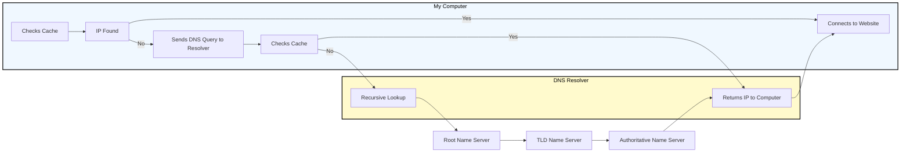

# Web Reconnaissance

... is the foundation of a thorough security assessment and involves systematically and meticulously collecting information about a target website or web application.

Some primary goals:

- Identifying Assets
- Discovering Hidden Information
- Analysing the Attack Surface
- Gathering Intelligence

In **active recon**, the attacker **directly interacts** with the target system to gather information:

| Technique | Example | Description | Tools | Risk of Detection |
| --------- | ------- | ----------- | ----- | ----------------- |
| **Port Scanning** | _using Nmap to scan a web server for open ports_ | identifying open ports and services running on the target | Nmap, Masscan, Unicornscan | **HIGH**: Direct interaction with the target can trigger IDS and firewalls |
| **Vulnerability Scanning** | _tunning Nessus against a web application to check for SQLi flaws or XSS vulns_ | probing the target for known vulns, such as outdated software or misconfigurations | Nessus, OpenVAS, Nikto | **HIGH**: Vulnerability scanners send exploit payloads that security solutions can detect |
| **Network Mapping** | _using traceroute to determine the path packets take to reach the target server, revealing potential network hops and infrastructure_ | mapping the target's network topology, including connected devices and their relationships | Traceroute, Nmap | **MEDIUM to HIGH**: Excessive or unusual network traffic can raise suspicion |
| **Banner Grabbing** | _connecting to a web server on port 80 and examining the HTTP banner to identify the web server software and version_ | retrieving information from banners displayed by services running on the target | Netcat, curl | **LOW**: Banner grabbing typically involves minimal interaction that can still be logged |
| **OS Fingerprinting** | _using Nmap's OS detection capabilities (```-O```) to determine if the target is running Windows, Linux, or another OS_ | identifying the OS running on the target | Nmap, Xprobe2 | **LOW**: OS fingerprinting is usually passive, but some advanced techniques can be detected |
| **Service Enumeration** | _using Nmap's service version detection (```-sV```) to determine if a web server is running Apache 2.4.50 or Nginx 1.18.0_ | determining the specific versions of services running on open ports | Nmap | **LOW**: Similar to banner grabbing, service enumeration can be logged but is less likely to trigger alerts |
| **Web Spidering** | _running a web crawler like Burp Spider or OWASP ZAP Spider to map out the structure of a website and discover hidden resources_ | crawling the target website to identify web pages, directories, and files | Burp Suite Spider, OWASP ZAP Spider, Scrapy | **LOW to MEDIUM**: Can be detected if the crawler's behaviour is not carefully configured to mimic legitimate traffic |

In **passive recon** information about the target is gathered **without directly interacting** with it.

| Technique | Example | Description | Tools | Risk of Detection |
| --------- | ------- | ----------- | ----- | ----------------- |
| **Search Engine Queries** | _searching Google for "[Target Name] Employees" to find employee information or social media profiles_ | utilising search engines to uncover information about the target, including websites, social media, profiles, social media profiles, and news article | Google, DuckDuckGo, Bing, Shodan, ... | **VERY LOW**: Search engine queries are normal internet activity and unlikely to trigger alerts |
| **WHOIS Lookup** | _performing a WHOIS lookup on a target domain to find the registrant's name, contact information, and name servers_ | querying WHOIS databases to retrieve domain registration details | whois command-line tool, online WHOIS lookup services | **VERY LOW**: WHOIS queries are legitimate and do not raise suspicion |
| **DNS** | _using dig to enumerate subdomains of a target domain_ | analysing DNS records to identify subdomains, mail servers, and other infrastructure | dig, nslookup, host, dnsenum, fierce, dnsrecon | **VERY LOW**: DNS queries are essential for internet browsing and are not typically flaggedd as suspicious |
| **Web Archive Analysis** | _using the wayback machine to view past versions of a target website to see how it has changed over time_ | examining historical snapshots of the target's website to identify vulnerabilities, or hidden information | Wayback Machine | **VERY LOW**: Accessing archived versions of a website is a normal activity |
| **Social Media Analysis** | _searching LinkedIn for employees of a target organisation to learn about their roles, responsibilities, and potential social engineering targets_ | gathering information from social media platforms like LinkedIn, Twitter, and Facebook | LinkedIn, Twitter, Facebook, specialised OSINT Tools | **VERY LOW**: Accessing public social media profiles is not considered intrusive |
| **Code Repos** | _searching GitHub for code snippets or repos related to the target that might contain sensitive information or code vulnerabilities_ | analysing publicly accessible code repos like GitHub for exposed credentials or vulns | GitHub, GitLab | **VERY LOW**: Code repos are meant for public access, and searching them is not suspicious |

## WHOIS

... is a widely used query and response protocol designed to access databases that store information about registered internet resources.

> [!INFO]
> A forward search means querying WHOIS with a domain name to discover who owns it.
> 
> Reverse WHOIS queries are especially useful when you begin with an IP address but want to learn more about the entity behind it.

Forward example:

```bash
d41y@htb[/htb]$ whois inlanefreight.com

[...]
Domain Name: inlanefreight.com
Registry Domain ID: 2420436757_DOMAIN_COM-VRSN
Registrar WHOIS Server: whois.registrar.amazon
Registrar URL: https://registrar.amazon.com
Updated Date: 2023-07-03T01:11:15Z
Creation Date: 2019-08-05T22:43:09Z
[...]
```

A WHOIS record typically contains:

- **Domain Name**: domain name itself
- **Registrar**: company where the domain was registered
- **Registrant Contact**: person or organization that registered the domain
- **Administrative Contact**: person responsible for managing the domain
- **Technical Contact**: person handling technical issues related to the domain
- **Creation and Expiration Dates**: when the domain was registered and when it's set to expire
- **Name Servers**: servers that translate the domain name into an IP address
- **Registrant**: who legally owns the domain

Facebook Example:

```bash
d41y@htb[/htb]$ whois facebook.com

   Domain Name: FACEBOOK.COM
   Registry Domain ID: 2320948_DOMAIN_COM-VRSN
   Registrar WHOIS Server: whois.registrarsafe.com
   Registrar URL: http://www.registrarsafe.com
   Updated Date: 2024-04-24T19:06:12Z
   Creation Date: 1997-03-29T05:00:00Z
   Registry Expiry Date: 2033-03-30T04:00:00Z
   Registrar: RegistrarSafe, LLC
   Registrar IANA ID: 3237
   Registrar Abuse Contact Email: abusecomplaints@registrarsafe.com
   Registrar Abuse Contact Phone: +1-650-308-7004
   Domain Status: clientDeleteProhibited https://icann.org/epp#clientDeleteProhibited
   Domain Status: clientTransferProhibited https://icann.org/epp#clientTransferProhibited
   Domain Status: clientUpdateProhibited https://icann.org/epp#clientUpdateProhibited
   Domain Status: serverDeleteProhibited https://icann.org/epp#serverDeleteProhibited
   Domain Status: serverTransferProhibited https://icann.org/epp#serverTransferProhibited
   Domain Status: serverUpdateProhibited https://icann.org/epp#serverUpdateProhibited
   Name Server: A.NS.FACEBOOK.COM
   Name Server: B.NS.FACEBOOK.COM
   Name Server: C.NS.FACEBOOK.COM
   Name Server: D.NS.FACEBOOK.COM
   DNSSEC: unsigned
   URL of the ICANN Whois Inaccuracy Complaint Form: https://www.icann.org/wicf/
>>> Last update of whois database: 2024-06-01T11:24:10Z <<<

[...]
Registry Registrant ID:
Registrant Name: Domain Admin
Registrant Organization: Meta Platforms, Inc.
[...]
```

Reverse example:

```bash
kali@kali:~$ whois 38.100.193.70 -h 192.168.50.251 # The host (-h) flag specifies the host running the WHOIS service
...
NetRange:       38.0.0.0 - 38.255.255.255
CIDR:           38.0.0.0/8
NetName:        COGENT-A
...
OrgName:        PSINet, Inc.
OrgId:          PSI
Address:        2450 N Street NW
City:           Washington
StateProv:      DC
PostalCode:     20037
Country:        US
RegDate:        
Updated:        2015-06-04
...
```

The reverse WHOIS lookup reveals that this IP address falls within the 38.0.0.0/8 CIDR block and is registered to PSINET, Inc., the ISP hosting that address.

## Domain Name System (DNS)

... acts as the internet's GPS, guiding your online journey from memorable landmarks (_domain names_) to precise numerical coordinates (_IP addresses_).

### DNS Workflow



1. Computer asks for directories
2. DNS Resolver checks its map
3. Root name server points the way
4. TLD name server narrows it down
5. Authoritative name server delivers the address
6. DNS Resolver returns the Information
7. Computer connects

### Hosts-File

... is a simple text file used to map hostnames to IP addresses, providing a manual method of domain name resolution that bypasses the DNS process. While DNS automates the translation of domain IP addresses, the hosts-file allows for direct, local ovverrides. This can be particularly useful for development, troubleshooting, or blocking websites. It is located in:

| | |
| -------- | -------- |
| Linux | ```/etc/hosts``` |
| Windows | ```C:\Windows\System32\drivers\etc\hosts``` |

... and can look like this example:

```bash
127.0.0.1       localhost
192.168.1.10    devserver.local
```

### Key DNS Concepts

**Key concepts**:

| DNS concept | example | description |
| ----------- | ------- | ----------- |
| **Domain Name** | _```www.example.com```_ | _a human-readable label for a website or other internet resource_ |
| **IP Address** | _```192.0.2.1```_ | a unique numerical identifier assigned to each device connected to the internet |
| **DNS Resolver** | _your ISP's DNS server or public resolver like Google DNS_ | a server that translates domain names into IP addresses |
| **Root Name Server** | _there are 13 root servers worldwide, named A-M: ```a.root-server.net```_ | the top-level servers in the DNS hierarchy |
| **TLD Name Server** | _Verisign for ```.com```, PIR for ```.org```_ | servers responsible for specific top-level domains |
| **Authoritative Name Server** | _often managed by hosting providers or domain registrars_ | the server that holds the actual IP address for a domain |
| **DNS Record Types** | _A, AAAA, CNAME, MX, NS, TXT, ..._ | different types of information stored in DNS |

**DNS Record Types**:

| Record Type | Full Name | Zone File Example | Description |
| ----------- | --------- | ----------------- | ----------- |
| **A** | Address Record | _```www.example.com``` IN A ```192.0.2.1```_ | maps a hostname to its IPv4 address |
| **AAAA** | IPv6 Address Record | _```www.example.com``` in AAAA ```2001:db8:85a3::8a2e:370:7334```_ | maps a hostname to its IPv6 address |
| **CNAME** | Canonical Name Record | _```blog.exmaple.com``` IN CNAME ```webserver.example.net```_ | creates an alias for a hostname, pointing it to another hostname |
| **MX** | Mail Exchange Record | _```example.com``` IN MX 10 ```mail.example.com```_ | sepcifies the mail server(s) responsible for handling email for the domain |
| **NS** | Name Server Record | _```example.com``` IN NS ```ns1.example.com```_ | delegates a DNS zone to a specific authoritative name server |
| **TXT** | Text Record | _```example.com``` IN TXT ```"v=spf1 mx -all"```_ | stores arbitrary text information, often used for domain verification or security policies |
| **SOA** | Start of Authority Record | _```example.com.``` IN SOA ```ns1.example.com. admin.example.com. 2023060301 10800 3600 604800 86400```_ | specifies administrative information about a DNS zone, including the primary name server, responsible person's email, and other parameters |
| **SRV** | Service Record | _```_sip._udp.example.com.``` IN SRV 10 5060 ```sipserver.example.com.```_ | defines the hostname and port number for specific services |
| **PTR** | Pointer Record | _```1.2.0.192.in-addr.arpa.``` IN PTR ```example.com```_ | used for reverse DNS lookups, mapping an IP address to a hostname |

### DNS Tools

| Tool | Key Features | Use Cases |
| ---- | ------------ | --------- |
| **dig** | versatile DNS lookup tool that supports various query types and detailed output  | manual DNS queries, zone transfer, troubleshooting DNS issues, and in-depth analysis of DNS records |
| **nslookup** | simpler DNS lookup tool, primarily for A, AAAA, and MX records | basic DNS queries, quick checks of domain resolution and mail server records |
| **host** | streamlined DNS lookup tool with concise output | quick checks of A, AAAA, and MX records |
| **dnsenum** | automated DNS enumeration tool, dictionary attacks, bruteforcing, zone transfers | discovering subdomains and gathering DNS information efficiently |
| **fierce** | DNS recon and subdomain enumeration tool with recursive search and wildcard detection | user-friendly interface for DNS recon, identifying subdomains and potential targets |
| **dnsrecon** | combines multiple DNS recon techniques and supports various output formats | comprehensive DNS enumeration, identifying subdomains, and gathering DNS records for further analysis |
| **theHarvester** | OSINT tool that gathers information from various sources, including DNS records | collecting email addresses, employee information, and other data associated with a domain from multiple sources |  

### DNS Zones

In the DNS, a **zone** is a distinct part of the domain namespace that a specific entity or administrator manages. _For example, ```example.com``` and all its subdomains would typically belong to the same DNS zone._

#### Primary DNS Server

The primary DNS server is the server of the zone file, which contains all authoritative information for a domain and is responsible for administering this zone. The DNS records of a zone can only be edited on the primary DNS server, which then updates the secondary DNS servers.

#### Secondary DNS Server

Secondary DNS servers contai read-only copies of the zone file from the primary DNS server. These servers compare their data with the primary DNS server at regular intervals and thus serve as a backup server. It is useful because a primary name server's failure means that connections without name resolution are no longer possible. To establish connections anyway, the user would have to know the IP addresses of the contacted servers.

#### DNS Zone File

The zone file, a text file residing on a DNS Server, defines the resource records within this zone, providing crucial information for translating domain names into IP addresses.

Example:

```bash
$TTL 3600 ; Default Time-To-Live (1 hour)
@       IN SOA   ns1.example.com. admin.example.com. (
                2024060401 ; Serial number (YYYYMMDDNN)
                3600       ; Refresh interval
                900        ; Retry interval
                604800     ; Expire time
                86400 )    ; Minimum TTL

@       IN NS    ns1.example.com.
@       IN NS    ns2.example.com.
@       IN MX 10 mail.example.com.
www     IN A     192.0.2.1
mail    IN A     198.51.100.1
ftp     IN CNAME www.example.com.
```

This file defines the authoritative name server (_NS records_), mail server (_MX record_), and IP addresses (_A records_) for various hosts within the ```example.com``` domain.

Also, you distinguish between **Primary Zone (_master zone_)** and **Secondary Zone (_slave zone_)**. The secondary zone on the secondary DNS server serves as a substitute for the primary zone on the primary DNS server if the primary DNS server should become unreachable. The creation and transfer of the primary Zone copy from the primary DNS server to the secondary DNS server is called a "zone transfer".

The update of the zone files can only be done on the primary DNS server, which then updates the secondary DNS server. Each zone file can have only one primary DNS server and an unlimited number of secondary DNS servers.

#### DNS Zone Transfer


1. Zone Transfer Request (AXFR)
2. SOA Record Transfer
3. DNS Records Transmission
4. Zone Transfer Complete
5. Acknowledgement (ACK)

In the early days of the internet, allowing any client to request a zone tranfer from a DNS server was common practice. This open approach simplified administration but opened a gaping security hole. It meant that anyone, including malicious actors, could ask a DNS server for a complete copy of its zone file, which contains a wealth of sensitive information.

Awareness of this vulnerability has grown, and most DNS server administrators have mitigated the risk. Modern DNS servers are typically configured to allow zone transfers only to trusted secondary severs, ensuring that sensitive zone data remains confidential.

Dig example:

```bash
d41y@htb[/htb]$ dig axfr @nsztm1.digi.ninja zonetransfer.me

; <<>> DiG 9.18.12-1~bpo11+1-Debian <<>> axfr @nsztm1.digi.ninja zonetransfer.me
; (1 server found)
;; global options: +cmd
zonetransfer.me.	7200	IN	SOA	nsztm1.digi.ninja. robin.digi.ninja. 2019100801 172800 900 1209600 3600
zonetransfer.me.	300	IN	HINFO	"Casio fx-700G" "Windows XP"
zonetransfer.me.	301	IN	TXT	"google-site-verification=tyP28J7JAUHA9fw2sHXMgcCC0I6XBmmoVi04VlMewxA"
zonetransfer.me.	7200	IN	MX	0 ASPMX.L.GOOGLE.COM.
...
zonetransfer.me.	7200	IN	A	5.196.105.14
zonetransfer.me.	7200	IN	NS	nsztm1.digi.ninja.
zonetransfer.me.	7200	IN	NS	nsztm2.digi.ninja.
_acme-challenge.zonetransfer.me. 301 IN	TXT	"6Oa05hbUJ9xSsvYy7pApQvwCUSSGgxvrbdizjePEsZI"
_sip._tcp.zonetransfer.me. 14000 IN	SRV	0 0 5060 www.zonetransfer.me.
14.105.196.5.IN-ADDR.ARPA.zonetransfer.me. 7200	IN PTR www.zonetransfer.me.
asfdbauthdns.zonetransfer.me. 7900 IN	AFSDB	1 asfdbbox.zonetransfer.me.
asfdbbox.zonetransfer.me. 7200	IN	A	127.0.0.1
asfdbvolume.zonetransfer.me. 7800 IN	AFSDB	1 asfdbbox.zonetransfer.me.
canberra-office.zonetransfer.me. 7200 IN A	202.14.81.230
...
;; Query time: 10 msec
;; SERVER: 81.4.108.41#53(nsztm1.digi.ninja) (TCP)
;; WHEN: Mon May 27 18:31:35 BST 2024
;; XFR size: 50 records (messages 1, bytes 2085)
```

### DNS Security

Many companies have already recognized DNS's vuln and try to close this gap with dedicated DNS servers, regular scans, and vulnerability assessment software. However, beyond that fact, more and more companies recognize the value of the DNS as an active line of defense, embedded in an in-depth and comprehensive security concept.

This makes sense because the DNS is part of every network connection. The DNS is uniquely positioned in the network to act as a central control point to decide whether a benign or malicious request is received.

DNS threat intelligence can be integrated with other open-source and other threat intelligence feeds. Analytics systems such as EDR and SIEM can provide a holistic and situation-based picture of the security situation. DNS Security Services support the coordination of incident response by sharing IOCs and IOAs with other security technologies such as firewalls, network proxies, endpoint security, Network Access Control and vulnerability scanners, providing them with information.

#### DNSSEC

Another feed used for the security of DNS servers is Domain Name System Security Extensions (_DNSSEC_), designed to ensure the authenticity and integrity of data transmitted through the DNS by securing resource records with digital certificates. DNSSEC ensures that the DNS data has not been manipulated and does not originate from any other source. Private keys are used to sign the resource records digitally. Resource records can be signed several times with different private keys, for example, to replace keys that expire in time.

##### Private Keys

The DNS server that manages a zone to be secured signs its sent resource records using its only known private key. Each zone has its zone keys, each consisting of a private and a public key. DNSSEC specifies a new resource record type with the RRSIG. It contains the signature of the respective DNS record, and these used keys have a specific validity period and are provided with a start and end date.

##### Public Key

The public key can be used to verify the signature of the recipients of the data. For the DNSSEC security mechanisms, it must be supported by the provider of the DNS information and the requesting client system. The requesting clients verify the signatures using the generally known public key of the DNS zone. If check is successful, manipulating the response is impossible, and the information comes from the requested source.

## Subdomains

Beneath the surface of a primary domain lies a potential network of subdomains. For instance, a company might use ```example.com``` as the primary domain, but also ```blog.example.com``` for its blog, ```shop.example.com``` for its shop, or ```mail.example.com``` for its email services.

### Active Subdomain Enumeration

... involves directly interacting with the target domain's DNS servers to uncover subdomains. One method is attempting a **DNS zone transfer**, where a misconfigured server might inadvertently leak a complete list of subdomains. However, due to tightened security measures, this is rarely successful.

A more common active technique is **brute-force enumeration**, which involves systematically testing a list potential subdomain names against a target domain. Tools like ```dnsenum```, ```ffuf```, and ```gobuster``` can automate this process, using wordlists of common subdomain names or custom-generated lists based on specific patterns.

### Passive Subdomain Enumeration

... relies on external sources of information to discover subdomains without directly querying the target's DNS servers. One valuable resource is **Certificate Transparency (CT) logs**, public repos of SSL/TLS certificates. These certificates often include a list of associated subdomains in their Subject Alternative Name (SAN) field, providing a treasure trove of potential targets.

Another approach involves utilising **search engines** like Google or DuckDuckGo. By employing specialised search operators, you can filter results to show only subdomains related to the target domain.

### Subdomain Bruteforcing

... is a powerful active subdomain discovery technique that leverages pre-defined lists of potential subdomain names. The process breaks down into four steps:

1. Wordlist Selection
   - General-Purpose
   - Targeted
   - Custom
2. Iteration and Querying
3. DNS Lookup
4. Filtering and Validation

Some tools to bruteforce subdomains are:

- dnsenum
- fierce
- dnsrecon
- amass
- assetfinder
- puredns

Dnsenum example:
```bash
d41y@htb[/htb]$ dnsenum --enum inlanefreight.com -f  /usr/share/seclists/Discovery/DNS/subdomains-top1million-20000.txt 

dnsenum VERSION:1.2.6

-----   inlanefreight.com   -----


Host's addresses:
__________________

inlanefreight.com.                       300      IN    A        134.209.24.248

[...]

Brute forcing with /usr/share/seclists/Discovery/DNS/subdomains-top1million-20000.txt:
_______________________________________________________________________________________

www.inlanefreight.com.                   300      IN    A        134.209.24.248
support.inlanefreight.com.               300      IN    A        134.209.24.248
[...]


done.
```

### Virtual Hosts

At the core of virtual hosting is the ability of web servers to distinguish between multiple websites or applications sharing the same IP address. This is achieved by leveraging HTTP Host header, a piece of information included in every HTTP request sent by a web browser.

Key difference to subdomains:

- Subdomains
  - are extensions of a main domain name
  - typically have their own DNS records, pointing to either the same IP address as the main or a different one
  - can be used to organise different sections or services of a website
- Virtual Hosts
  - are configurations within a web server that allow multiple websites or apps to be hosted on a single server
  - can be associated with top-level domains or subdomains
  - can have its own separate configuration, enabling precise control over how requests are handled

VHosts can also be configured to use different domains, not just subdomains:

```bash
# Example of name-based virtual host configuration in Apache
<VirtualHost *:80>
    ServerName www.example1.com
    DocumentRoot /var/www/example1
</VirtualHost>

<VirtualHost *:80>
    ServerName www.example2.org
    DocumentRoot /var/www/example2
</VirtualHost>

<VirtualHost *:80>
    ServerName www.another-example.net
    DocumentRoot /var/www/another-example
</VirtualHost>
```

### Server VHost Lookup


1. Browser Requests a Website
2. Host Header Reveals the Domain
3. Web Server Determines the Virtual Host
4. Serving the Right Content

### Types of Virtual Hosting

- Name-Based Virtual Hosting
  - relies solely on the HTTP Host header
  - most common and flexible method
  - requires the web server to support name-based virtual hosting
  - can have limitations with certain protocols like SSL/TLS
- IP-Based Virtual Hosting
  - assigns a unique IP address to each website hosted on the server
  - server determines which website to serve based on the IP addrss to which the request was sent
  - doesn't rely on the Host header
  - can be used with any protocol
  - offers better isolation between websites
- Port-Based Virtual Hosting
  - different websites are associated with different ports on the same IP address
  - not as common or user-friendly as name-based virtual hosting
  - might require users to specify the port number in the URL

### Virtual Host Discovery Tools

- gobuster
- Feroxbuster
- ffuf

Gobuster example:
```bash
d41y@htb[/htb]$ gobuster vhost -u http://inlanefreight.htb:81 -w /usr/share/seclists/Discovery/DNS/subdomains-top1million-110000.txt --append-domain
===============================================================
Gobuster v3.6
by OJ Reeves (@TheColonial) & Christian Mehlmauer (@firefart)
===============================================================
[+] Url:             http://inlanefreight.htb:81
[+] Method:          GET
[+] Threads:         10
[+] Wordlist:        /usr/share/seclists/Discovery/DNS/subdomains-top1million-110000.txt
[+] User Agent:      gobuster/3.6
[+] Timeout:         10s
[+] Append Domain:   true
===============================================================
Starting gobuster in VHOST enumeration mode
===============================================================
Found: forum.inlanefreight.htb:81 Status: 200 [Size: 100]
[...]
Progress: 114441 / 114442 (100.00%)
===============================================================
Finished
===============================================================
```

## Fingerprinting

... focuses on extracting technical details about the technologies powering a website or web application. The digital signatures of web servers, operating systems, and software components can reveal critical information about a target's infrastructure and potential security weaknesses.

Fingerprinting serves as a cornerstone of a web recon for several reasons:

- Targeted Attacks
- Identifying Misconfigurations
- Prioritising Targets
- Building a Comprehensive Profile

### Techniques

- Banner Grabbing
  - involves analysing the banners presented by web servers and other services
  - often reveal the server software, version numbers, and other details
- Analysing HTTP headers
  - contain a wealth of information
  - typically discloses the web server software, while the ```X-Powered-By``` header might reveal additional technologies like scripting languages or frameworks
- Probing for Specific Responses
  - can elicit unique responses that reveal specific technologies or versions
- Analysing Page Content
  - can often provide clues about the underlying technologies

### Tools

| Tool | Description | Features |
| ---- | ----------- | -------- |
| **Wappalyzer** | browser extension and online service for website technology profiling | identifies a wide range of web technologies, including CMSs, frameworks, analytics tools, and more |
| **BuiltWith** | web technology profiler that provides detailed reports on a website's technology stack | offers both free and paid plans with varying levels of detail |
| **WhatWeb** | command-line tool for website fingerprinting | uses a vast database if signatures to identify various web technologies |
| **Nmap** | versatile network scanner that can be used for various recon tasks, including service and OS fingerprinting | can be used with scripts (NSE) to perform more specialised fingerprinting |
| **Netcraft** | offers a range of web security services, including website fingerprinting and security reporting | provides detailed, reports on a website's technology, hosting provider, and security posture |
| **wafw00f** | command-line tool specifically designed for identifying Web Application Firewalls (WAFs) | helps determine if a WAF is present and, if so, its type and configuration |

Banner Grabbing example:

```bash
d41y@htb[/htb]$ curl -I inlanefreight.com # could have just used '-L'

HTTP/1.1 301 Moved Permanently
Date: Fri, 31 May 2024 12:07:44 GMT
Server: Apache/2.4.41 (Ubuntu)
Location: https://inlanefreight.com/
Content-Type: text/html; charset=iso-8859-1
```
```bash
d41y@htb[/htb]$ curl -I https://inlanefreight.com

HTTP/1.1 301 Moved Permanently
Date: Fri, 31 May 2024 12:12:12 GMT
Server: Apache/2.4.41 (Ubuntu)
X-Redirect-By: WordPress
Location: https://www.inlanefreight.com/
Content-Type: text/html; charset=UTF-8
```
```bash
d41y@htb[/htb]$ curl -I https://www.inlanefreight.com

HTTP/1.1 200 OK
Date: Fri, 31 May 2024 12:12:26 GMT
Server: Apache/2.4.41 (Ubuntu)
Link: <https://www.inlanefreight.com/index.php/wp-json/>; rel="https://api.w.org/"
Link: <https://www.inlanefreight.com/index.php/wp-json/wp/v2/pages/7>; rel="alternate"; type="application/json"
Link: <https://www.inlanefreight.com/>; rel=shortlink
Content-Type: text/html; charset=UTF-8
```

WAF example:

```bash
d41y@htb[/htb]$ wafw00f inlanefreight.com

                ______
               /      \
              (  W00f! )
               \  ____/
               ,,    __            404 Hack Not Found
           |`-.__   / /                      __     __
           /"  _/  /_/                       \ \   / /
          *===*    /                          \ \_/ /  405 Not Allowed
         /     )__//                           \   /
    /|  /     /---`                        403 Forbidden
    \\/`   \ |                                 / _ \
    `\    /_\\_              502 Bad Gateway  / / \ \  500 Internal Error
      `_____``-`                             /_/   \_\

                        ~ WAFW00F : v2.2.0 ~
        The Web Application Firewall Fingerprinting Toolkit
    
[*] Checking https://inlanefreight.com
[+] The site https://inlanefreight.com is behind Wordfence (Defiant) WAF.
[~] Number of requests: 2
```

Nikto example:

```bash
d41y@htb[/htb]$ nikto -h inlanefreight.com -Tuning b

- Nikto v2.5.0
---------------------------------------------------------------------------
+ Multiple IPs found: 134.209.24.248, 2a03:b0c0:1:e0::32c:b001
+ Target IP:          134.209.24.248
+ Target Hostname:    www.inlanefreight.com
+ Target Port:        443
---------------------------------------------------------------------------
+ SSL Info:        Subject:  /CN=inlanefreight.com
                   Altnames: inlanefreight.com, www.inlanefreight.com
                   Ciphers:  TLS_AES_256_GCM_SHA384
                   Issuer:   /C=US/O=Let's Encrypt/CN=R3
+ Start Time:         2024-05-31 13:35:54 (GMT0)
---------------------------------------------------------------------------
+ Server: Apache/2.4.41 (Ubuntu)
+ /: Link header found with value: ARRAY(0x558e78790248). See: https://developer.mozilla.org/en-US/docs/Web/HTTP/Headers/Link
+ /: The site uses TLS and the Strict-Transport-Security HTTP header is not defined. See: https://developer.mozilla.org/en-US/docs/Web/HTTP/Headers/Strict-Transport-Security
+ /: The X-Content-Type-Options header is not set. This could allow the user agent to render the content of the site in a different fashion to the MIME type. See: https://www.netsparker.com/web-vulnerability-scanner/vulnerabilities/missing-content-type-header/
+ /index.php?: Uncommon header 'x-redirect-by' found, with contents: WordPress.
+ No CGI Directories found (use '-C all' to force check all possible dirs)
+ /: The Content-Encoding header is set to "deflate" which may mean that the server is vulnerable to the BREACH attack. See: http://breachattack.com/
+ Apache/2.4.41 appears to be outdated (current is at least 2.4.59). Apache 2.2.34 is the EOL for the 2.x branch.
+ /: Web Server returns a valid response with junk HTTP methods which may cause false positives.
+ /license.txt: License file found may identify site software.
+ /: A Wordpress installation was found.
+ /wp-login.php?action=register: Cookie wordpress_test_cookie created without the httponly flag. See: https://developer.mozilla.org/en-US/docs/Web/HTTP/Cookies
+ /wp-login.php:X-Frame-Options header is deprecated and has been replaced with the Content-Security-Policy HTTP header with the frame-ancestors directive instead. See: https://developer.mozilla.org/en-US/docs/Web/HTTP/Headers/X-Frame-Options
+ /wp-login.php: Wordpress login found.
+ 1316 requests: 0 error(s) and 12 item(s) reported on remote host
+ End Time:           2024-05-31 13:47:27 (GMT0) (693 seconds)
---------------------------------------------------------------------------
+ 1 host(s) tested
```

#### Netcraft

... is an internet service company based in England offering a free web portal that performs various information gathering functions, such as discovering which technologies are running on a given website and finding which other hosts share the same IP netblock.

After querying the target domain on the [DNS search page](https://searchdns.netcraft.com/) you can view a "site report" for each server found that provides additional information and history about the server by clicking on the file icon next to each site URL.

The start of the report covers registration information. If you scroll down, you discover various "site technology" entries.

## Crawling

... often called spidering, is the automated process of systematically browsing the World Wide Web. It follows links from one page to another, collecting information.

Example:

1. Homepage<br>
├── link1<br>
├── link2<br>
└── link3

2. link1 Page<br>
├── Homepage<br>
├── link2<br>
├── link4<br>
└── link5

3. and so on ...

### Breadth-first-crawling

... prioritizes exploring a website's width before going deep. It starts by crawling all the links on the seed page, then moves on those pages, and so on. This is useful for getting a broad overview of a website's structure and content.

### Depth-first-crawling

... prioritizes depth over breadth. It follows a single path of links as far as possible before backtracking and exploring other paths. This can be useful for finding specific content or reaching deep into a website's structure.

### Extractig Valuable Information

- Links (_Internal and External)
  - fundamental building blocks of the web, connecting pages within a website and to other websites
- Comments
  - comment sections on blogs, forums, or other interactive pages can be a goldmine of information
- Metadata
  - refers to data about data
  - in the context of web pages, it includes information like page titles, descriptions, keywords, author names, and dates
- Sensitive Files
  - web crawlers can be configured to actively search for sensitive files that might be inadvertently exposed on a website

### Popular Crawlers

- Burp Suite Spider
- OWASP ZAP
- Scrapy
- Apache Nutch
- ReconSpider

## robots.txt

... is a simple text file placed in the root directory of a website. It adheres to the **Robots Exclusion Standard**, guidelines for how web crawlers should behave when visiting a website. This file contains instructions in the form of "directives" that tell bots which parts of the website they can and cannot crawl.

### Structure

The robots.txt follows a straightforward structure, with each set of instruction, or "record", separated by a blank line. Each record consists of two main components:

1. User-Agent
   - specifies which crawler or bot the following rules apply to
   - a "*" indicates that the rules apply to all bots
2. Directives
   - these lines provide specific instructions to the identified user-agent

Common directives:

| Directive | Example | Description |
| --------- | ------- | ----------- |
| **Disallow** | _Disallow: /admin/_ | specifies paths or patterns that the bot should not crawl |
| **Allow** | _Allow: /public/_ | explicitly permits the bot to crawl specific paths or patterns, even if they fall under a broader Disallow rule |
| **Crawl-delay** | _Crawl-delay: 10_ | sets a delay between successive requests from the bot to avoid overloading the server |
| **Sitemap** | _Sitemap: https://www.example.com/sitemap.xml_ | provides the URL to an XML sitemap for more efficient crawling |

Full robots.txt example:

```txt
User-agent: *
Disallow: /admin/
Disallow: /private/
Allow: /public/

User-agent: Googlebot
Crawl-delay: 10

Sitemap: https://www.example.com/sitemap.xml
```

## Well-Known URIs

The ```.well-known``` standard, defined in RFC 8615, serves as a standardized directory within a website's root domain. This designated location, typically accessible via the ```/.well-known/``` path on a web server, centralizes a website's critical configuration files and information related to its services, protocols. and security mechanisms.

The Internet Assigned Numbers Authority (IANA) maintains a [registry](https://www.iana.org/assignments/well-known-uris/well-known-uris.xhtml) of .well-known URIs, each serving a specific purpose defined by various specifications and standards. Some examples:

| URI Suffix | Description |
| ---------- | ----------- |
| **security.txt** | contains contact information for security researchers to report vulnerability |
| **/.well-known/change-password** | provides a standard URL for directing users to a password change page |
| **openid-configuration** | defines configuration details for OpenID Connect, an identity layer on top of the OAuth 2.0 protocol |
| **assetlinks.json** | used for verifying ownership of digital assets associated with a domain |
| **mta-sts.txt** | specifies the policy for SMTP MTA Strict Transport Security to enhace email security |

## Search Engines

... serve you as your guides in the vast landscape of the internet, helping you to navigate through the seemingly endless expanse of information. However, beyond their primary function of answering everyday queries, search engines also hold a treasure trove of data that can be invaluable for web recon and information gathering.

### Search Operators

... are like search engines' secret codes. These special commands and modifiers unlock a new level of precision and control allowing you to pinpoint specific types of information amidst the vastness of the indexed web.

[Here](https://www.recordedfuture.com/threat-intelligence-101/threat-analysis-techniques/google-dorks) are some of them.

_OffSec maintains the [Exploit Database](https://www.exploit-db.com/google-hacking-database) which has lots of different approaches to a various amount of google dorks._

### Shodan

... is a search engine that crawls devices connected to the internet, including the servers that run websites, as well as devices like routers and IoT devices.

Before using Shodan, you mus register a free account, which provides limited access.

Search operators are also to some extent implemented into Shodan. For example, you can use `hostname:megacorpone.com`.


In this case, Shodan lists the IPs, services, and banner information. All of this is gathered passively, avoiding interacting with the client's web site.

This information gives you a snapshot of your target's internet footprint. For example, there are four servers running SSH. You can drill down to refine your results by clicking on "SSH" under "Top Ports" on the left pane.


Based on Shodan's results, you know exactly which version of OpenSSH is running on each server. If you click on an IP address, you can retrieve a summary of the host.


You can review the ports, services, and technologies used by the server on this page. Shodan will also reveal if there are any published vulns for any of the identified services or technologies running on the same host. This information is invaluable when determining where to start when you move to active testing.

## Open-Source Code

Code stored online can provide a glimpse into the programming languages and frameworks used by an organization. On a few rare occasions, devs have even accidentally committed sensitive data and creds to public repos. The following resources could help you:

- GitHub
- GitHub Gist
- GitLab
- SourceForge

The search tools for some of these platforms will support the Google search operators.

### GitHub

To perform any GitHub search, you first need to register a basic account. Once you've logged in to your GitHub account, you can perform multiple keyword-based searches by typing into the top-right search field.

Doing this manually will work best on small repos. For larger repos, you can use several methods to help automate some of the searching, such as [Gitrob](https://github.com/michenriksen/gitrob) and [Gitleaks](https://github.com/zricethezav/gitleaks). Most of these tools require an [access token](https://help.github.com/en/articles/creating-a-personal-access-token-for-the-command-line) to use the source code-hosting provider's API.

> [!INFO]
> Don't forget that GitHub rate-limits unauthenticated API requests. If you're using automated tools like Gitleaks, a personal access token is often required.

The following screenshot shows an example of Gitleaks finding an AWS Access Key ID in a file.


Tools that search through source code for secrets, like Gitrob or Gitleaks, generally rely on regex or entropy-based detections to identify potentially useful information.

> [!INFO]
> Entropy-based tools scan for values that appear highly random - often a sign of keys, passwords, or tokens.

## Web Archives

With the [Internet Archive's Wayback Machine](http://web.archive.org/), you have a unique oppurtunity to revisit the past and explore the digital footprints of websites as they once were.

It can help with:

- uncovering hidden assets and vulns
- tracking changes and identifying patterns
- gathering intel
- stealthy recon

## Certificate Transparency Logs

... are public, append-only ledgers that record the issuance of SSL/TLS certificates. Whenever a Certificate Authority (CA) issues a new certificate, it must submit it to multiple CT logs. Independent organisations maintain these logs and are open for anyone to inspect.

You can think of CT logs as a **global registry of certificates**. They provide a transparent and verifiable record of every SSL/TLS certificate issued for a website. This transparency serves several crucial purposes:

- Early Detection of Rogue Certificates
- Accountability for Certificate Authorities
- Strengthening the Web PKI

### CT Logs and Web Recon

CT logs offer a unique advantage in subdomain enumeration compared to other methods. Unlike brute-forcing or wordlist-based approaches, which rely on guessing or predicting subdomain names, CT logs provide a definitive record of certificates issued for a domain and its subdomains. This means you're not limited by the scope of your wordlist or the effectiveness of your brute-forcing algorithm. Instead, you gain access to a historical and comprehensive view of a domain's subdomains, including those that might not be actively used or easily guessable.

Furthermore, CT logs can unveil subdomains associated with old or expired certificates. These subdomains might host outdated software or configurations, making them potentially vulnerable to exploitation.

In essence, CT logs provide a reliable and efficient way to discover subdomains without the need for exhaustive brute-forcing or relying on the completeness of wordlists. They offer a unique window into a domain's history and can reveal subdomains that might otherwise remain hidden, significantly enhancing your recon capabilities.

Two popular options for searching CT logs:

- [crt.sh](https://crt.sh/)
- [Censys](https://search.censys.io/)

Crt.sh lookup example:
```bash
d41y@htb[/htb]$ curl -s "https://crt.sh/?q=facebook.com&output=json" | jq -r '.[]
 | select(.name_value | contains("dev")) | .name_value' | sort -u
 
*.dev.facebook.com
*.newdev.facebook.com
*.secure.dev.facebook.com
dev.facebook.com
devvm1958.ftw3.facebook.com
facebook-amex-dev.facebook.com
facebook-amex-sign-enc-dev.facebook.com
newdev.facebook.com
secure.dev.facebook.com
```

## Security Headers and SSL/TLS

... can help in gathering information about a website or domain's security posture.

One such site, [Security Headers](https://securityheaders.com/), will analyze HTTP response headers and provide basic analysis of the target site's security posture. You can use this to get an idea of an organization's coding and security practices based on the results.

Scanning `www.megacorpone.com`:


The site is missing several defensive headers, such as `Content-Security-Policy` and `X-Frame-Options`. These missing headers are not necessarily vulns in and of themselves, but they could indicate web devs or server admins that are not familiar with server hardening.

Another scanning tool you can use is the SSL Server Test from [Qualys SSL Labs](https://www.ssllabs.com/ssltest/). This tool analyzes a server's SSL/TLS configuration and compares it against current best practices. It will also identify some SSL/TLS related vulnerabilities, such as Poodle or Heartbleed.

Scanning `www.megacorpone.com`:


These results seem better than the Security Header check. However, this shows that the server supports TLS versions such as 1.0 and 1.1, which are deemed legacy as they implement insecure sipher suites - this ultimately suggests that your target is not applying current best practices for SSL/TLS hardening. Disabling the `_TLS_DHE_RSA_WITH_AES_256_CBC_SHA_` suite has been recommended for several years, for example, due to multiple vulns both on AES cipher block chaining mode and the SHA1 algorithm. You can use these findings to gain insights about the security practices, or lack thereof, within the target organization.

## Automating Recon

... can significantly enhance efficiency and accuracy, allowing you to gather information at scale and identify potential vulns more rapidly.

### Recon Frameworks

... aim to provide a complete suite of tools for web recon. Some are:

- [FinalRecon](https://github.com/thewhiteh4t/FinalRecon)
- Recon-ng
- theHarvester
- SpiderFoot
- OSINT Framework

FinalRecon example:

```bash
d41y@htb[/htb]$ ./finalrecon.py --headers --whois --url http://inlanefreight.com

 ______  __   __   __   ______   __
/\  ___\/\ \ /\ "-.\ \ /\  __ \ /\ \
\ \  __\\ \ \\ \ \-.  \\ \  __ \\ \ \____
 \ \_\   \ \_\\ \_\\"\_\\ \_\ \_\\ \_____\
  \/_/    \/_/ \/_/ \/_/ \/_/\/_/ \/_____/
 ______   ______   ______   ______   __   __
/\  == \ /\  ___\ /\  ___\ /\  __ \ /\ "-.\ \
\ \  __< \ \  __\ \ \ \____\ \ \/\ \\ \ \-.  \
 \ \_\ \_\\ \_____\\ \_____\\ \_____\\ \_\\"\_\
  \/_/ /_/ \/_____/ \/_____/ \/_____/ \/_/ \/_/

[>] Created By   : thewhiteh4t
 |---> Twitter   : https://twitter.com/thewhiteh4t
 |---> Community : https://twc1rcle.com/
[>] Version      : 1.1.6

[+] Target : http://inlanefreight.com

[+] IP Address : 134.209.24.248

[!] Headers :

Date : Tue, 11 Jun 2024 10:08:00 GMT
Server : Apache/2.4.41 (Ubuntu)
Link : <https://www.inlanefreight.com/index.php/wp-json/>; rel="https://api.w.org/", <https://www.inlanefreight.com/index.php/wp-json/wp/v2/pages/7>; rel="alternate"; type="application/json", <https://www.inlanefreight.com/>; rel=shortlink
Vary : Accept-Encoding
Content-Encoding : gzip
Content-Length : 5483
Keep-Alive : timeout=5, max=100
Connection : Keep-Alive
Content-Type : text/html; charset=UTF-8

[!] Whois Lookup : 

   Domain Name: INLANEFREIGHT.COM
   Registry Domain ID: 2420436757_DOMAIN_COM-VRSN
   Registrar WHOIS Server: whois.registrar.amazon.com
   Registrar URL: http://registrar.amazon.com
   Updated Date: 2023-07-03T01:11:15Z
   Creation Date: 2019-08-05T22:43:09Z
   Registry Expiry Date: 2024-08-05T22:43:09Z
   Registrar: Amazon Registrar, Inc.
   Registrar IANA ID: 468
   Registrar Abuse Contact Email: abuse@amazonaws.com
   Registrar Abuse Contact Phone: +1.2024422253
   Domain Status: clientDeleteProhibited https://icann.org/epp#clientDeleteProhibited
   Domain Status: clientTransferProhibited https://icann.org/epp#clientTransferProhibited
   Domain Status: clientUpdateProhibited https://icann.org/epp#clientUpdateProhibited
   Name Server: NS-1303.AWSDNS-34.ORG
   Name Server: NS-1580.AWSDNS-05.CO.UK
   Name Server: NS-161.AWSDNS-20.COM
   Name Server: NS-671.AWSDNS-19.NET
   DNSSEC: unsigned
   URL of the ICANN Whois Inaccuracy Complaint Form: https://www.icann.org/wicf/


[+] Completed in 0:00:00.257780

[+] Exported : /home/htb-ac-643601/.local/share/finalrecon/dumps/fr_inlanefreight.com_11-06-2024_11:07:59
```

## LLM-Powered Recon