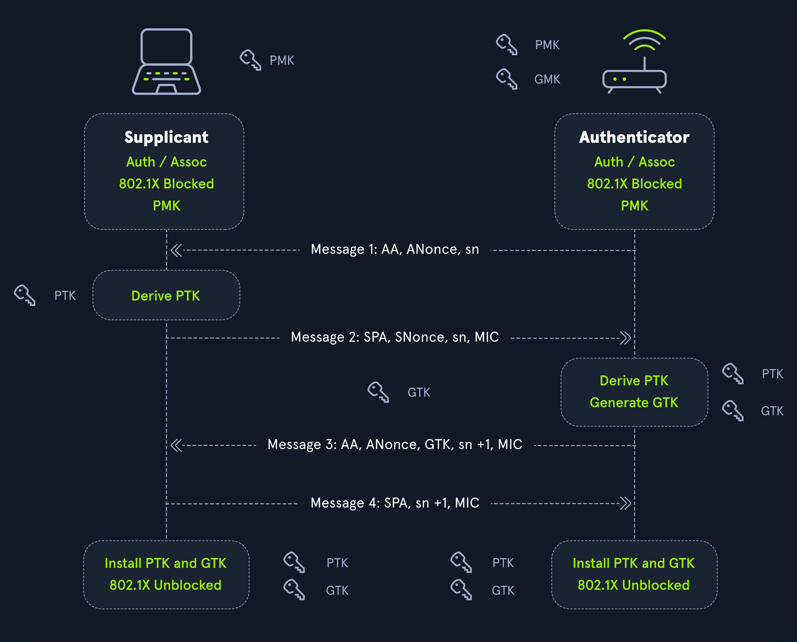
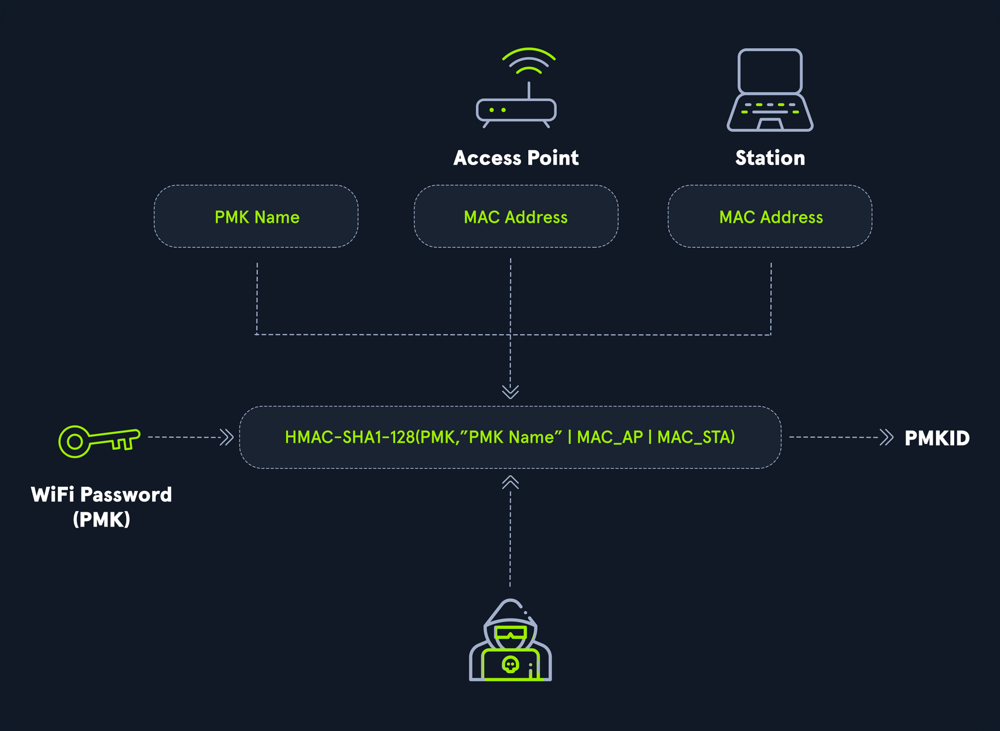

# Cracking Passwords with Hashcat

## Intro

### Hashing vs. Encryption

#### Hashing

... is the process of converting some text to a string, which is unique to that particular text. Usually, a hash function always returns hashes with the same lenght irrespective of the type, lenght, or size of data. Hashing is a one-way process, meaning there is no way of reconstructing the original plaintext from a hash. Hashing can be used for various purposes. Some hash functions can be keyed - one such example is HMAC, which acts as a checksum to verify if a particular message was tampered with during transmission.

As hashing is a one-way process, the only way to attack it is to use a list containing possible passwords. Each password from this list is hashed and compared to the original hash.

One protection employed against the brute-forcing of hashed is "salting". A salt is a random piece of data added to the plaintext before hashing it. This increases the computation time but does not prevent brute force altogether.

Consider the plaintext password value "p@ssw0rd". The MD5 hash for this can be calculated as follows:

```bash
d41y@htb[/htb]$ echo -n "p@ssw0rd" | md5sum

0f359740bd1cda994f8b55330c86d845
```

Now, suppose a random salt such as "123456" is introduced and appended to the plaintext.

```bash
d41y@htb[/htb]$ echo -n "p@ssw0rd123456" | md5sum

f64c413ca36f5cfe643ddbec4f7d92d0
```

A completely new hash was generated using this method, which will not be present in any pre-computed list. An attacker trying to crack this hash will have to sacrifice extra time to append this salt before calculating the hash.

Some hash functions such as MD5 have also been vulnerable to collisions, where two sets of plaintext can produce the same hash.

#### Encryption

... is the process of converting data into a format in which the original content is not accessible. Unlike hashing, encryption is reversible. Encryption algorithms are of two types: Symmetric and Asymmetric.

##### Symmetric Encryption

Symmetric algorithms use a key or secret to encrypt the data and use the same key to decrypt it. A basic example of symmetric encryption is XOR.

```bash
d41y@htb[/htb]$ python3

Python 3.8.3 (default, May 14 2020, 11:03:12) 
[GCC 9.3.0] on linux
Type "help", "copyright", "credits" or "license" for more information.
>>> from pwn import xor
>>> xor("p@ssw0rd", "secret")
b'\x03%\x10\x01\x12D\x01\x01'
```

Anyone who has the key can decrypt the ciphertext and obtain the plaintext.

```bash
d41y@htb[/htb]$ python3

Python 3.8.3 (default, May 14 2020, 11:03:12) 
[GCC 9.3.0] on linux
Type "help", "copyright", "credits" or "license" for more information.
>>> from pwn import xor
>>> xor('\x03%\x10\x01\x12D\x01\x01', "secret")
b'p@ssw0rd'
```

##### Asymmetric Encryption

On the other hand, asymmetric algorithms divide the key into two parts. The public key can be given to anyone who wishes to encrypt some information and pass it securely to the owner. The owner then uses their private key to decrypt the content.

One of the prominent uses of asymmetric encryption is the HTTPS protocol in the form of SSL. When a client connects to a server hosting an HTTPS website, a public key exchange occurs. The client's browser uses this public key to encrypt any kind of data sent to the server. The server decrypts the incoming traffic before passing it on to the processing device.

### Identifying Hashes

Most hashing algorithms produce hashes of a constant length. The length of a particular hash can be used to map it to the algorithm it was hashed with.

Sometimes, hashes are stored in certain formats. For example, `hash:salt` or `$id$salt$hash`.

The hash `2fc5a684737ce1bf7b3b239df432416e0dd07357:2014` is a SHA1 hash with the salt of `2014`.

The hash `$6$vb1tLY1qiY$M.1ZCqKtJBxBtZm1gRi8Bbkn39KU0YJW1cuMFzTRANcNKFKR4RmAQVk4rqQQCkaJT6wXqjUkFcA/qNxLyqW.U/` contains three fields delimited by `$`, where the first field is the `id`. This is used to identify the type of algorithm used for hashing. The following list contains some ids and their corresponding algorithms.

```
$1$  : MD5
$2a$ : Blowfish
$2y$ : Blowfish, with correct handling of 8 bit characters
$5$  : SHA256
$6$  : SHA512
```

The next field, `vb1tLY1qiY`, is the salt used during hashing, and the final field is the actual hash.

Open and closed source software use many different kinds of hash formats. For example, the Apache web server stores its hashes in the format `$apr1$71850310$gh9m4xcAn3MGxogwX/ztb.`, while WordPress stores hashes in the form `$P$984478476IagS59wHZvyQMArzfx58u.`.

#### Hashid

... is a Python tool, which can be used to detect various kinds of hashes.

Hashes can be supplied as command-line arguments or using a file.

```bash
d41y@htb[/htb]$ hashid '$apr1$71850310$gh9m4xcAn3MGxogwX/ztb.'

Analyzing '$apr1$71850310$gh9m4xcAn3MGxogwX/ztb.'
[+] MD5(APR) 
[+] Apache MD5
```

```bash
d41y@htb[/htb]$ hashid hashes.txt 

--File 'hashes.txt'--
Analyzing '2fc5a684737ce1bf7b3b239df432416e0dd07357:2014'
[+] SHA-1 
[+] Double SHA-1 
[+] RIPEMD-160 
[+] Haval-160 
[+] Tiger-160 
[+] HAS-160 
[+] LinkedIn 
[+] Skein-256(160) 
[+] Skein-512(160) 
[+] Redmine Project Management Web App 
[+] SMF ≥ v1.1 
Analyzing '$P$984478476IagS59wHZvyQMArzfx58u.'
[+] Wordpress ≥ v2.6.2 
[+] Joomla ≥ v2.5.18 
[+] PHPass' Portable Hash 
--End of file 'hashes.txt'--
```

If known, `hashid` can also provide the corresponding Hashcat hash mode with the `-m` flag if it is able to determine the hash type.

```bash
d41y@htb[/htb]$ hashid '$DCC2$10240#tom#e4e938d12fe5974dc42a90120bd9c90f' -m
Analyzing '$DCC2$10240#tom#e4e938d12fe5974dc42a90120bd9c90f'
[+] Domain Cached Credentials 2 [Hashcat Mode: 2100
```

> [!INFO]
> **CONTEXT MATTERS!**

### Hashcat Overview

Hashcat is a popular open-source password cracking tool.

```bash
d41y@htb[/htb]$ hashcat -h

hashcat (v6.1.1) starting...

Usage: hashcat [options]... hash|hashfile|hccapxfile [dictionary|mask|directory]...

- [ Options ] -

 Options Short / Long           | Type | Description                                          | Example
================================+======+======================================================+=======================
 -m, --hash-type                | Num  | Hash-type, see references below                      | -m 1000
 -a, --attack-mode              | Num  | Attack-mode, see references below                    | -a 3
 -V, --version                  |      | Print version                                        |
 -h, --help                     |      | Print help                                           |
     --quiet                    |      | Suppress output                                      |
     --hex-charset              |      | Assume charset is given in hex                       |
     --hex-salt                 |      | Assume salt is given in hex                          |
     --hex-wordlist             |      | Assume words in wordlist are given in hex            |
     --force                    |      | Ignore warnings                                      |
     --status                   |      | Enable automatic update of the status screen         |
     --status-json              |      | Enable JSON format for status output                 |
     --status-timer             | Num  | Sets seconds between status screen updates to X      | --status-timer=1
     --stdin-timeout-abort      | Num  | Abort if there is no input from stdin for X seconds  | --stdin-timeout-abort=300
     --machine-readable         |      | Display the status view in a machine-readable format |

<SNIP>
```

Hashcat supports the following attack modes:

- **0**: Straight
- **1**: Combination
- **3**: Brute-force
- **6**: Hybrid Wordlist + Mask
- **7**: Hybrid Mask + Wordlist

The hash type value is based on the algorithm of the hash to be cracked. A complete list of hash types and their corresponding examples can be found [here](https://hashcat.net/wiki/doku.php?id=example_hashes).

```bash
d41y@htb[/htb]$ hashcat --example-hashes | less

hashcat (v6.1.1) starting...

MODE: 0
TYPE: MD5
HASH: 8743b52063cd84097a65d1633f5c74f5
PASS: hashcat

MODE: 10
TYPE: md5($pass.$salt)
HASH: 3d83c8e717ff0e7ecfe187f088d69954:343141
PASS: hashcat

MODE: 11
TYPE: Joomla < 2.5.18
HASH: b78f863f2c67410c41e617f724e22f34:89384528665349271307465505333378
PASS: hashcat

MODE: 12
TYPE: PostgreSQL
HASH: 93a8cf6a7d43e3b5bcd2dc6abb3e02c6:27032153220030464358344758762807
PASS: hashcat

MODE: 20
TYPE: md5($salt.$pass)
HASH: 57ab8499d08c59a7211c77f557bf9425:4247
PASS: hashcat

<SNIP>
```

The benchmark test (_or performance test_) for a particular hash type can be performed using the `-b` flag.

```bash
d41y@htb[/htb]$ hashcat -b -m 0
hashcat (v6.1.1) starting in benchmark mode...

Benchmarking uses hand-optimized kernel code by default.
You can use it in your cracking session by setting the -O option.
Note: Using optimized kernel code limits the maximum supported password length.
To disable the optimized kernel code in benchmark mode, use the -w option.

OpenCL API (OpenCL 1.2 pocl 1.5, None+Asserts, LLVM 9.0.1, RELOC, SLEEF, DISTRO, POCL_DEBUG) - Platform #1 [The pocl project]
=============================================================================================================================
* Device #1: pthread-Intel(R) Core(TM) i7-5820K CPU @ 3.30GHz, 4377/4441 MB (2048 MB allocatable), 6MCU

Benchmark relevant options:
===========================
* --optimized-kernel-enable

Hashmode: 0 - MD5


Speed.#1.........:   449.4 MH/s (12.84ms) @ Accel:1024 Loops:1024 Thr:1 Vec:8

Started: Fri Aug 28 21:52:35 2020
Stopped: Fri Aug 28 21:53:25 2020
```

You can also run `hashcat -b` to run benchmarks for all hash modes.

Hashcat has two main ways to optimize speed:

- **Optimized Kernels**: This is the `-O` flag, which, according to the documentation, means `Enable optimized kernels (limits password length)`. The magical password length number is generally 32, with most wordlists won't even hit that number. This can take the estimated time from days to hours, so it is always recommended to run with `-O` first and then rerun after without the `-O` if your GPU is idle.
- **Workload**: This is the `-w` flag, which, according to the documentation, means `Enable a specific workload profile`. The default number is 2, but if you want to use your computer while Hashcat is running, set this to 1. If you plan on the computer only running Hashcat, this can be set to 3.

## Attack Types

### Dictionary Attack

This attack reads from a wordlist and tries to crack the supplied hashes. Dictionary attacks are useful if you know that the target organization uses weak passwords or just wants to run through some cracking attempts rather quickly. Its basic syntax is:

```bash
d41y@htb[/htb]$ hashcat -a 0 -m <hash type> <hash file> <wordlist>
```

For example, the following commands will crack a SHA256 hash using the rockyou.txt wordlist.

```bash
d41y@htb[/htb]$ echo -n '!academy' | sha256sum | cut -f1 -d' ' > sha256_hash_example
d41y@htb[/htb]$ hashcat -a 0 -m 1400 sha256_hash_example /opt/useful/seclists/Passwords/Leaked-Databases/rockyou.txt

hashcat (v6.1.1) starting...

<SNIP>

Dictionary cache built:
* Filename..: /opt/useful/seclists/Passwords/Leaked-Databases/rockyou.txt
* Passwords.: 14344392
* Bytes.....: 139921507
* Keyspace..: 14344385
* Runtime...: 2 secs

Approaching final keyspace - workload adjusted.  

006fc3a9613f3edd9f97f8e8a8eff3b899a2d89e1aabf33d7cc04fe0728b0fe6:!academy
                                                 
Session..........: hashcat
Status...........: Cracked
Hash.Name........: SHA2-256
Hash.Target......: 006fc3a9613f3edd9f97f8e8a8eff3b899a2d89e1aabf33d7cc...8b0fe6
Time.Started.....: Fri Aug 28 21:58:44 2020 (4 secs)
Time.Estimated...: Fri Aug 28 21:58:48 2020 (0 secs)
Guess.Base.......: File (/opt/useful/seclists/Passwords/Leaked-Databases/rockyou.txt)
Guess.Queue......: 1/1 (100.00%)
Speed.#1.........:  3383.5 kH/s (0.46ms) @ Accel:1024 Loops:1 Thr:1 Vec:8
Recovered........: 1/1 (100.00%) Digests
Progress.........: 14344385/14344385 (100.00%)
Rejected.........: 0/14344385 (0.00%)
Restore.Point....: 14340096/14344385 (99.97%)
Restore.Sub.#1...: Salt:0 Amplifier:0-1 Iteration:0-1
Candidates.#1....: $HEX[216361726f6c796e] -> $HEX[042a0337c2a156616d6f732103]

Started: Fri Aug 28 21:58:05 2020
Stopped: Fri Aug 28 21:58:49 2020
```

In the above example, the hash cracked in 4 seconds. Cracking speed varies depending on the underlying hardware, hash type, and complexity of the password.

### Combination Attacks

The combination attack modes take in two wordlists as input and create combinations from them. This attack is useful because it is not uncommon for users to join two or more words together, thinking that this creates a stronger password.

To demonstrate consider the following wordlists:

```bash
d41y@htb[/htb]$ cat wordlist1

super
world
secret

d41y@htb[/htb]$ cat wordlist2

hello
password
```

If given these two word lists Hashcat will produce exactly 3 x 2 = 6 words, such as the following:

```bash
d41y@htb[/htb]$ awk '(NR==FNR) { a[NR]=$0 } (NR != FNR) { for (i in a) { print $0 a[i] } }' file2 file1

superhello
superpassword
worldhello
wordpassword
secrethello
secretpassword
```

This can also be done with Hashcat using the `--stdout` flag which can be very helpful for debugging purposes and seeing how the tool is handling things.

The syntax for the combination attack is:

```bash
d41y@htb[/htb]$ hashcat -a 1 -m <hash type> <hash file> <wordlist1> <wordlist2>
```

See this example in practice:

```bash
d41y@htb[/htb]$ echo -n 'secretpassword' | md5sum | cut -f1 -d' '  > combination_md5

2034f6e32958647fdff75d265b455ebf
```

```bash
d41y@htb[/htb]$ hashcat -a 1 -m 0 combination_md5 wordlist1 wordlist2

hashcat (v6.1.1) starting...
<SNIP>

Dictionary cache hit:
* Filename..: wordlist1
* Passwords.: 3
* Bytes.....: 19
* Keyspace..: 6

The wordlist or mask that you are using is too small.
This means that hashcat cannot use the full parallel power of your device(s).
Unless you supply more work, your cracking speed will drop.
For tips on supplying more work, see: https://hashcat.net/faq/morework

Approaching final keyspace - workload adjusted.  

2034f6e32958647fdff75d265b455ebf:secretpassword  
                                                 
Session..........: hashcat
Status...........: Cracked
Hash.Name........: MD5
Hash.Target......: 2034f6e32958647fdff75d265b455ebf
Time.Started.....: Fri Aug 28 22:05:51 2020, (0 secs)
Time.Estimated...: Fri Aug 28 22:05:51 2020, (0 secs)
Guess.Base.......: File (wordlist1), Left Side
Guess.Mod........: File (wordlist2), Right Side
Speed.#1.........:       42 H/s (0.02ms) @ Accel:1024 Loops:2 Thr:1 Vec:8
Recovered........: 1/1 (100.00%) Digests
Progress.........: 6/6 (100.00%)
Rejected.........: 0/6 (0.00%)
Restore.Point....: 0/3 (0.00%)
Restore.Sub.#1...: Salt:0 Amplifier:0-2 Iteration:0-2
Candidates.#1....: superhello -> secretpassword
```

### Mask Attack

Mask attacks are used to generate words matching a specific pattern. This type of attack is particularly useful when password length or format is known. A mask can be created using static characters, ranges of chars, or placeholders. The following list shows some important placeholders:

| Placeholder | Meaning                                             |
| ----------- | --------------------------------------------------- |
| `?l`        | lower-case ASCII letters (a-z)                      |
| `?u`        | upper-case ASCII letters (A-Z)                      |
| `?d`        | digits (0-9)                                        |
| `?h`        | 0123456789abcdef                                    |
| `?H`        | 0123456789ABCDEF                                    |
| `?s`        | special chars («space»!"#$%&'()*+,-./:;<=>?@[]^_\`{ |
| `?a`        | ?l?u?d?s                                            |
| `?b`        | 0x00 - 0xff                                         |

The above placeholders can be combined with options `-1` to `-4` which can be used for custom placeholders. See the _Custom charsets_ section [here](https://hashcat.net/wiki/doku.php?id=mask_attack) for a detailed breakdown of each of these four command-line parameters that can be used to configure four custom charsets.

Consider the company Inlane Freight, which this time has passwords with the scheme `ILFREIGHT<userid><year>`, where userid is 5 chars long. The mask `ILFREIGHT?l?l?l?l?l20[0-1]?d` can be used to crack passwords with the specified pattern, where `?l` is a letter and `20[0-1]?d` will include all years from 2000 to 2019.

An example:

```bash
d41y@htb[/htb]$ echo -n 'ILFREIGHTabcxy2015' | md5sum | tr -d " -" > md5_mask_example_hash
```

```bash
d41y@htb[/htb]$ hashcat -a 3 -m 0 md5_mask_example_hash -1 01 'ILFREIGHT?l?l?l?l?l20?1?d'

hashcat (v6.1.1) starting...
<SNIP>

d53ec4d0b37bbf565b1e09d64834e1ae:ILFREIGHTabcxy2015
                                                 
Session..........: hashcat
Status...........: Cracked
Hash.Name........: MD5
Hash.Target......: d53ec4d0b37bbf565b1e09d64834e1ae
Time.Started.....: Fri Aug 28 22:08:44 2020, (43 secs)
Time.Estimated...: Fri Aug 28 22:09:27 2020, (0 secs)
Guess.Mask.......: ILFREIGHT?l?l?l?l?l20?1?d [18]
Guess.Charset....: -1 01, -2 Undefined, -3 Undefined, -4 Undefined 
Guess.Queue......: 1/1 (100.00%)
Speed.#1.........:  3756.3 kH/s (0.36ms) @ Accel:1024 Loops:1 Thr:1 Vec:8
Recovered........: 1/1 (100.00%) Digests
Progress.........: 155222016/237627520 (65.32%)
Rejected.........: 0/155222016 (0.00%)
Restore.Point....: 155215872/237627520 (65.32%)
Restore.Sub.#1...: Salt:0 Amplifier:0-1 Iteration:0-1
Candidates.#1....: ILFREIGHTuisba2015 -> ILFREIGHTkmrff2015
```

The `-1` option was used to specify a placeholder with just 0 and 1. Hashcat could crack the hash in 43 seconds on CPU power. The `--increment` flag can be used to increment the mask length automatically, with a length limit that can be supplied using the `--increment-max` flag.

### Hybrid Mode

Hybrid mode is a variation of the combinator attack, wherein multiple modes can be used together for a fine-tuned wordlist creation. This mode can be used to perform very targeted attacks by creating very customized wordlists. It is particularly useful when you know or have a general idea of the organization's password policy or common password syntax. The attack mode for the hybrid attack is 6.

Consider a password such as `football1$`. The example below shows how a wordlist can be used in combination with a mask.

```bash
d41y@htb[/htb]$ echo -n 'football1$' | md5sum | tr -d " -" > hybrid_hash
```

Hashcat reads words from the wordlist and appends a unique string based on the mask supplied. In this case, the mask `?d?s` tells hashcat to append a digit and a special character at the end of each word in the rockyou.txt wordlist.

```bash
d41y@htb[/htb]$ hashcat -a 6 -m 0 hybrid_hash /opt/useful/seclists/Passwords/Leaked-Databases/rockyou.txt '?d?s'

hashcat (v6.1.1) starting...
<SNIP>

f7a4a94ff3a722bf500d60805e16b604:football1$      
                                                 
Session..........: hashcat
Status...........: Cracked
Hash.Name........: MD5
Hash.Target......: f7a4a94ff3a722bf500d60805e16b604
Time.Started.....: Fri Aug 28 22:11:15 2020, (0 secs)
Time.Estimated...: Fri Aug 28 22:11:15 2020, (0 secs)
Guess.Base.......: File (/opt/useful/seclists/Passwords/Leaked-Databases/rockyou.txt), Left Side
Guess.Mod........: Mask (?d?s) [2], Right Side
Guess.Queue.Base.: 1/1 (100.00%)
Guess.Queue.Mod..: 1/1 (100.00%)
Speed.#1.........:  5118.2 kH/s (11.56ms) @ Accel:768 Loops:82 Thr:1 Vec:8
Recovered........: 1/1 (100.00%) Digests
Progress.........: 755712/4733647050 (0.02%)
Rejected.........: 0/755712 (0.00%)
Restore.Point....: 0/14344385 (0.00%)
Restore.Sub.#1...: Salt:0 Amplifier:82-164 Iteration:0-82
Candidates.#1....: 1234562= -> class083~
```

Attack mode 7 can be used to prepend chars to words using a given mask. The following example shows a mask using a custom character set to add a prefix to each word in the rockyou.txt wordlist. The custom char mask `20?1?d` with the custom char set `-1 01` will prepend various years to each word in the worlist.

```bash
d41y@htb[/htb]$ echo -n '2015football' | md5sum | tr -d " -" > hybrid_hash_prefix
```

```bash
d41y@htb[/htb]$ hashcat -a 7 -m 0 hybrid_hash_prefix -1 01 '20?1?d' /opt/useful/seclists/Passwords/Leaked-Databases/rockyou.txt

hashcat (v6.1.1) starting...
<SNIP> 

eac4fe196339e1b511278911cb77d453:2015football    
                                                 
Session..........: hashcat
Status...........: Cracked
Hash.Name........: MD5
Hash.Target......: eac4fe196339e1b511278911cb77d453
Time.Started.....: Thu Nov 12 01:32:34 2020 (0 secs)
Time.Estimated...: Thu Nov 12 01:32:34 2020 (0 secs)
Guess.Base.......: File (/usr/share/wordlists/rockyou.txt), Right Side
Guess.Mod........: Mask (20?1?d) [4], Left Side
Guess.Charset....: -1 01, -2 Undefined, -3 Undefined, -4 Undefined
Speed.#1.........:     8420 H/s (0.22ms) @ Accel:384 Loops:64 Thr:1 Vec:8
Recovered........: 1/1 (100.00%) Digests
Progress.........: 1280/286887700 (0.00%)
Rejected.........: 0/1280 (0.00%)
Restore.Point....: 0/20 (0.00%)
Restore.Sub.#1...: Salt:0 Amplifier:0-64 Iteration:0-64
Candidates.#1....: 2001123456 -> 2017charlie
```

## Wordlists

### Creating Custom Wordlists

#### Crunch

... can create wordlists based on parameters such as words of a specific length, a limited charset, or a certain pattern. It can generate both permutations and combinations.

```bash
d41y@htb[/htb]$ crunch <minimum length> <maximum length> <charset> -t <pattern> -o <output file>
```

The `-t` option is used to specify the pattern for generated passwords. The pattern can contain `@`, representing lower case chars, `,` will insert upper case chars, `%` will insert numbers, and `^` will insert symbols.

```bash
d41y@htb[/htb]$ crunch 4 8 -o wordlist
```

The command above creates a wordlist consisting of words with a length of 4 to 8 chars, using the default charset.

Assume that Inlane Freight user passwords are of the form `ILFREIGHTYYYYXXXX`, where `XXXX` is the employee ID containing letters, and `YYYY` is the year. You can use crunch to create a list of such passwords.

```bash
d41y@htb[/htb]$ crunch 17 17 -t ILFREIGHT201%@@@@ -o wordlist
```

The pattern `ILFREIGHT201%@@@@` will create words with the years 2010-2019 followed by four letters. The length here is 17, which is constant for all words.

If you know a user's birthdate is 10/03/1998, you can include this in their password, followed by a string of letters. Crunch can be used to create a wordlist of such words. The `-d` option is used to specify the amount of repetition.

```bash
d41y@htb[/htb]$ crunch 12 12 -t 10031998@@@@ -d 1 -o wordlist
```

#### CUPP

... stands for Common User Password Profiler, and is used to create highly targeted and customized wordlists based on information gained from social engineering and OSINT. People tend to use personal information while creating passwords, such as phone numbers, pet names, birth dates, etc. CUPP takes in this information and creates passwords from them. These wordlists are mostly used to gain access to social media accounts. The `-i` option is used to run in interactive mode, prompting CUPP to ask you for information on the target.

```bash
d41y@htb[/htb]$ python3 cupp.py -i

[+] Insert the information about the victim to make a dictionary
[+] If you don't know all the info, just hit enter when asked! ;)

> First Name: roger
> Surname: penrose
> Nickname:      
> Birthdate (DDMMYYYY): 11051972

> Partners) name: beth
> Partners) nickname:
> Partners) birthdate (DDMMYYYY):

> Child's name: john
> Child's nickname: johnny
> Child's birthdate (DDMMYYYY):

> Pet's name: tommy
> Company name: INLANE FREIGHT

> Do you want to add some key words about the victim? Y/[N]: Y
> Please enter the words, separated by comma. [i.e. hacker,juice,black], spaces will be removed: sysadmin,linux,86391512
> Do you want to add special chars at the end of words? Y/[N]:
> Do you want to add some random numbers at the end of words? Y/[N]:
> Leet mode? (i.e. leet = 1337) Y/[N]:

[+] Now making a dictionary...
[+] Sorting list and removing duplicates...
[+] Saving dictionary to roger.txt, counting 2419 words.
[+] Now load your pistolero with roger.txt and shoot! Good luck!
```

The command above shows how the data for the user Roger Penrose, was provided to CUPP. The unknown fields can be just left empty. After taking in all data, CUPP creates a wordlist based on it. It also supports appending random chars and a "Leet" mode, which uses combinations of letters and numbers in common words. CUPP can also fetch common names from various online databases using the `-l` option.

#### KWPROCESSOR

... is a tool that creates wordlists with keyboard walks. Another common password generation technique is to follow patterns on the keyboard. These passwords are called keyboard walks, as they look like a walk along the keys. For example, the string `qwertyasdfg` is created by using the first five chars from the keyboard's first two rows. This seems complex to the normal eye but can be easily predicted. KWPROCESSOR uses various algorithms to guess patterns such as these.

The tool can be found [here](https://github.com/hashcat/kwprocessor) and has to be installed manually.

```bash
d41y@htb[/htb]$ git clone https://github.com/hashcat/kwprocessor
d41y@htb[/htb]$ cd kwprocessor
d41y@htb[/htb]$ make
```

The help menu shows the various options supported by kwp. The pattern is based on the geographical directions a user could choose on the keyboard. For example, the `--keywalk-west` option is used to specify movement towards the west from the base char. The program takes in base chars as a parameter, which is the char set the pattern will start with.  Next, it needs a keymap, which maps the locations of keys on language-specific keyboard layouts. The final option is used to specify the route to be used. A route is a pattern to be followed by passwords. It defines how passwords will be formed, starting from the base characters. For example, the route 222 can denote the path `2 * EAST + 2 * SOUTH + 2 * WEST` from the base char. If the base char is considered to be `T` then the password generated by the route would be `TYUJNBV` on a US keymap.

```bash
d41y@htb[/htb]$ kwp -s 1 basechars/full.base keymaps/en-us.keymap  routes/2-to-10-max-3-direction-changes.route
```

The command above generates words with chars reachable while holding `-S`, using the full base, the standard en-us keymap, and 3 direction changes route.

#### Princeprocessor

Prince or PRobability INfinite Chained Elements is an efficient password guessing algorithm to improve password cracking rates. [Princeprocessor](https://github.com/hashcat/princeprocessor) is a tool that generates passwords using the PRINCE algorithm. The program takes in a wordlist and creates a chain of words taken from this wordlist. For example, if a wordlist contains the words:

```
dog
cat
ball
```

The generated wordlist would be of the form:

```
dog
cat
ball
dogdog
catdog
dogcat
catcat
dogball
catball
balldog
ballcat
ballball
dogdogdog
catdogdog
dogcatdog
catcatdog
dogdogcat
<SNIP>
```

The PRINCE algorithm considers various permutation and combinations while creating each word. The binary can be downloaded from the [releases](https://github.com/hashcat/princeprocessor/releases) page.

```bash
d41y@htb[/htb]$ wget https://github.com/hashcat/princeprocessor/releases/download/v0.22/princeprocessor-0.22.7z
d41y@htb[/htb]$ 7z x princeprocessor-0.22.7z
d41y@htb[/htb]$ cd princeprocessor-0.22
d41y@htb[/htb]$ ./pp64.bin -h
```

The `--keyspace` option can be used to find the number of combinations produced from the input wordlist.

```bash
d41y@htb[/htb]$ ./pp64.bin --keyspace < words

232
```

According to princeprocessor, 232 unique words can be formed from your wordlist above.

```bash
d41y@htb[/htb]$ ./pp64.bin -o wordlist.txt < words
```

The command above writes the output words to a file named `wordlist.txt`. By default, princeprocessor only outputs words up to 16 in length. This can be controlled using the `--pw-min` and `--pw-max` arguments.

```bash
d41y@htb[/htb]$ ./pp64.bin --pw-min=10 --pw-max=25 -o wordlist.txt < words
```

The command above will output words between 10 and 25 in length. The number of elements per word can be controlled using `--elem-cnt-min` and `--elem-cnt-max`. These values ensure that number of elements in an output word is above or below the given value.

```bash
d41y@htb[/htb]$ ./pp64.bin --elem-cnt-min=3 -o wordlist.txt < words
```

The command above will output words with three elements or more.

#### CeWL

... is another tool that can be used to create custom wordlists. It spiders and scrapes a website and creates a list of the words that are present. This kind of wordlist is effective, as people tend to use passwords associated with the content they write or operate on. For example, a blogger who blogs about nature, wildlife, etc. could have a password associated with those topics. This is due to human nature, as such passwords are also easy to remember. Organizations often have passwords associated with their branding and industry-specific vocabulary. For example, users of a networking company may have passwords consisting of words like `router`, `switch`, `server` and so on. Such words can be found on their website under blogs, testimonials, and product descriptions.

```bash
d41y@htb[/htb]$ cewl -d <depth to spider> -m <minimum word length> -w <output wordlist> <url of website>
```

CeWL can spider multiple pages present on a given website. The length of the outputted words can be altered using the `-m` parameter, depending on the password requirements.

CeWL also supports the extraction of emails from websites with the `-e` option. It's helpful to get this information when phishing, password spraying, or brute-forcing passwords later.

```bash
d41y@htb[/htb]$ cewl -d 5 -m 8 -e http://inlanefreight.com/blog -w wordlist.txt
```

The command above scrapes up to a depth of five pages from `http://inlanefreight.com/blog`, and includes only words greater than 8 in length.

#### Previously Cracked Passwords

By default, hashcat stores all cracked passwords in the `hashcat.potfile` file. The format is `hash:password`. The main purpose of this file is to remove previously cracked hashes from the work log and display cracked passwords with the `--show`  command. However, it can be used to create new wordlists of previously cracked passwords, and when combined with rule files, it can prove quite effective at cracking themed passwords.

#### Hashcat-utils

The Hashcat-utils repo contains many utilities that can be useful for more advanced password cracking. The tool [maskprocessor](https://github.com/hashcat/maskprocessor), for example, can be used to create wordlists using a given mask. Detailed usage for this tool can be found [here](https://hashcat.net/wiki/doku.php?id=maskprocessor).

For example, maskprocessor can be used to append all special chars to the end of a word:

```bash
d41y@htb[/htb]$ /mp64.bin Welcome?s
Welcome 
Welcome!
Welcome"
Welcome#
Welcome$
Welcome%
Welcome&
Welcome'
Welcome(
Welcome)
Welcome*
Welcome+

<SNIP>
```

## Rules

The rule-based attack is the most advanced and complex password cracking mode. Rules help perform various operations on the input wordlist, such as prefixing, suffixing, toggling case, cutting, reversing, and much more. Rules take mask-based attacks to another level and provide increased cracking rates. Additionally, the usage of rules saves disk space and processing time incurred as a result of larger wordlists.

A rule can be created using functions, which take a word as input and output it's modified version. The following table describes some functions which are compatible with JtR as well as Hashcat.

| Function                | Description                                                   | Input                                 | Output                                                                                                            |
| ----------------------- | ------------------------------------------------------------- | ------------------------------------- | ----------------------------------------------------------------------------------------------------------------- |
| `l`                     | Convert all letters to lowercase                              | InlaneFreight2020                     | inlanefreight2020                                                                                                 |
| `u`                     | Convert all letters to uppercase                              | InlaneFreight2020                     | INLANEFREIGHT2020                                                                                                 |
| `c` / `C`               | capitalize / lowercase first letter an invert the rest        | inlaneFreight2020 / Inlanefreight2020 | Inlanefreight2020 / iNLANEFREIGHT2020                                                                             |
| `t` / `TN`              | Toggle case: whole word / at position N                       | InlaneFreight2020                     | iNLANEfREIGHT2020                                                                                                 |
| `d` / `q` / `zN` / `ZN` | Duplicate word / all chars / first character / last character | InlaneFreight2020                     | InlaneFreight2020InlaneFreight2020 / IInnllaanneeFFrreeiigghhtt22002200 / IInlaneFreight2020 / InlaneFreight20200 |
| `{` / `}`               | Rotate word left / right                                      | InlaneFreight2020                     | nlaneFreight2020I / 0InlaneFreight202                                                                             |
| `^X` / `$X`             | Prepend / Append char X                                       | InlaneFreight2020 (^! / $! )          | !InlaneFreight2020 / InlaneFreight2020!                                                                           |
| `r`                     | Reverse                                                       | InlaneFreight2020                     | 0202thgierFenalnI                                                                                                 |

A complete list of functions can be found [here](https://hashcat.net/wiki/doku.php?id=rule_based_attack#implemented_compatible_functions). Sometimes, the input wordlists contain words that don't match your target specifications. In such cases, rejection rules can be used to prevent the processing of such words.

Words of length less than N can be rejected with `>N`, while words greater than N can be rejected with `<N`. A list of rejection rules can be found [here](https://hashcat.net/wiki/doku.php?id=rule_based_attack#rules_used_to_reject_plains).

### Example Rule Creation

Create a rule to generate words that match leetspeak or/and are prepended or/and appended by a year:

```
c so0 si1 se3 ss5 sa@ $2 $0 $1 $9
```

The first letter word is capitalized with the `c` function. Then rule uses the substitute function `S` to replace `o` with `0`, `i` with `1`, `e` with `3` and `a` with `@`. At the end, the year `2019` is appended to it.

Create the file:

```bash
d41y@htb[/htb]$ echo 'c so0 si1 se3 ss5 sa@ $2 $0 $1 $9' > rule.txt
```

Storing the password:

```bash
d41y@htb[/htb]$ echo 'password_ilfreight' > test.txt
```

Rules can be debugged using the `-r` flag to specify the rule, followed by the wordlist.

```bash
d41y@htb[/htb]$ hashcat -r rule.txt test.txt --stdout

P@55w0rd_1lfr31ght2019
```

Now consider the password `St@r5h1p2019`. Creating the SHA1 hash of it:

```bash
d41y@htb[/htb]$ echo -n 'St@r5h1p2019' | sha1sum | awk '{print $1}' | tee hash
```

You can then use the custom rule created above and the rockyou.txt dictionary file to crack the hash using Hashcat.

```bash
d41y@htb[/htb]$ hashcat -a 0 -m 100 hash /opt/useful/seclists/Passwords/Leaked-Databases/rockyou.txt -r rule.txt

hashcat (v6.1.1) starting...
<SNIP>

08004e35561328e357e34d07c53c7e4f41944e28:St@r5h1p2019
                                                 
Session..........: hashcat
Status...........: Cracked
Hash.Name........: SHA1
Hash.Target......: 08004e35561328e357e34d07c53c7e4f41944e28
Time.Started.....: Fri Aug 28 22:17:13 2020, (3 secs)
Time.Estimated...: Fri Aug 28 22:17:16 2020, (0 secs)
Guess.Base.......: File (/opt/useful/seclists/Passwords/Leaked-Databases/rockyou.txt)
Guess.Mod........: Rules (rule.txt)
Guess.Queue......: 1/1 (100.00%)
Speed.#1.........:  3519.2 kH/s (0.39ms) @ Accel:1024 Loops:1 Thr:1 Vec:8
Recovered........: 1/1 (100.00%) Digests
Progress.........: 10592256/14344385 (73.84%)
Rejected.........: 0/10592256 (0.00%)
Restore.Point....: 10586112/14344385 (73.80%)
Restore.Sub.#1...: Salt:0 Amplifier:0-1 Iteration:0-1
Candidates.#1....: St0p69692019 -> S0r051x53nt2019
```

You were able to crack the hash with your custom rule and rockyou.txt. Hashcat supports the usage of multi-rules with repeated use of the `-r` flag. Hashcat installs with a variety of rules by default. They can be found in the rules folder:

```bash
d41y@htb[/htb]$ ls -l /usr/share/hashcat/rules/

total 2576
-rw-r--r-- 1 root root    933 Jun 19 06:20 best64.rule
-rw-r--r-- 1 root root    633 Jun 19 06:20 combinator.rule
-rw-r--r-- 1 root root 200188 Jun 19 06:20 d3ad0ne.rule
-rw-r--r-- 1 root root 788063 Jun 19 06:20 dive.rule
-rw-r--r-- 1 root root 483425 Jun 19 06:20 generated2.rule
-rw-r--r-- 1 root root  78068 Jun 19 06:20 generated.rule
drwxr-xr-x 1 root root   2804 Jul  9 21:01 hybrid
-rw-r--r-- 1 root root 309439 Jun 19 06:20 Incisive-leetspeak.rule
-rw-r--r-- 1 root root  35280 Jun 19 06:20 InsidePro-HashManager.rule
-rw-r--r-- 1 root root  19478 Jun 19 06:20 InsidePro-PasswordsPro.rule
-rw-r--r-- 1 root root    298 Jun 19 06:20 leetspeak.rule
-rw-r--r-- 1 root root   1280 Jun 19 06:20 oscommerce.rule
-rw-r--r-- 1 root root 301161 Jun 19 06:20 rockyou-30000.rule
-rw-r--r-- 1 root root   1563 Jun 19 06:20 specific.rule
-rw-r--r-- 1 root root  64068 Jun 19 06:20 T0XlC-insert_00-99_1950-2050_toprules_0_F.rule
-rw-r--r-- 1 root root   2027 Jun 19 06:20 T0XlC-insert_space_and_special_0_F.rule
-rw-r--r-- 1 root root  34437 Jun 19 06:20 T0XlC-insert_top_100_passwords_1_G.rule
-rw-r--r-- 1 root root  34813 Jun 19 06:20 T0XlC.rule
-rw-r--r-- 1 root root 104203 Jun 19 06:20 T0XlCv1.rule
-rw-r--r-- 1 root root     45 Jun 19 06:20 toggles1.rule
-rw-r--r-- 1 root root    570 Jun 19 06:20 toggles2.rule
-rw-r--r-- 1 root root   3755 Jun 19 06:20 toggles3.rule
-rw-r--r-- 1 root root  16040 Jun 19 06:20 toggles4.rule
-rw-r--r-- 1 root root  49073 Jun 19 06:20 toggles5.rule
-rw-r--r-- 1 root root  55346 Jun 19 06:20 unix-ninja-leetspeak.rule
```

It is always better to try using these rules before going ahead and creating custom rules.

Hashcat provides an option to generate rules on the fly and apply them to the input wordlist. The following command will generate 1000 random rules and apply them to each word from rockyou.txt by specifying the `-g` flag. There is no certainty to the success rate of this attack as the generated rules are not constant.

```
d41y@htb[/htb]$ hashcat -a 0 -m 100 -g 1000 hash /opt/useful/seclists/Passwords/Leaked-Databases/rockyou.txt
```

There are a variety of publicly available rules as well, such as the [nsa-rules](https://github.com/NSAKEY/nsa-rules), [Hob0Rules](https://github.com/praetorian-code/Hob0Rules), and the [corporate.rule](https://github.com/sparcflow/HackLikeALegend/blob/master/old/chap3/corporate.rule). These are curated rulesets generally targeted at common Windows password policies or based on statistics and probably industry password patterns.

## Cracking

### Cracking Common Hashes

#### Common Hash Types

| Hashmode | Hash Name                   | Example Hash                                                                                         |
| -------- | --------------------------- | ---------------------------------------------------------------------------------------------------- |
| `0`      | MD5                         | 8743b52063cd84097a65d1633f5c74f5                                                                     |
| `100`    | SHA1                        | b89eaac7e61417341b710b727768294d0e6a277b                                                             |
| `1000`   | NTLM                        | b4b9b02e6f09a9bd760f388b67351e2b                                                                     |
| `1800`   | sha512crypt, SHA512         | $6\$52450745\$k5ka2p8bFuSmoVT1tzOyyuaREkkKBcCNqoDKzYiJL9RaE8yMnPgh2XzzF0NDrUhgrcLwg78xs1w5pJiypEdFX/ |
| `3200`   | bcrypt, Blowfish            | $2a\$05\$LhayLxezLhK1LhWvKxCyLOj0j1u.Kj0jZ0pEmm134uzrQlFvQJLF6                                       |
| `5500`   | NetNTLMv1 / NetNTLMv1+ESS   | u4-netntlm::kNS:338d08f8e26de93300000000000000000000000000000000:9526fb8c23a9075                     |
| `5600`   | NetNTLMv2                   | admin::N46iSNekpT:08ca45b7d7ea58ee:88dcbe4446168966a153a0064958dac6:5c7830                           |
| `13100`  | Kerberos 5 TGS-REP etype 23 | $krb5tgs\$23\$_user\$realm\$test/spn_\$63386d22d359fe42230300d56852c9eb\$ < SNIP >                   |
#### Example 1 - Database Dumps

MD5, SHA1, and bcrypt hashes are often seen in database dumps. These hashes may be retrieved following a successful SQLi attack or found in publicly available password data breach database dumps. MD5 and SHA1 are typically easier to crack than bcrypt, which may have many rounds of the Blowfish algorithm applied.

To crack some SHA1 hashes, you take the following wordlist and convert them to SHA1:

```
winter!
baseball1
waterslide
summertime
baconandeggs
beach1234
sunshine1
welcome1
password123
```

```bash
d41y@htb[/htb]$ for i in $(cat words); do echo -n $i | sha1sum | tr -d ' -';done

fa3c9ecfc251824df74026b4f40e4b373fd4fc46
e6852777c0260493de41fb43918ab07bbb3a659c
0c3feaa16f73493f998970e22b2a02cb9b546768
b863c49eada14e3a8816220a7ab7054c28693664
b0feedd70a346f7f75086026169825996d7196f9
f47f832cba913ec305b07958b41babe2e0ad0437
08b314f0e1e2c41ec92c3735910658e5a82c6ba7
e35bece6c5e6e0e86ca51d0440e92282a9d6ac8a
cbfdac6008f9cab4083784cbd1874f76618d2a97
```

You can then run these through a Hashcat dictionary attack using the rockyou.txt wordlist.

```bash
d41y@htb[/htb]$ hashcat -m 100 SHA1_hashes /opt/useful/seclists/Passwords/Leaked-Databases/rockyou.txt

hashcat (v6.1.1) starting...
<SNIP>

08b314f0e1e2c41ec92c3735910658e5a82c6ba7:sunshine1
e35bece6c5e6e0e86ca51d0440e92282a9d6ac8a:welcome1
e6852777c0260493de41fb43918ab07bbb3a659c:baseball1
b863c49eada14e3a8816220a7ab7054c28693664:summertime
fa3c9ecfc251824df74026b4f40e4b373fd4fc46:winter! 
b0feedd70a346f7f75086026169825996d7196f9:baconandeggs
f47f832cba913ec305b07958b41babe2e0ad0437:beach1234
0c3feaa16f73493f998970e22b2a02cb9b546768:waterslide
                                                 
Session..........: hashcat
Status...........: Cracked
Hash.Name........: SHA1
Hash.Target......: SHA1_hashes
Time.Started.....: Fri Aug 28 22:22:56 2020, (1 sec)
Time.Estimated...: Fri Aug 28 22:22:57 2020, (0 secs)
Guess.Base.......: File (/opt/useful/seclists/Passwords/Leaked-Databases/rockyou.txt)
Guess.Queue......: 1/1 (100.00%)
Speed.#1.........:  2790.2 kH/s (0.33ms) @ Accel:1024 Loops:1 Thr:1 Vec:8
Recovered........: 9/9 (100.00%) Digests
Progress.........: 1173504/14344385 (8.18%)
Rejected.........: 0/1173504 (0.00%)
Restore.Point....: 1167360/14344385 (8.14%)
Restore.Sub.#1...: Salt:0 Amplifier:0-1 Iteration:0-1
Candidates.#1....: whitenerdy -> warut69
```

The above hashes cracked very quickly as they are common words/phrases with little to no complexity. Variations on the above list, such as `Bas3b@ll1` or `Wat3rSl1de` would likely take longer to crack and may require additional techniques such as mask and hybrid attacks.

#### Example 2 - Linux Shadow File

Sha512crypt hashes are commonly found in the `/etc/shadow` file on Linux systems. This file contains the password hashes for all accounts with a login shell assigned to them. You may gain access to a Linux system during a pentest via a web application attack or successful exploitation of a vulnerable service. You may exploit a service that is already running in the context of the highest privileged root account and perform a successful privesc attack and access the `/etc/shadow` file. Password re-use is widespread. A cracked password may give you access to other servers, network devices, or even be used as a foothold into a target's AD environment.

Look at a hash from a standard Ubuntu installation. The corresponding plaintext for the following hash is `password123`:

```bash
root:$6$tOA0cyybhb/Hr7DN$htr2vffCWiPGnyFOicJiXJVMbk1muPORR.eRGYfBYUnNPUjWABGPFiphjIjJC5xPfFUASIbVKDAHS3vTW1qU.1:18285:0:99999:7:::
```

The hash contains nine fields separated by colons. The first two fields contain the username and its encrypted hash. The rest of the fields contain various attributes such as password creation time, last change time, and expiry.

Coming to the hash, you already know that it contains three fields delimited by `$`. The value `6` stands for the SHA-512 hashing algorithm; the next 16 chars represent the salt, while the rest of it is the actual hash.

Cracking it:

```bash
d41y@htb[/htb]$ hashcat -m 1800 nix_hash /opt/useful/seclists/Passwords/Leaked-Databases/rockyou.txt

hashcat (v6.1.1) starting...
<SNIP>

$6$tOA0cyybhb/Hr7DN$htr2vffCWiPGnyFOicJiXJVMbk1muPORR.eRGYfBYUnNPUjWABGPFiphjIjJC5xPfFUASIbVKDAHS3vTW1qU.1:password123
                                                 
Session..........: hashcat
Status...........: Cracked
Hash.Name........: sha512crypt $6$, SHA512 (Unix)
Hash.Target......: $6$tOA0cyybhb/Hr7DN$htr2vffCWiPGnyFOicJiXJVMbk1muPO...W1qU.1
Time.Started.....: Fri Aug 28 22:25:26 2020, (1 sec)
Time.Estimated...: Fri Aug 28 22:25:27 2020, (0 secs)
Guess.Base.......: File (/opt/useful/seclists/Passwords/Leaked-Databases/rockyou.txt)
Guess.Queue......: 1/1 (100.00%)
Speed.#1.........:      955 H/s (4.62ms) @ Accel:32 Loops:256 Thr:1 Vec:4
Recovered........: 1/1 (100.00%) Digests
Progress.........: 1536/14344385 (0.01%)
Rejected.........: 0/1536 (0.00%)
Restore.Point....: 1344/14344385 (0.01%)
Restore.Sub.#1...: Salt:0 Amplifier:0-1 Iteration:4864-5000
Candidates.#1....: teacher -> mexico1
```

#### Example 3 - Common AD Password Hash Types

Credential theft and password re-use are widespread tactics during assessments against organizations using AD to manage their environment. It is often possible to obtain credentials in cleartext or re-use password hashes to further access via PtH or SMB Relay attacks. Still, some techniques will result in a password hash that must be cracked offline to further your access. Some examples include a NetNTLMv1 or NetNTLMv2 obtained through a MiTM attack, a Kerberos 5 TGS-REP hash obtained through a Kerberoasting attack, or an NTLM hash obtained either by dumping credentials from memory using the Mimikatz tool or obtained from a Windows machine's local SAM database.

##### NTLM

Creating the hash for the `Password01`:

```bash
d41y@htb[/htb]$ python3

Python 3.8.3 (default, May 14 2020, 11:03:12) 
[GCC 9.3.0] on linux
Type "help", "copyright", "credits" or "license" for more information.

>>> import hashlib,binascii
>>> hash = hashlib.new('md4', "Password01".encode('utf-16le')).digest()
>>> print (binascii.hexlify(hash))

b'7100a909c7ff05b266af3c42ec058c33'
```

Cracking it:

```bash
d41y@htb[/htb]$ hashcat -a 0 -m 1000 ntlm_example /opt/useful/seclists/Passwords/Leaked-Databases/rockyou.txt

hashcat (v6.1.1) starting...
<SNIP>

7100a909c7ff05b266af3c42ec058c33:Password01      
                                                 
Session..........: hashcat
Status...........: Cracked
Hash.Name........: NTLM
Hash.Target......: 7100a909c7ff05b266af3c42ec058c33
Time.Started.....: Fri Aug 28 22:27:40 2020, (0 secs)
Time.Estimated...: Fri Aug 28 22:27:40 2020, (0 secs)
Guess.Base.......: File (/opt/useful/seclists/Passwords/Leaked-Databases/rockyou.txt)
Guess.Queue......: 1/1 (100.00%)
Speed.#1.........:  2110.5 kH/s (0.62ms) @ Accel:1024 Loops:1 Thr:1 Vec:8
Recovered........: 1/1 (100.00%) Digests
Progress.........: 61440/14344385 (0.43%)
Rejected.........: 0/61440 (0.00%)
Restore.Point....: 55296/14344385 (0.39%)
Restore.Sub.#1...: Salt:0 Amplifier:0-1 Iteration:0-1
Candidates.#1....: gonoles -> sinead1
```

##### NetNTLMv2

Consider a password hash like the one below retrieved using Responder:

```
sqladmin::INLANEFREIGHT:f54d6f198a7a47d4:7FECABAE13101DAAA20F1B09F7F7A4EA:0101000000000000C0653150DE09D20126F3F71DF13C1FD8000000000200080053004D004200330001001E00570049004E002D00500052004800340039003200520051004100460056000400140053004D00420033002E006C006F00630061006C0003003400570049004E002D00500052004800340039003200520051004100460056002E0053004D00420033002E006C006F00630061006C000500140053004D00420033002E006C006F00630061006C0007000800C0653150DE09D201060004000200000008003000300000000000000000000000003000001A67637962F2B7BF297745E6074934196D5F4371B6BA3E796F2997306FD4C1C00A001000000000000000000000000000000000000900280063006900660073002F003100390032002E003100360038002E003100390035002E00310037003000000000000000000000000000
```

Cracking it:

```bash
d41y@htb[/htb]$ hashcat -a 0 -m 5600 inlanefreight_ntlmv2 /opt/useful/seclists/Passwords/Leaked-Databases/rockyou.txt

hashcat (v6.1.1) starting...
<SNIP>

SQLADMIN::INLANEFREIGHT:f54d6f198a7a47d4:7fecabae13101daaa20f1b09f7f7a4ea:0101000000000000c0653150de09d20126f3f71df13c1fd8000000000200080053004d004200330001001e00570049004e002d00500052004800340039003200520051004100460056000400140053004d00420033002e006c006f00630061006c0003003400570049004e002d00500052004800340039003200520051004100460056002e0053004d00420033002e006c006f00630061006c000500140053004d00420033002e006c006f00630061006c0007000800c0653150de09d201060004000200000008003000300000000000000000000000003000001a67637962f2b7bf297745e6074934196d5f4371b6ba3e796f2997306fd4c1c00a001000000000000000000000000000000000000900280063006900660073002f003100390032002e003100360038002e003100390035002e00310037003000000000000000000000000000:Database99
                                                 
Session..........: hashcat
Status...........: Cracked
Hash.Name........: NetNTLMv2
Hash.Target......: SQLADMIN::INLANEFREIGHT:f54d6f198a7a47d4:7fecabae13...000000
Time.Started.....: Fri Aug 28 22:29:26 2020, (6 secs)
Time.Estimated...: Fri Aug 28 22:29:32 2020, (0 secs)
Guess.Base.......: File (/opt/useful/seclists/Passwords/Leaked-Databases/rockyou.txt)
Guess.Queue......: 1/1 (100.00%)
Speed.#1.........:  1754.7 kH/s (2.32ms) @ Accel:1024 Loops:1 Thr:1 Vec:8
Recovered........: 1/1 (100.00%) Digests
Progress.........: 11237376/14344385 (78.34%)
Rejected.........: 0/11237376 (0.00%)
Restore.Point....: 11231232/14344385 (78.30%)
Restore.Sub.#1...: Salt:0 Amplifier:0-1 Iteration:0-1
Candidates.#1....: Devanique -> Darrylw
```

>[!INFO]
>NTLMv2 challenge-response captures cannot be directly reused or efficiently cracked because they are computed as an HMAC-MD5 over the server challenge and blob using the NTLM hash as the key. Instead of brute-forcing the password, an effective approach is to leverage an available NTDS dump: extract all NTLM hashes and use them as candidates in Hashcat mode 27100. In this mode, Hashcat treats each NTLM hash as the key, recomputes the NTLMv2 response, and compares it to the captured value. A match reveals the correct NTLM hash without recovering the plaintext password, providing a usable credential for pass-the-hash authentication.
>
>Can also work for other hash types than NTLMv2. See [here](https://trustedsec.com/blog/holy-shuck-weaponizing-ntlm-hashes-as-a-wordlist).


### Cracking Misc Files & Hashes

#### Tools

Various tools exist to help you extract the password hashes from these files in a format that Hashcat can understand. The password cracking tool John comes with many of these tools written in C that are available when installing John or compiling it from its source code.

#### Example 1 - Cracking Password Protected Microsoft Office Documents

Hashcat can be used to attempt to crack password hashes extracted from some Microsoft Office documents using the [office2john.py](https://raw.githubusercontent.com/magnumripper/JohnTheRipper/bleeding-jumbo/run/office2john.py) tool.

Hashcat supports the following hash modes for Microsoft Office documents:

| Mode | Target |
| ---- | ------ |
| 9400 | MS Office 2007 |
| 9500 | MS Office 2010 |
| 9600 | MS Office 2013 |

There are also several `$oldoffice$` hash modes for MS Office documents older than 2003. Take a Word document protected with the password `pa55word`. You can first extract the hash from the document using office2john.py.

```bash
d41y@htb[/htb]$ python office2john.py hashcat_Word_example.docx 

hashcat_Word_example.docx:$office$*2013*100000*256*16*6e059661c3ed733f5730eaabb41da13a*aa38e007ee01c07e4fe95495934cf68f*2f1e2e9bf1f0b320172cd667e02ad6be1718585b6594691907b58191a6
```

You can the run the hash through Hashcat using mode 9600 and make short work of it with the rockyou.txt wordlist. This is a rather slow hash to crack and will take over 12 hours to run through the rockyou.txt wordlist on a single CPU. This will be much faster on a GPU or several GPUs but still much slower than other hashes such as MD5 and NTLM.

```bash
d41y@htb[/htb]$ hashcat -m 9600 office_hash /opt/useful/seclists/Passwords/Leaked-Databases/rockyou.txt

hashcat (v6.1.1) starting...
<SNIP>

$office$*2013*100000*256*16*6e059661c3ed733f5730eaabb41da13a*aa38e007ee01c07e4fe95495934cf68f*2f1e2e9bf1f0b320172cd667e02ad6be1718585b6594691907b58191a6489940:pa55word
                                                 
Session..........: hashcat
Status...........: Cracked
Hash.Name........: MS Office 2013
Hash.Target......: $office$*2013*100000*256*16*6e059661c3ed733f5730eaa...489940
Time.Started.....: Fri Aug 28 22:32:08 2020, (18 secs)
Time.Estimated...: Fri Aug 28 22:32:26 2020, (0 secs)
Guess.Base.......: File (/opt/useful/seclists/Passwords/Leaked-Databases/rockyou.txt)
Guess.Queue......: 1/1 (100.00%)
Speed.#1.........:      327 H/s (5.58ms) @ Accel:1024 Loops:32 Thr:1 Vec:8
Recovered........: 1/1 (100.00%) Digests
Progress.........: 6144/14344385 (0.04%)
Rejected.........: 0/6144 (0.00%)
Restore.Point....: 0/14344385 (0.00%)
Restore.Sub.#1...: Salt:0 Amplifier:0-1 Iteration:0-1
Candidates.#1....: 123456 -> iheartyou
```

#### Example 2 - Cracking Password Protected Zip Files

Hashcat supports a variety of compressed file formats such as:

| Mode | Target |
| ---- | ------ |
| 11600 | 7-Zip |
| 13600 | WinZip |
| 17200 | PKZIP (Compressed) |
| 17210 | PKZIP (Uncompressed) |
| 17220 | PKZIP (Compressed Multi-File) |
| 17225 | PKZIP (Mixed Multi-File) |
| 17230 | PKZIP (Compressed Multi-File Checksum-Only) |
| 23001 | SecureZIP AES-128 |
| 23002 | SecureZIP AES-192 |
| 23003 | SecureZIP AES-256 |

You can take any document and add it to a password protected zip file:

```bash
d41y@htb[/htb]$ zip --password zippyzippy blueprints.zip dummy.pdf 

adding: dummy.pdf (deflated 7%)
```

You can the use the compiled version of [zip2john](https://github.com/magnumripper/JohnTheRipper/blob/bleeding-jumbo/src/zip2john.c) to extract the hash in a format that can be run through Hashcat.

```bash
d41y@htb[/htb]$ zip2john ~/Desktop/HTB/Academy/Cracking\ with\ Hashcat/blueprints.zip 

ver 2.0 efh 5455 efh 7875 blueprints.zip/dummy.pdf PKZIP Encr: 2b chk, TS_chk, cmplen=12324, decmplen=13264, crc=7EB29321
blueprints.zip/dummy.pdf:$pkzip2$1*2*2*0*3024*33d0*7eb29321*0*43*8*3024*7eb2*69f2*d796[SNIP]ab11ae13299cc27f5530753820c*$/pkzip2$:dummy.pdf:blueprints.zip::/home/ben/Desktop/HTB/Academy/Cracking with Hashcat/blueprints.zip
```

You can see from that hash that this is mode 18200. To run this through Hashcat, you need the entire hash starting from `$pkzip2$1` and ending with `/pkzip2$`.

```bash
d41y@htb[/htb]$ hashcat -a 0 -m 17200 pdf_hash_to_crack /opt/useful/seclists/Passwords/Leaked-Databases/rockyou.txt

hashcat (v6.1.1) starting...
<SNIP>

$pkzip2$1*2 <FULL HASH SNIPPED> k*$/pkzip2$:zippyzippy
                                                 
Session..........: hashcat
Status...........: Cracked
Hash.Name........: PKZIP (Compressed)
Hash.Target......: $pkzip2$1*2*2*0*3024*33d0*7eb29321*0*43*8*3024*7eb2...kzip2$
Time.Started.....: Fri Aug 28 22:34:46 2020, (1 sec)
Time.Estimated...: Fri Aug 28 22:34:47 2020, (0 secs)
Guess.Base.......: File (/opt/useful/seclists/Passwords/Leaked-Databases/rockyou.txt)
Guess.Queue......: 1/1 (100.00%)
Speed.#1.........:  3665.1 kH/s (0.32ms) @ Accel:1024 Loops:1 Thr:1 Vec:8
Recovered........: 1/1 (100.00%) Digests
Progress.........: 2500608/14344385 (17.43%)
Rejected.........: 0/2500608 (0.00%)
Restore.Point....: 2494464/14344385 (17.39%)
Restore.Sub.#1...: Salt:0 Amplifier:0-1 Iteration:0-1
Candidates.#1....: zj4usm0z -> zietz5632

Started: Fri Aug 28 22:34:24 2020
Stopped: Fri Aug 28 22:34:48 2020
```

You can now use this password to extract the contents from the zip file.

#### Example 3 - Cracking Password Protected KeePass Files

You can extract the hashes using the compiled version of [keepass2john](https://github.com/magnumripper/JohnTheRipper/blob/bleeding-jumbo/src/keepass2john.c) tool or using the Python port [keepass2john.py](https://gist.githubusercontent.com/HarmJ0y/116fa1b559372804877e604d7d367bbc/raw/c0c6f45ad89310e61ec0363a69913e966fe17633/keepass2john.py).

Hashcat supports the following hash names for KeePass databases, all designated by the same hash mode (`13400`):

- KeePass 1 AES / without keyfile
- KeePass 2 AES / without keyfile
- KeePass 1 Twofish / with keyfile
- KeePass 2 AES / with keyfile

```bash
d41y@htb[/htb]$ python keepass2john.py Master.kdbx 

Master:$keepass$*2*60000*222*d14132325949a3b4efacdb2e729ec54403308c85654fe4ababccfb8ddc185d09*5c09bed9c98f8ee08aa7a71fe735b30849ec87e6cb7f1caa96d606ce9f077f7e*bd372d79d8aceea9689ad49428b8efde*28d21caedf25617db0833bd721a42c963e874e0b9fbe7fe1187a4a8ecb3b1d19*a539abd3cfd7ee5982fa28c44dd226ce05a1102d04a5f590eabf5138cd2a6403
```

Cracking the hash:

```bash
d41y@htb[/htb]$ hashcat -a 0 -m 13400 keepass_hash /opt/useful/seclists/Passwords/Leaked-Databases/rockyou.txt

hashcat (v6.1.1) starting...
<SNIP>

$keepass$*2*60000*222*d14132325949a3b4efacdb2e729ec54403308c85654fe4ababccfb8ddc185d09*5c09bed9c98f8ee08aa7a71fe735b30849ec87e6cb7f1caa96d606ce9f077f7e*bd372d79d8aceea9689ad49428b8efde*28d21caedf25617db0833bd721a42c963e874e0b9fbe7fe1187a4a8ecb3b1d19*a539abd3cfd7ee5982fa28c44dd226ce05a1102d04a5f590eabf5138cd2a6403:1qazzaq1
                                                 
Session..........: hashcat
Status...........: Cracked
Hash.Name........: KeePass 1 (AES/Twofish) and KeePass 2 (AES)
Hash.Target......: $keepass$*2*60000*222*d14132325949a3b4efacdb2e729ec...2a6403
Time.Started.....: Fri Aug 28 22:37:08 2020, (2 mins, 12 secs)
Time.Estimated...: Fri Aug 28 22:39:20 2020, (0 secs)
Guess.Base.......: File (/opt/useful/seclists/Passwords/Leaked-Databases/rockyou.txt)
Guess.Queue......: 1/1 (100.00%)
Speed.#1.........:      430 H/s (3.75ms) @ Accel:256 Loops:64 Thr:1 Vec:8
Recovered........: 1/1 (100.00%) Digests
Progress.........: 56832/14344385 (0.40%)
Rejected.........: 0/56832 (0.00%)
Restore.Point....: 55296/14344385 (0.39%)
Restore.Sub.#1...: Salt:0 Amplifier:0-1 Iteration:59968-60000
Candidates.#1....: gonoles -> jacoblee
```

#### Example 4 - Cracking Protected PDF Files

You can extract the hash of the passphrase using [pdf2john.py](https://raw.githubusercontent.com/truongkma/ctf-tools/master/John/run/pdf2john.py).

```bash
d41y@htb[/htb]$ python pdf2john.py inventory.pdf | awk -F":" '{ print $2}'

$pdf$4*4*128*-1028*1*16*f7d77b3d22b9f92829d49ff5d78b8f28*32*d33f35f776215527d65155f79d9ed79800000000000000000000000000000000*32*6cfb859c107acaae8c0ca9ceec56fd91ff75fe7b1cddb03f629ca3583f59e52f
```

Hashcat supports a variety of compressed file formats such as:

| Mode | Target |
| ---- | ------ |
| 10400 | PDF 1.1 - 1.3 (Acrobat 2-4) |
| 10410 | PDF 1.1 - 1.3 (Acrobat 2-4), collider #1 |
| 10420 | PDF 1.1 - 1.3 (Acrobat 2-4), collider #2 |
| 10500 | PDF 1.4 - 1.6 (Acrobat 5-8) |
| 10600 | PDF 1.7 Level 3 (Acrobat 9) |
| 10700 | PDF 1.7 Level 8 (Acrobat 10-11) |

```bash
d41y@htb[/htb]$ hashcat -a 0 -m 10500 pdf_hash /opt/useful/seclists/Passwords/Leaked-Databases/rockyou.txt

hashcat (v6.1.1) starting...
<SNIP>

$pdf$4*4*128*-1028*1*16*f7d77b3d22b9f92829d49ff5d78b8f28*32*d33f35f776215527d65155f79d9ed79800000000000000000000000000000000*32*6cfb859c107acaae8c0ca9ceec56fd91ff75fe7b1cddb03f629ca3583f59e52f:puppydog1
                                                 
Session..........: hashcat
Status...........: Cracked
Hash.Name........: PDF 1.4 - 1.6 (Acrobat 5 - 8)
Hash.Target......: $pdf$4*4*128*-1028*1*16*f7d77b3d22b9f92829d49ff5d78...59e52f
Time.Started.....: Fri Aug 28 22:41:07 2020, (0 secs)
Time.Estimated...: Fri Aug 28 22:41:07 2020, (0 secs)
Guess.Base.......: File (/opt/useful/seclists/Passwords/Leaked-Databases/rockyou.txt)
Guess.Queue......: 1/1 (100.00%)
Speed.#1.........:   244.2 kH/s (20.86ms) @ Accel:128 Loops:8 Thr:64 Vec:8
Recovered........: 1/1 (100.00%) Digests
Progress.........: 49153/14344385 (0.34%)
Rejected.........: 1/49153 (0.00%)
Restore.Point....: 0/14344385 (0.00%)
Restore.Sub.#1...: Salt:0 Amplifier:0-1 Iteration:64-70
Candidates.#1....: 123456 -> truckin
```

### Cracking Wireless Handshakes

Hashcat can be used to successfully crack both the MIC (_4-way handshake_) and PKMID (_1st packet/handshake_).

#### Cracking MIC

When a client connecting to the wireless network and the wireless AP communicate, they must ensure that they both have/know the wireless nework key but are not transmitting the key across the network. They key in encrypted and verified by the AP.

To perform this type of offline cracking attack, you need to capture a valid 4-way handshake by sending deauthentication frames to force a client to disconnect from an AP. When the client reauthenticates, the attacker can attempt to sniff out the WPA 4-way handshake withouth their knowledge. This handshake is a collection of keys exchanged during the authentication process between the client and the associated AP.

These keys are used to generate a common key called the Message Integrity Check (_MIC_) used by an AP to verify that each packet has not been compromised and received in its original state.

The 4-way handshake is illustrated in the following diagram:



Once you have successfully captured a 4-way handshake with a tool such as airodump-ng, you need to convert it to a format that can be supplied to Hashcat for cracking. The format required is `hccapx`, and Hashcat hosts an online service to convert to this format: [cap2hashcat online](https://hashcat.net/cap2hashcat). To perform the conversion offline, you need the hashcat-utils repo from GitHub.

```bash
d41y@htb[/htb]$ ./cap2hccapx.bin 

usage: ./cap2hccapx.bin input.cap output.hccapx [filter by essid] [additional network essid:bssid]
```

Next, you need to supply a packet capture file to the tool to convert to the .hccapx format to supply to Hashcat.

```bash
d41y@htb[/htb]$ ./cap2hccapx.bin corp_capture1-01.cap mic_to_crack.hccapx

Networks detected: 1

[*] BSSID=cc:40:d0:a4:d0:96 ESSID=CORP-WIFI (Length: 9)
 --> STA=48:e2:44:a7:c4:fb, Message Pair=0, Replay Counter=1
 --> STA=48:e2:44:a7:c4:fb, Message Pair=2, Replay Counter=1
 --> STA=48:e2:44:a7:c4:fb, Message Pair=0, Replay Counter=1
 --> STA=48:e2:44:a7:c4:fb, Message Pair=2, Replay Counter=1
 --> STA=48:e2:44:a7:c4:fb, Message Pair=0, Replay Counter=1
 --> STA=48:e2:44:a7:c4:fb, Message Pair=2, Replay Counter=1
 --> STA=48:e2:44:a7:c4:fb, Message Pair=0, Replay Counter=1
 --> STA=48:e2:44:a7:c4:fb, Message Pair=2, Replay Counter=1

Written 8 WPA Handshakes to: /home/mrb3n/Desktop/mic_to_crack.hccapx
```

With this file, you can then move on to cracking.

To attempt to crack this hash, you will use mode 22000, as the previous mode 2500 has been deprecated.

```bash
d41y@htb[/htb]$ hashcat -a 0 -m 22000 mic_to_crack.hccapx /opt/useful/seclists/Passwords/Leaked-Databases/rockyou.txt

hashcat (v6.1.1) starting...

<SNIP>

18cbc1c03cd674c75bb81aee4a75a086:cc40d0a4d096:48e244a7c4fb:CORP-WIFI:rockyou1
62b1bb7345e110abaaf8304c096239b0:cc40d0a4d096:48e244a7c4fb:CORP-WIFI:rockyou1
be2430ce7a4ed2ddb36fc94373197add:cc40d0a4d096:48e244a7c4fb:CORP-WIFI:rockyou1
15c472b7641042af642fc9ec0b65b500:cc40d0a4d096:48e244a7c4fb:CORP-WIFI:rockyou1
                                                 
Session..........: hashcat
Status...........: Cracked
Hash.Name........: WPA-PBKDF2-PMKID+EAPOL
Hash.Target......: mic_to_crack.hccapx
Time.Started.....: Wed Mar  9 11:20:36 2022 (0 secs)
Time.Estimated...: Wed Mar  9 11:20:36 2022 (0 secs)
Guess.Base.......: File (/usr/share/wordlists/rockyou.txt)
Guess.Queue......: 1/1 (100.00%)
Speed.#1.........:    10052 H/s (8.25ms) @ Accel:128 Loops:512 Thr:1 Vec:8
Recovered........: 4/4 (100.00%) Digests
Progress.........: 2888/14344385 (0.02%)
Rejected.........: 2120/2888 (73.41%)
Restore.Point....: 0/14344385 (0.00%)
Restore.Sub.#1...: Salt:0 Amplifier:0-1 Iteration:3-7
Candidates.#1....: 123456789 -> celtic07

Started: Wed Mar  9 11:20:26 2022
Stopped: Wed Mar  9 11:20:38 2022
```

Armed with this key, you can now attempt to authenticate to the wireless network and attempt to gain access to the internal corporate network.

#### Cracking PKMID

This attack can be performed against wireless networks that use WPA/WPA2-PSK and allows you to obtain the PSK being used by the targeted wireless network by attacking the AP directly. The attack does not require deauthentication of any users from the target AP. The PMK is the same as in the MIC attack but can generally be obtained faster and without interrupting any users.

The Pairwise Master Key Identifier (_PMKID_) is the AP's unique identifier to keep track of the Pairwise Master Key used by the client. The PMKID is located in the 1st packet of the 4-way handshake and can be easier to obtain since it does not require capturing the entire 4-way handshake. PMKID is calculated with HMAC-SHA1 with the PMK used as a key, the string "PMK Name", MAC address of the AP, and the MAC address of the station.



To perform PMKID cracking, you need to obtain the pmkid hash. The first step is extracting it from the capture file using a tool such as `hcxpcapngtool` from `hcxtools`. You can install `hcxtools` using apt: `sudo apt install hcxtools`.

This can be performed with the deprecated tool hcxpcaptool.

```bash
d41y@htb[/htb]$ git clone https://github.com/ZerBea/hcxtools.git
d41y@htb[/htb]$ cd hcxtools
d41y@htb[/htb]$ make && make install
```

```bash
d41y@htb[/htb]$ hcxpcapngtool -h 
hcxpcapngtool 6.3.5-44-g6be8d76 (C) 2025 ZeroBeat
convert pcapng, pcap and cap files to hash formats that hashcat and JtR use
usage:
hcxpcapngtool <options>
hcxpcapngtool <options> input.pcapng
hcxpcapngtool <options> *.pcapng
hcxpcapngtool <options> *.pcap
hcxpcapngtool <options> *.cap
hcxpcapngtool <options> *.*

short options:
-o <file> : output WPA-PBKDF2-PMKID+EAPOL hash file (hashcat -m 22000)
            get full advantage of reuse of PBKDF2 on PMKID and EAPOL
-E <file> : output wordlist (autohex enabled on non ASCII characters) to use as input wordlist for cracker
            retrieved from every frame that contain an ESSID
-R <file> : output wordlist (autohex enabled on non ASCII characters) to use as input wordlist for cracker
            retrieved from PROBEREQUEST frames only
-I <file> : output unsorted identity list to use as input wordlist for cracker
-U <file> : output unsorted username list to use as input wordlist for cracker
-D <file> : output device information list
            format MAC MANUFACTURER MODELNAME SERIALNUMBER DEVICENAME UUID
-h        : show this help
-v        : show version

<SNIP>
```

Though the tool can be used for various tasks, you can use `hcxpcapngtool` to extract the hash as follows:

```bash
d41y@htb[/htb]$ hcxpcapngtool cracking_pmkid.cap -o pmkidhash_corp

reading from cracking_pmkid.cap...

summary capture file
--------------------
file name................................: cracking_pmkid.cap
version (pcapng).........................: 1.0
operating system.........................: Linux 5.7.0-kali1-amd64
application..............................: hcxdumptool 6.0.7-22-g2f82e84
interface name...........................: wlan0
interface vendor.........................: 00c0ca
weak candidate...........................: 12345678
MAC ACCESS POINT.........................: 0c8112953006 (incremented on every new client)
MAC CLIENT...............................: fcc23374f354
REPLAYCOUNT..............................: 63795
ANONCE...................................: 4e0fee9e1a8961ca63b74023d90ac081d8677ae748b7050a559cf481cf50d31f
SNONCE...................................: 90d86a9fc2a314df52b3b36b9080c88e90488594f0aa83e84196bfce8b90d1ac
timestamp minimum (GMT)..................: 17.07.2020 10:07:19
timestamp maximum (GMT)..................: 17.07.2020 10:14:21
used capture interfaces..................: 1
link layer header type...................: DLT_IEEE802_11_RADIO (127)
endianess (capture system)...............: little endian
packets inside...........................: 75
frames with correct FCS..................: 75
BEACON (total)...........................: 1
PROBEREQUEST.............................: 3
PROBERESPONSE............................: 1
EAPOL messages (total)...................: 69
EAPOL RSN messages.......................: 69
ESSID (total unique).....................: 3
EAPOLTIME gap (measured maximum usec)....: 172313401
EAPOL ANONCE error corrections (NC)......: working
REPLAYCOUNT gap (suggested NC)...........: 5
EAPOL M1 messages (total)................: 47
EAPOL M2 messages (total)................: 18
EAPOL M3 messages (total)................: 4
EAPOL pairs (total)......................: 41
EAPOL pairs (best).......................: 1
EAPOL pairs written to combi hash file...: 1 (RC checked)
EAPOL M12E2 (challenge)..................: 1
PMKID (total)............................: 45
PMKID (best).............................: 1
PMKID written to combi hash file.........: 1
```

You can check the contents of the file to ensure that you captured a valid hash:

```bash
d41y@htb[/htb]$ cat pmkidhash_corp 

7943ba84a475e3bf1fbb1b34fdf6d102*10da43bef746*80822381a9c8*434f52502d57494649
```

Once again, you will perform a straightforward dictionary attack in an attempt to crack the WPA handshake. To attempt to crack this hash, you will use mode 22000, as the previous mode 16800 has been deprecated.

```bash
d41y@htb[/htb]$ hashcat -a 0 -m 22000 pmkidhash_corp /opt/useful/seclists/Passwords/Leaked-Databases/rockyou.txt.tar.gz

hashcat (v6.2.6) starting...

<SNIP>

7943ba84a475e3bf1fbb1b34fdf6d102:10da43bef746:80822381a9c8:CORP-WIFI:cleopatra
                                                 
Session..........: hashcat
Status...........: Cracked
Hash.Name........: WPA-PBKDF2-PMKID+EAPOL
Hash.Target......: pmkidhash_corp
Time.Started.....: Wed Mar  9 11:27:21 2022 (1 sec)
Time.Estimated...: Wed Mar  9 11:27:22 2022 (0 secs)
Guess.Base.......: File (/usr/share/wordlists/rockyou.txt)
Guess.Queue......: 1/1 (100.00%)
Speed.#1.........:    12563 H/s (3.49ms) @ Accel:1024 Loops:32 Thr:1 Vec:8
Recovered........: 1/1 (100.00%) Digests
Progress.........: 18130/14344385 (0.13%)
Rejected.........: 11986/18130 (66.11%)
Restore.Point....: 0/14344385 (0.00%)
Restore.Sub.#1...: Salt:0 Amplifier:0-1 Iteration:0-1
Candidates.#1....: 123456789 -> celtic07

Started: Wed Mar  9 11:27:20 2022
Stopped: Wed Mar  9 11:27:23 2022
```

The process with the now-deprecated hcxpcaptool is similar:

```bash
d41y@htb[/htb]$ hcxpcaptool -h

hcxpcaptool 6.0.3-23-g1c078e4 (C) 2020 ZeroBeat
usage:
hcxpcaptool <options>
hcxpcaptool <options> [input.pcap] [input.pcap] ...
hcxpcaptool <options> *.cap
hcxpcaptool <options> *.*

options:
-o <file> : output hccapx file (hashcat -m 2500/2501)
-O <file> : output raw hccapx file (hashcat -m 2500/2501)
            this will disable all(!) 802.11 validity checks
            very slow!
-k <file> : output PMKID file (hashcat hashmode -m 16800 new format)
-K <file> : output raw PMKID file (hashcat hashmode -m 16801 new format)
            this will disable usage of ESSIDs completely
-z <file> : output PMKID file (hashcat hashmode -m 16800 old format and john)
-Z <file> : output raw PMKID file (hashcat hashmode -m 16801 old format and john)
            this will disable usage of ESSIDs completely
-j <file> : output john WPAPSK-PMK file (john wpapsk-opencl)
-J <file> : output raw john WPAPSK-PMK file (john wpapsk-opencl)
            this will disable all(!) 802.11 validity checks
            very slow!
-E <file> : output wordlist (autohex enabled) to use as input wordlist for cracker
-I <file> : output unsorted identity list
-U <file> : output unsorted username list
-M <file> : output unsorted IMSI number list
-P <file> : output possible WPA/WPA2 plainmasterkey list
-T <file> : output management traffic information list
            format = mac_sta:mac_ap:essid
-X <file> : output client probelist
            format: mac_sta:probed ESSID (autohex enabled)
-D <file> : output unsorted device information list
            format = mac_device:device information string
-g <file> : output GPS file
            format = GPX (accepted for example by Viking and GPSBabel)
-V        : verbose (but slow) status output
-h        : show this help
-v        : show version

<SNIP>
```

The syntax is a bit different, using the `-z` flag instead of `-o` for the output file. Using hcxpcaptool, you can extract the PMKID hash to run through Hashcat in the same way you did with the resultant hash from hcxpcapngtool.

```bash
d41y@htb[/htb]$ hcxpcaptool -z pmkidhash_corp2 cracking_pmkid.cap 

reading from cracking_pmkid.cap
summary capture file:                           
---------------------
file name........................: cracking_pmkid.cap
file type........................: pcapng 1.0
file hardware information........: x86_64
capture device vendor information: 00c0ca
file os information..............: Linux 5.7.0-kali1-amd64
file application information.....: hcxdumptool 6.0.7-22-g2f82e84 (custom options)
network type.....................: DLT_IEEE802_11_RADIO (127)
endianness.......................: little endian
read errors......................: flawless
minimum time stamp...............: 17.07.2020 14:07:19 (GMT)
maximum time stamp...............: 17.07.2020 14:14:21 (GMT)
packets inside...................: 75
skipped damaged packets..........: 0
packets with GPS NMEA data.......: 0
packets with GPS data (JSON old).: 0
packets with FCS.................: 75
beacons (total)..................: 1
probe requests...................: 3
probe responses..................: 1
association responses............: 1
EAPOL packets (total)............: 69
EAPOL packets (WPA2).............: 69
PMKIDs (not zeroed - total)......: 1
PMKIDs (WPA2)....................: 45
PMKIDs from access points........: 1
best handshakes (total)..........: 1 (ap-less: 0)
best PMKIDs (total)..............: 1
summary output file(s):
-----------------------
1 PMKID(s) written to pmkidhash_corp
```

You can check the contents of the file to ensure that you captured a valid hash:

```bash
d41y@htb[/htb]$ cat pmkidhash_corp2 

7943ba84a475e3bf1fbb1b34fdf6d102*10da43bef746*80822381a9c8*434f52502d57494649
```

From here you could run the file through Hashcat using mode 22000.