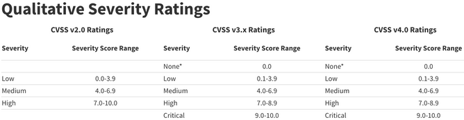

# Vulnerability Scanning

## Intro

### How Vulnerability Scanners Work

Each vuln scanner follows its own customized workflow, but the core process is the same:

1. Host discovery
2. Port scanning
3. OS, service, and version detection
4. Matching the results to a vuln database

These steps allow the scanner to identify exposed services and determine whether known vulnerabilities affect them.

Together, these four steps give the scanner enough context to match discovered services against known vulns.

Host discovery determines whether the target system is reachable and responding on the network. The scanner then probes all open ports to detect remotely accessible services and their versions, and also identifies the OS.

Using the collected information, the scanner queries a vulnerability database to match the detected software and versions against known vulns.

Examples of vulnerability dbs are the [National Vulnerability Database](https://nvd.nist.gov/) (_NVD_) and the [Common Vulnerabilities and Exposures](https://cve.mitre.org/cve/search_cve_list.html) (_CVE_) program. CVE lists and names specific vulns. NVD builds on that list and adds severity scores and deeper analysis for each vuln.

A CVE identifier tells you what the vuln is, but not how serious it is. That is the role of the Common Vulnerability Scoring System.

The [Common Vulnerability Scoring System](https://nvd.nist.gov/vuln-metrics/cvss) (_CVSS_) is a framework for addressing the characteristics and severity of vulns. Each CVE has a CVSS score assigned. The two major versions are [CVSS v3](https://www.first.org/cvss/user-guide) and [CVSS v4](https://www.first.org/cvss/v4.0/user-guide).

Both versions use a range from 0 to 10 to rate vulns with different severity labels.



To obtain a CVSS score, you can review the CVE entry in a vulnerability database or use an online CVSS calculator. NIST provides calculators for both [CVSS v3](https://nvd.nist.gov/vuln-metrics/cvss/v3-calculator) and [CVSS v4](https://nvd.nist.gov/vuln-metrics/cvss/v4-calculator).

### Types of Vuln Scans

If a client tasks you with an external vuln scan, they mean to analyze one or more systems that are accessible from the internet. Targets in an external vulnerability scan are often web apps, systems in the DMZ, and public facing services.

The client wants a clear picture of the security status of all systems that an external attacker can reach. In most cases, the client provides a list of IP addresses for the scan. Sometimes, the client asks the team to identify all externally accessible systems and services on its own.

If a client tasks you with an internal vuln scan, you either get VPN access or perform the scan on-site. The intention is to get an overview of the security status of the internal network. It is important to analyze which vectors an attacker can use after breaching the perimeter.

An unauthenticated vulnerability scan is done on a system without credentials. These are geared towards finding vulns in remotely accessible services on a target. Therefore, they map the system with all open ports and provide you with an attack surface by matching the information to vulnerability databases as mentioned before.

Most scanner can be configured to run authenticated scans. Here the scanner logs in to the target with a set of valid credentials.

## Nessus

Look [here](/src/attack/vuln_scanning/nessus.md).

## Nmap

Nmap Scripting Engine (_NSE_) allows you to run targeted vulnerability checks directly from the command line.

### NSE Vulnerability Scripts

An NSE script can have more than one category. For example, it can be categorized as `safe` and `vuln`, or `intrusive` and `vuln`. Scripts categorized as `safe` have no potential impact to stability, while scripts in the `intrusive` category might crash a target service or system. To avoid any stability issues, it's imperative to check how the scripts are categorized, and you should never run an NSE script or category without understanding the implications. [NSE Documentation](https://nmap.org/nsedoc).

The `/usr/share/nmap/scripts/` directory contains NSE scripts, ending with the `.nse` filetype. It also contains the `script.db` file, which serves as an index to all currently available NSE scripts.

You can query `script.db` with grep to filter by category.

```bash
kali@kali:~$ cd /usr/share/nmap/scripts/

kali@kali:/usr/share/nmap/scripts$ cat script.db  | grep "\"vuln\""
Entry { filename = "afp-path-vuln.nse", categories = { "exploit", "intrusive", "vuln", } }
Entry { filename = "broadcast-avahi-dos.nse", categories = { "broadcast", "dos", "intrusive", "vuln", } }
Entry { filename = "clamav-exec.nse", categories = { "exploit", "vuln", } }
Entry { filename = "distcc-cve2004-2687.nse", categories = { "exploit", "intrusive", "vuln", } }
Entry { filename = "dns-update.nse", categories = { "intrusive", "vuln", } }
...
```

Each entry has a file name and categories. The file name represents the name of the NSE script in the NSE directory.

The `--script` parameter determines which NSE scripts Nmap executes during a scan. Its argument can be one of the following:

- a script category
- a boolean expression combining categories or script names
- a comma-separated list of categories
- the full or wildcard-specified name of an NSE script listed in `script.db`
- an absolute path to a specific NSE script

The following command runs all `vuln` category NSE scripts against port 443.

```bash
kali@kali:~$ sudo nmap -sV -p 443 --script "vuln" 192.168.50.13
[sudo] password for kali:
Starting Nmap 7.92 ( https://nmap.org )
...
PORT    STATE SERVICE VERSION
443/tcp open  http    Apache httpd 2.4.49 ((Unix))
...
| vulners:
|   cpe:/a:apache:http_server:2.4.49:
...
        https://vulners.com/githubexploit/DF57E8F1-FE21-5EB9-8FC7-5F2EA267B09D	*EXPLOIT*
|     	CVE-2021-41773	4.3	https://vulners.com/cve/CVE-2021-41773
...
|_http-server-header: Apache/2.4.49 (Unix)
MAC Address: 00:0C:29:C7:81:EA (VMware)
```

Nmap detected the Apache service with version 2.4.49 and tried all the NSE scripts from the `vuln` category. Most of the output comes from the `vulners` script, which uses the information from the detected service and version to provide related vulnerability data.

### Working with NSE Scripts

While the `vulners` script provides an overview of all CVEs mapped to the detected version, you sometimes want to check for a specific CVE. This is especially helpful when you want to scan a network for the existence of a vuln. If you do this with the `vulners` script, you will need to review an enormous amount of information. For most modern vulns, you need to integrate dedicated NSE scripts manually.

To find a suitable NSE script, you can use a search engine to find the CVE number plus NSE (_CVE-2021-41773 nse_).

A search result like [this GitHub page](https://github.com/RootUp/PersonalStuff/blob/master/http-vuln-cve-2021-41773.nse) provides a script to check for the abovementioned vuln. Download this script and save it as `/usr/share/nmap/scripts/http-vuln-cve2021-41773.nse` to comply with the naming syntax of other NSE scripts. Before you can use the script, you'll need to update `script.db` with `--script-updatedb`.

```bash
kali@kali:~$ sudo cp /home/kali/Downloads/http-vuln-cve-2021-41773.nse /usr/share/nmap/scripts/http-vuln-cve2021-41773.nse

kali@kali:~$ sudo nmap --script-updatedb
[sudo] password for kali:
Starting Nmap 7.92 ( https://nmap.org )
NSE: Updating rule database.
NSE: Script Database updated successfully.
Nmap done: 0 IP addresses (0 hosts up) scanned in 0.54 seconds
```

To use the NSE script, you'll provide the name of the script, target information, and port number. You'll also enable service detection.

Running the custom script against the same target produces the following output. Look for the VULNERABLE state and the path traversal URL in the Check results section - these confirm the finding.

```bash
kali@kali:~$ sudo nmap -sV -p 443 --script "http-vuln-cve2021-41773" 192.168.50.124
Starting Nmap 7.92 ( https://nmap.org )
Host is up (0.00069s latency).

PORT    STATE SERVICE VERSION
443/tcp open  http    Apache httpd 2.4.49 ((Unix))
| http-vuln-cve2021-41773:
|   VULNERABLE:
|   Path traversal and file disclosure vulnerability in Apache HTTP Server 2.4.49
|     State: VULNERABLE
|               A flaw was found in a change made to path normalization in Apache HTTP Server 2.4.49. An attacker could use a path traversal attack to map URLs to files outside the expected document root. If files outside of the document root are not protected by "require all denied" these requests can succeed. Additionally this flaw could leak the source of interpreted files like CGI scripts. This issue is known to be exploited in the wild. This issue only affects Apache 2.4.49 and not earlier versions.
|
|     Disclosure date: 2021-10-05
|     Check results:
|
|         Verify arbitrary file read: https://192.168.50.124:443/cgi-bin/.%2e/%2e%2e/%2e%2e/%2e%2e/etc/passwd
...
Nmap done: 1 IP address (1 host up) scanned in 6.86 seconds
```

The output indicates that the target is vulnerable to CVE-2021-41773 and provides you with additional background information.