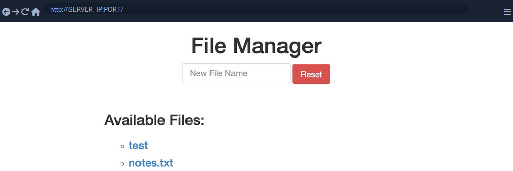
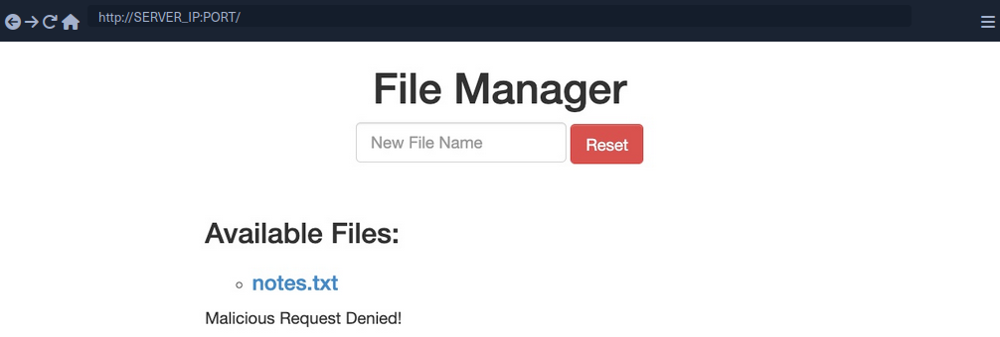

# HTTP Verb Tampering

## Intro

The HTTP protocol works by accepting various HTTP methods as verbs at the beginning of an HTTP request. Depending on the web server config, web apps may be scripted to accept certain HTTP methods for their various functionalities and perform a particular action based on the type of the request.

Suppose both the web app and the back-end web server are configured only to accept GET and POST requests. In that case, sending a different request will cause a web server error page to be displayed, which is not a severe vulnerability in itself. On the other hand, if the web server configs are not restricted to only accept the HTTP methods required by the web server, and the web app is not developed to handle other types of HTTP requests, then you may be able to exploit this insecure config to gain access to functionalities you do not have access to, or even bypass certain security controls.

### HTTP Verb Tampering

HTTP has [9 different verbs](https://developer.mozilla.org/en-US/docs/Web/HTTP/Reference/Methods) that can be accepted as HTTP methods by web servers. Most common are:

| Verb | Description |
| ---- | ----------- |
| **HEAD** | identical to a GET request, but its response only contains headers, without the response body |
| **PUT** | writes the request payload to the specified location |
| **DELETE** | deletes the resource at the specified location |
| **OPTIONS** | shows different options accepted by a web server, like accepted HTTP verbs |
| **PATCH** | apply partial modifications to the resource at the specified location |

### Insecure Configurations

Insecure web server configs cause the first type of HTTP Verb Tampering vulns. A web server's authentication configuration may be limited to specific HTTP methods, which would leave some HTTP methods accessible without authentication. For example, a system admin may use the following config to require authentication on a particular web page:

```xml
<Limit GET POST>
    Require valid-user
</Limit>
```

Even though the config specifies both GET and POST requests for the authentication method, an attacker may still use a different HTTP method to bypass this authentication mechanism altogether. This eventually leads to an authentication bypass and allows attackers to access web pages and domains they should not have access to.

### Insecure Coding

... causes the other type of HTTP Verb Tampering vulns. This can occur when a web developer applies specific filters to mitigate particular vulns while not covering all HTTP methods with that filter. For example, if a web page was found to be vulnerable to a SQLi vuln, and the back-end developer mitigated the SQLi vuln by the following applying input sanitization filters:

```php
$pattern = "/^[A-Za-z\s]+$/";

if(preg_match($pattern, $_GET["code"])) {
    $query = "Select * from ports where port_code like '%" . $_REQUEST["code"] . "%'";
    ...SNIP...
}
```

The sanitization filter is only being tested on the GET parameter. If the GET requests do not contain any bad chars, then the query would be executed. However, when the query is executed the ```_REQUEST['code']``` parameters are being used, which may also contain POST parameters, leading to an inconsistency in the use of HTTP verbs. In this case, an attacker may use a POST request to perform SQLi, in which case the GET parameters would be empty. The request would pass the security filter, which would make the function still vulnerable to SQLi.

## Bypassing Basic Authentication

### Identify



In this example, you can add new files by typing their names and hitting enter.

However, suppose you are trying to delete all files ny clicking on the red ```Reset``` button. In that case, you see that this functionality seems to be restricted for authenticated users only, as you get the following HTTP Basic Auth prompt:


Since you don't have any creds, you will get a ```401 Unauthorized``` page in response.

To identify which pages are restricted by this authentication, you can examine the HTTP request after clicking the Reset button or look at the URL that the button navigates to after clicking it. You'll see that it is at ```/admin/reset.php```. So either the ```/admin``` directory is restricted to authenticated users only, or only the ```/admin/reset.php``` page is. You can confirm this by visiting the ```/admin``` directory, and you do indeed get prompted to log in again. This means that the full ```/admin``` directory is restricted.

### Exploit

To try and exploit the page, you need to identify the HTTP request method used by the web app. You can intercept the request with Burp and examine it.

As the page uses a GET request, you can send a POST request and see whether the web page allows POST requests. To do so, you can right-click on the intercepted request in Burp and select ```Change Request Method```, and it will automatically change the request into a POST request.

Once you do so, you can click ```Forward``` and examine the page in your browser. Unfortunately, you still get prompted to log in and will get a ```401 Unauthorized``` page if you don't provide the creds.

So, it seems like the web server configs do cover both GET and POST requests. However, you can utilize many other HTTP methods, most notably the HEAD method, which is identical to a GET request but does not return the body in the HTTP response. If this is successful, you may not receive any output, but the reset function should still get executed, which is your main target.

To see whether the server accepts HEAD requests, you can send an OPTIONS request to it and see what HTTP methods are accepted:

```bash
d41y@htb[/htb]$ curl -i -X OPTIONS http://SERVER_IP:PORT/

HTTP/1.1 200 OK
Date: 
Server: Apache/2.4.41 (Ubuntu)
Allow: POST,OPTIONS,HEAD,GET
Content-Length: 0
Content-Type: httpd/unix-directory
```

You can see, the response shows ```Allow: POST, OPTIONS, HEAD, GET```, which means that the web server indeed accepts HEAD requests, which is the default config for many web servers. Now try to intercept the Resest request again, and this time use a HEAD request to see how the web server handles it:


Once you change POST to HEAD and forward the request, you will see that you no longer get a login prompt or a ```401 Unauthorized``` page and get an empty output instead, as expected with a HEAD request. If you go back to the file manager web app, you will see that all files have indeed been deleted, meaning that you successfully triggered the Reset functionality without having admin access or any creds.

## Bypassing Security Filters

### Identify



In this example, if you try to create a new file with special characters in its name, you get this message.

It shows that the web app uses certain filters on the back-end to identify injection attempts and then blocks any malicious requests. No matter what you try, the web app properly blocks your request and is secured against injection attempts. However, you may try an HTTP Verb Tampering attack to see if you cann bypass the security filter altogether.

### Exploit

Intercept your request and change it to another method. Using GET you did not get a ```Malicious Request Denied!``` response back, which means the file was successfully created. To confirm whether you bypassed the security filter, you need to attempt exploiting the vuln the filter is protecting: a command injection, in this case. So, you can inject a command that creates two files and then check whether both files were created. To do so, you can use the following file name in your attack:

```bash
file1; touch file2;
```

1. Send the request
2. Intercept it
3. Change the HTTP Verb
4. Forward the request
5. Refresh the website

## Verb Tampering Prevention

### Insecure Configuration

HTTP Verb Tampering vulns can occur in most modern web servers, including Apache, Tomcat, and ASP.Net. The vulnerability usually happens when you limit a page's authorization to a particular set of HTTP verbs/methods, which leaves the other remaining methods unprotected.

The following is an example of a vulnerable config for an Apache web server, which is located in the site configuration file, or in a ```.htaccess``` web page configuration.

```xml
<Directory "/var/www/html/admin">
    AuthType Basic
    AuthName "Admin Panel"
    AuthUserFile /etc/apache2/.htpasswd
    <Limit GET>
        Require valid-user
    </Limit>
</Directory>
```

This configuration is setting the authorizations for the admin web directory. However, as the ```<Limit GET>``` keyword is being used, the ```Require valid-user>``` setting will only apply to GET requests, leaving the page accessible through POST requests. Even if both GET and POST were specified, this would leave the page accessbile through other methods, like HEAD or OPTIONS.

The following example shows the same vuln for a Tomcat web server configuration, which can be found in the ```web.xml``` file for a certain Java web app.

```xml
<security-constraint>
    <web-resource-collection>
        <url-pattern>/admin/*</url-pattern>
        <http-method>GET</http-method>
    </web-resource-collection>
    <auth-constraint>
        <role-name>admin</role-name>
    </auth-constraint>
</security-constraint>
```

The authorization is being limited only to the GET method with ```http-method```, which leaves the page accessible through other HTTP methods.

The following is an example for an ASP.Net config found in the ```web.config``` file of a web app.

```xml
<system.web>
    <authorization>
        <allow verbs="GET" roles="admin">
            <deny verbs="GET" users="*">
        </deny>
        </allow>
    </authorization>
</system.web>
```

The ```allow``` and ```deny``` scope is limited to the GET method, which leaves the web app accessible through other HTTP methods.

It's not secure to limit the authorization configuration to a specific HTTP verb. This is why you should always avoid restricting authorization to a particular HTTP method and always allow/deny all HTTP verbs and methods.

If you want to specify a single method, you can use safe keywords, like ```LimitExcept``` in Apache, ```http-method-omission``` in Tomcat, and ```add/remove``` in ASP.Net, which cover all verbs except the specified ones.

### Insecure Coding

Consider the following PHP code from the File Manager exercise:

```php
if (isset($_REQUEST['filename'])) {
    if (!preg_match('/[^A-Za-z0-9. _-]/', $_POST['filename'])) {
        system("touch " . $_REQUEST['filename']);
    } else {
        echo "Malicious Request Denied!";
    }
}
```

If you were only considering Command Injection vulns, you would say that this is securely coded. The ```preg_match``` function properly looks for unwanted special characters and does not allow the input to go into the command if any special chars are found. However, the fatal error made in this case is not due to Command Injections but due to the inconsistent use of HTTP methods.

You can see that the ```preg_match``` filter only checks for special chars in POST parameters with ```$_POST['filename']```. However, the final system command uses the ```$_REQUEST['filename']``` variable, which covers both GET and POST parameters. So, in the previous section, when you were sending your malicious input through a GET request, it did not get stopped by the ```preg_match``` function, as the POST parameters were empty and hence did not contain any special chars. Once you reach the system function, however, it used any parameters found in the request, and your GET parameters were used in the command, eventually leading to Command Injection.

To avoid HTTP Verb Tampering vulns in your code, you must be consistent with your use of HTTP and ensure that the same method is always used for any specific functionality across the web app. It is always advised to expand the scope of testing in security filters by testing all request parameters. This can be done with the following functions and variables:

| Language | Function |
| -------- | -------- |
| **PHP** | ```$_REQUEST['param']``` |
| **Java** | ```request.getParameter('param')``` |
| **C#** | ```Request['param']``` |