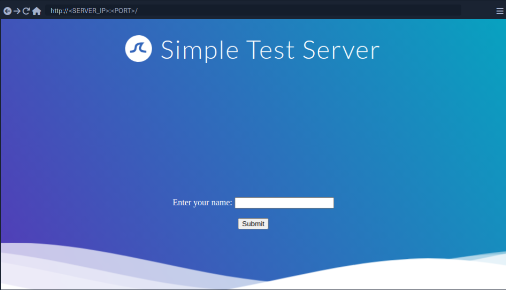
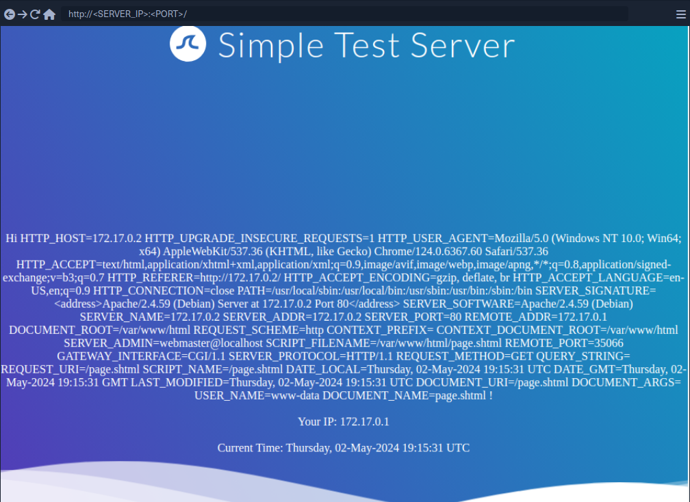

# Server-Side Includes Injection (SSI)

Server-Side Includes (SSI) is a technology web applications used to create dynamic content on HTML pages. SSI is supported by many popular web servers such as Apache and IIS. The use of SSI can often be inferred from the file extension. Typical file extensions include ```.shtml```, ```.shtm```, and ```.stm```. However, web servers can be configured to support SSI directives in arbitrary file extensions. As such, you cannot conclusively conclude whether SSI is used only from the extension.

SSI injection occurs when an attacker can inject SSI directives into a file that is subsequently served by the web server, resulting in the execution of the injected SSI directives. This scenario can occur in a variety of circumstances. For instance, when the web application contains a vulnerable file upload vulnerability that enables an attacker to upload a file containing malicious SSI directives into the web root directory. Additionally, attackers might be able to inject SSI directives if a web application writes user input into a file in the web root directory.

## Directives

SSI utilizes directives to add dynamically generated content to a static HTML page. These directives consist of the following components:

- **name**: the directive's name
- **parameter name**: one or more parameters
- **value**: one or more parameter values

An SSI directive has the following syntax:

```ssi
<!--#name param1="value1" param2="value" -->
```

### Common SSI directives:

#### printenv

... prints environment variables. It does not take any variables.

```ssi
<!--#printenv -->
```

#### config

... changes the SSI configuration by specifying corresponding parameters.

```ssi
<!--#config errmsg="Error!" -->
```

#### echo

... prints the value of any variable given in the ```var``` parameter. Mulitple variables can be printed by spefifying multiple ```var``` parameters.

- **DOCUMENT_NAME**: the current file's name
- **DOCUMENT_URI**: the current file's URI
- **LAST_MODIFIED**: timestamp of the last modification of the current file
- **DATE_LOCAL**: local server time

```ssi
<!--#echo var="DOCUMENT_NAME" var="DATE_LOCAL" -->
```

#### exec

... executes the command given in the ```cmd``` parameter.

```ssi
<!--#exec cmd="whoami" -->
```

#### include

... includes the file specified in the ```virtual``` parameter. It only allows for the inclusion of files in the web root directory.

```ssi
<!--#include virtual="index.html" -->
```

## Exploitation



If you enter your name, you are redirected to ```/page.shtml```, which displays some general information. You can guess that the page supports SSI based on the file extension. If your username is inserted into the page without prior sanitization, it might be vulnerable to SSI injection.

```<!--#printenv -->``` Example:



The environment variables are printed and thus you have successfully confirmed an SSI injection vulnerability.

## Prevention

Developers must carefully validate and sanitize user input to prevent SSI injection. This is particularly important when the user input is used within SSI directives or written to files that may contain SSI directives according to the web server configuration. Additionally, it is vital to configure the webserver to restrict the use of SSI to particular file extensions and potentially even particular directories. On top of that, the capabilities of specific SSI directives can be limited to help mitigate the impact of SSI injection vulnerabilities. For instance, it might be possible to turn off the ```exec``` directive if it is not actively required.