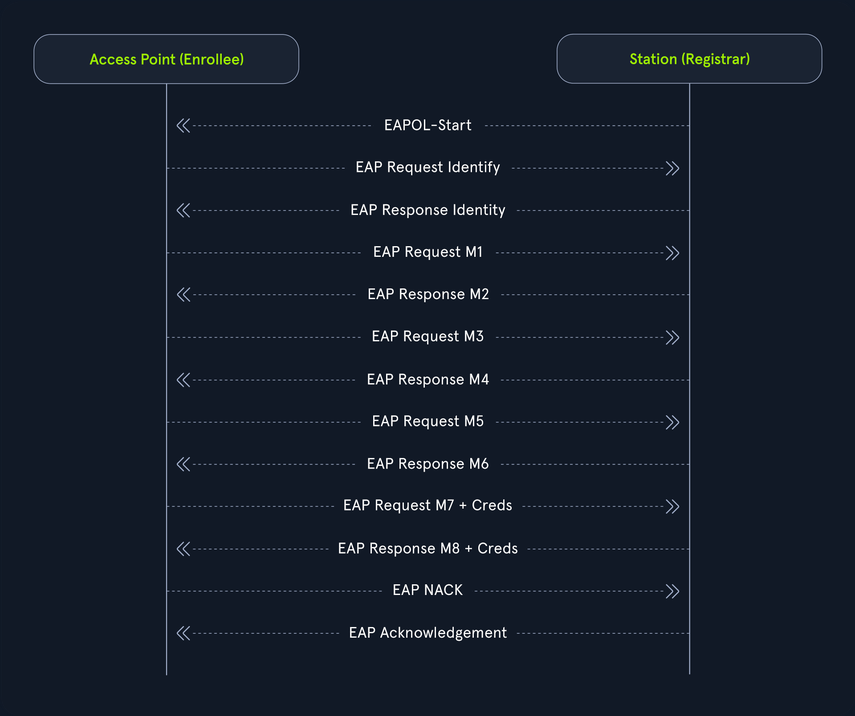

# WPS

## Introduction

### Wi-Fi Protected Setup Overview

WPS was originally developed by Cisco in 2006 as a method to enable convenience and ease of use for users with little knowledge. Either through the push of a button or entering of a PIN users are able to easily connect their devices to their wireless network. Since then, multiple different exploitation tools have been developed with the intent to abuse the PIN. WPS PINs are eight digits in length, making them significantly easier to crack compared to traditional WPA methods.

Although convenient, WPS is susceptible to online PIN cracking and offline PIN cracking methods. WPS utilizes a series of EAP messages exchanged between a station and an access point (_registrar_). During this process, valuable information is disclosed; information that can be exploited for these attack methods. While traditional online PIN cracking takes hours to complete, offline PIN cracking can be as quick as a few minutes when the access point is vulnerable.

WPS utilizes HMAC-SHA-256, which is considered a fairly secure hashing function. However, due to the lack of possible PIN combinations, randomness in nonce values, and information disclosed in the communications between the access point and the client, you are able to crack these PINs relatively quickly and retrieve the PSK for normal WPA communications.

When assessing wireless access points, it is always important to check for WPS vulns. As such, possessing the skills to test for WPS-related vectors is crucial for all wireless pentesters.

#### WPS Connection Methods

There are four methods to connect to a WPS-enabled access point. Each of them is detailed below:

|Method|Description|
|---|---|
|`Push Button Configuration (PBC)`|This is the most common method and involves pressing a physical or virtual button on the router and the client device. Once the button is pressed on both devices, they automatically exchange the necessary information to establish a secure connection.|
|`PIN Entry`|Each WPS-enabled device has an 8-digit PIN code, either provided by the manufacturer or displayed on the device. Users enter this PIN on their router or access point’s configuration page to connect the device to the network.|
|`Near-field communication method`|Some devices support NFC, allowing users to tap the device on the router to establish a connection. This method is less common but offers an additional level of convenience.|
|`USB Flash Drive`|Involves transferring configuration settings via a USB drive from the router to the client device. This method is rarely used due to the inconvenience compared to other methods.|

#### Benefits of WPS

- Ease of use
	- Simplifies the process of adding new devices to a wireless network, making it accessible even for non-technical users.
- Convenience
	- Eliminates the need to remember or enter long and complex passwords.

#### Security Concerns

While WPS was designed to make network connections simpler, it has notable security vulns:

- PIN method vuln:
	- The 8-digit PIN can be cracked relatively easily through brute-force attacks due to the way the protocol verifies the PIN in two halves.
- Physical Security Risks
	- The PBC method relies on physical security, meaning an unauthorized person within range could potentially push the button and connect to the network.

Wi-Fi Protected Setup provides an easy way to connect devices to a Wi-Fi network, but it comes with significant security risks, especially with the PIN method. Understanding these risks and taking steps to mitigate them, such as disabling WPS and using robust security protocols, can help protect your network.

### How WPS works

WPS works by establishing authentication through a series of [Extensible Authentication Protocol](https://en.wikipedia.org/wiki/Extensible_Authentication_Protocol) (_EAP_) messages. Some of the information communicated includes Public Keys, PINs, and nonce values. Essentially, after some checks and balances between the access point and the connected client, the access point shares the WPA pre-shared key, which allows the connected client to ensure communications as normal with WPA. It should also be noted that when WPS is used to confgure an access point, the roles of the access point and the client device can switch. In this case, the AP may act as the Enrollee, while the client device assumes the role of the Registrar, which is responsible for [configuring the AP](https://android.googlesource.com/platform/external/wpa_supplicant_8/+/master/wpa_supplicant/README-WPS#36).

There are several methods for WPS to begin the series of EAP messages. Commonly these are through the PIN method initiated by the client, and the push button method initiated manually on the access point. There are other methods as well such as the Near-field communication method through the usage of RFID among many other WPS-related technologies.

#### WPS PIN Anatomy

The WPS PIN is eight digits in length and consists of two primary portions. The first portion is used in the M4 and M5 EAP messages, and the second portion is used in the M6 and M7 EAP messages. Each of these portions is four digits in length. Most would assume that there would be 100,000,000 possible combinations, but in the case of WPS, this is not true. There are only 11,000 possible combinations.


This is due to how the PIN functions. The first half only has 10^4 possible combinations and the second half only has 10^3 possible combinations. The last digit of the second half is used as a checksum and can easily be calculated. Therefore, there are only 10^4 + 10^3 possible digit combinations, which is 11,000 total combinations.

#### WPS EAP Messages

Before describing the series of EAP messages, the following definitions will come in handy:

|Name|Definition|
|---|---|
|`PKe`|This is the Enrollee's (Access Point's) Diffie-Hellman public key.|
|`PKr`|This is the Registrar's (Station's/Client's) Diffie-Hellman public key.|
|`PSK1`|First four-digit portion of the PIN (10,000 possible combinations).|
|`PSK2`|Second four-digit portion of the PIN (1,000 possible combinations). The last digit is used as the checksum.|
|`KDK (Key Derivation Key)`|This is a key used in derivation for the auth key.|
|`KWK (Key Wrap Key)`|Used in the process of encrypting messages with AES.|
|`E-S1`|This is a secret 128-bit enrollee (AP) nonce value used in derivation for E-Hash1.|
|`E-S2`|This is a secret 128-bit enrollee (AP) nonce value used in derivation for E-Hash2.|
|`R-S1`|This is a secret 128-bit registrar (client/station) nonce value used in derivation for R-Hash1.|
|`R-S2`|This is a secret 128-bit registrar (client/station) nonce value used in derivation for R-Hash2.|
|`E-Hash1 (Enrollee Hash1)`|Comprised of the E-S1 nonce value, PSK1, PKe, and PKr values. Created through the HMAC-SHA-256 hashing function using the Auth Key.|
|`E-Hash2 (Enrollee Hash2)`|Comprised of the E-S2 nonce value, PSK2, PKe, and PKr values. Created through the HMAC-SHA-256 hashing function using the Auth Key.|
|`R-Hash1 (Registrar Hash1)`|Comprised of the R-S1 nonce value, PSK1, PKe, and PKr values. Created through the HMAC-SHA-256 hashing function using the Auth Key.|
|`R-Hash2 (Registrar Hash2)`|Comprised of the R-S2 nonce value, PSK2, PKe, and PKr values. Created through the HMAC-SHA-256 hashing function using the Auth Key.|
|`Auth Key`|Derived from the KDK, PSK1, and PSK2 values.|
|`WPA-PSK`|This is the final disclosed pre-shared key (aka password) used to authenticate the client.|

The series of EAP messages from a high level looks like the following:



Each of these messages is responsible for disclosing different information, and the conduct the following:

| Message                 | Description                                                                                                 |
| ----------------------- | ----------------------------------------------------------------------------------------------------------- |
| `EAPOL-Start`           | The connected client initiates the series of EAP messages.                                                  |
| `EAP Request Identity`  | The access point requests the connected client's identity.                                                  |
| `EAP Response Identity` | The client sends the access point its identity as requested.                                                |
| `EAP M1 Message`        | The access point sends the client their Diffie-Hellman public key (PKe).                                    |
| `EAP M2 Message`        | The client then sends the Access point the their Diffie-Hellman public key (PKr).                           |
| `EAP M3 Message`        | The access point sends the client the E-Hash1 and E-Hash2 values.                                           |
| `EAP M4 Message`        | The client then sends the access point the R-Hash1, R-Hash2, and R-S1 nonce value encrypted with AES.       |
| `EAP M5 Message`        | The access point sends the client the E-S1 nonce value encrypted with AES.                                  |
| `EAP M6 Message`        | The client sends the access point the R-S2 nonce value encrypted with AES.                                  |
| `EAP M7 Message`        | If the PIN is correct, the access point sends the client the E-S2 value and the WPA-PSK encrypted with AES. |
| `EAP M8 Message`        | The client then sends the WPA-PSK back to the access point to begin the WPA handshake process.              |

These EAP messages are simple yet somewhat complex. Fortunately, two different cracking methods can be employed to guess the correct PIN and retrieve the final WPA-PSK. These methods are online brute-forcing and offline brute-forcing, also known as the Pixie Dust Attack.

### WPS Recon

In order to analyze a target network, you need to view its WPS information. You can do so with several different tools. Some of the information you hope to attain is the MAC address of the access point and which WPS version it is using. The MAC address is useful because an easy vendor lookup may allow you to find that the access point's vendor may or may not be susceptible to different kinds of WPS attacks. This can easily be done with a bit of research. Additionally, you want to find which version of WPS is running, along with which mode it is in, as it will help you narrow down which attack techniques to employ. If an ccess point is running WPS version 2.0 it is unlikely that you will be able to use any vector beyond pixie dust attacks, possibly null pin attacks, and brute-forcing attempts with very long reattempt periods. This is due to a few factors, such as a locking feature built into most access points. After a certain amount of incorrectly guessed PINs the access point locks and requires either a reboot or timeout for additional PIN guesses.

#### Scanning WPS Networks with Airodump-ng

First you need to list your available interfaces.

```bash
d41y@htb[/htb]$ iwconfig

lo        no wireless extensions.

eth0      no wireless extensions.

wlan0     IEEE 802.11  ESSID:off/any  
          Mode:Managed  Access Point: Not-Associated   Tx-Power=20 dBm   
          Retry short  long limit:2   RTS thr:off   Fragment thr:off
          Encryption key:off
          Power Management:off
```

Then at this point you need to enable monitor mode for your interface.

```bash
d41y@htb[/htb]$ airmon-ng start wlan0
```

To begin searching for networks with WPS you employ the following command. You specify `--wps` to display WPS information and `--ignore-negative-one` to remove -1 PWR error messages.

```bash
d41y@htb[/htb]$ airodump-ng --wps --ignore-negative-one wlan0mon

BSSID              PWR  Beacons    #Data, #/s  CH   MB   ENC CIPHER  AUTH WPS    ESSID
XX:XX:XX:XX:XX:XX  -43        1        0    0   6  195   WPA2 CCMP   PSK  2.0 LAB   FakeNetwork
XX:XX:XX:XX:XX:XX  -43        1        0    0   6  195   WPA2 CCMP   PSK  1.0 USB   FakeNetwork
XX:XX:XX:XX:XX:XX  -43        1        0    0   6  195   WPA2 CCMP   PSK  1.0 DISP  FakeNetwork
XX:XX:XX:XX:XX:XX  -43        1        0    0   6  195   WPA2 CCMP   PSK  1.0 PBC   FakeNetwork
XX:XX:XX:XX:XX:XX  -43        1        0    0   6  195   WPA2 CCMP   PSK  2.0 PBC   FakeNetwork
60:38:E0:XX:XX:XX   -7   0   24        0    0   8  130   WPA2 CCMP   PSK  1.0 LAB   HTB-Wireless 
```

You could also narrow down your scan further to just your network in question with the following command. You specify the channel with `-c` and the AP MAC with `--bssid`.

```bash
d41y@htb[/htb]$ airodump-ng --wps --ignore-negative-one -c 8 --bssid 60:38:E0:XX:XX:XX wlan0mon
```

With Airodump-ng, you can obtain solid information about the WPS versiond and the mode it is using to operate. WPS includes several different modes, and Airodump-nd uses the following acronyms to represent them.

|Acronym|Description|
|---|---|
|`DISP`|The Access Point generates a PIN in its administrative setup portal, and the PIN can be found there.|
|`ETHER`|A rare mode that allows enrollees and registrars to undergo setup over Ethernet.|
|`EXTNFC`|WPS using Near Field Communication.|
|`INTNFC`|WPS using Near Field Communication.|
|`KPAD`|Keypad PIN method configuration. Enrollees connect by entering the WPS PIN into a keypad on the client device.|
|`LAB`|The PIN is displayed on a label attached to the access point itself.|
|`Locked`|WPS is locked. This can occur from too many incorrect guesses.|
|`NFCINTF`|WPS using Near Field Communication.|
|`PBC`|Push Button Configuration. Allows clients to join by pressing the WPS button on both the access point and the client device.|
|`USB`|Data is transferred between the access point and the client through a USB interface.|

#### Scanning WPS Networks with Wash

Wash is another great tool for scanning networks with WPS. You can employ a simple command with wash to display all networks with WPS and their respective versions.

```bash
d41y@htb[/htb]$ wash -i wlan0mon

BSSID               Ch  dBm  WPS  Lck  Vendor    ESSID
--------------------------------------------------------------------------------
60:38:E0:XX:XX:XX    3  -07  1.0  No   AtherosC  HTB-Wireless
XX:XX:XX:XX:XX:XX    1  -63  2.0  No   LantiqML  FakeNetwork
XX:XX:XX:XX:XX:XX    1  -63  2.0  No   Quantenn  FakeNetwork
XX:XX:XX:XX:XX:XX    1  -61  2.0  No   AtherosC  FakeNetwork
```

You can display much more verbose output with wash using the following command.

```bash
d41y@htb[/htb]$ wash -j -i wlan0mon

{"bssid" : "XX:XX:XX:XX:XX:XX", "essid" : "FakeNetwork", "channel" : 1, "rssi" : -61, "wps_version" : 32, "wps_state" : 2, "wps_locked" : 2, "wps_response_type" : "03", "wps_config_methods" : "0000", "wps_rf_bands" : "03", }
{"bssid" : "XX:XX:XX:XX:XX:XX", "essid" : "FakeNetwork", "channel" : 1, "rssi" : -61, "wps_version" : 32, "wps_state" : 2, "wps_locked" : 2, "wps_response_type" : "03", "wps_config_methods" : "0000", "wps_rf_bands" : "03", }
```

It is important to check the `wps_locked` status from wash. If it is set to 2, it means WPS is not in a locked state. Additionally, you can find out which vendor is associated with the access point with the following command, specifying the beginning of the MAC address.

```bash
d41y@htb[/htb]$ grep -i "84-1B-5E" /var/lib/ieee-data/oui.txt

84-1B-5E   (hex)                NETGEAR
```

#### Things to be wary of when testing WPS

When attempting to test WPS, you want to note the following conditions:

- The WPS Version
- `wps_locked` Status
	- You want to ensure that clients can joint the network
- The WPS Mode
	- If you need to press a button to join the network, chances are you are not cracking the PIN this way
- Max PIN Attempts Locking
	- If the access point locks after a few incorrectly guessed PINs, you likely will not be able to get through all 11,000 possible combinations

