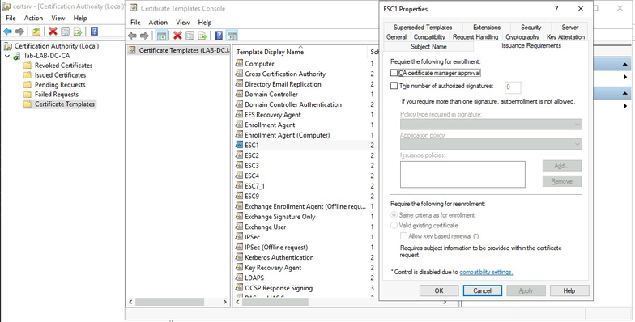

# ADCS Attacks

## Introduction

### ADCS 

= _Active Directory Certificate Services_

ADCS empowers organizations to establish and manage their own Public Key Infrastructure (PKI), a foundation for secure communication, user authentication, and data protection.

#### PKI

... is a system that uses digital certificates and public key cryptography to provide secure communication over unsecured networks, such as the Internet. PKI enables digital signatures, encryption, and authentication of electronic documents, email messages, and other forms of online communication.

A digital certificate is an electronic document that binds a public key to a person, organization, device or service. It is issued and signed by a trusted Certificate Authority (_CA_), which verifies the identity of the certificate holder and the integrity of the public key. The certificate includes the public key, the name of the subject, the name of the issuer, the validity period, and other attributes.

**Benefits of PKI**:

- Confidntiality
	- The PKI allows you to encrypt data that is stored or transmitted.
- Integrity
	- A digital signature identifies whether the data is modified while the data is transmitted.
- Authenticity
	- A message digest is digitally signed using the sender's private key. Because the digest can be decrypted only the sender's corresponding public key, it proves that the message can come only from the sending user.

**Advantages of ADCS over PKI**;

- Tight integration with ADDS, which simplifies certificate management and authentication within enterprise organizations that use AD.
- Built-in support for certificate revocation using the Certificate Revocation List (_CRL_) and the Online Certificate Status Protocol (_OCSP_).
- Support for custom certificate templates, which allows administrators to define the attributes, extensions, and policies of the certificate issued by ADCS.
- Scalability and redundancy, which allows multiple CAs to be deployed in a hierarchy or load-balanced cluster.

#### What is ADCS?

ADCS is a Windowss server role that enables organizations to establish and manage their own Public Key Infrastructure.

ADCS integrates with ADDS, which is a centralized database of users, computers, groups, and other objects in a Windows network.

ADCS can be used to secure various network services, such as Secure Socket Layer/Transport Layer Security, Virtual Private Network, Remote Desktop Services, and Wireless LAN. It can also issue certificates for smart cards and other physical tokens, which can be used to authenticate users to network resources. The private key stored on the smart card or token is then used to authenticate the user to the network.

ADCS includes:

1. Digital Certificates
2. Certificate Authority
	1. Stand-alone CA or Enterprise CA
	2. Root CA or Subordinate CA
3. Certificate Templates
4. Key Pair Generation
5. Certificate Revocation
6. Secure Communication
7. Digital Signatures
8. Encryption and Decryption
9. Enhanced Security and Identity Management

#### Essential ADCS Terminology

ADCS orchestrates a symphony of cryptographic intricacies that underpin modern security. This technology empowers organizations to establish and manage their PKI, facilitating secure communication, data integrity, and user authentication.

In the dynamic landscape of digital security, ADCS serves as a pivotal player, seamlessly weaving together the threads of trust and encryption. At its core lies the concept of Certificate Authority, a sentinel that issues and manages digital certificates. These certificates play the role of digital passports, vouching for the authenticity of users, devices, or services within a network.

ADCS orchestrates a complex process of protection, where digital certificates and private keys work together like partners to keep data safe and unaltered. This technology creates a network of trust, allowing different parties to communicate with confidence, knowing that their identities are confirmed, and their conversations are kept private from unauthorized observers.

**Key Terminologies in ADCS**:

| Terminology                   | Meaning                                                                                                                                                                                                                                                                                                                                                                                                                                                                                                                                                             |
| ----------------------------- | ------------------------------------------------------------------------------------------------------------------------------------------------------------------------------------------------------------------------------------------------------------------------------------------------------------------------------------------------------------------------------------------------------------------------------------------------------------------------------------------------------------------------------------------------------------------- |
| Certificate Templates         | These predefined configurations dictate the properties and usage of certificates issued by ADCS. They encompass settings like certificate purpose, key size, validity period, and issuance policies. ADCS offers standard templates while empowering administrators to craft custom templates catering to specific business requisites.                                                                                                                                                                                                                             |
| PKI                           | A comprehensive system integrating hardware, software, policies, and procedures for creating, managing, distributing, and revoking digital certificates. It houses CAs and registration authorities validating entities involved in electronic transactions via public key cryptography.                                                                                                                                                                                                                                                                            |
| CA                            | This component issues certificates to users, computers, and services while overseeing certificate validity management.                                                                                                                                                                                                                                                                                                                                                                                                                                              |
| Certificate Enrollment        | Entities request certificates from CAs, where verification of the requester's identity precedes certificate issuance.                                                                                                                                                                                                                                                                                                                                                                                                                                               |
| Certificate Manager           | Responsible for certificate issuance, management, and authorization of enrollment and revocation requests.                                                                                                                                                                                                                                                                                                                                                                                                                                                          |
| Digital Certificate           | An electronic document housing identity details, such as user or organizational names, and a corresponding public key. These certificates serve for authentication, proving a person's or device's identity.                                                                                                                                                                                                                                                                                                                                                        |
| Certificate Revocation        | ADCS supports revoking certificates if they are compromised or no longer valid. Revocation can be managed through Certificate Revocation Lists or Online Certificate Status Protoco.                                                                                                                                                                                                                                                                                                                                                                                |
| Key Management                | ADCS provides mechanisms to manage private keys, ensuring their security and proper usage.                                                                                                                                                                                                                                                                                                                                                                                                                                                                          |
| Backup Operator               | The backup operator backs up and restores files and directories. Backup operators are assigned using AD Users and Computers or Computer Management. They can back up and restore the system state, including CA information, start and stop the ADCS service, possess the system backup user right, and read records and configuration information in the CA database.                                                                                                                                                                                              |
| Standalone CA & Enterprise CA | Standalone CAs operate autonomously without AD, allowing manual or web-based certificate requests. In contrast Enterprise CAs, reliant on AD, issue certificates for users, devices, and servers within an organization, automating processes using Group Policy or Certificate Enrollment Web Services.                                                                                                                                                                                                                                                            |
| Certificate Signing Requests  | Certificate Signing Requests (_CSRs_) are requests submitted by users or devices to an ADCS CA to obtain a certificate. A CSR contains the user or device's public key and other identifying information, such as the certificate's subject name and intended usage. When a CSR is submitted to a CA, the CA verifies the requester's identity and performs various checks to ensure the integrity and validity of the CSR. If the CSR is approved, the CA issues a digital certificate that binds the requester's public key to their identity and intended usage. |
| Certificate Revocation List   | A digitally signed inventory issued by a CA cataloging revoked certificates. The CRL includes details of certificates invalidated by the CA, ensuring entities can verify the revoked status of specific certificates.                                                                                                                                                                                                                                                                                                                                              |
| Extended/enhanced Key Usages  | Certificate extensions delineating authorized uses for a certificate. EKUs allow administrators to restrict certificate usage to defined applications or scenarios, such as code signing, email encryption, or smart logon. ADCS furnishes prebuilt EKUs like Server Authentication, Client Authentication, and Code Signing, empowering administrators to craft custom EKUs aligning with specific business requisites.                                                                                                                                            |

### Introduction to ADCS Attacks

#### Certificates

A certificate is an X.509-formatted digitally signed document that serves purposes like encryption, message signing, and authentication. It consists of multiple key fields:

- **Subject**: The certificate owner's identity.
- **Public Key**: Links the subject to a separate private key
- **NotBefore** and **NotAfter** dates: Define the certificate's validity duration
- **Serial Number**: A unique identifier assigned by the issuing CA
- **Issuer**: Identifies the certificate issuer, often a CA
- **SubjectAlternativeName**: Specifies alternative names associated with the subject
- **Basic Constraints**: Delineates if the certificate is a CA or end entity, along with any usage constraints
- **Extended Key Usages (_EKUs_)**: Object identifiers describing specific usage scenarios for the certificate; common EKUs cover functionalities like code signing, encryption file systems, secure email, client and server authentication, and smart card logon
- **Signature Algorithm** and **Signature**: Indicate the algorithm used for signing the certificate and the resulting signature made with the issuer's private key

The certificate's content links an identity to a key pair, enabling applications to utilize this key pair in operations as evidence of the user's identity.

#### Certificate Authorities

... serve as pivotal entities responsible for the issuance of certificates, which play a crucial role in validating digital identities, enabling secure communications, and establishing trust within networks.

The root CA certificate is created by the CA itself through the signing of a new certificate using its private key, which means that the root CA certificate is self-signed. ADCS is responsible for setting the certificate's Subject and Issuer fields to the CA's name, as well as the Basic Constraints to Subject Type=CA. Additionally, the NotBefore/NotAfter fields are set to five years by default. Once this is done, hosts can add the root CA certificate to their trust store to establish a trust relationship with the CA.

ADCS stores trusted root CA certificates in four locations under the container `CN=Public Key Services,CN=Services,CN=Configuration,DC=,DC=`:

- **Certificate Authorities container**: This section defines top-tier root CA certificates, forming the foundation of trust within ADCS environments. Represented as AD objects with the certificationAuthority objectClass, each CA's certificate data resides within this container. Windows machines universally incorporate these root CA certificates into their Trusted Root Certification Authorities store, forming the basis for certificate trust verifications.
- **Enrollment Services container**: Dedicated to Enterprise CAs enabled within ADCS, this space hosts AD objects for each Enterprise CA. These objects encapsulate key attributes such as PKIEnrollmentService objectClass, cACertificate data, dNSHostName defining the CA's DNS, and certificateTemplates outlining the certificate configurations. Clients within AD interact with these Enterprise CAs to request certificates, adhering to the settings specified in certificate templates. The certificates issued by Enterprise CAs are deployed to the Intermediate Certification Authorities store on Windows machines.
- **NTAuthCertificates AD object**: This element defines CA certificates pivotal for authenticating to AD. Identified by the certificationAuthority objectClass, it contains cACertificate properties defining a series of trusted CA certificates. Windows devices in AD networks integrate these CAs into their Intermediate Certification Authorities store. Authentication to AD using certificates necessitates client certificates being signed by one of the CAs listed within NTAuthCertificates.
- **AIA (_Authority Information Access_)**: Hosting AD objects representing intermediate and cross CAs, this repository aids in validating certificate chains. Each CA, denoted by the certificationAuthority objectClass, contains cACertificate data representing its certificate. These intermediate CAs are deployed to the Intermediate Certification Authorities store on Windows machines, crucial for seamless certificate chain validation within the PKI hierarchy.

#### Certificate Templates

ADCS Enterprise CAs use certificate templates to establish certificate settings that include enrollment policies, validity duration, intended usage, subject specifications, and requester eligibility. These templates are managed through the Certificate Templates feature and are stored as AD objects with the objectClass of pKICertificateTemplate. The settings of these certificate templates are defined through attributes while their enrollment permissions and template edits are controlled through their security descriptors.

The pKICertificateTemplate attribute within an AD certificate template objects contains a cluster of enabled OIDs (_Object Identifier_) that impact the permissible uses of the certificate. These EKU OIDs encompass functionalities such as Encrypting File System, Code Signing, Smart Card Logon, and Client Authentication, among others, which are detailed in Microsoft's breakdown of EKU OIDs by PKI Solutions.

[SpecterOps research](https://specterops.io/wp-content/uploads/sites/3/2022/06/Certified_Pre-Owned.pdf) focused on EKUs that enable authentication to AD when present in a certificate. While it was initially believed that only the Client Authentication OID (`1.3.6.1.5.5.7.3.2`) offered this capability, their findings identified several other enabling OIDs:

| Description                   | OID                    |
| ----------------------------- | ---------------------- |
| Client Authentication         | 1.3.6.1.5.5.7.3.2      |
| PKINIT Client Authentication* | 1.3.6.1.5.2.3.4        |
| Smart Card Logon              | 1.3.6.1.4.1.311.20.2.2 |
| Any Purpose                   | 2.5.29.37.0            |
| SubCA                         | (no EKUs)              |

> [!NOTE]
> The `1.3.6.1.5.2.3.4` OID requires manual addition in ADCS deployments but it can be used for client authentication.

[Further read](https://specterops.io/wp-content/uploads/sites/3/2022/06/Certified_Pre-Owned.pdf).

#### Enrollment Process

To obtain a certificate from ADCS, clients need to go through the process of enrollment:

1. **Find an Enterprise CA**: The first step for clients is to find an Enterprise CA, which is based on the objects in the Enrollment Service container.
2. **Generate a public-private key pair and create a CSR**: Clients generate a public-private key pair and create a certificate signing request message. This message contains the public key along with various other details such as the certificate template name and subject of the certificate.
3. **Sign the CSR with private key and send to Enterprise CA server**: Clients sign the CSR with their private key and send it to the Enterprise CA server.
4. **CA check if the client is authorized to request certificates**: The CA server checks if the client is authorized to request certificates. If so, it looks up the certificate template AD object specified in the CSR to determine whether or not to issue a certificate. The CA checks if the certificate template AD object's permissions allow the authenticating account to obtain a certificate.
5. **CA generate the certificate, sign it and if allowed, sends it to the client**: If the permissions allow, the CA generates a certificate using the "blueprint" settings defined by the certificate template, such as EKUs, cryptography settings, and issuance requiremens. If allowed by the certificate's template settings, the CA uses other information supplied in the CSR and signs the certificate using its private key and returns it to the client.
6. **The client receices the certificate**: Once received, it is stored in the Windows Certificate Store. The certificate can then be used for specific purposes as defined by the EKU OID included within it.

#### Issuance Requirements

Apart from the inherent restrictions within the certificate template and the Enterprise CA access controls, two additional settings are frequently employed to govern certificate enrollment. These are known as issuance requirements, which include manager approval and the settings for the number of authorized signatures and application policy.

To access those settings in the ADCS server you can launch the Certification Authority console running `certsrv.msc`, right click on Certificate Templates and click Manage, that will open the Certificate Template Console, from there you can right click any template and click on properties after that select the "Issuance Requirements".



The "CA certificate manager approval" restriction triggers the configuration of the `CT_FLAG_PEND_ALL_REQUESTS (0x2)` bit within the AD object's `msPKI-EnrollmentFlag` attribute. As a result, all certificat requests based on the template are placed into a pending state, visible within the "Pending Requests" section in certsrv.msc. This requires a certificate manager's approval or denial before the certificate can be issued.

The secondary set of restrictions comprises the settings "This number of authorized signatures" and the "Application policy". The former dictates the requisite number of signatures in the Certificate Signing Request for the CA's acceptance. Meanwhile, the latter defines the specific EKU OIDs mandatory for the CSR signing certificate.

### ADCS Enumeration

When auditing an organization's infrastructure, determining the presence and configuration of ADCS is crucial. While some organizations deploy ADCS others operate without entirely. Because of this, the assessment should begin by verifying whether ADCS is installed in the Domain being audited.

#### Enumeration From Windows

One indicative factor of an ADCS installtion is the presence of the built-in `Cert Publishers` group. This group typically authorizes `Certificate Authorities` to publish certificates to the directory, often indicating the presence of an ADCS server. That means that the ADCS server will be a member of this group. You can use `net group`, `net localgroup`, or any other group enumeration tool to verify this:

```powershell
PS C:\Tools> net localgroup "Cert Publishers"
Alias name     Cert Publishers
Comment        Members of this group are permitted to publish certificates to the directory

Members

-------------------------------------------------------------------------------
LAB-DC$
The command completed successfully.
```

Alternatively, exploring the Public Key Services container structure unveils not only the existence of ADCS but also details its configuration. All ADCS-related containers reside within the configuration naming context under Public Key Services container:

```
CN=Public Key Services, CN=Services, CN=Configuration, DC={forest root domain}
```

Additionally, the SpecterOps team outlined eight attack types on ADCS labeled as ESC1 to ESC8. Additionally, they developed [Certify](https://github.com/GhostPack/Certify), a C# tool designed to enumerate and exploit misconfigurations within the ADCS.

In order to create the Certify executable, you need to compile the code from the Certify Github or you can use the binary compiled in the [Flangvik SharpCollection repo](https://github.com/Flangvik/SharpCollection/blob/master/NetFramework_4.7_x64/Certify.exe).

To do the enumeration using Certify.exe you only need to run `Certify.exe find` from an authenticated session with a domain user:

```powershell
PS C:\Tools> .\Certify.exe find

   _____          _   _  __
  / ____|        | | (_)/ _|
 | |     ___ _ __| |_ _| |_ _   _
 | |    / _ \ '__| __| |  _| | | |
 | |___|  __/ |  | |_| | | | |_| |
  \_____\___|_|   \__|_|_|  \__, |
                             __/ |
                            |___./
  v1.1.0

[*] Action: Find certificate templates
[*] Using the search base 'CN=Configuration,DC=lab,DC=local'

...SNIP...
    CA Name                               : LAB-DC.lab.local\lab-LAB-DC-CA
    Template Name                         : ESC9
    Schema Version                        : 2
    Validity Period                       : 99 years
    Renewal Period                        : 6 weeks
    msPKI-Certificate-Name-Flag          : SUBJECT_ALT_REQUIRE_UPN, SUBJECT_ALT_REQUIRE_EMAIL, SUBJECT_REQUIRE_EMAIL, SUBJECT_REQUIRE_DIRECTORY_PATH
    mspki-enrollment-flag                 : INCLUDE_SYMMETRIC_ALGORITHMS, PUBLISH_TO_DS, AUTO_ENROLLMENT, NO_SECURITY_EXTENSION
    Authorized Signatures Required        : 0
    pkiextendedkeyusage                   : Client Authentication, Encrypting File System, Secure Email
    mspki-certificate-application-policy  : Client Authentication, Encrypting File System, Secure Email
    Permissions
      Enrollment Permissions
        Enrollment Rights           : LAB\Domain Admins             S-1-5-21-2570265163-3918697770-3667495639-512
                                      LAB\Domain Users              S-1-5-21-2570265163-3918697770-3667495639-513
                                      LAB\Enterprise Admins         S-1-5-21-2570265163-3918697770-3667495639-519
      Object Control Permissions
        Owner                       : LAB\Administrator             S-1-5-21-2570265163-3918697770-3667495639-500
        WriteOwner Principals       : LAB\Administrator             S-1-5-21-2570265163-3918697770-3667495639-500
                                      LAB\Domain Admins             S-1-5-21-2570265163-3918697770-3667495639-512
                                      LAB\Enterprise Admins         S-1-5-21-2570265163-3918697770-3667495639-519
        WriteDacl Principals        : LAB\Administrator             S-1-5-21-2570265163-3918697770-3667495639-500
                                      LAB\Domain Admins             S-1-5-21-2570265163-3918697770-3667495639-512
                                      LAB\Enterprise Admins         S-1-5-21-2570265163-3918697770-3667495639-519
        WriteProperty Principals    : LAB\Administrator             S-1-5-21-2570265163-3918697770-3667495639-500
                                      LAB\Domain Admins             S-1-5-21-2570265163-3918697770-3667495639-512
                                      LAB\Enterprise Admins         S-1-5-21-2570265163-3918697770-3667495639-519
...SNIP...
```

> [!INFO]
> `Certify.exe` typically fetches credentials from the current context session, which can be convenient or problematic based on scenarios requiring specific user privileges.

#### Enumeration from Linux

From Linux, you can use nxc to identify if there are ADCS servers in the Domain using the ADCS module:

```bash
d41y@htb[/htb]$ netexec ldap 10.129.205.199 -u "blwasp" -p "Password123!" -M adcs
SMB         10.129.205.199  445    LAB-DC           [*] Windows 10.0 Build 17763 x64 (name:LAB-DC) (Domain:lab.local) (signing:False) (SMBv1:False)
LDAP        10.129.205.199  389    LAB-DC           [+] lab.local\blwasp:Password123! 
ADCS        10.129.205.199  389    LAB-DC           [*] Starting LDAP search with search filter '(objectClass=pKIEnrollmentService)'
ADCS                                                Found PKI Enrollment Server: LAB-DC.lab.local
ADCS                                                Found CN: lab-LAB-DC-CA
ADCS                                                Found PKI Enrollment WebService: https://lab-dc.lab.local/lab-LAB-DC-CA_CES_Kerberos/service.svc/CE
```

In addition, the Linux counterpart of Certify.exe is [Certipy](https://github.com/ly4k/Certipy), a Python tool that can be used to operate multiple attacks and enumeration operations.

To install:

```bash
d41y@htb[/htb]$ pip3 install certipy-ad
Requirement already satisfied: certipy-ad in /usr/local/lib/python3.9/dist-packages/certipy_ad-4.8.2-py3.9.egg (4.8.2)
Requirement already satisfied: asn1crypto in /usr/lib/python3/dist-packages (from certipy-ad) (1.4.0)
...SNIP...
```

To use certipy, you need to provide the credentials of a domain user. You will also include the domain IP, although you can skip this step if you have DNS resolution with the domain. Finally, you will use `-stdout` option to specify that you want to display the result of the enumeration:

```bash
d41y@htb[/htb]$ certipy find -u 'BlWasp@lab.local' -p 'Password123!' -dc-ip 10.129.205.199 -stdout
[*] Finding certificate templates
[*] Found 40 certificate templates
[*] Finding certificate authorities
[*] Found 1 certificate authority
[*] Found 18 enabled certificate templates
[*] Trying to get CA configuration for 'lab-LAB-DC-CA' via CSRA
[*] Got CA configuration for 'lab-LAB-DC-CA'
[*] Enumeration output:
Certificate Authorities
  0
    CA Name                             : lab-LAB-DC-CA
    DNS Name                            : LAB-DC.lab.local
    Certificate Subject                 : CN=lab-LAB-DC-CA, DC=lab, DC=local
    Certificate Serial Number           : 16BD1CE8853DB8B5488A16757CA7C101
    Certificate Validity Start          : 2022-03-26 00:07:46+00:00
    Certificate Validity End            : 2027-03-26 00:17:46+00:00
    Web Enrollment                      : Enabled
    User Specified SAN                  : Enabled
    Request Disposition                 : Issue
    Enforce Encryption for Requests     : Disabled
    Permissions
      Owner                             : LAB.LOCAL\Administrators
      Access Rights
        Enroll                          : LAB.LOCAL\Authenticated Users
                                          LAB.LOCAL\Black Wasp
                                          LAB.LOCAL\user_manageCA
        ManageCa                        : LAB.LOCAL\Black Wasp
                                          LAB.LOCAL\user_manageCA
                                          LAB.LOCAL\Domain Admins
                                          LAB.LOCAL\Enterprise Admins
                                          LAB.LOCAL\Administrators
        ManageCertificates              : LAB.LOCAL\Domain Admins
                                          LAB.LOCAL\Enterprise Admins
                                          LAB.LOCAL\Administrators
    [!] Vulnerabilities
      ESC6                              : Enrollees can specify SAN and Request Disposition is set to Issue. Does not work after May 2022
      ESC7                              : 'LAB.LOCAL\\Black Wasp' has dangerous permissions
      ESC8                              : Web Enrollment is enabled and Request Disposition is set to Issue
      ESC11                             : Encryption is not enforced for ICPR requests and Request Disposition is set to Issue
Certificate Templates
...SNIP...
  39
    Template Name                       : ESC1
    Display Name                        : ESC1
    Certificate Authorities             : lab-LAB-DC-CA
    Enabled                             : True
    Client Authentication               : True
    Enrollment Agent                    : False
    Any Purpose                         : False
    Enrollee Supplies Subject           : True
    Certificate Name Flag               : EnrolleeSuppliesSubject
    Enrollment Flag                     : PublishToDs
                                          IncludeSymmetricAlgorithms
    Private Key Flag                    : 16777216
                                          65536
                                          ExportableKey
    Extended Key Usage                  : Client Authentication
                                          Secure Email
                                          Encrypting File System
    Requires Manager Approval           : False
    Requires Key Archival               : False
    Authorized Signatures Required      : 0
    Validity Period                     : 99 years
    Renewal Period                      : 6 weeks
    Minimum RSA Key Length              : 2048
    Permissions
      Enrollment Permissions
        Enrollment Rights               : LAB.LOCAL\Domain Admins
                                          LAB.LOCAL\Domain Users
                                          LAB.LOCAL\Enterprise Admins
      Object Control Permissions
        Owner                           : LAB.LOCAL\Administrator
        Write Owner Principals          : LAB.LOCAL\Domain Admins
                                          LAB.LOCAL\Enterprise Admins
                                          LAB.LOCAL\Administrator
        Write Dacl Principals           : LAB.LOCAL\Domain Admins
                                          LAB.LOCAL\Enterprise Admins
                                          LAB.LOCAL\Administrator
        Write Property Principals       : LAB.LOCAL\Domain Admins
                                          LAB.LOCAL\Enterprise Admins
                                          LAB.LOCAL\Administrator
    [!] Vulnerabilities
      ESC1                              : 'LAB.LOCAL\\Domain Users' can enroll, enrollee supplies subject and template allows client authentication
```

