# Windows Event Logs

... are an intrinsic part of the Windows OS, storing logs from different components of the system including the system itself, apps running on it, ETW providers, services, and others.

Windows event logging offers comprehensive logging capabilities for application errors, security events, and diagnostic information. As cybersecurity professionals, you leverage these logs extensively for analysis and intrusion detection.

The logs are categorized into different event logs, such as "Application", "System", "Security", and others, to organize events based on their source or purpose.

Event logs can be accesses using the Event Viewer application or programmatically using APIs such as the Windows Event Log API.

Accessing the Windows Event Viewer as an administrative user allows you to explore the various log files available.

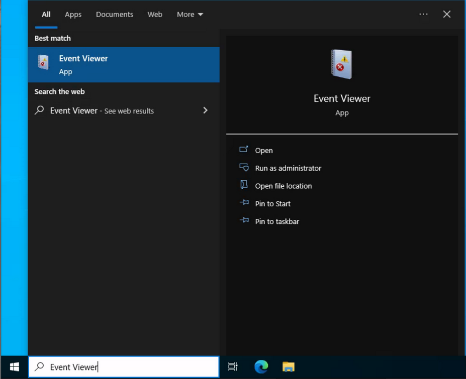

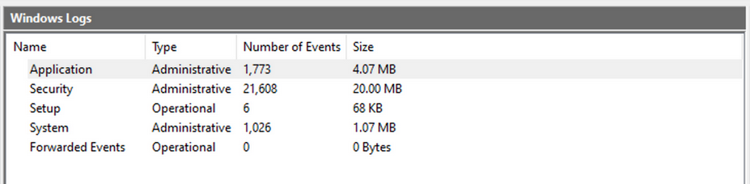

The default Windows event logs consist of Application, Security, Setup, and Forwarded Events. While the first four logs cover application errors, security events, system setup activities, and general information, the "Forwarded Events" section is unique, showcasing event log data forwarded from other machines. This central logging feature proves valuable for system admins who desire a consolidated view. In your current analysis, you focus on event logs from a single machine.

It should be noted, that the Windows Event Viewer has the ability to open and display previously saved ```.evtx``` files, which can be then found in the "Saved Logs" section.

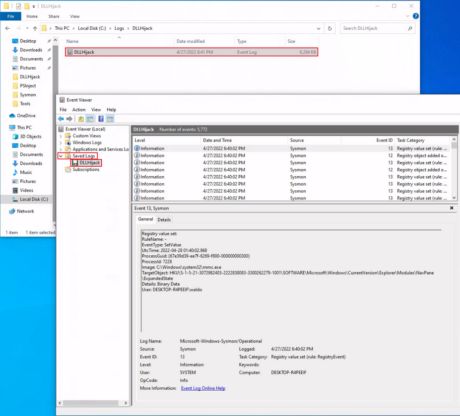

## Intro

### Anatomy of an Event Log

When examining Application logs, you encounter two distinct levels of events: information and error.


Information events provide general usage details about the application, such as its start or stop events. Conversely, error events highlight specific errors and often offer detailed insights into the encountered issues.


Each entry in the Windows Event Log is an "Event" and contains the following primary components:

1. **Log Name**: The name of the event log.
2. **Source**: The software that logged the event.
3. **Event ID**: A unique identifier for the event.
4. **Task Category**: This often contains a value or name that can help you understand the purpose or use of the event.
5. **Level**: The severity of the event.
6. **Keywords**: Keywords are flags that allow you to categorize events in ways beyond the other classification options. These are generally broad categories, such as "Audit Success" or "Audit Failure" in the Security log.
7. **User**: The user account that was logged on when the event occured.
8. **OpCode**: This field can identify the specific operation that the event reports.
9. **Logged**: The date and time when the event was logged.
10. **Computer**: The name of the computer where the event occured.
11. **XML Data**: All the above information is also included in an XML format along with additional event data.

The Keywords field is particularly useful when filtering event logs for specific types of events. It can significantly enhance the precision of search queries allowing you to specify events of interest, thus making log management more efficient and effective.

Taking a closer look at the event log above, you can observe several crucial elements. The Event ID in the top left corner serves as a unique identifier, which can be further researched on Microsoft's website to gather additional information. The "SideBySide" label next to the event ID represents the event source. Below, you find the general error description, often containing rich details. By clicking on the details, you can further analyze the event's impact using XML or a well-formatted view.

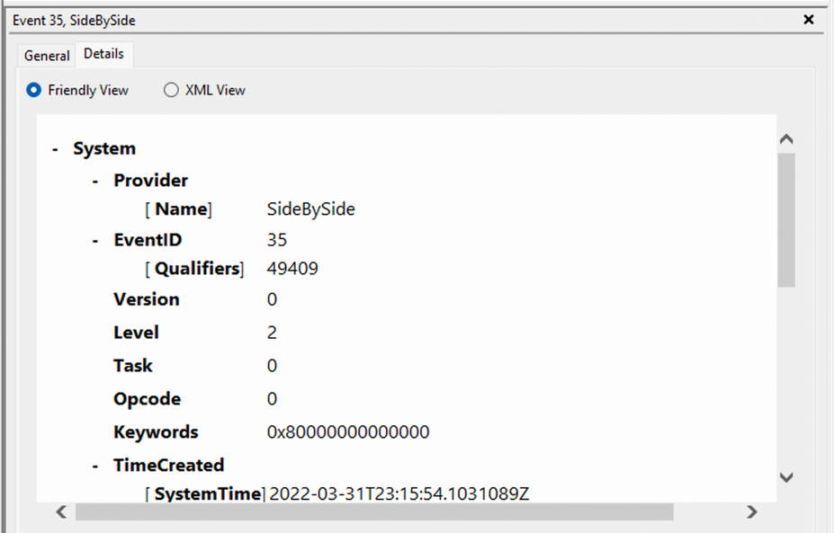

Additionally, you can extract supplementary information from the event log, such as the process ID where the error occured, enabling more precise analysis.

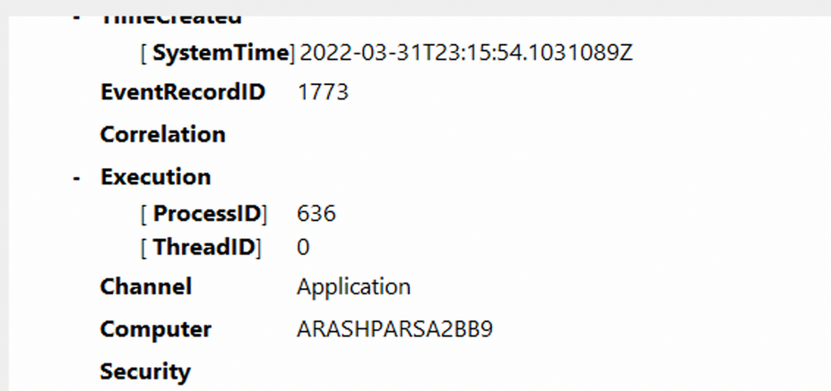

Switching your focus to security logs, consider event ID 4624, a commonly occuring event.

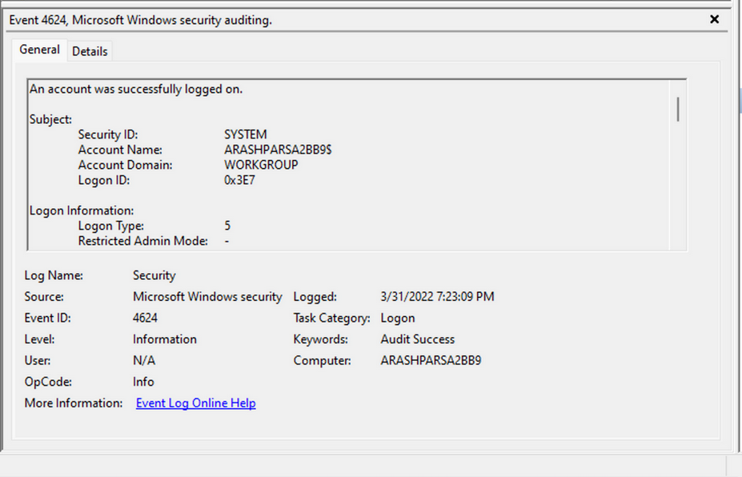

According to Microsoft's documentation, this event signifies the creation of a logon session on the destination machine, originating from the accessed computer where the session was established. Within this log, you find crucial details, including the "Logon ID", which allows you to correlate this logon with other events sharing the same "Logon ID". Another important detail is the "Logon Type", indicating the type of logon. In this case, it specifies a Service logon type, suggesting that "SYSTEM" initiated a new service. However, further investigation is required to determine the specific service involved, utilizing correlation techniques with additional data like the "Logon ID".

### Leveraging Custom XML Queries

To streamline your analysis, you can create custom XML queries to identify related events using the "Logon ID" as a starting point. By navigating to "Filter Current Log" -> "XML" -> "Edit Query Manually", you gain access to a custom XML query language that enables more granular log searches.


In the example query, you focus on events containing the "SubjectLogonId" field with a value of "0x3E7". The selection of this value stems from the need to correlate events associated with a specific "Logon ID" and understand the relevant details within those events.

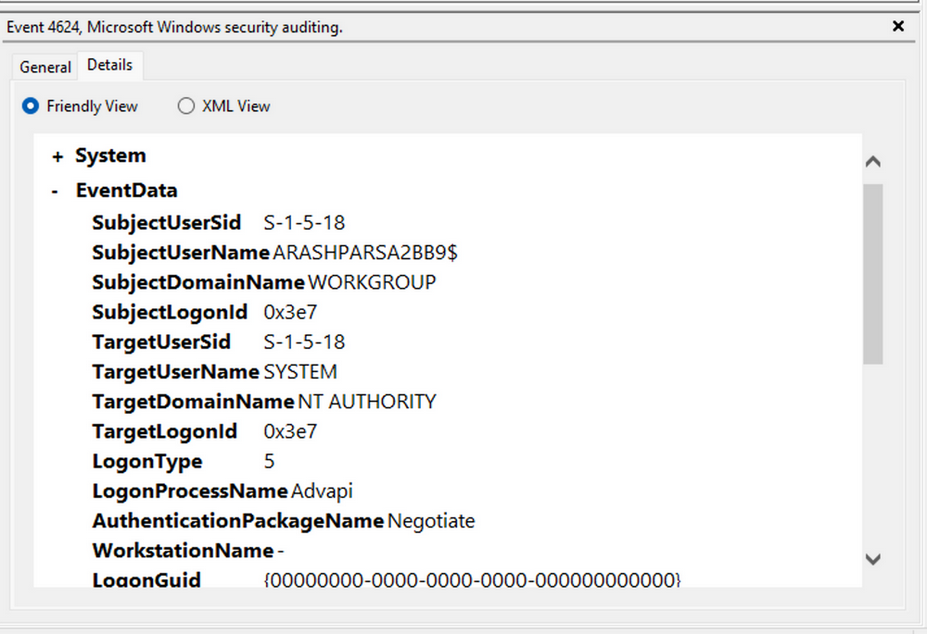

It is worth noting that if assistance is required in crafting the query, automatic filters can be enabled, allowing exploration of their impact on the XML representation. For further guidance, Microsoft offers informative articles on [advanced XML filtering in the Windows Event Manager](https://techcommunity.microsoft.com/t5/ask-the-directory-services-team/advanced-xml-filtering-in-the-windows-event-viewer/ba-p/399761).

By constructing such queries, you can narrow down your focus to the account responsible for initiating the service and eliminate unnecessary details. This approach helps unveil a clearer picture of recent logon activities associated with the specified Logon ID. However, even with this refinement, the amount of data remains significant.

Delving into the log details progressively reveals a narrative. For instance, the analysis begins with Event ID 4907, which signifies an audit policy change.


Within the event description, you find valuable insights, such as "This event generates when the SACL of an object was changed".

Based on this information, it becomes apparent that the permissions of a file were altered to modify the logging or auditing of access attempts. Further exploration of the event details reveals additional intriguing aspects.


For example, the process responsible for the change is identified as "SetupHost.exe", indicating a potential setup process. The object name impacted appears to be the "bootmanager", and you can examine the new and old security descriptors to identify the changes. Understanding the meaning of each field in the security descriptor can be accomplished through references such as the article ACE Strings and Understanding SDDL Syntax.

From the observed events, you can infer that a setup process occured, involving the creation of a new file and the initial configuration of security permissions for auditing purposes. Subsequently, you encounter the logon event, followed by a "special logon" event.

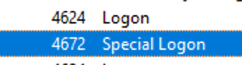

Analyzing the special logon event, you gain insights into token permission granted to the user upon a successful logon.


A comprehensive list of privileges can be found in the documentation on [privilege constants](https://docs.microsoft.com/en-us/windows/win32/secauthz/privilege-constants). For instance, the "SeDebugPrivilege" privilege indicates that the user possesses the ability to tamper with memory that does not belong to them.

### Useful Windows Event Logs

... can be found [here](https://www.ultimatewindowssecurity.com/securitylog/encyclopedia/).

## Sysmon & Event Logs

### Sysmon Basics

System Monitor (_Sysmon_) is a Windows system service and device driver that remains resident across system reboots to monitor and log systems to the Windows event log. Sysmon provides detailed information about process creation, network connections, changes to file creation time, and more.

Sysmon's primary components include:

- A windows service for monitoring system activity.
- A device driver that assists in capturing the system activity data.
- An event log to display captured activity data.

Sysmon's unique capability lies in its ability to log information that typically doesn't appear in the Security Event logs, and this makes it a powerful tool for deep system monitoring and cybersecurity forensic analysis.

Sysmon categorizes different types of system activity using event IDs, where each ID corresponds to a specific type of event. The full list of Sysmon event IDs can be found [here](https://learn.microsoft.com/en-us/sysinternals/downloads/sysmon).

For more granular control over what events get logged, Sysmon uses an XML-based configuration file. This file allows you to include or exclude certain types of events based on different attributes like process names, IP addresses, etc. You can refer to popular examples of useful Sysmon config files:

- for a comprehensive config, you can visit [this](https://github.com/SwiftOnSecurity/sysmon-config)
- another option is [this](https://github.com/olafhartong/sysmon-modular), which provides a modular approach

To get started, you can install Sysmon by downloading it from the [official Microsoft doc](https://docs.microsoft.com/en-us/sysinternals/downloads/sysmon). Once downloaded, open an administrator command prompt and execute the following command to install Sysmon:

```
C:\Tools\Sysmon> sysmon.exe -i -accepteula -h md5,sha256,imphash -l -n
```

To utilize a custom Sysmon config, execute the following after installing Sysmon:

```
C:\Tools\Sysmon> sysmon.exe -c filename.xml
```

### Detection Example 1: Detecting DLL Hijacking

To detect a DLL hijack, you need to focus on Event Type 7, which corresponds to module load events. To achieve this, you need to modify the ```sysmonconfig-export.xml``` Sysmon config file you dowloaded from the link above.

By examining the modified config, you can observe that the "include" comment signifies events that should be included.


In the case of detecting DLL hijacks, you change the "include" to "exclude" to ensure that nothing is excluded, allowing you to capture the necessary data.

To utilize the updated Sysmon config, execute the following:

```
C:\Tools\Sysmon> sysmon.exe -c sysmonconfig-export.xml
```

With the modified Sysmon config, you can start observing image load events. To view these events, navigate to the Event Viewer and access "Applications and Services" -> "Microsoft" -> "Windows" -> "Sysmon". A quick check will reveal the presence of the targeted event ID.

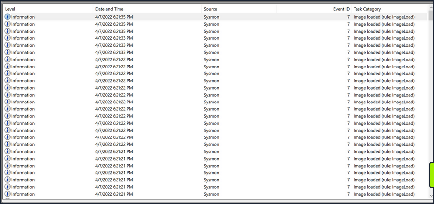

Now see how a Sysmon event ID 7 looks like.


The event log contains the DLL's signing status, the process or image responsible for loading the DLL, and the specific DLL that was loaded. In your example, you observe that "MMC.exe" loaded "psapi.dll", which is also Microsoft-signed. Both files are located in the System32 directory.

**To build a detection mechanism**: Research is needed. You stumble upon an informative [blog post](https://www.wietzebeukema.nl/blog/hijacking-dlls-in-windows) that provides an exhaustive list of various DLL hijack techniques. For example:


**Recreation (_using "calc.exe" and "WININET.dll"_)**: You can utilize Stephen Fewer's "hello world" [reflective DLL](https://github.com/stephenfewer/ReflectiveDLLInjection/tree/master/bin). It should be noted that DLL hijacking does not require reflective DLLs.

By following the required steps, which involve renaming ```reflective_dll.x64.dll``` to ```WININET.dll```, moving ```calc.exe``` from ```C:\Windows\System32``` along with ```WININET.dll``` to a writable directory, and executing ```calc.exe```, you achieve success. Instead of the Calculator app, a MessageBox is displayed.

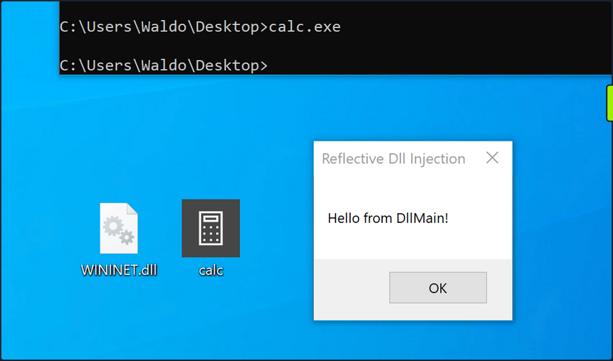

Next, you analyze the impact of the hijack. First, you filter the event logs to focus on Event ID 7, which represents module load events, by clicking "Filter Current Log...".

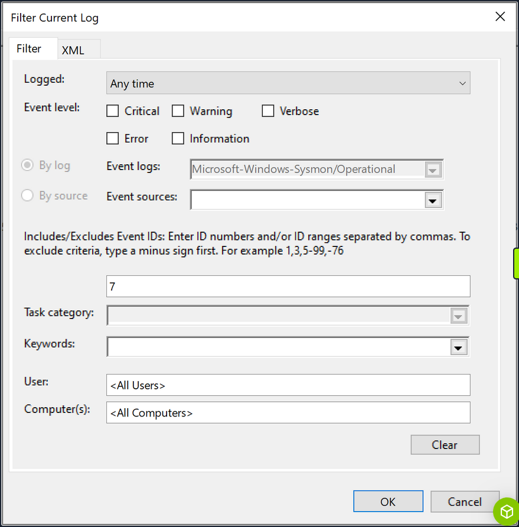

Subsequently, you search for instances of "calc.exe", by clicking "Find ...", to identify the DLL load associated with your hijack.

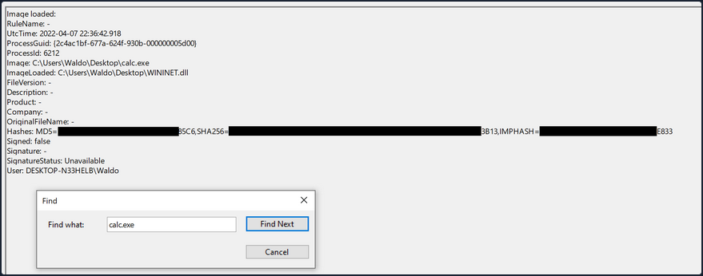

The output from Sysmon provides valuable insights. Now, you can observe several indicators of compromise to create effective detection rules. Before moving forward though, compare this to an authenticate load of "wininet.dll" by "calc.exe".

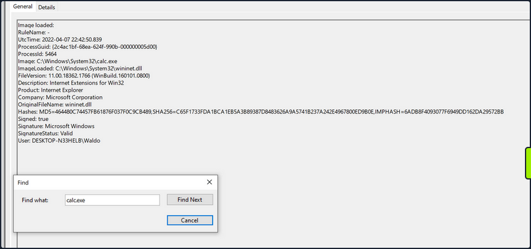

Exploring these IOCs:

1. "calc.exe", originally located in System32, should not be found in a writable directory. Therefore, a copy of "calc.exe" in a writable directory serves as an IOC, as it should always reside in System32 or potentially Syswow64.
2. "WININET.dll", originally located in System32, should not be loaded outside of System32 by calc.exe. If instances of "WININET.dll" loading occur outside of System32 with "calc.exe" as the parent process, it indicates a DLL hijack within calc.exe. While caution is necessary when alerting on all instances of "WININET.dll" loading outside of System32, in the case of "calc.exe", you can confidently assert a hijack due to the DLL's unchanging name, which attackers cannot modify to evade detection.
3. The original "WININET.dll" is Microsoft-signed, while your injected DLL remains unsigned.

These three powerful IOCs provide an effective means of detecting a DLL hijack involving calc.exe. It's important to note that while Sysmon and event logs offer valuable telemetry for hunting and creating alert rules, they are not the sole sources of information.

### Detection Example 2: Detecting Unmanaged PowerShell/C-Sharp Injection

C# is considered a "managed" language, meaning it requires a backend runtime to execute its code. The Common Language Runtime (_CLR_) serves as this runtime environment. Managed code does not directly run as assembly; instead, it is compiled inty a bytecode format that the runtime processes and executes. Consequently, a managed process relies on the CLR to execute C# code.

As defenders, you can leverage this knowledge to detect unusual C# injections or executions within your environment. To accomplish this, you can utilize a useful utility called [Process Hacker](C:\Windows\System32).


By using Process Hacker, you can observe a range of processes within your environment. Sorting the processes by name, you can identify color-coded distinctions. Notably, "powershell.exe", a managed process, is highlighted in green compared to other processes. Hovering over "powershell.exe" reveals the label "Process is managed (_.NET_)," confirming its managed status.


Examining the module loads for ```powershell.exe```, by right-clicking on ```powershell.exe```, clicking "Properties", and navigating to "Modules", you can find relevant information.


The presence of "Microsoft .NET Runtime ...", ```clr.dll```, and ```clrjit.dll``` should attract your attention. These 2 DLLs are used when C# code is ran as part of the runtime to execute the bytecode. If you observe these DLLs loaded in processes that typically to not reuqire them, it suggests a potential execute-assembly or unmanaged PowerShell injection attack.

To showcase unmanaged PowerShell injection, you can inject an unmanaged PowerShell-like DLL into a random process, such as ```spoolsv.exe```. You can do that by utilizing the [PSInject project](https://github.com/EmpireProject/PSInject) in the following manner:

```ps
powershell -ep bypass
Import-Module .\Invoke-PSInject.ps1
Invoke-PSInject -ProcId [Process ID of spoolsv.exe] -PoshCode "V3JpdGUtSG9zdCAiSGVsbG8sIEd1cnU5OSEi"
```


After the injection, you observe that "spoolsv.exe" transitions from an unmanaged to a managed state.


Additionally, by referring to both the related "Modules" tab of Process Hacker and Sysmon Event ID 7, you can examine the DLL load information to validate the presence of the aforementioned DLLs.


### Detection Example 3: Detecting Credential Dumping

Another critical aspect of cybersecurity is detecting credential dumping activities. One widely used tool for credential dumping is Mimikatz, offering various methods for extracting Windows credentials. One specifc command, ```sekurlsa::logonpasswords```, enables the dumping of password hashes or plaintext passwords by accessing the Local Security Authority Subsystem Service. LSASS is responsible for managing user credentials and is a primary target for credential-dumping tools like Mimikatz.

To detect this activity, you can rely on a different Sysmon event. Instead of focusing on DLL loads, you shift your attention to process access events. By checking Sysmon Event ID 10, which represents "ProcessAccess" events, you can identify any suspicious attempts to access LSASS.

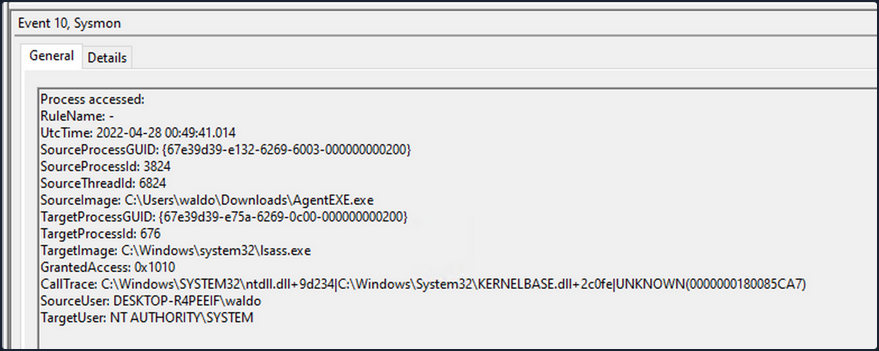

For instance, if you observe a random file (_"AgentEXE" in this case_) from a random folder attempting to access LSASS, it indicates unusual behavior. Additionally, the ```SourceUser``` being different from the ```TargetUser``` further emphasizes the abnormality. It's also worth noting that as part of the mimikatz-based credential dumping process, the user must request SeDebugPrivileges. As the name suggests, it's primarily used for debugging. This can be another IOC.

## Additional Telemetry Sources

In the realm of effective threat detection and incident response, you often find yourself relying on the limited log data at your disposal. However, this approach falls short of fully harnessing the immense wealth of information that can be derived from the powerful resource known as Event Tracing for Windows (_ETW_). Unfortunately, this oversight can be attributed to a lack of awareness and appreciation for the comprehensive and intricate insights that ETW can offer.

### What is Event Tracing for Windows (_ETW_)?

According to Microsoft, ETW is a general-purpose, high-speed tracing facility provided by the OS. Using a buffering and logging mechanism implemented in the kernel, ETW provides a tracing mechanism for events raised by both user-mode applications and kernel-mode device drivers.

ETW, functioning as a high-performance event tracing mechanism deeply embedded within Microsoft OS, presents an unparalleled opportunity to bolster your defense capabilities. Its architecture facilitates the dynamic generation, collection, and analysis of various events occuring within the system, resulting in the creation of intricate, real-time logs that encompass a wide spectrum of activities.

By effectively leveraging ETW, you can tap into an expansive array of telemetry sources that surpass the limitations imposed by traditional log data. ETW captures a diverse set of events, spanning system calls, process creation and termination, network activity, file and registry modifications, and numerous other dimensions. These events collectively weave a detailed tapestry of system activity, furnishing invaluable context for the identification of anomalous behavior, discovery of potential security incidents, and facilitation of forensic investigations.

ETW's versatility and extensibility are further accentuated by its seamless integration with Event Providers. These specialized components generate specific types of events and can be seamlessly incorporated into applications, OS components, or third-party software. Consequently, this integration ensures a broad coverage of potential event sources. Furthermore, ETW's extensibility enables the creation of custom providers tailored to address specific organizational requirements, thereby fostering a targeted approach to logging and monitoring.

Notably, ETW's lightweight nature and minimal performance impact render it an optimal telemetry solution for real-time monitoring and continuous security assessment. By selectively enabling and configuring relevant event providers, you can finely adjust the scope of data collection to align with your specific security objectives, striking a harmonious balance between the richness of information and system performance considerations.

Moreover, the existence of robust tooling and utilities, including Microsoft's Message Analyzer and PowerShell's `Get-WinEvent` cmdlet, greatly simplifies the retrieval, parsing, and analysis of ETW logs. These tools offer advanced filtering capabilities, event correlation mechanisms, and real-time monitoring features, empowering members of the blue team to extract actionable insights from the vast pool of information captured by ETW.

### ETW Architecture & Components

The underlying architecture and the key components of ETW are illustrated in the following diagram from Microsoft.

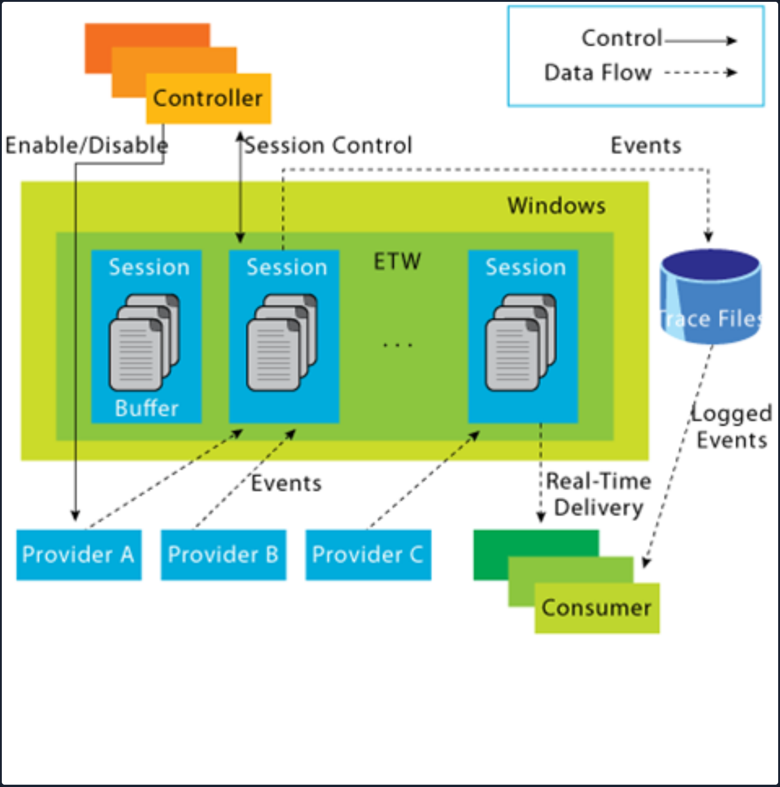

- **Controllers**: The Controllers component, as its name implies, assumes control over all aspects related to ETW operations. It encompasses functionalities such as initiating and terminating trace sessions, as well as enabling or disabling providers within a particular trace. Trace sessions can establish subscriptions to one or multiple providers, thereby granting the providers the ability to commence logging operations. An example of a widely used controller is the built-in utility "logman.exe", which facilitates the management of ETW activities.

At the core of ETW's architecture is the publish-subscribe model. This model involves two primary components:

- **Providers**: Providers play a pivotal role in generating events and writing them to the designated ETW sessions. Applications have the ability to register ETW providers, enabling them to generate and transmit numerous events. There are four distinct types of providers utilized within ETW.
	- **MOF Providers**: These providers are based on Managed Object Format (_MOF_) and are capable of generating events according to predefined MOF schemas. They offer a flexible approach to event generation and are widely used in various scenarios.
	- **WPP Providers**: Standing for "Windows Software Trace Preprocessor", WPP providers leverage specialized macros and annotations within the application's source code to generate events. This type of provider is often utilitzed for low-level kernel-mode tracing and debugging purposes.
	- **Manifest-based Providers**: Manifest-based providers represent a more contemporary form of providers within ETW. They rely on XML manifest files that define the structure and characteristics of events. This approach offers enhanced flexibility and ease of management, allowing for dynamic event generation and customization.
	- **TraceLogging Providers**: Tracelogging providers offer a simplified and efficient approach to event generation. They leverage the TraceLogging API, introduced in recent Windows versions, which streamlines the process of event generation with minimal code overhead.
- **Consumers**: Consumers subscribe to specific events of interest and receive those events for further processing or analysis. By default, the events are typically directed to an .ETL (_Event Trave Log_) file for handling. However, an alternative consumer scenario involves leveraging the capabilities of the Windows API to process and consume the events.
- **Channels**: To facilitate efficient event collection and consumption, ETW relies on event channels. Event channels act as logical containers for organizing and filtering events based on their characteristics and importance. ETW supports multiple channels, each with its own defined purpose and audience. Event consumers can selectively subscribe to specific channels to receive relevant events for their respective use cases.
- **ETL Files**: ETW providers specialized support for writing events to disk through the use of event trace log files, commonly referred to as "ETL files". These files serve as durable storage for events, enabling offline analysis, long-term archiving, and forensic investigations. ETW allows for seamless rotation and management of ETL files to ensure efficient storage utilization.

> [!NOTE]
> - ETW supports event providers in both kernel mode and user mode.
> - Some event providers generate a significant volume of events, which can potentially overwhelm the system resources if they are constanly active. As a result, to prevent unnecessary resource consumption, these providers are typically disabled by default and are only enabled when a tracing session specifically requests their activation.
> - In addition to its inherent capabilities, ETW can be extended through custom event providers.
> - Only ETW provider events that have a channel property applied to them can be consumed by the event log.

### Interacting with ETW

Logman is a pre-installed utility for managing ETW and Event Tracing Sessions. This tool is invaluable for creating, initiating, halting, and investigating tracing sessions. This is particularly useful when determining which sessions are set for data collection or when initiating your own data collection.

Employing the `-ets` parameter will allow for a direct investigation of the event tracing sessions, providing insights into system-wide tracing sessions. As an example, the Sysmon Event Tracing Sessions can be found towards the end of the displayed information.

```
C:\Tools> logman.exe query -ets

Data Collector Set                      Type                          Status
-------------------------------------------------------------------------------
Circular Kernel Context Logger          Trace                         Running
Eventlog-Security                       Trace                         Running
DiagLog                                 Trace                         Running
Diagtrack-Listener                      Trace                         Running
EventLog-Application                    Trace                         Running
EventLog-Microsoft-Windows-Sysmon-Operational Trace                         Running
EventLog-System                         Trace                         Running
LwtNetLog                               Trace                         Running
Microsoft-Windows-Rdp-Graphics-RdpIdd-Trace Trace                         Running
NetCore                                 Trace                         Running
NtfsLog                                 Trace                         Running
RadioMgr                                Trace                         Running
UBPM                                    Trace                         Running
WdiContextLog                           Trace                         Running
WiFiSession                             Trace                         Running
SHS-06012023-115154-7-7f                Trace                         Running
UserNotPresentTraceSession              Trace                         Running
8696EAC4-1288-4288-A4EE-49EE431B0AD9    Trace                         Running
ScreenOnPowerStudyTraceSession          Trace                         Running
SYSMON TRACE                            Trace                         Running
MSDTC_TRACE_SESSION                     Trace                         Running
SysmonDnsEtwSession                     Trace                         Running
MpWppTracing-20230601-115025-00000003-ffffffff Trace                         Running
WindowsUpdate_trace_log                 Trace                         Running
Admin_PS_Provider                       Trace                         Running
Terminal-Services-LSM-ApplicationLag-3764 Trace                         Running
Microsoft.Windows.Remediation           Trace                         Running
SgrmEtwSession                          Trace                         Running

The command completed successfully.
```

When you examine an Event Tracing Session directly, you uncover specific session details including the Name, Max Log Size, Log Location, and the subscribed providers. This information is invaluable for incident responders. Discovering a session that records providers relevant to your interests may provide crucial logs for an investigation.

Note that the `-ets` parameter is vital to the command. Without it, Logman will not identify the Event Tracing Session.

For each provider subscribed to the session, you can acquire critical data:

- **Name / Provider GUID**: This is the exclusive identifier for the provider.
- **Level**: This describes the event level, indicating if it's filtering for warning, informational, critical, or all events.
- **Keywords Any**: Keywords create a filter based on the kind of the event generated by the provider.

```
C:\Tools> logman.exe query "EventLog-System" -ets


Name:                 EventLog-System
Status:               Running
Root Path:            %systemdrive%\PerfLogs\Admin
Segment:              Off
Schedules:            On
Segment Max Size:     100 MB

Name:                 EventLog-System\EventLog-System
Type:                 Trace
Append:               Off
Circular:             Off
Overwrite:            Off
Buffer Size:          64
Buffers Lost:         0
Buffers Written:      47
Buffer Flush Timer:   1
Clock Type:           System
File Mode:            Real-time

Provider:
Name:                 Microsoft-Windows-FunctionDiscoveryHost
Provider Guid:        {538CBBAD-4877-4EB2-B26E-7CAEE8F0F8CB}
Level:                255
KeywordsAll:          0x0
KeywordsAny:          0x8000000000000000 (System)
Properties:           65
Filter Type:          0

Provider:
Name:                 Microsoft-Windows-Subsys-SMSS
Provider Guid:        {43E63DA5-41D1-4FBF-ADED-1BBED98FDD1D}
Level:                255
KeywordsAll:          0x0
KeywordsAny:          0x4000000000000000 (System)
Properties:           65
Filter Type:          0

Provider:
Name:                 Microsoft-Windows-Kernel-General
Provider Guid:        {A68CA8B7-004F-D7B6-A698-07E2DE0F1F5D}
Level:                255
KeywordsAll:          0x0
KeywordsAny:          0x8000000000000000 (System)
Properties:           65
Filter Type:          0

Provider:
Name:                 Microsoft-Windows-FilterManager
Provider Guid:        {F3C5E28E-63F6-49C7-A204-E48A1BC4B09D}
Level:                255
KeywordsAll:          0x0
KeywordsAny:          0x8000000000000000 (System)
Properties:           65
Filter Type:          0

--- SNIP ---

The command completed successfully.
```

By using the `logman query providers` command, you generate a list of all available providers on the system, including their respective GUIDs.

```
C:\Tools> logman.exe query providers

Provider                                 GUID
-------------------------------------------------------------------------------
ACPI Driver Trace Provider               {DAB01D4D-2D48-477D-B1C3-DAAD0CE6F06B}
Active Directory Domain Services: SAM    {8E598056-8993-11D2-819E-0000F875A064}
Active Directory: Kerberos Client        {BBA3ADD2-C229-4CDB-AE2B-57EB6966B0C4}
Active Directory: NetLogon               {F33959B4-DBEC-11D2-895B-00C04F79AB69}
ADODB.1                                  {04C8A86F-3369-12F8-4769-24E484A9E725}
ADOMD.1                                  {7EA56435-3F2F-3F63-A829-F0B35B5CAD41}
Application Popup                        {47BFA2B7-BD54-4FAC-B70B-29021084CA8F}
Application-Addon-Event-Provider         {A83FA99F-C356-4DED-9FD6-5A5EB8546D68}
ATA Port Driver Tracing Provider         {D08BD885-501E-489A-BAC6-B7D24BFE6BBF}
AuthFw NetShell Plugin                   {935F4AE6-845D-41C6-97FA-380DAD429B72}
BCP.1                                    {24722B88-DF97-4FF6-E395-DB533AC42A1E}
BFE Trace Provider                       {106B464A-8043-46B1-8CB8-E92A0CD7A560}
BITS Service Trace                       {4A8AAA94-CFC4-46A7-8E4E-17BC45608F0A}
Certificate Services Client CredentialRoaming Trace {EF4109DC-68FC-45AF-B329-CA2825437209}
Certificate Services Client Trace        {F01B7774-7ED7-401E-8088-B576793D7841}
Circular Kernel Session Provider         {54DEA73A-ED1F-42A4-AF71-3E63D056F174}
Classpnp Driver Tracing Provider         {FA8DE7C4-ACDE-4443-9994-C4E2359A9EDB}
Critical Section Trace Provider          {3AC66736-CC59-4CFF-8115-8DF50E39816B}
DBNETLIB.1                               {BD568F20-FCCD-B948-054E-DB3421115D61}
Deduplication Tracing Provider           {5EBB59D1-4739-4E45-872D-B8703956D84B}
Disk Class Driver Tracing Provider       {945186BF-3DD6-4F3F-9C8E-9EDD3FC9D558}
Downlevel IPsec API                      {94335EB3-79EA-44D5-8EA9-306F49B3A041}
Downlevel IPsec NetShell Plugin          {E4FF10D8-8A88-4FC6-82C8-8C23E9462FE5}
Downlevel IPsec Policy Store             {94335EB3-79EA-44D5-8EA9-306F49B3A070}
Downlevel IPsec Service                  {94335EB3-79EA-44D5-8EA9-306F49B3A040}
EA IME API                               {E2A24A32-00DC-4025-9689-C108C01991C5}
Error Instrument                         {CD7CF0D0-02CC-4872-9B65-0DBA0A90EFE8}
FD Core Trace                            {480217A9-F824-4BD4-BBE8-F371CAAF9A0D}
FD Publication Trace                     {649E3596-2620-4D58-A01F-17AEFE8185DB}
FD SSDP Trace                            {DB1D0418-105A-4C77-9A25-8F96A19716A4}
FD WNet Trace                            {8B20D3E4-581F-4A27-8109-DF01643A7A93}
FD WSDAPI Trace                          {7E2DBFC7-41E8-4987-BCA7-76CADFAD765F}
FDPHost Service Trace                    {F1C521CA-DA82-4D79-9EE4-D7A375723B68}
File Kernel Trace; Operation Set 1       {D75D8303-6C21-4BDE-9C98-ECC6320F9291}
File Kernel Trace; Operation Set 2       {058DD951-7604-414D-A5D6-A56D35367A46}
File Kernel Trace; Optional Data         {7DA1385C-F8F5-414D-B9D0-02FCA090F1EC}
File Kernel Trace; Volume To Log         {127D46AF-4AD3-489F-9165-F00BA64D5467}
FWPKCLNT Trace Provider                  {AD33FA19-F2D2-46D1-8F4C-E3C3087E45AD}
FWPUCLNT Trace Provider                  {5A1600D2-68E5-4DE7-BCF4-1C2D215FE0FE}
Heap Trace Provider                      {222962AB-6180-4B88-A825-346B75F2A24A}
IKEEXT Trace Provider                    {106B464D-8043-46B1-8CB8-E92A0CD7A560}
IMAPI1 Shim                              {1FF10429-99AE-45BB-8A67-C9E945B9FB6C}
IMAPI2 Concatenate Stream                {0E85A5A5-4D5C-44B7-8BDA-5B7AB54F7E9D}
IMAPI2 Disc Master                       {0E85A5A5-4D5C-44B7-8BDA-5B7AB54F7E91}
IMAPI2 Disc Recorder                     {0E85A5A5-4D5C-44B7-8BDA-5B7AB54F7E93}
IMAPI2 Disc Recorder Enumerator          {0E85A5A5-4D5C-44B7-8BDA-5B7AB54F7E92}
IMAPI2 dll                               {0E85A5A5-4D5C-44B7-8BDA-5B7AB54F7E90}
IMAPI2 Interleave Stream                 {0E85A5A5-4D5C-44B7-8BDA-5B7AB54F7E9E}
IMAPI2 Media Eraser                      {0E85A5A5-4D5C-44B7-8BDA-5B7AB54F7E97}
IMAPI2 MSF                               {0E85A5A5-4D5C-44B7-8BDA-5B7AB54F7E9F}
IMAPI2 Multisession Sequential           {0E85A5A5-4D5C-44B7-8BDA-5B7AB54F7EA0}
IMAPI2 Pseudo-Random Stream              {0E85A5A5-4D5C-44B7-8BDA-5B7AB54F7E9C}
IMAPI2 Raw CD Writer                     {0E85A5A5-4D5C-44B7-8BDA-5B7AB54F7E9A}
IMAPI2 Raw Image Writer                  {07E397EC-C240-4ED7-8A2A-B9FF0FE5D581}
IMAPI2 Standard Data Writer              {0E85A5A5-4D5C-44B7-8BDA-5B7AB54F7E98}
IMAPI2 Track-at-Once CD Writer           {0E85A5A5-4D5C-44B7-8BDA-5B7AB54F7E99}
IMAPI2 Utilities                         {0E85A5A5-4D5C-44B7-8BDA-5B7AB54F7E94}
IMAPI2 Write Engine                      {0E85A5A5-4D5C-44B7-8BDA-5B7AB54F7E96}
IMAPI2 Zero Stream                       {0E85A5A5-4D5C-44B7-8BDA-5B7AB54F7E9B}
IMAPI2FS Tracing                         {F8036571-42D9-480A-BABB-DE7833CB059C}
Intel-iaLPSS-GPIO                        {D386CC7A-620A-41C1-ABF5-55018C6C699A}
Intel-iaLPSS-I2C                         {D4AEAC44-AD44-456E-9C90-33F8CDCED6AF}
Intel-iaLPSS2-GPIO2                      {63848CFF-3EC7-4DDF-8072-5F95E8C8EB98}
Intel-iaLPSS2-I2C                        {C2F86198-03CA-4771-8D4C-CE6E15CBCA56}
IPMI Driver Trace                        {D5C6A3E9-FA9C-434E-9653-165B4FC869E4}
IPMI Provider Trace                      {651D672B-E11F-41B7-ADD3-C2F6A4023672}
KMDFv1 Trace Provider                    {544D4C9D-942C-46D5-BF50-DF5CD9524A50}
Layer2 Security HC Diagnostics Trace     {2E8D9EC5-A712-48C4-8CE0-631EB0C1CD65}
Local Security Authority (LSA)           {CC85922F-DB41-11D2-9244-006008269001}
LsaSrv                                   {199FE037-2B82-40A9-82AC-E1D46C792B99}
Microsoft-Antimalware-AMFilter           {CFEB0608-330E-4410-B00D-56D8DA9986E6}
Microsoft-Antimalware-Engine             {0A002690-3839-4E3A-B3B6-96D8DF868D99}
Microsoft-Antimalware-Engine-Instrumentation {68621C25-DF8D-4A6B-AABC-19A22E296A7C}
Microsoft-Antimalware-NIS                {102AAB0A-9D9C-4887-A860-55DE33B96595}
Microsoft-Antimalware-Protection         {E4B70372-261F-4C54-8FA6-A5A7914D73DA}
Microsoft-Antimalware-RTP                {8E92DEEF-5E17-413B-B927-59B2F06A3CFC}
Microsoft-Antimalware-Scan-Interface     {2A576B87-09A7-520E-C21A-4942F0271D67}
Microsoft-Antimalware-Service            {751EF305-6C6E-4FED-B847-02EF79D26AEF}
Microsoft-Antimalware-ShieldProvider     {928F7D29-0577-5BE5-3BD3-B6BDAB9AB307}
Microsoft-Antimalware-UacScan            {D37E7910-79C8-57C4-DA77-52BB646364CD}
Microsoft-AppV-Client                    {E4F68870-5AE8-4E5B-9CE7-CA9ED75B0245}
Microsoft-AppV-Client-StreamingUX        {28CB46C7-4003-4E50-8BD9-442086762D12}
Microsoft-AppV-ServiceLog                {9CC69D1C-7917-4ACD-8066-6BF8B63E551B}
Microsoft-AppV-SharedPerformance         {FB4A19EE-EB5A-47A4-BC52-E71AAC6D0859}
Microsoft-Client-Licensing-Platform      {B6CC0D55-9ECC-49A8-B929-2B9022426F2A}
Microsoft-Gaming-Services                {BC1BDB57-71A2-581A-147B-E0B49474A2D4}
Microsoft-IE                             {9E3B3947-CA5D-4614-91A2-7B624E0E7244}
Microsoft-IE-JSDumpHeap                  {7F8E35CA-68E8-41B9-86FE-D6ADC5B327E7}
Microsoft-IEFRAME                        {5C8BB950-959E-4309-8908-67961A1205D5}
Microsoft-JScript                        {57277741-3638-4A4B-BDBA-0AC6E45DA56C}
Microsoft-OneCore-OnlineSetup            {41862974-DA3B-4F0B-97D5-BB29FBB9B71E}
Microsoft-PerfTrack-IEFRAME              {B2A40F1F-A05A-4DFD-886A-4C4F18C4334C}
Microsoft-PerfTrack-MSHTML               {FFDB9886-80F3-4540-AA8B-B85192217DDF}
Microsoft-User Experience Virtualization-Admin {61BC445E-7A8D-420E-AB36-9C7143881B98}
Microsoft-User Experience Virtualization-Agent Driver {DE29CF61-5EE6-43FF-9AAC-959C4E13CC6C}
Microsoft-User Experience Virtualization-App Agent {1ED6976A-4171-4764-B415-7EA08BC46C51}
Microsoft-User Experience Virtualization-IPC {21D79DB0-8E03-41CD-9589-F3EF7001A92A}
Microsoft-User Experience Virtualization-SQM Uploader {57003E21-269B-4BDC-8434-B3BF8D57D2D5}
Microsoft-Windows Networking VPN Plugin Platform {E5FC4A0F-7198-492F-9B0F-88FDCBFDED48}
Microsoft-Windows-AAD                    {4DE9BC9C-B27A-43C9-8994-0915F1A5E24F}
Microsoft-Windows-ACL-UI                 {EA4CC8B8-A150-47A3-AFB9-C8D194B19452}

The command completed successfully.
```

Windows 10 includes more than 1,000 built-in providers. Moreover, Third-Party Software often incorporates its own ETW providers, especially those operating in Kernel module.

Due to the high number of providers, it's usually advantegeous to filter them using `findstr`. For instance, you will see multiple results for "Winlogon" in the given example.

```
C:\Tools> logman.exe query providers | findstr "Winlogon"
Microsoft-Windows-Winlogon               {DBE9B383-7CF3-4331-91CC-A3CB16A3B538}
Windows Winlogon Trace                   {D451642C-63A6-11D7-9720-00B0D03E0347}
```

By specifying a provider with Logman, you gain a deeper understanding of the provider's function. This will inform you about the Keywords you can filter on, the available event levels, and which processes are currently utilizing the provider.

```
C:\Tools> logman.exe query providers Microsoft-Windows-Winlogon

Provider                                 GUID
-------------------------------------------------------------------------------
Microsoft-Windows-Winlogon               {DBE9B383-7CF3-4331-91CC-A3CB16A3B538}

Value               Keyword              Description
-------------------------------------------------------------------------------
0x0000000000010000  PerfInstrumentation
0x0000000000020000  PerfDiagnostics
0x0000000000040000  NotificationEvents
0x0000000000080000  PerfTrackContext
0x0000100000000000  ms:ReservedKeyword44
0x0000200000000000  ms:Telemetry
0x0000400000000000  ms:Measures
0x0000800000000000  ms:CriticalData
0x0001000000000000  win:ResponseTime     Response Time
0x0080000000000000  win:EventlogClassic  Classic
0x8000000000000000  Microsoft-Windows-Winlogon/Diagnostic
0x4000000000000000  Microsoft-Windows-Winlogon/Operational
0x2000000000000000  System               System

Value               Level                Description
-------------------------------------------------------------------------------
0x02                win:Error            Error
0x03                win:Warning          Warning
0x04                win:Informational    Information

PID                 Image
-------------------------------------------------------------------------------
0x00001710
0x0000025c


The command completed successfully.
```

The Microsoft-Windows-Winlogon/Diagnostic and Microsoft-Windows-Winlogon/Operational keywords reference the event logs generated from this provider.

GUI-based alternatives also exist. These are:

1. Using the graphical interface of the Performance Monitor tool, you can visualize various running trace sessions. A detailed overview of a specific trace can be accessed simply by double-clicking on it. This reveals all pertinent data related to the trace, from the engaged providers and their activated features to the nature of the trace itself. Additionally, these sessions can be modified to suit your needs by incorporating or eliminating providers. Lastly, you can devise new sessions by opting for the "User Defined" category.

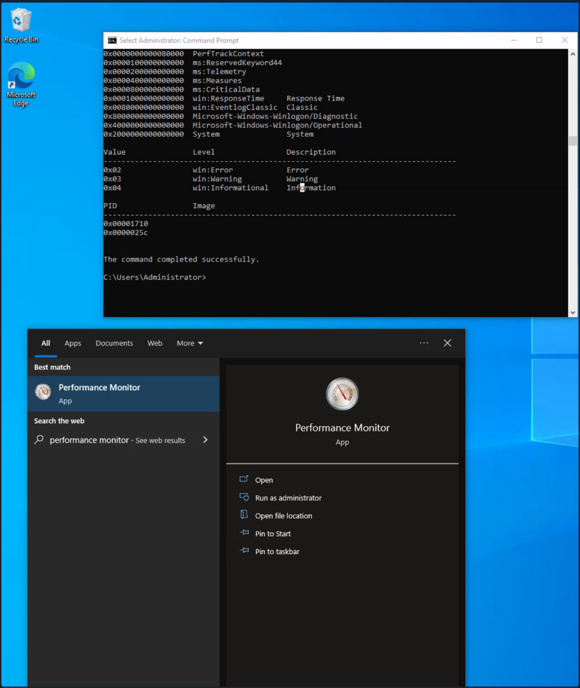

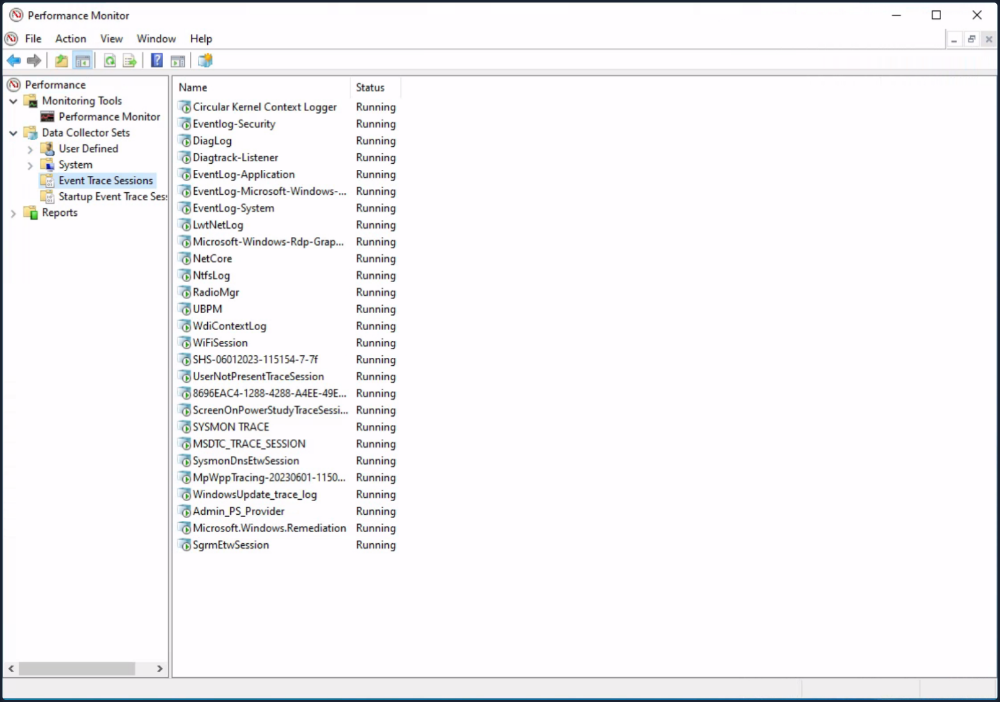

2. ETW Povider metadata can also be viewed through the [EtwExplorer project](https://github.com/zodiacon/EtwExplorer).

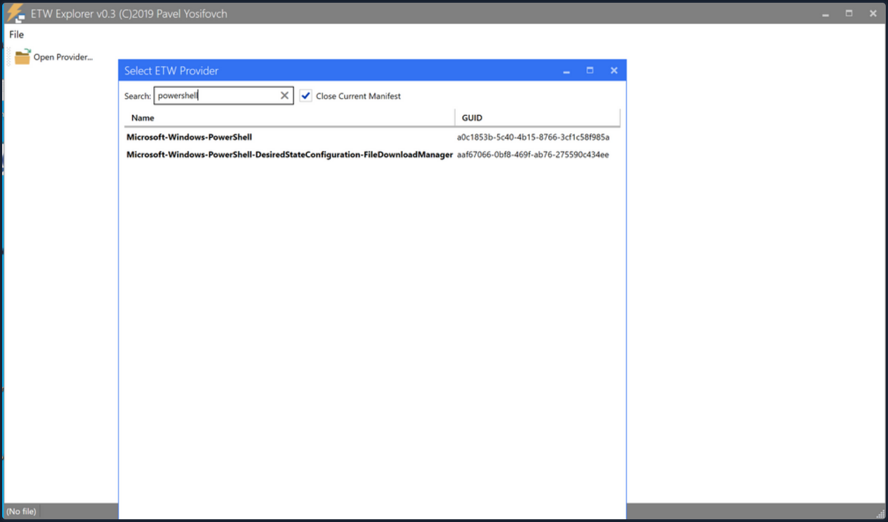

### Useful Providers

- **Microsoft-Windows-Kernel-Process**: This ETW provider is instrumental in monitoring process-related activity within the Windows kernel. It can aid in detecting unusual process behaviors such as process injection, process hollowing, and other tactics commonly used by malware and APTs.
- **Microsoft-Windows-Kernel-File**: As the name suggests, this provider focuses on file-related operations. It can be employed for detection scenarios involving unauthorized file access, changes to critical system files, or suspicious file operations indicative of exfiltration or ransomware activity.
- **Microsoft-Windows-Kernel-Network**: This ETW provider offers visibility into network-related activity at the kernel level. It's especially useful in detecting network-based attacks such as data exfiltration, unauthorized network connections, and potential signs of command and control communication.
- **Microsoft-Windows-SMBClient-SMBServer**: These providers monitor SMB client and server activity, providing insights into file sharing and network communication. They can be used to detect unusual SMB traffic patterns, potentially indicating lateral movement or data exfiltration.
- **Microsoft-Windows-DotNETRuntime**: This provider focuses on .NET runtime events, making it ideal for identifying anomalies in .NET application execution, potential exploitation of .NET vulnerabilities, or malicious .NET assembly loading.
- **OpenSSH**: Monitoring the OpenSSH ETW provider can provide important insights into SSH connection attempts, successful and failed authentications, and potential brute force attacks.
- **Microsoft-Windows-VPN-Client**: This provider enables tracking of VPN client events. It can be useful for identifying unauthorized or suspicious VPN connections.
- **Microsoft-Windows-PowerShell**: This ETW provider tracks PowerShell execution and command activity, making it invaluable for detecting suspicious PowerShell usage, script block logging, and potential misuse or exploitation.
- **Microsoft-Windows-Kernel-Registry**: This provider monitors registry operations, making it useful for detection scenarios related to changes in registry keys, often associated with persistence mechanisms, malware installation, or system configuration changes.
- **Microsoft-Windows-CodeIntegrity**: This provider monitors code and driver integrity checks, which can be key in identifying attempts to load unsigned or malicious drivers or code.
- **Microsoft-Antimalware-Service**: This ETW provider can be employed to detect potential issues with the antimalware service, including disabled services, configuration changes, or potential evasion techniques employed by malware.
- **WinRM**: Monitoring the Windows Remote Management provider can reveal unauthorized or suspicious remote management activity, often indicative of lateral movement or remote desktop activity.
- **Microsoft-Windows-TerminalServices-LocalSessionManager**: This provider tracks local Terminal Services sessions, making it useful for detecting unauthorized or suspicious remote desktop activity.
- **Microsoft-Windows-Security-Mitigations**: This provider keeps tabs on the effectiveness and operations of security mitigations in place. It's essential for identifying potential bypass attempts of these security controls.
- **Microsoft-Windows-DNS-Client**: This ETW provider gives visibility into DNS client activity, which is crucial for detecting DNS-based attacks, including DNS tunneling or unusual DNS requests that may indicate C2 communications.
- **Microsoft-Antimalware-Protection**: This provider monitors the operations of antimalware protection mechanisms. It can be used to detect any issues with these mechanisms, such as disabled protection features, configuration changes, or signs of evasion techniques employed by malicious actors.

### Restricted Providers

In the realm of Windows OS security, certain ETW providers are considered "restricted". These providers offer valuable telemetry but are only accessible to processes that carry the requisite permissions. This exclusivity is designed to ensure that sensitive system data remains shielded from potential threats.

One of these high-value, restricted providers is Microsoft-Windows-Threat-Intelligence. This provider offer crucial insights into potential security threats and is often leveraged in DFIR operations. However, to access this provider, processes must be privileged with a specific right, known as Protected Process Light (_PPL_).

> _To be able to run as a PPL, an anti-malware vendor must apply to Microsoft, prove their identity, sign binding legal documents, implement an Early Launch Anti-Malware (_ELAM_) driver, run it through a test suite, and submit it to Microsoft for a special Authenticode signature. It is not a trivial process. Once this is complete, the vendor can use this ELAM driver to have Windows protect their anti-malware service by running it as a PPL._ \- Elastic

> [!TIP]
> Workarounds to access the Microsoft-Windows-Threat-Intelligence provider exist. Take a look [here](https://posts.specterops.io/uncovering-windows-events-b4b9db7eac54).

In the context of Microsoft-Windows-Threat-Intelligence, the benefits of this privileged access are manifold. This provider can record highly granular data about potential threats, enabling security professionals to detect and analyze sophisticated attacks that may have eluded other defenses. Its telemetry can serve as vital evidence in forensic investigations, revealing details about the origin of a threat, the systems and data it interacted with, and the alterations it made. Moreover, by monitoring this provider in real-time, security teams can potentially identify ongoing threats and intervene to mitigate damage.

## Tapping into ETW

### Detection Example 1: Detecting Strange Parent-Child Relationships

Abnormal parent-child relationships among processes can be indicative of malicious activities. In standard Windows environments, certain processes never call or spawn others. For example, it is highly unlikely to see "calc.exe" spawning "cmd.exe" in a normal Windows environment. Understanding these typical parent-child relationships can assist in detecting anomalies.

By utilizing Process Hacker, you can explore parent-child relationships within Windows. Sorting the processes by dropdowns in the Processes view reveals a hierarchical representation of the relationships.

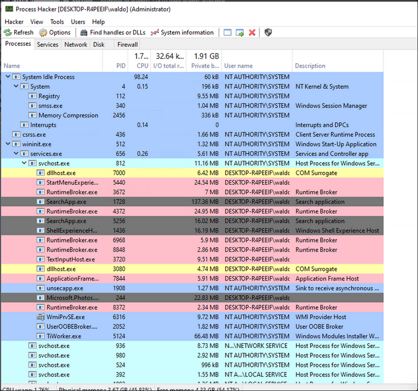

Analyzing these relationships in standard and custom environments enables you to identify deviations from normal patterns. For example, if you observe the "spoolsv.exe" process creating "whoami.exe" instead of its expected behavior of creating a "conhost", it raises suspicion.


To showcase a strange parent-child relationship, where "cmd.exe" appears to be created by "spoolsv.exe" with no accompanying arguments, you will utilize an attacking technique called Parent PID Spoofing. Parent PID Spoofing can be executed through the [psgetsystem project](https://github.com/decoder-it/psgetsystem) in the following manner.

```powershell
PS C:\Tools\psgetsystem> powershell -ep bypass
PS C:\Tools\psgetsystem> Import-Module .\psgetsys.ps1 
PS C:\Tools\psgetsystem> [MyProcess]::CreateProcessFromParent([Process ID of spoolsv.exe],"C:\Windows\System32\cmd.exe","")
```

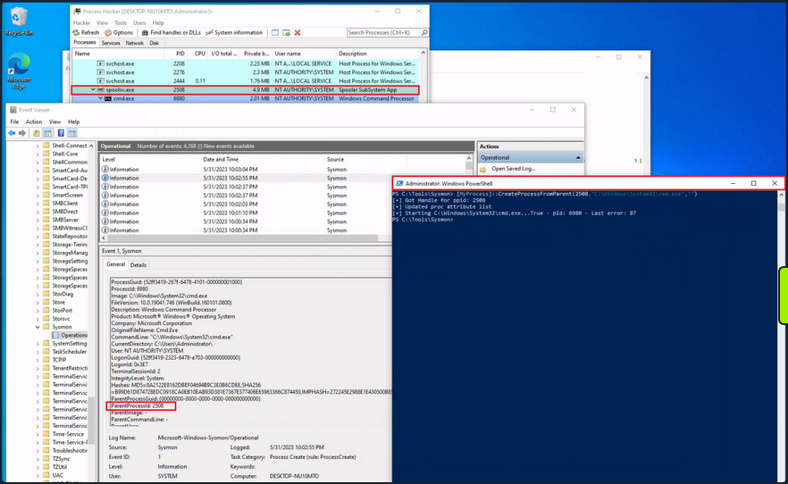

Due to the parent PID spoofing technique you employed, Sysmon Event 1 incorrectly displays spoolsv.exe as the parent of cmd.exe. However, it was actually powershell.exe that created cmd.exe.

Although Sysmon and event logs provide valuable telemetry for hunting and creating alert rules, they are not the only sources of information. Begin by collecting data from the Microsoft-Windows-Kernel-Process provider using SilkETW (_the provider can be identified using logman as described earlier, `logman.exe query providers | findstr "Process"`_). After that, you can proceed to simulate the attack again to assess whether ETW can provide you with more accurate information regarding the execution of cmd.exe.

```
c:\Tools\SilkETW_SilkService_v8\v8\SilkETW>SilkETW.exe -t user -pn Microsoft-Windows-Kernel-Process -ot file -p C:\windows\temp\etw.json
```

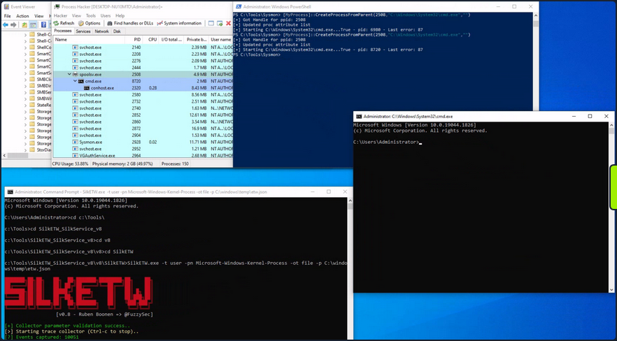

The etw.json file seems to contain information about powershell.exe being the one who created cmd.exe.

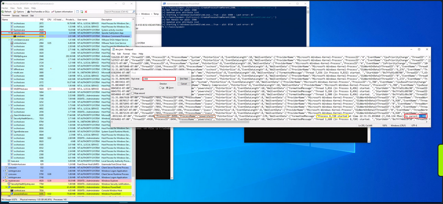

It should be noted that SilkETW event logs can be ingested and viewed by Windows Event Viewer through SilkService to provide you with deeper and more extensive visibility into the actions performed on a system.

### Detection Example 2: Detecting Malicious .NET Assembly Loading

Traditionally, adversaries employed a strategy known as "Living off the Land", exploiting legitimate system tools, such as PowerShell, to carry out their malicious operations. This approach reduces the risk of detection since it involves the use of tools that are native to the system, and therefore less likely to raise suspicion.

However, the cybersecurity community has adapted and developed countermeasures against this strategy.

Responding to these defensive advancements, attackers have developed a new approach that is labeled as "Bring your own Land". Instead of relying on the tools already present on a victim's system, threat actors and pentesters emulating these tactics now employ .NET assemblies executed entirely in memory. This involves creating custom-built tools using languages like C#, rendering them independent of the pre-existing tools on the target system. The "Bring your own Land" lands is quite effective for the following reasons:

- Each Windows system comes equipped with a certain version of .NET pre-installed by default.
- A salient feature of .NET is its managed nature, alleviating the need for programmers to manually handle memory management. This attribute is part of the framework's managed code execution process, where the Common Language Runtime (_CLR_) takes responsibility for key system-level operations such as garbage collection, eliminating memory leaks and ensuring more efficient resource utilization.
- One of the intriguing advantages of using .NET assemblies is their ability to be loaded directly into memory. This means that an executable or DLL does not need to be written physically to the disk - instead, it is executed directly in the memory. This behavior minimizes the artifacts left behind on the system and can help bypass some forms of detection that rely on inspecting files written to disk.
- Microsoft has integrated a wide range of libraries into the .NET framework to address numerous common programming challenges. These libraries include functionalities for establishing HTTP connections, implementing cryptographic operations, and enabling inter-process communication (_IPC_), such as named pipes. These pre-built tools streamline the development process, reduce the likelihood of errors, and make it easier to build robust and efficient applications. Furthermore, for a threat actor, these rich features provide a toolkit for creating more sophisticated and covert attack methods.

A poweful illustration of this BYOL strategy is the [`execute-assenbly`](https://www.cobaltstrike.com/blog/cobalt-strike-3-11-the-snake-that-eats-its-tail/) command implemented in CobaltStrike, a widely-used software platform for Adversary Simulations and Red Team Operations. CobaltStrike's `execute-assembly` command allows the user to execute .NET assemblies directly from memory, making it an ideal tool for implementing a BYOL strategy.

In a manner akin to how you detected the execution of unmanaged PowerShell scripts through the observation of anomalous clr.dll and clrjit.dll loading activity in processes that ordinarily wouldn't require them, you can employ a similar approach to identify malicious .NET assembly loading. This is achieved by scrutinizing the activity related to the loading of [.NET-associated DLLs](https://redhead0ntherun.medium.com/detecting-net-c-injection-execute-assembly-1894dbb04ff7), specifically clr.dll and mscoree.dll.

Monitoring the loading of such libraries can help reveal attempts to execute .NET assemblies in unusual or unexpected contexts, which can be a sign of malicious activity. This type of DLL loading behavior can often be detected by leveraging Sysmon's Event ID 7, which corresponds to "Image Loaded" events.

For demonstrative purposes, emulate a malicious .NET assembly load by executing a precompiled version of [Seatbelt](https://github.com/GhostPack/Seatbelt) that resides on disk. Seatbelt is a well-known .NET assembly, often employed by adversaries who load and execute it in memory to gain situational awareness of a compromised system.

```powershell
PS C:\Tools\GhostPack Compiled Binaries>.\Seatbelt.exe TokenPrivileges

                        %&&@@@&&
                        &&&&&&&%%%,                       #&&@@@@@@%%%%%%###############%
                        &%&   %&%%                        &////(((&%%%%%#%################//((((###%%%%%%%%%%%%%%%
%%%%%%%%%%%######%%%#%%####%  &%%**#                      @////(((&%%%%%%######################(((((((((((((((((((
#%#%%%%%%%#######%#%%#######  %&%,,,,,,,,,,,,,,,,         @////(((&%%%%%#%#####################(((((((((((((((((((
#%#%%%%%%#####%%#%#%%#######  %%%,,,,,,  ,,.   ,,         @////(((&%%%%%%%######################(#(((#(#((((((((((
#####%%%####################  &%%......  ...   ..         @////(((&%%%%%%%###############%######((#(#(####((((((((
#######%##########%#########  %%%......  ...   ..         @////(((&%%%%%#########################(#(#######((#####
###%##%%####################  &%%...............          @////(((&%%%%%%%%##############%#######(#########((#####
#####%######################  %%%..                       @////(((&%%%%%%%################
                        &%&   %%%%%      Seatbelt         %////(((&%%%%%%%%#############*
                        &%%&&&%%%%%        v1.2.1         ,(((&%%%%%%%%%%%%%%%%%,
                         #%%%%##,


====== TokenPrivileges ======

Current Token's Privileges

                     SeIncreaseQuotaPrivilege:  DISABLED
                          SeSecurityPrivilege:  DISABLED
                     SeTakeOwnershipPrivilege:  DISABLED
                        SeLoadDriverPrivilege:  DISABLED
                     SeSystemProfilePrivilege:  DISABLED
                        SeSystemtimePrivilege:  DISABLED
              SeProfileSingleProcessPrivilege:  DISABLED
              SeIncreaseBasePriorityPrivilege:  DISABLED
                    SeCreatePagefilePrivilege:  DISABLED
                            SeBackupPrivilege:  DISABLED
                           SeRestorePrivilege:  DISABLED
                          SeShutdownPrivilege:  DISABLED
                             SeDebugPrivilege:  SE_PRIVILEGE_ENABLED
                 SeSystemEnvironmentPrivilege:  DISABLED
                      SeChangeNotifyPrivilege:  SE_PRIVILEGE_ENABLED_BY_DEFAULT, SE_PRIVILEGE_ENABLED
                    SeRemoteShutdownPrivilege:  DISABLED
                            SeUndockPrivilege:  DISABLED
                      SeManageVolumePrivilege:  DISABLED
                       SeImpersonatePrivilege:  SE_PRIVILEGE_ENABLED_BY_DEFAULT, SE_PRIVILEGE_ENABLED
                      SeCreateGlobalPrivilege:  SE_PRIVILEGE_ENABLED_BY_DEFAULT, SE_PRIVILEGE_ENABLED
                SeIncreaseWorkingSetPrivilege:  DISABLED
                          SeTimeZonePrivilege:  DISABLED
                SeCreateSymbolicLinkPrivilege:  DISABLED
    SeDelegateSessionUserImpersonatePrivilege:  DISABLED
```

Assuming you have Sysmon configured appropriately to log image loading events, executing "Seatbelt.exe" would trigger the loading of key .NET-related DLLs such as "clr.dll" and "mscoree.dll". Sysmon, keenly observing system activities, will log these DLL load operations as Event ID 7 records.

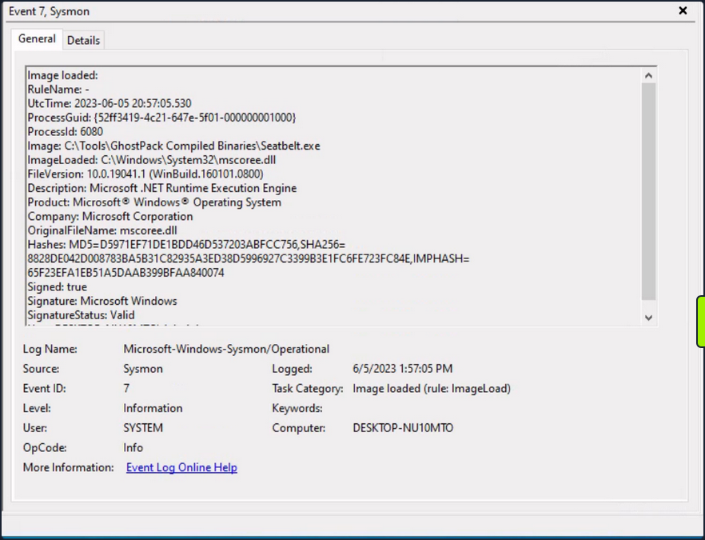

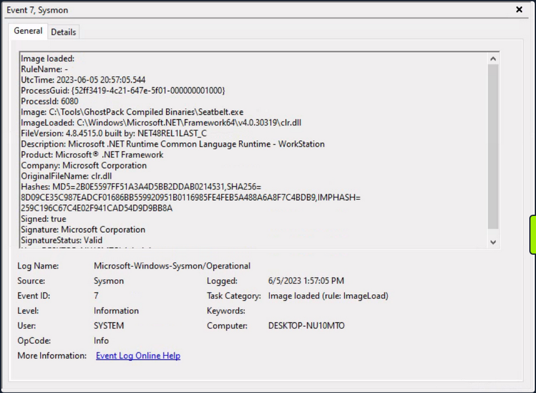

Relying solely on Sysmon Event ID 7 for detecting attacks can be challenging due to the large volume of events it generates. Additionally, while it informs you about the DLLs being loaded, it doesn't provide granular details about the actual content of the loaded .NET assembly.

To augment your visibility and gain deeper insights into the actual assmebly being loaded, you can again leverage ETW and specifically the Microsoft-Windows-DotNETRuntime provider.

Use SilkETW to collect data from the Microsoft-Windows-DotNETRuntime provider. After that, you can proceed to simulate the attack again to evaluate whether ETW can furnish you with more detailed and actionable intelligence regarding the loading and execution of the "Seatbelt" .NET assembly.

```
c:\Tools\SilkETW_SilkService_v8\v8\SilkETW>SilkETW.exe -t user -pn Microsoft-Windows-DotNETRuntime -uk 0x2038 -ot file -p C:\windows\temp\etw.json
```

The etw.json file seems to contain a wealth of information about the loaded assembly, including method names.

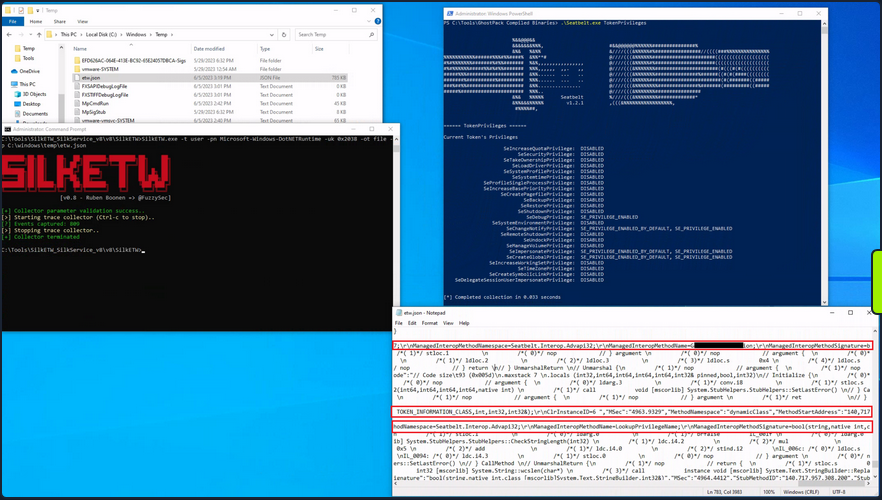

It's worth noting that in your current SilkETW configuration, you're not capturing the entirety of events from the "Microsoft-Windows-DotNETRuntime" provider. Instead, you're selectively targeting a specific subset, which includes: JitKeyword, InteropKeyword, LoaderKeyword, and NGenKeyword.

- The **JitKeyword** relates to the Just-In-Time (_JIT_) compilation events, providing information on the methods being compiled at runtime. This could be particularly useful for understanding the execution flow of the .NET assembly.
- The **InteropKeyword** refers to Interoperability events, which come into play when managed code interacts with unmanaged code. These events could provide insights into potential interactions with native APIs or other unmanaged components.
- **LoaderKeyword** events provide details on the assembly loading process within the .NET runtime, which can be vital for understanding what .NET assemblies are being loaded and potentially executed.
- The **NGenKeyword** corresponds to Native Image Generator events, which are concerned with the creation and usage of precompiled .NET assemblies. Monitoring these could help detect scenarios where attackers use precompiled .NET assemblies to evade JIT-related detections.

