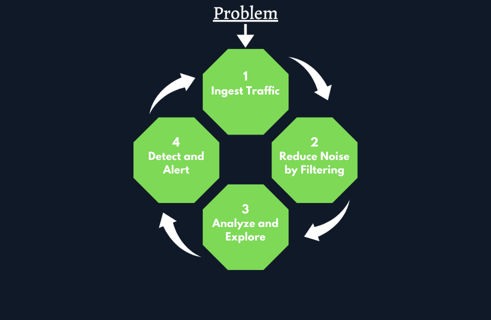
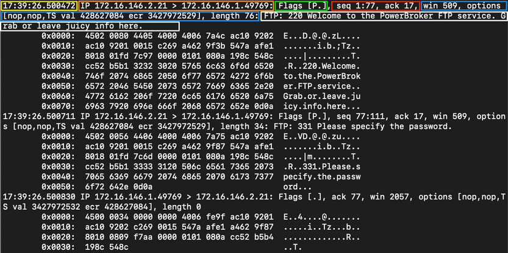
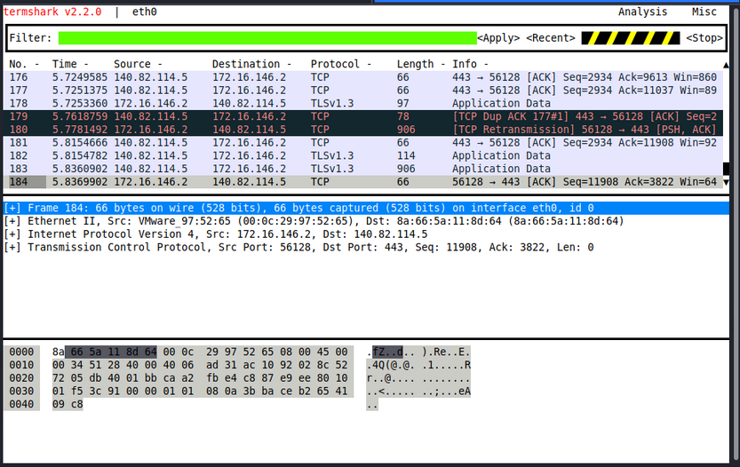
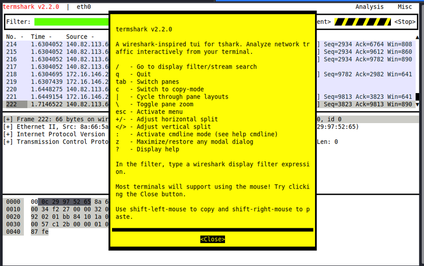
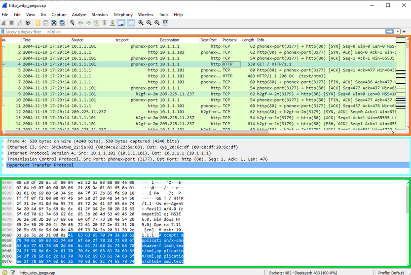
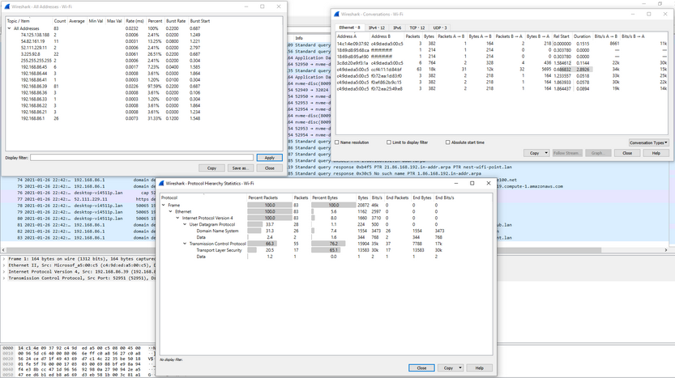
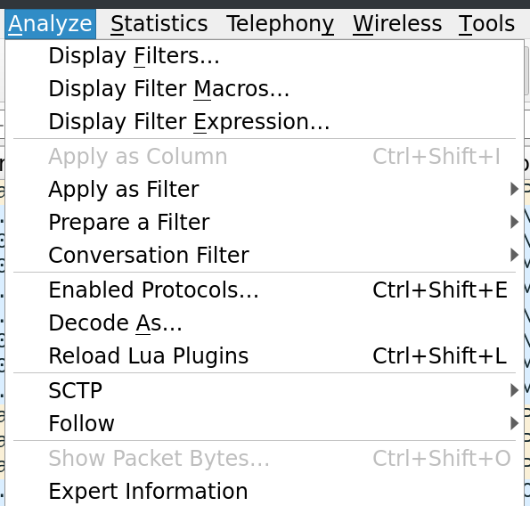

# Introduction to Network Traffic Analysis

## Introduction

### What is Network Traffic Analysis

Network Traffic Analysis (_NTA_) can be described as the act of examining network traffic to characterize common ports and protocols utilized, establish a baseline for your environment, monitor and respond to threats, and ensure the greatest possible insight into you organization's network.

This process helps security specialists determine anomalies, including security threats in the network, early and effectively pinpoint threats. Network Traffic Analysis can also facilitate the process of meeting security guidelines. Attackers update their tactics frequently to avoid detection and leverage legitimate credentials with tools that most companies allow in their networks, making detection and, subsequently, response challenging for defenders. In such cases, Network Traffic Analysis can again prove helpful. Everyday use cases of NTA include:

- Collecting real-time traffic within the network to analyze upcoming threats.
- Setting a baseline for day-to-day network communications.
- Identifying and analyzing traffic from non-standard ports, suspicious hosts, and issues with networking protocols such as HTTP errors, problems with TCP, or other networking misconfigs.
- Detecting malware on the wire, such as ransomware, exploits, and non-standard interactions.

### BPF Syntax

[Berkeley Packet Filter (_BPF_)](https://en.wikipedia.org/wiki/Berkeley_Packet_Filter) is a technology that enables a raw interface to read and write from the Data-Link layer. With all this in mind, you care for BPF because of the filtering and decoding abilities it provides you. Check out [this reference](https://www.ibm.com/docs/en/qsip/7.4?topic=queries-berkeley-packet-filters).

### Performing Network Traffic Analysis

At a minimu, to listen passively, you need to be connected to the network segment you wish to listen on. This is especially true in a switched environment where VLANs and switch ports will not forward traffic outside their broadcast domain. With that in mind, if you wish to capture traffic from a specific VLAN, your capture device should be connected to that same network. Devices like network taps, switch or router configurations like span ports, and port mirroring can allow you to get a copy of all traffic traversing a specific link, regardless of what network segment or destination it belongs to.

#### NTA Workflow

Traffic analysis is not an exact science. NTA can be a very dynamic process and is not a direct loop. It is greatly influenced by what you are looking for and where you have visibility into your network. Performing traffic analysis can distill down to a few basic tenants.



1. **Ingest Traffic**: Once you have decided on your placement, begin capturing traffic. Utilize capture filters if you already have an idea of what you are looking for.
2. **Reduce Noise by Filtering**: Capturing traffic of a link, especially one in a production environment, can be extremely noisy. Once you complete the initial capture, an attempt to filter out unnecessary traffic from your view can make analysis easier.
3. **Analyze and Explore**: Now is the time to start carving out data pertinent to the issue you are chasing down. Look at specific hosts, protocols, even things as specific as flags set in the TCP header. The following questions will help you:
	1. Is the traffic encrypted or plain text? Should it be?
	2. Can you see users attempting to access resources to which they shouldn't have access?
	3. Are different hosts talking to each other that typically do not?
4. **Detect and Alert**:
	1. Are you seeing any errors? Is a device not responding that should be?
	2. Use your analysis to decide if what you see is benign or potentially malicious.
	3. Other tools like IDS and IPS can come in handy at this point. They can run heuristics and signatures against the traffic to determine if anything within is potentially malicious.
5. **Fix and Monitor**: Fix and monitor is not a part of the loop but should be included in any workflow you perform. If you make a change or fix an issue, you should continue to monitor the source for a time to determine if the issue has been resolved.

## Analysis

### The Analysis Process

Network Traffic Analysis is a dynamic process that can change depending on the tools you have on hand, permissions given to you by the organization, and your network's visibility. Your goal is to provide a repeatable process you can begin to utilize when performing traffic analysis.

Traffic analysis is a detailed examination of an event or process, determining its origin and impact, which can be used to trigger specific precautions and/or actions to support or prevent future occurences. With network traffic, this means breaking down the data into understandable chunks, examining it for anything that derivates from regular network traffic, for potentially malicious traffic such as unauthorized remote communications from the internet over RDP, SSH, or Telnet, or unique instances preceding network issues. While performing your analysis, you are also looking to see what the trends look like within the traffic and determine if it matches a baseline of typical operational traffic.

#### Analysis Dependencies

Traffic capturing and analysis can be performed in two different ways, active or passive. Each has its dependencies. With passive, you are just copying data that you can see without directly interacting with the packets. For active traffic capture and analysis, the needs are a bit different. Active capture requires you to take a more hands-on approach. This process can also be referred to as in-line traffic captures. With both, how you analyze thet data is up to you. You can perform the capture and analysis once done, or you can perform analysis in real-time while the traffic is live. The table below lays out the dependencies for each:

| Dependencies                           | Passive | Active | Description                                                                                                                                                                                                                                                                                                                                                                                                                                                                                                                                                                                                                                                                                                                                                                            |
| -------------------------------------- | ------- | ------ | -------------------------------------------------------------------------------------------------------------------------------------------------------------------------------------------------------------------------------------------------------------------------------------------------------------------------------------------------------------------------------------------------------------------------------------------------------------------------------------------------------------------------------------------------------------------------------------------------------------------------------------------------------------------------------------------------------------------------------------------------------------------------------------- |
| Permission                             | X       | X      | Depending on the organization you are working in, capturing data can be against policy or even against the law in some sensitive areas like healthcare or banking. Be sure always to obtain permission in writing from someone with the proper authority to grant it to you.                                                                                                                                                                                                                                                                                                                                                                                                                                                                                                           |
| Mirrored Port                          | X       |        | A switch or router network interface configured to copy data from other sources to that specific interface, along with the capability to place your NIC into promiscuous mode. Having packets copied to your port allows you to inspect any traffic destined to the other links you could normally not have visibility over. Since VLANs and switch ports will not forward traffic outside of their broadcast domain, you have to be connected to the segment or have that traffic copied to your specific port. When dealing with wireless, passive can be a bit more complicated. You must connect to the SSID you wish to capture traffic off of. Just passively listening to the airwaves around you will present you with many SSID broadcast advertisements, but noch much else. |
| Capture Tool                           | X       | X      | A way to ingest the traffic. A computer with access to tools like TCPDump, Wireshark, Netminer, or others is sufficient. Keep in mind that when dealing with PCAP data, these files can get pretty large quickly. Each time you apply a filter to it in tools like Wireshark, it causes the application to parse that data again. This can be a resource-intensive process, so make sure the host has abundant resources.                                                                                                                                                                                                                                                                                                                                                              |
| In-Line Placement                      |         | X      | Placing a Tap-in-line requires a topology change for the network you are working in. The source and destination hosts will not notice a difference in the traffic, but for the sake of routing and switching, it will be an invisible next hop the traffic passes through on its way to the destination.                                                                                                                                                                                                                                                                                                                                                                                                                                                                               |
| Network Tap or Host with Multiple NICs |         | X      | A computer with two NICs, or a device such as a Network Tap is required to allow the data you are inspecting to flow still. Think of it as adding another route in the middle of a link. To actively capture the traffic, you will be duplicating data directly from the sources. The best placement for a tap is in a layer three link between switched segments. It allows for the capture of any traffic routing outside of the local network. A switched port or VLAN segmentation does not filter your view here.                                                                                                                                                                                                                                                                 |
| Storage and Processing Power           | X       | X      | You will need plenty of storage space and processing power for traffic capture off a tap. Much more traffic is traversing a layer three link than just inside a switched LAN. Think of it like this: When you passively capture traffic inside a LAN, it's like pouring water into a cup from a water fountain. It's a steady stream but manageable. Actively grabbing traffic from a routed link is more like using a water hose to fill up a teacup. There is a lot more pressure behind the flow, and it can be a lot for the host to process and store.                                                                                                                                                                                                                            |

### Analysis in Practice

#### Descriptive Analysis

... is an essential step in any data analysis. It serves to describe a data set based on individual characteristics. It helps to detect possible errors in data collection and/or outliers in the data set.

1. What is the issue?
2. Define your scope and the goal
3. Define your target(s)

That covers the issue, what you are looking for, when, and where to find it.

#### Diagnostic Analysis

... clarifies the causes, effects, and interactions of conditions. In doing so, it provides insights that are obtained through correlations and interpretation. Characteristics here is a backward-looking view, as in the closely related descriptive analytics, with the subtle difference that it tries to find reasons for events and developments.

4. Capture network traffic
5. Identification of required network traffic components
6. An understanding of captured network traffic

By capturing traffic around the source of your issue, clearing out any known good data, and then taking the time to inspect and understand what is left, you can determine if it is the cause of your problem. In doing so, you just performed diagnostic analysis. You are validating the cause of your problems and examining the events surrounding them.

#### Predictive Analysis

By evaluating historical and current data, predictive analysis creates a predictive model for future probabilities. Based on the results of descriptive and diagnostic analyses, this method of data analysis makes it possible to identify trends, detect deviations from expected values at an early stage, and predict future occurences as accurately as possible.

7. Note-taking and mind mapping of the found results
8. Summary of the analysis

By performing an evaluation of the data you have found, comparing it to your baseline traffic, and known bad data such as markers of infiltration or exploitation, you are performing predictive analysis. In this process, you paint a clear picture so that appropriate actions can be taken in response.

#### Prescriptive Analysis

... aims to narrow down what actions to take to eliminate or prevent a future problem or trigger a specific activity or process. Using the results of your workflow, you can make sound decisions as to what actions are required to solve the problem and prevent it from happening again. To prescribe a solution is the culmination of this workflow. Once done and the problem is solved, it is prudent to reflect on the entire process and develop lessons learned. These lessons, when documented, will enable you to make your processes stronger - document what was done correctly, what actions failed to help, and what could improve.

This workflow is an example of how to begin the analysis process on captured traffic. Above you broke it down into its parts to explain where they fit within the analysis process and with which type of analysis it belongs.

Often this process is not a once-and-done kind of thing. It is usually cyclic, and you will need to rerun steps based on your analysis of the original capture to build a bigger picture.

#### Key Components of an Effective Analysis

1. **Know your environment**: There are several key components to perform traffic analysis effectively. First, know the environment. If you are unsure if a host belongs in the network, how can you determine if it is rogue or not? Keeping asset inventories and network maps is vital. These will aid in the analysis process.
2. **Placement is key**: Next, the placement of your host for capturing traffic is a critical thing. Closest to the source of the issue is the ideal placement of your capturing tool. If the traffic in question is coming from the internet, listening to the inbound links is a great way to see the complete picture. It is as close to the source as you can get. If the problem seems to be isolated to one host on your internal network, try placing the capture tools in the same segment as the problem host and see what traffic is happening within the segment.
3. **Persistence**: Persistence is the next critical component for you. The issue will not always be easy to spot. It may not even be a frequent event on the network. For example, an attacker's C2 server reaching out to the victim's computers may only happen on a time interval once every several hours, or even once a day or less. This means that if you did not catch it the first time around, it might be a while before it appears in your logs. Don't lose the drive to find the problem. It could mean the difference between stopping the attacker and a full-scale breach like a ransomware attack.

## Tcpdump

### Fundamentals

Tcpdump is a command-line packet sniffer that can directly capture and interpret data frames from a file or network interface. It was built for use on any Unix-like OS and had a Windows twin called WinDump. It is a potent and straightforward tool used on most Unix-based systems. It does not require a GUI and can be used through any terminal or remote connection, such as SSH. To capture network traffic from "off the wire", it uses the libraries pcap and libcap, paired with an interface in promiscuous mode to listen for data. This allows the program to see and capture packets sourcing from or destined for any device in the local area network, not just the packets destined for you.

TCPDump is available for most Unix systems and Unix deriatives, such as AIX, BSD, Linux, Solaris, and is supplied by many manufacturers already in the system. Due to the direct access to the hardware, you need the root or the administrator's privileges to run this tool.

#### Traffic Capture

Basic switches you can use to modify how your capture runs:

| Switch Command | Result |
| -------------- | ------ |
| `D` | will display any interfaces available to capture from |
| `i` | selects an interface to capture from `-i eth0` |
| `n` | do not convert addresses to names |
| `e` | will grab the ethernet header along with upper-layer data |
| `X` | show contents of packets in hex and ASCII |
| `XX` | same as `X`, but will also specify ethernet headers |
| `v`, `vv`, `vvv` | increase the verbosity of output shown and saved |
| `c` | grab a specific number of packets, then quit the program |
| `s` | defines how much of a packet to grab |
| `S` | change relative sequence numbers in the capture display to absolute sequence numbers |
| `q` | print less protocol information |
| `r file.pcap` | read from a file |
| `w file.pcap` | write into a file |

##### Listing Available Interfaces

```bash
d41y@htb[/htb]$ sudo tcpdump -D

1.eth0 [Up, Running, Connected]
2.any (Pseudo-device that captures on all interfaces) [Up, Running]
3.lo [Up, Running, Loopback]
4.bluetooth0 (Bluetooth adapter number 0) [Wireless, Association status unknown]
5.bluetooth-monitor (Bluetooth Linux Monitor) [Wireless]
6.nflog (Linux netfilter log (NFLOG) interface) [none]
7.nfqueue (Linux netfilter queue (NFQUEUE) interface) [none]
8.dbus-system (D-Bus system bus) [none]
9.dbus-session (D-Bus session bus) [none]
```

##### Choosing an Interface to Capture From

```bash
d41y@htb[/htb]$ sudo tcpdump -i eth0

tcpdump: verbose output suppressed, use -v[v]... for full protocol decode
listening on eth0, link-type EN10MB (Ethernet), snapshot length 262144 bytes
10:58:33.719241 IP 172.16.146.2.55260 > 172.67.1.1.https: Flags [P.], seq 1953742992:1953743073, ack 2034210498, win 501, length 81
10:58:33.747853 IP 172.67.1.1.https > 172.16.146.2.55260: Flags [.], ack 81, win 158, length 0
10:58:33.750393 IP 172.16.146.2.52195 > 172.16.146.1.domain: 7579+ PTR? 1.1.67.172.in-addr.arpa. (41)
```

##### Disable Name Resolution

```bash
d41y@htb[/htb]$ sudo tcpdump -i eth0 -nn

tcpdump: verbose output suppressed, use -v[v]... for full protocol decode
listening on eth0, link-type EN10MB (Ethernet), snapshot length 262144 bytes
11:02:35.580449 IP 172.16.146.2.48402 > 52.31.199.148.443: Flags [P.], seq 988167196:988167233, ack 1512376150, win 501, options [nop,nop,TS val 214282239 ecr 77421665], length 37
11:02:35.588695 IP 172.16.146.2.55272 > 172.67.1.1.443: Flags [P.], seq 940648841:940648916, ack 4248406693, win 501, length 75
11:02:35.654368 IP 172.67.1.1.443 > 172.16.146.2.55272: Flags [.], ack 75, win 70, length 0
11:02:35.728889 IP 52.31.199.148.443 > 172.16.146.2.48402: Flags [P.], seq 1:34, ack 37, win 118, options [nop,nop,TS val 77434740 ecr 214282239], length 33
11:02:35.728988 IP 172.16.146.2.48402 > 52.31.199.148.443: Flags [.], ack 34, win 501, options [nop,nop,TS val 214282388 ecr 77434740], length 0
11:02:35.729073 IP 52.31.199.148.443 > 172.16.146.2.48402: Flags [P.], seq 34:65, ack 37, win 118, options [nop,nop,TS val 77434740 ecr 214282239], length 31
11:02:35.729081 IP 172.16.146.2.48402 > 52.31.199.148.443: Flags [.], ack 65, win 501, options [nop,nop,TS val 214282388 ecr 77434740], length 0
11:02:35.729348 IP 52.31.199.148.443 > 172.16.146.2.48402: Flags [F.], seq 65, ack 37, win 118, options [nop,nop,TS val 77434740 ecr 214282239], length 0
```

##### Display Ethernet Header

```bash
d41y@htb[/htb]$ sudo tcpdump -i eth0 -e

tcpdump: verbose output suppressed, use -v[v]... for full protocol decode
listening on eth0, link-type EN10MB (Ethernet), snapshot length 262144 bytes
11:05:45.982115 00:0c:29:97:52:65 (oui Unknown) > 8a:66:5a:11:8d:64 (oui Unknown), ethertype IPv4 (0x0800), length 103: 172.16.146.2.57142 > ec2-99-80-22-207.eu-west-1.compute.amazonaws.com.https: Flags [P.], seq 922951468:922951505, ack 1842875143, win 501, options [nop,nop,TS val 1368272062 ecr 65637925], length 37
11:05:45.989652 00:0c:29:97:52:65 (oui Unknown) > 8a:66:5a:11:8d:64 (oui Unknown), ethertype IPv4 (0x0800), length 129: 172.16.146.2.55272 > 172.67.1.1.https: Flags [P.], seq 940656124:940656199, ack 4248413119, win 501, length 75
11:05:46.047731 00:0c:29:97:52:65 (oui Unknown) > 8a:66:5a:11:8d:64 (oui Unknown), ethertype IPv4 (0x0800), length 85: 172.16.146.2.54006 > 172.16.146.1.domain: 31772+ PTR? 207.22.80.99.in-addr.arpa. (43)
11:05:46.049134 8a:66:5a:11:8d:64 (oui Unknown) > 00:0c:29:97:52:65 (oui Unknown), ethertype IPv4 (0x0800), length 147: 172.16.146.1.domain > 172.16.146.2.54006: 31772 1/0/0 PTR ec2-99-80-22-207.eu-west-1.compute.amazonaws.com. (105)
```

##### Include ASCII and Hex Output

```bash
d41y@htb[/htb]$ sudo tcpdump -i eth0 -X

tcpdump: verbose output suppressed, use -v[v]... for full protocol decode
listening on eth0, link-type EN10MB (Ethernet), snapshot length 262144 bytes
11:10:34.972248 IP 172.16.146.2.57170 > ec2-99-80-22-207.eu-west-1.compute.amazonaws.com.https: Flags [P.], seq 2612172989:2612173026, ack 3165195759, win 501, options [nop,nop,TS val 1368561052 ecr 65712142], length 37
    0x0000:  4500 0059 4352 4000 4006 3f1b ac10 9202  E..YCR@.@.?.....
    0x0010:  6350 16cf df52 01bb 9bb2 98bd bca9 0def  cP...R..........
    0x0020:  8018 01f5 b87d 0000 0101 080a 5192 959c  .....}......Q...
    0x0030:  03ea b00e 1703 0300 2000 0000 0000 0000  ................
    0x0040:  0adb 84ac 34b4 910a 0fb4 2f49 9865 eb45  ....4...../I.e.E
    0x0050:  883c eafd 8266 3e23 88                   .<...f>#.
11:10:34.984582 IP 172.16.146.2.38732 > 172.16.146.1.domain: 22938+ A? app.hackthebox.eu. (35)
    0x0000:  4500 003f 2e6b 4000 4011 901e ac10 9202  E..?.k@.@.......
    0x0010:  ac10 9201 974c 0035 002b 7c61 599a 0100  .....L.5.+|aY...
    0x0020:  0001 0000 0000 0000 0361 7070 0a68 6163  .........app.hac
    0x0030:  6b74 6865 626f 7802 6575 0000 0100 01    kthebox.eu.....
11:10:35.055497 IP 172.16.146.2.43116 > 172.16.146.1.domain: 6524+ PTR? 207.22.80.99.in-addr.arpa. (43)
    0x0000:  4500 0047 2e72 4000 4011 900f ac10 9202  E..G.r@.@.......
    0x0010:  ac10 9201 a86c 0035 0033 7c69 197c 0100  .....l.5.3|i.|..
    0x0020:  0001 0000 0000 0000 0332 3037 0232 3202  .........207.22.
    0x0030:  3830 0239 3907 696e 2d61 6464 7204 6172  80.99.in-addr.ar
    0x0040:  7061 0000 0c00 01                        pa.....
```

#### Output



| Filter                               | Color  | Result                                                                                                                                                                                                                                                                                        |
| ------------------------------------ | ------ | --------------------------------------------------------------------------------------------------------------------------------------------------------------------------------------------------------------------------------------------------------------------------------------------- |
| Timestamp                            | Yellow | The timestamp field comes first and is configurable to show the time and date in a format you can ingest easily.                                                                                                                                                                              |
| Protocol                             | Orange | This section will tell you what the upper-layer header is. In the example, it shows IP.                                                                                                                                                                                                       |
| Source & Destination IP.Port         | Orange | This will show you the source and destination of the packet along with the port number used to connect.                                                                                                                                                                                       |
| Flags                                | Green  | This portion shows any flags utilized.                                                                                                                                                                                                                                                        |
| Sequence and Acknowledgement Numbers | Red    | This section shows the sequence and acknowledgement numbers used to track the TCP segment. The example is utilizing low numbers to assume that relative sequence and ack numbers are being displayed.                                                                                         |
| Protocol Options                     | Blue   | Here, you will see any negotiated TCP values established between the client and server, such as window size, selective acknowledgements, window scale factors, and more.                                                                                                                      |
| Notes / Next Header                  | White  | Misc notes the dissector found will be present here. As the traffic you are looking at is encapsulated, you may see more header information for different protocols. In the example, you can see the TCPDump dissector recognizes FTP traffic within the encapsulation to display it for you. |

#### File Input/Output

##### Save PCAP Output to a File

```bash
d41y@htb[/htb]$ sudo tcpdump -i eth0 -w ~/output.pcap

tcpdump: listening on eth0, link-type EN10MB (Ethernet), snapshot length 262144 bytes
10 packets captured
131 packets received by filter
0 packets dropped by kernel
```

##### Reading Output from a File

```bash
d41y@htb[/htb]$ sudo tcpdump -r ~/output.pcap

reading from file /home/trey/output.pcap, link-type EN10MB (Ethernet), snapshot length 262144
11:15:40.321509 IP 172.16.146.2.57236 > ec2-99-80-22-207.eu-west-1.compute.amazonaws.com.https: Flags [P.], seq 2751910362:2751910399, ack 946558143, win 501, options [nop,nop,TS val 1368866401 ecr 65790024], length 37
11:15:40.337302 IP 172.16.146.2.55416 > 172.67.1.1.https: Flags [P.], seq 3766493458:3766493533, ack 4098207917, win 501, length 75
11:15:40.398103 IP 172.67.1.1.https > 172.16.146.2.55416: Flags [.], ack 75, win 73, length 0
11:15:40.457416 IP ec2-99-80-22-207.eu-west-1.compute.amazonaws.com.https > 172.16.146.2.57236: Flags [.], ack 37, win 118, options [nop,nop,TS val 65799068 ecr 1368866401], length 0
11:15:40.458582 IP ec2-99-80-22-207.eu-west-1.compute.amazonaws.com.https > 172.16.146.2.57236: Flags [P.], seq 34:65, ack 37, win 118, options [nop,nop,TS val 65799068 ecr 1368866401], length 31
11:15:40.458599 IP 172.16.146.2.57236 > ec2-99-80-22-207.eu-west-1.compute.amazonaws.com.https: Flags [.], ack 1, win 501, options [nop,nop,TS val 1368866538 ecr 65799068,nop,nop,sack 1 {34:65}], length 0
11:15:40.458643 IP ec2-99-80-22-207.eu-west-1.compute.amazonaws.com.https > 172.16.146.2.57236: Flags [P.], seq 1:34, ack 37, win 118, options [nop,nop,TS val 65799068 ecr 1368866401], length 33
11:15:40.458655 IP 172.16.146.2.57236 > ec2-99-80-22-207.eu-west-1.compute.amazonaws.com.https: Flags [.], ack 65, win 501, options [nop,nop,TS val 1368866538 ecr 65799068], length 0
11:15:40.458915 IP 172.16.146.2.57236 > ec2-99-80-22-207.eu-west-1.compute.amazonaws.com.https: Flags [P.], seq 37:68, ack 65, win 501, options [nop,nop,TS val 1368866539 ecr 65799068], length 31
11:15:40.458964 IP 172.16.146.2.57236 > ec2-99-80-22-207.eu-west-1.compute.amazonaws.com.https: Flags [F.], seq 68, ack 65, win 501, options [nop,nop,TS val 1368866539 ecr 65799068], length 0
```

### Packet Filtering

Utilizing more advanced filtering options will enable you to trim down what traffic is printed to output or sent to file. By reducing the amount of info you capture and write to disk, you can help reduce the space needed to write the file and help the buffer process data quicker. Filters can be handy when paired with standard tcpdump syntax options. You can capture as widely as you wish, or be super specific only to capture packets from a particular host, or even with a particular bit in the TCP header set to on.

| Filter     | Result                                                                                              |
| ---------- | --------------------------------------------------------------------------------------------------- |
| host       | will filter visible traffic to show anything involving the designated host; bi-directional          |
| src / dest | are modifiers; you can use them to designate a source or destination host or port                   |
| net        | will show you any traffic sourcing from or destined to the network designated; it uses "/" notation |
| proto      | will filter for a specific protocol type                                                            |
| port       | is bi-directional; it will show any traffic with the specified port as the source or destination    |
| portrange  | allows you to specify a range or ports                                                              |
| < / >      | can be used to look for a packet or protocol option of a specific size                              |
| && / and   | can be used to concatenate two different filters together                                           |
| or         | allows for a match on either of two conditions; it does not have to meet both                       |
| not        | is a modifier saying anything but x                                                                 |

##### Host Filter

```bash
d41y@htb[/htb]$ ### Syntax: host [IP]
d41y@htb[/htb]$ sudo tcpdump -i eth0 host 172.16.146.2

tcpdump: verbose output suppressed, use -v[v]... for full protocol decode
listening on eth0, link-type EN10MB (Ethernet), snapshot length 262144 bytes
14:50:53.072536 IP 172.16.146.2.48738 > ec2-52-31-199-148.eu-west-1.compute.amazonaws.com.https: Flags [P.], seq 3400465007:3400465044, ack 254421756, win 501, options [nop,nop,TS val 220968655 ecr 80852594], length 37
14:50:53.108740 IP 172.16.146.2.55606 > 172.67.1.1.https: Flags [P.], seq 4227143181:4227143273, ack 1980233980, win 21975, length 92
14:50:53.173084 IP 172.67.1.1.https > 172.16.146.2.55606: Flags [.], ack 92, win 69, length 0
14:50:53.175017 IP 172.16.146.2.35744 > 172.16.146.1.domain: 55991+ PTR? 148.199.31.52.in-addr.arpa. (44)
14:50:53.175714 IP 172.16.146.1.domain > 172.16.146.2.35744: 55991 1/0/0 PTR ec2-52-31-199-148.eu-west-1.compute.amazonaws.com. (107)
```

##### Source / Destination Filter

```bash
d41y@htb[/htb]$ ### Syntax: src/dst [host|net|port] [IP|Network Range|Port]
d41y@htb[/htb]$ sudo tcpdump -i eth0 src host 172.16.146.2
  
tcpdump: verbose output suppressed, use -v[v]... for full protocol decode
listening on eth0, link-type EN10MB (Ethernet), snapshot length 262144 bytes
14:53:36.199628 IP 172.16.146.2.48766 > ec2-52-31-199-148.eu-west-1.compute.amazonaws.com.https: Flags [P.], seq 1428378231:1428378268, ack 3778572066, win 501, options [nop,nop,TS val 221131782 ecr 80889856], length 37
14:53:36.203166 IP 172.16.146.2.55606 > 172.67.1.1.https: Flags [P.], seq 4227144035:4227144103, ack 1980235221, win 21975, length 68
14:53:36.267059 IP 172.16.146.2.36424 > 172.16.146.1.domain: 40873+ PTR? 148.199.31.52.in-addr.arpa. (44)
14:53:36.267880 IP 172.16.146.2.51151 > 172.16.146.1.domain: 10032+ PTR? 2.146.16.172.in-addr.arpa. (43)
14:53:36.276425 IP 172.16.146.2.46588 > 172.16.146.1.domain: 28357+ PTR? 1.1.67.172.in-addr.arpa. (41)
14:53:36.337722 IP 172.16.146.2.48766 > ec2-52-31-199-148.eu-west-1.compute.amazonaws.com.https: Flags [.], ack 34, win 501, options [nop,nop,TS val 221131920 ecr 80899875], length 0
14:53:36.338841 IP 172.16.146.2.48766 > ec2-52-31-199-148.eu-west-1.compute.amazonaws.com.https: Flags [.], ack 65, win 501, options [nop,nop,TS val 221131921 ecr 80899875], length 0
14:53:36.339273 IP 172.16.146.2.48766 > ec2-52-31-199-148.eu-west-1.compute.amazonaws.com.https: Flags [P.], seq 37:68, ack 66, win 501, options [nop,nop,TS val 221131922 ecr 80899875], length 31
14:53:36.339334 IP 172.16.146.2.48766 > ec2-52-31-199-148.eu-west-1.compute.amazonaws.com.https: Flags [F.], seq 68, ack 66, win 501, options [nop,nop,TS val 221131922 ecr 80899875], length 0
14:53:36.370791 IP 172.16.146.2.32972 > 172.16.146.1.domain: 3856+ PTR? 1.146.16.172.in-addr.arpa. (43)
```

##### Utilizing Source with Port as a Filter

```bash
d41y@htb[/htb]$ sudo tcpdump -i eth0 tcp src port 80

06:17:08.222534 IP 65.208.228.223.http > dialin-145-254-160-237.pools.arcor-ip.net.3372: Flags [S.], seq 290218379, ack 951057940, win 5840, options [mss 1380,nop,nop,sackOK], length 0
06:17:08.783340 IP 65.208.228.223.http > dialin-145-254-160-237.pools.arcor-ip.net.3372: Flags [.], ack 480, win 6432, length 0
06:17:08.993643 IP 65.208.228.223.http > dialin-145-254-160-237.pools.arcor-ip.net.3372: Flags [.], seq 1:1381, ack 480, win 6432, length 1380: HTTP: HTTP/1.1 200 OK
06:17:09.123830 IP 65.208.228.223.http > dialin-145-254-160-237.pools.arcor-ip.net.3372: Flags [.], seq 1381:2761, ack 480, win 6432, length 1380: HTTP
06:17:09.754737 IP 65.208.228.223.http > dialin-145-254-160-237.pools.arcor-ip.net.3372: Flags [.], seq 2761:4141, ack 480, win 6432, length 1380: HTTP
06:17:09.864896 IP 65.208.228.223.http > dialin-145-254-160-237.pools.arcor-ip.net.3372: Flags [P.], seq 4141:5521, ack 480, win 6432, length 1380: HTTP
06:17:09.945011 IP 65.208.228.223.http > dialin-145-254-160-237.pools.arcor-ip.net.3372: Flags [.], seq 5521:6901, ack 480, win 6432, length 1380: HTTP
```

##### Using Destination in Combination with the Net Filter

```bash
d41y@htb[/htb]$ sudo tcpdump -i eth0 dest net 172.16.146.0/24

tcpdump: verbose output suppressed, use -v[v]... for full protocol decode
listening on eth0, link-type EN10MB (Ethernet), snapshot length 262144 bytes
16:33:14.376003 IP 64.233.177.103.443 > 172.16.146.2.36050: Flags [.], ack 1486880537, win 316, options [nop,nop,TS val 2311579424 ecr 263866084], length 0
16:33:14.442123 IP 64.233.177.103.443 > 172.16.146.2.36050: Flags [P.], seq 0:385, ack 1, win 316, options [nop,nop,TS val 2311579493 ecr 263866084], length 385
16:33:14.442188 IP 64.233.177.103.443 > 172.16.146.2.36050: Flags [P.], seq 385:1803, ack 1, win 316, options [nop,nop,TS val 2311579493 ecr 263866084], length 1418
16:33:14.442223 IP 64.233.177.103.443 > 172.16.146.2.36050: Flags [.], seq 1803:4639, ack 1, win 316, options [nop,nop,TS val 2311579494 ecr 263866084], length 2836
16:33:14.443161 IP 64.233.177.103.443 > 172.16.146.2.36050: Flags [P.], seq 4639:5817, ack 1, win 316, options [nop,nop,TS val 2311579495 ecr 263866084], length 1178
16:33:14.443199 IP 64.233.177.103.443 > 172.16.146.2.36050: Flags [.], seq 5817:8653, ack 1, win 316, options [nop,nop,TS val 2311579495 ecr 263866084], length 2836
16:33:14.444407 IP 64.233.177.103.443 > 172.16.146.2.36050: Flags [.], seq 8653:10071, ack 1, win 316, options [nop,nop,TS val 2311579497 ecr 263866084], length 1418
16:33:14.445479 IP 64.233.177.103.443 > 172.16.146.2.36050: Flags [.], seq 10071:11489, ack 1, win 316, options [nop,nop,TS val 2311579497 ecr 263866084], length 1418
16:33:14.445531 IP 64.233.177.103.443 > 172.16.146.2.36050: Flags [.], seq 11489:12907, ack 1, win 316, options [nop,nop,TS val 2311579498 ecr 263866084], length 1418
16:33:14.446955 IP 64.233.177.103.443 > 172.16.146.2.36050: Flags [.], seq 12907:14325, ack 1, win 316, options [nop,nop,TS val 2311579498 ecr 263866084], length 1418
```

##### Protocol Filter - Common Name

```bash
d41y@htb[/htb]$ ### Syntax: [tcp/udp/icmp]
d41y@htb[/htb]$ sudo tcpdump -i eth0 udp

06:17:09.864896 IP dialin-145-254-160-237.pools.arcor-ip.net.3009 > 145.253.2.203.domain: 35+ A? pagead2.googlesyndication.com. (47)
06:17:10.225414 IP 145.253.2.203.domain > dialin-145-254-160-237.pools.arcor-ip.net.3009: 35 4/0/0 CNAME pagead2.google.com., CNAME pagead.google.akadns.net., A 216.239.59.104, A 216.239.59.99 (146)
```

##### Protocol Filter - [Number](https://www.iana.org/assignments/protocol-numbers/protocol-numbers.xhtml)

```bash
d41y@htb[/htb]$ ### Syntax: proto [protocol number]
d41y@htb[/htb]$ sudo tcpdump -i eth0 proto 17

06:17:09.864896 IP dialin-145-254-160-237.pools.arcor-ip.net.3009 > 145.253.2.203.domain: 35+ A? pagead2.googlesyndication.com. (47)
06:17:10.225414 IP 145.253.2.203.domain > dialin-145-254-160-237.pools.arcor-ip.net.3009: 35 4/0/0 CNAME pagead2.google.com., CNAME pagead.google.akadns.net., A 216.239.59.104, A 216.239.59.99 (146)
```

##### Port Filter

```bash
d41y@htb[/htb]$ ### Syntax: port [port number]
d41y@htb[/htb]$ sudo tcpdump -i eth0 tcp port 443

06:17:07.311224 IP dialin-145-254-160-237.pools.arcor-ip.net.3372 > 65.208.228.223.http: Flags [S], seq 951057939, win 8760, options [mss 1460,nop,nop,sackOK], length 0
06:17:08.222534 IP 65.208.228.223.http > dialin-145-254-160-237.pools.arcor-ip.net.3372: Flags [S.], seq 290218379, ack 951057940, win 5840, options [mss 1380,nop,nop,sackOK], length 0
06:17:08.222534 IP dialin-145-254-160-237.pools.arcor-ip.net.3372 > 65.208.228.223.http: Flags [.], ack 1, win 9660, length 0
06:17:08.222534 IP dialin-145-254-160-237.pools.arcor-ip.net.3372 > 65.208.228.223.http: Flags [P.], seq 1:480, ack 1, win 9660, length 479: HTTP: GET /download.html HTTP/1.1
06:17:08.783340 IP 65.208.228.223.http > dialin-145-254-160-237.pools.arcor-ip.net.3372: Flags [.], ack 480, win 6432, length 0
06:17:08.993643 IP 65.208.228.223.http > dialin-145-254-160-237.pools.arcor-ip.net.3372: Flags [.], seq 1:1381, ack 480, win 6432, length 1380: HTTP: HTTP/1.1 200 OK
06:17:09.123830 IP dialin-145-254-160-237.pools.arcor-ip.net.3372 > 65.208.228.223.http: Flags [.], ack 1381, win 9660, length 0
06:17:09.123830 IP 65.208.228.223.http > dialin-145-254-160-237.pools.arcor-ip.net.3372: Flags [.], seq 1381:2761, ack 480, win 6432, length 1380: HTTP
06:17:09.324118 IP dialin-145-254-160-237.pools.arcor-ip.net.3372 > 65.208.228.223.http: Flags [.], ack 2761, win 9660, length 0
06:17:09.754737 IP 65.208.228.223.http > dialin-145-254-160-237.pools.arcor-ip.net.3372: Flags [.], seq 2761:4141, ack 480, win 6432, length 1380: HTTP
06:17:09.864896 IP 65.208.228.223.http > dialin-145-254-160-237.pools.arcor-ip.net.3372: Flags [P.], seq 4141:5521, ack 480, win 6432, length 1380: HTTP
06:17:09.864896 IP dialin-145-254-160-237.pools.arcor-ip.net.3372 > 65.208.228.223.http: Flags [.], ack 5521, win 9660, length 0
06:17:09.945011 IP 65.208.228.223.http > dialin-145-254-160-237.pools.arcor-ip.net.3372: Flags [.], seq 5521:6901, ack 480, win 6432, length 1380: HTTP
06:17:10.125270 IP dialin-145-254-160-237.pools.arcor-ip.net.3372 > 65.208.228.223.http: Flags [.], ack 6901, win 9660, length 0
06:17:10.205385 IP 65.208.228.223.http > dialin-145-254-160-237.pools.arcor-ip.net.3372: Flags [.], seq 6901:8281, ack 480, win 6432, length 1380: HTTP
06:17:10.295515 IP dialin-145-254-160-237.pools.arcor-ip.net.3371 > 216.239.59.99.http: Flags [P.], seq 918691368:918692089, ack 778785668, win 8760, length 721: HTTP: GET /pagead/ads?client=ca-pub-2309191948673629&random=1084443430285&lmt=1082467020&format=468x60_as&output=html&url=http%3A%2F%2Fwww.ethereal.com%2Fdownload.html&color_bg=FFFFFF&color_text=333333&color_link=000000&color_url=666633&color_border=666633 HTTP/1.1
```

##### Port Range Filter

```bash
d41y@htb[/htb]$ ### Syntax: portrange [portrange 0-65535]
d41y@htb[/htb]$ sudo tcpdump -i eth0 portrange 0-1024

tcpdump: verbose output suppressed, use -v[v]... for full protocol decode
listening on eth0, link-type EN10MB (Ethernet), snapshot length 262144 bytes
13:10:35.092477 IP 172.16.146.1.domain > 172.16.146.2.32824: 47775 1/0/0 CNAME autopush.prod.mozaws.net. (81)
13:10:35.093217 IP 172.16.146.2.48078 > 172.16.146.1.domain: 30234+ A? ocsp.pki.goog. (31)
13:10:35.093334 IP 172.16.146.2.48078 > 172.16.146.1.domain: 32024+ AAAA? ocsp.pki.goog. (31)
13:10:35.136255 IP 172.16.146.1.domain > 172.16.146.2.48078: 32024 2/0/0 CNAME pki-goog.l.google.com., AAAA 2607:f8b0:4002:c09::5e (94)
13:10:35.137348 IP 172.16.146.1.domain > 172.16.146.2.48078: 30234 2/0/0 CNAME pki-goog.l.google.com., A 172.217.164.67 (82)
13:10:35.137989 IP 172.16.146.2.55074 > atl26s18-in-f3.1e100.net.http: Flags [S], seq 1146136517, win 64240, options [mss 1460,sackOK,TS val 1337520268 ecr 0,nop,wscale 7], length 0
13:10:35.174443 IP atl26s18-in-f3.1e100.net.http > 172.16.146.2.55074: Flags [S.], seq 345110814, ack 1146136518, win 65535, options [mss 1430,sackOK,TS val 1000152427 ecr 1337520268,nop,wscale 8], length 0
13:10:35.174481 IP 172.16.146.2.55074 > atl26s18-in-f3.1e100.net.http: Flags [.], ack 1, win 502, options [nop,nop,TS val 1337520304 ecr 1000152427], length 0
13:10:35.174716 IP 172.16.146.2.55074 > atl26s18-in-f3.1e100.net.http: Flags [P.], seq 1:379, ack 1, win 502, options [nop,nop,TS val 1337520305 ecr 1000152427], length 378: HTTP: POST /gts1o1core HTTP/1.1
13:10:35.208007 IP atl26s18-in-f3.1e100.net.http > 172.16.146.2.55074: Flags [.], ack 379, win 261, options [nop,nop,TS val 1000152462 ecr 1337520305], length 0
```

##### Less / Greater Filter

```bash
d41y@htb[/htb]$ ### Syntax: less/greater [size in bytes]
d41y@htb[/htb]$ sudo tcpdump -i eth0 less 64

06:17:07.311224 IP dialin-145-254-160-237.pools.arcor-ip.net.3372 > 65.208.228.223.http: Flags [S], seq 951057939, win 8760, options [mss 1460,nop,nop,sackOK], length 0
06:17:08.222534 IP 65.208.228.223.http > dialin-145-254-160-237.pools.arcor-ip.net.3372: Flags [S.], seq 290218379, ack 951057940, win 5840, options [mss 1380,nop,nop,sackOK], length 0
06:17:08.222534 IP dialin-145-254-160-237.pools.arcor-ip.net.3372 > 65.208.228.223.http: Flags [.], ack 1, win 9660, length 0
06:17:08.783340 IP 65.208.228.223.http > dialin-145-254-160-237.pools.arcor-ip.net.3372: Flags [.], ack 480, win 6432, length 0
06:17:09.123830 IP dialin-145-254-160-237.pools.arcor-ip.net.3372 > 65.208.228.223.http: Flags [.], ack 1381, win 9660, length 0
06:17:09.324118 IP dialin-145-254-160-237.pools.arcor-ip.net.3372 > 65.208.228.223.http: Flags [.], ack 2761, win 9660, length 0
06:17:09.864896 IP dialin-145-254-160-237.pools.arcor-ip.net.3372 > 65.208.228.223.http: Flags [.], ack 5521, win 9660, length 0
06:17:10.125270 IP dialin-145-254-160-237.pools.arcor-ip.net.3372 > 65.208.228.223.http: Flags [.], ack 6901, win 9660, length 0
06:17:10.325558 IP dialin-145-254-160-237.pools.arcor-ip.net.3372 > 65.208.228.223.http: Flags [.], ack 8281, win 9660, length 0
06:17:10.806249 IP dialin-145-254-160-237.pools.arcor-ip.net.3372 > 65.208.228.223.http: Flags [.], ack 11041, win 9660, length 0
06:17:10.956465 IP 216.239.59.99.http > dialin-145-254-160-237.pools.arcor-ip.net.3371: Flags [.], ack 918692089, win 31460, length 0
06:17:11.126710 IP dialin-145-254-160-237.pools.arcor-ip.net.3372 > 65.208.228.223.http: Flags [.], ack 12421, win 9660, length 0
06:17:11.266912 IP dialin-145-254-160-237.pools.arcor-ip.net.3371 > 216.239.59.99.http: Flags [.], ack 1590, win 8760, length 0
06:17:11.527286 IP dialin-145-254-160-237.pools.arcor-ip.net.3372 > 65.208.228.223.http: Flags [.], ack 13801, win 9660, length 0
06:17:11.667488 IP dialin-145-254-160-237.pools.arcor-ip.net.3372 > 65.208.228.223.http: Flags [.], ack 16561, win 9660, length 0
06:17:11.807689 IP dialin-145-254-160-237.pools.arcor-ip.net.3372 > 65.208.228.223.http: Flags [.], ack 17941, win 9660, length 0
06:17:12.088092 IP dialin-145-254-160-237.pools.arcor-ip.net.3371 > 216.239.59.99.http: Flags [.], ack 1590, win 8760, length 0
06:17:12.328438 IP dialin-145-254-160-237.pools.arcor-ip.net.3372 > 65.208.228.223.http: Flags [.], ack 18365, win 9236, length 0
06:17:25.216971 IP 65.208.228.223.http > dialin-145-254-160-237.pools.arcor-ip.net.3372: Flags [F.], seq 18365, ack 480, win 6432, length 0
06:17:25.216971 IP dialin-145-254-160-237.pools.arcor-ip.net.3372 > 65.208.228.223.http: Flags [.], ack 18366, win 9236, length 0
06:17:37.374452 IP dialin-145-254-160-237.pools.arcor-ip.net.3372 > 65.208.228.223.http: Flags [F.], seq 480, ack 18366, win 9236, length 0
06:17:37.704928 IP 65.208.228.223.http > dialin-145-254-160-237.pools.arcor-ip.net.3372: Flags [.], ack 481, win 6432, length 0
```

##### AND Filter

```bash
d41y@htb[/htb]$ ### Syntax: and [requirement]
d41y@htb[/htb]$ sudo tcpdump -i eth0 host 192.168.0.1 and port 23

21:12:38.387203 IP 192.168.0.2.1550 > 192.168.0.1.telnet: Flags [S], seq 2579865836, win 32120, options [mss 1460,sackOK,TS val 10233636 ecr 0,nop,wscale 0], length 0
21:12:38.389728 IP 192.168.0.1.telnet > 192.168.0.2.1550: Flags [S.], seq 401695549, ack 2579865837, win 17376, options [mss 1448,nop,wscale 0,nop,nop,TS val 2467372 ecr 10233636], length 0
21:12:38.389775 IP 192.168.0.2.1550 > 192.168.0.1.telnet: Flags [.], ack 1, win 32120, options [nop,nop,TS val 10233636 ecr 2467372], length 0
21:12:38.391363 IP 192.168.0.2.1550 > 192.168.0.1.telnet: Flags [P.], seq 1:28, ack 1, win 32120, options [nop,nop,TS val 10233636 ecr 2467372], length 27 [telnet DO SUPPRESS GO AHEAD, WILL TERMINAL TYPE, WILL NAWS, WILL TSPEED, WILL LFLOW, WILL LINEMODE, WILL NEW-ENVIRON, DO STATUS, WILL XDISPLOC]
21:12:38.537538 IP 192.168.0.1.telnet > 192.168.0.2.1550: Flags [P.], seq 1:4, ack 28, win 17349, options [nop,nop,TS val 2467372 ecr 10233636], length 3 [telnet DO AUTHENTICATION]
```

##### OR Filter

```bash
d41y@htb[/htb]$ ### Syntax: or/|| [requirement]
d41y@htb[/htb]$ sudo tcpdump -r sus.pcap icmp or host 172.16.146.1

reading from file sus.pcap, link-type EN10MB (Ethernet), snapshot length 262144
14:54:03.659163 IP 172.16.146.2 > dns.google: ICMP echo request, id 51661, seq 21, length 64
14:54:03.691278 IP dns.google > 172.16.146.2: ICMP echo reply, id 51661, seq 21, length 64
14:54:03.879882 ARP, Request who-has 172.16.146.1 tell 172.16.146.2, length 28
14:54:03.880266 ARP, Reply 172.16.146.1 is-at 8a:66:5a:11:8d:64 (oui Unknown), length 46
14:54:04.661179 IP 172.16.146.2 > dns.google: ICMP echo request, id 51661, seq 22, length 64
14:54:04.687120 IP dns.google > 172.16.146.2: ICMP echo reply, id 51661, seq 22, length 64
14:54:05.663097 IP 172.16.146.2 > dns.google: ICMP echo request, id 51661, seq 23, length 64
14:54:05.686092 IP dns.google > 172.16.146.2: ICMP echo reply, id 51661, seq 23, length 64
14:54:06.664174 IP 172.16.146.2 > dns.google: ICMP echo request, id 51661, seq 24, length 64
14:54:06.697469 IP dns.google > 172.16.146.2: ICMP echo reply, id 51661, seq 24, length 64
14:54:07.666273 IP 172.16.146.2 > dns.google: ICMP echo request, id 51661, seq 25, length 64
14:54:07.701475 IP dns.google > 172.16.146.2: ICMP echo reply, id 51661, seq 25, length 64
14:54:08.668364 IP 172.16.146.2 > dns.google: ICMP echo request, id 51661, seq 26, length 64
14:54:08.694948 IP dns.google > 172.16.146.2: ICMP echo reply, id 51661, seq 26, length 64
14:54:09.670523 IP 172.16.146.2 > dns.google: ICMP echo request, id 51661, seq 27, length 64
14:54:09.694974 IP dns.google > 172.16.146.2: ICMP echo reply, id 51661, seq 27, length 64
14:54:10.672858 IP 172.16.146.2 > dns.google: ICMP echo request, id 51661, seq 28, length 64
14:54:10.697834 IP dns.google > 172.16.146.2: ICMP echo reply, id 51661, seq 28, length 64
```

##### NOT Filter

```bash
d41y@htb[/htb]$ ### Syntax: not/! [requirement]
d41y@htb[/htb]$ sudo tcpdump -r sus.pcap not icmp

14:54:03.879882 ARP, Request who-has 172.16.146.1 tell 172.16.146.2, length 28
14:54:03.880266 ARP, Reply 172.16.146.1 is-at 8a:66:5a:11:8d:64 (oui Unknown), length 46
14:54:16.541657 IP 172.16.146.2.55592 > ec2-52-211-164-46.eu-west-1.compute.amazonaws.com.https: Flags [P.], seq 3569937476:3569937513, ack 2948818703, win 501, options [nop,nop,TS val 713252991 ecr 12282469], length 37
14:54:16.568659 IP 172.16.146.2.53329 > 172.16.146.1.domain: 24866+ A? app.hackthebox.eu. (35)
14:54:16.616032 IP 172.16.146.1.domain > 172.16.146.2.53329: 24866 3/0/0 A 172.67.1.1, A 104.20.66.68, A 104.20.55.68 (83)
14:54:16.616396 IP 172.16.146.2.56204 > 172.67.1.1.https: Flags [S], seq 2697802378, win 64240, options [mss 1460,sackOK,TS val 533261003 ecr 0,nop,wscale 7], length 0
14:54:16.637895 IP 172.67.1.1.https > 172.16.146.2.56204: Flags [S.], seq 752000032, ack 2697802379, win 65535, options [mss 1400,nop,nop,sackOK,nop,wscale 10], length 0
14:54:16.637937 IP 172.16.146.2.56204 > 172.67.1.1.https: Flags [.], ack 1, win 502, length 0
14:54:16.644551 IP 172.16.146.2.56204 > 172.67.1.1.https: Flags [P.], seq 1:514, ack 1, win 502, length 513
14:54:16.667236 IP 172.67.1.1.https > 172.16.146.2.56204: Flags [.], ack 514, win 66, length 0
14:54:16.668307 IP 172.67.1.1.https > 172.16.146.2.56204: Flags [P.], seq 1:2766, ack 514, win 66, length 2765
14:54:16.668319 IP 172.16.146.2.56204 > 172.67.1.1.https: Flags [.], ack 2766, win 496, length 0
14:54:16.670536 IP ec2-52-211-164-46.eu-west-1.compute.amazonaws.com.https > 172.16.146.2.55592: Flags [P.], seq 1:34, ack 37, win 114, options [nop,nop,TS val 12294021 ecr 713252991], length 33
14:54:16.670559 IP 172.16.146.2.55592 > ec2-52-211-164-46.eu-west-1.compute.amazonaws.com.https: Flags [.], ack 34, win 501, options [nop,nop,TS val 713253120 ecr 12294021], length 0
```

## Wireshark

### Analysis

#### TShark vs. Wireshark

Both options have their merits. TShark is a purpose-built terminal tool based on Wireshark. TShark shares many of the same features that are included in Wireshark and even shares syntax and options. TShark is perfect for use on machines with little or no desktop environment and can easily pass the capture information it receives to another tool via the command line. Wireshark is the feature-rich GUI option for traffic capture and analysis.

**Basic TShark Switches**:

| Switch | Command |
| ------ | ------- |
| `D` | will display any interfaces available to capture from and then exit out |
| `L` | will list the Link-layer mediums you can capture from and then exit out |
| `i` | choose an interface to capture from |
| `f` | packet filter in libcap syntax; used during capture |
| `c` | grab a specific number of packets, then quit the program; defines a stop condition |
| `a` | defines an autostop condition; can be after a duration, specific file size, or after a certain number of packets |
| `r [pcap-file]` | read from a file |
| `w [pcap-file]` | write into a file using the pcapng format |
| `P` | will print the packet summary while writing into a file |
| `x` | will add Hex and ASCII output into the capture |
| `h` | see the help menu |

##### Selecting an Interface & Writing to a File

```bash
d41y@htb[/htb]$ sudo tshark -i eth0 -w /tmp/test.pcap
```

##### Applying Filter

```bash
d41y@htb[/htb]$ sudo tshark -i eth0 -f "host 172.16.146.2"

Capturing on 'eth0'
    1 0.000000000 172.16.146.2 → 172.16.146.1 DNS 70 Standard query 0x0804 A github.com
    2 0.258861645 172.16.146.1 → 172.16.146.2 DNS 86 Standard query response 0x0804 A github.com A 140.82.113.4
    3 0.259866711 172.16.146.2 → 140.82.113.4 TCP 74 48256 → 443 [SYN] Seq=0 Win=64240 Len=0 MSS=1460 SACK_PERM=1 TSval=1321417850 TSecr=0 WS=128
    4 0.299681376 140.82.113.4 → 172.16.146.2 TCP 74 443 → 48256 [SYN, ACK] Seq=0 Ack=1 Win=65535 Len=0 MSS=1436 SACK_PERM=1 TSval=3885991869 TSecr=1321417850 WS=1024
    5 0.299771728 172.16.146.2 → 140.82.113.4 TCP 66 48256 → 443 [ACK] Seq=1 Ack=1 Win=64256 Len=0 TSval=1321417889 TSecr=3885991869
    6 0.306888828 172.16.146.2 → 140.82.113.4 TLSv1 579 Client Hello
    7 0.347570701 140.82.113.4 → 172.16.146.2 TLSv1.3 2785 Server Hello, Change Cipher Spec, Application Data, Application Data, Application Data, Application Data
    8 0.347653593 172.16.146.2 → 140.82.113.4 TCP 66 48256 → 443 [ACK] Seq=514 Ack=2720 Win=63488 Len=0 TSval=1321417937 TSecr=3885991916
    9 0.358887130 172.16.146.2 → 140.82.113.4 TLSv1.3 130 Change Cipher Spec, Application Data
   10 0.359781588 172.16.146.2 → 140.82.113.4 TLSv1.3 236 Application Data
   11 0.360037927 172.16.146.2 → 140.82.113.4 TLSv1.3 758 Application Data
   12 0.360482668 172.16.146.2 → 140.82.113.4 TLSv1.3 258 Application Data
   13 0.397331368 140.82.113.4 → 172.16.146.2 TLSv1.3 145 Application Data
```

#### [Termshark](https://github.com/gcla/termshark)

... is a Text-based User Interface application that provides the user with a Wireshark-like interface right in your terminal window.



For help navigating this TUI:



#### Wireshark GUI Walkthrough



1. **Packet List (_orange_)**: In this window, you see a summary line of each packet that includes the fields listed below by default. You can add or remove columns to change what information is presented.
	- **Number** - Order the packet arrived in Wireshark
	- **Time** - Unix time format
	- **Source** - Source IP
	- **Destination** - Destination IP
	- **Protocol** - The protocol used
	- **Information** - Information about the packet. This field can vary based on the type of protocol used within. It will show, for example, what type of query it is for a DNS packet.
2. **Packet Details (_blue_)**:
	- The Packet Details window allows you to drill down into the packet to inspect the protocols with greater detail. It will break down into chunks that you would expect following the typical OSI Model reference. The packet is dissected into different encapsulation layers for inspection.
	- Keep in mind, Wireshark will show this encapsulation in reverse order with lower layer encapsulation at the top of the window and higher levels at the bottom.
3. **Packet Bytes (_green_)**:
	- The Packet Bytes window allows you to look at the packet contents in ASCII or hex output. As you select a field from the windows above, it will be highlighted in the Packet Bytes window and show you where that bit or byte falls within the overall packet.
	- This is a great way to validate that what you see in the Details pane is accurate and the interpretation Wireshark made matches the packet output.
	- Each line in the output contains the data offset, sixteen hexadecimal bytes, and sixteen ASCII bytes. Non-printable bytes are replaced with a period in the ASCII format.

#### Pre-capture and Post-capture Processing and Filtering

##### Capture Filters

... are entered before the capture is started. These use BPF syntax. You have fewer filter options this way, and a capture filter will drop all other traffic not explicitly meeting the criteria set. This is a great way to trim down the data you write to disk when troubleshooting a connection, such as capturing the conversations between two hosts.

| Capture Filter                        | Result                                                                                                               |
| ------------------------------------- | -------------------------------------------------------------------------------------------------------------------- |
| `host x.x.x.x`                        | capture only traffic pertaining to a certain host                                                                    |
| `net x.x.x.x/24`                      | capture traffic to or from a specific network                                                                        |
| `src/dst net x.x.x.x/24`              | using src or dst net will only capture traffic sourcing from the specified network or destined to the target network |
| `port #`                              | will filter out all traffic except the port you specify                                                              |
| `not port #`                          | will capture everything except the port specified                                                                    |
| `port # and #`                        | AND will concatenate your specified ports                                                                            |
| `portrange x-x`                       | portrange will grab traffic from all ports within the range only                                                     |
| `ip`/ `ether` / `tcp`                 | these filters will only grab traffic from specified protocol headers                                                 |
| `broadcast` / `multicast` / `unicast` | grabs a specific type of traffic; one to one, one to many, or one to all                                             |

##### Display Filters

... are used while the capture is running and after the capture has stopped. Display filters are proprietary to Wireshark, which offers many different options for almost any protocol.

| Capture Filter                       | Result                                                                                       |
| ------------------------------------ | -------------------------------------------------------------------------------------------- |
| `ip.addr == x.x.x.x`                 | capture only traffic pertaining to a certain host; this is an OR statement                   |
| `ip.addr == x.x.x.x/24`              | capture traffic pertaining to a specific network; this is an OR statement                    |
| `ip.src/dst == x.x.x.x`              | capture traffic to or from a specific host                                                   |
| `dns` / `tcp` / `ftp` / `arp` / `ip` | filter traffic by a specific protocol; there are many more options                           |
| `tcp.port == x`                      | filter by a specific tcp port                                                                |
| `tcp.port / udp.port != x`           | will capture everything except the port specified                                            |
| `and` / `or` / `not`                 | AND will concatenate, OR will find either of two options, NOT will exclude your input option |

### Advanced Usage

#### Plugins

##### The Statistics and Analyze Tabs

... can provide you with great insight into the data you are examining. From these points, you can utilize many of the baked-in plugins Wireshark has to offer.

The plugins here can give you detailed reports about the network traffic being utilized. It can show you everything from the top talkers in your environment to specific conversations and even breakdown by IP and protocol.



From the Analyze tab, you can utilize plugins that allow you to do things such as following TCP streams, filter on conversation types, prepare new packet filters and examine the expert info Wireshark generates about the traffic.



Wireshark can stitch TCP packets back together to recreate the entire stream in a readable format. This ability also allows you to pull data out of the capture. This works for almost any protocol that utilizes TCP as a transport mechanism.

To utilize this feature:

- right-click on a packet from the stream you wish to recreate
- select follow -> TCP
- this will open a new window with the stream stitched back together; from here, you can see the entire conversation

Alternatively, you can utilize the filter `tcp.stream eq #` to find and track conversations captured in the pcap file.

##### Extracting Data and Files From a Capture

Wireshark can recover many different types of data from streams. It requires you to have captured the entire conversation. Otherwise, this ability will fail to put an incomplete datagram back together.

To extract files from a stream:

- stop your capture
- Select the File radial -> Export ->, then select the protocol format to extract from
- (DICOM, HTTP, SMB, etc.)

##### FTP

Another exciting way to grab data out of the pcap file comes from FTP.

- `ftp`: will display anything about the FTP protocol
- `ftp.request.command`: will show any commands sent across the ftp-control channel
- `ftp-data`: will show any data transferred over the data channel