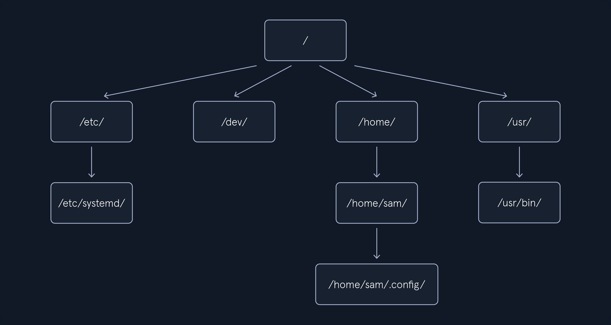
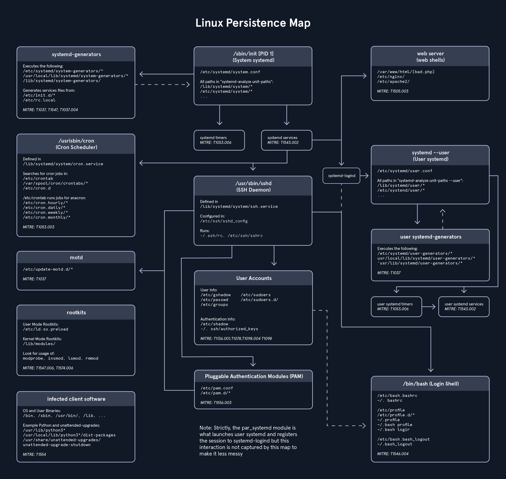

# Introduction to Linux Forensics

## Intro

### Linux Forensics Artifacts

Linux forensics artifacts refer to digital traces, logs, files, and system data left behind on a Linux OS that can be analyzed during investigations to reconstruct events, user activities, or security incidents. These artifacts help you to understand system usage, potential breaches, or malicious actions without providing step-by-step guides on eploitation. Common artifacts are found in logs, user directories, config files, and system processes.

Ubuntu, like most Linux distros, follows the Filesystem Hierarchy Standard, which defines a structured layout for directories and files to ensure consistency across Unix-like systems. This hierarchical tree starts at the root directory and organizes everything in a logical manner, with subdirectories serving specific purposes such as system binaries, user data, configurations, and logs. When conducting a forensic analysis of a Linux system, it's crucial to have a good understanding of the file and directory arrangement on the disk. This knowledge helps investigators efficiently locate important areas and evidence while disregarding less relevant sections.



#### /boot/ and /efi/

The `/boot/` and `/efi/` directories store essential files required for booting the system. This includes boot configuration files, kernel parameters, and more. Within these directories, you can also locate both the current and previous kernel versions, along with the initial ramfs, all of which can be subject to examination.

#### /etc/

The `/etc/` directory traditionally serves as the central repository for system-wide configuration files and related data. Most of these files are easily accessible in plaintext. Configuration files often come with associated directories denoted by a `.d` extension, allowing for the inclusion of additional configuration snippets. It's important to note that user-specific configuration files located in a user's `/home/` directory can take precedence over system-wide configurations in `/etc/`.

Here are some of the main forensics artifacts you might find in the `/etc/` directory:

|Purpose|Path|Description|
|---|---|---|
|User Accounts and Passwords|`/etc/passwd`|Contains user account information|
|User Accounts and Passwords|`/etc/shadow`|Stores password hashes (if shadow password system is used).|
|Group Information|`/etc/group`|Contains information about user groups.|
|System Configuration|`/etc/hostname`|Hostname of the system.|
|System Configuration|`/etc/hosts`|Local DNS resolution.|
|System Configuration|`/etc/issue`|Text displayed before login.|
|System Configuration|`/etc/issue.net`|Text displayed before remote login.|
|System Configuration|`/etc/os-release`|Information about the operating system.|
|Network Configuration|`/etc/network/`, `/etc/netplan/`, or `/etc/NetworkManager/`|Contains network configuration files|
|Network Configuration|`/etc/iptables/`, `/etc/iptables.rules`|Stores firewall rules (if used).|
|Service and Software Configuration|`/etc/services`|Lists network services and their associated ports.|
|Service and Software Configuration|`/etc/cron.d/`, `/etc/cron.daily/`|Configuration for scheduled tasks (cron jobs).|
|Service and Software Configuration|`/etc/sudoers`|Configuration for sudo access.|
|System Logs|`/etc/rsyslog.conf` or `/etc/syslog-ng/syslog-ng.conf`|Configuration for system logging.|
|System Logs|`/etc/logrotate.conf`|Log rotation configuration.|
|Security Configuration|`/etc/security/`|Configuration files related to system security.|
|Security Configuration|`/etc/ssh/sshd_config`|SSH server configuration.|
|Security Configuration|`/etc/pam.d/`|Pluggable Authentication Modules configuration.|
|Package Management|`/etc/apt/`|Configuration for the APT package manager (Debian/Ubuntu).|
|Package Management|`/etc/yum.conf` and `/etc/yum.repos.d/`|Configuration for the YUM package manager (RHEL/CentOS).|
|Hostname Resolution|`/etc/resolv.conf`|DNS resolver configuration.|
|Web Server Configuration|`/etc/apache2/`, `/etc/nginx/`|Standard web server configuration directories.|
|Database Configuration|`/etc/mysql/`|Configuration files for MySQL or MariaDB.|
|Database Configuration|`/etc/postgresql/`|Configuration for PostgreSQL.|
|Shell Configuration|`~/.bashrc`, `~/.bash_profile`, `~/.zshrc`, `/etc`|User-specific shell configuration files can be found in the user's home directory while global shell configurations in `/etc`.|
|User-Specific Configuration|`/etc/skel/`|Contains default files and directories for new user accounts.|

#### /tmp/

The `/tmp/` directory is designated for temporary storage of files. In certain Linux distros, the contents might be stored in the system's RAM using the tmpfs virtual memory file system. In forensic images, systems employing tmpfs to mount `/tmp/` will probably appear empty.

#### /run/

The `/run` directory is a tmpfs-mounted directory residing in RAM and will likely be empty on a forensic image. On a running system, this directory contains runtime information like PID and lock files, systemd runtime configuration, and more. There may be references to files and directories in `/run/` found in logs or configuration files.

#### /home/ and /root/

The `/home/` directory is the default location for user home directories. A user's home directory contains files the user created or downloaded, including configuration, cache, data, documents, media, desktop contents, and other files the user owns. The root user's home directory is typically `/root/` of the root filesystem. These home directories are of significant interest to forensic investigators because they provide information about a system's human users. The creation (_birth_) timestampt of a user's home directory my indicate when the user account was first added.

Here are the main artifacts you can find in the `/home/` directory:

|Purpose|Path|Description|
|---|---|---|
|User Documents and Files|`/home/<username>`|The user's personal files, including documents, images, videos, and other data, are typically stored in subdirectories.|
|Browsing Artifacts|`~/.mozilla/` and `~/.config/google-chrome/`|Directories of Firefox and Chrome web browsers user profiles. These directories may contain browsing history, bookmarks, and cache files.|
|Browsing Cache Files|`~/.cache`|Temporary local copies of web resources like images, scripts, and stylesheets that browsers store to speed up page loading on future visits.|
|Hidden Directories|`~/.<directory-name>` like `~/.config`, `~/.ssh`|Many configuration files and directories start with a dot and these often contain settings and preferences for various applications.|
|Desktop Environment Settings|`~/.config/`|User-specific settings for desktop environments (e.g., GNOME, KDE) can be found in this directory.|
|Shell History|`~/.bash_history`|The command history for a user's shell (e.g., Bash) is stored in this file or a similar location.|
|Email clients|`~/.thunderbird/`|Thunderbird email client data storage location.|
|Messaging application|`~/.config`|Messaging data may be stored in this directory or application-specific directories.|
|Desktop Environment Logs|`~/.local/share` or `~/.config`|Logs and usage data for the user's desktop environment can be found in these directories.|
|Access and Modification Timestamps|`/home/`|Timestamps associated with files and directories in the home directory can indicate when files were created, modified, or accessed. These timestamps are inherent to the file system.|
|Recently Used Files|`~/.local/share/recently-used.xbel`|Lists of recently accessed or similar files.|
|SSH and PGP Keys|`~/.ssh/`, `~/.gnupg/`|SSH and PGP keys can be found in these directories.|
|System Logs|`~/.local`|Some system logs and logs from installed applications may be stored in this directory or other hidden directories.|
|Downloaded Files|`/home/<username>/Downloads`|Users often download files to their directory.|
|Cloud Storage Sync|`~/.dropbox` or `~/.config/google-drive-ocamlfuse`|If a user uses cloud storage services like Dropbox or Google Drive, synchronization data and configuration settings can be found in these directories.|

#### /bin/, /sbin/, /usr/bin/, and /usr/sbin/

The standard locations for executable programs are `/bin/`, `/sbin/`, `/usr/bin/`, and `/usr/sbin/`. These directories were originally intended to separate groups of programs for users, administrators, the boot process, or for separately mounted filesystems. Today, `/bin/`and `/sbin/` are often symlinked to their corresponding directory in `/usr/`, and in some cases `/bin/`, `/sbin/`, and `/usr/sbin/` are symlinked to a single `/usr/bin` directory containing all programs.

#### /lib/ and /usr/lib/

The `/lib/` directory is generally symlinked to `/usr/lib/` on most Linux systems today. This includes shared library code, kernel modules, support for programming environments, and more. The `/lib` directory also contains the default configuration files for many software packages.

#### /usr/

The `/usr/` directory contains the bulk of the system's static read-only data. This includes binaries, libraries, documentation, and more. Most Linux System will symlink `/bin/`, `/sbin/`, and `/lib/` to their equivalents in the `/usr/` subdirectory. Files located in here that are not part of any installed package may be of forensic interest because they were added outside the normal software installation process. These might be manually installed files by a user with root access, or unauthorized files placed by a malicious actor.

#### /var/

The `/var/` directory contains changing system data and usually persistent across reboots. The subdirectories below `/var/` are especially interesting from a forensics perspective because they contain logs, cache, historical data, persistent temporary files, the mail and printing subsystems, and much more.

The main forensics artifacts of the `/var/` directory are:

|Purpose|Path|Description|
|---|---|---|
|System Logs|`/var/log/`|This directory contains system logs that record various system events and activities, including login attempts, service startups, and system errors. Common log files include `/var/log/auth.log`, `/var/log/syslog`, and `/var/log/messages`.|
|Package Management Logs|`/var/log/dpkg.log` or `/var/log/yum.log`|These logs track package installations, updates, and removals, which can provide information about software changes on the system.|
|Print Spooler Files|`/var/spool/cups/`|The Common Unix Printing System (CUPS) stores print job information in this directory, potentially revealing print job histories.|
|Mail Server Data|`/var/mail/` or `/var/spool/mail/`|Mailboxes and email-related artifacts are often stored here.|
|Database Files|`/var/lib/`|Databases like MySQL or PostgreSQL store their data files and logs.|
|Temporary Files|`/var/tmp/` and `/var/run/`|Temporary files and directories can contain artifacts such as unclean shutdown logs or remnants of executed processes.|
|Cron and Scheduled Tasks|`/var/spool/cron/crontabs/`|Information about scheduled tasks can be found in these files, which may include scripts and commands executed by cron jobs.|
|Web Server Logs|`/var/log/apache2/` or `/var/log/nginx/`|If a web server is installed, access and error logs can provide insights into web activity.|
|Printer Logs|`/var/log/cups/`|Printer-related logs.|
|DHCP and Network Logs|`/var/log/`|DHCP client and server logs.|
|Security and Authentication Data|`/var/log/secure` or `/var/log/auth.log`|These logs record authentication and security-related events, including login attempts and SSH connections.|
|Package Cache|`/var/cache/apt/archives/` or `/var/cache/yum/`|Package cache may contain downloaded package files, which could be of forensic interest.|
|System State Information|`/var/lib/misc/`|This directory may contain system state information, including files related to networking and hardware.|
|Session Information|`/var/run/utmp` and `/var/log/wtmp`|These files track user login and logout sessions.|
|Kernel Logs|`/var/log/kern.log` or `/var/log/dmesg`|Kernel-related logs.|
|Software Update Information|`/var/lib/update-notifier/package-data-downloads/`|This directory may contain data related to software updates.|

#### /dev/, /sys/, and /proc/

Linux has several other tmpfs and pseudo-filesystems that appear to contain files when the system is running, which include `/dev/`, `/sys/`, and `/proc/`. These directories provide representations of devices or kernel data structures but the contents don't actually exist on a normal filesystem. When examining a forensic image, these directories will likely be empty.

#### /media/

The `/media/` directory is inteded to hold dynamically created mount points for mounting external removable storage, such as CD-ROMs or USB drives. When examining a forensic image, this directory will likely be empty. References to `/media/` in logs, filesystem metadata, or other persistent data may provide information about user-attached external storage devices.

#### /opt/

The `/opt/` directory contains add-on packages, which typically are grouped by vendor name or package name. These packages may create a self-contained directory tree to organize their own files.

#### /lost+found/

A `/lost+found/` directory may exist on the root of every filesystem. If a filesystem repair is run and a file is found without a parent directory, that file is placed in the `/lost+found/` directory, where it can be recovered. Such files don't have their original names because the directory that contained the filename is unknown or missing.

> [!INFO]
> https://digitalforensics.ch/linux/
> https://github.com/orlikoski/CyLR
> https://github.com/ForensicArtifacts/artifacts/blob/main/artifacts/data/linux.yaml

### Linux Persistence

Linux persistence techniques refer to methods used by threats, such as malware or attackers, to maintain long-term access to a compromised Linux system. These mechanisms ensure that malicious code or access survives events like reboots, logouts, or system updates. In a forensics context, understanding these helps investigators identify artifacts, reconstruct incidents, and detect anomalies through logs, file modifications, and process behaviors. Techniques often align with the MITRE ATT&CK framework's Persistence tactic ([TA003](https://attack.mitre.org/tactics/TA0003/)), which defines ways adversaries retain footholds via access, actions, or configurations. Common categories include boot/logon scripts, scheduled tasks, service modifications, user account manipulations, and event-triggered executions.

Below is an outline of key techniques in a table format, drawing from established sources for high-level descriptions and detection approaches. Variations exist across distros, but many leverage standard components like systemd, cron, or shell configs.



It illustrates various mechanisms for maintaining access in Linux environments, particularly those using systemd as the init system. It begins at the central node representing the system init process and branches out into interconnected components covering system-wide and user-specific elements, such as generators, services, schedulers, daemons, accounts, authentication methods, and login shells, with additional nodes for specialized areas like web servers, rootkits, and infected software. This diagram is especially useful to hunt down such persistence mechanisms that are used in the wild.

#### User Manipulation

Users and groups configs are located here:

- `/etc/gshadow`
- `/etc/shadow`
- `/etc/passwd`
- `/etc/group`

```bash
linuxforensics@ubuntu:~$ cat /etc/passwd

root:x:0:0:root:/root:/bin/bash
daemon:x:1:1:daemon:/usr/sbin:/usr/sbin/nologin
bin:x:2:2:bin:/bin:/usr/sbin/nologin
sys:x:3:3:sys:/dev:/usr/sbin/nologin
sync:x:4:65534:sync:/bin:/bin/sync
games:x:5:60:games:/usr/games:/usr/sbin/nologin
man:x:6:12:man:/var/cache/man:/usr/sbin/nologin
lp:x:7:7:lp:/var/spool/lpd:/usr/sbin/nologin
mail:x:8:8:mail:/var/mail:/usr/sbin/nologin
news:x:9:9:news:/var/spool/news:/usr/sbin/nologin
uucp:x:10:10:uucp:/var/spool/uucp:/usr/sbin/nologin
proxy:x:13:13:proxy:/bin:/usr/sbin/nologin
www-data:x:33:33:www-data:/var/www:/usr/sbin/nologin
backup:x:34:34:backup:/var/backups:/usr/sbin/nologin
list:x:38:38:Mailing List Manager:/var/list:/usr/sbin/nologin
irc:x:39:39:ircd:/var/run/ircd:/usr/sbin/nologin
gnats:x:41:41:Gnats Bug-Reporting System (admin):/var/lib/gnats:/usr/sbin/nologin
nobody:x:65534:65534:nobody:/nonexistent:/usr/sbin/nologin
systemd-network:x:100:102:systemd Network Management,,,:/run/systemd:/usr/sbin/nologin
systemd-resolve:x:101:103:systemd Resolver,,,:/run/systemd:/usr/sbin/nologin
systemd-timesync:x:102:104:systemd Time Synchronization,,,:/run/systemd:/usr/sbin/nologin
messagebus:x:103:106::/var/run/dbus:/usr/sbin/nologin
syslog:x:104:110::/home/syslog:/usr/sbin/nologin
_apt:x:105:65534::/nonexistent:/usr/sbin/nologin
<SNIP>
```

Attackers might add new users, modify passwords, or elevate privileges by editing these files. For instance, a new entry in `/etc/passwd` could indicate a backdoor account. In forensics, compare timestamps and contents against baselines to spot anomalies.

#### Init Scripts

Init Scripts are configuration files that are used by Linux initialization systems to manage the startup, shutdown, and supervision of services and processes during the boot process. Those startup scripts are located in `/etc/init.d` and symbolic links in various runlevel directories like `/etc/rc3.d/` to start or stop services.

`Upstart` is used in some older Linux distros like Ubuntu 14.04 and its configuration files are located in `/etc/init/`.

#### Systemd

Systemd is the modern init system in most Linux distros. It manages services using unit files, usually located in `/lib/systemd/system/` or `/etc/systemd/system/`. You can use `systemctl` to enable and start services.

#### Cron Jobs

You can use cron jobs to schedule tasks at specific times or intervals. Entries in crontab files can be used to start scripts or commands.

For example, you can retrieve crontab data using `crontab -l`:

```bash
linuxforensics@ubuntu:~$ crontab -l

0 2 * * /bin/sh backup.sh
```

#### SSH Authorized Keys

The authorized_keys file, located at `~/.ssh/authorized_keys`, specifies the SSH keys that can be used to log in to the user account for which the file is configured.

#### Startup Applications

Many Linux dekstop environments, such as GNOME and KDE, allow users to configure startup applications through graphical settings. These are typically user-specific and can be configured through the desktop's settings.

#### /etc/rc.local

This is a traditional method for running custom scripts at boot time. The `/etc/rc.local` script is executed at the end of the system's initialization.

#### Shell Profile Files

You can add commands to shell profile files like `~/.bashrc`, `~/.bash_profile`, or `~/.profile`. These commands will be executed whenever a user logs in.

#### Autostart Directories

Some desktop environments use autostart directories to launch user-specific applications. For example, in GNOME, you can place .desktop files in `~/.config/autostart/`.

#### Service Management Tools

Tools like `chconfig` or `update-rc.d` can be used to manage services and their runlevel configurations.

#### User Session Startup Scripts

In some cases, you may want to execute scripts or programs at the start of a user session. You can achieve this by adding commands to the appropriate shell startup files, such as `~/.xprofile`, or by using the desktop environment's session manager.

## Forensics Arsenal