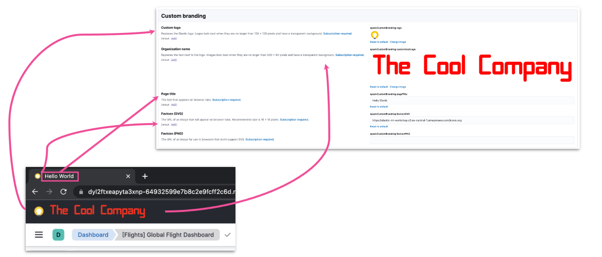
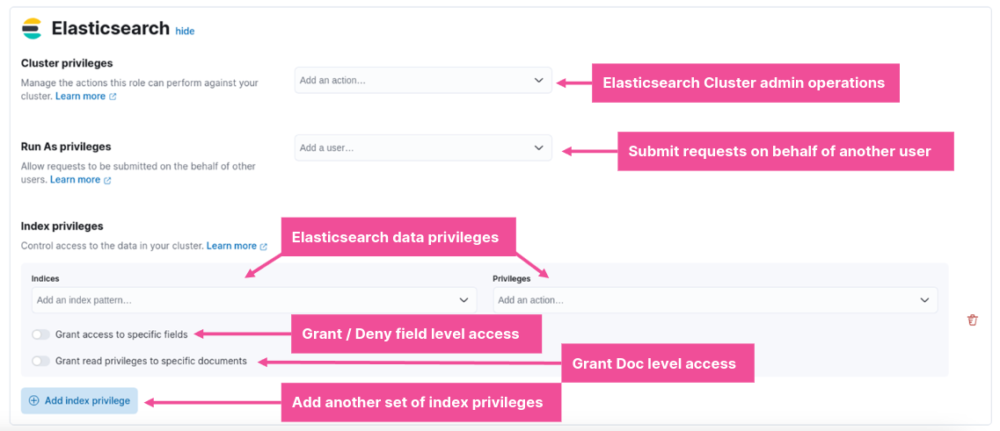
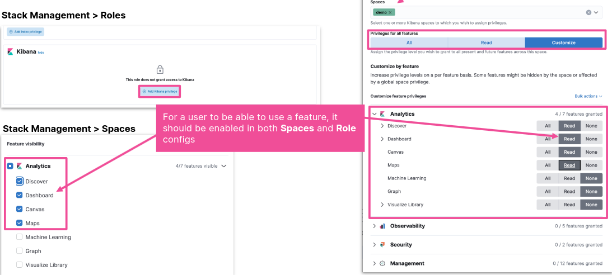
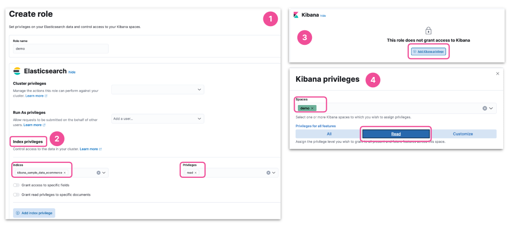
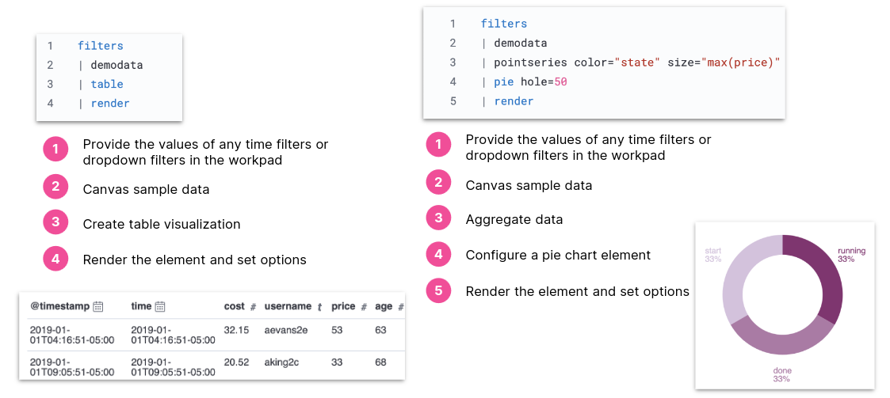

# Present Your Data

## Sharing a Dashboard

### Custom Branding



### Direct Links

- Authentication require
  - unless you setup anonymous auth
- Also works for
  - saved searches
  - visualizations
- For a link to latest dashboard state
  - select either Saved Objects
  - or Snapshot from a saved dashboard
- For a link to current dashboard state
  - select Snapshot from an unsaved dashboard

### Embed Code

- Embed dashboard as HTML code
  - internal company website / web page
- For user with no Kibana access
  - enable Kibana anonymous auth
  - ```xpack.security.sameSiteCookies: None```

### Kibana Reports

- A dashboard may also be shared as a report
  - PDF for printing
  - PNG for presentations

### Report Generation

- Once created, the report will be available in Stack Managemnet
- The POST URL can also be used to create scheduled reporting
- Reports can be Downloaded and Deleted

## Sharing With Users

### Kibana RBAC Overview

- Role-based access control
- Kibana features
  - analytics
  - management
  - solutions
- Granted through config
  - space + role

### ES Role Config



### Kibana Role Config



### Share a Dashboard through a Space

- Create a space
- Share Dashboard
  - copy to new space
- Create a role with read privileges
  - in the new space
  - for relevant indices
- Assign user to the new role

### Create Space

- Go to the Spaces Manager from
  - Spaces Menu -> Manage spaces
  - Main menu -> Stack management -> Spaces
- Enable / Disable features
  - Dashboard is under Analytics

### Copy Dashboard to Space

- Stack Management -> Saved Objects
  - Actions -> Copy to spaces
  - Select a space
  - Copy to space
- Related objects will also be copied
  - Data views
  - Saved searches
  - Visualizations

### Create Role with Privileges



### Assign a Role to a User

- Stack Management -> Users
  - Assign the Role to a User
- The new user will be able to access the new space with the shared dashboard

### Alternatively

- Provide limited access in existing space
  - Create a role with limited privileges
    - in existing space
    - for relevant indices
  - Assign user to the new role

### Anonymous Authentication

- Give users access to Kibana without requiring creds
  - making it easier to share specific dashboards for example
- Beware! All access to Kibana will be anonymous
  - make sure you restrict what the anonymous users can access

## Canvas

- Pull live data
- Present using rich infographics
  - colors, images, text
  - charts, graphs, progress monitor
- Focus the data you want to display

### Getting Started with Canvas

- To get started with Canvas:
  - click "Canvas" from the Kibana main menu
  - "Create workpad", optionally using a "Template"
  - click "Add element" in the top left
- Elements can be placed anywhere and resized to achieve the desired layout

### Static Elements

- Static content, like text and images, are simple to add
  - text uses Markdown

### Visualization Library

- Any visualization that is saved to the library may be added as a Kibana element

### Canvas Elements

- Canvas support many familiar elements
- And also some that are unique to Canvas

### Data Sources

- Every Canvas element has a data source
- Several types of data source are supported:
  - **ES SQL**: data in ES, accessed using the ES SQL syntax
  - **ES documents**: data in ES, using the Lucene syntax
  - **Demo data**: small sample dataset that is used when you first create a new template
  - **Timelion**: data in ES, using the Timelion syntax

### Canvas Expression

- Defines how to
  - retrieve data
  - manipulate
  - visualize in element
- Executes functions
  - produces outputs
  - passed on to next function

### Functions



### PDFs with Infographics

- Export a Workpad to PDF to generate a report with rich infographics