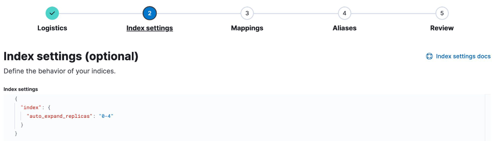
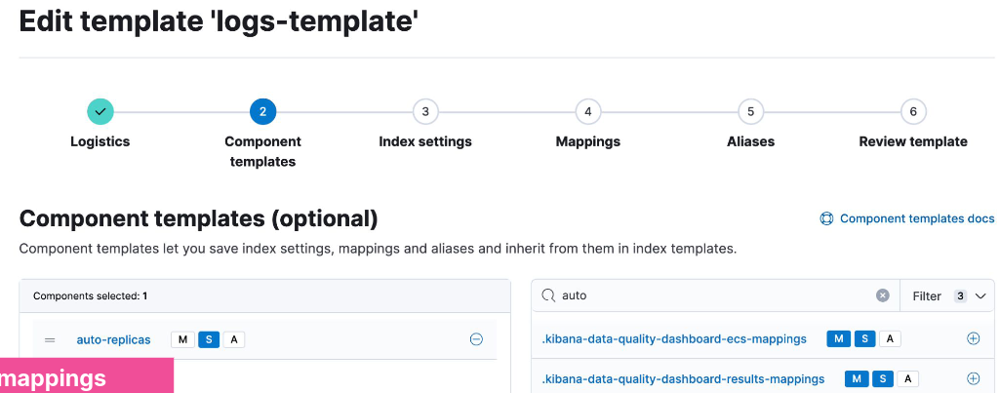
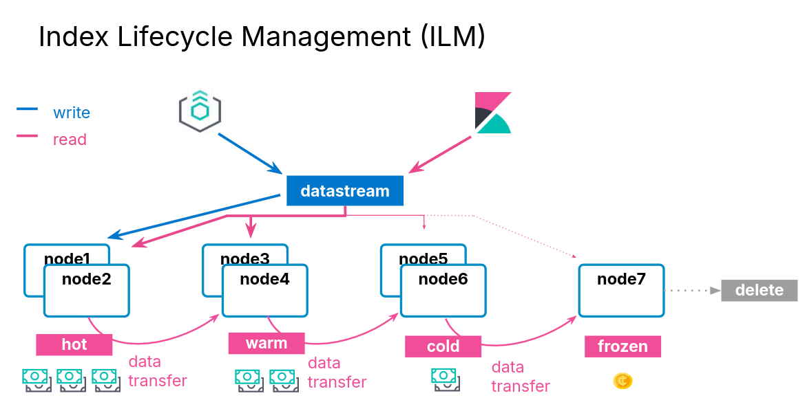

# Data Management

## Data Management Concepts

### Managing Data

- Data management needs differ depending on the type of data you are collecting:

| Static | Time Series Data |
| ------ | ---------------- |
| Data grows slowly | Data grows fast |
| Updates may happen | Updates never happen |
| Old data is read frequently | Old data is read infrequently |

### Index Aliases

#### Scaling Indices

- Indices scaly by adding more shards
  - increasing the number of shards of an index is expensive
- **Solution**: create a new index

#### Using Aliases

- Use index aliases to simplify your access to the growing number of indices

#### An Alias to Multiple Indices

- Use the ```_aliases``` endpoint to create an alias
  - specify the ```write index``` using ```is_write_index```
- Define an alias at index creation

```
POST _aliases
{
    "actions": [ {
        "add": {
            "index": "my_logs-*",
            "alias": "my_logs"
        } },
    {
        "add": {
            "index": "my_logs-2021-07",
            "alias": "my_logs",
            "is_write_index": true
} }] }
```

### Index Templates

#### What are Index Templates?

- If you need to create multiple indices with the same settings and mappings, use an index template
  - templates match an index pattern
  - if a new index matches the pattern, then the template is applied

#### Elements of an Index Template

- An index template can contain the following sections:
  - component templates
  - settings
  - mappings
  - aliases
- Component templates are reusable building blocks that can contain:
  - settings, mappings or aliases
  - components are reused across multiple templates

#### Defining an Index Template

- This logs-template:
  - overrides the default setting of 1 replica
  - for any new indices with a name that begins with logs:

```
PUT _index_template/logs-template
{
    "index_patterns": [ "logs*" ],
    "template": {
        "settings": {
            "number_of_replicas": 2
        }
    }
}
```

#### Applying an Index Template

- Create an index that matches the index pattern of one of your index templates:

```
{
    "logs1" : {
        "settings" : {
            "index" : {
                ...
                "number_of_replicas" : 2,
                ...
            }
        }
    }
}
```

#### Component Template Example

- A common setting across many indices may be to auto expand replica shards as more nodes become available
  - put this setting into a component template:



- Use the component in an index template:



#### Resolving Template Match Conflicts

- One and only one template will be applied to a newly created index
- If more than one template defines a matching index pattern, the priority setting is used to determine which template applies
  - the highest priority is applied, others are not used
  - set a priority over 200 to override auto-created index templates
  - use the ```_simulate``` tool to test how an index would match

```
POST /_index_template/_simulate_index/logs2
```

## Data Streams

### Time Series Data Management

- Time series data typically grows quickly and is almost never updated

### Data Streams

- A data stream lets you store time-series data across multiple indices, while giving you a single named resource for requests
  - indexing and search requests are sent to the data stream
  - the stream routes the request to the appropriate backing index

### Backing Indices

- Every data stream is made up of hidden backing indices
  - with a single write index
- A rollover creates a new backing index
  - which becomes the stream's new write index

### Choosing the right Data Stream

- Use the ```index.mode``` setting to control how your time series data will be ingested
  - Optimize the storage of your documents

| ```index.mode``` | Use case | ```_source``` | Storage saving |
| ---------------- | -------- | ------------- | -------------- |
| standard | for default settings | persisted | - |
| time_series | for storing metrics | synthetic | up to 70% |
| logsdb | for storing logs | synthetic | ~ 2.5 times |

### Data Stream Naming Convention

- Data streams are named by:
  - **type**: to describe the generic data type
  - **dataset**: to describe the specific subset of data
  - **namespace**: for user-specific details
- Each data stream should include ```constant_keyword``` fields for:
  - ```data_stream.type```
  - ```data_stream.dataset```
  - ```data_stream.namespace```
- ```constant_keyword``` has the same value for all documents

### Example Use of Data Streams

- Log data separated by app and env
- Each data stream can have separate lifecycles
- Different datasets can have different fields

```
GET logs-*-*/_search
{
    "query": {
        "bool": {
            "filter": {
                "term": {
                    "data_stream.namespace": "prod"
                }
            }
        }
    }
}
```

### Creating a Data Stream

- **Step 1**: create component templates
  - make sure you have a ```@timestamp``` field
- **Step 2**: create a data stream-enabled index template
- **Step 3**: create the data stream by indexing documents

#### Step 1

```
PUT _component_template/my-mappings
{
    "template": {
        "mappings": {
            "properties": {
                "@timestamp": {
                    "type": "date",
                    "format": "date_optional_time||epoch_millis"
                }
            }
        }
    }
}
```

#### Step 2

```
PUT _index_template/my-index-template
{
    "index_patterns": ["logs-myapp-default"],
    "data_stream": { },
    "composed_of": [ "my-mappings"],
    "priority": 500
}
```

#### Step 3

- Use ```POST <stream>/_doc``` or ```PUT <stream>/_create/<doc_id>```
  - if you use ```_bulk```, you must use the ```create``` action

Request:

```
POST logs-myapp-default/_doc
{
    "@timestamp": "2099-05-06T16:21:15.000Z",
    "message": "192.0.2.42 -[06/May/2099:16:21:15] \"GET /images/bg.jp..."
}
```

Response:

```
{
    "_index": ".ds-logs-myapp-default-2024.10.22-000001",
    "_id": "XZPRtZIBS7arFsx0_FAp",
    ...
}
```

### Rollover a Data Stream

- The rollover API creates a new index for a data stream
  - Every new document will be indexed into the new index
  - You cannot add new documents to other backing indices

Request:

```
POST logs-myapp-default/_rollover
```

Response:

```
{
    ...
    "old_index": ".ds-logs-myapp-default-2024.10.22-000001",
    "new_index": ".ds-logs-myapp-default-2024.10.22-000002",
    ...
}
```

### Changing a Data Stream

- Changes should be made to the index template associated with the stream
  - new backing indices will get the changes when they are created
  - older backing indices can have limited changes applied
- Changes to static mappings still require a reindex
- Before reindexing, use the resolve API to check for conflicting names:

```
GET /_resolve/index/logs-myapp-new*
```

### Reindexing a Data Stream

- Set up a new data stream template
  - use the data stream API to create an empty data stream:

```
PUT /_data_stream/logs-myapp-new
```

- Reindex with ```op_type``` of ```create```:
  - can also use single backing indices to preserve order

```
POST /_reindex
{
    "source": {
        "index": "logs-myapp-default"
    },
    "dest": {
        "index": "logs-myapp-new",
        "op_type": "create"
    }
}
```

## Index Lifecycle Management

### Data Tiers

#### What is a data tier?

- A data tier is a collection of nodes with the same data role
  - that typically share the same hardware profile
- There are five types of data tiers:
  - content
  - hot
  - warm
  - cold
  - frozen

#### Overview of the Five Data Tiers

- The content tier is useful for static datasets
- Implementing a hot -> warm -> cold -> frozen architecture can be achieved using the following data tiers:
  - **hot tier**: have the fastes storage for writing data and for frequent searching
  - **warm tier**: for read-only data that is searched less often
  - **cold tier**: for data that is searched sparingly
  - **frozen tier**: for data that is accesses rarely and never updated

#### Data Tiers, Nodes, and Indices

- Every node is all data tiers by default
  - change using the ```node.roles``` parameter
  - node roles are handled for you automatically on Elastic Cloud
- Move indices to colder tiers as the data gets older
  - define an index lifecycle management policy to manage this

#### Configuring an Index to Prefer a Data Tier

- Set the data tier preference of an index using the ```routing.allocation.include._tier_preference``` property
  - ```data_content``` is the default for all indices
  - ```data_hot``` is the default for all data streams
  - you can update the property at any time
  - ILM can manage this setting for you

```
PUT logs-2021-03
{
    "settings": {
        "index.routing.allocation.include._tier_preference" : "data_hot"
    }
}
```

### Index Lifecycle Management



#### ILM Actions

- ILM consists of policies that trigger actions, such as:

| Action | Description |
| ------ | ----------- |
| rollover | create a new index based on age, size, or doc count |
| shrink | reduce the number of primary shards |
| force merge | optimize storage space |
| searchable snapshot | saves memory on rarely used indices |
| delete | permanently remove an index |

#### ILM Policy Example

- During the hot phase you might:
  - create a new index every two weeks
- In the warm phase you might:
  - make the index read-only and move to warm for one week
- In the cold phase you might:
  - convert to a fully-mounted index, decrease the number of replicas, and move to cold for three weeks
- In the delete phase:
  - the only action allowed is to delete the 28-days-old index

#### Define the Hot Phase

- You want indices in the hot phase for two weeks:

```
PUT _ilm/policy/my-hwcd-policy
{
    "policy": {
        "phases": {
            "hot": {
                "actions": {
                    "rollover": {
                        "max_age": "14d"
                    }
                }
            },
```

#### Define the Warm Phase

- You want the old index to move to the warm tier immediately and set the index as read-only:
  - data age is calculated from the time of rollover

```
            "warm": {
                "min_age": "0d",
                "actions": {
                    "readonly": {}
                }
            },
```

#### Define the Cold Phase

- After one week of warm, move the index to the cold phase, and convert the index:

```
            "cold": {
                "min_age": "7d",
                "actions": {
                    "searchable_snapshot" : {
                        "snapshot_repository" : "my_snapshot"
                    }       
                }
            } },
```

#### Define the Delete Phase

- Delete the data four weeks after rollover:
  - which means the documents lived for 14 days in hot
  - then 7 days in warm
  - then 21 days in cold

```
            "delete": {
                "min_age": "28d",
                "actions": {
                    "delete": {}
                }
            }
```

#### Applying the Policy

- Create a component template
- Link you ILM policy using the setting:
  - ```index.lifecycle.name```

```
PUT _component_template/my-ilm-settings
{
    "template": {
        "settings": {
            "index.lifecycle.name": "my-hwcd-policy"
        }
    }
}
```

#### Create an Index Template

- Use other components relevant to your stream

```
PUT _index_template/my-ilm-index-template
{
    "index_patterns": ["my-data-stream"],
    "data_stream": { },
    "composed_of": [ "my-mappings", "my-ilm-settings"],
    "priority": 500
}
```

#### Start Indexing Documents

- ILM takes over from here
- When a rollover happens, the number of indices is incremented
  - the new index is set as the write index of the data stream
  - old indices will automatically move to other tiers

#### Troubleshooting Lifecycle Rollovers

- If an index is not healthy, it will not move to the next phase
- The default poll interval for a cluster is 10 minutes
  - can change with ```indices.lifecycle.poll_interval```
- Check the server log for errors
- Make sure you have the appropriate data tiers for migration
- **Reminder**: use a template to apply a policy to new indices
- Get detailed information about ILM status with:

```
GET <data-stream>/_ilm/explain
```

#### Agent and ILM

- Agent uses ILM policies to manage rollover
- By default, Agent policies:
  - remain in the host phase forever
  - never delete
  - indices are rolled over after 30 days or 50GB
- The default Agent policies can be edited with Kibana

## Searchable Snapshots

### Cost Effective Storage

- As your data streams and time series data grow, your storage and memory needs increase
  - at the same time, the utility of that older data decreases
- You could delete this older data
  - but if it remains valuable, it is preferable to keep it available
- There is an action available called searchable snapshot

### Snapshots

#### Disaster Recovery

- You already know about replica shards:
  - they provide redundant copies of your documents
  - that is not the same as a backup
- Replicas do not protect you against catastrophic failure
  - you will need to keep a complete backup of your data

#### Snapshot and Restore

- Snapshot and restore allows you to create and manage backups taken from a running ES cluster
  - takes the current state and data in your cluster and saves it to a repository
- Repos can be on a local shared filed system or in the cloud
  - the ES Service performs snapshots automatically

#### Types of Repos

- The backup process starts with the creation of a repository
  - different types are supported

|   |   |
| - | - |
| Shared file system | define ```path.repo``` in every node |
| Read-only URL | used when multiple clusters share a repo |
| AWS S3 | for AWS S3 repos |
| Azure | for Microsoft Azure Blob storage |
| GCS | for Google Cloud Storage |
| repository-hdfs plugin | store snapshots in Hadoop |
| Source-only repo | take minimal snapshots |

#### Setting Up a Repo

- Cloud deployments come with free repos preconfigured
- Use Kibana to register a repo

#### Taking a Snapshot Manually

- Once the repo is configured, you can take a snapshot
  - using the ```_snapshot``` endpoint or the UI
  - snapshots are a "point-in-time" copy of the data and incremental
- Can back up only certain indices
- Can include cluster state

```
PUT _snapshot/my_repo/my_logs_snapshot_1
{
    "indices": "logs-*",
    "ignore_unavailable": true
}
```

#### Automating Snapshots

- The ```_snapshot``` endpoint can be called manually
  - every time you want to take a snapshot
  - at regular invervals using an external tool
- Or, you can automate snapshots with Snapshot Lifecycle Management (_SLM_) policies
  - policies can be created in Kibana
  - or using the ```_slm``` API

#### Restoring from a Snapshot

- Use the ```_restore``` endpoint on the snapshot ID to restore all indices from that snapshot:

```
POST _snapshot/my_repo/my_logs_snapshot_1/_restore
```

- Can also restore using Kibana

### Searchable Snapshots

- There is an action called searchable snapshots
- Benefits include:
  - search old data in a very cost-effective fashion
  - reduce storage costs
  - use the same mechanism you are aleady using

#### How Searchable Snapshots Work

- Searching a searchable snapshot index is the same as searching any other index
  - when a snapshot of an index is searched, the index must get mounted locally in a temporary index
  - the shards of the index are allocated to data nodes in the cluster

#### Setting up Searchable Snapshots

- In the cold or frozen phase, you configure a searchable snapshot by selecting a registered repository

#### Add Searchable Snapshots to ILM

- Edit your ILM policy to add a searchable snapshot to your cold or frozen phase
  - ILM will automatically handle the index mounting
  - the hot and cold phase uses fully mounted indices
  - the frozen phase uses partially mounted indices
- If the delete phase is active, it will delete the searchable snapshot by default:
  - turn off with ```"delete_searchable_snapshot": false```
- If your policy applies to a data stream, the searchable snapshot will be included in searches by default