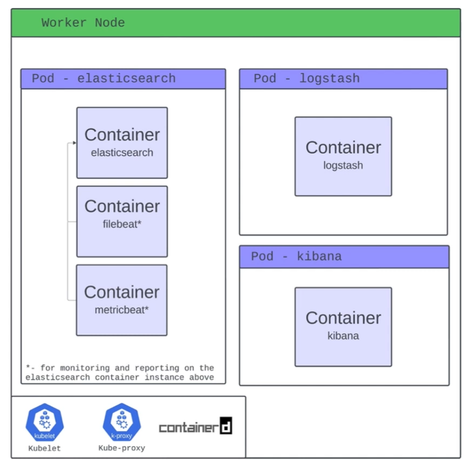
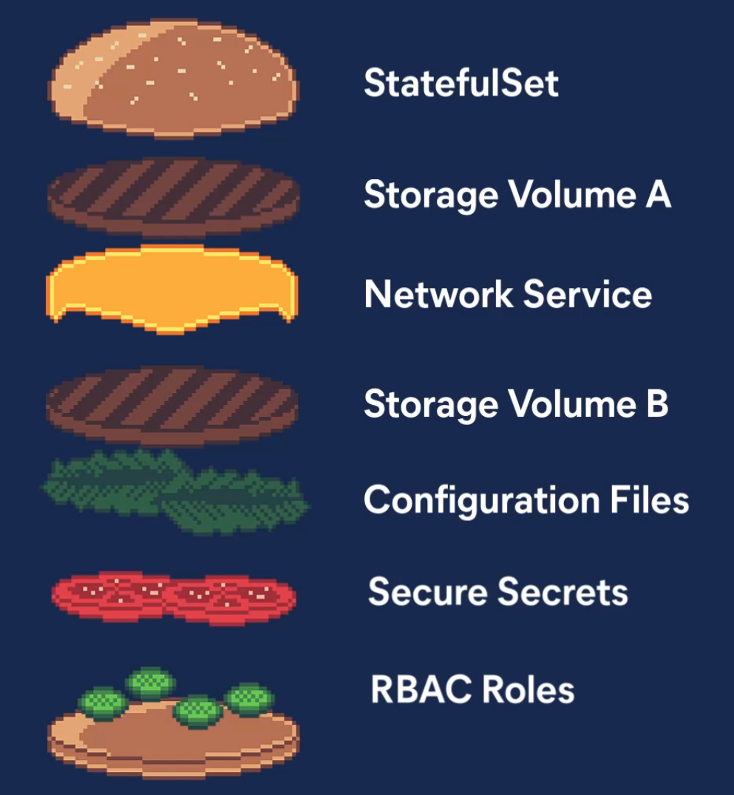

# Kubernetes Basics

## Introduction and Core Concepts

### Three Big Ideas

1. Kubernetes relies on Controllers
2. Kubernetes is a container orchestration engine
3. What actually makes Kubernetes difficult to approach

Basic Control Loop Workflow:

1. Declare your desired state
2. Kubernetes checks to see if current state is desired
3. If not in desired state, controller(s) make or request changes to correct this

## Kubernetes Cluster Infrastructure

### Control Plane

- Runs infrastructure controlling components
- K8s API Server
  - front-end for control plane
  - central point of communication for all cluster objects
- Controller Manager & Cloud Controller Manager
  - manage all controllers
- Scheduler
  - assigns workloads to the underlying nodes
- ETCD
  - stores all of K8s backing cluster data (_state of objects_, _name of objects_, ...)

### Worker Nodes

- Kubelet
  - something like a K8s agent that runs on each node
  - uses container runtime interface
- Kube-proxy
  - helps maintaining the networking rules on the underlying nodes
- Any container runtime

## Kubernetes Objects

### Kubernetes Object YAMLs

- apiVersion
- kind
- metadata
  - name
  - namespace
  - labels
  - annotations
- spec

### The Pod



- Pods are the smallest deployable unit of computing that you can create and manage in Kubernetes
- Pod is a Kubernetes construct
- A pod can run multiple containers

### Storage

- Volumes
  - Ephemeral vs Persistent
- Persistent Volumes
  - PersistentVolumeClaims
- Container Storage Interface

### Networking

- Kubernetes Networking Services
  - ClusterIP
  - NodePort
  - LoadBalancer
  - ExternalName
- Ingress (_Contollers_)

### Workloads

- DaemonSet
  - ensures a copy of a pod runs on every (_or selected_) node in the cluster
- StatefulSet
  - manages stateful pods with stable identities and persistent storage
- Deployment
  - manages stateless replicas of pods with easy scaling and updates

### Namespaces

- A virtual cluster within a single physical cluster that isolates resources like pods, services, and deployments, allowing multiple teams or projects to share the same cluster without interfering with each other
- help with:
  - resource isolation
  - access control
  - organizing resources

## Extending Kubernetes

- Custom Resource Definitions
- Operator Framework

### Hamburger



### Elastic's Operator

- ```kubectl get elasticsearch```
- YOUR controllers, built on top of THEIR controllers, making the entire stack happen

### ECK

- ECK (_Elastic Cloud on Kubernetes_) is an operator that lets Kubernetes manage Elasticsearch, Kibana, and other Elastic Stack components
- It extends Kubernetes with custom resources so these services can be deployed, scaled, and upgraded like native workloads
- This makes running and managing Elastic Stack on Kubernetes simple and declarative

---

## Further Reads

- [Elastic Cloud on Kubernetes](https://www.elastic.co/docs/deploy-manage/deploy/cloud-on-k8s)
- [Kubernetes Docs](https://kubernetes.io/docs/home/)
- [Kubernetes The Hard Way](https://github.com/kelseyhightower/kubernetes-the-hard-way)