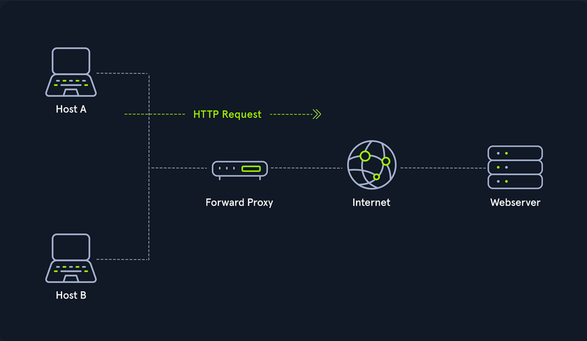
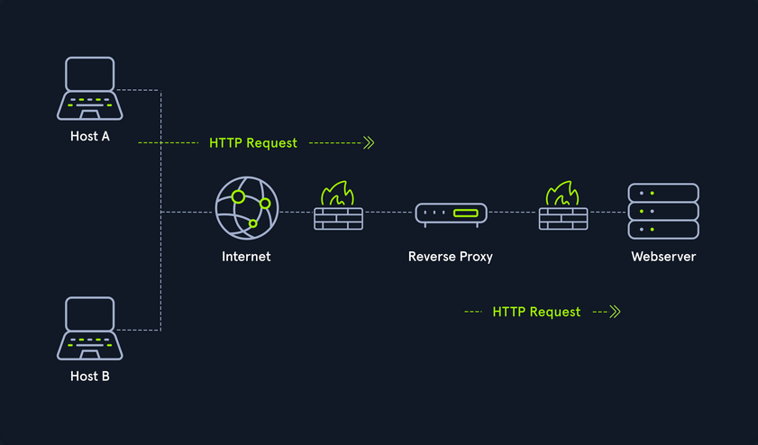
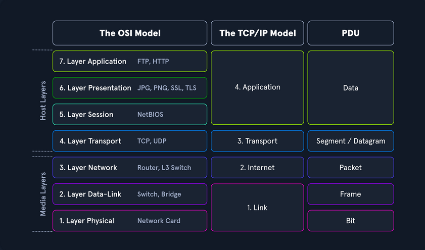

# Introduction to Networking

## Structure

### Network Types

#### Wide Area Network (_WAN_)

... is commonly referred to as the internet. When dealing with networking equipment, you'll often have a WAN address and LAN address. The WAN one is the address that is generally accessed by the internet. It is not exclusive to the internet; a WAN is just a large number of LANs joined together. Many large companies or government agencies will have an "Internal WAN". Generally speaking, the primaty way you identify if the network is a WAN is to use a WAN specific routing protocol such as BGP and if the IP schema in use is not within RFC 1918.

#### Local Area Netwotks (_LAN_) / Wireless Local Area Network (_WLAN_)

LANs and WLANs will typically assign IP addresses designated for local use. In some cases you may be assigned a routable IP address from joining their LAN, but that is much less common. There's nothing different bewteen a LAN or WLAN, other than WLAN's introduce the ability to transmit data without cables.

#### Virtual Private Network (_VPN_)

... has the goal of making the user feel as if they were plugged into a different network.

##### Site-to-Site VPN

Both the client and server are Network Devices, typically either Routers or Firewalls, and share entire network ranges. This is the most commonly used to join company networks together over the internet, allowing multiple locations to communicate over the internet as if they were local.

##### Remote Access VPN

This involves the client's computer creating a virtual interface that behaves as if it is on a client's network. When analyizing these VPNs, an important piece to consider is the routing table that is created when joining the VPN. If the VPN only creates routes for specific networks, this is called a split-tunnel VPN, meaning the internet connection is not going out of the VPN.

##### SSL VPN

This is essentially a VPN that is done within your web browser and is becoming increasingly common as web browsers are becoming capable of doing anything. Typically these will stream applications or entire desktop sessions to your web browser.

### Book Terms

#### Global Area Network (_GAN_)

A worldwide network such as the internet is known as a GAN. However, the internet is not the only computer network of this kind. Internationally active companies also maintain isolated networks that span several WANs and connect company computers worldwide. GANs use the glass fibers infrastructure of wide-are networks and interconnect them by international undersea cables or satellite transmission.

#### Metropolitan Area Network (_MAN_)

... is a broadband telecommunications network that connects several LANs in geographical proximity. As a rule, these are individual branches of a company connected to a MAN via leased lines. High-performance routers and high-performance connections based on glass fibers are used, which enable a significantly higher data throughput than the internet. The transmission speed between two remote nodes is comparable to communication within a LAN.

Internationally operating network operators provide the infrastructure for MANs. Cities wired as MANs can be integrated supra-regionally in WANs and internationally in GANs.

#### Personal Area Network (_PAN_) / Wireless Personal Area Network (_WPAN_)

Modern end devices such as smartphones, tablets, laptops, or desktop computers can be connected ad hoc to form a network to enable data exchange. This can be done by cable in the form of a PAN.

The wireless variant WPAN is based on bluetooth or wireless USB technologies. A WPAN that is established via bluetooth is called Piconet. PANs and WPANs usually extend only a few meters and are therefore not suitable for connecting devices in separate rooms or even buildings.

In the context of the Internet of Things, WPANs are used to communicate control and monitor with low data rates. Protocols such as Insteon, Z-Wave, and ZigBee were explicitly designed for smart home automation.

### Topologies

A network topology is a typical arrangement and physical or logical connection of devices in a network. Computers are hosts, such as clients and servers, that actively use the network. They also include network components such as switches, bridges, routers, which have a distribution function and ensure that all network hosts can establish a logical connection with each other. The network topology determines the components to be used and the access methods to the transmission media.

#### Connections

| Wired | Wireless |
| ----- | -------- |
| Coaxial cabling | Wi-Fi |
| Glass fiber cabling | Cellular |
| Twisted-pair cabling | Satellite |
| and others | and others |

#### Nodes - Network Interface Controller (_NICs_)

Network nodes are the transmission medium's connection points to transmitters and receivers of electrical, optical, or radio signals in the medium. A node may be connected to a computer, but certain types may have only one microcontroller on a node or may have no programmable device at all.

- repeaters
- hubs
- bridges
- switches
- router/modem
- gateways
- firewalls

#### Classifications

You can imagine a topology as a virtual structure of a network. This form does not necessarily correspond to the actual physical arrangement of the devices in the network. Therefore these topologies can be either physical or logical.

- point-to-point
- bus
- star
- ring
- mesh
- tree
- hybrid
- daisy chain

### Proxies

#### Dedicated Proxy / Forward Proxy

... is what most people imagine a proxy to be. A forward proxy is when a client makes a request to a computer, and that computer carries out the request.



#### Reverse Proxy

Instead of being designed to filter outgoing requests, it filters incoming ones. The most common goal with a reverse proxy, is to listen on an address and forward it to a closed-off network.



#### (Non-) Transparent Proxy

With a transparent proxy, the client doesn't know about its existence. The transparent proxy intercepts the client's communication requests to the internet and acts as a substitute instance. To the outside, the transparent proxy, like the non-transparent proxy, acts as a communication partner.

If it is a non-transparent proxy, you must be informed about its existence. For this purpose, you and the software you want to use are given a special proxy configuration that ensures that traffic to the internet is first addressed to the proxy. If this configuration does not exist, you cannot communicate via the proxy. However, since the proxy usually provides the only communication path to other networks, communication to the internet is generally cut off without a corresponding proxy configuration.

## Workflow

### Networking Models

Two networking models describe the communication and transfer of data from one host to another, called [ISO/OSI](https://www.geeksforgeeks.org/open-systems-interconnection-model-osi/) model and the [TCP/IP](https://www.geeksforgeeks.org/computer-networks/tcp-ip-model/) model. This is a simplified representation of the so-called layers representing transferred Bits in readable contents.



## Addressing

### Network Layer

The network layer of OSI controls the exchange of data packets, as these cannot be directly routed to the receiver and therefore have to be provided with routing nodes. The data packets are then transferred from node to node until they reach their target. To implement this, the network layer identifies the individual network nodes, sets up and clears connection channels, and takes care of routing and data flow control. When sending the packets, addresses are evaluated, and the data is routed through the network from node to node. There is usually no processing of the data in the layers above the Layer 3 in the nodes. Based on the addresses, the routing and the construction of routing tables are done.

In short, it is responsible for:

- Logical Addressing
- Routing

Protocols are defined in each layer of OSI, and these protocols represent a collection of rules for communication in the respective layer. They are transparent to the protocols of the layers above or below. Some protocols fulfill tasks of several layers and extend over two or more layers. The most used protocols on this layer are:

- IPv4 / IPv6
- IPsec
- ICMP
- IGMP
- RIP
- OSPF

It ensures the routing of packets from source to destination within or outside a subnet. These two subnets may have different addressing schemes or incompatible addressing types. In both cases, the data transmission in each case goes through the entire communication network and includes routing between the network nodes. Since direct communication between the sender and the receiver is not always possible due to the different subnets, packets must be forwarded from nodes that are on the way. Forwarded packets do not reach the higher layers but are assigned a new intermediate destination and sent to the next node.

### IPv4 Addresses

Each host in the network located can be identified by the so-called Media Access Control address (_MAC_). This would allow data exchange within this one network. If the remote host is located in another network, knowledge of the MAC address is not enough to establish a connection. Addressing on the internet is done via the IPv4 and/or IPv6 address, which is made up of the network address and the host address.

It does not matter whether it is a smaller network, such as a home computer network, or the entire internet. The IP address ensures the delivery of data to the correct receiver. You can imagine the representation of MAC and IPv4/IPv6 addresses as follows:

- IPv4 / IPv6
  - describes the unique postal address and district of the receiver's building
- MAC
  - describes the exact floor and apartment of the receiver

#### Structure

An IPv4 address consists of a 32-bit binary number combined into 4 bytes consisting of 8-bit groups (_octets_) ranging from 0-255. These are converted into more easily readable decimal numbers, separated by dots and represented as dotted-decimal notation.

| Notation | Presentation |
| -------- | ------------ |
| Binary | 0111 1111.0000 0000.0000 0000.0000 0001 |
| Decimal | 127.0.0.1 |

Each network interface is assigned a unique IP address.

The IPv4 format allows for 4,294,967,296 unique addresses. The IP address is divided into a host part and a network part. The router assigns the host part of the IP address at home or by an administrator. The respective network administrator assigns the network part. On the internet, this is IANA, which allocates and manages the unique IPs.

The IP network blocks were divided into [classes A - E](https://www.geeksforgeeks.org/computer-networks/introduction-of-classful-ip-addressing/). The different classes differed in the host and network shares' respective lengths.

#### Subnet Mask

A further separation of these classes into small networks is done with the help of subnetting. This separation is done using the netmasks, which is as long as an IPv4 address. As with classes, it describes which bit positions within the IP address act as network part or host part.

#### Network and Gateway Addresses

Two additional IPs are reserved for the so-called network address (_usually the first_) and the broadcast address (_usually the last_). An important role plays the default gateway, which is the name for the IPv4 address of the router that couples networks and systems with different protocols and manages addresses and transmission methods. It is common for the default gateway to be assigned the first or last assignable IPv4 address in a subnet. This is not a technical requirement, but has become a de-facto standard in network environments of all sizes.

#### Broadcast Address

The broadcast IP address's tasks is to connect all devices in a network with each other. Broadcast in a network is a message that is transmitted to all participants of a network and does not require any response. In this way, a host sends a data packet to all other participants on the network simultaneously and, in doing so, communicates its IP address, which the receivers can use to contact it.

#### Classless Inter-Domain Routing - (_CIDR_)

... is a method of representation and replaces the fixed assignment between IPv4 address and network classes. The division is based on the subnet mask or the so-called CIDR suffix, which allows the bitwise division of the IPv4 address space and thus into subnets of any size. The CIDR suffix indicates how many bits from the beginning of the IPv4 address belong to the network. It is a notation that represents the subnet mask by specifying the number of 1-bits in the subnet mask.

- IPv4 Address
  - 192.168.10.39
- Subnet Mask
  - 255.255.255.0
- CIDR
  - 192.168.10.39/24

### Subnetting

The division of an address range of IPv4 addresses into several smaller address ranges is called subnetting.

A subnet is a logical segment of a network that uses IP addresses with the same network address. You can think of a subnet as a labeled entrance on a large building corridor. With the help of subnetting, you can create a specific subnet by yourself or find out the following outline of the respective network:

- Network Address
- Broadcast Address
- First Host
- Last Host
- Number of Hosts

Example:

| Network Address | First Host | Last Host | Broadcast Address | CIDR |
| --------------- | ---------- | --------- | ----------------- | ---- |
| 192.168.12.176 | 192.168.12.177 | 192.168.12.190 | 192.168.12.191 | 192.168.12.176/28 |

### MAC Address

Each host in a network has its own 48-bit (_6 octets_) Media Access Control (_MAC_) address, represented in hexadecimal format. MAC is the physical address for your network interfaces. There are several different standards for the MAC address:

- Ethernet
- Bluetooth
- WLAN

This is because the MAC address addresses the physical connection of a host. Each network card has its individual MAC address, which is configured once on the manufacturer's hardware side but can always be changed, at least temporarily.

When an IP packet is delivered, must be addressed on Layer 2 to the destination host's physical address or to the router / NAT, which is responsible for routing. Each packet has a sender address and a destination address.

The MAC address consists of a total of 6 bytes. The first half is the so called Organization Unique Identifier (_OUI_) defined by the Institute of Electrical and Electronics Engineers (_IEEE_) for the respective manufacturers.

The last half of the MAC address is called the Individual Address Part or Network Interface Controller (_NIC_), which the manufacturers assign. The manufacturer sets this bit sequence only once and thus ensures that the complete address is unique.

If a host with the IP target address is located in the same subnet, the delivery is made directly to the target computer's physical address. However, if this host belongs to a different subnet, the Ethernet frame is addressed to the MAC address of the responsible router. If the Ethernet frame's destination address matches its own layer 2 address, the router will forward the frame to the higher layers. Adress Resolution Protocol (_ARP_) is used in IPv4 to determine the MAC addresses associated with the IP addresses.

As with IPv4 addresses, there are also certain reserved areas for the MAC address. These include, for example, the local range for the MAC:

- 02:00:00:00:00:00
- 06:00:00:00:00:00
- 0A:00:00:00:00:00
- 0E:00:00:00:00:00

Furthermore, the last two bits in the first octet can play another essential role. The last bit can have two states, 0 and 1. The last bit identifies the MAC address as Unicast (_0_) or Multicast (_1_). With unicast, it means that the packet sent will reach only one specific host.

With multicast, the packet is sent only once to all hosts on the local network, which then decides whether or not to accept the packet based on their configuration. The multicast address is a unique address, just like the broadcast address, which has fixed octet values. Broadcast in a network represents a broadcasted call, where data packets are transmitted simultaneously from one point to all members of a network. It is mainly used if the address of the receiver of the packet is not yet known. An example is the ARP and DHCP protocols.

The second last bit in the first octet identifies whether it is a global OUI, defined by the IEEE, or a locally administrated MAC address (_0 = Global OUI; 1 = Locally Administrated_).


#### Adress Resolution Protocol (_ARP_)

... is a network protocol. It is an important part of the network communication used to resolve a network layer IP address to a link layer MAC address. It maps a host's IP address to its corresponding MAC address to facilitate communication between devices on a Local Area Network. When a device on a LAN wants to communicate with another device, it sends a broadcast message containing the destination IP address and its own MAC address. The device with the matching IP address responds with its own MAC address, and the devices can then communicate directly using their MAC addresses. This process is known as ARP resolution.

ARP is an important part of the network communication process because it allows devices to send and receive data using MAC addresses rather than IP addresses, which can be more efficient. Two types of request messages can be used:

- ARP Request
  - When a device wants to communicate with another device on a LAN, it sends an ARP request to resolve the destination device's IP address to its MAC address. The request is broadcast to all devices on the LAN and contains the IP address of the destination device. The device with the matching IP address responds with its MAC address.
- ARP Reply
  - When a device receives an ARP request, it sends an ARP reply to the requesting device with its MAC address. The reply message contains the IP and MAC addresses of both the requesting and the responding devices.


### IPv6 Addresses

IPv6 is the successor of IPv4. In contrast to IPv4, the IPv6 address is 128 bit long. The prefix identifies the host and network parts. The Internet Assigned Numbers Authority (_IANA_) is responsible for assigning IPv4 and IPv6 addresses. and their associated network portions. In the long term, IPv6 is expected to completely replace IPv4, which is still predominantly used on the internet. In principle, however, IPv4 and Ipv6 can be made available simultaneously.

IPv6 consistently follows the end-to-end principle and provides publicly accessible IP addresses for any end devices without the need for NAT. Consequently, an interface can have multiple IPv6 addresses, and there are special IPv6 addresses to which multiple interfaces are assigned.

There are three different types of IPv6 addresses:

- Unicast
  - addresses for a single interface
- Anycast
  - addresses for multiple interfaces, where only one of them receives the packet
- Multicast
  - addresses for multiple interfaces, where all receive the same packet

An IPv6 address consists of two parts:

- Network Prefix (_network part_)
- Interface Identifier / Suffix (_host part_)

The network prefix identifies the network, subnet, or address range. The interface identifier is formed from the 48-bit MAC address of the interface and is converted to a 65-bit address in the process. The default prefix length is /64. However, other typical prefixes are /32, /48, and /56. If you want to use your networks, you get a shorter prefix than /64 from your provider.

## Protocols and Terminology

### Common Protocols

#### TCP

... is a connection-oriented protocol that establishes a virtual connection between two devices before transmitting data by using a Three-Way-Handshake. This connection is maintained until the data transfer is complete, and the devices can continue to send data back and forth as long as the connection is active.

#### UDP

... is a connectionless protocol, which means it does not establish a virtual connection before transmitting data. Instead, it sends the data packets to the destination without checking to see if they were received.

#### ICMP

Internet Control Message Protocol is a protocol used by devices to communicate with each other on the internet for various purposes, including error reporting and status information. It sends requests and messages between devices, which can be used to report errors or provide status information.

##### ICMP Requests

A request is a message sent by one device to another to request information or perform a specific action. An example of a request is the ping request, which tests the connectivity between two devices. When one device sends a ping request to another, the second device responds with a ping reply message.

##### ICMP Messages

A message in ICMP can be either a request or a reply. In addition to ping requests and responses, ICMP supports other types of messages, such as error messages, destination unreachable, and time exceeded messages. These messages are used to communicate various types of information and errors between devices on the network.

There are two different versions:

- ICMPv4
- ICMPv6

Request types:

- Echo Request
- Timestamp Request
- Address Mask Request

Message types:

- Echo Reply
- Destination Unreachable
- Redirect
- Time Exceeded
- Parameter Problem
- Source Quench

Another crucial part of ICMP is the Time-to-Live field in the ICMP packet header that limits the packet's lifetime as it travels through the network. It prevents packets from circulating indefinitely on the network in the event of routing loops. Each time a packet passes through a router, the router decrements the TTL value by 1. When the TTL value reaches 0, the router discards the packet and sends an ICMP Time Exceeded message back to the sender.

You can also use the TTL to determine the number of hops a packet has taken and the approximate distance to the destination. For example, if a packet has a TTL of 10 and takes 5 hops to reach its destination, it can be inferred that the destination is approximately 5 hops away. For example, if you see a ping with the TTL value of 122, it could mean that you are dealing with a Windows system that is 6 hops away.

However, it is also possible to guess the OS based on the default TTL value used by the device. Each OS typically has a default TTL value when sending packets. This value is set in the packet's header and is decremented by 1 each time the packet passes through a router. Therefore, examining a device's default TTL value makes it possible to infer which OS the device is using.

Typical default TTL:

- **Windows**: 128
- **Linux**: 64
- **MacOS**: 64
- **Solaris**: 255

#### VOIP

Voice over Internet Protocol (_VoIP_) is a method of transmitting voice and multimedia communications. For example, it allows you to make phone calls using a broadband internet connection instead of a traditional phone line, like Skype, Whatsapp, Google Hangouts, Slack, Zoom, and others.

### Wireless Networks

... are computer networks that use wireless data connections between network nodes. These networks allow devices such as laptops, smartphones, and tablets to communicate with each other and the internet without needing physical connections such as cables.

Wireless networks use radio frequency tech to transmit data between devices. Each device on a wireless network has a wirless adapter that converts data into RF signals and sends them over the air. Other devices on the network receive these signals with their own wireless adapters, and the data is then converted back into a usable form. Those can operate over various ranges, depending on the technology used. For example, a LAN that covers a small area, such as a home or small office, might use wireless technology called WiFi, which has a range of a few hundred feet. On the other hand, a wireles WAN might use mobile telecommunication technology such as cellular data, which can cover a much larger area, such as entire city or region.

Communication between devices occurs over RF in the 2.4 GHz or 5 GHz bands in a WiFi network. When a device, like a laptop, wants to send data over the network, it first communicates with the Wireless Access Point (_WAP_) to request permission to transmit. The WAP is a central device, like a router, that connects the wireless network to a wired network and controls access to the network. Once the WAP grants permission, the transmitting device sends the data as RF signals, which are received by the wireless adapters of other devices on the network. The data is then converted back into a usable form and passed on to the appropriate application or system.

#### WiFi Connection

The device must also be configured with the correct network settings, such as the network name / Service Set Identifier (_SSID_) and password. So, to connect to the router, the laptop uses a wireless networking protocol called IEEE 802.11. This protocol defines the technical details of how wireless devices communictate with each other and with WAPs. When a device wants to join a WiFi network, it sends a request to the WAP to initiate the connection process. This request is known as a connection request frame or association request and is sent using the IEEE 802.11 wireless networking protocol. The connection request frame contains various fields of information, including the following but not limited:

- MAC address
- SSID
- Supported data rates
- Supported channels
- Supported security protocols

The device then uses this information to configure its wireless adapter and connect to the WAP. Once the connection is established, the device can communicate with the WAP and other network devices. It can also access the internet and other online resources through the WAP, which acts as a gateway to the wired network. However, the SSID can be hidden by disabling broadcasting. That means that devices that search for that specific WAP will not be able to identify its SSID. Nevertheless, the SSID can still be found in the authentication packet.

#### WEP Challenge-Response Handshake

The challenge-response handshake is a process to establish a secure connection between a WAP and a client device in a wireless network that uses the WEP security protocol. This involves exchanging packets between the WAP and the client device to authenticate the device and establish a secure connection.

| Step | Who | Description |
| ---- | --- | ----------- |
| 1 | Client | sends an association request packet to the WAP, requesting access |
| 2 | WAP | responds with an association response packet to the client, which includes a challenge string |
| 3 | Client | calculates a response to the challenge string and a shared secret key and sends it back to the WAP |
| 4 | WAP | calculates the expected response to the challenge with the same shared secret key and sends and authentication response packet to the client |

Nevertheless, some packets can get lost, so the so-called CRC checksum has been integrated. Cyclic Redundancy Check is an error-detection mechanism used in the WEP protocol to protect against data corruption in wireless communications. A CRC value is calculated for each packet transmitted over the wireless network based on the packet's data. It is used to verify the integrity of the data. When the destination device receives the packet, the CRC value is recalculated and compared to the original value. If the values match, the data has been transmitted successfully without any errors. However, if the values do not match, the data has been corrupted and needs to be retransmitted.

#### Security Features

Some of the leading security features include but are not limited to:

- Encryption
  - Wired Equivalent Privacy (_WEP_)
  - WiFi Protected Access (_WPA_)
- Access Control
- Firewall

### VPN

... is a technology that allows a secure and encrypted connection between a private network and a remote device. This allows the remote machine to access the private network directly, providing secure and confidential access to the network's resources and services. For example, an admin from another location has to manage the internal servers so that the employees can continue to use the internal services. Many companies limit servers' access, so clients can only reach those servers from the local network. This is where VPN comes intp play, where the admin connects to the VPN server via the internet, authenticates himself, and thus creates an encrypted tunnel so that others cannot read the data transfer. In addition, the admin's computer is also assigned a local IP address through which he can access and manage the internal servers. Admins commonly use VPNs to provide secure and cost-effective remote access to a company's network.

#### IPsec

Internet Protocol Security (_IPsec_) is a network security protocol that provides encryption and authentication for internet communications. It is a powerful and widely-used security protocol that provides encryption and authentication for internet communications and works by encrypting the data payload of each IP packet and adding an authentication header, which is used to verify the integrity and authenticity of the packet. IPsec uses a combination of two protocols to provide encryption and authentication:

1. Authentication Header
2. Encapsulating Security Payload

IPsec can be used in two modes:

1. Transport Mode
2. Tunnel Mode

#### PPTP

Point-to-Point Tunneling Protocol is a network protocol that enables the creation of VPNs by establishing a secure tunnel between the VPN client and server, encapsulating the data transmitted within this tunnel. Originally an extension of the Point-to-Point Protocol, PPTP is supported by many OS.

However, due to its known vulns, PPTP is no longer considered secure. It can tunnel protocols such as IP, IPX, or NetBEUI via IP, but has been largely replaced by more secure VPN protocols. Since 2012, the use of PPTP has declined because of its authentication method, MSCHAPv2, employs the outdated DES encryption, which can easily be cracked with specialized hardware.

## Connection Establishment

### Key Exchange Mechanisms

Key exchange methods are used to exchange cryptographic keys between two parties securely. There are many key exchange methods, each with unique characteristics and strengths. Some key exchange methods are more secure than others, and the appropriate method depends on the situation's specific circumstances and requirements.

These methods typically work by allowing the two parties to agree on a shared secret key over an insecure communication channel that encrypts the communication between them. This is generally done using some form of mathematical operation, such as a computation based on the properties of a mathematical function or a series of simple manipulations of the key.

Some algorithms are:

| Algorithm | Acronym | Security |
| --------- | ------- | -------- |
| Diffie-Hellmam | DH | relatively secure and computationally efficient |
| Rivest-Shamir-Adleman | RSA | widely used and considered secure, but computationally intensive |
| Elliptic Curve Diffie-Hellman | ECDH | provides enhanced security compared to traditional Diffie-Hellman |
| Elliptic Curve Digital Signature Algorithm | ECDSA | provides enhanced security and efficiency for digital signature generation |

### Authentication Protocols

Many different authentication protocols are used in networking to verify the identity of devices and users. Those protocols are essential because they provide a secure and standardized way of verifying the identity of users, devices, and other entities in a network. Without authentication protocols, it would be difficult to securely and reliably identify entities in a network, making it easy for attackers to gain unauthorized access and potentially compromise the network.

Authentication protocols also provide a means for securely exchanging information between entities in a network. This is important for ensuring the confidentiality and integrity of sensitive data and preventing unauthorized access and other security threats.

### TCP/UDP Connections

Transmission Control Protocol (_TCP_) and User Datagram Protocol (_UDP_) are both protocols used in information and data transmission on the internet. Typically, TCP connections transmit important data, such as web pages and emails. In contrast, UDP connections transmit real-time data such as streaming video or online gaming.

TCP is a connection-oriented protocol that ensures that all data sent from one computer to another is received. It is like a telephone conversation where both parties remain connected until the call is terminated. If an error occurs while sending data, the receiver sends a message back so the sender can resend the missing data. This makes TCP reliable and slower than UDP because more time is required for transmission and error recovery.

UDP, on the other hand, is a connectionless protocol. It is used when speed is more important than reliability, such as for video streaming or online gaming. With UDP, there is no verification that the received data is complete and error-free. If an error occurs while sending data, the receiver will not receive this missing data, and no message will be sent to resend it. Some data may be lost with UDP, but the overall transmission is faster.

#### IP Packet

An IP packet is the data area used by the network layer of the Open Systems Interconnection model to transmit data from one computer to another. It consists of a header and the payload, the actual payload data.

##### IP Header

... contains of several fields that have important information:

- Version
- Internet Header Length
- Class of Service
- Total Length
- Identification
- Flags
- Fragment Offset
- Time to Live
- Protocol
- Checksum
- Source/Destination
- Options
- Padding

You may see a computer with multiple IP addresses in different networks. Here you should pay attention to the IP ID field. It is used to identify fragments of an IP packet when fragmented into smaller parts. It is a 16-bit field with a unique number ranging from 0-65535.

If a computer has multiple IP addresses, the IP ID field will be different for each packet sent from the computer but very similar. In TCPdump, the networt traffic might look something like this:

```bash
IP 10.129.1.100.5060 > 10.129.1.1.5060: SIP, length: 1329, id 1337
IP 10.129.1.100.5060 > 10.129.1.1.5060: SIP, length: 1329, id 1338
IP 10.129.1.100.5060 > 10.129.1.1.5060: SIP, length: 1329, id 1339
IP 10.129.2.200.5060 > 10.129.1.1.5060: SIP, length: 1329, id 1340
IP 10.129.2.200.5060 > 10.129.1.1.5060: SIP, length: 1329, id 1341
IP 10.129.2.200.5060 > 10.129.1.1.5060: SIP, length: 1329, id 1342
```

You can see from the output that two different IP addresses are sending packets to IP address 10.129.1.1. However, from the IP ID, you can see that the packets are continuous. This strongly indicates that the two IP addresses belong to the same host in the network.

##### IP Record-Route Field

... also records the route to a destination device. When the destination device sends back the ICMP Echo Reply packet, the IP addresses of all devices that pass through the packet are listed in the Record-Route field of the IP header. This happens when you use the following command:

```bash
d41y@htb[/htb]$ ping -c 1 -R 10.129.143.158

PING 10.129.143.158 (10.129.143.158) 56(124) bytes of data.
64 bytes from 10.129.143.158: icmp_seq=1 ttl=63 time=11.7 ms
RR: 10.10.14.38
        10.129.0.1
        10.129.143.158
        10.129.143.158
        10.10.14.1
        10.10.14.38


--- 10.129.143.158 ping statistics ---
1 packets transmitted, 1 received, 0% packet loss, time 0ms
rtt min/avg/max/mdev = 11.688/11.688/11.688/0.000 ms
```

The output indicates that a ping request was sent and a response was received from the destination device and also shows the Record-Route field in the IP header of the ICMP Echo Request packet. The Record-Route field contains the IP addresses of all devices that passed through the ICMP Echo Request packet on the way to the destination device.

The ```traceroute``` command can also be used to trace the route to a destination more accurately, which uses the TCO timeout method to determine when the route has been fully traced.

##### IP Payload

... is the actual payload of the packet. It contains the data from various protocols, such as TCP or UDP, that are being transmitted, just like the contents of the letter in the envelope.

#### TCP

TCP packets, also known as segments, are divided into several sections called headers and payloads. The TCP segments are wrapped in the sent IP packet.

The header contains several fields that contain important information. The source port indicates the computer from which the packet was sent. The destination port indicates to which computer the packet is sent. The sequence number indicates the order in which the data was sent. The confirmation number is used to confirm that all data was received successfully. The control flags indicate whether the packet marks the end of a message, whether it is an acknowledgment that data has been received, or whether it contains a request to repeat data. The window size indicates how much data the receiver can receive. The checksum is used to detect errors in the header and payload. The Urgent Pointer alerts the receiver that important data is in the payload.

The payload is the actual payload of the packet and contains the data that is being transmitted, just like the content of a conversation between two people.

#### UDP

... transfers datagrams between two hosts. It is a connectionless protocol, meaning it does not need to establish a connection between the sender and the receiver before sending data. Instead, the data is sent directly to the target host without any prior connection.

When ```traceroute``` is used with UDP, you will receive a Destination Unreachable and Port Unreachable message when the UDP datagram packet reaches the target device. Generally, UDP packets are sent using ```traceroute``` on Unix hosts.

### Cryptography

Encryption is used on the internet to transmit data, such as payment information, e-mails, or personal data confidentially and protected against manipulation. Data is encrypted using various cryptographic algorithms based on mathematical operations. With the help of encryption, data can be transformed into a form that unauthorized persons can no longer read. Digital keys in symmetric or asymmetric encryption processes are used for encryption. It is easier to crack cipher texts or keys depending on the encryption methods used. If state-of-the-art cryptographic methods with extensive key lengths are used, they work very securely and are almost impossible to compromise for the time being. In principle, you can distinguish between symmetric and asymmetric encryption techniques. Asymmetric methods have only been known for a few decades. Nevertheless, they are the most frequently used methods in digital communications.