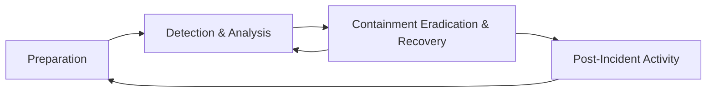

# Incident Handling Process

## Basic Terms

### Event

... is an action occuring in a system or network. Examples are:

- a user sending an email
- a mouse click
- a firewall allowing a connection request

### Incident

... is an event with a negative consequence. Once example of an incident is a system crash. Another example is unauthorized access to sensitive data. Incidents can also occur due to natural disasters, power failures.

There is no clear definition for what an IT security incident is. You can define an IT security incident as an event with a clear intent to cause harm that is performed against a computer system. Examples are:

- data theft
- funds theft
- unauthorized access to data
- installation and usage of malware and remote access tools

### Incident Handling

... is a clearly defined set of procedures to manage and respond to security incidents in a computer or network environment.

It is important to note that incident handling is not limited to intrusion incidents alone.

Other types of incidents, such as those caused by malicious insiders, availability issues, and loss of intellectual property also fall within the scope of incident handling. A comprehensive incident handling plan should address various types of incidents and provide appropriate measures to identify, contain, eradicate, and recover from them to restore normal business operations as quickly and efficiently as possible.

## Cyber Kill Chain

This cycle describes how attacks manifest themselves. Understanding this cycle will provide you with valuable insights on how far in the network an attacker is and what they may have access to during the investigation phase of an incident.

It consists of 7 stages.

### Recon

... is the initial stage, and it involves the part where an attacker chooses their target. Additionally, the attacker then performs information gathering to become more familiar with the target and gathers as much useful data as possible, which can be used in not only this stage but also in other stages of this chain. Some attackers prefer to perform passive information gathering from web sources such as LinkedIn and Instagram but also from documentation on the target organization's web pages. They can provide extremely specific information about AV tools, OS, and networking tech. Other attackers go a step further; they start poking and actively scan external web apps and IP addresses that belong to the target organization.

### Weaponize

In this stage, the malware to be used for initial access is developed and embedded into some type of exploit or deliverable payload. This malware is crafted to be extremely lightweight and undetectable by the AV and detection tools. It is likely that the attacker has gathered information to identify the present AV or EDR tech in the target organization. On a large, the sole purpose of this initial stage is to provide remote access to a compromised machine in the target environment, which also has the capability to persist through machine reboots and the ability to deploy additional tools and functionality on demand.

### Delivery

In this stage, the exploit or payload is delivered to the victim(s). Traditional approaches are phishing emails that either contain a malicious attachment or a link to a web page. The web page can be twofold: either containing an exploit or hosting the malicious payload to avoid sending it through email scanning tools. In all fairness, the page can also mimic a legit website used by the target organization in an attempt to trick the victim into entering their credentials and collect them. Some attackers call the victim on the phone with a social engineering pretext in an attempt to convince the victim to run the payload. The payload in these trust-gaining cases is hosted on an attacker-controlled web site that mimics a well-known web site to the victim. It is extremely rare to deliver a payload that requires the victim to do more than double-click an executable file or a script. Finally, there are cases where a physical interaction is utilized to deliver the payload via USB tokens and similar storage tools, that are purposely left around.

### Exploitation

This stage is the moment when an exploit or a delivered payload is triggered. During the exploitation stage of the cyber kill chain, the attacker typically attempts to execute code on the target system in order to gain access or control.

### Installation

In this stage, the initial stager is executed and is running on the compromised machine. As already discussed, the installation stage can be carried out in various ways, depending on the attacker's goals and the nature of the compromise. Some common techniques in the installation stage include:

- **Droppers**
  - Attackers may use droppers to deliver malware onto the target system. A dropper is a small piece of code that is designed to install malware on the system and execute it. The dropper my be delivered through various means, such as email attachments, malicious websites, or social engineering attacks.
- **Backdoors**
  - A backdoor is a type of malware that is designed to provide the attacker with ongoing access to the compromised system. The backdoor may be installed by the attacker during the exploitation stage or delivered through a dropper. Once installed, the backdoor can be used to execute further attacks or steal data from the compromised system.
- **Rootkits**
  - A rootkit is a type of malware that is designed to hide its presence on a compromised system. Rootkits are often used in the installation stage to evade detection by AV software and other security tools. The rootkit may be installed by the attacker during the exploitation stage or delivered through a dropper.
  
### C2

In this stage, the attacker establishes a remote access capability to the compromised machine. It is not uncommon, to use a modular initial stager that loads additional scripts on-the-fly. However, advanced groups will utilize separate tools in order to ensure that multiple variants of their malware live in a compromised network, and if one of them gets discovered and contained, they still have the means to return to the environment.

### Action

The final stage of the chain. The objective of each attack can vary. Some adversaries may go after exfiltrating confidential data, while others may want to obtain the highest level of access possible within a network to deploy ransomware.

## Incident Handling Process

### Overview

There are different stages, when responding to an incident, defined as the incident handling process. The incident handling process defines a capability for organizations to prepare, detect, and respond to malicious events.

As defined by NIST, the incident handling process consists of the following 4 distinct stages:

Incident handlers spend most of their time in the first two stages, preparation and detection & analysis. This is where you spend a lot of time improving yourself and looking for the next malicious event. When a malicious event is detected, you then move on to the next stage and respond to the event. The process is not linear, but cyclic. The main point to understand at this point is that as new evidence is discovered, the next steps may change as well. It is vital to ensure that you don't skip steps in the process and that you complete a step before moving onto the next one. For example, if you discover ten infected machines, you should certainly not proceed with containing just five of them and starting eradication while the remaining five stay in infected stage. Such an approach can be ineffective because you are notifying an attacker that you have discovered them and that you are hunting them down, which, as you could imagine, can have unpredictable consequences.

So, incident handling has two main activities, which are investigating and recovering. The investigation aims to:

- discover the initial patient zero and create an incident timeline
- determine what tools and malware the adversary used
- document the compromised systems and what the adversary has done

Following the investigation, the recovery activity involves creating and implementing a recovery plan. When the plan is implemented, the business should resume normal business operations, if the incident caused any disruptions.

When an incident is fully handled, a report is issued that details the cause of and cost of the incident. Additionally, lessons learned activities are performed, among other, to understand what the organization should do to prevent incidents of similar type from occuring again.

### Preparation Stage

In the preparation stage, you have two separate objectives. The first one is the establishment of incident handling capability within the organization. The second is the ability to protect against and prevent IT security incidents by implementing appropriate protective measures. Such measures include endpoint and server hardening, AD tiering, mulit-factor authentication, privileged access management, and so on and so forth. While protecting against incidents is not the responsibility of the incident handling team, this activity is fundamental to the overall success of that team.

#### Prerequisites

During the preparation, you need to ensure you have:

- skilled incident handling team members
- trained workforce
- clear policies and documentation
- tools

#### Clear Policies & Documentation

Some of the written policies and documentation should contain an up-to-date version of the following information:

- contact information and roles of the incident handling team members
- contact information for the legal and comliance department, management team, IT support, communications and media relations department, law enforcement, internet serive providers, facility management, and external incident response team
- incident response policy, plan, and procedures
- incident information sharing policy and procedures
- baselines of systems and networks, out of a golden image and a clean state environment
- network diagrams
- organization-wide asset management database
- user accounts with excessive privileges that can be used on-demand by the team when necessary; these user accounts are normally enabled when an incident is confirmed during the initial investigation and then disabled once it is over
- ability to acquire hardware, software, or an external resource without a complete procurement process; the last thing you need during an incident is to wait for weeks for the approval of a 500 dollar tool
- forensic/investigative cheat sheets

Some of the non-severe cases may be handled relatively quickly and without too much friction within the organization or outside of it. Other cases may require law enforcement notification and external communication to customers and third-party vendors, especially in cases of legal concerns arising from the incident. For example, a data breach involving customer data has to be reported to law enforcement within a certain time threshold in accordance with GPDR. There may be many compliance requirements depending on the location and/or branches where the incident has occurred, so the best way to understand these is to discuss them with your legal and compliance teams on a per-incident basis.

While having documentation in place is vital, it is also important to document the incident as you investigate. Therefore, during this stage you will also have to establish an effective reporting capability. Incidents can be extremely stressful, and it becomes easy to forget this part as the incident unfolds itself, especially when you are focused and going extremely fast in order to solve it as soon as possible. Try to remain calm, take notes, and ensure that these notes contain timestamps, the activity performed, the result of it, and who did it. Overall, you should seek answers to who, what, when, why, and how.

#### Tools

You need to ensure you have the right tools to perform the job. These include, but are not limited to:

- additional laptop or forensic workstation for each incident handling team member to preserve disk images and log files, perform data analysis, and investigate without any restrictions; these devices should be handled appropriately and not in a way that introduces risks to the organization
- digital forensic image acquisition and analysis tools
- memory capture and analysis tools
- live response capture and analysis
- log analysis tools
- network capture and analysis tools
- network cables and switches
- write blockers
- hard drives for forensic imaging
- power cables
- screwdrivers, tweezers, and other relevant tools to repair or disassemble hardware devices if needed
- indicator of compromise (_IOC_) creator and the ability to search for IOCs across the organization
- chain of custody forms
- encryption software
- ticket tracing system
- secure facility for storage and investigation
- incident handling system independent of your organization's infrastructure

Many of the tools mentioned above will be part of what is known as a jump bag - always ready with the necessary tools to be picked up and leave immediately. Without this prepared bag, gathering all necessary tools on the fly may take days or weeks before you are ready to respond.

>[!TIP]
> Have your documentation system completely independent from your organization's infrastructure and properly secured.

#### DMARC

... is an email protection against phishing built on top of the already existing SPF and DKIM. The idea behing DMARC is to reject emails that pretend to originate from your organization. Therefore, if an adversary is spoofing an email pretending to be an employee asking for an invoice to be paid, the system will reject the email before it reaches the intended recipient. DMARC is easy and inexpensive to implement, however, thorough testing is mandatory; otherwise, you risk blocking legitimate emails with no ability to recover them.

With email filtering rules, you may be able to take DMARC to the next level and apply additional protection against emails failing DMARC from domains you do not own. This is possible because some email systems will perform a DMARC check and include a header string whether DMARC passed or failed in the message headers. While this can be incredibly powerful to detect phishing emails from any domain, it requires extensive testing before it can be introduced in a production environment. High false-positives here are emails that are sent on behalf of via some email sending service, since they tend to fail DMARC due to domain mismatch.

#### Endpoint Hardening (& EDR)

Endpoint devices are the entry points for most of the attacks that you are facing on a daily basis. If you consider the fact that most threats will originate from the internet and will target users who are browsing websites, opening attachments, or running malicious executables, a percentage of this activity will occur from their corporate endpoints.

There are few widely recognized endpoint hardening standards by now, with CIS and Microsoft baseline being the most popular, and these should really be the building blocks for your organization's hardening baselines. Some highly important actions to note and do something about are:

- disable LLMR/NetBIOS
- implement LAPS and remove administrative privileges from regular users
- disable or configure PowerShell in "ConstrainedLanguage" mode
- enable attack surface reduction (_ASR_) rules if using Microsoft Defender
- implement whitelisting
- utilize host-based firewalls; as a bare minimum, block workstation-to-workstation communication and block outbound traffic to LOLBins
- deploy an EDR product; at this point in time, AMSI provides great visibility into obfuscated scripts for antimalware products to inspect the content before it gets executed; it is highly recommended that you only choose products that integrate with AMSI

#### Network Protection

Network segmentation is a powerful technique to avoid having a breach across the entire organization. Business-critical systems must be isolated, and connections should be allowed only as the business requires. Internal resources should really not be facing the Internet directly.

Additionally, when speaking of network protection you should consider IDS/IPS systems. Their power really shines when SSL/TLS interception is performed so that they can identify malicious traffic based on the content on the wire and not based on reputation of IP addresses, which is a traditional and very inefficient way of detecting malicious traffic.

Additionally, ensure that only organization-approved devices can get on the network. Solutions such as 802.1x can be utilized to reduce the risk of bring your own device (_BYOD_) or malicious devices connecting to the corporate network. If you are a cloud-only company using, for example, Azure/Azure AD, then you can achieve similar protection with Conditional Access policies that will allow access to organization resources only if you are connecting from a company-managed device.

#### Privilege Identity Management / MFA / Passwords

At this point in time, stealing privileged user credentials is the most common escalation path in AD environments. Additionally, a common mistake is that admin users either have a weak password or a shared password with their regular user account. For reference, a weak but complex password is "Password1!". It includes uppercase, lowercase, numerical, and special chars, but despite this, it's easily predictable and can be found in many password lists that adversaries employ in their attacks. It is recommended to teach employees to use pass phrases because they are harder to guess and difficult to brute force. An example of a password phrase that is easy to remember yet long and complex is "i LIK3 my coffeE warm". If one knows a second language, they can mix up words from multiple languages for additional protection.

Multi-factor authentication (_MFA_) is another identity-protecting solution that should be implemented at least for any type of administrative access to ALL apps and devices.

#### Vuln Scanning

Perform continuous vuln scans of your environment and remediate at least the "high" and "critical" vulns that are discovered. While the scanning can be automated, the fixes usually require manual involvement. If you can't apply patches for some reasons, definitely segment the systems that are vulnerable.

#### User Awareness Training

Training users to recognize suspicious behavior and report it when discovered is a big win for you. While it is unlikely to reach 100% success on this task, these trainings are known to significantly reduce the number of successful compromises. Periodic "surprise" testing should also be part of this training, including, for example, monthly phishing emails, dropped USB sticks in the office building etc.

#### AD Security Assessment

The best way to detect security misconfigurations or exposed critical vulnerabilities is by looking for them from the perspective of an attacker. Doing your own reviews will ensure that when an endpoint device is compromised, the attacker will not have a one-step escalation possibilty to high privileges on the network. The more additional tools and activity an attacker is generating, the higher the likelihood of you detecting them, so try to eliminate easy wins and low-hanging fruits as much as possible.

#### Purple Team Exercises

You need to train incident handlers and keep them engaged. There is no question about that, and the best place to do it is inside an organization's own environment. Purple team exercises are essentially security assessments by a red team that either continuously or eventually inform the blue team about their actions, findings, any visibility/security shortcomings, etc. Such exercises will help identifying vulns in an organization while testing the blue team's defensive capabilities in terms of logging, monitoring, detection, and responsiveness. If a threat goes unnoticed, there is a oppurtunity to improve. For those that are detected, the blue team can test any playbooks and incident handling procedures to ensure they are robust and the expected result has been achieved.

### Detection & Analysis Stage

The detection & analysis phase involves all aspects of detecting an incident, such as utilizing sensors, logs, and trained personnel. It also includes information and knowledge sharing, as well as utilizing context-based threat intelligence. Segmentation of the architecture and having a clear understanding of and visibility within the network are also important factors.

Threats are introduced to the organization via an infinite amount of attack vectors, and their detection can come from sources such as:

- an employee that notices abnormal behavior
- an alert from one of your tools
- threat hunting activities
- a third-party notification informing you that they discovered signs of your organization being compromised

It is highly recommended to create levels of detection by logically categorizing your network as follows:

- detection at the network perimeter
- detection at the internal network level
- detection at the endpoint level
- detection at the application level

#### Initial Investigation

When a security incident is detected, you should conduct some initial investigation and establish context before assembling the team and calling an organization-wide incident response. Think about how information is presented in the event of an administrative account connecting to an IP address at HH:MM:SS. Without knowing what system is on that IP address and which time zone the time refers to, you may easily jump to a wrong conclusion about what this event is about. To sum up, you should aim to collect as much information as possible at this stage about the following:

- Date/time when the incident was reported? Additionally, who detected the incident and/or who reported it.
- How was the incident detected?
- What was the incident? Phishing? System unavailability?
- Assemble a list of impacted systems
- Document who accessed the impacted systems and what actions have been taken. Make a note of whether this is an ongoing incident or the suspicious activity has been stopped
- Physical location, OS, IP addresses and hostnames, system owner, system's purpose, current state of the system
- List of IP addresses, time and date of detection, type of malware, systems impacted, export of malicious files with forensic information on them

With that information at hand, you can make decisions based on the knowledge you have gathered. What does this mean? You would likely take different actions if you knew that the CEO's laptop was compromised as opposed to an intern's one.

With the initially gathered information, you can start building an incident timeline. This timeline will keep you organized throughout the event and provide an overall picture of what happened. The events in the timeline are time-sorted based on when they occurred. Note that during the investigative process later on, you will not necessarily uncover evidence in this time-sorted order. However, when you sort the evidence based on when it occurred, you will get context from the separate events that took place. The timeline can also shed some light on whether newly discovered evidence is part of the current incident. For example, imagine that what you though was the initial payload of an attacker was later discovered to be present on another device two weeks ago. You will encounter situations where the data you are looking at is extremely relevant and situations where the data is unrelated and you are looking in the wrong place. Overall, the timeline should contain the information described below:

- date
- time of the event
- hostname
- event description
- data source
  
As you can infer, the timeline focuses primarily on attacker behavior, so activities that are recorded depict when the attack occurred, when a network connection was established to access a system, when files were downloaded, etc. It is important to ensure that you capture from where the activity was detected/discovered and the systems associated with it.

#### Incident Severity & Extent Questions

When handling a security incident, you should always try to answer the following questions to get an idea of the incident's severity and extent:

- What is the exploitation impact?
- What are the exploitation requirements?
- Can any business-critical systems be affected by the incident?
- Are there any suggested remediation steps?
- How many systems have been impacted?
- Is the exploit being used in the wild?
- Does the exploit have any worm-like capabilities?

The last two can possibly indicate the level of sophistication of an adversary.

As you can imagine, high-impact incidents will be handled promptly, and incidents with a high number of impacted systems will have to be escalated.

#### Incident Confidentiality & Communication

Incidents are very confidential topics as such, all of the information gathered should be kept on a need-to-know basis, unless applicable laws or management decisions instruct you otherwise. There are multiple reasons for this. The adversary may be for example, an employee of the company, or if a breach has occurred, the communication to internal and external parties should be handled by the appointed persin in accordance with the legal department.

When an investigation is launched, you will set some expectations and goals. These often include the type of incident that occurred, the sources of evidence that you have available, and a rough estimation of how much time the team needs for the investigation. Also, based on the incident, you will set expectations on whether you will be able to uncover the adversary or not. Of course, a lot of the above may change as the investigation evolves and new leads are discovered. It is important to keep everyone involved and the management informed about any advancements and expectations.

#### The Investigation

The investigation starts based on the initially gathered information that contain what you know about the incident so far. With this initial data, you will begin a 3-step cyclic process that will iterate over and over again as the investigation evolves. This process includes:

- creation and usage of indicators of compromise (_IOC_)
- identification of new leads and impacted systems
- data collection and analysis from the new leads and impacted systems

#### Initial Investigation Data

In order to reach a conclusion, an investigation should be based on valid leads that have been discovered not only during this initial phase but throughout the entire investigation process. The incident handling team should bring up new leads constantly and not go solely after a specific finding, such as a known malicious tool. Narrowing an investigation down to a specific activity often results in limited findings, premature conclusions, and an incomplete understanding of the overall impact.

#### Creation & Usage of IOCs

An indicator of compromise is a sign that an incident has occurred. IOCs are documented in a structured manner, which represents the artifacts of the compromise. Examples of IOCs can be IP addresses, hash values of files, and file names. In fact, because IOCs are so important to an investigation, special languages such as OpenIOC have been developed to document them and share them in a standard manner. Another widely used standard for IOCs is Yara. There are a number of free tools that can be utilized, such as Mandiant's IOC editor, to create or edit IOCs. Using these languages, you can describe and use the artifacts that you uncover during an incident investigation. You may even obtain IOCs from third parties if the adversary or the attack is known.

To leverage IOCs, you will have to deploy an IOC-obtaining/IOC-searching tool. A common approach is to utilize WMI or PowerShell for IOC-related operations in Windows environments. A word of caution! During an investigation, you have to be extra careful to prevent the credentials of your highly privileged user(s) from being cached when connecting to (potentially) compromised systems. More specifically, you need to ensure that only connection protocols and tools that don't cache credentials upon a successful login are utilized. Windows logons with logon type 3 typically don't cache credentials on the remote systems. The best example of "know your tools" that comes to mind is "PsExec". When "PsExec" is used with explicit credentials, those credentials are cached on the remote machine. When "PsExec" is used without credentials through the session of the currently logged on user, the credentials are not cached on the remote machine.

#### Identification of New Leads & Impacted Systems

After searching for IOCs, you expect to have some hits that reveal other systems with the same signs of compromise. These hits may not be directly associated with the incident you are investigating. Your IOC could be, for example, too generic. You need to identify and eliminate false positives. You may also end up in a position where you come across a large number of hits. In this case, you should prioritize the ones you will focus on, ideally those that can provide you with new leads after a potential forensic analysis.

#### Data Collection & Analysis from the new Leads & Impacted Systems

Once you have identified system that include your IOCs, you will want to collect and preserve the state of those systems for further analysis in order to uncover new leads and/or answer investigative questions about the incident. Depending on the system, there are multiple approaches to how and what data to collect. Sometimes you want to perform a "live response" on a system as it is running, while in other cases you may want to shut down a system and then perform any analysis on it. Live response is the most common approach, where you collect a predefined set of data that is usually rich in artifacts that may explain what happened to a system. Shutting down a system is not an easy decision when it comes to preserving valuable information, because, in many cases, much of the artifacts will only live within the RAM memory of the machine, which will be lost if the machine is turned off. Regardless of the collection approach you choose, it is vital to ensure that minimal interaction with the system occurs to avoid altering any evidence or artifacts.

Once the data has been collected, it is time to analyze it. This is often the most time-consuming process during an incident. Malware analysis and disk forensics are the most common examination types. Any newly discovered and validated leads are added to the timeline, which is constantly updated. Also note that memory forensics is a capability that is becoming more popular and extremely relevant when dealing with advanced attacks.

Keep in mind that during the data collection process, you should keep track of the chain of custody to ensure that the examined data is court-admissible if legal action is to be taken against an adversary.

### Containment, Eradication, & Recovery Stage

When the investigation is complete and you have understood the type of incident and the impact on the business, it is time to enter the containment stage to prevent the incident from causing more damage.

#### Containment

In this stage, you take action to prevent the spread of the incident. You divide the actions into short-term containment and long-term containment. It is important that containment actions are coordinated and executed across all systems simultaneously. Otherwise, you risk notifying attackers that you after them, in which case they might change their techniques and tools in order to persist in the environment.

In short-term containment, the actions taken leave a minimal footprint on the systems on which they occur. Some of these actions can include, placing a system in e separate/isolated VLAN, pulling the network cable out of the system(s) or modifying the attacker's C2 DNS name to a system under your control or to a non-existing one. The actions here contain the damage and provide time to develop a more concrete remediation strategy. Additionally, since you keep the systems unaltered, you have the oppurtunity to take forensic images and preserve eivdence if this wasn't already done during the investigation. If a short-term containment action requires shutting down a system, you have to ensure that this is communicated to the business and appropriate permissions are granted.

In long-term containment actions, you focus on persistent actions and changes. These can include changing user passwords, applying firewall rules, inserting a host intrusion detection system, applying a system patch, and shutting down systems. While doing these activities, you should keep the business and the relevant stakeholders updated. Bear in mind that just because a system is now patched does not mean that the incident is over. Eradication, recovery, and post-incident activities are still pending.

#### Eradication

Once the incident is contained, eradication is necessary to eliminate both the root cause of the incident and what is left of it to ensure that the adversary is out of the systems and network. Some of the activities in this stage include removing the detected malware from systems, rebuilding some systems, and restoring others from backup. During the eradication stage, you may extend the previously performed containment activities by applying additional patches, which were not immediately required. Additional system-hardening activities are often performed during the eradication stage.

#### Recovery

In the recovery stage, you bring systems back to normal operation. Of course, the business needs to verify that a system is in fact working as expected and that it contains all the necessary data. When everything is verified, these systems are brought into the production environment. All restored systems will be subject to heavy logging and monitoring after an incident, as compromised systems tend to be targets again if the adversary regains access to the environment in a short period of time. Typical suspicious events to monitor are:

- unusual logons
- unusual processes
- changes to the registry

The recovery stage in some large incidents may take months, since it is often approached in phases. During the early phases, the focus is on increasing overall security to prevent future incidents through quick wins and the elimation of low-hanging fruits. The later phases focus on permanent, long-term changes to keep the organization as secure as possible.

### Post-Incident Stage

In this stage, your objective is to document the incident and improve your capabilities based on lessons learned from it. This stage gives you an oppurtunity to reflect on the threat by understanding what occurred, what you did, and how your actions and activities worked out. This information is best gathered and analyzed in a meeting with all stakeholders that were involved during the incident. It generally takes place within a few days after the incident, when the incident report has been finalized.

#### Reporting

The final report is a crucial part of the entire process. A complete report will contain answers to questions such as:

- What happened and when?
- Performance of the team dealing with the incident in regard to plans, playbooks, policies and procedures
- Did the business provide the necessary information and respond promptly to aid in handling the incident in an efficient manner? What can be improved?
- What actions have been implemented to contain and eridicate the incident?
- What preventive measures should be put in place to prevent similar incidents in the future?
- What tools and resources are needed to detect and analyze similar incidents in the future?

Such reports can eventually provide you with measurable results. For example, they can provide you with knowledge around how many incidents have been handled, how much time the team spends per incident, and the different actions that were performed during the handling process. Additionally, incident reports also provide a reference for handling future events of similar nature. In situations where legal action is to be taken, an incident report will also be used in court and as a source for identifying the costs and impact of incidents.