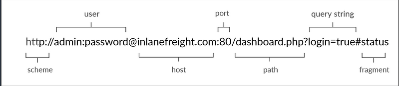
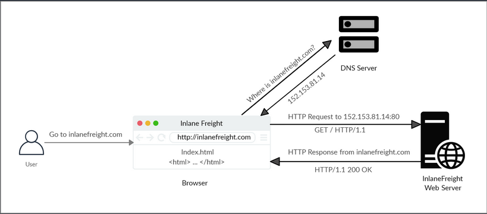
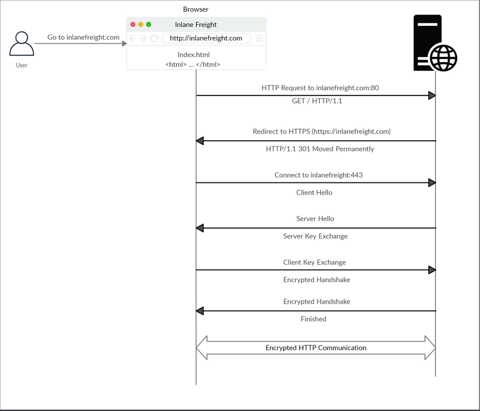

- [HyperText Transfer Protocol (HTTP)](#hypertext-transfer-protocol-http)
  - [Uniform Resource Locator (URL)](#uniform-resource-locator-url)
  - [HTTP Flow](#http-flow)
  - [cURL](#curl)
- [HyperText Transfer Protocol Secure (HTTPs)](#hypertext-transfer-protocol-secure-https)
  - [HTTPs Flow](#https-flow)
  - [cURL with HTTPs](#curl-with-https)

---

# HyperText Transfer Protocol (HTTP)

_Most internet communications are made with web requests through the HTTP protocol. HTTP is an application-level protocol used to access the World Wide Web resources. The term 'hypertext' stands for text containing links to other resources and text that the readers can easily interpret.<br> HTTP communication consists of a client and a server, where the client requests the server for a resource. the server processes the requests and returns the requested resource. The default port for HTTP communication is port 80, though this can be changed to any other port, depending on the web server configuration._

## Uniform Resource Locator (URL)



| Structure-Element | Example | Description |
| ------ | ------ | ------ |
| **Schema** | _http://<br>https://_ | is used to identify the protocol being accessed by the client |
| **User Info** | _admin:password@_ | optional component that contains the credentials used to authenticate to the host, and is separated from the host with an '@' sign |
| **Host** | _inlanefreight.com_ | signifies the resource location<br>can be hostname or IP address |
| **Port** | _:80_ | is separated from the host by a colon<br>if no port is specified, http schemes default to port 80 and https to port 443 |
| **Path** | _/dashboard.php_ | points to the resource being accessed, which can be a file or a folder<br>if there is no path specified, the server returns the default index |
| **Query String** | _?login=true_ | starts with a question mark, and consists of a parameter and a value<br>multiple parameters can be separated by an ampersand |
| **Fragments** | _#status_ | are proccessed by the browser on the client-side to locate sections within the primary resource |

## HTTP Flow



## cURL

_cURL is a command-line tool and library that primarily supports HTTP along with many other protocols. -> Good candidate for scripts as well as automation, making it essential for sending various types of web requests from the command line._

Example:
```bash
d41y@htb[/htb]$ curl inlanefreight.com

<!DOCTYPE HTML PUBLIC "-//IETF//DTD HTML 2.0//EN">
<html><head>
...SNIP...
```


# HyperText Transfer Protocol Secure (HTTPs)

_One significant drawback of HTTP is that all data is transferred in clear-text. This means that anyone between the source and destination can perform a Man-in-the-Middle (MiTM) attack to view the transferred data.<br>To counter the issue, the HTTPs was created, in which all communications are transferred in an encrypted format, so even if a third party does intercept the request, they would not be able to extract the data out of it._

## HTTPs Flow



## cURL with HTTPs

cURL should automatically handle all the HTTPs communication standards and perform a secure handshake and then encrypt and decrypt the data automatically. However, if you contact a website with an invalid SSL certificate or an outdated one, then cURL by default would not proceed with the communication to protect against MiTM attacks.<br>To ignore certificate checks, you can set ```-k```.

```bash
d41y@htb[/htb]$ curl https://inlanefreight.com

curl: (60) SSL certificate problem: Invalid certificate chain
More details here: https://curl.haxx.se/docs/sslcerts.html
...SNIP...

d41y@htb[/htb]$ curl -k https://inlanefreight.com

<!DOCTYPE HTML PUBLIC "-//IETF//DTD HTML 2.0//EN">
<html><head>
...SNIP...
```

