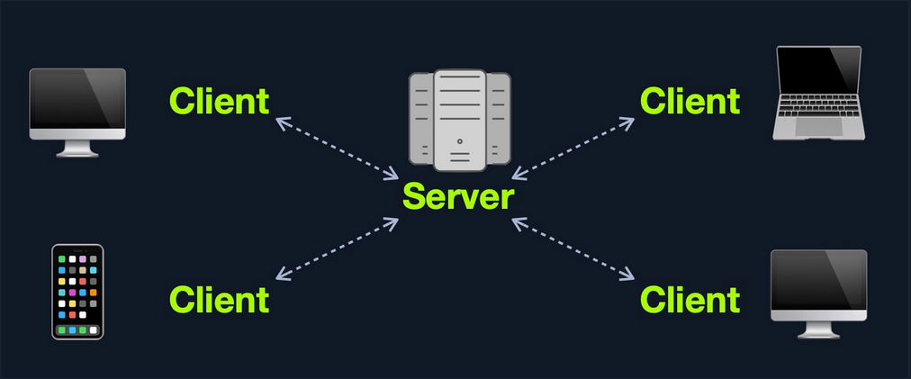
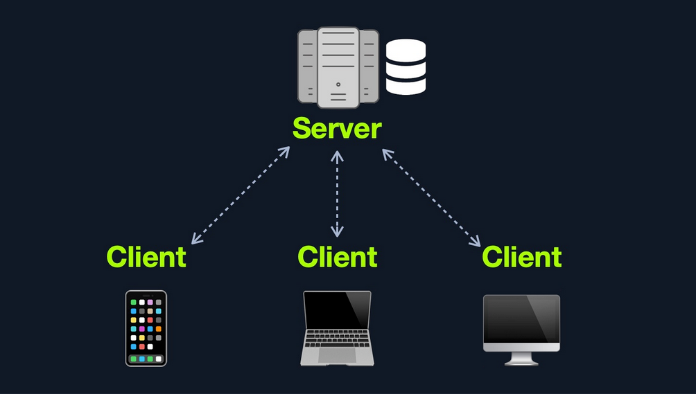
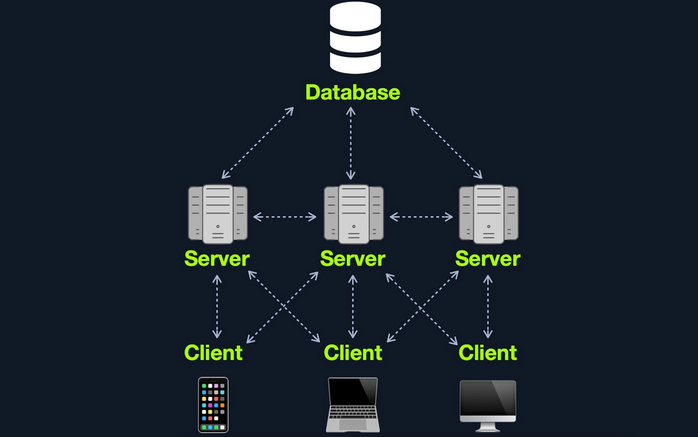
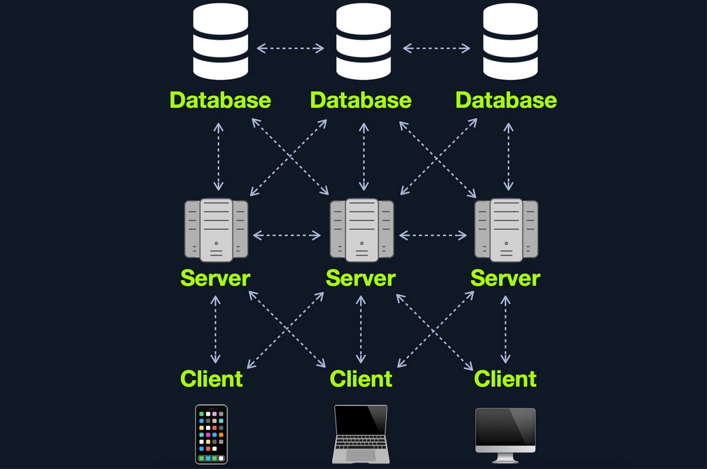

- [Web Applications](#web-applications)
  - [Web Apps vs. Websites](#web-apps-vs-websites)
- [Web App Layout](#web-app-layout)
  - [Web Application Infrastructure](#web-application-infrastructure)
    - [Client-Server](#client-server)
    - [One Server](#one-server)
    - [Many Servers - One Database](#many-servers---one-database)
    - [Many Servers - Many Databases](#many-servers---many-databases)
  - [Web Application Components](#web-application-components)
  - [Web Application Architecture](#web-application-architecture)
- [Front End Components](#front-end-components)
  - [HyperText Markup Language (HTML)](#hypertext-markup-language-html)
  - [Cascading Style Sheets (CSS)](#cascading-style-sheets-css)
- [Front End Vulns](#front-end-vulns)
- [Back End Components](#back-end-components)
- [Back End Vulns](#back-end-vulns)

---

# Web Applications

... are interactive applications that run on webservers. Web applications usually adopt a client-server architecture to run and handle interactions. They typically have front end components that run on the client-side and other back end components that run on the server-side.

## Web Apps vs. Websites

Traditional webistes were statically created to represent specific information, and this information would not change with our interactions (_also known as Web 1.0_).

Most websites run web applications (_Web 2.0_) presenting dynamic content based on user interaction. Another significant difference is that web aaplications are fully functional and can perform various functionalities for the end-user, while websites lack this type of functionality.

# Web App Layout

... consists of:

- **Web Application Infrastructure**
  - describes the structure of required components, such as the database, needed for the web application to function as intended
- **Web Application Components**
  - the components that make up a web application represent all the components that the web application interacts with; divide into:
    - UI/UX
    - Client
    - Server
- **Web Application Architecture**
  - Architecture comprises all the relationships between the various web application components

## Web Application Infrastructure

### Client-Server

A server hosts the web app in a client-server model and distributes it to any clients to access it. In this model, web applications have two types of components, those in the front end, which are usually interpreted and executed on the client-side, and components in the back end, usually compiled, interpreted, and executed by the hosting server.



### One Server

If any web application hosted on this server is compromised in this architecture, then all web applications' data will be compromised. This design represents an "all eggs in one basket" approach since any of the hosted web applications are vulnerable, the entire webserver becomes vulnerable.



### Many Servers - One Database

This model separates the database onto its own database server and allows the applications' hosting server to access the database server to store and retrieve data. It can be seen as many-servers to one-database and one-server to one-database, as long as the database is separated on its own database server. 



### Many Servers - Many Databases

This model builds upon the Many Servers, One Database model. However, within the database server, each web application's data is hosted in a separate database. The web application can only access private data and only common data that is shared across the web applications. It is also possible to host each web application's database on its separate database server.



## Web Application Components

1. Client
2. Server
   - Webserver
   - Web Application Logic
   - Database
3. Services
   - 3rd Party Integration
   - Web Application Integrations
4. Functions (_Serverless_) 

## Web Application Architecture

The components of a web application are divided into three different layers:

| Layer | Description |
| ----- | ----------- |
| **Presentation Layer** | consists of UI process components that enable communication with the application and the system<br>can be accessed by the client via the web brwoser and are returned in the form of HTML,JavaScript, and CSS |
| **Application Layer** | ensures that all client requests are correctly processed<br>various criteria are checked, such as authorization, privileges, and data passed on to the client |
| **Data Layer** | works closely with the application layer to determine exactly where the required data is stored and can be accessed |

# Front End Components

## HyperText Markup Language (HTML)

... is at the very core of any web page we see on the internet. It contains each page's basic elements, including titles, forms, images, and many other elements. The web browser, in turn, interprets these elements and displays them to the end-user.

An important concept to learn in HTML is URL encoding, or percent-encoding. For a browser to properly display a page's contents, it has to know the charset in use. In URLs, for example, browsers can only use ASCII encoding, which only allows alphanumerical characters and certain special characters. Therefore, all other characters outside of the ASCII character-set have to be encoded within a URL. URL encoding replaces unsafe ASCII characters with a ```%``` symbol followed by two hexadecimal digits.

Example:

| Character | Encoding |
| --------- | -------- |
| **space** | %20 |
|**!** | %21 |
|**"** | %22 |
|**#** | %23 |
|**$** | %24 |
|**%** | %25 |
|**&** | %26 |
|**'** | %27 |
|**(** | %28 |
|**)** | %29 |

## Cascading Style Sheets (CSS)

... is the stylesheet language used alongside HTML to format and set the style of HTML elements. Like HTML, there are several versions of CSS, and each subsequent version introduces a new set of capabilities that can be used for formatting HTML elements. Browsers are updated alongside it to support these new features.

# Front End Vulns

# Back End Components

# Back End Vulns