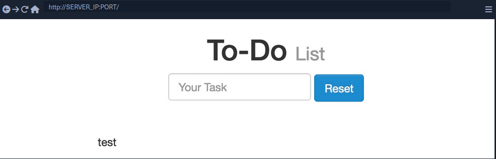
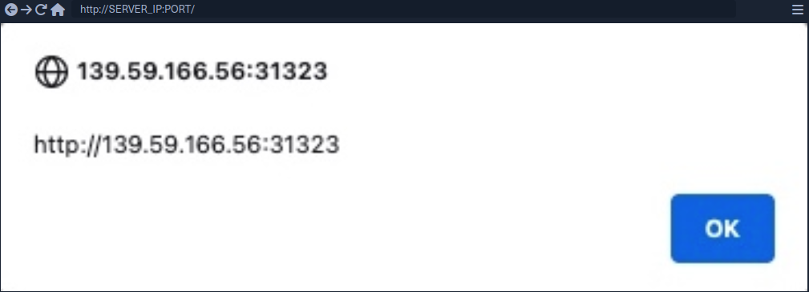
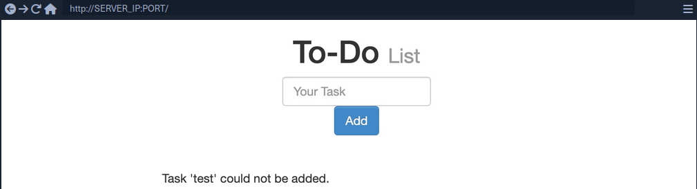
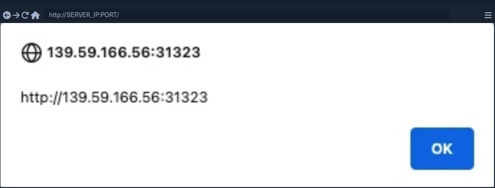
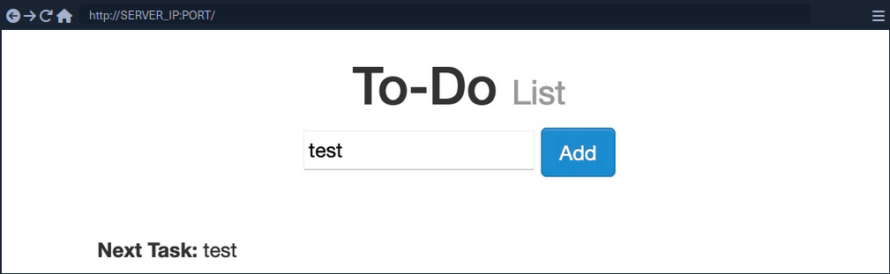
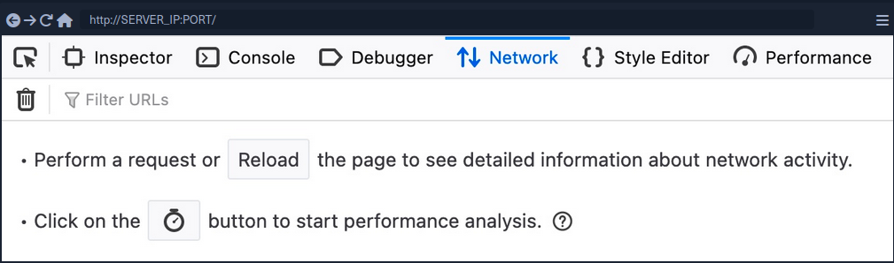

- [Cross-Site Scripting (XSS)](#cross-site-scripting-xss)
  - [Stored XSS](#stored-xss)
  - [Reflected XSS](#reflected-xss)
  - [DOM XSS](#dom-xss)
    - [Source and Sink](#source-and-sink)
    - [DOM attacks](#dom-attacks)
  - [XSS Discovery](#xss-discovery)
    - [Automated Discovery](#automated-discovery)
      - [XSS Strike example:](#xss-strike-example)
    - [Manual Discovery](#manual-discovery)
    - [Code Review](#code-review)
  - [XSS Attacks](#xss-attacks)
    - [Defacing](#defacing)
    - [Phishing](#phishing)
    - [Session Hijacking](#session-hijacking)
  - [XSS Prevention](#xss-prevention)

---

# Cross-Site Scripting (XSS)

A typical web app works by receiving the HTML code from the back-end server and rendering it on the client-side internet browser. When a vulnerable web app does not properly sanitize user input, a malicious user can inject extra JavaScript code in an input field, so once another user views the same page, they unknowingly execute the malicious JavaScript code.

XSS vulns are solely executed on the client-side and hence do not directly affect the back-end server. They can only affect the user executing the vulnerability. The direct impact of XSS vulns on the back-end server may be relatively low, but they are very commonly found in web apps.

As XSS attacks execute JavaScript code within the browser, they are limited to the browser's JS engine. They cannot execute system-wide JavaScript code to do something like system-level code execution. In modern browsers, they are also limited to the same domain of the vulnerable website.

The three main types are:

| Type | Description |
| ---- | ----------- |
| **Stored (Persistent) XSS** | most critical type of XSS, which occurs when user input is stored on the back-end database and then displayed upon retrieval |
| **Reflected (Non-persistent) XSS** | occurs when user input is displayed on the page after being processed by the back-end server, but without being stored |
| **DOM-based XSS** | another non-persistent XSS type that occurs when user input is directly shown in the browser and is completely processed on the client-side, without reaching the back-end server |

## Stored XSS

If your XSS payload gets stored in the back-end database and retrieved upon visiting the page, this means that your XSS attack is persistent and may affect any user that visists the page.

Example:



1. Inserting the following XSS payload:

```html
<script>alert(window.origin)</script>
```

2. Execution



3. Taking a look at the page source, you can see the payload you just executed

```html
<div></div><ul class="list-unstyled" id="todo"><ul><script>alert(window.origin)</script>
</ul></ul>
```

> [!NOTE]
> As some modern browsers may block the ```alert()``` JavaScript function in specific locations, it may be handy to know a few other basic XSS payloads to verify the existence of XSS.

>[!TIP]
> ```<plaintext>``` <br>
> It will stop rendering the HTML code that comes after it and displays it as plaintext <br><br>
> ```<script>print()</script>``` <br>
> It will pop up the browser print dialog

## Reflected XSS

... vulns occur when your input reaches the back-end server and gets returned to you without being filtered or sanitized. There are many cases in which your entire input might get returned to you, like error messages or confirmation messages. In these cases, you may attempt using XSS payloads to see whether they execute. However, as these are usually temporary messages, once you move from the page, they would not execute again, and hence they are non-persistent.

Example:



1. As you can see, you get a ```Task 'test' could not be added.```, which includes your input ```test``` as part of the error message.
2. Try XSS payload


3. ```Add``` leads to the alert pop-up and you will see ```Task '' could not be added.``` because the payload is wrapped inside script-tags and doesn't get rendered



> [!NOTE]
> If the XSS vulnerability is non-persistent and it's within a GET request, you can target a user by sending them a URL containing the payload, since GET requests send their parameters as part of the URL.<br>
> For this example, the URL might look like this: <br>
> ```http://SERVER_IP:PORT/index.php?task=<script>alert(window.origin)</script>```

## DOM XSS

While reflected XSS sends the input data to the back-end server through HTTP requests, DOM XSS is completely processed on the client-side through JavaScript. DOM XSS occurs when JavaScript is used to change the source through the **Document Object Model (DOM)**.



1. Taking a look at the network tab in firefox developer tools and re-adding ```test```, you'll notice that no HTTP request is being made



2. The input paramter in the URL is using a ```#``` for the item added, which means that this is a client-side parameter that is completely processed on the browser (_fragment identifier_)
3. Taking a look at the page source, you will notice that ```test``` is nowhere to be found
   - JavaScript code is updating the page when you click the ```Add``` button, which is after the page source is retrieved by your browser, hence the base page source will not show your input, and if you refresh the page, it will not be retained
4. You can still view the rendered page source with the Web Inspector tool

> [!NOTE]
> The page source shows the original HTML code sent by the server to the browser, without any dynamic changes made by JavaScript. In the Web Inspector, you can see the current DOM structure, which has been modified after the page loads through JavaScript or interactions, including all dynamic content and adjustments. The Web Inspector is useful for viewing how the page is changed in real-time.

### Source and Sink

|   |   |
| - | - |
| **Source** | is the JavaScript object that takes the user input, and it can be any input parameter like a URL parameter or an input field |
| **Sink** | is the function that writes the user input to a DOM object on the page |

If the ```Sink``` function does not properly sanitize the user input, it would be vulnerable to an XSS attack. Some commonly used JavaScript functions to write DOM objects are:

- ```document.write()```
- ```DOM.innerHTML```
- ```DOM.outerHTML```

Example:

The following source code will take the source from the ```task=``` parameter:

```javascript
var pos = document.URL.indexOf("task=");
var task = document.URL.substring(pos + 5, document.URL.length);
```

Right below these lines, you see that the page uses the ```innterHTML``` function to write the ```task``` variable in the ```todo``` DOM:

```javascript
document.getElementById("todo").innerHTML = "<b>Next Task:</b> " + decodeURIComponent(task);
```

This page should be vulnerable to DOM XSS.

### DOM attacks

The previous example will not execute, when using the ```alert()``` payload. This is because the ```innerHTML``` function does not allow the use of ```<script>``` tags within it as a security feature. But there are workarounds.

Example:

```html

```

The above line creates a new HTML image object, which has a ```onerror``` attribute that can execute JavaScript code when the image is not found. If you provide an empty image link (""), the code should always get executed without having to use ```<script>``` tags.

> [!NOTE]
> To target a user with this DOM XSS vuln, you can copy the URL from the browser and shre it with them, and once they visit it, the JavaScript code should execute.

## XSS Discovery

In web application vulnerabilities, detecting them can become as difficult as exploiting them. Fortunately, there are lots of tools that can help you in detecting and identifying XSS.

### Automated Discovery

Some tools are:

- [XSS Strike](https://github.com/s0md3v/XSStrike)
- [Brute XSS](https://github.com/rajeshmajumdar/BruteXSS)
- [XSSer](https://github.com/epsylon/xsser)

#### XSS Strike example:

```bash
d41y@htb[/htb]$ python xsstrike.py -u "http://SERVER_IP:PORT/index.php?task=test" 

        XSStrike v3.1.4

[~] Checking for DOM vulnerabilities 
[+] WAF Status: Offline 
[!] Testing parameter: task 
[!] Reflections found: 1 
[~] Analysing reflections 
[~] Generating payloads 
[!] Payloads generated: 3072 
------------------------------------------------------------
[+] Payload: <HtMl%09onPoIntERENTER+=+confirm()> 
[!] Efficiency: 100 
[!] Confidence: 10 
[?] Would you like to continue scanning? [y/N]
```

### Manual Discovery

The most basic method of looking for XSS vulnerabilities is manually testing various XSS payloads against an input field in a given web page.

Payload lists are:

- [PayloadAllTheThings](https://github.com/swisskyrepo/PayloadsAllTheThings/blob/master/XSS%20Injection/README.md)
- [PayloadBox](https://github.com/payloadbox/xss-payload-list)

You can begin testing these payloads one by one by copying each one and adding it in your form, and seeing whether an alert box pops up.

### Code Review

... is the most reliable method of detecting XSS vulnerabilities. If you understand precisely how your input is being handled all the way until it reaches the web browser, you can write a custom payload that should work with high confidence.

## XSS Attacks

### Defacing

### Phishing

### Session Hijacking

## XSS Prevention